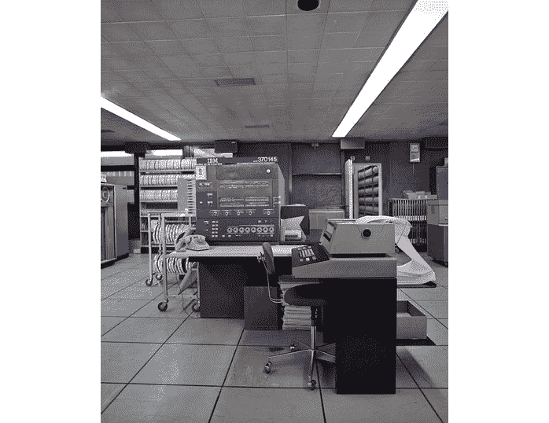
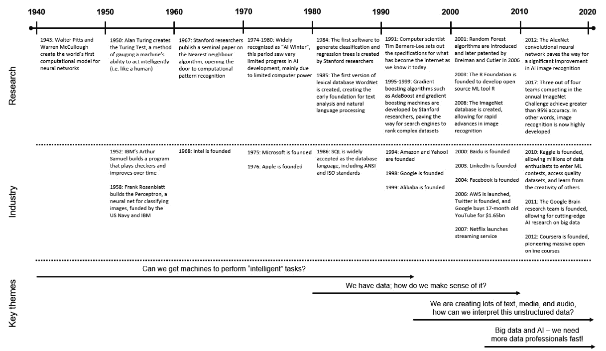
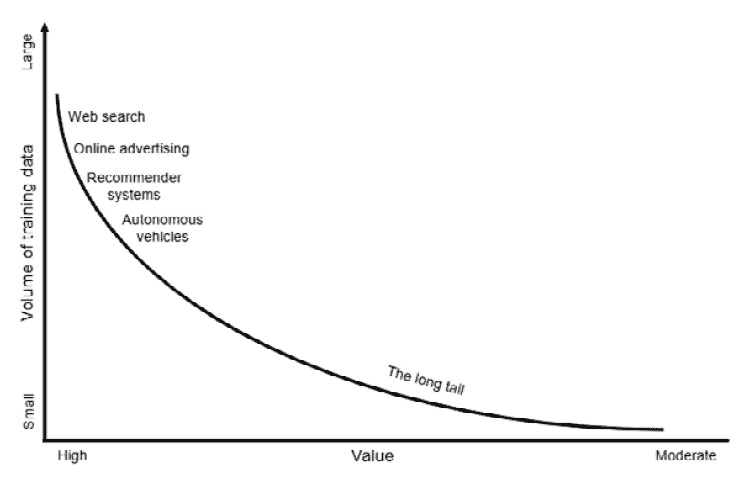
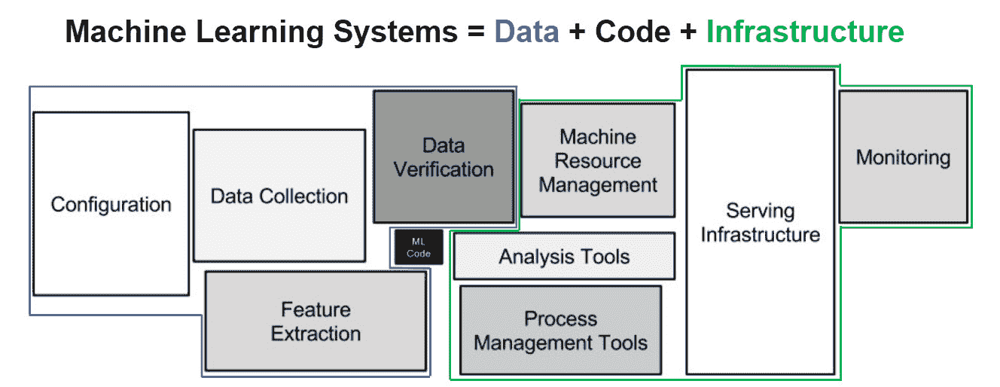

# 2

# 从模型为中心到数据为中心——机器学习的演变

到现在为止，你可能已经在想：如果数据中心性对于人工智能和机器学习的进一步发展至关重要，那么为什么模型中心性是主导方法？

这是一个非常相关的问题，我们将在本章中回答。为了了解转向数据中心方法需要什么，我们必须了解导致模型中心性成为主导方法的力量，以及如何克服它们。

我们将首先探讨为什么人工智能和机器学习的演变主要遵循以模型为中心的方法，然后深入探讨通过数据中心性可以解锁的巨大机会。

在本章中，我们将挑战机器学习需要大数据集以及更多数据总是更好的观念。当我们从“更大数据”转向“更好数据”时，会出现一系列小数据机器学习用例的长尾。

到本章结束时，你将清楚地了解机器学习至今的发展历程，并知道如何在此基础上构建并使用机器学习取得更好的成果。

在本章中，我们将涵盖以下主要主题：

+   探讨为什么机器学习的发展最终变成了以模型为中心

+   小数据机器学习的机会

+   为什么我们比以往任何时候都需要以数据为中心的机器学习

# 探讨为什么机器学习的发展最终变成了以模型为中心

为了真正理解为什么以数据为中心的方法是释放机器学习（ML）全部潜力的关键，我们需要上一堂简短的历史课。

数据科学和机器学习领域自从最早尝试让电子计算机表现出“智能”行为以来，已经取得了显著的进步。今天大多数智能手机所执行的“智能”任务，在 21 世纪初几乎无法想象。此外，我们每天产生的数据量比从人类文明开始到 21 世纪所创造的数据量还要多——而且我们以每年约 23%的增长率在这样做。

尽管在技术和数据量方面取得了这些令人难以置信的进步，但数据科学的一些元素非常古老。统计学和数据分析已经使用了几个世纪，而今天机器学习模型的数学组成部分大多是在数字计算机出现之前开发的。

就我们的目的而言，机器学习和人工智能的历史始于第二次世界大战期间首次电子计算机的引入。

## 1940 年代至 1970 年代——早期阶段

历史学家和前美国陆军军官 Adrian R. Lewis 在他的书《美国的战争文化》中写道：“战争创造了技术巨大进步的条件……如果没有战争，人们不会在几小时内穿越海洋，在太空中旅行，或者用微波炉爆米花 2。”

这确实是在第二次世界大战期间，以及随后的几十年里。计算机科学、密码学和硬件技术取得了巨大的飞跃，因为世界各地的战斗国家在全球各个战线上相互竞争以获得主导地位。

在 20 世纪 40 年代和 50 年代，编译器、半导体晶体管、集成电路和计算机芯片等创新使得数字电子计算机能够执行更复杂的过程（在此之前，*计算机*主要是指那些被雇佣来执行复杂计算的计算天赋异禀的人类的工作职位 3）。这反过来又导致了今天机器学习模型的一些早期创新。

在 1943 年，美国科学家沃尔特·皮茨和沃伦·麦克库洛赫创造了世界上第一个神经网络计算模型。这为人工智能的其他创新奠定了基础，包括 1952 年亚瑟·塞缪尔的自改进国际象棋程序和由美国海军和 IBM 资助的 1958 年的**感知器**，这是一个用于图像分类的神经网络。

在 1950 年，英国数学家和计算机科学家艾伦·图灵提出了用于评估计算机执行与人类相当智能操作的*图灵测试*。这个测试常被用作衡量计算机*智能*的基准，并对人工智能的一般哲学产生了深远的影响。

机器学习研究在 20 世纪 60 年代继续扩展，其中最近邻算法的发展是最显著的进步之一。斯坦福研究人员托马斯·科弗和彼得·哈特的工作为 k-最近邻算法作为一种强大的统计分类方法的出现奠定了基础 4。

在 1965 年，Fairchild 半导体和 Intel 的联合创始人戈登·摩尔提出了一个观点，即计算机的处理能力和硬盘存储容量每两年会翻一番，这也被称为*摩尔定律*5。尽管摩尔定律被证明是相当准确的，但要达到一个可以以合理速度和成本处理大量数据的地步，还需要许多十年。

为了更清楚地说明问题，IBM 在 1970 年的主要产品是 System/370 Model 145，它有 500 KB 的 RAM 和 233 MB 的硬盘空间 6。这台计算机占据了整整一个房间，成本为 705,775 美元到 1,783,000 美元 7，约合今天的 5 到 13 百万美元。在撰写本文时，最新的 iPhone 14 的 RAM 是 System/370 Model 145 的 12,000 倍，硬盘空间高达 2,200 倍，具体取决于 iPhone 的配置 8。

图 2.1 – IBM System/370 Model 145\. 这张图片中的所有东西都是计算机操作的一部分（除了墙上的时钟）。来源：Jean Weber/INRA, DIST

20 世纪 70 年代的大部分时间被广泛认为是“人工智能寒冬”的时期——在这个时期，人工智能领域几乎没有突破性的研究或发展。商业界对人工智能的短期潜力看得很低，主要是因为计算机处理能力和数据存储容量尚未充分发展，且成本高昂。

## 1980 年代到 1990 年代——个人电脑和互联网的兴起

1982 年，IBM 推出了第一台个人电脑（IBM PC），这引发了工作场所和人们家庭中计算机技术的革命。它还导致了苹果、微软、惠普、英特尔和其他许多硬件和软件企业如流星般崛起，这些企业乘上了技术创新的浪潮。

处理和信息的数字化能力的提高也加剧了企业界对使用存储数据进行分析目的的兴趣。关系型数据库成为主流，以牺牲网络和层次数据库模型为代价。

SQL 查询语言在 20 世纪 70 年代开发；在整个 80 年代，它成为主要的数据库语言，并在 1986 年获得了 ISO 和 ANSI 认证。

数字信息的爆炸性增长需要新的技术来从统计角度理解数据。斯坦福大学的研究人员在 1984 年开发了第一个生成分类和回归树的软件，而像 WordNet 这样的词汇数据库创新为文本分析和自然语言处理奠定了早期基础。

个人电脑继续在 20 世纪 90 年代取代打字机和大型机，这促使万维网在 1991 年形成。网站、博客、互联网论坛、电子邮件、即时消息和 VoIP 电话又引发了数据量、种类和速度的另一次爆炸性增长。

因此，新的方法逐渐发展起来，用于组织更复杂和不同类型的数据。例如，AdaBoost 和梯度提升机等梯度提升算法在 90 年代末由斯坦福研究人员开发，为搜索引擎对各种信息进行排序铺平了道路。

互联网的兴起也为那些能够组织其上信息的人创造了巨大的商业机会。在此期间，亚马逊、阿里巴巴、雅虎和谷歌等公司成立，争夺电子商务和网页搜索的主导地位。这些公司看到了计算机科学、人工智能和机器学习的巨大潜力，并大量投资于开发算法来管理他们庞大的信息库。

## 2000 年代——科技巨头的崛起

机器学习研究在 2000 年代全速前进，无论是在大学还是在企业的**研发部门**（**R&D**）。计算机处理能力终于达到了大多数公司和研究人员可以进行大规模数据处理的水平。

当互联网搜索引擎提供商忙于开发算法来排序和分类在线发布的不断增长的信息时，大学研究人员正在创造新的工具和技术，这些工具和技术将推动机器学习的演变。

2003 年，R 基金会成立，旨在开发和支持开源机器学习工具和编程语言 R。作为统计计算和图形的免费开源编程语言，R 显著降低了研究人员在工作中使用统计编程的门槛，以及数据爱好者练习和学习机器学习技术的门槛。

随机森林算法于 2001 年推出，并在 2006 年由加州大学伯克利分校的统计学家和机器学习先驱 Leo Breiman 以及犹他州立大学的 Adele Cutler 获得专利。

斯坦福大学教授李飞飞在 2008 年推出了 ImageNet 项目，作为一个免费和开放的图像数据库，用于训练对象识别模型。该数据库的创建是为了提供一个高质量、标准化的数据集，用于训练和基准测试对象分类模型。截至撰写本文时，ImageNet 包含超过 1400 万张标记的图像，按照 WordNet 层次结构组织。

这个时期也见证了基于网络的商业模式如雨后春笋般崛起，成为创造互联网霸权的一种方式。LinkedIn、Facebook、Twitter 和 YouTube 等社交媒体平台在这个时期推出，并利用机器学习算法组织用户创建的信息和内容，成为了跨国的科技巨头。

随着数据量的激增，对廉价且灵活的数据存储的需求也随之增加。AWS、Dropbox 和 Google Drive 等云计算和存储服务应运而生，而大学与谷歌和 IBM 合作建立了服务器农场，用于数据密集型研究。日益增多的是，处理能力的可用性现在基于用户的成本效益而非技术限制。

## 2010 年至今 – 大数据推动人工智能创新

基于网络的商业模式继续为互联网和机器学习的发展指明方向。搜索引擎、社交媒体平台以及软件和硬件提供商在围绕人工智能的 R&D 活动上投入了大量资金。例如，谷歌大脑研究团队成立于 2011 年，旨在提供关于大数据的前沿人工智能研究。

新的基于网络的公司正在颠覆出租车、酒店、旅游服务、支付、餐饮和食品服务、媒体、音乐、银行、消费零售和教育等行业，利用数字平台、机器学习和大量消费者数据作为其强大的竞争优势。

传统研究机构与大型科技公司紧密合作，在音频和图像识别、自然语言理解、异常检测、合成数据生成等领域，深度学习技术取得了重大突破。

到 2017 年，在年度 ImageNet 挑战赛中，四分之三的参赛团队达到了 95%以上的准确率，证明了图像识别算法现在已经非常先进。

在人工智能的黄金十年中，也开发了用于生成新数据的有力算法。2014 年，谷歌大脑团队的一名研究人员伊恩·古德费洛发明了**生成对抗网络**（**GAN**），这是一种通过配对两个模型相互竞争来工作的神经网络 15。另一种生成模型框架，**生成预训练转换器**（**GPT**），在 2018 年由 OpenAI 研究实验室推出。

在生成模型运行的情况下，现在可以产生类似人类的输出，如文本片段、图像、艺术品、音乐和深度伪造——对某人声音和举止的音频和视频模仿。

随着“大数据”、“机器学习”和“人工智能”成为日常用语的一部分，对分析师、数据科学家、数据工程师和其他数据专业人士的需求大幅增加。2011 年，数据科学家的职位空缺年增长率为 1500%16。对数据和机器学习潜力的巨大热情导致分析先驱汤姆·达文波特和 DJ 帕蒂尔将数据科学称为 21 世纪的**最具魅力的工作**17。

全世界成千上万的数据爱好者都在寻找学习最新机器学习和数据挖掘技术的地方。Kaggle 和 Coursera 等平台允许数百万用户通过公开在线课程学习，参加机器学习竞赛，访问高质量数据集，并分享知识。

在工具方面，R、Python 或 SQL 上运行的免费可下载软件程序和包的激增，使得以低成本访问高级数据科学技术变得相对容易：

图 2.2 – 从 1940 年到现在的机器学习历史

在 2010 年至 2020 年人工智能的黄金十年中，随着信息技术、数据和人工智能的进步，机器学习模型架构已经显著成熟。此时，大多数创造更好模型的机会在于提高数据质量。

## 以模型为中心是逻辑上的进化结果

数据科学历史的最后八十年遵循了一条逻辑的进化路径，导致以模型为中心成为机器学习的主要方法。

机器学习背后的思想和数学概念在技术成熟到足以与之匹配之前就已经被构想出来了。在 20 世纪 90 年代之前，计算机的运算能力不足以让大学研究人员显著地发展机器学习领域。这些技术限制还意味着，在这一时期，私营企业为了商业利益进行的有限研究。

在 20 世纪 90 年代初互联网时代到来之际，硬件和软件解决方案开始变得足够先进，足以消除这些古老的限制。互联网还引发了一场信息革命，极大地增加了可用数据的数量和种类。突然之间，机器学习不仅在经济上可行，而且成为亚马逊、雅虎和谷歌等科技公司背后的驱动力。随着比以往任何时候都更多的数字信息可用，我们需要推进我们解释和建模各种数据的方式。换句话说，机器学习研究首先需要以模型为中心的关注点。

在 2000 年代，一种新型的商业模式开始主导我们的生活。基于网络的数字业务，如社交媒体平台、搜索引擎、软件创造者和在线市场，为用户提供了创建和互动内容与产品的平台。通过将机器学习应用于大量用户生成数据，这些业务在过程中观察并优化了每一次互动。

这些“以 AI 为先”的大型科技公司受数据质量或数量的限制较小。它们的限制主要在于快速且经济的计算和存储能力，以及机器学习技术的复杂性。通过内部研究、与大学的合作以及战略投资于有希望的 AI 技术，大型科技公司在过去二十年里能够推动机器学习发展的议程。这些公司最需要的是以模型为中心的方法。

自 1995 年中叶以来，由于以模型为中心的研究，我们现在拥有了能够组织全世界信息的算法，识别人群中的个体，在开放交通中驾驶车辆，识别和生成声音、语音和图像，以及更多。由于这一创新时期，我们根据输入数据构建准确模型的能力非常先进。

随着数据成为更普遍的资产，突然出现了对更多数据科学家和其他数据专业人士的强烈需求。如今，通过在线学习平台、大学课程和机器学习竞赛，学习机会并不缺乏，但它们通常有一个共同点：初始输入数据集是预定义的。

在固定数据集上教授机器学习是有意义的。没有可复制的输出，很难验证学习者是否掌握了特定的技术，或者将不同的模型相互基准测试。然而，自然的结果是，学习以通过模型为中心的任务为中心，例如模型选择、超参数调整、特征工程和对现有数据集的其他增强。

经验丰富的数据科学家必须掌握以模型为中心的技能，但它们只是以数据为中心范式的基础。这是因为机器学习的进步分为四个部分：

1.  提高计算机能力

1.  改进算法

1.  提高数据

1.  提高测量

到目前为止，我们在第 1 点和第 2 点上取得了巨大的进步，到了它们在很大程度上已成为大多数机器学习用例的解决方案。现在，大部分机会在于我们改进数据和质量的方法。当我们改进我们的数据时，我们可以构建更好的模型，但我们还解锁了那些通常因为只有几千行（或更少）数据而无法触及的机器学习用例的长尾。

# 解锁小数据机器学习的机会

被作者艾米·韦伯 18 称为“九大巨头”的科技企业群体是利用大数据和人工智能建立全球主导地位的消费互联网公司的典型例子。亚马逊、苹果、阿里巴巴、百度、Meta、谷歌、IBM、微软和腾讯在数字时代占据主导地位，因为他们利用了大量的用户数据来驱动他们的 AI 系统。

作为基于网络的“AI 优先”企业，他们以前所未有的规模积累了客户，因为用户乐于共同创造并分享他们的数据，只要这对他们有净收益。对于九大巨头来说，获取足够的建模数据很少是问题，投资于最先进的机器学习能力是一个良性循环，这有助于增强市场主导地位。

对于大多数其他组织和机器学习用例来说，这种规模是无法实现的。正如我们在*第一章*中探讨的，*探索数据中心的机器学习*，机器学习机会的长尾并不提供在大量训练数据上构建模型的选择，因为以下挑战：

+   **缺乏训练数据观察**：长尾中的数据集较小——通常只有几千行或更少。此外，大多数组织在非数字化的物理世界中捕获数据，这使得捕捉和微调某些数据点变得更加困难。

+   **脏数据**：与基于网络的“AI 优先”企业不同，大多数组织通过大量不同的来源生成数据，如内部（但外部开发）IT 系统、第三方平台以及员工或客户的手动收集。这创造了一个复杂的数据来源拼凑，伴随着各种数据质量挑战。

+   **高风险领域的偏差和不公平风险**：在医疗保健、法律服务、教育、公共安全和犯罪预防等高风险领域，数据质量差可能导致对个人或弱势群体产生灾难性的影响。例如，根据医学图像预测一个人是否患有癌症是一项高风险活动——根据你的 YouTube 观看历史推荐下一个视频则不是。

+   **模型复杂性和缺乏规模经济**：尽管在长尾中可以找到大量价值，但单个机器学习项目通常需要大量定制来处理不同的场景。定制成本高昂，因为它会创建许多模型、数据集和流程的积累，这些必须在模型实施前后维护。

+   **在数据和模型开发中需要领域专业知识**：小数据集、高风险和更复杂场景的结合使得在数据收集、标注和验证、模型开发和测试过程中，没有领域专家的参与很难构建机器学习模型。

重要的是要注意，许多公司有机会通过小数据机器学习解锁重大价值。例如，只有少数组织会有价值 5000 万美元或以上的单个机器学习项目，但许多组织会有 50 个潜在的价值 100 万美元的机器学习机会。在实践中，这意味着如果我们想让小型项目变得可行和具有财务可行性，我们必须从我们的原材料中获得最大价值。

安德鲁·吴博士，Landing AI 的 CEO 和创始人，将这些挑战总结如下 19：

“在消费者软件互联网中，我们可以训练几个机器学习模型来服务十亿用户。在制造业，可能有 1 万家制造商正在构建 1 万家定制的 AI 模型。”

“在许多行业中，由于大型数据集根本不存在，我认为重点必须从大数据转向优质数据。拥有 50 个精心设计的示例就足以向神经网络解释你希望它学习的内容。”

*图 2.3* 展示了小数据机器学习的挑战和机遇。虽然大数据/高价值机器学习用例的低垂之果已被“以 AI 为先”的企业摘取，但小数据/中等价值的长尾尚未得到充分利用。实际上，大多数机器学习用例存在于小数据集和低规模经济的长尾中。当数据集较小时，需要高度重视数据质量，以使机器学习变得有用：

图 2.3 – 机器学习机会的长尾

在下一节中，我们将探讨处理更小、更复杂的数据集的挑战，以及如何克服这些挑战。

# 为什么我们比以往任何时候都需要以数据为中心的人工智能

自世纪初以来，人工智能的领先组织，如“大九”，在机器学习方面取得了惊人的成果，但人工智能在长尾中的应用情况如何？

2020 年由麻省理工学院斯隆管理评论和波士顿咨询集团发布的一项调查得出结论，大多数公司都难以将他们对人工智能的愿景变为现实。在对来自 112 个国家的 29 个行业的 3000 多名商业领袖的调查中，70%的受访者理解人工智能如何创造商业价值，57%的人已经试点或生产化了人工智能解决方案。然而，只有十分之一的人能够通过人工智能产生显著的财务收益 20。

调查作者发现，那些通过人工智能实现显著财务收益的公司，他们的成功建立在两个支柱之上：

+   他们拥有正确的数据、技术和人才坚实的基础。

+   他们定义了人类和人工智能共同工作和学习的一些有效方式。换句话说，他们创造了一个人类与人工智能之间的迭代反馈循环，从数据收集和整理到解决方案部署。

为什么这两个支柱对机器学习和人工智能的成功至关重要？因为机器学习模型只是机器学习系统的一小部分。

在 2015 年，谷歌研究人员 Sculley 等人 21 发表了一篇开创性的论文，名为《机器学习系统中的隐藏技术债务》，在其中他们描述了“**只有一小部分现实世界的机器学习系统由机器学习代码组成……所需的环境基础设施庞大且复杂**”。

在传统的信息技术术语中，**技术债务**指的是在软件开发生命周期中走捷径所造成的长期成本。它包括硬编码的逻辑、缺失的文档、与其他平台的集成不足、代码效率低下，以及其他任何阻碍系统性能提升和未来改进的因素。技术债务可以通过消除这些问题来“偿还”。

机器学习系统不同之处在于它们可以在代码中承载技术债务，但它们还增加了技术债务可能存在于系统数据组件中的复杂性。输入数据是系统的基础成分，数据是可变的。由于机器学习模型是由数据和代码中许多特征加权影响驱动的，一个变量的变化可能会改变模型其余部分的逻辑结构。这也被称为 CACE 原则：**改变任何东西都会改变一切**。

如**图 2.4**4 所示，一个商业化的机器学习系统远不止模型代码。在一个典型的机器学习项目中，估计只有 5-10%的系统是模型代码 22。其余的 90-95%的解决方案与数据和基础设施相关：

图 2.4 – 机器学习系统远不止代码。来源：改编自 Sculley 等人，2015

如 Sculley 等人所描述，机器学习解决方案中的数据收集和整理活动通常比直接模型开发活动资源密集得多。鉴于这一点，数据工程应该是数据科学家的最佳伙伴。然而，数据质量的重要性与大多数机器学习解决方案在实际开发中的发展之间存在脱节。

## 数据质量级联效应

在 2021 年，谷歌研究人员 Sambasivan 等人对来自美国、印度、东非和西非的 53 名机器学习从业者的实践进行了研究。研究参与者来自高风险领域，如医疗保健、农业、金融、公共安全、环境对话和教育。

研究的目的是确定和描述数据质量对机器学习系统的影响，并展示他们所说的*数据级联*的实证证据——由数据质量问题引起的累积负面效应。

**数据级联**是由传统的以模型为中心的机器学习实践引起的，这些实践低估了数据质量，通常会导致对模型性能的不可见和延迟影响——换句话说，这是机器学习特有的技术债务。根据研究人员的说法，数据级联非常普遍，研究中 92%的机器学习从业者在一个特定项目中经历过一个或多个数据级联。

数据级联的原因可以分为以下小节中解释的四个类别。

### 数据工作的感知价值低和缺乏奖励系统。

在机器学习机会的长尾中，数据不可用通常有两个潜在原因：

+   首先，正在建模的事件是定制化和罕见的，因此对于特定用例可以收集的数据量有一个物理限制。

+   其次，数据收集和整理活动被认为是相对昂贵和困难的，尤其是在涉及手动收集时。

事实上，大多数与数据相关的工作并不是由数据科学家完成的。直接负责创建、收集和整理数据的角色通常将这些任务作为他们工作中的次要职责。由于优先级竞争、时间限制、收集系统的技术限制或简单地缺乏如何进行良好数据收集的理解，收集高质量数据的责任经常与其他职责相冲突。

以医院护士为例，他们负责与患者护理相关的各种任务，其中一些是数据收集。如果可以通过机器学习进行聚合和推广，高质量的健康数据有可能为全球的患者和医疗保健提供者创造巨大的利益。然而，对于个别护士来说，完成记录患者状况和医疗干预措施所需的最少工作有更大的激励，这样就可以有更多的时间用于初级患者护理。这种场景的典型结果是数据收集在细节深度和标签一致性方面表现不佳。

机器学习实践者在下游也面临着类似的挑战。Sambasivan 等人描述了商业和项目目标，如成本、收入、上市时间和竞争压力如何导致数据科学家匆忙进行模型开发，从而为数据质量和伦理问题留下不足的空间。正如一位实践者所说，*每个人都想做模型工作，而不是* *数据工作*。

### 缺乏跨职能协作

当涉及到高风险或定制化的机器学习项目时，领域专家通常在数据收集的上游阶段是关键参与者，同时也是模型输出的最终消费者。

表面上看，领域专家应该非常愿意积极参与机器学习项目，因为他们能够获得有用模型的益处。然而，情况往往相反。

为了机器学习目的而收集额外信息的要求通常意味着数据收集者和编纂者必须更加努力地完成工作。对于数据素养有限的前线工作者来说，可能很难理解数据收集的重要性，而且不幸的是，这种行为的级联效应往往在项目生命周期后期显现出来——通常是在部署之后。

数据科学家在数据收集中也应该扮演关键角色，因为他们将在模型开发过程中做出许多关于如何解释和操作数据集的决定。因此，机器学习实践者对特定领域的技术和社会背景的好奇心和愿意理解是任何项目成功的关键部分。它是使机器学习解决方案相关和准确的无形粘合剂。

不幸的是，数据科学家通常缺乏特定领域的专业知识，并依赖领域专家来验证他们对数据集的解释。如果机器学习实践者不不断质疑他们的假设，过度依赖他们的技术专长，并且理所当然地认为输入数据的准确性，他们就会错过他们试图建模的上下文的细微之处。当这种情况发生时，机器学习项目将遭受数据级联的影响。

跨职能协作不足会导致成本高昂的项目挑战，例如额外的数据收集、结果误解释以及对机器学习作为特定问题相关解决方案的信任缺失。

### 机器学习实践者的教育和知识差距

即使是最技术娴熟的机器学习实践者，如果他们缺乏机器学习管道的端到端知识，也可能无法为现实场景构建有用的模型。不幸的是，大多数数据科学家的学习路径都缺乏对数据工程实践的适当关注。

研究生课程和在线培训课程建立在干净的数据集之上，但现实生活中充满了脏数据。数据科学家并没有接受过从头开始构建机器学习解决方案的训练，包括数据收集设计、数据管理和数据治理流程、培训数据收集者、清理脏数据和构建领域知识。

因此，数据工程和 MLOps 实践被那些直接负责将原始数据转化为有用洞察的人理解不足且评价不高。

### 缺乏对数据质量的测量和问责

传统的 ML 实践依赖于统计准确性测试，如*精确度*和*召回率*，作为模型*和*数据质量的代理。这些措施并不提供关于数据集质量直接信息的任何直接信息，这些信息与表示特定事件和相关的情境背景相关。在过程早期缺乏标准化的方法来识别和纠正数据质量问题，使得数据改进工作变得反应性，而不是有计划地与项目目标保持一致。

广泛使用的管理短语“衡量什么，管理什么”在数据质量环境中也是正确的。如果没有适当的流程来识别数据质量问题，就难以激励和分配个人对良好数据收集的责任。

在高风险领域对数据质量进行问责的重要性得到了这样一个事实的支持：模型准确性通常必须非常高，基于小数据集。例如，在低风险且数据丰富的行业，如在线零售或数字广告，由于数据收集的自动化和持续性，一个表现不佳的模型可以相对快速地修改。

在长尾部署的 ML 模型通常更难以验证，因为事件发生的频率要低得多。同时，高风险领域通常要求更高的模型准确性阈值。在线广告商可能可以接受 75%的准确性分数，但用于癌症诊断的模型通常必须具有低于 1%的错误率才能具有可行性。

## 避免数据级联和技术债务

数据级联的普遍性突显了一个更大的潜在问题：ML 开发中的主导惯例是从*大数据*公司的实践中借鉴的。这些实践是在数据丰富且可消耗的环境中开发的，每个用户都有一个账户 24。结合“快速行动，打破事物”25 的文化，将数据工作视为不受欢迎的苦差事，这种做法在大多数高风险领域都会失败。

数据质量不佳的级联效应难以透明化和以标准化的方式追踪，尽管它们频繁发生且持续存在。幸运的是，数据级联也是可以修复的。Sambasivan 等人将“数据卓越”定义为解决方案：一种文化转变，将数据管理视为核心业务学科，并为 ML 管道中的相关人员建立正确的流程和激励机制。

作为数据专业人士，我们决定 ML 是否应该继续成为少数人的工具，或者是否是时候允许具有较小财务价值或更高风险的项目变得可行。为此，我们必须努力追求数据卓越。

现在，让我们总结本章的关键要点。

# 摘要

在本章中，我们回顾了机器学习的历史，以帮助我们清楚地理解为什么以模型为中心的机器学习是当今占主导地位的方法。我们还学习了以模型为中心的方法如何限制我们从机器学习机会的长河中释放潜在价值。

到目前为止，你应该已经深刻理解为什么数据中心化对于机器学习学科实现其全部潜力是必要的，同时也认识到这将需要巨大的努力来实现这一转变。要成为一名有效的数据中心化机器学习实践者，必须打破旧习惯并形成新习惯。

现在，是时候开始探索实现这一转变的工具和技术了。在下一章中，我们将讨论数据中心化机器学习的原则以及与每个原则相关的技术和方法。

# 参考文献

1.  [`www.idc.com/getdoc.jsp?containerId=prUS47560321`](https://www.idc.com/getdoc.jsp?containerId=prUS47560321)，于 2022 年 9 月 23 日查阅

1.  Lewis, A. R., 2006, *《美国的战争文化》*，Routledge，纽约，美国

1.  [`www.nasa.gov/feature/when-the-computer-wore-a-skirt-langley-s-computers-1935-1970`](https://www.nasa.gov/feature/when-the-computer-wore-a-skirt-langley-s-computers-1935-1970)，于 2022 年 9 月 23 日查阅

1.  [`www.historyofdatascience.com/k-nearest-neighbors-algorithm-classification-and-regression-star/`](https://www.historyofdatascience.com/k-nearest-neighbors-algorithm-classification-and-regression-star/)，于 2022 年 9 月 23 日查阅

1.  [`large.stanford.edu/courses/2012/ph250/lee1/docs/Excepts_A_Conversation_with_Gordon_Moore.pdf`](http://large.stanford.edu/courses/2012/ph250/lee1/docs/Excepts_A_Conversation_with_Gordon_Moore.pdf)，于 2022 年 9 月 23 日查阅

1.  [`www.businessinsider.com/ibm-1970-mainframe-specs-are-ridiculous-today-2014-5`](https://www.businessinsider.com/ibm-1970-mainframe-specs-are-ridiculous-today-2014-5)，于 2022 年 9 月 22 日查阅

1.  [`www.ibm.com/ibm/history/exhibits/mainframe/mainframe_PP3145.html`](https://www.ibm.com/ibm/history/exhibits/mainframe/mainframe_PP3145.html)，于 2022 年 9 月 22 日查阅

1.  [`www.apple.com/au/iphone-14/specs/`](https://www.apple.com/au/iphone-14/specs/)，于 2022 年 9 月 23 日查阅

1.  [`www.quickbase.com/articles/timeline-of-database-history`](https://www.quickbase.com/articles/timeline-of-database-history)，于 2022 年 9 月 24 日查阅

1.  [`www.dataversity.net/brief-history-database-management/`](https://www.dataversity.net/brief-history-database-management/)，于 2022 年 9 月 24 日查阅

1.  [`www.r-project.org/about.html`](https://www.r-project.org/about.html)，于 2022 年 9 月 24 日查阅

1.  [`www.historyofdatascience.com/leo-breiman-statistics-at-the-service-of-others/`](https://www.historyofdatascience.com/leo-breiman-statistics-at-the-service-of-others/)，于 2022 年 9 月 24 日查阅

1.  [`www.image-net.org/about.php`](https://www.image-net.org/about.php), 查阅于 2022 年 9 月 24 日

1.  [`www.dataversity.net/brief-history-cloud-computing/`](https://www.dataversity.net/brief-history-cloud-computing/), 查阅于 2022 年 9 月 25 日

1.  [`thenextweb.com/news/2010-2019-the-rise-of-deep-learning`](https://thenextweb.com/news/2010-2019-the-rise-of-deep-learning), 查阅于 2022 年 9 月 25 日

1.  [`www.dataversity.net/brief-history-data-science/`](https://www.dataversity.net/brief-history-data-science/), 查阅于 2022 年 9 月 25 日

1.  [`hbr.org/2012/10/data-scientist-the-sexiest-job-of-the-21st-century`](https://hbr.org/2012/10/data-scientist-the-sexiest-job-of-the-21st-century), 查阅于 2022 年 9 月 25 日

1.  Webb, A., 2019, *The Big Nine: How Tech Titans and Their Thinking Machines Could Warp Humanity*, Hachette Book Group, 纽约，美国

1.  [`spectrum.ieee.org/andrew-ng-data-centric-ai`](https://spectrum.ieee.org/andrew-ng-data-centric-ai), 查阅于 2022 年 9 月 25 日

1.  Ransbotham, S., Khodabandeh, S., Kiron, D., Candelon, F., Chu, M., and LaFountain, B., *Expanding AI’s Impact With Organizational Learning*, MIT Sloan Management Review and Boston Consulting Group, 2020 年 10 月

1.  [`papers.nips.cc/paper/2015/file/86df7dcfd896fcaf2674f757a2463eba-Paper.pdf`](https://papers.nips.cc/paper/2015/file/86df7dcfd896fcaf2674f757a2463eba-Paper.pdf), Sculley et al., 2015, 查阅于 2022 年 7 月 23 日，

1.  Yang, K., 2022, *Landing AI – Moving Beyond the Software* *Industry*, [`community.ai-infrastructure.org/public/videos/landing-ai-ai-moving-beyond-the-software-industry-2022-09-30`](https://community.ai-infrastructure.org/public/videos/landing-ai-ai-moving-beyond-the-software-industry-2022-09-30)

1.  Sambasivan, N., Kapania, S., Highfill, H., Akrong, D., Paritosh, P., Aroyo, L., 2021, *Everyone wants to do the model work, not the data work:* *Data Cascades in* *High-Stakes AI*

1.  [`hbr.org/2019/01/the-era-of-move-fast-and-break-things-is-over`](https://hbr.org/2019/01/the-era-of-move-fast-and-break-things-is-over), 查阅于 2022 年 10 月 8 日

# 第二部分：数据驱动机器学习的构建模块

在本部分中，我们通过四个关键原则为数据驱动机器学习奠定基础，这些原则支撑了这种方法，在探索具体技术之前，为您提供必要的背景知识。然后我们探讨了以人为中心和非技术性的数据质量方法，考察了专家知识、训练有素的标注员和清晰的指示如何增强您的机器学习输出。

本部分包含以下章节：

+   *第三章**, 数据驱动机器学习的原则*

+   *第四章**, 数据标注是一个协作过程*
