# 第六章：机器学习中的程序化标记技术

在机器学习中，数据的准确标记对于训练有效的模型至关重要。数据标记涉及将有意义的类别或类分配给数据实例，虽然传统上是一个由人类驱动的流程，但存在各种程序化方法来标记数据集。本章深入探讨了机器学习中以下程序化数据标记方法：

+   模式匹配

+   **数据库**（**DB**）查找

+   布尔标志

+   弱监督

+   半弱监督

+   切片函数

+   活动学习

+   迁移学习

+   半监督学习

# 技术要求

要执行本章提供的程序化标记技术示例，请确保您在 Python 环境中安装了以下技术先决条件：

## Python 版本

本章中的示例需要 Python 版本 3.7 或更高。您可以通过运行以下命令来检查您的 Python 版本：

```py
import sys
print(sys.version)
```

我们建议使用 Jupyter Notebook **集成开发环境**（**IDE**）以获得交互式和有组织的编码体验。如果您尚未安装它，可以使用以下命令进行安装：

```py
pip install jupyter
```

使用以下命令启动 Jupyter Notebook：

```py
jupyter notebook
```

## 库要求

确保在您的环境中安装以下 Python 包。您可以使用以下命令进行安装：

```py
pip install snorkel
pip install scikit-learn
pip install Pillow
pip install tensorflow
pip install pandas
pip install numpy
```

此外，对于 TensorFlow 和 Keras 组件，您可能需要 GPU 支持以获得最佳性能。如果您有兼容的 GPU，请参阅 TensorFlow 文档中的 GPU 安装说明。

# 模式匹配

在机器学习中，最重要的任务之一是根据某些标准或模式对数据进行标记或分类。然而，手动标记数据可能既耗时又昂贵，尤其是在处理大量数据时。通过利用预定义的模式，这种标记方法能够自动将有意义的类别或类分配给数据实例。

**模式匹配**涉及在数据中识别特定的模式或序列，这些模式或序列可以用作分配标签的指示器。这些模式可以使用正则表达式、基于规则的系统或其他模式识别算法来定义。目标是捕获数据中的相关信息和特征，以便与预定义的模式匹配，以准确推断标签。

模式匹配可以应用于机器学习中的各种领域和场景。以下是一些常见应用：

+   **文本分类**：在自然语言处理中，模式匹配可以用来根据特定的关键词、短语或句法模式对文本数据进行标记。这使任务如情感分析、垃圾邮件检测和主题分类成为可能。

+   **图像识别**：模式匹配可以通过识别与特定类别相对应的独特视觉模式或特征来帮助标记图像。这项技术在对象识别、人脸检测和图像分割等任务中非常有价值。

+   **时间序列分析**：在处理时间依赖性数据时，模式匹配可以用于标记事件序列或随时间发生的模式。这在金融分析、异常检测和预测股市趋势方面特别有用。

+   **欺诈检测**：模式匹配可以通过将可疑模式或异常与已知的欺诈模式进行匹配，在识别欺诈活动中发挥关键作用。这项技术有助于信用卡欺诈检测、网络入侵检测和网络安全。

模式匹配作为机器学习中的标签技术提供了以下优势：

+   **自动化和效率**：通过自动化标签过程，模式匹配减少了对手动标签的依赖，节省了时间和精力。它允许以更高的效率进行大规模数据集的标签。

+   **灵活性和适应性**：模式可以很容易地修改或扩展以适应新的数据或不断变化的需求。这提供了适应不断变化的标签标准的灵活性，并确保了可扩展性。

+   **可解释性**：模式匹配提供了一种透明且可解释的标签方法，因为规则和模式可以被检查和理解。这有助于标签过程的透明性和可解释性。

+   **与其他技术的结合**：模式匹配可以与其他标签技术结合使用，例如弱监督或迁移学习，以提高机器学习模型的总体标签准确性和鲁棒性。

虽然模式匹配是一种有价值的标签技术，但它也带来了一些挑战和考虑因素：

+   **噪声和歧义**：不完美匹配预定义模式的数据实例可能在标签过程中引入噪声或歧义。处理此类情况需要仔细设计和考虑模式定义。

+   **可扩展性**：随着数据集的增大，模式匹配的可扩展性变得至关重要。必须采用高效算法和技术来处理不断增加的计算需求。

+   **过拟合**：如果模式过于特定并且无法很好地推广到未见过的数据实例，则可能发生过拟合。可以使用正则化技术和交叉验证来减轻这种风险。

在本章的这一节中，我们将探讨如何使用 Python 创建模式匹配标签函数，并将它们应用于`credit-g`数据集。`credit-g`数据集，也称为德国信用数据集，是一组用于金融和机器学习领域风险分析的数据点。它用于根据一组属性将人们分类为良好或不良信用风险。

数据集包含 20 个变量，包括数值和分类数据。这些变量提供了有关每个个人的信息，例如他们的支票账户状态、信用历史、贷款目的、信用额度、储蓄账户/债券、就业、可支配收入的百分比分期付款率、个人状况和性别，以及其他属性。

数据集中的每一项代表一个申请贷款的个人。目标变量表示该个人是否被分类为“良好”或“不良”信用风险。这使得数据集特别适用于监督机器学习任务，尤其是二元分类问题。

`credit-g` 数据集在学术界和工业界广泛用于开发和测试用于信用风险评估的机器学习模型。它可在多个平台上获得，如 DataHub、Kaggle、OpenML 和 UCI 机器学习仓库。

注意

请注意，变量的具体细节可能因数据集的来源而略有不同。

我们可以从将 `credit-g` 数据集加载到 Python 开始。该数据集包含有关贷款申请人的信息，包括他们的人口统计信息、财务信息和贷款批准状态。我们可以使用 `pandas` 库来加载数据集并探索其结构：

```py
from sklearn.datasets import fetch_openml
import pandas as pd
# Fetch the credit-g dataset
credit_g = fetch_openml(name='credit-g')
# Convert to DataFrame
df = pd.DataFrame(credit_g.data, columns=credit_g.feature_names)
target = pd.Series(credit_g.target)
# If you want to add the target variable into your DataFrame
df['target'] = target
# Show top rows of the credit-g dataset
df.head().T
```

这里是数据集的前五行：

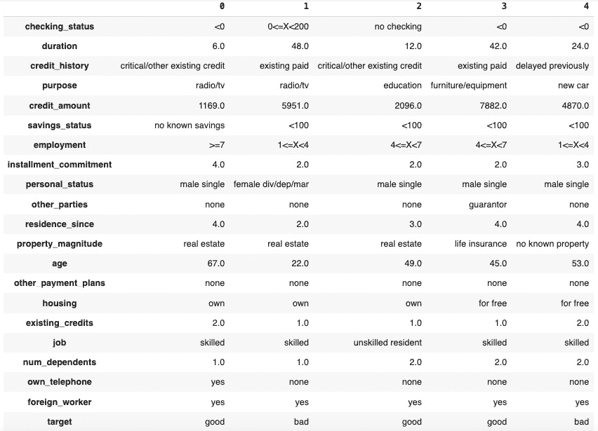

图 6.1 – 信用-g 数据集的特征（第一列）和前五行

现在我们已经加载了数据集，我们可以创建模式匹配的标签函数。在这个例子中，我们将创建两个标签函数，根据申请人的收入和信用历史来分配标签。`income_labeling_function` 将标签 `1` 分配给收入超过 5,000 的贷款申请人，将标签 `0` 分配给所有其他人。`credit_history_labeling_function` 将标签 `1` 分配给信用历史为 1 的贷款申请人，将标签 `0` 分配给所有其他人。

给定 `credit-g` 数据集中的特征，我们可以根据 `credit_amount` 和 `age` 创建两个标签函数。`credit_amount_labeling_function` 将标签 `1` 分配给信用额度超过 5,000 的贷款申请人，将标签 `0` 分配给所有其他人。`age_labeling_function` 将标签 `1` 分配给年龄超过 30 的贷款申请人，将标签 `0` 分配给所有其他人：

```py
def credit_amount_labeling_function(df):
    if df["credit_amount"] > 5000:
        return 1
    else:
        return 0
def age_labeling_function(df):
    if df["age"] > 30:
        return 1
    else:
        return 0
```

在创建标签函数之后，我们可以将它们应用到 `credit-g` 数据集上。我们可以使用 pandas 中的 `apply` 函数将标签函数应用到数据集的每一行。`apply` 函数将标签函数应用到数据集的每一行，并将标签分配到数据集的新列中：

```py
df["credit_amount_label"] = df.apply(credit_amount_labeling_function, axis=1)
df["age_label"] = df.apply(age_labeling_function, axis=1)
df.head().T
```

这里是使用这些函数的输出 DataFrame。DataFrame 现在有两个额外的列，包含新创建的标签：

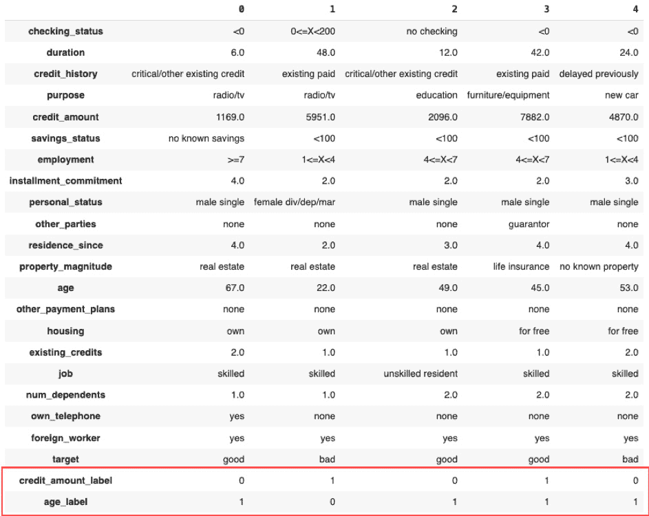

图 6.2 – 更新后的 credit-g 数据集，新增两个特征：credit_amount_label 和 age_label

在探讨了模式匹配函数之后，我们现在将关注数据库查找技术的简单性和有效性。在下一节中，我们将利用结构化数据库来提高标记准确性，使我们的方法更加稳健。

# 数据库查找

**数据库查找**（**DB 查找**）标签技术通过利用数据库中存储的信息，为数据实例分配标签提供了一种强大的手段。通过查询相关数据库并检索标记信息，这种方法可以实现自动化和准确的标记。该技术涉及根据与数据实例相关的特定属性或键值对从数据库中搜索和检索标签。它基于数据库包含可用于数据标记目的的有价值标记信息的假设。通过针对数据库执行查询，可以检索相关标签并将其分配给相应的数据实例。

数据库查找技术在机器学习的各个领域和场景中都有应用。以下是一些常见应用：

+   **实体识别**：在自然语言处理任务中，如命名实体识别或实体分类，可以使用数据库查找根据存储在数据库中的属性检索实体的标签。这有助于在文本数据中准确识别和分类实体。

+   **产品分类**：电子商务平台通常维护包含产品信息（包括类别和属性）的数据库。可以使用数据库查找根据其特征检索产品标签，从而实现产品的自动化分类和组织。

+   **地理空间分析**：包含地理信息的数据库，如地图或地理标记数据，可以通过数据库查找来查询，根据空间属性分配标签。这项技术有助于实现基于位置推荐、地理空间聚类和边界识别等任务。

+   **医疗诊断**：医疗数据库存储有关疾病、症状和患者记录的大量信息。可以使用数据库查找来检索与患者症状相关的相关标签，从而帮助自动化医疗诊断和决策支持系统。

现在，让我们谈谈布尔标志标记。这是一种简单而强大的方法，通过使用清晰和逻辑的条件来帮助我们改进和自动化标记。

# 布尔标志

(`true`/`false` 或 `1`/`0`) 与特定的特征或属性相关联，有助于识别所需的标签。通过检查这些标志的存在与否，数据实例可以自动标记。

布尔标志标记技术在机器学习的各个领域都有应用。以下是一些常见应用：

+   **数据过滤**：布尔标志可用于根据特定标准过滤和标记数据实例。例如，在情感分析中，可以将积极情感标志分配给包含积极语言或关键词的文本实例，而将消极情感标志分配给包含消极语言的实例。

+   **事件检测**：布尔标志可以帮助标记实例以检测特定事件或条件。例如，在网络安全领域，可以设置一个标志来指示具有可疑网络活动的实例，从而识别潜在的安全威胁。

+   **异常检测**：布尔标志可用于将实例标记为正常或异常。通过定义捕获典型模式或行为的标志，偏离这些模式的实例可以标记为异常，从而促进异常检测任务。

+   **质量控制**：布尔标志可以帮助标记实例进行质量控制。例如，在制造业中，可以根据预定义的质量标准设置标志来标记实例为不合格或合格。

布尔标志标记技术在机器学习应用中提供了几个优势：

+   **简洁性与效率**：布尔标志提供了一种简单且高效的标记机制。标记过程涉及检查标志的存在或不存在，这可以通过简单的条件语句或逻辑运算来实现。

+   **灵活性与定制**：布尔标志允许定制和适应不同的标记场景。标志可以根据特定标准或要求定义，提供根据所需特征分配标签的灵活性。

+   **可解释性**：布尔标志标记技术提供了可解释性，因为标志的存在或不存在直接对应于分配的标签。这种透明度有助于更好地理解和验证标记过程。

+   **可扩展性**：布尔标志可以轻松扩展以处理大量数据集。由于标记决策基于二进制指示器，计算开销保持较低，使其适合处理大量数据。

虽然布尔标志标记技术提供了简洁性和效率，但应考虑以下某些挑战和注意事项：

+   **特征工程**：设计有效的布尔标志需要仔细的特征工程。标志应该是信息丰富且与所需标签相关的，这需要深入理解问题域和数据特征。

+   **数据不平衡**：在数据不平衡的情况下，即一个标签支配其他标签，布尔标志技术可能会面临挑战。可能需要适当的处理技术，如过采样或欠采样，来解决不平衡问题。

+   **泛化**：布尔标志可能无法捕捉到潜在数据分布的全部复杂性，可能导致过拟合或泛化能力有限。考虑互补技术，如特征提取或更高级的机器学习算法，以增强性能和泛化能力是很重要的。

+   **标志解释**：虽然布尔标志提供了可解释性，但仔细解释标志的含义与分配的标签之间的关系是至关重要的。在某些情况下，标志可能捕捉到相关性而不是因果关系，需要进一步调查以获得更准确的解释。

你可能已经注意到了布尔标志和独热编码（在第*第五章**，数据清洗技术*中介绍）之间的相似之处。因此，了解何时使用这些技术是很重要的。

在选择布尔标志和独热编码之间，具体的用例是一个关键因素。如果你正在处理一个可以自然地分为两个类别或状态（例如是/否、真/假）的分类变量，使用布尔标志可能是最佳选择。它更简单，更节省内存，并且可以使模型更容易解释。

例如，如果你正在预测一封电子邮件是否为垃圾邮件，一个布尔标志如`contains_link`（如果电子邮件包含链接则为`1`，否则为`0`）可能是一个非常有效的特征。这种简单性可以导致更可解释的模型，因为每个特征直接对应一个条件或状态。

另一方面，独热编码更适合于具有多个类别且不存在自然二分法的分类变量。例如，如果你正在处理一个如`color`这样的特征，其值有`red`、`blue`、`green`等，独热编码将是一个更好的选择。这是因为分配给每个类别的数字不应该暗示类别之间存在数学关系，除非确实存在。例如，将红色编码为`1`，蓝色编码为`2`并不意味着蓝色是红色的两倍。

为了避免暗示这种未预期的关系，为每种可能的颜色创建一个单独的特征是首选的。这种方法可以捕捉更多关于颜色特征的信息，并且不对不同颜色施加任意顺序或重要性。

此外，所使用的机器学习模型的类型也会影响选择。一些模型，如决策树和随机森林，可以很好地处理分类变量，因此可能不需要一热编码（这会增加数据集的维度）。然而，其他模型，如线性回归、逻辑回归和支持向量机，需要数值输入，因此需要对分类变量进行某种形式的编码。

最后，值得注意的是，这些并不是处理分类数据的唯一方法。还有其他技术，如有序编码、目标编码和二进制计数，每种技术都有其自身的优缺点。关键是理解你数据的本质和特定用例的要求，以选择最合适的方法。

让我们探讨如何使用 Python 中的布尔标志在`credit-g`数据集中。想象一下，我们想要创建一个函数，该函数根据基本规则或启发式方法应用布尔标志来标记数据点。例如，我们可以编写一个函数，评估信用申请人的信用额度是否高于特定阈值，然后根据这种评估为数据点分配布尔标志。

以下函数将检查信用额度是否低于或高于中值信用额度：

```py
def lf_credit_amount_above_median(df):
    credit_amount_median = df['credit_amount'].median()
    return df['credit_amount'] >= credit_amount_median
```

现在我们已经定义了我们的函数，我们可以将其应用于我们的`df` DataFrame，用布尔标志标记数据点：

```py
df['LF_CreditAmountAboveMedian'] = lf_credit_amount_above_median(df)
df.head().T
```

*图 6.3* 是应用这些函数后的输出 DataFrame。注意，我们现在创建了一个新列，提供了关于申请人信用额度的额外信息，这可以用作机器学习模型中的特征。

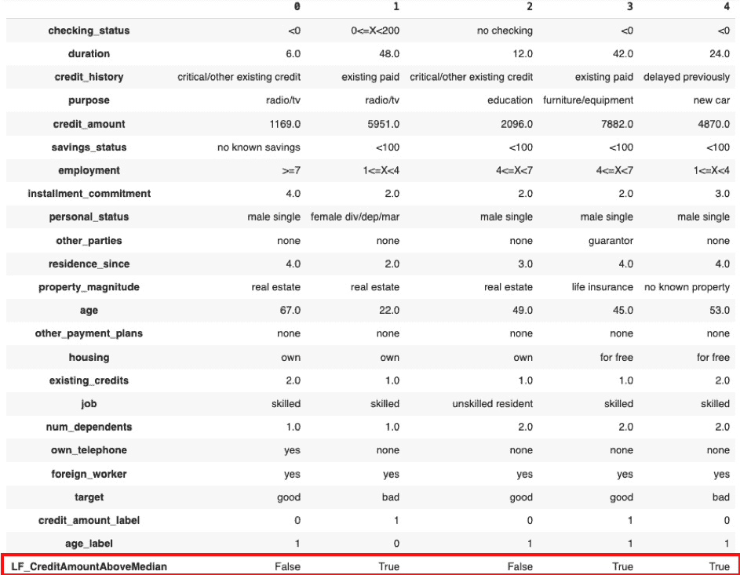

图 6.3 – 添加了新布尔标志 LF_CreditAmountAboveMedian 的 credit-g 数据集

在下一节中，让我们探讨弱监督——这是一种复杂的标记技术，它巧妙地整合了来自各种来源的信息，在现实世界数据的复杂性中导航，以增强精确性和适应性。

# 弱监督

弱监督是机器学习中的一种标记技术，它利用不完美或噪声的监督源为数据实例分配标签。与依赖于手动标注数据的传统标记方法不同，弱监督允许更可扩展和自动化的标记方法。它指的是使用启发式方法、规则或概率方法为数据实例生成近似标签。

弱监督不是依赖于单一的权威监督源，而是利用多个可能引入噪声或不一致性的来源。目标是生成“弱”指示真实潜在标签的标签，从而在获取完全标注数据具有挑战性或成本高昂的情况下进行模型训练。

例如，考虑一个任务，我们想要构建一个机器学习模型来识别一封电子邮件是否为垃圾邮件。理想情况下，我们会有一大批被准确标记为“垃圾邮件”或“非垃圾邮件”的电子邮件数据集。然而，获取这样的数据集可能具有挑战性，耗时且成本高昂。

使用弱监督，我们可以使用替代的、不那么完美的方法来标记我们的数据。例如，我们可以根据垃圾邮件中的常见模式创建一些规则或启发式方法。以下是一些此类规则的例子：

+   如果电子邮件包含诸如“彩票”、“赢”或“奖品”等词语，它可能是垃圾邮件

+   如果电子邮件来自未知发件人且包含许多链接，它可能是垃圾邮件

+   如果电子邮件包含诸如“紧急行动要求”之类的短语，它可能是垃圾邮件

使用这些规则，我们可以自动标记我们的电子邮件数据集。这些标签不会完美——会有误报（非垃圾邮件被错误地标记为垃圾邮件）和漏报（垃圾邮件被错误地标记为非垃圾邮件）。但它们为我们训练机器学习模型提供了一个起点。

模型可以从这些“弱”标签中学习，并且，在有足够大和多样化的数据集的情况下，应该仍然能够很好地泛化到新的、未见过的电子邮件。这使得弱监督成为一种可扩展且高效的标注方法，特别适用于难以获得完美标签的情况。

弱监督可以来自各种来源，包括以下：

+   **基于规则的系统**：领域专家或基于启发式的方法可以定义基于特定模式、特征或条件的规则或指南来标记数据。这些规则可能来自知识库、现有模型或专家意见。

+   **众包**：通过众包平台利用人类标注者的力量，可以通过汇总多个个体的标注来获得弱监督。这种方法引入了噪声，但可能具有成本效益和可扩展性。

+   **远程监督**：远程监督涉及使用可能与目标任务不完全一致但可以作为代理的现有标记数据。一个例子是使用具有辅助标签的现有数据来训练一个相关但不同的任务的模型。

+   **数据增强**：通过数据增强技术，如数据合成、转换或扰动，可以获得弱监督。通过根据现有标记数据生成新的标记实例，弱监督可以扩展。

弱监督在机器学习应用中提供了几个优势：

+   **可扩展性**：弱监督通过利用自动化或半自动化技术，允许进行大规模数据标记。它减少了手动标注所需的劳动强度，使得可以利用更大的数据集。

+   **成本效益**：通过利用弱监督来源，与全监督方法相比，获取标记数据的成本可以显著降低。这在手动标记昂贵或不切实际的情况下尤其有益。

+   **灵活性和适应性**：弱监督技术可以轻松地适应和修改，以纳入新的监督来源或更新现有规则。这种灵活性允许迭代改进和细化标记过程。

+   **处理噪声标签**：弱监督技术可以通过聚合多个弱信号来处理噪声或不一致的标签。这种对噪声的鲁棒性减少了单个标记错误对整体训练过程的影响。

然而，也有一些挑战和注意事项需要注意：

+   **噪声与标签质量**：由于监督来源的不完美性质，弱监督标签可能包含噪声或错误。仔细评估和验证是必要的，以确保标签质量并最小化在模型训练过程中噪声标签的传播。

+   **精确度与召回率的权衡**：弱监督技术通常优先考虑可扩展性和覆盖范围，而不是精确度。在获取可靠的弱标签数据时，平衡召回率（覆盖范围）和精确度（准确性）之间的权衡至关重要。

+   **标记置信度与模型训练**：处理与弱监督标签相关的不确定性至关重要。可以采用标签校准、数据增强或主动学习等技术来减轻在模型训练期间标签不确定性的影响。

+   **泛化与模型性能**：由于标签中的固有噪声，弱监督模型可能难以泛化到未见或具有挑战性的实例。可以采用正则化、集成方法或迁移学习等策略来提高模型性能。

在本节中，我们将探讨如何使用 Python 中的标记函数在*第五章**数据清洗技术*中介绍的*贷款预测*数据集上训练机器学习模型。首先，我们需要通过导入必要的库和加载数据集来准备数据，并且需要通过处理缺失值和编码分类变量来预处理数据：

```py
import pandas as pd
import numpy as np
df = pd.read_csv('train_loan_prediction.csv')
df['LoanAmount'].fillna(df['LoanAmount'].mean(), inplace=True)
df['Credit_History'].fillna(df['Credit_History'].mode()[0], inplace=True)
df['Self_Employed'].fillna('No',inplace=True)
df['Gender'].fillna(df['Gender'].mode()[0], inplace=True)
df['Married'].fillna(df['Married'].mode()[0], inplace=True)
df['Dependents'].fillna(df['Dependents'].mode()[0], inplace=True)
df['Loan_Amount_Term'].fillna(df['Loan_Amount_Term'].mode()[0], inplace=True)
df['Credit_History'].fillna(df['Credit_History'].mode()[0], inplace=True)
```

我们将使用 scikit-learn 的`preprocessing`类中的`LabelEncoder`函数来编码分类列：

```py
from sklearn.preprocessing import LabelEncoder
cat_features = ['Gender', 'Married','Dependents', 'Education', 'Self_Employed', 'Property_Area']
for feature in cat_features:
    encoder = LabelEncoder()
    df[feature] = encoder.fit_transform(df[feature])
```

现在，我们可以定义我们的标签函数。在这个例子中，我们将基于一些简单的启发式方法定义三个标签函数。这些标签函数接受数据集的一行作为输入，并返回一个标签。如果该行可能属于正类，则标签为 `1`；如果可能属于负类，则标签为 `0`；如果不确定，则标签为 `-1`。这类函数在弱监督方法中常用，其中你有一大量未标记数据，并希望为它们生成噪声标签：

```py
from snorkel.labeling import labeling_function
@labeling_function()
def lf1(df):
    if df['Education'] == 0:
        return 0
    elif df['Self_Employed'] == 0:
        return 1
    else:
        return -1
@labeling_function()
def lf2(df):
    if df['Credit_History'] == 1:
        if df['LoanAmount'] <= 120:
            return 1
        else:
            return 0
    else:
        return -1
@labeling_function()
def lf3(df):
    if df['Married'] == 1:
        if df['Dependents'] == 0:
            return 1
        elif df['Dependents'] == 1:
            return 0
        else:
            return -1
    else:
        return -1
```

我们可以使用 Snorkel 库将标签函数应用于数据集。在这里，我们创建了一个包含三个标签函数的列表，并使用 `PandasLFApplier` 将它们应用于数据集。输出是一个 `L_train` 矩阵，其中每一行对应一个数据点，每一列对应一个标签函数：

```py
LFs = [lf1, lf2, lf3]
from snorkel.labeling import PandasLFApplier
applier = PandasLFApplier(lfs=LFs)
L_train = applier.apply(df)
```

你将看到以下输出：

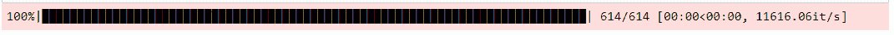

图 6.4 – 显示训练进度的进度条

为了提高标签函数的输出，我们需要将它们结合起来，为每个数据点获得更准确的标签。我们可以使用 Snorkel 库中的 `LabelModel` 类来完成此操作。`LabelModel` 类是一个概率模型，用于结合多个标签函数的输出，为每个数据点生成更准确和可靠的标签。它在解决可能由单个标签函数引起的噪声和不准确性方面发挥着关键作用。我们创建一个 `LabelModel` 对象作为 `label_model`，并将其拟合到标签函数的输出。基数参数指定了类的数量，在本例中为 `2`。我们还指定了训练的轮数和一个随机种子以确保可重复性：

```py
from snorkel.labeling.model import LabelModel
from snorkel.labeling import PandasLFApplier, LFAnalysis
from sklearn.metrics import accuracy_score
label_model = LabelModel(cardinality=2, verbose=True)
label_model.fit(L_train=L_train, n_epochs=500, log_freq=100, seed=123)
```

执行前面的代码片段，使用 Snorkel 的标签模型后，将显示标签的增量应用进度条：

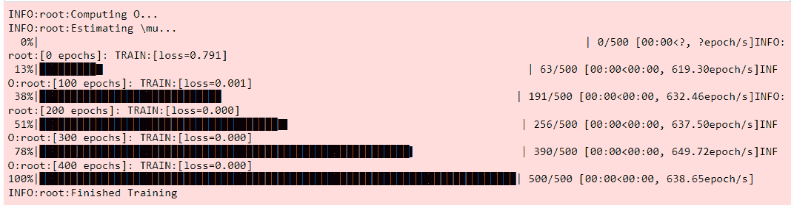

图 6.5 – 显示标签过程增量进度的 Snorkel 进度条

现在，我们可以使用 `LabelModel` 类为训练数据生成标签并评估其性能：

```py
probs_train = label_model.predict_proba(L_train)
mapping = {'Y': 1, 'N': 0}
Y_train = df['Loan_Status'].map(mapping).values
score_train = label_model.score(L_train, Y_train)
df['label'] = probs_train.argmax(axis=1)
df['label'] = df['label'].map({1: 'Y', 0: 'N'})
print(f"Accuracy: {accuracy_score(df['Loan_Status'].values, df['label'].values)}")
```

现在，让我们学习如何使用半弱监督进行标签化。这是一种智能技术，它结合了弱监督和一些手动标签，使我们的标签更加准确。

# 半弱监督

半弱监督是一种在机器学习中使用的技巧，通过结合一小部分标记数据和大量弱标记数据来提高模型的准确性。在这种方法中，标记数据用于指导学习过程，而弱标记数据提供额外的信息以提高模型的准确性。

半弱监督在标记数据有限或难以获取时特别有用，并且可以应用于广泛的机器学习任务，如文本分类、图像识别和目标检测。

在贷款预测数据集中，我们有一组代表贷款申请的数据点，每个数据点都包含一系列特征，如收入、信用历史和贷款金额，以及一个表示贷款是否批准的标签。然而，这些标记数据可能是不完整或不准确的，这可能导致模型性能不佳。

为了解决这个问题，我们可以使用半弱监督为贷款预测数据集生成额外的标签。一种方法是通过启发式或规则自动生成标签的弱监督技术。例如，我们可以使用正则表达式来识别贷款申请文本数据中的模式，这些模式表明高风险贷款。我们还可以使用外部数据源，如信用报告或社交媒体数据，来生成额外的弱标记数据。

一旦我们有一组弱标记数据，我们就可以使用它来训练一个模型，同时结合少量标记数据。标记数据用于指导学习过程，而弱标记数据提供额外的信息以提高模型的准确性。通过使用半弱监督，我们可以有效地利用所有可用数据来提高模型性能。

下面是一个使用 Snorkel 和 Python 实现贷款预测数据集半弱监督的示例。我们首先从这些库中导入必要的库和函数。然后使用 pandas 加载数据集：

```py
import pandas as pd
import numpy as np
from sklearn.model_selection import train_test_split
from snorkel.labeling import labeling_function
from snorkel.labeling import PandasLFApplier
from snorkel.labeling import LFAnalysis
from snorkel.labeling.model import LabelModel
df = pd.read_csv('train_loan_prediction.csv')
```

让我们定义一个函数来预处理数据集。我们将使用本章前面讨论过的类似预处理方法：

```py
def preprocess_data(df):
    df['Gender'] = df['Gender'].fillna('Unknown')
    df['Married'] = df['Married'].fillna('Unknown')
    df['Dependents'] = df['Dependents'].fillna('0')
    df['Self_Employed'] = df['Self_Employed'].fillna('Unknown')
    df['LoanAmount'] = df['LoanAmount'].fillna(df['LoanAmount'].mean())
    df['Loan_Amount_Term'] = df['Loan_Amount_Term'].fillna(df['Loan_Amount_Term'].mean())
    df['Credit_History'] = df['Credit_History'].fillna(-1)
    df['LoanAmount_bin'] = pd.cut(df['LoanAmount'], bins=[0, 100, 200, 700], labels=['Low', 'Average', 'High'])
    df['TotalIncome'] = df['ApplicantIncome'] + df['CoapplicantIncome']
    df['TotalIncome_bin'] = pd.cut(df['TotalIncome'], bins=[0, 2500, 4000, 6000, 81000], labels=['Low', 'Average', 'High', 'Very high'])
    df = df.drop(['Loan_ID', 'ApplicantIncome', 'CoapplicantIncome', 'LoanAmount', 'TotalIncome'], axis=1)
    return df
```

现在我们为`ApplicantIncome`和`LoanAmount`创建了三个标记函数。`lf1(x)`函数接收一个数据实例`x`作为输入，并根据`ApplicantIncome`特征值执行标记操作。如果`ApplicantIncome`小于 5,000，则函数返回标签`0`。否则，如果`ApplicantIncome`大于或等于 5,000，则函数返回标签`1`。本质上，这个函数将标签`0`分配给申请收入较低的数据实例，将标签`1`分配给申请收入较高的数据实例。

`lf2(x)`函数同样接收一个数据实例`x`作为输入，并根据`LoanAmount`特征值分配标签。如果`LoanAmount`大于 200，则函数返回标签`0`。相反，如果`LoanAmount`小于或等于 200，则函数返回标签`1`。这个函数将贷款金额较大的数据实例分类为标签`0`，将贷款金额较小的数据实例分类为标签`1`。

利用`lf3(x)`函数，我们计算贷款金额与申请人收入的比率。这个比率是确定贷款可行性的关键指标。根据这个计算出的比率，我们将数据点分类到不同的标签。如果贷款与收入比率低于或等于 0.3，我们分配标签`1`，表示批准贷款申请。在比率超过 0.3 但不超过 0.5 的情况下，我们指定数据点的标签为`0`，表示对贷款批准的不确定性。相反，如果比率超过 0.5，我们分配标签`-1`，表示拒绝贷款申请。这种方法使我们能够将可负担性方面纳入我们的标签过程，增强我们贷款批准预测的弱监督方法的粒度：

```py
@labeling_function()
def lf1(x):
    return 0 if x['ApplicantIncome'] < 5000 else 1
@labeling_function()
def lf2(x):
    return 0 if x['LoanAmount'] > 200 else 1
@labeling_function()
def lf3(x):
    # Calculate the ratio of loan amount to applicant's income
    loan_to_income_ratio = x['LoanAmount'] / x['ApplicantIncome']
    # Return label based on the loan-to-income ratio
    if loan_to_income_ratio <= 0.3:
        return 1  # Approve loan
    elif loan_to_income_ratio > 0.3 and loan_to_income_ratio <= 0.5:
        return 0  # Label as uncertain
    else:
        return -1  # Deny loan
```

我们然后将预处理技术应用于输入数据（`df`）。使用`preprocess_data`函数执行必要的预处理步骤。处理后的数据存储在变量`X`中。此外，目标变量`Loan_Status`从分类值（`N`和`Y`）转换为数值（`0`和`1`），并存储在变量`y`中。这一步骤确保数据已准备好进行训练和评估：

```py
X = preprocess_data(df.drop('Loan_Status', axis=1))
y = df['Loan_Status'].replace({'N': 0, 'Y': 1})
```

下一步是将预处理数据分为训练集和测试集。使用 scikit-learn 库中的`train_test_split`函数来完成此操作。数据被分为特征`X_train`和`X_test`以及相应的标签`y_train`和`y_test`。这种分离允许在训练集上训练模型并在测试集上评估其性能：

```py
X_train, X_test, y_train, y_test = train_test_split(X, y, test_size=0.2, random_state=42)
```

现在我们使用`PandasLFApplier`类将两个标签函数`lf1`和`lf2`应用于训练集（`X_train`）。生成的弱标签数据存储在`L_train_weak`中。LF 分析每个实例的特征并根据预定义的规则或条件分配标签：

```py
lfs = [lf1, lf2, lf3]
applier = PandasLFApplier(lfs)
L_train_weak = applier.apply(X_train)
```

使用`LabelModel`类实例化标签模型。它配置为`2`的基数（表示二元分类）并设置为以详细模式运行以更新进度。然后使用`fit`方法在训练数据（`L_train_weak`）上训练标签模型：

```py
label_model = LabelModel(cardinality=2, verbose=True)
label_model.fit(L_train_weak)
```

一旦标签模型训练完成，它将在测试集（`X_test`）上评估其性能。再次使用 applier 对象将标签函数应用于测试集，结果生成`L_test`，其中包含弱标签实例。然后使用标签模型的 score 方法计算标签预测的准确度与真实标签（`y_test`）相比：

```py
L_test = applier.apply(X_test)
accuracy = label_model.score(L_test, y_test)["accuracy"]
print(f'Test accuracy: {accuracy:.3f}')
```

在接下来的部分，我们将探讨用于标签的切片函数——这是一种高级技术，允许我们精细分割我们的数据。这些函数提供了一种定制的方法，使我们能够将特定的标签策略应用于数据集的不同子集：

# 切片函数

切片函数是作用于数据实例并基于特定条件产生二元标签的函数。与为整个数据集提供标签的传统标记函数不同，切片函数旨在关注数据的具体子集。这些子集或切片可以根据数据的各种特征、模式或特征来定义。切片函数提供了一种细粒度的标记方法，使数据实例的标记更加有针对性和精确。

切片函数在弱监督方法中起着至关重要的作用，其中利用多个标记源来分配近似标签。切片函数通过捕获可能难以使用其他方法准确标记的数据的特定模式或子集，补充了其他标记技术，如基于规则的系统或众包。通过应用切片函数到数据中，从业者可以利用领域知识或特定的数据特征来改进标记过程。

为了全面理解切片函数的概念，让我们以一个包含来自电子商务网站一系列产品评论的数据集为例。我们的目标是将这些评论标记为正面或负面。

为了简单起见，让我们考虑两个切片函数：

+   **切片函数 1**（**SF1**）：此函数针对包含单词“退款”的评论。如果评论包含“退款”一词，则将其标记为负面，否则不标记。这个切片函数背后的直觉是，要求退款的客户可能对其购买不满意，因此具有负面情绪。

+   **切片函数 2**（**SF2**）：此函数针对购买电子产品的客户评论。如果评论包含“出色”、“优秀”或“喜爱”等词语，则将其标记为正面；如果包含“损坏”、“有缺陷”或“无用”等词语，则将其标记为负面。如果评论不符合任何这些条件，则将其保留为未标记状态。

你会注意到这些切片函数作用于数据的具体子集，使我们能够将领域知识纳入标记过程。因此，设计有效的切片函数需要结合领域知识、特征工程和实验。以下是设计和实现切片函数的一些关键考虑因素：

+   **识别相关切片**：确定与标记任务相关的特定数据子集或切片。这涉及到理解问题领域、分析数据以及识别独特的模式或特征。

+   **定义切片条件**：指定捕获所需数据子集的条件或规则。这些条件可以基于特征阈值、模式匹配、统计属性或任何其他相关标准。

+   **评估和迭代**：通过将分配的标签与地面真实标签或现有的标签源进行比较来评估切片函数的性能。对切片函数的设计进行迭代，细化条件和规则，以提高分配标签的质量。

切片函数在标签过程中提供了几个好处：

+   **细粒度标签化**：切片函数允许对数据的特定子集进行有针对性的标签化，提供更详细和粒度化的标签，以捕捉独特的模式或特征。

+   **领域知识整合**：切片函数允许将领域专业知识和特定领域知识整合到标签过程中。这允许做出更明智和情境感知的标签决策。

+   **与其他技术的互补性**：切片函数通过捕捉可能难以使用传统方法进行标签化的数据切片来补充其他标签技术。它们提供了额外的弱监督来源，从而增强了整体标签过程。

+   **可扩展性和效率**：切片函数可以自动化并程序化应用，允许对大型数据集进行可扩展和高效的标签化。这减少了对手动标注的依赖，并允许在大规模上对数据进行标签化。

让我们了解如何使用贷款预测数据集在 Python 中实现切片函数。我们首先导入所需的库并将数据集加载到 pandas DataFrame 中。我们将使用之前章节中讨论的相同预处理步骤：

```py
from snorkel.labeling import labeling_function
from snorkel.labeling import PandasLFApplier
from snorkel.labeling.model import LabelModel
from snorkel.labeling import LFAnalysis
df = pd.read_csv('train_loan_prediction.csv')
X = preprocess_data(df.drop('Loan_Status', axis=1))
y = df['Loan_Status'].replace({'N': 0, 'Y': 1})
X_train, X_test, y_train, y_test = train_test_split(X, y, test_size=0.2, random_state=42)
```

要创建切片函数，我们利用 Snorkel 提供的`@labeling_function`装饰器。这些函数封装了基于特定条件或规则的标签逻辑。例如，我们可以根据`ApplicantIncome`、`LoanAmount`或`Self_Employed`特征定义切片函数：

```py
@labeling_function()
def slice_high_income(x):
    return 1 if x['ApplicantIncome'] > 8000 else 0
@labeling_function()
def slice_low_income_high_loan(x):
    return 1 if x['ApplicantIncome'] < 4000 and x['LoanAmount'] > 150 else 0
@labeling_function()
def slice_self_employed(x):
    return 1 if x['Self_Employed'] == 'Yes' else 0
```

要将切片函数应用于训练数据，我们使用 Snorkel 提供的`PandasLFApplier`类。这个类接受切片函数作为输入，并将它们应用于训练数据集，生成弱标签。生成的弱标签将用于稍后训练标签模型：

```py
lfs = [slice_high_income, slice_low_income_high_loan, slice_self_employed]
applier = PandasLFApplier(lfs)
L_train = applier.apply(df=X_train)
```

一旦我们从切片函数中获得弱标签，我们就可以使用 Snorkel 的`LabelModel`类来训练标签模型。标签模型学习弱标签与真实标签之间的相关性，并估计每个数据实例的后验概率。在这个步骤中，我们创建一个`LabelModel`对象，指定标签的基数（例如，二元分类），并将其拟合到弱标签的训练数据：

```py
label_model = LabelModel(cardinality=2, verbose=True)
label_model.fit(L_train, n_epochs=500, seed=42)
```

在训练标签模型后，我们希望评估其在测试数据上的性能。我们使用`PandasLFApplier`将切片函数应用于测试数据集，获取弱标签。然后，我们计算标签模型预测的准确率，与测试集的真实标签进行比较：

```py
L_test = applier.apply(df=X_test)
accuracy = label_model.score(L=L_test, Y=y_test)
print(f'Test accuracy: {accuracy["accuracy"]:.3f}')
```

Snorkel 提供了 `LFAnalysis` 模块，该模块允许我们分析标记函数的性能和特征。我们可以计算每个标记函数的覆盖率、冲突和准确度等指标，以深入了解其有效性和潜在问题：

```py
LFAnalysis(L=L_train, lfs=lfs).lf_summary()
```

这将生成以下汇总表：

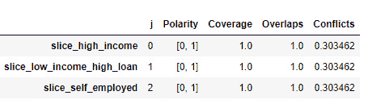

图 6.6 – 显示每个标记函数（LF）统计信息的汇总表

在下一节中，我们将探讨用于标记的主动学习——一种涉及选择正确数据进行标记的巧妙策略，通过每次迭代使我们的模型更智能。

# 主动学习

在本节中，我们将探讨主动学习的概念及其在数据标记中的应用。主动学习是一种强大的技术，它允许我们通过积极选择最具信息量的样本进行标注来更有效地标记数据。通过战略性地选择哪些样本进行标注，我们可以在数据集较小的情况下实现更高的准确度，其他条件保持不变。在接下来的几页中，我们将讨论各种主动学习策略，并使用 Python 代码示例进行实现。

主动学习是一种半监督学习方法，它涉及根据数据点的信息量迭代选择数据子集进行手动标注。关键思想是积极查询最不确定或最具信息量的实例的标签，以改进学习过程。通过选择和标注样本的这种迭代过程，可以显著减少实现所需性能水平所需标记数据的数量。

让我们从主动学习的一个简单例子开始，帮助你了解基本概念，然后再详细讨论具体的主动学习策略。

假设我们正在构建一个机器学习模型，用于将电子邮件分类为垃圾邮件和非垃圾邮件。我们有一个大量未标记的电子邮件数据集，但手动标记所有这些邮件将非常耗时。

这就是主动学习发挥作用的地方：

1.  **初始训练**：我们首先随机选择一小部分电子邮件，并将它们手动标记为垃圾邮件或非垃圾邮件。然后，我们在这个小型标记数据集上训练我们的模型。

1.  **不确定性采样**：训练完成后，我们使用模型对剩余的未标记电子邮件进行预测。然而，我们不会标记所有电子邮件，而是选择模型对其预测最不确定的电子邮件。例如，如果我们的模型输出一个接近 0.5 的概率（即它不确定电子邮件是否为垃圾邮件），这些电子邮件被认为是“信息丰富”或“不确定”的。

1.  **标签查询**：然后，我们手动标记这些不确定的电子邮件，并将它们添加到我们的训练集中。

1.  **迭代学习**：*步骤 2*和*步骤 3*在多次迭代中重复——用新标记的数据重新训练模型，使用它来预测剩余未标记数据的标签，并选择下一个最不确定的实例进行标记。

这样，主动学习使我们能够有策略地选择最有信息量的示例进行标记，从而有可能在更少的标记实例的情况下提高模型的表现。

根据选择信息样本的不同标准，可以采用几种主动学习策略。让我们讨论一些常用的策略及其 Python 实现。

## 不确定性采样

不确定性采样基于这样的假设：模型不确定的实例更有信息量，对标记有益。想法是选择接近决策边界或具有冲突预测的实例。通过积极获取这些具有挑战性的实例的标签，模型可以细化其对数据的理解并提高其性能。

在主动学习中，不确定性采样有几种常见的方法：

+   **最低信心度**：此方法选择模型对其预测最没有信心的实例。它关注预测类别概率最接近 0.5 的实例，这表明存在不确定性。例如，在我们的电子邮件示例中，如果模型预测某个电子邮件是垃圾邮件的概率为 0.52，不是垃圾邮件的概率为 0.48，这表明模型对其预测不确定。这封电子邮件将是最低信心度方法下标记的理想候选。

+   **边缘采样**：边缘采样旨在找到模型的前两个预测类别概率接近的实例。它选择最高和第二高概率之间差异最小的实例，因为这些实例可能接近决策边界。假设我们有一个对动物图像进行分类的模型。如果它预测一个图像的概率为猫 0.4，狗 0.38，鸟 0.22，最高和第二高概率之间的小差异（0.02）表明存在不确定性。这个图像将在边缘采样中被选中进行标记。

+   **熵**：基于熵的采样考虑预测类别概率的熵。它选择具有高熵的实例，这表明模型预测的不确定性很高。使用相同的动物分类模型，如果一个图像每个类别（猫、狗、鸟）的概率都为 0.33，这表明存在高度不确定性。这个图像将通过熵方法被选中进行标记。

让我们在 Python 中实现不确定性采样。为此示例，我们回到本章开头介绍的`credit-g`数据集。让我们看看这个数据集中的特征，以刷新你的记忆：

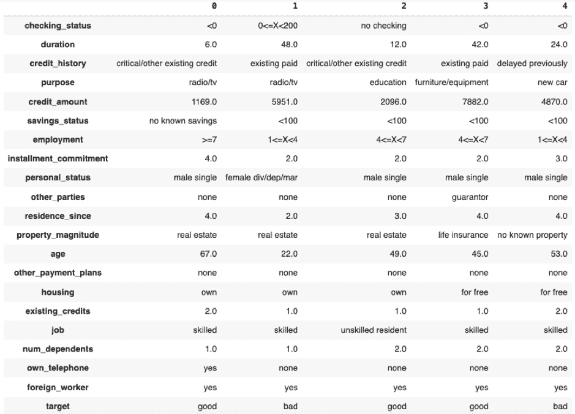

图 6.7 – credit-g 数据集的特征

在假设数据集已经加载到 `df` DataFrame 的情况下，我们首先通过标准化数值特征和独热编码分类特征来预处理数据集：

```py
import pandas as pd
from sklearn.preprocessing import StandardScaler, OneHotEncoder
from sklearn.compose import ColumnTransformer
from sklearn.pipeline import Pipeline
# Define preprocessor
preprocessor = ColumnTransformer(
    transformers=[
        ('num', StandardScaler(), ['duration', 'credit_amount', 'installment_commitment',
                                   'residence_since', 'age', 'existing_credits', 'num_dependents']),
        ('cat', OneHotEncoder(), ['checking_status', 'credit_history', 'purpose',
                                  'savings_status', 'employment', 'personal_status', 'other_parties',
                                  'property_magnitude', 'other_payment_plans', 'housing', 'job',
                                  'own_telephone', 'foreign_worker'])])
# Define a mapping from current labels to desired labels
mapping = {'good': 1, 'bad': 0}
# Apply the mapping to the target variable
df['target'] = df['target'].map(mapping)
# Fit and transform the features
features = preprocessor.fit_transform(df.drop('target', axis=1))
# Convert the features to a dataframe
features_df = pd.DataFrame(features)
# Add the target back to the dataframe
df_preprocessed = pd.concat([features_df, df['target'].reset_index(drop=True)], axis=1)
```

我们手头有了新的 `df_preprocessed` DataFrame，我们可以执行不确定性采样。我们首先导入必要的库和模块，包括 pandas、NumPy 和 scikit-learn，用于数据处理和机器学习操作：

```py
import pandas as pd
import numpy as np
from sklearn.model_selection import train_test_split
from sklearn.linear_model import LogisticRegression
from sklearn.metrics import accuracy_score
```

我们将 `df_preprocessed` 数据集分为一个小型标记数据集和剩余的未标记数据。在这个例子中，我们随机选择 10%的小部分作为标记数据，其余的作为未标记数据：

```py
labeled_data, unlabeled_data = train_test_split(df_preprocessed, test_size=0.9, random_state=42)
```

我们定义了不确定性采样函数——`least_confidence`、`margin_sampling` 和 `entropy_sampling`，如前所述。

下面是每个这些函数的解释：

+   `least_confidence`：此函数接受一个概率的二维数组，其中每一行代表一个实例，每一列代表一个类别。对于每个实例，它计算置信度为 1 – `max_probability`，其中 `max_probability` 是所有类别中最大的预测概率。然后按置信度的升序对实例进行排序。其思路是，具有较低置信度（即更高不确定性）的实例更有信息量，应该首先进行标记：

    ```py
    def least_confidence(probabilities):
        confidence = 1 - np.max(probabilities, axis=1)
        return np.argsort(confidence)
    ```

+   `margin_sampling`：此函数也接受一个概率的二维数组。对于每个实例，它计算边缘作为最高和第二高预测概率之间的差异。然后按边缘的升序对实例进行排序。其思路是，具有较小边缘（即接近前两个类别的概率）的实例更有信息量，应该首先进行标记：

    ```py
    def margin_sampling(probabilities):
        sorted_probs = np.sort(probabilities, axis=1)
        margin = sorted_probs[:, -1] - sorted_probs[:, -2]
        return np.argsort(margin)
    ```

+   `entropy_sampling`：此函数计算每个实例预测概率的熵。熵是衡量不确定性或无序的指标，值越高表示不确定性越大。然后按熵的升序对实例进行排序。其思路是，具有更高熵（即类别概率中的更大不确定性）的实例更有信息量，应该首先进行标记：

    ```py
    def entropy_sampling(probabilities):
        entropy = -np.sum(probabilities * np.log2(probabilities), axis=1)
        return np.argsort(entropy)
    ```

我们进入主动学习循环，在这个循环中，我们迭代地训练模型，使用不确定性采样选择标记实例，为这些实例获取标签，并更新标记数据集。

首先，使用名为 `accuracies` 的列表来跟踪模型在每个迭代中对标记数据的准确率。

然后在指定的迭代次数上实现主动学习循环。在每个迭代中，使用标记数据训练一个逻辑回归模型，并计算其准确率并存储。然后模型对未标记数据进行预测，并将它最不自信的实例（由 `least_confidence` 函数确定）添加到标记数据集中。这些实例从未标记数据集中移除：

```py
# Initialize a list to store the accuracy at each iteration
accuracies = []
# Implement the active learning loop.
num_iterations = 5
batch_size = 20
for _ in range(num_iterations):
    model = LogisticRegression()
    model.fit(X_labeled, y_labeled)
    # Calculate and store the accuracy on the labeled data at this iteration
    accuracies.append(accuracy_score(y_labeled, model.predict(X_labeled)))
    probabilities = model.predict_proba(X_unlabeled)
    indices = least_confidence(probabilities)[:batch_size]
    X_newly_labeled = X_unlabeled[indices]
    y_newly_labeled = y_unlabeled[indices]
    X_labeled = np.concatenate([X_labeled, X_newly_labeled])
    y_labeled = np.concatenate([y_labeled, y_newly_labeled])
    X_unlabeled = np.delete(X_unlabeled, indices, axis=0)
    y_unlabeled = np.delete(y_unlabeled, indices)
```

最终输出是一个包含在主动学习每次迭代中标记的额外实例的更新标记数据集。该过程旨在通过迭代选择和标记未标记数据中最具信息量的实例来提高模型性能。在前面的代码中，主动学习的成功和有效性取决于`least_confidence`自定义函数和数据集的特征。假设`least_confidence`函数返回对应于最不自信预测的索引。

注意，此代码使用`least_confidence`函数进行主动学习。要使用`margin_sampling`或`entropy_sampling`而不是`least_confidence`执行相同的过程，可以将`least_confidence(probabilities)[:batch_size]`替换为`margin_sampling(probabilities)[:batch_size]`或`entropy_sampling(probabilities)[:batch_size]`。

让我们比较三个主动学习函数在`credit-g`相同样本上的性能。我们使用 matplotlib 来生成三个主动学习函数准确率的视觉表示。要复制输出，将以下代码应用于每个函数的输出：

```py
import matplotlib.pyplot as plt
from matplotlib.ticker import MaxNLocator
ax = plt.figure().gca()
ax.xaxis.set_major_locator(MaxNLocator(integer=True))
plt.plot(range(1, num_iterations + 1), accuracies)
plt.xlabel('Iteration')
plt.ylabel('Accuracy')
plt.title('Model accuracy over iterations (least_confidence)')
plt.show()
```

*最不自信*方法在五次迭代后达到了 0.878 的模型准确率，最佳性能出现在第一次迭代后：

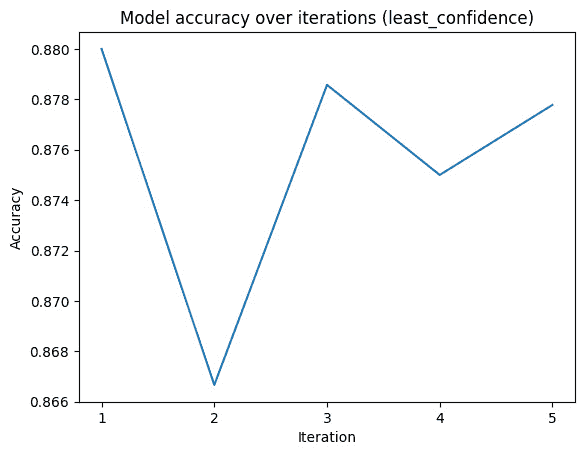

图 6.8 – 在信用-g 数据集上预测目标变量时，最不自信主动学习函数在五次迭代中的准确率

边缘采样在经过两次和三次迭代后达到了略高的准确率，为 0.9：

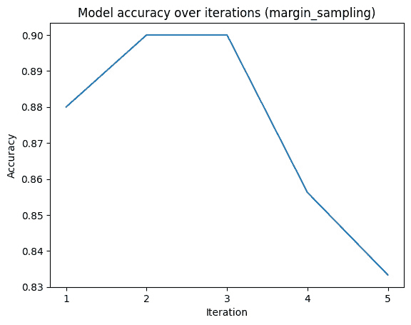

图 6.9 – 在信用-g 数据集上预测目标变量时，边缘采样主动学习函数在五次迭代中的准确率

最后，熵采样和最不自信采样得到了相同的结果。这是为什么？

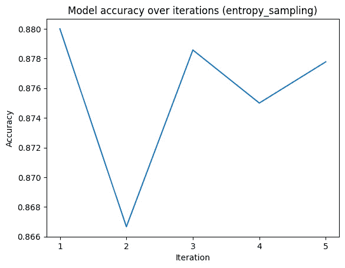

图 6.10 – 在信用-g 数据集上预测目标变量时，熵采样主动学习函数在五次迭代中的准确率

这两种方法在某些场景下可能会得到相同的结果，尤其是在处理二元分类问题时。原因如下。

最不自信方法考虑预测概率最高的类别。如果模型对某个特定类别非常自信（即，概率接近 1），那么这个实例被选为标记的可能性就较小。

熵采样考虑预测概率的熵或“无序”。对于二元分类问题，当概率都相等时（即模型完全不确定要预测哪个类别），熵达到最大。这可能与低置信度预测相一致。

因此，在二元分类的背景下，这两种方法通常会选择相同的实例进行标签。然而，这并不总是如此，特别是对于多类问题。

另一方面，边缘采样关注最高和第二高预测概率之间的差异。这些概率之间的微小差异可能导致与其他方法相比选择不同的实例。

在下一节中，我们将探讨**委员会查询**（**QBC**）用于标签——一种将一组模型汇集起来以帮助决定哪些数据点对标签最重要的方法。

## 委员会查询（QBC）

QBC 基于这样一个观点：模型委员会不一致或表现出高度不确定性的实例最有信息量，应该优先进行标签。QBC 不是依赖于单个模型的预测，而是利用委员会的多样性和集体决策来做出明智的标签决策。

QBC 过程通常包括以下步骤：

1.  **委员会创建**：创建一个由多个模型组成的初始委员会，这些模型在可用的标记数据上进行了训练。委员会中的模型在架构、初始化或训练方法方面可以多样化。

1.  **实例选择**：将模型委员会应用于未标记的实例并获取预测。选择在委员会成员中引起最多不一致或不确定性的实例进行标签。

1.  **委员会更新**：对选定的实例进行标签并添加到标记数据集中。使用扩展的标记数据集重新训练或更新模型委员会。

1.  **重复**：通过返回到*步骤 2*来迭代过程，直到达到期望的性能水平或标签资源耗尽。

QBC 在主动学习标签方面提供了几个优势：

+   **模型多样性**：QBC 利用一个模型委员会，允许有不同观点并捕捉数据分布的不同方面。这种多样性有助于识别具有挑战性或模糊的实例，从而提高标签决策。

+   **模型置信度估计**：通过观察委员会成员之间的不一致或不确定性，QBC 提供了模型对其预测置信度的估计。导致不一致或不确定性的实例可以被认为是更有信息和价值的标签。

+   **标签效率**：QBC 旨在优先考虑对委员会决策影响最大的实例。这种方法可以通过关注提供最多相关信息以改进模型性能的实例来节省标签工作。

让我们使用 Python 中的 `credit-g` 数据集来实现这种方法。首先，我们定义创建委员会、获取委员会预测和测量委员会成员之间分歧或不确定性的函数。

`create_committee(num_models)` 函数创建一个逻辑回归模型的委员会。委员会中的模型数量由 `num_models` 指定。

`get_committee_predictions(committee, data)` 函数从委员会中的每个模型获取提供数据的预测。它返回一个预测概率数组。

`measure_disagreement(predictions)` 函数测量委员会预测之间的分歧。它计算预测的方差并返回平均分歧：

```py
def create_committee(num_models):
    committee = []
    for _ in range(num_models):
        model = LogisticRegression()
        # Customize and train each model as needed
        committee.append(model)
    return committee
def get_committee_predictions(committee, data):
    predictions = []
    for model in committee:
        preds = model.predict_proba(data)
        predictions.append(preds)
    return np.array(predictions)
def measure_disagreement(predictions):
    disagreement = np.var(predictions, axis=0)
    return np.mean(disagreement, axis=1)
```

我们进入主动学习循环，其中迭代训练委员会，测量分歧或不确定性，选择标记实例，为这些实例获取标签，并更新标记数据集：

```py
labeled_dataset = labeled_data.copy()
num_iterations = 5
batch_size = 20
committee = create_committee(num_models=3)
for _ in range(num_iterations):
    for model in committee:
        X_train = labeled_dataset.drop('target', axis=1)
        y_train = labeled_dataset['target']
        model.fit(X_train, y_train)
    X_unlabeled = unlabeled_data.drop('target', axis=1)
    committee_predictions = get_committee_predictions(committee, X_unlabeled)
    disagreement = measure_disagreement(committee_predictions)
    indices = np.argsort(disagreement)[-batch_size:]
    labeled_instances = unlabeled_data.iloc[indices]
    labels = labeled_instances['Loan_Status']
    labeled_dataset = pd.concat([labeled_dataset, labeled_instances])
    unlabeled_data = unlabeled_data.drop(labeled_instances.index)
```

这里是对代码的解释。`labeled_dataset = labeled_data.copy()` 创建了初始标记数据集的副本。

`num_iterations` 循环表示半监督学习的轮数。在每一轮中，发生以下步骤：

1.  委员会中的每个模型都是在当前标记的数据集上训练的。

1.  委员会对未标记的数据进行预测。

1.  计算委员会预测之间的分歧。

1.  确定分歧最大的实例的索引。这个批次的规模由 `batch_size` 指定。

1.  这些实例被添加到标记数据集中。

1.  最后，这些实例将从未标记的数据中移除。

这种方法背后的思想是，模型分歧最大的实例是模型最不确定的实例。通过将这些实例添加到标记数据集中，模型可以在下一轮训练中从它们中学到更多。这个过程会持续进行指定次数的迭代。

现在让我们讨论在标记过程中的多样性采样——一种专注于选择多样化的数据点集，以确保标记数据集全面且具有代表性的智能技术。

## 多样性采样

多样性采样基于这样一个原则：选择覆盖数据集中不同模式或区域的实例可以提供对潜在数据分布的更全面的理解。通过积极寻求多样化的实例进行标记，多样性采样旨在提高模型泛化能力和鲁棒性。

多样性采样过程通常涉及以下步骤：

1.  **初始模型训练**：使用一个小型标记数据集训练一个初始机器学习模型。此模型将用于指导选择多样化的实例进行标记。

1.  **实例选择**：将训练好的模型应用于未标记的实例并获取预测。计算多样性度量来衡量每个实例与已标记实例之间的相似度或覆盖率。选择具有最高多样性度量的实例进行标记。

1.  **标记和模型更新**：标记所选实例并将它们添加到标记数据集中。使用扩展的标记数据集重新训练或更新机器学习模型。

1.  **重复**：通过返回到*步骤 2*来迭代这个过程，直到达到所需的性能水平或标记资源耗尽。

在主动学习标记中，多样性采样提供了几个优势：

+   **全面数据覆盖**：通过选择具有多样性的实例，多样性采样确保标记数据集覆盖数据中的广泛模式或区域。这种方法有助于模型更好地泛化到未见过的实例，并提高其处理不同场景的能力。

+   **探索数据分布**：多样性采样通过积极从特征空间的不同部分寻找实例来鼓励探索底层数据分布。这种探索可以揭示关于数据的重要见解，并提高模型对复杂关系的理解。

+   **缓解偏差和过拟合**：多样性采样可以帮助缓解由于仅选择易于或相似的实例进行标记而可能出现的偏差和过拟合。通过多样化标记数据集，多样性采样降低了模型过度自信的风险，并增强了其鲁棒性。

让我们在预处理后的`credit-g`数据集上探索这种方法，使用 Python 中的`sklearn`库中的成对距离。`sklearn`库中的`pairwise_distances`函数计算数据集中每对实例之间的距离。在多样性采样的上下文中，此函数用于找到彼此差异最大的实例。

这里是这个过程：

1.  计算未标记数据集中所有实例对之间的成对距离。

1.  识别彼此之间距离最大的实例。这些是根据距离度量指标确定的最具多样性的实例。

1.  选择这些具有多样性的实例进行标记并将它们添加到标记数据集中。

理念是通过积极寻找具有最高多样性的实例（在所选距离度量下最远的实例），可以覆盖底层数据分布中的更广泛模式。这有助于提高模型对新数据的泛化能力，并增强其鲁棒性。

首先，我们导入`pairwise_distances`函数：

```py
from sklearn.metrics.pairwise import pairwise_distances
```

我们定义了用于计算多样性和选择具有最高多样性的实例进行标记的函数。我们将使用成对欧几里得距离作为多样性度量指标：

```py
def calculate_diversity(data):
    distance_matrix = pairwise_distances(data, metric='euclidean')
    diversity = np.sum(distance_matrix, axis=1)
    return diversity
def select_diverse_instances(data, num_instances):
    diversity = calculate_diversity(data)
    indices = np.argsort(diversity)[-num_instances:]
    return data.iloc[indices]
```

我们进入活跃学习循环，其中我们迭代地计算多样性，选择用于标注的多样性实例，为这些实例获取标签，并更新标注数据集：

```py
labeled_dataset = labeled_data.copy()
num_iterations = 5
batch_size = 20
for _ in range(num_iterations):
    X_unlabeled = unlabeled_data.drop('target', axis=1)
    diversity = calculate_diversity(X_unlabeled)
    labeled_instances = select_diverse_instances(unlabeled_data, batch_size)
    labels = labeled_instances['target']
    labeled_dataset = pd.concat([labeled_dataset, labeled_instances])
    unlabeled_data = unlabeled_data.drop(labeled_instances.index)
```

在下一节中，我们将探讨迁移学习在标注中的应用——这是一种利用一个任务获得的知识来提高另一个不同但相关任务性能的高级方法。

# 迁移学习

迁移学习涉及使用从源任务或领域获得的知识来辅助学习。而不是从头开始，迁移学习利用现有的信息，如标注数据或预训练模型，来启动学习过程并提高目标任务的表现。迁移学习在机器学习的标注过程中提供了几个优势：

+   **减少标注工作量**：通过利用现有的标注数据，迁移学习减少了为目标任务手动标注大量数据的需求。它允许重用相关任务、领域或数据集的知识，从而在获取新标签时节省时间和精力。

+   **提高模型性能**：迁移学习允许目标模型从源模型学习到的知识中受益。源模型可能是在大型标注数据集或不同但相关的任务上训练的，提供了有价值的见解和模式，可以增强目标模型的表现。

+   **适应有限标注数据**：当目标任务有限标注数据时，迁移学习特别有用。通过利用源任务或领域的标注数据，迁移学习可以帮助更好地泛化目标模型，并减轻在小型标注数据集上过拟合的风险。

迁移学习可以以多种方式应用于机器学习的标注：

+   **特征提取**：利用预训练模型作为特征提取器。从预训练模型中提取高级特征，并将它们作为输入提供给在目标标注数据集上训练的新模型。

+   **微调预训练模型**：使用在大型标注数据集上训练的预训练模型，如 VGG、ResNet 或 BERT 等流行的深度学习架构中的模型。在针对目标任务的较小标注数据集上对这些预训练模型进行微调。

让我们更详细地讨论这些内容。

## 特征提取

特征提取涉及使用预训练模型学习到的表示作为新模型的输入特征。这种方法特别适用于预训练模型已经在大型通用数据集（如 ImageNet）上训练的情况。以下是一个使用 VGG16 模型进行图像标注的迁移学习示例。

注意

本例中使用的数据可以从[`github.com/odegeasslbc/FastGAN-pytorch`](https://github.com/odegeasslbc/FastGAN-pytorch)获取。

我们首先导入必要的库：

```py
import PIL
import PIL.Image
from tensorflow.keras.applications import VGG16
from tensorflow.keras.preprocessing import image
from tensorflow.keras.applications.vgg16 import preprocess_input, decode_predictions
import numpy as np
from tensorflow.keras.preprocessing.image import ImageDataGenerator
from tensorflow.keras.models import Sequential
from tensorflow.keras.layers import Dense, Flatten
```

我们将使用金毛猎犬的图片进行标注。我们可以使用`PIL`库查看这张图片：

```py
PIL.Image.open('path_to_image_2.jpg')
```

这将显示以下图像：


图 6.11 – 金毛寻回犬：人类的最佳伙伴以及我们的样本图像

让我们加载 TensorFlow 库中的预训练 VGG16 模型，并预测这个样本图像的标签：

```py
model = VGG16(weights='imagenet')
img_path = 'path_to_image_2.jpg'
img = image.load_img(img_path, target_size=(224, 224))
x = image.img_to_array(img)
x = np.expand_dims(x, axis=0)
x = preprocess_input(x)
features = model.predict(x)
decoded_predictions = decode_predictions(features, top=5)[0]
for _, label, confidence in decoded_predictions:
    print(label, confidence)
```

这将生成以下输出：

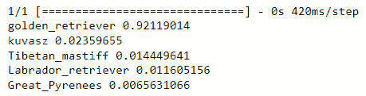

图 6.12 – VGG16 模型的预测结果及置信度；模型以高置信度将图像标记为 golden_retriever

模型已正确预测图像为`golden_retriever`，置信度为`0.92119014`。我们现在理解了如何在一个新的数据集上使用预训练模型。

## 微调预训练模型

在迁移学习中，微调指的是调整或更新预训练模型的参数，以更好地适应特定任务或感兴趣的数据集。在使用迁移学习时，预训练模型最初是在一个大规模数据集上训练的，通常来自不同但相关的任务或领域。微调使我们能够利用预训练模型学到的知识，并针对特定任务或数据集进行定制。

微调过程通常包括以下步骤：

1.  **预训练模型初始化**：加载已经从源任务或数据集中学习到有用表示的预训练模型。模型的参数最初被冻结，这意味着在初始训练期间它们不会被更新。

1.  **模型的修改**：根据具体任务或数据集，预训练模型的最后几层或特定部分可能需要修改或替换。模型的架构可以根据所需的输出或适应目标任务的特性进行调整。

1.  **解冻和训练**：修改模型后，之前冻结的参数被解冻，允许它们在训练过程中更新。然后，模型在目标任务特定的数据集上训练，通常称为微调数据集。模型的权重通过反向传播和基于梯度的优化算法更新，以最小化任务特定的损失函数。

1.  **使用较低的学习率进行训练**：在微调过程中，通常使用比预训练模型初始训练时更小的学习率。这个较小的学习率有助于在一定程度上保留之前学到的表示，同时允许模型适应目标任务或数据集。

微调的过程在利用预训练模型捕获的知识和针对目标任务的特定细节进行定制之间找到了平衡。通过微调，模型可以学习特定于任务的模式并优化其在新任务或数据集上的性能。所需的微调量可能因源任务和目标任务或领域之间的相似性而异。在某些情况下，只需要几次训练迭代就足够了，而在其他情况下，可能需要更广泛的训练。

微调是迁移学习中的一个关键步骤，因为它使得从源任务或数据集向目标任务的知识迁移成为可能，从而提高了目标任务的表现并加快了收敛速度。以下是一个使用 VGG16 模型进行图像标注的迁移学习示例。我们首先导入必要的库：

```py
from tensorflow.keras.applications import VGG16
from tensorflow.keras.preprocessing.image import ImageDataGenerator
from tensorflow.keras.models import Sequential
from tensorflow.keras.layers import Dense, Flatten
```

我们有两种图像类别——狗和猫，因此我们将类别数量变量设置为`2`。我们还将加载一个不带顶层预训练的 VGG16 模型。我们这里的图像大小是 256 x 256 x 3：

```py
num_classes = 2
base_model = VGG16(weights='imagenet', include_top=False, input_shape=(256, 256, 3))
```

我们现在冻结预训练层并创建一个新的模型用于微调。然后我们使用`'adam'`作为优化器来编译模型：

```py
for layer in base_model.layers:
    layer.trainable = False
model = Sequential()
model.add(base_model)
model.add(Flatten())
model.add(Dense(256, activation='relu'))
model.add(Dense(num_classes, activation='softmax'))
model.compile(optimizer='adam', loss='categorical_crossentropy', metrics=['accuracy'])
```

为了准备训练，我们正在配置训练集和验证集的数据生成器。这一关键步骤涉及使用`ImageDataGenerator`将像素值缩放到 0 到 1 之间，这样做可以确保图像数据的一致和高效处理，增强模型在训练期间学习模式和特征的能力：

```py
train_data_dir = /path_to_training_data'
validation_data_dir = '/path_to_validation_data'
batch_size = 32
train_datagen = ImageDataGenerator(rescale=1.0/255.0)
validation_datagen = ImageDataGenerator(rescale=1.0/255.0)
train_generator = train_datagen.flow_from_directory(
    train_data_dir,
    target_size=(256, 256),
    batch_size=batch_size,
    class_mode='categorical')
validation_generator = validation_datagen.flow_from_directory(
    validation_data_dir,
    target_size=(256, 256),
    batch_size=batch_size,
    class_mode='categorical')
```

我们现在可以微调模型并保存它：

```py
epochs = 10
model.fit(
    train_generator,
    steps_per_epoch=train_generator.samples // batch_size,
    epochs=epochs,
    validation_data=validation_generator,
    validation_steps=validation_generator.samples // batch_size)
model.save('fine_tuned_model.h5')
```

使用这个保存的模型，我们可以将其部署到各种应用中，例如对新数据进行预测、将其集成到更大的系统中，或进一步微调类似任务。保存的模型文件封装了训练过程中学习到的模式和特征，为未来的使用和分析提供了宝贵的资源。

在下一节中，我们将深入探讨标签中的半监督学习概念——这是一种既复杂又易于接近的技术，它结合了标记和无标记数据的优点。

# 半监督学习

传统的监督学习依赖于一个完全标记的数据集，这可能会消耗大量时间和成本。另一方面，半监督学习允许我们利用标记和无标记数据来训练模型并做出预测。这种方法提供了一种更有效的方式来标记数据并提高模型性能。

半监督学习在标记数据稀缺或昂贵时特别有用。它允许我们利用大量现成的无标记数据，这在现实世界场景中通常很丰富。通过利用无标记数据，半监督学习提供了几个好处：

+   **成本效益**：半监督学习减少了对外昂贵的手动标记工作的依赖。通过使用成本较低的未标记数据，我们可以显著减少获取标记数据相关的费用。

+   **利用大型未标记数据集**：未标记数据通常很丰富且易于获取。半监督学习使我们能够利用这一巨大资源，使我们能够在比全监督学习更大的数据集上训练模型。这可能导致更好的模型泛化能力和性能。

+   **改进模型性能**：通过在训练过程中结合未标记数据，半监督学习可以提高模型性能。未标记数据提供了额外的信息，并帮助模型更准确地捕捉潜在的数据分布。这可能导致更好的泛化能力和在未见数据上的更高准确性。

在半监督学习中，有不同方法可以利用未标记数据以不同的方式。以下是一些常见方法：

+   **自训练**：自训练涉及首先在有限的标记数据上训练一个模型。然后，使用该模型对未标记数据进行预测，并将自信的预测视为未标记实例的伪标签。这些伪标签实例随后与标记数据结合，以迭代方式重新训练模型。

+   **协同训练**：协同训练涉及在数据的不同子集或视图中训练多个模型。每个模型从标记数据中学习，然后为未标记数据预测标签。模型对未标记数据预测的一致性或差异性被用来选择最自信的实例，这些实例随后被标记并添加到训练集中进行进一步的迭代。

+   **生成模型**：在半监督学习中，可以使用生成模型，如**变分自编码器**（**VAEs**）或**生成对抗网络**（**GANs**）。这些模型学习潜在的数据分布并生成合理的实例。通过将生成的实例纳入训练过程，模型可以捕捉更多样化的表示并提高其泛化性能。

让我们看看在 Python 中实现这种标记方法的一个简单示例。首先，我们导入必要的库：

```py
import numpy as np
import pandas as pd
from sklearn.model_selection import train_test_split
from sklearn.preprocessing import StandardScaler
from sklearn.linear_model import LogisticRegression
from sklearn.metrics import accuracy_score
from sklearn.semi_supervised import LabelPropagation
```

我们利用之前示例中预处理过的`credit-g`数据集，并将其分为标记和未标记的子集。本例假设您正在使用我们在*不确定性* *采样*部分创建的`df_preprocessed` DataFrame：

```py
X = df_preprocessed.drop('target', axis=1)
y = df_preprocessed['target']
# Split the dataset into labeled and unlabeled
X_train, X_test, y_train, y_test = train_test_split(X, y, test_size=0.2, random_state=42)
labeled_percentage = 0.1  # Percentage of labeled data
X_train_labeled, X_train_unlabeled, y_train_labeled, _ = train_test_split(
    X_train, y_train, test_size=1 - labeled_percentage, random_state=42)
```

然后我们使用标记数据训练一个监督机器学习模型。在本例中，我们将使用逻辑回归作为监督模型：

```py
supervised_model = LogisticRegression()
supervised_model.fit(X_train_labeled, y_train_labeled)
```

我们接着应用训练好的监督模型来预测未标记数据的标签。预测的标签被视为未标记实例的伪标签：

```py
# Predict labels for the unlabeled data
pseudo_labels = supervised_model.predict(X_train_unlabeled)
```

现在将标记数据（`X_labeled`）与伪标记数据（`X_unlabeled`）连接起来，创建结合的特征数据集（`X_combined`）。将相应的标签（`y_labeled`和`pseudo_labels`）连接起来，创建结合的标签数据集（`y_combined`）：

```py
# Concatenate the labeled data with the pseudo-labeled data
X_combined = np.concatenate((X_labeled, X_unlabeled))
y_combined = np.concatenate((y_labeled, pseudo_labels))
```

接下来，使用结合的特征数据集（`X_combined`）和标签数据集（`y_combined`）训练一个半监督机器学习模型。在这个例子中，我们将使用`LabelPropagation`作为半监督模型：

```py
semi_supervised_model = LabelPropagation()
semi_supervised_model.fit(X_combined, y_combined)
```

使用训练好的半监督模型对测试集进行预测并计算准确率：

```py
y_pred = semi_supervised_model.predict(X_test)
accuracy = accuracy_score(y_test, y_pred)
print(f'Test accuracy: {accuracy:.3f}')
```

打印语句输出了最终的准确率分数，在这个例子中，准确率为 0.635。

在使用`LabelPropagation`训练我们的`semi_supervised_model`之后，得到的模型有效地从标记和无标记数据中学习。测试集（`y_pred`）上的预测展示了模型泛化和推断先前未见实例标签的能力。这个输出作为半监督学习技术的一个宝贵示例，这些技术利用了标记和无标记数据，可以在现实世界场景中做出稳健和准确的预测。

# 摘要

在本章中，我们探讨了机器学习中各种程序化标记技术。标记数据对于训练有效的模型至关重要，而手动标记可能既耗时又昂贵。程序化标记提供了自动化的方法来为数据的实例分配有意义的类别或类别。我们讨论了一系列技术，包括模式匹配、数据库查找、布尔标志、弱监督、半弱监督、切片函数、主动学习、迁移学习和半监督学习。

每种技术都根据数据的性质和特定的标记要求提供独特的优势和考虑。通过利用这些技术，从业者可以简化标记过程，减少人工工作量，并使用大量标记或弱标记的数据训练有效的模型。理解和利用程序化标记技术对于构建稳健和可扩展的机器学习系统至关重要。

在下一章中，我们将探讨合成数据在以数据为中心的机器学习中的作用。
