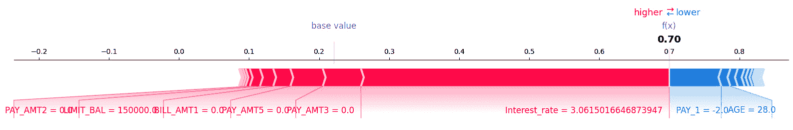

# 第八章：识别和消除偏差的技术

在以数据为中心的机器学习领域，追求无偏差和公平的模型至关重要。偏差算法的后果可能从性能不佳到道德上有疑问的决定。重要的是要认识到，偏差可以在机器学习管道的两个关键阶段显现：数据和模型。虽然以模型为中心的方法近年来受到了广泛关注，但本章将重点介绍通常被忽视的同样重要的以数据为中心的策略。

在本章中，我们将探讨机器学习中偏差的复杂性，强调数据中心性是偏差缓解的基本方面。我们将探讨来自金融、人力资源和医疗保健等领域的真实世界案例，其中未能解决偏差已经或可能产生深远的影响。

在本章中，我们将涵盖以下主题：

+   偏差难题

+   偏差类型

+   数据中心性必要性

+   案例研究

# 偏差难题

机器学习中的偏差并非一个新问题。它深深植根于我们收集的数据和我们设计的算法中。偏差可能源于历史差异、社会偏见，甚至在数据收集和标注过程中人类所做的决策。忽视偏差，或者仅仅通过以模型为中心的技术来处理偏差，可能会导致不良后果。

考虑以下场景，这些场景说明了偏差的多面性：

+   **金融中的偏差**：在金融领域，机器学习模型在信用评分、欺诈检测和投资建议中发挥着关键作用。然而，如果历史贷款实践偏向某些人口群体而忽视其他群体，这些偏差可能会渗透到用于训练模型的数据库中。结果，边缘化社区可能会面临不公平的贷款实践，加剧社会经济不平等。

+   **人力资源中的偏差**：人工智能在人力资源中的应用在招聘、员工绩效评估甚至薪资谈判方面势头强劲。如果职位发布或历史招聘数据偏向特定性别、种族或背景，AI 系统可能会无意中延续歧视，导致工作场所缺乏多样性和包容性。

+   **医疗保健中的偏差**：在医疗保健领域，诊断算法被用于疾病检测和治疗建议。如果训练数据主要代表某些人口群体，来自代表性不足群体的个人可能会接受不理想的护理或面临延迟诊断。其影响可能是改变一生的，强调了公平医疗保健 AI 的必要性。

现在我们已经涵盖了可能产生偏差的领域，在下一节中，我们将探讨机器学习中普遍存在的偏差类型。

# 偏差类型

在机器学习中，通常有五种需要关注的偏差类别。尽管提供的列表并不全面，但这些类别代表了最普遍的偏差类型，每种类型都可以进一步细分。

## 容易识别的偏差

一些类型的偏差可以通过主动监控和分析轻松识别。以下是一些例子。

### 报告偏差

这种偏差发生在数据生产者、数据标注者或数据收集者遗漏了重要元素时，导致数据不能代表现实世界。例如，一家医疗保健企业可能对病人对健康计划的看法感兴趣；然而，数据标注者可能会决定专注于负面和正面情绪，而中性的情绪可能被不足代表。在这样数据上训练的模型擅长识别正面和负面情绪，但可能无法准确预测中性情绪。这种偏差可以通过主动监控来识别，其中对实时数据的预测与对训练数据的预测存在偏差。为了减少报告偏差，在机器学习系统设计初期明确所需的数据点非常重要。同样重要的是确保用于训练的数据代表真实世界数据。

### 自动化偏差

这种偏差发生在依赖于自动化的数据收集方式，并假设数据捕获不会出错的情况下。随着人工智能的日益完善，对人类的依赖显著减少，因此通常假设如果实施自动化系统，那么它将神奇地解决所有问题。使用主动监控可以帮助识别这种类型的偏差，其中模型在真实数据上的准确性非常低。另一种识别方法是通过让人类标注标签并衡量人类性能与算法性能。如*第六章**，机器学习系统中程序化标注技术的失败可能导致数据丢失或不准确。人工智能的好坏取决于其训练数据。数据中心化的一个关键原则是让人类参与其中；因此，在构建自动化系统时，我们应该确保生成数据代表真实世界场景，并且数据多样化，而不是过度或不足代表。

### 选择偏差

这种偏差发生在用于训练模型的所选数据不能代表真实世界数据时。这种偏差可以有多种形式：

+   **覆盖偏差**：这种偏差可能发生在数据不是以代表性的方式收集时。这可能发生在企业和从业者专注于结果，而忽略了那些对结果没有贡献的数据点。在医疗保健领域，保险公司可能想要预测医院的入院人数；然而，关于那些在保险公司频繁更换并使用竞争性保险产品的人，或者那些没有申请福利而进入医院的人的数据可能并不容易获得，因此，这些人群在训练数据中可能没有得到很好的代表。

+   **参与偏差**：这种偏差可能由于参与者选择退出数据收集过程，导致某一群体在另一群体中过度代表。例如，一个模型被训练用来根据调查数据预测流失率，其中 80%已经转移到新竞争对手的人不太可能回应调查，他们的数据在样本中高度代表性不足。

+   **抽样偏差**：这种偏差可能发生在数据收集者没有在数据收集过程中使用适当的随机化方法时。例如，一个模型被训练用来根据调查数据预测健康分数；调查者没有随机地针对人口，而是选择了 80%高度关注健康并且更有可能回应的人，与那些不太可能回应的其他受访者相比。在健康产业中，那些更关注健康的人可能比那些不太关注健康的人有更好的健康分数，这可能导致模型偏向于健康人群。

选择偏差难以识别；然而，如果数据中频繁出现漂移，并且频繁重新训练以确保模型质量不下降，那么就是调查和检查所捕获的数据是否代表真实世界数据的好时机。回归模型中的两种分析方法可以帮助识别这种偏差。一种是进行双变量分析，其中敏感变量可以表示在*x*轴上，目标变量可以放在*y*轴上。如果两个变量之间存在强烈的关联，那么在训练时间和评分后时间评估关联指标差异是很重要的。如果差异显著，那么用于训练的数据很可能不代表真实生活。第二种技术是通过比较数据未完全代表和完全代表时的可能结果来进行多元分析。这可以通过将子群体分为训练时包含的数据点和排除的数据点来完成。我们可以通过创建一个独立变量组来运行多回归模型，将组 1 标记为包含的数据，组 2 标记为未包含的数据。然后我们将这个新变量作为特征添加到模型训练中，并比较组 1 和组 2 之间是否存在显著的差异。如果存在差异，那么数据收集存在偏差。

在分类示例中，我们可以通过查看敏感子群体中的假阳性率和/或假阴性率来观察这些值是否差异很大。如果差异很大，数据很可能偏向于一个或几个子群体。另一个可以用来检查偏差是否持续存在的指标是人口统计学上的平等性，它是对从一个子群体到另一个子群体选择可能性的概率比较。如果高选择子群体与低选择子群体之间的概率比率低于 0.8，那么数据很可能存在偏差，并且代表性样本不足。建议检查多个指标以了解数据及算法中的偏差。

为了处理这类偏差，建议在收集数据时采用分层抽样等技巧，以确保数据集中不同群体按比例代表。现在我们已经介绍了易于识别的偏差类型，在下一节中，我们将讨论一些难以识别的偏差类型。

## 难以识别的偏差

一些类型的偏见可能具有挑战性，因为它们是个人可能没有意识到的偏见。这些偏见通常在潜意识层面运作，并可能影响感知、态度和行为。为了捕捉这些偏见，组织和个人需要流程和培训来确保这些偏见不会存在于工作场所。一旦确定数据收集过程或数据标注过程中存在偏见，就可以定义敏感标签来衡量和检查模型是否没有偏见，或者模型中是否存在可接受的偏见水平。以下将描述一些这些偏见。

### 组别归因偏见

这种类型的偏见发生在对整个数据进行归因时基于某些数据点。这通常发生在数据创建者对数据中存在的属性类型有先入为主的偏见时。这种偏见可以采取两种形式：

+   **群体偏见**: 这是一种先入为主的偏见，其中相关数据点与数据创建者产生共鸣，因此这些数据点获得有利的结果——例如，如果一位数据工程经理在设计简历筛选算法时，他们认为完成 Udacity 纳米学位的人符合该职位要求。

+   **群体同质性偏见**: 这是一种先入为主的偏见，其中数据点与数据创建者不产生共鸣，因此这些数据点获得不利的结果——例如，如果一位数据工程经理在设计简历筛选算法时，他们认为没有完成 Udacity 纳米学位的人不符合该职位要求。

让我们继续讨论另一种难以识别的偏见。

### 隐性偏见

这种类型的偏见发生在数据创建者根据自己的心理模型和个人经验对数据进行假设时。例如，在航空食品服务评论数据上训练的情感分析模型可能会将“ okay”这个词与中性情感联系起来。然而，世界上的一些地区使用“ okay”这个词来表示积极情感。

机器学习中的偏见可以采取多种形式；因此，我们将这些偏见分为两大类，**易于识别**的偏见和**难以识别**的偏见。从业者通常采用以模型为中心的方法来处理这些偏见，其中修改算法或使用偏见友好型算法已被视为可接受的做法。在下一节中，我们将从以模型为中心的方法转向另一种观点：以数据为中心的方法。

# 数据中心化命令

解决机器学习中的偏见需要一种全面的方法，其中以数据为中心的策略补充以模型为中心的技术。数据中心化涉及采取主动措施来编辑、清理和增强数据集本身，从而最大限度地减少模型可能继承的偏见。通过采用数据中心化实践，组织可以培养公平性、责任感和道德人工智能。

在本章的剩余部分，我们将探讨一系列以数据为中心的策略，这些策略赋予机器学习从业者减少偏差的能力。这些包括数据重采样、增强、净化、特征选择等。现实世界的例子将说明这些策略在金融、人力资源和医疗保健领域的实际影响。

如果数据被公平且准确地捕获或创建，那么算法很可能大部分都是无偏的。然而，本章中我们将涵盖的技术是在数据创建之后，机器学习从业者必须与提供的数据一起工作。

在以下子节中，我们将讨论一些数据为中心的策略，以在不改变算法的情况下减少机器学习中的偏差。这些可以被称为数据去偏技术。

## 样本方法

下采样和过采样等样本方法解决类别不平衡问题。下采样减少多数类实例，而过采样增强少数类示例。将两者结合起来可以减轻过拟合和信息损失，有效地平衡类别表示。这些方法可以与异常值处理和 Shapley 值结合使用，以进一步采样数据，其中难以分类或难以估计的数据点可以被移除或引入，以增强公平性指标。这些技术将在下一部分进行介绍。

### 下采样

在下采样中，我们移除随机或策略性的多数代表数据点的子集，以平衡类别分布——从难以分类或随机删除的多数类中删除数据点是常用的技术。我们还可以使用异常值移除进行回归任务。

### 过采样

在过采样中，我们添加随机或策略性的少数代表数据点的子集，为算法提供更多示例。我们可以为少数类重复或生成合成数据点，以平衡类别分布。我们可以使用**SMOTE（合成少数过采样技术**）和随机过采样等技术进行分类任务。或者，我们可以利用异常值或边缘案例的添加/删除进行回归任务。

### 下采样和过采样的组合

这些包括如`SMOTEENN`或`SMOTETomek`等技术，其中`SMOTE`用于过采样少数类。**编辑最近邻（ENN**）或 Tomek 链接等技术用于移除难以分类或难以使用最近邻达成一致意见的示例，因为这些点接近边界，没有明显的分离。

### 对数据进行过采样和下采样的异常检测

这包括使用异常检测技术来识别边缘情况的数据点，然后这些点可以被多次重新引入或移除，以便模型能够获得更好的信号或变得更加通用。

### 使用 Shapley 值进行过采样和下采样数据

这涵盖了使用 Shapley 值进行数据过采样或欠采样。Shapley 值通过评估每个特征对模型预测的贡献来量化特征的重要性。高 Shapley 值突出了有影响力的特征。移除具有高 Shapley 值但预测错误的实例可能会通过减少异常值来提高模型精度。对具有高 Shapley 值和正确预测的实例进行过采样可以加强模型对关键模式的理解，从而可能提高性能。

## 其他以数据为中心的技术

除了采样方法之外，还有其他以数据为中心的技术可以用来减少偏差，其中一些在之前的章节中已经介绍过，还有一些我们将在案例研究中使用。以下描述了三种主要方法。

### 数据清洗

这包括移除缺失数据，因为包含缺失数据可能导致不公平的结果。这些技术已在*第五章*，*数据清洗技术*中介绍，其中缺失数据被归类为“非随机缺失”。 

### 特征选择

这包括选择特定的特征或消除会减少偏差的特征。这可能意味着识别出一个与敏感变量和结果标签高度相关的变量，并移除这样的间接变量或移除敏感变量。

### 特征工程

特征工程提供了减轻模型偏差的有效工具。例如，重新编码敏感属性、创建交互项或引入代理变量等技术，使模型能够在没有直接访问敏感信息的情况下学习。特征选择和降维方法裁剪了无关或冗余的特征，促进了更公平和更健壮的模型。此外，生成合成特征或利用特定领域的知识有助于提高对数据有更好理解的模型，从而有助于更公平的决策，同时提高整体模型性能并减少偏差。在示例中，我们将创建一个合成变量“兴趣”，以展示模型相对于另一个子群体是如何偏向的。

现在我们已经介绍了以数据为中心的方法，在下一节中，我们将描述问题陈述，并举例说明我们如何在现实生活中识别和减少偏差。

# 案例研究

当前面临的挑战集中在揭示和解决台湾信用卡违约数据集中可能存在的潜在偏差。该数据集来自加州大学欧文分校机器学习库（[`archive.ics.uci.edu/dataset/350/default+of+credit+card+clients`](https://archive.ics.uci.edu/dataset/350/default+of+credit+card+clients)），包含过去六个月内 30,000 名信用卡客户的详细信息，包括性别、婚姻状况和教育等人口统计因素。关键问题是这些人口统计特征是否将这些特征训练的决策树分类器引入偏差，特别是关注与性别相关的偏差。本例的总体目标是不仅识别偏差，而且通过应用数据为中心的技术来减轻任何偏差的结果。通过使用公平性指标重新评估算法的性能，本例旨在揭示金融决策中偏差的现实影响，特别是这些偏差如何基于性别和其他人口统计因素影响个人，可能导致信用评估和金融机会的不平等对待。解决和纠正此类偏差对于促进金融系统的公平性和平等至关重要。

我们将使用两个关键指标来检查算法的公平性：

+   **均衡机会差异**: 该指标比较敏感变量（如性别、种族或年龄）的假阴性率和假阳性率，然后取假阴性率和假阳性率之间的最大差异。例如，在测试集中，男性和女性的假阳性率分别为 0.3 和 0.2（差异为 0.1），而男性和女性的假阴性率分别为 0.15 和 0.12（差异为 0.03）。由于假阳性率的差异更大，均衡机会将为 0.1。

+   **人口统计平等比率**: 该指标衡量模型做出的预测是否独立于敏感变量，如种族、性别或年龄。鉴于这是一个比率，它衡量的是低选择率与高选择率之间的比率。比率为 1 表示实现了人口统计平等，而低于 0.8 通常意味着算法对某一群体的高度偏见，超过其他群体。

以下是对数据集中特征的描述：

+   `LIMIT_BAL`: 给定信用的金额（新台币），包括个人消费者信用及其家庭（补充）信用。

+   `Sex`: 性别（1 = 男；2 = 女）。

+   `Education X3`: 教育（1 = 研究生；2 = 大学；3 = 高中；4 = 其他）

+   `Marriage X4`: 婚姻状况（1 = 已婚；2 = 未婚；3 = 其他）

+   `Age X5`: 人的年龄（以年为单位）

+   PAY_0- PAY_5; X6 - X11: 过去付款的历史记录，包括从 2005 年 4 月到 9 月的过去每月付款记录，其中 PAY_0X6 = 9 月的还款状态，PAY_2; X7 = 2005 年 8 月的还款状态；... PAY_6; X11 = 2005 年 4 月的还款状态。还款状态的测量尺度为 -1 = 按时支付金额；1 = 延迟 1 个月付款；2 = 延迟 2 个月付款；...；8 = 延迟 8 个月付款；9 = 延迟 9 个月，依此类推。

+   BILL_AMT1 . BILL_AMT6; X12-X17: 账单金额（以新台币计）。BILL_AMT1;X12 表示 2005 年 9 月的信用卡账单金额，而 BILL_AMT6;X17 表示 2005 年 4 月的信用卡账单金额。

+   PAY_AMT1-PAY_AMT6; X18-X23: 根据上个月账单金额支付的金额。PAY_AMT1;X18 表示 2005 年 9 月支付的金额，而 PAY_AMT6;X23 表示 2005 年 4 月支付的金额。

+   `default payment next month`: 一个人是否在下个月的付款中违约（是 = 1，否 = 0），在 2005 年

要导入数据集，您需要安装 `pandas`。我们还将使用 `os` 库来导航路径并存储数据集。此库是 Python 的原生库。我们将调用 `loan_dataset.csv` 文件，并将其保存在运行此示例的同一目录中：

```py
import pandas as pd
import os
FILENAME = "./loan_dataset.csv"
DATA_URL = "http://archive.ics.uci.edu/ml/machine-learning-databases/00350/default%20of%20credit%20card%20clients.xls"
```

文件加载所需时间取决于网络速度，从几秒到一分钟不等，因此当我们第一次运行此示例时，文件将存储在本地。然而，在后续运行中，借助 `os` 库，我们将检查文件是否存在，否则将其下载。我们将重命名两个变量：`PAY_0` 到 `PAY_1`，并将“下个月默认付款”重命名为 `default`。我们不认为 `ID` 列对机器学习有用，因此我们将删除它：

```py
if not os.path.exists(FILENAME):
    data = (
        pd.read_excel(io=DATA_URL, header=1)
        .drop(columns=["ID"])
        .rename(
            columns={"PAY_0": "PAY_1", "default payment next month": "default"}
        )
    )
    data.to_csv(FILENAME, sep=",", encoding="utf-8", index=False)
```

现在，我们将从本地目录将文件加载到名为 `dataset` 的 DataFrame 中。该文件包含 30,000 行和 24 列，包括目标变量：

```py
dataset = pd.read_csv(FILENAME, sep=",", encoding="utf-8")
dataset.shape
(30000, 24)
```

接下来，我们运行 `dataset.info()` 方法来检查是否存在任何缺失值或编码错误的列：


图 8.1 – `dataset.info()` 方法的输出

我们没有缺失数据；然而，有三个分类列（`SEX`、`EDUCATION` 和 `MARRIAGE`）的数据类型为整数，我们可能需要将它们转换为字符串。由于 `SEX` 中的值可能是序数，因此我们将首先将它们重新映射到 `1` 和 `0`：

```py
cat_colums = ['EDUCATION', 'MARRIAGE']
for col in cat_colums:
    dataset[col] = dataset[col].astype("category")
dataset['SEX'] = dataset['SEX'].map({1: 1, 2:0})
```

如果我们再次运行 `dataset.info()`，我们会看到三个列的数据类型现在是 `category`；我们现在可以一维编码它们。我们排除 `SEX` 进行一维编码，因为在这个数据集中，一个人要么是男性要么是女性，并且该信息可以包含在一列中。我们还将提取 `SEX` 并将其存储在另一个变量 `A` 中，并分离目标变量和独立特征。接下来，我们为 `SEX` 特征中的值创建一个映射，用于分析和可视化，以帮助解释结果，因此 `1` 将映射到 `male` 值，而 `0` 将映射到 `female` 值。我们将此映射存储在 `A_str` 变量中：

```py
Y, A = dataset.loc[:, "default"], dataset.loc[:, "SEX"]
X = pd.get_dummies(dataset.drop(columns=["default","SEX"]))
X["SEX"] = A.copy()
A_str = A.map({1: "male", 0: "female"})
```

接下来，让我们加载所有必需的库。

## 加载库

要运行示例，你需要以下额外的库：

+   `sklearn`（scikit-learn）用于数据预处理和拟合模型

+   `numpy` 用于计算一些指标和一些数据处理

+   `imblearn` 用于过采样和欠采样

+   `fairlearn` 用于计算偏差和公平性分数

+   `shap` 用于可视化模型的解释

我们在开始时加载所有库：

```py
from sklearn.model_selection import train_test_split, cross_validate
from sklearn.preprocessing import StandardScaler
from sklearn.tree import DecisionTreeClassifier
from imblearn.over_sampling import SMOTE, ADASYN
from imblearn.combine import SMOTEENN, SMOTETomek
from sklearn.ensemble import IsolationForest
from imblearn.pipeline import make_pipeline
from imblearn.under_sampling import AllKNN, InstanceHardnessThreshold, RepeatedEditedNearestNeighbours, TomekLinks, EditedNearestNeighbours
from sklearn.metrics import balanced_accuracy_score, roc_auc_score, confusion_matrix, ConfusionMatrixDisplay
from sklearn.pipeline import Pipeline
from fairlearn.metrics import MetricFrame, equalized_odds_difference, demographic_parity_ratio
import numpy as np
import shap
```

接下来，我们使用 `train_test_split` 将数据集分为 `train` 和 `test`，并将 20% 的数据分配给测试。我们还把 `A_str` 分为 `A_train` 和 `A_test`，这样我们就可以在测试数据上计算公平性分数：

```py
X_train, X_test, y_train, y_test, A_train, A_test = train_test_split(X,
                 Y,
                 A_str,
                 test_size=0.2,
                 stratify=Y,
                 random_state=42)
```

接下来，我们创建决策树分类器管道并用敏感特征训练算法：

```py
d_tree_params = {
    "min_samples_leaf": 10,
    "random_state": 42
}
estimator = Pipeline(steps=[
    ("classifier", DecisionTreeClassifier(**d_tree_params))
])
estimator.fit(X_train, y_train)
```

接下来，我们计算 ROC 分数并提取预测值。我们还可视化混淆矩阵：

```py
y_pred_proba = estimator.predict_proba(X_test)[:, 1]
y_pred = estimator.predict(X_test)
print(f"Roc score is : {roc_auc_score(y_test, y_pred_proba)}")
cm = ConfusionMatrixDisplay(confusion_matrix(y_test, y_pred), display_labels=estimator.classes_)
cm.plot()
Roc score is : 0.6875636482794665
```

代码生成了以下混淆矩阵：


图 8.2 – 输出混淆矩阵

为了检查算法是否公平，我们首先计算假阳性率和假阴性率，然后比较测试数据集中男性和女性群体之间的差异，以查看两个群体之间是否存在很大差异。

在下面的代码块中，我们创建了两个函数来计算假阳性率和假阴性率。我们进一步创建了一个公平性度量字典，其中我们使用了假阳性率和假阴性率，以及来自 scikit-learn 的平衡准确度指标。然后我们创建了一个公平性度量列表，并将其存储在一个变量中以方便访问：

```py
def false_positive_rate(y_true, y_pred):
    """Compute the standard error for the false positive rate estimate."""
    tn, fp, fn, tp = confusion_matrix(y_true, y_pred).ravel()
    return fp/(fp+tn)
def false_negative_rate(y_true, y_pred):
    """Compute the standard error for the false positive rate estimate."""
    tn, fp, fn, tp = confusion_matrix(y_true, y_pred).ravel()
    return fn/(tp+fn)
fairness_metrics = {
    "balanced_accuracy": balanced_accuracy_score,
    "false_positive_rate": false_positive_rate,
    "false_negative_rate": false_negative_rate,
}
metrics_to_report = list(fairness_metrics.keys())
```

我们还创建了一个函数来报告男性和女性群体在公平性度量上的差异。我们首先使用 `fairlearn` 的便利函数 `MetricFrame` 创建一个名为 `metricframe` 的 DataFrame。它接受真实标签、预测和敏感特征值，以及一个报告的度量字典。然后我们利用 `.by_group` 属性报告每个群体的公平性度量。在函数内部，我们还报告了来自 `fairlearn` 库的 `equalised_odds_difference` 和 `demographic_parity_ratio`，以了解模型的总体公平性：

```py
def calculate_fairness_metrics(y_test, y_pred, A_test, metrics=fairness_metrics):
    """Function to calculate fairness metrics"""
    metricframe = MetricFrame(
        metrics=fairness_metrics,
        y_true=y_test,
        y_pred=y_pred,
        sensitive_features=A_test,
    )
    print(metricframe.by_group[metrics_to_report])
    print("\n *diff*")
    print(metricframe.difference()[metrics_to_report])
    print("\n *final_metrics*")
    print(metricframe.overall[metrics_to_report])
    equalized_odds = equalized_odds_difference(
        y_test, y_pred, sensitive_features=A_test
    )
    print("\n *equalized_odds*")
    print(equalized_odds)
    dpr= demographic_parity_ratio(y_test, y_pred, sensitive_features=A_test)
    print("\n *demographic_parity_ratio*")
    print(dpr)
```

我们现在运行函数并计算公平性分数。很明显，由于在各个群体中假阳性率和假阴性率相似，模型在男性和女性群体中相当相似。由于假阳性率与假阴性率的差异大于假阴性率，均衡机会差异与两组假阳性率之间的差异相同。我们还可以看到，人口比例率高于 0.8，这意味着两个群体都有相当大的可能性获得积极的结果：

```py
calculate_fairness_metrics_unmitigated = calculate_fairness_metrics(y_test, y_pred, A_test)
```

这将显示以下输出：


图 8.3 – 公平性分数

为了说明数据集中的偏差，我们可能需要生成一个与真实世界场景相关的合成变量，在该场景中，根据历史数据，一个群体受到更不公平的对待。首先，我们比较训练数据集中男性和女性的违约率。然后我们添加合成噪声：

```py
for val in dataset.SEX.unique():
    print(f"{('male' if val == 1 else 'female')} default rate is: ")
    print(dataset[dataset.SEX == val]['default'].mean())
    print()
female default rate is:
0.20776280918727916
male default rate is: 0.2416722745625841
```

由于男性的违约率高于女性，我们可以复制一个偏差场景，其中违约率较低的申请者将获得较低的利率，而违约率较高的申请者将受到银行施加的较高利率。让我们假设银行经理认为男性更有可能违约，并且银行决定不对场景进行泛化，而是对男性收取更高的利率。

为了模拟这个场景，我们将引入一个新的特征，`Interest_rate`，遵循高斯分布。当某人没有违约时，平均值将是 0，但如果有违约，将是 1 的两倍。我们还为男性设置标准差为 2，为女性设置标准差为 1。

为了生成合成的高斯分布，我们使用`numpy.random.normal`方法，种子为`42`以确保可重复性：

```py
np.random.seed(42)
X.loc[:, 'Interest_rate'] = np.random.normal(loc=2*Y, scale=A.map({1:2, 0:1}))
print("Maximum interest rate for men who defaulted vs women who defaulted")
print(X[(X.SEX == 1) & (Y == 1)]["Interest_rate"].max(), X[(X.SEX == 0) & (Y == 1)]["Interest_rate"].max())
print()
print("Maximum interest rate for men who did not default vs women that did not default")
print(X[(X.SEX == 1) & (Y == 0)]["Interest_rate"].max(), X[(X.SEX == 0) & (Y == 0)]["Interest_rate"].max())
Maximum interest rate for men who defaulted vs women who defaulted
9.852475412872653 6.479084251025757
Maximum interest rate for men who did not default vs women that did not default
6.857820956016427 3.852731490654721
```

现在我们已经添加了噪声，我们使用利率变量重新训练算法并重新计算公平性指标。我们首先分割数据，然后重新训练并重新计算公平性指标。我们像之前一样将数据重新分割成`train`和`test`，然后重新训练算法。一旦重新训练，我们计算影响。

在以下代码中，我们可以看到，通过添加合成的利率变量，我们提高了 ROC 指标：

```py
y_pred_proba = estimator.predict_proba(X_test)[:, 1]
y_pred = estimator.predict(X_test)
roc_auc_score(y_test, y_pred_proba)
0.8465698909107798
```

从以下输出中可以清楚地看出，我们现在有一个基于均衡机会的更具偏差的算法。在男性中，假阴性率相当高，这意味着不太可能偿还银行的男性更有可能获得贷款，如果这个模型被投入生产，可能会导致不公平的结果：

```py
calculate_fairness_metrics(y_test, y_pred, A_test)
```

这将打印以下信息：


图 8.4 – 公平性分数

为了减少偏差，我们将在特征选择中应用第一种以数据为中心的偏差消除技术，通过从算法中移除敏感变量来实现。这可以通过重新训练不带`SEX`变量的算法来完成。

由于数据集因利率差异较大而偏向于某一性别，在现实世界中，建议数据工程师和数据科学家与领域专家和数据生产者合作，以减少数据集中的这种偏差。例如，与其使用`SEX`来确定利率，不如使用其他特征，如支付历史、信用历史和收入。在训练步骤中，我们可以删除`SEX`变量：

```py
estimator.fit(X_train.drop(['SEX'], axis=1), y_train)
Pipeline(steps=[('classifier',
                 DecisionTreeClassifier(min_samples_leaf=10, random_state=42))])
```

从以下输出中，我们可以看到，通过移除`SEX`变量，ROC 分数从 0.846 下降到 0.839：

```py
estimator.fit(X_train.drop(['SEX'], axis=1), y_train)
y_pred_proba = estimator.predict_proba(X_test.drop(['SEX'], axis=1))[:, 1]
y_pred = estimator.predict(X_test.drop(['SEX'], axis=1))
roc_auc_score(y_test, y_pred_proba)
0.8392395442658211
```

观察以下公平性指标，很明显，当结果基于数据集的队列存在偏差时，从训练中移除变量可以消除算法的偏差。在`male`中的假阴性率有所下降，而在`female`中有所上升；然而，与使用`SEX`变量相比，算法更加公平。均衡机会从 0.18 下降到 0.07，但人口比例比有所降低，这意味着一个群体获得贷款的机会比另一个群体更多：

```py
calculate_fairness_metrics_mitigated_v1 = calculate_fairness_metrics(y_test, y_pred, A_test)
```

输出如下：


图 8.5 – 公平性指标

接下来，我们将向您展示如何应用欠采样技术以确保结果变量平衡。

## AllKNN 欠采样方法

我们将从`imblearn`包中的 AllKNN 算法开始，然后尝试即时硬度算法。由于这些算法在底层使用 KNN，这是一种基于距离的度量，我们需要确保使用 scikit-learn 的`StandardScaler`方法对特征进行缩放。我们将首先缩放变量，然后运行采样算法，然后训练决策树。我们将使用 5 k 交叉验证运行算法，并确保函数返回训练好的模型。交叉验证将在`roc_auc`和平衡准确度上进行评分。

我们将首先尝试一个来自`imblearn`的欠采样技术，`AllKNN`。这个算法并不旨在平衡多数和少数类别；然而，它从多数类别中移除难以分类的实例。它是通过迭代实现的，首先在完整数据集上训练模型。然后在多数类别的预测步骤中，如果邻居之间关于预测结果存在任何不一致，该数据点将从多数类别中移除。在第一次迭代中，训练一个 1-KNN 模型并移除一些样本，然后在下一次迭代中，训练一个 2-KNN 模型，在接下来的迭代中，训练一个 3-KNN 模型。通常，算法（默认情况下）将在 3-KNN 迭代结束时停止；然而，实践者可以选择更多的迭代，算法将不会停止，直到多数和少数类别的样本数量相同或达到最大迭代次数——哪个先到为止。

首先，我们来定义缩放器和采样方法：

```py
scaler = StandardScaler()
sampler_method = AllKNN(n_jobs=-1)
```

接下来，我们创建一个管道对象，并将缩放器、采样器和估计器传递到管道中：

```py
sampler_pipeline = make_pipeline(
    scaler,
    sampler_method,
    estimator)
```

然后我们传递训练数据并运行交叉验证。我们将交叉验证方法设置为通过设置 `return_estimator=True` 返回估计器（管道），这样我们就可以用它来对测试数据进行预测：

```py
cv_results = cross_validate(sampler_pipeline,
                            X_train.drop(['SEX'], axis=1),
                            y_train, scoring=['roc_auc','balanced_accuracy'],
                            return_estimator=True)
```

接下来，我们打印交叉验证步骤返回的预测结果中每个步骤的 ROC 和平衡准确率的平均值和标准差，在每个步骤中，训练使用了四个折，并在第五个折上进行预测：

```py
print(f"Validation roc auc : {cv_results['test_roc_auc'].mean():.3f} +/- {cv_results['test_roc_auc'].std():.3f}")
print(f"Validation balanced acc : {cv_results['test_balanced_accuracy'].mean():.3f} +/- {cv_results['test_balanced_accuracy'].std():.3f}")
Validation roc auc : 0.853 +/- 0.006
Validation balanced acc : 0.802 +/- 0.005
```

我们可以看到，通过使用下采样技术移除困难示例，`test` 数据上的 `roc_auc` 从上一步的 0.839 上升到 0.85：

```py
model = sampler_pipeline.fit( X_train.drop(['SEX'], axis=1), y_train)
y_pred_proba = model.predict_proba(X_test.drop(['SEX'],axis=1))[:, 1]
y_pred = model.predict(X_test.drop(['SEX'],axis=1))
roc_auc_score(y_test, y_pred_proba)
0.8537904984477683
```

接下来，我们计算公平性指标。尽管男性和女性的假阴性率都有所下降，但假阳性率有所上升，与上一步相比，均衡概率差异也有所增加。这可能是由于难以分类的男性样本已被移除：

```py
calculate_fairness_metrics_mitigated_v2 = calculate_fairness_metrics(y_test, y_pred, A_test)
```


图 8.6 – 公平性指标

我们现在将通过引入困难案例来探索对公平性指标的影响。

## 实例硬度下采样方法

如其名所示，实例硬度方法专注于难以分类的样本，这些样本通常位于边界或与其他类别重叠。通常，这取决于所使用的算法（因为一些算法在某些困难情况下比其他算法更好）以及类别之间的重叠程度。对于这样的样本，学习算法通常会显示对困难案例的低概率预测，这意味着概率越低，实例硬度越高。在底层，该方法具有根据类别不平衡保留正确数量样本的能力。

在第一步中，我们将定义算法，并将算法传递到实例硬度步骤。然后我们将定义实例硬度下采样方法，采用三折交叉验证。

接下来，我们创建决策树估计器。最后，我们将管道中的步骤与缩放数据集、下采样数据和最终训练模型相结合。当管道定义后，我们运行与之前管道类似的交叉验证：

```py
d_tree_params = {
    "min_samples_leaf": 10,
    "random_state": 42
}
d_tree = DecisionTreeClassifier(**d_tree_params)
sampler_method = InstanceHardnessThreshold(
    estimator=d_tree,
    sampling_strategy='auto',
    random_state=42,
    n_jobs=-1,
    cv=3)
estimator = Pipeline(steps=[
    ("classifier", DecisionTreeClassifier(**d_tree_params))
])
sampler_pipeline = make_pipeline(
    scaler,
    sampler_method,
    estimator)
cv_results = cross_validate(sampler_pipeline, X_train.drop(['SEX'], axis=1), y_train, scoring=['roc_auc','balanced_accuracy'], return_estimator=True)
```

`AllKNN` 和 `InstanceHardness` 返回了类似的交叉验证结果：

```py
print(f"Validation roc auc : {cv_results['test_roc_auc'].mean():.3f} +/- {cv_results['test_roc_auc'].std():.3f}")
print(f"Validation balanced acc : {cv_results['test_balanced_accuracy'].mean():.3f} +/- {cv_results['test_balanced_accuracy'].std():.3f}")
Validation roc auc : 0.853 +/- 0.005
Validation balanced acc : 0.807 +/- 0.007
```

当使用实例硬度方法时，`test` 数据上的 ROC 从 0.85 略微上升到 0.854：

```py
model = sampler_pipeline.fit( X_train.drop(['SEX'], axis=1), y_train)
y_pred_proba = model.predict_proba(X_test.drop(['SEX'],axis=1))[:, 1]
y_pred = model.predict(X_test.drop(['SEX'],axis=1))
roc_auc_score(y_test, y_pred_proba)
0.8549627959428299
```

公平性指标与之前的欠采样技术相当相似，可能由于类似的原因，通过去除困难案例，模型无法处理预测困难的`男性`案例。然而，在两种欠采样方法中，与特征选择步骤相比，均衡机会增加了，而且人口统计学平等比率仍然低于 0.8，这意味着在预测`违约`时，一个性别子类更有可能被选中而不是另一个：

```py
calculate_fairness_metrics_mitigated_v3 = calculate_fairness_metrics(y_test, y_pred, A_test)
```


图 8.7 - 公平性指标

接下来，让我们看看过采样方法。

## 过采样方法

提高模型性能和公平性指标的一种方法是引入额外的示例。接下来的两种过采样技术，`SMOTE`和`ADASYN`，在*第七章*中介绍，*在以数据为中心的机器学习中使用合成数据*，因此我们不会详细介绍算法背后的细节。我们将使用这些技术，通过添加额外的示例来提高公平性指标，希望模型能够通过额外的数据点更好地学习。

对于每种方法，我们首先将数据集进行缩放，添加额外的少数类示例，然后训练模型。我们将打印交叉验证分数和`测试`ROC 分数，以及公平性指标。

### SMOTE

由于我们在*第七章*中使用了此算法，*在以数据为中心的机器学习中使用合成数据*，我们将直接进入代码：

```py
estimator = Pipeline(steps=[
    ("classifier", DecisionTreeClassifier(**d_tree_params))
])
sampler_method = SMOTE(random_state=42)
sampler_pipeline = make_pipeline(
    scaler,
    sampler_method,
    estimator)
cv_results = cross_validate(sampler_pipeline, X_train.drop(['SEX'], axis=1), y_train, scoring=['roc_auc','balanced_accuracy'], return_estimator=True)
print(f"Validation roc auc : {cv_results['test_roc_auc'].mean():.3f} +/- {cv_results['test_roc_auc'].std():.3f}")
print(f"Validation balanced acc : {cv_results['test_balanced_accuracy'].mean():.3f} +/- {cv_results['test_balanced_accuracy'].std():.3f}")
model = sampler_pipeline.fit( X_train.drop(['SEX'], axis=1), y_train)
y_pred_proba = model.predict_proba(X_test.drop(['SEX'],axis=1))[:, 1]
y_pred = model.predict(X_test.drop(['SEX'],axis=1))
roc_auc_score(y_test, y_pred_proba)
Validation roc auc : 0.829 +/- 0.009
Validation balanced acc : 0.758 +/- 0.012
0.8393191272926885
```

与之前介绍的欠采样方法相比，验证指标和`测试`ROC 分数显示出较差的结果。在下一步中，我们将探索公平性指标：

```py
calculate_fairness_metrics_mitigated_v4 = calculate_fairness_metrics(y_test, y_pred, A_test)
```


图 8.8 - 公平性指标

与欠采样方法相比，公平性指标更好——也就是说，男性和女性之间的假阳性率和假阴性率之间的差异减小了，基于人口统计学平等比率，模型更有可能同时选择两种性别的贷款违约申请人。在下一节中，我们将使用`ADASYN`算法，并将其与`SMOTE`和其他欠采样方法进行比较。

### ADASYN

与`SMOTE`方法类似，我们在*第七章*中介绍了`ADASYN`，*在以数据为中心的机器学习中使用合成数据*，因此我们将直接进入代码，其中我们将对少数类进行过采样：

```py
sampler_method = ADASYN(random_state=42)
sampler_pipeline = make_pipeline(
    scaler,
    sampler_method,
    estimator)
cv_results = cross_validate(sampler_pipeline, X_train.drop(['SEX'], axis=1), y_train, scoring=['roc_auc','balanced_accuracy'], return_estimator=True)
print(f"Validation roc auc : {cv_results['test_roc_auc'].mean():.3f} +/- {cv_results['test_roc_auc'].std():.3f}")
print(f"Validation balanced acc : {cv_results['test_balanced_accuracy'].mean():.3f} +/- {cv_results['test_balanced_accuracy'].std():.3f}")
model = sampler_pipeline.fit( X_train.drop(['SEX'], axis=1), y_train)
y_pred_proba = model.predict_proba(X_test.drop(['SEX'],axis=1))[:, 1]
y_pred = model.predict(X_test.drop(['SEX'],axis=1))
roc_auc_score(y_test, y_pred_proba)
Validation roc auc : 0.823 +/- 0.004
Validation balanced acc : 0.757 +/- 0.006
0.816654655300673
```

验证指标和`测试`ROC 分数略低于`SMOTE`结果和欠采样方法。现在，让我们回顾公平性指标：

```py
calculate_fairness_metrics_mitigated_v5 = calculate_fairness_metrics(y_test, y_pred, A_test)
```


图 8.9 - 公平性指标

`ADASYN`的均衡机会略高，而与`SMOTE`相比，人口比例略好，两种过采样技术都保证了比欠采样方法更高的公平性，但 ROC 性能略差。

我们已经看到，尽管平衡了类别，但模型公平性受到了损害，模型在大多数`男性`例子上犯的错误更多。因此，在下一节中，我们将随机引入一些额外的`男性`例子，其中模型错误地将阳性案例分类为阴性。

### 随机过采样和错误分类的例子

我们将首先使用`ADASYN`平衡数据集，并避免欠采样技术，因为我们希望保留难以分类的困难案例。然后我们训练模型，并识别模型认为应该是阳性但错误地将其分类为阴性的`男性`案例。然后我们随机选择这些案例的 10%，将它们重新添加到训练数据集中，并使用相同的算法重新训练模型。

最后，我们回顾`测试`数据上的模型指标和公平性指标。

我们使用过采样并在随机位置重新引入被错误分类的数据点。让我们使用`ADASYN`过采样方法运行管道：

```py
sampler_method = ADASYN(random_state=42)
sampler_pipeline = make_pipeline(
    scaler,
    sampler_method,
    estimator)
cv_results = cross_validate(sampler_pipeline, X_train.drop(['SEX'], axis=1), y_train, scoring=['roc_auc','balanced_accuracy'], return_estimator=True)
model = sampler_pipeline.fit( X_train.drop(['SEX'], axis=1), y_train)
```

接下来，我们识别训练数据集中模型在男性人口上犯错误的例子——即模型预测错误的阴性例子。我们首先对与男性相关的数据进行子集划分，然后在此数据上运行预测：

```py
X_train_males = X_train[X_train.SEX == 1].copy()
X_train_males["predictions"] = model.predict(X_train_males.drop(['SEX'], axis=1))
X_train_males['y_true'] = y_train.filter(X_train_males.index)
```

然后，我们选取`true`标签为`1`但模型预测为`0`的数据子集：

```py
X_train_male_false_negatives = X_train_males[(X_train_males.y_true == 1) & (X_train_males.predictions == 0)]
```

我们随机选择 10%的值并将它们添加到`X_train`数据集中。我们利用`.sample`方法，并且这个随机选择是带替换进行的：

```py
X_train_sample = X_train_male_false_negatives[X_train.columns].sample(frac=0.1, replace=True, random_state=42, axis=0)
y_train_sample = X_train_male_false_negatives['y_true'].sample(frac=0.1, replace=True, random_state=42, axis=0)
```

然后，我们将这 10%添加到`X_train`和`y_train`中，并创建一个新的数据集：

```py
X_train_with_male_samples = pd.concat([X_train, X_train_sample], axis=0, ignore_index=True)
y_train_with_male_samples = pd.concat([y_train, y_train_sample], axis=0, ignore_index=True)
```

然后，我们在新的数据集上训练算法，并打印出验证指标和`测试`ROC 分数：

```py
cv_results = cross_validate(sampler_pipeline, X_train_with_male_samples.drop(['SEX'], axis=1), y_train_with_male_samples, scoring=['roc_auc','balanced_accuracy'], return_estimator=True)
print(f"Validation roc auc : {cv_results['test_roc_auc'].mean():.3f} +/- {cv_results['test_roc_auc'].std():.3f}")
print(f"Validation balanced acc : {cv_results['test_balanced_accuracy'].mean():.3f} +/- {cv_results['test_balanced_accuracy'].std():.3f}")
model = sampler_pipeline.fit(X_train_with_male_samples.drop(['SEX'], axis=1), y_train_with_male_samples)
y_pred_proba = model.predict_proba(X_test.drop(['SEX'],axis=1))[:, 1]
y_pred = model.predict(X_test.drop(['SEX'],axis=1))
roc_auc_score(y_test, y_pred_proba)
Validation roc auc : 0.824 +/- 0.005
Validation balanced acc : 0.754 +/- 0.005
0.8201623558253082
```

与过采样部分相比，验证指标和`测试`ROC 分数相当相似。接下来，我们回顾公平性指标，以检查它们是否有所改善：

```py
calculate_fairness_metrics_mitigated_v6 = calculate_fairness_metrics(y_test, y_pred, A_test)
```


图 8.10 – 公平性指标

通过添加一些错误的阴性`男性`例子，我们可以看到均衡机会略微提高到了 0.098，人口比例也有所改善，增加到 0.85。我们相信，如果我们添加错误的阳性例子和错误的阴性例子，并将这些与欠采样和过采样技术结合起来，我们可以取得更好的结果。

为了演示这一点，我们将遍历四种欠采样技术（`AllKNN`、`RepeatedEditedNearestNeighbours`、`InstanceHardnessThreshold` 和 `Tomek`），两种过采样技术（`SMOTE` 和 `ADASYN`），以及两种过采样和欠采样的组合技术（`SMOTEENN` 和 `SMOTETomek`）。这些算法的工作原理超出了本例的范围。相反，目标是演示这些数据技术如何导致更好的选择和具有略微较差性能但更高公平性的泛化模型。

我们现在将开发一种机制，首先训练算法，然后添加假阳性和假阴性示例。一旦添加了示例，我们将通过采样数据集并使用先前算法运行管道。我们将记录公平性结果和 ROC 分数，以找到在我们算法中最好地促进公平性和性能平衡的技术。

我们首先创建一个字典，包含上述每种采样技术的配置，这样我们就可以遍历它。我们可以将这个采样技术称为 AutoML：

```py
methods = {
    "all_knn": AllKNN(n_jobs=-1),
    "renn": RepeatedEditedNearestNeighbours(n_jobs=-1),
    "iht": InstanceHardnessThreshold(
        estimator=DecisionTreeClassifier(**d_tree_params),
        random_state=42,
        n_jobs=-1,
        cv=3),
    "tomek": TomekLinks(n_jobs=-1),
    "adasyn" : ADASYN(random_state=42),
    "smote" : SMOTE(random_state=42),
    "smoteenn": SMOTEENN(random_state=42,
                         smote=SMOTE(random_state=42),
                         enn=EditedNearestNeighbours(n_jobs=-1)
                        ),
    "smotetomek": SMOTETomek(random_state=42,
                             smote=SMOTE(random_state=42),
                             tomek=TomekLinks(n_jobs=-1)
                            )
          }
```

接下来，我们创建了两个函数，这些函数接受训练数据集、模型、列及其子集值，以帮助创建随机样本。以下函数将采样假阳性：

```py
def sample_false_positives(X_train, y_train, estimator, perc=0.1, subset_col="SEX", subset_col_value=1, with_replace=True):
    """Function to sample false positives"""
    X_train = X_train.copy()
    y_train = y_train.copy()
    X_train_subset = X_train[X_train[subset_col] == subset_col_value].copy()
    y_train_subset = y_train.filter(X_train_subset.index).copy()
    X_train_subset["predictions"] = estimator.predict(X_train_subset.drop([subset_col], axis=1))
    X_train_subset['y_true'] = y_train_subset.values
    X_train_subset_false_positives = X_train_subset[(X_train_subset.y_true == 0) & (X_train_subset.predictions == 1)]
    X_train_sample = X_train_subset_false_positives[X_train.columns].sample(frac=perc, replace=with_replace, random_state=42, axis=0)
    y_train_sample = X_train_subset_false_positives['y_true'].sample(frac=perc, replace=with_replace, random_state=42, axis=0)
    X_train_sample = pd.concat([X_train, X_train_sample], axis=0, ignore_index=True)
    y_train_sample = pd.concat([y_train, y_train_sample], axis=0, ignore_index=True)
    return X_train_sample, y_train_sample
```

此函数将采样假阴性。默认情况下，两种方法都会添加 10% 的随机示例，并替换它们：

```py
def sample_false_negatives(X_train, y_train, estimator, perc=0.1, subset_col="SEX", subset_col_value=1, with_replace=True):
    """Function to sample false positives"""
    X_train = X_train.copy()
    y_train = y_train.copy()
    X_train_subset = X_train[X_train[subset_col] == subset_col_value].copy()
    y_train_subset = y_train.filter(X_train_subset.index).copy()
    X_train_subset["predictions"] = estimator.predict(X_train_subset.drop([subset_col], axis=1))
    X_train_subset['y_true'] = y_train_subset.values
    X_train_subset_false_negatives = X_train_subset[(X_train_subset.y_true == 1) & (X_train_subset.predictions == 0)]
    X_train_sample = X_train_subset_false_negatives[X_train.columns].sample(frac=perc, replace=with_replace, random_state=42, axis=0)
    y_train_sample = X_train_subset_false_negatives['y_true'].sample(frac=perc, replace=with_replace, random_state=42, axis=0)
    X_train_sample = pd.concat([X_train, X_train_sample], axis=0, ignore_index=True)
    y_train_sample = pd.concat([y_train, y_train_sample], axis=0, ignore_index=True)
    return X_train_sample, y_train_sample
```

接下来，我们创建一个函数，该函数在数据改进后计算测试指标。该函数接受测试数据和估计器，并返回模型指标和公平性指标：

```py
def calculate_metrics(estimator, X_test, y_test, A_test):
    """Function to calculate metrics"""
    y_pred_proba = estimator.predict_proba(X_test)[:, 1]
    y_pred = model.predict(X_test)
    roc_auc = roc_auc_score(y_test, y_pred_proba)
    balanced_accuracy = balanced_accuracy_score(y_test, y_pred)
    equalized_odds = equalized_odds_difference(
        y_test, y_pred, sensitive_features=A_test
    )
    dpr = demographic_parity_ratio(y_test, y_pred, sensitive_features=A_test)
    return roc_auc, balanced_accuracy, equalized_odds, dpr
```

接下来，我们创建一个管道，该管道将采样数据集，然后创建随机的假阳性 `male` 和假阴性 `male` 示例。然后我们将这些示例逐个合并到训练数据中，并重新训练相同的算法。然后我们计算指标并将它们存储在一个名为 `results` 的列表中，其中包含列。每次迭代都会添加带有模型性能和公平性指标的假阴性和假阳性示例。然后我们使用这个列表来比较算法之间的结果。

注意

创建管道的代码相当长。请参阅 GitHub 以获取完整代码：[`github.com/PacktPublishing/Data-Centric-Machine-Learning-with-Python/tree/main/Chapter%208%20-%20Techniques%20for%20identifying%20and%20removing%20bias`](https://github.com/PacktPublishing/Data-Centric-Machine-Learning-with-Python/tree/main/Chapter%208%20-%20Techniques%20for%20identifying%20and%20removing%20bias)

接下来，我们创建一个名为 `df` 的 DataFrame，并将所有的 `test` 指标添加进去，以便我们可以比较哪种方法获得了最佳模型性能和公平性指标：

```py
df = pd.DataFrame(data=results,
                  columns=["method", "sample",
                           "test_roc_auc", "test_balanced_accuracy",
                           "equalized_odds",
                           "demographic_parity_ratio",
                           "validation_roc_auc",
                           "validation_balanced_accuracy"]
                 )
```

让我们根据均衡机会对 DataFrame 进行排序：

```py
df.sort_values(by="equalized_odds")
```

我们可以看到，当数据集使用 Tomek Links 进行采样时，从边界移除了困难案例，并与额外的错误阳性`男性`训练样本结合，这导致了最佳均衡概率为 0.075；然而，没有达到 0.8 的人口比例。当使用 SMOTETomek 技术与错误阴性`男性`示例结合时，模型实现了 0.088 的均衡概率比，这是所有采样方法中最好的，模型也实现了高的人口比例比。


图 8.11 – 结果输出数据集

### 使用异常值进行过采样

在前面的步骤中，我们了解到通过将错误分类的示例添加到训练数据集中，我们能够提高模型公平性。在下一步中，我们不会随机选择样本，而是将利用一个识别异常值的算法，然后我们将这些异常值添加到训练数据集中作为过采样机制。

首先，我们创建一个管道来过采样少数类：

```py
X_train_scaled = pd.DataFrame()
scaler = StandardScaler()
sampler = SMOTETomek(random_state=42,
                     smote=SMOTE(random_state=42),
                     tomek=TomekLinks(n_jobs=-1)
                    )
```

接下来，我们提取过采样数据。没有理由为什么不能选择欠采样或无采样。一旦提取过采样数据，我们将其缩放回原始特征空间：

```py
columns = X_train.drop(['SEX'], axis=1).columns
X_train_scaled[columns] = scaler.fit_transform(X_train.drop(['SEX'], axis=1))
X_train_resample, y_train_resample = sampler.fit_resample(X_train_scaled, y_train)
X_train_resample[columns] = scaler.inverse_transform(X_train_resample)
```

接下来，我们训练隔离森林以识别 10%的异常值。为此，我们将污染率设置为`0.1`。然后我们在重采样数据上拟合模型，并在此数据上运行预测。我们将结果存储在一个名为`IF_anomaly`的列中，并将其添加到重采样数据集中。然后我们提取这些异常值，作为隔离森林标签，其值为`-1`：

```py
anomaly_model = IsolationForest(contamination=float(.1), random_state=42, n_jobs=-1)
anomaly_model.fit(X_train_resample)
X_train_resample['IF_anomaly'] = anomaly_model.predict(X_train_resample)
X_train_resample['default'] = y_train_resample
X_train_additional_samples = X_train_resample[X_train_resample.IF_anomaly == -1]
X_train_additional_samples.drop(['IF_anomaly'], axis=1, inplace=True)
```

接下来，我们将这些额外的数据点添加到原始数据集中，并训练决策树模型。一旦模型拟合完成，我们就在`测试`数据上计算 ROC 分数。我们可以看到这是 0.82：

```py
X_train_clean = X_train_resample[X_train_resample.IF_anomaly != -1]
y_train_clean = X_train_clean.default
estimator.fit(X_train_clean.drop(['IF_anomaly', 'default'], axis=1), y_train_clean)
y_pred_proba = estimator.predict_proba(X_test.drop(['SEX'], axis=1))[:, 1]
y_pred = estimator.predict(X_test.drop(['SEX'], axis=1))
roc_auc_score(y_test, y_pred_proba)
0.8248481592937735
```

接下来，我们计算公平性指标。根据以下结果，我们可以说，在上一节中训练的模型产生了更好的公平性和人口比例比分数：


图 8.12 – 公平性指标

现在我们已经利用了各种欠采样和过采样的数据示例，包括重新引入随机错误分类的示例和异常值，在下一节中，我们将利用一种高级技术，我们将更慎重地选择添加哪些示例以及移除哪些示例，以进一步减少算法中的偏差。

## 使用 Shapley 值来检测偏差、过采样和欠采样数据

在本节中，我们将利用 Shapley 值来识别模型难以做出正确预测的示例。我们将使用影响分数来添加、消除或使用两者的组合来提高公平性指标。

**SHAP**（代表**Shapley Additive exPlanations**）是一种基于博弈论原理的无模型偏见机器学习方法。它通过分配一个分数来帮助研究特征及其交互对最终结果的重要性，类似于在游戏中计算每个玩家在特定时间点的贡献，就像在计算分数输出时那样。

Shapley 值可以帮助提供全局重要性（特征对所有预测的整体影响），也可以提供局部重要性（每个特征对单个结果的影响）。它还可以帮助理解影响的方向——也就是说，一个特征是否有积极影响或消极影响。

因此，在机器学习中，Shapley 值有很多应用场景，例如偏差检测、局部和全局模型调试、模型审计和模型可解释性。

在本节中，我们使用 Shapley 值来理解模型和特征对结果的影响。我们利用这些特征的影响，并确定模型最有可能犯错误的地方。然后我们应用两种技术：一种是从数据中删除这些行，另一种是对包含这些行的数据进行过采样。

首先，我们导入 SHAP 库，然后在过采样数据集上训练决策树模型。在步骤结束时，我们有一个模型和过采样的`X`和`y`样本。我们将`SEX`变量包含在训练数据中，以查看 Shapley 值是否可以帮助我们检测偏差。首先，我们需要将数据重新拆分为`train`和`test`集，就像前几节所做的那样：

```py
model = DecisionTreeClassifier(**d_tree_params)
model.fit(X_train, y_train)
DecisionTreeClassifier(min_samples_leaf=10, random_state=42)
```

接下来，我们定义 SHAP 树解释器，通过提供决策树模型，然后使用`.shap_values`方法提取`train`集的 Shapley 值：

```py
explainer = shap.TreeExplainer(model)
shap_values = explainer.shap_values(X_train)
```

让我们提取 Shapley 值的第一个行，针对类别 0。数组包含每个特征值对最终输出的贡献。正值表示相应的特征对预测类别 0 有积极影响，而负值则对预测类别 0 产生负面影响：

```py
shap_values[0][0]
```

这将打印出以下数组：


图 8.13 – 结果输出数组

接下来，我们为类别标签 0 生成一个摘要图：

```py
shap.summary_plot(shap_values[0], X_train)
```

这将生成以下图表：


图 8.14 – SHAP 值

红点代表特征的高值，而蓝点代表相应特征的低值。*x*轴表示 Shapley 值，正值表示数据点在预测类别 0 时具有积极影响，而负值表示对应特征的数据点对类别 0 的预测产生负面影响。如果我们看*图 8.13*，高利率和男性客户对类别 0 的预测产生负面影响是非常明显的。Shapley 值确实表明模型对男性客户存在偏见。

接下来，我们为类别标签 1 生成一个摘要图：

```py
shap.summary_plot(shap_values[1], X_train)
```

这将生成以下摘要图：


图 8.15 – SHAP 摘要图

与类别 0 的摘要图相比，高利率和男性客户对贷款违约有积极影响——也就是说，如果你是男性并且之前有更高的利率，你很可能会违约。

我们之前了解到，通过从模型训练中移除 `SEX` 特征，模型变得更加公平，并且使用摘要图清楚地指示 Shapley 值。现在，我们通过训练不带 `SEX` 特征的新模型来提取 Shapley 值。然后我们对训练数据进行评分，首先识别所有对应于假阴性和假阳性的行。然后我们计算模型出错时每行的 Shapley 值总和，并保留影响最低的行。我们运行两个实验：首先，我们对训练数据集进行下采样并计算公平性指标，其次，我们对训练数据集进行上采样以向模型提供更好的信号并重新计算公平性指标。

首先，让我们在不包含 `SEX` 特征的情况下训练模型：

```py
model = DecisionTreeClassifier(**d_tree_params)
X_train_samples = X_train.drop(['SEX'], axis=1).copy()
y_train_samples = y_train.copy()
model.fit(X_train_samples, y_train_samples)
```

接下来，我们提取 Shapley 值：

```py
explainer = shap.Explainer(model)
shap_values = explainer.shap_values(X_train_samples)
```

我们对训练数据进行评分，计算预测值，并将这些值存储在 `Y_pred` 中：

```py
Y_pred = model.predict(X_train_samples)
```

然后我们将检查索引 0 处类别 0 和类别 1 的 Shapley 值总和，并打印相应的预测值和 `true` 值：

```py
print(f"Shapley value for first value in the dataset for class 0 : {sum(shap_values[0][0])}")
print(f"Shapley value for first value in the dataset for class 1 : {sum(shap_values[1][0])}")
print(f"Prediction of first value is {Y_pred[0]}")
print(f"Actual prediction is {y_train_samples[0]}")
Shapley value for first value in the dataset for class 0 : -0.07290931372549389
Shapley value for first value in the dataset for class 1 : 0.07290931372548978
Prediction of first value is 0
Actual prediction is 1
```

模型预测了 `0`。接下来，我们提取模型出错时的 Shapley 值。为此，我们使用带有 zip 功能的列表推导。数组的第一个值将是数据点的索引位置，这样我们就可以知道哪个 Shapley 值与哪一行相关。接下来的值按照预测顺序排列，包括 `true` 值、类别 0 的 Shapley 值行总和以及类别 1 的 Shapley 值总和。一旦我们提取了这些值，我们就创建一个 DataFrame 并将值存储在 `df` 中，然后通过 DataFrame 进行采样以查看五个值。我们使用随机种子以确保可重复性：

```py
data = [(index, pred, actual, sum(s0), sum(s1)) for
        index, (pred, actual, s0, s1) in
        enumerate(zip(Y_pred, y_train_samples, shap_values[0], shap_values[1]))
        if pred != actual]
df = pd.DataFrame(data=data, columns=["index", "predictions","actuals", "shap_class_0", "shap_class_1"])
df.sample(5, random_state=42)
```

这将生成以下输出：


图 8.16 – 显示造成错误的 Shapley 值的 DataFrame

对于索引 `7915`，Shapley 值很接近，这意味着每个类别的特征对模型预测的贡献更接近 `0`，而对于索引 `4255`，Shapley 值与 `0` 相差较远，特征在预测每个类别时具有区分性。

由于我们可以提取每个类别的特征 SHAP 影响值，我们想知道 Shapley 值影响最高的行，以便我们可以从训练中消除这样的数据点；影响低且接近边界的地方，我们可以对数据进行过采样。

观察索引`4255`的力图，对于预期的类`0`，由于`f(x)`相当低，模型可能会预测`1`，而模型错误地预测了`1`，而预期类`1`的力图显示了`f(x)`值为`0.7`。这样的数据点可以从数据集中删除：

```py
shap.force_plot(explainer.expected_value[0], shap_values[0][4255,:], X_train_samples.iloc[4255, :], matplotlib=True)
```

这将生成以下图表：


图 8.17 – 类 0 的力图

让我们看看类`1`的力图：

```py
shap.force_plot(explainer.expected_value[1], shap_values[1][4255,:], X_train_samples.iloc[4255, :], matplotlib=True)
```

这将显示以下输出：



图 8.18 – 类 1 的力图

现在，我们计算行索引`4255`的 Shapley 影响，因为它是一个假阳性预测。行索引在 DataFrame 的`422`位置。我们取 Shapley 影响的绝对值，并在 Shapley 影响最高且预测错误的地方，删除这些值以提高模型性能：

```py
index = 422
shap_impact = abs(df['shap_class_0'][index])
print(shap_impact)
0.4787916666666662
```

接下来，我们创建一个计算 Shapley 影响的函数。我们感兴趣的是那些单个特征具有至少`0.2` Shapley 影响的行。首先，我们获取数组中每个特征的绝对影响，然后提取最大值。如果最大值大于`0.2`，我们继续处理该行。接下来，我们检查预测值与实际值不匹配的地方，并从这样的行中提取 SHAP 影响：

```py
def get_shapley_impact(shap_value, threshold=0.2):
    """Calculate Shapley impact"""
    shap_value_impacts = np.abs(shap_value)
    if np.max(shap_value_impacts) >= threshold:
        return np.abs(np.sum(shap_value))
```

我们创建一个保留数据集，其中`X_train`将被进一步分为训练集和验证集。我们利用 80%进行训练，20%进行验证：

```py
X_train_sample, X_val, y_train_sample, y_val, A_train_sample, A_val = train_test_split(X_train,
                   y_train,
                   A_train,
                   test_size=0.2,
                   stratify=y_train,
                   random_state=42)
```

然后，我们使用`SMOTETomek`重新采样数据集，这是公平性和性能方面最好的采样方法，通过将困难示例重新添加到数据集中来实现。一旦数据集被重新采样，我们就按照前面的步骤训练标准决策树，并在保留的验证数据集上计算 ROC 分数：

```py
model = DecisionTreeClassifier(**d_tree_params)
scaler = StandardScaler()
sampler = SMOTETomek(random_state=42,
                     smote=SMOTE(random_state=42),
                     tomek=TomekLinks(n_jobs=-1)
                    )
columns = X_train_sample.columns
X_train_scaled = pd.DataFrame()
X_train_scaled[columns] = scaler.fit_transform(X_train_sample[columns])
X_train_resampled, y_train_resampled = sampler_method.fit_resample(X_train_scaled, y_train_sample)
X_train_resampled[columns] = scaler.inverse_transform(X_train_resampled)
A_train_resampled = X_train_resampled['SEX'].copy()
model.fit(X_train_resampled.drop(['SEX'], axis=1), y_train_resampled)
Y_pred = model.predict(X_train_resampled.drop(['SEX'], axis=1))
y_val_pred = model.predict_proba(X_val.drop(['SEX'], axis=1))[: ,1]
val_roc = roc_auc_score(y_val, y_val_pred)
print(f"Validation roc auc : {val_roc}")
Validation roc auc : 0.8275769341994823
```

我们在测试数据集上计算公平性和性能指标。均衡机会很高，但人口统计平等等比率在可接受范围内：

```py
y_pred_proba = model.predict_proba(X_test.drop(['SEX'], axis=1))[:, 1]
y_pred = model.predict(X_test.drop(['SEX'], axis=1))
print(f"Roc: {roc_auc_score(y_test, y_pred_proba)}")
Roc: 0.8258396009334518
```

接下来，我们计算公平性指标：

```py
calculate_fairness_metrics(y_test, y_pred, A_test)
```

这将打印出以下指标：


图 8.19 – 公平性指标

我们使用 SHAP 解释器提取 Shapley 值。我们确保已删除`SEX`特征：

```py
explainer = shap.Explainer(model)
columns = X_train_resampled.drop(['SEX'], axis=1).columns
shap_values = explainer.shap_values(X_train_resampled[columns])
```

公平性指标表明，男性和女性子类之间的假阴性率差距更大，因此我们专注于使用 Shapley 值减少男性的假阴性案例。

在下一步中，我们提取模型预测为类`0`但真实值为`1`的 Shapley 值。因此，我们对类`1`的 Shapley 值感兴趣，因为在模型出错的地方，类`1`的 SHAP 影响高可能是一个模型无法正确预测的数据点：

```py
shapley_impact_false_negative = [(i, get_shapley_impact(s), y, p, a)
                                for s, i, y, p, a
                                in zip(shap_values[1], X_train_resampled.index, y_train_resampled, Y_pred, A_train_resampled)
                                 if y == 1 and p == 0 and a == 1]
```

我们还对那些 Shapley 值和模型预测都与实际值一致的数据点感兴趣。因此，我们关注那些模型正确预测`男性`数据点的类别为`0`的数据点。一旦我们提取了这些数据点，我们就关注类别`0`的高影响力 Shapley 值，以便我们可以对这些数据进行过采样，从而使模型可以对这些数据点获得更好的信号：

```py
shapley_impact_true_negative = [(i, get_shapley_impact(s), y, p, a)
                                for s, i, y, p, a
                                in zip(shap_values[0], X_train_resampled.index, y_train_resampled, Y_pred, A_train_resampled)
                                 if y == 0 and p == 0 and a == 1]
```

接下来，我们排序假阴性 Shapley 值，以便我们可以提取高影响力的数据点：

```py
shapley_impact_false_negative_sorted = sorted([i for i in shapley_impact_false_negative if i[1] is not None], key=lambda x: x[1], reverse=True)
```

与前面类似，我们感兴趣的是具有高影响力的真阴性 Shapley 值，因此我们根据高影响力的 Shapley 值对列表进行排序：

```py
shapley_impact_true_negative_sorted =  sorted([i for i in shapley_impact_true_negative if i[1] is not None], key=lambda x: x[1], reverse=True)
```

现在我们已经提取并排序了假阴性和真阴性`男性`数据点的 Shapley 值，我们从假阴性列表中挑选前 100 个数据点进行消除，并从真阴性列表中挑选前 100 个数据点重新添加到训练数据中。真阴性列表中的前 100 个数据点将被随机打乱，并且只随机添加其中的 50 个数据点，采用替换策略。我们鼓励从业者尝试另一个打乱比例。一旦确定了用于消除和重新引入到最终训练集中的数据点，我们就更新训练数据。这些数据被命名为`X_train_final`和`y_train_final`：

```py
data_points_to_eliminate = [i[0] for i in shapley_impact_false_negative_sorted[0:100]]
data_points_to_add = [i[0] for i in shapley_impact_true_negative_sorted[0:100]]
X_train_added = X_train_resampled[columns].iloc[data_points_to_add].sample(frac=0.5, replace=True, random_state=42, axis=0)
y_train_added = y_train_resampled.iloc[data_points_to_add].sample(frac=0.5, replace=True, random_state=42, axis=0)
X_train_reduced = X_train_resampled[columns].drop(data_points_to_eliminate)
y_train_reduced = y_train_resampled.drop(data_points_to_eliminate)
X_train_final = pd.concat([X_train_reduced, X_train_added], axis=0, ignore_index=True)
y_train_final = pd.concat([y_train_reduced, y_train_added], axis=0, ignore_index=True)
```

接下来，我们训练更新的训练数据，并在`测试`数据上计算公平性指标和性能指标。很明显，假阴性率之间的差距已经减少，均衡的几率比已提高到 0.082，ROC 分数从先前的 0.825 略微提高到 0.826：

```py
estimator = DecisionTreeClassifier(**d_tree_params)
model = estimator.fit(X_train_final, y_train_final)
y_pred_proba = model.predict_proba(X_test.drop(['SEX'], axis=1))[:, 1]
y_pred = model.predict(X_test.drop(['SEX'], axis=1))
print(f"Roc: {roc_auc_score(y_test, y_pred_proba)}")
Roc: 0.8262453372973797
```

我们重新计算公平性指标：

```py
calculate_fairness_metrics(y_test, y_pred, A_test)
```

输出结果如下：


图 8.20 – 公平性指标

既然我们已经确定通过使用 Shapley 值可以识别难以分类且易于分类的数据点，我们可以构建一个自动机制来迭代数据点，从而可以达到比之前更好的公平性分数。

接下来，我们创建一系列百分比以进行迭代，这样我们就可以利用并排序消除和重新引入的前数据点的百分比。我们将使用 NumPy 的`linspace`方法创建一个百分比值的列表以进行迭代。我们从`0.05`到`0.5`（5%到 50%）中选择 10 个值。我们称这个列表为`perc_points_to_eliminate`：

```py
perc_points_to_eliminate = np.linspace(0.05,0.5,10)
perc_points_to_eliminate
array([0.05, 0.1 , 0.15, 0.2 , 0.25, 0.3 , 0.35, 0.4 , 0.45, 0.5 ])
```

我们遍历这些百分比，并重复先前的步骤，其中我们消除了一些值并重新引入了一些值。然而，这次，我们使用百分比来移除顶部百分比的数据点或引入顶部百分比的数据点。

我们还创建了一个空的数据列表，因此，对于每次迭代，我们捕获消除或重新引入的数据点的百分比、测试数据中的假阴性率和假阳性率、均衡的几率比和人口比例比。

一旦我们遍历了所有值 - 10*10 次迭代，我们将它们存储在一个 DataFrame 中，以查看需要移除多少数据点以及需要添加多少数据点才能达到最佳的公平性指标：

```py
fn_examples = len(shapley_impact_false_negative)
tn_examples = len(shapley_impact_true_negative)
model = DecisionTreeClassifier(**d_tree_params)
data = []
for fnp in perc_points_to_eliminate:
    data_points_to_eliminate = [idx[0] for idx in shapley_impact_false_negative_sorted[0:(round(fn_examples*fnp))]]
    for tnp in perc_points_to_eliminate:
        data_points_to_add = [idx[0] for idx in shapley_impact_true_negative_sorted[0:(round(tn_examples*tnp))]]
        X_train_added = X_train_resampled[columns].iloc[data_points_to_add].sample(frac=0.5, replace=True, random_state=42, axis=0)
        y_train_added = y_train_resampled.iloc[data_points_to_add].sample(frac=0.5, replace=True, random_state=42, axis=0)
        X_train_reduced = X_train_resampled[columns].drop(data_points_to_eliminate)
        y_train_reduced = y_train_resampled.drop(data_points_to_eliminate)
        X_train_final = pd.concat([X_train_reduced, X_train_added], axis=0, ignore_index=True)
        y_train_final = pd.concat([y_train_reduced, y_train_added], axis=0, ignore_index=True)
        model.fit(X_train_final, y_train_final)
        y_pred = model.predict(X_test.drop(['SEX'], axis=1))
        fpr = false_positive_rate(y_test, y_pred)
        fnr = false_negative_rate(y_test, y_pred)
        equalized_odds_mitigated = equalized_odds_difference(
            y_test, y_pred, sensitive_features=A_test
        )
        demographic_parity_ratio_mitigated = demographic_parity_ratio(y_test, y_pred, sensitive_features=A_test)
        data.append((fnp,
                     tnp,
                     fpr,
                     fnr,
                     equalized_odds_mitigated,
                     demographic_parity_ratio_mitigated
                    ))
```

接下来，我们创建一个名为 `df_shapley` 的 DataFrame，用于存储每个迭代的元数据，并按均衡机会比进行排序：

```py
columns = ["perc_false_negative_removed",
          "perc_true_negative_added",
          "false_positive_rate",
          "false_negative_rate",
          "equalized_odds_mitigated",
          "demographic_parity_ratio_mitigated"]
df_shapley = pd.DataFrame(data=data, columns=columns)
df_shapley.sort_values(by="equalized_odds_mitigated")
```

这将输出以下 DataFrame：


图 8.21 – 排序后的 df_shapley DataFrame

显然，当移除顶部 25% 的误报数据点并重新引入顶部 30% 的真实负数据点时，模型可以达到均衡机会比 0.074，以及最佳人口统计平等等级比得分 0.85。

最后，我们提取顶部百分比并训练最终模型：

```py
top_values = df_shapley.sort_values(by="equalized_odds_mitigated").values[0]
perc_false_negative_removed = top_values[0]
perc_true_negative_added = top_values[1]
columns = X_train_resampled.drop(['SEX'], axis=1).columns
data_points_to_eliminate = [i[0] for i in shapley_impact_false_negative_sorted[0:(round(fn_examples*perc_false_negative_removed))]]
data_points_to_add = [i[0] for i in shapley_impact_true_negative_sorted[0:(round(tn_examples*perc_true_negative_added))]]
X_train_added = X_train_resampled[columns].iloc[data_points_to_add].sample(frac=0.5, replace=True, random_state=42, axis=0)
y_train_added = y_train_resampled.iloc[data_points_to_add].sample(frac=0.5, replace=True, random_state=42, axis=0)
X_train_reduced = X_train_resampled[columns].drop(data_points_to_eliminate)
y_train_reduced = y_train_resampled.drop(data_points_to_eliminate)
X_train_final = pd.concat([X_train_reduced, X_train_added], axis=0, ignore_index=True)
y_train_final = pd.concat([y_train_reduced, y_train_added], axis=0, ignore_index=True)
```

我们训练模型并计算公平性和模型指标。我们可以看到，对于 `female` 的误报率有所增加，但 `male` 和 `female` 之间的差距已经减小，而 `male` 的误报率有所降低。ROC 得分达到 0.82，但根据两个公平性指标，模型更加公平：

```py
estimator = DecisionTreeClassifier(**d_tree_params)
model = estimator.fit(X_train_final, y_train_final)
y_pred_proba = model.predict_proba(X_test.drop(['SEX'], axis=1))[:, 1]
y_pred = model.predict(X_test.drop(['SEX'], axis=1))
print(f"Roc: {roc_auc_score(y_test, y_pred_proba)}")
Roc: 0.820911097453972
```

最后，我们计算公平性指标。

```py
calculate_fairness_metrics(y_test, y_pred, A_test)
```

这将打印出以下内容：


图 8.22 – 公平性指标

现在我们已经探索了通过提高数据质量来减少偏差的不同数据中心技术，我们鼓励您尝试之前的技巧，并尝试这些技巧的组合。一旦您用尽了这些数据中心方法，我们鼓励您使用一些模型中心方法，例如利用公平性感知的算法，尝试集成方法、AutoML 或遍历您自己的算法列表。

# 摘要

本章广泛探讨了机器学习中普遍存在的偏差挑战。它从解释机器学习模型中固有的各种偏差形式开始，并检查了它们对各个行业的影响。重点是识别、监控和减轻偏差，强调收集具有最小选择和抽样偏差的数据的重要性。

该主题倡导在解决偏差问题时，以数据为中心的强制措施优于以模型为中心的强制措施。探讨了过采样、欠采样、特征选择增强和异常检测等技术，用于偏差校正。Shapley 值在偏差识别中起着至关重要的作用，强调移除具有不匹配高 Shapley 值的示例，并通过替换重新引入数据点以改善比率。根据敏感变量（如 `SEX`）对误分类示例进行分层，以实现有针对性的偏差校正。

本章通过强调对敏感变量进行数据集精炼和平衡的重要性作为基础步骤。它建议在数据集本身得到改进后，转向以模型为中心的方法，例如集成和公平性算法。这些后续的以模型为中心的策略旨在提高性能和公平性指标，为更通用和公平的人工智能模型奠定基础。

这种全面的方法旨在创建一个平衡的数据集，作为应用以模型为中心的技术的前奏，以促进人工智能系统中的性能和公平性。
