# 9

# 在机器学习中处理边缘案例和罕见事件

在**机器学习**领域，正确识别和处理边缘情况至关重要。边缘情况指的是与数据集大多数数据显著不同的实例，它们可能会对机器学习模型的性能和可靠性产生重大影响。由于类别不平衡问题，罕见事件可能对机器学习模型具有挑战性，因为它们可能没有足够的数据来有效地学习模式。类别不平衡发生在某一类别（罕见事件）相对于其他类别（们）显著代表性不足时。传统的机器学习算法在这种场景下往往表现不佳，因为它们可能偏向于多数类别，导致在识别罕见事件时准确性降低。

在本章中，我们将探讨使用 Python 代码示例检测机器学习和数据中边缘案例的各种技术和方法。我们将探讨统计技术，包括使用可视化和其他措施如 Z 分数来分析数据分布并识别潜在的异常值。我们还将关注隔离森林和半监督方法，如**自编码器**，以揭示数据集中的异常和不规则模式。我们将学习如何通过过采样、欠采样和生成合成数据等技术来解决类别不平衡并提高模型性能。

在本章的后半部分，我们将了解调整学习过程以考虑不平衡类别的必要性，特别是在罕见事件具有重大后果的场景中。我们将探讨选择适当的评估指标的重要性，强调那些考虑类别不平衡的指标，以确保对模型性能的公平和准确评估。最后，我们将了解集成方法，如 bagging、boosting 和 stacking 如何帮助我们增强模型的鲁棒性，特别是在罕见事件发挥关键作用的场景中。

以下关键主题将涵盖：

+   在机器学习中检测罕见事件和边缘案例的重要性

+   统计方法

+   异常检测

+   数据增强和重采样技术

+   成本敏感学习

+   选择评估指标

+   集成技术

# 在机器学习中检测罕见事件和边缘案例的重要性

在机器学习中，检测罕见事件和边缘情况至关重要，原因有以下几点：

+   **关键场景中的决策**：罕见事件通常代表需要立即关注或特殊处理的临界场景或异常情况。例如，在医疗诊断中，罕见疾病或极端病例可能需要紧急干预。准确检测这些事件可以导致更好的决策并防止不良后果。

+   **不平衡数据集**：许多现实世界的数据集存在类别不平衡的问题，其中一个类别（通常是罕见事件）与其他类别相比显著代表性不足。这可能导致在少数类别上表现不佳的偏见模型。检测罕见事件有助于确定需要特殊处理的需求，例如使用重采样技术或采用适当的评估指标以确保公平评估。

+   **欺诈检测**：在欺诈检测应用中，罕见事件通常对应于欺诈交易或活动。检测这些罕见案例对于防止财务损失和确保金融系统的安全至关重要。

+   **质量控制与异常检测**：在制造和工业过程中，检测罕见事件可以帮助识别有缺陷或异常的产品或流程。这使及时干预成为可能，从而提高产品质量并保持运营效率。

+   **预测性维护**：在预测性维护中，检测边缘案例可以表明潜在的设备故障或异常行为，从而允许主动维护以减少停机时间并提高生产力。

+   **模型泛化**：通过准确识别和处理罕见事件，机器学习模型可以更好地泛化到未见数据，并有效地处理现实世界场景。

+   **客户行为分析**：在营销和客户分析中，检测罕见事件可以揭示有趣的异常模式或行为，例如识别高价值客户或检测潜在的流失者。

+   **安全和入侵检测**：在网络安全领域，罕见事件可能表明安全漏洞或网络攻击。实时检测和应对这些事件对于确保数字系统的安全和完整性至关重要。

+   **环境监测**：在环境应用中，罕见事件可能表明不寻常的生态条件或自然灾害。检测此类事件有助于灾害准备和环境监测工作。

让我们讨论不同的统计方法来分析数据分布并识别潜在的异常值。

# 统计方法

统计方法为我们识别数据中的异常值和异常情况提供了宝贵的工具，有助于数据预处理和决策制定。在本节中，我们将讨论如何使用诸如 Z 分数、**四分位数范围**（**IQR**）、箱线图和散点图等方法来揭示数据中的异常情况。

## Z 分数

Z 分数，也称为标准分数，是一种统计量，表示数据点与数据均值之间的标准差数。Z 分数用于标准化数据，并允许在不同数据集之间进行比较，即使它们有不同的单位或尺度。它们在检测异常值和识别数据集中的极端值方面特别有用。计算数据集中数据点 *x* 的 Z 分数的公式如下：

Z = (x − μ) / σ

在这里，以下规则适用：

+   *Z* 是数据点 *x* 的 Z 分数

+   *x* 是数据点的值

+   *μ* 是数据集的均值

+   *σ* 是数据集的标准差

Z 分数广泛用于检测数据集中的异常值。具有超出一定阈值（例如，*Z* > 3 或 *Z* < -3）的 Z 分数的数据点被认为是异常值。这些异常值可能代表数据中的极端值或测量误差。通过将数据转换为 Z 分数，均值变为 0，标准差变为 1，从而得到一个标准化的分布。

Z 分数用于正态性检验，以评估数据集是否遵循正态（高斯）分布。如果数据集遵循正态分布，则大约 68% 的数据点的 Z 分数应在 -1 和 1 之间，约 95% 在 -2 和 2 之间，几乎所有数据点都在 -3 和 3 之间。在假设检验中，Z 分数用于计算 *p*-值并对总体参数进行推断。

例如，当总体标准差已知时，Z 测试通常用于样本均值比较。Z 分数在异常检测中很有用，当我们想要识别与规范显著偏离的数据点时。高 Z 分数可能表明数据中的异常行为或罕见事件。

让我们使用 *Loan Prediction* 数据集在 Python 中探索这个概念。让我们首先加载数据集：

```py
import pandas as pd
import numpy as np
df = pd.read_csv('train_loan_prediction.csv')
df.head().T
```

在这里，我们看到样本数据集：

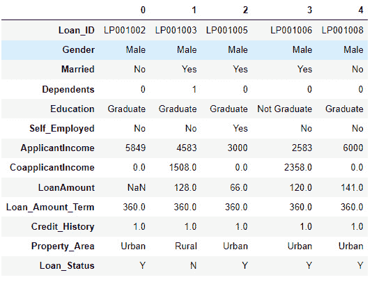

图 9.1 – df DataFrame

现在我们已经加载了数据集，我们可以在一些数值特征上计算 Z 分数：

```py
numerical_features = ['ApplicantIncome', 'CoapplicantIncome', 'LoanAmount']
z_scores = df[numerical_features].apply(lambda x: (x - np.mean(x)) / np.std(x))
```

我们利用 Z 分数有效地检测数据集中的异常值：

```py
threshold = 3
outliers = (z_scores > threshold) | (z_scores < -threshold)
outliers['is_outlier'] = outliers.any(axis=1)
outlier_rows = df[outliers['is_outlier']]
outlier_rows
```

通过设置 Z 分数阈值为 3，我们可以通过检查是否有任何行的值超出 Z 分数边界（大于 3 或小于 -3）来识别异常值。这种方法使我们能够确定与均值显著偏离的数据点，并使我们能够采取适当的措施来处理这些异常值，确保数据的完整性和后续分析和模型的准确性。

使用这种方法得到的输出 DataFrame 包含异常值如下：

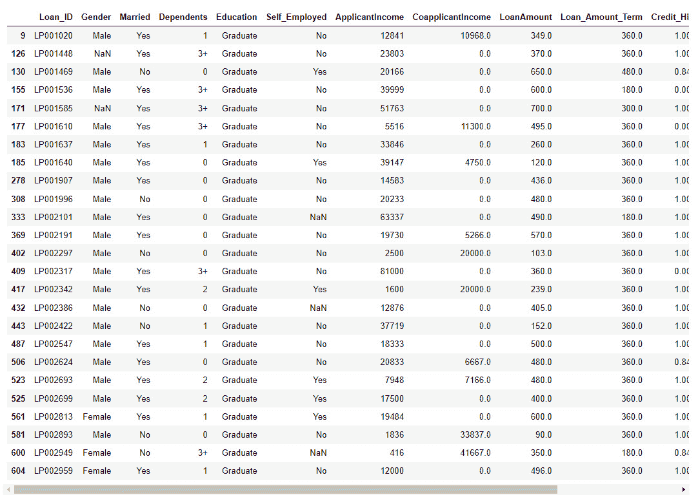

图 9.2 – 结果的 outlier_rows DataFrame

总结来说，Z 分数使得准确识别异常值变得更加容易。它们作为一个有用的工具，帮助我们更好地理解数据模式。在下一节关于四分位数的讨论中，我们将进一步探讨检测和解决异常值的替代方法。

## 四分位距（IQR）

IQR 是一种用于描述数据集分布或分散程度的统计量。它在识别和处理异常值以及理解数据的中心趋势方面特别有用。IQR 定义为数据集的第一四分位数（Q1）和第三四分位数（Q3）之间的范围。四分位数是将数据集分为四个相等部分，每个部分包含 25%的数据的点。

可以使用以下公式计算 IQR：

IQR = Q3 − Q1

在这里，以下规则适用：

+   Q1 是第一四分位数（25 百分位数），表示低于此值的 25%的数据。

+   Q3 是第三四分位数（75 百分位数），表示低于此值的 75%的数据。

IQR 通常用于识别数据集中的异常值。低于 Q1 - 1.5 * IQR 或高于 Q3 + 1.5 * IQR 的数据点被认为是异常值，可能需要进一步调查。IQR 提供了关于数据分布的有价值信息。它有助于理解数据集中间 50%的分布，可以用来评估分布的对称性。在比较数据集时，IQR 可以用来评估两个或更多数据集之间数据分散的差异。

下面是一个简单的例子，说明如何使用 Python 和 NumPy 在贷款预测数据集上计算数据集的 IQR。首先进行异常值检测，我们计算数值特征的 IQR。通过定义一个阈值，通常是 Tukey 方法中 IQR 的 1.5 倍，该方法涉及计算 IQR 为第三四分位数（Q3）和第一四分位数（Q1）之间的差值，我们可以识别异常值。Tukey 方法是一种稳健的统计技术，有助于检测与整体分布显著偏离的数据点，为识别数据集中的潜在异常提供了一个可靠的度量。一旦所有数值特征都被标记为异常值，我们就可以显示具有异常值的行，这有助于进一步分析和潜在的数据处理。使用 IQR 和 Tukey 方法一起可以促进有效的异常值检测，并有助于确保数据集的完整性：

```py
Q1 = df[numerical_features].quantile(0.25)
Q3 = df[numerical_features].quantile(0.75)
IQR = Q3 - Q1
threshold = 1.5
outliers = (df[numerical_features] < (Q1 - threshold * IQR)) | (df[numerical_features] > (Q3 + threshold * IQR))
outliers['is_outlier'] = outliers.any(axis=1)
outlier_rows = df[outliers['is_outlier']]
outlier_rows
```

下面是使用此方法得到的异常值输出 DataFrame：

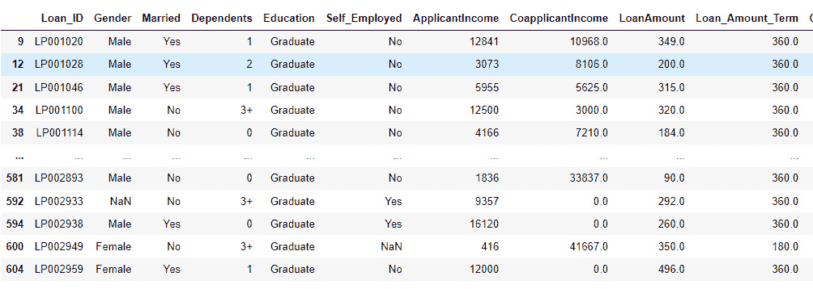

图 9.3 – 结果的 outlier_rows DataFrame

总之，探索四分位数间距（IQR）为识别异常值提供了一种有价值的技术，尤其是在捕捉数据集的中心趋势方面特别有效。虽然 IQR 在关注中间范围至关重要的情况下具有优势，但认识到它在捕捉整个数据分布方面的局限性是至关重要的。在接下来的关于箱线图的章节中，我们将深入研究一种补充 IQR 的图形表示，提供一种在多种情境下更好地理解数据分散和异常值的视觉工具。

## 箱线图

箱线图，也称为箱形图，是数据集分布的图形表示。它们提供了一种快速且信息丰富的可视化方式，可以直观地查看数据的分布和偏斜，识别潜在的异常值，并比较多个数据集。箱线图在处理连续数值数据时特别有用，可以用来深入了解数据的中心趋势和变异性。

这里是箱线图的组成部分：

+   **箱线图（IQR）**：箱线图表示 IQR，即数据的第一四分位数（Q1）和第三四分位数（Q3）之间的范围。它覆盖了数据集的中间 50%，并提供了数据分布的视觉表示。

+   **中位数（Q2）**：中位数，由箱内的水平线表示，指示数据集的中心值。它将数据分为两个相等的部分，其中 50%的数据点低于中位数，50%的数据点高于中位数。

+   **须**：须从箱的边缘延伸到位于“须长度”内的最远数据点。须的长度通常由一个因子（例如，IQR 的 1.5 倍）确定，并用于识别潜在的异常值。

+   **异常值**：位于须外的数据点被认为是异常值，通常单独作为单独的点或圆圈绘制。它们是显著偏离中心分布的数据点，可能需要进一步调查。

以下是一些箱线图的优点：

+   **可视化数据分布**：箱线图提供了一种直观的方式来查看数据的分布和偏斜，以及识别任何潜在的数据簇或缺口。

+   **比较数据集**：箱线图在并排比较多个数据集时很有用，允许轻松比较中心趋势和变异性。

+   **异常值检测**：箱线图通过突出显示位于须外的数据点来促进异常值检测，有助于识别异常或极端值。

+   **处理偏斜数据**：箱线图对极端值的影响具有鲁棒性，并且比传统的均值和标准差更有效地处理偏斜数据分布。

让我们使用 Python 中的`matplotlib`库来实现这种方法。在这里，我们将为`ApplicantIncome`和`LoanAmount`生成两个箱线图：

```py
import matplotlib.pyplot as plt
%matplotlib inline
plt.figure(figsize=(10, 6))
plt.subplot(2, 1, 1)
df.boxplot(column='ApplicantIncome')
plt.title('Box Plot - ApplicantIncome')
plt.subplot(2, 1, 2)
df.boxplot(column='LoanAmount')
plt.title('Box Plot - LoanAmount')
plt.tight_layout()
plt.show()
```

这里是绘图输出。我们看到在这些列中存在一些可能的异常值：

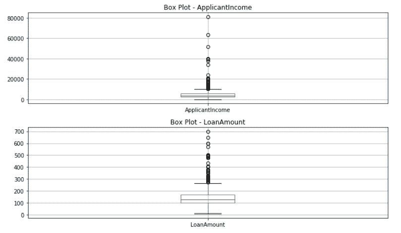

图 9.4 – ApplicantIncome（顶部）和 LoanAmount（底部）的箱线图

总结箱线图的使用，我们发现它们是一种强大的视觉辅助工具，与四分位数范围（IQR）一起描绘了数据的中心趋势和数据分散。虽然箱线图在提供整体视图方面表现出色，但重要的是要认识到它们可能无法捕捉到复杂数据集的所有细微差别。在下一节中，我们将探讨一种多功能的图形工具，它提供了一个更广阔的视角，有助于识别数据中变量之间的关系和模式。

## 散点图

散点图是一种流行且多功能的数据可视化技术，用于探索两个连续数值变量之间的关系。它们提供了一个清晰的视觉表示，说明一个变量（自变量）如何影响或影响另一个变量（因变量）。散点图在识别数据中的模式、相关性、簇和异常值方面特别有用，是数据分析中**探索性数据分析**（EDA）的一个基本工具。

现在我们来探讨散点图的构建及其关键特征。

### 散点图构建

要创建散点图，需要将两个数值变量的值绘制在笛卡尔坐标系上的点。每个点代表一个数据观测值，其中*x*坐标对应自变量的值，*y*坐标对应因变量的值。多个数据点共同形成一个散点图，可以提供关于两个变量之间关系的见解。

### 散点图的关键特征

以下是一些散点图的关键特征：

+   **相关性**：散点图帮助我们评估两个变量之间的相关性或关系。如果图上的点似乎形成了一个清晰的趋势或模式（例如，线性或非线性趋势），则表明变量之间存在显著的相关性。如果点分布随机，可能没有或相关性较弱。

+   **聚类分析**：散点图可以揭示数据点的簇，表明数据中可能存在的子组或模式。

+   **异常值检测**：散点图通过识别远离主要数据点群的数据点来促进异常值检测。

+   **数据分布**：数据点在*x*轴和*y*轴上的分布提供了关于变量变异性的见解。

+   **可视化回归线**：在某些情况下，可以将回归线拟合到散点图上，以模拟变量之间的关系并做出预测。

让我们在 Python 的`ApplicantIncome`和`LoanAmount`列上实现这一功能：

```py
plt.figure(figsize=(8, 6))
plt.scatter(df['ApplicantIncome'], df['LoanAmount'])
plt.xlabel('ApplicantIncome')
plt.ylabel('LoanAmount')
plt.title('Scatter Plot - ApplicantIncome vs. LoanAmount')
plt.show()
```

下面是展示散点图结果的输出：

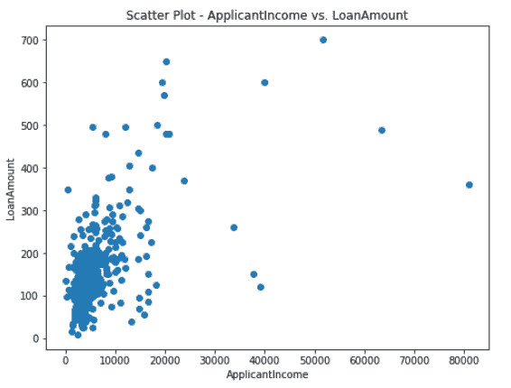

图 9.5 – 展示申请收入和贷款金额的散点图

正如你所见，一些点明显偏离了大多数人群，这表明可能存在潜在的异常值。这些异常数据点与整体模式相区别，需要进一步调查以了解其重要性和对两个变量之间关系的影响。识别和处理异常值对于确保准确的数据分析和模型性能至关重要。通过可视化散点图，我们可以获得关于数据分布和关联的有价值见解，为有效的决策和数据探索铺平道路。

# 异常检测

异常检测是检测罕见事件的一种特定方法，其重点是识别与规范或正常行为显著偏离的实例。异常可能由罕见事件、错误或数据集中不典型的异常模式引起。当罕见事件的数据有限或没有标记数据时，这种技术特别有用。常见的异常检测算法包括以下：

+   **无监督方法**：例如隔离森林和**单类 SVM**等技术可以在不要求罕见事件的标记示例的情况下用于识别数据中的异常。

+   **半监督方法**：这些方法在训练期间结合正常和异常数据，但只有有限数量的标记异常。自编码器和变分自编码器是半监督异常检测算法的例子。

+   **监督方法**：如果可用少量标记的异常，可以使用**监督学习**算法，如随机森林、**支持向量机**（SVM）和神经网络进行异常检测。

让我们通过 Python 代码示例详细了解这些方法。

## 使用隔离森林的无监督方法

隔离森林是一种用于无监督学习场景中异常检测的高效且有效的算法。它通过构建隔离树（随机决策树）来隔离数据中的异常或罕见事件，这些树将异常与大多数正常数据点分开。它是由 Fei Tony Liu、Kai Ming Ting 和 Zhi-Hua Zhou 在 2008 年发表的论文《Isolation Forest》中引入的。以下是隔离森林算法的一些关键概念和特性：

+   **随机划分**：隔离森林使用随机划分策略来创建隔离树。在构建树的每个步骤中，选择一个随机特征，并在所选特征的值范围内选择一个随机分割值来创建一个节点。这种随机划分导致异常的路径变短，使得它们更容易从正常数据点中隔离出来。

+   **路径长度**：Isolation Forest 背后的关键思想是异常被隔离到包含较少数据点的较小分区中，而正常数据点在较大的分区中分布得更均匀。数据点到树中异常的平均路径长度被用作其“隔离”的度量。

+   **异常分数**：基于平均路径长度，每个数据点被分配一个异常分数。异常分数表示数据点被隔离或从其余数据中分离的难易程度。较短的平均路径长度对应于较高的异常分数，表明数据点更有可能是异常。

+   `auto`，它根据数据集的大小估计污染率。

这里列出了 Isolation Forest 的一些优点：

+   Isolation Forest 计算效率高且可扩展，使其适用于大型数据集。它不需要大量的树来实现良好的性能，从而减少了计算开销。

+   该算法对维度/特征的数量相对不敏感，这在处理高维数据集时尤其有利。Isolation Forest 是一种无监督学习算法，使其适用于标签异常数据稀缺或不可用的情况。

然而，Isolation Forest 也有一些局限性：

+   Isolation Forest 可能在具有多个异常簇的数据集上表现不佳，或者当异常值接近大多数正常数据点时。

+   与大多数无监督算法一样，Isolation Forest 可能会产生假阳性（将正常数据点错误地分类为异常）和假阴性（将异常错误地分类为正常数据点）。

让我们用以下步骤在 Python 中实现这种方法：

1.  将`pandas`库导入为`pd`以处理表格格式的数据，并从`sklearn.ensemble`模块导入`IsolationForest`以使用 Isolation Forest 算法进行异常检测：

    ```py
    Import pandas as pd
    from sklearn.ensemble import IsolationForest
    ```

1.  定义了`numerical_features`列表，包含用于异常检测的数值列的名称。这些列是`'ApplicantIncome'`、`'CoapplicantIncome'`和`'LoanAmount'`：

    ```py
    numerical_features = ['ApplicantIncome', 'CoapplicantIncome', 'LoanAmount']
    ```

1.  `X_anomaly` DataFrame 是通过从原始的`df` DataFrame 中提取`numerical_features`中指定的列创建的。这个新的 DataFrame 将被用于异常检测：

    ```py
    X_anomaly = df[numerical_features]
    ```

1.  `X_anomaly` DataFrame，使用每列的平均值来调用`fillna()`方法。这确保了任何缺失值都被其各自列的平均值所替换：

    ```py
    X_anomaly.fillna(X_anomaly.mean(), inplace=True)
    ```

1.  `IsolationForest(contamination='auto', random_state=42)`。将`contamination`参数设置为`'auto'`，这意味着它将自动检测数据集中异常值的百分比。将`random_state`参数设置为`42`以确保可重复性：

    ```py
    Isolation_forest = IsolationForest(contamination='auto', random_state=42)
    ```

1.  使用 `fit_predict()` 方法对 `X_anomaly` 数据进行拟合。此方法同时将模型拟合到数据并预测每个数据点是否为异常。预测存储在 `anomaly_predictions` 数组中。

1.  `anomaly_predictions` 数组包含每个数据点的预测标签：`-1` 表示异常（异常值）和 `1` 表示内点（非异常值）。这些预测被添加为新的 `'IsAnomaly'` 列到原始的 `df` DataFrame 中。

1.  `df` DataFrame 中 `IsAnomaly` 等于 `-1`，表示存在异常值。结果 DataFrame 包含所有具有异常的行，然后可以根据需要进行进一步分析或处理：

    ```py
    anomaly_predictions = Isolation_forest.fit_predict(X_anomaly)
    df['IsAnomaly'] = anomaly_predictions
    anomalies = df[df['IsAnomaly'] == -1]
    anomalies.head()
    ```

现在我们可以查看模型预测为异常的行所组成的 DataFrame：

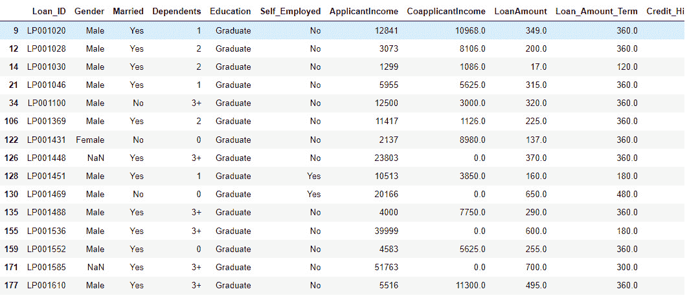

图 9.6 – 结果异常 DataFrame

总结来说，隔离森林（Isolation Forest）作为一种强大且高效的异常检测工具，在异常数据稀少且与正常实例明显不同的情况下尤为突出。它通过创建随机树来隔离异常数据的能力，使其在从欺诈检测到网络安全等众多应用中成为一种宝贵的资源。然而，承认算法的局限性也是至关重要的。当异常数据没有很好地分离或数据集高度维度化时，隔离森林可能会面临挑战。在下一节中，我们将探讨自动编码器（autoencoders）——一种用于异常检测的半监督方法。

## 使用自动编码器的半监督方法

使用自动编码器进行异常检测是一种无监督学习方法，它利用神经网络（NNs）来检测数据中的异常。自动编码器是一种神经网络架构，旨在从压缩表示中重建输入数据。在异常检测中，我们利用自动编码器在重建异常实例方面存在困难这一事实，这使得它们在识别异常模式或异常值方面非常有用。

自动编码器由两个主要组件组成：编码器和解码器。编码器将输入数据压缩成称为“潜在空间”的更低维度的表示，而解码器则试图从这个表示中重建原始输入。编码器和解码器通常是对称的，网络被训练以最小化重构误差。

在异常检测中，我们使用没有异常的正常数据来训练自动编码器。由于自动编码器学会重建正常数据，因此它将难以重建异常数据，导致异常实例的重构误差更高。这一特性使我们能够将重构误差用作异常分数。

在训练过程中，我们比较原始输入（例如，数值特征）与重建输出。两者之间的差异是重建误差。低重建误差表明输入接近正常数据分布，而高重建误差则表明输入可能是异常。

在训练自动编码器后，我们需要设置一个阈值来区分正常和异常实例，基于重建误差。有几种方法可以设置阈值，例如基于百分位数或使用验证数据。阈值将取决于所需的假阳性与假阴性之间的权衡，这可以根据应用程序的要求进行调整。

自动编码器灵活且能够捕捉数据中的复杂模式，这使得它们适用于具有非线性关系的多维数据。它们可以处理全局和局部异常，这意味着它们可以检测与大多数数据点不同的异常以及数据特定区域内的异常。自动编码器能够进行无监督学习，这在标记异常数据有限或不可用的情况下具有优势。与其他无监督方法一样，自动编码器可能会产生假阳性（将正常数据错误地分类为异常）和假阴性（将异常数据错误地分类为正常数据）。它们可能难以检测与正常数据非常相似的异常，因为重建误差可能没有显著差异。

让我们通过使用 TensorFlow 库和 Python 中的 Loan Prediction 数据集来查看这种方法的一个示例实现：

+   使用 `pd.read_csv()` 读取 `train_loan_prediction.csv` 文件：

    ```py
    import pandas as pd
    import numpy as np
    from sklearn.model_selection import train_test_split
    from sklearn.preprocessing import StandardScaler
    from tensorflow.keras.layers import Input, Dense
    from tensorflow.keras.models import Model
    df = pd.read_csv('train_loan_prediction.csv')
    ```

+   包含用于异常检测的数值列名称的 `numerical_features` 列表。这些列是 `'ApplicantIncome'`、`'CoapplicantIncome'` 和 `'LoanAmount'`：

    ```py
    numerical_features = ['ApplicantIncome', 'CoapplicantIncome', 'LoanAmount']
    ```

+   通过从原始 `df` DataFrame 中提取 `numerical_features` 中指定的列创建 `X_anomaly` DataFrame。这个新的 DataFrame 将用于异常检测。

+   使用 `fillna()` 方法将 `X_anomaly` DataFrame 中的列替换为其各自列的平均值：

    ```py
    X_anomaly = df[numerical_features]
    X_anomaly.fillna(X_anomaly.mean(), inplace=True)
    ```

+   使用 `StandardScaler()` 对 `X_anomaly` 进行标准化。标准化将特征缩放到具有零均值和单位方差，这对于训练机器学习模型很重要：

    ```py
    original_indices = X_anomaly.index
    scaler = StandardScaler()
    X_anomaly_scaled = scaler.fit_transform(X_anomaly)
    ```

+   使用 `train_test_split()` 函数对 (`X_train`) 和测试 (`X_test`) 集进行划分。数据原始索引也存储在 `original_indices` 中：

    ```py
    X_train, X_test, _, _ = train_test_split(X_anomaly_scaled, original_indices, test_size=0.2, random_state=42)
    X_test_df = pd.DataFrame(X_test, columns=['ApplicantIncome', 'CoapplicantIncome', 'LoanAmount'])
    ```

+   `Dense` 层。模型使用 `fit()` 方法进行训练，**均方误差**（**MSE**）作为损失函数：

    ```py
    input_dim = X_anomaly.shape[1]
    encoding_dim = 2
    input_layer = Input(shape=(input_dim,))
    encoder_layer = Dense(encoding_dim, activation='relu')(input_layer)
    decoder_layer = Dense(input_dim, activation='sigmoid')(encoder_layer)
    autoencoder = Model(inputs=input_layer, outputs=decoder_layer)
    autoencoder.compile(optimizer='adam', loss='mean_squared_error')
    autoencoder.fit(X_anomaly_scaled, X_anomaly_scaled, epochs=50, batch_size=16)
    ```

+   `X_test`，并计算重建误差为原始数据和重建数据之间的均方差异：

    ```py
    X_test_reconstructed = autoencoder.predict(X_test)
    reconstruction_error_test = np.mean(np.square(X_test - X_test_reconstructed), axis=1)
    ```

+   `X_test`:

    ```py
    threshold = np.percentile(reconstruction_error_test, 95)
    ```

+   如果 `anomaly_predictions` 中的值为 `1`，否则将其分配为 `0`：

    ```py
    anomaly_predictions = (reconstruction_error_test > threshold).astype(int)
    ```

+   使用 `anomaly_df` DataFrame 创建包含异常预测和对应索引的 `X_test_df`:

    ```py
    anomaly_df = pd.DataFrame({'IsAnomaly': anomaly_predictions}, index=X_test_df.index)
    ```

+   使用 `merge()` 方法将 `'IsAnomaly'` 列添加到 `df` DataFrame 中。

+   `df` 中的 `'IsAnomaly'` 列存在。如果存在，它将显示 `'IsAnomaly'` 等于 `1` 的行，表示存在异常。如果不存在，它将打印 `"No anomalies detected."`：

    ```py
    df = df.merge(anomaly_df, how='left', left_index=True, right_index=True)
    if 'IsAnomaly' in df.columns:
        # Display the rows with anomalies
        anomalies = df[df['IsAnomaly'] == 1]
        anomalies
    else:
        print("No anomalies detected.")
    ```

    结果的 DataFrame 如下所示：

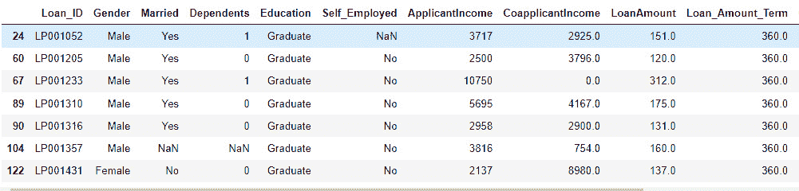

图 9.7 – 结果的 IsAnomaly DataFrame

总结来说，自动编码器证明是异常检测中的一种多才多艺且强大的工具，能够捕捉到传统方法可能无法捕捉到的细微模式。它们在复杂数据结构中发现细微异常的能力使它们在包括图像分析、网络安全和工业质量控制在内的多个领域变得非常有价值。

然而，自动编码器的有效性取决于各种因素。架构的复杂性和超参数的选择会影响性能，需要仔细调整以获得最佳结果。在下一节中，我们将了解 SVM 如何用于异常检测。

## 使用 SVM 的监督方法

SVM 是一类常用的监督学习算法，常用于分类任务。当应用于异常检测时，SVM 通过找到一个具有最大边缘的超平面来有效地将正常实例与异常实例分开。以下是 SVM 在底层的工作原理：

+   **超平面定义**：在二维空间中，超平面是一个平坦的二维子空间。SVM 的目标是找到一个超平面，将数据集最好地分为两类——正常和异常。这个超平面定位以最大化边缘，即超平面与每个类最近的点的距离。

+   **决策边界**：超平面充当决策边界，将一类实例与另一类实例分开。在二元分类场景中，超平面一侧的实例被分类为属于一个类别，而另一侧的实例被分类为属于另一个类别。

+   **核技巧**：SVM 通过使用核函数来处理数据中的复杂关系。在许多实际场景中，特征之间的关系可能不是线性的。SVM 通过使用核函数来解决这个问题。这个函数将输入数据转换到更高维的空间，使得找到能够有效分离类别的超平面变得更容易。常用的核函数包括线性核（用于线性可分数据）、多项式核、**径向基函数**（**RBF**）或高斯核，以及 sigmoid 核。核函数的选择取决于数据的性质。

+   **最优超平面**：SVM 旨在找到最大化边界的超平面，这是超平面与每个类最近数据点之间的距离。边界越大，模型可能越稳健和可泛化。支持向量是位于决策边界最近的数据点。它们在定义最优超平面和边界中起着至关重要的作用。SVM 在训练过程中专注于这些支持向量。

让我们通过我们的贷款预测数据集实现一个用于异常检测的 SVM 的 Python 示例：

1.  使用 `pd.read_csv()` 读取 `train_loan_prediction.csv` 文件：

    ```py
    import pandas as pd
    from sklearn.model_selection import train_test_split
    from sklearn.preprocessing import StandardScaler
    from sklearn.svm import OneClassSVM
    from sklearn.metrics import classification_report, accuracy_score
    df = pd.read_csv('train_loan_prediction.csv')
    ```

1.  **数据预处理**：我们将进行一些基本的数据预处理任务，包括处理缺失值。对于这个异常检测示例，我们通过排除分类变量简化了分析。在更复杂的分析中，如果你认为这些变量与你的特定异常检测任务相关，你可能选择编码并包含这些变量：

    ```py
    df = df.drop(['Loan_ID', 'Gender', 'Married', 'Dependents', 'Education', 'Self_Employed', 'Property_Area'], axis=1)
    df['Loan_Status'] = df['Loan_Status'].map({'Y': 0, 'N': 1})
    df.fillna(df.mean(), inplace=True)
    ```

1.  为 SVM 模型创建训练-测试分割：

    ```py
    X = df.drop('Loan_Status', axis=1)
    y = df['Loan_Status']
    X_train, X_test, y_train, y_test = train_test_split(X, y, test_size=0.2, random_state=42)
    ```

1.  使用 scikit-learn 的 `StandardScaler` 标准化特征，以确保所有特征具有相同的尺度：

    ```py
    scaler = StandardScaler()
    X_train_scaled = scaler.fit_transform(X_train)
    X_test_scaled = scaler.transform(X_test)
    ```

1.  训练 One-Class SVM 模型进行异常检测。根据你数据集中预期的异常比例调整 *nu* 参数。*nu* 参数代表边界错误分数的上限和支撑向量分数的下限。它实际上控制了算法应考虑的异常或异常的比例。选择合适的 *nu* 值至关重要，并且它取决于你数据集的特征和预期的异常比例。以下是一些帮助你选择 *nu* 参数的指南：

    +   **理解异常的性质**：评估你的数据集的领域知识和特征。了解预期的异常比例。如果异常很少，*nu* 的较小值可能更合适。

    +   **尝试一系列的值**：首先尝试一系列的 *nu* 值，例如 0.01、0.05、0.1、0.2 等。你可以根据你对数据的理解调整这个范围。

    +   **考虑数据集大小**：你的数据集大小也会影响 *nu* 的选择。对于较大的数据集，较小的值可能更合适，而对于较小的数据集，相对较大的值可能更合适。

    +   **平衡误报和漏报**：根据应用的不同，你可能需要优先考虑最小化误报或漏报。相应地调整 *nu* 以达到所需的平衡。

1.  我们将实施一个针对一系列 *nu* 值的实验。我们将指定我们想要实验的 *nu* 值列表。这些值代表 One-Class SVM 模型中边界错误分数的上限和支撑向量的下限。然后我们创建一个空列表来存储每个 *nu* 值的平均决策函数值：

    ```py
    nu_values = [0.01, 0.05, 0.1, 0.2, 0.3]
    mean_decision_function_values = []
    ```

1.  对于列表中的每个 *nu* 值，使用该 *nu* 值训练一个单类 SVM 模型。检索测试集的决策函数值并计算平均决策函数值。将平均决策函数值追加到列表中：

    ```py
    for nu in nu_values:
        svm_model = OneClassSVM(nu=nu, kernel='rbf', gamma=0.1)
        svm_model.fit(X_train_scaled)
        decision_function_values=
        svm_model.decision_function(X_test_scaled)
        mean_decision_function = np.mean(decision_function_values)
        mean_decision_function_values.append(mean_decision_function)
    ```

1.  确定与最高平均决策函数值对应的 *nu* 值的索引。然后，检索最佳 *nu* 值：

    ```py
    best_nu_index = np.argmax(mean_decision_function_values)
    best_nu = nu_values[best_nu_index]
    ```

1.  使用最佳 *nu* 值创建一个最终的 One-Class SVM 模型，并在缩放后的训练数据上对其进行训练：

    ```py
    final_model = OneClassSVM(nu=best_nu, kernel='rbf', gamma=0.1)
    final_model.fit(X_train_scaled)
    ```

1.  我们现在使用此模型在 `X_test_scaled` 测试数据集上预测异常。这一行通过将-1 映射到 1（表示异常）和任何其他值（通常是 1）映射到 0（表示正常实例）来创建预测的二进制表示（`y_pred`）。这是由于单类 SVM 模型通常将-1 分配给异常，将 1 分配给正常实例。我们将将其存储在一个新的 DataFrame 中，作为 `df_with_anomalies`：

    ```py
    y_pred = final_model.predict(X_test_scaled)
    y_pred_binary = [1 if pred == -1 else 0 for pred in y_pred]
    test_set_df = pd.DataFrame(data=X_test_scaled, columns=X.columns, index=X_test.index)
    test_set_df['Anomaly_Label'] = y_pred_binary
    df_with_anomalies = pd.concat([df, test_set_df['Anomaly_Label']], axis=1, join='outer')
    df_with_anomalies['Anomaly_Label'].fillna(0, inplace=True)
    ```

1.  打印混淆矩阵和准确率分数：

    ```py
    print("Classification Report:\n", classification_report(y_test, y_pred_binary))print("Accuracy Score:", accuracy_score(y_test, y_pred_binary))
    ```

    这将打印以下报告：

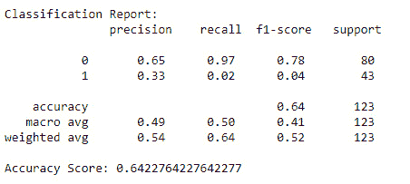

图 9.8 – 输出分类报告

1.  打印被预测为异常的 DataFrame 行：

    ```py
    df_with_anomalies[df_with_anomalies['Anomaly_Label'] == 1]
    ```

    这将输出以下 DataFrame：

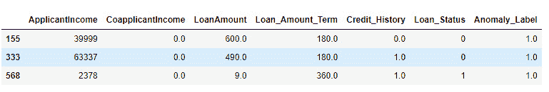

图 9.9 – df_with_anomalies DataFrame

在本节中，我们介绍了使用 Python 实现 SVM 异常检测的过程。使用 SVM 进行异常检测可以适应具有明显异常的各种数据集，使其成为识别异常值的有价值工具。在下一节中，我们将探讨数据增强和重采样技术，以识别边缘案例和罕见事件。

# 数据增强和重采样技术

类别不平衡是具有罕见事件的集合中常见的问题。类别不平衡可能会对模型的性能产生不利影响，因为模型倾向于偏向多数类。为了解决这个问题，我们将探讨两种重采样技术：

+   **过采样**：通过生成合成样本来增加少数类中的实例数量

+   **欠采样**：通过减少多数类中的实例数量来平衡类别分布

让我们更详细地讨论这些重采样技术。

## 使用 SMOTE 进行过采样

**合成少数类过采样技术**（**SMOTE**）是一种广泛使用的重采样方法，用于解决机器学习数据集中的类别不平衡问题，尤其是在处理罕见事件或少数类时。SMOTE 通过在现有少数类样本之间进行插值来帮助生成少数类的合成样本。该技术旨在通过创建额外的合成实例来平衡类别分布，从而减轻类别不平衡的影响。在类别不平衡的数据集中，少数类包含的实例数量明显少于多数类。这可能导致模型训练偏差，模型倾向于偏向多数类，在少数类上的表现不佳。

这里是 SMOTE 算法的关键步骤：

1.  **识别少数类实例**：SMOTE 的第一步是识别属于少数类的实例。

1.  **选择最近邻**：对于每个少数类实例，SMOTE 选择其*k*个最近邻（通常通过**k 近邻算法**选择）。这些邻居用于创建合成样本。

1.  **创建合成样本**：对于每个少数类实例，SMOTE 在特征空间中实例与其*k*个最近邻连接的直线上生成合成样本。通过添加实例与其邻居之间的特征差异的随机分数（通常在 0 和 1 之间），创建合成样本。这个过程有效地为合成样本引入了变异性。

1.  **与原始数据结合**：合成的样本与原始的少数类实例相结合，从而得到一个具有更平衡类分布的重采样数据集。

SMOTE 有助于解决类别不平衡问题，而不需要丢弃任何数据，因为它生成合成样本而不是从多数类中删除实例。它增加了模型可用的信息量，可能提高模型泛化到少数类的能力。SMOTE 易于实现，并在 Python 中流行的库（如 imbalanced-learn）中可用。

虽然 SMOTE 在许多情况下都有效，但它可能并不总是对高度不平衡的数据集或具有复杂决策边界的数据集表现最佳。生成过多的合成样本可能导致训练数据上的过拟合，因此选择合适的最近邻数量(*k*)值至关重要。SMOTE 可能会引入一些噪声，并且如果少数类在特征空间中过于稀疏或分散，可能不会那么有效。SMOTE 可以与其他技术结合使用，例如对多数类进行下采样或使用不同的重采样比率，以实现更好的性能。评估模型在适当的指标（例如，精确度、召回率或 F1 分数）上的性能对于评估 SMOTE 和其他技术对模型检测罕见事件能力的影响至关重要。

让我们在 Python 中实现这种方法：

+   使用`pd.read_csv()`读取`train_loan_prediction.csv`文件：

    ```py
    import pandas as pd
    from imblearn.over_sampling import SMOTE
    from sklearn.model_selection import train_test_split
    from sklearn.metrics import classification_report
    from sklearn.ensemble import RandomForestClassifier
    df = pd.read_csv('train_loan_prediction.csv')
    ```

+   数据集中的`'Loan_Status'`列包含`'Y'`和`'N'`分类值，分别代表贷款批准（`'Y'`）和拒绝（`'N'`）。为了将这个分类目标变量转换为数值格式，使用`map()`函数将`'Y'`映射到`1`，将`'N'`映射到`0`：

    ```py
    df['Loan_Status'] = df['Loan_Status'].map({'Y': 1, 'N': 0})
    ```

+   `fillna()`方法。这确保了数据集中任何缺失值都被其相应列的平均值所替换：

    ```py
    df.fillna(df.mean(), inplace=True)
    ```

+   `X`特征集。使用`select_dtypes()`方法仅包括具有`float`和`int`数据类型的列，同时排除非数值列，如`'Loan_Status'`和`'Loan_ID'`。`y`目标变量设置为`'Loan_Status'`：

    ```py
    numerical_columns = df.select_dtypes(include=[float, int]).columns
    X = df[numerical_columns].drop('Loan_Status', axis=1)
    y = df['Loan_Status']
    ```

+   使用 scikit-learn 的`train_test_split()`函数对训练集（`X_train`, `y_train`）和测试集（`X_test`, `y_test`）进行分割。训练集包含 80%的数据，而测试集包含 20%的数据。`random_state`参数设置为`42`以确保可重复性：

    ```py
    X_train, X_test, y_train, y_test = train_test_split(X, y, test_size=0.2, random_state=42)
    ```

+   `SMOTE(random_state=42)`。然后使用`fit_resample()`方法对训练数据进行 SMOTE 处理。此方法通过生成合成样本对少数类（贷款拒绝）进行过采样，创建一个平衡的数据集。重采样后的数据存储在`X_train_resampled`和`y_train_resampled`中：

    ```py
    smote = SMOTE(random_state=42)
    X_train_resampled, y_train_resampled = smote.fit_resample(X_train, y_train)
    ```

+   `RandomForestClassifier(random_state=42)`。分类器使用`fit()`方法在重采样数据（`X_train_resampled`, `y_train_resampled`）上训练。训练好的分类器使用`predict()`方法对测试数据（`X_test`）进行预测。预测结果存储在`y_pred`中：

    ```py
    clf = RandomForestClassifier(random_state=42)
    clf.fit(X_train_resampled, y_train_resampled)
    y_pred = clf.predict(X_test)
    ```

+   使用 scikit-learn 的`classification_report()`函数生成分类报告。分类报告根据测试集的预测（`y_pred`）和真实标签（`y_test`）为每个类别（贷款批准和拒绝）提供精确度、召回率、F1 分数和支持。分类报告最初以字典格式返回。代码使用`pd.DataFrame()`将此字典转换为`clf_report` DataFrame，使其更容易处理数据。使用`.T`属性将`clf_report` DataFrame 转置，使类别（`0`和`1`）成为行，评估指标（精确度、召回率、F1 分数和支持）成为列。这种转置提供了更方便和可读的格式，以便进行进一步的分析或展示：

    ```py
    clf_report = pd.DataFrame(classification_report(y_test, y_pred, output_dict=True))
    clf_report = clf_report.T
    clf_report
    ```

    让我们打印分类报告以了解模型的性能：

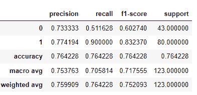

图 9.10 – 由前面的代码生成的分类报告

报告显示，模型在识别类别 0 的实例方面表现中等，精确度为 73.33%。然而，召回率相对较低，为 51.16%，表明模型可能遗漏了一些类别 0 的实际实例。模型在识别类别 1 的实例方面表现出色，精确度高达 77.42%，召回率非常高，为 90.00%。加权平均指标考虑了类别不平衡，为两个类别提供了平衡的评估。模型的总体准确度为 76.42%，表示正确预测实例的百分比。

在下一节中，让我们来探讨欠采样——另一种解决机器学习中类别不平衡问题的方法。

## 使用 RandomUnderSampler 进行欠采样

使用 `RandomUnderSampler` 处理类别不平衡是解决不平衡数据集挑战的有效方法，在这种情况下，一个类别显著超过其他类别。在这种情况下，传统的机器学习算法可能难以从数据中学习，并且倾向于偏向多数类别，导致在少数类别或罕见事件上的性能不佳。

`RandomUnderSampler` 是一种重采样技术，旨在通过随机从多数类别删除实例来平衡类别分布，直到类别比例更加平衡。通过减少多数类别的实例数量，`RandomUnderSampler` 确保少数类别以更成比例的方式表示，使模型更容易检测和学习与罕见事件相关的模式。

下面是关于使用 `RandomUnderSampler` 处理类别不平衡的一些关键点：

+   `RandomUnderSampler` 是一种数据级别的重采样方法。数据级别的重采样技术涉及操纵训练数据以平衡类别分布。在 `RandomUnderSampler` 中，从多数类别随机选择并删除实例，从而得到一个具有平衡类别分布的较小数据集。

+   `RandomUnderSampler` 直接从多数类别中删除实例，而不改变少数类别的实例。这种方法有助于保留少数类别的信息，使模型更容易专注于学习与罕见事件相关的模式。

+   `RandomUnderSampler` 会从多数类别中丢失信息。通过随机删除实例，可能会丢弃一些具有信息量的实例，这可能导致模型在多数类别上的泛化能力降低。

+   `RandomUnderSampler` 计算效率高，因为它只涉及从多数类别随机删除实例。这使得它比其他一些重采样方法更快。

+   `RandomUnderSampler` 在某些情况下可能有效，但它并不总是最佳选择，特别是如果多数类别包含重要的模式和信息。在选择适当的重采样技术时，仔细考虑问题和数据集特征至关重要。

+   `RandomUnderSampler` 可以与其他技术结合使用。例如，可以先应用 `RandomUnderSampler`，然后使用 `RandomOverSampler`（过采样）来进一步平衡类别分布。这种方法有助于实现两个类别的更平衡的表示。

+   **评估和模型选择**：在处理类别不平衡时，评估模型在相关指标上的性能至关重要，例如精确度、召回率、F1 分数和 **ROC 曲线下面积**（**AUC-ROC**）。这些指标提供了对模型处理罕见事件和边缘情况的全面评估。

让我们使用 Python 实现这种方法：

使用 `pd.read_csv()` 读取 `train_loan_prediction.csv` 文件：

```py
import pandas as pd
from imblearn.under_sampling import RandomUnderSampler
from sklearn.model_selection import train_test_split
from sklearn.metrics import classification_report
from sklearn.ensemble import RandomForestClassifier
df = pd.read_csv('train_loan_prediction.csv')
```

数据集中的`'Loan_Status'`列包含`'Y'`和`'N'`分类值，分别代表贷款批准（`'Y'`）和拒绝（`'N'`）。为了将这个分类目标变量转换为数值格式，使用`map()`函数将`'Y'`映射到 1，将`'N'`映射到 0：

```py
df['Loan_Status'] = df['Loan_Status'].map({'Y': 1, 'N': 0})
```

以下代码使用`fillna()`方法对数据集中所有具有缺失值的列应用均值填充。这确保了数据集中的任何缺失值都被其各自列的均值所替换：

```py
df.fillna(df.mean(), inplace=True)
```

代码仅从数据集中选择数值列来构建`X`特征集。使用`select_dtypes()`方法仅包括数据类型为`float`和`int`的列，同时排除非数值列，例如`'Loan_Status'`和`'Loan_ID'`。`y`目标变量设置为`'Loan_Status'`：

```py
numerical_columns = df.select_dtypes(include=[float, int]).columns
X = df[numerical_columns].drop('Loan_Status', axis=1)
y = df['Loan_Status']
```

使用 scikit-learn 中的`train_test_split()`函数将数据分为训练集（`X_train`, `y_train`）和测试集（`X_test`, `y_test`）。训练集包含 80%的数据，而测试集包含 20%的数据。`random_state`参数设置为`42`以确保可重复性：

```py
X_train, X_test, y_train, y_test = train_test_split(X, y, test_size=0.2, random_state=42)
```

然后我们实例化`RandomUnderSampler`，并使用`fit_resample()`方法将其应用于训练数据。此方法对多数类（贷款批准）进行下采样以创建平衡数据集。重采样后的数据存储在`X_train_resampled`和`y_train_resampled`中：

```py
rus = RandomUnderSampler(random_state=42)
X_train_resampled, y_train_resampled = rus.fit_resample(X_train, y_train)
```

然后使用`fit()`方法在重采样数据（`X_train_resampled`, `y_train_resampled`）上训练随机森林分类器。训练好的分类器用于使用`predict()`方法对测试数据（`X_test`）进行预测。预测结果存储在`y_pred`中：

```py
clf = RandomForestClassifier(random_state=42)
clf.fit(X_train_resampled, y_train_resampled)
y_pred = clf.predict(X_test)
clf_report = pd.DataFrame(classification_report(y_test, y_pred, output_dict=True))
clf_report = clf_report.T
clf_report
```

让我们检查分类报告以评估模型性能：

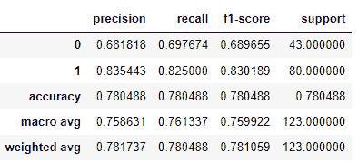

图 9.11 – 模型性能的分类报告

模型对两类都表现出不错的性能，与类别`0`相比，类别`1`具有更高的精确度、召回率和 F1 分数。加权平均考虑了类别分布的不平衡，提供了对整体性能的更具有代表性的度量。准确率 0.7805%表明，模型正确预测了测试集中大约 78%的实例的类别。

在下一节中，让我们了解成本敏感学习，并探讨其在罕见事件具有重大后果的场景中的关键作用。

# 成本敏感学习

成本敏感学习是一种机器学习方法，在模型训练过程中考虑了不同类别误分类的成本。在传统的机器学习中，重点是最大化整体准确率，但在许多实际场景中，某些类别的误分类可能比其他类别的误分类有更严重的后果。

例如，在医疗诊断应用中，将严重疾病误诊为不存在（假阴性）可能比将轻微状况误诊为存在（假阳性）有更严重的后果。在欺诈检测中，错误地将合法交易标记为欺诈（假阳性）可能会给客户带来不便，而未能检测到实际欺诈交易（假阴性）可能导致重大经济损失。

成本敏感学习通过为不同类别分配不同的误分类成本来解决这些成本不平衡问题。通过将这些成本纳入训练过程，模型被鼓励优先考虑最小化整体误分类成本，而不仅仅是优化准确性。

实施成本敏感学习有几种方法：

+   **修改损失函数**：在模型训练期间使用的损失函数可以被修改，以包含特定类别的误分类成本。目标是最小化预期成本，这是误分类成本和模型预测的组合。

+   **类别权重**：另一种方法是给少数类或误分类成本较高的类分配更高的权重。这种技术可以应用于各种分类器，如决策树、随机森林和 SVMs，以强调从少数类中学习。

+   **采样技术**：除了分配权重外，还可以使用重采样技术，如对少数类进行过采样或对多数类进行欠采样，以平衡类别分布并提高模型从罕见事件中学习的能力。

+   **阈值调整**：通过调整分类阈值，我们可以控制精确度和召回率之间的权衡，从而做出对少数类更敏感的预测。

+   **集成方法**：成本敏感提升等集成方法结合多个模型，专注于难以分类的实例，并给误分类样本分配更高的权重。

成本敏感学习在类别不平衡严重且误分类后果至关重要的场景中尤为重要。通过考虑与不同类别相关的成本，模型可以做出更明智的决策，并在检测罕见事件和处理边缘情况方面提高整体性能。

需要注意的是，成本敏感学习需要对成本矩阵进行仔细考虑，因为错误指定的成本可能导致意外结果。在考虑现实世界成本的相关指标上对模型进行适当的验证和评估，对于确保成本敏感学习算法的有效性和可靠性至关重要。

现在我们将使用 Python 中的 Loan Prediction 数据集演示成本敏感学习：

1.  使用`pandas`加载所需的库和数据集：

    ```py
    import pandas as pd
    from sklearn.model_selection import train_test_split
    from sklearn.ensemble import RandomForestClassifier
    from sklearn.metrics import classification_report
    df = pd.read_csv('train_loan_prediction.csv')
    ```

1.  现在我们需要进行数据预处理来处理缺失值并将目标变量转换为数值数据类型：

    ```py
    df['Loan_Status'] = df['Loan_Status'].map({'Y': 1, 'N': 0})
    df.fillna(df.mean(), inplace=True)
    ```

1.  对于这个例子，我们将仅使用数值列。然后我们将数据集分为`train`和`test`：

    ```py
    numerical_columns = df.select_dtypes(include=[float, int]).columns
    X = df[numerical_columns].drop('Loan_Status', axis=1)
    y = df['Loan_Status']
    X_train, X_test, y_train, y_test = train_test_split(X, y, test_size=0.2, random_state=42)
    ```

1.  我们首先根据训练数据中类频率的倒数计算类权重。一个类的频率越高，其权重越低，反之亦然。这样，模型会赋予少数类（罕见事件）更高的重要性，并对其正确预测更加敏感：

    ```py
    class_weights = dict(1 / y_train.value_counts(normalize=True))
    ```

1.  接下来，我们将使用计算出的类权重设置`class_weight`参数来训练随机森林分类器。这种修改允许分类器在训练过程中考虑类权重，从而有效地实现成本敏感学习：

    ```py
    clf = RandomForestClassifier(random_state=42, class_weight=class_weights)
    clf.fit(X_train, y_train)
    ```

1.  在训练好模型后，我们会在测试数据上做出预测，并使用分类报告来评估分类器的性能，该报告为每个类别提供了精确度、召回率、F1 分数和支持：

    ```py
    y_pred = clf.predict(X_test)
    clf_report = pd.DataFrame(classification_report(y_test, y_pred, output_dict=True))
    clf_report = clf_report.T
    clf_report
    ```

    让我们查看分类报告并评估随机森林分类器的性能：

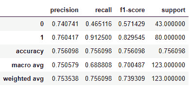

图 9.12 – 随机森林分类器性能的分类报告

在成本敏感学习中，你通常会定义一个成本矩阵，该矩阵量化了每个类别的误分类成本，并使用它来指导模型的训练。分类报告的结果可以帮助你识别需要调整以使模型与你的应用中特定的成本考虑因素相一致的区域。在假阳性成本和假阴性成本不相等的情况下，成本矩阵特别有用。如果假阳性的成本更高，考虑提高决策阈值。如果假阴性的成本更高，考虑降低阈值。

在下一节中，我们将了解用于检测边缘情况和罕见事件的评估指标。

# 选择评估指标

在机器学习中处理边缘情况和罕见事件时，选择正确的评估指标对于准确评估模型的性能至关重要。传统的评估指标，如准确率，在感兴趣的类别（罕见事件）远多于多数类的不平衡数据集中可能不足以提供足够的信息。在不平衡数据集中，如果罕见事件是少数类，传统的评估指标如准确率可能会误导。例如，如果一个数据集有 99%的多数类和 1%的罕见事件，一个将所有实例预测为多数类的模型仍然会达到 99%的准确率，这看起来非常高。然而，这样的模型在检测罕见事件方面将无效。为了解决这个问题，我们需要关注模型在正确识别罕见事件方面的性能的评估指标，即使这会导致准确率的下降。

这里有一些更适合检测边缘案例和罕见事件的评估指标：

+   **精确率**：精确率衡量模型做出的正预测的准确性。它是真实正例（正确预测的罕见事件）与真实正例和假正例（错误地将多数类作为罕见事件预测）之和的比率。高精确率表明模型在做出正预测时非常谨慎，并且假正例率很低。

+   **召回率（灵敏度）**：召回率衡量模型预测出的所有实际正例中真实正例的比例。它是真实正例与真实正例和假负例（错误地将多数类作为罕见事件预测）之和的比率。高召回率表明模型能够捕获大量罕见事件实例。

+   **F1 分数**：F1 分数是精确率和召回率的调和平均数。它提供了两种指标之间的平衡，并且在精确率和召回率之间存在不平衡时特别有用。F1 分数惩罚那些以牺牲另一个指标为代价优先考虑精确率或召回率的模型。

+   **接收器操作特征（ROC-AUC）下的面积**：ROC-AUC 是一种用于评估二元分类模型的性能指标。它测量 ROC 曲线下的面积，ROC 曲线绘制了随着分类阈值变化时的真实正例率（召回率）与假正例率。更高的 ROC-AUC 表明模型性能更好，尤其是在检测罕见事件方面。

在下一节中，让我们深入了解集成技术，并了解它们在机器学习模型中的关键作用，尤其是在处理包含边缘案例和罕见事件的 数据时。

# 集成技术

集成技术是用于提高机器学习模型性能的强大方法，尤其是在不平衡数据集、罕见事件和边缘案例的场景中。这些技术通过结合多个基础模型来创建一个更稳健和准确的最终预测。让我们讨论一些流行的集成技术。

## Bagging

**自助聚合**（**bagging**）是一种集成技术，它从训练数据中创建多个自助样本（带有替换的随机子集），并在每个样本上训练一个单独的基础模型。最终的预测是通过平均或投票所有基础模型的预测得到的。Bagging 在处理高方差和复杂模型时特别有用，因为它减少了过拟合并增强了模型的泛化能力。以下是与 Bagging 相关的关键概念：

+   **自助采样**：Bagging 过程从通过称为自助采样的过程创建多个训练数据的随机子集开始。自助采样涉及从原始数据集中随机选择数据点，并进行替换。因此，某些数据点可能在子集中出现多次，而其他数据点可能被排除在外。

+   **基础模型训练**：对于每个自助样本，一个基础模型（学习器）独立地在该特定训练数据子集上训练。基础模型可以是任何机器学习算法，例如决策树、随机森林或 SVMs。

+   **聚合预测**：一旦所有基础模型都训练完成，它们就被用来对新、未见过的数据进行预测。对于分类任务，最终预测通常由多数投票决定，即选择在基础模型中获得最多投票的类别。在回归任务中，最终预测是通过平均所有基础模型的预测得到的。

这里是 Bagging 的一些好处：

+   **方差减少**：Bagging 通过结合在不同数据子集上训练的多个模型的预测来帮助减少模型的方差。这导致了一个更稳定和健壮的模型。

+   **过拟合预防**：通过在每个数据子集上训练每个基础模型，Bagging 可以防止个别模型对训练集中的噪声过拟合。

+   **模型泛化**：Bagging 通过减少偏差和方差来提高模型的泛化能力，从而在未见过的数据上获得更好的性能。

+   **并行性**：由于基础模型是独立训练的，因此 Bagging 适合并行处理，使其在计算上更高效。

随机森林是 Bagging 技术的流行例子。在随机森林中，基础模型是决策树，多个决策树的预测结果被组合起来以做出最终预测。

下面是一个使用 Python 在 Loan Prediction 数据集上实现 Bagging 的随机森林的例子：

```py
import pandas as pd
from sklearn.model_selection import train_test_split
from sklearn.ensemble import RandomForestClassifier
from sklearn.metrics import classification_report
df = pd.read_csv('train_loan_prediction.csv')
df['Loan_Status'] = df['Loan_Status'].map({'Y': 1, 'N': 0})
df.fillna(df.mean(), inplace=True)
numerical_columns = df.select_dtypes(include=[float, int]).columns
X = df[numerical_columns].drop('Loan_Status', axis=1)
y = df['Loan_Status']
X_train, X_test, y_train, y_test = train_test_split(X, y, test_size=0.2, random_state=42)
clf = RandomForestClassifier(random_state=42)
clf.fit(X_train, y_train)
y_pred = clf.predict(X_test)
clf_report = pd.DataFrame(classification_report(y_test, y_pred, output_dict=True))
clf_report = clf_report.T
clf_report
```

总之，Bagging 技术为处理边缘情况提供了一种稳健且有效的策略。通过聚合多个基础模型的预测，Bagging 不仅增强了整体模型稳定性，还加强了其准确识别和解决边缘情况的能力，从而有助于构建一个更具弹性和可靠性的预测框架。

在下一节中，我们将探讨提升技术，这是另一种处理边缘情况和罕见事件的方法。

## 提升技术

提升是一种集成技术，它按顺序构建基础模型，每个后续模型都专注于前一个模型错误分类的实例。它为错误分类的实例分配更高的权重，从而更多地关注罕见事件。流行的提升算法包括**自适应提升**（**AdaBoost**）、梯度提升和 XGBoost。提升的目标是通过迭代组合弱学习器来创建一个强学习器。

下面是如何提升工作的例子：

1.  **基础模型训练**：提升技术首先在全部训练数据集上训练一个基础模型（也称为弱学习器）。弱学习器通常是具有有限预测能力的简单模型，例如决策桩（具有单个分割的决策树）。

1.  **加权训练**: 在第一个模型训练完成后，被模型错误分类的数据点被分配更高的权重。这意味着后续的模型将更加关注这些错误分类的数据点，试图纠正其预测。

1.  **迭代训练**: 提升算法遵循迭代方法。对于每一次迭代（或提升轮次），都会在更新后的训练数据上训练一个新的弱学习器，并调整其权重。然后，将这些弱学习器组合起来创建一个强学习器，与单个弱学习器相比，强学习器的预测性能得到提升。

1.  **加权投票**: 在最终预测过程中，弱学习器的预测通过加权投票相结合，其中准确性更高的模型对最终预测有更大的影响。这允许提升算法专注于难以分类的实例，并提高模型对罕见事件的敏感性。

提升算法的优点如下：

+   **提高准确性**: 通过关注数据集中最具挑战性的实例并在多次迭代中细化预测，提升算法提高了模型的准确性。

+   **鲁棒性**: 通过迭代调整权重并从之前的错误中学习，提升算法减少了模型对数据中的噪声和异常值的敏感性。

+   **模型自适应**: 提升算法很好地适应不同类型的数据，并能处理特征与目标变量之间的复杂关系

+   **集成多样性**: 提升算法创建了一个多样化的弱学习器集成，这导致更好的泛化能力和减少过拟合。

让我们通过 AdaBoost 的一个示例来了解提升算法。

AdaBoost 是一种流行的提升算法，在实践中被广泛使用。在 AdaBoost 中，基模型通常是决策树桩，并且在每次迭代后调整模型权重，以强调被错误分类的实例。

下面是一个使用 AdaBoost 实现提升算法的 Python 示例：

```py
import pandas as pd
from sklearn.model_selection import train_test_split
from sklearn.ensemble import AdaBoostClassifier
from sklearn.metrics import classification_report
df = pd.read_csv('train_loan_prediction.csv')
df['Loan_Status'] = df['Loan_Status'].map({'Y': 1, 'N': 0})
df.fillna(df.mean(), inplace=True)
numerical_columns = df.select_dtypes(include=[float, int]).columns
X = df[numerical_columns].drop('Loan_Status', axis=1)
y = df['Loan_Status']
X_train, X_test, y_train, y_test = train_test_split(X, y, test_size=0.2, random_state=42)
clf = AdaBoostClassifier(random_state=42)
clf.fit(X_train, y_train)
y_pred = clf.predict(X_test)
clf_report = pd.DataFrame(classification_report(y_test, y_pred, output_dict=True))
clf_report = clf_report.T
clf_report
```

总结来说，提升技术的应用成为处理边缘情况的一种稳健策略。通过其迭代方法，提升算法使模型能够专注于具有挑战性的实例，从而增强其识别和准确预测罕见事件的能力。

我们现在将探讨如何使用堆叠方法来检测和处理机器学习中的边缘情况和罕见事件。

## 堆叠

堆叠是一种高级集成学习技术，通过在基模型的输出上训练一个元模型来结合多个基模型的预测。堆叠旨在利用不同基模型的优势，创建一个更准确和鲁棒的最终预测。它是一种“学习如何学习”的形式，其中元模型学习如何最佳地结合基模型的预测。基模型充当“学习器”，它们的预测成为元模型的输入特征，从而进行最终预测。堆叠通常可以通过捕捉来自不同基模型的互补模式来提高性能。

下面是模型方法：

1.  **基础模型训练**：堆叠过程首先是在训练数据集上训练多个不同的基础模型。这些基础模型可以是不同类型的机器学习算法，甚至是具有不同超参数的相同算法。

1.  **基础模型预测**：一旦基础模型训练完成，它们就被用来在相同的训练数据（样本内预测）或一个独立的验证数据集（样本外预测）上进行预测。

1.  **元模型训练**：然后，将基础模型的预测结合起来创建一个新的数据集，该数据集作为元模型的输入。每个基础模型的预测成为该数据集中的一个新特征。元模型在这个新数据集上以及真实的目标标签上进行训练。

1.  **最终预测**：在最终预测阶段，基础模型对新未见过的数据进行预测。然后，这些预测被用作元模型的输入特征，从而做出最终预测。

堆叠有以下优点：

+   **提高预测性能**：堆叠利用了不同基础模型的互补优势，与使用单个模型相比，可能带来更好的整体预测性能

+   **降低偏差和方差**：通过结合多个模型，堆叠可以降低模型的偏差和方差，从而提高泛化能力

+   **灵活性**：堆叠允许使用不同的基础模型，使其适用于各种类型的数据和问题

+   **集成多样性**：堆叠通过使用各种基础模型创建了一个多样化的集成，这有助于防止过拟合

下面是一个使用 Python 中的 scikit-learn 实现堆叠的示例，使用的是贷款预测数据集：

1.  我们首先导入所需的库并加载数据集：

    ```py
    import pandas as pd
    from sklearn.model_selection import train_test_split
    from sklearn.ensemble import RandomForestClassifier, GradientBoostingClassifier
    from sklearn.linear_model import LogisticRegression
    from sklearn.metrics import classification_report
    df = pd.read_csv('train_loan_prediction.csv')
    ```

1.  我们现在需要执行数据预处理来处理缺失值并将目标变量转换为数值数据类型：

    ```py
    df['Loan_Status'] = df['Loan_Status'].map({'Y': 1, 'N': 0})
    df.fillna(df.mean(), inplace=True)
    ```

1.  为了简单起见，我们将在这个示例中仅使用数值列。然后，我们将数据集分为`train`和`test`：

    ```py
    numerical_columns = df.select_dtypes(include=[float, int]).columns
    X = df[numerical_columns].drop('Loan_Status', axis=1)
    y = df['Loan_Status']
    X_train, X_test, y_train, y_test = train_test_split(X, y, test_size=0.2, random_state=42)
    ```

1.  `RandomForestClassifier`和`GradientBoostingClassifier`分别使用`RandomForestClassifier(random_state=42)`和`GradientBoostingClassifier(random_state=42)`实例化：

    ```py
    base_model_1 = RandomForestClassifier(random_state=42)
    base_model_2 = GradientBoostingClassifier(random_state=42)
    ```

1.  这些基础模型使用`fit()`方法在训练数据（`X_train`，`y_train`）上训练，如以下所示。训练好的基础模型被用来使用`predict()`方法在测试数据（`X_test`）上进行预测。来自两个基础模型的预测被存储在`pred_base_model_1`和`pred_base_model_2`中：

    ```py
    base_model_1.fit(X_train, y_train)
    base_model_2.fit(X_train, y_train)
    pred_base_model_1 = base_model_1.predict(X_test)
    pred_base_model_2 = base_model_2.predict(X_test)
    ```

1.  `stacking_X_train`数据集是通过结合基础模型的预测（`pred_base_model_1`和`pred_base_model_2`）创建的。这个新的数据集将被用作元模型的输入特征：

    ```py
    stacking_X_train = pd.DataFrame({
        'BaseModel1': pred_base_model_1,
        'BaseModel2': pred_base_model_2
    })
    ```

1.  `LogisticRegression()`。元模型使用 `fit()` 方法在新的数据集 (`stacking_X_train`) 和测试集的真实标签 (`y_test`) 上进行训练。元模型学习如何结合基础模型的预测并做出最终预测：

    ```py
    meta_model = LogisticRegression()
    meta_model.fit(stacking_X_train, y_test)
    ```

1.  `new_unseen_data`) 是通过使用 `sample()` 方法随机选择测试数据 (`X_test`) 的 20% 创建的。基础模型使用 `predict()` 方法对新、未见过的数据 (`new_unseen_data`) 进行预测。对于新数据的预测结果存储在 `new_pred_base_model_1` 和 `new_pred_base_model_2` 中：

    ```py
    new_unseen_data = X_test.sample(frac=0.2, random_state=42)
    new_pred_base_model_1 = base_model_1.predict(new_unseen_data)
    new_pred_base_model_2 = base_model_2.predict(new_unseen_data)
    ```

1.  `stacking_new_unseen_data` 数据集是通过结合基础模型 (`new_pred_base_model_1` 和 `new_pred_base_model_2`) 对新、未见过的数据的预测创建的。这个新的数据集将被用作元模型的输入特征，以做出最终预测：

    ```py
    stacking_new_unseen_data = pd.DataFrame({
        'BaseModel1': new_pred_base_model_1,
        'BaseModel2': new_pred_base_model_2
    })
    ```

1.  `stacking_new_unseen_data`) 使用 `predict()` 方法进行预测。`final_prediction` 变量根据元模型的决策持有预测的类别（0 或 1）：

    ```py
    final_prediction = meta_model.predict(stacking_new_unseen_data)
    final_prediction
    ```

总结来说，这段代码演示了堆叠的概念，其中基础模型（随机森林和梯度提升）在原始数据上训练，它们的预测被用作元模型（逻辑回归）的输入特征，最终预测是通过在新的、未见过的数据上使用元模型来完成的。堆叠允许模型协同工作，并且与单独使用基础模型相比，有可能提高预测性能。

# 摘要

在本章中，我们探讨了机器学习中检测罕见事件和边缘案例的关键方面。由于罕见事件的罕见性，它们在各个领域都有重要的意义，并需要特别的关注。我们深入研究了多种技术和方法，使我们能够有效地识别和处理这些不常见的情况。

统计方法，如 Z 分数和 IQR，为我们提供了强大的工具，可以确定数据中的异常值和异常。这些方法有助于建立识别罕见事件的具有意义的阈值，使我们能够区分重要的数据点与噪声。

我们还探讨了基于机器学习的异常检测技术，如隔离森林和自动编码器。这些方法利用无监督学习来识别与大多数数据不同的模式和偏差，使它们非常适合在复杂数据集中检测罕见事件。

此外，我们还讨论了重采样方法（如 SMOTE 和 `RandomUnderSampler`）在处理类别不平衡中的重要性。这些技术使我们能够创建平衡的数据集，从而提高模型在识别罕见事件时的性能，同时保持数据完整性。

此外，我们发现集成技术，包括堆叠、袋装和提升，在增强我们模型检测边缘案例能力方面的潜力。通过集成多个模型的综合力量，增强了泛化能力和模型鲁棒性。

在存在罕见事件的情况下，选择适当的评估指标至关重要，以确保公平评估和准确评估模型性能。如精确度、召回率、F1 分数和 AUC-ROC 等指标提供了对模型性能的全面洞察，并指导决策制定。

检测罕见事件和边缘案例在医疗诊断、欺诈检测、预测性维护和环境监测等众多领域具有深远的影响。通过采用有效的技术来识别和处理这些不常见的事件，我们提高了机器学习应用的可靠性和效率。

在我们结束本章之前，让我们认识到这项技能在现实场景中的重要性。检测罕见事件使我们能够做出明智的决策，防范潜在风险，并充分利用机器学习在众多领域的积极影响。

在下一章中，我们将探讨数据驱动方法在机器学习中面临的一些挑战。

# 第四部分：开始使用数据中心化机器学习

到现在为止，你可能已经意识到转向以数据为中心的机器学习方法不仅需要调整你自己的工作方式，还需要影响周围的人——这是一项远非简单的任务。在本部分中，我们探讨了在模型开发和部署过程中可能遇到的技术和非技术障碍，并揭示了采用数据为中心的方法如何帮助克服这些障碍。

本部分包含以下章节：

+   *第十章**，开启你的数据中心化机器学习之旅*
