# 第二章：机器学习定义和概念

本章提供了使用 Amazon 机器学习（Amazon ML）服务所需的高级机器学习概念的定义和解释，并全面理解其工作原理。本章有三个具体目标：

+   列出在处理原始数据时用于提高预测质量的主要技术。你将学习如何处理最常见的数据问题。其中一些技术可在 Amazon ML 中使用，而其他则不行。

+   展示预测分析工作流程并介绍交叉验证的概念，即如何分割你的数据以训练和测试你的模型。

+   展示如何检测模型的较差性能并介绍提高这些性能的策略。

读者将学习以下内容：

+   如何在给定数据集中发现常见问题和异常

+   如何从数据集中提取最多信息以构建稳健的模型

+   如何检测并改进较差的预测性能

# 算法是什么？模型是什么？

在我们深入数据清洗之前，让我们花一点时间解释算法和模型之间的区别，这两个术语我们至今尚未给出正式定义。

考虑我们在第一章“机器学习与预测分析导论”中看到的简单线性回归示例，只有一个预测因子的线性回归方程：

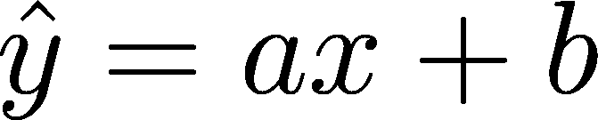

在这里，*x* 是变量，*ŷ* 是预测值，而不是真实值，而 *(a,b)* 是线性回归模型的参数：

+   概念或理论模型是数据表示，它最适合实际数据集。数据科学家在开始时选择它。在这种情况下，概念模型是线性回归模型，其中预测是变量的线性组合。其他概念模型包括决策树、朴素贝叶斯、神经网络等。所有这些模型都有需要调整到实际数据的参数。

+   算法是计算过程，将计算概念模型的最佳参数。在我们的简单线性回归案例中，算法将计算最佳参数 *a* 和 *b*。这里的最佳意味着它给出了给定可用数据集的最佳预测。

+   最后，预测模型对应于与可用数据集找到的最佳参数相关联的概念模型。

在现实中，没有人明确区分概念模型和预测模型。两者都被称为模型。

简而言之，算法是学习的方法，模型是学习阶段的结果。模型是算法在训练数据集上训练的概念模型（树、SVM、线性）。

# 处理杂乱的数据

随着数据集的增长，不一致性和错误也随之增加。这些错误可能是由于人为错误、系统故障或数据结构演变造成的，真实世界数据中充满了无效、荒谬或缺失的值。即使数据集本身很干净，某些变量的性质也需要适应模型。我们将在 Amazon ML 线性模型的背景下查看最常见的数据异常和特征，这些特征需要被纠正。

# 经典数据集与真实世界数据集的比较

数据科学家和机器学习从业者经常使用经典数据集来展示某些模型的行为。由 150 个三种鸢尾花样本组成的**Iris**数据集，是用于演示或教授预测分析的常用数据集之一。它自 1936 年以来一直存在！

**Boston housing**数据集和**Titanic**数据集是预测分析中其他非常流行的数据集。对于文本分类，**Reuters**或**20 newsgroups**文本数据集非常常见，而图像识别数据集用于评估深度学习模型。这些经典数据集用于评估算法和模型性能时建立基线。它们的特征是众所周知的，数据科学家知道可以期待什么样的性能。

这些经典数据集可以下载：

+   **Iris**：[`archive.ics.uci.edu/ml/datasets/Iris`](http://archive.ics.uci.edu/ml/datasets/Iris)

+   **Boston housing**：[`archive.ics.uci.edu/ml/datasets/Housing`](https://archive.ics.uci.edu/ml/datasets/Housing)

+   **Titanic dataset**：[`www.kaggle.com/c/titanic`](https://www.kaggle.com/c/titanic) 或 [`biostat.mc.vanderbilt.edu/wiki/pub/Main/DataSets/`](http://biostat.mc.vanderbilt.edu/wiki/pub/Main/DataSets/)

+   **Reuters**：[`archive.ics.uci.edu/ml/datasets/Reuters-21578+Text+Categorization+Collection`](https://archive.ics.uci.edu/ml/datasets/Reuters-21578+Text+Categorization+Collection)

+   **20 newsgroups**：[`scikit-learn.org/stable/datasets/twenty_newsgroups.html`](http://scikit-learn.org/stable/datasets/twenty_newsgroups.html)

+   **图像识别和深度学习**：[`deeplearning.net/datasets/`](http://deeplearning.net/datasets/)

然而，经典数据集可能是真实数据集的弱等价物，这些真实数据集是从各种来源提取和汇总而来的：数据库、API、自由格式文档、社交网络、电子表格等等。在现实情况下，数据科学家必须经常处理含有缺失值、荒谬的异常值、人为错误、奇怪的格式、奇怪的输入和偏斜分布的杂乱数据。

预测分析项目的第一个任务是清理数据。在下一节中，我们将探讨原始数据的主要问题以及可以应用的战略。由于我们最终将使用线性模型进行预测，我们将以此为目标处理数据。

# 多类线性模型的假设

为了使线性模型提供可靠的预测，预测变量必须满足一定数量的条件。这些条件被称为**多元线性回归的假设**([`www.statisticssolutions.com/assumptions-of-multiple-linear-regression/`](http://www.statisticssolutions.com/assumptions-of-multiple-linear-regression/))：

+   **线性关系**：预测变量应与结果有一定的线性关系

+   **多元正态性**：预测变量应遵循高斯分布

+   **无或低多重共线性**：预测变量之间不应相互关联

+   **同方差性**：每个预测变量的方差应在整个值域内保持大致恒定

当然，这些假设很少被验证。但有一些方法可以将数据转换为接近这些理想条件。

# 缺失值

数据聚合、提取和合并往往并不完美，有时会导致缺失值。在数据集中处理缺失值有几种常见的策略：

+   从数据集中移除所有包含缺失值的行。这种方法简单易行，但你可能会丢失大量对模型有价值的信息。

+   使用本质上不受缺失值影响的模型，例如基于决策树的模型：随机森林、提升树。不幸的是，线性回归模型以及由此扩展的 SGD 算法不能处理缺失值([`facweb.cs.depaul.edu/sjost/csc423/documents/missing_values.pdf`](http://facweb.cs.depaul.edu/sjost/csc423/documents/missing_values.pdf))。

+   用替换值填充缺失数据；例如，用所有现有值的中位数、平均值或调和平均值替换缺失值，或使用聚类或线性回归预测缺失值。将这些值最初缺失的信息添加到数据集中可能很有趣。

最后，正确的策略将取决于缺失数据的类型以及当然，上下文。虽然在一个患者的医疗记录中用平均值替换缺失的血压数值在医疗保健环境中可能不可接受，但在数据科学竞赛中用泰坦尼克号数据集中的平均年龄替换缺失的年龄值无疑是适用的。

然而，Amazon ML 的文档并没有 100%清晰地说明处理缺失值所使用的策略：

如果记录中存在目标属性，但另一个数值属性缺失，那么 Amazon ML 会忽略这个缺失值。在这种情况下，Amazon ML 会创建一个替代属性，并将其设置为 1，以表示该属性缺失。

在缺失值的情况下，创建了一个新的布尔标志列，以指示原始值缺失。但并不清楚是整行或样本被丢弃或忽略，还是只是单元格被删除。没有提到任何类型的插补。

# 归一化

机器学习算法通过最小化真实值与使用上次迭代参数预测的值之间的误差来增量更新模型参数。为了衡量这种预测误差，我们引入了损失函数的概念。损失函数是预测误差的度量。对于某种算法，使用不同的损失函数将创建算法的变体。最常见的损失函数使用**L2**或**L1**范数来衡量误差：

**●  L2 范数：**

**●  L1 范数：**

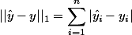

其中 *y[i]* 和 *ŷ* 分别是样本的真实值和预测值。

当不同的预测变量相差一个数量级时，预测误差的度量可能会变得偏斜。大预测变量会掩盖小值变量的重要性，从而使得推断每个预测变量在模型中的相对重要性变得困难。这会影响线性模型各自的权重收敛到最优值，进而影响算法的性能。具有最高幅度的预测变量最终会主导模型，即使该预测变量对真实结果值几乎没有预测能力。通过强制所有预测变量处于相同的尺度，数据归一化是一种减轻该问题的方法。

有两种常见的归一化类型；数据可以被归一化或标准化：

+   **min-max 归一化**，或**归一化**，将所有值设置为*[0,1]*之间：

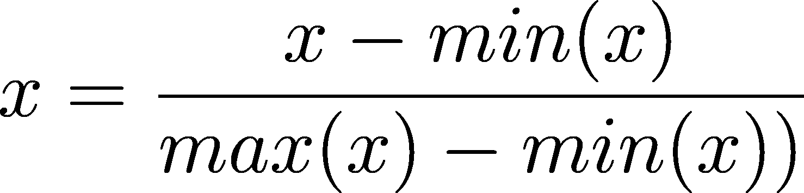

+   **z 分数标准化**，或**标准化**，根据标准差进行归一化。所有预测变量都将具有 0 均值和 1 标准差：

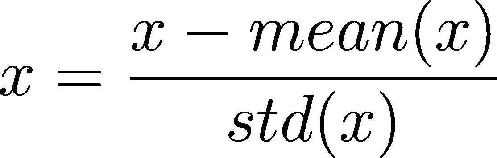

基于树的算法（决策树、随机森林、提升树）是唯一一种其性能不会因归一化或标准化而提高的机器学习模型。所有其他基于距离/方差预测算法都可能从归一化中受益。已经证明，标准化对于随机梯度下降（SGD）特别有用，因为它确保所有权重将以相同的速度适应。

*高效反向传播 Yann A. LeCun 等人在神经网络中*：*技巧贸易 pp. 9-48，Springer Verlag*

亚马逊机器学习（Amazon ML）提供 z 分数标准化作为可用数据转换的一部分。

# 不平衡数据集

处理不平衡数据集是一个非常常见的分类问题。

考虑一个二元分类问题。你的目标是预测正类与负类。两个类别之间的比例高度偏向正类。这种情况在以下实例中经常遇到：

+   在医疗环境中，正类对应于在大量随机人群中存在癌细胞的人群

+   在营销环境中，正类对应于购买保险的潜在客户，而大多数人并没有购买

在这两种情况下，我们希望检测少数类别的样本，但它们在多数（负）类别的样本中占绝对少数。大多数预测模型都会高度偏向多数类别。

在高度不平衡的类别存在的情况下，一个总是预测多数类别而从不预测少数类别的非常简单的模型将具有极高的准确率，但永远不会检测到重要且有价值的类别。例如，考虑一个由 1,000 个样本组成的数据集，其中包含 50 个我们想要检测或预测的正样本和 950 个无趣的负样本。这个简单模型有 95%的准确率，这显然是一个不错的准确率，尽管这个模型完全无用。这个问题被称为**准确率悖论**([`en.wikipedia.org/wiki/Accuracy_paradox`](https://en.wikipedia.org/wiki/Accuracy_paradox))。

一个直接的解决方案是收集更多数据，重点关注收集少数类别的样本，以便平衡两个类别。但这并不总是可能。

处理不平衡数据集有许多其他策略。我们将简要介绍其中一些最常见的方法。一种方法是通过欠采样或过采样现有数据来重新采样数据：

+   **欠采样**包括丢弃多数类别的多数样本，以便将少数/多数类别的比例调整为*50/50*。这种策略的明显问题是会丢弃大量数据，以及随之而来的对模型有意义的信号。这种技术在存在足够大的数据集时可能是有用的。

+   **过采样**包括复制属于少数类别的样本。与欠采样相反，该策略不会丢失数据。然而，过采样会给少数类别的某些模式添加额外的权重，这可能不会给模型带来有用的信息。过采样会给模型添加噪声。当数据集较小且无法承受丢失一些数据时，过采样是有用的。

下采样和过采样是两种简单且易于实现的方法，在建立基线时很有用。另一种广泛使用的方法是从现有数据中创建合成样本。一种流行的样本创建技术是 **SMOTE** 方法，代表 **合成少数类过采样技术**。SMOTE 通过选择与某些距离度量相似的少数类样本，并在选定的属性上添加扰动来工作。然后，SMOTE 在现有少数样本的簇内创建新的少数样本。在存在高维数据集的情况下，SMOTE 的解决方案作用较小。

Python 中的 **不平衡库** ([http://](http://github.com/scikit-learn-contrib/imbalanced-learn)[github.com/scikit-learn-contrib/imbalanced-learn](http://github.com/scikit-learn-contrib/imbalanced-learn)) 或 R 中的 **不平衡包** ([`cran.r-project.org/web/packages/unbalanced/index.html`](https://cran.r-project.org/web/packages/unbalanced/index.html)) 都在所提及的技术之上提供了一组大量的高级技术。

注意，在数据不平衡的背景下，选择用于评估模型性能的指标尤为重要。准确率，定义为正确预测样本数与总样本数的比率，是分类问题中最直接的指标。但正如我们所见，这种准确率在存在高度倾斜的类别分布的情况下，并不是模型预测能力的良好指标。

在这种情况下，建议使用两个指标：

+   **Cohen's kappa**：衡量真实类别和预测类别之间一致性的稳健度量 ([`en.wikipedia.org/wiki/Cohen%27s_kappa`](https://en.wikipedia.org/wiki/Cohen%27s_kappa))

+   **F1 分数**：精确率和召回率的调和平均数 ([`en.wikipedia.org/wiki/F1_score`](https://en.wikipedia.org/wiki/F1_score))

F1 分数是 Amazon ML 用于评估分类模型质量的指标。我们在本章末尾的“评估模型性能”部分给出了 F1 分数的定义。

# 解决多重共线性问题

以下是根据维基百科的定义的多重共线性 ([`en.wikipedia.org/wiki/Multicollinearity`](https://en.wikipedia.org/wiki/Multicollinearity)):

**多重共线性**是多个回归模型中两个或多个预测变量高度相关的现象，这意味着一个可以从其他变量中线性预测出来，具有相当高的准确性。

基本上，假设你有一个包含三个预测因子的模型：

其中一个预测因子是一个线性组合（完美多重共线性）或者近似为两个其他预测因子的线性组合（近多重共线性）。

例如： 

这里， 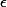 是一些噪声变量。

在这种情况下，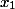和的变化将驱动的变化，因此，将与和相关联。和中已经包含的信息将与第三个预测因子共享，这将在模型中引起高度不确定性和不稳定性。预测因子值的小幅变化将导致系数的大幅变化。回归可能不再可靠。在更技术性的术语中，系数的标准误差会增加，这会降低其他重要预测因子的显著性。

有几种方法可以检测多重共线性。计算预测因子的相关矩阵是第一步，但这只会检测预测因子对之间的共线性。

多重共线性的一个常用检测方法是计算每个预测因子的**方差膨胀因子**或**VIF**：

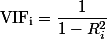

在这里，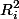是第一步中回归方程的确定系数，其中在左侧，所有其他预测变量（所有其他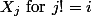变量）在右侧。

VIF（方差膨胀因子）中的一个值很大表明，特定系数的方差（标准误差的平方）比该预测因子与其他所有预测因子完全不相关时的方差要大。例如，VIF 为 1.8 表示预测因子的方差比不相关情况下的方差大 80%。

一旦确定了高度共线性的属性，以下选项将减少共线性：

+   从数据集中移除高度共线性预测因子

+   使用**偏最小二乘回归（PLS）**或**主成分分析（PCA）**，回归方法([`en.wikipedia.org/wiki/Principal_component_analysis`](https://en.wikipedia.org/wiki/Principal_component_analysis))；PLS 和 PCA 将预测因子的数量减少到一组不相关的变量

不幸的是，从 Amazon ML 平台无法检测和移除多重共线性变量。

# 检测异常值

给定一个变量，异常值是该变量中与其他值非常不同的值。异常值相当常见，通常由人为或测量错误引起。异常值可能会严重破坏模型。

为了演示，让我们看看两个简单的数据集，并观察它们的平均值是如何受到异常值存在的影响的。

考虑两个样本量都很少的数据集：*A = [1,2,3,4]* 和 *B = [1,2,3,4, 100]*。B 数据集中的第 5 个值，100，显然是一个异常值：*mean(A) = 2.5*，而*mean(B) = 22*。异常值可以对指标产生重大影响。由于大多数机器学习算法基于距离或方差测量，异常值可以对模型的性能产生重大影响。

多元线性回归对异常值效应敏感，如下面的图表所示，添加一个单独的异常值点会将坚实的回归线破坏成虚线：

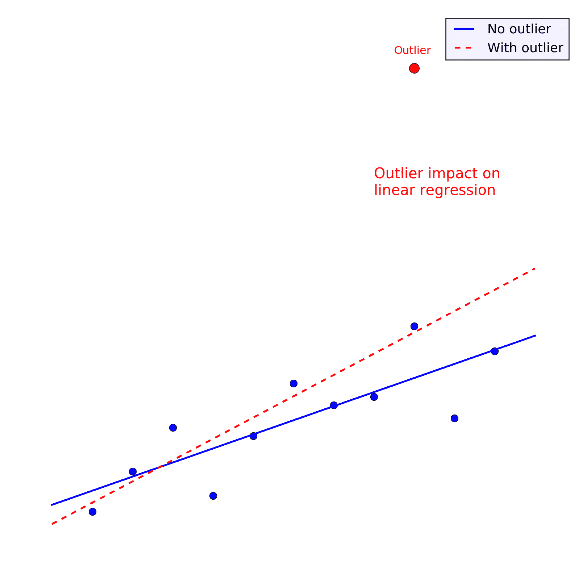

移除与异常值相关的样本是最简单的解决方案。

另一种解决方案是对预测变量应用**分位数分组**，通过将值分成*N*个有序的区间或分组，每个分组大约包含相等数量的样本。这将把一个数值（连续）预测变量转换为分类变量。例如，[1,2,3,4,5,6,7,8,9,10,11,100]分成三个大小相等的分组变为[*1,1,1,1,2,2,2,2,3,3,3,3*]；异常值 100 被包含在第三个分组中并隐藏。

分位数分组的缺点是在过程中会丢失一些信息粒度，这可能会降低模型的性能。

**分位数分组**在 Amazon ML 中作为数据变换过程可用，也用于量化原始数据集中的非线性。

事实上，**分位数分组**（**QB**）是 Amazon ML 默认应用于所有与结果没有直接线性关系的连续变量的。在我们所有的试验中，与我们的先前假设相反，我们发现 QB 在 Amazon ML 环境中是一种非常高效的数据变换。

# 接受非线性模式

线性回归模型意味着结果可以通过预测变量的线性组合来估计。当然，这并不总是情况，因为特征通常表现出非线性模式。

考虑以下图表，其中*Y*轴依赖于*X*轴，但关系显示出明显的二次模式。将线（*y = aX + b*）作为*Y*作为*X*的函数的预测模型并不适用：

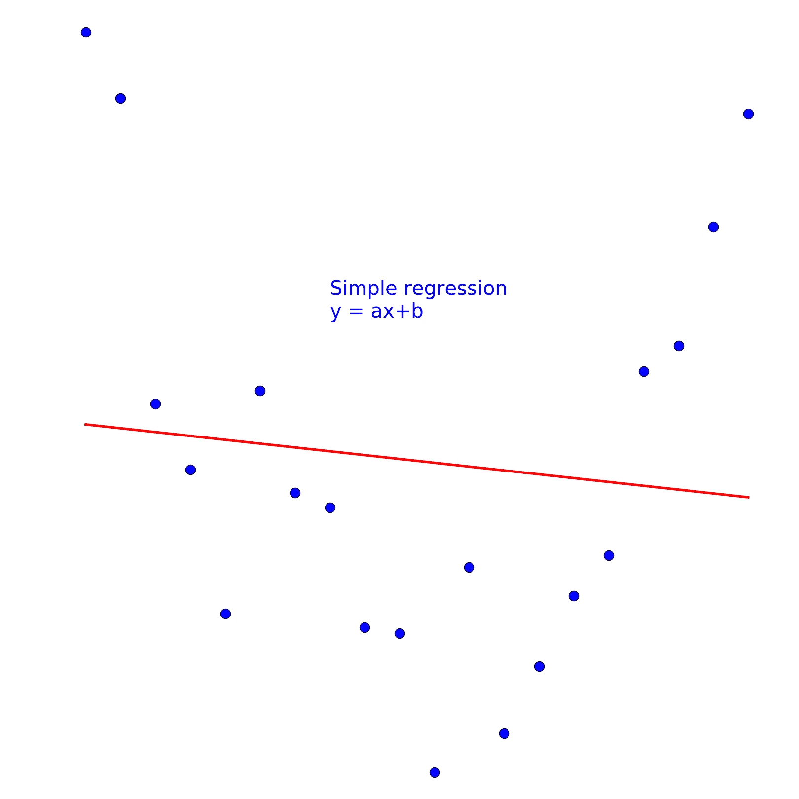

一些模型和算法能够自然地处理非线性，例如，基于树的模型或具有非线性核的支持向量机。线性回归和 SGD 则不行。

**变换**：在线性回归的背景下处理这些非线性模式的一种方法是对预测变量进行变换。在前面的简单例子中，将预测变量 X 的平方添加到模型中会得到更好的结果。现在的模型将具有以下形式：

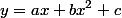

如以下图表所示，新的二次模型更好地拟合了数据：

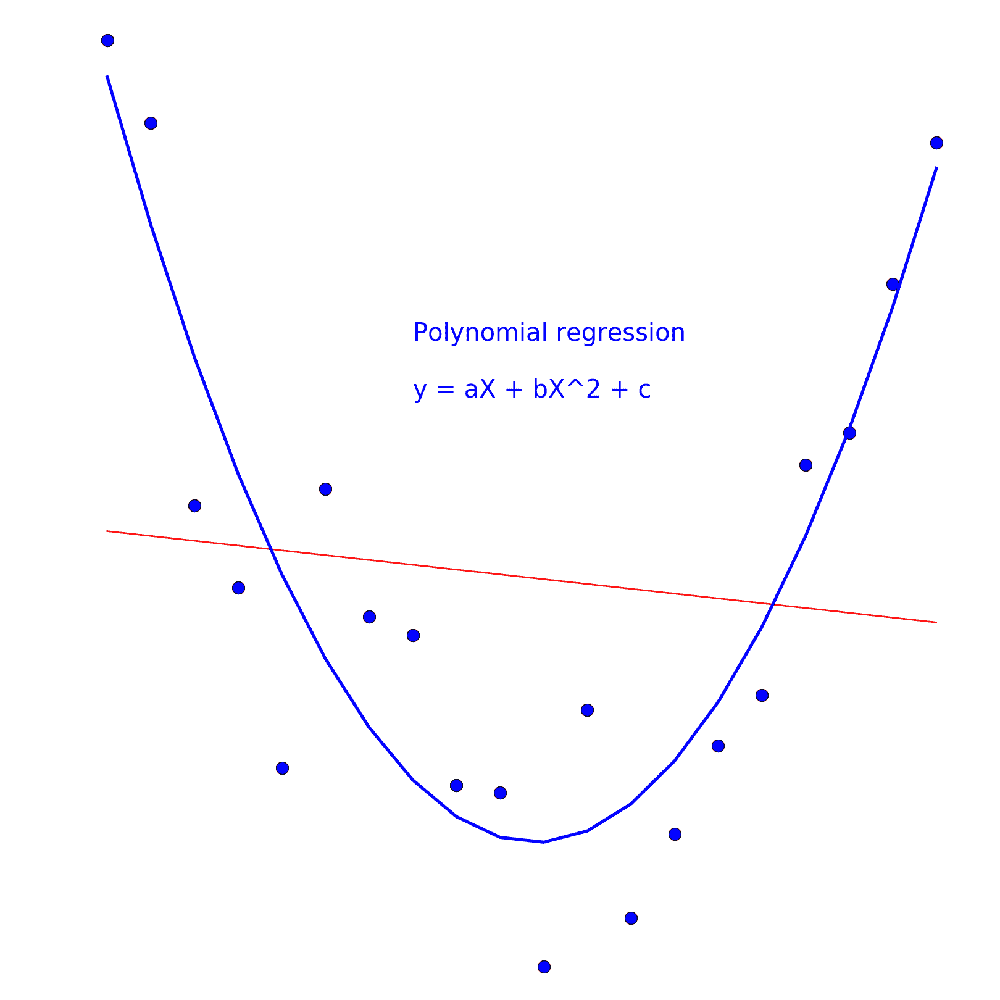

我们不仅限于二次情况，可以使用更高阶的幂函数来转换现有属性并创建新的预测因子。其他有用的转换可能包括取对数、指数、正弦和余弦等。在此处值得提及的是**Box-Cox 转换**([`onlinestatbook.com/2/transformations/box-cox.html`](http://onlinestatbook.com/2/transformations/box-cox.html))。它是一种有效的数据转换，可以减少变量分布的偏度和峰度。它将变量分布重塑为更接近高斯分布的形状。

**样条曲线**是多项式插值的优秀且更强大的替代品。样条曲线是分段多项式，它们在平滑处连接。在其最简单层面上，样条曲线由在不同点连接的线条组成。样条曲线在 Amazon ML 中不可用。

**分位数分组**是 Amazon ML 解决非线性问题的方法。通过将数据分成 N 个分组，你消除了分组区间中的任何非线性。尽管分组有几个缺点([`biostat.mc.vanderbilt.edu/wiki/Main/CatContinuous`](http://biostat.mc.vanderbilt.edu/wiki/Main/CatContinuous))，主要缺点是信息在过程中被丢弃，但它已经在 Amazon ML 平台上显示出优秀的预测性能。

# 添加特征？

通常，添加与结果以某种方式相关的新的特征会带来信息并提高模型。然而，添加太多预测能力很小的特征可能会使同一个模型变得混乱，最终降低其性能。

当样本量相对于特征数量较小时，通过移除最不有趣的特征进行特征选择是值得尝试的；这会导致观察值过少或特征过多。有不同策略([`machinelearningmastery.com/an-introduction-to-feature-selection/`](http://machinelearningmastery.com/an-introduction-to-feature-selection/))来识别和移除弱特征。根据特征与结果的相关性选择特征，并丢弃与结果相关性很小或没有相关性的特征，通常会提高你的模型。

# 预处理回顾

下表总结了在原始数据中可能遇到的不同问题，以及 Amazon ML 提供处理这些问题的方法：

|  | **线性模型敏感性** | **在 Amazon ML 上可用** |
| --- | --- | --- |
| **缺失值** | 是 | 自动处理 |
| **标准化** | 是 | z 分数标准化 |
| **异常值** | 是 | 分位数分组 |
| **多重共线性** | 是 | 否 |
| **不平衡数据集** | 是 | 使用正确的指标 F1 分数，没有采样策略（可能存在于后台） |
| **非线性** | 是 | 分位数分组 |

# 预测分析工作流程

我们一直在谈论训练模型。这在实践中意味着什么？

在监督学习中，数据集通常被分成三个不等的部分：训练、验证和测试：

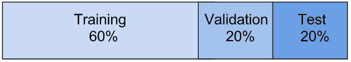

+   你训练模型的**训练集**。它必须足够大，以便尽可能多地给模型提供关于数据的信息。这个数据子集被算法用来估计模型的最佳参数。在我们的情况下，SGD 算法将使用这个训练子集来找到线性回归模型的最优权重。

+   **验证集**用于评估训练模型的性能。通过测量训练模型在未用于其训练的子集上的性能，我们可以对其性能进行客观评估。这样我们就可以用不同的元参数训练不同的模型，并查看哪个模型在验证集上的表现最好。这也被称为模型选择。请注意，这会创建一个反馈循环，因为验证数据集现在对你的模型选择有影响。另一个模型可能在那个特定的验证子集上表现较差，但总体上在新数据上表现更好。

+   **测试集**对应于在你完全优化了特征和模型之后保留的数据。测试子集也称为**保留集**。

在现实生活中，你的模型将面临之前未预见的数据，因为模型的最终*存在理由*是预测未见数据。因此，评估模型在之前未曾遇到的数据上的性能是很重要的。保留的数据集是未见数据的代理。在最后之前，绝对不能使用这个数据集来优化模型或数据属性。

这三个子集应该足够大，以准确代表真实数据。更精确地说，所有变量的分布应该在三个子集中是等效的。如果原始数据集以某种方式排序，确保在训练、验证和测试分割之前对数据进行洗牌是很重要的。

如前所述，基于其在验证集上的性能而选择的模型可能对该特定数据集有积极的偏差。为了最小化这种依赖性，通常会对具有相同参数设置的多个模型进行训练和评估，并对多个训练验证数据集对的模型性能进行平均。这减少了模型选择对验证数据集中变量特定分布的依赖性。

这种三分法是基本的，正如我们所看到的，模型最终可能会依赖于验证子集的一些特定性。交叉验证是一种标准方法，可以减少这种依赖性并改进我们的模型选择。交叉验证包括执行多个训练/验证分割，并对不同验证子集上的模型性能进行平均。最常用的交叉验证技术是 k 折交叉验证，它包括将数据集分割成 K 个块，递归地使用每个部分作为验证集，其余 k-1 个部分作为训练集。其他交叉验证技术包括蒙特卡洛交叉验证，其中不同的训练和验证集是从初始数据集中随机采样的。我们将在后面的章节中实现蒙特卡洛交叉验证。交叉验证不是 Amazon ML 服务中包含的功能，需要通过编程实现。在 Amazon ML 中，模型的训练和评估仅在一个训练-验证分割上完成。

# 在 Amazon ML 中的训练和评估

在 Amazon ML 的上下文中，模型是线性回归，算法是**随机梯度下降**（**SGD**）算法。该算法有一个主要元参数，称为学习率，通常表示为 ，它决定了每个迭代更新权重时考虑新样本的程度。较大的学习率使算法收敛更快，但离最佳权重更远，而较小的学习率会导致收敛较慢，但回归系数集更精确。

给定训练集和验证集，这是 Amazon ML 调整和选择最佳模型的方法：

+   Amazon 训练了多个模型，每个模型具有不同的学习率。

+   对于给定的学习率：

    +   训练集允许 SGD 通过寻找最佳回归系数来训练模型。

    +   模型在验证集上用于进行预测。

+   通过比较不同模型在该验证集上的预测质量，Amazon ML 能够选择最佳模型及其相关的最佳学习率。

+   保留集被用作最终确认模型是否可靠。

常用的训练、验证和保留子集分割比例如下：

+   训练：*70%* 验证和保留 15% 各自

+   训练：*60%* 验证和保留 20% 各自

**洗牌**: 确保预测值和结果在所有三个子集中遵循相同的分布非常重要。在分割数据之前对数据进行洗牌是创建可靠训练集、验证集和保留集的重要部分。

在训练数据集上定义数据转换，并在验证和保留子集上应用转换参数，以确保验证和保留子集不会将信息泄露回训练集。

以标准化为例：预测变量的标准差和平均值应在训练数据集上计算。然后应用这些值来标准化验证集和保留集。如果你使用整个原始数据集来计算平均值和随机梯度下降（SGD），你将从保留集中泄露信息到训练集中。

一个常见的监督预测分析工作流程遵循以下步骤 - 假设我们已经提取了数据集，并且我们已经选择了一个指标来评估预测质量：

1.  构建数据集

    +   清理和转换数据以处理噪声数据问题

    +   创建新的预测变量

    +   打乱并分割数据为训练、验证和保留集

1.  选择最佳模型

    +   选择一个模型（线性、基于树的、贝叶斯等）

    +   对元参数的几个值进行重复：

        +   在训练集上训练模型

        +   在验证集上评估模型性能

1.  使用新数据、新预测变量和其他模型参数重复步骤 1 和 2，直到你对模型的性能满意。保留最佳模型。

1.  在保留的子集上对模型的最终测试。

在 Amazon ML 的上下文中，除了线性回归模型（分类时为逻辑回归）之外，没有其他选择模型（步骤 2）的可能性。

# 识别和纠正不良性能

一个性能良好的预测模型是指在新数据上产生可靠和令人满意的预测。模型无法持续产生良好预测的情况有两种，并且两者都取决于模型是如何训练的。一个训练不良的模型会导致欠拟合，而一个过度训练的模型会导致过拟合。

# 欠拟合

**欠拟合**意味着模型训练不良。要么是训练数据集没有足够的信息来推断强预测，要么是训练数据集上训练模型的算法不适合该上下文。算法参数设置不当或简单地不适合数据。

如果我们在验证集和训练集上测量预测误差，当模型欠拟合时，预测误差会很大。这是有道理的：如果模型无法预测训练数据，它将无法预测之前未见过的验证集的输出。欠拟合基本上意味着你的模型不起作用。

缓解此问题的常见策略包括：

+   获取更多数据样本 - 如果问题来自一个太小或信息不足的数据集，获取更多数据可能会提高模型性能。

+   添加更多特征，原始的或通过特征工程 - 通过取对数、平方、分箱、使用样条或幂函数。添加许多特征并观察这如何提高预测。

+   选择另一个模型 - 支持向量机、随机森林、提升树、贝叶斯分类器在不同的上下文中都有不同的优势。

# 过拟合

**过拟合**发生在模型训练得如此之好，以至于它完美地拟合了训练数据，却无法处理新数据。

假设你有一个结果的唯一预测变量，并且数据遵循二次模式：

1.  你在那些数据上拟合了线性回归![img/B05028_2_18_eqn.png]，预测效果较弱。你的模型未能很好地拟合数据。训练误差和验证数据集上的误差水平都很高。

1.  你在模型中添加了预测变量的平方![img/B05028_2_19_eqn.png]，并发现你的模型做出了良好的预测。训练集和验证数据集上的误差都相当于更简单的模型，且更低。

1.  如果你增加多项式特征的数量和幂，使得模型现在是![img/B05028_2_20_eqn.png]，你最终会过于紧密地拟合训练数据。模型在训练数据集上的预测误差非常低，但无法对新数据进行预测。验证数据集上的预测误差仍然很高。

这是一个过拟合的例子。

下面的图表显示了关于先前二次数据集的一个过拟合模型示例，通过设置多项式回归的高阶（*n = 16*）。多项式回归拟合训练数据如此之好，以至于它将无法对新数据进行任何预测，而二次模型（*n = 2*）将更加稳健：

![img/image_02_035.png]

因此，检测过拟合的最佳方式是对比训练集和验证集上的预测误差。两个误差之间存在显著差距意味着过拟合。防止这种过拟合发生的一种方法是在模型上添加约束。在机器学习中，我们使用正则化。

# 线性模型上的正则化

随机梯度下降算法（SGD）通过最小化 N 个训练样本上真实值和预测值之间的误差来找到模型的最佳权重 *{w[i]}*：

![img/B05028_2_22_eqn.png]

其中![img/image_02_038.png]是预测值，*ŷ[i]*是待预测的真实值；我们有*N*个样本，每个样本有*n*个维度。

正则化包括向先前方程中添加一个项，并最小化正则化误差：

![img/B05028_2_24_eqn.png]

![img/image_02_042.png]参数有助于量化正则化的程度，而*R(w)*是依赖于回归系数的正则化项。

通常考虑两种类型的权重约束：

+   L2 正则化作为系数平方的和：

![img/B05028_2_25_eqn.png]

+   L1 正则化作为系数绝对值的和：

![img/B05028_2_26_eqn.png]

正则化项*R(w)*引入的系数约束防止模型过度拟合训练数据。系数通过正则化相互关联，不能再紧密地与预测因子绑定。每种正则化都有其特征，并导致 SGD 算法的不同变体，我们现在介绍：

# L2 正则化和岭

L2 正则化防止权重 *{w[i]}* 过度分散。对于非相关但可能具有意义的特征，上升的小权重不会与重要的相关特征关联的权重相比变得不重要。L2 正则化将强制执行相似的权重缩放。L2 正则化的直接后果是减少共线性对负面的影响，因为权重不能再相互分离。

带有 L2 正则化的随机梯度下降算法被称为**岭算法**。

# L1 正则化和 Lasso

L1 正则化通常会导致模型预测能力的某些损失。

L1 正则化的一种特性是迫使最小的权重为 0，从而减少模型中考虑的特征数量。当特征数量（*n*）与样本数量（*N*）相比很大时，这是一种期望的行为。L1 更适合具有许多特征的集合。

带有 L1 正则化的随机梯度下降算法被称为**最小绝对收缩和选择算子**（Lasso）算法。

在这两种情况下，模型的超参数如下：

+   SGD 算法的学习率 

+   一个参数 来调整添加到模型中的正则化量

一种称为**ElasticNet**的第三种正则化方法，包括在模型中添加 L2 和 L1 正则化项。这以增加一个额外的超参数为代价，带来了两种正则化方案的优点。

在其他情况下，尽管专家们对哪种正则化更有效有不同意见（[`www.quora.com/What-is-the-difference-between-L1-and-L2-regularization`](https://www.quora.com/What-is-the-difference-between-L1-and-L2-regularization)），但共识似乎更倾向于 L2 正则化优于 L1 正则化。

在 Amazon ML 中，L2 和 L1 正则化都是可用的，而 ElasticNet 不可用。可用的正则化量限于三个值：温和的（1*0^(-6)）、中等（*10^(-4)）和激进（*10^(-2)）。

# 评估模型的性能

评估模型的预测性能需要定义其预测质量的一个度量。对于回归和分类都有几个可用的度量。在 Amazon ML 上下文中使用的度量如下：

+   **RMSE 回归**：均方根误差定义为真实结果值与其预测值之间差异的平方：

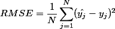

+   **F-1 分数和 ROC-AUC 用于分类**：Amazon ML 使用逻辑回归来解决二元分类问题。对于每个预测，逻辑回归返回一个介于 0 和 1 之间的值。这个值被解释为样本属于两个类别之一的概率。小于 0.5 的概率表示属于第一个类别，而大于 0.5 的概率表示属于第二个类别。因此，决策高度依赖于阈值值。我们可以修改这个值。

+   表示一个类别为正，另一个为负，我们有以下表格中的四种可能性：

|  | **预测为是** | **预测为否** |
| --- | --- | --- |
| **真实值：是** | 真正例（TP） | 假负例（FN）（或第二类错误） |
| **真实值：否** | 假正例（FP） | 真负例 |

+   这个矩阵被称为**混淆矩阵**([`en.wikipedia.org/wiki/Confusion_matrix`](https://en.wikipedia.org/wiki/Confusion_matrix))。它定义了分类模型性能的四个指标：

    +   TP：有多少个“是”被正确预测为“是”

    +   FP：有多少个“否”被错误地预测为“是”

    +   FN：有多少个“是”被错误地预测为“否”

    +   TN：有多少个“否”被正确预测为“否”

+   从这四个指标中，我们可以定义以下度量：

    +   **召回率**：这表示预测为正的实际正例数量。召回率也称为**真正例率**（**TPR**）或灵敏度。它是检测的概率：

*召回率 = (TP / TP + FN)*

+   +   **精度**作为所有预测为正的实际正例的分数：

*精度 = (TP / TP + FP)*

+   +   **假正例率**是所有真实负例中错误预测为正例的数量。它是误报的概率：

*FPR = FP / FP + TN*

+   +   最后，**F1 分数**定义为召回率和精度的加权平均值，其计算公式如下：

*F1 分数 = 2 TP / ( 2 TP + FP + FN)*

+   +   F1 分数总是在 0 到 1 之间，1 是最佳值，0 是最差值。

如前所述，这些分数都依赖于最初用于解释逻辑回归结果并决定预测属于哪个类别的初始阈值。我们可以选择改变这个阈值。这就是 ROC-AUC 发挥作用的地方。

如果你将真正例率（召回率）与不同决策阈值下的假正例率进行比较，你会得到一个如图所示的图形，称为**接收者操作特征**或**ROC 曲线**：

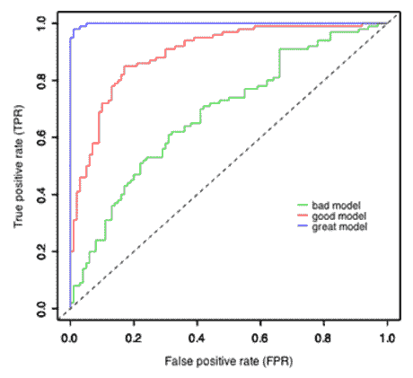

+   对角线表示属于一个类别或另一个类别的概率相等。曲线越接近右上角，你的模型性能越好。

+   ROC 曲线自二战以来被广泛使用，当时它首次被发明出来用于在雷达信号中检测敌机。

+   一旦您有了 ROC 曲线，您就可以计算**曲线下面积**或**AUC**。

+   AUC 将为您提供一个独特的分数，考虑了从 0 到 1 的所有可能的概率阈值。AUC 值越高，表示模型越好。

# 摘要

在本章中，我们关注了预测分析项目中的两个重要元素：数据和模型预测能力的评估。我们首先列出了与原始数据最常见的问题，它们对线性回归模型的影响以及解决这些问题的方法。现在，读者应该能够识别和处理缺失值、异常值、不平衡数据集和归一化问题。

我们还介绍了预测分析中最常见的两个问题：欠拟合和过拟合。L1 和 L2 正则化是 Amazon ML 平台的一个重要元素，它有助于克服过拟合，并使模型更加稳健，能够处理以前未见过的数据。

现在，我们已准备好在下一章深入探讨 Amazon 机器学习平台。
