# 第三章：亚马逊机器学习工作流程概述

本章概述了一个简单亚马逊机器学习（Amazon ML）项目的流程，它包括三个主要阶段：

1.  准备数据

1.  训练和选择模型

1.  进行预测

读者将学习如何在亚马逊机器学习平台上开始，如何设置账户，以及如何保护账户。在第二部分，我们将通过一个基于经典数据集的简单数值预测问题进行讲解。我们描述了上述三个步骤中每个步骤发生的情况、预期结果以及如何解释最终结果。

在本章中，我们将研究以下内容：

+   开设亚马逊网络服务（AWS）账户

+   设置账户

+   标准亚马逊机器学习工作流程概述

# 开设亚马逊网络服务账户

在 AWS 账户注册非常简单。访问[`aws.amazon.com/`](http://aws.amazon.com/)，并选择创建 AWS 账户。如果您还没有 AWS 账户，可以利用免费层访问。新免费层账户在前 12 个月内可以享受一定限制内的免费资源。这些免费资源适用于许多 AWS 服务，如 EC2、S3、RDS 或 Redshift 等。不幸的是，亚马逊机器学习不包括在 AWS 免费层中。您将因使用亚马逊 ML 而付费。然而，由于亚马逊 ML 需要将您的数据存储在 S3 或另一个 AWS 资源（如 RedShift）上，而这些资源包括在免费层提供中，因此从免费层账户开始仍然是有利的。按照说明开设免费层账户。您将被要求提供您的姓名、电子邮件、地址、电话号码和支付信息。

如果您已经是亚马逊零售客户，通过使用不同的电子邮件地址来区分您的 AWS 账户和个人零售亚马逊账户将会更容易。这尤其适用于您计划为了专业目的从亚马逊机器学习（Amazon ML）中恢复成本的情况。使用相同的电子邮件地址同时为您的个人零售账户（如亚马逊 Prime、Echo 等）和 AWS 账户可能会造成混淆。

# 安全性

您用于开设 AWS 账户的电子邮件和密码被称为您的根凭证。它们为您提供了对每个 AWS 服务的根访问权限，这意味着对无限资源的无限访问。如果有人未经您的知晓获取了您的根凭证，他们可能会产生高额账单，并且他们可以在您的名义下通过您的账户执行所有类型的活动。强烈建议不要在日常的 AWS 操作中使用这种根访问权限，并尽可能设置最高安全级别的账户。

幸运的是，AWS 提供了许多通过用户、组、角色、策略、密码和多因素认证来控制和隔离对您的 AWS 账户访问的方法，以降低非法访问和欺诈的风险。配置和管理对您账户的访问是通过 **AWS 身份和访问管理 (IAM)** 服务完成的。IAM 服务是免费的。

IAM 服务允许您创建和配置您计划使用的所有 AWS 服务的访问点。这种级别的粒度非常重要。您可以通过用户、服务、角色来限制访问，甚至可以通过令牌启用临时访问，这些令牌有时间限制。启用多因素认证是另一个强烈建议您启用的功能，以防止未经授权访问您的 AWS 账户。

在本书的上下文中，我们将创建一个具有对仅两个服务（Amazon ML 和 S3）无限制访问的单个用户。随着我们在后续章节中需要时，我们将扩展此用户的访问权限到其他 AWS 服务。

我们不会在这里详细介绍 IAM 提供的所有功能，但我们强烈建议您熟悉 IAM 文档和最佳实践([`docs.aws.amazon.com/IAM/latest/UserGuide/best-practices.html`](http://docs.aws.amazon.com/IAM/latest/UserGuide/best-practices.html))。

# 设置账户

当您第一次设置账户时，您将获得访问您的根公共和秘密访问密钥的权限。这些密钥在您通过命令行界面（AWS CLI）管理 S3 上的数据以及 Amazon ML 中的模型时将非常有用。这两个密钥在创建时将仅对您可用，以便查看和复制。一旦浏览器中的页面关闭，您将无法再访问它们，并将需要创建新的。创建新的根密钥是通过访问“我的账户”|“安全凭证”完成的。值得注意的是，没有人可以访问您的密钥，即使是您账户的管理员也不例外。

我们不会在这里详细介绍您可以在 IAM 中采取的所有操作来配置、管理和保护对您账户的访问，因为 IAM 的全面介绍超出了本书的范围。您的访问管理需求和策略将取决于您组织的规模和安全限制。我们假设您是该账户的唯一个人用户，并且您不需要为其他用户、组或角色设置密码策略。然而，我们强烈建议您熟悉 IAM 文档并实施 IAM 最佳实践([`aws.amazon.com/documentation/iam`](https://aws.amazon.com/documentation/iam))。

我们将创建一个名为`AML@Packt`的新用户，并将在此书的其余部分使用此访问权限。唯一需要使用根访问（即您最初创建 AWS 账户时使用的密码）的情况是我们需要向`AML@Packt`用户添加或删除服务，例如，当我们需要用户使用 Amazon Athena 进行数据处理或**Amazon Lambda**进行脚本编写时。

IAM 仪表板可在[`console.aws.amazon.com/iam`](https://console.aws.amazon.com/iam/home#/home)找到。它显示了您已创建多少个 IAM 资产（用户、角色、组等），以及如以下截图所示的安全状态：


此截图显示了以下三项已实施的内容：

+   **删除您的根访问密钥**：这些密钥是在您创建账户时分配给您的。由于它们提供了对账户的无限制访问，您应该删除它们，并仅使用基于用户的访问密钥来访问您的账户。

+   **在您的根账户上激活多因素认证：**登录并使用您的用户名和密码后，多因素认证（MFA）要求您输入一个六位数的代码。此代码可以通过短信或电子邮件发送给您，或者通过安装在您手机上的认证器应用程序提供。MFA 是一种易于实施且高效的账户访问安全保障方式。

+   **创建单个 IAM 用户**：通过创建单个用户，您可以限制、管理他们的访问级别，并轻松地停用他们的账户。

您还可以创建组来分配用户权限并定义密码策略。

# 创建用户

让我们从创建您的用户开始。转到 IAM 仪表板[`console.aws.amazon.com/iam/`](https://console.aws.amazon.com/iam/)，然后在左侧侧边栏中单击“用户”。用户创建过程很简单：

1.  点击“创建新用户”。

1.  输入您的用户名。保持为每个用户生成访问密钥的复选框选中。

到那时，您的用户已创建，您可以选择查看和下载用户安全凭证。一旦您离开此页面，这两个密钥中的一个，即**秘密访问密钥**将不再可用。请确保现在复制或下载这两个密钥。如果您丢失了密钥，您始终可以从 IAM > 用户仪表板为该用户重新创建一对新密钥。此截图是我们刚刚创建的`AML@Packt`用户的两个用户密钥的示例。您的密钥显然与这些不同：

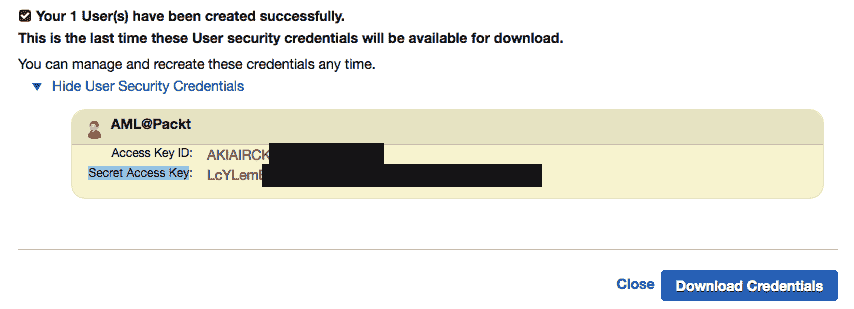

就这样！您的`AML@Packt`用户已创建。您可以使用`AML@Packt`的访问密钥通过 API 和命令行访问和管理 AWS 服务。在此阶段，`AML@Packt`用户对所有 AWS 服务具有无限访问权限。为了限制该用户的访问范围，您需要将策略附加到该用户。

# 定义策略

策略声明用户或组可以访问哪些服务以及访问级别（只读、完全访问等）。您可以定义同时照顾几个服务的全局策略，并将它们附加到用户组，或者您可以将特定的单服务策略附加到您的用户。这就是我们现在要做的。

一旦您创建了用户并下载了其凭证，您将结束在 IAM 用户仪表板上，列出了您创建的所有用户。选择`AML@Packt`用户和权限选项卡。检查用户将需要访问的所有已知服务。在我们的例子中，我们选择了两个具有完全访问权限的服务，这将足够探索 Amazon 机器学习服务：

+   Amazon 机器学习完全访问

+   Amazon S3 完全访问

我们将在需要时为这些用户添加其他策略，以启用其他服务（Athena、RedShift、RDS 等）。

# 创建登录凭证

最后但同样重要的是，如果我们想使用`AML@Packt`用户登录 AWS 控制台，我们必须为该用户创建登录凭证。如图所示，安全凭证选项卡是您管理用户访问密钥、登录凭证和 SSH 密钥的地方：


SSH 密钥与访问密钥不同。SSH 密钥将允许您 SSH 进入某些资产，例如*EC2*服务器。许多服务，包括机器学习服务，都不需要 SSH 密钥。另一方面，访问密钥用于程序化管理 AWS 服务。访问密钥对于设置使用命令行界面（AWS CLI）所需的凭证是必要的。

点击管理密码并为用户设置密码。这是用户`AML@Packt`的权限看起来是这样的：

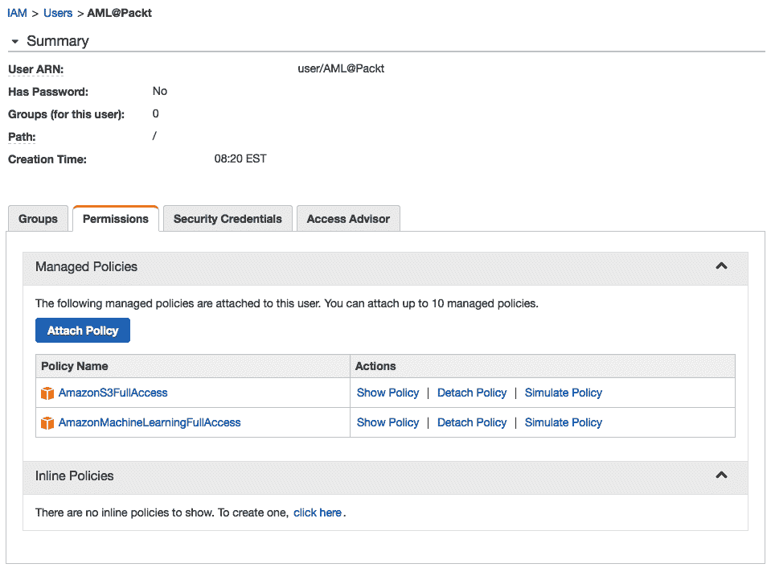

到目前为止，我们的 IAM 仪表板看起来是这样的：

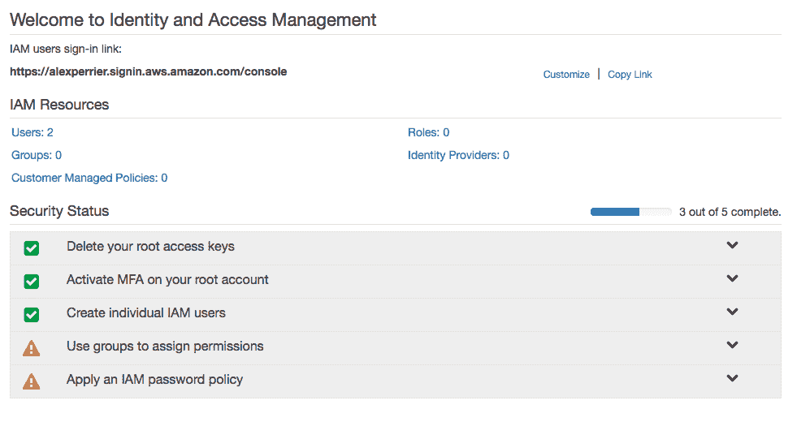

之前的截图显示了以下内容：

+   我们已删除 root 访问密钥。我们不能再通过命令行或 API 以无限的方式程序化访问所有 AWS 服务。我们仍然可以以 root 身份登录 AWS 控制台以创建和管理人员的访问权限，但这些将取决于我们提供的策略和访问级别。

+   我们已激活**多因素认证（MFA）**，这是一种简单且非常有效的方式来保护从 root 访问凭证访问 AWS 服务。

+   我们已创建了`AML@Packt`用户，我们将使用该用户登录 AWS，并在使用 API 或命令行时。

我们没有创建组或密码策略来进一步限制 root 访问，因为我们打算只通过`AML@Packt`用户访问 Amazon ML。

这里是您可以访问和使用 AWS 服务的不同方式的总结：

+   使用您的 root 密码登录 AWS 控制台，并使用**多因素认证（MFA）**登录。

+   使用带有`AML@Packt`用户的登录名和密码以及多因素认证（MFA）登录。`AML@Packt`用户只能使用 S3 和亚马逊 ML 服务。这相当限制性，但对于该用户来说，正是所需的访问量，不多也不少。

+   通过命令行界面或 AWS SDK 使用 S3 和亚马逊 ML 访问密钥以编程方式访问 S3 和亚马逊 ML。

我们最初从一个用户开始，即根用户，可以以编程方式和通过控制台访问 AWS 提供的一切。新的设置更加安全，并且值得花费设置它的时间。我们对 IAM 角色和策略的新理解也将有助于我们开始使用不同的 AWS 服务时，因为服务将需要相互之间适当的访问权限。

在我们深入介绍标准亚马逊 ML 工作流程之前，我们需要简要谈谈区域问题。

# 选择区域

AWS 目前在全球 14 个区域运营数据中心。全球各地正在频繁地开设更多区域([`aws.amazon.com/about-aws/global-infrastructure/`](https://aws.amazon.com/about-aws/global-infrastructure/))。大多数 AWS 服务要求您选择一个操作区域。一般规则是选择离您或访问您资源的最终用户最近区域。

选择区域可能取决于其他因素，这些因素可能因区域而异，包括：

+   延迟

+   定价

+   安全和合规性规则

+   服务的可用性

+   SLA–服务级别协议

+   可再生能源的使用。在撰写本文时，AWS 提供两个碳中和区域([`aws.amazon.com/about-aws/sustainability/`](https://aws.amazon.com/about-aws/sustainability/))，并正在积极创建更多区域。

亚马逊 ML 仅在弗吉尼亚北部和爱尔兰提供。您可以通过以下页面查看 AWS 在每个区域的可用性：[`aws.amazon.com/about-aws/global-infrastructure/regional-product-services/`](https://aws.amazon.com/about-aws/global-infrastructure/regional-product-services/)。

**政府云**：根据 AWS 文档：AWS 政府云（美国）是一个隔离的 AWS 区域，旨在在云中托管敏感数据和受监管的工作负载，帮助客户支持其美国政府的合规性要求。IAM 是区域无关的，但有以下例外：IAM 在美国东部（弗吉尼亚北部）区域和政府云区域可用。在美国东部区域创建的用户和角色可以在除政府云区域以外的所有其他区域中使用。政府云 IAM 用户不能在政府云区域之外使用。

# 标准亚马逊机器学习工作流程概述

亚马逊机器学习服务可在[`console.aws.amazon.com/machinelearning/`](https://console.aws.amazon.com/machinelearning/)访问。亚马逊 ML 工作流程紧密遵循标准的科学数据工作流程，步骤包括：

1.  提取数据并进行清理。使其可供算法使用。

1.  将数据分为训练集和验证集，通常采用 70/30 的比例，每个部分预测因子的分布相等。

1.  通过在训练数据集上训练多个模型并在验证数据集上比较它们的性能来选择最佳模型。

1.  使用最佳模型对新数据进行预测。

如以下 Amazon ML 菜单所示，该服务围绕四个对象构建：

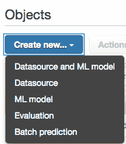

+   数据源

+   机器学习模型

+   评估

+   预测

数据源和模型也可以通过创建新的数据源和机器学习模型在同一流程中进行配置和设置。让我们更详细地看看每个步骤。

# 数据集

在本章的其余部分，我们将使用简单的`通过身高和年龄预测体重`数据集（来自*Lewis Taylor (1967)*），该数据集包含 237 个儿童的年龄、体重、身高和性别样本，可在[`v8doc.sas.com/sashtml/stat/chap55/sect51.htm`](https://v8doc.sas.com/sashtml/stat/chap55/sect51.htm)找到。

此数据集由 237 行组成。每一行有以下预测因子：性别（F，M）、年龄（以*月*为单位）、身高（以*英寸*为单位），我们试图预测这些儿童的体重（以*磅*为单位）。没有缺失值和异常值。变量范围足够接近，不需要归一化。简而言之，我们不需要对原始数据集进行任何预处理或清理。年龄、身高和体重是数值变量（实值），性别是分类变量。

我们将随机选择 20%的行作为保留子集，用于对先前未见过的数据进行预测，并保留其余 80%作为训练和评估数据。这种数据拆分可以在 Excel 或其他电子表格编辑器中完成：

+   通过创建一个包含随机生成数字的新列

+   按该列对电子表格进行排序

+   选择 190 行用于训练，47 行用于预测（大约 80/20 的比例）

让我们命名训练集为`LT67_training.csv`，我们将用于预测的保留集命名为`LT67_heldout.csv`，其中*LT67*代表*Lewis and Taylor*，这是 1967 年创建此数据集的人。

与本书中提到的所有数据集、脚本和资源一样，训练和保留文件可在 GitHub 存储库[`github.com/alexperrier/packt-aml`](https://github.com/alexperrier/packt-aml)中找到。

注意，在年龄、性别、身高和体重方面，两个子集的分布应相似。我们希望用于预测的数据显示出的模式与我们将用于训练和优化模型的数据相似。

在本节的其余部分，我们将执行以下操作：

1.  在 S3 上加载数据。

1.  让 Amazon ML 推断模式并转换数据。

1.  创建模型。

1.  评估模型的性能。

1.  在保留的测试数据集上进行预测。

# 在 S3 上加载数据

按以下步骤在 S3 上加载训练集和保留集：

1.  前往您的 S3 控制台[`console.aws.amazon.com/s3`](https://console.aws.amazon.com/s3)。

1.  如果尚未创建，请创建一个存储桶。存储桶基本上是跨所有 S3 唯一命名的文件夹。我们创建了一个名为`aml.packt`的存储桶。由于该名称已被占用，如果您正在跟随此演示，您将不得不选择另一个存储桶名称。

1.  点击您创建的存储桶名称，并通过从操作下拉菜单中选择“上传”来上传`LT67_training.csv`和`LT67_heldout.csv`文件：

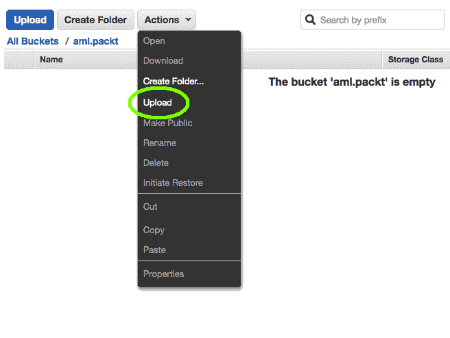

这两个文件都很小，只有几 KB，因此在此练习中的托管成本应该微乎其微。

注意，对于每个文件，通过在右侧选择“属性”选项卡，您可以指定如何访问您的文件，哪些用户、角色、组或 AWS 服务可以下载、读取、写入和删除文件，以及它们是否应该可以从公开网络访问。当在 Amazon ML 中创建数据源时，您将被提示授予 Amazon ML 访问您的输入数据的权限。您现在可以在 S3 中指定这些文件的访问规则，或者稍后简单地授予访问权限。

我们的数据现在存储在云中的 S3 存储桶中。我们需要通过创建数据源来告诉 Amazon ML 在哪里可以找到这些输入数据。我们将首先为训练文件`ST67_training.csv`创建数据源。

# 声明数据源

前往 Amazon ML 仪表板，点击“创建新... | 数据源和 ML 模型”。我们将使用默认的快速流程：

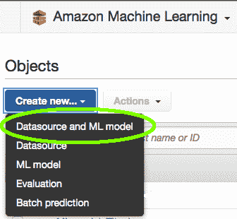

如以下截图所示，您需要指定`LT67_training.csv`文件的路径`{S3://bucket}{path}{file}`。请注意，S3 位置字段会自动填充您用户可用的存储桶名称和文件名称：

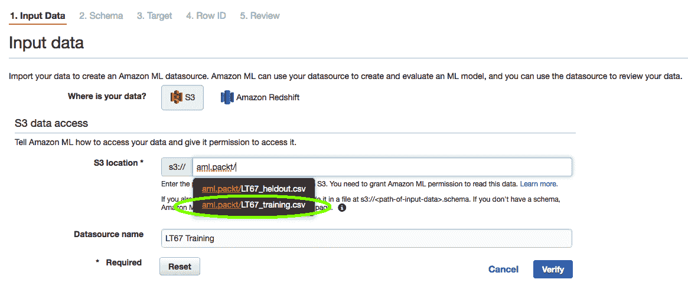

指定数据源名称有助于组织您的 Amazon ML 资产。通过点击“验证”，Amazon ML 将确保它有权访问该文件。如果需要授予文件访问权限，您将如以下截图所示被提示进行操作：

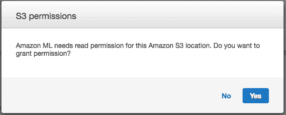

只需点击“是”以授予访问权限。此时，Amazon ML 将验证数据源并分析其内容。

# 创建数据源

一个 Amazon ML 数据源由以下组成：

+   数据文件的位置：数据文件在 Amazon ML 中不会被复制或克隆，而是从 S3 访问

+   包含 CSV 文件中变量类型信息的模式：

    +   分类

    +   文本

    +   数值（实值）

    +   二进制

如我们将在第四章“加载数据集和准备数据”中看到，您可以为 Amazon ML 提供自己的模式或修改由 Amazon ML 创建的模式。

此时，Amazon ML 对您的训练数据集中的数据类型有了相当好的了解。它已识别不同类型的变量，并知道它有多少行：


通过点击“继续”进入下一步，查看 Amazon ML 从数据集中推断出的模式，如下一张截图所示：

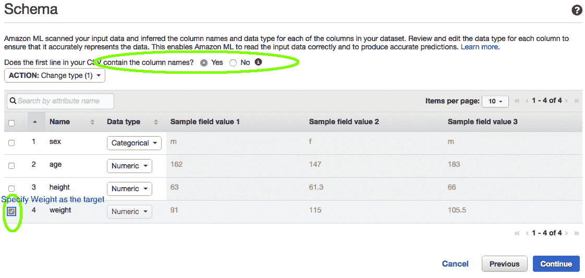

到那时，Amazon ML 需要知道你正在尝试预测哪个变量。务必告诉 Amazon ML 以下信息：

+   CSV 文件的第一行包含列名

+   目标是 `重量`

我们看到 Amazon ML 正确推断出以下信息：

+   `性别` 是分类的

+   `年龄`, `身高` 和 `体重` 是数值型（连续的实数值）

由于我们选择了一个数值型变量作为目标，Amazon ML 将使用线性回归作为预测模型。对于二元或分类值，我们会使用逻辑回归。这意味着 Amazon ML 将尝试找到最佳的 *a*, *b*, 和 *c* 系数，以便预测的重量尽可能接近数据中观察到的实际重量：

*预测重量 = a * 年龄 + b * 身高 + c * 性别*

Amazon ML 将询问你的数据是否包含行标识符。在我们的案例中，没有。行标识符在你想了解每行的预测结果或在你项目的后期添加额外的列时很有用。行标识符仅用于参考，服务不会使用它们来构建模型。

你将被要求审查数据源。你可以返回到之前的每个步骤并编辑模式、目标和输入数据的参数。现在数据已告知 Amazon ML，下一步是设置训练模型的算法参数。

# 模型

我们为训练和评估设置选择了默认参数。Amazon ML 将执行以下操作：

+   根据从数据集中推断出的统计属性创建数据转换的食谱

+   将数据集 (`ST67_training.csv`) 分为训练部分和验证部分，比例为 70/30。分割策略假设数据已经打乱，可以顺序分割。

在 第四章，*加载数据集和准备数据*，我们将走更长的路，直接在食谱、模式和验证分割上工作。在下一页，你将被要求审查你刚刚创建的模型。

该食谱将用于以类似的方式转换训练集和验证集的数据。Amazon ML 建议的唯一转换是将分类变量 `性别` 转换为二元变量，例如 `m = 0` 和 `f = 1`。不需要其他转换。

模型的默认高级设置如下截图所示：

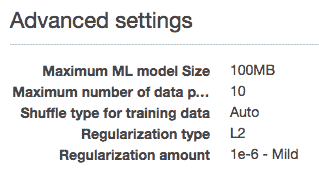

我们可以看到 Amazon ML 会遍历数据 10 次，每次遍历都会打乱数据分割。它将使用基于回归系数平方和的 L2 正则化策略来防止过拟合。我们将在稍后使用我们的`LT67_heldout.csv`数据集来评估模型的预测能力。

正则化有 3 个级别，有*温和*（10 的^-6 次方）、*中等*（10 的^-4 次方）或*激进*（10 的^-2 次方）的设置，每个值比前一个值更强。默认设置是*温和*，*最低的*，正则化常数为*0.00001*（10 的^-6 次方），这意味着 Amazon ML 不预期在这个数据集上有太多的过拟合。当预测器的数量（在我们的案例中是三个）远小于样本数量（训练集为 190 个）时，这很有意义。

点击创建 ML 模型按钮将启动模型创建。这需要几分钟的时间来解析，具体取决于数据集的大小和复杂性。你可以通过刷新模型页面来检查其状态。在此期间，模型状态保持待定。

在那个点上，Amazon ML 将我们的训练数据集分成两个子集：一个训练集和一个验证集。它将使用数据的训练部分来训练算法的几个设置，并根据其在训练数据上的性能选择最佳设置。然后，它将相关的模型应用于验证集，并为该模型返回一个评估分数。默认情况下，Amazon ML 将按顺序取前 70%的样本用于训练，剩余的 30%用于验证。

值得注意的是，Amazon ML 不会创建两个额外的文件并将它们存储在 S3 上，而是从我们之前定义的初始数据源中创建两个新的数据源。每个新的数据源都是通过以下`数据重排`JSON 配方从原始数据源获得的：

```py
{
  "splitting": {
    "percentBegin": 0,
    "percentEnd": 70
  }
}

```

你可以在数据源仪表板中看到这两个新的数据源。现在有三个数据源可用，而最初只有一个，如下面的截图所示：

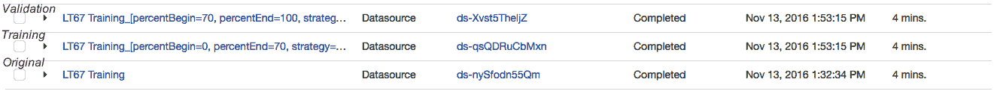

在模型训练过程中，Amazon ML 会在训练数据上多次运行随机梯度算法，并使用不同的参数：

+   以 10 的幂次递增的方式调整学习率：0.01，0.1，1，10 和 100。

+   在每次路径之前，对训练数据进行多次遍历并打乱样本。

+   在每次遍历中，计算预测误差，即**均方根误差 (RMSE**)，以估计相对于上一次遍历的改进程度。如果 RMSE 的下降并不真正显著，则认为算法已经收敛，不应再进行进一步的遍历。

+   在遍历结束时，具有最低 RMSE 的设置获胜，并且相关的模型（回归的权重）被选为最佳版本。

一旦模型完成训练，Amazon ML 就会在验证数据源上评估其性能。一旦评估本身也准备好了，你就可以访问模型的评估结果。

# 模型的评估

Amazon ML 使用标准的 RMSE 指标进行线性回归。RMSE 定义为真实值与预测值之间差异的平方和：

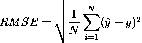

在这里，*ŷ*是预测值，*y*是我们想要预测的真实值（在我们的例子中是孩子的体重）。预测值与真实值越接近，RMSE 就越低。较低的 RMSE 意味着更好的、更准确的预测。

# 与基线比较

RMSE 是一个相对量，而不是一个绝对量。在某个特定情况下，RMSE 为 100 可能很好，而在另一个情况下，RMSE 为 10 可能表明预测不佳。因此，有一个基线来比较我们的模型是很重要的。每个 Amazon ML 评估都提供了一个基线，这个基线根据问题的性质（回归、二分类或多分类分类）而不同。基线是我们使用最简单和最明显的模型所能获得的分数：

+   回归的基线是由一个总是预测目标均值模型的

+   二分类的基线是 AUC 为*0.5*，这是随机分配 0 或 1 的模型的分数

+   对于多分类分类问题，基线是预测最常见类别的模型的宏平均*F1*分数

在我们当前的情况下，当预测学生的体重时，我们的训练数据集的基线 RMSE 为*18.71*，而我们的模型给出的 RMSE 为*14.44*。我们的模型比简单地预测所有学生体重的平均值好 22.8%。

在评估中还需要关注的是残差的分布，残差定义为*ŷ*和*y*之间的差异：

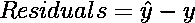

如我们在第一章，“机器学习与预测分析简介”中看到的，线性回归被认为是有效的条件之一是残差是独立、同分布的，并且它们的分布遵循**高斯分布**或**钟形曲线**。Amazon ML 显示了残差的直方图，这有助于我们直观地评估残差分布的高斯性质。

当形状向右（左）弯曲时，这意味着更多的预测值大于（小于）它们的靶值。在这两种情况下，结论是数据中仍有未被模型捕捉到的信号。当残差的分布以 0 为中心时，线性回归被认为是有效的。以下图表显示了当前回归模型的残差分布：

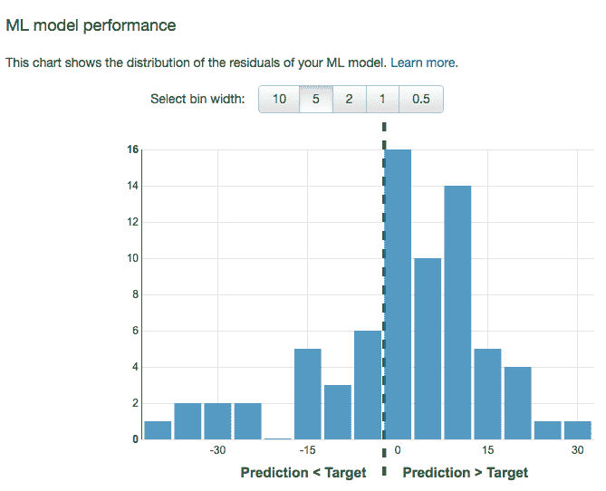

我们可以看到，我们的预测通常比目标值要大，这表明我们的模型可能还需要改进。数据中存在一些模型尚未利用的信息。

注意，可能无法使用线性回归模型提取这些模式中的信息。其他更复杂的模型可能更适合这个特定的数据集。将数据转换为创建新变量也可能是构建更好模型的关键。残差直方图是我们模型质量的良好简单诊断工具，因为它表明模型在某些方面可以改进。

# 进行批量预测

现在我们有一个经过适当训练并在其他模型中选出的模型。我们可以用它来对新数据进行预测。

记住，在本章的开头，在“在 S3 上加载数据”部分，我们上传了两个数据集到 S3，即训练数据集和保留数据集。我们已经使用训练数据集创建了最佳模型。现在我们将将该模型应用于保留数据集。

批量预测包括将模型应用于数据源以对该数据源进行预测。我们需要告诉亚马逊机器学习我们想在哪些数据上应用哪个模型。

批量预测与流式预测不同。在批量预测中，所有数据已经作为数据源提供，而对于流式预测，数据将随着其可用性被输入到模型中。数据集在事先并不完整可用。

在主菜单中选择批量预测以访问仪表板预测，然后点击创建新的预测：

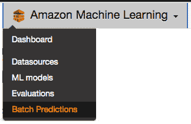

第一步是选择模型仪表板中可用的一个模型。你应该选择具有最低均方根误差（RMSE）的那个：

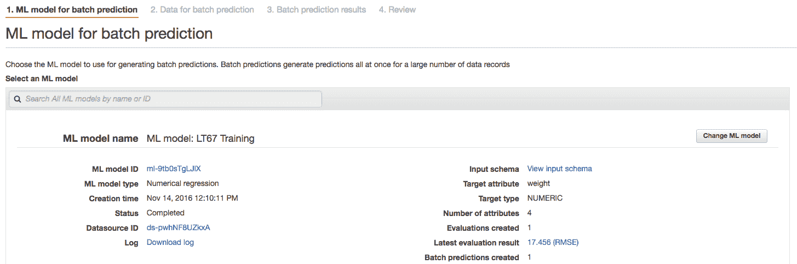

下一步是将数据源与您刚刚选择的模型关联起来。在本章的开头（在“在 S3 上加载数据”部分），我们已经将保留数据集上传到 S3，但尚未用它来创建数据源。我们现在将这样做。

当在下一屏幕上被要求选择数据源时，请确保勾选“我的数据在 S3 中，我需要创建数据源”，然后选择应该已经存在于您的 S3 存储桶中的保留数据集：

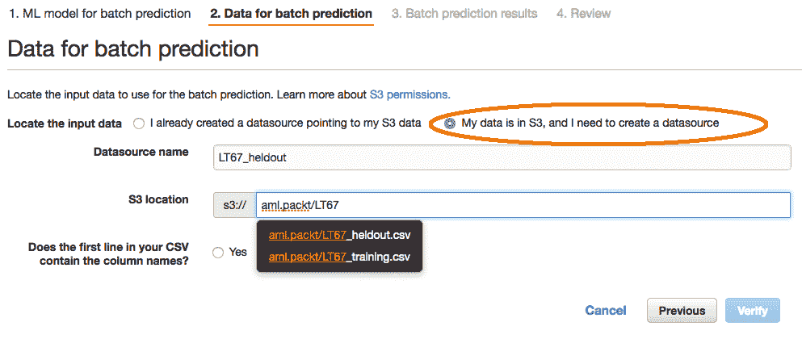

不要忘记告诉亚马逊机器学习，文件的第一行包含列。

在我们当前的项目中，我们的保留数据集还包含学生体重的真实值。在现实世界的项目中，这不会是“真实”数据的情况，因为在现实世界的项目中，真实值是真正未知的。然而，在我们的情况下，这将允许我们计算预测的均方根误差（RMSE）分数并评估这些预测的质量。

最后一步是点击验证按钮，等待几分钟：

+   亚马逊机器学习将在新的数据源上运行模型，并将预测结果以 CSV 文件的形式生成。

+   与评估和模型构建阶段相反，我们现在有了真实的预测。也不再给出与这些预测相关的分数。

+   几分钟后，您会在您的 S3 存储桶中注意到一个新的批量预测文件夹。此文件夹包含一个`manifest`文件和一个结果文件夹。manifest 文件是一个 JSON 文件，包含初始数据源的路径和结果文件的路径。结果文件夹包含一个 gzip 压缩的 CSV 文件：


未压缩的 CSV 文件包含两列，`trueLabel`，来自保留集的初始目标，以及`score`，对应预测值。我们可以通过以下步骤直接在电子表格中轻松计算这些结果的 RMSE：

1.  创建一个新列，该列包含两个列之间差异的平方。

1.  求和所有行。

1.  对结果取平方根。

下图展示了我们如何创建第三个列`C`，作为`trueLabel`列 A 和分数（或预测值）列 B 之间的平方差：

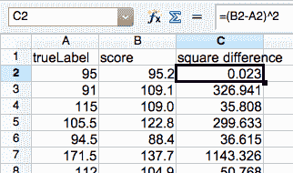

如下截图所示，计算列`C`的平均值并取平方根得到 RMSE 为 11.96，这甚至比我们在评估阶段获得的 RMSE（*RMSE 14.4*）要好得多：

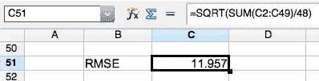

保留集上的 RMSE 比验证集上的 RMSE 好，这意味着我们的模型没有过度拟合训练数据，因为它在新数据上的表现甚至比预期更好。我们的模型是健壮的。

下图的左侧显示了保留集中所有样本的 True（*三角形*）和 Predicted（*圆形*）`Weight`值。右侧显示了残差的直方图。与我们在验证集上观察到的残差直方图类似，我们观察到残差没有集中在*0*上。我们的模型有高估学生权重的倾向：

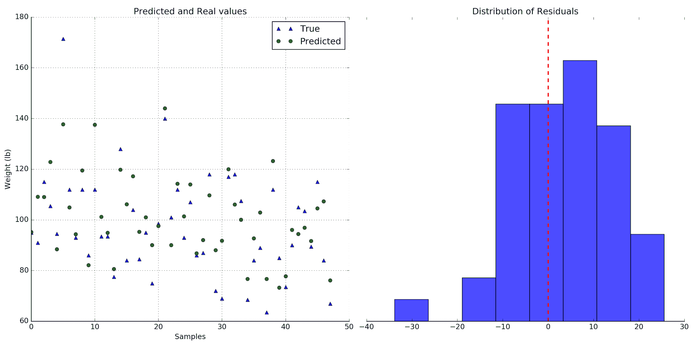

# 摘要

在本章的第一部分，我们介绍了亚马逊账户的创建以及如何正确设置和确保对您的 AWS 账户的访问安全。通过结合多因素认证和用户创建，我们能够迅速达到令人满意的水平的安全性。AWS 是一个功能强大的平台，拥有强大的工具，实施最佳访问保护至关重要。

在第二部分，我们介绍了简单线性回归预测中涉及的不同步骤，从将数据加载到 S3，通过数据源使数据可访问给亚马逊机器学习，创建模型，解释评估，以及在新的数据上做出预测。

亚马逊机器学习流程顺畅，促进了固有的数据科学循环：数据、模型、评估和预测。

在接下来的章节中，我们将进一步探讨数据准备和数据转换。这次我们将使用一个经典的二分类问题，即*泰坦尼克号上的生存*，它基于一个非常有趣的 数据集。
