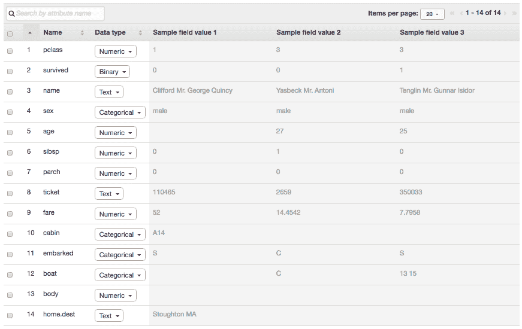

# 加载数据集并准备数据

数据准备涉及数据清洗和特征工程。这是机器学习项目中耗时最长的一部分。Amazon ML 提供了强大的功能来转换和切片数据。在本章中，我们将创建 Amazon ML 用于训练和选择模型的所需数据源。创建数据源涉及三个步骤：

1.  在 AWS S3 上使数据集可用。

1.  使用*模式*向 Amazon ML 告知数据的性质。

1.  使用特征工程的配方转换初始数据集。

在第二部分，我们将扩展 Amazon ML 数据修改功能，以便通过使用 Amazon SQL 服务 Athena 来执行强大的特征工程和数据清洗。Athena 是一个无服务器的基于 SQL 的查询服务，非常适合预测分析环境中的数据处理。

# 处理数据集

没有数据集，你无法进行预测分析。尽管我们被数据包围，但找到适合预测分析的数据集并不总是那么简单。在本节中，我们介绍了一些免费可用的资源。然后，我们将重点介绍我们将用于几章的特定数据集。`Titanic`数据集是预测分析的入门级经典数据集。

# 寻找开放数据集

在线有大量的数据集存储库，从地方到全球的公共机构，从非营利组织到数据驱动的初创公司。以下是一些适合预测分析的开放数据集资源的小列表，这绝对不是详尽的列表：

这个 Quora 帖子指向了许多其他有趣的数据源：[`www.quora.com/Where-can-I-find-large-datasets-open-to-the-public`](https://www.quora.com/Where-can-I-find-large-datasets-open-to-the-public)。你还可以在 Reddit 上请求特定的数据集，[`www.reddit.com/r/datasets/`](https://www.reddit.com/r/datasets/)。

+   **UCI 机器学习存储库** 自 1987 年以来由*加州大学欧文分校*维护的数据集集合，包含超过 300 个与分类、聚类、回归和其他机器学习任务相关的数据集，[`archive.ics.uci.edu/ml/`](https://archive.ics.uci.edu/ml/)

+   **斯坦福大型网络数据集集合** [`snap.stanford.edu/data/index.html`](https://snap.stanford.edu/data/index.html) 以及其他主要大学也提供了大量的开放数据集

+   **Kdnuggets** 在 [`www.kdnuggets.com/datasets`](http://www.kdnuggets.com/datasets) 提供了大量的开放数据集

+   [Data.gov](http://Data.gov) 和其他美国政府机构；[data.UN.org](http://data.UN.org) 和其他联合国机构

+   来自世界各地的**开放数据网站**：加拿大：[`open.canada.ca/`](http://open.canada.ca/)，法国：[`www.data.gouv.fr/fr/`](http://www.data.gouv.fr/fr/)，日本：[`www.data.go.jp/`](http://www.data.go.jp/)，印度：[`data.gov.in/`](https://data.gov.in/)

+   AWS 通过合作伙伴在[`aws.amazon.com/government-education/open-data/`](https://aws.amazon.com/government-education/open-data/)提供开放数据集

以下初创公司以数据为中心，并提供对丰富数据仓库的开放访问：

+   **Quandl**和**Quantopian**提供金融数据集

+   [Datahub.io](https://datahub.io/)、[Enigma.com](https://www.enigma.com/)和[Data.world](https://data.world/)是数据共享网站

+   [Datamarket.com](https://datamarket.com/)非常适合时间序列数据集

+   数据科学竞赛网站[Kaggle.com](https://www.kaggle.com/)托管了超过 100 个非常有趣的数据集

**AWS 公共数据集**：AWS 托管了各种公共数据集，如百万歌曲数据集、人类基因组映射、美国人口普查数据以及天文学、生物学、数学、经济学等多个领域的许多其他数据集。这些数据集大多可以通过 EBS 快照访问，尽管一些数据集可以直接在 S3 上访问。这些数据集很大，从几个吉字节到几个太字节不等，它们不是用于在本地机器上下载的，而是仅通过 EC2 实例访问（有关更多详细信息，请参阅[`docs.aws.amazon.com/AWSEC2/latest/UserGuide/using-public-data-sets.html`](http://docs.aws.amazon.com/AWSEC2/latest/UserGuide/using-public-data-sets.html)）。AWS 公共数据集可通过[`aws.amazon.com/public-datasets/`](https://aws.amazon.com/public-datasets/)访问。

# 介绍泰坦尼克号数据集

在本章以及第五章“模型创建”和第六章“预测和性能”中，我们将使用经典的`Titanic`数据集。数据包括 1309 名泰坦尼克号乘客的人口统计和旅行信息，目标是预测这些乘客的生存情况。完整的泰坦尼克号数据集可以从范德比尔特大学医学院生物统计学系(*Department of Biostatistics*)([`biostat.mc.vanderbilt.edu/wiki/pub/Main/DataSets/titanic3.csv`](http://biostat.mc.vanderbilt.edu/wiki/pub/Main/DataSets/titanic3.csv))以多种格式获取。*Encyclopedia Titanica*网站([`www.encyclopedia-titanica.org/`](https://www.encyclopedia-titanica.org/))是关于泰坦尼克号的参考网站。它包含了关于泰坦尼克号的所有事实、历史和数据，包括乘客和船员的完整名单。泰坦尼克号数据集也是 Kaggle 上入门竞赛的主题([`www.kaggle.com/c/titanic`](https://www.kaggle.com/c/titanic)，需要通过 Kaggle 开户)。您也可以在本书的 GitHub 仓库[`github.com/alexperrier/packt-aml/blob/master/ch4`](https://github.com/alexperrier/packt-aml/blob/master/ch4)中找到 CSV 版本。

泰坦尼克号数据包含文本、布尔、连续和分类变量的混合。它表现出有趣的特征，如缺失值、异常值和适合文本挖掘的文本变量，这是一个丰富的数据集，将使我们能够展示数据转换。以下是 14 个属性的简要总结：

+   `pclass`: 乘客等级（1 = 一等；2 = 二等；3 = 三等）

+   `survival`: 一个布尔值，表示乘客是否幸存（0 = 否；1 = 是）；这是我们目标

+   `name`: 一个信息丰富的字段，因为它包含头衔和姓氏

+   `sex`: 男性/女性

+   `age`: 年龄，其中很大一部分值是缺失的

+   `sibsp`: 船上兄弟姐妹/配偶的数量

+   `parch`: 船上父母/孩子的数量

+   `ticket`: 票号。

+   `fare`: 乘客票价（英镑）。

+   `cabin`: 舱位。舱位的位置是否会影响生存的机会？

+   `embarked`: 上船港口（C = Cherbourg；Q = Queenstown；S = Southampton）

+   `boat`: 救生艇，许多值缺失

+   `body`: 身体识别号码

+   `home.dest`: 家/目的地

查看更多关于这些变量的详细信息，请参阅[`campus.lakeforest.edu/frank/FILES/MLFfiles/Bio150/Titanic/TitanicMETA.pdf`](http://campus.lakeforest.edu/frank/FILES/MLFfiles/Bio150/Titanic/TitanicMETA.pdf)。

我们有 1309 条记录和 14 个属性，其中三个我们将丢弃。`home.dest`属性现有的值太少，`boat`属性仅适用于幸存乘客，而`body`属性仅适用于未幸存的乘客。我们将在使用数据模式时稍后丢弃这三个列。

# 准备数据

现在我们有了初始的原始数据集，我们将对其进行洗牌，分割成训练集和保留子集，并将其加载到 S3 存储桶中。

# 分割数据

如我们在第二章，“机器学习定义和概念”中看到的，为了构建和选择最佳模型，我们需要将数据集分成三部分：训练集、验证集和测试集，通常的比例是 60%、20%和 20%。训练集和验证集用于构建多个模型并选择最佳模型，而保留集用于对先前未见数据进行的最终性能评估。我们将在第六章，“预测和性能”中使用保留子集来模拟使用我们在第五章，“模型创建”中构建的模型进行的批量预测。

由于 Amazon ML 负责将用于模型训练和模型评估的数据集分割成训练集和验证集，我们只需要将我们的初始数据集分成两部分：用于模型构建和选择的全球训练/评估子集（80%），以及用于预测和最终模型性能评估的保留子集（20%）。

**在分割前打乱顺序**：如果您从范德堡大学网站下载原始数据，您会注意到它按`pclass`（乘客等级）和`name`列的字母顺序排序。前 323 行对应头等舱乘客，其次是二等舱（277）和三等舱（709）乘客。在分割数据之前打乱数据非常重要，以确保所有不同的变量在每个训练和保留子集中都有相似的分布。您可以直接在电子表格中通过创建一个新列，为每一行生成一个随机数，然后按该列排序来打乱数据。

您可以在[`github.com/alexperrier/packt-aml/blob/master/ch4/titanic.csv`](https://github.com/alexperrier/packt-aml/blob/master/ch4/titanic.csv)找到本书的已打乱顺序的`titanic.csv`文件。除了打乱数据外，我们还从“姓名”列中移除了标点符号：逗号、引号和括号，这些在解析 CSV 文件时可能会引起混淆。

我们最终得到两个文件：包含 1047 行的`titanic_train.csv`和包含 263 行的`titanic_heldout.csv`。下一步是将这些文件上传到 S3，以便 Amazon ML 可以访问它们。

# 在 S3 上加载数据

AWS S3 是 AWS 主要服务之一，专注于托管文件和管理其访问权限。S3 中的文件可以是公开的，对互联网开放，或者仅限于特定用户、角色或服务访问。S3 还被 AWS 广泛用于存储日志文件或结果（预测、脚本、查询等）的操作。

S3 中的文件是围绕“桶”的概念组织的。桶是具有类似域名名称的唯一占位符。S3 中的一个文件将有一个唯一的定位 URI：`s3://bucket_name/{文件夹路径}/filename`。桶名在 S3 中是唯一的。在本节中，我们将为我们的数据创建一个桶，上传 titanic 训练文件，并打开其访问权限以供 Amazon ML 使用。

我们将在*[第七章](https://cdp.packtpub.com/effective_amazon_machine_learning/wp-admin/post.php?post=609)，命令行和 SDK*中展示，S3 中的文件可以通过命令行完全管理。现在，我们将使用 S3 在线界面。前往[`console.aws.amazon.com/s3/home`](https://console.aws.amazon.com/s3/home)，如果您还没有账户，请创建一个 S3 账户。

**S3 定价：** S3 根据您托管文件的总容量以及文件传输量（取决于文件托管区域）进行收费。在撰写本文时，对于小于 1TB 的容量，AWS S3 在美国东部地区的月费为每 GB $0.03。所有 S3 价格信息可在[`aws.amazon.com/s3/pricing/`](https://aws.amazon.com/s3/pricing/)找到，同时也可在[`calculator.s3.amazonaws.com/index.html`](http://calculator.s3.amazonaws.com/index.html)的 AWS 成本计算器中查看。

# 创建桶

一旦您创建了 S3 账户，下一步就是为您的文件创建一个桶。点击“创建桶”按钮：


1.  **名称和区域**：由于 S3 中的存储桶名称是唯一的，您必须选择一个尚未被占用的存储桶名称。我们为我们的存储桶选择了名称`aml.packt`，并且我们将在整个书中使用此存储桶。至于区域，您应该始终选择一个与访问文件的人或应用程序最接近的区域，以减少延迟和价格。

1.  **设置版本控制、日志记录和标签**：版本控制将保留每个文件版本的副本，这可以防止意外删除。由于版本控制和日志记录会引发额外的成本，我们选择禁用它们。

1.  **设置权限**。

1.  **审查并保存**。

下面的截图说明了这些步骤：


# 加载数据

要上传数据，只需单击上传按钮并选择我们之前创建的`titanic_train.csv`文件。此时，您应该已经将训练数据集上传到您的 AWS S3 存储桶。我们在`aml.packt`存储桶中添加了一个`/data`文件夹来隔离我们的对象。当存储桶也包含由 Amazon ML 创建的文件夹时，这将会很有用。

在此阶段，只有存储桶的所有者（即您）能够访问和修改其内容。我们需要授予 Amazon ML 服务读取数据和向存储桶添加其他文件的权限。在创建 Amazon ML 数据源时，我们将被提示通过 Amazon ML 控制台授予这些权限。我们还可以提前修改存储桶的策略。

# 授予权限

我们需要编辑`aml.packt`存储桶的策略。为此，我们必须执行以下步骤：

1.  单击您的存储桶。

1.  选择“权限”选项卡。

1.  在下拉菜单中，选择如图所示的“存储桶策略”。这将打开一个编辑器：


1.  将以下 JSON 文件粘贴进去。确保将`{YOUR_BUCKET_NAME}`替换为您的存储桶名称并保存：

```py
        {
          "Version": "2012-10-17",
          "Statement": [
            {
              "Sid": "AmazonML_s3:ListBucket",
              "Effect": "Allow",
              "Principal": {
                "Service": "machinelearning.amazonaws.com"
              },
              "Action": "s3:ListBucket",
              "Resource": "arn:aws:s3:::{YOUR_BUCKET_NAME}",
              "Condition": {
                "StringLike": {
                  "s3:prefix": "*"
                }
              }
            },
            {
              "Sid": "AmazonML_s3:GetObject",
              "Effect": "Allow",
              "Principal": {
                "Service": "machinelearning.amazonaws.com"
              },
              "Action": "s3:GetObject",
              "Resource": "arn:aws:s3:::{YOUR_BUCKET_NAME}/*"
            },
            {
              "Sid": "AmazonML_s3:PutObject",
              "Effect": "Allow",
              "Principal": {
                "Service": "machinelearning.amazonaws.com"
              },
              "Action": "s3:PutObject",
              "Resource": "arn:aws:s3:::{YOUR_BUCKET_NAME}/*"
            }
          ]
        }

```

关于此政策的更多详细信息可在[`docs.aws.amazon.com/machine-learning/latest/dg/granting-amazon-ml-permissions-to-read-your-data-from-amazon-s3.html`](http://docs.aws.amazon.com/machine-learning/latest/dg/granting-amazon-ml-permissions-to-read-your-data-from-amazon-s3.html)找到。再次强调，此步骤是可选的，因为当您创建数据源时，Amazon ML 会提示您访问存储桶。

# 格式化数据

Amazon ML 在逗号分隔值文件（`.csv`）上工作，这是一种非常简单的格式，其中每一行是一个观察值，每一列是一个变量或属性。然而，还有一些条件需要满足：

+   数据必须使用字符集（如 ASCII、Unicode 或 EBCDIC）以纯文本格式编码

+   所有值必须用逗号分隔；如果值中包含逗号，则应将其用双引号括起来

+   每个观察值（行）的大小必须小于 100k

关于分隔行的换行符也存在一些条件。在使用 Excel 在 *OS X (Mac)* 上时必须特别注意，如本页所述：[`docs.aws.amazon.com/machine-learning/latest/dg/understanding-the-data-format-for-amazon-ml.html`](http://docs.aws.amazon.com/machine-learning/latest/dg/understanding-the-data-format-for-amazon-ml.html)。

**关于其他数据文件格式呢？**

很遗憾，Amazon ML 数据源仅兼容 CSV 文件和 Redshift 或 RDS 数据库，并且不接受 JSON、TSV 或 XML 等格式。然而，其他服务如无服务器数据库服务 Athena，则接受更广泛的格式。我们将在本章后面看到如何使用 Athena 来绕过 Amazon ML 文件格式限制。

现在数据已位于 S3 上，下一步是通过创建数据源来告诉 Amazon ML 其位置。

# 创建数据源

当使用 Amazon ML 时，数据始终位于 S3 中，并且不会在 Amazon ML 中重复。数据源是元数据，指示输入数据的位置，允许 Amazon ML 访问它。创建数据源还会生成与数据相关的描述性统计信息和包含变量性质信息的模式。基本上，数据源为 Amazon ML 提供了所有必要的信息，以便能够训练模型。以下是你需要遵循的创建数据源的步骤：

1.  前往 Amazon 机器学习：[`console.aws.amazon.com/machinelearning/home`](https://console.aws.amazon.com/machinelearning/home)。

1.  点击“入门”，你将可以选择访问仪表板或标准设置。这次请选择标准设置：


执行以下步骤，如以下截图所示：

1.  选择 S3 位置。

1.  在 s3 位置字段中开始输入存储桶的名称，列表文件夹和文件应该会显示出来。

1.  选择 `titanic_train.csv` 文件。

1.  将数据源命名为“Titanic 训练集”，然后点击“验证”。


如果你之前没有设置存储桶策略，系统会要求你授予 Amazon ML 读取 S3 中文件的权限；点击“是”以确认：


你将看到确认信息，表明你的数据源已成功创建并可由 Amazon ML 访问：


点击“继续”以完成数据源创建。此时，Amazon ML 已扫描 `titanic_train.csv` 文件并推断出每列的数据类型。这些元信息被重新组合在模式中。

**其他数据源**：亚马逊机器学习允许您将 Redshift 或 RDS 数据库定义为数据源，而不是 S3。Amazon Redshift 是一个“*快速、完全托管、PB 级数据仓库解决方案*”。它比 S3 设置起来要复杂得多，但它可以处理更大和更复杂的数据量。Redshift 允许您使用行业标准 ODBC/JDBC 连接通过任何 SQL 客户端分析数据。我们将在*第八章，从 Redshift 创建数据源*中回到 Redshift。

# 验证数据模式

数据模式是元信息，是数据文件的字典。它通知亚马逊机器学习数据集中每个变量的类型。亚马逊机器学习将使用这些信息来正确读取、解释、分析和转换数据。一旦创建，数据模式可以保存并用于同一数据的其他子集。尽管亚马逊机器学习在猜测数据集的性质方面做得很好，但始终进行双重检查并在必要时进行一些必要的调整是一个好主意。

默认情况下，亚马逊机器学习假定您的文件的第一行包含一个观测值。在我们的例子中，`titanic_train.csv`文件的第一行包含变量的名称。请确保通过在该表单中选择是来确认这一点：


亚马逊机器学习根据四种数据类型对您的数据进行分类：

+   **二进制**：0 或 1，是或否，男性或女性，假或真（例如`titanic`数据集中的`survived`）

+   **分类**：可以取有限个数值的变量，可以是数字或字符（例如`pclass`或`embarked`、`sibsp`、`parch`）

+   **数值**：具有连续值的数量（例如`age`或`fare`）

+   **文本**：自由文本（例如`name`、`ticket`、`home.dest`）

注意，`Titanic`数据集中的一些变量可能与不同的数据类型相关联。例如，`ticket`、`cabin`或`home.dest`可以解释为文本或分类值。`age`属性可以通过分箱从数值值转换为分类值。`sex`属性也可以解释为二进制、分类或甚至是文本类型。将`sex`属性作为二进制将需要将其值从男性/女性转换为 0/1，因此尽管它只取两个值，我们仍将其保留为分类。

模型构建算法将根据变量的数据类型以不同的方式处理变量及其值。在某些情况下，探索某些变量的不同数据类型可能值得，以便提高预测的准确性。

以下截图显示了亚马逊机器学习从我们的`titanic_train.csv`数据中推断出的模式：



注意，这里显示的采样值将因您的数据模式而不同，因为数据已经被随机化。

您可以选择保留亚马逊机器学习默认选择的选项，或者进行一些修改。以下是一个例子：

+   `sibsp`和`parch`，分别是兄弟姐妹和父母的人数，如果我们想要重新组合具有相似家庭成员数量的乘客，它们可以是分类的而不是数值的。

+   `pclass`应该更正为分类而不是数值，因为`pcalss`只有三个可能的值：1、2 和 3。

+   `cabin`可以解释为分类的，因为船舱的数量是有限的。然而，数据表明该字段可以进一步解析。它有如 C22 C26 之类的值，这似乎表明不是一个船舱，而是两个。文本数据类型将更合适。

Amazon ML 需要知道我们旨在预测的属性。在下一屏，你将被要求选择目标。确认你是否计划使用此数据集来创建或评估一个机器学习模型，并选择`survived`属性，如下面的截图所示：


**决定数值和分类之间的选择**：数值是有序的，分类值不是。当将变量设置为数值时，你实际上是在告诉模型这些值是有序的。当构建模型时，这种信息对算法是有用的。分类变量之间不暗示任何顺序。

回到`sibsp`和`parch`属性的例子，这些变量具有有限数量的值（`sibsp`为 0 到 8，`parch`为 0 到 9）并且可能是分类的。然而，值的顺序包含一些重要的信息。八个兄弟姐妹多于一个，表明这是一个大家庭。因此，保留数值作为值也是有意义的。

**分类值和独热编码**：在线性回归的情况下，分类值会被独热编码。当有*N*个类别时，它们会被分解成*N-1*个二进制变量。例如，一个只有三个值*A*、*B*和*C*的变量会被分解成两个二进制变量*is_it_A?*和*is_it_B?*，它们只接受真和假值。请注意，没有必要定义第三个*is_it_C?*二进制变量，因为它可以直接从*is_it_A?*和*is_it_B?*的值中推断出来。在泰坦尼克号的案例中，我们有一个名为`embarked`的变量的三个值；Amazon ML 将创建两个二进制变量，相当于*在皇后镇登船的乘客*和*在瑟堡登船的乘客*，第三个变量*在南安普顿登船的乘客*将从前两个变量的值中推断出来。

目标类型决定了 Amazon ML 将使用的模型类型。由于我们选择了二元目标，Amazon ML 将使用逻辑回归来训练模型。数值目标将意味着线性回归，而分类目标也将是逻辑回归，但这次是多类分类。Amazon ML 会确认它将使用的模型类型，如下面的截图所示：


最后一步是告诉亚马逊机器学习我们的数据不包含行标识符，并最终审查我们的数据源。数据源创建现在处于待定状态；根据其大小，完成可能需要几分钟。

# 重新使用模式

模式是一个 JSON 文件，这意味着我们可以从头开始为我们自己的数据创建一个，或者修改亚马逊机器学习生成的模式。我们现在将修改亚马逊机器学习创建的模式，将其保存到 S3，并使用它创建一个新的数据源，该数据源不包含`body`、`boat`和`home.dest`变量。

点击查看输入模式，如图所示：


这为我们提供了原始的 JSON 格式模式。将其保存在本地机器上，文件名为`titanic_train.csv.schema`。我们将在 S3 的同一存储桶/文件夹中加载此文件，该文件夹包含`titanic_train.csv`文件。通过在数据 CSV 文件名中添加`.schema`，我们允许亚马逊机器学习自动将模式文件与数据文件关联，并绕过其自身模式的创建。

使用您最喜欢的编辑器打开模式文件，并按如下方式编辑：

+   在`excludedAttributeNames`字段中添加`home.dest`、`body`、`boat`

+   将`sibsp`和`parch`的数据类型从`CATEGORICAL`更改为`NUMERIC`

注意，尽管我们想要删除字段`boat`、`body`和`home.dest`，我们仍然需要在模式中声明它们及其数据类型。您的 JSON 文件现在应如下所示：

```py
{
  "version" : "1.0",
  "rowId" : null,
  "rowWeight" : null,
  "targetAttributeName" : "survived",
  "dataFormat" : "CSV",
  "dataFileContainsHeader" : true,
  "attributes" : [ {
    "attributeName" : "pclass",
    "attributeType" : "CATEGORICAL"
    }, {
     "attributeName" : "survived",
     "attributeType" : "BINARY"
    }, {
     "attributeName" : "name",
     "attributeType" : "TEXT"
    }, {
     "attributeName" : "sex",
     "attributeType" : "BINARY"
    }, {
     "attributeName" : "age",
     "attributeType" : "NUMERIC"
    }, {
     "attributeName" : "sibsp",
     "attributeType" : "NUMERIC"
    }, {
     "attributeName" : "parch",
     "attributeType" : "NUMERIC"
    }, {
     "attributeName" : "ticket",
     "attributeType" : "TEXT"
    }, {
     "attributeName" : "fare",
     "attributeType" : "NUMERIC"
    }, {
     "attributeName" : "cabin",
     "attributeType" : "TEXT"
    }, {
     "attributeName" : "embarked",
     "attributeType" : "CATEGORICAL"
    }, {
     "attributeName" : "boat",
     "attributeType" : "CATEGORICAL"
    }, {
     "attributeName" : "body",
     "attributeType" : "NUMERIC"
    }, {
     "attributeName" : "home.dest",
     "attributeType" : "TEXT"
    } ],
     "excludedAttributeNames" : ["home.dest", "body", "boat"]
    }

```

将修改后的`titanic_train.csv.schema`文件上传到与`titanic_train.csv`数据文件相同的 S3 位置。您的存储桶/文件夹现在应如下所示：


现在我们创建一个新的数据源。由于模式文件和数据文件具有相同的名称，并且位于同一位置，亚马逊机器学习将使用我们提供的模式：

1.  返回亚马逊机器学习仪表板，并在主菜单中单击创建新的数据源。

1.  指定位置并命名数据源；我们给这个新的数据源命名为 Titanic train set 11 variables。

亚马逊机器学习确认您提供的模式已被考虑：


完成剩余的数据源创建步骤，并注意数据类型与您在模式文件中指定的数据类型相对应，并且三个字段不再存在。

**模式回顾**：要将模式关联到文件，只需将模式文件命名为与数据文件相同的名称，并添加`.schema`扩展名。例如，对于名为`my_data.csv`的数据文件，模式文件应命名为`my_data.csv.schema`，并上传到与数据文件相同的 S3 位置。

我们的数据源现在已经创建完成，我们可以探索亚马逊机器学习为我们提供的数据洞察。

# 检查数据统计

当亚马逊机器学习创建数据源时，它对不同的变量进行了基本的统计分析。对于每个变量，它估计以下信息：

+   每个属性与目标的相关性

+   缺失值的数量

+   无效值的数量

+   带有直方图和箱线图的数值变量分布

+   数值变量的范围、平均值和中位数

+   分类别变量最频繁和最不频繁的类别

+   文本变量的词频

+   二元变量的真实值百分比

前往数据源仪表板，然后点击您刚刚创建的新数据源，以便访问数据摘要页面。左侧菜单允许您访问针对目标和不同属性的数据统计信息，按数据类型分组。以下截图显示了数值属性的洞察。`年龄`和`票价`变量值得更仔细地查看：


两件事引人注目：

+   `年龄`有`20%`的缺失值。我们应该用`年龄`现有值的平均值或中位数来替换这些缺失值。

+   `票价`的平均值是 33.28，但范围是`0-512.32`，表明分布高度偏斜。查看`票价`分布可以证实这一点。点击预览。

以下截图显示了`票价`属性的直方图和相关箱线图。我们可以看到，大多数值都低于 155，而高于 195 的值非常少。这表明 521.32 这个值可能是一个异常值，是由人为错误造成的无效值。回顾原始数据集，我们看到有四名来自同一家庭、持有相同票号（*PC 17755*）的乘客为四个头等舱（*B51、B53、B55*和*B101*）支付了此价格。尽管 512.32 的票价远高于其他票价，但它看起来很合法，并不像某种错误。我们可能不应该丢弃或替换它。以下直方图显示了`票价`的分布：


文本属性已经由 Amazon ML 自动分词，并且每个单词都从原始属性中提取出来。标点符号也已删除。Amazon ML 随后计算了以下截图所示的`姓名`属性的词频：


# 使用 Athena 进行特征工程

到目前为止，我们有一组相当不错的变量，可以帮助预测乘客是否在泰坦尼克号灾难中幸存。然而，这些数据可能需要一些清理，以处理异常值和缺失值。我们还可以尝试从现有属性中提取其他有意义的特征，以提高我们的预测能力。换句话说，我们想要进行一些特征工程。特征工程是提高预测准确率的关键。

特征工程是使用数据领域知识创建特征的过程，这些特征可以使机器学习算法工作。

- 维基百科

机器学习提供了它所谓的“数据食谱”来转换数据并适应其线性回归和逻辑回归算法。在 Amazon ML 中，数据食谱是构建预测模型的一部分，而不是创建数据源。我们在第五章 Model Creation 中广泛研究了 Amazon ML 的数据食谱。Amazon ML 的数据食谱主要适用于将数据适应到算法中，并且对于纠正原始数据中的问题或从现有数据中创建新属性有一定的局限性。例如，使用 Amazon ML 的食谱无法去除异常值、从文本中提取关键词或替换缺失值。因此，我们将使用 SQL 查询来执行一些数据清洗和特征创建。

几个 AWS 服务基于 SQL 数据库：Redshift、RDS 以及最近新增的 **Athena**。SQL 不仅广泛用于查询数据，正如我们将看到的，它特别适合于数据转换和数据清洗。在网上可以找到许多关于如何从原始泰坦尼克数据集中提取信息的创意想法。例如，这些在线资源提供了关于泰坦尼克数据集特征工程主题的许多想法：

+   在紫外光博客上对泰坦尼克数据集进行的 Kaggle 竞赛分析，其中包含 Python 代码示例，链接为 [`www.ultravioletanalytics.com/2014/10/30/kaggle-titanic-competition-part-i-intro/`](http://www.ultravioletanalytics.com/2014/10/30/kaggle-titanic-competition-part-i-intro/)

+   在 Trevor Stephens 的博客上使用 R 进行类似分析，示例链接：[`trevorstephens.com/kaggle-titanic-tutorial/r-part-4-feature-engineering/`](http://trevorstephens.com/kaggle-titanic-tutorial/r-part-4-feature-engineering/)

+   泰坦尼克 Kaggle 竞赛论坛充满了创意：[`www.kaggle.com/c/titanic`](https://www.kaggle.com/c/titanic)

在我们的案例中，我们将关注以下转换：

+   用现有 `age` 值的平均值替换缺失的 `age` 值

+   而不是替换或丢弃票价异常值，我们将创建一个新的对数变量 (`fare`)，其分布更少偏斜

+   从 `name` 字段中提取标题

+   每个客舱号由三个字符组成，其中第一个字符是相对于甲板级别的字母（A、B、C、...、F）以及该甲板上的客舱号数量；我们将提取每个客舱的第一个字母作为新的 `deck` 变量

+   我们还将 `sibps` 和 `parch` 合并来创建 `family_size` 变量

在下一节中，我们将使用 Athena 来进行这些数据转换。我们首先在 Athena 中创建数据库和表，并用泰坦尼克数据填充它。然后，我们将使用标准 SQL 查询在新建的表上创建新特征。最后，我们将结果导出到 S3 中的 CSV 文件，并从中创建新的数据源。

# 介绍 Athena

Athena 于 2016 年 12 月的*AWS re:Invent*大会上推出。它通过提供一种简单的无服务器服务，直接与 S3 交互，补充了其他 AWS 基于 SQL 的服务。根据 AWS 的说法，Amazon Athena 是一个交互式查询服务，它使得使用标准 SQL 直接从 Amazon S3 分析数据变得容易。*Amazon Athena 的几个特性使其特别适合与 Amazon ML 进行数据准备：

+   Athena 可以直接从 S3 中不同格式的数据（CSV、JSON、TSV、亚马逊日志等）生成表格。由于 Amazon ML 中的数据源也是基于 S3 的，因此可以轻松地操作文件，执行各种数据转换，并即时创建各种数据集来测试您的模型。

+   Athena 速度快，简单，可以处理大量数据集。

+   Athena 使用`prestodb`，这是 Facebook 开发的一个分布式 SQL 查询引擎，它提供了一个非常丰富的 SQL 函数库，非常适合进行数据转换和特征工程。

Amazon ML 仅接受 CSV 文件从 S3 创建数据源。然而，由于 Athena 可以收集除 CSV 之外的其他文件格式的数据（JSON、TSV、ORC 等），并将查询结果导出为 CSV 文件，因此可以使用 Athena 作为转换工具，从而扩展 Amazon ML 的数据源能力。

Presto 是一个开源的分布式 SQL 查询引擎，针对低延迟、即席数据分析进行了优化。它支持 ANSI SQL 标准，包括复杂查询、聚合、连接和窗口函数。更多信息可以在[`prestodb.io/`](https://prestodb.io/)找到。

在本节中，我们将执行以下操作：

1.  创建一个 Athena 账户和一个数据库。

1.  直接从 S3 的 Titanic CSV 文件创建并填充一个表。

1.  对数据集进行查询并创建新的特征。

1.  将结果下载到 S3。

1.  使用 Amazon ML 的额外功能创建新的训练和测试数据源。

Athena 简单。让我们从简单的概述开始。

# AWS Athena 简要概述

在 Athena 中，数据不会存储在数据库中；它仍然保留在 S3 中。当您在 Athena 中创建一个表时，您实际上是在创建一个信息层，告诉 Athena 数据的位置、结构以及格式。Athena 中的模式是对象的逻辑命名空间。一旦 Athena 知道了数据结构和位置，您就可以通过标准 SQL 语句查询数据。

Athena 使用**Hive 数据定义语言（DDL）**来创建或删除数据库和表（有关 Hive DDL 的更多信息，请参阅[`cwiki.apache.org/confluence/display/Hive/LanguageManual+DDL`](https://cwiki.apache.org/confluence/display/Hive/LanguageManual+DDL)）。Athena 可以通过使用`序列化-反序列化（SerDes）`库理解多种格式（CSV、TSV、JSON 等）。Athena 可以通过控制台（[`console.aws.amazon.com/athena/`](https://console.aws.amazon.com/athena/））或通过 JDBC 连接（[http://docs.aws.amazon.com/athena/latest/ug/connect-with-jdbc.html](http://docs.aws.amazon.com/athena/latest/ug/connect-with-jdbc.html)）访问。我们将使用控制台。

**Athena**服务提供四个部分：


查询编辑器：

1.  允许您编写查询、保存它们，并查看结果，同时还可以在您的数据库和表之间导航。

1.  一个列出您保存的所有查询的已保存查询页面。

1.  一个列出您运行的所有查询的历史页面。

1.  一个允许您探索存储数据的目录管理器。

这些部分的使用说明很直观，我们将让您在空闲时探索它们。

在撰写本文时，Amazon Athena 没有**命令行界面（cli）**。然而，Athena 可以通过 S3 上可用的**Java 数据库连接（JDBC）驱动程序**访问。您可以在[`docs.aws.amazon.com/athena/latest/ug/connect-with-jdbc.html`](http://docs.aws.amazon.com/athena/latest/ug/connect-with-jdbc.html)找到更多信息。

一些需要知道的事情：

+   您可以通过指定 S3 中的数据位置或通过 SQL 查询明确创建一个表。

+   所有表都必须以`EXTERNAL`方式创建，并且无法使用**CREATE TABLE AS SELECT**。使用外部关键字创建的表删除不会删除底层数据：

```py
        CREATE EXTERNAL TABLE temp ();

```

+   Presto SQL 函数在 Athena 中可用。请参阅[`prestodb.io/docs/current/functions.html`](https://prestodb.io/docs/current/functions.html)以获取完整列表。

+   您一次只能提交一个查询，同时最多运行五个并发查询。

**Athena 定价：**Athena 根据查询扫描的数据量收费（在撰写本文时，每 TB 数据扫描费用为 5 美元，每个查询最低为 10 MB。您可以通过将数据转换为列式格式或对数据进行分区来降低成本。有关更多信息，请参阅[`aws.amazon.com/athena/pricing/`](https://aws.amazon.com/athena/pricing/)）。

# 创建一个巨大的数据库

我们将从零开始，回到可在[`github.com/alexperrier/packt-aml/blob/master/ch4/original_titanic.csv`](https://github.com/alexperrier/packt-aml/blob/master/ch4/original_titanic.csv)找到的原始泰坦尼克号数据集。按照以下步骤准备 CSV 文件：

1.  打开`original_titanic.csv`文件。

1.  删除标题行。

1.  删除以下标点符号字符：`,"()`。

文件应只包含数据，不包含列名。这是包含 1309 行的原始文件。这些行按`pclass`排序和按字母顺序命名。结果文件可在[`github.com/alexperrier/packt-aml/blob/master/ch4/titanic_for_athena.csv`](https://github.com/alexperrier/packt-aml/blob/master/ch4/titanic_for_athena.csv)找到。现在让我们在我们的 S3 桶中创建一个新的`athena_data`文件夹，并将`titanic_for_athena.csv`文件上传。现在转到 Athena 控制台。我们将创建一个`titanic_db`数据库和一个`titanic`表，并使用这些数据。

# 使用向导

在 Athena 中创建数据库和表有两种方式，通过向导或运行查询。可以通过在查询编辑器页面点击“*添加表*”链接来访问向导：


向导在四个步骤中允许我们创建数据库、表和加载数据。在*第 3 步*中创建列涉及手动输入每个列的名称并指定每个列的类型。由于数据集中有 14 个列，这种方法很耗时。因此，我们将不使用向导，直接在 SQL 中创建数据库和表：


# 直接在 SQL 中创建数据库和表

要创建数据库，请在查询编辑器中运行以下查询：

```py
CREATE DATABASE titanic_db;

```

然后如下所示，在左侧的数据库下拉菜单中选择`titanic_db`：


要创建表并加载数据，请运行以下 SQL 查询：

```py
CREATE EXTERNAL TABLE IF NOT EXISTS titanic_db.titanic (
  pclass tinyint,
  survived tinyint,
  name string,
  sex string,
  age double,
  sibsp tinyint,
  parch tinyint,
  ticket string,
  fare double,
  cabin string,
  embarked string,
  boat string,
  body string,
  home_dest string
 )
 ROW FORMAT SERDE 'org.apache.hadoop.hive.serde2.lazy.LazySimpleSerDe' WITH SERDEPROPERTIES (
  'serialization.format' = ',',
  'field.delim' = ','
  ) LOCATION 's3://aml.packt/athena_data/'

```

关于该查询的几点注意事项：

+   位置`s3://aml.packt/athena_data/`指向我们特别创建的文件夹，而不是指向文件本身。该文件夹中的所有文件都将被视为该表的数据。

+   `SERDE`对应于以逗号作为字段分隔符的 CSV 格式。支持的格式及其相应的 SERDE 列表可在[`docs.aws.amazon.com/athena/latest/ug/supported-formats.html`](https://docs.aws.amazon.com/athena/latest/ug/supported-formats.html)找到。

+   字段类型是标准的 SQL 类型（字符串、双精度浮点数、小整数等）。

一旦查询运行完成，`titanic`表名就会出现在页面左侧部分。您可以点击眼睛图标来选择表的前 10 行，如下所示：

**指定结果位置**：Athena 将查询结果存储在新的 S3 文件夹中。您可以通过访问设置页面并指定所需的 S3 路径来指定这些结果存储在哪个文件夹中。我们在`aml.packt`桶中创建了一个名为`*athena_query_results*`的新文件夹，并将结果位置设置为`*s3://aml.packt/athena_query_results/*`。

# SQL 中的数据处理

我们现在将定义一个 SQL 查询，该查询将纠正我们之前看到的缺失值和异常值问题，并创建一些新变量。

# 缺失值

`年龄`和`票价`变量有缺失值，分别的中位数为`28`和`14.5`。我们可以使用此语句用中位数替换所有缺失值：

```py
select coalesce(age, 28) as age, coalesce(fare, 14.5) as fare from titanic;

```

我们还希望保留至少对于`年龄`变量存在缺失值的信息。我们可以通过创建一个名为`is_age_missing`的新二进制变量来实现这一点：

```py
SELECT age, CASE 
 WHEN age is null THEN 0
 ELSE 1
 END as is_age_missing
from titanic;

```

# 处理票价中的异常值

我们已经看到，`票价`有四个乘客支付的价格远高于其他人。处理这些值有几种方法，其中之一可以通过定义一系列特定范围对变量进行分箱。例如，低于 20；从 20 到 50；50 到 100，...，以及超过 200。可以使用 Amazon ML 食谱进行分箱。我们还可以将票价值限制在特定阈值，例如 95%分位数。然而，我们决定这些高额票价是合法的，我们应该保留它们。我们可以通过取`票价`的对数来创建一个新的变量`log_fare`*，*，它具有更紧凑的范围和更少偏斜的分布：

```py
select fare, log(fare +1, 2) as log_fare from titanic;

```

`log_fare`变量范围为*0 - 9.0*，平均值为*4.3*，中位数为*3.95*，而原始`票价`变量范围为*[0, 512.3]*，平均值为*32.94*，中位数为*14.5*。`log_fare`的分布比原始`票价`变量的分布更接近高斯分布。

**Box-Cox 转换**：由于线性回归的假设，最好有高斯分布的变量。Box-Cox 转换，也称为幂转换（见[`en.wikipedia.org/wiki/Power_transform`](https://en.wikipedia.org/wiki/Power_transform)），是将变量重塑为正态分布的常用方法。Box-Cox 转换是对我们刚刚应用于`票价`变量的对数转换的推广。

# 从名称中提取标题

如果你仔细观察乘客姓名，你会注意到它们都遵循`{姓氏}{头衔}{名字}`格式。提取`头衔`作为一个新变量将很有趣。以下查询使用 split 函数，它返回一个数组。我们需要该数组的第二个元素：

```py
SELECT name, split(name, ' ')[2] as title from titanic;

```

# 从客舱推断舱位

舱位变量有三个字符值，其中第一个字符对应于甲板号（A，B，C，D，E）。这无疑是重要的信息，我们希望提取。我们可以使用以下查询来完成：

```py
SELECT cabin, substr(cabin, 1, 1) as deck  FROM titanic;

```

# 计算家庭规模

最后，假设乘客所属的整体家庭规模可能是生存的决定性因素是有意义的。我们可以聚合兄弟姐妹的数量和父母数量，并为乘客加 1。以下简单的查询将创建家庭规模变量：

```py
select sibps + parch + 1 as family_size from titanic; 

```

# 总结

我们可以在选择原始属性的同时合并所有这些查询。由于数据仍然按`pclass`和乘客`name`的字母顺序排序，我们还应该随机化结果。我们最终得到以下查询：

```py
SELECT pclass, 
survived, 
name, 
sex, 
COALESCE(age, 28) as age, 
sibsp, 
parch, 
ticket, 
COALESCE(fare, 14.5) as fare, 
cabin, 
embarked, 
boat, 
body, 
home_dest, 
CASE 
 WHEN age is null THEN 0
 ELSE 1
 END as is_age_missing, 
log(fare + 1, 2) as log_fare,
split(name, ' ')[2] as title,
substr(cabin, 1, 1) as deck,
sibsp + parch + 1 as family_size 
FROM titanic
ORDER BY RAND();

```

让我们运行这个查询。结果将在结果面板中显示，并也写入 S3 查询结果位置的 CSV 文件中。你也可以通过点击结果面板右上角的图标将其保存到你的本地机器上：


在这一点上，我们想要将数据分成训练集和测试集，就像我们之前做的那样，并创建一个新的 Amazon ML 数据源，具有扩展的架构。

# 创建改进的数据源

在我们将数据上传到 S3 并创建新的 Amazon ML 数据源之前，我们需要对新的`Titanic`数据集进行一些操作：

1.  在你最喜欢的编辑器中打开这个新的 Titanic 数据集。

1.  选择前*1047*行，并将它们保存到一个新的 CSV 文件中：`ext_titanic_training.csv`。

1.  选择下一*263*行和标题行，并将它们保存到文件`ext_titanic_heldout.csv`中。

我们需要更新我们的架构。打开架构文件`titanic_training.csv.schema`，并在 JSON 中添加以下行：

```py
{
  "attributeName" : "is_age_missing",
  "attributeType" : "BINARY"
  }, {
  "attributeName" : "log_fare",
  "attributeType" : "NUMERIC"
  }, {
  "attributeName" : "title",
  "attributeType" : "CATEGORICAL"
  }, {
  "attributeName" : "deck",
  "attributeType" : "CATEGORICAL"
  }, {
  "attributeName" : "family_size",
  "attributeType" : "NUMERIC"
 }

```

新的架构文件以及训练集和保留集可以在[`github.com/alexperrier/packt-aml/tree/master/ch4`](https://github.com/alexperrier/packt-aml/tree/master/ch4)找到。

我们接下来需要将训练集和架构文件上传到 S3。这些文件应该在同一个 S3 位置，`{bucket}/{folders}`。

现在我们已经准备好根据扩展的 Titanic 训练集创建新的数据源，按照之前完全相同的步骤进行：

1.  指定输入数据的位置。

1.  检查架构。

1.  将目标设置为`survived`。

1.  跳过`rowID`。

1.  检查并创建。

现在我们有 19 个属性在架构中，以及一个全新的数据源。

# 摘要

在本章中，我们专注于通常所说的数据科学流程中 Amazon ML 服务的**提取、加载、转换（ETL）**部分。我们了解到 Amazon ML 数据源是一组信息，包括位置、数据结构和数据分析，提供给服务以便它可以使用这些数据来开始训练模型。你现在应该能够从通过 S3 可访问的原始 CSV 数据文件中创建 Amazon ML 数据源感到舒适。

我们还探讨了通过使用简单的 SQL 查询通过 AWS Athena 服务转换数据和创建新特征的方法。利用 AWS 生态系统来补充 Amazon ML 的功能是使用 Amazon ML 的主要好处之一。

现在我们有几个 Titanic 数据集，原始的一个和扩展的一个，它们被分割成训练集和保留集，并且我们已经创建了相关的数据源。

在第五章“模型创建”中，我们将使用这些数据集来训练模型，并查看我们新的特征和数据清洗是否会导致更好的模型。
