# 模型创建

我们现在已经在 S3 上创建了几个基于原始“泰坦尼克号”数据集的数据源。我们准备训练和评估一个亚马逊机器学习预测模型。在亚马逊机器学习中，创建一个模型包括以下步骤：

+   选择训练数据源

+   定义数据转换的配方

+   设置学习算法的参数

+   评估模型的品质

在本章中，我们将首先探索亚马逊机器学习中可用的数据转换，并将比较“泰坦尼克号”数据集的不同配方。亚马逊机器学习默认根据数据的性质定义配方。我们将调查并挑战这些默认转换。

模型构建步骤足够简单，我们将花一些时间检查可用的参数。模型评估是所有事情汇聚的地方。评估指标取决于预测的类型，回归、二分类或多分类分类。我们将探讨这些不同的评估是如何进行的。我们还将下载模型训练日志，以便更好地理解在亚马逊机器学习中训练模型时幕后发生了什么。我们将通过比较几个数据配方和正则化策略的模型评估来结束本章。

本章组织如下：

+   配方

+   模型参数

+   评估

+   日志分析

+   特征工程、配方和正则化

在第四章“加载和准备数据集”的结尾，我们修改了模式，排除了原始数据集中的三个变量：“船”、“尸体”和`home.dest`，并基于此模式创建了一个新的数据源。我们将使用此数据源来训练模型。

前往您的亚马逊机器学习数据源仪表板；您应该看到三个数据源：

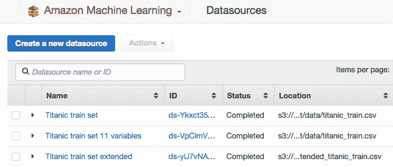

+   泰坦尼克号列车集：这是包含 14 个变量的原始原始数据集

+   泰坦尼克号列车集 11 个变量：有 11 个变量；“船”、“尸体”和`home.dest`已从模式中删除

+   泰坦尼克号列车集扩展版：这是我们通过基于 SQL 的特征工程获得的清洗和扩展后的数据集。

我们将使用“泰坦尼克号列车集 11 个变量”数据源。在开始模型创建之前，让我们首先回顾一下在亚马逊机器学习中可用的数据转换类型。

# 使用配方转换数据

数据科学工作流程的一个关键要素是特征工程。亚马逊机器学习通过其数据配方提供某些数据转换。请注意，尽管转换在概念上是预测分析工作流程的 ETL 或数据准备阶段的一部分，但在亚马逊机器学习中，数据配方是模型构建步骤的一部分，而不是初始数据源创建步骤的一部分。在本节中，我们首先回顾亚马逊机器学习中可用的数据转换，然后我们将使用“泰坦尼克号列车集 11 个变量”数据源将其中一些应用于“泰坦尼克号”数据集。

# 管理变量

食谱是包含以下三个部分的 JSON 结构化脚本：按照给定顺序：

+   组

+   分配

+   输出

一个空食谱指示亚马逊机器学习考虑所有数据集变量进行模型训练，如下所示：

```py
{
    "groups" : {},
    "assignments" : { },
    "outputs":["ALL_INPUTS"]
}

```

该食谱不会以任何方式转换数据。

完整的亚马逊机器学习食谱文档可在[`docs.aws.amazon.com/machine-learning/latest/dg/recipe-format-reference.html`](http://docs.aws.amazon.com/machine-learning/latest/dg/recipe-format-reference.html)找到。

# 变量分组

组允许将多个变量分组，以便于对多个变量应用相同的转换。食谱的组部分具有命名功能。组定义遵循以下语法：

```py
"group_name": "group('first_variable','second_variable' )"

```

亚马逊机器学习（Amazon ML）根据变量的类型定义了一组默认组：`ALL_TEXT`、`ALL_NUMERIC`、`ALL_CATEGORICAL`、`ALL_BINARY`，以及用于所有变量的`ALL_INPUTS`组。让我们看看几个例子。

考虑以下示例，我们想要对`age`和`fare`变量应用相同的转换（归一化）。我们可以定义一个组并命名为`TO_BE_NORMALIZED`：

```py
"groups" : {
    "TO_BE_NORMALIZED" : "group('age','fare')",
},

```

类似地，考虑一个电子邮件垃圾邮件检测的上下文，其中对于每封电子邮件，我们有一个标题、一个主题和一个正文。我们想要创建电子邮件标题和正文的 N-gram，但不包括标题；我们可以定义一个由所有文本变量组成的组，但排除特定的变量。在这里，我们创建一个名为`N_GRAM_TEXT`的组，它结合了除了标题之外的所有文本变量：

```py
"groups" : {
    "N_GRAM_TEXT" : "group_remove(ALL_TEXT, 'header')",
},

```

# 使用分配命名变量

分配的主要目的是命名便利。您可以选择在分配部分或直接在输出部分命名转换后的变量或变量组。分配只是为了方便和可读性。

分配遵循以下语法：

```py
"assignment_name": "transformation('group_name' )"

```

例如，您可以按如下方式重命名并归一化数值变量：

```py
"assignments": {
    "normalized_numeric": "normalize(TO_BE_NORMALIZED)",
}

```

或者重命名并处理您的电子邮件的主题和正文：

```py
"assignments": {
    "bigrams": "ngram(N_GRAM_TEXT,2)",
}

```

您也可以留空分配部分，并将转换应用于输出部分的变量组。最后，这更多是一个关于风格和可读性的问题，而不是其他任何事情。

# 指定输出

输出部分是您明确列出所有用于模型训练的变量的地方。如果您已经定义了一个包含一些变量的组，但仍然希望原始变量被考虑在内，您需要明确列出它们。分配部分声明了一个由以下内容组成的列表：

+   组

+   分配

+   变量

+   变量转换

例如，如果您想要原始的电子邮件正文和主题，以及您在分配中定义的`bigrams`，您需要如下声明输出：

```py
"outputs": [
    "header",
    "subject",
    "body",
    "bigrams"
]

```

以下输出声明声明了所有文本变量，并添加了之前定义的大词组分配：

```py
"outputs": [
    "ALL_TEXT",
    "bigrams"
    ]

```

菜单格式参考页面提供了其他示例，展示了如何结合分组、分配和输出以创建菜单：[`docs.aws.amazon.com/machine-learning/latest/dg/recipe-format-reference.html`](http://docs.aws.amazon.com/machine-learning/latest/dg/recipe-format-reference.html)。现在我们将查看可用的转换。

# 通过七个转换进行数据处理

Amazon ML 提供了以下七个转换。以下是对文本变量的四个转换：

+   小写转换

+   删除标点符号转换

+   N-gram 转换

+   **正交稀疏二元组（OSB**）转换

对于数值变量，以下有两种转换方式：

+   正态化转换

+   分位数装箱转换

以及一种用于将文本与分类变量耦合的转换

+   卡尔丹产品转换

这些转换在 Amazon ML 文档中有很好的解释（[`docs.aws.amazon.com/machine-learning/latest/dg/data-transformations-reference.html`](http://docs.aws.amazon.com/machine-learning/latest/dg/data-transformations-reference.html)）。

# 使用简单的转换

小写转换将文本变量作为输入，并返回小写文本：`Amazon ML is great for Predictive Analytics`返回为`amazon ml is great for predictive analytics`。小写转换的语法是`lowercase(text_variable)`或`lowercase(group_of_text_variables)`。

删除标点符号转换也接受文本变量作为输入，并删除所有标点符号，但单词内的连字符除外（`seat-belts`将保持为`seat-belts`）。无法定义自己的标点符号集合。删除标点符号转换的语法是`no_punct(text_variable)`或`no_punct(group_of_text_variables)`。

正态化转换将数值变量标准化，使其均值为零，方差为 1。当数值变量的范围变化很大时，这种转换非常有用。这种转换对应于**z 分数**标准化，也称为标准化，而不是最小-最大标准化（参见第二章，*机器学习定义和概念*）。正态化转换的语法是`normalize(numeric_variable)`或`normalize(group_of_numeric_variables)`。

# 文本挖掘

N-gram 和**正交稀疏二元组（OSB**）转换是 Amazon ML 中可用的主要文本挖掘转换。

在文本挖掘中，经典的方法被称为**词袋模型**方法。这种方法简化为丢弃给定文本中单词的顺序，只考虑文档中单词的相对频率。尽管这种方法可能看起来过于简单，因为单词的顺序对于理解信息至关重要，但这种方法在所有类型的自然语言处理问题中都给出了令人满意的结果。词袋模型的关键部分是由从给定文本中提取单词的需求驱动的。然而，我们不仅可以将单个单词视为唯一的信息载体，还可以提取单词序列。这些序列被称为 N-gram。两个单词的序列称为 bigram，三个单词的序列称为 trigram，依此类推。单个单词也称为 unigram。N-gram 也称为 tokens，从文本中提取单词和 N-gram 的过程称为分词。

例如，考虑以下句子：“The brown fox jumps over the dog”

+   **单语元**是：{*The, brown, fox, jumps, over, the, dog*}

+   **二元组**是：{*The brown, brown fox, fox jumps, jumps over, over the, the dog*}

+   **三元组**是：{*The brown fox, brown fox jumps, fox jumps over, jumps over the, over the dog*}

没有规则或启发式方法可以让你知道在你的模型中是否需要 N-gram，或者 N-gram 的顺序对模型最有益。这取决于你处理文本的类型。只有实验才能告诉你。

Amazon ML 提供两种分词转换：N-gram 和 OSB。

**N-gram**转换：接受一个文本变量和一个整数（2 到 10 之间），并返回预期的 N-gram。请注意，在 Amazon ML 中，所有文本变量默认按 unigram 进行分词。在配方中不需要显式指定 unigram。`ngram(text_variable, n)`将为 *n=2* 产生 bigram，为 *n=3* 产生 trigram，依此类推。

**OSB**或正交稀疏二元组转换是 bigram 转换（N*-gram*，其中 *n=2*）的扩展。给定文本中的一个单词，通过将初始单词后隔 1、2、…、N 个单词的其他单词关联起来，组成单词对。*N* 是 OSB 窗口的大小。

例如，在句子“这是一个限时优惠”中，首先考虑单词“优惠”。对于四个单词的窗口，OSB（One-Skip Bigram）为：*time_offer*、*limited_<skip>_offer*、*a_<skip>_<skip>_offer*、*is_<skip>_<skip>_<skip>_offer*、*this_<skip>_<skip>_<skip>_<skip>_offer*。我们通过每次跳过 1、2、...、N 个单词来构建单词对。

OSB 转换使我们能够提取关于每个单词周围上下文的信息。例如，OSB *is_<skip>_<skip>_offer* 可以用来检测如 *is a special offer* 以及 *is our best offer* 这样的字符串。研究发现，OSB 提取通常可以提高垃圾邮件过滤算法的性能。OSB 转换的语法是 `osb(text_variable, N)`，其中 `N` 是窗口大小，范围从 2 到 10。

值得注意的是，一些非常标准的文本转换在 Amazon ML 食谱中缺失。词干提取和**词形还原**用于将不同结尾的单词重新组合到共同的基本形式（例如，*walking*，*walker*和*walked*都会被计算为*walk*）并且 Amazon ML 不提供这些功能。

同样，从文本中移除非常常见的单词，称为*停用词*，如冠词或介词（the, a, but, in, is, are 等）也是一种非常标准的文本挖掘转换，但在 Amazon ML 食谱中不是可选项。然而，Amazon ML 可能在后台执行类似的转换，但没有明确说明。然而，现有的文档中没有任何内容表明这是事实。

# 耦合变量

笛卡尔积转换将两个分类或文本变量合并为一个。例如，考虑一个包含书籍的数据集，对于每本书，它们的标题和类型。我们可以想象，一本书的标题与其类型之间可能存在某种相关性，创建一个新的`title_genre`变量可以揭示这种关系。

考虑以下四本书，它们的标题和类型。将标题中的单词与书的类型耦合，为标题中的单词添加了额外的信息。这是模型可以有效地使用的。这在下表中的`title_genre`列中得到了说明：

| **标题** | **类型** | **title_genre** |
| --- | --- | --- |
| *All the Birds in the Sky* | 科幻 | `{all_scifi, birds_scifi, sky_scifi}` |
| *Robots and Empire* | 科幻 | `{robots_scifi, empire_scifi}` |
| *The Real Cool Killers* | 犯罪 | `{real_crime, cool_crime, killers_crime}` |
| *Bullet in the Sky* | 犯罪 | `{bullet_crime, sky_crime}` |

如果它出现在犯罪小说的标题中，单词 sky 现在有不同的含义：`sky_crime`或出现在科幻小说的标题中：`sky_scifi`。

在`Titanic`数据集的情况下，我们可以通过取它们的笛卡尔积来耦合`sibsp`和`*parch*`变量（兄弟姐妹数量和父母数量）：`sibsp*parch`，从而得到一个新的变量，该变量可以区分有（无）父母和兄弟姐妹较少或没有的乘客与有（无）父母和兄弟姐妹较多的乘客。语法是`cartesian(var1, var2)`。

# 分箱数值

最后也是最重要的转换是分位数分箱。分位数分箱的目标是将数值变量转换为分类变量，以便更好地提取变量与预测目标之间的关系。这在变量与目标之间存在非线性关系时特别有用。通过将原始数值变量的值分成大小相等的*n*个箱，可以将每个值替换为相应的箱。由于箱的数量是有限的（从 2 到 1,000），变量现在是分类的。语法是`quantile_bin(var, N)`，其中`N`是箱的数量。

有两种无监督分箱类型，等频分箱和等宽分箱。在等频分箱中，每个分箱具有相同数量的样本，而在等宽分箱中，变量范围被分成 N 个宽度相等的更小范围。分位数分箱通常指的是等频分箱。

将连续数据分类并不总是好的方法，因为你按照定义，正在丢弃可能对模型有用的信息。此页面列出了与分箱相关的一些其他问题：[`biostat.mc.vanderbilt.edu/wiki/Main/CatContinuous`](http://biostat.mc.vanderbilt.edu/wiki/Main/CatContinuous)。然而，亚马逊机器学习似乎非常喜欢分位数分箱技术。事实上，在我们考虑的所有数据集中，亚马逊机器学习总是对所有数值变量应用分位数分箱，在建议的食谱中，通常使用大量，有时是非常大量的分箱。例如，`Titanic`数据集中`fare`变量的默认转换是使用 500 个分箱的分位数分箱，尽管变量的范围仅从 0 到 512。我们在本章的末尾比较了保留原始数值与在*保持变量为数值或应用分位数分箱？*部分应用分位数分箱所获得的评估结果。

# 创建模型

当你创建模型时，亚马逊机器学习会根据你的数据源建议一个食谱。你可以选择使用该食谱或对其进行修改。我们现在将创建我们的第一个模型，并在创建模型的过程中分析亚马逊机器学习为我们生成的食谱。

前往模型仪表板，然后单击创建新... | 机器学习模型按钮。

你将经历三个屏幕：

1.  选择数据源，选择`Titanic train set with 11 variables`。

1.  亚马逊机器学习将验证数据源并展示摘要。

1.  选择默认或自定义模型创建；选择自定义路径：

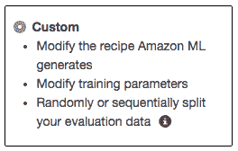

下一个屏幕在属性、它们的类型和左侧的值样本之间分割，以及右侧的建议食谱，如下面的截图所示：

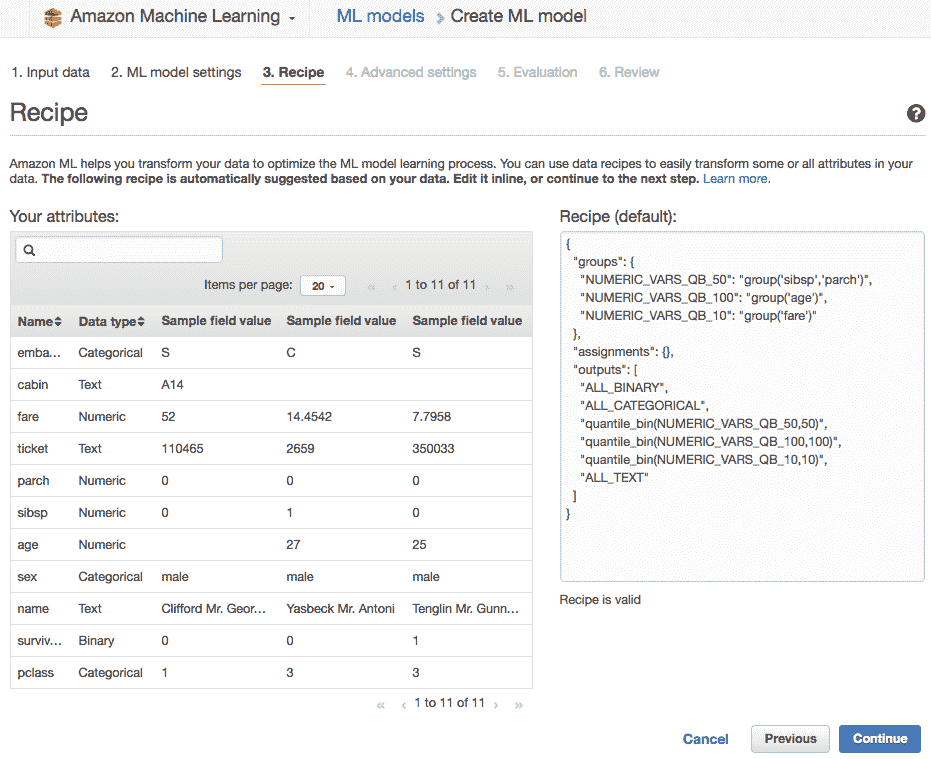

# 编辑建议的食谱

这是你可以编辑食谱并替换为你自己创建的食谱的地方。

你可以在本书的 GitHub 仓库中找到本章中所有的 JSON 文件，格式正确，缩进良好：[`github.com/alexperrier/packt-aml/blob/master/ch5/recipes.json`](https://github.com/alexperrier/packt-aml/blob/master/ch5/recipes.json)。

食谱在您输入时进行验证。任何不遵守 JSON 格式的都会导致以下错误消息：“食谱必须是有效的 JSON”。一些常见错误包括以下内容：

+   缩进不被尊重

+   大括号中的最后一个元素后面不应该跟有逗号

+   所有字符串都必须使用双引号括起来

手动格式化 JSON 文本并不有趣。这个在线 JSON 编辑器非常有帮助：[`www.cleancss.com/json-editor/`](http://www.cleancss.com/json-editor/)。

# 将食谱应用于泰坦尼克号数据集

亚马逊机器学习为我们生成的数据集的食谱如下：

```py
{
    "groups": {
        "NUMERIC_VARS_QB_50": "group('sibsp','parch')",
        "NUMERIC_VARS_QB_100": "group('age')",
        "NUMERIC_VARS_QB_10": "group('fare')"
    },
    "assignments": {},
    "outputs": [
        "ALL_BINARY",
        "ALL_CATEGORICAL",
        "quantile_bin(NUMERIC_VARS_QB_50,50)",
        "quantile_bin(NUMERIC_VARS_QB_100,100)",
        "quantile_bin(NUMERIC_VARS_QB_10,10)",
        "ALL_TEXT"
    ]
}

```

所有数值都是分位数分箱。对文本、二进制或分类变量不进行进一步处理。食谱的输出部分显示，数值变量被替换为分箱等效值。

可以对这道食谱提出进一步的意见：

+   将`sibsp`和`parch`变量分组在一起。首先，`sibsp`和`parch`都有相似的取值范围，分别是 0 到 9 和 0 到 8。对这两个变量使用相同数量的分箱是有意义的。

+   为什么亚马逊机器学习为`sibsp`和`parch`选择了 50 个分箱，为`age`选择了 100 个分箱，为`fare`选择了 10 个分箱，这一点不太清楚。

我们发现分箱的数量对训练集中的数据非常敏感。几个版本的初始数据集产生了非常不同的分箱数量。我们所有试验中的一个常数是，所有的数值都通过具有相当高数量的分箱进行分位数分箱。在一种情况下，亚马逊机器学习建议`fare`变量使用 500 个分箱，`age`变量使用 200 个分箱。在这两种情况下，由于我们的总训练样本数只有 1,047 名乘客，我们每个分箱的样本数将非常少。亚马逊机器学习如何计算最优分箱数量并不清楚。

亚马逊机器学习还可以决定对我们的`泰坦尼克号`数据集应用以下其他转换：

+   从乘客的标题中提取二元组或 OSB

+   将`sibsp`和`parch`与笛卡尔积转换结合

# 在食谱和数据预处理之间进行选择。

到目前为止，我们已经通过脚本和亚马逊机器学习食谱将我们的初始数据集进行了转换。这两种技术是互补的。一些转换和数据操作只能通过预处理数据来完成。我们在第四章， *加载数据集和准备数据* 中使用 Athena 和 SQL 这样做。我们也可以使用其他脚本语言（如 Python 或 R）来实现类似的数据处理，这些语言在创意特征工程方面最有成效。SQL 和脚本还可以更好地处理异常值和缺失值——这些修正在亚马逊机器学习食谱中是不可用的。

亚马逊机器学习转换的目标是 为亚马逊机器学习算法准备数据，而脚本特征工程则是关于清理数据并从原始数据集中创建新变量。

虽然亚马逊机器学习食谱相当有限，但它们提供了一个简单的方法来调整数据集，并快速比较基于不同食谱的模型。从给定的数据源和模式创建新模型及其评估只需几点击。通过为每个模型选择不同的食谱，可以尝试广泛的数据库。食谱允许我们创建快速的尝试-失败循环。相关的流程如下：

1.  指定数据源。

1.  尝试不同的食谱。

1.  创建或删除变量。

1.  训练并选择与该食谱关联的模型。

1.  一旦找到最佳食谱，就开始优化模型参数、正则化、遍历次数和内存。

我们可以比较使用脚本（Athena 和 SQL）和使用食谱如何转换数据：

**食谱：**

+   移除特征（`boat`、`body`和`home.dest`）。这也可以通过模式或直接从数据集 CSV 文件中删除列来完成。

+   通过聚合`parch`和`sibsp`来表示家庭的笛卡尔积。

+   数值归一化（一种可能性）。

+   对所有文本变量、名称、目的地等进行分词。

+   对所有数值进行分位数分箱；尽管分箱数量很大，但这种转换产生了良好的结果。

**脚本（SQL）：**

+   处理`年龄`的缺失值：我们将所有缺失值替换为*年龄*的平均值

+   文本处理：我们从`name`变量中提取了`titles`

+   创建了一个新的特征，即`family_size`，它是`parch`和`sibsp`的总和

+   从船舱号中提取`deck`

这两种方法都非常互补。

# 参数化模型

现在数据已经为 SGD 算法准备好了，我们准备设置实验参数。在某种程度上类似于科学实验，我们将尝试几组参数来测试几个模型，并选择最好的一个。下一张截图显示了实际上指定模型参数的位置：

+   模型内存

+   数据遍历

+   打乱顺序

+   正则化

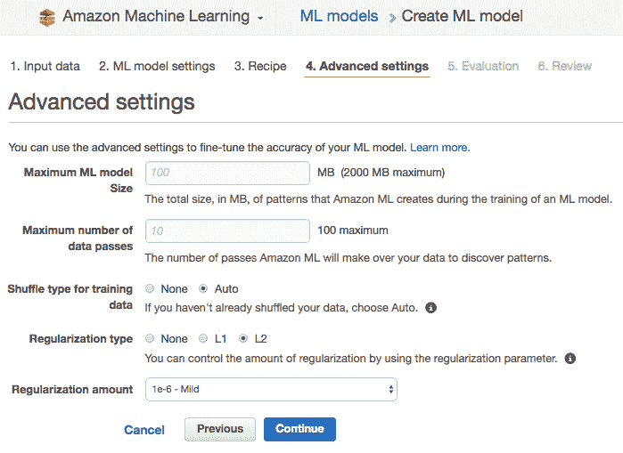

# 设置模型内存

模型内存与亚马逊机器学习必须预留的内存有关，以构建和评估您的模型。默认设置为 100Mb。在`泰坦尼克号`数据集的情况下，模型内存始终低于 1Mb，如日志所示。模型内存还用于处理流数据时预留内存。

# 设置数据遍历次数

亚马逊机器学习将多次使用样本的训练集，每次都打乱它并使用新的序列来提高预测。这类似于挤压一块湿布——每次挤压，都会有更多的水出来。默认设置为 10 次遍历，将其设置为 100 的最大值不会伤害到模型，但会增加模型的训练时间和操作成本。

# 选择正则化

如第二章中所述，*机器学习定义和概念*，正则化可以使你的模型更加鲁棒，并允许它通过减少过拟合来更好地处理之前未见过的数据。经验法则是，如果你的评估分数不佳（欠拟合），则降低正则化；如果你的模型在训练集上表现出色，但在评估集上表现不佳（过拟合），则增加正则化。

# 创建评估

在 Amazon ML 中，评估和模型是独立的。你可以通过指定不同的评估数据集来训练一个模型并执行多个评估。以下截图所示的评估页面允许你命名并指定如何评估模型：

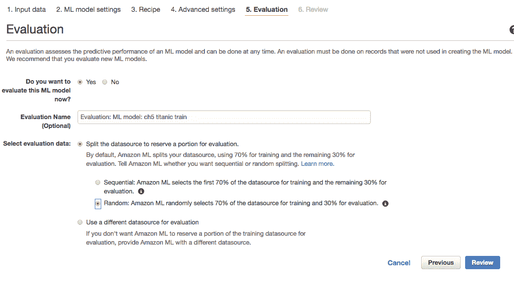

如你所知，为了评估一个模型，你需要将你的数据集分成两部分，即训练集和评估集，比例为 70/30。训练部分用于训练你的模型，而评估部分用于评估模型。在这个阶段，你可以让 Amazon ML 自动将数据集分成训练集和评估集，或者指定一个不同的数据源用于评估。

请记住，最初的`Titanic`文件是按阶级和乘客的字母顺序排序的。使用这个有序数据集并且不进行洗牌，即按顺序取前 70%的样本，会给模型带来非常不同的训练集和评估集数据。这样的评估将不相关。然而，如果你的数据尚未洗牌，你可以告诉 Amazon ML 对其进行洗牌。让你的数据默认由 Amazon ML 重新洗牌是一个好习惯，以防你自己的随机化在数据集中留下了某些顺序模式。

Amazon ML 将对你的训练集和验证集进行一些验证，检查验证集是否有足够的数据，两个集合是否遵循相似的分布，以及评估集是否有有效的样本。有关评估警报的更多信息，请参阅[`docs.aws.amazon.com/machine-learning/latest/dg/evaluation-alerts.html`](http://docs.aws.amazon.com/machine-learning/latest/dg/evaluation-alerts.html)。

注意，如果你选择让 Amazon ML 分割数据，它将创建两个新的数据源，并以一种方式命名，让你可以看到分割是如何进行的。如果你决定使用不同的配方或模型参数（如正则化）测试另一个模型，你可以重用这些新数据源。

例如：

+   `Titanic.csv_[percentBegin=0, percentEnd=70, strategy=sequential]`

+   `Titanic.csv_[percentBegin=70, percentEnd=100, strategy=random]`

点击“审查”，确保你的模型符合预期，然后点击最后的“创建 ML 模型”按钮。创建模型通常需要几分钟。

# 评估模型

在这个阶段，Amazon ML 将使用训练集来训练多个模型，并使用评估集来选择最佳模型。

Amazon ML 并行运行多个模型训练，每次尝试新的参数并在每次新遍历时对训练集进行洗牌。一旦达到最初设置的遍历次数或算法收敛，以先到者为准，模型就被认为是训练好的。对于它训练的每个模型，Amazon ML 都会用它对验证子集进行预测以获得每个模型的评估分数。一旦所有模型都以这种方式训练和评估，Amazon ML 就会简单地选择评估分数最好的模型。

评估指标取决于手头的预测类型。对于分类（二分类和多分类），是 AUC 和`F1`分数，对于回归是 RMSE。Amazon ML 如何显示评估结果也取决于手头的预测类型。

我们将首先评估我们的泰坦尼克号预测的二分类性能，接着是关于空中交通延误的新数据集的回归案例，最后使用经典的`Iris`数据集进行多分类分类。

# 评估二分类

一旦你的模型准备就绪，点击服务仪表板上的模型标题，即可访问模型的结果页面，其中包含模型的摘要、设置和评估结果。

下面的截图显示，我们获得了`0.880`的*AUC*分数，这在大多数机器学习应用中被认为是非常好的。**AUC**代表**曲线下面积**，在第二章，“机器学习定义和概念”中介绍。它是分类问题的实际度量标准。

二分类的基线是 0.5 的 AUC，这是随机预测 0 或 1 的模型的分数：

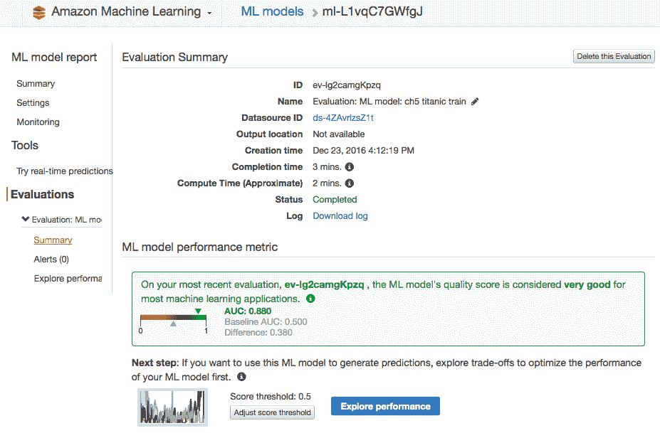

Amazon ML 通过检查以下条件来验证模型，并在条件不满足时发出警报：

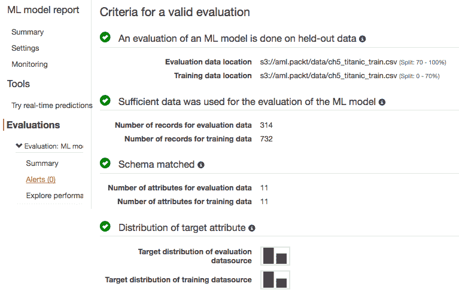

在我们的情况下，没有触发任何警报：

+   训练和验证数据集是分开的

+   验证数据集有足够的样本数量

+   验证集和训练集共享相同的模式

+   验证集的所有样本都是有效的，并用于评估，这意味着目标变量对于一个或多个样本没有缺失

+   目标变量的分布训练集和验证集中相似

如果我们让 Amazon ML 处理训练和验证数据的拆分，大多数这些警报将不会发生，但如果我们自己提供验证集，它们可能会更频繁。

AUC 分数不是 Amazon ML 给我们评估模型质量的唯一元素。通过点击*探索性能*链接，我们可以进一步分析我们模型的性能。

# 探索模型性能

你可能还记得第二章：*机器学习定义和概念*，在二元分类的情境下，逻辑回归模型为每个待预测样本计算一个概率——属于某一类或另一类的概率。模型不会直接输出待预测样本的类别。样本被分配到某一类或另一类，取决于概率是否低于或高于某个特定阈值。默认情况下，这个阈值设置为 0.5。尽管评估给出的 AUC 分数不依赖于决策阈值的值，但其他分类指标则不然。我们可以改变阈值的值，看看这对我们的预测有何影响。

**探索性能**页面展示了评估中的几个其他分类指标以及模型的混淆矩阵。下面图表中的垂直条是一个可以左右滑动的光标。通过滑动光标，我们可以增加或减少用于将预测样本分类为某一类或另一类的决策阈值。随着光标的移动，以下指标相应变化。

+   假正率

+   精确率：预测为正例的真正正例比例

+   回忆率（正确识别的正例比例）

+   准确率

对于*0.5*的阈值，我们有以下截图：

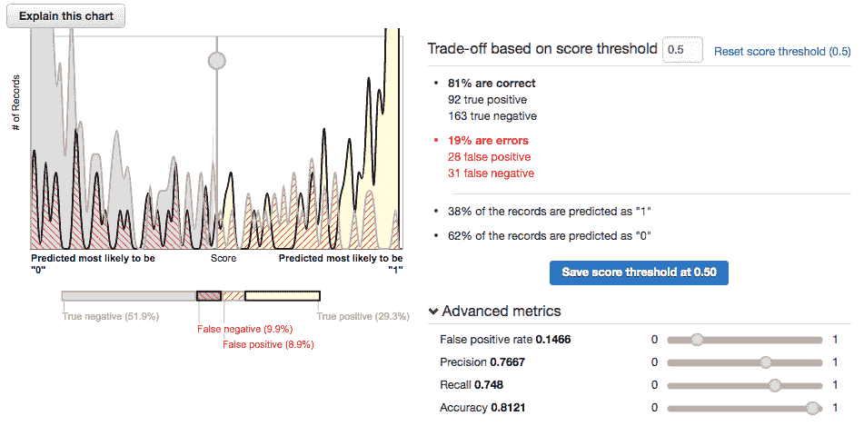

如果我们将阈值降低到*0.4*，准确率降低，而回忆率提高，如以下截图所示：

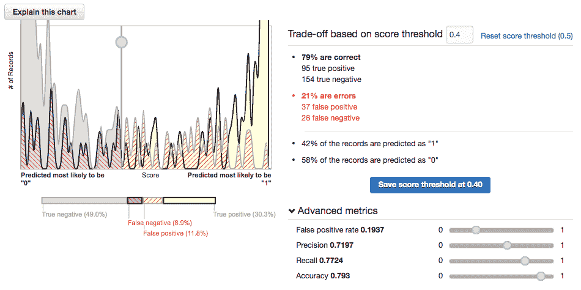

如果我们将阈值提高到*0.7*，准确率略有提高，而回忆率降低：

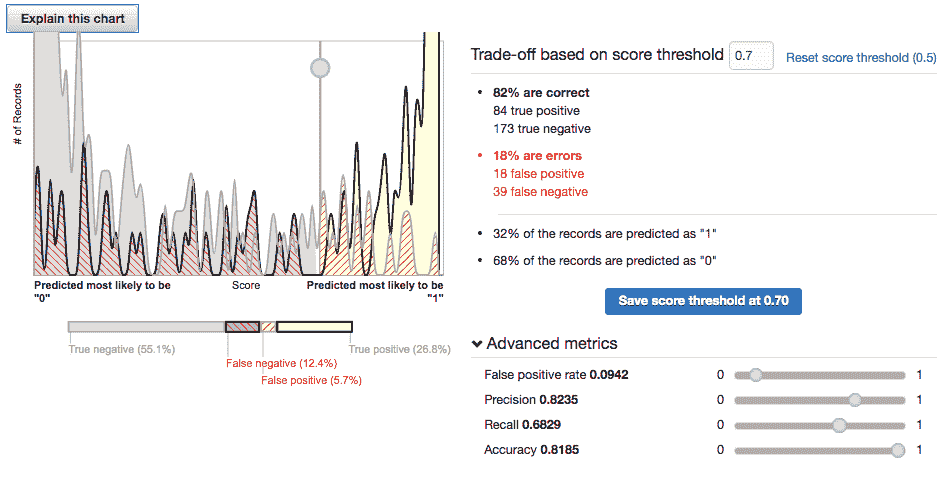

在我们的情境中，预测值在“存活”和“未存活”之间非常明显地区分开来。稍微改变阈值对指标的影响并不大。

# 评估线性回归

Amazon ML 使用标准的 RMSE 指标进行线性回归。RMSE 定义为真实值与预测值之间差的平方和：

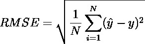

其中*ŷ*是预测值，*y*是真实值。预测值越接近真实值，RMSE 越低；因此，较低的 RMSE 被视为更好的预测模型。

为了展示回归背景下的评估，我们将考虑 Kaggle 上可用的**航空公司延误**数据集的简化版本，网址为[`www.kaggle.com/giovamata/airlinedelaycauses`](https://www.kaggle.com/giovamata/airlinedelaycauses)。完整的数据集相当大（*~250Mb*）。我们从 2008 年提取了大约*19,000*行数据，过滤掉了取消的航班。我们还删除了与我们的目标变量`Airdelay`高度相关的几个变量。结果数据集和模式可在 GitHub 上找到，网址为[`github.com/alexperrier/packt-aml/tree/master/ch5`](https://github.com/alexperrier/packt-aml/tree/master/ch5)。

我们将数据集上传到 S3，创建数据源，训练和评估模型，最终获得 RMSE 为 7.0557，基线为 31.312。回归的基线由一个总是预测目标平均值的模型给出：


进一步探索，我们获得了以下残差直方图。如图所示，误差大致呈钟形，且围绕*0*中心，这意味着我们的误差有一半的时间高估/低估了真实值。数据集中所有可用的信息都被模型消耗了：

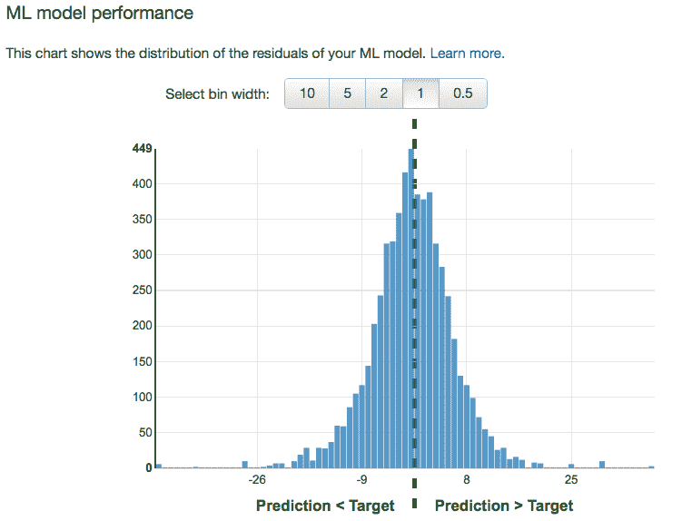

# 评估多类分类

多类分类的经典数据集是包含三种鸢尾花类型的`Iris`数据集。这个数据集相当简单，非常受欢迎，使用它来展示像 Amazon ML 这样强大的平台似乎有些过度。幸运的是，还有另外三个由种子组成的三类数据集。种子数据集可在[`archive.ics.uci.edu/ml/datasets/seeds`](https://archive.ics.uci.edu/ml/datasets/seeds)找到，当然，也可以在本书的 GitHub 仓库中找到（以及模式）。

种子数据集有 210 个样本，均匀分布在三种不同的`seedTypes`和七个属性中。数据集有一个 ID，必须设置为分类，所有属性都是数值型，目标是`seedType`。我们将数据集上传到 S3，并创建数据源和模型。

多类分类的指标是定义为精确率和召回率的调和平均值的*F1*分数：

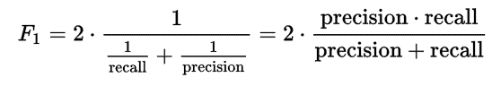

多类分类问题的基线是总是预测最常见类别的模型的宏平均*F1*分数。在种子数据集的情况下，我们获得了基线为 0.143 的*F1*分数为 0.870：

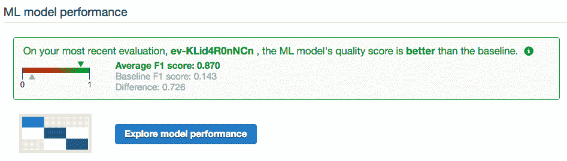

性能探索不如二分类案例那样发达。Amazon ML 提供了混淆矩阵，它显示了每个类别中正确预测样本数与该类别实际样本数的比率：

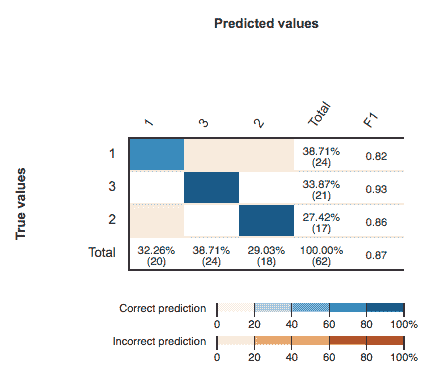

# 分析日志

对于它执行的每个操作，Amazon ML 都为我们提供了相关的日志访问权限。我们可以下载并分析模型训练日志，并推断出 Amazon ML 如何训练和选择最佳模型。

返回到上一个泰坦尼克号模型，在摘要部分点击下载日志链接。日志文件太长无法在此处展示，但可在[`github.com/alexperrier/packt-aml/blob/master/ch5/titanic_training.log`](https://github.com/alexperrier/packt-aml/blob/master/ch5/titanic_training.log)找到：

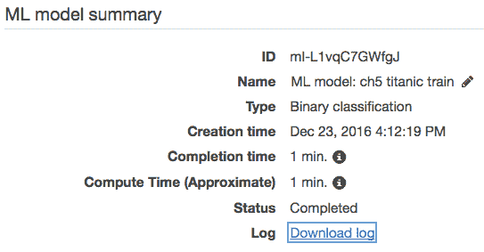

Amazon ML 并行启动了五个版本的 SGD 算法。每个版本被称为学习者，对应于不同的学习率值：0.01、0.1、1、10 和 100。在算法的每次新迭代中，计算以下五个指标：

+   准确率

+   回忆

+   精确度

+   F1 分数

+   AUC

还计算了`负对数似然`来评估最后几次迭代是否显著降低了残差误差。

# 优化学习率

如果您还记得第二章中的内容，即*机器学习定义和概念*部分下的*线性模型正则化*，**随机梯度下降（SGD）**算法有一个名为学习率的参数。

SGD 基于这样的想法：每次迭代都使用新的（块）数据样本对线性回归模型的系数进行微调。在每次迭代中，输入数据样本要么逐个使用，要么分块使用，以估计对线性回归系数的最佳修正（所谓的梯度），以进一步减少估计误差。已经证明，SGD 算法收敛到线性回归权重的最优解。这些修正乘以一个称为`学习率`的参数，该参数驱动每次迭代对系数进行的修正量。

SGD 的计算成本较低。这是一个既迷人又简单的算法，被广泛应用于许多应用中。

想象一个在碗中的弹珠。将弹珠放在碗的边缘，然后让它以圆形运动的方式落入碗中。它在下落的过程中会围绕碗旋转。在其下降的末端，它倾向于围绕碗底旋转，并最终在碗的最低点停下来。当你将每个迭代的预测误差视为弹珠，将碗底视为可以估计的最终和最优化系数时，SGD 的行为与此类似。在每次迭代中，预测误差的平均值会变小。误差不会像弹珠那样直接沿着碗底的最直接路径下降，也不会达到最低的最优化解，但平均而言，预测会更好，误差在迭代后会逐渐减少。经过一定次数的迭代后，误差将接近其潜在的最优最小值。它达到最小误差和最佳系数的速度有多快，以及它有多接近最小误差，这直接取决于学习率的值。

学习率控制每次迭代中权重被校正的程度。学习率驱动算法的收敛。学习率越大，收敛越快，一旦收敛，潜在的残差误差可能也越大。

因此，选择一个最优的学习率将在以下方面取得平衡：

+   更快的收敛和较差的估计

+   更慢的收敛和更准确的估计

然而，如果学习率太小，收敛可能会太慢，并且需要太长时间才能达到最优解。一个标准的策略是随着算法的收敛而减小学习率，从而确保开始时快速收敛，随着预测误差的减小而减慢。随着学习率的减小，系数估计变得更加准确。小的学习率意味着算法收敛得慢，而高的值意味着每个新的样本对校正因子的影响更大。Amazon ML 不使用那种策略，并保持学习率恒定。在 Amazon ML 中，学习率由系统设置。您不能选择一个值。

# 可视化收敛

通过解析日志，我们可以提取出我们泰坦尼克号模型的以下收敛图：

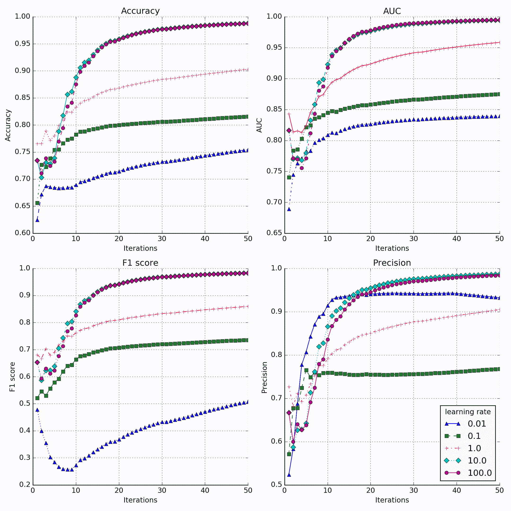

之前不同图的截图显示了四个指标：准确率、AUC、F1 分数和精确度，对应于五个不同学习率的值。模型被设置为在泰坦尼克号训练数据集上进行 50 次遍历，轻微的（10^-6）L2 正则化。我们可以看到，对于所有指标，最佳的学习率值要么是 10，要么是 100，其中学习率=100 略胜一筹。这些值收敛得更快，达到更好的分数。最小学习率（0.01）收敛得非常慢。在我们的情况下，更快的收敛和较大的学习率值优于较小的学习率值。

创建模型时的默认迭代次数是*10*。我们可以看到，10 次迭代不足以使分数稳定和收敛。在第 10 次迭代时，曲线几乎还没有走出混沌初始化阶段。

从日志中提取的负对数似然图显示，最佳学习器对应于这里用带菱形形状的曲线表示的 100 学习率：

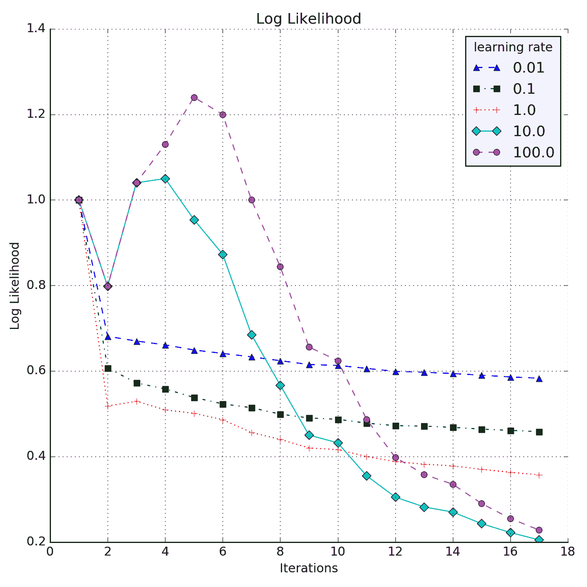

从这些图表中可以得出一个结论，那就是你不应该将你的模型限制在默认的 10 次迭代。

这两个收敛图完全取决于当前的问题。对于不同的数据集，我们可能会得到在收敛速度、学习率和达到的分数方面完全不同的图表。

# 正则化的影响

以下图表比较了三个不同模型的 AUC：

+   无正则化

+   轻微正则化（10^-6）

+   激进正则化（10^-2）

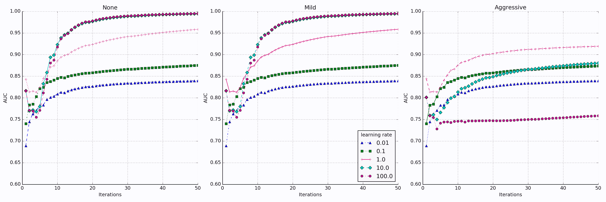

我们注意到，在没有正则化和轻微正则化之间没有显著的差异。然而，激进的正则化对模型性能有直接影响。算法收敛到一个较低的 AUC，最佳学习率不再是 100，而是 1。

比较亚马逊 ML 给出的轻微和激进正则化的性能图，我们看到尽管两种情况下的分数（AUC、准确率等）非常相似，但差异在于预测的确定性。在轻微正则化情况下（左图），预测值相差很远。样本为零或一的几率或预测非常明显。在激进正则化情况下（右图），这种分离远不那么明显。样本属于一个类别而不是另一个类别的概率要接近得多。决策边界不太清晰：

| **轻微正则化** | **激进正则化** |
| --- | --- |
| 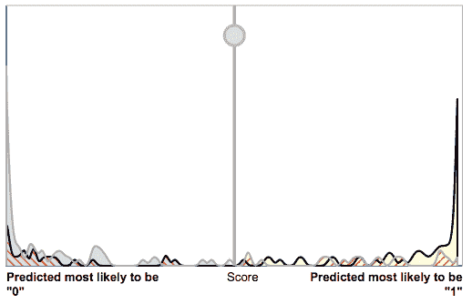 | 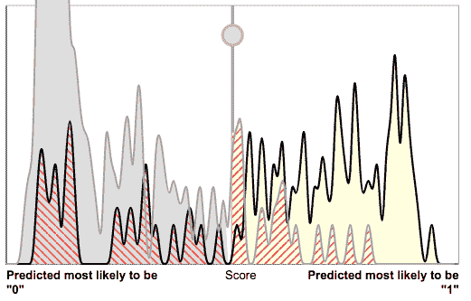 |

正则化的目标是使模型的性能与训练数据解耦，以减少过拟合。因此，在之前未见过的数据集上，重正则化可能会给出更好的结果，而没有正则化可能比轻微正则化表现更差。在训练-验证阶段不太理想的表现有时在真实预测阶段可能更稳健。重要的是要记住，验证阶段的表现并不总是转化为预测阶段的表现。

# 在泰坦尼克号数据集上比较不同的方法

在本节的最后，我们想比较几个配方，看看我们的基于 SQL 的特征工程是否可以驱动更好的模型性能。在我们所有的实验中，与 Amazon ML 建议的配方相关的一个突出特点是所有数值型变量最终都通过分位数分组进行了分类。分箱的数量也值得怀疑。我们在 `Titanic` 数据集上比较以下场景：

+   建议的 Amazon ML 脚本

+   数值型值保持为数值型。在脚本中不涉及分位数分组。

+   我们在第四章，“加载数据集和准备数据”中创建的扩展泰坦尼克号数据源，与建议的 Amazon ML 脚本一起使用

我们对第四章，“加载数据集和准备数据”中使用的扩展泰坦尼克号数据集进行了轻微修改：

+   没有必要同时拥有 `fare` 和 `log_fare`。我们移除了 `fare`。

+   我们手动纠正了一些标题，这些标题没有从名称中正确提取出来。

+   新的扩展数据集可在 GitHub 仓库的该章节中找到，作为 `ch5_extended_titanic_training.csv`。

在所有三种情况下，我们都应用了 L2 轻度正则化。

# 保持变量为数值型或应用分位数分组？

我们发现，将所有数值型变量保持为数值型并避免任何分位数分组对模型性能有非常直接且负面的影响。在数值型情况下，整体得分远低于分位数分组情况：所有数值型的 `AUC` 为 0.81，而 QB 的 `AUC` 为 0.88。

查看 *All Numeric* 模型的收敛图，似乎算法的收敛速度比分位数分组模型慢得多。显然，在 50 次迭代后并未收敛，因此我们将迭代次数增加到 100 次。我们还注意到，在 *All Numeric* 情况下，最佳学习率等于 0.01，而在分位数分组模型中，最佳学习率要大得多（10 或 100）。较小的学习率会导致收敛速度变慢：

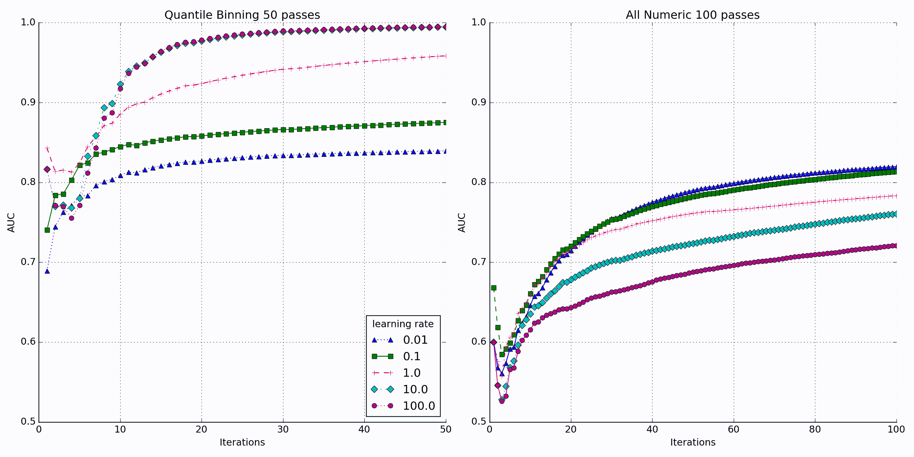

我们还在以下性能图表中看到，分位数分组模型比所有数值型模型更好地分离了类别：

| **分位数分组 50 次** | **所有数值型 100 次** |
| --- | --- |
| 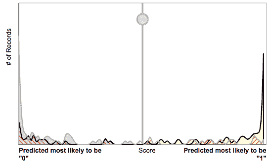 | 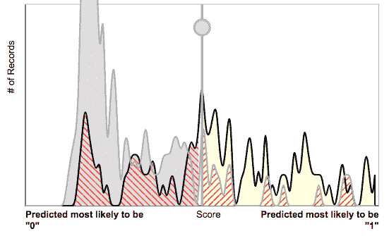 |

因此，分位数分组肯定比不分位数分组更可取。那么，我们用新特征扩展初始数据集的努力如何呢？好吧，不知何故，我们的扩展模型并没有比初始数据集产生更好的结果。从 `name` 中提取 `title`，为 `age` 替换缺失值，从 `cabin` 中提取 `deck` 并没有生成一个明显更好的模型：

+   原始泰坦尼克号数据集：AUC 0.88

+   扩展的泰坦尼克号数据集与特征工程：AUC 0.82

两个模型的收敛和性能图表相似，此处不再重复。可能有几个因素在起作用，可以解释为什么我们的改进数据集没有产生更好的模型，需要进一步分析来了解哪些特征工程对模型有积极影响，哪些没有。然而，我们将在下一章中看到，这也可能取决于评估集中实际的样本。平均而言，扩展的数据集生成更好的性能，但在这个特定的试验中，相关的模型的表现与在原始数据集上训练的模型大致相同。结论是，运行多次试验以评估模型的质量和性能是值得的，而不是依赖于唯一的一次试验，因为评估集的特殊性可能会影响模型之间的比较。

# 解析模型日志

收敛图是通过解析 Amazon ML 模型日志，将数据提取到 CSV 文件中得到的，该文件可以用于后续创建图表。这个过程很简单，主要基于命令行脚本，使用 `grep` 和 `sed` 命令。我们想要从日志文件中提取和解析以下行：

```py
16/12/25 13:54:03 INFO: learner-id=4202 model-performance:         accuracy=0.6562 recall=0.5000 precision=0.5909 f1-score=0.5417 auc=0.7095

```

并将它们转换为 CSV 格式，如下所示：

| 迭代 | alpha | 学习者 | 准确率 | 召回率 | 精确率 | F1 | AUC |
| --- | --- | --- | --- | --- | --- | --- | --- |
| 1 | 0.01 | 1050 | 0.5937 | 0.56 | 0.4828 | 0.5185 | 0.6015 |

第一步是从日志文件中提取正确的行。我们注意到它们都包含字符串 `model-performance:`。我们使用 `grep` 命令提取包含此字符串的所有行到一个临时文件中，我们将其命名为 `model_performance.tmp`。

将 Amazon ML 模型页面上的日志数据复制粘贴到日志文件（`model.log`）中，然后在终端运行以下命令：

```py
grep "model-performance:" model.log >> model_performance.tmp

```

然后使用 `sed` 命令将正确的子字符串替换为逗号。`sed` 命令遵循以下语法：

```py
sed -i.bak 's/STRING_TO_REPLACE/STRING_TO_REPLACE_IT/g' filename

```

`-i.bak` 选项使得可以在文件内部替换字符串，而无需创建临时文件。

例如，将 `model_performance.tmp` 文件中的字符串 `INFO: learner-id=` 替换为逗号，可以通过在终端运行以下行来实现：

```py
sed -i.bak 's/ INFO: learner-id=/,/g' model_performance.tmp

```

通过以下命令，大部分原始日志文件已经被转换成 CSV 格式的文件，你可以将其用作可视化 Amazon ML 模型收敛的基础。其余的文件清理可以在电子表格编辑器中完成：

```py
sed -i.bak 's/ INFO: learner-id=/,,/g' model_performance.tmp
sed -i.bak 's/ model-performance:         accuracy=/,/g' model_performance.tmp
sed -i.bak 's/ recall=/,/g' model_performance.tmp
sed -i.bak 's/ precision=/,/g' model_performance.tmp
sed -i.bak 's/ f1-score=/,/g' model_performance.tmp
sed -i.bak 's/ auc=/,/g' model_performance.tmp

```

可以使用类似的模式从 Amazon ML 模型日志中提取负对数似然数据：

```py
sed -i.bak 's/ INFO: learner-id=/,,/g' filename
sed -i.bak 's/ model-convergence:         negative-log-likelihood=/,/g' filename
sed -i.bak 's/ (delta=1.000000e+00) is-converged=no//g' filename

```

我们最终得到一个 CSV 文件，其中每一行代表一个迭代，一列是学习率，以及每个指标。

# 摘要

在本章中，我们在 Amazon ML 中创建了预测模型——从选择数据源，使用配方对初始数据进行转换，到分析训练模型的性能。模型性能的探索取决于手头的预测问题类型：二元分类、多分类或回归。我们还查看了泰坦尼克号数据集的模型日志，了解了 SGD 算法如何训练并从几个不同学习率的模型中选择最佳模型。

最后，我们在泰坦尼克号数据集的背景下比较了几种数据转换策略及其对模型性能和算法收敛性的影响。我们发现，数值的分位数分箱是提高算法收敛速度的关键策略，总体上产生了更好的模型。

到目前为止，这些模型和性能评估都是在训练数据上获得的。这意味着模型从一开始就完全能够访问这些数据。这些模型的初衷不是在训练数据的子集上运行，而是在之前未见过的数据上做出稳健的预测。

在下一章中，我们将应用这些模型到我们在第四章“加载数据集和准备数据”中创建的保留数据集上，以进行实际预测。
