# 第六章：预测和性能

是时候做出一些预测了！在第四章，“加载数据集和准备数据”，我们将`Titanic`数据集分为两个子集，分别是训练集和保留集，分别占原始数据集的 70%和 30%，并且随机打乱。我们在第五章“模型创建”中广泛使用了训练子集，以训练和选择最佳的分类模型。但到目前为止，我们还没有使用保留集。在本章中，我们将我们的模型应用于这个保留集，对未见数据做出预测，并对我们模型的性能和鲁棒性进行最终评估。

Amazon ML 提供两种类型的预测：批量预测和流式预测。批量预测需要一个数据源。你想要预测的样本将以批量模式一次性提供给模型。流式预测，也称为实时或在线预测，需要创建一个 API 端点，并包括通过 HTTP 请求逐个提交样本序列。实时预测不涉及创建数据源。

我们将从对`Titanic`保留集的批量预测开始。我们将确认我们的不同模型在保留数据集上的表现与在验证子集上的表现相似，假设所有子集具有相似的变量分布。在第五章“模型创建”中，我们得出结论，在我们的三个数据源——建议的量分箱（QB）食谱、无 QB 的食谱和扩展数据集——中，包含额外变量（如`deck`、`title`、`log_fare`等）的那个数据源在验证子集上得到了最佳的分数。我们将验证这一点也适用于保留集。

本章分为两部分。在第一部分，我们查看`Titanic`数据集的批量预测。在第二部分，我们查看基于 UCI 存储库的新文本量分箱的实时、流式预测。`Spam`数据集足够大，可以模拟流数据。我们将创建一个 Amazon ML 端点，并使用 Python SDK 发送和检索分类预测。

在本章中，我们将涵盖以下主题：

+   制作批量预测

+   制作实时预测

在现实世界的分类问题或回归问题中，你想要对其做出预测的先前未见数据将不包括目标值。在我们的案例中，保留数据集确实包含解决方案，这使我们能够评估模型在先前未见数据上的性能。但在现实世界的问题中，你不会有这样的奢侈，你将不得不信任你的模型。

# 制作批量预测

在 Amazon ML 上制作批量预测的过程简单明了，遵循以下步骤：

1.  从仪表板创建一个新的批量预测。

1.  选择模型。

1.  选择应用模型的数据源。

1.  设置预测输出文件夹并授予权限。

1.  审查并启动。

我们称预测数据集或数据源为，我们想要进行预测的数据。在本章中，我们处于测试环境中，预测数据集是我们从整个原始数据集中提取的`保留`数据集。在现实世界的情况下，预测数据集指的是全新的数据，并且不包含目标变量。

预测只有在预测数据集的分布与模型训练所用的训练数据集的分布相似时才能工作。预测数据源和训练数据源还必须共享相同的模式，唯一的区别是预测数据集不需要包含目标变量。Amazon ML 将验证为您的训练数据定义的模式是否与您的预测数据相关，如果数据集不相似，将发出警告。

为了方便起见，我们已重新创建了本章的数据集、数据源和模型。所有数据集和脚本均可在 GitHub 仓库中找到，网址为 [`github.com/alexperrier/packt-aml/tree/master/ch6`](https://github.com/alexperrier/packt-aml/tree/master/ch6)。由于我们对原始的泰坦尼克号数据进行了重新排序，因此评估分数将与之前相同数据集获得的分数不同。

# 创建批量预测作业

要创建批量预测，请转到 Amazon ML 仪表板并点击创建新的批量预测：

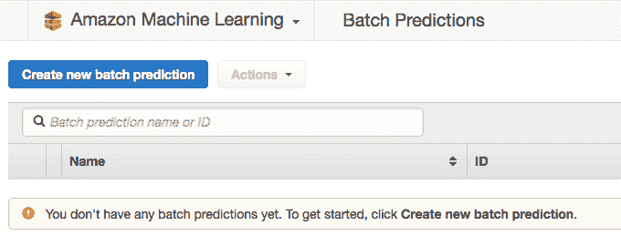

然后选择模型。我们选择与`泰坦尼克号`数据集相关的原始模型，使用 Amazon ML 建议的食谱进行分位数分箱：

+   所有数值变量的分位数分箱

+   L2 轻度正则化

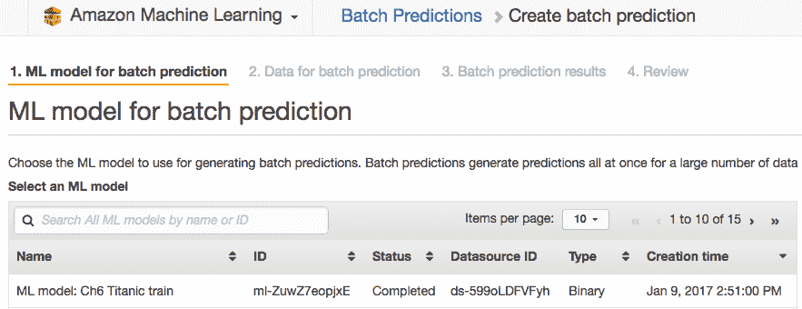

在模型选择之后，进行数据源选择。如果您尚未为保留集创建数据源，现在可以创建。首先，将您的预测数据集上传到 S3，并指定数据的 S3 路径：

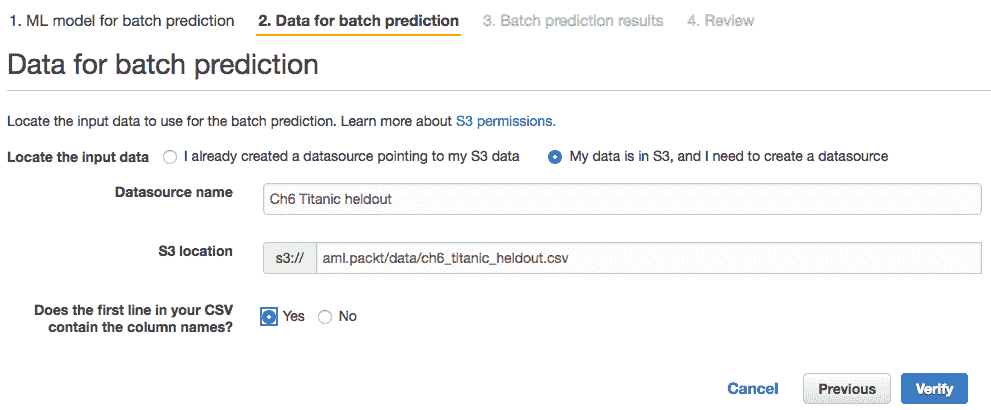

当您点击验证时，Amazon ML 将检查预测数据集是否遵循与模型训练所用的训练数据集相同的模式：

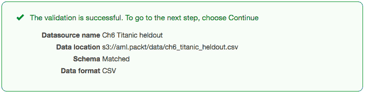

# 解释预测输出

亚马逊机器学习预测作业的输出将包括两个文件：清单文件和以压缩 CSV 文件格式提供的实际预测结果。亚马逊机器学习将在 S3 上的指定位置`s3://bucket/folder`创建这些文件，您必须指定该路径。我们使用与数据路径相同的路径：`s3://aml.packt/data/`。亚马逊机器学习将在`/batch_prediction`文件夹中创建文件，其中它将写入清单文件以及一个额外的子文件夹`/results`，实际预测的 CSV 文件将写入该子文件夹。总结一下，在我们的场景中，清单文件将位于` s3://aml.packt/data/batch_prediction`文件夹中，压缩的 CSV 结果文件将位于`s3://aml.packt/data/batch_prediction/results/`文件夹中。分配给批量预测的名称将决定清单和结果文件的命名：

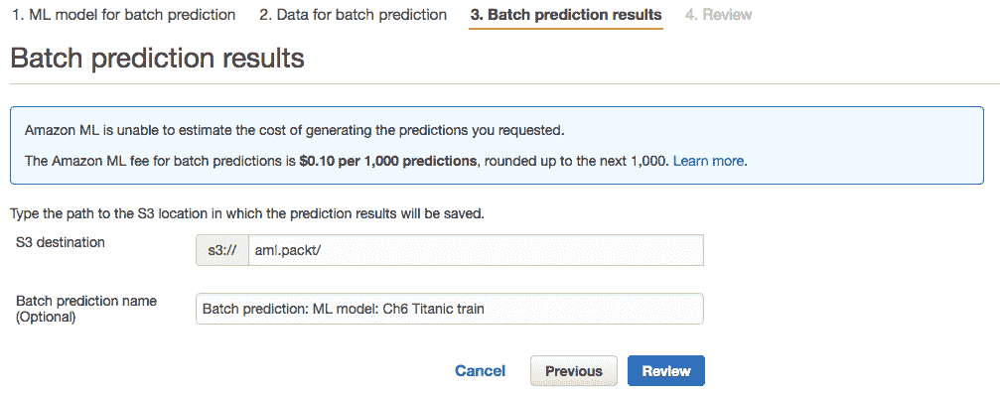**预测定价**：如果您刚刚创建了批量预测的数据源，亚马逊机器学习尚未获得计算预测成本所需的数据统计信息。在这种情况下，它将简单地通知您价格，每 1,000 次预测 0.10 美元。如果预测数据源已经过验证，并且亚马逊机器学习知道记录数，则估计价格将是行数乘以每次预测的价格，四舍五入到最接近的美分。亚马逊机器学习无法预测的无效样本不会产生费用。更多详细信息请参阅[`docs.aws.amazon.com/machine-learning/latest/dg/pricing.html`](http://docs.aws.amazon.com/machine-learning/latest/dg/pricing.html)。

查看并点击创建批量预测按钮。批量预测作业将需要几分钟才能完成。完成后，它将在 S3 中创建清单和结果文件，并在亚马逊机器学习仪表板的批量预测部分显示为已完成。

# 读取清单文件

清单文件包含 JSON 格式的数据，将输入文件映射到预测结果文件，如下所示：

```py
{S3 location of the batch prediction input file.csv : S3 location of the prediction results file}

```

在我们的场景中，清单文件包含以下行：

```py
{"s3://aml.packt/data/ch6_titanic_heldout.csv":"s3://aml.packt/batch-prediction/result/bp-yTDNSArMqa6-ch6_titanic_heldout.csv.gz"}

```

**多个输入文件**：如果您的输入数据被分割成几个文件，并且所有文件都存储在同一个 S3 位置`s3://examplebucket/input/`，所有输入文件都将被批量预测作业考虑。然后清单文件将包含不同输入文件到相关结果文件的映射。例如，如果您有三个名为`data1.csv`、`data2.csv`和`data3.csv`的输入文件，并且它们都存储在 S3 位置`s3://examplebucket/input/`，您将看到一个如下所示的映射字符串：

```py
{"s3://examplebucket/input/data1.csv":"s3://examplebucket/output/batch-prediction/result/bp-example-data1.csv.gz", "s3://examplebucket/input/data2.csv":"
 s3://examplebucket/output/batch-prediction/result/bp-example-data2.csv.gz", "s3://examplebucket/input/data3.csv":"
 s3://examplebucket/output/batch-prediction/result/bp-example-data3.csv.gz"}

```

**预测的最大大小**：Amazon ML 允许预测文件的最大数据量为 1TB。如果你想要进行预测的数据量更大，可以将数据分割成几个文件，上传到特定的 S3 位置，Amazon ML 将处理不同的文件，并通过并行运行多个批次生成与输入文件数量相等的预测结果文件。清单文件将包含所有不同的输入/输出对，`{input_file.csv : prediction_results.csv.gz}`，针对你的不同批量预测文件。

# 读取结果文件

输出结果文件使用 gzip 压缩，源自 UNIX 世界，提供的压缩效果优于更常见的 zip 压缩。简单点击即可打开和解压缩 gzip 压缩的结果文件，将其转换为可读的 CSV 文件。或者，可以从命令行调用 gunzip 命令。查看[`www.gzip.org/`](http://www.gzip.org/)获取不同系统的安装信息。

对于二元分类，解压缩的结果文件包含两列或三列，具体取决于初始输入文件是否包含目标值。在我们的二元分类案例中，结果文件包含以下列：`trueLabel`、`bestAnswer`和`score`，其中`trueLabel`是初始的`survived`列。如果你的初始批量预测数据集没有包含目标值，结果文件将只包含`bestAnswer`和`score`列：

+   `trueLabel`是输入文件中包含的原始目标值

+   `bestAnswer`是分类结果：0 或 1

+   `Score`是以科学记数法表示的那个分类的概率

分数的概率分类截止阈值默认为 0.5，或者在评估模型时设置的阈值值。

对于具有*N*个潜在目标类别的多类分类，结果文件将包含*N+1*或*N+2*列。`trueLabel`、`bestAnswer`和*N*列分别包含 N 个类别中每个类别的概率分数。所选的类别将是具有最高概率分数的类别。

对于回归模型，结果文件将只包含一个/两个分数列，包含预测值，可能还有`trueLabel`列。

# 评估我们的预测

由于我们知道保留样本的真实类别，我们可以计算**ROC-AUC**分数和其他指标，以查看我们的预测和验证分数有多接近。假设我们的数据子集具有非常相似的分布，这两个分数最终应该非常接近。差异仅来自验证和保留集样本中的随机性。

以下 Python 脚本使用了`scikit-learn`库([`scikit-learn.org/`](http://scikit-learn.org/))以及 pandas 库。只需几行 Python 代码即可计算模型在该预测数据集上的 AUC 得分。首先，从 S3 下载压缩文件，然后在 Python 笔记本或控制台中运行以下代码：

```py
import pandas as pd  
from sklearn import metrics

# open file the csv file on your local
df = pd.read_csv(path/location_of_the_unzipped_results_csv_file)

# calculate the true and false positive rate
fpr, tpr, threshold = metrics.roc_curve(df.trueLabel, df.score)
roc_auc = metrics.auc(fpr, tpr)

```

**Python 环境**：本书中的所有 Python 代码都是针对 Python 3.5 或更高版本。有关 Anaconda 库的更多信息，请参阅[`www.continuum.io/downloads`](https://www.continuum.io/downloads)。Anaconda 是一个惊人的强大开源数据科学平台，在 Python 中。它包含最重要的库（`numpy`、`pandas`、`scikit-learn`、`matplotlib`等）以及 Jupyter 笔记本环境。我们使用 IPython 控制台，因为它使用简单，并且有许多魔法命令([`ipython.readthedocs.io/en/stable/interactive/magics.html`](http://ipython.readthedocs.io/en/stable/interactive/magics.html))。

在预测结果上运行之前的 Python 脚本，我们在保留集数据集上获得 AUC 为 0.84，这非常接近我们在第五章“模型创建”中验证集上获得的 AUC（0.85）。我们可以得出结论，我们的模型在面对新的、之前未预见的数据时相当稳定和健壮。

下面的图表显示了所选模型的验证集（虚线）和保留集（实线）的 ROC 曲线。对于较高的阈值，验证集略好。这种差异反映了两个数据集中数据分布的不同：

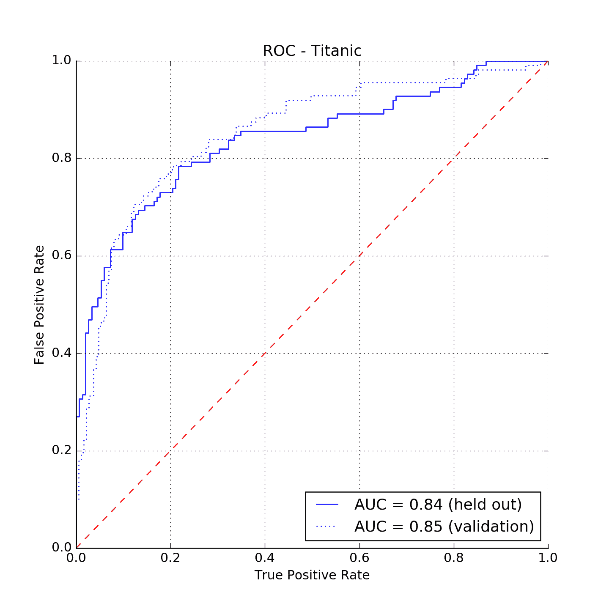

# 评估保留集

在第五章“模型创建”中，我们评估了我们的不同模型在训练数据源的一个切片上的性能。我们对每个模型都获得了 AUC 得分，并选择了具有最佳 AUC 得分的 AUC。我们依赖 Amazon ML 创建验证集，通过将训练数据集分成两部分，其中 70%用于训练，30%的数据用于验证。我们本可以自己进行分割，创建验证数据源，并指定用于模型评估的数据源。

事实上，我们没有任何阻止我们在保留集数据集上运行模型评估。如果您转到模型摘要页面，您会在评估部分注意到一个“执行另一个评估”按钮：

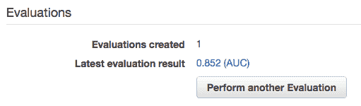

点击它。您将被要求选择用于评估的数据源。选择保留集；Amazon ML 将验证数据是否遵循相同的模式，并且与训练数据相似。您最终会在模型上获得两个评估：

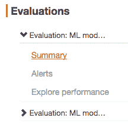

如预期的那样，保留集的评估 AUC 与我们通过下载结果并在 Python 中计算 AUC 获得的 AUC 相等：

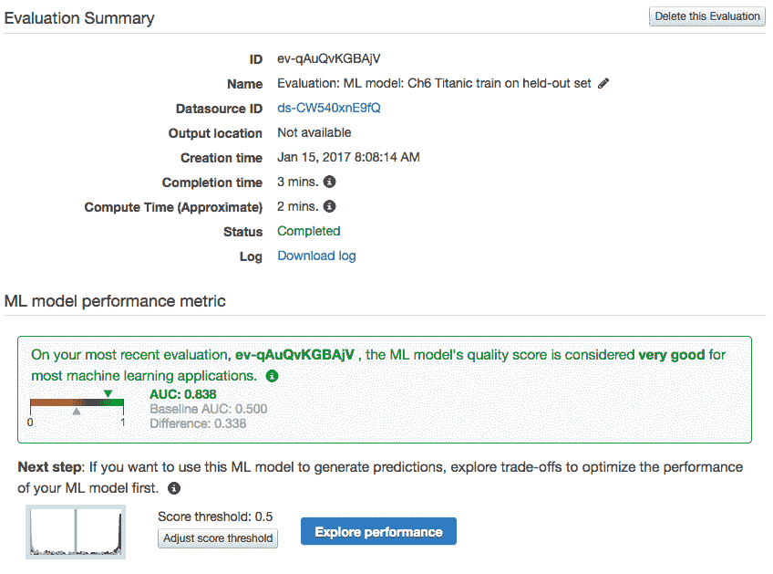

# 发现谁将生存

然而，预测的真正价值并不在于验证我们模型的鲁棒性；它在于在我们的预测数据集、我们的环境中进行预测，对保留数据集中的这个“新”乘客列表进行生存预测。

结果文件中的行与预测文件中的行顺序完全相同。我们可以将保留文件的前几行和结果文件的前几行并排放置，并看到`survived`和`trueLabel`列是相同的：

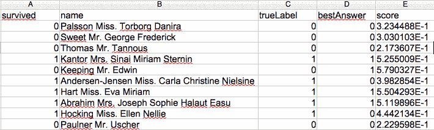

# 乘法试验

在各种模型和数据集版本上的评估分数在一定程度上取决于评估集中的样本。如果我们在这三个数据集上多次运行以下实验，我们会看到分数的某些变化：

+   打乱并分割数据集为三个部分——训练、验证和保留，并创建相应的数据源

+   在训练数据集上训练模型，保持默认的亚马逊机器学习设置（轻微的 L2 正则化）

+   在评估和保留数据集上评估模型

下面的图表显示了三个模型在多次试验中的相应性能。图表上写有平均 AUC。我们看到平均而言，扩展数据集的性能优于默认配方下的原始数据集（AUC = 0.84）和没有分位数分箱的原始数据集（AUC = 0.83）。我们还注意到，在某些试验中，扩展数据集的性能不如原始数据集。对于试验 3，默认配方甚至略逊于没有分位数分箱的配方：

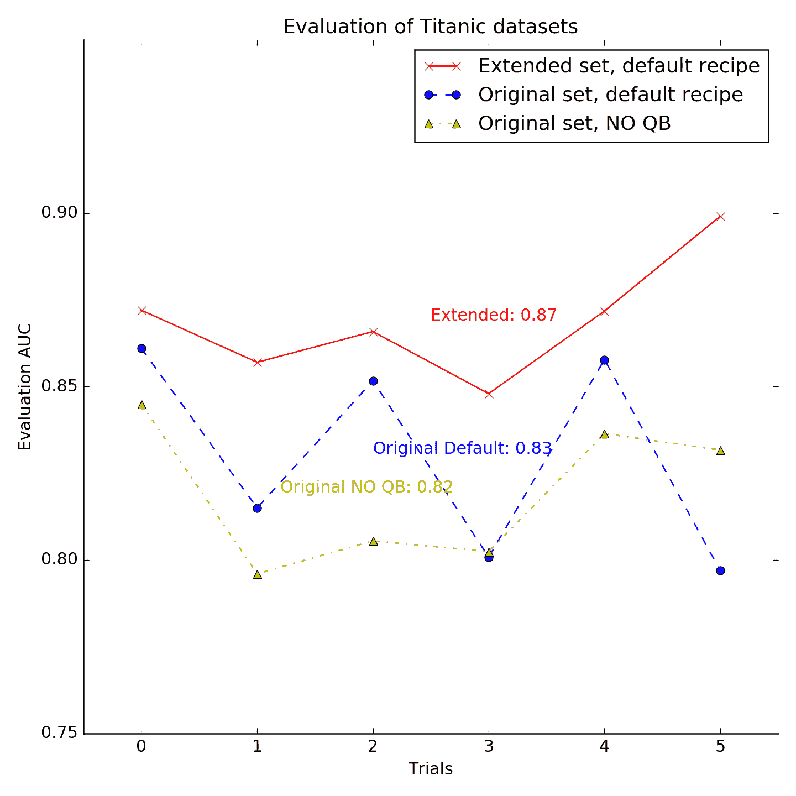

这显示了内部数据分布变异性的重要性。当尝试使用不同特征和处理的多个数据集变体时，基于您模型的多次运行得出结论是很重要的。单次评估可能会导致错过最佳模型。

# 进行实时预测

使用批量预测时，您可以通过创建数据源一次将所有希望模型预测的样本提交给亚马逊机器学习。使用实时预测（也称为流式或在线预测），想法是每次发送一个样本到一个 API 端点、一个 URL，通过 HTTP 查询，并为每个样本接收预测和信息。

在模型上设置实时预测包括了解预测 API 端点 URL 和编写一个脚本，该脚本可以读取您的数据，将每个新样本发送到该 API URL，并检索预测的类别或值。我们将在下一节中提供一个基于 Python 的示例。

亚马逊机器学习（Amazon ML）还提供了一种方法，可以在预测页面上对您实时创建的数据进行预测。我们可以输入一个潜在的乘客在“泰坦尼克号”上的档案，并查看该档案是否能够幸存。这是一种探索数据集变量对结果影响的绝佳方式。

在设置流式 API 之前，让我们看看通过提交几个单个乘客档案我们能收集到什么信息。我们甚至可以尝试回答这个问题——*你会在大西洋号上幸存下来吗？*

# 手动探索变量影响

前往模型摘要页面，然后点击页面左侧的“尝试实时预测”链接。接下来的页面显示一个表单，您可以在其中填写我们数据集中变量的值，除了目标变量。

让我们看看亚历克斯·佩里埃先生，一位头等舱乘客，他在南安普顿和他的家人（3 个兄弟姐妹和 2 个孩子）登船，并支付了 100 英镑的船费，他是否会幸存。好吧，在这种情况下，模型给出了非常低的生存概率（0.001），这意味着模型有信心预测这位乘客不会幸存。他的 12 岁女儿有更大的生存机会（*概率为 0.56*），尽管模型对此不太确定。然而，如果那个女孩独自旅行（*兄弟姐妹=孩子=0*），在头等舱的条件下，她的生存机会会激增到 0.98。在三等舱，她将不太幸运（*概率：0.28*）：

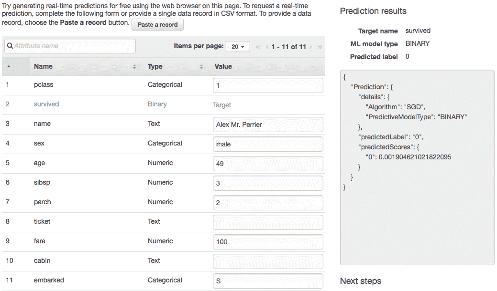

因此，通过逐个改变数据中的变量，我们可以更好地理解每个变量对结果的影响。

# 设置实时预测

为了演示实时预测，我们将使用来自 UCI 仓库的`Spam`数据集。这个数据集由 5,574 条标注为垃圾邮件或非垃圾邮件（非垃圾邮件）的短信组成。没有缺失值，只有两个变量：短信的性质（垃圾邮件或非垃圾邮件）和短信文本，没有其他内容。《Spam》数据集以原始形式可在[`archive.ics.uci.edu/ml/datasets/SMS+Spam+Collection`](https://archive.ics.uci.edu/ml/datasets/SMS+Spam+Collection)找到，并在本书的 GitHub 仓库[`github.com/alexperrier/packt-aml/tree/master/ch6`](https://github.com/alexperrier/packt-aml/tree/master/ch6)中提供。我们简单地将目标从分类值：`垃圾邮件`和`非垃圾邮件`转换为二进制值：1（代表垃圾邮件）和 0（代表非垃圾邮件），这样 Amazon ML 就能理解预测为二分类类型。

# AWS SDK

AWS 为其众多服务提供了几个 API 和 **软件开发工具包 (SDKs)**。您可以使用编程方式管理 S3 上的文件，设置 EC2 实例，并在 Amazon ML 上创建数据源、模型和评估，而无需使用基于网页的用户界面。AWS API 是低级端点。通常，使用 SDKs 更简单、更高效，SDKs 是 API 的包装器，并支持多种语言（Python、Ruby、Java、C++ 等）。在这本书中，我们将使用基于 `Boto3` 库的 Python SDK。我们将在第七章 Command Line and SDK 中详细探讨 Python SDK 的使用。现在，我们只将使用 `predict()` 方法，这是实时预测所必需的。但首先，我们需要通过在我们的本地机器上设置 AWS 凭据来启用对 AWS 的访问。

# 设置 AWS 凭据

为了以编程方式访问 AWS，我们首先需要通过命令行访问 AWS。这需要以下内容：

+   在 AWS IAM 为您的用户创建访问密钥

+   在本地安装 `AWS-CLI` 命令行界面

+   配置 `AWS-CLI` 使用 AWS 访问密钥

# AWS 访问密钥

如果您还记得第三章 Overview of an Amazon Machine Learning Workflow，我们为 `AML@Packt` 用户创建了访问密钥。访问密钥是基于用户的，由两部分组成：**访问密钥 ID**，它始终在 IAM 的用户安全凭证选项卡中可用，以及**秘密访问密钥**，仅在创建时显示。在创建这些访问密钥时，您有下载它们的机会。如果您当时没有这样做，现在可以为您的用户重新创建访问密钥。转到 IAM 控制台 [`console.aws.amazon.com/iam`](https://console.aws.amazon.com/iam)，点击您的用户配置文件，选择安全凭证选项卡，然后点击创建访问密钥按钮。这次请确保在您的本地机器上下载密钥或将它们复制到其他地方。请注意，每个用户最多只能有两套访问密钥。如果您已经有两个与您的用户关联的密钥，您必须删除现有的密钥才能创建新的密钥：

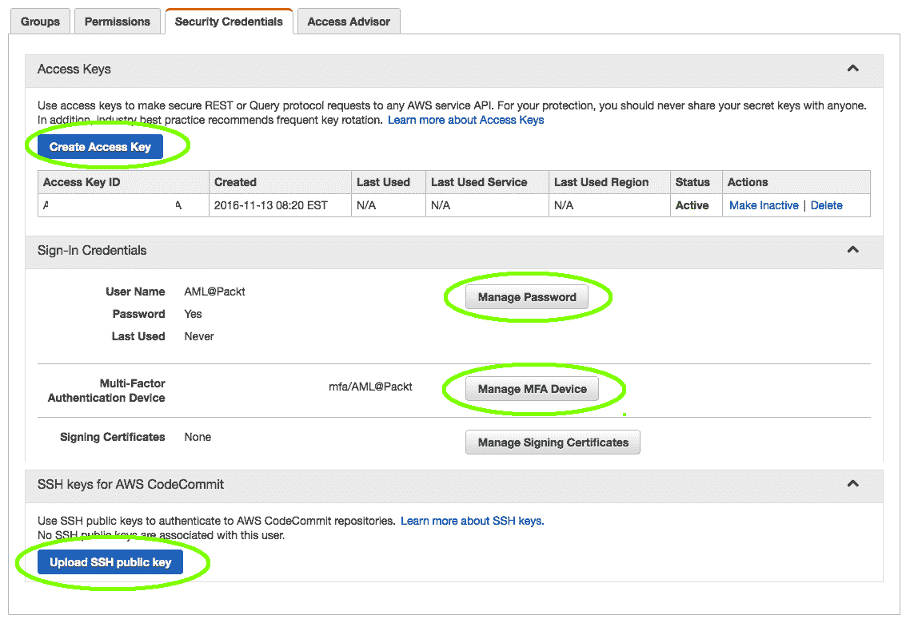

# 设置 AWS CLI

到目前为止，我们只使用过 AWS 网页界面，在 AWS 网站上逐页点击。另一种与 AWS 服务交互的方式是通过终端窗口中的命令行，使用 `aws cli` 库。CLI 代表命令行界面。

要安装 `aws cli` 库，打开一个终端窗口。对于基于 Python 的环境（Python 2 版本 2.6.5+ 或 Python 3 版本 3.3+），安装 `aws cli` 包括在终端中运行以下命令：

```py
pip install awscli

```

其他环境下的安装完整说明可在[`docs.aws.amazon.com/cli/latest/userguide/installing.html`](http://docs.aws.amazon.com/cli/latest/userguide/installing.html)找到。一旦 AWS-CLI 安装完成，运行以下命令来配置它：

```py
aws configure

```

您将被要求输入您的访问密钥、默认区域和格式。有关更深入的说明，请参阅[`docs.aws.amazon.com/cli/latest/userguide/cli-chap-getting-started.html#cli-quick-configuration`](http://docs.aws.amazon.com/cli/latest/userguide/cli-chap-getting-started.html#cli-quick-configuration)。

简而言之，AWS-CLI 命令遵循以下语法：

```py
aws {service name} {command} {parameters}

```

通过运行以下命令来测试您的设置：

```py
aws s3 ls aml.packt

```

您应该能看到您 s3 账户中的所有存储桶、文件夹和文件列表。以下是我列出`aml.packt`存储桶中的文件和文件夹时的输出：

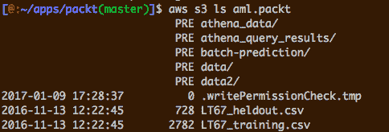

我们将在第七章[efe6f699-a4eb-4c88-8e81-1408d6c3c5c4.xhtml]，C*ommand Line and SDK*中详细探讨如何使用 CLI 运行您的 Amazon ML 项目。

# Python SDK

在本章中，我们将不再使用 AWS-CLI，而是切换到 Python SDK。我们需要为 AWS CLI 设置凭证，以便我们的 SDK 脚本能够访问我们的 AWS 账户。要使用 Python SDK，我们需要安装`Boto3`库，该库包含在 Anaconda 发行版中。如果您使用 Anaconda 作为 Python 环境，您应该已经安装了`boto3`包。如果没有，您可以使用以下命令使用`pip`安装它：

```py
pip install boto3

```

**Boto3**将使用我们为 AWS CLI 配置的凭证。无需进行特定设置。Boto3 适用于大多数 AWS 服务。完整文档可在[`boto3.readthedocs.io/`](https://boto3.readthedocs.io/)找到。我们最小化使用`Boto3`，只需指定我们想要使用的服务，即机器学习，然后使用`predict()`方法将适当的数据发送到模型。作为回报，我们获得所需的预测。以下 Python 代码初始化一个客户端以访问机器学习服务。

```py
import boto3
client = boto3.client('machinelearning')

```

`predict()`方法需要以下参数：

+   `MLModelId`: 您想要用于预测的模型的 ID

+   `PredictEndpoint`*:* 您模型对应的 Amazon ML 端点 URL

+   `Record`*:* 样本的 JSON 格式版本

`MLModelId`和`PredictEndpoint` URL 可以从模型摘要页面获取。`Record`是一个 JSON 格式的字符串。我们将通过打开保留的样本集，循环遍历每个样本，并通过`predict()`方法发送它来模拟一个流式应用程序。

我们将初始数据集分为一个包含 4,400 个样本的训练集和一个包含 1,174 个样本的保留集。这些子集可在 GitHub 仓库中找到。我们为训练子集创建一个数据源，并使用默认设置（轻微的 L2 正则化）创建一个模型及其评估。我们保留推断的架构（二进制和文本），建议的配方（除了对文本变量的标记化之外没有转换），并使用默认模型参数（10 次遍历和轻微的 L2 正则化）。训练数据集进一步由 Amazon ML 分割为较小的训练数据集和验证数据集，分别为初始*4,400*样本的 70%和 30%。在验证集上获得的 AUC 分数非常高，为*0.98*：

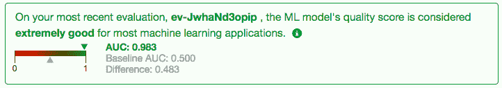

要获取`ModelID`和`endpoint` URL，请访问模型的摘要页面。从页面顶部复制`ModelID`。然后向下滚动到预测部分，点击创建`endpoint`按钮：

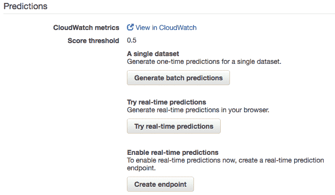

在这一点上，您将获得模型实时预测定价的估计，并要求确认创建`endpoint`。

您的模型大小为 502.1 KB。每当您的`endpoint`处于活动状态时，您将产生 0.001 美元的预留容量费用。实时预测的预测费用为每次预测 0.0001 美元，向上取整到最接近的美分**。**

几分钟后，`endpoint`将被创建，您将获得`endpoint` URL：

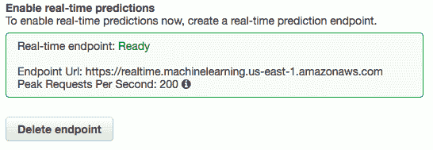

现在我们知道了`endpoint` URL，我们可以编写一个简单的 Python 代码，将短信消息、简单的文本发送到我们的预测模型，看看这条消息是否被预测为垃圾邮件或正常邮件。我们将文本`Hello world, my name is Alex`发送以分类为正常邮件，而文本`Call now to get dating contacts for free, no cash no credit card`可能因为包含`free`、`cash`、`dating`等词语而被检测为垃圾邮件。

代码的初始化/声明部分如下：

```py
import boto3
import json  # for parsing the returned predictions

# Initialize the client
client = boto3.client('machinelearning')

# The endpoint url is obtained from the model summary
endpoint_url = "https://realtime.machinelearning.us-east-1.amazonaws.com/"

# replace with your own model ID
model_id = "ml-kJmiRxxxxxx" 

# The actual sample to be predicted. JSON formatted
record = { "nature": "Hello world, my name is Alex" }

```

我们现在使用机器学习服务 SDK 的`predict()`函数：

```py
response = client.predict(    
   MLModelId         = model_id,
   Record               = record,
   PredictEndpoint = endpoint_url
)

```

最后，格式化打印响应：

```py
print(json.dumps(response, indent=4))

```

这返回以下 JSON 格式的字符串：

```py
{
   "ResponseMetadata": {
       "RetryAttempts": 0,
       "HTTPHeaders": {
           "content-type": "application/x-amz-json-1.1",
           "content-length": "143",
           "date": "Tue, 10 Jan 2017 16:20:49 GMT",
           "x-amzn-requestid": "bfab2af0-d750-11e6-b8c2-45ac3ab2f186"
       },
       "HTTPStatusCode": 200,
       "RequestId": "bfab2af0-d750-11e6-b8c2-45ac3ab2f186"
   },
   "Prediction": {
       "predictedScores": {
           "0": 0.001197131467051804
       },
       "predictedLabel": "0",
       "details": {
           "PredictiveModelType": "BINARY",
           "Algorithm": "SGD"
       }
   }
}

```

JSON 响应由两部分组成：第一部分与请求本身相关，`ResponseMetadata`，第二部分与`Prediction`相关。`ResponseMetadata`部分的`HTTPStatusCode`告诉我们我们的查询是成功的`("HTTPStatusCode": 200)`。

预测部分的解释很简单。短信被预测为垃圾邮件，概率极低，为 0.12%，因此被分类为正常邮件，这正是我们对文本`Hello world, my name is Alex`的预期。

我们预计文本`Call now to get dating contacts for free, no cash no credit card`将被分类为垃圾邮件，因为`free`、`call`和`dating`等词语通常是垃圾邮件的强烈指示。我们得到的以下结果：

```py
{    
    "predictedScores": { "1": 0.810875654220581 },
    "predictedLabel": "1",
}

```

文本被分类为垃圾邮件，这正是我们预期的。从这两个简单的例子来看，我们的模型似乎运行良好。一旦我们可以通过 API 调用逐个样本地获取预测，就可以将数据流连接到端点并获取实时预测。

为了模拟这个流程，我们可以使用 Python 读取整个新样本文件，将每个样本发送到模型，并捕获结果。让我们用保留的 Spam 样本集来做这件事。

以下 Python 代码读取文件，将其加载到 pandas 数据框中，并遍历数据框中的每一行。我们使用`iterrows()`遍历数据框中的每一行。这种方法比`itertuples()`慢，但代码可读性更好。以下代码没有经过优化：

```py
import boto3
import json
import pandas as pd

# Initialize the Service, the Model ID and the endpoint url
client = boto3.client('machinelearning')
# replace with your own endpoint url and model ID
endpoint_url = "https://realtime.machinelearning.us-east-1.amazonaws.com"
model_id = "ml-kJmiRHyn1UM"

# Memorize which class is spam and which is ham
spam_label = {'0': 'ham', '1':'spam'}

# Load the held out dataset into a panda DataFrame
df = pd.read_csv('held-out.csv')

# Loop over each DataFrame rows    
for index, row in df.iterrows():
   # The record
   record = { "body": row['sms'] }
   response = client.predict(    
       MLModelId       = model_id,
       Record          = record,
       PredictEndpoint = endpoint_url
   )

   # get the label and score from the response
   predicted_label = response['Prediction']['predictedLabel']
   predicted_score = response['Prediction']['predictedScores'][predicted_label]
   print("[%s] %s (%0.2f):t %s "% (spam_label[str(row['nature'])],
                               spam_label[predicted_label],
                               predicted_score,
                               row['sms'] )
   )

```

Amazon ML 的响应速度极快。数千个样本在几秒钟内被处理。以下是我们的结果摘要：

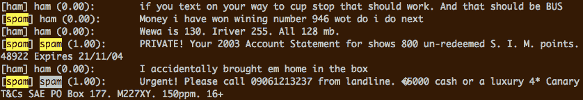

在这里，每一行格式如下：

```py
[Predicted class] trueLabel (spam probability):      SMS message  

```

注意，在检测到的三个垃圾短信中，只有两个实际上是垃圾短信。文本“*Money i have won wining number 946 wot do i do next*”可能因为包含“Money”或“wining”等词语而被检测为垃圾短信，但实际上是一条正常信息。

总体而言，在整个预测过程中，概率非常接近 0 或 1，这表明模型在分类上非常果断，没有犹豫。保留数据集的 ROC 曲线显示了高水平的确切性：

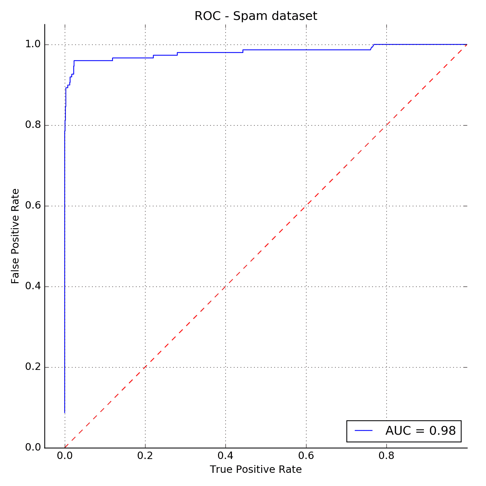

# 摘要

在本章中，我们探讨了 Amazon ML 工作流程的最后一步，即预测。Amazon ML 提供了几种方法将您的模型应用于新的数据集以进行预测。批处理模式涉及一次性将所有新数据提交给模型，并在 S3 上返回实际的预测 csv 文件。另一方面，实时预测是基于逐个发送样本到 API 并获取预测结果。我们探讨了如何在 Amazon ML 平台上创建 API。我们还开始使用命令行和 Python SDK 与 Amazon ML 服务交互——我们将在第七章“命令行和 SDK”中更深入地探讨这一点。

如前几章所述，Amazon ML 服务是围绕随机梯度下降（SGD）算法构建的。这个算法已经存在很多年了，被用于许多不同的领域和应用，从信号处理和自适应滤波到预测分析或深度学习。

在下一章中，我们将介绍算法及其一些版本，并揭示它在处理不同类型的数据和预测问题时的行为。我们将解释为什么在我们的情况下，通常被轻视的数值分位数装箱是性能和稳定性的提升者。
