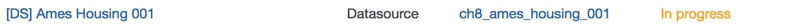
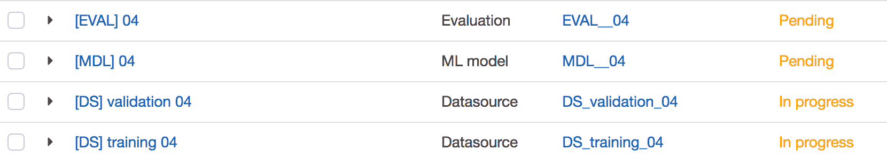

# 第七章：命令行和 SDK

使用 AWS 网页界面来管理和运行项目是耗时的。在本章中，我们将远离网页界面，开始通过命令行使用 **AWS 命令行界面**（**AWS CLI**）和 Python SDK 的 `Boto3` 库来运行我们的项目。

第一步将是通过 AWS CLI 驱动整个项目，包括上传文件到 S3、创建数据源、模型、评估和预测。正如您将看到的，脚本将极大地简化使用 Amazon ML。我们将利用这些新能力通过执行交叉验证和特征选择来扩展我们的数据科学能力。

到目前为止，我们已经将原始数据集分为三个数据块：训练、验证和测试。然而，我们已经看到模型选择可能强烈依赖于数据分割。打乱数据——可能不同的模型会被认为是最好的。交叉验证是一种通过平均模型在多个数据分割上的性能来减少这种依赖性的技术。交叉验证涉及创建许多用于训练、验证和测试的数据源，使用网页界面将会耗时。AWS CLI 将使我们能够快速创建新的数据源和模型，并有效地执行交叉验证。

数据科学中的另一个重要技术是特征消除。在数据集中拥有大量特征，无论是由于密集的特征工程结果还是因为它们存在于原始数据集中，都可能影响模型的表现。通过选择和保留最佳且最有意义的特征，同时拒绝不那么重要的特征，可以显著提高模型的预测能力。有许多特征选择方法。我们将实现一个简单而高效的方法，称为递归特征选择。通过 Boto3 库可访问的 AWS Python SDK 将使我们能够构建围绕 Amazon ML 的代码，以实现递归特征选择。

在本章中，您将学习以下内容：

+   如何通过 AWS 命令行和 AWS Python SDK 处理整个项目工作流程：

    +   管理数据上传到 S3

    +   创建和评估模型

    +   制作和导出预测

+   如何使用 AWS CLI 实现交叉验证

+   如何使用 AWS Python SDK 实现递归特征选择

# 开始使用和设置

从原始数据创建一个表现良好的预测模型需要许多尝试和错误，很多来回调整。创建新特征、清理数据以及尝试为模型设定新参数都是确保模型稳健性的必要步骤。在数据、模型和评估之间需要不断的来回调整。通过 AWS CLI 或 `Boto3` Python 库脚本化这个工作流程，将使我们能够加快创建、测试、选择的循环。

# 使用 CLI 与 SDK 的比较

AWS 提供了多种方式，除了 UI 之外，还可以与它的服务进行交互，包括 CLI、API 和多种语言的 SDK。尽管 AWS CLI 和 SDKs 并不包含所有 AWS 服务。例如，Athena SQL 是一项新服务，在撰写本文时，它尚未包含在 AWS CLI 模块或任何 AWS SDK 中。

AWS 命令行界面（CLI）是一个命令行外壳程序，允许您从您的 shell 终端管理您的 AWS 服务。一旦安装并设置了适当的权限，您就可以编写命令来管理您的 S3 文件、AWS EC2 实例、Amazon ML 模型以及大多数 AWS 服务。

一般而言，软件开发工具包（SDK），简称 SDK，是一组可用于开发针对特定平台的应用软件的工具。简而言之，SDK 是 API 的包装器。API 包含核心交互方法，而 SDK 包括调试支持、文档以及高级函数和方法。API 可以被视为 AWS 支持的最低公共基数，而 SDK 则是 API 的高级实现。

AWS SDKs 可用 12 种不同的语言，包括 PHP、Java、Ruby 和 .NET。在本章中，我们将使用 Python SDK。

使用 AWS CLI 或 SDK 需要设置我们的凭证，我们将在下一节中完成此操作。

# 安装 AWS CLI

为了设置您的 CLI 凭证，您需要您的访问密钥 ID 和您的秘密访问密钥。您很可能在之前的章节中下载并保存了它们。如果不是这样，您应该简单地从 **IAM** 控制台（[`console.aws.amazon.com/iam`](https://console.aws.amazon.com/iam)）创建新的凭证。

导航到“用户”，选择您的 IAM 用户名，然后点击“安全凭证”选项卡。选择创建访问密钥并下载 CSV 文件。将密钥存储在安全位置。我们将在几分钟内需要该密钥来设置 AWS CLI。但首先，我们需要安装 AWS CLI。

**Docker 环境** – 本教程将帮助您在 Docker 容器中使用 AWS CLI：[`blog.flowlog-stats.com/2016/05/03/aws-cli-in-a-docker-container/`](https://blog.flowlog-stats.com/2016/05/03/aws-cli-in-a-docker-container/)。运行 AWS CLI 的 Docker 镜像可在 [`hub.docker.com/r/fstab/aws-cli/`](https://hub.docker.com/r/fstab/aws-cli/) 找到。

没有必要重写 AWS CLI 的安装文档。它是完整且最新的，可在 [`docs.aws.amazon.com/cli/latest/userguide/installing.html`](http://docs.aws.amazon.com/cli/latest/userguide/installing.html) 找到。简而言之，安装 CLI 需要您已经安装了 Python 和 `pip`。

然后，运行以下命令：

```py
$ pip install --upgrade --user awscli

```

将 AWS 添加到您的 `$PATH`：

```py
$ export PATH=~/.local/bin:$PATH

```

重新加载 bash 配置文件（这是针对 OSX 的）：

```py
$ source ~/.bash_profile

```

请使用以下命令检查一切是否正常工作：

```py
$ aws --version

```

您应该会看到以下类似的输出：

```py
$ aws-cli/1.11.47 Python/3.5.2 Darwin/15.6.0 botocore/1.5.10

```

安装完成后，我们需要配置 AWS CLI 类型：

```py
$ aws configure

```

现在输入您刚刚创建的访问密钥：

```py
$ aws configure
 AWS Access Key ID [None]: ABCDEF_THISISANEXAMPLE
AWS Secret Access Key [None]: abcdefghijk_THISISANEXAMPLE
Default region name [None]: us-west-2
Default output format [None]: json

```

选择离您最近且您喜欢的格式（JSON、文本或表格）。默认格式是 JSON。

AWS configure 命令创建两个文件：一个`config`文件和一个凭证文件。在 OSX 上，这些文件是`~/.aws/config`和`~/.aws/credentials`。您可以直接编辑这些文件来更改您的访问或配置。如果您需要访问多个 AWS 账户，您需要创建不同的配置文件。您可以通过 AWS configure 命令这样做：

```py
$ aws configure --profile user2

```

您也可以直接在`config`和`credential`文件中这样做：

```py
~/.aws/config

[default]
output = json
region = us-east-1

[profile user2]
output = text
region = us-west-2

```

您可以按照以下方式编辑`Credential`文件：

```py
~/.aws/credentials

[default]
aws_secret_access_key = ABCDEF_THISISANEXAMPLE
aws_access_key_id = abcdefghijk_THISISANEXAMPLE

[user2]
aws_access_key_id = ABCDEF_ANOTHERKEY
aws_secret_access_key = abcdefghijk_ANOTHERKEY

```

请参阅 AWS CLI 设置页面以获取更深入的信息：

[`docs.aws.amazon.com/cli/latest/userguide/cli-chap-getting-started.html`](http://docs.aws.amazon.com/cli/latest/userguide/cli-chap-getting-started.html)

# 学习 CLI 语法

任何 AWS CLI 命令的整体格式如下：

```py
$ aws <service> [options] <command> <subcommand> [parameters]

```

这里术语如下所述：

+   `<service>`：您正在管理的服务的名称：S3、机器学习和 EC2

+   `[options]`：允许您设置区域、配置文件和命令的输出

+   `<command> <subcommand>`：这是您想要执行的真正命令

+   `[parameters]`：是这些命令的参数

一个简单的例子将帮助您更好地理解语法。要列出名为`aml.packt`*的 S3 存储桶的内容，命令如下：

```py
$ aws s3 ls aml.packt

```

在这里，`s3`是服务，`ls`是命令，`aml.packt`是参数。`aws help`命令将输出所有可用服务的列表。

要获取特定服务及其命令的帮助，请编写以下内容：

```py
$ aws <service> help

```

例如，`aws s3 help`将通知您，在单个对象上可用的`s3`命令有 ls、mv 和 rm，用于列出、移动和删除，并且基本的`aws s3`命令遵循以下格式：

```py
$ aws s3 <command> sourceURI destinationURI  [parameters]

```

在这里，`sourceURI`或`destinationURI`可以是您本地机器上的文件（或多个文件）和 S3 上的文件，也可以是 S3 上的两个文件。以下是一个例子：

```py
$ aws s3 cp /tmp/foo/ s3://The_Bucket/ --recursive --exclude "*" --include "*.jpg"

```

这将复制您本地机器上`/tmp/foo`文件夹中的所有（多亏了参数——递归）JPG 文件（仅`*.jpg`文件）到名为`The_Bucket`的 S3 存储桶。

AWS 文档中有更多示例和解释，可在以下链接找到：

[`docs.aws.amazon.com/cli/latest/userguide/cli-chap-using.html`](http://docs.aws.amazon.com/cli/latest/userguide/cli-chap-using.html)。

# 使用 JSON 文件传递参数

对于某些服务和命令，参数列表可能会变得很长，难以检查和维护。

例如，要通过命令行界面（CLI）创建一个 Amazon ML 模型，您至少需要指定七个不同的元素：模型 ID、名称、类型、模型的参数、训练数据源的 ID 以及食谱名称和 URI（`aws machinelearning create-ml-model help`）。

在可能的情况下，我们将使用 CLI 功能从 JSON 文件中读取参数，而不是在命令行中指定它们。AWS CLI 还提供了一种生成 JSON 模板的方法，您可以使用正确的参数使用该模板。要生成该 JSON 参数文件模型（JSON 框架），只需在命令名称后添加 `--generate-cli-skeleton`。例如，要生成机器学习服务创建模型命令的 JSON 框架，请编写以下内容：

```py
$ aws machinelearning create-ml-model --generate-cli-skeleton

```

这将产生以下输出：

```py
{
   "MLModelId": "",
   "MLModelName": "",
   "MLModelType": "",
   "Parameters": {
       "KeyName": ""
   },
   "TrainingDataSourceId": "",
   "Recipe": "",
   "RecipeUri": ""
}

```

您可以根据自己的喜好进行配置。

要使骨架命令生成 JSON 文件而不是在终端中简单地输出骨架，请添加 `> filename.json`：

```py
$ aws machinelearning create-ml-model --generate-cli-skeleton > filename.json

```

这将创建一个包含 JSON 模板的 `filename.json` 文件。一旦指定了所有必需的参数，您就可以使用以下命令创建模型（假设 `filename.json` 在当前文件夹中）：

```py
$ aws machinelearning create-ml-model file://filename.json

```

在我们进一步通过 CLI 深入探讨机器学习工作流程之前，我们需要介绍本章将使用的数据集。

# 介绍 `Ames Housing` 数据集

在本章中，我们将使用由 *迪安·德·科克* 编制的 `Ames Housing` 数据集，用于数据科学教育。它是流行的但较旧的 `Boston Housing` 数据集的一个很好的替代品。`Ames Housing` 数据集在 Kaggle 网站的“高级回归技术”挑战赛中被使用：[`www.kaggle.com/c/house-prices-advanced-regression-techniques/`](https://www.kaggle.com/c/house-prices-advanced-regression-techniques/)。数据集的原始版本可在：[`www.amstat.org/publications/jse/v19n3/decock/AmesHousing.xls`](http://www.amstat.org/publications/jse/v19n3/decock/AmesHousing.xls) 和本章的 GitHub 仓库中找到。

`Ames Housing` 数据集包含 79 个解释变量，描述了爱荷华州艾姆斯市住宅的各个方面（几乎涵盖所有方面），目的是预测每套住宅的售价。该数据集有 2930 行。变量数量众多，使该数据集成为特征选择的良好候选。

关于该数据集的起源以及不同变量的深入解释，请阅读由 *迪安·德·科克* 撰写的论文，该论文可在 PDF 格式下在 [`ww2.amstat.org/publications/jse/v19n3/decock.pdf`](https://ww2.amstat.org/publications/jse/v19n3/decock.pdf) 获取。

如同往常，我们将首先将数据集分割成训练集和验证集，并在训练集上构建模型。训练集和验证集都可在 GitHub 仓库中找到，分别命名为 `ames_housing_training.csv` 和 `ames_housing_validate.csv`。整个数据集位于 `ames_housing.csv` 文件中。

# 使用 shell 命令分割数据集

命令行是数据科学家经常忘记但非常强大的盟友。许多非常强大的数据处理操作可以通过正确的 shell 命令实现，并且执行速度极快。为了说明这一点，我们将使用 shell 命令来打乱、分割，并创建`Ames Housing`数据集的训练和验证子集：

1.  首先，将第一行提取到单独的文件`ames_housing_header.csv`中，并从原始文件中删除：

```py
 $ head -n 1 ames_housing.csv > ames_housing_header.csv

```

1.  我们只需将第一行之后的全部行尾接到同一个文件中：

```py
 $ tail -n +2 ames_housing.csv > ames_housing_nohead.csv

```

1.  然后将行随机排序到一个临时文件中。（`gshuf`是 OSX 中 Linux **shuf shell**命令的等价物。可以通过`brew install coreutils`安装。）

```py
 $ gshuf ames_housing_nohead.csv -o ames_housing_nohead.csv

```

1.  提取前 2,050 行作为训练文件，最后 880 行作为验证文件：

```py
 $ head -n 2050 ames_housing_nohead.csv > ames_housing_training.csv
 $ tail -n 880 ames_housing_nohead.csv > ames_housing_validate.csv

```

1.  最后，将标题添加回训练和验证文件中：

```py
 $ cat ames_housing_header.csv ames_housing_training.csv > tmp.csv 
        $ mv tmp.csv ames_housing_training.csv

 $ cat ames_housing_header.csv ames_housing_validate.csv > tmp.csv
        $ mv tmp.csv ames_housing_validate.csv

```

# 使用 CLI 的一个简单项目

我们现在准备好使用 CLI 执行一个简单的 Amazon ML 工作流程。这包括以下内容：

+   在 S3 上上传文件

+   创建数据源和配方

+   创建模型

+   创建评估

+   预测批量和实时

让我们从上传训练和验证文件到 S3 开始。在以下行中，将存储桶名称`aml.packt`替换为您自己的存储桶名称。

要将文件上传到 S3 位置`s3://aml.packt/data/ch8/`，运行以下命令行：

```py
$ aws s3 cp ./ames_housing_training.csv s3://aml.packt/data/ch8/
upload: ./ames_housing_training.csv to s3://aml.packt/data/ch8/ames_housing_training.csv

$ aws s3 cp ./ames_housing_validate.csv s3://aml.packt/data/ch8/
upload: ./ames_housing_validate.csv to s3://aml.packt/data/ch8/ames_housing_validate.csv

```

# Amazon ML CLI 命令概述

S3 部分到此结束。现在让我们探索 Amazon 机器学习服务的 CLI。

所有 Amazon ML CLI 命令均可在[`docs.aws.amazon.com/cli/latest/reference/machinelearning/`](http://docs.aws.amazon.com/cli/latest/reference/machinelearning/)找到。共有 30 个命令，可以根据对象和动作进行分组。

您可以执行以下操作：

+   `create` : 创建对象

+   `describe`: 根据某些参数（位置、日期、名称等）搜索对象

+   `get`: 给定一个对象 ID，返回信息

+   `update`: 给定一个对象 ID，更新对象

+   `delete`: 删除一个对象

这些可以在以下元素上执行：

+   datasource

    +   `create-data-source-from-rds`

    +   `create-data-source-from-redshift`

    +   `create-data-source-from-s3`

    +   `describe-data-sources`

    +   `delete-data-source`

    +   `get-data-source`

    +   `update-data-source`

+   ml-model

    +   `create-ml-model`

    +   `describe-ml-models`

    +   `get-ml-model`

    +   `delete-ml-model`

    +   `update-ml-model`

+   评估

    +   `create-evaluation`

    +   `describe-evaluations`

    +   `get-evaluation`

    +   `delete-evaluation`

    +   `update-evaluation`

+   批量预测

    +   `create-batch-prediction`

    +   `describe-batch-predictions`

    +   `get-batch-prediction`

    +   `delete-batch-prediction`

    +   `update-batch-prediction`

+   实时端点

    +   `create-realtime-endpoint`

    +   `delete-realtime-endpoint`

    +   `predict`

您还可以处理标签并设置等待时间。

注意，AWS CLI 允许您从 S3、Redshift 和 RDS 创建数据源，而 Web 界面只允许从 S3 和 Redshift 创建数据源。

# 创建数据源

我们将首先创建数据源。让我们首先通过生成以下骨架来查看需要哪些参数：

```py
$ aws machinelearning create-data-source-from-s3 --generate-cli-skeleton

```

这生成了以下 JSON 对象：

```py
{
   "DataSourceId": "",
   "DataSourceName": "",
   "DataSpec": {
       "DataLocationS3": "",
       "DataRearrangement": "",
       "DataSchema": "",
       "DataSchemaLocationS3": ""
   },
   "ComputeStatistics": true
}

```

不同的参数大多一目了然，更多详细信息可以在 AWS 文档中找到，链接为[`docs.aws.amazon.com/cli/latest/reference/machinelearning/create-data-source-from-s3.html`](http://docs.aws.amazon.com/cli/latest/reference/machinelearning/create-data-source-from-s3.html)。

关于模式的话：当从 Web 界面创建数据源时，您有使用向导的可能性，以指导您创建模式。如您所回忆的，您将通过几个屏幕进行指导，在这些屏幕上您可以指定所有列的类型，以及目标变量和索引列的存在。向导通过猜测变量的类型来简化过程，从而提供一个默认的模式，您可以对其进行修改。

通过 AWS CLI 没有默认的模式可用。您必须自己定义整个模式，无论是在`DataSchema`字段中的 JSON 格式，还是在`DataSchemaLocationS3`字段中上传一个模式文件并指定其位置。

由于我们的数据集包含许多变量（79 个），我们采取了捷径，使用向导创建了一个默认的模式，并将其上传到 S3。在整个章节的其余部分，我们将指定模式位置而不是其 JSON 定义。

在本例中，我们将创建以下数据源参数文件，`dsrc_ames_housing_001.json`：

```py
{
   "DataSourceId": "ch8_ames_housing_001",
   "DataSourceName": "[DS] Ames Housing 001",
   "DataSpec": {
       "DataLocationS3": 
         "s3://aml.packt/data/ch8/ames_housing_training.csv",
       "DataSchemaLocationS3": 
         "s3://aml.packt/data/ch8/ames_housing.csv.schema"        
   },
   "ComputeStatistics": true
}

```

对于验证子集（保存为`dsrc_ames_housing_002.json`）：

```py
{
   "DataSourceId": "ch8_ames_housing_002",
   "DataSourceName": "[DS] Ames Housing 002",
   "DataSpec": {
       "DataLocationS3": 
         "s3://aml.packt/data/ch8/ames_housing_validate.csv",
       "DataSchemaLocationS3": 
         "s3://aml.packt/data/ch8/ames_housing.csv.schema"        
   },
   "ComputeStatistics": true
}

```

由于我们已经将数据分为训练集和验证集，因此无需指定数据`DataRearrangement`字段。

或者，我们也可以避免分割数据集，并在原始数据集上指定以下`DataRearrangement`，假设它已经被洗牌了：（保存为`dsrc_ames_housing_003.json`）：

```py
{
   "DataSourceId": "ch8_ames_housing_003",
   "DataSourceName": "[DS] Ames Housing training 003",
   "DataSpec": {
       "DataLocationS3": 
         "s3://aml.packt/data/ch8/ames_housing_shuffled.csv",
       "DataRearrangement": 
         "{"splitting":{"percentBegin":0,"percentEnd":70}}",
       "DataSchemaLocationS3":
         "s3://aml.packt/data/ch8/ames_housing.csv.schema"        
   },
   "ComputeStatistics": true
}

```

对于验证集（保存为`dsrc_ames_housing_004.json`）：

```py
{
   "DataSourceId": "ch8_ames_housing_004",
   "DataSourceName": "[DS] Ames Housing validation 004",
   "DataSpec": {
       "DataLocationS3":
         "s3://aml.packt/data/ch8/ames_housing_shuffled.csv",
       "DataRearrangement": 
         "{"splitting":{"percentBegin":70,"percentEnd":100}}",
   },
   "ComputeStatistics": true
}

```

在这里，`ames_housing.csv`文件之前已经使用`gshuf`命令行进行了洗牌，并上传到了 S3：

```py
$ gshuf ames_housing_nohead.csv -o ames_housing_nohead.csv
$ cat ames_housing_header.csv ames_housing_nohead.csv > tmp.csv
$ mv tmp.csv ames_housing_shuffled.csv
$ aws s3 cp ./ames_housing_shuffled.csv s3://aml.packt/data/ch8/

```

注意，我们不需要创建这四个数据源；这些只是创建数据源的替代方法示例。

我们然后通过运行以下命令创建这些数据源：

```py
$ aws machinelearning create-data-source-from-s3 --cli-input-json file://dsrc_ames_housing_001.json

```

我们可以检查数据源创建是否挂起：



作为回报，我们得到了之前指定的数据源 ID：

```py
{
   "DataSourceId": "ch8_ames_housing_001"
}

```

我们可以使用以下方式获取该数据源的信息：

```py
$ aws machinelearning  get-data-source --data-source-id ch8_ames_housing_001

```

这返回以下内容：

```py
{
   "Status": "COMPLETED",
   "NumberOfFiles": 1,
   "CreatedByIamUser": "arn:aws:iam::178277xxxxxxx:user/alexperrier",
   "LastUpdatedAt": 1486834110.483,
   "DataLocationS3": "s3://aml.packt/data/ch8/ames_housing_training.csv",
   "ComputeStatistics": true,
   "StartedAt": 1486833867.707,
   "LogUri": "https://eml-prod-emr.s3.amazonaws.com/178277513911-ds-ch8_ames_housing_001/.....",
   "DataSourceId": "ch8_ames_housing_001",
   "CreatedAt": 1486030865.965,
   "ComputeTime": 880000,
   "DataSizeInBytes": 648150,
   "FinishedAt": 1486834110.483,
   "Name": "[DS] Ames Housing 001"
}

```

注意，我们有访问操作日志 URI 的权限，这可能在稍后分析模型训练时很有用。

# 创建模型

使用`create-ml-model`命令创建模型遵循相同的步骤：

1.  使用以下步骤生成骨架：

```py
        $ aws machinelearning create-ml-model --generate-cli-skeleton > 
        mdl_ames_housing_001.json

```

1.  编写配置文件：

```py
        {
            "MLModelId": "ch8_ames_housing_001",
            "MLModelName": "[MDL] Ames Housing 001",
            "MLModelType": "REGRESSION",
            "Parameters": {
                "sgd.shuffleType": "auto",
                "sgd.l2RegularizationAmount": "1.0E-06",
                "sgd.maxPasses": "100"
            },
            "TrainingDataSourceId": "ch8_ames_housing_001",
            "RecipeUri": "s3://aml.packt/data/ch8
              /recipe_ames_housing_001.json"
        }

```

注意算法的参数。在这里，我们使用了温和的 L2 正则化和 100 次迭代。

1.  使用以下步骤启动模型创建：

```py
        $ aws machinelearning create-ml-model --cli-input-json 
        file://mdl_ames_housing_001.json

```

1.  返回模型 ID：

```py
        {
            "MLModelId": "ch8_ames_housing_001"
        }

```

1.  这个 `get-ml-model` 命令会给你操作的状态更新以及日志的 URL。

```py
        $ aws machinelearning get-ml-model --ml-model-id 
        ch8_ames_housing_001

```

1.  `watch` 命令允许你每 *n* 秒重复一次 shell 命令。要每 *10s* 获取模型创建的状态，只需写下以下命令：

```py
        $ watch -n 10 aws machinelearning get-ml-model --ml-model-id 
        ch8_ames_housing_001

```

`get-ml-model` 的输出将每 10 秒刷新一次，直到你将其终止。

通过 AWS CLI 命令无法创建默认的食谱。你总是可以定义一个空白食谱，该食谱不会对数据进行任何转换。然而，默认食谱已被证明对模型性能有积极影响。为了获得此默认食谱，我们通过 Web 界面创建它，将其复制到一个我们上传到 S3 的文件中。生成的文件 `recipe_ames_housing_001.json` 可在我们的 GitHub 仓库中找到。由于数据集有 79 个变量，其内容相当长，这里为了简洁起见没有展示。

# 使用 `create-evaluation` 评估我们的模型

我们现在的模型已经训练好了，我们想在评估子集上评估它。为此，我们将使用 `create-evaluation` CLI 命令：

1.  生成骨架：

```py
        $ aws machinelearning create-evaluation --generate-cli-skeleton >  
        eval_ames_housing_001.json

```

1.  配置参数文件：

```py
        {
            "EvaluationId": "ch8_ames_housing_001",
            "EvaluationName": "[EVL] Ames Housing 001",
            "MLModelId": "ch8_ames_housing_001",
            "EvaluationDataSourceId": "ch8_ames_housing_002"
        }

```

1.  启动评估创建：

```py
        $ aws machinelearning create-evaluation --cli-input-json 
        file://eval_ames_housing_001.json

```

1.  获取评估信息：

```py
        $ aws machinelearning get-evaluation --evaluation-id 
        ch8_ames_housing_001

```

1.  从那个输出中，我们以 RMSE 的形式获得了模型的性能：

```py
        "PerformanceMetrics": {
            "Properties": {
                 "RegressionRMSE": "29853.250469108018"
            }
        }

```

这个值可能看起来很大，但它相对于房屋的 `salePrice` 变量的范围是相对的，该变量的均值为 181300.0，标准差为 79886.7。因此，RMSE 为 29853.2 是一个不错的分数。

你不必等待数据源创建完成就可以启动模型训练。Amazon ML 将简单地等待父操作完成后再启动依赖的操作。这使得操作链式执行成为可能。

下一步将是进行批量预测或创建实时端点。这些将遵循与模型创建和评估完全相同的步骤，这里没有展示。

到目前为止，我们有一个训练和评估好的模型。我们选择了一组特定的参数，并通过默认的食谱对数据进行了一定的预处理。我们现在想知道是否可以通过尝试新的算法参数和进行一些创造性的特征工程来改进该模型和特征集。然后我们将训练新的模型并在验证子集上评估它们。正如我们之前看到的，这种方法的问题在于我们的评估分数可能高度依赖于评估子集。通过打乱数据来生成新的训练和验证集可能会导致不同的模型性能，并使我们选择错误的模型。尽管我们已经打乱了数据以避免顺序模式，但我们无法确保我们的分割是真正中立的，并且两个子集显示出相似的数据分布。其中一个子集可能呈现异常，如异常值或缺失数据，而另一个子集没有。为了解决这个问题，我们转向交叉验证。

# 什么是交叉验证？

为了降低对每个分割中数据分布的依赖，想法是并行运行许多试验，每个试验都有不同的数据分割，并平均结果。这被称为交叉验证。

简单来说，就是将模型性能在 K 次试验中平均，其中每次试验都是基于原始数据集的不同分割。有许多分割数据集的策略。最常见的一种称为 **k 折交叉验证**，它包括将数据集分割成 **K 个块**，并在每个试验中使用 *K-1* 个块来聚合训练模型，剩余的块来评估它。另一种策略，称为 **留一法**（**LOO**），是将这个想法推向极端，其中 *K* 是样本数量。你将在所有样本中除了一个之外训练你的模型，并在剩余的样本上估计误差。LOO 显然更耗费资源。

我们将实施的策略称为 **蒙特卡洛交叉验证**，其中在每次试验中，初始数据集被随机分割成训练集和验证集。这种方法相对于 k 折交叉验证的优势在于，训练/验证分割的比例不依赖于迭代次数（*K*）。它的缺点是，一些样本可能永远不会被选入验证子集，而另一些样本可能被选中多次。验证子集可能重叠。

让我们来看一个 `k =5` 次试验的例子。我们将重复这些步骤五次来评估一个模型（例如，L2 轻度正则化）：

1.  打乱 Ames 住房数据集。

1.  将数据集分为训练集和验证集。

1.  在训练集上训练模型。

1.  在验证集上评估模型。

到目前为止，我们有五个衡量模型性能的指标；我们将它们平均以获得整体模型性能的衡量标准。我们重复上述五个步骤来评估另一个模型（例如，L1 中等正则化）。一旦我们测试了所有模型，我们将选择在试验中给出最佳平均性能的模型。

这就是为什么脚本变得必要。为了测试一个模型设置，进行带有 *K trials*（K 折或蒙特卡洛）的交叉验证需要 `2*K` 数据源，K 个模型和 K 个评估。如果仅通过网络界面完成，这肯定会非常耗时。这就是为什么整个过程的脚本化变得极其有用且效率更高。

实际上创建不同子集文件进行交叉验证的方法有很多。最简单的方法可能是使用带有随机排序的电子表格编辑器，并进行一些剪切和粘贴操作。R 和 Python 库，如流行的 `scikit-learn` 库或 Caret 包，提供了丰富的开箱即用的方法。然而，由于本章是关于 AWS 命令行界面，我们将使用 shell 命令来生成文件。我们还将编写 shell 脚本来生成 AWS CLI 命令的序列，以避免手动编辑不同数据文件和模型的相同命令。

# 实施蒙特卡洛交叉验证

我们现在将使用 shell 命令和 AWS CLI 实施一个包含五个试验的蒙特卡洛交叉验证策略。我们将使用这种评估方法来比较两个模型，一个在 Ames Housing 数据集上具有 L2 轻度正则化，另一个具有 L1 重度正则化。交叉验证将使我们能够以一定程度的信心得出哪个模型表现更好的结论。

# 生成打乱的数据集

我们将使用数据源创建的 `DataRearrangement` 字段来将数据分成训练集和验证集。因此，最初我们只需要创建五个打乱顺序的数据文件。

以下 shell 脚本将创建五个 `Ames Housing` 数据集的打乱版本，并将文件上传到 S3。您可以将该代码保存为具有 `.sh` 扩展名的文件（`datasets_creation.sh`），或者通过 `sh ./datasets_creation.sh` 运行它：

```py
#!/bin/bash
for k in 1 2 3 4 5 
do
    filename="data/ames_housing_shuffled_$k.csv"
    gshuf data/ames_housing_nohead.csv -o data/ames_housing_nohead.csv
    cat data/ames_housing_header.csv data/ames_housing_nohead.csv > tmp.csv;
    mv tmp.csv $filename
    aws s3 cp ./$filename s3://aml.packt/data/ch8/
done

```

注意，在本章中，代码是围绕以下文件夹结构组织的。所有命令行都是从根目录运行的，例如，运行一个 Python 脚本：`python py/the_script.py`，列出数据文件 `ls data/`，以及运行 shell 脚本：`sh ./shell/the_script.sh`。

`.`

`├── data`

`├── images`

`├── py`

`└── shell` 所有 shell 脚本和命令都是基于 bash shell 的，可能需要适应其他 shell，如 zsh。

我们的数据集已经创建并上传到 S3。现在的总体策略是为 Amazon ML CLI 命令所需的每个参数 JSON 文件创建模板：创建数据源、模型和评估。我们将为以下内容创建模板文件：

+   训练数据源

+   评估数据源

+   L2 模型

+   L1 模型

+   L2 评估

+   L1 评估

在所有这些模板文件中，我们将使用 `{k}` 来索引文件名，并使用 `sed` 命令行工具将 `{k}` 替换为适当的索引（1 到 5）。一旦我们有了模板文件，我们就可以使用一个简单的 shell 脚本来生成数据源、模型和评估的实际 JSON 参数文件。最终我们将得到以下内容：

+   10 个数据源配置文件（五个用于训练，五个用于评估）

+   10 个模型配置文件（五个用于 L2，五个用于 L1）

+   10 个评估配置文件（每个模型一个）

最后，我们将获得 L2 模型的五个 RMSE 结果和 L1 模型的五个 RMSE 结果，它们的平均值将告诉我们哪个模型是最好的，应该选择哪种正则化类型来在 Ames 住房数据集上预测销售价格。

让我们从编写配置文件开始。

# 生成数据源模板

训练文件模板如下：

```py
{
   "DataSourceId": "CH8_AH_training_00{k}",
   "DataSourceName": "[DS AH] training 00{k}",
   "DataSpec": {
       "DataLocationS3": "s3://aml.packt/data/ch8/shuffled_{k}.csv",
       "DataSchemaLocationS3":"s3://aml.packt/data/ch8
        /ames_housing.csv.schema",
       "DataRearrangement": "{"splitting":
       {"percentBegin":0,"percentEnd":70}}"
   },
   "ComputeStatistics": true
}

```

验证数据源模板如下：

```py
{
   "DataSourceId": "CH8_AH_evaluate_00{k}",
   "DataSourceName": "[DS AH] evaluate 00{k}",
   "DataSpec": {
       "DataLocationS3": "s3://aml.packt/data/ch8/shuffled_{k}.csv",
       "DataSchemaLocationS3":"s3://aml.packt/data/ch8
       /ames_housing.csv.schema",
       "DataRearrangement": "{"splitting":
       {"percentBegin":70,"percentEnd":100}}"
   },
   "ComputeStatistics": true
}

```

训练和验证模板之间的唯一区别是`DataRearrangement`字段中的名称/ID 和分割比率。我们将这些文件分别保存到`dsrc_training_template.json`和`dsrc_validate_template.json`。

# 生成模型模板

对于具有 L2 正则化的模型，模型模板如下：

```py
{
   "MLModelId": "CH8_AH_L2_00{k}",
   "MLModelName": "[MDL AH L2] 00{k}",
   "MLModelType": "REGRESSION",
   "Parameters": {
       "sgd.shuffleType": "auto",
       "sgd.l1RegularizationAmount": "0.0",
       "sgd.l2RegularizationAmount": "1.0E-06",
       "sgd.maxPasses": "100"
   },
   "TrainingDataSourceId": "CH8_AH_training_00{k}",
   "RecipeUri": "s3://aml.packt/data/ch8/recipe_ames_housing_001.json"
}

```

对于具有 L1 正则化的模型，模型模板如下：

```py
{
   "MLModelId": "CH8_AH_L1_00{k}",
   "MLModelName": "[MDL AH L1] 00{k}",
   "MLModelType": "REGRESSION",
   "Parameters": {
       "sgd.shuffleType": "auto",
       "sgd.l1RegularizationAmount": "1.0E-04",
       "sgd.l2RegularizationAmount": "0.0",
       "sgd.maxPasses": "100"
   },
   "TrainingDataSourceId": "CH8_AH_training_00{k}",
   "RecipeUri": "s3://aml.packt/data/ch8/recipe_ames_housing_001.json"
}

```

注意，相同的配方用于两个模型。如果我们想比较数据预处理策略的性能，我们可以修改两个模型中使用的配方。模板文件非常相似。唯一的不同在于模型名称和 ID 以及`l1RegularizationAmount`和`l2RegularizationAmount`的值。我们将这些文件分别保存到`mdl_l2_template.json`和`mdl_l1_template.json`****。**

# 生成评估模板

对于具有 L2 正则化的模型，评估模板如下：

```py
{
   "EvaluationId": "CH8_AH_L2_00{k}",
   "EvaluationName": "[EVL AH L2] 00{k}",
   "MLModelId": "CH8_AH_L2_00{k}",
   "EvaluationDataSourceId": "CH8_AH_evaluate_00{k}"
}

```

对于具有 L1 正则化的模型，评估模板如下：

```py
{
   "EvaluationId": "CH8_AH_L1_00{k}",
   "EvaluationName": "[EVL AH L1] 00{k}",
   "MLModelId": "CH8_AH_L1_00{k}",
   "EvaluationDataSourceId": "CH8_AH_evaluate_00{k}"
}

```

将这些文件保存到`eval_l2_template.json`和`eval_l1_template.json`分别。

我们现在将使用这些模板文件来生成数据源、模型和评估的不同配置文件。为了保持独立，所有生成的文件都在子文件夹`cfg/`中。

下面的 shell 脚本生成了我们将要提供给 AWS CLI 机器学习命令的实际配置文件。它使用`sed`命令查找并替换`{k}`实例为 1 到 5 的数字。输出被写入配置文件。由于将生成许多配置文件，这些文件被写入`/data`下的`/cfg`子文件夹中。现在的文件夹结构如下：

```py
.
├── data
│   └── cfg
│   └── templates
├── images
├── py
└── shell

#!/bin/bash

for k in 1 2 3 4 5 
do
    # training datasource
    sed 's/{k}/1/g' data/templates/dsrc_training_template.json > data/cfg
    /dsrc_training_00$k.json

    # evaluation datasource
    sed 's/{k}/1/g' data/templates/dsrc_validate_template.json > data/cfg
    /dsrc_validate_00$k.json

    # L2 model
    sed 's/{k}/1/g' data/templates/mdl_l2_template.json > data/cfg
    /mdl_l2_00$k.json

    # L2 evaluation
    sed 's/{k}/1/g' data/templates/eval_l2_template.json > data/cfg
    /eval_l2_00$k.json

    # L1 model
    sed 's/{k}/1/g' data/templates/mdl_l1_template.json > data/cfg
    /mdl_l1_00$k.json

    # L1 evaluation
    sed 's/{k}/1/g' data/templates/eval_l1_template.json > data/cfg
    /eval_l1_00$k.json

done

```

最后一个剩余步骤是执行 AWS 命令，这些命令将在 Amazon ML 中创建对象。我们同样使用 shell 循环来执行 AWS CLI 命令。

创建用于训练和评估的数据源：

```py
#!/bin/bash
for k in 1 2 3 4 5 
do
    aws machinelearning create-data-source-from-s3 --cli-input-json 
    file://data/cfg/dsrc_kfold_training_00$k.json
    aws machinelearning create-data-source-from-s3 --cli-input-json 
    file://data/cfg/dsrc_kfold_validate_00$k.json
done

```

使用 L2 和 L1 正则化训练模型：

```py
#!/bin/bash
for k in 1 2 3 4 5 
    aws machinelearning create-ml-model --cli-input-json file://data
    /cfg/mdl_l2_00$k.json
    aws machinelearning create-ml-model --cli-input-json file://data
    /cfg/mdl_l1_00$k.json
done

```

评估训练模型：

```py
#!/bin/bash
for k in 1 2 3 4 5 
    aws machinelearning create-evaluation --cli-input-json file://cfg
    /eval_l2_00$k.json
    aws machinelearning create-evaluation --cli-input-json file://cfg
    /eval_l1_00$k.json
done

```

您可以使用`get-data-source`、`get-ml-model`和`get-evaluation`CLI 命令或在美国机器学习仪表板上检查不同作业的状态。一旦所有评估完成，您首先创建几个文件来接收 RMSE 分数，然后运行以下最终 shell 循环：

```py
#!/bin/bash
for k in 1 2 3 4 5 
    aws machinelearning get-evaluation --evaluation-id CH8_AH_L2_00$k | 
    grep RegressionRMSE >> l2_model_rmse.log
    aws machinelearning get-evaluation --evaluation-id CH8_AH_L1_00$k |
    grep RegressionRMSE >> l1_model_rmse.log
done

```

给定评估的 ID，`get-evaluation` 命令返回一个 JSON 格式的字符串，该字符串被传递给 grep 命令并添加到 `l1/l2_model_rmse.log` 文件中。

# 结果

我们得到了两个模型以下的结果：

```py
l1 | 26570.0 | 28880.4 | 27287.8 | 29815.7 | 27822.0]

L2 | 36670.9 | 25804.3 | 28127.2 | 30539.0 | 24740.4

```

平均而言，L1 给出 RMSE 为 28075.2（标准差：1151），而 L2 给出 RMSE 为 29176.4（标准差：4246.7）。L1 模型不仅性能更好，而且在处理数据变化时也更为稳健，因为其标准差较低。

# 结论

仅通过 shell 实现交叉验证可能过于耗时。需要创建和协调许多文件。使用 `scikit-learn`（Python 的库）或 Caret（R 的库）等库实现交叉验证有更简单的方法，其中整个模型训练和评估循环只需几行代码即可覆盖多个训练和验证集。然而，我们展示了使用 Amazon ML 实现交叉验证是可能的。交叉验证是数据科学工作流程的关键组成部分。如果不能使用 Amazon ML 进行交叉验证，这将是在服务中的一个重大缺陷。最终，AWS CLI 对于机器学习是一个非常强大且有用的工具，可以执行一系列试验并比较不同模型、数据集、食谱和特征的结果。

# Boto3，Python SDK

另一个在网页界面之外与 Amazon ML 服务交互的工具是 SDK。简单来说，SDK 是 API 的包装器，它使得与服务交互变得更加简单和高效，因为许多交互的细节都得到了处理。AWS 为最广泛使用的语言提供了 SDK，如 PHP、Java、Ruby、.Net，当然还有 Python。在本章中，我们将专注于通过 Python SDK 与 Amazon ML 服务交互。Python SDK 需要 Boto3 模块。

Boto3 模块的安装是通过 pip 完成的。如果您需要更多信息或故障排除，请参阅可用的快速入门指南[`boto3.readthedocs.io/en/latest/guide/quickstart.html`](http://boto3.readthedocs.io/en/latest/guide/quickstart.html)。

```py
pip install boto3

```

Boto3 可用于大多数 AWS 服务。完整的列表可以在[`boto3.readthedocs.io/en/latest/reference/services/index.html`](http://boto3.readthedocs.io/en/latest/reference/services/index.html)找到。我们将专注于 Boto3 的 S3 和 Amazon ML。

设置 SDK 访问权限可以通过我们在本章开头提到的 `aws configure` 命令来完成，或者直接将您的访问密钥添加到 `~/.aws/credentials` 文件中。

总体来说，`Boto3` 逻辑与 AWS CLI 逻辑非常相似，遵循类似的步骤：声明要使用的服务并运行带有适当参数集的命令。让我们从一个简单的例子开始，围绕 S3 使用以下 Python 脚本，该脚本将列出您账户中的所有存储桶：

```py
import boto3
# Initialize the S3 client
s3 = boto3.resource('s3')
# List all the buckets in out account
for bucket in s3.buckets.all():
    print(bucket.name)

```

将本地文件上传到存储桶可以通过以下方式实现：

```py
# load the file    
data = open('data/ames_housing_nohead.csv', 'rb')
s3.Object('aml.packt', 'data/ames_housing_nohead.csv').put(Body=data)

```

`put` 命令返回一个 JSON 字符串，其中包含一个 HTTPStatusCode 字段，其值为 200，表示上传成功。

# 使用亚马逊机器学习的 Python SDK

可用方法的列表可以在 [`boto3.readthedocs.io/en/latest/reference/services/machinelearning.html`](http://boto3.readthedocs.io/en/latest/reference/services/machinelearning.html) 找到，并且紧密遵循围绕主要对象（数据源、模型、评估、批量预测和实时端点）组织的 AWS CLI 机器学习服务的可用命令列表。对于每个对象，方法有：创建、更新、描述、获取和删除。

我们现在将实现标准的亚马逊机器学习工作流程。但首先，让我们为我们将要创建的对象定义一个命名方法。工作流程的一个重要部分是围绕对象名称和 ID 的命名约定。当使用 CLI 时，我们即时创建了名称和 ID。这次我们将使用以下函数来命名我们的对象：

```py
def name_id_generation(prefix, mode, trial):
    Id = '_'.join([prefix, mode, "%02d"%int(trial)])
    name = "[%s] %s %02d"% (prefix, mode, int(trial) )
    return {'Name':name, 'Id':Id}

```

此函数接受两个字符串和一个整数作为参数，一个用于对象类型（数据源、模型等）的前缀，一个用于指定训练或验证数据源的模式，以及一个用于轻松增加实验的试验值。该函数返回一个字典。

让我们现在定义一些将在脚本中稍后使用的变量：

```py
# The iteration number of our experiements
trial = 5
# The S3 location of schemas and files
data_s3   = 's3://aml.packt/data/ch8/ames_housing_shuffled.csv'
schema_s3 = 's3://aml.packt/data/ch8/ames_housing.csv.schema'
recipe_s3 = 's3://aml.packt/data/ch8/recipe_ames_housing_001.json'

# And the parameters for the SGD algrithm
sgd_params = {
  "sgd.shuffleType": "auto",
  "sgd.l1RegularizationAmount": "1.0E-04",
  "sgd.maxPasses": "100"
} 

```

我们需要导入以下库：

```py
import boto3
import time
import json

```

声明我们想要与机器学习服务交互：

```py
client = boto3.client('machinelearning')

```

我们现在已准备好使用以下方式创建我们的训练和验证数据源：

```py
# Create datasource for training
resource = name_id_generation('DS', 'training', trial)
print("Creating datasources for training (%s)"% resource['Name'] )
response = client.create_data_source_from_s3(
  DataSourceId = resource['Id'] ,
  DataSourceName = resource['Name'],
  DataSpec = {
    'DataLocationS3' : data_s3,
    'DataSchemaLocationS3' : schema_s3,
   'DataRearrangement':'{"splitting":{"percentBegin":0,"percentEnd":70}}'
  },
   ComputeStatistics = True
)

# Create datasource for validation
resource = name_id_generation('DS', 'validation', trial)
print("Creating datasources for validation (%s)"% resource['Name'] )
response = client.create_data_source_from_s3(
  DataSourceId = resource['Id'] ,
  DataSourceName = resource['Name'],
  DataSpec = {
    'DataLocationS3': data_s3,
    'DataSchemaLocationS3': schema_s3,
    'DataRearrangement':'{"splitting":{"percentBegin":0,"percentEnd":70}}'
  },
  ComputeStatistics = True
)

```

在这两种情况下，我们调用之前定义的命名函数来生成数据源的名称和 ID，并在调用 `create_data_source_from_s3` Boto3 方法时使用该字典。

我们使用以下方式启动模型的训练：

```py
# Train model with existing recipe
resource = name_id_generation('MDL', '', trial) 
print("Training model (%s) with params:n%s"% 
               (resource['Name'], json.dumps(sgd_params, indent=4)) )
response = client.create_ml_model(
  MLModelId = resource['Id'],
  MLModelName = resource['Name'],
  MLModelType = 'REGRESSION',
  Parameters = sgd_params,
  TrainingDataSourceId= name_id_generation('DS', 'training', trial)['Id'],
  RecipeUri = recipe_s3
)

```

然后创建评估：

```py
resource = name_id_generation('EVAL', '', trial) 
print("Launching evaluation (%s) "% resource['Name'] )
response = client.create_evaluation(
  EvaluationId = resource['Id'],
  EvaluationName = resource['Name'],
  MLModelId = name_id_generation('MDL', '', trial)['Id'],
  EvaluationDataSourceId = name_id_generation('DS', 'validation', trial)
  ['Id']
)

```

现在，您可以访问亚马逊机器学习仪表板并验证您有两个数据源、一个模型和一个评估处于“进行中”或“待处理”状态：



# 等待操作完成

所有这些对象创建操作默认情况下都是由亚马逊机器学习链式执行的。这意味着亚马逊机器学习将在启动模型训练之前等待数据源准备就绪，并在尝试运行评估之前等待模型训练完成。然而，在这个阶段，我们仍然需要等待评估完成才能访问其结果。同样，我们需要等待不同对象被下一个操作使用后才能删除它们。

这就是等待方法变得有用的地方。等待器是简单地等待 AWS 操作完成、状态为 *完成* 的方法。所有 AWS 操作和服务都有等待器。亚马逊机器学习为模型、数据源、评估和批量预测提供了四个等待器：

+   `MachineLearning.Waiter.BatchPredictionAvailable`

+   `MachineLearning.Waiter.DataSourceAvailable`

+   `MachineLearning.Waiter.EvaluationAvailable`

+   `MachineLearning.Waiter.MLModelAvailable`

机器学习服务员遵循以下语法——首先，声明服务员需要监控的对象，例如一个评估：

```py
waiter = client.get_waiter('evaluation_available')

```

然后在您刚刚声明的服务员上调用`wait`方法：

```py
waiter.wait(FilterVariable='Name', EQ='the name of the evaluation')

```

一旦调用等待方法，Python 脚本就会挂起，直到操作达到`Completed`状态。等待函数需要以下内容：

+   一个过滤值：`FilterVariable = CreatedAt`, `LastUpdatedAt`, `Status`, `Name`, `IAMUser`, `MLModelId`, `DataSourceId`, `DataURI`

+   操作符：EQ, GT, LT, GE, LE, NE

+   其他依赖于对象性质的参数

使用这种参数结构，您可以让脚本等待特定对象的完成，或者根据数据源、模型或甚至用户名等待所有对象。如果我们要对基于相同验证数据源的多个模型进行评估，我们只需为每个模型调用一个服务员即可：

```py
waiter.wait(FilterVariable='DataSourceId', EQ='the DatasourceId')

```

# 总结基于 Python 的工作流程

现在我们知道了如何等待所有评估完成，我们仍然需要获取评估结果并删除我们创建的模型和数据源。正如`get-evaluation` AWS CLI 命令的情况一样，Boto3 的`get_evaluation`方法返回一个包含模型性能度量、回归情况下的 RMSE 的 JSON 字符串。以下脚本总结了我们的试验：

```py
t0 = time.time()
# declare the waiter and call the wait method on the evaluation
waiter = client.get_waiter('evaluation_available')
print("Waiting on evaluation to finish ")
waiter.wait(FilterVariable='Name', EQ=name_id_generation('EVAL', '', trial)['Name'])
t = time.time() - t0
print("Evaluation has finished after %sm %ss"% (int(t/60), t%60) )
# get the evaluation results
response = client.get_evaluation(
  EvaluationId=name_id_generation('EVAL', '', trial)['Id']
)
RMSE =float(response['PerformanceMetrics']['Properties']['RegressionRMSE'])
print("[trial %0.2f] RMSE %0.2f"% (trial, RMSE) )
# and delete the resources
print("Deleting datasources and model")
response = client.delete_data_source(
  DataSourceId=name_id_generation('DS', 'training', trial)['Id']
)
response = client.delete_data_source(
  DataSourceId=name_id_generation('DS', 'validation', trial)['Id']
)
response = client.delete_ml_model(
  MLModelId=name_id_generation('MDL', '', trial)['Id']
)

```

将所有代码块放在一起返回以下输出：

```py
Creating datasources for training ([DS] training 04)
Creating datasources for validation ([DS] validation 04)
Training model ([MDL] 04) with params:
{
  "sgd.shuffleType": "auto",
  "sgd.l1RegularizationAmount": "1.0E-04",
  "sgd.maxPasses": "100"
}
Launching evaluation ([EVAL] 04)
Waiting on evaluation to finish
Evaluation has finished after 11m 43.78s
[trial 4] RMSE 22437.33
Deleting datasources and model

```

# 使用 Boto3 实现递归特征选择

在许多实际案例中，原始数据集可能包含大量变量。随着维度的增加，对更大样本集的需求也增加。这被称为*维度诅咒*，是一个经典的预测分析问题。简单来说，如果没有足够的多样性来推断某些变量的代表性分布，算法将无法从这些变量中提取相关信息。这些低信号变量会拖累算法的性能，而不会通过向模型添加无用的复杂性来增加任何数据燃料。一种策略是减少模型训练的变量数量。然而，这暗示了需要确定哪些特征可以被删除而不会导致信息损失。

有许多技术可以减少特征数量：

+   **包装器**技术：这些技术使用规则和标准来选择最佳和最具影响力的特征。

+   **过滤**技术：这些技术使用统计测试来衡量每个特征的重要性。与目标的相关性测量可能是一种简单的方法来删除非显著变量。

+   **嵌入式**方法：对于某些模型，例如随机森林，可以在特征子集上迭代训练模型，因此可以评估每次迭代中省略的特征的影响，从而推断每个特征的重要性。

适用于 Amazon 机器学习环境的方法是递归评估每个特征的重要性，通过测量在丢弃某个特征时性能显著下降来过滤掉最不重要的特征。这是递归特征消除的暴力版本。

它遵循以下步骤：

1.  使用所有*N*个特征构建一个初始模型。

1.  然后通过以下方式识别并移除最不重要的特征：

    +   构建 N 个子集，每个子集中删除不同的特征

    +   为每个子集构建模型并评估其性能

    +   识别对模型性能影响最小的特征

1.  现在您有*N-1*个特征。重复步骤 1 到 3 以识别并移除下一个最不重要的特征。

1.  当您注意到与初始 N 特征模型相比模型性能显著下降时停止。

该算法的逆版本从*N*个模型开始，每个模型仅使用一个特征构建，并在每次迭代中添加一个新特征。选择新特征为能带来最佳性能提升的新特征。当添加新特征不再导致模型性能显著提升时停止。

在本章的其余部分，我们将展示如何在 Python 中实现这种特征选择策略。

# 管理模式和配方

直接删除或添加数据集的特征会直接影响模式和配方。模式用于创建数据源时使用，而配方需要用于训练模型，因为它指定了在模型训练之前将执行哪些数据转换。

通过简单地将变量的名称添加到`excludedAttributeNames`字段中，可以修改模式以从数据集中删除特征。我们可以从初始模式开始，每次从初始特征列表中删除一个特征时，就将其添加到`excludedAttributeNames`列表中。步骤如下：

1.  将 JSON 格式的模式打开到模式字典中

1.  将特征名称追加到模式`['excludedAttributeNames'`]

1.  将模式保存到正确缩进的 JSON 文件中

1.  将文件上传到 S3

在创建数据源时，我们将指向我们刚刚更新的模式的 S3 位置。

亚姆住房数据集默认由 Amazon ML 生成的初始配方对某些数值特征应用不同的分位数分箱转换。配方的分组部分如下：

```py
"groups": {
  "NUMERIC_VARS_QB_50":   "group('LotFrontage','KitchenAbvGr','BsmtFinSF1','GarageCars','1stFlrSF','ScreenPorch','LowQualFinSF','LotArea','OverallCond','2ndFlrSF','GarageArea','EnclosedPorch','HalfBath')",
 "NUMERIC_VARS_QB_100": "group('BsmtFinSF2','WoodDeckSF','BsmtHalfBath','MiscVal','GrLivArea','Fireplaces')",
 "NUMERIC_VARS_QB_500": "group('OverallQual')",
 "NUMERIC_VARS_QB_20": "group('TotalBsmtSF')",
 "NUMERIC_VARS_QB_200": "group('MSSubClass','OpenPorchSF','YearRemod/Add','BsmtFullBath','MasVnrArea')",
 "NUMERIC_VARS_QB_10": "group('PoolArea','BedroomAbvGr','TotRmsAbvGrd','YearBuilt','MoSold','YrSold','GarageYrBlt','FullBath','BsmtUnfSF','3SsnPorch')"
 }

```

在该结构中添加或删除变量名称需要比在列表中添加元素更复杂的脚本。由于这样的脚本不会给本书带来很多教育价值，我们决定使用一个默认的简单配方，不对数据集进行任何转换。只要我们有包含所有特征的基线 RMSE，递归特征消除策略仍然有效。唯一的区别是，由于没有对数值数据应用任何分位数分箱，整体 RMSE 分数可能会更高。我们使用的配方如下：

```py
{
 "groups" : {},
 "assignments" : { },
 "outputs" : [ "ALL_INPUTS" ]
}

```

这可以在我们的示例中找到，位于 S3 位置`s3://aml.packt/data/ch8/recipe_ames_housing_default.json`。使用该配方评估我们的基线模型给出基线 RMSE 为*61507.35*。我们将使用该基线 RMSE 来查看移除特征是否提高了（降低）或降低了模型性能。

以下脚本分为三个部分：

+   初始化和函数

+   启动 Amazon ML 工作流程

+   获取评估结果和删除资源

脚本可以在我们的 GitHub 仓库中找到，其完整内容如下。我们使用相同的策略来创建一个生成名称和 ID 的函数。我们以下面的脚本初始化变量并声明函数：

```py
import pandas as pd
import boto3
import json

# Local schema with all the features
original_schema_filename = 'data/ames_housing.csv.schema'
# Initialize boto3 objects
s3 = boto3.resource('s3')
client = boto3.client('machinelearning')

# load dataset and feature_ names
df = pd.read_csv('data/ames_housing.csv')
original_features = df.columns.difference(['SalePrice', 'Order'])

# load original schema with all the features
schema = json.load( open(original_schema_filename) )

# SGD parameters: L1 heavy regularization
sgd_parameters = {
  "sgd.shuffleType": "auto",
  "sgd.l1RegularizationAmount": "1.0E-04",
  "sgd.maxPasses": "100"
}

# memorize all object Ids for future deletion
baseline_rmse = 61507.35
datasource_ids = []
model_ids = []
evaluation_ids = []
features_rmse = {}

def generate_trial(n):
  n = "X" + str(n).zfill(3)
  return {
   'schema_filename': "rfs_ames_housing_%s.schema"% n, 
   'recipe_s3': 's3://aml.packt/RFS/recipe_ames_housing_default.json',
   'data_s3': 's3://aml.packt/RFS/ames_housing_shuffled.csv',
   'datasource_training_id': "rfs_training_%s"% n,
   'datasource_training_name': "[DS RFS] training %s"% n,
   'datasource_validation_id': "rfs_validation_%s"% n,
   'datasource_validation_name': "[DS RFS] validation %s"% n,
   'model_id': "rfs_%s"% n,
   'model_name': "[MDL RFS] %s"% n,
   'evaluation_id': "rfs_%s"% n,
   'evaluation_name': "[EVAL RFS] %s"% n,
  }

```

我们现在启动数据源、模型和评估的创建。脚本只查看前 10 个特征，而不是整个 79 个特征的集合，以节省资源。

你会注意到我们在 Amazon ML 对象的编号中添加了前缀"*X*"。我们发现有时，如果 ID 和名称已被用于现在已删除的先前对象，Amazon ML 可能无法创建对象。这个问题可能在一段时间后消失。无论如何，确保所有新的数据源、模型、评估和批量预测都有从未使用过的名称和 ID，可以消除任何命名问题。

第二部分启动数据源、模型和评估的创建：

```py
for k in range(10):
 print("="* 10 + " feature: %s"% original_features[k])
 trial = generate_trial(k)

 # remove feature[k] from schema and upload to S3
 schema['excludedAttributeNames'] = [original_features[k]]
 with open("data/%s"%trial['schema_filename'], 'w') as fp:
 json.dump(schema, fp, indent=4)
 s3.Object('aml.packt', "RFS/%s"% trial['schema_filename']).put(Body=open("data/%s"%trial['schema_filename'], 'rb'))

 # create datasource
 print("Datasource %s"% trial['datasource_training_name'])
 datasource_ids.append( trial['datasource_training_id'] )
 response = client.create_data_source_from_s3(
   DataSourceId = trial['datasource_training_id'] ,
   DataSourceName= trial['datasource_training_name'] ,
   DataSpec={
     'DataLocationS3': trial['data_s3'],
     'DataRearrangement': '{"splitting":
      {"percentBegin":0,"percentEnd":70}}',
     'DataSchemaLocationS3': "s3://aml.packt/RFS/%s"% 
     trial['schema_filename']
   },
   ComputeStatistics=True
 )

 # Create datasource for validation
 print("Datasource %s"% trial['datasource_validation_name'])
 datasource_ids.append( trial['datasource_validation_id'] )
 response = client.create_data_source_from_s3(
 DataSourceId = trial['datasource_validation_id'] ,
 DataSourceName= trial['datasource_validation_name'] ,
 DataSpec={
 'DataLocationS3': trial['data_s3'],
 'DataRearrangement': '{"splitting":{"percentBegin":70,"percentEnd":100}}',
 'DataSchemaLocationS3': "s3://aml.packt/RFS/%s"% trial['schema_filename']
 },
 ComputeStatistics=True
 )

 # Train model with existing recipe
 print("Model %s"% trial['model_name'])
 model_ids.append(trial['model_id'] )
 response = client.create_ml_model(
 MLModelId = trial['model_id'],
 MLModelName = trial['model_name'],
 MLModelType = 'REGRESSION',
 Parameters = sgd_parameters,
 TrainingDataSourceId = trial['datasource_training_id'] ,
 RecipeUri = trial['recipe_s3']
 )

 print("Evaluation %s"% trial['evaluation_name'])
 evaluation_ids.append(trial['evaluation_id'])
 response = client.create_evaluation(
 EvaluationId = trial['evaluation_id'],
 EvaluationName = trial['evaluation_name'],
 MLModelId = trial['model_id'],
 EvaluationDataSourceId= trial['datasource_validation_id'] 
 )

```

最后，第三部分等待评估完成，记录每个移除特征的 RMSE，并删除数据源和模型（我们保留了评估结果，以避免需要重新运行整个脚本来获取结果）：

```py
for k in range(10):
 trial = generate_trial(k)
 waiter = client.get_waiter('evaluation_available')
 print("Waiting on evaluation %s to finish "% trial['evaluation_name'])
 waiter.wait(FilterVariable='Name', EQ=trial['evaluation_name'])
 print("Evaluation has finished ")

 response = client.get_evaluation( EvaluationId=trial['evaluation_id'] )
 features_rmse[original_features[k]] = float(response['PerformanceMetrics']['Properties']['RegressionRMSE'])
 print("[%s] RMSE %0.2f"% (original_features[k], float(response['PerformanceMetrics']['Properties']['RegressionRMSE'])) )
 # Now delete the resources
 print("Deleting datasources and model")
 response = client.delete_data_source(
 DataSourceId = trial['datasource_training_id']
 )
 response = client.delete_data_source(
 DataSourceId = trial['datasource_validation_id']
 )
 response = client.delete_ml_model(
 MLModelId = trial['model_id']
 )

print("removing the feature increased the RMSE by ")
for k,v in features_rmse.items():
 print("%s t%0.2f %% "% (k, (baseline_rmse - v)/ baseline_rmse *100.0 ) )

```

最后，我们得到前 10 个特征的以下 RMSE 变化：

+   `1stFlrSF 0.07%`

+   `2ndFlrSF -18.28%`

+   `BedroomAbvGr -0.02 %`

+   `BsmtExposure -0.56 %`

+   `BsmtFinSF2 -0.50 %`

+   `BsmtCond 0.00 %`

+   `BsmtFinSF1 -2.56 %`

+   `Alley 0.00 %`

+   `3SsnPorch -4.60 %`

+   `BldgType -0.00 %`

例如，移除`2ndFlrSF`特征将 RMSE 提高了近 20%。这个特征对于预测销售价格无疑非常重要。同样，特征`3SsnPorch`和`BsmtFinSF1`对于模型也很重要，因为移除它们会增加 RMSE。另一方面，移除`1stFlrSF`、`Alley`、`BedroomAbvGr`或`BldgType`仅使 RMSE 变化小于 0.10%。我们可能可以移除这些特征，而对模型性能的影响不大。

# 摘要

在本章中，我们已经从 Amazon ML 的 Web 界面转向，学习了如何通过 AWS CLI 和 Python SDK 与该服务交互。这两种交互类型的命令和方法非常相似。函数和命令执行从创建到删除 Amazon ML 对象的标准操作集：数据源、模型、评估和批量预测。Amazon ML 将依赖对象创建的序列链式化，这使得您可以在创建下游对象（模型或评估）之前，无需等待上游对象（数据源或模型）完成，一次性创建所有对象。等待方法使得在检索结果和进行必要的对象删除之前，能够等待所有评估完成。

我们展示了如何通过脚本化 Amazon ML 来实现机器学习方法，如交叉验证和递归特征选择，这两种方法在预测分析中都非常有用。尽管我们最终需要创建许多数据源和对象来进行交叉验证和特征选择，但总体成本仍然保持在可控范围内。

在下一章中，我们将开始使用其他 AWS 服务来扩展 Amazon ML 的功能。我们将探讨 S3 之外的其它数据源，例如 Redshift 和 RDS，以及如何使用 Amazon Lambda 进行机器学习。
