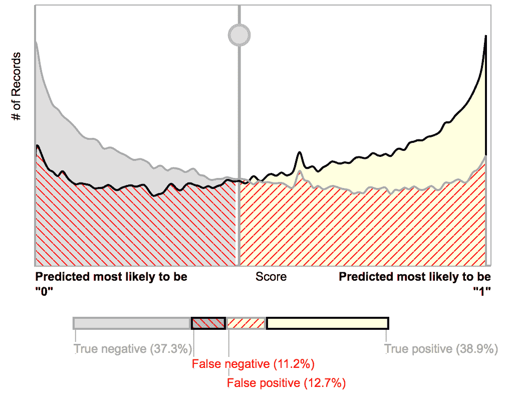
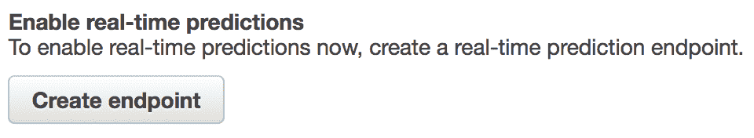
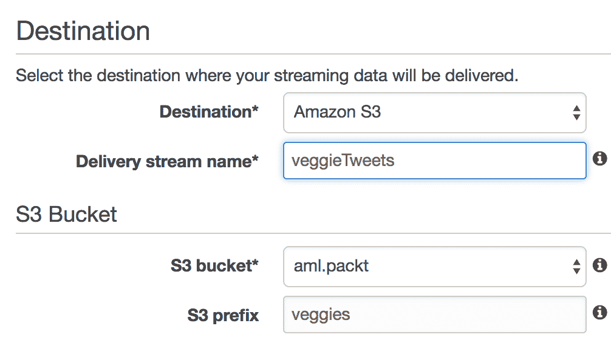
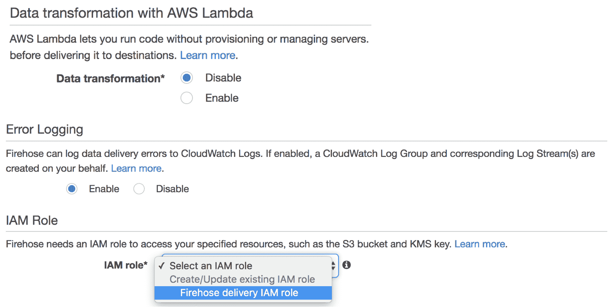
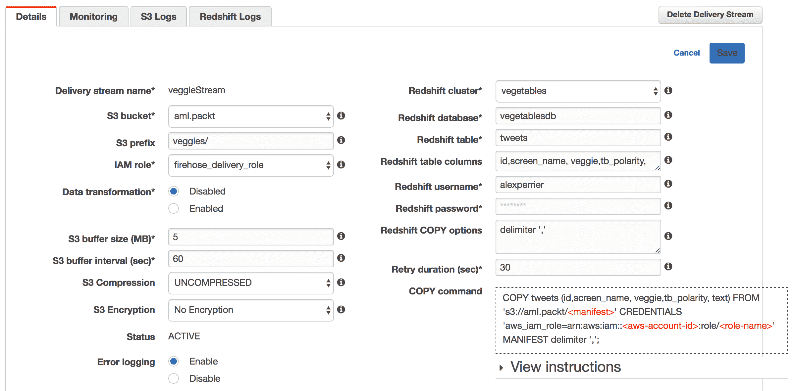
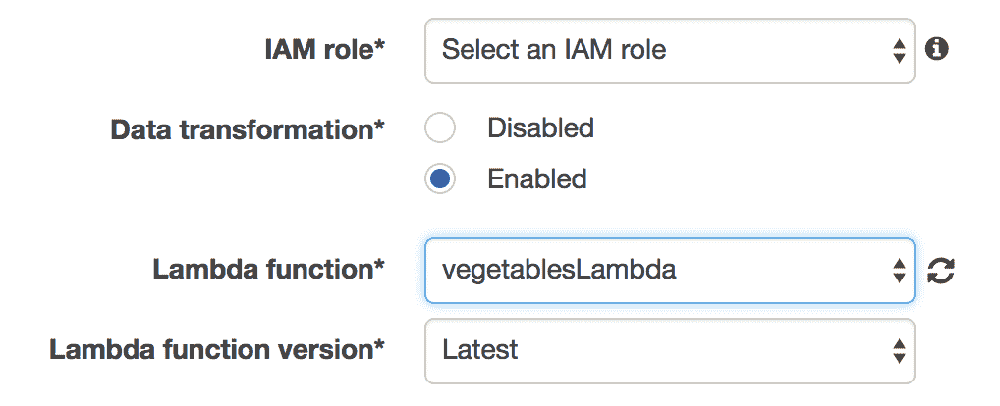
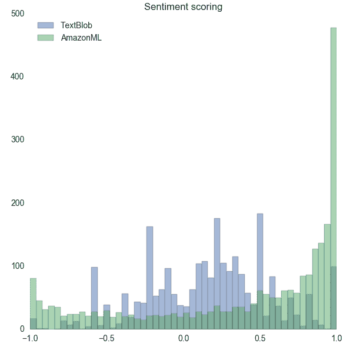
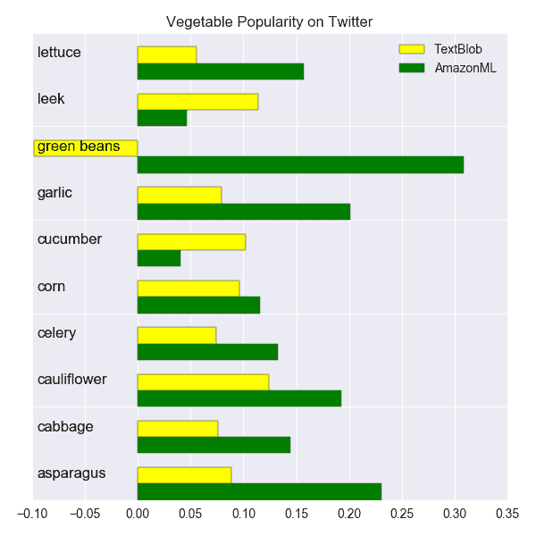

# 构建流式数据分析管道

在本书的最后一章，我们将构建一个端到端的流式数据处理管道，该管道将 Amazon ML 集成到 Kinesis Firehose、AWS Lambda 和 Redshift 管道中。我们通过将其与其他 AWS 数据服务集成来扩展 Amazon ML 的功能，以实现实时推文分类。

在本章的第二部分，我们将展示如何解决超出简单回归和分类的问题，并使用 Amazon ML 进行**命名实体识别**和基于内容的推荐系统。

本章涵盖的主题如下：

+   训练推特分类模型

+   使用 Kinesis 进行流式数据处理

+   使用 Redshift 进行存储

+   使用 AWS Lambda 进行处理

+   命名实体识别和推荐系统

在本章的结论中，我们将总结 Amazon ML 的优势和劣势。

# 流式推特情感分析

在本章中，我们的主要项目是实时推文情感分类。这将使我们能够展示如何使用我们训练的 Amazon ML 模型来处理实时数据流，通过利用 AWS 数据生态系统。

我们将构建一个包括以下内容的 AWS 服务基础设施：

+   **Amazon ML**：提供实时分类端点

+   **Kinesis firehose**：收集推文

+   **AWS Lambda**：调用 Amazon ML 的流式端点

+   **Redshift**：存储推文及其情感

+   **S3**：作为 Kinesis Firehose 收集的推文的临时存储

+   **AWS Cloudwatch**：调试和监控

我们还将编写必要的 Python 脚本，将推文输入到 Kinesis Firehose。

# 推特上的流行竞赛

所有优秀的数据科学项目都始于一个问题。我们想要一个与社会网络相关的问题，而不是与当前的政治或社会背景相关。我们将研究推特上蔬菜的流行度。我们想知道推特上最受欢迎的蔬菜是什么。这是一个经得起时间考验的问题，可以适应其他事物列表，如水果、饮料、天气条件、动物，甚至品牌和政治人物。结果可能会让你感到惊讶……或者不会。

我们将首先使用一个大型公开的推特情感分析数据集来训练一个二元分类的 Amazon ML 模型。

有许多可用的情感分析库，只需几行代码，就可以根据一段文本返回情感评分或极性（正面、中性、负面）。`TextBlob`是 Python 中的一个这样的库。它可在[`textblob.readthedocs.io`](https://textblob.readthedocs.io)找到。建立在**NLTK**之上，`TextBlob`是一个强大的库，可以从文档中提取信息。除了情感分析外，它还可以执行一些词性标注、分类、分词、命名实体识别等功能。我们将`TextBlob`的结果与我们的 Amazon ML 分类模型进行比较。我们的首要目标是学习如何使这些 AWS 服务无缝协作。我们的社交媒体蔬菜流行比赛将遵循以下步骤：

1.  我们首先在 Amazon ML 上训练一个 Twitter 情感分类模型，并创建一个实时预测端点。

1.  我们设置了一个 Kinesis Firehose，它将内容存储在 S3 上。

1.  我们编写了一个简单的 Python 脚本，称为`producer`，它从 Twitter API 收集推文并将它们发送到 Kinesis。在此阶段，Kinesis Firehose 将推文存储在 S3 中。

1.  我们从将流数据存储在 S3 转移到将流数据存储在 Redshift。为此，我们必须启动一个 Redshift 集群并创建所需的表。

1.  最后，我们将一个 AWS Lambda 函数添加到我们的管道中，以便查询我们的 Amazon ML 分类端点。

1.  在整个项目中，我们使用 AWS CloudWatch 来检查状态和调试我们的数据管道。

我们最终得到一个包含推文的集合，其中包含两种类型的情感评分，我们可以进行比较。我们将查看根据两种方法对蔬菜的排名、它们的可变性以及两种方法之间的评分一致性，并尝试评估哪一种更好。值得注意的是，我们避免对推文进行任何复杂的文本处理。推文是一种非常具体的文本内容，其中包含 URL、表情符号、缩写、俚语和标签。关于 Twitter 情感分析的出版物有很多，它们探讨了不同的预处理和信息提取技术。我们不会使用任何特定的特征提取技术，而将自身限制在简单的词袋方法上。我们通过 Amazon ML 和 TextBlog 进行的情感分析比较是一个概念验证，而不是基准。

# 训练数据集和模型

我们项目的第一步是为推文训练一个情感分析和分类的 Amazon ML 模型。幸运的是，我们可以访问一个相当大的 Twitter 情感数据集，该数据集由超过 150 万条标记为 0/1 的推文组成，分别代表负面/正面情感。该数据集可在[`thinknook.com/twitter-sentiment-analysis-training-corpus-dataset-2012-09-22/`](http://thinknook.com/twitter-sentiment-analysis-training-corpus-dataset-2012-09-22/)找到。该数据集是两个 Twitter 情感分析数据集的汇总：

+   Kaggle 上的 **University of Michigan Sentiment Analysis** 竞赛：[`inclass.kaggle.com/c/si650winter11`](https://inclass.kaggle.com/c/si650winter11)

+   由 *Niek Sanders* 编制的 **Twitter Sentiment Corpus**：[`www.sananalytics.com/lab/twitter-sentiment/`](http://www.sananalytics.com/lab/twitter-sentiment/)

这个 Twitter **情感分析** 数据集包含 1,578,627 个分类推文。每一行都标记为 0/1，表示负面/正面情感。我们使用该数据集的样本（大约 10%，158K 条推文）在 Amazon ML 中训练一个分类模型。我们在 S3 上加载数据集，并使用 Amazon ML 服务训练和评估一个二元分类模型。我们对文本没有进行特定的文本转换。配方如下：

```py
{
 "groups": {},
 "assignments": {},
 "outputs": [
     "ALL_BINARY",
     "ALL_TEXT"
 ]
}

```

我们将模型设置为具有轻微的 L2 正则化和 100 次迭代。训练模型需要一些时间（超过 10 分钟）才能完成，这可能是由于样本数量较多。模型评估显示整体性能相当不错，AUC 为 0.83。大约三分之二的推文被 Amazon ML 模型正确分类。预测在类别概率范围内均匀分布，如模型评估图所示：



现在，我们通过点击模型页面底部的“创建端点”按钮从模型页面创建一个实时预测端点：



端点 URL 的形式为 `https://realtime.machinelearning.us-east-1.amazonaws.com`。我们将使用该端点通过 Lambda 服务的请求来对新推文进行分类。让我们通过以下 Python 脚本来测试我们的 Amazon ML 分类器是否按预期工作：

```py
import boto3
client = boto3.client('machinelearning')
client.predict(
   MLModelId = "ml-ZHqxUjPNQTq",
   Record = { "SentimentText": "Hello world, this is a great day" },
   PredictEndpoint = "https://realtime.machinelearning.us-east-1.amazonaws.com"
)

```

句子 `Hello world, this is a great day` 返回句子为积极的概率评分为 *0.91*，并将其分类为 *1*，而句子 `Hello world, this is a sad day` 返回的概率为 *0.08*，并分类为 0。单词 `great` 和 `sad` 是驱动情感分类的单词。分类器按预期工作。

现在，让我们将注意力转向 Kinesis 服务。

# Kinesis

Kinesis 是一个围绕三个子服务组织的多形式服务：**Streams**、**Firehose** 和 **Analytics**。Kinesis 作为高度可用的管道，在数据生产者和数据消费者之间传输消息。

+   数据生产者是来自流式 API、物联网设备、系统日志和其他高容量数据流的来源

+   数据消费者最常用于存储、处理数据或触发警报

Kinesis 能够每小时处理高达 500 太字节的数据。我们使用 Kinesis 的最低级别和最简单的配置。对 Kinesis 的更复杂用法感兴趣的用户应阅读 AWS 文档，网址为 [`aws.amazon.com/documentation/kinesis/`](https://aws.amazon.com/documentation/kinesis/)。在博客文章 [`www.sumologic.com/blog/devops/kinesis-streams-vs-firehose/`](https://www.sumologic.com/blog/devops/kinesis-streams-vs-firehose/) 中可以找到 AWS Kinesis 的不同概念和元素的良好概述。

# Kinesis Stream

Kinesis Stream 用于收集由生产者提供的流数据并由消费者处理。它是三个 Kinesis 服务中最简单的一个，因为它以任何方式都不存储数据。Kinesis Stream 主要充当缓冲区，数据在 24 小时到 168 小时内保持可用。物联网设备或日志服务通常会作为生产者并将数据发送到 Kinesis 流。同时，一个消费者正在运行以处理这些数据。消费者服务基于事件检测算法触发警报（短信、电子邮件）、实时仪表板实时更新、数据聚合器或任何同步检索数据的任何东西。生产者和消费者必须同时运行，Kinesis 流才能正常工作。如果您的生产者和消费者是在您的本地机器上运行的脚本，它们必须并行运行。

可以通过向流中添加 AWS Lambda 函数来对传入的数据进行处理。整个数据处理管道现在将遵循以下步骤：

1.  自定义应用程序或脚本将记录发送到流中（生产者）。

1.  AWS Lambda 会轮询流，并在检测到新记录时调用您的 Lambda 函数。

1.  AWS Lambda 执行 Lambda 函数并将记录（原始或修改后的）发送回 Kinesis 流。

我们将不会使用 Kinesis Streams，因为我们想存储我们收集的数据。Kinesis 流是开始使用 Kinesis 服务的良好方式。

# Kinesis Analytics

**Kinesis Analytics** 是 AWS 对 Kinesis 混合的最新补充。Kinesis Analytics 允许您使用标准 SQL 查询分析实时流数据。想法是从查询数据的静态表示形式转变为动态表示形式，该表示形式随着数据流的到来而演变。而不是使用 AWS Lambda 通过脚本语言处理数据，目标是使用 SQL 处理数据并将结果馈送到仪表板或警报系统。我们将不会使用 Kinesis Analytics，而是专注于 Kinesis Firehose。

# 设置 Kinesis Firehose

我们将专注于 Kinesis Firehose 服务，该服务提供两个重要功能：接收到的数据可以馈送到 AWS Lambda 函数进行额外处理，并且结果数据可以存储在 S3 或 Redshift 数据库上。

我们将首先设置一个 Kinesis Firehose 交付流，该流将数据存储在 S3 而不使用任何 Lambda 功能：

1.  前往 Kinesis Firehose 仪表板[`console.aws.amazon.com/firehose/`](https://console.aws.amazon.com/firehose/)并点击“创建传输流”。

1.  填写以下字段：

    +   目标: `Amazon S3`

    +   传输流名称: `veggieTweets`（或选择你自己的名称）

    +   S3 存储桶: `aml.packt`

    +   S3 前缀: `veggies`

1.  点击“下一步”：



注意，S3 前缀字段对应于你的 S3 存储桶中的一个文件夹。你现在应该前往 S3 并在你的存储桶中创建一个`veggies`文件夹。模仿下一个截图的设置：



1.  目前，我们将保持使用 AWS Lambda 进行数据转换的禁用状态。

1.  启用错误日志记录，因为我们需要使用 CloudWatch Logs 调试我们的数据交付错误。

1.  对于 IAM 角色，选择 Firehose Delivery IAM 角色。你将被带到 IAM 服务，并指导创建所需的角色。你可以选择现有的策略并创建一个新的策略。角色/策略向导将处理详细信息。点击“允许”以跳转到初始 Firehose 配置屏幕。

1.  点击“下一步”，查看 Firehose 传输流的详细信息，然后点击“创建传输流”。

现在我们有一个 Kinesis Firehose 传输流，一旦我们向其发送数据，数据将存储在 S3 packt.aml/veggies 位置。我们现在需要创建一个生产脚本，将数据发送到 Kinesis Firehose 服务。

# 发布推文

Kinesis 生产者可以有多种形式，只要它向 Kinesis 流发送数据。我们将使用 Python Firehose SDK 并编写一个简单的脚本，从 Twitter API 收集推文，过滤其中的一些，并将它们发送到 Kinesis Firehose。我们使用 Python-Twitter 库。

在 GitHub 上有几个 Twitter API Python 包可用。其中两个更受欢迎的，`Twitter`和`Python-Twitter`([`pypi.python.org/pypi/python-twitter/`](https://pypi.python.org/pypi/python-twitter/))有相同的导入调用`import twitter`，但方法调用不同，这可能导致混淆并浪费时间。

Python-Twitter 包提供了一个`GetSearch`方法，该方法接受查询字符串`term`或`raw_query`作为 Twitter 搜索的参数：

+   查询字符串（`term`）对应于你会在 Twitter 网站搜索栏中写下的关键词；例如，`term = brocolli OR potato OR tomato`。

+   当你点击搜索按钮后，`raw_query`参数会接收 URL 的参数部分：URL 中`?`后面的字符串。你可以从 Twitter 高级搜索页面[`twitter.com/search-advanced`](https://twitter.com/search-advanced)构建高级查询。例如，我们搜索"*西兰花 OR 土豆 OR 番茄*"转换为`raw_query = q=brocolli%20OR%20potato%20OR%20tomato&src=typd`。我们在调用搜索 API 时使用`raw_query`参数。

+   要获取自己的 Twitter 开发 API 密钥，请访问[`apps.twitter.com/`](https://apps.twitter.com/)并创建一个应用程序。

我们首先定义一个类，该类初始化对 Twitter API 的访问。这个类有一个`capture`方法，它根据一个原始查询执行搜索。将以下代码保存到`tweets.py`文件中：

```py
import twitter
class ATweets():
    def __init__(self, raw_query):
         self.twitter_api = twitter.Api(consumer_key='your own key',
              consumer_secret= 'your own key',
              access_token_key='your own key',
              access_token_secret='your own key')
         self.raw_query = raw_query

    # capture the tweets: see http://python-twitter.readthedocs.io/en/latest/twitter.html 
    def capture(self):
        statuses = self.twitter_api.GetSearch(
             raw_query = self.raw_query,
             lang = 'en',
             count=100, result_type='recent', include_entities=True
        )
     return statuses

```

给定这个类和一个`raw_query`字符串，收集 Tweets 的过程包括用`raw_query`初始化`ATweets`类，并在实例化的对象上应用捕获方法，如下所示：

```py
tw = ATweets(raw_query) 
statuses = tw.capture()

```

在这里，`statuses`是一个包含许多元素的 Tweets 列表。我们只使用其中的一些元素。现在我们能够从`Twitter` API 收集 Tweets，我们需要一个生产脚本，将 Tweets 发送到 Kinesis。以下是一个生产 Python 脚本：

```py
from tweets import ATweets
import json
import boto3

# The kinesis firehose delivery stream we send data to
stream_name = "veggieTweets" 

# Initialize the firehose client
firehose = boto3.client('firehose')

# Our own homemade list of vegetables, feel free to add seasoning
vegetables = ['artichoke','asparagus', 'avocado', 'brocolli','cabbage', 'carrot', 'cauliflower','celery', 'chickpea', 'corn','cucumber', 'eggplant','endive', 'garlic', 'green beans', 'kale', 'leek', 'lentils', 'lettuce','mushroom','okra', 'onion','parsnip', 'potato','pumpkin', 'radish','turnip', 'quinoa', 'rice', 'spinach', 'squash' , 'tomato', 'yams', 'zuchinni']

# Loop over all vegetables
for veggie in vegetables:
 # for a given veggie define the query and capture the tweets
 raw_query = 'f=tweets&vertical=default&l=en&q={0}&src=typd'.format(veggie)
 # capture the tweets
 tw = ATweets(raw_query)
 statuses = tw.capture()
 # and for each tweet, cleanup, add other data and send to firehose
 for status in statuses:
 # remove commas and line returns from tweets
 clean_tweet = ''.join([s for s in st.text if s not in [',', 'n']])
 # and build the record to be sent as a comma separated string followed by a line return
 record = ','.join([str(st.id), st.user.screen_name,veggie, clean_tweet]) + 'n'
 # send the record to firehose
 response=firehose.put_record(DeliveryStreamName = stream_name, Record={'Data': record} )

```

将此代码保存到与`tweets.py`文件相同的文件夹中的`producer.py`文件。

如你所注意到的，我们通过在`GetSearch`调用中指定`lang = 'en'`将 Twitter 搜索限制为英文 Tweets。然而，这并没有产生预期的结果，并且返回了许多非英文 Tweets。在后续版本的生产脚本中，我们在将 Tweets 发送到 Firehose 之前，添加了以下条件到 Tweets 本身，实际上过滤掉了长度小于 10 个字符或作为转发发送的非英文 Tweets：

```py
(st.lang=='en') & (st.retweeted_status is None) & (len(st.text) > 10):

```

我们现在可以运行我们的生产脚本了。最后，需要注意的一个重要细节是，对 Twitter API 的调用是有限制的。如果你调用 API 过于频繁，你将不得不在请求之间等待越来越长时间，直到它们被允许通过。有可靠的方法来处理这些限制，并且很容易在网上找到显示如何延迟 API 调用的代码。我们将简单地使用带有 10 分钟（600 秒）延迟的`watch`命令行。`watch`命令简单地执行你之后写的任何命令，每 n 秒执行一次。要运行你的生产代码，打开一个终端，并运行以下命令：

```py
$ watch -n 600 python producer.py

```

每 10 分钟，将捕获 Tweets 并发送到 Kinesis Firehose。为了验证你的脚本和交付流是否正常工作，请访问你的 S3 存储桶和`aml.packt/veggies`文件夹。你应该会看到文件堆积。这些文件是由 Kinesis 按日期/年/月/日和小时结构化的子文件夹保存的。在最后一个子文件夹中的文件名格式类似于`veggieTweets-2-2017-04-02-19-21-51-1b78a44f-12b2-40ce-b324-dbf4bb950458`。在这些文件中，你会找到在生产代码中定义的记录。我们的生产代码发送以逗号分隔的数据，格式为 tweet ID/twitter 用户名/蔬菜/tweet 内容。以下是一个这样的记录示例：

```py
848616357398753280,laurenredhead,artichoke,Artichoke gelatin dogs. Just one of many delicious computer-algorithm generated recipe titles:https://t.co/mgI8HtTGfs

```

我们现在将设置 Redshift，以便这些 Tweets 和相关元素最终存储在 SQL 数据库中。

# Redshift 数据库

我们在[第八章](https://cdp.packtpub.com/effective_amazon_machine_learning/wp-admin/post.php?post=688&action=edit)“从 Redshift 创建数据源”中看到了如何创建 Redshift 集群，我们不会再次介绍这些步骤。对于我们的蔬菜竞赛项目，我们创建了一个蔬菜集群和一个`vegetablesdb`数据库。等待集群端点就绪并定义后，通过以下`Psql`命令连接到您的 Redshift 数据库：

```py
$ psql --host=vegetables.cenllwot8v9r.us-east-1.redshift.amazonaws.com --port=5439 --username=alexperrier --password --dbname=vegetablesdb

```

连接到数据库后，使用以下 SQL 查询创建以下表：

```py
CREATE TABLE IF NOT EXISTS tweets (
 id BIGINT primary key,
 screen_name varchar(255),
 veggie varchar(255),
 text varchar(65535)
);

```

注意，在 Redshift SQL 中没有`blob`或`text`数据类型。我们将推文定义为`varchar(65535)`，这可能是过于大了，但由于我们使用了`varchar`而不是`char`，数据占用的体积缩小到文本的实际长度，而不是整个 65KB。在该表中，我们只捕获推文的 ID、推文本身、与推文关联的蔬菜以及撰写推文的人的屏幕名。我们忽略任何其他推文元素。

# 将 Redshift 添加到 Kinesis Firehose

这部分比较复杂，因为来自不同服务的多个部分必须相互配合：

+   数据结构、表声明和 Kinesis Redshift 配置

+   数据字段聚合和后续解析

+   角色及其相关策略

存储数据的 Redshift 表字段需要在三个不同的地方进行同步：

1.  具有适当字段定义的 Redshift 表。

1.  将数据发送到 Kinesis 的脚本。根据发送到 Kinesis 的记录是如何聚合在一起以及随后由 Redshift 解析的方式，脚本必须以与 Redshift 表中定义的相同顺序连接相同数量的字段。例如，当我们在脚本中写入`record = ','.join([str(st.id), st.user.screen_name,veggie, clean_tweet]) + 'n'`时，这意味着表有四个字段，且类型正确：`int`，`varchar`，`varchar`，和`varchar`。

1.  如 Kinesis Firehose 定义中定义的列。

对于最后一个问题，我们需要回到 Firehose 仪表板，创建一个新的流，并将其定义为基于 Redshift 的交付流。点击创建交付流，选择 Redshift 作为目标。按照不同的屏幕提示，填写以下值：

+   S3 存储桶：您的自己的存储桶

+   S3 前缀：我们保留前缀 veggies

+   数据转换：目前禁用

+   Redshift 集群：`Vegetables`

+   Redshift 数据库：`Vegetablesdb`

+   Redshift 表列：ID，`screen_name`，veggie，text（这个非常重要）

+   Redshift 用户名：您使用该用户名访问 Redshift

+   Redshift COPY 选项：分隔符`,`（同样非常重要）

创建后，您的 Kinesis Firehose 流应类似于以下截图：



注意屏幕右下角的`COPY`命令，此处重现：

```py
COPY tweets (id,screen_name, veggie,tb_polarity, text) FROM 's3://aml.packt/<manifest>' CREDENTIALS 'aws_iam_role=arn:aws:iam::<aws-account-id>:role/<role-name>' MANIFEST delimiter ',';

```

此命令指示 Redshift 将如何摄取 Kinesis 发送到 S3 的数据，它期望哪些字段，以及它将如何解析不同的字段（例如，由逗号分隔）。还有其他潜在的`COPY`格式，包括 JSON 或 CSV。我们发现这个格式简单且有效。重要的是，记录在生成脚本中的定义和格式（由逗号分隔的四个变量）与`table name (name of the four fields)`命令的 COPY 部分相对应，并具有正确的分隔符定义`','`。

当数据没有记录到数据库中时，这个 COPY 命令也是调试管道的好方法。进入数据库的 Psql，然后运行相同的查询，以便获取有关查询失败原因的有用错误信息。

现在是时候谈谈基于角色的访问控制了。

# 设置角色和策略

AWS 中有两种类型的访问控制：基于密钥和基于角色。基于密钥的设置更容易，但不能用来使 Kinesis、Redshift 和 S3 相互通信，如 AWS 在[`docs.aws.amazon.com/redshift/latest/dg/copy-usage_notes-access-permissions.html`](http://docs.aws.amazon.com/redshift/latest/dg/copy-usage_notes-access-permissions.html)中指出的：

基于角色的访问控制允许您的集群代表您临时假定一个 IAM 角色。然后，根据授予该角色的授权，您的集群可以访问所需的 AWS 资源。IAM 角色与 IAM 用户类似，因为它是一个 AWS 身份，具有权限策略，该策略确定身份可以在 AWS 中做什么和不能做什么。然而，与唯一关联于一个用户不同，任何需要它的实体都可以假定一个角色。此外，角色没有与之关联的任何凭证（密码或访问密钥）。相反，如果角色与集群关联，则会动态创建访问密钥并将其提供给集群。我们建议使用基于角色的访问控制，因为它提供了对 AWS 资源和敏感用户数据的更安全、更细粒度的访问控制。

我们必须为您的用户创建正确的角色，以便他们能够访问 Redshift，然后我们必须给它必要的策略。

有三个步骤：

1.  第一步，授权 Amazon Redshift 代表你访问其他 AWS 服务。请按照以下说明操作：[`docs.aws.amazon.com/redshift/latest/mgmt/authorizing-redshift-service.html`](http://docs.aws.amazon.com/redshift/latest/mgmt/authorizing-redshift-service.html)

1.  第二步，将角色附加到聚类中。查看[`docs.aws.amazon.com/redshift/latest/mgmt/copy-unload-iam-role.html`](http://docs.aws.amazon.com/redshift/latest/mgmt/copy-unload-iam-role.html)。

1.  最后，使用控制台管理 IAM 角色关联，执行以下步骤：

    1.  前往 Redshift，然后点击管理 IAM 角色。

    1.  从可用角色中选择。

    1.  等待状态从修改中变为可用。

在 AWS 中，当尝试让不同的服务相互连接时，角色和策略可能会具有挑战性和耗时。对于生产级应用程序和服务，显然需要严格的访问控制，但 AWS 平台缺乏一个更宽松或松散的通用访问级别，以允许进行概念验证和宠物项目。面对与角色相关的访问问题时的一般黑客思路是，前往 IAM 角色页面，并将你认为必要的策略附加到给你带来麻烦的角色上。通过试错，你最终会找到解决方案。

如果一切顺利，当你运行生产者脚本时，你应该看到以下情况发生：

+   文件和基于日期的子文件夹将创建在`{bucket}/veggies`文件夹中

+   图表和查询应在 Redshift 集群页面上显示或更新

+   在“Firehose 传输流页面”上，检查 S3 日志和 Redshift 日志标签以查找错误信息

+   你的`vegetablesdb.tweets`应该开始填充内容行。

如果情况并非如此，并且你未在数据库中看到推文，那么是时候开始调试了。

# 依赖关系和调试

如果你不是经验丰富的 AWS 用户，连接不同的服务——Firehose、Redshift、S3 并不是一项简单任务。许多细节需要解决，而且文档并不总是清晰，有时甚至过于复杂。许多错误也可能以隐蔽的方式发生，而且错误发生的位置和如何检测它并不总是明显，更不用说理解它了。在我们必须解决的所有的错误和问题中，这些是最耗时的。

# 数据格式同步

如果你向 Redshift 发送一些数据，它需要被 Redshift 解析。你发送的字符串格式为`id, username`，`sentiment, tweet`或 JSON 字符串`{id: 'id'`, `username:'twetterin_chief'`, `sentiment: '0.12'`, `tweet:'Hello world it's a beautiful day'}`。你需要确保 Kinesis 中的 Redshift 配置遵循你的数据格式。你可以在 Kinesis-Redshift 配置屏幕上的以下两个字段中这样做：

+   Redshift 表列

+   Redshift 的 COPY 选项

# 调试

当你运行你的生产者，数据最终没有出现在 Redshift 表中时，你应该记住有一个延迟。这个延迟是在你创建 Kinesis 传输流时设置的，默认设置为 3,600 秒。如果你想避免长时间的等待，请将其设置为至少 60 秒。以下是在你的数据没有在数据库中流式传输时需要检查的地方：

1.  **检查 S3**：S3 前缀对应于您定义的存储桶中的一个文件夹。如果有错误，您将看到一个名为`errors`或`processing errors`的新子文件夹。点击子文件夹直到到达实际的错误文件，将其公开（有一个按钮），下载文件，并检查它。它有时会包含有用的信息。错误子文件夹还包含一个清单文件。清单文件对于重新处理失败的文件很有用。

1.  连接到您的 Redshift 数据库，并使用`select * from STL_LOAD_ERRORS`检查`STL_LOAD_ERRORS`表。如果问题是由基于 SQL 的错误（可能是解析相关）引起的，那么有用的信息将显示在那里。不过，错误消息并不总是解释性的。在我们的情况下，那个表显示了 Redshift 未能摄取的第一条推文，这极大地帮助了我们找出问题所在。最后，我们面临的问题是某些字符被 Redshift 当作列分隔符。我们在生产者直接从推文中移除了这些字符。

1.  检查**Redshift 查询**页面，您将看到最新的查询。如果您看到查询被终止而不是完成，那么您有一个与 SQL 查询相关的问题。

1.  最后，一个好的调试方法是连接到您的数据库，并运行在 Kinesis 传输流摘要页面中显示的 COPY 查询，同时别忘了用正确的值替换账户 ID 和角色名称。这将模拟 Redshift 实际从 S3 存储桶中摄取数据的方式。如果失败，相关的错误会为您提供更多信息。

# 使用 Lambda 进行预处理

我们现在希望将推文用于情感分类发送到我们的 Amazon ML 模型。为了做到这一点，我们将启用 Kinesis Firehose 传输流页面中可用的数据转换，并使用一个 Lambda 函数：



AWS Lambda 是一种数据处理服务，允许您运行脚本（包括 Python 2.7 等多种语言，但不包括 Python 3）。它与其他服务（如 Kinesis）一起用作数据处理附加组件。您可以将数据流重定向到 Lambda 进行处理，如果需要，可以将结果发送回初始流。您还可以使用 Lambda 调用其他服务，例如发送警报或使用其他存储服务。

AWS Lambda 的主要默认设置是，你可以导入 Python 脚本中的包的选择是有限的。尝试导入包，如`scikit-learn`、NLTK，或者任何尚未提供的包，相当复杂。有关如何在 AWS Lambda 上使用`scikit-learn`的指南，请访问[`serverlesscode.com/post/deploy-scikitlearn-on-lamba/`](https://serverlesscode.com/post/deploy-scikitlearn-on-lamba/)或[`serverlesscode.com/post/deploy-scikitlearn-on-lamba/`](https://serverlesscode.com/post/deploy-scikitlearn-on-lamba/)。这显著限制了 Lambda 的即插即用功能。我们使用 AWS Lambda 的方式要简单得多。我们将使用 AWS Lambda 来完成以下工作：

1.  从 Kinesis Firehose 捕获数据。

1.  解析数据并提取推文。

1.  将数据发送到 Amazon ML 实时端点。

1.  从响应中提取分类分数。

1.  将数据连同分类分数一起发送回 Kinesis Firehose 传输流。

前往 AWS Lambda，点击创建 Lambda 函数。然后执行以下步骤：

1.  选择 Blank Function 蓝图和 Python 2.7 运行时。

1.  不要配置触发器。

1.  填写名称为`vegetablesLambda`，并选择 Python 2.7 运行时。

最后，将以下代码粘贴到内联编辑器中：

```py
from __future__ import print_function

import base64
import boto3
import logging

logger = logging.getLogger()
logger.setLevel(logging.INFO)

ml_client = boto3.client('machinelearning')

print('Loading function')

def lambda_handler(event, context):
  output = []
  for record in event['records']:
     payload = base64.b64decode(record['data'])
     payload = payload.split(',')
     tweet = payload.pop(4)

     predicted_label, predicted_score = get_sentiment(tweet)

     payload.append(str(predicted_label) )
     payload.append(str(predicted_score) )
     payload.append(tweet)
     payload = ','.join(payload)

     output_record = {
       'recordId': record['recordId'],
       'result': 'Ok',
       'data': base64.b64encode(payload)
     }
     output.append(output_record)
     return {'records': output}

```

`lambda_handler`函数由 Kinesis Firehose 自动触发。它捕获并解析消息（即负载）`event['records']`，提取推文，并调用返回情感分数和情感标签的`get_sentiment()`函数。最后，它将情感数字添加回记录，重建负载，并将其发送回 Kinesis。`get_sentiment()`函数将推文发送到我们的 Amazon 分类端点，并返回`predicted_label`和`predicted_score`。该函数定义在以下脚本中：

```py
def get_sentiment(tweet):

   response = ml_client.predict(
       MLModelId = "ml-ZHqxUjPNQTq",
       Record = { "SentimentText": tweet },
       PredictEndpoint = "https://realtime.machinelearning.us-east-1.amazonaws.com"
   )
   predicted_label = response['Prediction']['predictedLabel']
   predicted_score = response['Prediction']['predictedScores'][predicted_label]

   return predicted_label, predicted_score

```

由于我们在负载中添加了两个新元素，我们还需要将它们添加到 Redshift 表和 Kinesis-Redshift 配置中。为了在 Redshift 中重新创建`tweets`表，请运行以下查询：

```py
drop table if exists tweets;
CREATE TABLE IF NOT EXISTS tweets (
 id BIGINT primary key,
 screen_name varchar(255),
 veggie varchar(255),
 ml_label int,
 ml_score float,
 text varchar(65535)
);

```

在 Kinesis 级别，将 Redshift 表列字段改为`id,screen_name`, `veggie,ml_label`, `ml_score, text`。

# 分析结果

我们现在有一个完整的流数据管道，它能够捕获、转换和存储数据。一旦收集了几千条推文，你就可以开始分析你的数据了。在我们能够找到本章开头设定的答案之前，还有一些事情需要完成：

+   推特上最受欢迎的蔬菜是什么？

+   `TextBlob`与我们的 Amazon ML 分类模型相比如何？

我们简单的生产者不尝试处理重复的推文。然而，最终，我们的数据集有许多重复的推文。西兰花和胡萝卜作为推文主题的频率比预期的要低。因此，当我们每 10 分钟收集大约一百条推文时，许多推文最终被收集多次。我们还需要从 `TextBlob` 获取情感得分和相关类别。

现在，我们将下载我们收集的推文数据集，删除重复项，并使用 `TextBlob` 分类。

# 从 RedShift 下载数据集

从 Redshift 下载数据的正确方式是使用 Psql 连接到数据库，并使用 `Unload` 命令将 SQL 查询的结果导出到 S3。以下命令使用适当的角色将所有推文导出到 `s3://aml.packt/data/veggies/results/` 位置：

```py
unload ('select * from tweets') to 's3://aml.packt/data/veggies/results/' iam_role 'arn:aws:iam::0123456789012:role/MyRedshiftRole';

```

然后，我们可以下载文件并将它们汇总：

```py
# Download
$ aws s3 cp s3://aml.packt/data/veggies/results/0000_part_00 data/
$ aws s3 cp s3://aml.packt/data/veggies/results/0001_part_00 data/
# Combine
$ cp data/0000_part_00 data/veggie_tweets.tmp
$ cat data/0001_part_00 >> data/veggie_tweets.tmp

```

`veggie_tweets.csv` 文件不是以逗号分隔的。值是通过 `|` 字符分隔的。我们可以使用以下命令行将文件中的所有管道符号替换为逗号：

```py
$ sed 's/|/,/g' data/veggie_tweets.tmp > data/veggie_tweets.csv

```

现在，我们已准备好将数据加载到 pandas 数据框中：

```py
import pandas as pd
df = pd.read_csv('data/veggie_tweets.csv')

```

注意，我们也可以在加载 pandas 数据框时使用 `|` 作为分隔符，即 `df = pd.read_csv('data/veggie_tweets.tmp'`, `delimiter = '|'`, `header=None`, `names = ['id'`, `'username'`, `'vegetable'`, `'ml_label'`, `'ml_score'`, `'text']`）。

# 使用 TextBlob 进行情感分析

`TextBlob` 在几行 Python 代码中提供情感分析、评分和分类。对于给定的文本，初始化一个 `TextBlob` 实例，并使用以下两行代码检索其极性：

```py
from textblob import TextBlob
print(TextBlob(text).sentiment)

```

`TextBlob` 情感对象有一个极性和主观性得分。文本的极性范围从 -1 到 +1，从负到正，主观性从 0 到 1，从非常客观到非常主观。例如，句子 `I love brocoli` 返回 `Sentiment(polarity=0.5`, `subjectivity=0.6)`，而句子 `I hate brocoli` 返回情感 `Sentiment(polarity=-0.8`, `subjectivity=0.9)`。我们可以在处理推文时添加 `TextBlob` 情感，无论是在生产者内部还是在下载了这些数据集后，都可以用以下简单行代码实现：

```py
from textblob import TextBlob
df['tb_polarity'] = 0
for i, row in df.iterrows():
    df.loc[i, 'tb_polarity'] = TextBlob(row['text']).sentiment.polarity

```

我们数据框的每一行现在也都有一个情感得分。

# 删除重复推文

在所有基于 Twitter 的 NLP 分析中，你最终都会处理机器人，即使是在收集关于蔬菜的推文时也是如此！在我们的数据集中，我们有许多版本的宣传推文，其中推文中的文本相同，但链接和用户不同。我们通过首先从推文中删除 URL，然后使用 `drop_duplicates` Pandas 方法来删除重复推文。

注意到推文中所有的 URL 都以 `https://t.co/` 开头，因此很容易从推文中移除所有 URL。我们将在我们的数据框中创建一个不带 URL 的新推文列。我们输入以下行，它将返回不带 URL 的推文：

```py
' '.join([token for token tk in tweet.split(' ') if 'https://t.co/' not in tk])

```

当使用 pandas 数据框时，创建基于数据框其他列操作的新列的一个非常实用的方法是将 apply 方法与 Lambda 函数结合使用。创建从 `existing_column` 到 `new_column` 的 `new_column` 的整体模式是：

```py
df['new_column'] = df[existing_column].apply( 
                      lambda existing_column : {
                         some operation or function on existing_column 
                      } 
                   )

```

我们应用这个模式来创建包含没有网址的推文的 `no_urls` 列：

```py
df['no_urls'] = df['text'].apply(
                   lambda tweet : ' '.join(
                       [tk for  tk in tweet.split(' ') if 'https://t.co/' not in tk]
                   )
                )

```

`no_urls` 列不再包含任何网址。现在我们可以使用以下行基于此列删除重复项：

```py
df.drop_duplicates(subset= ['no_urls'], inplace = True)

```

这大约移除了我们推文的 30%。

# 那么最受欢迎的蔬菜是什么呢？

比较我们的 Amazon ML 模型和 `TextBlob` 的情感分数分布很有趣。我们可以在下面的图中看到，我们的 Amazon ML 模型擅长区分正面和负面的推文，而 `TextBlob` 的分布则更加集中。事实上，相当一部分推文被 `TextBlob` 评分为零（中性）。我们从直方图中移除了它们：



根据我们的 Amazon ML 模型，Twitter 上最受欢迎的蔬菜是绿豆，其次是芦笋和大蒜。根据 `TextBlob`，花椰菜排名第四受欢迎，其次是韭菜和黄瓜。以下图显示了推文量较多的前 10 种蔬菜以及使用 `TextBlob` 和我们自己的 Amazon ML 二元分类器获得的相应情感分数：



令人惊讶的结果是，根据 `TextBlob`，绿豆是最不受欢迎的蔬菜。碰巧的是，`TextBlob` 给单词 `green` 分配了一个负的 *-0.2* 情感分数。因此，短语 `green beans` 直接得分 *-0.2*。

我们的 Amazon ML 模型似乎比 `TextBlob` 更可靠。毕竟，绿豆肯定比花椰菜更受欢迎！

# 超越分类和回归

虽然 Amazon ML 被设置为解决分类和回归问题，但该服务也可以用于其他监督数据科学问题。在本节的最后，我们探讨了两个经典问题：推荐系统和命名实体识别。

+   **制作推荐**：推荐系统试图预测用户会对一个项目给出多少评分或偏好。构建推荐系统有几种策略：

+   **协同过滤**：这涉及到使用类似用户的的行为模式来预测给定用户的偏好。这是“其他人也买了这个”的方法。

+   **基于内容的过滤**：这是一种策略，其中使用特定内容的特征来分组相似的产品或内容。

要使用 Amazon ML 进行推荐，你可以将你的解决方案构造成一个基于内容的推荐问题。一种方法是提取产品和用户的特征，并构建一个训练数据集，其中结果为二元：用户要么喜欢该产品，要么不喜欢。推荐系统被转换为一个二元推荐问题。

**命名实体识别：**命名实体识别旨在在文本中定位和分类实体到预定义的类别中，例如人名、组织、地点等。亚马逊机器学习也可以用于命名实体识别问题。想法是使用单个单词，并提取特征作为训练数据。潜在的特征可能包括以下内容：

+   单词本身

+   `ngram()`或`osb()`的上下文，例如前后的三个单词。

+   前缀和后缀

+   前三个单词的预测类别

+   单词的长度

+   单词是否首字母大写？

+   单词是否有连字符？

+   句子中的第一个单词

+   单词在数据集中的频率

+   数字特征--单词是否是数字？

+   单词或周围单词的词性

其中一些特征提取方法在亚马逊机器学习中可用；其他则需要外部处理。

# 摘要

在本章中，我们利用了 AWS 生态系统的力量来构建一个实时流数据分类管道。我们的管道能够使用亚马逊机器学习分类端点对实时推文进行分类。AWS 数据生态系统多样且复杂，对于给定的问题，通常有几种可能的解决方案和架构。我们构建的**Kinesis-Lambda-Redshift-机器学习**架构简单，但非常强大。

亚马逊机器学习服务的真正优势在于其易用性和简单性。从头开始训练和评估一个模型只需几分钟和几个点击，并且可以产生非常好的性能。使用**AWS CLI**和 SDK，可以轻松实现更复杂的数据流和模型探索。该服务足够敏捷，可以通过提供实时分类和回归成为更广泛数据流的一部分。

在简单的界面之下，亚马逊的机器学习专业知识在许多层面上都闪耀着光芒。从自动数据转换到随机梯度算法的调整，有许多元素推动了模型的总体性能。在用户对模型的控制与自动优化之间达到了良好的平衡。用户可以尝试几种类型的正则化和数据转换来优化模型和特征集，但整体感觉是使用默认参数通常也能很好地工作。

服务的简单性有一些缺点，主要是在数据转换有限以及缺乏任何嵌入的交叉验证机制，这对于数据科学工作流程至关重要。

最后，亚马逊机器学习是一个有用的回归和分类服务，将机器学习自动化更近一步。在数据科学项目中，就像在其他任何软件项目中一样，重要的是真正的拥有成本。与自建解决方案相比，亚马逊机器学习在易用性、可维护性、资源成本和通常性能方面占优势。
