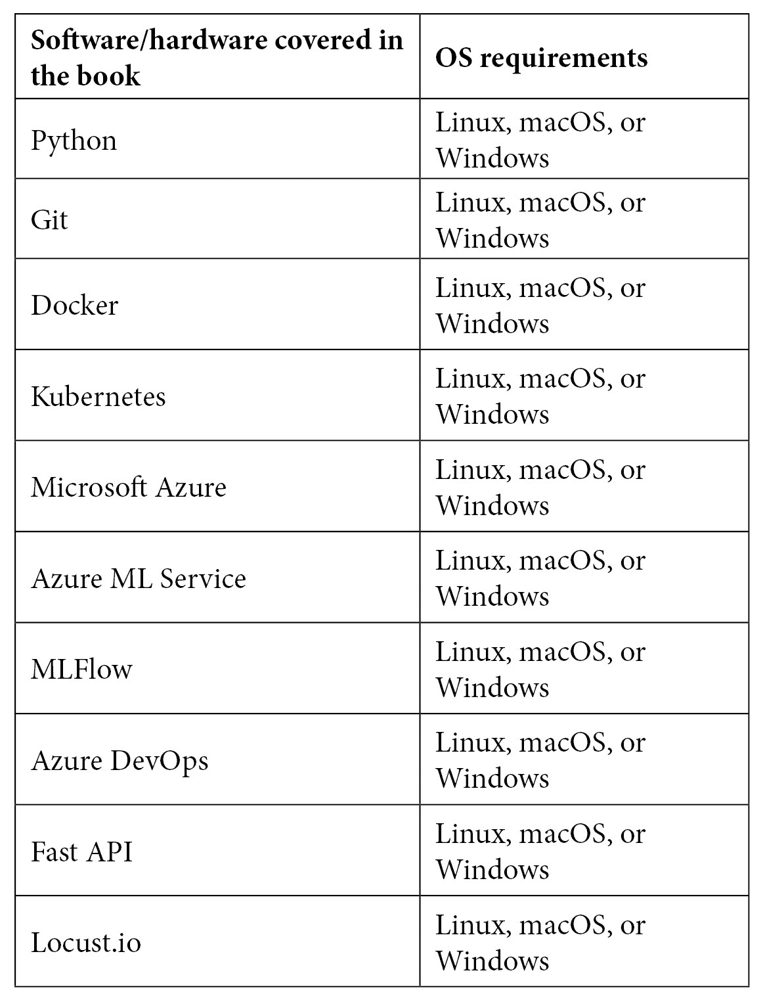

# 前言

MLOps 是一种系统化的方法，用于构建、部署和监控机器学习（ML）解决方案。它是一种可以应用于各个行业和用例的工程学科。本书通过结合现实世界案例，提供了对 MLOps 的全面见解，帮助你编写程序、训练健壮且可扩展的机器学习模型，并构建机器学习管道，以安全地在生产中训练和部署模型。

你将从熟悉 MLOps 工作流程开始，并开始编写训练机器学习模型的程序。然后，你将探索训练后序列化和打包机器学习模型以在生产中部署并促进机器学习推理的选项。接下来，你将学习如何使用可解释的监控框架监控机器学习模型和系统性能。最后，你将应用所学知识来构建现实世界项目。

在阅读完这本机器学习书籍之后，你将获得 MLOps 的全方位视角，并准备好在你的组织中实施 MLOps。

# 本书面向的对象

这本 MLOps 书籍是为数据科学家、软件工程师、DevOps 工程师、机器学习工程师以及希望使用 MLOps 原则和技术在生产中构建、部署和维护机器学习系统的商业和技术领导者所写。为了开始阅读本书，需要具备基本的机器学习知识。

# 本书涵盖的内容

*第一章*，*MLOps 工作流程基础*，通过强调传统软件开发如何转变为促进机器学习，概述了不断变化的软件开发领域。我们将突出组织内部使用传统方法的一些日常问题，展示为什么需要思维和实施的转变。随后，将介绍系统化机器学习的重要性，接着是一些机器学习和 DevOps 的概念，并将它们融合到 MLOps 中。本章以一个通用的工作流程提案结束，该工作流程可以用于解决几乎任何机器学习问题。

*第二章*，*描述你的机器学习问题*，为你提供了对生产中可能的机器学习解决方案类型的广泛视角。你将学习如何对解决方案进行分类，制定开发和部署解决方案的路线图，以及获取开始开发机器学习解决方案所需的数据、工具或基础设施，采用系统化的方法。

*第三章*，*代码与数据相遇*，开始了我们动手实践的业务用例——开发机器学习解决方案的实施。我们讨论了机器学习源代码管理的高效方法，针对业务用例的数据处理，并制定了一个机器学习训练和部署的数据治理策略和流程。

*第四章*, *机器学习管道*, 深入探讨了构建用于解决方案的机器学习管道。我们探讨了特征工程、算法选择、超参数优化以及稳健机器学习管道的其他方面的关键要素。

*第五章*, *模型评估和打包*, 深入探讨了在训练后序列化和打包机器学习模型以在运行时部署它们的选项，以促进机器学习推理、模型互操作性和端到端模型可追溯性。您将获得关于可用选项和最先进发展的广泛视角，以及如何打包和为生产环境提供机器学习模型以实现高效、稳健和可扩展的服务。

*第六章*, *部署您的 ML 系统的关键原则*，介绍了在各种设置中在生产环境中实施持续集成和部署的概念。您将学习如何选择正确的选项、工具和基础设施，以促进机器学习解决方案的部署。您将了解机器学习推理选项和部署目标，并了解机器学习的 CI/CD 管道。

*第七章*, *构建稳健的 CI/CD 管道*, 涵盖了不同的 CI/CD 管道组件，如触发器、发布、作业等。它还将为您提供创建自己定制的 CI/CD 管道以用于机器学习解决方案的知识。我们将为商业用例构建一个机器学习解决方案的 CI/CD 管道。我们构建的管道将端到端可追溯，因为它们将作为模型部署和监控的中介。

*第八章*, *API 和微服务管理*, 讨论了 ML 推理的 API 和微服务设计原则。将鼓励实践学习的方法。我们将通过使用 FastAPI 和 Docker 等工具来设计和开发一个 ML 模型的 API 和微服务的实际操作实现。您将学习设计稳健和可扩展的微服务和 API 的关键原则、挑战和技巧，以适应测试和生产环境。

*第九章*, *测试和保障您的 ML 解决方案*, 介绍了在测试环境中执行测试的核心原则，以测试我们之前开发的微服务或 API 的稳健性和可扩展性。我们将对部署的 ML 解决方案进行实际的手动负载测试。本章提供了一个测试清单，在将微服务投入生产发布之前需要完成。

*第十章*，*生产发布要素*，解释了如何使用之前设计的强大且可扩展的 CI/CD 管道将机器学习服务部署到生产环境中。我们将重点关注生产环境中的部署、监控和管理服务。关键学习内容包括使用 Python、Docker 和 Kubernetes 等工具在无服务器和服务器环境中进行部署。

*第十一章*，*监控您的机器学习系统的关键原则*，探讨了在生产环境中监控机器学习系统的关键原则和方面，以确保其稳健、安全和可扩展的性能。作为关键成果，读者将获得一个具体的可解释监控框架和清单，用于设置和配置其机器学习解决方案的生产监控框架。

*第十二章*，*模型服务和监控*，解释了向用户提供服务模型和为机器学习解决方案定义指标，特别是在算法效率、准确性和生产性能方面。我们将深入探讨实际操作和真实案例，包括监控数据漂移、模型漂移和应用性能。

*第十三章*，*持续学习中的机器学习系统治理*，反思了在机器学习解决方案中持续学习的必要性。我们将探讨成功治理机器学习系统以实现商业效益所需的内容。使用可解释监控框架，我们将制定治理策略，并深入探讨错误处理、配置警报和操作的实战实施。本章将为您提供自动化和治理 MLOps 的关键技能。

# 要充分利用这本书

您应该能够访问 Microsoft Azure 订阅以及用于构建 CI/CD 管道的基于 DevOps 的基本软件。拥有一台运行 Linux 或 macOS 的个人电脑或笔记本电脑将是一个加分项。



**如果您正在使用这本书的数字版，我们建议您亲自输入代码或通过 GitHub 仓库（下一节中提供链接）访问代码。这样做将帮助您避免与代码复制粘贴相关的任何潜在错误。**

# 下载示例代码文件

您可以从 GitHub 下载本书的示例代码文件：[`github.com/PacktPublishing/EngineeringMLOps`](https://github.com/PacktPublishing/EngineeringMLOps)。如果代码有更新，它将在现有的 GitHub 仓库中更新。我们还有其他丰富的图书和视频的代码包，可在[`github.com/PacktPublishing/`](https://github.com/PacktPublishing/)找到。请查看它们！

# 下载彩色图像

我们还提供了一份包含本书中使用的截图/图表彩色图像的 PDF 文件。您可以从这里下载：[`static.packt-cdn.com/downloads/9781800562882_ColorImages.pdf`](https://static.packt-cdn.com/downloads/9781800562882_ColorImages.pdf)。

# 使用的约定

本书使用了多种文本约定。

`文本中的代码`: 表示文本中的代码单词、数据库表名、文件夹名、文件名、文件扩展名、路径名、虚拟 URL、用户输入和 Twitter 昵称。以下是一个示例：“使用.get_by_name()函数导入预处理后的数据集。”

代码块按照以下方式设置：

```py
uri = workspace.get_mlflow_tracking_uri( )
mlflow.set_tracking_uri(uri)
```

当我们希望您注意代码块中的特定部分时，相关的行或项目将以粗体显示：

```py
# Importing pre-processed dataset
dataset = Dataset.get_by_name (workspace, name='processed_weather_data_portofTurku')
```

任何命令行输入或输出都按照以下方式编写：

```py
python3 test_inference.py
```

**粗体**: 表示新术语、重要单词或您在屏幕上看到的单词。例如，菜单或对话框中的单词在文本中显示如下。以下是一个示例：“转到**计算**选项，点击**创建**按钮以探索云上可用的计算选项。”

小贴士或重要注意事项

显示如下。

# 联系我们

我们欢迎读者的反馈。

`customercare@packtpub.com`.

**勘误表**: 尽管我们已经尽最大努力确保内容的准确性，但错误仍然可能发生。如果您在这本书中发现了错误，我们将非常感激您能向我们报告。请访问[www.packtpub.com/support/errata](http://www.packtpub.com/support/errata)，选择您的书籍，点击勘误表提交表单链接，并输入详细信息。

`copyright@packt.com` 并附有材料链接。

**如果您有兴趣成为作者**: 如果您在某个主题上具有专业知识，并且您有兴趣撰写或为书籍做出贡献，请访问 authors.packtpub.com。

# 评论

请留下评论。一旦您阅读并使用了这本书，为什么不在这里购买它的网站上留下评论呢？潜在读者可以查看并使用您的客观意见来做出购买决定，Packt 可以了解您对我们产品的看法，我们的作者也可以看到他们对书籍的反馈。谢谢！

如需了解 Packt 的更多信息，请访问[packt.com](http://packt.com)。
