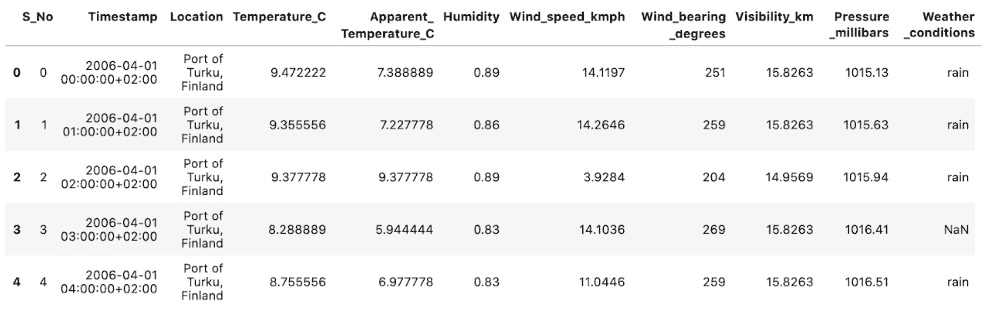
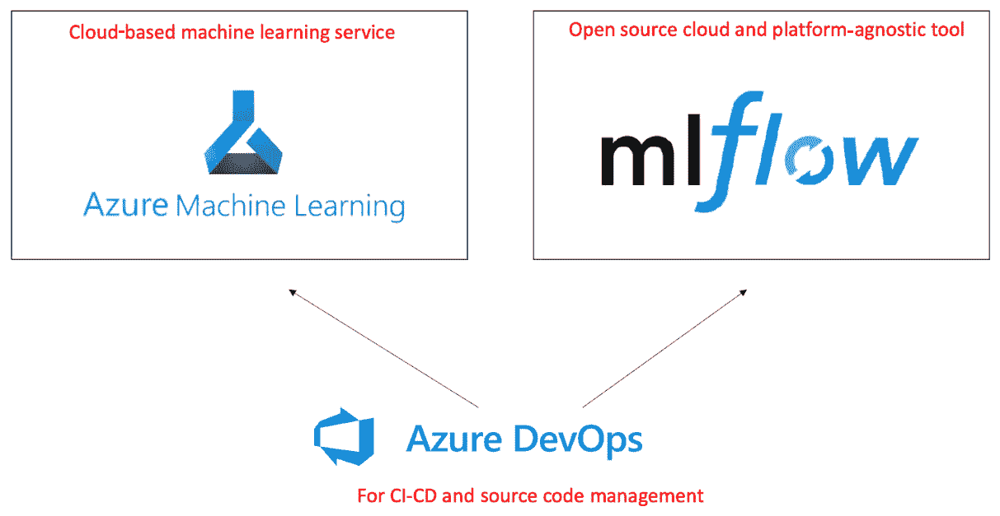
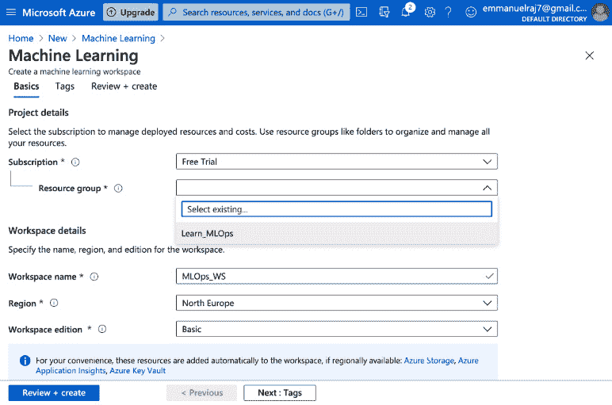
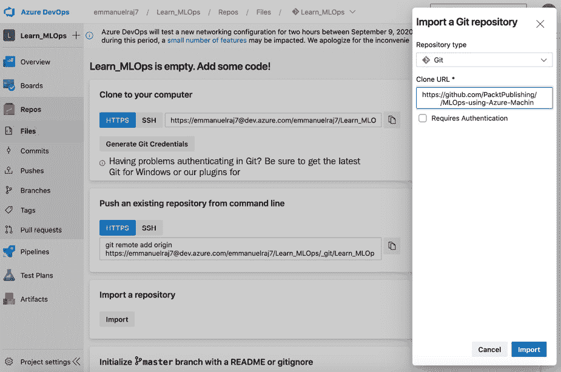
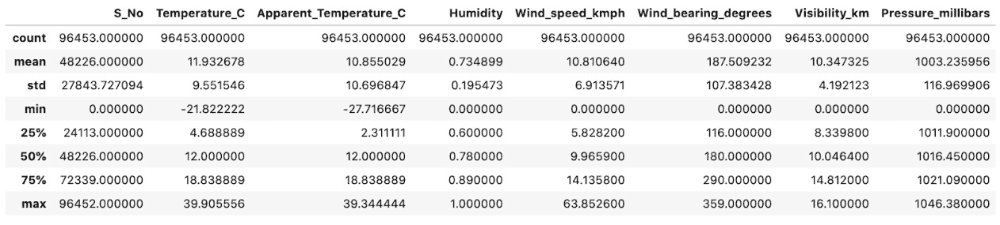
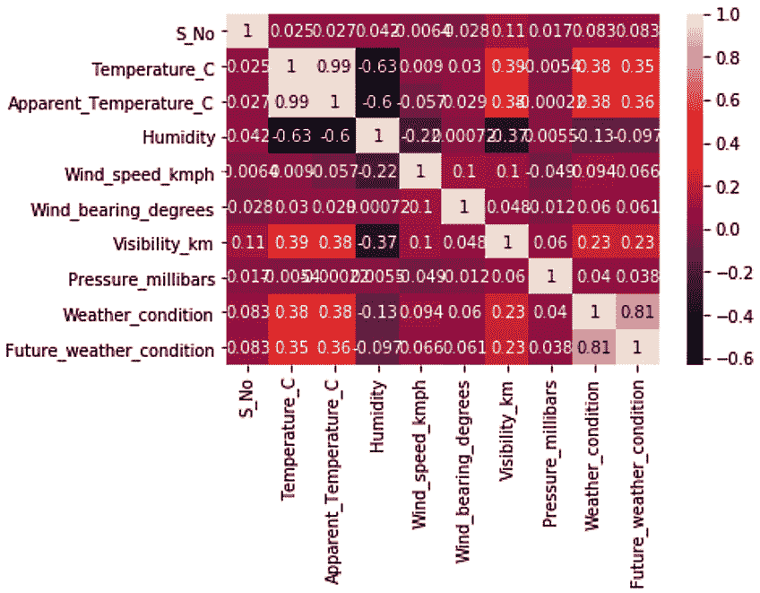
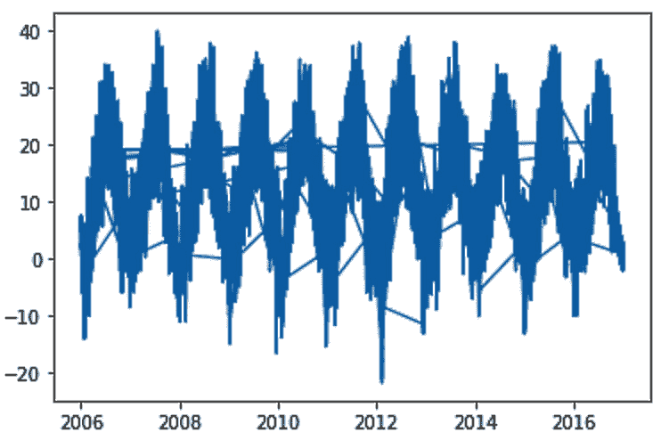

# 第三章：代码遇见数据

在本章中，我们将通过解决一个业务问题来开始动手实践**MLOps**的实施，我们将在前一章讨论的 MLOps 工作流程中学习。我们还将讨论**机器学习**（**ML**）的源代码管理有效方法，探索数据质量特性，并分析和塑造数据以适应 ML 解决方案。

我们从对业务问题进行分类开始，以编制最适合的 MLOps 解决方案。在此之后，我们将设置实施解决方案所需的资源和工具。讨论了 10 个关于 ML 源代码管理的指导原则，以应用干净的代码实践。我们将讨论构成 ML 高质量数据的内容，以及更多内容，然后处理与业务问题相关的数据集，并将其摄入和版本控制到 ML 工作区。本章的大部分内容都是实践性的，旨在让你对 MLOps 有一个良好的理解和经验。为此，我们将在本章中涵盖以下主要主题：

+   业务问题分析和问题分类

+   设置资源和工具

+   机器学习源代码管理的 10 个原则

+   适合机器学习的好数据

+   数据预处理

+   数据注册和版本控制

+   向 ML 管道迈进

不再拖延，让我们直接进入揭秘业务问题并使用 MLOps 方法实施解决方案。

# 业务问题分析和问题分类

在前一章中，我们研究了以下业务问题陈述。在本节中，我们将通过使用原则对问题进行分类，以编制实施路线图来揭秘问题陈述。我们将快速查看我们用于解决业务问题的数据集，并决定哪种 ML 模型能够高效地解决业务问题。最后，我们将对实施稳健和可扩展的 ML 操作进行分类，并决定实施所需的工具。

这是问题陈述：

你作为数据科学家，在一个位于芬兰的货运公司的小型数据科学家团队中工作。90%的货物通过货运进入芬兰。你被分配的任务是在芬兰图尔库港的货运操作中节省 20%的成本。这可以通过开发一个预测港口 4 小时后天气状况的 ML 解决方案来实现。你需要监测可能出现的雨天，这可能会因为人力资源和交通而扭曲港口的运营，进而影响港口的供应链运营。你的 ML 解决方案将帮助港口当局提前 4 小时预测可能的降雨；这将节省 20%的成本，并使港口的供应链运营更加顺畅。

解决问题的第一步是使用适当的方法对其进行简化和分类。在前一章中，我们讨论了如何将商业问题分类以使用机器学习来解决它。现在，让我们将这些原则应用到制定其实施的清晰路线图。

首先，我们将查看我们将训练哪种类型的模型以产生最大的商业价值。其次，我们将确定我们 MLOps 实现的正确方法。

为了决定要训练的模型类型，我们可以先浏览 GitHub 上可用的数据集：[`github.com/PacktPublishing/EngineeringMLOps`](https://github.com/PacktPublishing/EngineeringMLOps)。

在 *图 3.1* 中，这是一个 `weather_dataset_raw.csv` 数据集的快照。文件大小为 10.7 MB，行数为 96,453，文件格式为 CSV：



图 3.1 – 数据集快照

通过评估数据，我们可以将商业问题分类如下：

+   `天气状况` 列描述了一个事件是否记录了雨、雪或晴朗的条件。这可以被框架化或重新标记为 `rain` 或 `no rain` 并用于执行二元分类。因此，使用监督学习方法解决商业问题很简单。

+   **MLOps 方法**：通过观察问题陈述和数据，以下是事实：

    (a) 数据：训练数据大小为 10.7 MB。数据量相对较小（不能算作大数据）。

    (b) 操作：我们需要训练、测试、部署和监控一个机器学习模型，以预测图尔库港每小时的天气情况（新数据记录时提前 4 小时）。

    (c) 团队规模：一个小/中型数据科学家团队，没有 DevOps 工程师。

根据上述事实，我们可以将操作分类为 **小型团队操作**；不需要大数据处理，团队规模小且敏捷。现在，我们将探讨一些适合的工具来实施解决当前业务问题所需的操作。

为了让我们对 MLOps 实施有一个全面的理解，我们将同时使用两种不同的工具来实施业务问题：

+   **Azure Machine Learning**（微软 Azure）

+   **MLflow**（一个开源的云和平台无关的工具）

我们使用这两个工具来查看纯基于云的方法和开源/云无关的方法是如何工作的。所有代码和 CI/CD 操作都将使用 Azure DevOps 进行管理和编排，如图 *图 3.2* 所示：



图 3.2 – 解决方案中的 MLOps 工具

现在，我们将设置实施商业问题解决方案所需的工具和资源。由于我们将使用 Python 作为主要的编程语言，因此需要在您的 Mac、Linux 或 Windows 操作系统中安装 **Python 3**。

# 设置资源和工具

如果你已经在你的 PC 上安装并设置了这些工具，请随意跳过此部分；否则，请按照详细的说明来启动它们。

## 安装 MLflow

我们首先安装 MLflow，它是一个开源平台，用于管理 ML 生命周期，包括实验、可重复性、部署和中央模型注册。

要安装 MLflow，请转到你的终端并执行以下命令：

```py
pip3 install mlflow
```

安装成功后，通过执行以下命令来测试安装，以启动`mlflow`跟踪 UI：

```py
mlflow ui
```

运行`mlflow`跟踪 UI 时，你将在你的机器上运行一个监听端口`5000`的服务器，并输出如下信息：

```py
[2021-03-11 14:34:23 +0200] [43819] [INFO] Starting gunicorn 20.0.4
[2021-03-11 14:34:23 +0200] [43819] [INFO] Listening at: http://127.0.0.1:5000 (43819)
[2021-03-11 14:34:23 +0200] [43819] [INFO] Using worker: sync
[2021-03-11 14:34:23 +0200] [43821] [INFO] Booting worker with pid: 43821
```

你可以在`http://localhost:5000`访问和查看`mlflow` UI。当你成功安装`mlflow`并运行跟踪 UI 时，你就可以安装下一个工具了。

## Azure 机器学习

Azure 机器学习提供了一个基于云的 ML 平台，用于训练、部署和管理 ML 模型。此服务可在 Microsoft Azure 上使用，因此先决条件是拥有一个 Microsoft Azure 的免费订阅。请创建一个大约有 170 美元信用额的免费账户，这足以实现解决方案，请在此处创建：[`azure.microsoft.com/`](https://azure.microsoft.com/)。

当你拥有 Azure 的访问/订阅时，继续下一部分以启动 Azure 机器学习。

### 创建资源组

**资源组**是一组与 Azure 解决方案相关的相关资源的集合。它是一个容器，将所有与某个服务或解决方案相关的资源捆绑在一起。创建资源组可以方便地访问和管理解决方案。让我们从创建自己的资源组开始：

1.  打开 Azure 门户。

1.  访问门户菜单（如果你默认不在主页上，请转到门户的主页），将鼠标悬停在导航部分中的资源组图标上。将出现一个**创建**按钮；点击它以创建一个新的资源组：![图 3.3 – 创建资源组

    ![img/B16572_03_03.jpg]

    图 3.3 – 创建资源组

1.  创建一个名为你选择的资源组（推荐使用`Learn_MLOps`），如图 3.3 所示。

1.  选择一个靠近你的区域以获得最佳性能和定价。例如，在图 3.3 中，一个名为`Learn MLOps`且区域为**（欧洲）北欧**的资源组已准备好创建。在点击**审查 + 创建**按钮并 Azure 验证请求后，将出现最终的**创建**按钮。应该按下最终的**创建**按钮来创建新的资源组。

当资源组经过审查并创建后，你可以在该资源组中设置和管理所有与 ML 解决方案相关的服务。新创建的资源组将列在资源组列表中。

### 创建 Azure 机器学习工作区

ML 工作区是跟踪和管理您的 ML 训练、部署和监控实验的中心枢纽。要创建 Azure Machine Learning 工作区，请转到 Azure 门户菜单，点击 `Machine Learning` 并选择它。您将看到以下屏幕：



图 3.4 – 创建 Azure Machine Learning 工作区

使用您选择的名称命名工作区（例如，我们在 *图 3.4* 中将其命名为 **MLOps_WS**）。选择您之前创建的资源组以将此 ML 服务与其关联（*图 3.4* 中选择的是 **Learn_MLOps**）。最后，点击 **Review + create** 按钮，您将被带到一个新的屏幕，其中包含最终的 **Create** 按钮。按下最终的 **Create** 按钮以创建您的 Azure Machine Learning 工作区。

创建 Azure Machine Learning 工作区（`Learn_MLOps`）后，Azure 平台将部署此服务所需的所有资源。与 Azure Machine Learning 实例（`Learn_MLOps`）一起部署的资源，如 Blob 存储、密钥保管库和应用洞察，将配置并关联到工作区。这些资源将通过工作区和 SDK 进行消耗或使用。

您可以在以下位置找到创建 Azure Machine Learning 实例的详细说明：[`docs.microsoft.com/en-us/azure/machine-learning/how-to-manage-workspace`](https://docs.microsoft.com/en-us/azure/machine-learning/how-to-manage-workspace)。

### 安装 Azure Machine Learning SDK

在您的 PC 的终端或命令行中，安装 Azure Machine Learning SDK，该 SDK 将在代码中广泛用于编排实验。要安装它，请运行以下命令：

```py
pip3 install --upgrade azureml-sdk
```

您可以在以下位置找到详细说明：[`docs.microsoft.com/en-us/python/api/overview/azure/ml/install?view=azure-ml-py`](https://docs.microsoft.com/en-us/python/api/overview/azure/ml/install?view=azure-ml-py)。

## Azure DevOps

所有源代码和 CI/CD 相关的操作都将通过 Azure DevOps 进行管理和编排。我们在 Azure DevOps 仓库中管理的代码将用于通过 CI/CD 管道训练、部署和监控 ML 模型。让我们先创建一个 Azure DevOps 订阅：

1.  在 [dev.azure.com](http://dev.azure.com) 上创建一个免费账户。您可以使用现有的 Microsoft 或 GitHub 账户创建一个免费账户。

1.  创建一个名为 `Learn_MLOps` 的项目（根据您的偏好将其设置为公开或私有）。

1.  转到 **repos** 部分。在 **Import a repository** 部分中，点击 **Import** 按钮。

1.  从此仓库导入公共 GitHub 项目的仓库：[`github.com/PacktPublishing/EngineeringMLOps`](https://github.com/PacktPublishing/EngineeringMLOps )（如 *图 3.5* 所示）：



图 3.5 – 将 GitHub 仓库导入到 Azure DevOps 项目中

导入 GitHub 仓库后，将显示导入仓库的文件。

## JupyterHub

最后，我们需要一个交互式数据分析和可视化工具来使用我们的代码处理数据。为此，我们使用**JupyterHub**。这是一个常用的数据科学工具，被数据科学家广泛用于处理数据、可视化数据和训练机器学习模型。要安装它，请遵循以下两个简单步骤：

1.  在您的 PC 上通过命令行安装 JupyterHub：

    ```py
    python3 -m pip install jupyterhub
    ```

    您可以在此处找到详细说明：[`jupyterhub.readthedocs.io/en/stable/quickstart.html`](https://jupyterhub.readthedocs.io/en/stable/quickstart.html)。

1.  安装 Anaconda。

    Anaconda 是必需的，因为它安装依赖项、设置环境和支持 JupyterHub 的服务。根据以下详细说明下载并安装 Anaconda：[`docs.anaconda.com/anaconda/install/`](https://docs.anaconda.com/anaconda/install/)。

    现在我们已经为动手实现做好了准备，让我们看看管理良好代码和数据需要什么。

# 机器学习源代码管理的 10 个原则

这里有一些原则可以应用于你的代码，以确保代码的质量、健壮性和可扩展性：

+   **模块化**：拥有模块化代码比拥有一个大块代码更好。模块化鼓励重用并便于通过替换所需组件进行升级。为了避免不必要的复杂性和重复，请遵循以下黄金法则：

    两个或多个机器学习组件只有在其中一个使用另一个时才应配对。如果它们都不使用对方，则应避免配对。

    与其环境紧密配对的机器学习组件比紧密配对的组件更容易修改或替换。

+   **单一任务专用函数**：函数是管道和系统的基本构建块，它们是用于执行特定任务的代码小段。函数的目的是避免命令重复并使代码可重用。它们可以很容易地变成一组复杂的命令以方便任务。为了使代码可读和可重用，最好有一个专门用于单一任务的函数，而不是多个任务。拥有多个函数比一个长而复杂的函数更好。

+   `错误 300`。对代码块进行结构化并尝试限制函数和类的最大缩进级别可以提高代码的可读性。

+   **清洁代码**：如果你必须解释代码，那么它就不是很好。清洁代码是自我解释的。它侧重于高可读性、最佳模块化、可重用性、非重复性和最佳性能。清洁代码降低了维护和升级你的机器学习管道的成本。它使团队能够高效地工作，并且可以扩展到其他开发者。

    要深入了解这一点，请阅读**罗伯特·马丁**的《Clean Code: A Handbook of Agile Software Craftsmanship》。

+   **测试：** 确保系统的健壮性至关重要，而测试在这一过程中发挥着重要作用。一般来说，测试包括单元测试和验收测试。单元测试是一种通过强制数据和使用方法测试源代码组件的健壮性的方法，以确定该组件是否适合生产系统。验收测试是为了测试整个系统，以确保系统实现了用户需求；在实时场景中验证端到端业务流程。测试对于确保代码的高效运行至关重要：“如果未经测试，它就是有缺陷的。”

要了解更多关于单元测试实现的信息，请阅读此文档：[`docs.python.org/3/library/unittest.html`](https://docs.python.org/3/library/unittest.html)。

+   **版本控制（代码、数据和模型）：** 在机器学习系统中，Git 用于代码的版本控制。版本控制的目的确保所有参与系统开发的团队成员都能访问最新的代码，并且在硬件故障时代码不会丢失。与 Git 一起工作的一个规则应该是不要破坏主分支（分支）。这意味着当你有一个在仓库中的工作代码，并且添加新功能或进行改进时，你应该在一个功能分支中这样做，当代码工作并且经过审查后，将其合并到主分支。分支应该有一个简短且描述性的名称，例如 feature/label-encoder。分支命名和审批指南应该与团队进行适当的沟通和同意，以避免任何复杂性和不必要的冲突。代码审查是通过向代码仓库提交拉取请求来完成的。通常，最好以小于 400 行的代码块进行审查。在实践中，这通常意味着一次一个模块或子模块。

    数据版本化对于机器学习系统至关重要，因为它帮助我们追踪特定版本的代码所使用的数据。数据版本化可以使得模型的可复现性以及满足商业需求和法律法规成为可能。我们可以随时回溯并查看机器学习系统采取某些行动的原因。同样，模型（工件）的版本化对于追踪哪个版本的模型生成了机器学习系统的特定结果或行动也很重要。我们还可以追踪或记录用于训练模型特定版本的参数。这样，我们可以实现模型工件、数据和代码的端到端可追溯性。代码、数据和模型的版本控制可以增强机器学习系统的透明度和效率，这对于开发和维护它的人来说是非常有益的。

+   `print`语句对于测试和调试很有用，但不适合生产环境。日志记录器包含的信息，尤其是系统信息、警告和错误，对于监控生产系统非常有用。

+   **错误处理**：错误处理对于处理边缘情况至关重要，特别是那些难以预测的情况。即使你认为不需要，也建议捕获和处理异常，因为预防胜于治疗。将日志记录与异常处理结合起来可以是一种处理边缘情况的有效方法。

+   **可读性**：代码可读性有助于信息传递、代码效率和代码可维护性。可以通过遵循行业标准的编码实践，如 PEP-8 ([`www.python.org/dev/peps/pep-0008/`](https://www.python.org/dev/peps/pep-0008/)) 或 JavaScript 标准风格（取决于你使用的语言）来实现。使用文档字符串也可以提高可读性。文档字符串是在例如函数开头编写的文本，描述它做什么以及可能需要什么输入。在某些情况下，一行解释就足够了，例如：

    ```py
    def swap(a,b):
    """Swaps the variables a and b. Returns the swapped variables""" 
    return b, a
    ```

    对于更复杂的函数，需要更长的文档字符串。解释参数和返回值是一个好主意：

    ```py
    def function_with_types_in_docstring(param1, param2): """Example function with types documented in the docstring.
    `PEP 484`_ type annotations are supported. If attribute, parameter, and
    return types are annotated according to `PEP 484`_, they do not need to be
    included in the docstring:
    Args:
        param1 (int): The first parameter. 
        param2 (str): The second parameter.
    Returns:
         bool: The return value. True for success, False otherwise.
                                  """
    ```

**注释和文档化**：注释和文档对于维护可持续的代码至关重要。并非总是能够清晰地解释代码。在这种情况下，注释可以有用，以防止混淆并解释代码。注释可以传达诸如版权信息、意图、代码澄清、可能的警告和代码详细说明等信息。对系统和模块的详细文档可以使团队高效地工作，并且代码和资产可以扩展给其他开发者。对于文档，有开源工具可用于文档化 API，例如 Swagger ([`swagger.io`](https://swagger.io)) 和 Read the Docs ([`readthedocs.org`](https://readthedocs.org))。使用正确的工具进行文档化可以提高效率并标准化开发者的知识。

# 什么是有用的机器学习数据？

良好的机器学习模型是训练在高质量数据上的结果。在进行机器学习训练之前，一个先决条件是拥有高质量的数据。因此，我们需要处理数据以提高其质量。所以，确定数据的质量是至关重要的。以下五个特征将使我们能够辨别数据的质量：

+   **准确性**：准确性是数据质量的关键特征，因为不准确的数据可能导致机器学习模型性能不佳，并在现实生活中产生后果。为了检查数据的准确性，确认信息是否代表现实生活中的情况。

+   **完整性**：在大多数情况下，不完整的信息是不可用的，如果机器学习模型基于它进行训练，可能会导致错误的输出。检查数据的完整性至关重要。

+   **可靠性**：数据中的矛盾或重复可能导致数据不可靠。可靠性是一个关键特性；信任数据至关重要，尤其是在使用机器学习做出现实生活中的决策时。在一定程度上，我们可以通过检查偏差和分布来评估数据的可靠性。在任何极端情况下，数据可能不适合用于机器学习训练，或者可能携带偏差。

+   **相关性**：数据的相关性在确定是否收集了不相关信息以及进行上下文化中起着至关重要的作用。拥有相关数据可以使得在现实生活场景中使用机器学习做出适当的决策。

+   **及时性**：过时或陈旧的信息会耗费企业的时间和金钱；在某些情况下，拥有最新信息至关重要，并且可以提高数据质量。使用过时数据通过机器学习做出的决策可能代价高昂，并可能导致错误决策。

当这五个特性最大化时，将确保数据质量达到最高。带着这些原则，让我们深入到实现中，即代码与数据的结合。

首先，让我们评估数据并对其进行处理，以便为机器学习训练做好准备。要开始，请将您导入的存储库克隆到您的 Azure DevOps 项目中（从 GitHub）：

```py
git clone https://xxxxxxxxx@dev.azure.com/xxxxx/Learn_MLOps/_git/Learn_MLOps
```

接下来，打开您的终端，访问克隆存储库的文件夹，并启动用于数据处理的 JupyterLab 服务器。为此，请在终端中输入以下命令：

```py
jupyter lab
```

这将自动在您的浏览器中打开一个窗口，地址为 `http://localhost:8888`，您可以在其中使用 JupyterLab 界面进行编码和执行代码。在 `Code_meets_data_c3` 文件夹中，有一个 Python 脚本 (`dataprocessing.py`) 和一个 `.ipynb` 笔记本 (`dataprocessing.ipynb`)；您可以随意运行这些文件中的任何一个，或者创建一个新的笔记本，并按照接下来的步骤操作。

我们将执行如图 3.6 所述的任务的计算。数据处理将在您的 PC 上进行，随后在云中的计算目标上进行机器学习训练、部署和监控。这是为了获得在多种设置中实现模型的经验。在本章的剩余部分，我们将进行数据处理（本地），以便将数据质量提升到最佳，以便进行机器学习训练（在下一章中描述的云中进行）。

![图 3.6 – 数据和机器学习任务的计算位置]

![img/B16572_03_06.jpg]

图 3.6 – 数据和机器学习任务的计算位置

为了处理原始数据并将其准备好用于机器学习，您将在您的本地 PC 上进行计算和数据处理。我们首先安装和导入所需的包，并导入原始数据集（如 `dataprocessing.ipynb` 和 `.py` 脚本中所示）。笔记本中的 Python 指令必须在现有的笔记本中执行：

```py
%matplotlib inline
import pandas as pd
import numpy as np
from matplotlib import pyplot as plt
from matplotlib.pyplot import figure
import seaborn as sns
from azureml.core import Workspace, Dataset
#import dataset
df = pd.read_csv('Dataset/weather_dataset_raw.csv')
```

通过这种方式，您已经将数据集导入了一个 pandas DataFrame，名为 `df`，以便进行进一步的处理。

# 数据预处理

原始数据不能直接用于训练机器学习模型。在训练机器学习模型之前，我们必须对数据进行精炼或预处理。为了进一步分析导入的数据，我们将执行一系列步骤，将数据预处理成适合机器学习训练的形状。我们首先评估数据的质量，以检查准确性、完整性、可靠性、相关性和时效性。在此之后，我们将校准所需数据并将文本编码为数值数据，这对于机器学习训练是理想的。最后，我们将分析相关性和时间序列，并过滤掉与训练机器学习模型无关的数据。

## 数据质量评估

为了评估数据的质量，我们寻找准确性、完整性、可靠性、相关性和时效性。首先，让我们检查数据是否完整和可靠，通过评估格式、累积统计和异常，如缺失数据。我们使用以下 pandas 函数：

```py
df.describe()
```

通过使用 `describe` 函数，我们可以在输出中观察到以下描述性统计：



图 3.7 – DataFrame 的描述性统计

可以进行一些观察，以得出数据是一致的、相关的结论，因为它描述了现实生活中的统计数据，如平均温度约为 ~11 摄氏度和风速约为 ~10 公里/小时。芬兰的最低温度通常达到约 ~-21 摄氏度，平均能见度为 10 公里。这样的事实描述了数据的关联性和数据来源条件。现在，让我们观察列格式：

```py
df.dtypes
```

这里是每列的格式：

+   `S_No`                                           `int64`

+   `Timestamp`                                `object`

+   `Location`                                     `object`

+   `Temperature_C`                         `float64`

+   `Apparent_Temperature_C`      `float64`

+   `Humidity`                                    `float64`

+   `Wind_speed_kmph`                  `float64`

+   `Wind_bearing_degrees`           `int64`

+   `Visibility_km`                              `float64`

+   `Pressure_millibars`                    `float64`

+   `Weather_conditions`                `object`

+   `dtype:`                                         `object`

大多数列都是数值型（`float` 和 `int`），正如预期的那样。`Timestamp` 列是 `object` 格式，需要将其更改为 `DateTime` 格式：

```py
df['Timestamp'] = pd.to_datetime(df['Timestamp'])
```

使用 pandas 的 `to_datetime` 函数，我们将 `Timestamp` 转换为 `DateTime` 格式。接下来，让我们看看是否存在任何空值。我们使用 pandas 的 `isnull` 函数来检查这一点：

```py
df.isnull().values.any()
```

在检查任何空值后，如果发现空值，则作为下一步，校准缺失数据至关重要。

## 校准缺失数据

数据中存在缺失值并不理想，因为这表明数据质量较差。可以使用各种技术来替换缺失数据或值，而不会影响数据的正确性和可靠性。在检查我们所工作的数据后，我们发现了一些缺失值。我们使用`前向填充`方法来处理缺失数据：

```py
df['Weather_conditions'].fillna(method='ffill', inplace=True, axis=0)
```

`NaN`或空值仅在`Weather_conditions`列中观察到。我们使用 pandas 的`fillna()`方法和前向填充（`ffill`）方法来替换`NaN`值。由于天气是渐进的，数据中可能会复制上一个事件。因此，我们使用前向填充方法，该方法复制最后一个观察到的非空值，直到遇到另一个非空值。

## 标签编码

由于机器不理解人类语言或文本，所有文本都必须转换为数字。在那之前，让我们处理文本。我们有一个包含文本值或标签的`Weather_conditions`列，例如`rain`、`snow`和`clear`。这些值是通过 pandas 的`value_counts()`函数找到的，如下所示：

```py
df['Weather_conditions'].value_counts()
```

`Weather_conditions`可以通过将列标签分类为两个标签`rain`或`no_rain`来简化。在这两个类别中进行预测将使我们能够解决货运公司的业务问题：

```py
df['Weather_conditions'].replace({"snow": "no_rain",  "clear": "no_rain"}, inplace=True)
```

这将用`no_rain`替换`snow`和`clear`值，因为这两种条件都意味着港口没有降雨。现在标签已经处理完毕，我们可以使用`rain`和`no_rain`将`Weather_conditions`列转换为机器可读的形式或数字。标签编码可以很有效，因为它将这些值转换为 0 和 1。如果有超过两个值，**独热编码**是一个不错的选择，因为将增量数字分配给分类变量可以在训练期间赋予变量更高的优先级或数值偏差。独热编码防止对任何变量的偏差或更高的偏好，确保对分类变量的每个值都给予中立的特权。在我们的案例中，因为我们只有两个分类变量，所以我们使用 scikit-learn 执行标签编码，如下所示：

```py
from sklearn.preprocessing import LabelEncoder
le = LabelEncoder()
y = df['Weather_conditions']
y = le.fit_transform(y)
```

在这里，我们导入`LabelEncoder()`函数，该函数将使用`fit_transform()`方法将`Weather_conditions`列编码为 0 和 1。我们可以通过以下方式用标签编码或机器可读的形式替换之前的文本列到`Weather_condition`列：

```py
y = pd.DataFrame(data=y, columns=["Weather_condition"])
df = pd.concat([df,y], axis=1)
df.drop(['Weather_conditions'], axis=1, inplace=True)
```

在这里，我们将我们的新标签编码或机器可读的`Weather_condition`列连接到 DataFrame 中，并删除之前的非机器可读或文本形式的`Weather_conditions`列。数据现在以机器可读的形式存在，并准备好进行进一步处理。您可以在笔记本中执行`df.head()`来检查转换后的数据（可选）。

## 新功能 – 未来天气状况

我们的任务是预测 4 小时后的天气状况，因此我们通过将`Current_weather_condition`向右移动四行来创建一个名为`Future_weather_condition`的新特征，因为每一行记录的时间间隔为一个小时。`Future_weather_condition`是 4 小时后未来天气状况的标签。我们将使用这个新特征作为依赖变量，使用机器学习进行预测：

```py
df['Future_weather_condition'] = df.Current_weather_condition.shift(4, axis = 0) 
df.dropna(inplace=True)
```

我们将在 DataFrame 上使用 pandas 的`dropna()`函数来丢弃或删除空值，因为一些行由于移动到新列而会有空值。

## 数据相关性和过滤

现在数据已经完全机器可读，我们可以使用**皮尔逊相关系数**来观察每一列与其他列之间的关系。在机器学习模型训练之前，数据与特征的相关性分析是特征选择的重要步骤，尤其是在特征是连续的，如我们案例中那样。皮尔逊相关系数是每个变量（*X*和*y*）之间的统计线性相关，产生一个介于*+1*和*-1*之间的值。*+1*表示正线性相关，*-1*表示负线性相关，而*0*表示没有线性相关。它可以用来理解连续变量之间的关系，但值得注意的是，皮尔逊相关系数并不意味着因果关系。我们可以使用 pandas 来观察我们数据中的皮尔逊相关系数，如下所示：

```py
df.corr(method="pearson")
# Visualizing using heatmap
corrMatrix = df.corr()
sn.heatmap(corrMatrix, annot=True)
plt.show()
```

这是`Pearson`相关系数热图：



图 3.8 – 相关系数热图

从*图 3.8*中的热图中，我们可以看到`Temperature`和`Apparent_Temperature_C`的系数为`0.99`。`S_No`（序列号）是一个连续值，它大致相当于 DataFrame 的增量索引，可以丢弃或过滤掉，因为它并不提供很大的价值。因此，`Apparent_Temperature`和`S_No`都被丢弃或过滤掉了。现在让我们观察我们的依赖变量`Future_weather_condition`及其与其他自变量之间的相关性：


图 3.9 – `Future_weather_condition`的皮尔逊相关系数

任何介于 0.5 和 1.0 之间的值都有正相关，任何介于-0.5 和-1.0 之间的值都有负相关。从图中可以看出，与`Current_weather_condition`有正相关，`Temperature_C`也与`Future_weather_c`正相关。

## 时间序列分析

由于温度是一个连续变量，观察其随时间的变化趋势是很有意义的。我们可以使用 matplotlib 可视化时间序列图，如下所示：

```py
time = df['Timestamp]
temp = df['Temperature_C']
# plot graph
plt.plot(time, temp)
plt.show()
```

这是生成的图表：



图 3.10 – 温度随时间的变化趋势图

在评估 *3.10* 图中温度的时间序列进展后，我们可以看到它描绘了一个平稳模式，因为均值、方差和协方差在时间上观察到是平稳的。平稳行为可以是趋势、周期、随机游走或这三种的结合。这是有意义的，因为温度随季节变化并遵循季节性模式。这使我们到达数据分析和处理阶段的尾声；我们现在准备好在训练机器学习模型之前将处理后的数据注册到工作区。

# 数据注册和版本控制

在开始机器学习训练之前，注册和版本控制工作区中的数据至关重要，因为它使我们能够回溯我们的实验或机器学习模型到用于训练模型的数据源。版本化数据的目的是在任何时间点回溯，以复制模型的训练，或根据推理或测试数据解释模型的工作原理。出于这些原因，我们将注册处理后的数据并将其版本化，以便用于我们的机器学习管道。我们将使用 Azure 机器学习 SDK 将处理后的数据注册和版本化到 Azure 机器学习工作区，如下所示：

```py
subscription_id = '---insert your subscription ID here----'
resource_group = 'Learn_MLOps'
workspace_name = 'MLOps_WS' 
workspace = Workspace(subscription_id, resource_group, workspace_name)
```

从 Azure 机器学习门户获取您的 `subscription ID`、`resource_group` 和 `workspace_name`，如图 *3.11* 所示：

![Figure 3.11 – Workspace credentials (Resource group, Subscription ID, and Workspace name)]

![img/B16572_03_11.jpg]

![Figure 3.11 – Workspace credentials (Resource group, Subscription ID, and Workspace name)]

通过请求工作区凭据，将获得一个工作区对象。当运行 `Workspace()` 函数时，您的笔记本将连接到 Azure 平台。您将被提示点击一个身份验证链接，并提供一个随机代码和 Azure 账户详情。之后，脚本将确认身份验证。使用工作区对象，我们访问默认数据存储并将所需的数据文件上传到与工作区连接的 Azure Blob Storage 上的数据存储：

```py
# get the default datastore linked to upload prepared data
datastore = workspace.get_default_datastore()
#upload the local file from src_dir to target_path in datastore
datastore.upload(src_dir='Dataset', target_path='data')
dataset =  /
Dataset.Tablular.from_delimited_files(datastore.path('data/weather_dataset_processed.csv'))
```

`Tabular.from_delimited_files()` 函数可能在未安装 .NET Core 2.1 的 Linux 或 MacOS 机器上导致失败。为了正确安装此依赖项，请按照以下说明操作：[`docs.microsoft.com/en-us/dotnet/core/install/linux`](https://docs.microsoft.com/en-us/dotnet/core/install/linux)。成功执行上述命令后，您将上传数据文件到数据存储，并看到如图 *3.12* 所示的结果。您可以通过以下方式从数据存储预览数据集：

```py
# preview the first 3 rows of the dataset from the datastore
dataset.take(3).to_pandas_dataframe()
```

当数据上传到数据存储时，我们将按照以下方式将数据集注册到工作区并对其进行版本控制：

```py
weather_ds = dataset.register(workspace=workspace, name=weather_ds_portofTurku, description='processed weather data')
```

`register(...)` 函数将数据集注册到工作区，如图 *3.12* 所示。有关详细文档，请访问 https://docs.microsoft.com/en-us/azure/machine-learning/how-to-create-register-datasets#register-datasets:

![图 3.12 – 已注册在 ML 工作区中的处理数据集]

![img/B16572_03_12.jpg]

图 3.12 – 已注册在 ML 工作区中的处理数据集

# 面向 ML 管道

到目前为止，我们已经通过处理不规则性（如缺失数据）、通过观察相关性选择特征、创建新特征，最后将处理后的数据导入并版本化管理到机器学习工作区。在机器学习管道中，有两种方式可以加载数据以用于 ML 模型训练。一种是从中央存储（存储所有原始数据的地方）加载，第二种方式是使用特征存储。因为知识就是力量，在我们进入机器学习管道之前，让我们先了解特征存储的使用。

## 特征存储

特征存储通过存储重要特征并使其可用于训练或推理来补充中央存储。特征存储是一个将原始数据转换为 ML 模型可以直接用于训练和推理以做出预测的有用特征的存储库。原始数据通常来自各种数据源，这些数据源可以是结构化、非结构化、流式、批量或实时的。所有这些都需要被拉取、转换（使用特征管道）并存储在某处，而那个地方可以是特征存储。然后特征存储将数据提供给消费。数据科学家倾向于重复工作（尤其是数据处理）。如果我们有一个集中的特征存储，就可以避免这种情况。特征存储允许数据科学家与其他团队高效地共享和重用特征，从而提高他们的生产力，因为他们不必从头开始预处理特征。

![图 3.13：特征存储工作流程]

![img/B16572_03_13.jpg]

图 3.13：特征存储工作流程

如*图 3.13*所示，**特征存储**使用一个连接到**中央存储**（存储来自多个来源的数据）的**特征管道**来转换和存储原始数据，使其成为 ML 训练的有用特征。存储在特征存储中的特征可以用于训练、服务或发现洞察或趋势。以下是使用特征存储的一些好处：

+   为**训练数据**进行高效的**特征工程**

+   避免在训练前进行不必要的预处理

+   避免重复的特征工程

+   可用于快速推理（测试）的特征

+   系统支持特征服务

+   通过特征存储进行探索性数据分析

+   重新使用模型特征的机会

+   对特征进行快速查询

+   训练数据集的可重复性

+   监控生产中的特征漂移（我们将在*第十二章*，*模型服务和监控*)中学习特征漂移）

+   可用于数据漂移监控的功能

了解特征存储的优势是好的，因为它可以为机器学习管道（尤其是数据摄取步骤）提供动力，但并不适用于所有情况。这取决于你的用例。对于我们的用例实现，我们不会使用特征存储，而是直接从中央存储中联络数据，在那里我们已经预处理并注册了我们用于训练和测试的数据集。有了摄取和版本化的数据，你就可以开始构建你的机器学习管道了。机器学习管道将使进一步的特性工程、特性缩放、整理训练和测试数据集成为可能，这些数据集将被用于训练机器学习模型和调整机器学习训练的超参数。机器学习管道和功能将在云计算资源上执行，而不是像本章中我们在本地计算机上所做的那样。它将是纯云基础的。

# 摘要

在本章中，我们学习了如何识别适合商业问题的机器学习解决方案，并将操作分类以实施合适的 MLOps。我们设置了我们的工具、资源和开发环境。讨论了 10 个源代码管理的原则，随后是数据质量特性。恭喜！到目前为止，你已经实现了 MLOps 工作流程的关键构建块——数据处理和将处理后的数据注册到工作区。最后，我们简要了解了机器学习管道的基本要素。

在下一章，你将进行 MLOps 中最激动人心的部分：构建机器学习管道。让我们继续前进！
