# 第五章：模型评估和打包

在本章中，我们将详细了解机器学习模型的评估和可解释性指标。这将使我们能够在训练模型后全面了解其性能。我们还将学习如何打包模型并将它们部署以供进一步使用（例如在生产系统中）。我们将详细研究我们在上一章中如何评估和打包模型，并探索评估和解释模型的新方法，以确保对训练模型及其在生产系统中潜在可用性的全面理解。

我们从学习各种测量、评估和解释模型性能的方法开始本章。我们探讨测试模型以用于生产以及打包机器学习模型以用于生产和推理的多种方式。随着你将获得一个评估任何类型机器学习模型并将其打包用于生产的框架，我们将对机器学习模型的评估进行深入研究。准备好在评估方面打下坚实的基础，并使机器学习模型为生产做好准备。为此，我们将在本章中涵盖以下主要内容：

+   模型评估和可解释性指标

+   生产测试方法

+   为什么需要打包机器学习模型？

+   如何打包机器学习模型

+   可推理模型

# 模型评估和可解释性指标

获取数据和训练机器学习模型是创造商业价值的好起点。在训练模型后，衡量模型性能并理解模型为何以及如何以某种方式预测或表现至关重要。因此，模型评估和可解释性是 MLOps 工作流程中的关键部分。它们使我们能够理解和验证机器学习模型，以确定它们将产生的商业价值。由于存在多种类型的机器学习模型，因此有大量的评估技术。

回顾*第二章*，“描述你的机器学习问题”，其中我们研究了被归类为学习模型、混合模型、统计模型和**HITL**（**人机交互**）模型的各种类型的模型，我们现在将讨论评估这些模型的不同指标。以下是*图 5.1*中显示的一些关键模型评估和可解释性技术。这些已成为研究和工业界评估模型性能和证明模型性能的标准：

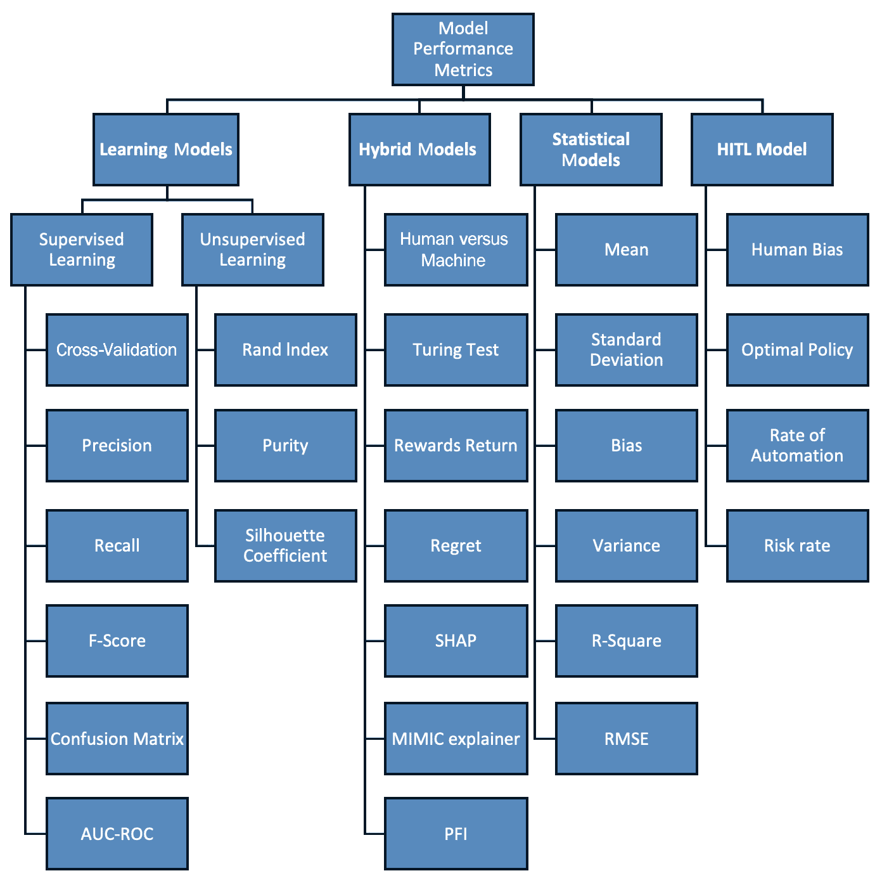

图 5.1 – 模型评估和解释分类法

（当谨慎导航、选择和执行时，此分类法中的技术几乎可以应用于任何商业问题。）

## 学习模型指标

**学习模型**分为两种类型 – 监督学习（监督学习模型或算法基于标记数据进行训练）和无监督学习（无监督学习模型或算法可以从未标记的数据中学习）。

正如我们在前面的章节中所研究的，监督学习算法的例子包括分类（随机森林、支持向量机等）和回归（线性回归、逻辑回归等）算法。另一方面，无监督学习的例子包括聚类（k 均值、DBSCAN、高斯混合模型等）和降维（PCA、随机森林、前向和后向特征消除等）算法。为了有效地衡量这些算法，以下是一些常用且高效的指标示例。

### 监督学习模型

监督学习模型在标记数据上训练。在训练数据中，输入的结果被标记或已知。因此，模型被训练来学习根据标记数据预测输入的结果。在训练模型后，评估模型潜力和性能是很重要的。以下是一些评估监督模型的指标。

#### 交叉验证

评估机器学习模型对于理解其行为至关重要，这可能会很棘手。通常，数据集被分成两个子集：训练集和测试集。首先，使用训练集来训练模型，然后使用测试集来测试模型。之后，评估模型的表现以确定错误，可以使用如模型在测试数据上的准确率百分比等指标。

这种方法并不可靠也不全面，因为一个测试集的准确性可能不同于另一个测试集。为了避免这个问题，交叉验证通过将数据集分割成多个折（片段）并提供解决方案，确保每个折在某个时刻被用作测试集，如图 *图 5.2* 所示：

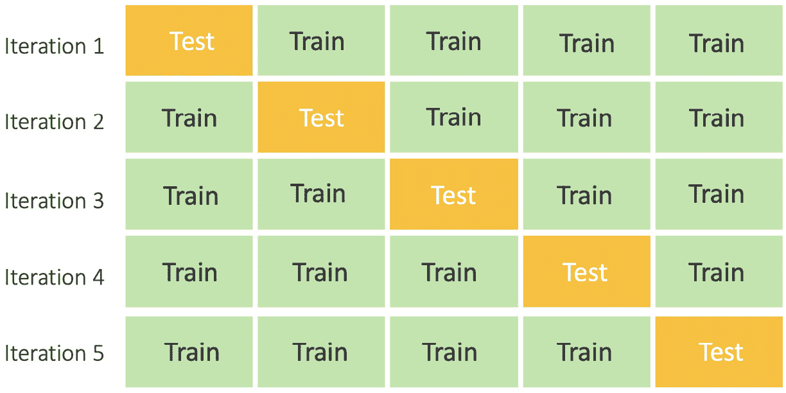

图 5.2 – K 折交叉验证

存在多种交叉验证方法，包括分层交叉验证、留一法交叉验证和 K 折交叉验证。K 折交叉验证被广泛使用，并且值得注意，因为这种技术涉及将数据集分割成 k 折/片段，然后在连续迭代中使用每个折作为测试集。这个过程很有用，因为每个迭代都有一个独特的测试集，用于测量准确性。然后，使用每个迭代的准确性来找到平均测试结果（通过简单地取所有测试结果的平均值来计算）。

通过交叉验证获得的平均准确度比传统的准确度度量更可靠和全面。例如，在*图 5.2*中，我们可以看到五个迭代。这些迭代中的每一个都有一个独特的测试集，通过测试每个迭代的准确度并平均所有准确度，我们得到使用 K 折交叉验证的模型平均准确度。值得注意的是，如果你有一个非常大的训练数据集，或者模型需要大量的时间、CPU 和/或 GPU 处理，那么 K 折可能不是一个好的选择。

#### 精确度

当一个分类器被训练时，精确度可以是一个在量化分类器做出的实际属于正类的正确正类预测中的关键指标。精确度量化了正确预测的正例数量。

例如，假设我们训练了一个分类器，用于从图像中预测猫和狗。在将训练好的模型应用于测试图像后，该模型用于从图像中预测/检测狗（换句话说，狗是正类）。在这种情况下，精确度量化了正确预测狗的数量（正类预测）。

精确度是正确预测的正例数量与预测的正例总数之比。

*精确度 = 真正例 / (真正例 + 假正例)*

**精确度**专注于最小化误报。精确度范围从 0 到 1，它与低误报率相关。精确度越高，越好；例如，一个预测癌症患者是否需要化疗治疗的图像分类器模型。如果模型预测患者应该接受化疗，而实际上并不需要，这可能会非常有害，因为化疗在不必要的情况下可能会产生有害的副作用。这种情况是一个危险的误报。高精确度得分将导致误报数量减少，而低精确度得分将导致误报数量增加。因此，关于化疗治疗，预测模型应该有一个高精确度得分。

#### 召回率

当一个分类器被训练时，召回率可以用来量化从数据集中所有正例总数中建立的正类预测。召回率衡量的是在可能做出的所有正类预测中，正确预测的数量。与仅告诉我们总预测中正确预测数量的精确度不同，召回率提供了遗漏正类预测的证据。

例如，考虑之前讨论过的相同例子，我们训练了一个分类器从图像中预测猫和狗。在将训练好的模型应用于测试图像后，该模型用于从图像中预测/检测狗（换句话说，狗是正类）。在这种情况下，召回率量化了遗漏的狗预测数量（正预测）。

以这种方式，召回率提供了对正类覆盖率的经验性指示。

*召回率 = 真阳性 / (真阳性 + 假阴性)*

**召回率**关注的是最小化假阴性。高召回率与低假阴性率相关。召回率越高，越好。例如，一个分析机场乘客个人资料的模型试图预测该乘客是否是潜在的恐怖分子。在这种情况下，有假阳性比有假阴性更安全。如果模型预测一个无辜的人是恐怖分子，这可以通过更深入的调查来检查。但如果恐怖分子通过了，许多生命可能会处于危险之中。在这种情况下，有假阴性比有假阳性更安全，因为可以通过深入的调查研究来检查假阴性。召回率应该很高，以避免假阴性。在这种情况下，高召回率比高精确率更重要。

#### F-score

在我们需要避免高假阳性和高假阴性的情况下，f-score 是一个有用的度量，可以帮助我们达到这种状态。F-measure 提供了一种将精确度和召回率合并为单一指标的方法，该指标反映了这两个属性。

精确度和召回率都不能完全描述整个情况。

我们可以拥有最好的精确度，但召回率却很糟糕，或者换句话说，F-measure 同时表达了精确度和召回率。它是根据以下公式来衡量的：

*F-Measure = (2 * Precision * Recall) / (Precision + Recall)*

精确度和召回率的调和平均值是 F-measure。在大多数情况下，你必须在这两者之间做出选择。如果你优化你的分类器以偏向一方而忽视另一方，调和平均值会迅速下降。当精确度和召回率相似时，它处于最佳状态；例如，一个通过输入患者的图像和血液检查来预测癌症早期的模型。在这个真实场景中，如果模型输出大量假阳性，可能会给医院带来很多不必要的成本，并可能对患者的健康造成伤害。另一方面，如果模型未能检测到真正的癌症患者，许多生命就会处于危险之中。在这种情况下，我们需要避免高假阳性和高假阴性，而在这里，f-score 是一个避免高假阳性和假阴性的有用度量。F-score 的值在 0 到 1 之间。f-score 越高，越好。我们可以期待在 f-score 较高的情况下，假阳性和假阴性的数量会更少。

#### 混淆矩阵

混淆矩阵是一个指标，它报告了分类模型在一系列已知预测值的测试数据样本上的性能。它是一个矩阵形式的指标，其中混淆矩阵是一个 N X N 矩阵，N 是预测的类别数量。例如，假设我们有两个类别要预测（二元分类），那么 N=2，因此我们将有一个 2 X 2 的矩阵，就像这里在*图 5.3*中所示：

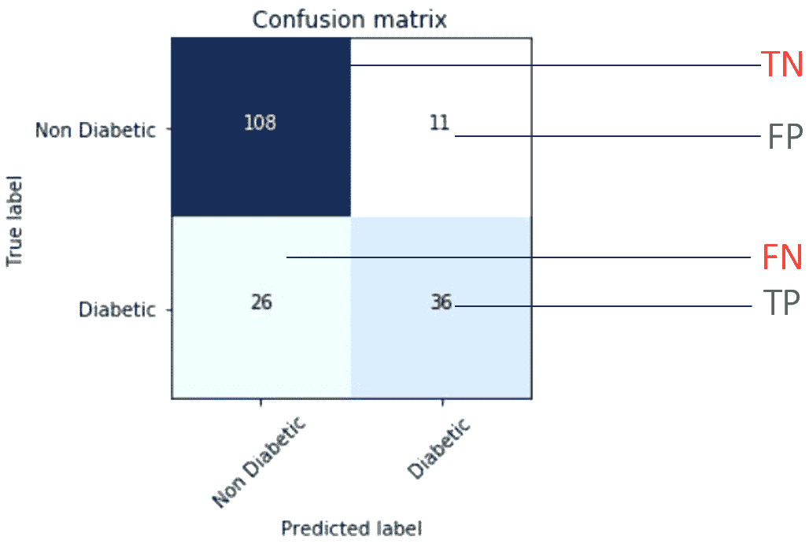

图 5.3 – 二元分类的混淆矩阵

*图 5.3*是糖尿病和非糖尿病患者之间二元分类混淆矩阵的一个例子。有 181 个测试数据样本，对这些样本进行了预测，以将患者数据样本分类为糖尿病和非糖尿病类别。使用混淆矩阵，你可以获得对模型性能的深入见解。例如，一眼就能看出有多少预测是真实的，有多少是假阳性。这种见解在许多情况下对解释模型性能非常有价值。以下是在混淆矩阵的上下文中这些术语的含义：

+   **真阳性**（**TP**）：这些案例预测为**是**，并且根据测试数据样本实际上也是**是**。

+   **真阴性**（**TN**）：这些案例预测为**无**，并且根据测试数据样本实际上也是**无**。

+   **假阳性**（**FP**）：模型预测**是**，但根据测试数据样本实际上是**否**。这种错误被称为**I 型错误**。

+   **假阴性**（**FN**）：模型预测**否**，但根据测试数据样本实际上是**是**。这种错误被称为**II 型错误**。

在*图 5.3*中，以下适用：

+   *x*轴代表由机器学习模型做出的预测。

+   *y*轴代表实际的标签。

+   矩阵中的第一和第四个方框（对角线方框）描述了正确预测的图像。

+   矩阵中的第二和第三个方框代表假预测。

+   在第一个方框中，（**非糖尿病** x **非糖尿病**），108 个数据样本（**真阴性** – **TN**）被预测为**非糖尿病**（正确预测）。

+   在第四个方框中，（**糖尿病** x **糖尿病**），36 个数据样本（**真阳性** – **TP**）被正确预测。

+   第二个方框（**猫** x **狗**）中的其余图片，11 张是假阳性。

+   第三个方框（**狗** x **猫**），包含 26 张图片，包含假阴性。

混淆矩阵可以提供对测试数据样本上做出的预测的整体图景，这种见解在解释模型性能方面具有重要意义。混淆矩阵是分类问题的**事实上的**错误分析指标，因为大多数其他指标都是从这个指标派生出来的。

#### AUC-ROC

对于观察模型性能的不同视角可以使我们能够解释模型性能并微调它以获得更好的结果。ROC 和 AUC 曲线可以提供这样的洞察。让我们看看**受试者工作特征**（**ROC**）曲线如何帮助我们解释模型性能。ROC 曲线是一个图表，展示了分类模型在所有分类阈值下的性能。该图表使用两个参数来描述模型性能：**真正例率**（**TPR**=`TP/TP+FN`）和**假正例率**（**FPR**=`FP/FP+TN`）。

以下图表显示了一个典型的 ROC 曲线：

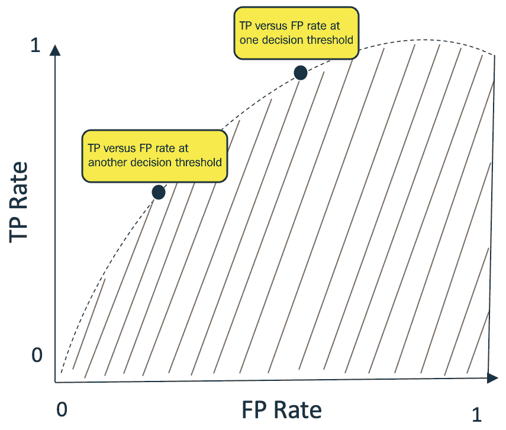


图 5.4 – ROC-AUC 曲线

ROC 曲线描述了不同分类阈值下的 TPR 与 FPR。降低分类阈值可以使更多项目被分类为阳性，这反过来又增加了假正例和真正例。**曲线下面积**（**AUC**）是一个用于量化分类器区分类别有效性和能力的指标，并用于总结 ROC 曲线。

AUC 值从`0`到`1`不等，如果 AUC 值为`1`，则分类器能够正确地区分所有正类和负类样本点；如果 AUC 值为`0`，则分类器无法正确地区分所有正类和负类样本点。当 AUC 值为`0.5`（未手动设置阈值）时，则这是一个随机分类器。

AUC 帮助我们根据预测的准确性对预测进行排序，但它不提供绝对值。因此，它是无尺度的。此外，AUC 与分类阈值无关。选择的分类阈值在使用 AUC 时并不重要，因为 AUC 估计模型预测的质量，而不考虑选择的分类阈值。

#### 马修斯相关系数

布莱恩·马修斯于 1975 年开发了**马修斯相关系数**（**MCC**）作为模型评估的方法。它计算实际值和预期值之间的差异。它是将混淆矩阵结果扩展到衡量分类器无效性的一个方法。TP、TN、FP 和 FN 是混淆矩阵中的四个条目。这些条目被纳入系数中：

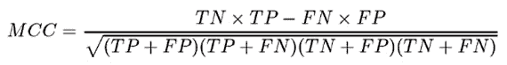

这个度量仅在预测返回所有这四个类别的良好比率时才会产生高分数。MCC 得分范围从`-1`到`+1`：

+   `1`是实际值和预测值之间最佳的一致性。

+   当得分为`0`时，这意味着实际值和预测值之间没有任何一致性。预测相对于实际值是随机的。

例如，MCC 得分为`0.12`表明分类器非常随机。如果它是`0.93`，这表明分类器很好。MCC 是一个有用的指标，有助于衡量分类器的无效性。

### 无监督学习模型

无监督学习模型或算法可以从未标记的数据中学习。无监督学习可以用于从未标记的数据中挖掘见解和识别模式。无监督算法广泛用于聚类或异常检测，而不依赖于任何标签。以下是评估无监督学习算法性能的一些指标。

#### 兰德指数

兰德指数是评估聚类技术质量的指标。它描述了簇之间的相似度。兰德指数衡量正确决策的百分比。决策将一对数据点（例如，文档）分配到同一个簇。

如果存在 `N` 个数据点，决策的总数等于 `N(N-1)/2`，这表示参与决策的数据点对。

*兰德指数 = TP + TN / TP + FP + FN + TN*

#### 纯度

`1`，不良聚类的纯度值接近 `0`。*图 5.5* 是计算 *纯度* 的示例的视觉表示，如下所述：

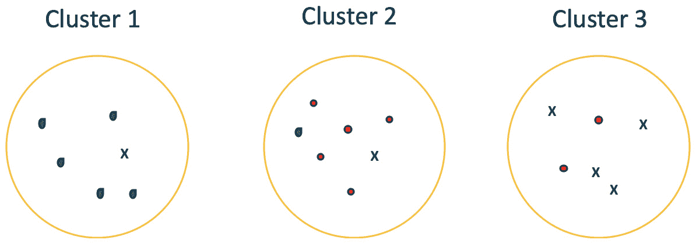

图 5.5 – 聚类后的簇

纯度是关于簇质量的外部评估标准。在 *图 5.5* 中，三个簇的多数类及其成员数量如下：绿色滴点 x 5（簇 1），红色点 x 5（簇 2），交叉 x 4（簇 3）。因此，纯度为 (1/17) x (5 + 5 + 3) = ~0.76。

#### 轮廓系数

对于聚类算法，确定簇的质量是很重要的。为了确定簇的质量或好坏，使用轮廓分数或轮廓系数作为指标。其值范围从 `-1` 到 `1`。当簇之间明显可区分或彼此远离时，轮廓分数为 `1`。相反，`-1` 表示簇分配错误，`0` 表示簇彼此之间没有区别。这就是计算轮廓分数的方法：

*轮廓分数 = (b-a)/max(a,b)*

`a` = 簇内每个点之间的平均距离（平均簇内距离）。

`b` = 所有簇之间的平均距离（平均簇间距离）。

## 混合模型的指标

通过结合传统方法开发混合方法来解决各种商业和研究问题，机器学习（ML）已经取得了快速发展。混合模型包括半监督、自监督、多实例、多任务、强化、集成、迁移和联邦学习模型。为了评估和验证这些模型，根据用例和模型类型使用一系列指标。了解这些指标对于能够根据您未来将开发和评估的模型使用正确的指标是有好处的。以下是评估混合模型的指标：

### 人类与机器测试

在训练和测试机器学习和深度学习模型时，渴望达到人类水平的表现是非常常见的。为了验证模型并得出结论，即模型已达到或超过了人类水平的表现，会在任务上执行人机对比实验。使用机器学习模型实现相同任务，并将人类的表现与机器学习模型的表现进行评估。根据上下文和任务，有各种评估人机表现的指标。以下是一些例子：

+   **双语评估辅助工具**（**BLEU**）是一种评估机器翻译从一种语言到另一种语言任务文本质量的方法。机器翻译算法生成的文本质量与人类输出进行比较。评估的目的是观察机器翻译与专业人类翻译的接近程度。

+   **基于检索的摘要评估辅助工具**（**ROUGE**）是一种人机性能评估指标，用于评估自动摘要和机器翻译等任务。此指标比较自动生成的摘要或翻译与人类生成的摘要/翻译。

#### 图灵测试

图灵测试是由著名的艾伦·图灵设计的。他在 1950 年代将其称为模仿游戏。图灵测试是评估机器展现与人类类似智能行为能力的测试。从另一个角度来看，图灵测试也是评估机器欺骗人类，使人类相信机器完成的任务类似于人类或由人类完成的测试。例如，我们可以在 *图 5.6* 中看到图灵测试的操作，其中人类审问者 X 与计算机或机器受试者（Bob）以及人类受试者（Alice）之间正在进行基于文本的交互：

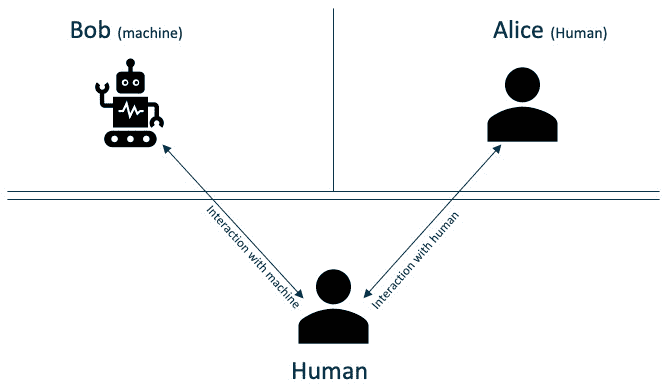

图 5.6 – 图灵测试

在图灵测试中，人类审问者 X 进行一系列交互，包括与 Bob（计算机）和 Alice（人类）的交互，目的是正确地区分人类和机器。如果审问者无法正确区分它们，或者错误地将机器误认为是人类（Bob 误认为是 Alice），则机器通过图灵测试。

#### 每次返回的奖励

强化学习模型是混合模型，涉及代理和操作环境之间的连续学习机制，以实现预定义的目标。代理根据达到目标的有效或最优步骤所获得的奖励进行学习。当目标是最佳控制时，你将希望根据代理在任务中的表现来衡量它。为了量化代理执行任务的好坏，可以使用奖励的聚合度量，如每集的总奖励（也称为“回报”）或每时间步的平均奖励，来评估和优化代理相对于环境和目标的控制。

#### 后悔

后悔是用于强化学习等混合模型的一个常用指标。在每一步，你计算最优决策的奖励与你的算法所采取的决策之间的差异。然后通过累加这些差异来计算累积后悔。最优策略下的最小后悔为 0。后悔越小，算法的表现越好。

后悔使代理的行动能够根据如图 5.7 所示的代理最佳性能的最佳策略进行评估。红色阴影区域是后悔：

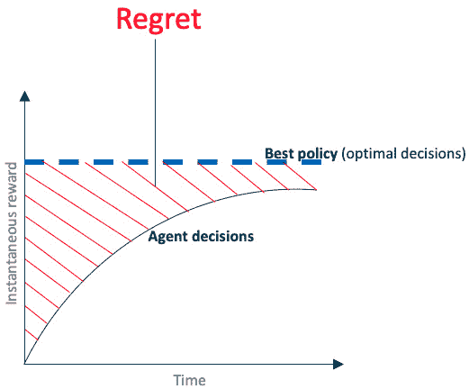

图 5.7 – 强化学习的后悔

SHapley Additive exPlanations (SHAP)

模型可解释性和解释模型为何做出某些决策或预测在许多商业问题或行业中至关重要。使用前面讨论的技术，我们可以解释模型的表现，但仍有一些灰色区域，例如深度学习模型，这些是黑盒模型。一般来说，这些模型可以在测试数据上训练以实现很好的结果或准确性，但很难解释原因。在这种情况下，**SHapley Additive exPlanations**（SHAP）可以用来解码预测结果中发生的事情以及哪些特征预测与最重要的特征相关。SHAP 在本文（NIPS 会议）中提出：[`papers.nips.cc/paper/7062-a-unified-approach-to-interpreting-model-predictions`](http://papers.nips.cc/paper/7062-a-unified-approach-to-interpreting-model-predictions)。

SHAP 适用于分类和回归模型。SHAP 的主要目标是通过对每个特征的贡献进行计算来解释模型输出预测。SHAP 解释方法使用 Shapley 值来解释模型输出或预测的特征重要性。Shapley 值来自合作博弈论，这些值介于`-1`到`1`之间。Shapley 值描述了模型输出在特征之间的分布，如图 5.8 所示：

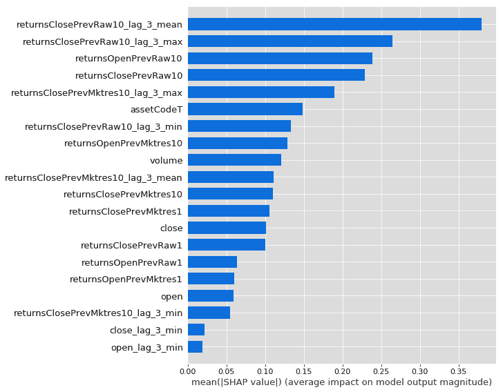

图 5.8 – 描述特征重要性的 Shapley 值条形图

有几种 SHAP 解释器技术，例如 SHAP 树解释器、SHAP 深度解释器、SHAP 线性解释器和 SHAP 内核解释器。根据用例，这些解释器可以为模型预测提供有用的信息，帮助我们理解黑盒模型。更多信息请参阅：[`christophm.github.io/interpretable-ml-book/shap.html`](https://christophm.github.io/interpretable-ml-book/shap.html)

#### MIMIC 解释器

Mimic 解释器是一种通过训练一个可解释的全局代理模型来模仿黑盒模型的方法。这些训练好的全局代理模型是可解释模型，旨在尽可能准确地近似任何黑盒模型的预测。通过使用代理模型，可以对黑盒模型进行评估或解释，如下所示。

以下步骤用于训练代理模型：

1.  要训练一个代理模型，首先选择一个数据集 X。这个数据集可以是用于训练黑盒模型的同一个数据集，也可以是另一个具有相似分布的数据集，具体取决于用例。

1.  获取所选数据集 X 的黑盒模型预测。

1.  选择一个可解释模型类型（线性模型、决策树、随机森林等）。

1.  使用数据集 X 和其预测结果来训练可解释模型。

1.  现在你已经训练了一个代理模型。恭喜！

1.  评估代理模型再现黑盒模型预测的能力，例如，使用 R 平方或 F 分数。

1.  通过解释代理模型来理解黑盒模型的预测。

以下可解释模型可以用作代理模型：**轻梯度提升模型**（**LightGBM**）、线性回归、随机梯度下降或随机森林和决策树。

代理模型可以使机器学习解决方案开发者评估和理解黑盒模型的表现。

#### 置换特征重要性解释器（PFI）

**置换特征重要性**（**PFI**）是一种用于解释分类和回归模型的技术。这项技术对于解释和理解特征与模型输出或预测的相关性非常有用。PFI 是 SHAP 的替代方案。它通过随机评估整个数据集中的一次特征，并计算性能评估指标的变化来实现。对每个特征的性能指标变化进行评估；变化越显著，该特征就越重要。

PFI 可以描述任何模型的整体行为，但并不解释模型的单个预测。PFI 是 SHAP 的替代方案，但两者仍有很大不同，因为 PFI 基于模型性能的下降，而 SHAP 基于特征归因的幅度。

## 统计模型指标

如我们在*第二章*“描述你的机器学习问题”中学习到的，存在三种类型的统计模型：归纳学习、演绎学习和转换学习。统计模型提供了良好的可解释性。

#### 均值

均值，或平均值，是数据集的中心值。它是通过将所有值相加，然后除以值的数量来计算的：

*均值 = x1 + x2 + x3 + ... + xn / n*

#### 标准差

标准差衡量数据集中值的分散程度。标准差越低，数据点就越接近均值。分布广泛的数据集会有更高的标准差。

#### 偏差

偏差衡量了映射函数（自变量和因变量之间的映射）的强度（或刚性）。模型对映射函数功能形式的假设越强，偏差就越大。

当基础的真实（但未知）模型与映射函数的假设具有匹配属性时，高偏差是有帮助的。然而，如果基础模型没有表现出与映射功能形式相似的属性，你可能会完全偏离轨道。例如，当变量之间实际上具有高度非线性关系时，假设变量之间存在线性关系会导致不良拟合：

+   **低偏差**：对输入到输出映射的功能形式有弱假设

+   **高偏差**：对输入到输出映射的功能形式有强假设

偏差始终是正值。以下是一个关于机器学习偏差的更多学习资源的链接：[`kourentzes.com/forecasting/2014/12/17/the-bias-coefficient-a-new-metric-for-forecast-bias/`](https://kourentzes.com/forecasting/2014/12/17/the-bias-coefficient-a-new-metric-for-forecast-bias/)。

#### 方差

模型的方差是模型在拟合不同训练数据时的性能变化的程度。模型的具体影响通过方差来捕捉。

高方差模型会对训练数据集的微小变化产生很大变化。另一方面，低方差模型即使在训练数据集发生较大变化时也不会有太大变化。方差始终为正值。

#### R-squared

R-squared，也称为确定系数，衡量模型可以解释的因变量的变化。它是通过解释变异除以总变异来计算的。简单来说，R-squared 衡量数据点与拟合回归线之间的接近程度。

R-squared 的值介于`0`和`1`之间。R-squared 值低表示响应变量的大部分变化不是由模型解释的，而是由未包含在内的其他因素解释的。通常，你应该追求更高的 R-squared 值，因为这表明模型更好地拟合数据。

#### RMSE

**均方根误差**（RMSE）衡量模型预测值与观测（真实）值之间的差异。

选项很多，你需要选择正确的指标来对现实世界的生产场景进行有充分理由的评价；例如，为什么数据科学家或数据科学团队可能想要选择一个评估指标而不是另一个，例如，对于回归问题，选择 R-squared 而不是平均数。这取决于用例和数据类型。

## HITL 模型指标

有两种类型的**HITL**模型——人类强化学习模型和主动学习模型。在这些模型中，人机协作促进算法模仿人类的行为和结果。这些机器学习解决方案的关键驱动因素是人在回路中。人类验证、标记和重新训练模型以保持模型的准确性。

### 人类偏差

就像人脑一样，机器学习系统也受到认知偏差的影响。人类的认知偏差是干扰你的决策和推理能力的过程，最终导致错误。人类的偏差包括刻板印象、选择性感知、从众效应、启动效应、确认偏误、观察选择偏差和投机者的错误观念。在许多情况下，为了避免这些偏差对于机器学习系统来说至关重要，以便做出理性和最优的决策。如果我们能够推断出人类的偏差并纠正它，这将使机器学习系统比人类更实用。这将在基于 HITL 的系统中将特别有用。使用偏差测试，可以识别并解决三种类型的人类偏差，以保持机器学习系统的决策不受人类偏差的影响。以下三种人类偏差如下：

**交互偏差**

当一个机器学习系统被喂入包含特定类型条目的数据集时，会引入一个交互偏差，这阻止算法识别任何其他类型的条目。这种偏差可以在训练模型的推理测试中识别出来。SHAP 和 PFI 等方法在识别特征偏差方面可能很有用。

**潜在偏差**

当训练集中有多个示例具有突出特征时，会体验到潜在偏差。然后，没有这种特征的示例未能被算法识别。例如，最近，亚马逊人力资源算法在根据公司内部角色的申请选择人员时，对女性存在偏见，原因是潜在偏差。

**选择偏差**

当分析数据的选择没有适当随机化时，算法中会引入选择偏差。例如，在设计高性能的人脸识别系统时，包括所有可能的面部结构和形状，以及来自所有种族和地理样本的数据至关重要，以避免选择偏差。可以通过 SHAP 或 PFI 等方法识别选择偏差，以观察模型特征偏差。

### 最佳策略

在人类强化学习的情况下，系统的目标是最大化当前状态的动作奖励。为了最大化动作的奖励，可以使用最佳策略作为衡量系统的指标。最佳策略是在当前状态下选择最大化奖励/回报的动作的策略。最佳策略是系统表现最佳的理想指标或状态。在基于人类强化学习的系统中，操作员或教师将最佳策略设置为系统的目标，即达到人类水平的表现。

### 自动化率

自动化是通过使用机器人或算法自动生产商品或完成任务的过程，无需直接人工辅助。

可以使用总任务的自动化率来计算 ML 系统的自动化程度。这基本上是系统完全自动化的任务百分比，这些任务不需要任何人工辅助。它显示了所有任务中完全自动化的任务百分比。例如，DeepMind 的 AlphaGo 实现了 100%的自动化，可以独立运行以击败人类世界冠军选手。

### 风险率

ML 模型执行错误的概率称为错误率。错误率是基于模型在生产系统中的性能计算的。错误率越低，对 ML 系统越好。人在回路的目标是降低错误率，并教会 ML 模型以最佳状态运行。

# 生产测试方法

由于运营着各种不同的企业，因此服务于这些企业的生产系统类型也各不相同。在本节中，我们将探讨常用的不同类型的生产系统或配置，以及如何测试它们。

## 批量测试

批量测试通过在一个与训练环境不同的环境中进行测试来验证您的模型。批量测试是在一组数据样本上进行的，以使用选择的指标（如准确率、RMSE 或 f1 分数）测试模型推理。批量测试可以在各种计算环境中进行，例如在云端、远程服务器或测试服务器上。模型通常以序列化文件的形式提供，文件被加载为对象并在测试数据上进行推理。

## A/B 测试

你肯定遇到过 A/B 测试。它常用于服务设计（网站、移动应用等）和评估营销活动。例如，它用于评估特定的设计更改或针对特定受众定制内容是否对业务指标（如用户参与度、点击率或销售率）产生积极影响。类似的技术在 A/B 测试中测试机器学习模型时也得到应用。当使用 A/B 测试测试模型时，测试将回答以下重要问题：

+   新模型 B 在生产中是否比当前模型 A 工作得更好？

+   两个模型候选者中哪一个在产品中工作得更好，可以推动积极的业务指标？

为了评估 A/B 测试的结果，根据业务或操作使用统计技术来确定哪个模型在生产中表现更好。A/B 测试通常以这种方式进行，实时或实时数据被分割成两个集合，集合 A 和集合 B。集合 A 的数据被路由到旧模型，而集合 B 的数据被路由到新模型。为了评估新模型（模型 B）是否比旧模型（模型 A）表现更好，可以使用各种统计技术来评估模型性能（例如，准确率、精确率、召回率、f 分数和 RMSE），具体取决于业务用例或操作。根据模型性能与业务指标的相关性统计分析（业务指标的正向变化），做出决定，用旧模型替换新模型或确定哪个模型更好。

A/B 测试是通过统计假设检验有系统地进行的，这个假设验证了硬币的两面——零假设和备择假设。零假设断言新模型不会增加监控业务指标的平均值。备择假设断言新模型提高了监控业务指标的平均值。最终，A/B 测试用于评估新模型是否*显著提升了特定的业务指标*。根据业务用例和操作，A/B 测试有多种类型，例如`Z-test`、`G-test`（我建议了解这些以及其他类型），等等。选择正确的 A/B 测试和评估指标可以为您的业务和机器学习操作带来双赢。

## 阶段性测试或影子测试

在将模型部署到生产环境之前，这将导致做出业务决策，复制类似生产环境（预发布环境）以测试模型的性能可能是有价值的。这对于测试模型的鲁棒性和评估其在实时数据上的性能尤为重要。可以通过在预发布服务器上部署开发分支或待测试模型，并推断与生产流水线相同的数据来实现。唯一的缺点是最终用户将看不到开发分支的结果，或者在预发布服务器上不会做出业务决策。预发布环境的结果将使用合适的指标（例如，准确率、精确率、召回率、F 分数和 RMSE）进行统计评估，以确定模型与业务指标相关的鲁棒性和性能。

## CI/CD 中的测试

将测试作为 CI/CD 流水线的一部分实施可以在自动化和评估（基于设定的标准）模型性能方面带来回报。CI/CD 流水线可以根据现有的操作和架构以多种方式设置，例如：

+   在成功运行机器学习流水线后，CI/CD 流水线可以在预发布环境中触发新模型的 A/B 测试。

+   当训练新模型时，将数据集与测试集分开以测量其对合适指标的绩效是有益的，并且这一步骤可以完全自动化。

+   CI/CD 流水线可以定期在一天中的特定时间触发机器学习流水线，以训练新模型，该模型使用实时或实时数据来训练新模型或微调现有模型。

+   CI/CD 流水线可以监控生产环境中部署的机器学习模型的性能，并且这可以通过基于时间的触发器或手动触发器（由负责质量保证的团队成员发起）来触发或管理。

+   CI/CD 流水线可以为执行 A/B 测试在独特的数据集上提供两个或更多预发布环境，以进行更多样化和全面的测试。

这些是各种场景，根据需求，CI/CD 流水线提供各种工作流程和操作，以满足业务和技术需求。选择高效的架构和 CI/CD 流程可以增强技术操作和团队的整体表现。CI/CD 测试可以极大地增强和自动化测试。

# 为什么需要打包机器学习模型？

MLOps 使训练和评估模型的方法系统化。在模型训练和评估之后，下一步是将它们部署到生产环境中。众所周知，机器学习（ML）不像传统的软件工程那样是确定性的，在软件工程中，一段代码或模块被导入现有系统并运行。工程化机器学习解决方案是非确定性的，涉及提供机器学习模型进行预测或分析数据。

为了提供服务，它们需要被打包成软件工件，以便发送到测试或生产环境。通常，这些软件工件被打包成一个文件或一组文件或容器。这使得软件与环境无关，与部署无关。机器学习模型需要打包的原因如下：

## 可移植性

将机器学习模型打包成软件工件使它们能够从一个环境运输或传输到另一个环境。这可以通过发送一个文件或一组文件或一个容器来完成。无论哪种方式，我们都可以传输工件并在各种设置中复制模型。例如，打包的模型可以部署在虚拟机或无服务器设置中。

## 推理

机器学习推理是一个涉及使用机器学习模型处理实时数据以计算输出（例如，预测或数值分数）的过程。打包机器学习模型的目的在于能够实时提供服务以进行机器学习推理。有效的机器学习模型打包（例如，序列化模型或容器）可以促进部署，并将模型用于实时或批量预测和分析数据。

## 互操作性

机器学习模型的互操作性是指两个或多个模型或组件交换信息，并使用交换的信息相互学习或微调，以及以高效的方式执行操作的能力。交换的信息可以是数据或软件工件或模型参数。此类信息使模型能够根据其他软件工件的经验进行微调、重新训练或适应各种环境，以执行操作并提高效率。将机器学习模型打包是使机器学习模型互操作性的基础。

## 部署无关性

将机器学习模型打包成软件工件，如序列化文件或容器，使模型能够在各种运行时环境中运输和部署，例如在虚拟机、容器化无服务器环境、流服务、微服务或批量服务中。这为使用机器学习模型打包的相同软件工件提供了可移植性和部署无关性的机会。

# 如何打包机器学习模型

根据业务和技术需求以及机器学习的操作，机器学习模型可以以多种方式打包。机器学习模型可以通过以下子节中讨论的三种方式打包和发货。

## 序列化文件

序列化是打包机器学习模型的一个关键过程，因为它使得模型具有可移植性、互操作性以及模型推理能力。序列化是将对象或数据结构（例如，变量、数组和元组）转换为可存储的工件的方法，例如，转换为文件或内存缓冲区，可以传输或传输（跨计算机网络）。序列化的主要目的是在不同的环境中将序列化的文件重新构建为其之前的数据结构（例如，将序列化文件转换为机器学习模型变量）。这样，一个新训练的机器学习模型可以被序列化到一个文件中，并导出到新的环境中，在那里它可以反序列化为机器学习模型变量或数据结构，用于机器学习推理。序列化文件不保存或包含任何之前关联的方法或实现。它只保存数据结构在可存储的工件（如文件）中的状态。

下面是*图 5.1*中的一些流行的序列化格式：

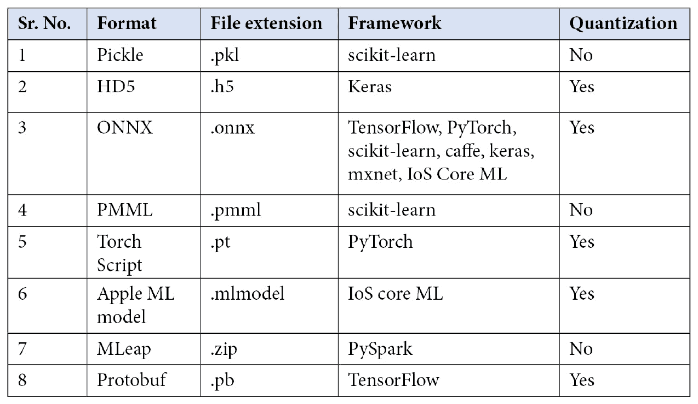

表 5.1 – 流行的机器学习模型序列化格式

所有这些序列化格式（除了 ONNX）都存在一个共同问题，即互操作性问题。为了解决这个问题，ONNX 被开发为一个由微软、百度、亚马逊等大公司支持的开源项目。这使得一个模型可以使用一个框架（例如，在 scikit-learn 中）进行训练，然后再次使用 TensorFlow 进行重新训练。这对于工业化的 AI 来说是一个变革性的进步，因为模型可以变得可互操作和框架无关。

ONNX 解锁了新的途径，如联邦学习和迁移学习。序列化模型使得在不同环境中具有可移植性，并支持批量推理（批量推理或离线推理是在一组数据点或样本上生成预测的方法）。

## 数据打包或容器化

我们经常遇到各种生产系统的环境。在部署机器学习模型时，每个环境都会面临不同的挑战，包括兼容性、鲁棒性和可扩展性。通过标准化某些流程或模块，可以避免这些挑战，容器化是标准化机器学习模型和软件模块的绝佳方式。

容器是由代码及其所有依赖项组成的软件标准单元。它使得应用程序能够快速且可靠地在不同的计算环境中运行。它使得软件与环境无关、部署无关。容器由 Docker 管理和编排。Docker 已经成为开发和编排容器的行业标准。

Docker 是一个开源([`opensource.com/resources/what-open-source`](https://opensource.com/resources/what-open-source))工具。它被开发出来，使得使用容器构建、部署和运行应用程序变得方便。通过使用容器，开发者可以将应用程序及其组件和模块（如文件、库和其他依赖项）打包成一个包，并部署它。容器是使用具有自定义设置的 Linux OS 运行应用程序的可靠方式。Docker 容器是通过 Dockerfile 构建的，Dockerfile 用于容器化应用程序。在构建 Docker 镜像后，会构建一个 Docker 容器。Docker 容器是一个以开发者编排的方式运行具有自定义设置的应用程序。*图 5.8*展示了从 Dockerfile 构建和运行 Docker 容器的过程。Dockerfile 被构建成一个 Docker 镜像，然后作为 Docker 容器运行：


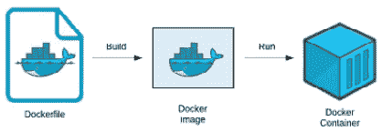

图 5.9 – Docker 工件

Dockerfile、Docker 镜像和 Docker 容器是构建和运行容器的基石组件。这些组件的描述如下：

+   **Dockerfile**：Dockerfile 是一个文本文件，其中包含了一组按开发者顺序排列的 Docker 命令，用于构建 Docker 镜像。Docker 能够读取 Dockerfile 并构建 Docker 镜像。

+   **Docker 镜像**：这是在容器运行时在容器内的根文件系统中使用的一系列执行参数的有序集合。Docker 镜像就像是容器的快照。容器是由 Docker 镜像构建的。

+   **Docker 容器**：容器是由 Docker 镜像构建的。容器是 Docker 镜像的运行时实例。

ML 模型可以在 Docker 容器中提供服务，以实现健壮性、可扩展性和部署无关性。在后续章节中，我们将使用 Docker 部署 ML 模型以获得实践经验，因此，了解这个工具是很重要的。

## 微服务的生成和部署

微服务使得独立部署的服务集合成为可能。这些服务每个都易于维护、测试和松散耦合。微服务通过围绕业务能力组织的架构进行编排，以使系统能够满足业务需求。例如，Spotify 已经从单体复杂系统过渡到基于微服务的系统。这是通过将复杂系统拆分为碎片化服务来实现的，具体目标包括搜索引擎、内容标记、内容分类、推荐引擎的用户行为分析以及自动生成的播放列表。碎片化的微服务现在由专门的团队开发。每个微服务都是隔离的，相互之间依赖较少。这样，开发和维护变得更加容易。公司可以保持客户服务的连贯性，并持续改进，而无需中断服务。

通常，通过将序列化文件定制为容器化的 Docker 镜像来生成微服务。这些 Docker 镜像可以随后部署并编排到任何支持 Docker 的环境中。可以使用容器管理工具，如 Kubernetes，来部署和管理 Docker 镜像。Docker 实现了极端的可移植性和互操作性，Docker 镜像可以轻松部署到任何流行的云服务，例如 Google Cloud、Azure 或 AWS。只要支持 Docker，Docker 镜像就可以部署和管理到任何 Docker 企业服务器或数据中心或实时环境中。

微服务可以以 REST API 格式提供服务，这是提供机器学习模型的一种流行方式。一些 Python 框架，如 Flask、Django 和 FastAPI，已成为使机器学习模型作为 REST API 微服务提供服务的流行选择。为了促进稳健和可扩展的系统操作，软件开发人员可以通过 REST API 与 Docker 化的微服务同步。为了在 Kubernetes 支持的基础设施上编排基于 Docker 的微服务部署，Kubeflow 是一个好的选择。它是云无关的，可以在本地或本地机器上运行。除此之外，Kubeflow 基于 Kubernetes，但将 Kubernetes 的细节和困难封装在一个盒子里。Kubeflow 是提供模型的一种稳健方式。这是一个值得探索的工具：[`www.kubeflow.org/docs/started/kubeflow-overview/`](https://www.kubeflow.org/docs/started/kubeflow-overview/)。

# 准备好的推理模型

我们之前曾针对一个业务问题进行过预测港口天气的工作。为了解决这个业务问题，我们进行了数据处理和机器学习模型训练，然后序列化模型。现在，在本节中，我们将探讨如何在序列化模型上执行推理。本节的代码可在书籍 GitHub 仓库中对应章节的文件夹中附带的 Jupyter 笔记本中找到。以下是运行代码的说明：

1.  再次登录到 Azure 门户。

1.  从 `MLOps_WS` 工作区，然后点击 `MLOps_WS` 工作区。

1.  在 **管理** 部分，点击 **计算** 部分，然后选择在 *第四章* 中创建的机器，*机器学习管道*。点击 **启动** 按钮以启动实例。当虚拟机准备就绪时，点击 JupyterLab 链接。

1.  现在，在 JupyterLab 中，导航到章节对应的文件夹（`05_model_evaluation_packaging`）并打开笔记本（`model_evaluation_packaging.ipynb`）。

## 连接到工作区并导入模型工件

首先，我们导入必要的包，使用`Workspace()`函数连接到 ML 工作区，然后下载序列化的缩放器和模型以进行预测。`Scaler`将用于将输入数据缩放到与模型训练所使用的数据相同的尺度。`Model`文件以 ONNX 格式序列化。`Scaler`和`Model`文件都使用`Model()`函数导入：

```py
import pandas as pd
import numpy as np
import warnings
import pickle
from math import sqrt
warnings.filterwarnings('ignore')
from azureml.core.run import Run
from azureml.core.experiment import Experiment
from azureml.core.workspace import Workspace
from azureml.core.model import Model
# Connect to Workspace
ws = Workspace.from_config()
print(ws)
# Load Scaler and model to test
scaler = Model(ws,'scaler').download(exist_ok=True)
svc_model = Model(ws,'support-vector-classifier').download(exist_ok=True)
```

运行此代码后，你将在 JupyterLab 窗口的左侧面板中看到下载的新文件。

## 加载推理模型工件

我们将`Scaler`和`Model`文件打开并加载到变量中，以便用于 ML 模型推理。`Scaler`使用 pickle 读取并加载到变量中，并使用`InferenceSession()`加载 ONNX 文件，以便进行 ML 模型预测，如下所示：

```py
with open('scaler.pkl', 'rb') as file:
    scaler = pickle.load(file)
# Compute the prediction with ONNX Runtime
import onnxruntime as rt
import numpy
sess = rt.InferenceSession("svc.onnx")
input_name = sess.get_inputs()[0].name
label_name = sess.get_outputs()[0].name
```

### ML 模型推理

要进行 ML 模型推理，使用`fit_transform()`方法缩放测试数据并设置推理。现在，使用 ONNX 会话对测试数据进行推理，通过传递输入数据`test_data`，以`float` `32`格式运行`sess.run()`。最后，打印模型推理的结果：

```py
test_data = np.array([34.927778, 0.24, 7.3899, 83, 16.1000, 1])
test_data = scaler.fit_transform(test_data.reshape(1, 6))
# Inference 
pred_onx = sess.run([label_name], {input_name: test_data.astype(numpy.float32)})[0]
print(pred_onx[0])
```

通过这些步骤，我们已经成功下载了序列化的模型，将其加载到变量中，并在测试数据样本上进行了推理。代码块预期的结果是值`1`。

# 摘要

在本章中，我们探讨了评估和解释 ML 模型的多种方法。我们学习了生产测试方法以及打包模型的重要性，为什么以及如何打包模型，以及用于生产中 ML 模型推理的打包模型的实用性和工具。最后，为了理解打包和解包序列化模型以进行推理的工作原理，我们通过在测试数据上使用序列化模型进行了 ML 模型推理的动手实现。

在下一章中，我们将学习更多关于部署您的 ML 模型的知识。系好安全带，准备好将您的模型部署到生产环境中！
