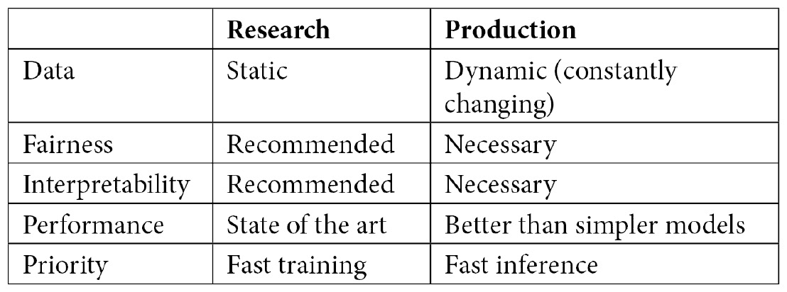
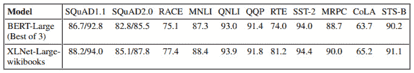
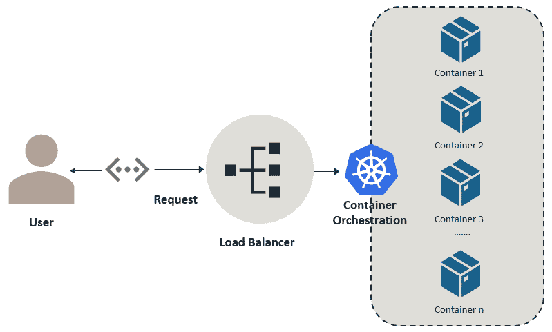
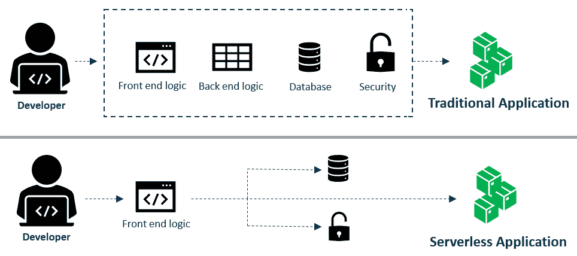

# 第六章：部署您的机器学习系统的主要原则

在本章中，您将学习在生产中部署 **机器学习**（**ML**）模型的基本原则，并实施针对我们一直在研究的业务问题的机器学习模型的实际部署。为了获得全面的理解和第一手经验，我们将使用 Azure ML 服务在两个不同的部署目标上部署之前训练和打包的机器学习模型（在 *第四章*，*机器学习管道*，和 *第五章*，*模型评估和打包*)。

我们还将学习如何使用我们之前已经使用过的开源框架 MLflow 来部署机器学习模型。这将使您能够了解如何使用两种不同的工具（Azure ML 服务和 MLflow）将机器学习模型作为 REST API 端点部署到不同的部署目标。这将使您具备在云上部署任何给定场景的机器学习模型所需的技能。

在本章中，我们首先探讨研究生产和实施机器学习（ML）的不同之处，并继续探讨以下主题：

+   研究与生产中的机器学习

+   理解生产中机器学习推理的类型

+   通过映射您的解决方案的基础设施

+   实际部署（针对业务问题）

+   理解持续集成和持续部署的需求

# 研究与生产中的机器学习

研究中的机器学习具有特定的目标和优先级，旨在提高该领域的最先进水平，而生产中的机器学习的目的是优化、自动化或增强某个场景或业务。

为了理解机器学习模型的部署，让我们首先比较研究生产和实施（在工业界）中机器学习的实现方式。如 *表 6.1* 所列出的多个因素，例如性能、优先级、数据、公平性和可解释性，描述了部署和机器学习在研究和生产中的不同之处：



表 6.1 – 研究与生产中的机器学习

## 数据

通常情况下，研究项目中的数据是静态的，因为数据科学家或统计学家正在处理一个固定的数据集，并试图超越当前的最先进模型。例如，最近在自然语言处理模型方面取得了许多突破，例如谷歌的 BERT 或百度的 XLNet。为了训练这些模型，数据被抓取并编译成静态数据集。在研究界，为了评估或基准测试模型的性能，使用静态数据集来评估性能，如 *表 6.2* 所示（来源：[`arxiv.org/abs/1906.08237`](https://arxiv.org/abs/1906.08237))：



表 6.2 – BERT 与 XLNet 在研究中的性能比较

例如，我们可以通过比较两个模型在名为 SQUAD（10,000+ QnA）版本 1.1 的流行数据集上的性能来比较它们的性能，在这个数据集上 BERT 的准确率为 92.8%，XLNET 的准确率为 94.0%。同样，用于研究和训练、评估模型的数据是静态的，而生产或工业用例中的数据是动态的，并且根据环境、操作、业务或用户不断变化。

## 公平性

在现实生活中，有偏见的模型可能会造成高昂的代价。不公平或偏见的决策会导致商业和运营的糟糕选择。对于生产中的机器学习模型，确保做出的决策尽可能公平是非常重要的。如果生产中的模型不公平，这可能会给企业带来高昂的成本。例如，最近，亚马逊推出了一款基于求职者适合其申请工作的程度进行筛选的人力资源筛选软件。亚马逊的机器学习专家发现，男性候选人比女性候选人更受青睐（来源：[`www.businessinsider.com/amazon-ai-biased-against-women-no-surprise-sandra-wachter-2018-10`](https://www.businessinsider.com/amazon-ai-biased-against-women-no-surprise-sandra-wachter-2018-10)）。这种系统偏见可能会造成高昂的代价，因为在亚马逊的案例中，由于偏见可能会错失一些杰出的人才。因此，在生产中拥有公平的模型至关重要，并且应该持续监控。在研究中，公平的模型也很重要，但不如生产或现实生活中那么关键，而且公平性不像在生产中那样受到严格的监控。研究的目标是超越现有技术，而模型公平性是一个次要目标。

## 可解释性

在生产中，模型的可解释性至关重要，以便理解机器学习模型的决策与其对运营或业务影响之间的相关性或因果关系，从而优化、增强或自动化业务或手头的任务。在研究中并非如此，研究的目标是挑战或超越最先进的结果，这里的重点是更好的性能（如准确度或其他指标）。在研究的情况下，机器学习模型的可解释性是好的，但不是强制性的。通常，机器学习项目更关注预测结果，而不是理解因果关系。机器学习模型擅长在数据中找到相关性，但不是因果关系。我们努力避免在我们的项目中将关联等同于原因。由于这个问题，我们依赖机器学习的能力受到了严重阻碍。这个问题严重限制了我们的能力，使我们无法使用机器学习来做出决策。我们需要能够理解数据之间因果关系的资源，并构建可以从业务角度很好地泛化的机器学习解决方案。拥有正确的模型可解释性机制可以增强我们对因果关系的理解，并使我们能够制定出泛化良好且能够处理以前未见数据的机器学习解决方案。因此，我们可以使用机器学习做出更可靠和透明的决策。

在生产（在商业用例中）的情况下，完全不推荐缺乏可解释性。让我们看看一个假设的案例。假设你患有癌症，需要选择一位外科医生进行手术。有两位外科医生可供选择，一位是人类（治愈率为 80%），另一位是 AI 黑盒模型（治愈率为 90%），该模型无法被解释或解释其工作原理，但它有很高的治愈率。你会选择哪个？AI 还是外科医生来治愈癌症？如果模型不是黑盒模型，用 AI 替换外科医生会更容易。尽管 AI 比外科医生更好，但没有理解模型，决策、信任和合规就会成为问题。模型的可解释性对于做出法律决策至关重要。因此，对于生产中的机器学习来说，拥有模型的可解释性至关重要。我们将在后面的章节中了解更多关于这方面的内容。

## 性能

当涉及到机器学习模型的性能时，研究中的重点是改进最先进的模型，而在生产中，重点是构建比简单模型更好的模型，以满足业务需求（**最先进的**模型不是重点）。

## 优先级

在研究中，优先级是更快、更好地训练模型，而在生产中，优先级是更快地进行推理，因为重点是实时做出决策并满足业务需求。

# 理解生产中机器学习推理的类型

在上一节中，我们看到了机器学习在研究和生产中的优先级。为了在生产中满足业务需求，根据需要使用各种部署目标来推断机器学习模型。使用机器学习模型进行预测或做出决策称为机器学习模型推理。让我们探讨在不同部署目标上部署机器学习模型的方法，以根据业务需求促进机器学习推理。

## 部署目标

在本节中，我们将探讨不同的部署目标类型，以及为什么以及如何在这些部署目标上为推理服务机器学习模型。让我们首先看看虚拟机或本地服务器。

### 虚拟机

虚拟机可以是云上的，也可以是本地的，这取决于企业或组织的 IT 配置。在虚拟机上服务机器学习模型相当常见。机器学习模型以网络服务的形式在虚拟机上提供服务。运行在虚拟机上的网络服务接收包含输入数据的用户请求（作为 HTTP 请求）。在接收到输入数据后，网络服务将其预处理为所需的格式，以推断网络服务中的机器学习模型。在机器学习模型做出预测或执行任务后，输出被转换并以用户可读的格式呈现。通常为**JavaScript 对象表示法**（**JSON**）或**可扩展标记语言字符串**（**XML**）。通常，网络服务以 REST API 的形式提供服务。可以使用多种工具开发 REST API 网络服务；例如，可以使用 Python 或 Java 中的 Spring Boot 或 R 中的 Plumber 开发 REST API 网络服务，具体取决于需求。使用虚拟机的组合并行使用以扩展和维持网络服务的健壮性。

为了编排流量并扩展机器，使用负载均衡器将传入的请求调度到虚拟机以进行机器学习模型推理。这样，机器学习模型被部署在云或本地的虚拟机上，以满足业务需求，如下面的图所示：

![图 6.1 – 虚拟机上的部署![图 6.1 – 虚拟机上的部署图 6.1 – 虚拟机上的部署### 容器容器是使用 Linux 操作系统并带有自定义设置来运行应用程序的可靠方式。容器是由开发者编排的应用程序，运行时具有自定义设置。与虚拟机相比，容器是服务模型的一种替代方案，并且更节省资源。容器像虚拟机一样运行，因为它们拥有自己的运行时环境，该环境是隔离的，并且限制在内存、文件系统和进程内。开发者可以自定义容器，将它们限制在所需的资源上，如内存、文件系统和处理过程，而虚拟机则限于这些自定义。它们更灵活，以模块化方式操作，因此提供更高的资源效率和优化。它们允许扩展到零，因为容器可以减少到零副本，并在请求时运行备份。这样，与在虚拟机上运行 Web 服务相比，可以实现更低的计算能力消耗。由于这种较低的计算能力消耗，在云上可以实现成本节约。容器具有许多优点；然而，一个缺点可能是与容器一起工作的复杂性，因为它需要专业知识。容器和虚拟机在操作方式上存在一些差异。例如，虚拟机内部可以运行多个容器，这些容器与虚拟机共享操作系统和资源，但虚拟机运行自己的资源和操作系统。容器可以模块化操作，而虚拟机则以单一单元操作。Docker 用于构建和部署容器；然而，还有其他替代方案，如 Mesos 和 CoreOS rkt。容器通常与 ML 模型和 Web 服务打包在一起，以方便 ML 推理，类似于我们在虚拟机中用 Web 服务包装 ML 模型来提供服务。容器需要被编排才能被用户使用。容器的编排意味着部署、管理、扩展和网络自动化的自动化。容器使用容器编排系统（如 Kubernetes）进行编排。在以下图中，我们可以看到具有自动扩展（基于请求流量）的容器编排：

图 6.2 – 容器部署

### 无服务器

无服务器计算，正如其名所示，不涉及虚拟机或容器。它消除了基础设施管理任务，如操作系统管理、服务器管理、容量配置和磁盘管理。无服务器计算使开发者和组织能够专注于核心产品，而不是管理服务器等日常任务，无论是在云上还是在本地。无服务器计算通过使用云原生服务来实现。

例如，Microsoft Azure 使用 Azure Functions，AWS 使用 Lambda 函数来部署无服务器应用程序。无服务器应用程序的部署涉及提交一组文件（以`.zip`文件的形式）以运行机器学习应用程序。通常，.zip 存档包含一个特定的函数或方法来执行。该存档通过云服务上传到云平台，并作为无服务器应用程序部署。部署的应用程序作为 API 端点，用于向提供机器学习模型的无服务器应用程序提交输入。

使用无服务器应用程序部署机器学习模型可以带来许多优势：无需安装或升级依赖项，也无需维护或升级系统。无服务器应用程序按需自动扩展，并且在整体性能上非常稳健。无服务器函数同时支持同步操作（执行在一个序列中依次发生，A->B->C->D）和异步操作（并行或基于优先级执行，不按顺序：A->C->D->B 或 A 和 B 并行，C 和 D 并行）。然而，也存在一些缺点，例如云资源可用性，如 RAM 或磁盘空间或 GPU 不可用，这对于运行深度学习或强化学习等重型模型可能是关键要求。例如，如果我们没有使用无服务器操作部署模型，我们可能会遇到资源限制的瓶颈。部署的模型或应用程序不会自动扩展，从而限制可用的计算能力。如果用户对模型或应用程序的推理超过了限制，我们将遇到资源不可用的障碍。在以下图中，我们可以看到传统应用程序和无服务器应用程序的开发方式：



图 6.3：传统与无服务器部署对比

要开发无服务器应用程序，开发者只需关注应用程序的逻辑，无需担心后端或安全代码，这些在部署无服务器应用程序时由云服务负责处理。

### 模型流

模型流是一种用于处理流数据的模型服务方法。流数据没有开始或结束。每秒钟，都有来自数千个来源的数据产生，并且必须尽快进行处理和分析。例如，谷歌搜索结果必须实时处理。模型流是部署机器学习模型（ML）的另一种方式。它相较于其他模型服务技术，如 REST API 或批量处理方法，有两个主要优势。第一个优势是异步性（一次处理多个请求）。REST API 机器学习应用稳健且可扩展，但它们有一个限制，即同步性（它们根据客户请求的先后顺序处理请求），这可能导致高延迟和资源利用率。为了应对这一限制，流处理是可用的。它本质上是异步的，因为用户或客户不需要协调或等待系统处理请求。

流处理能够异步处理并即时为用户提供服务。为了做到这一点，流处理使用消息代理来接收来自用户或客户端的消息。消息代理允许数据即时到达，并将处理分散到时间上。消息代理解耦了传入的请求，并促进了用户或客户端与服务之间的通信，而无需了解彼此的操作，如图 5.4 所示。对于消息流代理有几个选项，例如 Apache Storm、Apache Kafka、Apache Spark、Apache Flint、Amazon Kinesis 和 StreamSQL。您选择的工具取决于 IT 设置和架构。

![图 6.4 – 模型流过程

]

图 6.4 – 模型流过程

流处理的第二个优势在于，当在机器学习系统中进行多个模型推断时。对于单模型或双模型处理，REST API 非常出色，但当需要推断多个模型时，它们会产生延迟并使用大量的计算资源，而且它们还限于同步推断。

在多个模型的情况下，流处理是一个好的选择，因为所有运行 ML 系统所需的模型和工件（代码和文件）都可以打包在一起，并部署在流处理引擎上（它在自己的机器集群上运行并管理数据处理的资源分配）。

例如，让我们看看智能电子邮件助手的使用案例，该助手的任务是自动化客户服务，如图 5.4 所示。为了自动化回复以服务其用户，电子邮件助手系统使用多个模型进行多次预测：

+   预测电子邮件的类别，例如垃圾邮件或账户或续订

+   意图识别

+   情感预测

+   回答/文本生成

在 REST API 端点部署的这四个模型将产生高延迟和维护成本，而流式服务是一个很好的替代方案，因为它可以将多个模型打包为一个进程，并以流的形式持续服务用户请求。因此，在这种情况下，建议使用流式服务而不是 REST API 端点。

## 映射我们的解决方案的基础设施

在本节中，我们映射基础设施需求以及部署目标，以解决多样化的业务需求，如*表 6.3*所示：

![Table 6.3 – Mapping the infrastructure for ML solutions

![img/Table_6.3.jpg]

表 6.3 – 映射 ML 解决方案的基础设施

根据您的用例，建议选择合适的基础设施和部署目标，以服务于 ML 模型，以产生业务或运营影响。

# 手动部署（针对业务问题）

在本节中，我们将学习如何部署我们一直在工作的业务问题的解决方案。到目前为止，我们已经完成了数据处理、ML 模型训练、序列化模型并将它们注册到 Azure ML 工作区。在本节中，我们将探讨如何在容器和自动扩展集群上对序列化模型进行推理。这些部署将为您提供广泛的理解，并为您未来的任务做好准备。

我们将使用 Python 作为主要的编程语言，并使用 Docker 和 Kubernetes 来构建和部署容器。我们将从在 Azure 容器实例上部署 REST API 服务开始，使用 Azure ML。接下来，我们将使用 Kubernetes（用于容器编排）在自动扩展集群上部署 REST API 服务，并使用 Azure ML，最后，我们将使用 MLflow 和开源 ML 框架在 Azure 容器实例上部署；这样，我们将学习如何使用多个工具并在云（Azure）上部署 ML 模型。让我们从**Azure 容器实例**（**ACI**）的部署开始。

## 在 ACI 上部署模型

要开始部署，请访问之前在 Azure DevOps 上克隆的 GitHub 存储库（在*第三章*，*代码与数据*），访问名为`06_ModelDeployment`的文件夹，并按照`01_Deploy_model_ACI.ipynb`笔记本中的实现步骤进行操作：

1.  我们首先导入所需的包，并检查 Azure ML SDK 的版本，如下面的代码所示：

    ```py
    %matplotlib inline
    import numpy as np
    import matplotlib.pyplot as plt
    import azureml.core
    from azureml.core import Workspace
    from azureml.core.model import Model
    # display the core SDK version number
    print("Azure ML SDK Version: ", azureml.core.VERSION)
    ```

    上述代码将打印出 Azure ML SDK 的版本（例如，`1.10.0`；您的版本可能不同）。

1.  接下来，使用 Azure ML SDK 中的`workspace`函数，我们连接到 ML 工作区，并使用工作区的`Model`函数下载之前训练的所需序列化文件和模型。序列化的`scaler`和`model`用于执行推理或预测。`Scaler`将用于将输入数据缩小到与模型训练中使用的数据相同的规模，而`model`文件用于对传入的数据进行预测：

    ```py
    ws = Workspace.from_config()
    print(ws.name, ws.resource_group, ws.location, sep = '\n')
    scaler = Model(ws,'scaler').download(exist_ok=True)
    model = Model(ws,'support-vector-classifier').download(exist_ok=True)
    ```

1.  在下载了 `scaler` 和 `model` 文件之后，下一步是准备 `scoring` 文件。`scoring` 文件用于在 Azure 容器实例和 Kubernetes 集群中部署的 ML 服务中推断 ML 模型。`scoring` 脚本接受用户传入的输入，推断预测用的 ML 模型，然后将预测结果以服务的形式提供给用户。它包含两个主要函数，`init()` 和 `run()`。我们首先导入所需的库，然后定义 `init()` 和 `run()` 函数：

    ```py
    %%writefile score.py
    import json
    import numpy as np
    import os
    import pickle
    import joblib
    import onnxruntime
    import time
    from azureml.core.model import Model
    ```

    `%%writefile score.py` 将此代码写入名为 `score.py` 的文件中，该文件随后作为 ML 服务的一部分打包到容器中，以执行 ML 模型推理。

1.  我们定义了 `init()` 函数；它下载所需的模型并将它们反序列化到变量中，以便用于预测：

    ```py
    def onnxruntime we can deserialize the support vector classifier model. The InferenceSession() function is used for deserializing and serving the model for inference, and the input_name and label_name variables are loaded from the deserialized model.  
    ```

1.  简而言之，`init()` 函数加载文件（`model` 和 `scaler`），反序列化并提供用于预测所需的模型和工件文件，这些文件由 `run()` 函数如下使用：

    ```py
    def run() function takes raw incoming data as the argument, performs ML model inference, and returns the predicted result as the output. When called, the run() function receives the incoming data, which is sanitized and loaded into a variable for scaling. The incoming data is scaled using the scaler loaded previously in the init() function. Next, the model inference step, which is the key step, is performed by inferencing scaled data to the model, as shown previously. The prediction inferred from the model is then returned as the output. This way, the scoring file is written into score.py to be used for deployment.
    ```

1.  接下来，我们将继续部署服务到 Azure 容器实例的关键部分。为此，我们通过创建环境 `myenv.yml` 来定义部署环境，如下所示。使用 `CondaDependencies()` 函数，我们列出需要在作为 ML 服务部署的 Docker 容器中安装的所有 `pip` 包。例如，`numpy`、`onnxruntime`、`joblib`、`azureml-core`、`azureml-defaults` 和 `scikit-learn` 等包在触发环境文件时会在容器中安装：

    ```py
    from azureml.core.conda_dependencies import CondaDependencies 
    myenv = CondaDependencies.create(pip_packages=["numpy", "onnxruntime", "joblib", "azureml-core", "azureml-defaults", "scikit-learn==0.20.3"])
    with open("myenv.yml","w") as f:
        f.write(myenv.serialize_to_string())
    ```

1.  接下来，我们使用 `InferenceConfig()` 函数定义推理配置，该函数在被调用时以 `score.py` 和环境文件作为参数。然后，我们调用 `AciWebservice()` 函数在 `aciconfig` 变量中初始化计算配置（`cpu_cores` 和 `memory`），如下所示：

    ```py
    from azureml.core.model import InferenceConfig
    from azureml.core.environment import Environment
    myenv = Environment.from_conda_specification(name="myenv", file_path="myenv.yml")
    inference_config = InferenceConfig(entry_script="score.py", environment=myenv)
    from azureml.core.webservice import AciWebservice
    aciconfig = AciWebservice.deploy_configuration(cpu_cores=1, 
    memory_gb=1, 
    tags={"data": "weather"}, 
    description='weather-prediction')
    ```

1.  现在我们已经准备好在 ACI 上部署 ML 或 Web 服务了。我们将使用 `score.py`、环境文件（`myenv.yml`）、`inference_config` 和 `aci_config` 来部署 ML 或 Web 服务。我们需要指向要部署的模型或工件。为此，我们使用 `Model()` 函数从工作区加载 `scaler` 和 `model` 文件，并准备好它们以供部署：

    ```py
    %%time
    from azureml.core.webservice import Webservice
    from azureml.core.model import InferenceConfig
    from azureml.core.environment import Environment
    from azureml.core import Workspace
    from azureml.core.model import Model
    ws = Workspace.from_config()
    model1 = Model(ws, 'support-vector-classifier')
    model2 = Model(ws, 'scaler')
    service = Model.deploy(workspace=ws, 
                           name='weatherprediction', 
                           models=[model1, model2], 
                           inference_config=inference_config, 
                           deployment_config=aciconfig)
    service.wait_for_deployment(show_output=True)
    ```

1.  在将模型挂载到变量 `model1` 和 `model2` 之后，我们继续将它们作为 Web 服务部署。我们使用 `deploy()` 函数在 ACI 上部署挂载的模型，如前述代码所示。这个过程大约需要 8 分钟，所以拿好爆米花，享受服务部署的过程吧。你会看到如下信息：

    ```py
    Running..............................................................................
    Succeeded
    ACI service creation operation finished, operation "Succeeded"
    CPU times: user 610 ms, sys: 103 ms, total: 713 ms
    Wall time: 7min 57s
    ```

    恭喜！你已经成功使用 MLOps 部署了你的第一个 ML 服务。

1.  让我们检查已部署服务的运行机制和鲁棒性。查看服务 URL 和 Swagger URL，如下面的代码所示。您可以使用这些 URL 实时对您选择的输入数据进行 ML 模型推断：

    ```py
    print(service.scoring_uri)
    print(service.swagger_uri)
    ```

1.  在 Azure ML 工作区中检查已部署的服务。

1.  现在，我们可以通过使用 Azure ML SDK 的`service.run()`函数并传递一些输入数据来测试该服务，如下所示：

    ```py
    import json
    test_sample = json.dumps({'data': [[34.927778, 0.24, 7.3899, 83, 16.1000, 1016.51, 1]]})
    test_sample = bytes(test_sample,encoding = 'utf8')
    prediction = Temperature_C, Humidity, Wind_speed_kmph, Wind_bearing_degrees, Visibility_km, Pressure_millibars, and Current_weather_condition. Encode the input data in UTF-8 for smooth inference. Upon inferring the model using service.run(), the model returns a prediction of 0 or 1. 0 means a clear sky and 1 means it will rain. Using this service, we can make weather predictions at the port of Turku as tasked in the business problem.
    ```

1.  我们部署的服务是一个 REST API 网络服务，我们可以通过以下 HTTP 请求进行推断：

    ```py
    import requests
    headers = {'Content-Type': 'application/json', 'Accept': 'application/json'}
    if service.auth_enabled:
        headers['Authorization'] = 'Bearer '+ service.get_keys()[0]
    elif service.token_auth_enabled:
        headers['Authorization'] = 'Bearer '+ service.get_token()[0]
    scoring_uri = service.scoring_uri
    print(scoring_uri)
    response = requests.post(scoring_uri, data=test_sample, headers=headers)
    print(response.status_code)
    print(response.elapsed)
    print(response.json())
    ```

    当通过传递输入数据发出`POST`请求时，服务以`0`或`1`的形式返回模型预测。当你得到这样的预测时，你的服务正在运行，并且足够鲁棒，足以满足生产需求。

    接下来，我们将该服务部署在自动扩展的集群上；这对于生产场景来说非常理想，因为部署的服务可以自动扩展并满足用户需求。

## 在 Azure Kubernetes Service (AKS)上部署模型

要开始部署，请转到 Azure DevOps 上克隆的 Git 仓库中的*第三章*，*代码与数据相遇*，访问`06_ModelDeployment`文件夹，并按照`02_Deploy_model_AKS.ipynb`笔记本中的实现步骤进行操作：

1.  如前一小节所述，首先导入所需的包，例如`matplotlib`、`numpy`和`azureml.core`，以及从`azureml.core`导入的所需函数，例如`Workspace`和`Model`，如下面的代码块所示：

    ```py
    %matplotlib inline
    import numpy as np
    import matplotlib.pyplot as plt

    import azureml.core
    from azureml.core import Workspace
    from azureml.core.model import Model
    # display the core SDK version number
    print("Azure ML SDK Version: ", azureml.core.VERSION)
    ```

1.  打印 Azure ML SDK 的版本并检查版本（例如，它将打印`1.10.0`；您的版本可能不同）。使用配置文件和`Workspace`函数连接到您的空间，如下面的代码块所示：

    ```py
    ws = Workspace.from_config()
    print(ws.name, ws.resource_group, ws.location, sep = '\n')
    scaler = Model(ws,'scaler').download(exist_ok=True)
    model = Model(ws,'support-vector-classifier').download(exist_ok=True)
    ```

1.  下载`model`和`scaler`文件，就像我们之前做的那样。在下载了`model`和`scaler`文件之后，下一步是准备`scoring`文件，该文件用于推断与 ML 服务一起部署的容器中的 ML 模型。`scoring`脚本接受用户传递的输入，推断用于预测的 ML 模型，然后将预测结果以输出形式提供给用户。我们将首先导入所需的库，如下面的代码块所示：

    ```py
    %%writefile score.py
    import json
    import numpy as np
    import os
    import pickle
    import joblib
    import onnxruntime
    import time
    from azureml.core.model import Model
    ```

1.  如我们之前为 ACI 部署创建`score.py`一样，我们将使用相同的文件。它包含两个主要函数，`init()`和`run()`。我们定义`init()`函数；它下载所需的模型并将它们反序列化为用于预测的变量：

    ```py
    def init():
        global model, scaler, input_name, label_name
        scaler_path = os.path.join(os.getenv('AZUREML_MODEL_DIR'), 'scaler/2/scaler.pkl')
        # deserialize the model file back into a sklearn model
        scaler = joblib.load(scaler_path)

        model_onnx = os.path.join(os.getenv('AZUREML_MODEL_DIR'), 'support-vector-classifier/2/svc.onnx')
        model = onnxruntime.InferenceSession(model_onnx, None)
        input_name = model.get_inputs()[0].name
        label_name = model.get_outputs()[0].name
    ```

1.  正如我们在上一节关于 ACI 部署中做的那样，通过使用`onnxruntime`包函数，我们可以反序列化支持向量机分类器模型。《InferenceSession()`函数用于反序列化和为推理提供模型，`input_name`和`label_name`变量从反序列化的模型中加载。简而言之，`init()`函数加载文件（`model`和`scaler`），并反序列化和提供用于预测的模型和工件文件，这些文件由`run()`函数使用：

    ```py
    def run(raw_data):
                    try: 
                        data = np.array(json.loads(raw_data)['data']).astype('float32')
                        data = scaler.fit_transform(data.reshape(1, 7))
                        # make prediction
                        model_prediction = model.run([label_name], {input_name: data.astype(np.float32)})[0]
                        # you can return any data type as long as it is JSON-serializable

                    except Exception as e:   
                        model_prediction = 'error'

                    return model_prediction
    ```

    我们将使用之前在*在 ACI 上部署模型*部分中使用的相同的`run()`函数进行 AKS 部署。这样我们就可以继续在 AKS 上部署服务。

1.  接下来，我们将进行部署服务在`CondaDependencies()`函数中的关键部分。我们将提及需要在部署为机器学习服务的 Docker 容器中安装的所有`pip`和`conda`包。例如`numpy`、`onnxruntime`、`joblib`、`azureml-core`、`azureml-defaults`和`scikit-learn`在触发`environment`文件时在容器中安装。接下来，使用 Microsoft Container Registry 中公开可用的容器，无需任何身份验证。该容器将安装您的环境，并配置为部署到您的目标 AKS：

    ```py
    from azureml.core import Environment
    from azureml.core.conda_dependencies import CondaDependencies 
    conda_deps = CondaDependencies.create(conda_packages=['numpy','scikit-learn==0.19.1','scipy'], pip_packages=["numpy", "onnxruntime", "joblib", "azureml-core", "azureml-defaults", "scikit-learn==0.20.3"])
    myenv = Environment(name='myenv')
    myenv.python.conda_dependencies = conda_deps
    # use an image available in public Container Registry without authentication
    myenv.docker.base_image = "mcr.microsoft.com/azureml/o16n-sample-user-base/ubuntu-miniconda"
    ```

1.  现在，通过使用`InferenceConfig()`函数定义推理配置，该函数在被调用时接受`score.py`和环境变量作为参数：

    ```py
    from azureml.core.model import InferenceConfig
    inf_config = InferenceConfig(entry_script='score.py', environment=myenv)
    ```

1.  现在我们已经准备好在 Azure Kubernetes Service（自动扩展集群）上部署机器学习或 Web 服务。为了做到这一点，我们需要创建一个 AKS 集群并将其附加到 Azure ML 工作区。为您的集群选择一个名称，并使用`ComputeTarget()`函数检查它是否存在。如果不存在，将使用`ComputeTarget.create()`函数创建或配置一个集群。创建集群需要以下参数：工作区对象`ws`；服务名称；以及用于创建集群的配置文件。我们使用默认参数创建默认集群：

    ```py
    %%time
    from azureml.core.compute import ComputeTarget
    from azureml.core.compute_target import ComputeTargetException
    from azureml.core.compute import AksCompute, ComputeTarget
    # Choose a name for your AKS cluster
    aks_name = 'port-aks' 
    # Verify that cluster does not exist already
    try:
        aks_target = aks_name = port-aks) already exists, a new cluster will not be created. Rather, the existing cluster (named port-aks here) will be attached to the workspace for further deployments.
    ```

1.  接下来，我们进行部署机器学习服务在 Kubernetes 集群中的关键任务。为了部署，我们需要一些先决条件，例如将模型挂载到部署中。我们使用`Model()`函数将`scaler`和`model`文件从工作区加载，并准备好它们以供部署，如下面的代码所示：

    ```py
    from azureml.core.webservice import Webservice, 
    AksWebservice
    # Set the web service configuration (using default here)
    aks_config = AksWebservice.deploy_configuration()
    %%time
    from azureml.core.webservice import Webservice
    from azureml.core.model import InferenceConfig
    from azureml.core.environment import Environment
    from azureml.core import Workspace
    from azureml.core.model import Model
    ws = Workspace.from_config()
    model1 = Model(ws, 'support-vector-classifier')
    model2 = Model(ws, 'scaler')
    ```

1.  现在我们已经准备好在 AKS 上部署服务。我们使用 Azure ML SDK 中的`Model.deploy()`函数来部署服务，该函数在被调用时接受工作区对象`ws`；`service_name`；`models`；`inference_config`；`deployment_config`；和`deployment_target`作为参数：

    ```py
    %%time
    aks_service_name ='weatherpred-aks'
    aks_service = Model.deploy (workspace=ws,
                               name=aks_service_name,
                               models=[model1, model2],
                               inference_config=inf_config,
                               deployment_config=aks_config,
                               deployment_target=aks_target)
    aks_service.wait_for_deployment(show_output = True)
    print(aks_service.state)
    ```

    部署该服务大约需要 10 分钟左右。部署机器学习服务后，你将收到如下消息：

    ```py
    Running........................ Succeeded AKS service creation operation finished, operation "Succeeded"
    ```

    恭喜！现在您已经在 AKS 上部署了一个机器学习服务。让我们使用 Azure ML SDK 来测试它。

1.  我们使用 `service.run()` 函数将数据传递到服务并获取预测，如下所示：

    ```py
    import json
    test_sample = json.dumps({'data': [[34.927778, 0.24, 7.3899, 83, 16.1000, 1016.51, 1]]})
    test_sample = bytes(test_sample,encoding = 'utf8')
    prediction = service.run(input_data=test_sample)
    ```

1.  部署的服务是一个 REST API 网络服务，可以通过以下 HTTP 请求进行访问：

    ```py
    import requests
    headers = {'Content-Type': 'application/json', 'Accept': 'application/json'}
    if service.auth_enabled:
        headers['Authorization'] = 'Bearer '+ service.get_keys()[0]
    elif service.token_auth_enabled:
        headers['Authorization'] = 'Bearer '+ service.get_token()[0]
    scoring_uri = service.scoring_uri
    print(scoring_uri)
    response = requests.post(scoring_uri, data=test_sample, headers=headers)
    print(response.status_code)
    print(response.elapsed)
    print(response.json())
    ```

    当通过传递输入数据发出 `POST` 请求时，服务以 `0` 或 `1` 的形式返回模型预测。当您获得这样的预测时，您的服务正在运行，并且能够稳健地满足生产需求。服务根据用户的请求流量从 `0` 缩放到所需的容器副本数。

## 使用 MLflow 部署服务

最后，让我们使用 MLflow 在部署目标（ACI）上部署一个机器学习服务，以获得使用开源框架的实际操作经验。要开始，请访问之前在 Azure DevOps 上克隆的 Git 仓库（在 *第三章*，*代码遇见数据*），访问名为 `06_ModelDeployment` 的文件夹，并按照 `02_Deploy_model_MLflow.ipynb` 笔记本中的实现步骤进行操作。在实施之前，建议阅读此文档以了解 `mlflow.azureml` SDK 背后的概念：[`docs.microsoft.com/en-us/azure/machine-learning/how-to-use-mlflow#deploy-and-register-mlflow-models`](https://docs.microsoft.com/en-us/azure/machine-learning/how-to-use-mlflow#deploy-and-register-mlflow-models)。

1.  我们首先导入所需的包，并检查 Azure ML SDK 的版本，如下面的代码块所示：

    ```py
    import numpy as np
    import mlflow.azureml 
    import azureml.core
    # display the core SDK version number
    print("Azure ML SDK Version: ", azureml.core.VERSION)
    ```

1.  接下来，使用 Azure ML SDK 中的 `workspace` 函数，我们连接到机器学习工作区，并使用 `set_tracking_uri` 设置工作区的跟踪 URI：

    ```py
    from azureml.core import Workspace
    from azureml.core.model import Model
    ws = Workspace.from_config()
    print(ws.name, ws.resource_group, ws.location, sep = '\n')
    mlflow.set_tracking_uri(ws.get_mlflow_tracking_uri())
    ```

1.  现在，请转到工作区，从 `models` 或 `experiments` 部分获取 `mlflow` 模型的路径并设置该路径：

    ```py
    from azureml.core.webservice import AciWebservice, Webservice
    # Set the model path to the model folder created by your run 
    model_path = "model path"
    ```

1.  现在，我们已经准备好使用 `mlflow` 和 `azureml` SDK 将模型部署到 ACI。使用 `deploy_configuration` 函数配置 ACI 部署目标，并使用 `mlflow.azureml.deploy` 函数将模型部署到 ACI。`deploy` 函数在被调用时接受 `model_uri`、`workspace`、`model_name`、`service_name`、`deployment_config` 和自定义标签作为参数：

    ```py
    # Configure 
    aci_config = AciWebservice.deploy_configuration
    (cpu_cores=1, 
    memory_gb=1, 
    tags={'method' : 'mlflow'}, 
    description='weather pred model',
    location='eastus2')
    # Deploy on ACI
    (webservice,model) = mlflow.azureml.deploy(model_uri=
    'runs:/{}/{}'.format(run.id, model_path), workspace=ws, 
    model_name='svc-mlflow', service_name='port-weather-pred', deployment_config=aci_config, tags=None, mlflow_home=None, synchronous=True)
    webservice.wait_for_deployment(show_output=True)
    ```

部署成功后，您将收到一条部署成功的消息。有关 MLflow 部署的更多详细信息，请参考以下示例：[`docs.microsoft.com/en-us/azure/machine-learning/how-to-use-mlflow#deploy-and-register-mlflow-models`](https://docs.microsoft.com/en-us/azure/machine-learning/how-to-use-mlflow#deploy-and-register-mlflow-models)。

恭喜！您已使用 `azureml` 和 `mlflow` 在多种部署目标上部署了机器学习模型，例如 ACI 和 AKS。

接下来，我们将专注于通过持续集成和持续部署将 MLOps 的全部功能呈现出来，以便在生产中拥有一个强大且动态发展的系统。

# 理解持续集成和持续部署的需求

**持续集成**（**CI**）和**持续部署**（**CD**）使 ML 服务能够实现持续交付。目标是维护和版本控制用于模型训练的源代码，启用触发器以并行执行必要的作业，构建工件，并将它们发布以部署到 ML 服务。几个云服务提供商提供了 DevOps 服务，可用于监控 ML 服务、生产中的 ML 模型，以及与云中其他服务的编排。

使用 CI 和 CD，我们可以实现持续学习，这对于 ML 系统的成功至关重要。没有持续学习，ML 系统注定会以失败的**PoC**（**概念验证**）告终。我们将在下一章深入探讨 CI/CD 的概念，并实施动手的 CI 和 CD 管道，以看到 MLOps 的实际应用。

# 摘要

在本章中，我们学习了在生产中部署 ML 模型的关键原则。我们探讨了各种部署方法和目标及其需求。为了全面理解和动手实践，我们实现了部署，以了解 ML 模型是如何在多种部署目标上部署的，例如虚拟机、容器和自动扩展集群。有了这些，你就可以应对任何类型的部署挑战。

在下一章中，我们将深入探讨利用 CI（持续集成）和 CD（持续部署）构建、部署和维护健壮的 ML（机器学习）服务的秘诀。这将实现 MLOps（机器学习运维）的潜力！让我们深入探讨。
