# 第十章：生产发布的基本要素

在本章中，您将了解**持续集成**和**持续交付**（**CI/CD**）管道、生产环境的基本要素以及如何设置生产环境以向最终用户提供之前测试和批准的**机器学习**（**ML**）模型。我们将为 CI/CD 管道的生产环境设置所需的基础设施，配置生产部署的过程，配置管道执行触发器以实现完全自动化，并学习如何管理生产发布。本章将涵盖 CI/CD 管道和生产环境的基本要素，因为*管道是产品，而不是模型*。

通过了解 CI/CD 管道的基础知识，您将能够为您的用例或业务开发、测试和配置自动化的 CI/CD 管道。我们将涵盖与生产部署相关的一系列主题，然后深入探讨在生产环境中监控机器学习模型的基础知识。

在本章中，我们将涵盖以下主题：

+   设置生产基础设施

+   在 CI/CD 管道中设置我们的生产环境

+   测试我们的生产就绪管道

+   配置管道触发器以实现自动化

+   管道发布管理

+   向持续监控服务迈进

让我们从设置构建 CI/CD 管道所需的基础设施开始。

# 设置生产基础设施

在本节中，我们将设置所需的基础设施以服务于我们的业务用例（预测天气条件——图尔库港是否下雨，以规划和优化港口资源）。我们将设置一个自动扩展的 Kubernetes 集群，以将我们的 ML 模型以 Web 服务的形式部署。Kubernetes 是一个开源的容器编排系统，用于自动化软件应用程序的部署、扩展和管理。许多云服务提供商提供基于 Kubernetes 的基础设施即服务。同样，Microsoft Azure 提供了一个名为 **Azure Kubernetes Service**（**AKS**）的基于 Kubernetes 的基础设施即服务。我们将使用 AKS 来编排我们的基础设施。

在 Azure 上部署自动扩展的 Kubernetes 集群有多种方式。我们将探讨以下两种方式，以了解基础设施部署的不同视角：

+   Azure 机器学习工作区门户

+   Azure SDK

让我们先看看最简单的方法；那就是使用 Azure 机器学习工作区为生产部署 Azure Kubernetes 集群。

## Azure 机器学习工作区

在本节中，我们将使用 Azure 机器学习工作区提供 Azure Kubernetes 集群。请执行以下步骤：

1.  前往 Azure 机器学习工作区，然后转到**计算**部分，该部分提供了创建不同类型计算选项。选择**推理集群**并点击**创建**，如下截图所示：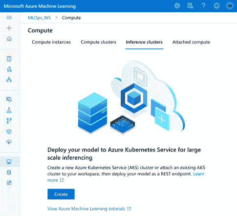

    图 10.1 – 部署推理集群

1.  点击**创建**按钮将显示您可以使用来创建 Kubernetes 服务的各种计算选项。您将被提示选择一个**区域**，这是您的计算将被部署的位置，以及一些配置，以便您可以根据核心、RAM 和存储来部署。选择一个合适的选项（建议您选择**Standard_D2_v4**作为此实验的成本最优选择），如下截图所示：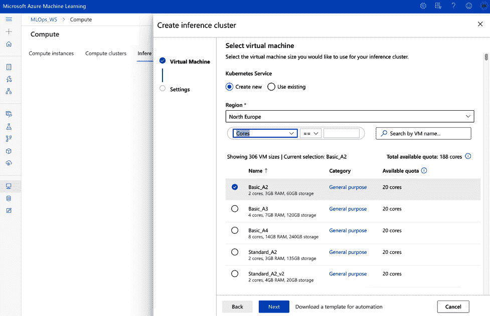

    图 10.2 – 选择合适的计算选项

1.  选择合适的计算选项后，您将被提示输入`'prod-aks'`（意味着**生产 Azure Kubernetes 服务**），将**集群用途**设置为**生产**（因为我们正在为生产设置），选择集群的**节点数量**，并选择**网络配置**的**基本**选项。为了简单起见，省略**启用 SSL 配置**。然而，根据您的需求，建议在生产中启用 SSL 连接，以提高安全性：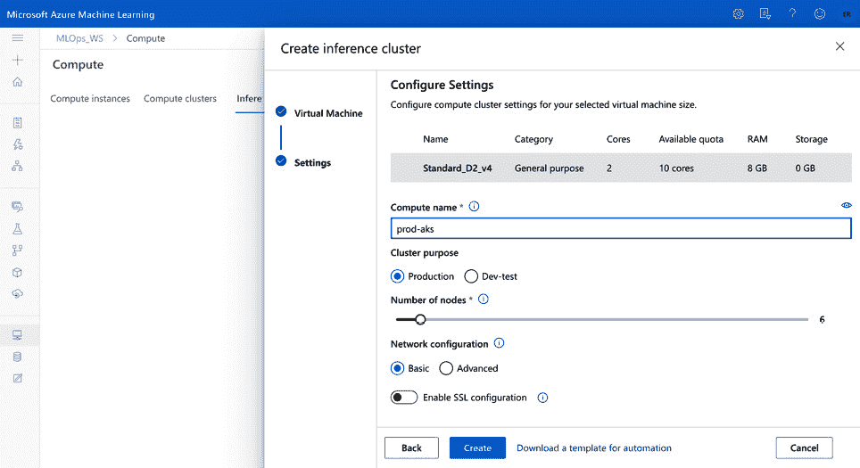

    图 10.3 - 配置设置

1.  点击**创建**按钮以部署用于生产的 Kubernetes 集群。创建和部署用于生产的计算大约需要 15 分钟：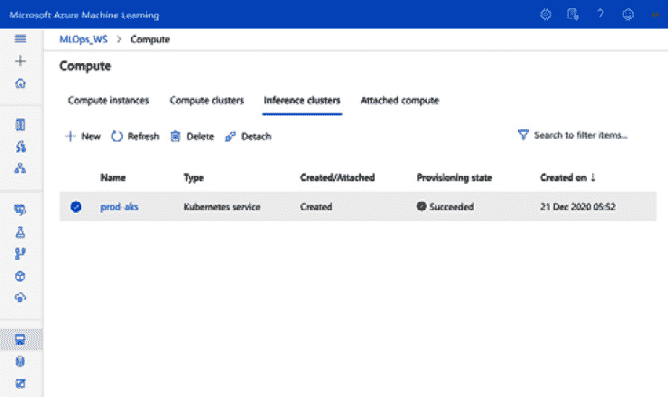

    图 10.4 – 部署的 Kubernetes 集群

1.  一旦您的 AKS 集群已部署，您将看到一个运行中的 Kubernetes 集群，其名称与您为计算提供的名称（例如，`prod-aks`）相匹配，如前一个截图所示。

## Azure 机器学习 SDK

在 Azure 上创建和部署 Kubernetes 集群的另一种方法是使用 Azure 机器学习 SDK。您可以使用名为`create_aks_cluster.py`的预置脚本，该脚本位于`10_Production_Release`文件夹中。运行`create_aks_cluster.py`脚本的前提是您的 Azure 机器学习工作区的`config.json`（可以从 Azure 机器学习工作区下载）文件，如下截图所示：

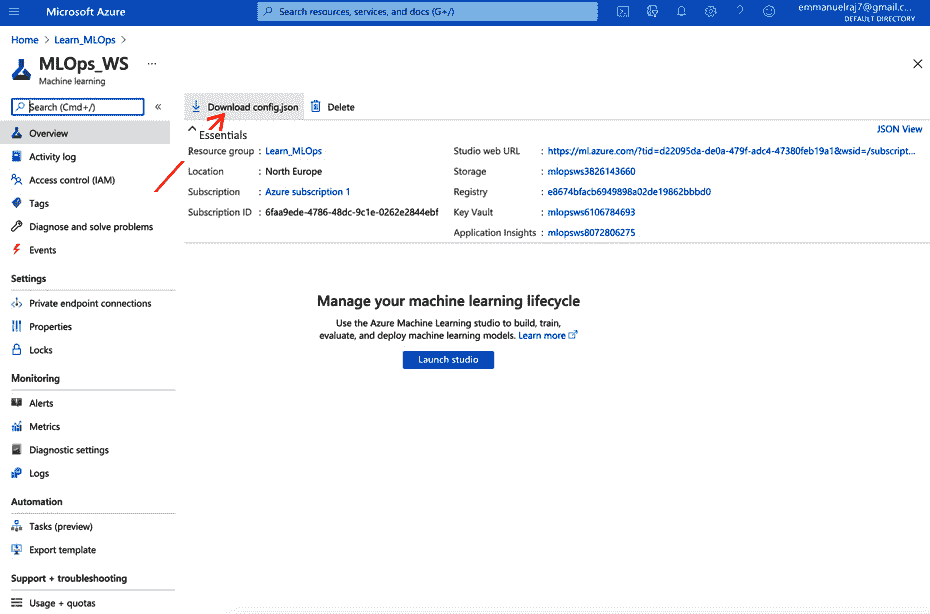

图 10.5 – 从您的 Azure 机器学习工作区获取配置文件

前往您的 Azure 机器学习工作区，并点击与`create_aks_cluster.py`文件相同的目录（`10_Production_Release`）中的`config.json`文件，如下所示：

```py
├──10_Production_Release
├── create_aks_cluster.py
├── config.json
```

通过这种方式，您现在可以运行脚本 (`create_aks_cluster.py`) 来创建用于生产部署的 AKS 计算资源。让我们看看 `create_aks_cluster.py` 脚本：

1.  从 `azureml.core` SDK 或库中导入必要的函数。例如 `Workspace`、`Model`、`ComputeTarget`、`AksCompute` 等函数将用于配置您的 AKS 集群：

    ```py
    from azureml.core import Workspace
    from azureml.core.model import Model
    from azureml.core.compute import ComputeTarget
    from azureml.core.compute_target import ComputeTargetException
    from azureml.core.compute import AksCompute, ComputeTarget
    ```

1.  通过导入必要的函数，您可以通过连接到您的 Azure Machine Learning 工作区并创建 `ws` 对象来开始使用它们。这样做是通过使用 `Workspace` 函数并将它指向您的 `config.json` 文件来完成的，如下所示：

    ```py
    ws = Workspace.from_config()
    print(ws.name, ws.resource_group, ws.location, sep = '\n')
    ```

1.  默认情况下，`from_config()` 函数会在您执行 `create_aks.py` 文件相同的目录中查找 `config.json` 文件。如果您的 `config.json` 文件在其他位置，请在 `from_config()` 函数中指定该文件的位置。在成功执行 `workspace.from_config()` 函数后，您将看到工作区的名称、资源组和位置被打印出来。

1.  接下来，我们将为生产部署创建一个 AKS Kubernetes 集群。首先为您的 AKS 集群选择一个名称（将其引用到 `aks_name` 变量），例如 `prod-aks`。脚本将检查是否已存在具有所选名称的集群。我们可以使用 `try` 语句通过 `ComputeTarget()` 函数检查是否已存在具有所选名称的 AKS 目标。它接受 `workspace` 对象和 `aks_name` 作为参数。如果找到具有所选名称的集群，它将打印找到的集群并停止执行。否则，将使用 `ComputeTarget.create()` 函数创建一个新的集群，该函数接受具有默认配置的 `provisioning` 配置：

    ```py
    # Choose a name for your AKS cluster
    aks_name = 'prod-aks' 
    # Verify that cluster does not exist already
    try:
        aks_target = ComputeTarget(workspace=ws, name=aks_name)
        print('Found existing cluster, use it.')
    except ComputeTargetException:
        # Use the default configuration (can also provide parameters to customize)
        prov_config = AksCompute.provisioning_configuration()
        # Create the cluster
        aks_target = ComputeTarget.create(workspace = ws, 
                                        name = aks_name, 
    provisioning_configuration = prov_config)
    if aks_target.get_status() != "Succeeded":
        aks_target.wait_for_completion(show_output=True)
    ```

在成功执行前面的代码后，将创建一个具有所选名称的新集群（即 `prod-aks`）。通常，创建新集群需要大约 15 分钟。一旦集群创建完成，您可以在 Azure Machine Learning 工作区中找到它，正如我们在 *图 10.4* 中所看到的。现在我们已经为增强生产环境 CI/CD 管道设置了先决条件，让我们开始设置它！

# 在 CI/CD 管道中设置我们的生产环境

执行以下步骤以在 CI/CD 管道中设置生产环境：

1.  前往您之前工作的 Azure DevOps 项目，并重新访问 **Pipelines** | **Releases** 部分，以查看您的 **Port Weather ML Pipeline**。我们将通过创建生产阶段来增强此管道。

1.  点击 **编辑** 按钮开始，然后在 **DEV TEST** 阶段下点击 **添加**，如图所示：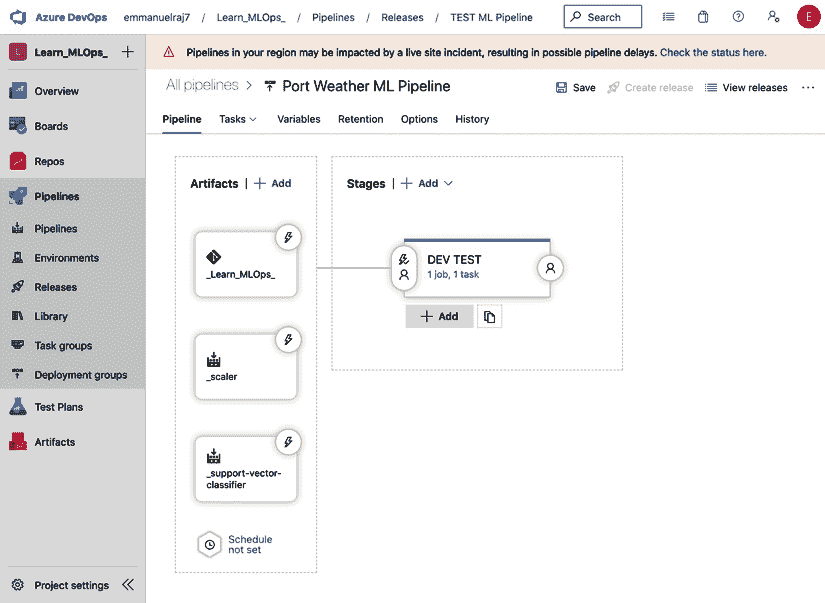

    Figure 10.6 – 添加新阶段

1.  点击 `production` 或 `PROD` 并保存，如图所示：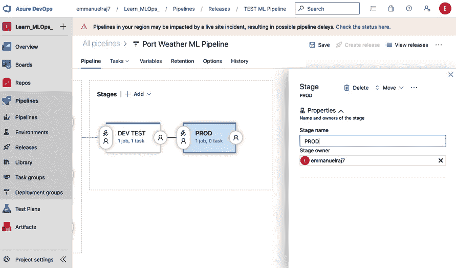

    Figure 10.7 – 添加并保存生产阶段 (PROD)

1.  将创建一个新的名为**PROD**的生产阶段。现在，你可以在生产阶段配置作业和流程。要为**PROD**配置作业，点击**PROD**阶段中的 1 个作业，0 个任务链接（如前述截图所示，在**PROD**阶段），你将被导向**任务**部分，你可以在这里将作业添加到**PROD**阶段。在这个阶段，我们将从我们的 Azure 机器学习工作区部署模型，因此我们将使用我们在*第七章*，*构建健壮的 CI 和 CD 流水线*中之前使用的 AzureML 模型部署模板来连接它。点击**代理作业**部分右侧的**+**号来添加一个任务，如下所示：![图 10.8 – 添加 AzureML 模型部署任务

    ![图片 B16572_10_08.jpg]

    图 10.8 – 添加 AzureML 模型部署任务

1.  搜索`mlops_ws`并指向**模型工件**作为你的模型源。我们这样做是因为我们将使用我们在*第四章*，*机器学习流水线*中训练的模型工件。

1.  接下来，从 Azure DevOps 仓库指向你的推理配置文件，如下截图所示。推理配置文件代表用于部署的定制环境的配置设置。我们将使用与`inferenceConfig.yml`文件相同的推理`Config.yml`文件。

1.  接下来，我们将配置`prod-aks`），命名你的部署或网络服务（例如，`prod-webservice`），并从与流水线连接的 Azure DevOps 仓库中选择**部署配置**文件，如下所示：![图 10.10 – 配置你的部署信息

    ![图片 B16572_10_10.jpg]

    ```py
    AksDeploymentConfig.yml
    computeType: AKS
    autoScaler:
        autoscaleEnabled: True
        minReplicas: 1
        maxReplicas: 3
        refreshPeriodInSeconds: 10
        targetUtilization: 70
    authEnabled: True
    containerResourceRequirements:
        cpu: 1
        memoryInGB: 1
    appInsightsEnabled: False
    scoringTimeoutMs: 1000
    maxConcurrentRequestsPerContainer: 2
    maxQueueWaitMs: 1000
    sslEnabled: False
    ```

1.  选择`AksDeploymentConfig.yml`文件作为我们的**部署配置**文件。现在，点击**保存**按钮来设置**PROD**环境。

通过这些，你已经成功设置了生产环境并将其与你的 CI/CD 流水线集成以实现自动化。现在，让我们通过执行它来测试流水线。

# 测试我们的生产就绪流水线

恭喜你成功设置了生产流水线！接下来，我们将测试其鲁棒性。一种很好的方法是创建一个新的版本，观察并研究生产流水线是否成功将模型部署到生产环境（包含流水线的生产 Kubernetes 集群设置）。按照以下步骤测试流水线：

1.  首先，创建一个新的版本，转到**流水线** | **发布**部分，选择你之前创建的流水线（例如，**Port Weather ML 流水线**），然后点击屏幕右上角的**创建发布**按钮以启动一个新的发布，如下所示：![图 10.11 – 创建一个新的发布

    ![图片 B16572_10_11.jpg]

    图 10.11 – 创建一个新的发布

1.  在屏幕右上角选择你想要在流水线中部署的工件（例如，`Learn_MLOps repo`，`_scaler`和`support-vector-classifier`模型，并选择它们的版本。建议第一次测试 PROD 部署时使用版本 1），然后点击屏幕右上角的**创建**按钮，如图所示。完成此操作后，将启动一个新的版本，如图所示：![Figure 10.12 – New release’s execution

    ![img/B16572_10_12.jpg]

    图 10.12 – 新版本执行

1.  在执行流水线后，**DEV TEST**和**PROD**阶段将被部署（例如，**Release-5**，如图所示）。在流水线发布进行中时，你可以通过监控任何阶段（DEV TEST 或 PROD）的每个步骤的日志来检查每个阶段的每个步骤，直到流水线成功部署。你还可以检查以前版本的日志。

1.  在成功完成版本发布后，**DEV TEST**和**PROD**阶段将分别使用 CI 和 CD 进行部署。你必须确保流水线是健壮的。接下来，我们可以通过添加自定义触发器进一步自定义流水线，这些触发器将自动化流水线而无需人工监督。在没有人工监督的情况下自动化 CI/CD 流水线可能会有风险，但可能具有优势，例如实时持续学习（监控和重新训练模型）和更快的部署。了解如何在没有人工监督的情况下自动化 CI/CD 流水线是很有用的。请注意，在许多情况下并不推荐这样做，因为错误的空间很大。在某些情况下，它可能是有用的——这完全取决于你的用例和机器学习系统目标。现在，让我们看看全自动化触发器。

# 配置流水线触发器以实现自动化

在本节中，我们将基于我们已经连接到流水线的工件配置三个触发器。我们将设置的触发器如下：

+   **Git 触发器**：用于对 master 分支进行代码更改。

+   **Artifactory 触发器**：用于创建或训练新模型或工件时。

+   **计划触发器**：每周周期性触发。

让我们详细看看这些流水线触发器。

## 设置 Git 触发器

在团队中，当代码库中某个分支发生代码更改时，通常会设置一个部署触发器。例如，当对**master**分支或**develop**分支进行代码更改时，CI/CD 流水线会被触发，分别将应用程序部署到 PROD 或 DEV TEST 环境。当向**master**或**develop**分支提交合并请求时，QA 专家或产品经理会接受合并请求以与相应的分支合并。在 master 或 develop 分支上做出代码更改后，会生成一个触发器以在流水线中创建一个新的版本。按照以下步骤为实验的 master 分支创建触发器，如图所示：

1.  进入 **管道** | **发布** 部分，选择您的管道（例如，**Port Weather ML 管道**）。然后，点击 **编辑**：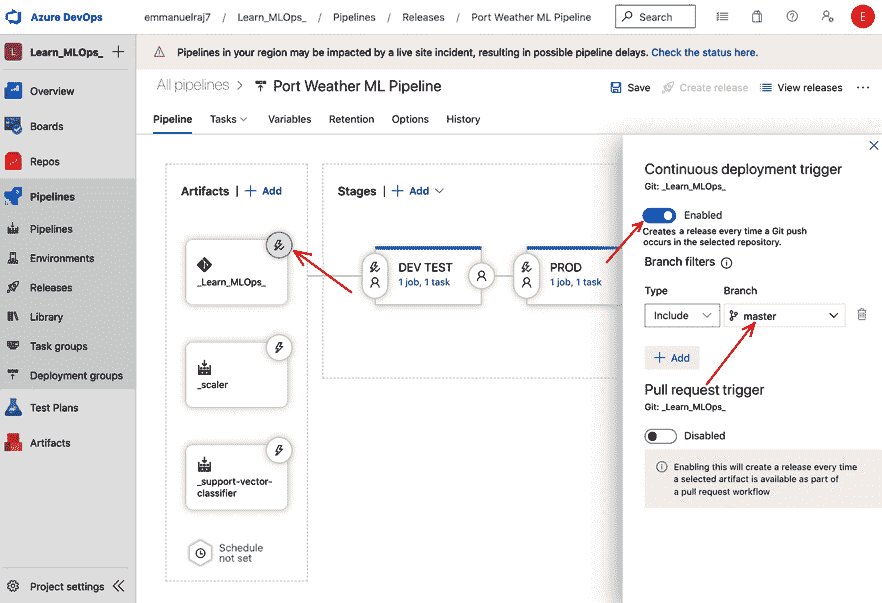

    图 10.13 – 设置持续部署触发器（Git 触发器）

    您将被引导到一个门户，您可以在其中编辑您的管道（例如，**Port Weather ML 管道**），以便您可以为您的工件配置持续部署触发器。

1.  要为 master 分支设置 Git 触发器（当 master 分支发生更改时，将触发新发布），点击 **触发器** 图标（雷声图标）并将开关按钮从禁用状态移动到启用状态。这将启用持续部署触发器。

1.  最后，添加一个分支过滤器并指向您想要设置触发器的分支 – 在这种情况下，是 master 分支 – 如前图所示。保存您的更改以设置 Git 触发器。

通过实施这些步骤，您已设置了一个持续部署触发器，以便在 master 分支发生更改时启动新发布。

## 设置 Artifactory 触发器

对于机器学习应用程序，Artifactory 触发器非常有用。当团队中的数据科学家训练了新的模型或工件（文件）时，将那些模型部署到测试环境，并在有希望或优于先前模型或触发器的情况下最终部署到生产环境是有用的。按照以下步骤设置一个持续部署触发器，以便在训练新模型时为管道创建新发布，如图中所示：

1.  进入 **管道** | **发布** 部分，选择您的管道（例如，**Port Weather ML 管道**）。然后，点击 **编辑**：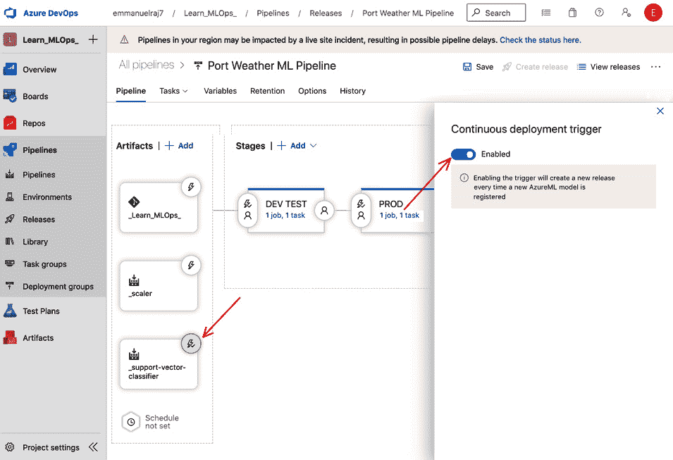

    图 10.14 – 为工件触发器设置 CD（SVC 模型）

    点击 **编辑** 按钮后，您将被引导到一个门户，您可以在其中编辑您的管道，如图中所示。

1.  要为您的模型设置工件触发器，点击您选择模型，例如 **支持向量机分类器**（**SVC**），并启用 **持续部署触发器**。在前面的截图，已为模型（SVC）启用了一个触发器。每当在连接到您的 Azure Machine Learning 工作区的模型注册表中训练并注册新的 SVC 模型时，将通过管道触发新发布以部署新模型。

1.  最后，保存您的更改以设置 SVC 模型的工件触发器。您已设置了一个持续部署触发器，以便在您的 Azure Machine Learning 工作区上训练并注册新的 SVC 模型时启动新发布。该管道将检索新模型并将其部署到开发测试和产品环境中。

通过实施这些步骤，您已设置了一个持续部署触发器，当在您的 Azure Machine Learning 工作区中创建或注册新工件时，将启动新的管道发布。

## 设置计划触发器

现在，我们将为管道设置一个特定时间的时间触发计划。这种触发器对于通过定期的新发布保持系统健康和更新非常有用。计划触发器在设定的时间间隔创建新发布。我们将为每周星期一上午 11:00 设置一个计划触发器。在此时间，将触发一个新发布，将 SVC 模型的最新版本部署到开发测试和 PROD 环境。按照以下步骤设置计划触发器：

1.  前往**管道** | **发布**部分并选择您的管道（例如，**Port Weather ML 管道**）。然后，点击**编辑**，如图所示：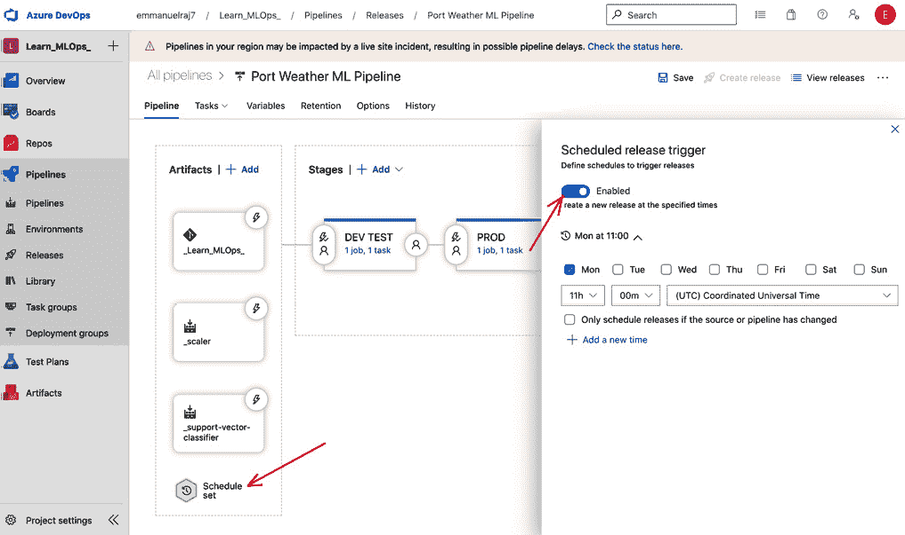

    图 10.15 – 设置计划触发器

    点击**编辑**按钮后，您将被引导到一个门户，您可以在那里编辑您的管道。

1.  要为管道设置计划触发器，请点击**计划设置**并启用**计划发布触发器**。然后，选择您希望触发发布的日期和时间。例如，在先前的屏幕截图中，每周星期一上午 11:00 已启用触发器。

1.  最后，保存您的更改以设置管道的计划触发器。

通过实施这些步骤，您已设置了一个持续部署触发器，在设定的时间间隔内启动新的管道发布。

恭喜您设置 Git、工件和计划触发器。这些触发器使管道实现完全自动化。管道已设置，现在可以成功测试和部署模型。您还可以选择通过添加人工或**质量保证**（**QA**）专家来部分自动化管道，以在每个管道阶段获得批准。例如，在测试阶段之后，QA 专家可以进行批准，以便在测试阶段一切顺利时开始生产部署。作为 QA 专家，监控您的 CI/CD 管道至关重要。在下一节中，我们将探讨在管理管道发布时的最佳实践。

# 管道发布管理

CI/CD 管道中的发布允许您的团队完全自动化，并以更快的速度、更低的风险向客户交付软件。发布允许您在生产的多个阶段测试和交付软件，或设置带有批准和按需部署的半自动化流程。监控和管理这些发布至关重要。我们可以通过从**管道** | **发布**访问管道并选择我们的 CI/CD 管道（例如，**Port Weather ML Pipeline**）来管理发布，如图所示：

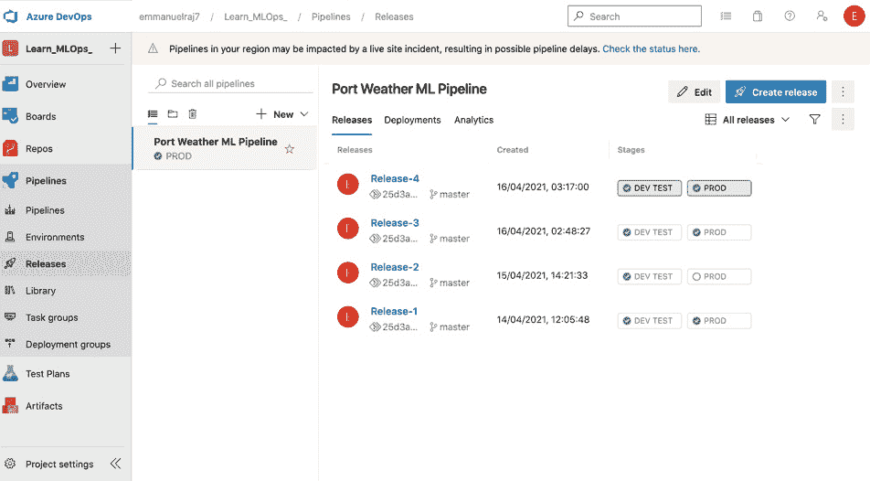

图 10.16 – 管道发布管理

在这里，您可以跟踪所有版本及其历史记录，并对每个版本执行操作，例如重新部署、放弃、检查日志等。您可以看到以下截图中的版本。通过点击单个版本（例如，**版本 4**），我们可以检查在版本中部署了哪些模型和工件以及版本是如何触发的（手动或使用自动触发器）。它提供了管道的端到端可追溯性。这些信息对于 ML 系统的治理和合规至关重要：

![图 10.17 – 检查版本

![img/B16572_10_17.jpg]

图 10.17 – 检查版本

预防胜于治疗。正如我们在失败后进行事件审查一样，在部署新服务或模型后进行发布后审查有助于通过预防可能的失败。对部署后的发布进行彻底分析可以使我们理解以下关键问题的答案：

+   在发布过程中，哪些是有效的，哪些是无效的？

+   发布过程中是否遇到了任何障碍？

+   是否存在可以解决并使下一个版本更具可解释性的不明确流程？

在发布后彻底理解这些问题可以帮助您改进和迭代您的策略，并发展更好的发布管理实践。

# 向持续监控迈进

通过这样，我们已经建立了一个完全自动化且稳健的流程。到目前为止，我们已经成功地在 MLOps 工作流中实现了部署部分或模块（正如我们在*第一章*，*MLOps 工作流基础*中讨论的那样）。实时监控已部署的 ML 模型和服务对于理解系统的性能至关重要，因为这有助于最大化其商业影响。ML 项目未能为业务带来价值的一个原因是因为它们在决策过程中缺乏信任和透明度。在当今时代，将信任融入 AI 系统至关重要，尤其是如果我们希望适应不断变化的环境、监管框架和动态的客户需求。持续的监控将使我们能够监控 ML 系统的性能，并将信任融入 AI，以最大化我们的商业价值。在下一章中，我们将学习 MLOps 工作流中的监控模块以及它是如何促进持续监控的。

# 摘要

在本章中，我们介绍了 CI/CD 管道和生成环境的基本要素。我们进行了一些实际操作来搭建生产基础设施，然后在管道的生产环境中设置了流程以进行生产部署。我们测试了准备就绪的生产管道以检验其鲁棒性。为了将事情提升到下一个层次，我们使用各种触发器完全自动化了 CI/CD 管道。最后，我们探讨了发布管理实践和能力，并讨论了持续监控 ML 系统的必要性。一个关键的观点是*管道是产品，而不是模型*。比起构建最佳模型，更应专注于构建一个强大且高效的管道。

在下一章中，我们将探讨 MLOps 工作流程监控模块，并深入了解这个颠覆性的可解释监控框架。
