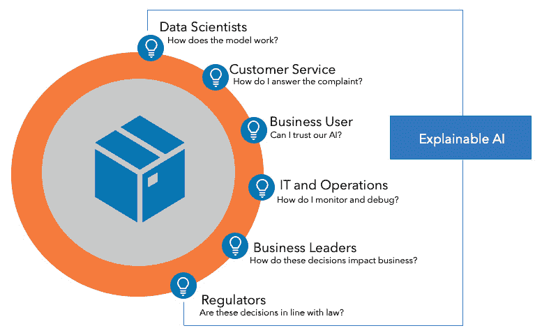
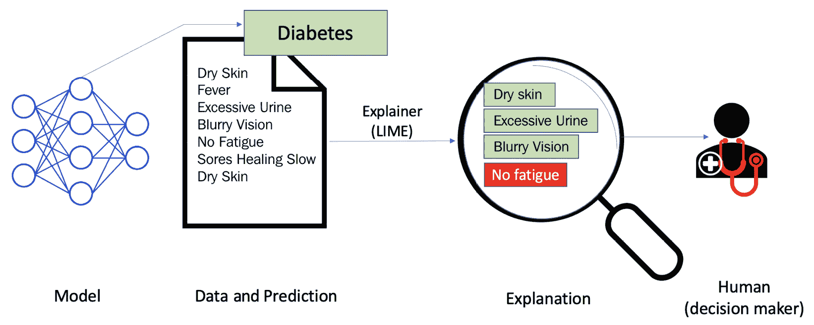
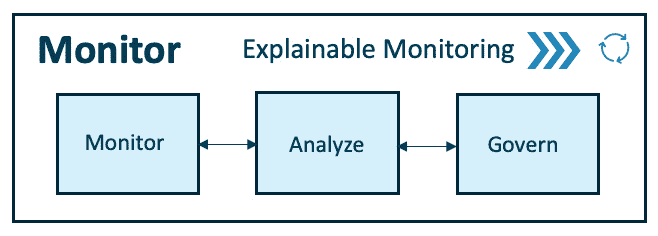
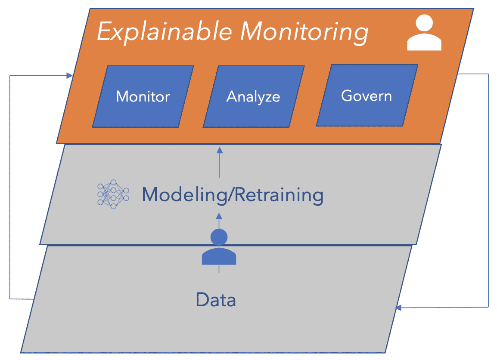
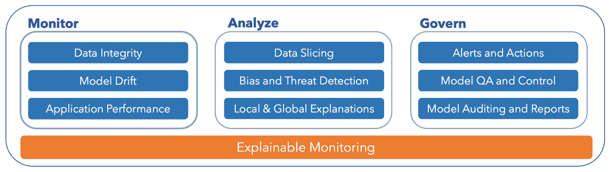
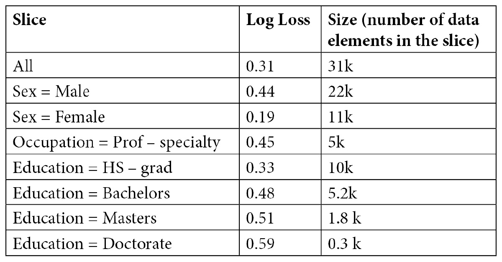
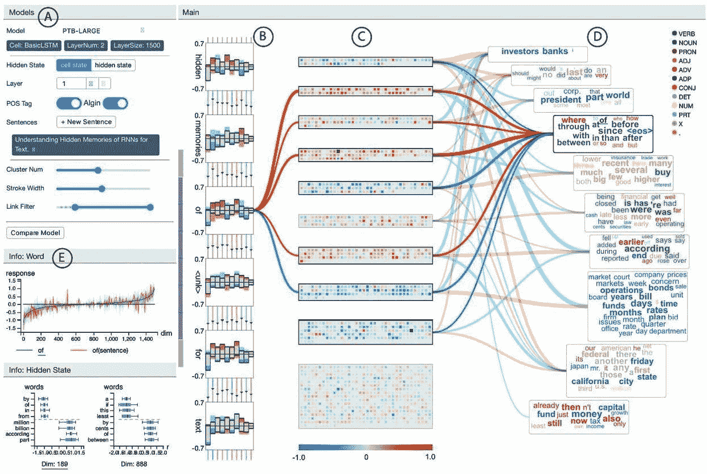
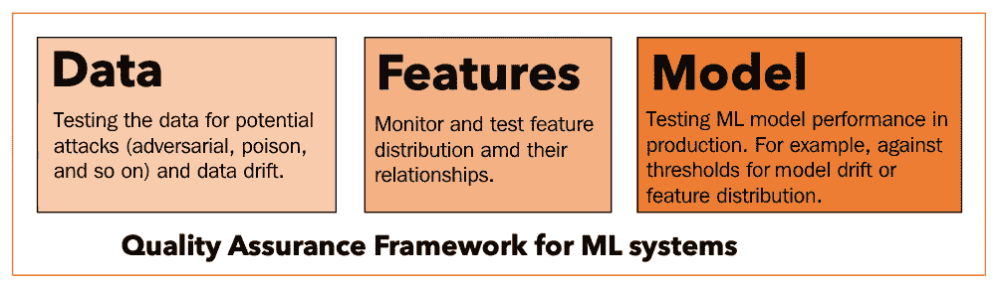
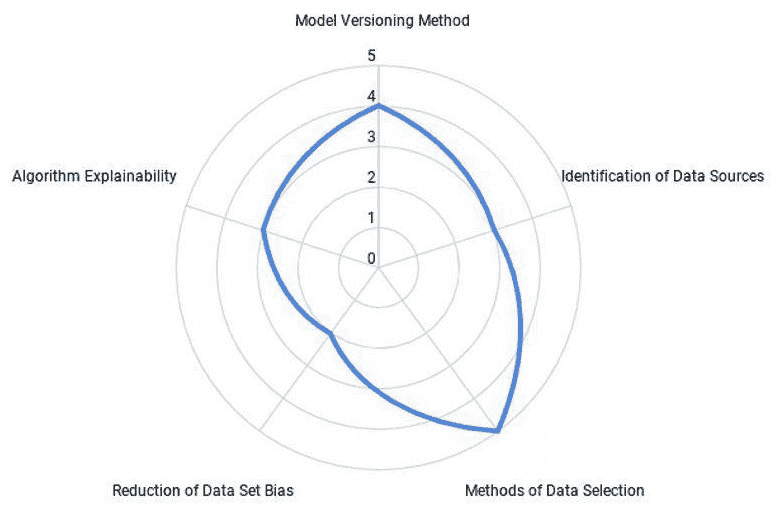

# 第十一章：监控你的 ML 系统的关键原则

在本章中，我们将学习那些对于在生产环境中监控你的**机器学习**（**ML**）模型至关重要的基本原理。你将学习如何使用可解释监控框架构建可信赖且可解释的人工智能解决方案。可解释监控框架可用于构建功能监控管道，以便你在生产环境中监控 ML 模型，分析应用程序和模型性能，并治理 ML 系统。监控 ML 系统的目标是实现信任、透明度和可解释性，以增加业务影响。我们将通过观察一些现实世界的例子来了解这一点。

理解本章中提到的原则将使你具备构建针对你的用例或公司的端到端监控系统的知识。这将帮助你参与业务、技术以及公众（客户和法律）利益相关者，以便你能够高效地实现你的业务目标。这还将帮助你获得优势，并采用系统的方法来治理你的 ML 系统。使用本章中的框架，你可以为你的利益相关者和 ML 系统启用信任、透明度和可解释性。

在本章中，我们将涵盖以下主要内容：

+   理解监控 ML 系统的关键原则

+   在 MLOps 工作流程中的监控

+   理解可解释监控框架

+   启用服务的持续监控

让我们开始吧！

# 理解监控 ML 系统的关键原则

在当今数据驱动产品日益增长的需求以及适应不断变化的环境和监管框架的背景下，将信任融入 AI 系统至关重要。ML 项目未能为业务带来价值的一个原因就是决策过程中缺乏信任和透明度。许多黑盒模型擅长达到高精度，但在解释已做决策背后的原因时却变得过时。在撰写本文时，有关信任和可解释性的担忧的新闻正在浮出水面，如下图所示：

![图 11.1 – 模型信任和可解释性的组成部分]

![img/image001.jpg]

图 11.1 – 模型信任和可解释性的组成部分

这张图片展示了现实生活中重要领域的担忧。让我们通过一些现实生活中的例子来探讨这些担忧如何转化为模型可解释性的关键方面，例如模型漂移、模型偏差、模型透明度和模型合规性。

## 模型漂移

我们生活在一个动态变化的世界。因此，机器学习模型执行任务或进行预测的环境和数据也在不断演变，考虑这种变化是至关重要的。例如，COVID-19 大流行给我们带来了一个意想不到的现实。许多商业运营已经转向虚拟，这场大流行给我们带来了一个许多人都认为的**新常态**。许多小企业已经破产，由于失业率的上升，个人面临着极端的财务短缺。这些人（小企业主和个人）以前从未如此大规模地向银行和机构申请过贷款和财务救济。银行和机构已经部署并使用的欺诈检测算法在贷款和财务救济申请方面没有看到这种速度和真实性。

所有这些特征的变化（例如申请人的收入、他们的信用历史、申请人的位置、他们请求的金额等），由于一个原本有资格贷款但之前没有申请过贷款的申请人失去了工作，可能会扭曲模型的权重/感知（或混淆模型）。这对模型来说是一个重要的挑战。为了处理这种动态变化的环境，考虑模型漂移并持续从中学习至关重要。

Drift 与环境的改变相关，指的是预测机器学习模型性能的下降以及变量之间关系的退化。以下是与模型和数据相关的四种模型变化类型：

+   **数据漂移**：这是指独立变量的属性发生变化。例如，在先前的例子中，由于季节性、新产品或为满足消费者需求而进行的更改，数据发生变化，如 COVID-19 大流行。

+   **特征漂移**：这是指特征（的）属性随时间变化。例如，温度随着季节的变化而变化。在冬天，温度比夏天或秋天的温度要低。

+   **模型漂移**：这是指依赖变量的属性发生变化。例如，在上面的例子中，这是欺诈检测分类发生变化的地方。

+   **上游数据变化**：这是指数据管道经历操作数据变化时的情况，例如当某个特征不再生成时，导致缺失值。一个例子是客户薪资价值的变化（从美元到欧元），其中美元价值不再生成。

为了更清晰地说明，我们将在下一章中学习更多关于 drift 的知识，并开发 drift 监控器（*第十二章*，*模型服务和监控*）。

## 模型偏差

无论你是否喜欢，机器学习已经影响了你生活中的许多决策，比如获得下一份工作的短名单或从银行获得抵押贷款批准。甚至执法机构也在使用它来缩小潜在的犯罪嫌疑人以预防犯罪。ProPublica 是一个新闻机构（使用机器学习预测未来的罪犯 - [`www.propublica.org/article/machine-bias-risk-assessments-in-criminal-sentencing`](https://www.propublica.org/article/machine-bias-risk-assessments-in-criminal-sentencing)）。2016 年，ProPublica 的机器学习显示了一些案例，其中模型倾向于将黑人女性预测为比白人男性风险更高，而所有之前的记录都显示并非如此。这类案例可能代价高昂，并具有破坏性的社会影响，因此需要避免。在另一个案例中，亚马逊构建了一个用于招聘人员的 AI，但由于它歧视女性（据《华盛顿邮报》报道），不得不关闭它。这类偏见可能代价高昂且不道德。为了避免这些，需要监控人工智能系统，以便我们能够对其建立信任。

模型偏差是一种由于数据集（用于模型训练）中某些特征比其他特征更频繁地表示和/或加权而产生的错误。一个失真或有偏差的数据集可能导致模型用例的结果偏差、低准确度水平和分析错误。换句话说，这是由于机器学习算法做出不正确假设而产生的错误。高偏差可能导致预测不准确，并可能导致模型错过特征与预测的目标变量之间的相关关系。一个例子是上述由亚马逊构建的用于招聘人员的 AI，但它对女性存在偏见。我们将在“可解释监控框架”部分了解更多关于模型偏差的内容，我们将探讨“偏差和威胁检测”。

## 模型透明度

人工智能在本质上是非确定性的。特别是机器学习在其生命周期中持续演变、更新和重新训练。人工智能几乎影响着所有行业和领域。随着其日益普及和重要决策使用机器学习，建立与确定性系统相同的信任水平变得至关重要。毕竟，数字系统只有在它们能够被信任执行其任务时才有用。模型透明度有明确的需求——许多首席执行官和商业领袖都在鼓励我们了解人工智能的商业决策及其商业影响。最近，TikTok 的首席执行官发表声明称：

"我们相信所有公司都应该向监管机构披露他们的算法、审核政策和数据流"（来源：TikTok）。

公司这样的开放和透明度可以建立我们作为社会对人工智能的信任，并使采用和合规更加顺畅。

模型透明性是建立对人工智能系统信任的追求，以确保公平性、减少或消除偏差、提供问责制（审计系统推导结果的端到端过程），以及证明模型输出和系统决策的合理性。

## 模型合规性

模型合规性已成为重要议题，因为不遵守政府和社会的规定可能造成巨大的成本。以下标题是由《华盛顿邮报》报道的：

"摩根大通就联邦抵押贷款歧视诉讼达成 5500 万美元和解"

不合规对摩根大通来说变成了一笔昂贵的交易。将监管合规性付诸实践越来越重要，以避免不必要的罚款和对社会的损害。以下是一些在公司内实现模型合规性的驱动因素：

+   **问责文化**：对机器学习系统进行端到端审计对于监控合规性至关重要。MLOps 可以在促进审计和编辑使用人工智能做出的运营和业务决策中发挥关键作用。

+   **伦理优先**：构建对社会有价值并赢得我们信任的负责任的人工智能系统需要人工智能预测具有包容性、公平性和伦理性。拥有一个伦理框架可以帮助公司将其客户与他们的价值观和原则联系起来，并确保人工智能决策是按照伦理做出的。欧洲委员会在这方面做得很好，提出了*可信赖人工智能的伦理和指南*。您可以在以下链接找到这些指南：[`ec.europa.eu/digital-single-market/en/news/ethics-guidelines-trustworthy-ai`](https://ec.europa.eu/digital-single-market/en/news/ethics-guidelines-trustworthy-ai)。

+   **合规性管道**：拥有满足商业和政府规定的合规性管道可以为寻求确保实时合规性、审计和编辑的组织带来回报。MLOps 可以通过跟踪所有机器学习模型的库存来促进这一点，从而让利益相关者了解它们的工作方式，并以可视化的方式解释它们是如何工作的。这种方式的工作使人类能够监控、编辑并解释与法规的相关性，这对于业务利益相关者、数据科学家和监管者携手合作确保他们有透明和可解释的运营是高效的。

## 可解释人工智能

在理想情况下，企业应将模型透明度和合规性置于首位，以便业务能够动态适应不断变化的环境，如模型漂移，并在过程中处理偏差。所有这些都需要一个框架，使所有业务利益相关者（IT 和业务领导者、监管者、业务用户等）与人工智能模型保持联系，以便理解模型所做的决策，同时专注于提高模型透明度和合规性。这样的框架可以通过将可解释人工智能作为 MLOps 的一部分来实现。可解释人工智能使机器学习易于人类理解。

模型透明度和可解释性是两种使可解释人工智能成为可能的方法。机器学习模型基于它们训练的数据形成模式或规则。可解释人工智能可以帮助人类或业务利益相关者理解模型发现的这些规则或模式，并帮助验证由机器学习模型做出的业务决策。理想情况下，可解释人工智能应该能够服务于多个业务利益相关者，如下面的图所示：

![图 11.2 – 以业务驱动的可解释人工智能]

图 11.2 – 以业务驱动的可解释人工智能

黑盒模型在预测上可以达到高精度，但一旦它们无法解释为什么做出这些决策，就会变得过时。大多数黑盒模型不提供对模型性能的可见性，没有监控来捕捉潜在的偏差或漂移，也没有对模型行为的可解释性。为了解决这个问题，大量研究和开发正在进行中，以提供可解释人工智能方法，以提供模型透明度和模型可解释性。

将 MLOps 与可解释人工智能方法相结合可以使几乎所有的业务利益相关者理解和验证人工智能做出的业务决策，并帮助向内部和外部利益相关者解释它们。可解释人工智能没有一劳永逸的解决方案，因为每个用例都需要自己的可解释人工智能方法。有各种方法正在变得越来越受欢迎。我们将在以下小节中查看一些示例。

### 特征归因方法

特征归因方法显示了模型中的每个特征对每个实例预测的贡献程度。当你请求解释时，你会得到预测，以及特征归因信息。以下是一些特征归因方法：

+   **SHapley Additive exPlanations**（**SHAP**）：一种解释任何机器学习模型输出的方法。它基于博弈论方法，解释任何机器学习模型的输出。特别是，它解释了每个特征对推动模型输出的贡献。

+   **集成梯度**：一种旨在通过模型特征来解释模型预测之间关系的技巧。它在论文《深度网络的公理化归因》中提出。它可以通过识别偏斜数据来解释特征重要性，并有助于调试模型性能。

+   **Local Interpretable Model-Agnostic Explanation**（**LIME**）：这是一种模型无关的方法，用于解释预测。它侧重于局部解释；也就是说，解释反映了模型对预测数据实例的行为。例如，LIME 可以建议哪些因素或特征对模型预测结果很重要。这可以在以下图中看到：

![图 11.3 – 使用 LIME 解释单个预测]

图 11.3 – 使用 LIME 解释单个预测

在前面的图中，模型预测患者患有糖尿病。LIME 解释器突出了与糖尿病相关的症状，如干燥的皮肤、过多的尿液和模糊的视力，这些症状有助于“糖尿病”预测，而“无疲劳”则是反对的证据。使用解释器，医生可以从模型的预测中做出决定并得出结论，并为患者提供适当的治疗。

你可以在[`cloud.google.com/ai-platform/prediction/docs/ai-explanations/overview`](https://cloud.google.com/ai-platform/prediction/docs/ai-explanations/overview)了解更多关于 AI 解释的信息。

### 非特征归因方法

非特征归因方法不关注特征如何影响你的模型预测。相反，它们关注模型推理中输入数据和输出数据之间的关系。以下是一些非特征归因方法：

+   **Deeplift**：这是通过比较每个神经元的激活与其参考激活并根据差异分配贡献分数来评估神经网络的。Deeplift 揭示了相关性和贡献。例如，假设我们正在使用猫和狗图像分类器来对猫和狗之间的图像进行分类。假设分类器使用 deeplift 方法预测输入图像是狗。在这里，我们可以将图像分类器神经网络中激活的神经元反向传播到它们的参考激活，然后根据差异为每个特征分配贡献分数。

+   **自然语言解释**（**NLE**）：NLE 旨在通过融合部分依赖函数、梯度分析、上下文编码、个体条件期望、累积局部效应等技术，捕捉文本解释的输入输出关系。这些技术在解释分类或生成文本的语言模型方面非常有用。NLE 为用户提供易于理解和有用的理由，以决定是否信任模型的决策并采取行动。例如，你可能希望根据模型的推荐和解释购买产品。可以使用如 Microsoft Power BI 和 Qlik Sense 等工具来插入并研究 NLE。这些工具需要根据你的需求或用例进行定制。

除了前面提到的那些方法之外，还有其他方法。这个领域是 AI 领域研究的热点。许多研究人员和商业领袖都在追求解决可解释 AI 问题，向内部和外部利益相关者解释模型决策。为多个商业利益相关者提供可解释 AI 驱动的界面可以帮助他们回答关键的商业问题。例如，一位商业领袖需要能够回答“这些模型决策如何影响业务？”而对于 IT 和运营来说，了解“我如何监控和调试？”的答案至关重要。

为多个商业利益相关者回答这些问题，使员工和企业能够适应人工智能，并通过确保模型透明度和合规性，在优化模型偏差和漂移的同时适应不断变化的环境，从而最大化从人工智能中获得的价值。

### 可解释人工智能 = 模型透明度和可解释性

由于机器学习模型正成为一等公民，为了监控模型在这些领域的性能，我们可以使用可解释监控，它允许我们通过监控和解释其决策来分析和治理生产中的机器学习系统，使用的是可解释人工智能方法。可解释监控是可解释人工智能的混合体；它在生产中融合了**操作**（**Ops**）的可解释人工智能方法。可解释监控正成为 MLOps 工作流程的一个组成部分。我们将在下一节中探讨可解释监控如何为 MLOps 工作流程带来价值。

# MLOps 工作流程中的监控

我们在*第一章*《MLOps 工作流程基础》中了解了 MLOps 工作流程。如图所示，监控模块是 MLOps 工作流程的一个组成部分，用于评估生产中机器学习模型的性能和衡量机器学习系统的商业价值。只有当我们从透明度和可解释性的角度理解模型的决策时，我们才能做到这两者（衡量由机器学习模型产生的性能和商业价值），以便向利益相关者和客户解释这些决策。

可解释监控使透明度和可解释性得以治理机器学习系统，从而驱动最佳商业价值：

图 11.4 – MLOps 工作流程 – 监控

在实践中，**可解释监控**使我们能够监控、分析和治理机器学习系统，并且它与其他 MLOps 工作流程组件一起形成一个连续的循环。它还赋予人类参与循环的机会，以理解模型决策并即时教导模型（通过标记数据和重新训练模型）。可解释监控实现了持续学习，并且从长远来看，对一家公司来说可能非常有价值。以下图中可以看到，使用可解释监控实现的人机交互的持续学习流程：

图 11.5 – 由可解释监控实现的持续学习

持续学习是系统在变化的环境中持续学习的能力，同时建立之前学到的知识。为了促进持续学习，数据和建模必须携手合作，并得到人工的辅助（通常是一个 QA 分析师或系统管理员，如数据科学家或 ML 工程师）。可解释监控在持续学习系统中发挥着至关重要的作用，以增加收入、保持合规和负责任地构建 ML 系统。毕竟，只有具备持续学习能力并部署的模型才能带来商业价值。

# 理解可解释监控框架

在本节中，我们将详细探讨可解释监控框架（如图所示）以了解和了解可解释监控如何增强 MLOps 工作流程和 ML 系统本身：

图 11.6 – 可解释监控框架

可解释监控框架是一个模块化框架，用于监控、分析和治理 ML 系统，同时实现持续学习。所有模块协同工作，以实现透明和可解释的监控。让我们看看每个模块是如何工作的，以了解它们在框架中的贡献和功能。首先，让我们看看监控模块（前图中第一个面板）。

## 监控

监控模块专注于监控生产中的应用程序（服务 ML 模型）。在 ML 系统中存在多个因素，例如应用程序性能（遥测数据、吞吐量、服务器请求时间、失败的请求、错误处理等）、数据完整性和模型漂移，以及不断变化的环境。监控模块应从生产系统日志中捕获关键信息，以跟踪 ML 系统的鲁棒性。让我们看看监控模块三个功能的重要性及其功能：数据完整性、模型漂移和应用性能。

### 数据完整性

确保 ML 应用程序的数据完整性包括检查输入（ML 模型的输入数据）和输出（ML 模型预测）数据，以确保 ML 系统的完整性和鲁棒性。监控模块通过检查数据的量、种类、真实性和速度来确保数据完整性，以检测异常值或异常。检测异常值或异常可以防止 ML 系统性能不佳并容易受到安全攻击（例如，对抗性攻击）。数据完整性与高效的审计相结合，可以促进 ML 系统达到预期的性能，从而产生商业价值。

### 模型漂移

如果不测量模型漂移，模型的性能可能会很容易变得低于标准，并可能因不良的决策和客户服务而损害业务。例如，在类似 COVID-19 的黑天鹅事件期间，很难预见数据的变化或趋势。以下是一些登上头条的新闻：

+   由于购物习惯的巨大变化，Instacart 模型预测项在商店的可访问性准确性从 93%下降到 61%([`fortune.com/2020/06/09/instacart-coronavirus-artificial-intelligence/`](https://fortune.com/2020/06/09/instacart-coronavirus-artificial-intelligence/))。

+   银行家们怀疑，那些在好时光下训练的信用模型是否能够准确应对压力情景（[`www.americanbanker.com/opinion/ai-models-could-struggle-to-handle-the-market-downturn`](https://www.americanbanker.com/opinion/ai-models-could-struggle-to-handle-the-market-downturn)）。

+   针对市场不确定性，交易算法失误。某些基金下降了 21%([`www.wired.com/story/best-ai-models-no-match-coronavirus`](https://www.wired.com/story/best-ai-models-no-match-coronavirus))。

+   在 COVID-19 大流行之后，图像分类模型难以适应“新常态”：一个家庭在家前使用笔记本电脑现在可能意味着“工作”，而不是“休闲”。([`techcrunch.com/2020/08/02/ai-is-struggling-to-adjust-to-2020/`](https://techcrunch.com/2020/08/02/ai-is-struggling-to-adjust-to-2020/))。

因此，监控模型漂移至关重要，无论是数据漂移、概念漂移还是任何上游数据的变化，以便适应不断变化的环境，并以最相关的方式服务于企业和客户，从而产生最大的商业价值。

### 应用性能

监控应用性能以预见和预防任何潜在故障至关重要，因为这确保了机器学习系统的鲁棒性。在这里，我们可以监控生产部署目标（例如，Kubernetes 或本地服务器）的关键系统日志和遥测数据。监控应用性能可以实时提供关键洞察，例如服务器的吞吐量、延迟、服务器请求时间、失败请求的数量或控制流错误等。监控应用没有固定的方法，而且根据你的业务用例，你的应用性能机制可以被定制和监控，以保持系统运行并产生商业价值。

在监控组件方面，我们监控了数据完整性、模型漂移和应用性能。在下一节中，我们将分析如何监控模型和应用程序的数据。

## 分析

在生产环境中实时分析你的机器学习系统对于理解你的机器学习系统的性能和确保其鲁棒性至关重要。人类在分析模型性能和检测细微异常和威胁方面发挥着关键作用。因此，在机器学习系统中引入人类可以极大地提高透明度和可解释性。我们可以分析模型性能以检测任何偏差或威胁，并了解为什么模型以某种模式做出决策。我们可以通过应用高级技术，如数据切片、对抗攻击预防技术，或通过理解局部和全局解释来实现这一点。让我们看看我们如何在实践中做到这一点。

### 数据切片

在机器学习（ML）改善商业和一般生活方面有许多成功的案例。然而，仍有改进数据工具以调试和解释模型的空间。一个关键的改进领域是理解为什么模型在某些数据部分或切片上表现不佳，以及我们如何平衡它们的整体性能。切片是数据集的一部分或子集。数据切片可以帮助我们了解模型在不同类型的子数据集上的表现。我们可以将数据集分成多个切片或子集，并研究模型在它们上的行为。

例如，让我们考虑一个假设的情况，我们训练了一个随机森林模型来分类一个人的收入是否高于或低于 50,000 美元。该模型是在 UCI 人口普查数据上训练的 ([`archive.ics.uci.edu/ml/datasets/Census-Income+%28KDD%29`](https://archive.ics.uci.edu/ml/datasets/Census-Income+%28KDD%29))。模型对数据切片（或子集）的结果可以在下表中看到。这张表表明，整体指标可能是可接受的，因为所有数据的整体对数损失都很低（见 *All* 行）。这是二分类问题中广泛使用的损失指标，表示预测概率与实际/真实值之间的接近程度；在二分类的情况下，它为 0 或 1。预测概率与实际值偏差越大，对数损失值就越高。然而，各个切片讲述了一个不同的故事：

表 11.1 – UCI 人口普查数据切片

通过查看前表，我们可以得出结论，该模型的表现尚可。然而，如果我们比较男性和女性的表现，我们会看到模型仅在女性受试者上表现良好，其日志损失低于男性受试者的日志损失。另一方面，如果你查看*教授-专业*职业，你会看到净表现与男性受试者的表现相当，其日志损失分别为 0.45 和 0.41，而*教授-专业*的影响量则明显较小。对于*学士*、*硕士*和*博士*，模型表现不佳，因为其日志损失分别为 0.44、0.49 和 0.59。还应注意，如果一个切片及其对应项的日志损失低于可接受水平，这表明模型整体表现不佳，而不仅仅是特定数据切片。

数据切片使我们能够看到微妙的偏差和未见过的相关性，以了解为什么模型可能在数据子集上表现不佳。我们可以通过使用代表所有数据切片的平衡数据集（例如，使用合成数据或通过欠采样等）或调整模型的超参数以减少整体偏差来避免这些偏差并提高模型的整体性能。数据切片可以为机器学习系统提供模型公平性和性能的概述，并帮助组织优化数据和机器学习模型以达到最佳性能和合理的公平性阈值。数据切片可以通过提供数据和模型性能的透明度和可解释性来帮助建立对人工智能系统的信任。

备注

要全面了解数据切片和自动化数据切片方法，请参阅*自动化数据切片用于模型验证：大数据-人工智能集成方法*，链接为[`arxiv.org/pdf/1807.06068.pdf`](https://arxiv.org/pdf/1807.06068.pdf)。

### 偏差和威胁检测

为了确保使用机器学习模型做出稳健和道德的决定，我们需要确保模型是公平和安全的。任何偏差和威胁都需要被监控和缓解，以避免不道德或偏颇的决定，这些决定可能有利于任何特定一方，以符合商业价值观和法律。

存在着不同类型的偏差，例如选择偏差（用于训练模型的训练数据不代表人口，例如少数群体）、框架偏差（用于收集数据的问题或调查是以某种观点或偏见为框架的）、系统性偏差（重复或一致的错误）、响应偏差（参与者由于跟随他们的主观偏见而回答错误的数据）或确认偏差（收集数据以验证自己的先入之见）。为了避免这些偏差并减轻它们，可以根据具体情况应用数据切片、基于切片的学习或平衡偏差-方差权衡等技术。

机器学习系统面临着需要监控和缓解的安全威胁。我们在*第九章*“测试和保障您的机器学习解决方案”中讨论了一些常见的威胁和威胁预防技术，包括对抗攻击、投毒攻击、隐私攻击或后门攻击等。

### 局部和全局解释

局部和全局解释提供了对模型性能的不同视角。局部解释为特定或单个输入的模型预测提供依据，而全局解释则提供了对模型预测过程的洞察，不受任何特定输入的影响。例如，让我们看看一个假设的案例，即使用**循环神经网络**（**RNN**）模型对客户评论进行情感分析。以下图表显示了使用 RNNVis 工具对 RNN 模型情感分析的全局解释（整个过程）：

图 11.7 – 使用 RNNVis 对 RNN 模型的整体解释（理解隐藏状态、层等如何影响模型输出和预测过程）

来源：[`blog.acolyer.org/2019/02/25/understanding-hidden-memories-of-recurrent-neural-networks/`](https://blog.acolyer.org/2019/02/25/understanding-hidden-memories-of-recurrent-neural-networks/)

例如，这里共聚类可视化显示了具有积极和消极情感的单词云。使用全局解释，我们可以模拟模型的预测过程，并理解与参数或模型架构（例如隐藏状态和层）相关的相关性。全局解释提供了可解释性的两个视角：高级模型过程和预测解释。另一方面，局部解释提供了对单个预测的洞察。如果我们希望全面理解模型的表现并验证它，这两种解释都是有价值的。

在分析组件中，我们可以使用我们探索的技术来分析模型的表现，例如数据切片、偏差和威胁检测以及局部和全局解释。在下一节中，我们将学习如何管理和控制机器学习系统，以有效地引导它实现运营或业务目标。

## 管理

机器学习系统的有效性取决于其治理方式，以实现最大化的商业价值。系统治理的很大一部分涉及质量保证和控制，以及模型审计和报告，以确保其具有端到端的可追踪性并符合法规。基于对模型性能的监控和分析，我们可以控制和治理机器学习系统。治理是通过智能警报和行动来最大化商业价值的。让我们来看看警报和行动、模型质量保证和控制以及模型审计和报告是如何协调机器学习系统治理的。

### 警报和行动

治理机器学习系统涉及监控和分析机器学习应用。在这里，系统开发者可以被告知系统何时表现出异常行为，如失败请求、缓慢的服务器响应时间、服务器异常、错误或高延迟。向系统开发者或管理员发出警报可以确保质量保证并防止系统故障。有两种不同类型的警报：系统性能警报和基于模型性能的警报。以下是一些系统性能警报的示例：

+   基于阈值的基于规则的针对失败请求的警报

+   基于阈值的基于规则的针对服务器响应时间的警报

+   基于阈值的基于规则的针对服务器异常的警报

+   基于阈值的基于规则的针对可用性的警报

当模型经历漂移或异常特征分布或偏差时，会生成模型性能警报。当记录此类事件时，系统管理员或开发者会通过电子邮件、短信、推送通知和语音警报被提醒。这些警报操作（自动化或半自动化）可以用来减轻系统性能下降。根据具体情况和需求，可以采取一些可能的行动，例如以下内容：

+   在经历高模型漂移时部署替代模型

+   重新训练一个模型

+   训练一个新的模型

+   重新启动机器学习系统

+   重新部署机器学习系统

### 模型质量保证和控制

对于使用机器学习系统的用户来说，一个模型的质量保证和控制机制可以非常有益，如果我们希望防止许多可能的事故，并确保机器学习系统的定期和健康监控和功能。建议有一个模型质量保证和控制框架或机制。为此，以下图所示的机器学习系统质量保证框架可以为您组织启用该机制。它是一个模块化框架，用于监控机器学习系统的三个重要方面：

图 11.8 – 模型质量保证框架

质量保证专家可以帮助您的公司或组织实施测试机制，以验证用于训练的数据是否已清理，确保用于模型推断的数据不含有对那个机器学习系统的威胁，并监控数据漂移以理解和验证不断变化的环境。通过以下方式，质量保证或测试工程师，连同产品经理一起，可以监控和测试数据：

+   理解和验证训练、测试和推断数据中的统计关系（例如，平均值、中位数、众数等）。

+   开发测试来验证上述统计和关系（使用脚本）。

+   使用特征选择、降维等技术评估特征分布。

+   重新训练并审查所有模型的性能。

+   定期使用新的数据集监控所有模型的性能。

+   如果模型库存中的另一个模型（性能）比现有模型更准确，则发出警报。

+   定期进行测试。

### 模型审计和报告

如果您希望为监管机构和法律合规性提供足够的信息，则模型审计和报告至关重要。对模型进行端到端可追溯性确保了极大的透明度和可解释性，这可以为组织或公司带来透明的治理机制。模型审计和报告的目标是评估模型性能，并据此实现机器学习系统治理。在以下图表中，我们可以看到从审计和报告中生成的模型透明度图表的整体概述：

图 11.9 – 模型透明度图表

基于审计和报告的模型评估将确保组织拥有健康、透明和稳健的治理机制，并使他们能够实现端到端可追溯性，以符合监管机构的要求。拥有这样的机制将帮助组织节省大量时间和资源，并使与监管机构的互动更加高效。

# 启用服务的持续监控

如果我们希望在生产中监控机器学习系统，则可解释性监控框架非常有用。在下一章中，我们将为我们在前几章中工作的业务用例启用可解释性监控框架。我们将为已部署的系统启用持续监控。然后，我们将监控已部署到生产的机器学习应用程序，分析传入数据和模型性能，以治理机器学习系统，为用例产生最大的商业价值。

# 摘要

在本章中，我们学习了监控机器学习系统的关键原则。我们探讨了常见的监控方法以及可解释监控框架（包括监控、分析和治理阶段）。然后，我们深入探讨了可解释监控的概念。

在下一章中，我们将深入探讨可解释监控框架的实战应用。利用这个框架，我们将构建一个监控管道，以便持续监控生产环境中的机器学习系统，用于业务场景（例如预测图尔库港的天气）。

下一章非常注重实践，所以请系好安全带，做好准备！
