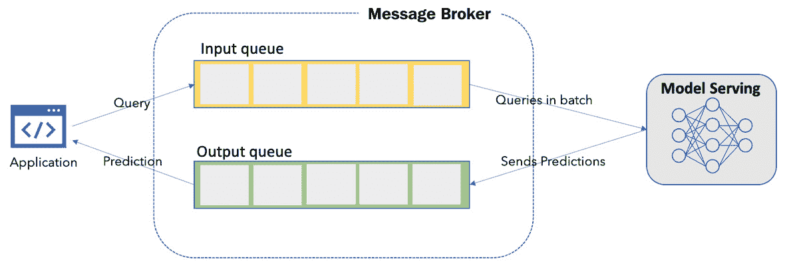

# 第十二章：模型服务和监控

在本章中，我们将反思在生产环境中服务和监控机器学习（ML）模型的需求，并探讨为模型用户或消费者提供不同服务 ML 模型的方法。然后，我们将重新审视第十一章中讨论的**可解释监控框架**，即*监控您的 ML 系统的主要原则*，并将其应用于我们使用 MLOps 预测天气的业务用例中。可解释监控框架的实施是实践性的。我们将推断部署的 API，并使用**漂移**（如数据漂移、特征漂移和模型漂移）来监控和分析推理数据，以衡量 ML 系统的性能。最后，我们将探讨一些概念，以管理 ML 系统，确保 ML 系统的稳健性能，以驱动持续学习和交付。

让我们从反思在生产环境中监控 ML 的需求开始。然后，我们将继续在本章中探讨以下主题：

+   在生产环境中服务、监控和维护模型

+   探索服务机器学习模型的不同模式

+   实施解释监控框架

+   管理您的 ML 系统

# 在生产环境中服务、监控和维护模型

部署一个模型或 ML 系统而不监控它是没有意义的。监控性能是 ML 系统最重要的方面之一。监控使我们能够以定性和定量的方式分析和绘制 ML 系统对利益相关者的业务影响。为了实现最大的业务影响，ML 系统的用户需要以最方便的方式提供服务。之后，他们可以消费 ML 系统并产生价值。在前几章中，我们开发和部署了一个 ML 模型来预测港口的天气条件，这是我们一直在解决的实际实施业务用例的一部分。在本章中，我们将重新审视我们在第十一章中讨论的**可解释监控框架**，即*监控您的 ML 系统的主要原则*，并将其应用于我们的业务用例中。在*图 12.1*中，我们可以看到**可解释监控**框架及其一些组件，如绿色高亮所示：


图 12.1 – 要实施的解释监控框架的组件

我们将为以下领域实现可解释监控：*数据完整性*、*模型漂移*、*应用性能*、*偏差和威胁检测*、*局部和全局解释*、*警报和操作*、*模型 QA 和控制*以及*模型审计和报告*。这些组件在我们使用案例中是最重要的，以理解可解释监控的实施。我们将省略*数据切片*，因为我们数据中的人口统计或样本（例如，性别、年龄组等）没有太多多样性。通过使用其他组件的信息，我们可以评估模型的表现及其公平性。在本章中，我们将实现**监控**和**分析**模块的组件：*数据完整性*、*模型漂移*、*应用性能*、*偏差和威胁检测*以及*局部和全局解释*。其余组件的实现将在*第十三章*中介绍，*持续学习的 ML 系统治理*。在我们继续到实现过程之前，让我们看看模型如何为用户消费提供服务。

# 探索 ML 模型的不同服务模式

在本节中，我们将考虑如何为用户（无论是人类还是机器）提供模型以高效地消费 ML 服务。模型服务是一个关键领域，ML 系统需要成功实现以发挥其商业影响，因为在这个领域的任何延迟或错误都可能对服务用户造成高昂的成本。鲁棒性、可用性和便利性是在提供服务模型时需要考虑的关键因素。让我们看看 ML 模型可以以哪些方式提供服务：这可以是批量服务或按需模式（例如，当需要查询以获取预测时）。在按需模式下，模型可以服务于机器或人类用户。以下是将模型提供给用户的示例：


图 12.2 – 向用户提供服务模型

在典型场景（按需模式）中，模型作为服务提供给用户消费，如图*图 12.2*所示。然后，机器上的外部应用程序或人类使用他们的数据向预测或机器学习服务发出查询。机器学习服务在收到请求后，使用负载均衡器将请求路由到机器学习应用程序内的可用资源（如容器或应用程序）。负载均衡器还管理机器学习服务内的资源，以按需编排和生成新的容器或资源。负载均衡器将查询从用户重定向到机器学习应用程序内运行的容器中的模型以获取预测。获取预测后，负载均衡器将返回到机器上的外部应用程序，或请求查询的人类，或模型预测内的查询。这样，机器学习服务能够为其用户提供服务。机器学习系统与模型存储或注册表协同工作，以保持其与最新或性能最佳的模型同步，以便以最佳方式为用户提供服务。与用户进行查询的典型场景相比，还有另一种用例，即模型作为批量服务提供。

## 将模型作为批量服务提供

批量处理或服务应用于大量或批次的输入数据（即不是单个观察值，而是成组的观察值）。在存在大量数据需要推断的情况下，模型通常以批量模式提供服务。一个例子是当模型一次性处理产品或服务的所有消费者或用户的数据。或者，工厂在固定时间线上的数据批次可能需要被处理以检测机器中的异常。与按需模式相比，批量模式更节省资源，通常在可以承受一定延迟的情况下使用：


图 12.3 – 批量推断

批量处理的一个关键优势是，与基于 REST API 的服务不同，批量服务可能需要更轻量或更少的基础设施。对于数据科学家来说，编写批量作业比部署在线 REST 服务更容易。这是因为数据科学家只需要在机器上训练一个模型或反序列化一个训练好的模型，并对一批数据进行批量推理。批量推理的结果可以存储在数据库中，而不是发送响应给用户或消费者。然而，一个主要的缺点是高延迟且不是实时。通常，批量服务可以一次处理数百或数千个特征。可以使用一系列测试来确定最佳批量大小，以达到可接受的延迟。典型的批量大小可以是 32、64、128 或 2 的 518 次方。批量推理可以定期安排，并可以服务于许多延迟不是问题的用例。以下将讨论一个这样的例子。

一个现实世界的例子

一个现实世界的例子是银行从一批文本文档中提取信息。银行每天从其合作伙伴机构接收数千份文件。人类代理不可能阅读所有这些文件并突出显示文档中列出的操作中的任何红旗。批量推理用于一次性从银行接收的所有文档中提取命名实体和红旗。然后，批量推理或服务的成果存储在数据库中。

## 将模型提供给人类用户

在处理来自人类用户的请求之前，检查用户是否有足够的权限使用模型至关重要。此外，在大多数情况下，了解请求的上下文也很有帮助。收集请求的上下文将使模型能够产生更好的预测。收集上下文后，我们可以将其转换为模型可读的输入，并推断模型以获得预测。

在实践中，以下是向人类用户提供按需模型的关键步骤：

1.  验证或授权请求。

1.  分析和收集上下文信息（例如，历史数据、用户体验数据或任何其他用户个人数据）。

1.  将任何上下文信息转换为模型可读的输入或模式。

1.  使用输入数据（包括请求和上下文信息）推断模型以做出预测或获取输出。

1.  根据上下文解释输出结果。

1.  将输出传递给用户。

    一个现实世界的例子

    考虑一个聊天机器人服务于人类客户预订机票。它执行上下文推理以服务于人类用户。

## 将模型提供给机器

我们可以根据用例使用`REST` API 或基于流的服务的机器或外部应用程序。通常，机器推理数据需求要么是预先确定的，要么在标准模式内。一个定义良好的拓扑和数据模式，无论是 REST API 还是流式服务，都将有效。对机器或人类的需求式服务因情况而异，因为在某些场景中，需求可能会变化（例如，在一天中的特定时间，用户服务的需求可能很高，如下午）。为了处理服务的高需求，自动扩展（在云上）可以帮助按需生成更多资源，并杀死任何空闲资源以释放更多资源。然而，自动扩展不是缩放的万能解决方案，因为它不能单独处理需求上的突然或特殊峰值：



图 12.4 – 需求式服务的消息代理

如*图 12.4*所示的方法在处理高量需求峰值时资源效率高。为了处理突然的峰值，可以使用如 Apache Kafka 或 Spark 这样的消息代理。消息代理运行进程以向队列写入和从队列读取：一个进程用于在队列中写入消息，另一个进程用于从该队列读取。服务模型定期连接到消息代理以处理队列中的输入数据批次，并对批次中的每个元素进行预测。在处理输入数据批次并生成预测后，预测被写入输出队列，然后根据用户请求推送给用户。

一个现实世界的例子

考虑一个拥有数百万用户的社交媒体公司。该公司使用单个或公共机器学习模型作为推荐系统，向用户推荐新闻文章或帖子。由于请求量很大，为了服务众多用户，它不能依赖于基于 REST API 的机器学习系统（因为它同步）。流式解决方案更好，因为它为公司提供异步推理，以便实时服务其用户。当用户登录到其机器上的应用程序或账户（例如社交媒体公司服务器上的应用程序）时，运行在其机器上的应用程序通过流式服务推断机器学习模型（即推荐系统），以提供用户新闻源的推荐。同样，成千上万的用户同时登录。流式服务可以无缝地服务所有这些用户。请注意，这不可能通过 REST API 服务实现。通过为推荐系统模型使用流式服务，社交媒体公司能够实时服务其大量用户，避免出现重大延迟。

# 实施可解释监控框架

要实现可解释监控框架，回顾一下到目前为止所讨论的内容，特别是关于实现假设用例的内容是值得的。以下是关于我们用例实现回顾，包括问题和解决方案：

+   **问题背景**：您在芬兰图尔库港的一家货运公司的小团队中担任数据科学家，与另外三名数据科学家一起工作。90% 的进入芬兰的商品通过货运在国家的各个港口抵达。对于货运来说，天气条件和物流有时可能具有挑战性。雨天可能会扭曲港口的运营和物流，从而影响供应链运营。提前预测雨天条件可以使我们优化人力资源、物流和运输资源，以实现港口供应链运营的高效。从业务角度来看，提前预测雨天条件可以使港口通过高效规划和调度人力资源、物流和运输资源，将运营成本降低约 20%。

+   **任务或解决方案**：作为数据科学家，您被要求开发一个机器学习驱动的解决方案，以提前 4 小时预测芬兰图尔库港的天气状况。这将使港口能够优化其资源，从而实现高达 20% 的成本节约。为了开始，您将获得一个包含 10 年时间线的图尔库港历史天气数据集（数据集可通过本书的 Git 仓库访问）。您的任务是构建一个持续学习驱动的机器学习解决方案，以优化图尔库港的运营。

到目前为止，我们已经开发了机器学习模型并将它们作为 REST API 端点部署在 Kubernetes 集群中，地址为 [`20.82.202.164:80/api/v1/service/weather-prod-service/score`](http://20.82.202.164:80/api/v1/service/weather-prod-service/score)（您的端点地址将不同）。

接下来，我们将为该端点复制一个真实的推断场景。为此，我们将使用我们在 *第四章* 的 *机器学习管道* 部分中分割并注册的测试数据集。前往您的 Azure ML 工作区，从 **数据集** 部分或与您的工作区连接的 Blob 存储下载 `test_data.csv` 数据集（该数据集已注册为 `test_dataset`），如图 12.5 所示：

![图 12.5 – 下载验证数据集（之前已分割并注册）

![img/image0051.jpg]

图 12.5 – 下载验证数据集（之前已分割并注册）

准备使用 REST API 端点或机器学习服务推断 `test_data.csv` 数据。前往 `12_Model_Serving_Monitoring` 文件夹，并将下载的数据集 (`test_data.csv`) 放入文件夹中。接下来，访问 `inference.` `py` 文件：

```py
import json
import requests
import pandas as pd
data = pd.read_csv('test_data.csv')
data = data.drop(columns=['Timestamp', 'Location', 'Future_weather_condition'])

url = 'http://20.82.202.164:80/api/v1/service/weather-prod-service/score'
headers = {'Content-Type':'application/json'}

for I in range(len(data)):
            inference_data = data.values[i].tolist()
            inference_data = json.dumps(""dat"": [inference_data]})
            r = requests.post(url, data=inference_data, headers=headers)
            print(str(i)+str(r.content))
```

在前面的代码中，我们执行以下步骤：

1.  在 `inference.py` 文件中，首先导入必要的库，例如 `json`、`requests` 和 `pandas`。

1.  接下来，导入用于与端点推断的 `test_data.csv` 数据集。

1.  删除推理中不必要的列，如 `Timestamp`、`Location` 和 `Future_weather_condition`（我们将通过查询端点来预测这个最终列）。

1.  下一步，指向端点的 URL（您可以通过导航到 **Azure ML 工作区** | **端点** | **Weather-prod-service** | **消费**）来。为了简单起见，因为我们没有为该服务设置身份验证或密钥，所以我们有 application/JSON 的标题，没有密钥或身份验证。

1.  最后，我们将通过端点推断数组中的每个元素来遍历数据数组。要运行脚本，只需将 `'url'` 替换为您的端点，然后在终端（从文件夹位置）运行以下命令以执行脚本：

    ```py
    >> python3 inference.py
    ```

运行脚本将花费大约 10-15 分钟来推断推理数据中的所有元素。之后，我们可以监控推理并分析推断数据的结果。让我们从数据完整性开始监控和分析。

## 监控您的机器学习系统

**监控**模块专门用于监控生产中的应用（即，提供机器学习模型）。动作监控模块具有以下三个功能：

+   数据完整性：

    - 注册目标数据集

    - 创建数据漂移监控器

    - 执行数据漂移分析

    - 执行特征漂移分析

+   模型漂移

+   应用性能

让我们更详细地查看这些功能。

### 数据完整性

要监控推理数据的数据完整性，我们需要监控数据漂移和特征漂移，以查看是否有任何异常变化或任何新的模式：

+   **数据漂移**：这是指独立变量的属性发生变化的情况。例如，由于季节性或新产品的添加、消费者需求或习惯的变化，数据可能会发生变化，就像在 COVID-19 大流行期间所发生的那样。

+   **特征漂移**：这是指特征（的）属性随时间变化的情况。例如，由于季节变化或季节性，温度在夏季比冬季或秋季的温度要暖和。

要监控漂移，我们将测量基线数据集与目标数据集之间的差异。第一步是定义基线数据集和目标数据集。这取决于用例；我们将使用以下数据集作为基线数据集和目标数据集：

+   **基线数据集**：这是训练数据集。

+   **目标数据集**：这是推理数据集。

我们将使用之前用于训练模型的训练数据集作为基线数据集。这是因为用于推理的模型非常了解训练数据集中的模式。训练数据集非常适合比较推理数据随时间的变化。我们将收集推理过程中收集的所有推理数据并将其编译到推理数据集中，并将这两个数据集（即基线数据集和目标数据集）进行比较，以评估目标数据集的数据和特征漂移。

### 注册目标数据集

训练数据集已在*第四章*的*机器学习管道*部分注册，在*数据摄取和特征工程*部分。我们需要在 Azure ML 工作区的**数据集**部分内注册推理数据集。

推理数据是使用 `azureml.monitoring` SDK（`modelDataCollector` 函数）收集的结果。通过在评分文件（在 `score.py` 中，正如我们在*第六章*的*部署您的 ML 系统的关键原则*中做的那样）中使用 `modelDataCollector` 函数启用监控功能，我们将推理数据以时间序列数据集的形式存储在 Blob 存储中。在连接到您的 Azure ML 工作区的 Blob 存储中，推理数据存储在 `modeldata` 容器中。在 `modeldata` 容器中，推理数据（包括输入和输出）以 CSV 文件的形式存储，这些文件被分在文件夹内。这些文件按照年份、月份和日期（在生产中记录推理数据时）进行结构化。在分区文件夹内，推理数据存储在名为 `inputs.csv` 和 `outputs.csv` 的 CSV 文件中。我们需要注册这些 `input.csv` 文件以监控数据漂移和特征漂移。按照以下步骤注册 `input.csv` 文件：

1.  前往**数据集**部分，点击**创建数据集**。然后，选择**从数据存储**选项，如图 12.6 所示：

    图 12.6 – 注册推理数据集

1.  为数据集命名（例如，`Inputs-Inference-Dataset`），选择数据集类型为**表格型**，并在**描述**字段中写入适当的描述，描述数据集的目的。点击**下一步**以指定数据存储选择。选择**modeldata**数据存储，如图 12.7 所示：

    图 12.7 – 数据存储选择（输入-推理数据注册）

1.  在选择 `input.csv` 文件后。您可以在您的 `support vectorclassifier 模型` 文件夹中找到它，该文件夹位于您的服务名称（例如，`prod-webservice`）文件夹内。然后，进入子文件夹（默认、inputs 以及按日期结构化的文件夹），并进入您当前日期的文件夹以找到 `input.csv` 文件。选择 `input.csv` 文件，如图 12.8 所示：

    图 12.8 – 选择 input.csv 文件的路径（输入-推理数据注册）

1.  在选择 `input.csv` 文件后，点击 `/**/inputs*.csv`（如图 12.9 所示）。这是一个重要的步骤，将动态引用 `inputs` 文件夹中的所有 `input.csv` 文件。如果不引用所有 `input.csv` 文件，我们将路径限制为仅一个 `input.csv` 文件（如图 12.8 所示之前已选择）。通过引用所有 `input.csv` 文件，我们将所有输入数据（`inputs.csv` 文件）编译到目标数据集中（例如，`Inputs-Inference-Data`）：

    图 12.9 – 引用路径以动态访问所有 input.csv 文件

1.  点击**下一步**按钮进入**设置和预览**：![图 12.10 – 设置和预览（推理数据集注册）]

    

    图 12.10 – 设置和预览（推理数据集注册）

    如图 12.10 所示，我们可以配置设置并预览数据集。通过选择 **列标题** 下拉菜单并选择 **从所有文件合并标题** 来指向正确的列名。检查正确的列名（例如，**Temperature_C** 和 **Humidity**）。在选择了适当的列名后，点击 **下一步** 按钮进入下一个窗口。通过选择您想要监控的所有列及其数据类型，选择正确的模式，如图 12.11 所示：

    ![图 12.11 – 模式选择（推理数据集注册）]

    

    图 12.11 – 模式选择（推理数据集注册）

    确保你在 **$aml_dc_scoring_timestamp** 列中选择 **时间戳** 和 **日期** 属性，因为这些属性包含推理的时间戳。这一步很重要。只有时间序列格式的数据集才能用于计算漂移（通过 Azure 漂移模型）；否则，我们无法计算漂移。通过选择所有列来选择正确的模式后，点击 **下一步** 以确认所有必要的详细信息（例如数据集名称、数据集版本、其路径等）。

1.  点击**创建**按钮以创建数据集。当您的数据集创建成功后，您可以从 Azure ML 工作区的**数据集**部分查看数据集。转到**数据集**部分以确认您的数据集已创建。识别并点击您创建的数据集。点击后，您将能够查看您已注册的推理数据集的详细信息，如图*图 12.12*所示：


图 12.12 – 查看已注册的推理数据集

您可以在*图 12.12*中看到您已注册数据集的所有基本属性。需要注意的是，相对路径是动态的，它指向引用所有的`input.csv`文件。所有输入文件的引用结果将显示在`input.csv`文件中，随着在 Blob 存储的数据存储中每天创建新的`input.csv`文件，这些文件的数量将持续增加。恭喜您注册了推理数据。接下来，我们将配置数据漂移监控器。

### 创建数据漂移监控器

为了监控数据漂移和特征漂移，我们将使用 Azure ML 工作区内置的漂移监控功能，作为我们 Azure ML 工作区上的`Data Drift Monitor`功能的一部分：

1.  前往您的 workspace 并访问**数据集**部分。然后，选择**数据集监控器**（目前处于预览模式，因为此功能仍在测试中）。点击**创建**，如图*图 12.13*所示：

    图 12.13 – 创建数据漂移监控器

1.  在选择**创建**按钮后，系统将提示您创建一个新的数据漂移监控器。选择您所需的靶数据集。

1.  在*注册靶数据集*部分，我们将`inputs.csv`文件注册为`Input-InferenceData`。选择您的推理数据集作为靶数据集，如图*图 12.14*所示：

    图 12.14 – 选择靶数据集

1.  在选择您的靶数据集后，系统将提示您指向您的基线数据集，这应该是您的训练数据集（它被用来训练您的已部署 ML 模型）。选择您的基线数据集，如图*图 12.15*所示：

    图 12.15 – 选择基线数据集和配置监控设置

1.  在选择基线数据集后，系统将提示您设置监控设置，例如数据漂移监控器的名称（例如，`weather-Data-Drift`）、运行数据漂移作业的计算目标、数据漂移作业的频率（例如，每天一次）以及监控漂移的阈值（例如，60）。您还将被要求提供一个电子邮件地址，以便在数据漂移超过设定的阈值时接收通知。

1.  在配置设置后，创建一个数据漂移监控器。转到您新创建的数据漂移（在**数据集**部分，点击**数据集监控器**以查看您的漂移监控器），如图*图 12.16*所示：![Figure 12.16 – 数据漂移概述（目前为空）

    ![img/image016.jpg]

    图 12.16 – 数据漂移概述（目前为空）

    当您访问您的数据漂移监控器时，您会看到没有数据。这是因为我们还没有计算任何漂移。为了计算漂移，我们需要一个计算资源。

1.  转到**计算**部分，访问**计算集群**选项卡，创建一个新的计算资源（例如，**drift-compute – Standard_DS_V2 machine**），如图*图 12.17*所示：![Figure 12.17 – Creating a compute cluster to compute data drift

    ![img/image0171.jpg]

    图 12.17 – 创建计算集群以计算数据漂移

1.  在创建计算集群后，返回您的数据漂移监控器（例如，**Weather-Data-Drift**）。接下来，我们将计算数据漂移。

1.  点击**分析现有数据**并提交一个运行以分析任何现有推断数据，如图*图 12.18*所示：![Figure 12.18 – Submitting run to analyze any data drift

    ![img/image018.jpg]

    图 12.18 – 提交运行以分析任何数据漂移

1.  选择开始和结束日期以及计算目标（即之前创建的，即**drift-compute**）。然后，点击**提交**以运行漂移计算。通常需要大约 10 分钟来分析和计算数据漂移。您可以在 Azure ML 工作区的**实验**部分跟踪您运行的进度。

    **数据漂移分析**：在成功完成运行后，数据漂移已经被计算。使用如图*图 12.19*所示的漂移概述，我们可以监控和分析您的 ML 模型在生产中的性能。我们可以通过特征查看数据漂移幅度和漂移分布：

![Figure 12.19 – Data Drift magnitude trend

![img/image019.jpg]

图 12.19 – 数据漂移幅度趋势

Azure ML 服务测量模型漂移的方式是使用一个独立的漂移模型（由 Azure 维护），该模型查看基线并比较推断数据。这种比较结果是一个简单的百分比或数据变化的程度。

在*图 12.19*中，**漂移幅度趋势**表明我们对模型进行了 3 天的推断（即**03/23/21**，**04/03/21**，和**04/04/21**）。

分析显示，这三次的数据漂移低于 70%的阈值（这是红线，表示阈值）。**03/23/21**的数据漂移大约为 50%；**04/03/21**大约为 44%；**04/04/21**为 40%。这给我们提供了一个关于模型接收到的推断数据变化趋势的线索。同样，我们可以监控特征漂移。

+   **特征漂移分析**：你可以通过滚动到**特征详情**部分并选择一个你喜欢的特征来评估单个特征及其漂移。例如，我们可以看到**Temperature_C**随时间分布的特征，如图*图 12.20*所示：


图 12.20 – 特征漂移趋势（Temperature_C）

为了监控特征随时间的变化，我们可以选择一些我们喜欢的特征指标。例如，**平均值**、**最小值**、**最大值**、**欧几里得距离**或**Wasserstein 距离**，这些指标可用于分析特征漂移。选择一个你喜欢的指标（例如，**平均值**）。我们选择了**平均值**指标来评估温度漂移，如图*图 12.20*所示。**平均值**指标从 14 变为 8，随着时间的推移发生了变化；这显示了**Temperature_C**特征漂移的变化。这种变化是预期的，因为季节性变化会导致温度的变化。我们还可以监控特征分布的变化，如图*图 12.21*所示：


图 12.21 – 特征分布趋势

如果漂移剧烈或异常，我们需要检查被推断到系统中的输入数据的质量。对特征漂移的了解使我们能够理解周围不断变化的数据和世界。同样，我们可以监控模型漂移，以了解模型性能随数据和世界的变化。

### 模型漂移

监控模型漂移使我们能够监控我们的模型在生产中的性能。模型漂移是依赖变量属性发生变化的地方。例如，在我们的案例中，这是天气（即下雨或不下雨）的分类结果。正如我们在*创建数据漂移监控器*部分设置数据漂移一样，我们也可以设置模型漂移监控器来监控模型输出。以下是设置模型漂移的高级步骤：

1.  注册一个新的数据集（例如，`Outputs.csv`文件。**输出**数据集可以从**数据集**部分创建。在创建输出推理数据集时，选择重要的列（例如，**未来天气条件**）并将数据集转换为表格和时间序列格式（漂移只能在时间序列数据中计算）通过选择带有**时间戳**的列。

1.  从**数据集**部分创建一个新的监控器（例如，模型漂移监控器），然后点击**数据集监控器**。选择要监控的特征（例如，**未来天气条件**）并设置你想要监控的阈值。

1.  在概述中分析模型漂移（如图*图 12.22*所示）：


图 12.22 – 提交运行以分析数据漂移

如果您的模型漂移超过了设定的阈值，那么这可能是一个迹象，表明您应该重新训练或训练模型比较结果，这可以简单地表示为数据变化的百分比或程度。当数据漂移超过阈值（例如，70%）时，我们可以通过电子邮件通知管理员或产品所有者，或者采取部署另一个模型或重新训练现有模型等行动。使用智能操作，我们可以管理机器学习系统以产生最大价值。我们将在下一章中探讨管理机器学习系统的方法（*第十三章*，*持续学习的机器学习系统管理*）。到目前为止，我们已经实现了数据漂移、特征漂移和模型漂移的设置。接下来，让我们监控机器学习系统的应用程序性能。

### 应用性能

您已将机器学习服务以 REST API 端点形式部署，用户可以消费这些端点。我们可以使用 Azure Application Insights（由 Azure Monitor 启用）来监控这些端点。为了监控应用程序性能，访问应用洞察仪表板，如图 *图 12.23* 所示。转到您的 Azure ML 服务工作区中的 **端点** 部分，并选择您的机器学习模型部署在其上的 REST API 端点。点击 **Application Insights url** 以访问与您的 REST API 端点连接的应用洞察端点：


图 12.23 – 应用洞察概览

从 **应用洞察概览** 部分中，我们可以监控和分析您的机器学习服务的关键应用性能信息。此外，我们还可以从 **概览** 部分监控失败请求、服务器响应时间、服务器请求和可用性等信息，如图 *图 12.24* 所示：


图 12.24 – 应用洞察概览

基于这些指标和这些信息，我们可以监控应用性能。理想情况下，我们不应该有任何失败请求或长的服务器响应时间。为了更深入地了解应用性能，我们可以访问应用仪表板（通过点击屏幕顶部的按钮），如图 *图 12.25* 所示：


图 12.25 – 具有更详细性能评估的应用仪表板

从应用程序仪表板中，我们可以更详细地监控应用程序的性能。例如，我们可以监控应用程序的使用情况、可靠性和其他信息。在用途方面，**唯一会话和用户**是监控应用程序能够服务的唯一用户数量的关键信息。此外，**平均可用性**信息有助于评估服务对我们用户的可用性。有了这些信息，如果需要更多资源来服务用户，我们可以做出扩展决策。

我们可以通过评估诸如失败请求的数量、服务器异常和依赖性故障等信息来监控应用程序的可靠性。我们可以使用诸如平均服务器响应时间和 CPU 利用率等信息来监控响应性。理想情况下，应用程序不应有任何故障，如果有任何故障，我们可以通过访问**事务搜索**或日志，如图*12.26*所示，进行更深入的检查：

![Figure 12.26 – Accessing the logs to understand any errors or failures

![img/image026.jpg]

图 12.26 – 访问日志以了解任何错误或故障

我们可以更仔细地查看应用程序的日志，以了解任何故障或错误，以便调试应用程序并维护应用程序的健康运行。一个功能性的机器学习应用程序会导致用户满意和最大的商业影响。因此，监控应用程序可以揭示潜在的故障并维护应用程序，以便以最有效的方式为用户提供服务。

## 分析您的机器学习系统

在生产环境中实时监控和分析您的机器学习系统对于理解机器学习系统的性能和确保其稳健性以产生最大化的商业价值至关重要。人类在分析模型性能和检测细微异常和威胁中扮演着关键角色。我们可以通过应用高级技术，如数据切片、对抗攻击预防技术，或通过理解局部和全局解释来分析模型性能，以检测任何偏差或威胁，并理解模型为何以某种模式做出决策。

### 数据切片

对于我们的用例，我们将省略数据切片，因为我们没有太多关于人口统计学或数据样本（例如，性别、年龄组等）的多样性。为了衡量模型的公平性，我们将专注于偏差检测。

### 偏差和威胁检测

为了确定生产中的模型偏差，我们可以使用偏差-方差权衡方法。这使得监控和分析模型偏差或任何可能的威胁变得简单。不言而喻，可能存在更好的方法来监控偏差，但这里的想法是保持简单，因为有时简单更好、更高效。

我们模型平均预测值与我们试图预测的正确值之间的差异是偏差。方差是模型对给定数据点或值的估计的变异性，它告诉我们我们的数据分布。分析部署模型的推理数据的偏差和方差揭示了偏差为 20.1，方差为 1.23（你可以在[`machinelearningmastery.com/calculate-the-bias-variance-trade-off/`](https://machinelearningmastery.com/calculate-the-bias-variance-trade-off/)上了解更多关于偏差和方差分析的内容）。这意味着我们的模型具有高偏差和低方差；因此，使用推理数据训练或重新训练我们的模型以平衡偏差-方差可能是一个好主意。

### 本地解释和全局解释

本地解释和全局解释提供了对模型性能的不同视角。本地解释为特定或单个输入的模型预测提供了合理性，而全局解释则提供了对模型预测过程的洞察，不受任何特定输入的影响。我们在探索*图 12.19*中的监控漂移时，之前已经研究了全局解释。我们可以进一步调查特征分布，如图*图 12.21*所示，以详细了解本地解释。

分析你的 ML 系统以公平性、偏差以及本地和全局解释，为我们提供了对模型性能的关键洞察，我们可以利用这些信息来治理我们的 ML 系统。

# 管理你的 ML 系统

系统治理的大部分工作涉及质量保证和控制、模型审计以及报告，以确保端到端的可追踪性和符合法规。ML 系统的有效性（即其产生预期或意图结果的能力）取决于其治理方式，以实现最大商业价值。到目前为止，我们已经监控并分析了我们的部署模型用于推理数据：


图 12.27 – 管理你的 ML 系统的组件

ML 系统的有效性可以通过基于监控和警报采取的智能行动来确定。在下一章中，我们将探讨 ML 系统治理，包括警报和行动、模型 QA 和控制以及模型审计和报告。

# 摘要

在本章中，我们学习了向用户提供服务 ML 模型以及监控它们以实现最大商业价值的关键原则。我们探讨了为模型用户或消费者提供 ML 模型的不同方式，并为一个假设的商业用例实现了可解释监控框架并部署了一个模型。我们进行了可解释监控框架的动手实现，以衡量 ML 系统的性能。最后，我们讨论了治理 ML 系统的必要性，以确保 ML 系统的稳健性能。

我们将在下一章和最后一章进一步探讨 ML 系统的治理和持续学习概念！
