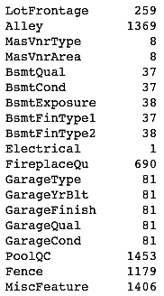
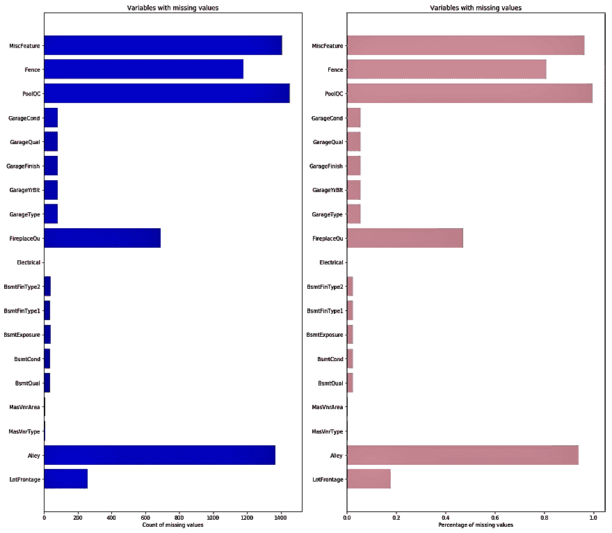
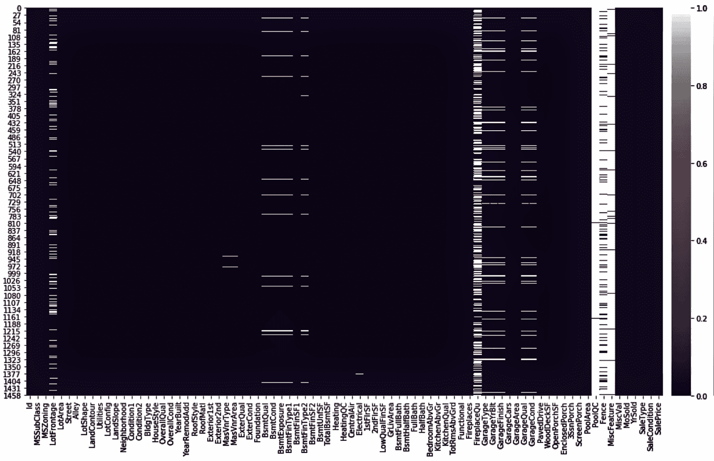
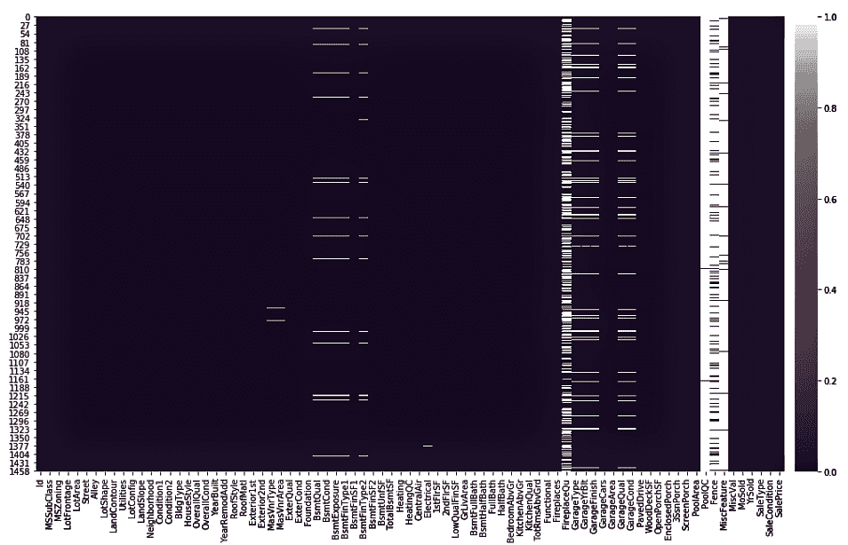
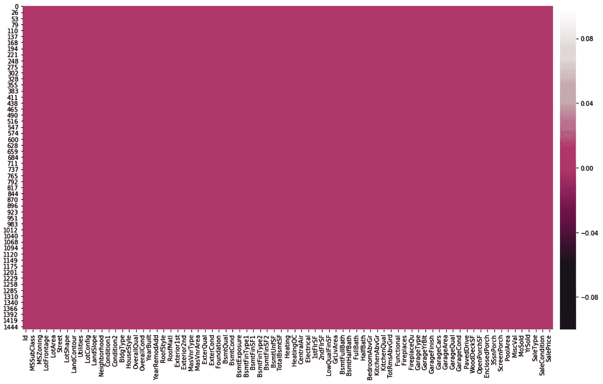
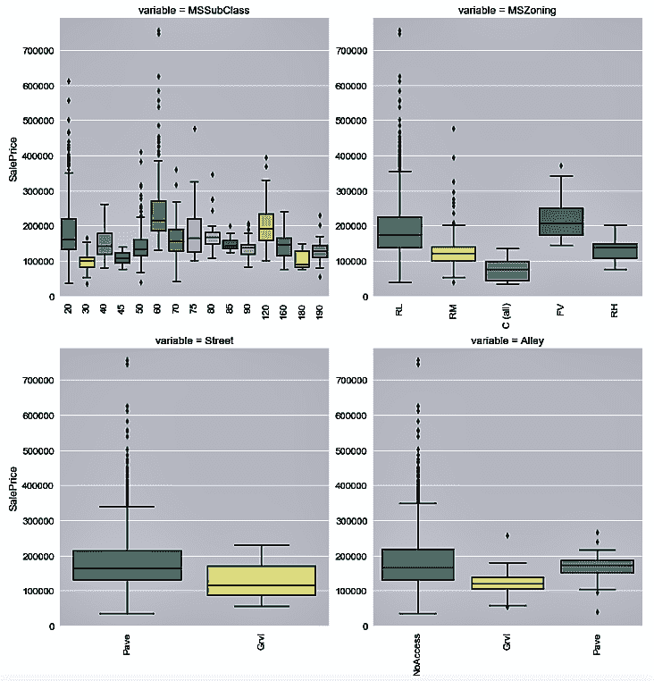
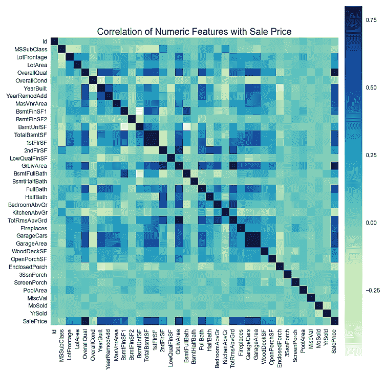
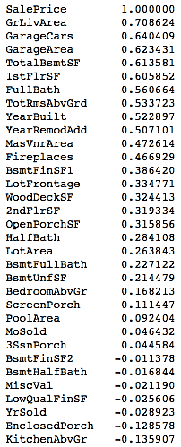
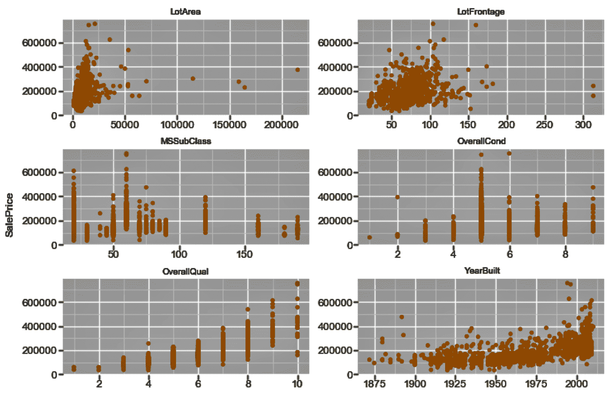

# 贴近您的数据

在本章中，我们将介绍以下食谱：

+   使用 Python 进行数据处理

+   分析、可视化和处理缺失值

+   探索性数据分析

# 简介

在这本书中，我们将介绍各种集成技术，并学习如何集成多个机器学习算法以增强模型性能。我们将使用 pandas、NumPy、scikit-learn 和 Matplotlib，这些都是为与 Python 一起使用而构建的，正如我们将在整本书中做的那样。到目前为止，你应该已经非常熟悉数据处理和探索。

在本章中，我们将回顾如何在 Python 中读取和处理数据，如何分析和处理缺失值，以及如何探索数据以获得更深入的见解。我们将使用各种 Python 包，如`numpy`和`pandas`，用于数据操作和探索，以及`seaborn`包用于数据可视化。我们将在本书的后续章节中也继续使用这些库中的某些或全部库。我们还将使用 Anaconda 发行版进行我们的 Python 编码。如果您尚未安装 Anaconda，您需要从[`www.anaconda.com/download`](https://www.anaconda.com/download/#macos)下载它。在撰写本书时，Anaconda 的最新版本是 5.2，它包含 Python 3.6 和 Python 2.7。我们建议您下载 Python 3.6 的 Anaconda。我们还将使用可在 GitHub 上找到的`HousePrices`数据集。

# 使用 Python 进行数据处理

在现实生活中，往往很难获得一个完整且干净的数据集，其格式正好符合我们的需求。我们接收到的数据通常不能直接用于统计或机器学习算法。我们需要处理原始数据，以便处理后的数据可以用于进一步分析和建模。首先，我们需要导入所需的包，例如`pandas`，并将我们的数据集读入 Python。

# 准备工作

我们将使用操作系统的依赖功能中的`os`包，以及用于数据处理的`pandas`包。

现在，让我们查看数据定义以了解我们的变量。在下面的代码中，我们列出了一些变量的数据定义。数据集和完整的数据定义可在 GitHub 上找到。以下是数据描述文件的简略版本：

```py
MS SubClass (Nominal): Identifies the type of dwelling involved in the sale
Lot Frontage (Continuous): Linear feet of street connected to property
Alley (Nominal): Type of alley access to property
Overall Qual (Ordinal): Rates the overall material and finish of the house
Overall Cond (Ordinal): Rates the overall condition of the house
Year Built (Discrete): Original construction date
Mas Vnr Type (Nominal): Masonry veneer type
Mas Vnr Area (Continuous): Masonry veneer area in square feet
Garage Type (Nominal): Garage location
Garage Yr Blt (Discrete): Year garage was built
Garage Finish (Ordinal): Interior finish of the garage
Garage Cars (Discrete): Size of garage in car capacity
Garage Area (Continuous): Size of garage in square feet
Garage Qual (Ordinal): Garage quality
Garage Cond (Ordinal): Garage condition
...
...
SalePrice (Continuous): Sale price $$
```

然后，我们将导入`os`和`pandas`包，并根据我们的要求设置我们的工作目录，如下面的代码块所示：

```py
import os
import pandas as pd

# Set working directory as per your need
os.chdir(".../.../Chapter 1")
os.getcwd()
```

下一步是从 GitHub 下载数据集并将其复制到您的当前工作目录。

# 如何操作...

现在，让我们执行一些数据处理步骤：

1.  首先，我们将从当前工作目录读取`HousePrices.csv`数据，并创建我们的第一个用于操作的数据框。我们将其命名为`housepricesdata`，如下所示：

```py
housepricesdata = pd.read_csv("HousePrices.csv")
```

1.  现在让我们看一下我们的数据框，看看它的样子：

```py
# See first five observations from top
housepricesdata.head(5)
```

您可能看不到所有行；Jupyter 将截断一些变量。为了在 Jupyter 中查看任何输出的所有行和列，请执行以下命令：

`# 设置选项以显示所有行和列`

`pd.options.display.max_rows = None`

`pd.options.display.max_columns = None`

1.  我们可以用`shape`查看 DataFrame 的维度。`shape`是`pandas` DataFrame 的一个属性：

```py
housepricesdata.shape
```

使用前面的命令，我们可以看到行数和列数，如下所示：

```py
(1460, 81)
```

在这里，我们可以看到 DataFrame 有`1460`个观测值和`81`个列。

1.  让我们看看 DataFrame 中变量的数据类型：

```py
housepricesdata.dtypes
```

在下面的代码块中，我们可以看到 DataFrame 中每个变量的数据类型：

```py
Id                 int64
MSSubClass         int64
MSZoning          object
LotFrontage      float64
LotArea            int64
LotConfig         object
LandSlope         object
                  ...   
BedroomAbvGr       int64
KitchenAbvGr       int64
KitchenQual       object
TotRmsAbvGrd       int64
SaleCondition     object
SalePrice          int64
Length: 81, dtype: object
```

我们现在已准备好开始数据操作，我们可以以许多不同的方式来完成。在本节中，我们将探讨几种我们可以用来操纵和准备数据以便分析的方法。

让我们先总结一下我们的数据。

1.  `describe()`函数将只显示数值变量的统计信息：

```py
housepricesdata.describe()
```

我们可以在下面的屏幕截图中看到输出：


1.  我们将删除`id`列，因为这对于我们的分析将不是必需的：

```py
# inplace=True will overwrite the DataFrame after dropping Id column
housepricesdata.drop(['Id'], axis=1, inplace=True)
```

1.  现在，让我们看看一些对象类型变量（即分类变量）的分布。在下面的示例中，我们将查看`LotShape`和`LandContour`。我们可以以相同的方式研究数据集中的其他分类变量，如下面的代码块所示：

```py
# Name the count column as "count"
lotshape_frequencies = pd.crosstab(index=housepricesdata["LotShape"], columns="count") 

landcountour_frequencies = pd.crosstab(index=housepricesdata["LandContour"], columns="count") # Name the count column as "count"

print(lotshape_frequencies)
print("\n") # to keep a blank line for display
print(landcountour_frequencies)
```

1.  现在我们将看到如何在不同数据类型之间进行转换。我们注意到变量如`MSSubClass`、`OverallQual`和`OverallCond`的数据定义都是分类变量。然而，在导入数据集之后，它们却显示为整数。

在对任何变量进行类型转换之前，请确保没有缺失值。

在这里，我们将变量转换为分类数据类型：

```py
# Using astype() to cast a pandas object to a specified datatype
housepricesdata['MSSubClass'] = housepricesdata['MSSubClass'].astype('object')
housepricesdata['OverallQual'] = housepricesdata['OverallQual'].astype('object')
housepricesdata['OverallCond'] = housepricesdata['OverallCond'].astype('object')

# Check the datatype of MSSubClass after type conversion
print(housepricesdata['MSSubClass'].dtype)
print('\n') # to keep a blank line for display

# Check the distribution of the levels in MSSubClass after conversion
# Make a crosstab with pd.crosstab()
# Name the count column as "count"
print(pd.crosstab(index=housepricesdata["MSSubClass"], columns="count")) 
```

我们可以看到每种房屋类别的观测值数量，如下面的代码块所示：

```py
category

col_0       count
MSSubClass       
20            536
30             69
40              4
45             12
50            144
60            299
70             60
75             16
80             58
85             20
90             52
120            87
160            63
180            10
190            30
```

有许多变量单独可能并不很有用，但转换它们会给我们带来很多有趣的见解。让我们创建一些新的、有意义的变量。

1.  `YearBuilt`和`YearRemodAdd`分别代表原始建筑日期和翻修日期。然而，如果它们可以被转换为年龄，这些变量将告诉我们建筑物的年龄以及它们翻修以来的年数。为此，我们创建了两个新的变量，`BuildingAge`和`RemodelAge`：

```py
# Importing datetime package for date time operations
import datetime as dt

# using date time package to find the current year
current_year = int(dt.datetime.now().year)

# Subtracting the YearBuilt from current_year to find out the age of the building
building_age = current_year - housepricesdata['YearBuilt']

# Subtracting the YearRemonAdd from current_year to find out the age since the
# building was remodelled
remodelled_age = current_year - housepricesdata['YearRemodAdd']
```

1.  现在，让我们将这两个变量添加到我们的数据集中：

```py
# Adding the two variables to the DataFrame
housepricesdata['building_age'] = building_age
housepricesdata['remodelled_age'] = remodelled_age

# Checking our DataFrame to see if the two variables got added
housepricesdata.head(5)
```

我们注意到`building_age`和`remodelled_age`现在已添加到 DataFrame 中，如下面的屏幕截图所示：


包含标签数据的变量需要转换为数值形式，以便机器学习算法可以使用。为了解决这个问题，我们将执行编码，将标签转换为数值形式，以便算法可以使用它们。

1.  我们需要识别需要编码的变量，包括`Street`、`LotShape`和`LandContour`。我们将执行独热编码，这是一种将分类变量表示为二进制向量的方法。我们将使用 Python 中的`pandas`包来完成此操作：

```py
# We use get_dummies() function to one-hot encode LotShape
one_hot_encoded_variables = pd.get_dummies(housepricesdata['LotShape'],prefix='LotShape')

# Print the one-hot encoded variables to see how they look like
print(one_hot_encoded_variables)
```

我们可以在以下屏幕截图中看到已创建的独热编码变量：


1.  将独热编码变量添加到我们的 DataFrame 中，如下所示：

```py
# Adding the new created one-hot encoded variables to our DataFrame
housepricesdata = pd.concat([housepricesdata,one_hot_encoded_variables],axis=1)

# Let's take a look at the added one-hot encoded variables
# Scroll right to view the added variables
housepricesdata.head(5)
```

我们可以在以下屏幕截图中看到将独热编码变量添加到 DataFrame 后的输出：


1.  现在，让我们删除原始变量，因为我们已经创建了我们的独热编码变量：

```py
# Dropping the original variable after one-hot encoding the original variable
# inplace = True option will overwrite the DataFrame

housepricesdata.drop(['LotShape'],axis=1, inplace=True)
```

# 它是如何工作的...

`pandas`模块是 Python 标准库的一部分——它是数据操作的关键模块之一。我们还使用了其他包，如`os`和`datetime`。在设置我们的工作目录并将 CSV 文件作为`pandas` DataFrame 读取到 Python 中之后，我们继续查看一些数据操作方法。

前一节中的*步骤 1*至*步骤 5*展示了如何使用`pandas`在 Python 中读取 CSV 文件中的数据，以及如何使用`dtypes`等函数。

`pandas`包还提供了从各种文件类型读取数据的方法。例如，`pandas.read_excel()`将 Excel 表读取到`pandas` DataFrame 中；`pandas.read_json()`将 JSON 字符串转换为`pandas`对象；`pandas.read_parquet()`从文件路径加载 parquet 对象并返回`pandas` DataFrame。更多信息可以在[`bit.ly/2yBqtvd`](https://bit.ly/2yBqtvd)找到。

您也可以使用 Python 中的`h5py`包读取 HDF5 格式文件。`h5py`包是 Python 对 HDF5 二进制数据格式的接口。HDF®支持多维数据集，数据集中的每个元素本身也可以是一个复杂对象。集合中数据对象的数量或大小没有限制。更多信息可以在[`www.hdfgroup.org/`](https://www.hdfgroup.org/)找到。一个示例代码块如下所示：

```py
import h5py

# With 'r' passed as a parameter to the h5py.File() 
# the file will be read in read-only mode
data = h5py.File('File Name.h5', 'r')
```

我们查看变量的数据类型，并使用`describe()`来查看数值变量的摘要统计信息。需要注意的是，`describe()`仅适用于数值变量，并且足够智能，可以忽略非数值变量。在*步骤 6*中，我们看到了如何查看分类变量（如`LotShape`和`LandContour`）每个级别的计数。我们可以使用相同的代码来查看其他分类变量的分布。

在*步骤 7*中，我们使用`pd.crosstab()`查看`LotShape`和`LandContour`变量的分布。

在交叉表中，一个常见的需求是包括行和列的小计。我们可以使用`margins`关键字显示小计。我们将`margins=True`传递给`pd.crosstab()`函数。我们还可以使用`margins_name`关键字给小计列命名。`margins_name`的默认值是`All`。

然后，我们继续学习如何转换数据类型。我们有一些实际上是分类变量，但在数据集中看起来是数值型的变量。这在现实生活中很常见，因此我们需要学习如何类型转换我们的变量。*步骤 8*展示了如何将数值变量，如`MSSubClass`，转换为分类类型。在*步骤 8*中，我们将一些变量转换为分类数据类型。然后我们创建了一个交叉表来可视化分类变量的每个级别的频率。

在*步骤 9*中，我们从现有变量中创建了新的有意义的变量。我们分别从`YearBuilt`和`YearRemodAdd`创建了新的变量`BuildingAge`和`RemodelAge`，以表示建筑物的年龄和自建筑物翻新以来经过的年数。这种方法创建新变量可以为我们分析和建模提供更好的洞察力。创建新特征的过程称为**特征工程**。在*步骤 10*中，我们将新变量添加到我们的 DataFrame 中。

从那里，我们继续学习如何对分类变量进行编码。我们需要对分类变量进行编码，因为它们有命名描述。许多机器学习算法不能在标记数据上操作，因为它们需要所有输入和输出变量都是数值型的。在*步骤 12*中，我们使用独热编码对它们进行了编码。在*步骤 11*中，我们学习了如何使用`get_dummies()`函数，它是`pandas`包的一部分，来创建独热编码变量。在*步骤 12*中，我们将`one-hot_encoded_variables`添加到我们的 DataFrame 中。最后，在*步骤 13*中，我们移除了现在已独热编码的原始变量。

# 还有更多...

所需的数据操作类型取决于您的业务需求。在这个第一个菜谱中，我们看到了几种执行数据操作的方法，但您能做的事情以及如何为分析操作数据没有限制。

我们也看到了如何将数值变量转换为分类变量。我们可以以多种方式执行此类类型转换。例如，如果需要，我们可以使用以下代码将分类变量转换为数值变量：

```py
# Converting a categorical variable to numerical
# Using astype() to cast a pandas object to a specified datatype

# Here we typecast GarageYrBlt from float64 type to int64 type
housepricesdata['GarageYrBlt'] = housepricesdata['GarageYrBlt'].astype('int64')
```

只有当`GarageYrBlt`变量不包含任何缺失值时，才能转换该变量。前面的代码将引发错误，因为`GarageYrBlt`包含缺失值。

我们已经探讨了如何使用一热编码将分类变量转换为数值变量，以及为什么我们要这样做。除了 一热编码，我们还可以执行其他类型的编码，例如标签编码、频率编码等等。以下代码块提供了一个标签编码的示例代码：

```py
# We use sklearn.preprocessing and import LabelEncoder class
from sklearn.preprocessing import LabelEncoder

# Create instance of LabelEncoder class
lb_make = LabelEncoder()

# We create a new variable LotConfig_code to hold the new numerical labels
# We label encode LotConfig variable
housepricesdata["LotConfig_Code"] = lb_make.fit_transform(housepricesdata["LotConfig"])

# Display the LotConfig variable and its corresponding label encoded numerical values
housepricesdata[["LotConfig", "LotConfig_Code"]]
```

# 参考内容

+   pandas 类型转换函数指南([`bit.ly/2MzFwiG`](https://bit.ly/2MzFwiG))

+   使用 `get_dummies()` 进行一热编码的 pandas 指南([`bit.ly/2N1xjTZ`](https://bit.ly/2N1xjTZ))

+   [scikit-learn 的一热编码指南](https://bit.ly/2wrNNLz)

+   scikit-learn 标签编码指南([`bit.ly/2pDddVb`](https://bit.ly/2pDddVb))

# 分析、可视化和处理缺失值

缺失值是由不完整的数据引起的。有效地处理缺失值非常重要，因为它们可能导致不准确的推断和结论。在本节中，我们将探讨如何分析、可视化和处理缺失值。

# 如何做到这一点...

让我们从分析带有缺失值的变量开始。将 pandas 的选项设置为显示所有行和列，如前一小节所示：

1.  使用以下语法，我们可以看到哪些变量有缺失值：

```py
# Check which variables have missing values

columns_with_missing_values = housepricesdata.columns[housepricesdata.isnull().any()]
housepricesdata[columns_with_missing_values].isnull().sum()
```

这将产生以下输出：



1.  你可能还想以百分比的形式查看缺失值。要查看缺失值的计数和百分比，请执行以下命令：

```py
import numpy as np
import matplotlib.pyplot as plt
%matplotlib inline

# To hold variable names
labels = [] 

# To hold the count of missing values for each variable 
valuecount = [] 

# To hold the percentage of missing values for each variable
percentcount = [] 

for col in columns_with_missing_values:
    labels.append(col)
    valuecount.append(housepricesdata[col].isnull().sum())
    # housepricesdata.shape[0] will give the total row count
   percentcount.append(housepricesdata[col].isnull().sum()/housepricesdata.shape[0])

ind = np.arange(len(labels))

fig, (ax1, ax2) = plt.subplots(1,2,figsize=(20,18))

rects = ax1.barh(ind, np.array(valuecount), color='blue')
ax1.set_yticks(ind)
ax1.set_yticklabels(labels, rotation='horizontal')
ax1.set_xlabel("Count of missing values")
ax1.set_title("Variables with missing values")

rects = ax2.barh(ind, np.array(percentcount), color='pink')
ax2.set_yticks(ind)
ax2.set_yticklabels(labels, rotation='horizontal')
ax2.set_xlabel("Percentage of missing values")
ax2.set_title("Variables with missing values")
```

它将以绝对值和百分比的形式显示缺失值，如下面的截图所示：



我们注意到，例如 **Alley**、**PoolQC**、**Fence** 和 **MiscFeature** 等变量有 **80%** 到 **90%** 的值是缺失的。**FireplaceQu** 有 **47.26%** 的值是缺失的。还有一些其他变量，如 **LotFrontage**、**MasVnrType**、**MasVnrArea**、**BsmtQual**、**BsmtCond** 以及一些与车库相关的变量也有缺失值。

但有一个问题。让我们再次看看 `Alley` 变量。它显示它有 **93.76%** 的缺失值。现在，再看看前一小节中我们查看的数据描述。`Alley` 的变量描述显示它有三个级别：*砾石*、*铺路*和*无通道*。在原始数据集中，`'No Access'` 被编码为 `NA`。当 `NA` 在 Python 中读取时，它被视为 **NaN**，这意味着缺失了一个值，因此我们需要小心处理。

1.  现在，我们将用有效值，如 `'No Access'` 替换 `Alley` 的缺失值：

```py
# Replacing missing values with 'No Access' in Alley variable
housepricesdata['Alley'].fillna('No Access', inplace=True)
```

1.  现在，让我们可视化缺失值并尝试了解如何处理它们。以下代码生成一个图表，展示了缺失值的分布。在这里，我们使用 `seaborn` 库来绘制图表：

```py
# Lets import seaborn. We will use seaborn to generate our charts
import seaborn as sns

# We will import matplotlib to resize our plot figure
import matplotlib.pyplot as plt
%matplotlib inline
plt.figure(figsize=(20, 10))

# cubehelix palette is a part of seaborn that produces a colormap
cmap = sns.cubehelix_palette(light=1, as_cmap=True, reverse=True)
sns.heatmap(housepricesdata.isnull(), cmap=cmap)
```

地图的颜色是通过 `cubehelix_palette()` 函数以线性增加的亮度生成的：



从前面的图中，更容易读取缺失值的分布。图表上的白色标记表示缺失值。请注意，`Alley`不再报告任何缺失值。

1.  `LotFrontage`是一个连续变量，其**17.74%**的值是缺失的。按照以下方式用该变量的中位数替换缺失值：

```py
# Filling in the missing values in LotFrontage with its median value
housepricesdata['LotFrontage'].fillna(housepricesdata['LotFrontage'].median(), inplace=True)
```

1.  让我们再次查看缺失值图，以查看`LotFrontage`中的缺失值是否已填充。复制并执行前面的代码。缺失值图将如下所示：



在这里，我们可以看到在先前的图表中，`Alley`或`LotFrontage`不再有缺失值。

1.  从数据描述中，我们发现几个变量的值被编码为`NA`。因为这在 Python 中被读取为缺失值，所以我们用它们的实际值替换所有这些值，这些值可以在以下代码块中看到的数据描述中看到：

```py
# Replacing all NA values with their original meaning
housepricesdata['BsmtQual'].fillna('No Basement', inplace=True)
housepricesdata['BsmtCond'].fillna('No Basement', inplace=True)
housepricesdata['BsmtExposure'].fillna('No Basement', inplace=True)
housepricesdata['BsmtFinType1'].fillna('No Basement', inplace=True)
housepricesdata['BsmtFinType2'].fillna('No Basement', inplace=True)

housepricesdata['GarageYrBlt'].fillna(0, inplace=True)

# For observations where GarageType is null, we replace null values in GarageYrBlt=0
housepricesdata['GarageType'].fillna('No Garage', inplace=True)
housepricesdata['GarageFinish'].fillna('No Garage', inplace=True)
housepricesdata['GarageQual'].fillna('No Garage', inplace=True)
housepricesdata['GarageCond'].fillna('No Garage', inplace=True)

housepricesdata['PoolQC'].fillna('No Pool', inplace=True)
housepricesdata['Fence'].fillna('No Fence', inplace=True)
housepricesdata['MiscFeature'].fillna('None', inplace=True)

housepricesdata['FireplaceQu'].fillna('No Fireplace', inplace=True)
```

1.  让我们看一下处理了前面的变量之后的缺失值图：


从前面的图中，我们注意到我们刚刚处理的变量中不再有缺失值。然而，我们在`MasVnrType`、`MasVnrArea`和`Electrical`中还有一些缺失值。

1.  让我们尝试使用交叉表查看`MasVnrType`按`MasVnrArea`的分布：

```py
# Using crosstab to generate the count of MasVnrType by type of MasVnrArea
print(pd.crosstab(index=housepricesdata["MasVnrType"],\
                  columns=housepricesdata["MasVnrArea"], dropna=False, margins=True)) 
```

以下输出显示，当`MasVnrArea`为零时，大多数情况下`MasVnrType`为`None`：


1.  然后，我们将使用以下代码块中的命令将`MasVnrType`中的缺失值用`None`填充，将`MasVnrArea`用零填充。

```py
# Filling in the missing values for MasVnrType and MasVnrArea with None and 0 respectively
housepricesdata['MasVnrType'].fillna('None', inplace=True)
housepricesdata['MasVnrArea'].fillna(0, inplace=True)
```

我们在`Electrical`变量中仍然有一个缺失值。

1.  让我们看一下`Electrical`有缺失值的观测值：

```py
housepricesdata['MSSubClass'][housepricesdata['Electrical'].isnull()]
```


1.  当`Electrical`为空时，我们看到`MSSubClass`是`80`。让我们看看`Electrical`类型的分布情况，按`MSSubClass`分类：

```py
# Using crosstab to generate the count of Electrical Type by MSSubClass
print(pd.crosstab(index=housepricesdata["Electrical"],\
columns=housepricesdata['MSSubClass'], dropna=False, margins=True))
```

从以下输出中，我们可以看到当`MSSubClass`为`80`时，大多数`Electrical`类型的案例都是`SBrkr`：


1.  好的，接下来请使用以下代码执行，将`Electrical`变量中的缺失值用`SBrKr`进行填充：

```py
housepricesdata['Electrical'].fillna('SBrkr', inplace=True)
```

1.  然后，让我们再次查看我们的缺失值图，作为最后的检查：

```py
import seaborn as sns
import matplotlib.pyplot as plt
%matplotlib inline
plt.figure(figsize=(20, 10))

cmap = sns.cubehelix_palette(light=1, as_cmap=True, reverse=True)
sns.heatmap(housepricesdata.isnull(), cmap=cmap)
```

我们得到的输出可以在以下图表中查看：



注意到图表已经改变，现在显示我们的 DataFrame 中没有缺失值。

# 它是如何工作的...

在**步骤 1**和**步骤 2**中，我们以绝对和百分比的形式查看具有缺失值的变量。我们注意到 `Alley` 变量有超过 **93%** 的值是缺失的。然而，从数据描述中，我们了解到 `Alley` 变量有一个 **无通道入口** 的值，在数据集中编码为 `NA`。当这个值在 Python 中读取时，所有的 `NA` 实例都被视为缺失值。在**步骤 3**中，我们将 `Alley` 中的 `NA` 替换为 `No Access`。

注意，我们在**步骤 2**中使用了 `%matplotlib inline`。这是一个魔法函数，可以在笔记本本身中渲染图表。

在**步骤 4**中，我们使用了 `seaborn` 库来绘制缺失值图表。在这个图表中，我们识别了具有缺失值的变量。缺失值用白色表示，而数据的出现用颜色表示。我们从图表中注意到 `Alley` 没有更多的缺失值。

在**步骤 4**中，我们使用了来自 `seaborn` 库的 `cubehelix_palette()` 函数，它生成一个线性减少（或增加）亮度的颜色图。`seaborn` 库还为我们提供了包括 `light_palette()` 和 `dark_palette()` 在内的选项。`light_palette()` 提供了一个从浅色到颜色的顺序调色板，而 `dark_palette()` 则生成一个从深色到颜色的顺序调色板。

在**步骤 5**中，我们发现一个数值变量 `LotFrontage` 的超过 **17%** 的值是缺失的。我们决定用这个变量的中位数来填充缺失值。我们在**步骤 6**中重新访问了缺失值图表，看看是否还有变量有缺失值。我们注意到 `Alley` 和 `LotFrontage` 没有任何白色标记，这表明这两个变量都没有进一步的缺失值。

在**步骤 7**中，我们确定了一些用 `NA` 编码的数据变量。这导致了我们之前遇到的问题，因为 Python 将它们视为缺失值。我们将所有这样的编码值替换为实际信息。

然后，我们在**步骤 8**中重新访问了缺失值图表。我们看到当时几乎所有的变量都没有缺失值，除了 `MasVnrType`、`MasVnrArea` 和 `Electrical`。

在**步骤 9**和**步骤 10**中，我们填充了 `MasVnrType` 和 `MasVnrArea` 变量的缺失值。我们注意到，当 `MasVnrArea` 为 `0.0` 时，`MasVnrType` 总是 `None`，除了少数罕见情况。因此，我们在两个变量有缺失值的地方用 `None` 填充 `MasVnrType`，用 `0.0` 填充 `MasVnrArea`。这样我们就只剩下一个有缺失值的变量，即 `Electrical`。

在*步骤 11*中，我们查看哪种类型的房屋缺失了`Electrical`值。我们注意到`MSSubClass`表示住宅类型，对于缺失的`Electrical`值，`MSSubClass`为`80`，这意味着它是分割的或多层。在*步骤 12*中，我们检查了`Electrical`值的分布，该分布是按住宅类型`MSSubClass`进行的。我们注意到当`MSSubClass`等于`80`时，`Electrical`的大多数值是`SBrkr`，这代表标准断路器和 Romex。因此，我们决定用`SBrkr`来填补`Electrical`中的缺失值。

最后，在*步骤 14*中，我们再次回顾了缺失值图表，并看到数据集中没有更多的缺失值。

# 更多...

通过使用前面的图表和缺失值图表，我们很容易地确定了数据集中缺失值的数量、百分比和分布。我们注意到许多变量对于相同的观测值都有缺失值。然而，在查阅数据描述后，我们发现大多数缺失值实际上并不是缺失的，但由于它们被编码为`NA`，pandas 将其视为缺失值。

对于数据分析师来说，理解数据描述并适当处理缺失值非常重要。

通常，缺失数据可以分为三类：

+   **完全随机缺失**（**MCAR**）：MCAR 表示缺失值与被研究的对象无关。换句话说，当变量缺失数据的概率与其他测量变量或其自身值无关时，数据就是 MCAR。例如，某些受访者调查的年龄未记录，纯粹是偶然的。

+   **随机缺失**（**MAR**）：在这里，MAR 的名字有点误导，因为在这种情况下，值的缺失并不是随机的。如果数据的缺失与观察到的其他变量有关，但与数据的潜在值无关，则数据是 MAR。例如，当我们从客户那里收集数据时，富裕的客户比其他客户更不愿意披露他们的收入，从而导致 MAR 数据。

+   **非随机缺失**（**MNAR**）：如果数据不能被归类为 MCAR 或 MAR，则数据是 MNAR，也称为**不可忽略的**。例如，也许一些消费者在年龄超过 40 岁时不想分享他们的年龄，因为他们想隐藏它。

可以应用多种策略来填补缺失值，如下所示：

+   获取缺失数据

+   留出不完整的观测值

+   用估计值替换缺失数据，例如均值或中位数

+   从数据集中的其他变量估计缺失数据

# 参见

+   用于插补的 scikit-learn 模块（[`bit.ly/2MzFwiG`](https://bit.ly/2MzFwiG)）

+   使用 Python 中的`StatsModels`库进行链式方程的多次插补（[`bit.ly/2PYLuYy`](https://bit.ly/2PYLuYy)）

+   使用 fancyimpute 的特徵填充算法（[`bit.ly/2MJKfOY`](https://bit.ly/2MJKfOY)）

# 探索性数据分析

我们将继续在上一节中留下的地方，即分析和处理缺失值。数据科学家的大部分时间都花在数据准备和探索上，而不是模型构建和优化。现在我们的数据集中没有缺失值，我们可以继续进行探索性数据分析。

# 如何做到这一点...

1.  在数据处理的第一节中，我们看到了数据集的摘要统计信息。然而，自从填充缺失值以来，我们还没有查看过这些信息。

现在让我们使用以下代码查看数据和其基本统计信息：

```py
# To take a look at the top 5 rows in the dataset
housepricesdata.head(5)

# To display the summary statistics for all variables
housepricesdata.describe()
```

1.  通过前面的代码，我们可以看到之前章节中变量的摘要统计信息。

现在，让我们看看有多少列按数据类型划分：

```py
# How many columns with different datatypes are there?
housepricesdata.get_dtype_counts()
```

下面的代码展示了每种数据类型有多少变量。我们可以看到，我们有 3 个浮点型变量，33 个整型变量，45 个对象型变量，以及 4 个无符号整数，它们存储了`LotShape`变量的单热编码值：


1.  让我们创建两个变量来存储数值和分类变量的名称：

```py
# Pulling out names of numerical variables by conditioning dtypes NOT equal to object type
numerical_features = housepricesdata.dtypes[housepricesdata.dtypes != "object"].index
print("Number of Numerical features: ", len(numerical_features))

# Pulling out names of categorical variables by conditioning dtypes equal to object type
categorical_features = housepricesdata.dtypes[housepricesdata.dtypes == "object"].index
print("Number of Categorical features: ", len(categorical_features))
```

这显示了数值和分类变量的数量：


1.  我们现在将使用之前创建的`numerical_features`变量来查看数值变量的分布。我们将使用`seaborn`库来绘制我们的图表：

我们使用 pandas 的`melt()`方法来重塑我们的 DataFrame。你可能想在使用`melt()`方法后查看重塑后的数据，以了解 DataFrame 是如何排列的。

```py
melt_num_features = pd.melt(housepricesdata, value_vars=numerical_features)

grid = sns.FacetGrid(melt_num_features, col="variable", col_wrap=5, sharex=False, sharey=False)
grid = grid.map(sns.distplot, "value", color="blue") 
```

前面的代码展示了使用分布图观察数值变量观测值的单变量分布：


1.  现在，我们使用`categorical_features`变量来绘制按每个分类变量划分的房价分布：

```py
melt_cat_features = pd.melt(housepricesdata, id_vars=['SalePrice'], value_vars=categorical_features)

grid = sns.FacetGrid(melt_cat_features, col="variable", col_wrap=2, sharex=False, sharey=False, size=6)
grid.map(sns.boxplot, "value", "SalePrice", palette="Set3")
grid.fig.subplots_adjust(wspace=1, hspace=0.25)

for ax in grid.axes.flat: 
    plt.setp(ax.get_xticklabels(), rotation=90)
```

在我们的数据集中，我们看到存在各种属性，这些属性可以推动房价。我们可以尝试查看属性与表示房价的`SalesPrice`变量之间的关系。

让我们查看以下图表中每个分类变量按房价的分布：



1.  我们现在将使用以下代码查看所有数值变量的相关矩阵：

```py
# Generate a correlation matrix for all the numerical variables
corr=housepricesdata[numerical_features].corr()
print(corr)
```

这将给出以下输出：


可能很难以先前的格式查看显示的相关性。你可能想通过图形方式查看相关性。

1.  我们还可以查看数值变量的相关矩阵图。为了做到这一点，我们使用在*步骤 3*中创建的`numerical_features`变量来存储所有数值变量的名称：

```py
# Get correlation of numerical variables
df_numerical_features= housepricesdata.select_dtypes(include=[np.number])

correlation= df_numerical_features.corr()
correlation["SalePrice"].sort_values(ascending=False)*100
# Correlation Heat Map (Seaborn library)
f, ax= plt.subplots(figsize=(14,14))
plt.title("Correlation of Numerical Features with Sale Price", y=1, size=20)

# cmap - matplotlib colormap name or object - can be used to set the color options
# vmin and vmax is used to anchor the colormap
sns.heatmap(correlation, square= True, vmin=-0.2, vmax=0.8, cmap="YlGnBu")
```

在前面的代码中，我们使用了`select_dtypes(include=[np.number])`来创建`df_numeric_features`变量。然而，在*第 3 步*中，我们使用了`dtypes[housepricesdata.dtypes != "object"].index`。请注意，`select_dtypes()`返回一个`pandas.DataFrame`，而`dtypes[].index`返回一个`pandas.Index`对象。

我们现在可以如下可视化相关图：



`cmap`是 Matplotlib 颜色映射对象。颜色映射有多种类别，包括顺序、发散和定性。在顺序颜色中，您可以选择将`cmap`参数设置为`BuPu`或`YlGn`。对于定性颜色，您可以设置为`Set3`、`Pastel2`等值。有关颜色选项的更多信息，请参阅[`matplotlib.org/tutorials/colors/colormaps.html`](https://matplotlib.org/tutorials/colors/colormaps.html)。

1.  您可能还想评估您的数值变量与`SalePrice`的相关性，以了解这些数值变量与房价之间的关系：

```py
row_count = 11
col_count = 3

fig, axs = plt.subplots(row_count, col_count, figsize=(12,36))
exclude_columns = ['Id', 'SalePrice']
plot_numeric_features = [col for col in numerical_features if col not in exclude_columns]

for eachrow in range(0, row_count):
    for eachcol in range(0, col_count): 
        i = eachrow*col_count + eachcol
        if i < len(plot_numeric_features):
            sns.regplot(housepricesdata[plot_numeric_features[i]], housepricesdata['SalePrice'], \
                ax = axs[eachrow][eachcol], color='purple', fit_reg=False)

# tight_layout automatically adjusts subplot params so that the subplot(s) fits in to the figure area 
plt.tight_layout() 
plt.show()
```

以下截图展示了相关图。在这里，我们绘制了每个数值变量与`SalePrice`之间的相关性：


1.  如果您想数值地评估您的数值变量与房价的相关性，可以使用以下命令：

```py
# See correlation between numerical variables with house prices
corr=housepricesdata.corr()["SalePrice"]

# Sort the correlation values. 
# Use [::-1] to sort it in descending manner
# Use [::+1] to sort it in ascending manner
corr[np.argsort(corr)[::-1]]
```

您可以在以下表格中按降序查看相关输出：



# 它是如何工作的...

在*第 1 步*中，我们首先读取并描述了我们的数据。这一步为我们提供了数据集的摘要统计信息。我们在*第 2 步*中查看每种数据类型的变量数量。

在*第 3 步*中，我们创建了两个变量，即`numerical_features`和`categorical_features`，分别用于存储数值变量和分类变量的名称。当我们分别处理数值和分类特征时，我们使用了这两个变量。

在*第 4 步和第 5 步*中，我们使用了`seaborn`库来绘制我们的图表。我们还介绍了 pandas 中的`melt()`函数，该函数可以用来重塑我们的 DataFrame 并将其馈送到`seaborn`库的`FacetGrid()`函数。在这里，我们展示了如何一次性绘制所有数值变量的分布图。我们还展示了如何使用相同的`FacetGrid()`函数来绘制每个分类变量`SalesPrice`的分布。

我们在*第 6 步*中使用 DataFrame 对象的`corr()`函数生成了相关矩阵。然而，我们注意到，当变量太多时，显示并不便于您识别相关性。在*第 7 步*中，我们通过使用`seaborn`库中的`heatmap()`函数绘制了相关矩阵热图。

`corr()`函数计算变量的成对相关性，排除缺失值。默认使用`pearson`方法来计算相关性。根据需要，你也可以使用`kendall`或`spearman`方法。更多信息可以在[`bit.ly/2CdXr8n`](https://bit.ly/2CdXr8n)找到。

在*步骤 8*中，我们看到了如何使用散点图矩阵来分析数值变量与房价的相关性。我们使用`seaborn`库中的`regplot()`函数生成了散点图矩阵。请注意，我们使用了一个参数`fit_reg=False`来从散点图中移除回归线。

在*步骤 9*中，我们重复了*步骤 8*，以数值格式查看数值变量与房价的关系，而不是散点图。我们还通过将`[::-1]`参数传递给`corr()`函数来按降序排序输出。

# 更多内容...

我们已经看到了一些探索数据的方法，无论是从统计上还是从视觉上。Python 中有许多库可以用来可视化数据。其中最广泛使用的是`ggplot`。在我们查看一些命令之前，让我们先了解`ggplot`是如何工作的。

在`ggplot`中有七个语法元素层，其中前三层是强制性的：

+   数据

+   美学

+   几何学

+   分面

+   统计

+   坐标

+   主题

你通常会先提供一个数据集给`ggplot()`。然后，使用`aes()`函数提供一个美学映射，将变量映射到*x*和*y*轴。使用`aes()`，你还可以设置图表的颜色、大小、形状和位置。然后，使用如`geom_point()`或`geom_histogram()`之类的函数添加你想要的几何形状。你还可以添加各种选项，例如绘制统计摘要、分面、视觉主题和坐标系。

以下代码是对本章中已经使用过的内容的扩展，因此我们将直接进入`ggplot`代码部分：

```py
f = pd.melt(housepricesdata, id_vars=['SalePrice'],value_vars= numerical_features[0:9])
ggplot(f,aes('value', 'SalePrice')) + geom_point(color='orange') + facet_wrap('variable',scales='free')
```

上述代码生成了以下图表：



同样，为了查看数值变量的密度图，我们可以执行以下代码：

```py
f_1 = pd.melt(housepricesdata, value_vars=numerical_features[0:9])
ggplot(f_1, aes('value')) + geom_density(color="red") + facet_wrap('variable',scales='free') 
```

该图显示了每个数值变量的单变量密度图。`geom_density()`计算并绘制核密度估计，这是直方图的平滑版本：


# 参见

`seaborn`库的指南([`bit.ly/2iU2aRU`](https://bit.ly/2iU2aRU))
