# 开始学习集成机器学习

在本章中，我们将介绍以下食谱：

+   最大投票

+   平均值

+   加权平均

# 集成机器学习简介

简而言之，集成机器学习是一种将多个学习者的输出集成并应用于数据集进行预测的技术。这些多个学习者通常被称为基学习器。当使用多个基模型提取预测并将它们组合成一个单一的预测时，这个预测很可能比单个基学习器提供更高的准确性。

集成模型因其性能优于单个模型而闻名。它们可以应用于回归和分类问题。你可以选择使用同一家族的算法构建集成模型，或者选择从不同家族中选择。如果仅使用神经网络在同一个数据集上构建多个模型，那么这个集成模型被称为**同质集成模型**。如果使用不同的算法，如**支持向量机**（**SVMs**）、神经网络和随机森林构建多个模型，那么这个集成模型被称为**异质集成模型**。

构建集成模型需要两个步骤：

1.  基学习器是设计并拟合在训练数据上的学习者

1.  通过使用特定的集成技术，如最大投票、平均和加权平均，将基学习器组合成一个单一的预测模型。

下图显示了集成模型的结构：

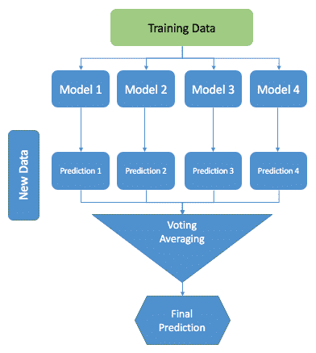

然而，为了得到性能良好的集成模型，基学习器本身应该尽可能准确。衡量模型性能的常见方法是对其泛化误差进行评估。泛化误差是一个术语，用来衡量模型基于一个模型尚未见过的新的数据集进行预测的准确性。

为了表现良好，集成模型需要足够的数据。当拥有大型和非线性数据集时，集成技术证明更有用。

如果包含太多的模型，集成模型可能会过拟合，尽管这种情况并不常见。

无论你如何微调你的模型，都存在高偏差或高方差的风险。即使是最优秀的模型，如果在训练模型时没有考虑到偏差和方差，也可能失败。偏差和方差都代表了预测中的一种错误。实际上，总误差由偏差相关误差、方差相关误差和不可避免的噪声相关误差（或不可减少误差）组成。噪声相关误差主要由于训练数据中的噪声引起，无法消除。然而，偏差和方差引起的误差可以减少。

总误差可以表示如下：

```py
Total Error = Bias ^ 2 + Variance + Irreducible Error
```

一个如**均方误差**（**MSE**）这样的度量可以捕捉连续目标变量的所有误差，可以表示如下：

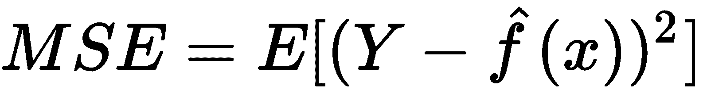

在这个公式中，*E*代表期望均值，*Y*代表实际的目标值，而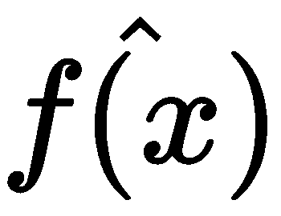是目标变量的预测值。它可以分解为其组成部分，如偏差、方差和噪声，如下公式所示：

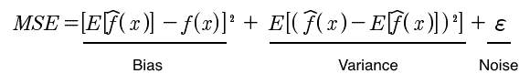

当偏差指的是真实值与我们的估计期望值有多接近时，方差另一方面衡量的是与期望估计值偏差的程度。具有小 MSE 的估计器是可取的。为了最小化 MSE 误差，我们希望我们的估计值在真实值上居中（0 偏差）并且与真实值（正确）的偏差低（低方差）。换句话说，我们希望对估计值的价值有信心（低方差，低不确定性，分布更尖锐）。高偏差会降低算法在训练数据集上的性能并导致欠拟合。另一方面，高方差的特点是训练误差低而验证误差高。高方差会降低学习者在未见数据上的性能，导致过拟合。

集成模型可以减少模型中的偏差和/或方差。

# 最大投票法

最大投票法，通常用于分类问题，是结合多个机器学习算法预测的简单方法之一。

在最大投票法中，每个基础模型做出预测并对每个样本进行投票。只有获得最高票数的样本类别被包含在最终的预测类别中。

例如，假设我们有一个在线调查，消费者在五级李克特量表上回答一个问题。我们可以假设一些消费者会给出五分的评价，而其他人会给出四分的评价，依此类推。如果大多数消费者，比如说超过 50%的消费者给出了四分的评价，那么最终的评分就是四分。在这个例子中，将最终评分定为四分类似于对所有评分取众数。

# 准备工作

在以下步骤中，我们将下载以下包：

首先，导入`os`和`pandas`包，并根据您的需求设置工作目录：

```py
# import required packages
import os
import pandas as pd

# Set working directory as per your need
os.chdir(".../.../Chapter 2")
os.getcwd()
```

从 GitHub 下载`Cryotherapy.csv`数据集并将其复制到您的工作目录。读取数据集：

```py
df_cryotherapydata = pd.read_csv("Cryotherapy.csv")
```

使用以下代码查看数据：

```py
df_cryotherapydata.head(5)
```

我们可以看到数据已被正确读取，并且有`Result_of_Treatment`类变量。然后我们继续创建以`Result_of_Treatment`作为响应变量的模型。

# 如何做到这一点...

您可以使用 Python 的`scikit-learn`库中的`VotingClassifier`类为分类问题创建一个投票集成模型。以下步骤展示了如何将决策树、SVM 和逻辑回归模型的预测组合起来解决一个分类问题：

1.  导入构建决策树、SVM 和逻辑回归模型所需的库。我们还导入`VotingClassifier`进行最大投票：

```py
# Import required libraries
from sklearn.tree import DecisionTreeClassifier
from sklearn.svm import SVC
from sklearn.linear_model import LogisticRegression
from sklearn.ensemble import VotingClassifier
```

1.  我们接下来构建我们的特征集并创建我们的训练和测试数据集：

```py
# We create train & test sample from our dataset
from sklearn.cross_validation import train_test_split

# create feature & response sets
feature_columns = ['sex', 'age', 'Time', 'Number_of_Warts', 'Type', 'Area']
X = df_cryotherapydata[feature_columns]
Y = df_cryotherapydata['Result_of_Treatment']

# Create train & test sets
X_train, X_test, Y_train, Y_test = \
train_test_split(X, Y, test_size=0.20, random_state=1)
```

1.  我们使用决策树、SVM 和逻辑回归算法构建我们的模型：

```py
# create the sub models
estimators = []

dt_model = DecisionTreeClassifier(random_state=1)
estimators.append(('DecisionTree', dt_model))

svm_model = SVC(random_state=1)
estimators.append(('SupportVector', svm_model))

logit_model = LogisticRegression(random_state=1)
estimators.append(('Logistic Regression', logit_model))
```

1.  我们使用我们选择的每个分类器构建单独的模型：

```py
from sklearn.metrics import accuracy_score

for each_estimator in (dt_model, svm_model, logit_model):
    each_estimator.fit(X_train, Y_train)
    Y_pred = each_estimator.predict(X_test)
    print(each_estimator.__class__.__name__, accuracy_score(Y_test, Y_pred))
```

我们可以查看每个单个基学习器的准确度得分：

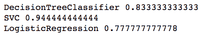

1.  我们继续集成我们的模型，并使用`VotingClassifier`来评估集成模型的准确度：

```py
#Using VotingClassifier() to build ensemble model with Hard Voting
ensemble_model = VotingClassifier(estimators=estimators, voting='hard')

ensemble_model.fit(X_train,Y_train)
predicted_labels = ensemble_model.predict(X_test) 

print("Classifier Accuracy using Hard Voting: ", accuracy_score(Y_test, predicted_labels))
```

我们可以使用`Hard Voting`查看集成模型的准确度得分：

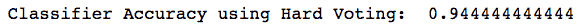

# 它是如何工作的...

`VotingClassifier`实现了两种投票类型——**硬投票**和**软投票**。在硬投票中，最终的类别标签被预测为被分类模型预测最频繁的类别标签。换句话说，所有分类器的预测被汇总以预测获得最多投票的类别。简单来说，它取预测类别标签的众数。

在对类别标签进行硬投票时，是基于每个分类器的多数投票预测，其中*i=1.....n*个观察值，我们得到以下结果：

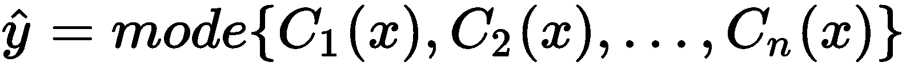

如前节所示，我们有三个模型，一个来自决策树，一个来自 SVM，一个来自逻辑回归。假设这些模型将训练观察值分别分类为类别 1、类别 0 和类别 1。然后通过多数投票，我们得到以下结果：

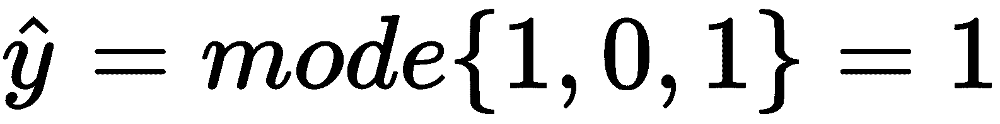

在这种情况下，我们将观察值分类为类别 1。

在前一节中，在*步骤 1*中，我们导入了构建模型所需的库。在*步骤 2*中，我们创建了特征集。我们还分割数据以创建训练和测试样本。在*步骤 3*中，我们分别使用决策树、SVM 和逻辑回归训练了三个模型。在*步骤 4*中，我们查看每个基学习器的准确度得分，而在*步骤 5*中，我们使用`VotingClassifier()`集成模型并查看集成模型的准确度得分。

# 还有更多...

许多分类器可以估计类别概率。在这种情况下，类别标签是通过平均类别概率来预测的。这被称为**软投票**，并且对于一组调优良好的分类器来说是被推荐的。

在`scikit-learn`库中，许多分类算法都有`predict_proba()`方法来预测类概率。要执行软投票集成，只需在`VotingClassifier()`中将`voting='hard'`替换为`voting='soft'`。

以下代码创建了一个使用软投票的集成：

```py
# create the sub models
estimators = []

dt_model = DecisionTreeClassifier(random_state=1)
estimators.append(('DecisionTree', dt_model))

svm_model = SVC(random_state=1, probability=True)
estimators.append(('SupportVector', svm_model))

logit_model = LogisticRegression(random_state=1)
estimators.append(('Logistic Regression', logit_model))

for each_estimator in (dt_model, svm_model, logit_model):
    each_estimator.fit(X_train, Y_train)
    Y_pred = each_estimator.predict(X_test)
    print(each_estimator.__class__.__name__, accuracy_score(Y_test, Y_pred))

# Using VotingClassifier() to build ensemble model with Soft Voting
ensemble_model = VotingClassifier(estimators=estimators, voting='soft')
ensemble_model.fit(X_train,Y_train)
predicted_labels = ensemble_model.predict(X_test) 
print("Classifier Accuracy using Soft Voting: ", accuracy_score(Y_test, predicted_labels))
```

我们可以看到单个学习器和使用软投票的集成学习器的准确率：

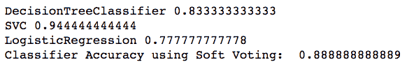

`SVC`类默认不能估计类概率，因此我们在前面的代码中将它的概率超参数设置为`True`。当`probability=True`时，`SVC`将能够估计类概率。

# 平均

平均通常用于回归问题，或者在分类任务中估计概率时使用。预测是从多个模型中提取的，并使用预测的平均值来做出最终预测。

# 准备工作

让我们准备好构建多个学习器，并看看如何实现平均：

从 GitHub 下载`whitewines.csv`数据集并将其复制到工作目录，然后读取数据集：

```py
df_winedata = pd.read_csv("whitewines.csv")
```

让我们用以下代码看看数据：

```py
df_winedata.head(5)
```

在以下屏幕截图中，我们可以看到数据已被正确读取：

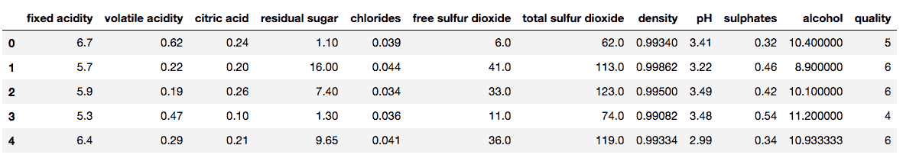

# 如何做...

我们有一个基于葡萄酒特性的数据集。使用这个数据集，我们将构建多个回归模型，其中质量作为响应变量。使用多个学习器，我们可以提取多个预测。平均技术将取每个训练样本所有预测值的平均值：

1.  导入所需的库：

```py
# Import required libraries
from sklearn.linear_model import LinearRegression
from sklearn.tree import DecisionTreeRegressor
from sklearn.svm import SVR
```

1.  创建响应和特征集：

```py
# Create feature and response variable set
from sklearn.cross_validation import train_test_split

# create feature & response variables
feature_columns = ['fixed acidity', 'volatile acidity', 'citric acid', 'residual sugar','chlorides', 'free sulfur dioxide', 'total sulfur dioxide','density', 'pH', 'sulphates', 'alcohol']
X = df_winedata[feature_columns]
Y = df_winedata['quality']
```

1.  将数据分为训练集和测试集：

```py
# Create train & test sets
X_train, X_test, Y_train, Y_test = \
train_test_split(X, Y, test_size=0.20, random_state=1)
```

1.  使用线性回归、`SVR`和决策树构建基础回归学习器：

```py
# Build base learners
linreg_model = LinearRegression()
svr_model = SVR()
regressiontree_model = DecisionTreeRegressor()

# Fitting the model
linreg_model.fit(X_train, Y_train)
svr_model.fit(X_train, Y_train)
regressiontree_model.fit(X_train, Y_train)
```

1.  使用基础学习器根据测试数据做出预测：

```py
linreg_predictions = linreg_model.predict(X_test)
svr_predictions = svr_model.predict(X_test)
regtree_predictions = regressiontree_model.predict(X_test)
```

1.  添加预测值并除以基础学习器的数量：

```py
# We divide the summation of the predictions by 3 i.e. number of base learners 
average_predictions=(linreg_predictions + svr_predictions + regtree_predictions)/3
```

# 它是如何工作的...

在*步骤 1*中，我们导入了所需的包。在*步骤 2*中，我们将特征集和响应变量从数据集中分离出来。在*步骤 3*中，我们将数据集分为训练样本和测试样本。

注意，我们的响应变量在本质上连续。因此，我们在*步骤 4*中使用了线性回归、`SVR`和决策树来构建回归基础学习器。在*步骤 5*中，我们将测试数据集传递给`predict()`函数来预测响应变量。最后，在*步骤 6*中，我们将所有预测值相加，并除以基础学习器的数量，在我们的例子中是三个。

# 加权平均

与平均一样，加权平均也用于回归任务。或者，它可以在分类问题中估计概率时使用。基础学习器被分配不同的权重，这些权重代表每个模型在预测中的重要性。

加权平均模型应该至少与你的最佳模型一样好。

# 准备工作

从 GitHub 下载`wisc_bc_data.csv`数据集并将其复制到你的工作目录。让我们读取数据集：

```py
df_cancerdata = pd.read_csv("wisc_bc_data.csv")
```

使用以下代码查看数据：

```py
df_cancerdata.head(5)
```

我们可以看到数据已经被正确读取：

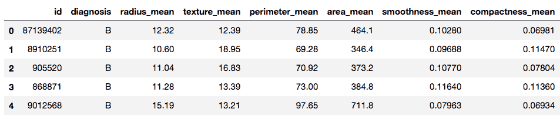

# 如何做到这一点...

在这里，我们有一个基于癌症肿瘤特性的数据集。使用这个数据集，我们将构建多个分类模型，其中`diagnosis`作为我们的响应变量。诊断变量具有`B`和`M`值，表示肿瘤是良性还是恶性。使用多个学习器，我们提取多个预测。加权平均技术取每个训练样本的所有预测值的平均值。

在这个例子中，我们将预测概率视为输出，并使用 scikit-learn 算法的`predict_proba()`函数来预测类概率：

1.  导入所需的库：

```py
# Import required libraries
from sklearn.tree import DecisionTreeClassifier
from sklearn.svm import SVC
from sklearn.linear_model import LogisticRegression
```

1.  创建响应和特征集：

```py
# Create feature and response variable set
# We create train & test sample from our dataset
from sklearn.cross_validation import train_test_split

# create feature & response variables
X = df_cancerdata.iloc[:,2:32]
Y = df_cancerdata['diagnosis']
```

我们使用`pandas` DataFrame 的`iloc()`函数检索特征列，该函数是基于整数位置的索引选择，用于按位置选择。`iloc()`函数接受行和列选择作为其参数，形式为：`data.iloc(<row selection>, <column selection>)`。行和列选择可以是整数列表或行和列的切片。例如，它可能看起来如下：`df_cancerdata.iloc(2:100, 2:30)`。

1.  然后，我们将数据分为训练集和测试集：

```py
# Create train & test sets
X_train, X_test, Y_train, Y_test = \
train_test_split(X, Y, test_size=0.20, random_state=1)
```

1.  构建基础分类器模型：

```py
# create the sub models
estimators = []

dt_model = DecisionTreeClassifier()
estimators.append(('DecisionTree', dt_model))

svm_model = SVC(probability=True)
estimators.append(('SupportVector', svm_model))

logit_model = LogisticRegression()
estimators.append(('Logistic Regression', logit_model))
```

1.  在测试数据上拟合模型：

```py
dt_model.fit(X_train, Y_train)
svm_model.fit(X_train, Y_train)
logit_model.fit(X_train, Y_train)
```

1.  使用`predict_proba()`函数预测类概率：

```py
dt_predictions = dt_model.predict_proba(X_test)
svm_predictions = svm_model.predict_proba(X_test)
logit_predictions = logit_model.predict_proba(X_test)
```

1.  为每个模型分配不同的权重以获得最终的预测：

```py
weighted_average_predictions=(dt_predictions * 0.3 + svm_predictions * 0.4 + logit_predictions * 0.3)
```

# 它是如何工作的...

在*步骤 1*中，我们导入了构建我们模型所需的库。在*步骤 2*中，我们创建了响应和特征集。我们使用`pandas` DataFrame 的`iloc()`函数检索我们的特征集。在*步骤 3*中，我们将数据集分为训练集和测试集。在*步骤 4*中，我们构建了我们的基础分类器。请注意，我们向`SVC`函数传递了`probability=True`，以允许`SVC()`返回类概率。在`SVC`类中，默认值为`probability=False`。

在*步骤 5*中，我们将模型拟合到训练数据。在*步骤 6*中，我们使用`predict_proba()`函数预测测试观察值的类概率。

最后，在*步骤 7*中，我们为我们的每个模型分配了不同的权重来估计加权平均预测。随之而来的问题是如何选择权重。一种方法是对权重进行均匀采样，并确保它们归一化到 1，然后在测试集上进行验证并重复，同时跟踪提供最高准确率的权重。这是一个随机搜索的例子。

# 参见

以下是一些 scikit 参考链接：

+   Scikit 模型集成方法指南 [(https://bit.ly/2oVNogs)](https://bit.ly/2oVNogs)

+   Scikit 模型指南：`VotingClassifier` [(https://bit.ly/2oW0avo)](https://bit.ly/2oW0avo)
