# 重抽样方法

在本章中，我们将介绍抽样的基本概念。我们还将了解重抽样及其重要性。

抽样是从总体中选择观测子集的过程，目的是估计关于整个总体的某些参数。另一方面，重抽样方法用于改进对总体参数的估计。

本章将涵盖以下食谱：

+   抽样简介

+   k 折交叉验证和留一法交叉验证

+   自举抽样

# 抽样简介

抽样技术可以大致分为非概率抽样技术和概率抽样技术。非概率抽样技术基于用户的判断，而在概率抽样中，观测值是通过机会选择的。

概率抽样通常包括**简单随机抽样（SRS）**、分层抽样和系统抽样：

+   **SRS**：在简单随机抽样（SRS）中，总体中的每个观测值都有同等的机会被选中作为样本。

+   **分层抽样**：在分层抽样中，总体数据被分为不同的组，称为**层**。然后从每个组中抽取概率样本。

+   **系统抽样**：在此方法中，通过选择固定间隔的观测值从总体中抽取样本。

如果样本太小或太大，可能会导致错误的发现。因此，确保我们有正确的样本大小非常重要。一个设计良好的样本可以帮助识别可能导致预期结果准确性和可靠性偏差的因素。

由于各种原因，我们的样本可能会引入错误。例如，由于随机抽样可能发生的错误，这被称为**抽样误差**，或者由于抽取观测值的方法导致样本偏斜，这被称为**样本偏差**。

# 准备工作

在第一章“更接近你的数据”中，我们操作并准备了`HousePrices.csv`文件中的数据，并处理了缺失值。在这个例子中，我们将使用最终数据集来演示这些抽样和重抽样技术。

您可以从 GitHub 获取准备好的数据集。

我们将导入所需的库。我们将读取数据并查看数据集的维度：

```py
# import os for operating system dependent functionalities
import os

# import other required libraries
import pandas as pd
from sklearn.model_selection import train_test_split

# Set your working directory according to your requirement
os.chdir(".../Chapter 3/Resampling Methods")
os.getcwd()
```

让我们读取我们的数据。我们将 DataFrame 名称前缀为`df_`以使其更容易理解：

```py
df_housingdata = pd.read_csv("Final_HousePrices.csv")
```

在下一节中，我们将探讨如何使用`sklearn.model_selection`中的`train_test_split()`来将我们的数据分割成随机的训练和测试子集。

# 如何操作...

现在我们已经读取了我们的数据集，让我们看看如何进行抽样：

1.  我们检查 DataFrame 的维度，如下所示：

```py
df_housingdata.shape
```

我们可以看到我们的 DataFrame 的维度：

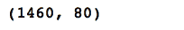

1.  然后我们检查我们的 DataFrame 是否有任何缺失值：

```py
df_housingdata.isnull().sum()
```

我们注意到`df_housingdata`中没有缺失值。

1.  我们将预测变量和响应变量分别放入两个不同的 DataFrame 中，如下所示：

```py
# create feature & response variables
X = df_housingdata.iloc[:,0:79]
Y = df_housingdata['SalePrice']
```

1.  我们使用`train_test_split()`将我们的预测变量和响应变量数据集分割成训练和测试子集：

```py
# Create train & test sets
X_train, X_test, Y_train, Y_test = train_test_split(X, Y, train_size=0.7, test_size=0.3)
```

1.  我们可以按照以下方式找到每个子集中的观测值和列数：

```py
print(X_train.shape)
print(Y_train.shape)
print(X_test.shape)
print(Y_test.shape)
```

我们可以看到 70%的数据被分配到了训练数据集中，而 30%被分配到了测试数据集中：

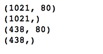

# 它是如何工作的...

在*步骤 1*和*步骤 2*中，我们查看 DataFrame 的维度，发现我们的数据集没有缺失值。在*步骤 3*中，我们将特征和响应变量分离出来。在*步骤 4*中，我们使用`sklearn.model_selection`中的`train_test_split()`函数来分割我们的数据并创建训练和测试子集。注意，我们传递了两个参数`train_size`和`test_size`，并分别将它们的值设置为`0.7`和`0.3`。`train_size`和`test_size`可以取 0.0 到 1.0 之间的值，这些值代表分配给每个数据集的比例。如果提供了一个整数值，那么这个数字代表观测值的绝对数量。

我们可以选择不提供这两个参数中的任何一个，即`train_size`或`test_size`。如果我们把`train_size`的值设置为`None`或者根本不提供它，那么它的值会自动设置为与测试大小相补充。同样，如果`test_size`未指定或者我们将其值设置为`None`，它的值会自动设置为与训练大小相补充。

在*步骤 5*中，我们查看了由`train_test_split()`函数创建的子集的形状。

# 还有更多...

在这个例子中，我们将使用一个数据集来衡量一个二分分类的目标变量。重要的是要理解，我们的目标变量的两个类别在训练和测试子集中分布是相似的：

1.  我们首先读取我们的数据集并查看其维度：

```py
df_creditcarddata = pd.read_csv("creditcarddefault.csv")
df_creditcarddata.shape
```

我们有 30,000 个观测值和 25 个变量。最后一个变量，下个月默认付款，是我们的目标变量，其值要么是*0*要么是*1*。

1.  我们将数据分成特征集和响应变量，并使用以下代码将其分割成训练和测试子集：

```py
# create feature & response set
X = df_creditcarddata.iloc[:,0:24]
Y = df_creditcarddata['default payment next month']

# Create train & test sets
X_train, X_test, Y_train, Y_test = train_test_split(X, Y, train_size=0.7, test_size=0.3, stratify=Y)
```

注意，这次我们在`train_test_split()`函数中使用了参数`stratify`。`stratify`参数使得分割后的样本中值的比例等于提供给它的变量的值的比例。此外，我们还把响应变量`Y`分配给了`stratify`参数。

现在，我们可以看到训练和测试子集中目标变量的二分类分布：

```py
print(pd.value_counts(Y_train.values)*100/Y_train.shape)
print(pd.value_counts(Y_test.values)*100/Y_test.shape)
```

在下面的输出中，我们可以看到两个子集中类的分布是相同的：

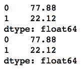

我们还可以传递另一个参数`shuffle`给`train_test_split()`。这个参数接受布尔值`True`或`False`，以指示在分割数据之前是否要打乱数据。如果`shuffle=False`，则`stratify`必须是`None`。

# 参考信息

+   scikit-learn 的`sklearn.model_selection`指南：[`bit.ly/2px08Ii`](https://bit.ly/2px08Ii)

# k-fold 和留一法交叉验证

机器学习模型在应用于未见数据以进行预测时，通常会面临泛化问题。为了避免这个问题，模型不是使用完整的数据集进行训练。相反，数据集被划分为训练集和测试集。模型在训练数据上训练，并在测试集上评估，而测试集在训练过程中并未看到。这是交叉验证的基本思想。

最简单的交叉验证类型是保留方法，我们在之前的配方“采样介绍”中看到了它。在保留方法中，当我们把数据分成训练集和测试集时，由于数据的高维性，测试集可能并不那么类似于训练集。这可能导致结果的不稳定。因此，我们高效地采样数据非常重要。我们可以使用其他交叉验证方法来解决这个问题，例如**留一法交叉验证**（**LOOCV**）或**k-fold 交叉验证**（**k-fold CV**）。

k-fold CV 是一种广泛使用的方法，用于估计测试误差。原始数据集包含*N*个观测值，被划分为*K*个子集，并且保留方法被重复*K*次。在每次迭代中，*K-1*个子集被用作训练集，其余的用作测试集。误差的计算如下：

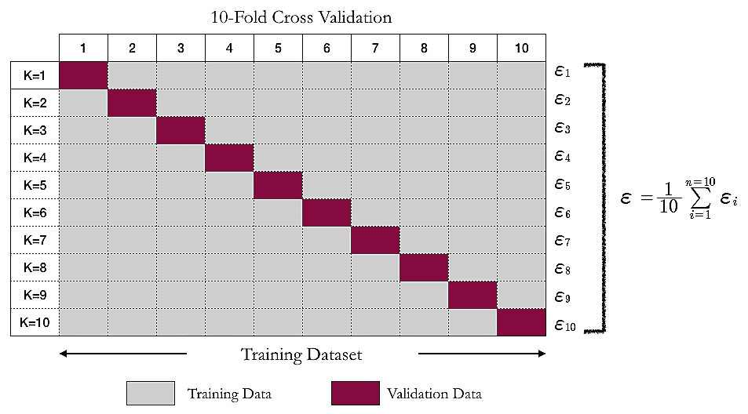

在 LOOCV 中，子集的数量*K*等于数据集中观测值的数量*N*。LOOCV 使用原始数据集中的一个观测值作为验证集，其余*N-1*个观测值作为训练集。这被迭代*N*次，以便样本中的每个观测值在每个迭代中都用作验证数据。这与 k-fold CV 相同，其中*K*等于*N*，即数据集中的数据点数量。由于需要大量的迭代，LOOCV 通常需要大量的计算能力。

在 LOOCV 中，每个折叠的估计值高度相关，它们的平均值可能有很高的方差。

测试误差的估计基于单个观测值，表示为*MSE =* 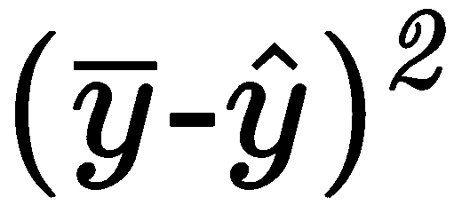。我们可以计算所有折叠的 MSE 的平均值如下：

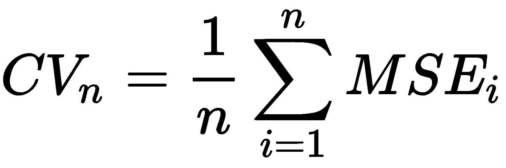

这种计算与 k-fold CV 中涉及的计算没有不同。我们将使用 scikit-learn 库来查看如何实现 k-fold CV 和 LOOCV 等技术。

# 准备工作

在下面的代码块中，我们可以看到如何导入所需的库：

```py
import pandas as pd

from sklearn.model_selection import train_test_split
from sklearn.linear_model import LinearRegression
from sklearn.metrics import mean_squared_error, r2_score
from sklearn.model_selection import KFold 
import matplotlib.pyplot as plt
```

我们读取我们的数据，并将特征和响应变量分开：

```py
# Let's read our data. 
df_autodata = pd.read_csv("autompg.csv")

# Fill NAs with the median value
df_autodata['horsepower'].fillna(df_autodata['horsepower'].median(), inplace=True)

# Drop carname variable
df_autodata.drop(['carname'], axis=1, inplace=True)

X = df_autodata.iloc[:,1:8]
Y = df_autodata.iloc[:,0]
X=np.array(X)
Y=np.array(Y)
```

# 如何做到这一点...

k 折交叉验证提供给我们训练和测试索引，以便将数据分为训练集和测试集：

1.  我们将数据集分成 *K* 个连续的折叠（默认情况下不进行洗牌），其中 *K=10*：

```py
kfoldcv = KFold(n_splits=10)
kf_ytests = []
kf_predictedvalues = []
mean_mse = 0.0

for train_index, test_index in kfoldcv.split(X):
    X_train, X_test = X[train_index], X[test_index] 
    Y_train, Y_test = Y[train_index], Y[test_index]

    model = LinearRegression()
    model.fit(X_train, Y_train) 
    Y_pred = model.predict(X_test)

    # there is only one y-test and y-pred per iteration over the kfoldcv.split, 
    # so we append them to the respective lists.

    kf_ytests += list(Y_test)
    kf_predictedvalues += list(Y_pred)
    mse = mean_squared_error(kf_ytests, kf_predictedvalues)
    r2score = r2_score(kf_ytests, kf_predictedvalues)
    print("R²: {:.2f}, MSE: {:.2f}".format(r2score, mse))
    mean_mse += mse   
```

1.  我们可以使用 `r2_score()` 来查看我们的决定系数，并使用 `mse()` 来查看我们的均方误差：

```py
print("Average CV Score :" ,mean_mse/10) 
```

上述代码的结果如下：

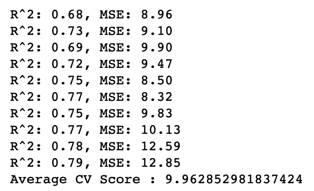

1.  我们将预测值与响应变量的实际值进行绘图：

```py
## Let us plot the model
plt.scatter(kf_ytests, kf_predictedvalues)
plt.xlabel('Reported mpg')
plt.ylabel('Predicted mpg')
```

上述代码生成的图如下：

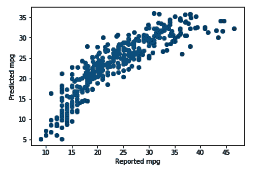

# 它是如何工作的...

在 *步骤 1* 中，k 折交叉验证将数据集分成 *K* 个连续的折叠，其中 *K*=10。k 折交叉验证提供给我们训练和测试索引，然后分割数据为训练集和测试集。在 *步骤 2* 中，我们使用了 `r2_score()` 来查看决定系数，并使用 `mse()` 来查看均方误差。决定系数和均方误差分别是 79% 和 12.85。在 *步骤 3* 中，我们绘制了预测值与响应变量 `mpg` 的实际值。

# 还有更多...

现在，我们将使用 `sklearn.model_selection` 中的 `LeaveOneOut` 来进行相同的 LOOCV 练习：

1.  我们将再次读取我们的数据，并将其分为特征集和响应集：

```py
# Let's read our data. 
df_autodata = pd.read_csv("autompg.csv")

# Fill NAs with the median value
df_autodata['horsepower'].fillna(df_autodata['horsepower'].median(), inplace=True)

# Drop carname variable
df_autodata.drop(['carname'], axis=1, inplace=True)

X = df_autodata.iloc[:,1:8]
Y = df_autodata.iloc[:,0]
X=np.array(X)
Y=np.array(Y)
```

1.  我们使用 LOOCV 来构建我们的模型：

```py
from sklearn.model_selection import LeaveOneOut 
loocv = LeaveOneOut()

loo_ytests = []
loo_predictedvalues = []
mean_mse = 0.0

for train_index, test_index in loocv.split(X):
    # the below requires arrays. So we converted the dataframes to arrays
    X_train, X_test = X[train_index], X[test_index] 
    Y_train, Y_test = Y[train_index], Y[test_index]

    model = LinearRegression()
    model.fit(X_train, Y_train) 
    Y_pred = model.predict(X_test)

    # there is only one y-test and y-pred per iteration over the loo.split, 
    # so we append them to the respective lists.

    loo_ytests += list(Y_test)
    loo_predictedvalues += list(Y_pred)

    mse = mean_squared_error(loo_ytests, loo_predictedvalues)
    r2score = r2_score(loo_ytests, loo_predictedvalues)
    print("R²: {:.2f}, MSE: {:.2f}".format(r2score, mse))
    mean_mse += mse 
```

1.  我们可以使用 `r2_score()` 来查看我们的决定系数，并使用 `mse()` 来查看我们的均方误差：

```py
print("Average CV Score :" ,mean_mse/X.shape[0]) 
```

我们可以查看 LOOCV 结果的决定系数和均方误差：

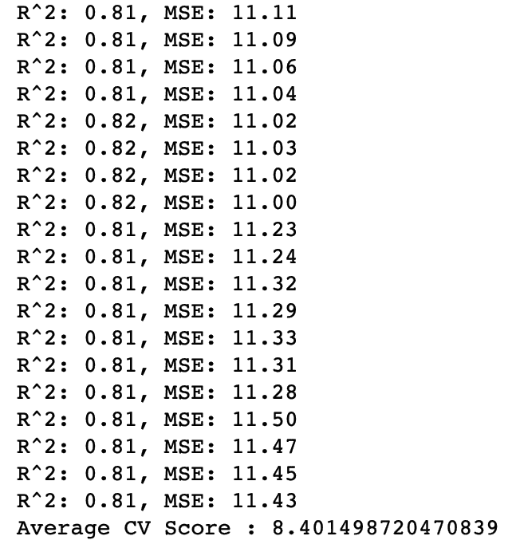

1.  我们可以将预测值与响应变量的实际值进行绘图：

```py
## Let us plot the model
plt.scatter(kf_ytests, kf_predictedvalues)
plt.xlabel('Reported mpg')
plt.ylabel('Predicted mpg')
```

上述代码生成的图给出了以下输出：

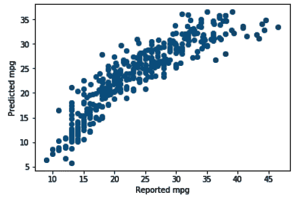

在 LOOCV 中，分割方法没有随机性，所以它总是会给你相同的结果。

分层 k 折交叉验证方法常用于分类问题。这是 k 折交叉验证方法的一种变体，它返回分层折叠。每个集合包含与原始数据集相似百分比的每个目标类的样本。`StratifiedShuffleSplit` 是洗牌分割的变体，通过保持每个目标类的相同百分比来创建分割。

# 参见

+   scikit-learn 对其他交叉验证方法的指南：[`bit.ly/2px08Ii`](https://bit.ly/2px08Ii)

# 自举

Bootstrapping 基于 1949 年由 Quenouille 提出的 jackknife 方法，并在 1958 年由 Tukey 改进。jackknife 方法用于检验假设和估计置信区间。它是通过在每次移除每个观测值后计算估计值，然后计算这些计算的平均值来获得的。对于大小为*N*的样本，可以通过聚合每个*N-1*大小的子样本的估计值来找到 jackknife 估计值。它与 bootstrap 样本类似，但 while bootstrap 方法是带替换的抽样，jackknife 方法是不带替换地抽样数据。

Bootstrapping 是一种强大的非参数重抽样技术，用于评估估计值的不确定性。在 bootstrapping 中，从原始样本中反复抽取具有相同大小的大量样本。这允许一个给定的观测值被包含在多个样本中，这被称为**带替换的抽样**。在 bootstrap 方法中，通过带替换抽样从原始数据中创建*n*个样本。每个样本的大小相同。*n*越大，样本集将越接近理想的 bootstrap 样本。

“Bootstrapping 的本质是这样一个想法：在没有关于总体任何其他知识的情况下，从总体中随机抽取大小为 n 的样本中找到的值的分布是总体分布的最佳指南。因此，为了近似如果总体被重新抽样的情况，重新抽样样本是合理的。换句话说，由 n 个观测样本值组成的无限总体，每个值有 1/n 的概率，被用来模拟未知的真实总体。”

–Bryan F. J. Manly

一个 bootstrap 样本的图示表示如下：

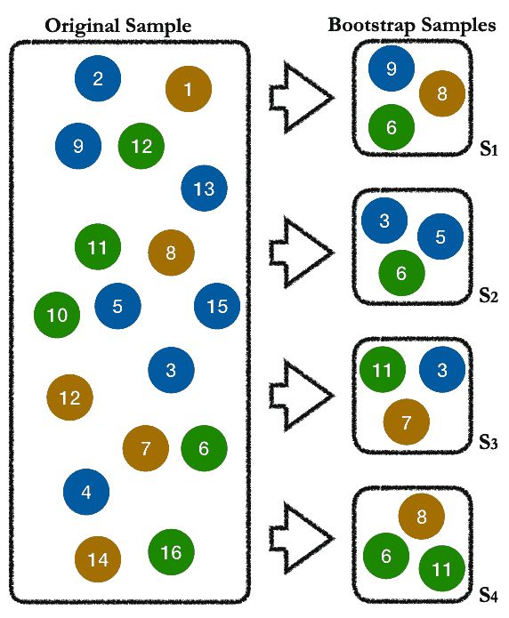

如前图所示，**S1**子集中的部分数据点也出现在**S2**和**S4**中。

假设我们从原始样本中获得了*n*个 bootstrap 样本。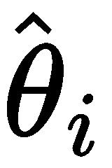表示*n*个 bootstrap 样本的估计值，其中*i=1,2,3...,n*。如果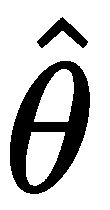表示原始样本的参数估计值，那么的标准误差如下给出：

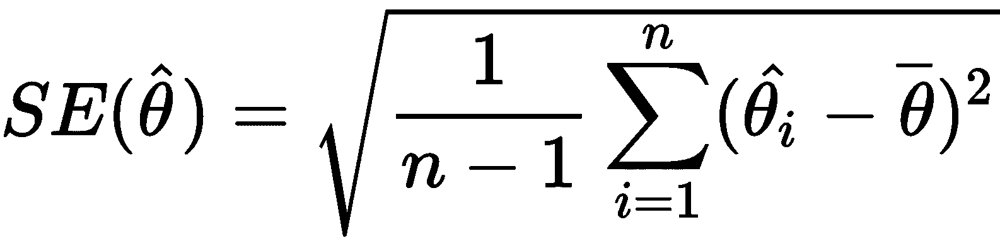

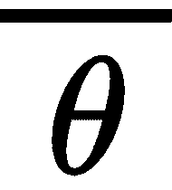如下给出：

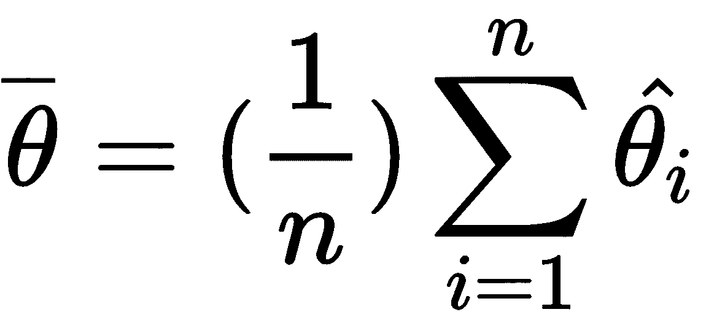

表示*n*个 bootstrap 样本的估计值的平均值。

# 准备中

我们需要像往常一样导入所需的库。这次，我们将使用来自`sklean.utils`的`resample`类，这是我们之前没有使用过的：

```py
import pandas as pd
import numpy as np

from sklearn.model_selection import train_test_split
from sklearn.linear_model import SGDRegressor
from sklearn.metrics import mean_squared_error, r2_score
import matplotlib.pyplot as plt

from sklearn.utils import resample
```

我们加载我们的数据，并用`horsepower`变量的中位数填充缺失值。我们还删除了`carname`变量：

```py
# Let's read our data. We prefix the data frame name with "df_" for easier understanding.
df_autodata = pd.read_csv("autompg.csv")
df_autodata['horsepower'].fillna(df_autodata['horsepower'].median(), inplace=True)
df_autodata.drop(['carname'], axis=1, inplace=True)
```

# 如何做到这一点...

现在我们已经读取了数据，让我们看看我们如何进行 bootstrap 采样：

1.  我们编写了一个自定义函数，`create_bootstrap_oob()`，它接受一个 DataFrame 作为参数，并使用`sklearn.utils`中的`resample()`函数创建了一个包含 100 个观察值的 bootstrap 样本：

```py
# This custom function takes a dataframe as an argument
def create_bootstrap_oob(df):
    global df_OOB
    global df_bootstrap_sample 

    # creating the bootstrap sample
    df_bootstrap_sample = resample(df, replace=True, n_samples=100)

    # creating the OOB sample 
    bootstrap_sample_index = tuple(df_bootstrap_sample.index)
    bootstrap_df = df.index.isin(bootstrap_sample_index)
    df_OOB = df[~bootstrap_df]
```

1.  我们循环了 50 次迭代，并通过传递`df_autodata` DataFrame 调用了自定义函数。我们记录了每个 bootstrap 样本中`mpg`变量的平均值，这些平均值将与我们原始 DataFrame 中`mpg`变量的平均值进行比较，即`df_autodata`：

```py
iteration=50
bootstap_statistics=list()
originalsample_statistics=list()

for i in range(iteration):
    # Call custom function create_bootstrap_oob(). Pass df_autodata
    create_bootstrap_oob(df_autodata)

    # Capture mean value of mpg variable for all bootstrap samples
    bootstap_statistics.append(df_bootstrap_sample.iloc[:,0].mean())

    originalsample_statistics.append(df_autodata['mpg'].mean())
```

1.  我们绘制了每个迭代中`mpg`变量的平均值，其中考虑了单独的 bootstrap 样本。我们在每个迭代中记录了每个 bootstrap 样本中`mpg`变量的平均值：

```py
import matplotlib.pyplot as plt
f, ax= plt.subplots(figsize=(6,6))

plt.plot(bootstap_statistics, 'c--', label='Bootstrap Sample Statistic')
plt.plot(originalsample_statistics, 'grey', label='Original Sample Statistic')
plt.xlabel('Iterations')
plt.ylabel('Statistic (Mean of mpg)')
plt.legend(loc=4)
plt.show()
```

我们最终绘制了`mpg`变量的平均值与每个迭代的对比图，如下所示：

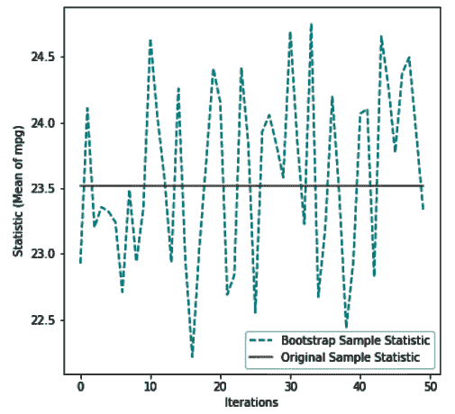

# 它是如何工作的...

在**步骤 1**中，我们创建了一个自定义函数，`create_bootstrap_oob( )`，并使用`sklearn.utils`中的`resample()`函数创建了一个包含 100 个观察值的 bootstrap 样本。`create_bootstrap_oob( )`自定义函数接受一个 DataFrame 作为输入参数，并创建了 bootstrap 和**袋外样本**（**OOB**）。

我们提到 bootstrap 采样是带有替换的采样。这意味着任何给定的观察值可以在单个样本中出现多次。

在**步骤 2**中，我们循环了 50 次迭代，并通过传递`df_autoframe`调用了`create_bootstrap_oob( )`自定义函数。我们记录了每个 bootstrap 样本中`mpg`变量的平均值。在**步骤 3**中，我们为每个迭代考虑了一个单独的 bootstrap 样本。我们记录了每个迭代中`mpg`变量的平均值，然后绘制了每个迭代中`mpg`变量的平均值。

# 参见

+   scikit-learn 指南中的`sklearn.cross_validation.Bootstrap`：[`bit.ly/2RC5MYv`](https://bit.ly/2RC5MYv)
