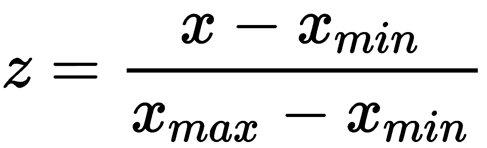

# 统计与机器学习算法

在本章中，我们将介绍以下内容：

+   多元线性回归

+   逻辑回归

+   朴素贝叶斯

+   决策树

+   支持向量机

# 技术要求

本章的技术要求与我们在第一章“接近你的数据”中详细说明的要求相同。

访问 GitHub 仓库以获取数据集和代码。这些数据集和代码按章节和主题名称排列。例如，对于线性回归数据集和代码，请访问`.../Chapter 3/Linear regression`。

# 多元线性回归

多元线性回归是一种用于训练线性模型的技术，它假设多个预测变量（![img/a873ef1f-dd8a-4450-8afa-5e5c3c4b2dc5.png]）与连续目标变量（![img/9d832a44-5813-46fb-9d89-681fc4ed016a.png]）之间存在线性关系。具有 m 个预测变量的多元线性回归的一般方程如下：

![img/088198d7-1233-4571-9fcc-61c6dba157ad.png]

![img/19a78dc6-d3ee-4492-b89e-6d42851d79b0.png]

训练线性回归模型涉及估计每个预测变量（用字母表示）的系数的值，如上图所示 ![img/a343305a-25c0-4a07-8783-5045b92efe76.png]。在先前的方程中，![img/9c4fefc7-e6fe-4dd2-a801-a379f072ae3c.png] 表示误差项，它服从正态分布，具有零均值和恒定方差。这可以表示如下：

![img/8302e115-092f-45d0-b4be-8689554c67a9.png]

可以使用各种技术来构建线性回归模型。最常用的是**普通最小二乘法**（OLS）估计。OLS 方法用于生成一个线性回归线，该线试图最小化平方误差的总和。误差是实际数据点到回归线的距离。平方误差的总和衡量了训练实例（每个数据点）与回归线预测值之间的平方差的总体。这可以表示如下：

![img/20b55abb-3b52-41db-8c2e-e1d7b36c8d0c.png]

在先前的方程中，![img/bcc37182-bc5c-4ce3-9f45-8e124cd79d81.png] 是实际的训练实例，而 ![img/5d58def7-dceb-4c83-8add-15c9237d55b0.png] 是回归线预测的值。

在机器学习的背景下，梯度下降是一种常用的技术，可以通过最小化模型的训练误差（通过多次迭代）来优化预测变量的系数。梯度下降首先将系数初始化为零。然后，通过更新系数以最小化误差的目的来更新系数。更新系数是一个迭代过程，并且会一直执行，直到达到最小平方误差。

在梯度下降技术中，有一个称为**学习率**的超参数，表示为

通过``提供给算法。此参数决定了算法向系数最优值移动的速度。如果``非常大，算法可能会跳过最优解。然而，如果它太小，算法可能需要太多迭代才能收敛到最优系数值。因此，使用正确的``值非常重要。

在这个菜谱中，我们将使用梯度下降法来训练我们的线性回归模型。

# 准备工作

在第一章《更接近你的数据》中，我们查看了`HousePrices.csv`文件，并探讨了如何操作和准备我们的数据。我们还分析了数据集中的缺失值。现在，我们将使用这个最终数据集进行我们的模型构建练习，使用线性回归：

在以下代码块中，我们将首先导入所需的库：

```py
# import os for operating system dependent functionalities
import os

# import other required libraries
import pandas as pd
import numpy as np
import seaborn as sns 
import matplotlib.pyplot as plt
```

我们使用`os.chdir()`命令设置我们的工作目录：

```py
# Set your working directory according to your requirement
os.chdir(".../Chapter 4/Linear Regression")
os.getcwd()
```

让我们读取我们的数据。我们使用`df_`作为 DataFrame 名称的前缀，以便我们能够轻松理解：

```py
df_housingdata = pd.read_csv("Final_HousePrices.csv")
```

# 如何操作...

让我们继续构建我们的模型。我们将从识别数值变量和分类变量开始。我们使用相关矩阵和相关图来研究相关性。

1.  首先，我们将查看变量及其类型：

```py
# See the variables and their data types
df_housingdata.dtypes
```

1.  接下来，我们将查看相关矩阵。`corr()`方法计算列之间的成对相关系数：

```py
# We pass 'pearson' as the method for calculating our correlation
df_housingdata.corr(method='pearson')
```

1.  此外，我们还想研究预测变量与响应变量之间的相关性：

```py
# we store the correlation matrix output in a variable
pearson = df_housingdata.corr(method='pearson')

# assume target attr is the last, then remove corr with itself
corr_with_target = pearson.iloc[-1][:-1]

# attributes sorted from the most predictive
corr_with_target.sort_values(ascending=False)
```

我们还可能想要按绝对值对相关性进行排序。为了做到这一点，我们可以使用以下命令：`corr_with_target[abs(corr_with_target).argsort()[::-1]]`

1.  我们可以使用`seaborn`包中的`heatmap()`函数查看相关图：

```py
f, ax = plt.subplots(figsize=(11, 11))

# Generate a mask for the upper triangle
# np.zeros_like - Return an array of zeros with the same shape and type as a given array
# In this case we pass the correlation matrix
# we create a variable “mask” which is a 14 X 14 numpy array

mask = np.zeros_like(pearson, dtype=np.bool)
tt = np.triu_indices_from(mask)

# We create a tuple with triu_indices_from() by passing the “mask” array
# k is used to offset diagonal
# with k=0, we offset all diagnoals
# If we put k=13, means we offset 14-13=1 diagonal

# triu_indices_from() Return the indices for the upper-triangle of arr.
mask[np.triu_indices_from(mask, k=0)] = True

# First 2 param - anchor hues for negative and positive extents of the map.
# 3rd param - Anchor saturation for both extents of the map
# If true, return a matplotlib colormap object rather than a list of colors.

cmap = sns.diverging_palette(10, 129, s=50, as_cmap=True)

# Adjust size of the legend bar with cbar_kws={“shrink”: 0.5}
# cmap=“YlGnBu” gives the color from Yellow-Green-Blue palette

sns.heatmap(pearson, mask=mask, cmap="YlGnBu", vmax=.3, center=0,
           square=True, linewidths=.1, cbar_kws={"shrink": 0.5})
```

以下截图是相关图。请注意，我们已使用`np.zeros_like()`和`np.triu_indices_from()`函数移除了热力图的上方三角形：


让我们通过可视化其他变量来探索我们的数据。

1.  我们可以使用以下方式使用带有核密度估计器的直方图查看我们的目标变量`SalePrice`的分布：

```py
# Setting the plot size
plt.figure(figsize=(8, 8))

sns.distplot(df_housingdata['SalePrice'], bins=50, kde=True)
```

以下截图展示了`SalePrice`变量的分布图：


在统计学中，**核密度估计**（**KDE**）是一种非参数方法，用于估计随机变量的概率密度函数。核密度估计是一个基本的数据平滑问题，其中关于总体的推断基于有限的数据样本。KDE 是一种技术，它提供了一组数据的一个平滑曲线。如果你想要可视化某些数据，将其作为直方图中离散值的一种连续替代，这可能会很有用。

1.  我们还可以使用 `seaborn` 包中的 `JointGrid()` 来绘制组合图表：

```py
from scipy import stats
g = sns.JointGrid(df_housingdata['YearBuilt'], df_housingdata['SalePrice'])
g = g.plot(sns.regplot, sns.distplot)
g = g.annotate(stats.pearsonr)
```

使用前面的代码，我们能够绘制出 GarageArea 和 SalePrice 的散点图，同时在每个轴上绘制这些变量的直方图：


1.  现在，我们将使用最小-最大归一化来缩放我们的数值变量。为此，我们首先需要从我们的数据集中选择仅包含数值变量：

```py
# create a variable to hold the names of the data types viz int16, in32 and so on
num_cols = ['int16', 'int32', 'int64', 'float16', 'float32', 'float64']

# Filter out variables with numeric data types
df_numcols_only = df_housingdata.select_dtypes(include=num_cols)
```

1.  我们现在将对我们的数值变量应用最小-最大缩放：

```py
# Importing MinMaxScaler and initializing it
from sklearn.preprocessing import MinMaxScaler
min_max=MinMaxScaler()

# Scaling down the numeric variables
# We exclude SalePrice using iloc() on df_numcols_only DataFrame
df_housingdata_numcols=pd.DataFrame(min_max.fit_transform(df_numcols_only.iloc[:,0:36]), columns=df_numcols_only.iloc[:,0:36].columns.tolist())
```

在下面的表中，我们可以看到我们的数值变量已经被缩放：


1.  现在，我们将对我们的分类变量执行独热编码：

```py
# We exclude all numeric columns
df_housingdata_catcol = df_housingdata.select_dtypes(exclude=num_cols)

# Steps to one-hot encoding:
# We iterate through each categorical column name
# Create encoded variables for each categorical columns
# Concatenate the encoded variables to the DataFrame
# Remove the original categorical variable
for col in df_housingdata_catcol.columns.values:
   one_hot_encoded_variables = pd.get_dummies(df_housingdata_catcol[col],prefix=col)
   df_housingdata_catcol = pd.concat([df_housingdata_catcol,one_hot_encoded_variables],axis=1)
   df_housingdata_catcol.drop([col],axis=1, inplace=True)
```

1.  现在我们创建了一个只包含缩放后的数值变量的 DataFrame。我们还创建了一个只包含编码后的分类变量的 DataFrame。让我们将这两个 DataFrame 合并成一个 DataFrame：

```py
df_housedata = pd.concat([df_housingdata_numcols, df_housingdata_catcol], axis=1)
```

1.  然后，我们可以将 `SalePrice` 变量连接到我们的 `df_housedata` DataFrame：

```py
# Concatenate SalePrice to the final DataFrame
df_housedata_final = pd.concat([df_housedata, df_numcols_only.iloc[:,36]], axis=1)
```

1.  我们可以使用 `sklearn.model_selection` 中的 `train_test_split` 类来创建我们的训练和测试数据集：

```py
# Create feature and response variable set
# We create train & test sample from our dataset
from sklearn.model_selection import train_test_split

# create feature & response variables
X = df_housedata_final.iloc[:,0:302]
Y = df_housedata_final['SalePrice']

# Create train & test sets
X_train, X_test, Y_train, Y_test = \
train_test_split(X, Y, test_size=0.30, random_state=1)
```

1.  现在，我们可以使用 `SGDRegressor()` 来构建一个线性模型。我们通过最小化 SGD 的正则化经验损失来拟合这个线性模型：

```py
import numpy as np
from sklearn.linear_model import SGDRegressor

lin_model = SGDRegressor()

# We fit our model with train data
lin_model.fit(X_train, Y_train)

# We use predict() to predict our values
lin_model_predictions = lin_model.predict(X_test)

# We check the coefficient of determination with score()
print(lin_model.score(X_test, Y_test))

# We can also check the coefficient of determination with r2_score() from sklearn.metrics
from sklearn.metrics import r2_score
print(r2_score(Y_test, lin_model_predictions))
```

通过运行前面的代码，我们发现确定系数大约为 0.81。

注意，`r2_score()` 函数接受两个参数。第一个参数应该是真实值，而不是预测值，否则它将返回一个错误的结果。

1.  我们检查测试数据上的 **均方根误差**（**RMSE**）：

```py
from sklearn.metrics import mean_squared_error
mse = mean_squared_error(Y_test, lin_model_predictions)
rmse = np.sqrt(mse)
print(rmse)
```

运行前面的代码提供了 RMSE 等于 36459.44 的输出。

1.  我们现在使用 `matplotlib.pyplot` 来绘制实际值和预测值：

```py
plt.figure(figsize=(8, 8))
plt.scatter(Y_test, lin_model_predictions)
plt.xlabel('Actual Median value of house prices ($1000s)')
plt.ylabel('Predicted Median value of house prices ($1000s)')
plt.tight_layout()
```

实际值和预测值的结果图将如下所示：


因为图表显示大多数值大约在 45 度的对角线上，所以我们的预测值与实际值非常接近，除了少数几个。

# 它是如何工作的...

在*步骤 1*中，我们查看变量类型。我们注意到数据集既有数值变量也有非数值变量。在*步骤 2*中，我们使用`Pearson`方法计算所有数值变量之间的成对相关性。之后，在*步骤 3*中，我们看到了所有预测变量与目标变量之间的关系。我们还探讨了如何按绝对值对相关系数进行排序。

在*步骤 4*中，我们绘制了一个热图来可视化变量之间的相关性。然后，我们介绍了来自 NumPy 库的两个函数：`zeros_like()`和`triu_indices_from()`。`zeros_like()`函数接受相关性矩阵作为输入，并返回一个与给定数组具有相同形状和类型的零数组。`triu_indices_from()`返回数组上三角的索引。我们使用这两个函数来屏蔽相关性图的上三角部分。我们调用`seaborn`库中的`heatmap()`函数来绘制相关性热图，并将我们的相关性矩阵传递给它。我们还使用`cmap="YlGnBu"`设置矩阵的颜色，并使用`cbar_kws={"shrink": 0.5}`设置图例条的尺寸。

`numpy.tril_indices_from()`返回数组下三角的索引。

在*步骤 5*中，我们查看目标变量`SalePrice`的分布。在*步骤 6*中，我们使用`seaborn`库的`JointGrid()`来展示如何为两个数值变量绘制带有回归线的散点图，同时在同一图表中绘制两个变量的分布。在*步骤 7*和*步骤 8*中，我们只选择数值变量，并使用最小-最大归一化对变量进行缩放。这会将值缩放到 0 到 1 之间的数值范围。这也被称为特征缩放，并使用以下公式执行：



在*步骤 9*、*步骤 10*和*步骤 11*中，我们对分类变量进行了独热编码，并将编码后的变量添加到 DataFrame 中。我们还删除了原始的分类变量。在*步骤 12*中，我们将数据集分为训练集和测试集。在*步骤 13*中，我们使用`SGDRegressor()`构建了线性回归模型，并打印了确定系数。最后，在*步骤 14*中，我们绘制了预测值和实际值，以查看模型的性能如何。

# 还有更多...

考虑一个线性回归模型，假设以下假设函数：


在这种情况下，对于，成本函数是**均方误差**（**MSE**）。

公式如下：


在这个公式中，代表训练实例的数量。和分别是第 i 个训练实例的输入向量和目标向量，而代表每个输入变量的参数或系数。是使用参数预测的第 i 个训练实例的预测值。均方误差（MSE）总是非负的，且越接近零，表示效果越好。

当模型在训练数据上表现不佳时，均方误差（MSE）会更高。因此，学习算法的目的是找到****的值，以使 MSE 最小化。这可以表示如下：


随机梯度下降法找到的值，以最小化成本函数。为了最小化成本函数，它通过计算成本函数导数的斜率来不断改变参数。它首先将参数初始化为零。参数在梯度下降的每一步都会更新：


算法收敛所需的更新次数会随着训练数据的增加而增加。然而，随着训练数据量的增大，算法可能在训练数据中的每个实例都学习之前就收敛了。换句话说，训练数据量的增加不一定需要增加训练最佳模型所需的时间，其中测试误差最小。

每个训练实例都会修改****。算法将这些****值平均，以计算最终的****。

是学习率，它告诉算法以多快的速度向最小值移动。一个大的可能会错过最小误差，而一个小的可能会使算法运行时间更长。

在前面的章节中，我们使用了`SGDRegressor()`函数，但选择了超参数的默认值。现在我们将改为 0.0000001，并将`max_iter`值改为 2000：

```py
lin_model = SGDRegressor(alpha=0.0000001, max_iter=2000)
```

`max_iter` 是一个整数值，它告诉算法它可以在训练数据上进行的最大遍历次数。这也被称为 epoch 的数量。

在我们的情况下，前面的代码给出了 RMSE 从 36,459 下降到 31,222，决定系数从 0.81 提高到 0.86 的结果。这些结果会因每次迭代而异。

# 参见

+   scikit-learn 关于回归指标的文档：[`bit.ly/2D6Wn8s`](https://bit.ly/2D6Wn8s)

+   scikit-learn 关于密度估计的指南：[`bit.ly/2RlnlMj`](https://bit.ly/2RlnlMj)

# 逻辑回归

在上一节中，我们提到当目标变量是连续的时，线性回归是一个不错的选择。我们现在将转向查看二元逻辑回归模型，该模型可以根据一个或多个预测变量预测观察值落入二元目标变量的两个类别之一的概率。二元逻辑回归通常被称为逻辑回归。

逻辑回归类似于线性回归，不同之处在于因变量是在二元 scale 上测量的。逻辑回归使我们能够对多个预测变量和一个二元目标变量之间的关系进行建模。然而，与线性回归不同，在逻辑回归的情况下，线性函数被用作另一个函数的输入，例如 ：


在这里，  是 S 形或逻辑函数。S 形函数如下所示：


下面的 graph 表示一个 S 形曲线，其中 y 轴的值介于 0 和 1 之间。它在 0.5 处穿过轴：


输出值介于 0 和 1 之间，是正类的概率。如果我们假设函数返回的值是  0.5，我们可以将输出解释为正。否则，我们将其解释为负。

在逻辑回归的情况下，我们使用一个称为交叉熵的成本函数。对于二元分类，它具有以下形式：


对于 *y=1* 和 *y=0*，我们得到以下结果：


当预测概率偏离实际标签时，交叉熵会增加。更大的偏差会导致更高的交叉熵值。在线性回归的情况下，我们看到了使用梯度下降最小化成本的方法。在逻辑回归的情况下，我们也可以使用梯度下降来更新系数并最小化成本函数。

在这个菜谱中，我们将使用 scikit-learn 的 `SGDClassfier()` 实现。`SGDClassifier()` 实现了正则化线性模型和随机梯度下降，对于大型数据集来说，它比梯度下降要快得多。这是因为梯度下降考虑了整个训练数据集，而随机梯度下降只考虑更新权重时的一个随机点。

默认情况下，`SGDClassifier` 可能不如逻辑回归表现好。它可能需要调整超参数。

# 准备工作

在本节中，我们将使用一个包含 2005 年 4 月至 2005 年 9 月台湾信用卡客户逾期支付、人口统计、信用数据、支付历史和账单信息的数据集。这个数据集来自 UCI ML 存储库，可在 GitHub 上找到：

我们将首先导入所需的库：

```py
# import os for operating system dependent functionalities
import os

# import other required libraries
import pandas as pd
from sklearn.preprocessing import StandardScaler
from sklearn.model_selection import train_test_split
from sklearn.linear_model import SGDClassifier
from sklearn.metrics import roc_curve
from sklearn.metrics import auc
import matplotlib.pyplot as plt
```

我们使用 `os.chdir()` 命令设置我们的工作目录：

```py
# Set your working directory according to your requirement
os.chdir(".../Chapter 4/Logistic Regression")
os.getcwd()
```

让我们读取我们的数据。我们将以 `df_` 为前缀命名 DataFrame，使其更容易阅读：

```py
df_creditdata = pd.read_csv("UCI_Credit_Card.csv")
```

我们现在将使用 `SGDClassifier()` 来构建我们的模型：

# 如何操作...

让我们从查看变量和数据类型开始：

1.  首先，我们将使用 `read_csv()` 函数查看我们的数据集：

```py
print(df_creditdata.shape)
print(df_creditdata.head())
```

1.  我们将使用 `dtypes` 来查看数据类型：

```py
df_creditdata.dtypes
```

1.  我们将删除 ID 列，因为我们在这里不需要它：

```py
df_creditdata.drop(["ID"],axis=1,inplace=True)
```

1.  在上一节中，我们看到了如何探索变量之间的相关性。这里我们将跳过这一部分，但建议读者检查相关性，因为多重共线性可能会影响模型。

1.  然而，我们将检查是否存在任何空值，如下所示：

```py
df_creditdata.isnull().sum()
```

1.  然后，我们将分离预测变量和响应变量。我们还将分割我们的训练数据和测试数据：

```py
# split features & response variable
X = df_creditdata.iloc[:,0:23]
Y = df_creditdata['default.payment.next.month']

# Create train & test sets
X_train, X_test, Y_train, Y_test = train_test_split(X, Y, test_size=0.30, random_state=1)
```

1.  我们使用 `StandardScaler()` 标准化预测变量：

```py
scaler = StandardScaler().fit(X_train)
X_train = scaler.transform(X_train)
X_test = scaler.transform(X_test)
```

1.  我们接着使用 `SGDClassifier()` 移动我们的模型：

```py
# We create an instance of SGDClassifier()
logistic_model = SGDClassifier(alpha=0.000001, loss=‘log’, max_iter=100000, penalty=‘l2’)

# We fit our model to the data
fitted_model = logistic_model.fit(X_train, Y_train)

# We use predict_proba() to predict the probabilities
predictedvalues = fitted_model.predict_proba(X_test)

# We print the probabilities to take a glance
predictedvalues
```

1.  我们将分离出一个类别的概率。在这种情况下，我们将查看类别 1：

```py
# We take the predicted values of class 1
Y_predicted = predictedvalues[:, 1]

# We check to see if the right values have been considered from the predicted values
print(Y_predicted)
```

1.  我们检查模型在训练数据上的准确性：

```py
# Check for accuracy
logistic_model.score(X_test,Y_test)
```

1.  我们可以接着看到**曲线下面积**（**AUC**）值和**接收者操作特征**（**ROC**）曲线：

```py
# We use roc_curve() to generate fpr & tpr values
fpr, tpr, thresholds = roc_curve(Y_test, Y_predicted)

# we pass the fpr & tpr values to auc() to calculate the area under curve
roc_auc = auc(fpr, tpr)
print(roc_auc)
```

1.  我们如下绘制我们的 ROC 曲线：

```py
plt.figure()
plt.plot(fpr,tpr, color=‘orange’, lw=2, label=‘ROC curve (area under curve = %0.2f)’ % roc_auc)
plt.plot([0, 1], [0, 1], color=‘darkgrey’, lw=2, linestyle=‘--’)
plt.xlim([0.0, 1.0])
plt.ylim([0.0, 1.0])
plt.xlabel(‘False Positive Rate (1-Specificity)’)
plt.ylabel(‘True Positive Rate (Sensitivity)’)
plt.title(‘ROC Curve’)
plt.legend(loc=“upper left”)
plt.show()
```

下面的图表显示了带有 AUC 值的 ROC 曲线：


通过调整超参数，可以提高模型。也可以通过特征选择来改进。

# 它是如何工作的...

在**步骤 1**中，我们查看了我们数据集的维度。在**步骤 2**中，我们瞥了一眼变量的数据类型，并注意到所有变量都是数值型的。在**步骤 3**中，我们删除了 ID 列，因为它对我们的练习没有用。我们跳过了查看变量之间的相关性，但建议读者添加这一步，以便完全理解和分析数据。

在**步骤 4**中，我们继续检查数据集中是否有缺失值。在这种情况下，我们注意到数据集中没有缺失值。在**步骤 5**中，我们将预测变量和响应变量分开，并将数据集分为训练数据集，占数据的 70%，以及测试数据集，占数据的 30%。在**步骤 6**中，我们使用来自 `sklearn.metrics` 的 `StandardScaler()` 对训练和测试数据集中的预测变量进行标准化。

之后，在**步骤 7**中，我们使用来自 `sklearn.linear_model` 的 `SGDClassifier()` 通过随机梯度下降法构建我们的逻辑回归模型。我们设置了超参数，如 alpha、loss、`max_iter` 和 penalty。我们将 `loss='log'` 设置为使用 SGDClassifier 进行逻辑回归。我们使用 `predict_proba()` 来预测测试观察结果的概率，这为我们提供了所有测试观察结果两个类别的概率。

将 `loss` 设置为 `hinge`，`SGDClassifier()` 提供了线性 SVM。（我们将在下一节中介绍 SVM）。损失可以设置为其他值，例如 `squared_hinge`，它与 `hinge` 相同，但进行了二次惩罚。

在**步骤 8**和**步骤 9**中，我们过滤掉了类别 1 的概率，并查看我们的模型得分。在**步骤 10**和**步骤 11**中，我们查看 AUC 值并绘制了 ROC 曲线。我们将在接下来的章节中更深入地探讨每种技术的高斯参数调整。

# 参见

+   你可能已经注意到，在**步骤 7**中，我们使用了 `l2` 的超参数惩罚。惩罚是正则化项，`l2` 是默认值。超参数惩罚也可以设置为 `l1`；然而，这可能会导致稀疏解，将大多数系数推向零。更多关于这个主题的信息可以在以下链接中找到：[`bit.ly/2RjbSwM`](https://bit.ly/2RjbSwM)

+   scikit-learn 分类度量指南：[`bit.ly/2NUJl2C`](https://bit.ly/2NUJl2C)

# 简单贝叶斯

**朴素贝叶斯算法**是一种概率学习方法。它被称为**朴素**，因为它假设这个单词中的所有事件都是独立的，这实际上是非常罕见的。然而，尽管有这个假设，朴素贝叶斯算法在时间上已经证明在预测准确性方面提供了很好的性能。

贝叶斯概率理论基于这样一个原则，即事件或潜在结果估计的似然性应该基于多个试验中手头的证据。贝叶斯定理提供了一种计算给定类别的概率的方法，前提是了解先前的观察结果。

这可以写成以下形式：


这个定理的不同元素可以解释如下：

+   **p(class|observation)**：这是在给定观察结果的情况下类别存在的概率。

+   **P(observation)**：这是训练数据被观察到的先验概率。

+   **p(class)**: 这是类别的先验概率。

+   **p(observation|class)**: 这是给定类别成立的条件下观察值的概率。

换句话说，如果 *H* 是可能假设的空间，那么最可能的假设，即类别！[](img/0a15aa65-15d1-4624-9cfb-78a865c25282.png)H，是最大化 *p(class|observation)* 的那个。

给定一个具有属性！[](img/a99e07ac-c800-4c4d-b285-7a4dabea94b8.png)的新观察值，贝叶斯算法将其分类为最可能的值：


基于条件独立性假设，我们有以下内容：


朴素贝叶斯分类器的预测如下：


# 准备工作

基于朴素贝叶斯的分类器是可以在文本分类问题中应用的最基本的算法之一。

在这个菜谱中，我们将使用可以从 GitHub 下载的 `spam.csv` 文件。

这个 `spam.csv` 数据集有两个列。一个列包含消息，另一个列包含消息类型，它表明这是一条垃圾邮件还是正常邮件。我们将应用朴素贝叶斯技术来预测一条消息是否可能是垃圾邮件或正常邮件。

我们将首先导入所需的库：

```py
# import os for operating system dependent functionalities
import os
import pandas as pd
import numpy as np
import matplotlib.pyplot as plt
import seaborn as sns

from sklearn.model_selection import train_test_split
from sklearn.feature_extraction.text import CountVectorizer
from sklearn.naive_bayes import MultinomialNB
```

我们使用 `os.chdir()` 命令设置工作目录：

```py
os.chdir(".../Chapter 4/Naive Bayes")
os.getcwd()
```

让我们读取我们的数据。正如我们在前面的章节中所做的那样，我们将以 `df_` 为前缀命名 DataFrame，这样我们就可以轻松地读取它：

```py
df_messages = pd.read_csv('spam.csv', encoding='latin-1', \
                          sep=',', names=['labels','message'])
```

# 如何做到这一点...

现在我们来了解一下如何构建我们的模型。

1.  读取数据后，我们使用 `head()` 函数查看它：

```py
 df_messages.head(3)
```

在下面的屏幕截图中，我们可以看到有两个列：标签和消息。输出如下：


1.  我们然后使用 `describe()` 函数查看每个列的一些指标：

```py
df_messages.describe()
```

这给我们以下指标：


对于对象数据类型，`describe()` 函数的结果将提供 `metrics`、`count`、`unique`、`top` 和 `freq`。`top` 指的是最常见的值，而 `freq` 是这个值的频率。

1.  我们还可以查看按消息类型划分的指标，如下所示：

```py
df_messages.groupby('labels').describe()
```

使用前面的命令，我们看到目标变量的每个类别的计数、唯一值的数量和频率：


1.  为了进一步分析我们的数据集，让我们看看每个消息的单词数和字符数：

```py
df_messages['word_count'] = df_messages['message'].apply(lambda x: len(str(x).split(" ")))
df_messages['character_count'] = df_messages['message'].str.len() 

df_messages[['message','word_count', 'character_count']].head()
```

`lambda` 函数用于在 Python 中创建小型、匿名函数。一个 `lambda` 函数可以接受任意数量的参数，但只能有一个表达式。这个函数作为参数传递给其他函数，如 `map`、`apply`、`reduce` 或 `filter`。

上述代码的输出将如下所示：


1.  在这种情况下，`labels`是我们的目标变量。我们有两个类别：`spam`和`ham`。我们可以使用条形图查看 spam 和 ham 消息的分布：

```py
labels_count = pd.DataFrame(df_messages.groupby('labels')['message'].count())
labels_count.reset_index(inplace = True)
plt.figure(figsize=(4,4))
sns.barplot(labels_count['labels'], labels_count['message'])
plt.ylabel('Frequency', fontsize=12)
plt.xlabel('Labels', fontsize=12)
plt.show()
```

下面的代码是前面代码的输出：


1.  在下面的代码块中，我们将`spam`标记为`1`，将`ham`标记为`0`：

```py
# create a variable that holds a key-value pair for ham and spam
class_labels = {"ham":0,"spam":1}

# use the class_labels variable with map()
df_messages['labels']=df_messages['labels'].map(class_labels)
df_messages.head()
```

注意，在下面的屏幕截图下，在`labels`变量下，所有 ham 和 spam 消息现在分别标记为 0 和 1：


1.  现在我们将数据分为训练样本和测试样本：

```py
# Split your data into train & test set
X_train, X_test, Y_train, Y_test = train_test_split(df_messages[‘message’],\
                                 df_messages[‘labels’],test_s=0.2,random_state=1)
```

1.  我们需要将消息集合转换为标记计数的矩阵。这可以通过使用`CountVectorizer()`来完成：

```py
# Creating an instance of the CountVectorizer class
# If ‘english’, a built-in stop word list for English is used.
# There are known issues with ‘english’ and you should consider an alternative
vectorizer = CountVectorizer(lowercase=True, stop_words=‘english’, analyzer=‘word’)

# Learn a vocabulary from one or more message using the fit_transform() function
vect_train = vectorizer.fit_transform(X_train)
```

1.  我们继续使用朴素贝叶斯算法构建我们的模型：

```py
# Create an instance of MultinomialNB()
model_nb = MultinomialNB()

# Fit your data to the model
model_nb.fit(vect_train,Y_train)

# Use predict() to predict target class
predict_train = model_nb.predict(vect_train)
```

1.  我们加载用于评估指标的所需库，如下所示：

```py
from sklearn.metrics import accuracy_score
from sklearn.metrics import precision_score
from sklearn.metrics import recall_score
from sklearn.metrics import f1_score
```

1.  我们现在通过使用训练数据评估模型来检查我们的准确性：

```py
# Calculate Train Accuracy
print(‘Accuracy score: {}’.format(accuracy_score(Y_train, predict_train)))

# Calculate other metrics on your train results
print(‘Precision score: {}’.format(precision_score(Y_train, predict_train)))
print(‘Recall score: {}’.format(recall_score(Y_train, predict_train)))
print(‘F1 score: {}’.format(f1_score(Y_train, predict_train)))
```

这个输出的结果如下：


1.  现在我们通过使用未见过的测试数据评估模型来检查我们的测试数据准确性：

```py
# We apply the model into our test data
vect_test = vectorizer.transform(X_test)
prediction = model_nb.predict(vect_test)

# Calculate Test Accuracy
print(‘Accuracy score: {}’.format(accuracy_score(Y_test, prediction)))

# Calculate other metrics on your test data
print(‘Precision score: {}’.format(precision_score(Y_test, prediction)))
print(‘Recall score: {}’.format(recall_score(Y_test, prediction)))
print(‘F1 score: {}’.format(f1_score(Y_test, prediction)))
```

使用前面的代码块，我们按以下方式打印性能指标：


这些结果可能因不同的样本和超参数而有所不同。

# 它是如何工作的...

在*步骤 1*中，我们查看我们的数据集。在*步骤 2*和*步骤 3*中，我们查看`ham`和垃圾邮件类标签的统计信息。在*步骤 4*中，我们通过查看数据集中每条消息的单词计数和字符计数来扩展我们的分析。在*步骤 5*中，我们看到了目标变量（ham 和垃圾邮件）的分布，而在*步骤 6*中，我们使用数字`1`和`0`对目标变量的类标签进行编码。在*步骤 7*中，我们将数据集分为训练样本和测试样本。在*步骤 8*中，我们使用`sklearn.feature_extraction.text`中的`CountVectorizer()`将消息集合转换为标记计数的矩阵。

如果你事先没有提供字典，也没有使用进行某种特征选择的分析器，那么特征的数量将与通过分析数据找到的词汇表大小相等。有关更多信息，请参阅以下链接：[`bit.ly/1pBh3T1`](https://bit.ly/1pBh3T1)。

在*步骤 9*和*步骤 10*中，我们构建了我们的模型，并从`sklearn.metrics`中导入所需的类来分别测量各种分数。在*步骤 11*和*步骤 12*中，我们检查了训练和测试数据集的准确性。

# 还有更多...

朴素贝叶斯算法有多种变体。这包括多元伯努利朴素贝叶斯、多项式朴素贝叶斯和高斯多项式朴素贝叶斯算法。这些变体可以应用于解决不同的问题。

+   **多元伯努利朴素贝叶斯**: 当特征向量提供文档中单词或特征是否出现时的二进制表示时，使用此算法。文档特征向量中的每个标记都与`1`或`0`值相关联。`1`表示单词出现的标记，而`0`表示单词不出现的标记。多元伯努利朴素贝叶斯算法可用于特定单词缺失很重要的情况，例如在垃圾邮件内容的检测中。

+   **多项式朴素贝叶斯**: 当在分类问题中考虑单词的多次出现时使用。在这个变体中，文本文档由术语的频率来表征，而不是二进制值。频率是一个离散计数，指的是给定单词或标记在文档中出现的次数。多元多项式朴素贝叶斯算法可用于主题建模，这是一种在文档语料库中找到最能代表关键信息的一组单词的方法。

+   **高斯多项式朴素贝叶斯**: 在我们拥有连续特征的情况下，处理朴素贝叶斯分类中的连续数据的一种方法是将特征离散化。或者，我们可以应用高斯多项式朴素贝叶斯算法。这假设特征遵循正态分布，并使用高斯核来计算类概率。

# 参见

+   在 scikit-learn 中，`CountVectorizer()`计算单词在文档中出现的次数，并使用该值作为其权重。您还可以使用`TfidfVectorizer()`，其中分配给每个标记的权重取决于其在文档中的频率以及整个语料库中术语出现的频率。您可以在以下链接中找到有关`TfidfVectorizer`的更多信息：[`bit.ly/2sJCoVN`](https://bit.ly/2sJCoVN)。

+   scikit-learn 关于多元伯努利朴素贝叶斯分类器的文档：[`bit.ly/2y3fASv`](https://bit.ly/2y3fASv)。

+   scikit-learn 关于多项式朴素贝叶斯分类器的文档：[`bit.ly/2P4Ohic`](https://bit.ly/2P4Ohic)。

# 决策树

决策树，一种非参数监督学习方法，是用于预测建模的流行算法。最著名的决策树算法包括**迭代二分器**（**ID3**）、C4.5、CART 和 C5.0。ID3 仅适用于分类特征。C4.5 是 ID3 的改进，具有处理缺失值和连续属性的能力。树生长过程涉及在每个节点使用信息增益找到最佳分割。然而，C4.5 算法通过在可以产生最大信息增益的合适阈值处分割，将连续属性转换为二分分类属性。

著名统计学家 Leo Breiman 提出了一种名为**分类与回归树**（**CART**）的决策树算法。与 ID3 和 C4.5 不同，CART 可以生成既能用于分类又能用于回归问题的决策树。此算法也是重要随机森林算法的基础。

决策树是通过递归分割构建的，它根据几个二分独立属性将数据分割成子集。此递归过程可能会多次分割数据，直到达到特定的停止标准后分割过程终止。最佳的分割是最大化分割标准的分割。对于分类学习，用作分割标准的技巧是熵、信息增益、基尼指数和增益率。然而，对于回归任务，则使用标准差减少。

C4.5 和 C5.0 算法使用熵（也称为**香农熵**）和信息增益来识别最佳属性并决定分割标准。熵是衡量不确定性或随机性的概率度量。

从数学上讲，熵可以表示如下：


在二分类属性的情况下，熵的范围从 0 到 1。对于 n 分类属性，熵可以取 0 到之间的值。对于只有一个类的同质变量，熵为零，因为该类为零的概率是 1，。

要使用熵来识别分割的最佳属性，算法会计算在每个可能的属性上分割所导致的同质性变化。这种变化被称为信息增益。构建决策树就是寻找能够返回最高信息增益的属性。这种信息增益是基于在属性上分割数据集后熵的减少。

信息增益被计算为分割前后的熵之差：


信息增益越高，特征越好。算法会对所有特征计算信息增益。算法选择信息增益最高的特征来创建根节点。在每个节点上计算信息增益以选择该节点的最佳特征。

信息增益也称为 Kullback-Leibler 散度。这衡量的是两个概率分布在同一变量上的差异。简单来说，如果你有两个概率分布，KL 散度衡量这两个分布的相似性。如果 KL 散度为 0，则两个分布相等。

Gini 指数是衡量不纯度程度的指标，也可以用来识别用于分割标准的最佳属性。其计算方法如下：


在前面的公式中，*p*是训练实例属于特定类的概率。关于 Gini 指数，不纯度越低，越好。

# 准备工作

要使用 q 决策树算法构建我们的模型，我们将使用`backorders.csv`文件，该文件可以从以下 GitHub 下载。

此数据集有 23 列。目标变量是`went_on_backorder`。它标识了一个产品是否已经进入补货。其他 22 个变量是预测变量。数据描述包含在此书的代码中：

我们将首先导入所需的库：

```py
# import os for operating system dependent functionalities
import os

# import other required libraries
import pandas as pd
import numpy as np
from sklearn.preprocessing import StandardScaler
from sklearn.model_selection import train_test_split
from sklearn.metrics import accuracy_score
from sklearn.metrics import confusion_matrix, roc_curve, auc
import itertools
from sklearn import tree

import seaborn as sns
import matplotlib.pyplot as plt
```

我们使用`os.chdir()`命令设置工作目录：

```py
# Set your working directory according to your requirement
os.chdir(".../Chapter 4/Decision Tree")

# Check Working Directory 
os.getcwd()
```

让我们读取数据。和之前一样，我们将 DataFrame 的名称前缀设置为`df_`以使其更容易理解：

```py
df_backorder = pd.read_csv("BackOrders.csv")
```

# 如何操作...

现在让我们继续构建我们的模型：

1.  首先，我们想通过`shape`和`head()`函数查看数据集的维度和数据。我们还使用`describe()`查看数值变量的统计信息：

```py
df_backorder.shape
df_backorder.head()
df_backorder.describe()
```

如果你的输出以科学记数法显示，你可以通过执行以下命令将其更改为标准形式：`pd.options.display.float_format = ‘{:.2f}’.format`

1.  通过`dtypes`，我们可以看到每个变量的数据类型：

```py
df_backorder.dtypes
```

1.  我们可以看到`sku`是一个标识符，在我们的模型构建练习中不会对我们有任何帮助。因此，我们将`sku`从 DataFrame 中删除，如下所示：

```py
df_backorder.drop('sku', axis=1, inplace=True)
```

1.  我们可以使用`isnull().sum()`命令检查是否有任何缺失值：

```py
df_backorder.isnull().sum()
```

我们看一下以下截图：


1.  由于`lead_time`变量中缺失值的数量大约为 5%，我们将删除所有`lead_time`缺失的观测值以进行初步分析：

```py
df_backorder = df_backorder.dropna(axis=0)
```

1.  我们现在需要编码我们的分类变量。我们只选择分类变量，并调用`pd.get_dummies()`对非数值变量进行虚拟编码：

```py
non_numeric_attributes = df_backorder.select_dtypes(include=['object']).columns
df_backorder = pd.get_dummies(columns=non_numeric_attributes, data=df_backorder, prefix=non_numeric_attributes, prefix_sep="_",drop_first=True)
df_backorder.dtypes
```

通过前面的代码，我们可以看到数据类型。我们注意到虚拟编码的变量都是无符号整数(`uint8`)类型：


1.  我们将如下查看目标变量的分布：

```py
# Target variable distribution
pd.value_counts(df_backorder['went_on_backorder_Yes'].values)
```

我们可以看到我们的数据分布相当平衡，大约 81%的观测值属于类别 0，19%属于类别 1：


1.  现在我们将数据集分为训练集和测试集：

```py
#Performing train test split on the data
X, Y = df_backorder.loc[:,df_backorder.columns!=‘went_on_backorder_Yes’].values, df_backorder.loc[:,‘went_on_backorder_Yes’].values

# Split our dataset into train & test set
X_train, X_test, Y_train, Y_test = train_test_split(X, Y, test_size=0.2, random_state=1)
```

1.  我们将使用`DecisionTreeClassifier()`构建我们的第一个模型：

```py
# Create an instance of DecisionTreeClassifier()
classifier = tree.DecisionTreeClassifier(random_state=1)

# Fit our model to the data
model_DT_Gini = classifier.fit(X_train, Y_train)
model_DT_Gini
```

通过`model_DT_Gini`，我们可以看到已使用的超参数的默认值：


1.  我们可以使用模型来使用我们的训练集和测试集预测我们的类别标签：

```py
# Predict with our test data
test_predictedvalues = model_DT_Gini.predict(X_test)

# Check accuracy
acc = accuracy_score(Y_test, test_predictedvalues)
print("Accuracy is", acc)

# Check TP, TN, FP, FN
tn, fp, fn, tp = confusion_matrix(Y_test, test_predictedvalues).ravel()
print("TN:",tn, " FP:",fp, " FN:",fn, " TP:",tp)
```

这给出了准确率以及**真阴性**（**TN**）、**假阳性**（**FP**）、**假阴性**（**FN**）和**真阳性**（**TP**）值的计数：


1.  我们现在将使用`plot_confusion_matrix`函数来绘制我们的混淆矩阵。此函数来自[`scikit-learn.org`](http://scikit-learn.org)，在那里它很容易获得，所以我们不会在这里展示此函数。然而，它已包含在书中的代码中供您参考：

```py
target_names = [ ‘No’, ‘Yes’]

#Pass Actual & Predicted values to confusion_matrix()
cm = confusion_matrix(Y_test, test_predictedvalues)

plt.figure()
plot_confusion_matrix(cm, classes=target_names, normalize=False)
plt.show()
```

然后，我们可以在混淆矩阵图中看到 TNs、FPs、FNs 和 TPs 的数量：


1.  我们可以更改超参数来调整我们的模型。我们也可以执行网格搜索以找到提供最佳结果的超参数值。我们可以使用以下代码来设置超参数值：

```py
# set the parameters for grid search
grid_search_parameters = {“criterion”: [“gini”, “entropy”],
             “min_samples_split”: [2],
             “max_depth”: [None, 2, 3],
             “min_samples_leaf”: [1, 5],
             “max_leaf_nodes”: [None],
             }
```

1.  我们将使用`GridSearchCV()`来进行参数网格搜索：

```py
from sklearn.model_selection import GridSearchCV

# Create an instance of DecisionTreeClassifier()
classifier = tree.DecisionTreeClassifier()

# Use GridSearchCV(), pass the values you have set for grid search
model_DT_Grid = GridSearchCV(classifier, grid_search_parameters, cv=10)
model_DT_Grid.fit(X_train, Y_train)
```

1.  执行上述命令后，我们可以看到使用`best_params_`提供的最佳参数值：

```py
model_DT_Grid.best_params_ 
```

1.  您可以使用使用`GridSearchCV()`函数选择的模型：

```py
test_predictedvalues = model_DT_Grid.predict(X_test)

cc = accuracy_score(Y_test, test_predictedvalues)
print("Accuracy is", acc)

tn, fp, fn, tp = confusion_matrix(Y_test, test_predictedvalues).ravel()
print("TN:",tn, " FP:",fp, " FN:",fn, " TP:",tp)

cm = confusion_matrix(Y_test, test_predictedvalues)

plt.figure()
plot_confusion_matrix(cm, classes=target_names, normalize=False)
plt.show()
```

1.  为了查看每个标签的指标，我们还可以使用`classification_report`，如下所示：

```py
from sklearn.metrics import classification_report

target_names = [ 'No', 'Yes']
print(classification_report(Y_test, test_predictedvalues, target_names=target_names))
```

此步骤给出了以下输出：


这些结果将根据所使用的样本和超参数调整而变化。

# 它是如何工作的...

在*步骤 1*中，我们检查了数据集的维度。我们还看到了数值变量的统计信息。在*步骤 2*中，我们检查了每个变量的数据类型。在*步骤 3*中，我们删除了`sku`属性，因为它是一个标识符，对我们构建模型将没有帮助。在*步骤 4*中，我们检查了缺失值，并注意到`lead_time`属性有 3,403 个缺失值，这大约是总观察值的 5%。在*步骤 5*中，我们删除了`lead_time`有缺失值的观测值。请注意，有各种策略可以用来插补缺失值，但在这个练习中我们没有考虑这些策略。

在*步骤 6*中，我们使用 pandas 库中的`get_dummies()`函数，并将`drop_first=True`作为参数之一，对分类变量执行 k-1 虚拟编码。在*步骤 7*中，我们检查了目标变量的分布。我们看到类别标签 0 和 1 的大致比例为 19%-81%，这并不非常平衡。然而，我们有两个类别的足够观察结果，可以继续下一步。在*步骤 8*中，我们分离了预测变量和响应变量。我们还分割了数据集以创建训练集和测试集。在*步骤 9*中，我们使用`DecisionTreeClassifier()`构建我们的模型。我们注意到了默认的超参数值，并注意到默认情况下，`DecisionTreeClassifier()`使用 Gini 不纯度作为分割标准。

在*步骤 10*中，我们使用模型来预测我们的测试样本。我们记录了整体准确率和 TP、TN、FP 和 FN 值的数量。在*步骤 11*中，我们使用`plot_confusion_matrix()`将这些值以混淆矩阵的形式绘制出来。请注意，`plot_confusion_matrix()`在[`bit.ly/2MdyDU9`](https://bit.ly/2MdyDU9)上即可获得，并且也包含在本章代码文件夹中。

我们随后查看改变超参数值以微调我们的模型。我们执行网格搜索以找到最佳的超参数值。在*步骤 12*中，我们定义了要应用于网格搜索算法的超参数值的组合。在*步骤 13*和*步骤 14*中，我们使用`GridSearchCV()`来寻找最佳的超参数。在*步骤 15*中，我们使用网格搜索返回的模型来预测我们的测试观测值。最后，在*步骤 16*中，我们使用`sklearn.metrics`中的`classification_report()`生成包括`precision`、`recall`、`f1-score`和`support`在内的各种分数。

# 更多内容...

有时，一个模型可以完美地分类训练数据，但在处理新数据时却面临困难。这个问题被称为**过拟合**。模型无法推广到新的测试数据。

我们允许递归分割过程重复，直到我们终止叶节点，因为我们无法进一步分割数据。这个模型会完美地拟合训练数据，但会导致性能不佳。因此，基于树的模型容易过拟合。为了克服这一点，我们需要控制决策树的深度。

有多种方法可以避免过拟合。一种方法是在训练数据被完美分类之前停止增长。以下方法可以采用来实现这种停止方法：

+   当树达到最大层数时停止

+   当子集包含少于定义的培训实例数时停止

+   当达到最小信息增益时停止

另一种方法是允许数据过拟合，然后在树构建后剪枝。这涉及到消除那些明显不相关的节点，同时也最小化了决策树的大小。

# 参见

+   关于决策树分类器的 scikit-learn 文档：[`bit.ly/1Ymrzjw`](https://bit.ly/1Ymrzjw)

+   关于决策树回归器的 scikit-learn 文档：[`bit.ly/2xMNSua`](https://bit.ly/2xMNSua)

# 支持向量机

**支持向量机**（SVM）是一种流行的监督学习机器学习算法。它可以用于分类和回归问题。在分类学习中，SVM 通过找到一个最优的分离超平面来区分两个观察类。如果数据是线性可分的且是一维的，我们可能有一个点可以分离数据。在二维空间中，数据可以通过一条直线分离，而在三维空间中，数据可以通过一个平面分离。当我们有超过三个维度时，这被称为超平面。

对于线性 SVM，一个具有 *n* 个特征向量的数据集 *X* 表示如下：


双极目标变量 *Y* 的表示如下：


超平面由以下公式给出：


对于 SVM，两个类别用-1 和+1 表示，而不是 1 和 0。因此，超平面可以写成以下形式：


为了分类数据，我们有以下两个规则：


然而，很可能存在许多可以正确分类训练数据的超平面。对于前面的规则，可能存在无限多个 *w* 和 *b* 的解。例如，感知器学习算法将只找到任何线性分类器。然而，SVM 找到的是最优超平面，它距离任何数据点最远。数据点离超平面越远，我们对其正确分类的信心就越大。因此，我们希望数据点尽可能远离超平面，同时仍然能够正确分类它们。最佳超平面是两个类别之间具有最大边缘的超平面。这被称为最大边缘超平面。

支持向量机（SVM）可以从训练数据中选择定义分离超平面的最重要的向量。这些是距离超平面最近的点，被称为支持向量。支持向量是分类最困难的点。同时，这些也是高质量的数据。如果你移除所有其他数据点，只使用支持向量，你可以使用相同的 SVM 模型恢复出精确的决策超平面和边缘。数据点的数量并不重要，重要的是支持向量。

我们将权重 *w* 和 *b* 归一化，使得支持向量满足以下条件：


因此，分类规则变为以下：


前面的方程可以组合并表示如下：


初始 SVM 算法只能在数据线性可分的情况下使用。这些被称为硬间隔 SVMs。然而，硬间隔 SVMs 只能在数据完全线性可分且没有噪声的情况下工作。在噪声或异常值的情况下，硬间隔 SVM 可能会失败。

Vladimir Vapnik 提出了软间隔 SVMs 来处理通过松弛变量非线性可分的数据。松弛变量允许在拟合训练数据集时犯错误。在硬间隔分类中，我们将得到一个小的边缘决策边界。在软间隔分类中，我们将得到一个较大的边缘决策边界：


SVMs 可以使用所谓的核技巧进行非常出色的非线性分类。这指的是将预测变量隐式映射到更高维特征空间的变换。流行的核类型包括以下几种：

+   线性核

+   多项式核

+   径向基函数（RBF）核

+   Sigmoid 核

不同的核函数适用于不同的决策函数。我们可以将核函数相加，以实现更复杂的平面。

# 准备工作

在本章中，我们将使用`bank.csv`文件，该文件基于银行营销数据，您可以从 GitHub 下载。这些数据与葡萄牙银行在电话中进行直接营销活动相关。目标是预测客户是否会订阅定期存款：

我们将首先导入所需的库：

```py
# import os for operating system dependent functionalities
import os

# import other required libraries
import pandas as pd
import numpy as np
from sklearn.svm import SVC
from sklearn.metrics import accuracy_score, confusion_matrix, roc_curve, auc
from sklearn.model_selection import train_test_split
```

我们使用`os.chdir()`命令设置工作目录：

```py
# Set your working directory according to your requirement
os.chdir(".../Chapter 4/Support Vector Machine")
os.getcwd()
```

让我们读取我们的数据。我们将再次使用前缀`df_`来命名 DataFrame，以便更容易理解：

```py
df_bankdata = pd.read_csv("bank.csv")
```

# 如何做到这一点...

在本节中，我们将查看检查空值、标准化数值和独热编码分类变量：

1.  使用以下命令，我们可以看到在数据集中有十个分类变量和七个数值变量：

```py
df_bankdata.dtypes
```

1.  使用以下命令，我们注意到没有缺失值，因此我们可以继续下一步：

```py
df_bankdata.isnull().sum()
```

1.  我们可以如下检查目标变量的类别平衡：

```py
print("Total number of class labels: {}".format(df_bankdata.shape[0]))
print("Number of people opted for Term Deposit: {}".format(df_bankdata[df_bankdata.y == 'yes'].shape[0]))
print("Number of people not opted for Term Deposit: {}".format(df_bankdata[df_bankdata.y == 'no'].shape[0]))
```

1.  我们可以使用以下命令将目标类别转换为二进制值 1 和 0：

```py
df_bankdata['y'] = (df_bankdata['y']=='yes').astype(int)
```

1.  我们现在可以对分类变量进行独热编码。我们只选择本质上是分类的变量。在下面的代码中，我们使用`category_column_names`来提供非数值变量的名称：

```py
# Using select_dtypes() to select only the non-numerical type variable
column_type = ['object']
df_bank_data_category_cols = df_bankdata.select_dtypes(column_type)

# This will give you the names of the non-numerical variables
category_column_names = df_bank_data_category_cols.columns.values.tolist()
category_column_names
```

1.  我们对每个非数值变量运行循环，对它们进行独热编码，并将它们添加回 DataFrame。我们还将删除独热编码后的原始非数值变量：

```py
for each_col in category_column_names:
   dummy_var = pd.get_dummies(df_bank_data_category_cols[each_col], prefix=each_col)
   df_joindata = df_bankdata.join(dummy_var)
   df_joindata.drop([each_col], axis=1, inplace=True)
   df_bankdata = df_joindata
```

1.  我们如下分离预测变量和响应变量：

```py
# Separate features & response variable
X=df_bankdata.iloc[:, :-1]
Y=df_bankdata['y']
```

1.  我们还将数据分为训练集和测试集：

```py
X_train, X_test, Y_train, Y_test = train_test_split(X, Y, test_size=0.2, random_state=1)
```

1.  我们然后使用默认核的 SVC 构建我们的第一个模型，**径向基函数**（**RBF**）：

```py
# Note, you need not pass kernel='rbf' to the SVC() because its the default
svc_model = SVC(kernel='rbf') 
svc_model.fit(X_train, Y_train)
```

1.  我们通过使用 RBF 核构建的 SVC 模型来检查我们的训练和测试准确率：

```py
train_predictedvalues=svc_model.predict(X_train)
test_predictedvalues=svc_model.predict(X_test)

print('Train Accuracy Score:')
print(metrics.accuracy_score(Y_train,train_predictedvalues))

print('Test Accuracy Score:')
print(metrics.accuracy_score(Y_test,test_predictedvalues))
```

我们得到以下输出：


1.  我们可以使用多项式核重建我们的 SVC 模型，如下所示：

```py
svc_model =SVC(kernel='poly') 
svc_model.fit(X_train, Y_train)

train_predictedvalues=svc_model.predict(X_train)
test_predictedvalues=svc_model.predict(X_test)

print('Train Accuracy Score:')
print(metrics.accuracy_score(Y_train,train_predictedvalues))

print('Test Accuracy Score:')
print(metrics.accuracy_score(Y_test,test_predictedvalues))
```

我们使用多项式核得到以下输出：


1.  我们也可以使用线性核构建 SVC 模型。在先前的代码中，我们可以将`kernel='ploy'`替换为`kernel='linear'`：

```py
svc_model =SVC(kernel='linear') 
```

使用线性核，我们得到以下准确率：


我们的结果将取决于所使用的不同类型的核和其他超参数值。

# 它是如何工作的...

在*步骤 1*中，我们检查了变量的数据类型。我们注意到我们有十个类别和七个数值变量。在*步骤 2*中，我们检查了缺失值，并看到我们的数据集中没有缺失值。在*步骤 3*中，我们检查了目标变量的类别平衡，并发现它有`yes`和`no`的值。在*步骤 4*中，我们将目标变量转换为 1 和 0，分别代表`yes`和`no`。在*步骤 5*和*步骤 6*中，我们对非数值变量进行了独热编码。

在*步骤 7*中，我们将预测变量和响应变量分开，在*步骤 8*中，我们将数据集分为训练集和测试集。之后，在*步骤 9*中，我们使用`sklearn.svm`中的`SVC()`函数和默认的 RBF 核来构建我们的模型。我们将它应用于我们的训练和测试数据以预测类别。在*步骤 10*中，我们检查了训练和测试数据的准确率。在*步骤 11*中，我们更改了超参数以将核设置为多项式。我们注意到训练准确率基本保持不变，但测试准确率有所提高。

使用多项式核，默认度数为 3。你可以将多项式度数改为更高的度数，并注意模型性能的变化。

在*步骤 12*中，我们将核函数改为线性，以查看结果是否比多项式核有所改善。然而，我们没有看到任何显著的改进。

# 还有更多...

在这个练习中，我们看到了如何在代码中使用各种核函数。核函数必须是对称的。最好它们应该有一个正定（半正定）的 Gram 矩阵。Gram 矩阵是 V 的所有可能内积的矩阵，其中 V 是 m 个向量的集合。为了方便，我们不妨将正定和正半定函数同等对待。在实践中，核矩阵的正定性确保核算法收敛到唯一解。

**线性核**是所有可用核中最简单的。它与文本分类问题配合得很好。

线性核表示如下：


这里，**c**是常数项。

**多项式核**有两个参数：一个常数和次数。没有常数且次数为 1 的多项式核实际上就是一个线性核。随着多项式核次数的增加，决策函数变得更加复杂。较高的次数可以获得良好的训练精度，但模型可能无法泛化到未见过的数据，导致过拟合。多项式核表示如下：


在这里，是斜率，d 是核的次数，c 是常数项。

**径向基函数核（RBF）**，也称为高斯核，是一个更复杂的核，可以超越多项式核。RBF 核如下所示：


参数可以被调整以提高核的性能。这一点很重要：如果被高估，核可能会失去其非线性能力，表现得更加线性。另一方面，如果被低估，决策函数可能会对训练数据中的噪声非常敏感。

并非所有核函数都是严格正定的。虽然 sigmoid 核函数相当广泛地被使用，但它不是正定的。sigmoid 函数如下所示：


在这里，是斜率，**c**是常数项。请注意，具有 sigmoid 核的支持向量机与双层感知器神经网络相同。

将核技巧添加到 SVM 模型中可以给我们带来新的模型。我们如何选择使用哪种核？第一种方法是尝试 RBF 核，因为它大多数时候都表现得相当好。然而，使用其他核并验证你的结果是个好主意。使用正确的核和正确的数据集可以帮助你构建最好的 SVM 模型。

# 参见

+   更多关于正定矩阵的信息可以在这里找到：[`bit.ly/2NnGeLK`](https://bit.ly/2NnGeLK)。

+   正定核是正定矩阵的推广。你可以在这里了解更多信息：[`bit.ly/2NlsIs1`](https://bit.ly/2NlsIs1)。

+   scikit-learn 关于支持向量回归的文档：[`bit.ly/2OFZ8ix`](https://bit.ly/2OFZ8ix)。
