# 使用 Bagging 对模型进行打包

在本章中，我们讨论以下内容：

+   Bootstrap aggregation

+   集成元估计器

+   Bagging 回归器

# 简介

分类器的组合可以帮助显著减少误分类错误。许多研究表明，这种集成方法可以显著减少预测模型的方差。已经提出了几种技术来实现方差减少。例如，在许多情况下，bootstrap aggregating (bagging) 分类树已被证明比单个分类树具有更高的准确性。Bagging 可以应用于基于树的算法以增强预测的准确性，尽管它也可以与基于树的算法以外的其他方法一起使用。

# Bootstrap aggregation

**Bootstrap aggregation**，也称为**Bagging**，是一种由 Leo Breiman 于 1994 年提出的强大集成方法，用于防止过拟合。Bagging 背后的概念是将多个基础学习者的预测组合起来以创建更准确的输出。

Breiman 表明，Bagging 可以在**不稳定**的学习算法中成功实现预期结果，在这些算法中，训练数据的小幅变化可能导致预测结果的大幅变化。Breiman 证明了神经网络和决策树等算法是不稳定学习算法的例子。Bootstrap aggregation 在小型数据集上非常有效。

Bagging 的一般过程有助于降低具有高方差的算法的方差。Bagging 还支持分类和回归问题。以下图表显示了 Bootstrap aggregation 流程的工作方式：

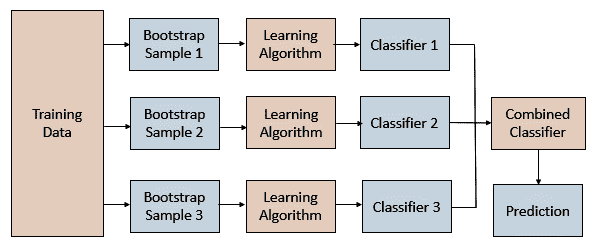

使用训练数据集**X**，我们生成 N 个 bootstrap 样本**X1**，**X2**，……，**XN**。

对于每个 bootstrap 样本，我们训练一个分类器，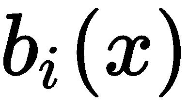。组合分类器将平均所有这些单个分类器的输出，如下所示：

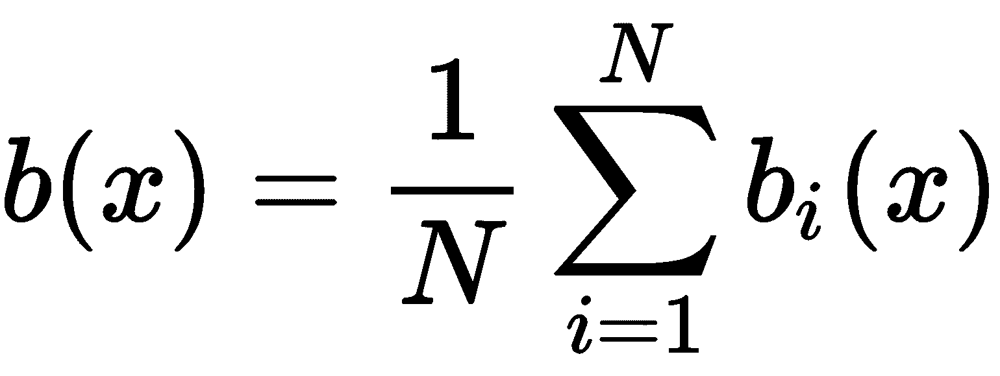

在前面的公式中，*N* 代表样本数量。

在 Bagging 分类器中，使用投票来做出最终预测。Breiman 提出的 Bagging 分类器的伪代码如下：

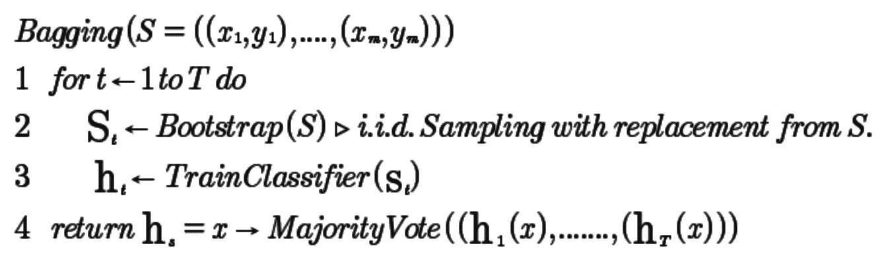

在 Bagging 回归器的情况下，最终预测是构建在每个 bootstrap 样本上的模型预测的平均值。以下伪代码描述了 Bagging 回归器：

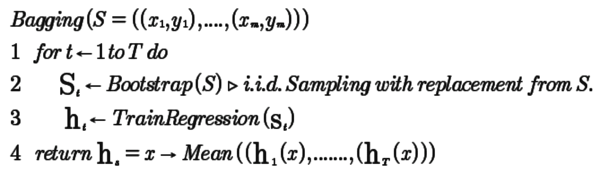

# 准备工作

我们首先导入所需的库并读取我们的文件。我们使用`warnings.filterwarnings()`函数从`warnings`库抑制任何警告：

```py
import warnings
warnings.filterwarnings('ignore')

import os
import pandas as pd
import numpy as np

from sklearn.model_selection import train_test_split
from sklearn.linear_model import SGDRegressor
from sklearn.metrics import mean_squared_error, r2_score
from sklearn.utils import resample

import matplotlib.pyplot as plt

```

我们现在已设置好工作文件夹。从 GitHub 下载`autompg.csv`文件，并将其复制到工作文件夹中，如下所示：

```py
os.chdir('.../.../Chapter 5')
os.getcwd()
```

我们使用`read_csv()`读取我们的数据，并在数据帧名称前加上`df_`前缀，以便更容易理解：

```py
df_autodata = pd.read_csv("autompg.csv")
```

我们检查数据集是否有任何缺失值，如下所示：

```py
# The below syntax returns the column names which has any missing value
columns_with_missing_values=df_autodata.columns[df_autodata.isnull().any()]

# We pass the column names with missing values to the dataframe to count the number
# of missing values
df_autodata[columns_with_missing_values].isnull().sum()
```

我们注意到`horsepower`变量有六个缺失值。我们可以使用`horsepower`变量现有值的均值来填充这些缺失值，以下代码如下：

```py
df_autodata['horsepower'].fillna(df_autodata['horsepower'].median(), inplace=True)
```

我们注意到`carname`变量是一个标识符，在我们的模型构建练习中并不有用，因此我们可以将其删除，如下所示：

```py
df_autodata.drop(['carname'], axis=1, inplace=True)
```

我们可以使用`dataframe.head()`命令查看数据：

```py
df_autodata.head()
```

# 如何做到这一点...

在本节中，我们将了解如何使用 bootstrap 样本构建模型：

1.  我们首先创建 bootstrap 样本。在第三章“重采样方法”中，我们编写了一个自定义函数`create_bootstrap_oob()`，用于创建 bootstrap 和**袋外**（**OOB**）样本。

在以下代码块中，我们看到如何创建 bootstrap 和 OOB 样本：

```py
def create_bootstrap_oob(df):
    global df_OOB
    global df_bootstrap_sample 
    # creating the bootstrap sample
    df_bootstrap_sample = resample(df, replace=True, n_samples=100)

    # creating the OOB sample 
    bootstrap_sample_index = tuple(df_bootstrap_sample.index)
    bootstrap_df = df.index.isin(bootstrap_sample_index)

    df_OOB = df[~bootstrap_df]
```

1.  我们使用 bootstrap 样本构建模型，并对所有模型的成本函数进行平均。我们在每个 bootstrap 样本上使用`SGDRegressor()`。在以下代码块中，我们重用之前编写的自定义函数`create_bootstrap_oob()`来创建 bootstrap 和 OOB 误差样本：

```py
iteration=50
mse_each_iterations = list()
lm=SGDRegressor()
total_mse=0
average_mse= list()

for i in range(iteration):
    create_bootstrap_oob(df_autodata)

    # Bootstrap sample features set
    X_BS = df_bootstrap_sample.iloc[:,1:8] 

    # bootstrap sample response variable
    Y_BS = df_bootstrap_sample.iloc[:,0] 

    X_OOB = df_OOB.iloc[:,1:8] #OOB sample features
    Y_OOB = df_OOB.iloc[:,0] #OOB sample response variable 

    # fit your model with bootstrap sample
    lm=SGDRegressor()
    lm.fit(X_BS, Y_BS)

    # test your model on out-of-bag sample 
    predictedvalues = lm.predict(X_OOB)

    # capture MSE for the predicted values against OOB actuals
    mse = mean_squared_error(Y_OOB, predictedvalues)

    # create a list of mse values
    mse_each_iterations.append(mse) 
```

1.  现在我们将绘制每个构建的模型的均方误差（MSE）：

```py
import matplotlib.pyplot as plt
f, ax= plt.subplots(figsize=(8,6))

plt.plot(mse_each_iterations, 'c--', label='MSE by Iteration')

plt.xlabel('Iterations')
plt.ylabel('Mean Squared Error')
plt.legend(loc=1)
plt.show()
```

图表将如下所示：

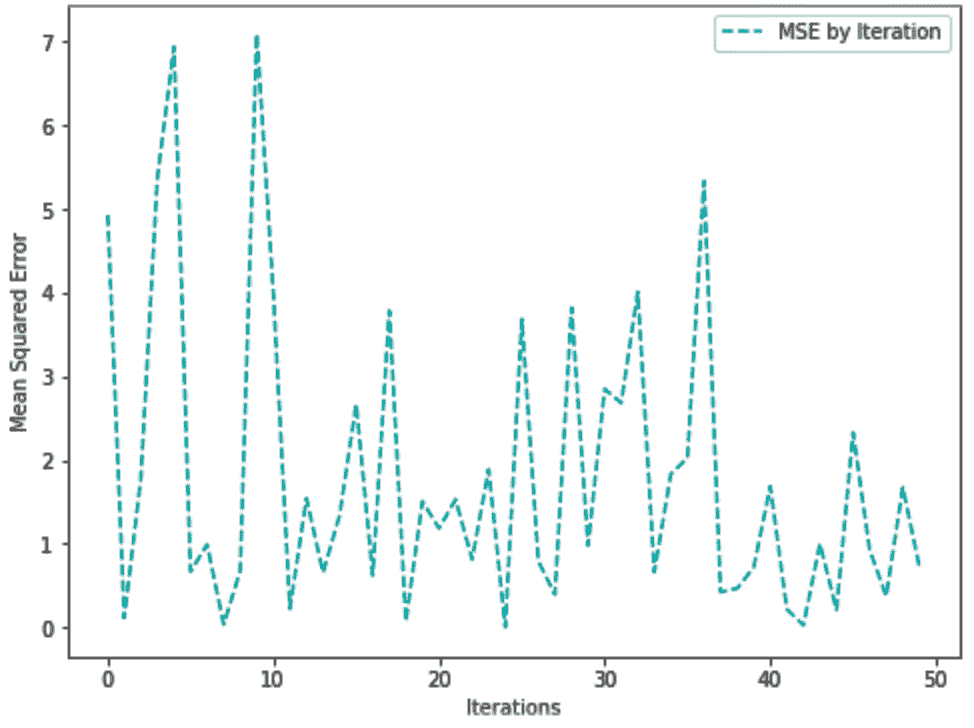

# 它是如何工作的...

在*步骤 1*中，我们执行了自定义函数代码以创建`create_bootstrap_oob()`函数，该函数为我们创建 bootstrap 和 OOB 样本。在*步骤 2*中，我们执行以下步骤：

1.  我们决定进行 50 次迭代，因此我们将`iteration`变量设置为`50`。

1.  在每次迭代中，`create_bootstrap_oob()`函数返回两个 DataFrame 对象，`df_bootstrap_sample`和`df_OOB`。

1.  我们分别使用`df_bootstrap_sample`和`df_OOB`作为我们的 bootstrap 和 OOB 样本。

1.  我们将`df_bootstrap_sample`和`df_OOB`样本分别拆分为特征集和响应变量。

1.  我们将`SGDRegressor()`拟合到我们的 bootstrap 样本以构建我们的模型。

1.  我们将 OOB 样本传递给模型以预测我们的值。

1.  我们将预测值与 OOB 样本中的响应变量进行比较。

1.  我们计算了每次迭代的 MSE。

在*步骤 3*中，我们创建了一个图表来显示直到第五十次迭代的 MSE。这个结果可能会因为随机性而有所不同。

# 参见

+   《Leo Breiman 的《Bagging Predictors》》，1994 年 9 月

# 集成元估计器

Bagging 分类器和 Bagging 回归器是集成元估计器，分别将基础分类器和回归器模型拟合到原始数据集的随机子集。每个模型的预测被组合起来以创建最终预测。这类元估计器将随机化引入模型构建过程并汇总结果。对于数值目标变量，聚合平均迭代，以实现分类结果进行多数投票。

# Bagging 分类器

Bagging 分类器在每个分类器模型上训练原始训练集的随机子集，然后汇总预测，并对分类结果进行多数投票。在下面的配方中，我们将查看一个带有自助样本的 Bagging 分类器的实现。

# 如何做...

1.  我们从`scikit-learn`库中导入`BaggingClassifier`和`DecisionTreeClassifier`。我们还按如下方式导入其他所需的库：

```py
from sklearn.ensemble import BaggingClassifier
from sklearn.tree import DecisionTreeClassifier
from sklearn.model_selection import train_test_split
```

1.  接下来，我们读取数据并查看其维度：

```py
df_winedata = pd.read_csv('winedata.csv')
df_winedata.shape
```

1.  我们将特征和响应集分开。我们还把数据分成训练集和测试集。

```py
X = df_winedata.iloc[:,1:14]
Y = df_winedata.iloc[:,0]

X_train, X_test, Y_train, Y_test = train_test_split(X, Y, random_state=1)
```

1.  我们创建一个`DecisionTreeClassifier`类的实例，并将其传递给`BaggingClassifier()`：

```py
dt_model = DecisionTreeClassifier(criterion='entropy')
bag_dt_model = BaggingClassifier(dt_model, max_features=1.0, n_estimators=5, \
                                 random_state=1, bootstrap=True)
```

注意，在先前的代码块中，我们已声明`bootstrap=True`。这是默认值，表示以替换方式抽取样本。

1.  我们将模型拟合到训练数据如下：

```py
bag_dt_model.fit(X_train, Y_train)
```

1.  我们可以看到将测试数据传递给模型后的得分：

```py
bag_dt_model.score(X_test, Y_test)
```

1.  我们使用`predict`函数如下预测响应变量：

```py
predictedvalues = bag_dt_model.predict(X_test)
```

1.  我们现在将使用代码来绘制混淆矩阵。请注意，此代码已从[scikit-learn.org](https://scikit-learn.org/stable/)获取。我们执行以下代码以创建`plot_confusion_matrix()`函数：

```py
# code from 
# http://scikit-learn.org/stable/auto_examples/model_selection/plot_confusion_matrix.html
def plot_confusion_matrix(cm, classes,
                          normalize=False,
                          title='Confusion matrix',
                          cmap=plt.cm.Blues):
    """
    This function prints and plots the confusion matrix.
    """
    plt.imshow(cm, interpolation='nearest', cmap=cmap)
    plt.title(title)
    plt.colorbar()
    tick_marks = np.arange(len(classes))
    plt.xticks(tick_marks, classes, rotation=45)
    plt.yticks(tick_marks, classes)

    thresh = cm.max() / 2.
    for i, j in itertools.product(range(cm.shape[0]), range(cm.shape[1])):
        plt.text(j, i, cm[i, j],
                 horizontalalignment="center",
                 color="white" if cm[i, j] > thresh else "black")

    plt.tight_layout()
    plt.ylabel('Actuals')
    plt.xlabel('Predicted')
```

1.  我们使用前面的`plot_confusion_matrix()`函数来绘制我们的混淆矩阵：

```py
# This variable holds the class labels of our target variable
target_names = [ '1', '2', '3']

import itertools
from sklearn.metrics import confusion_matrix

# Constructing the Confusion Matrix
cm = confusion_matrix(Y_test, predictedvalues)

# Plotting the confusion matrix
plt.figure(figsize=(3,3))
plot_confusion_matrix(cm, classes=target_names, normalize=False)
plt.show()
```

混淆矩阵图如下所示：

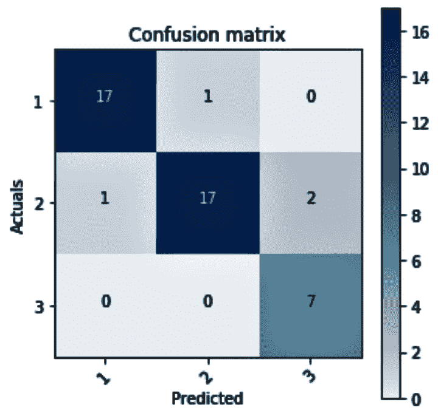

# 它是如何工作的...

在*步骤 1*中，我们导入了所需的库，使用 Bagging 分类器构建我们的决策树分类器模型。在*步骤 2*中，我们读取了我们的数据集，它是`winedata.csv`。在*步骤 3*中，我们分离了特征集和目标变量。我们还把数据分成训练集和测试集。在*步骤 4*中，我们创建了一个决策树分类器模型，并将其传递给`BaggingClassifier()`。在`DecisionTreeClassifier()`中，`criterion`参数的默认值是`gini`，但我们将其更改为`entropy`。然后我们将我们的决策树模型传递给`BaggingClassfier()`。在`BaggingClassfier()`中，我们有包括`n_estimators`和`bootstrap`在内的参数。`n_estimators`是集成中基础估计器的数量，默认值为`10`。`bootstrap`参数指示是否用替换方式抽取样本，默认设置为`True`。

在*步骤 5*和*步骤 6*中，我们将模型拟合到训练数据，并查看测试集的分数。在*步骤 7*中，我们调用了`predict()`方法并传递了测试特征集。在*步骤 8*中，我们添加了来自[`scikit-learn.org`](http://scikit-learn.org)的`plot_confusion_matrix()`的代码，它将混淆矩阵作为其输入参数之一，并绘制混淆矩阵。在*步骤 9*中，我们通过传递混淆矩阵来调用`plot_confusion_matrix()`函数以生成混淆矩阵图。

# 还有更多...

我们还可以使用来自`sklearn.model_selection`的`GridSearchCV()`来进行网格搜索最佳参数，并在`BaggingClassifier`中使用它们：

1.  首先，我们导入所需的库：

```py
from sklearn.model_selection import GridSearchCV
```

1.  然后，我们设置我们的参数值：

```py
param_values = {'n_estimators': [10, 20, 25, 30], 'base_estimator__max_leaf_nodes':[5, 10, 15, 20], 'base_estimator__max_depth':[3, 4, 5]}
```

1.  我们实例化`DecisionTreeClassifier`类，并将其传递给`BaggingClassifier()`函数。请注意，我们将`oob_score`设置为`True`以评估基于 OOB 样本构建的模型：

```py
dt_model = DecisionTreeClassifier()
bag_dt_model_grid = BaggingClassifier(base_estimator=dt_model, oob_score=True, random_state=1) 
```

1.  我们使用`GridSearchCV()`来确定最佳参数：

```py
bc_grid = GridSearchCV(estimator=bag_dt_model_grid, param_grid=param_values, cv=20, n_jobs=-1)
bc_grid.fit(X_train, Y_train)
best_params = bc_grid.best_params_
print(best_params)
```

前面的代码返回了最佳参数：

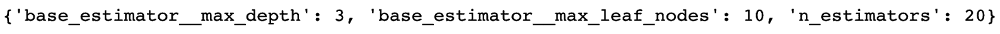

1.  现在，我们取`bc_grid.bestparams`返回的值，并使用`BaggingClassfier()`函数重新构建我们的决策树模型。我们将`max_leaf_nodes`设置为`10`，`max_depth`设置为`3`，`n_estimators`设置为`20`：

```py
best_dt_model = DecisionTreeClassifier(criterion='entropy', max_leaf_nodes=10, max_depth=3) 
final_bag_dt_model = BaggingClassifier(base_estimator=best_dt_model, n_estimators=150, bootstrap=True, random_state=1, oob_score=True)
```

在前面的代码块中，我们将`n_estimators`设置为`150`。`n_estimators`参数表示我们想要构建的树的数量。我们将最终模型拟合到我们的训练数据，并使用我们的测试特征集进行预测。

1.  然后，我们可以在以下代码块中查看我们的 OOB 样本的准确率：

```py
final_bag_dt_model.fit(X_train, Y_train)
bag_predictedvalues = final_bag_dt_model.predict(X_test)

# See the OOB accuracy
acc_oob = final_bag_dt_model.oob_score_
print(acc_oob)
```

如果我们绘制混淆矩阵，我们可以看到我们在错误分类的数量上有所改进。在早期示例中，有两个类 2 的实例被错误地预测为类 3，但现在我们可以看到错误分类的数量减少到了一个：

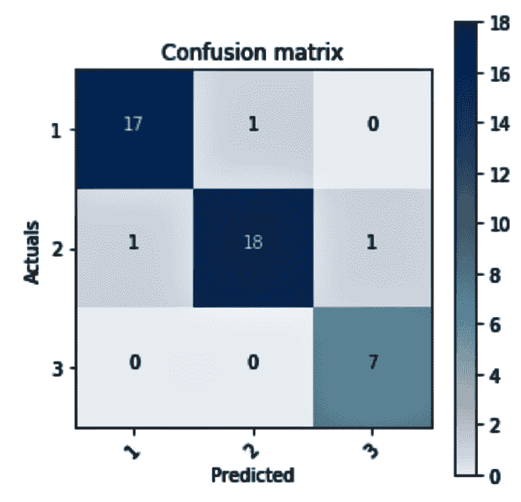

# 参考内容

+   scikit-learn 关于 Bagging 分类器的指南：[`bit.ly/2zaq8lS`](https://bit.ly/2zaq8lS)

# Bagging 回归器

Bagging 回归器与 Bagging 分类器类似。它们在每个回归器模型上训练原始训练集的随机子集，并汇总预测。然后，由于目标变量是数值的，因此汇总平均在迭代中。在下面的配方中，我们将展示使用自助样本实现的 Bagging 回归器的实现。

# 准备工作

我们将分别从`sklearn.ensemble`和`sklearn.tree`导入所需的库`BaggingRegressor`和`DecisionTreeRegressor`：

```py
from sklearn.ensemble import BaggingRegressor
from sklearn.tree import DecisionTreeRegressor
```

我们读取数据集，它是`bostonhousing.csv`，并查看 DataFrame 的维度：

```py
df_housingdata = pd.read_csv('bostonhousing.csv')
df_housingdata.shape
```

现在，我们继续创建我们的特征集和目标变量集。

# 如何实现...

1.  我们首先将特征集和响应集分开。在下面的代码块中，我们还将数据分为训练集和测试集：

```py
X = df_housingdata.iloc[:,1:14]
Y = df_housingdata.iloc[:,-1]

X_train, X_test, Y_train, Y_test = train_test_split(X, Y, random_state=1)
```

1.  然后，我们将创建一个`DecisionTreeClassifier`类的实例并将其传递给`BaggingClassifier()`函数：

```py
dt_model = DecisionTreeRegressor()
bag_dt_model = BaggingRegressor(dt_model, max_features=1.0, n_estimators=5, bootstrap=True, random_state=1, )
```

1.  我们将按照以下方式将我们的模型拟合到训练数据集：

```py
bag_dt_model.fit(X_train, Y_train)
```

1.  我们可以在以下代码块中看到模型得分：

```py
bag_dt_model.score(X_test, Y_test)
```

1.  我们使用`predict()`函数并将测试数据集传递给它来预测我们的目标变量，如下所示：

```py
predictedvalues = bag_dt_model.predict(X_test)
```

1.  我们使用以下代码绘制了我们的实际值和目标变量的预测值的散点图：

```py
#We can plot the actuals and the predicted values 
plt.figure(figsize=(4, 4))
plt.scatter(Y_test, predictedvalues)
plt.xlabel('Actual')
plt.ylabel('Predicted')
plt.tight_layout()
```

执行前面的代码给出了以下散点图：

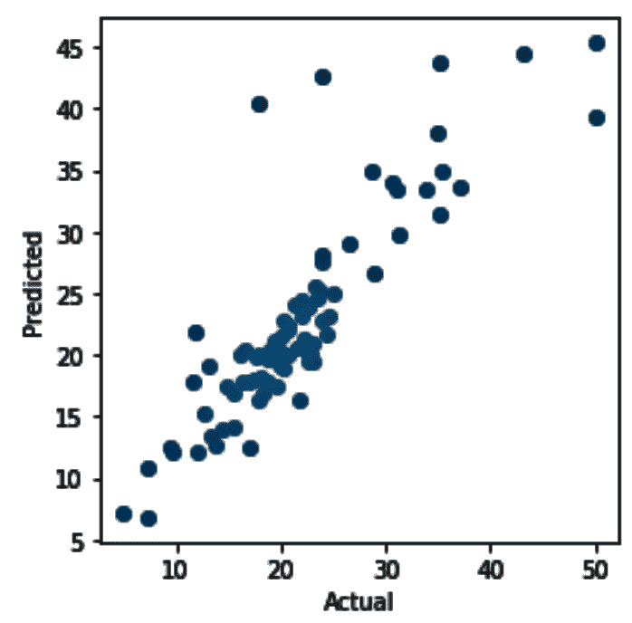

`matplotlib.pyplot.tight_layout()`自动调整子图参数以创建指定的填充。

1.  在以下代码中，我们将`n_estimators`参数更改为 30，并重新执行从**步骤 3**到**步骤 6**的步骤：

```py
bag_dt_model = BaggingRegressor(dt_model, max_features=1.0, n_estimators=30, bootstrap=True, random_state=1, )
```

这给出了以下得分：

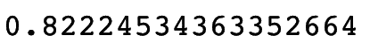

1.  实际值与预测值的图表如下。这表明，与我们将`n_estimator`参数的值从`5`改为`30`的前一个案例相比，预测值更加准确：

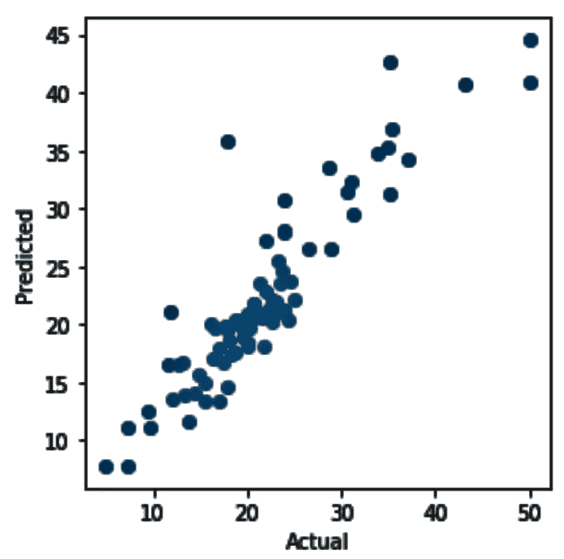

# 它是如何工作的...

在**步骤 1**中，我们将特征和目标变量集分开。我们还把我们的数据分成训练集和测试集。在**步骤 2**中，我们创建了一个决策树回归器模型并将其传递给`BaggingRegressor()`函数。请注意，我们还向`BaggingRegressor()`函数传递了`n_estimator=5`参数。如前所述，`n_estimator`是我们希望算法构建的森林中树的数量。在**步骤 3**中，我们训练了我们的模型。

在**步骤 4**中，我们查看了模型得分，为 0.71。在**步骤 5**中，我们使用`predict()`函数预测测试子集中的目标变量。之后，在**步骤 6**中，我们绘制了一个散点图来探索实际目标值和预测目标值之间的关系。

在**步骤 7**中，我们将`n_estimator`参数的值从`5`改为`30`并重新构建了我们的模型。这次，我们注意到模型得分提高到了 0.82。在**步骤 8**中，我们绘制了实际值和预测值，并发现实际值和预测值之间的相关性比我们之前使用`n_estimators=5`的模型要好得多。

# 参见

+   scikit-learn 关于袋回归器的指南：[`bit.ly/2pZFmUh`](https://bit.ly/2pZFmUh)

+   单个估计器与袋装：[`bit.ly/2q08db6`](https://bit.ly/2q08db6)
