# 当有疑问时，使用随机森林

在本章中，我们将涵盖以下食谱：

+   随机森林简介

+   使用 scikit-learn 实现随机森林以预测信用卡违约

+   使用 H2O 实现预测信用卡违约的随机森林

# 随机森林简介

随机森林是一种基于集成学习的监督机器学习算法，用于回归和分类问题。随机森林背后的基本思想是构建多个决策树并将它们聚合以获得准确的结果。决策树是一种确定性算法，这意味着如果给定的相同数据，每次都会产生相同的树。它们有过度拟合的倾向，因为它们使用给定数据构建最佳树，但在提供未见数据时可能无法泛化。构成随机森林的所有决策树都是不同的，因为我们使用不同的随机子集构建每棵树。随机森林通常比单个决策树更准确，因为它最小化了过度拟合。

以下图表展示了从源样本中进行的引导采样。在每个样本上构建模型，然后将预测组合起来以得出最终结果：

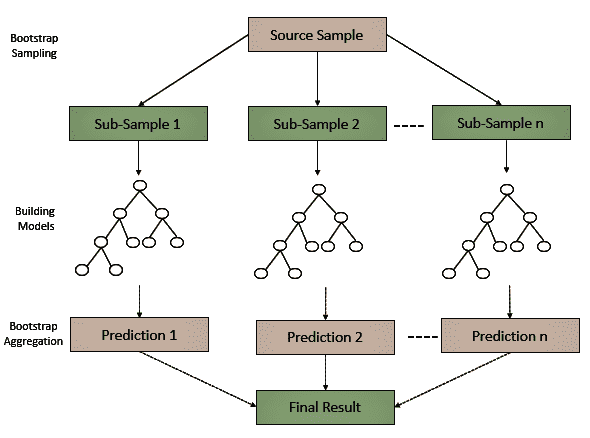

随机森林中的每棵树都是按照以下步骤构建的，其中 A 代表整个森林，a 代表单个树，对于 *a = 1* 到 *A*：

1.  使用替换方法创建一个从 *x*，*y* 标签的 *X[a]*[, ]*Y[a]* 训练的引导样本，*D* 训练

1.  在 *X[a]*，*Y[a]* 上训练树 *f[a]*

1.  取平均值或进行多数投票以得出最终预测

在回归问题中，通过取所有树做出的预测的平均值来对测试实例进行预测。这可以表示如下：

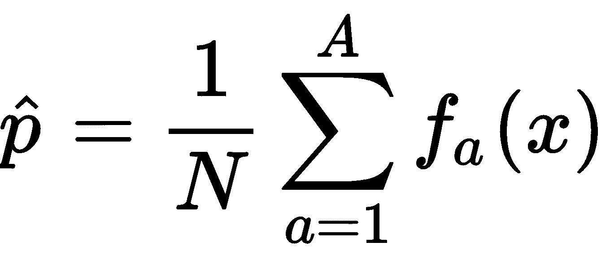

在这里，*N* 是随机森林中树的总数。*a=1* 代表森林中的第一棵树，而森林中的最后一棵树是 *A*。(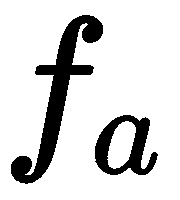()) 代表单个树的预测。

如果我们有一个分类问题，则使用多数投票或最常见的答案。

# 使用 scikit-learn 实现预测信用卡违约的随机森林

scikit-learn 库通过提供两个估计器实现随机森林：`RandomForestClassifier` 和 `RandomForestRegressor`。它们接受各种参数，其中一些如下所述：

+   ` n_estimators`：此参数是算法在采取最大投票或平均预测之前构建的树的数量。一般来说，树的数量越多，性能和预测的准确性越好，但这也意味着计算成本更高。

+   `max_features`: 此参数是随机森林允许在单个树中尝试的最大特征数。

+   `min_sample_leaf`: 此参数决定了分割内部节点所需的最小叶子数。

+   `n_jobs`: 此超参数告诉引擎在拟合模型和预测新实例时并行运行多少个作业。如果它的值为 `None` 或 `1`，则只运行一个作业。`-1` 的值意味着它将使用所有处理器。

+   `random_state`: 此参数将在 `random_state` 有确定的值时始终产生相同的结果，并且如果它已经给出了相同的超参数和相同的训练数据。

+   `oob_score`: 此参数也称为 **袋外抽样**，是一种随机森林交叉验证方法。在此抽样方法中，大约三分之一的 数据未用于训练模型，可用于评估其性能。这些样本称为 **袋外样本**。

# 准备工作

在这个例子中，我们使用了来自 UCI ML 存储库的信用卡违约数据集。此数据集包含以下信息：

+   违约支付

+   人口统计因素

+   信用数据

+   付款历史

+   信用卡客户的账单

数据和数据描述提供在 GitHub 文件夹中：

我们将首先加载所需的库并读取我们的数据集：

```py
import os
import numpy as np
import pandas as pd
import matplotlib.pyplot as plt
%matplotlib inline
import seaborn as sns
```

我们将工作文件夹设置为以下内容：

```py
# Set your working directory according to your requirement
os.chdir(".../Chapter 6/Random Forest")
os.getcwd()
```

让我们现在读取我们的数据。我们将 `DataFrame` 名称前缀为 `df_`，这样我们就可以轻松理解它：

```py
df_creditcarddata = pd.read_csv("UCI_Credit_Card.csv")
```

我们检查数据集的形状：

```py
df_creditcarddata.shape
```

我们检查数据类型：

```py
df_creditcarddata.dtypes
```

我们删除了 `ID` 列，因为这不是必需的：

```py
df_creditcarddata = df_creditcarddata.drop("ID", axis= 1) 
```

我们可以用各种方式探索我们的数据。让我们看看几种不同的方法：

```py
selected_columns = df_creditcarddata[['AGE','BILL_AMT1','BILL_AMT2','BILL_AMT3','BILL_AMT4','BILL_AMT5','BILL_AMT6', 'LIMIT_BAL']]

selected_columns.hist(figsize=(16, 20), bins=50, xlabelsize=8, ylabelsize=8);
```

注意，在前面的代码块中，我们使用了分号。分号有助于隐藏 Matplotlib 生成的冗长信息。`xlabelsize` 和 `ylabelsize` 用于调整 x 轴和 y 轴的字体大小。

以下图表显示了数值变量的分布：

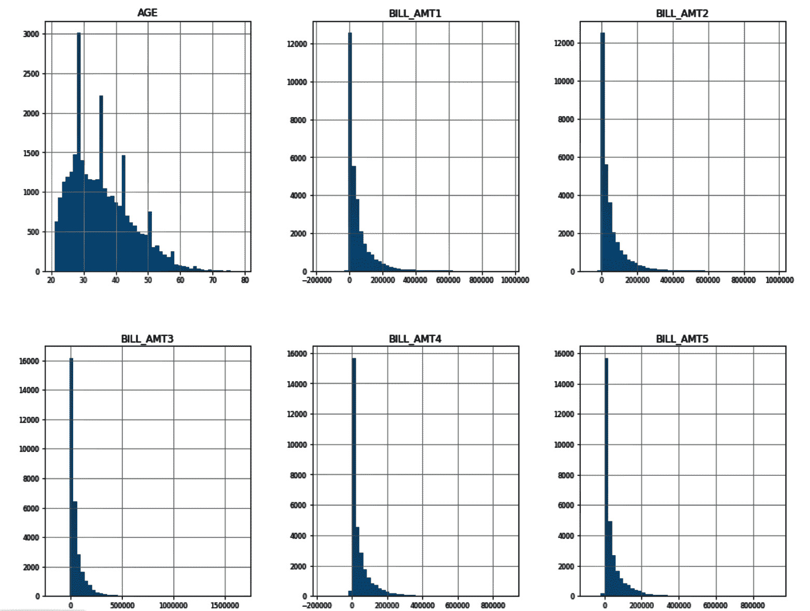

现在，我们将按年龄组探索支付违约情况。我们将 `age` 变量分桶，并将分桶的值存储在 `df_creditcarddata` 中的新变量 `age_group` 中：

```py
df_creditcarddata['agegroup'] = pd.cut(df_creditcarddata['AGE'], range(0, 100, 10), right=False)
df_creditcarddata.head()
```

然后，我们使用新的 `age_group` 变量来绘制每个年龄组的违约数量：

```py
# Default vs Age
pd.crosstab(df_creditcarddata.age_group, \
           df_creditcarddata["default.payment.next.month"]).plot(kind='bar',stacked=False, grid=True) 

plt.title('Count of Defaults by AGE')
plt.xlabel('AGE')
plt.ylabel('# of Default')
plt.legend(loc='upper left')
```

以下截图显示了每个年龄的违约金额：

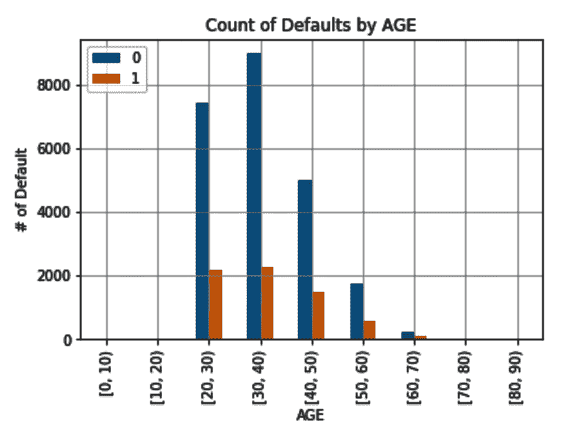

由于我们不再需要它，我们可以从 `df_creditcarddata` 中删除 `age_group` 变量：

```py
df_creditcarddata = df_creditcarddata.drop(columns = ['age_group'])
df_creditcarddata.head()
```

现在，我们将根据账户持有者的信用额度查看支付违约情况：

```py
fig_facetgrid = sns.FacetGrid(df_creditcarddata, hue='default.payment.next.month', aspect=4)
fig_facetgrid.map(sns.kdeplot, 'LIMIT_BAL', shade=True)
max_limit_bal = df_creditcarddata['LIMIT_BAL'].max()
fig_facetgrid.set(xlim=(0,max_limit_bal));
fig_facetgrid.set(ylim=(0.0,0.000007));
fig_facetgrid.set(title='Distribution of limit balance by default.payment')
fig_facetgrid.add_legend()
```

上述代码给出了以下图表：

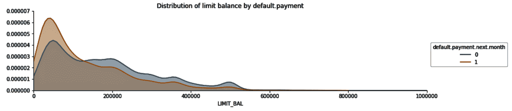

我们还可以为一些变量分配标签以使解释更好。我们为 `Gender`、`Marriage` 和 `Education` 变量分配标签。

我们还将`pay`变量的数据类型更改为字符串：

```py
GenderMap = {2:'female', 1:'male'}
MarriageMap = {1:'married', 2:'single', 3:'other', 0: 'other'}
EducationMap = {1:'graduate school', 2:'university', 3:'high school', 4:'others', 5:'unknown', 6:'unknown', 0:'unknown'}

df_creditcarddata['SEX'] = df_creditcarddata.SEX.map(GenderMap)
df_creditcarddata['MARRIAGE'] = df_creditcarddata.MARRIAGE.map(MarriageMap) 
df_creditcarddata['EDUCATION'] = df_creditcarddata.EDUCATION.map(EducationMap)
df_creditcarddata['PAY_0'] = df_creditcarddata['PAY_0'].astype(str) 
df_creditcarddata['PAY_2'] = df_creditcarddata['PAY_2'].astype(str) 
df_creditcarddata['PAY_3'] = df_creditcarddata['PAY_3'].astype(str) 
df_creditcarddata['PAY_4'] = df_creditcarddata['PAY_4'].astype(str) 
df_creditcarddata['PAY_5'] = df_creditcarddata['PAY_5'].astype(str) 
df_creditcarddata['PAY_6'] = df_creditcarddata['PAY_6'].astype(str) 
```

在本书提供的代码包中还有更多的探索。我们现在继续训练我们的随机森林模型。

# 如何做到这一点...

现在我们将探讨如何使用随机森林来训练我们的模型：

1.  我们首先将目标和特征变量分开：

```py
predictor= df_creditcarddata.iloc[:, df_creditcarddata.columns != 'default.payment.next.month']
target= df_creditcarddata.iloc[:, df_creditcarddata.columns == 'default.payment.next.month']
```

1.  我们在我们的特征集中将数值变量和非数值变量分开：

```py
# save all categorical columns in list
categorical_columns = [col for col in predictor.columns.values if predictor[col].dtype == 'object']

# dataframe with categorical features
df_categorical = predictor[categorical_columns]

# dataframe with numerical features
df_numeric = predictor.drop(categorical_columns, axis=1)
```

1.  我们对分类变量进行虚拟编码：

```py
dummy_code_cat_vars = pd.get_dummies(df_categorical,drop_first=True)
```

1.  我们将虚拟编码变量连接到我们的 DataFrame：

```py
df_predictor = pd.concat([df_numeric, dummy_code_cat_vars], axis=1)
df_predictor.head()
```

1.  我们将数据集分为训练集和测试集：

```py
from sklearn.model_selection import train_test_split
X_train,X_test, y_train, y_test = train_test_split(df_predictor, target, test_size = 0.30, random_state=0)
print("x_train ",X_train.shape)
print("x_test ",X_test.shape)
print("y_train ",y_train.shape)
print("y_test ",y_test.shape)
```

1.  我们使用`StandardScaler()`对特征进行缩放：

```py
from sklearn.preprocessing import StandardScaler
scaler = StandardScaler()
```

1.  我们可能会注意到列名已被更改为数字。我们将列名和索引值赋回缩放后的 DataFrame：

```py
X_train_scaled.columns = X_train.columns.values
X_test_scaled.columns = X_test.columns.values
X_train_scaled.index = X_train.index.values
X_test_scaled.index = X_test.index.values

X_train = X_train_scaled
X_test = X_test_scaled
```

1.  我们从`sklearn.ensemble`导入`RandomForestClassifier()`。然后我们将构建我们的随机森林分类器模型：

```py
from sklearn.ensemble import RandomForestClassifier

classifier = RandomForestClassifier(random_state = 0, n_estimators = 100,\
 criterion = 'entropy', max_leaf_nodes= 20,oob_score = True, n_jobs = -1 )

# fit the model
model_RF = classifier.fit(X_train, y_train)
```

1.  之后，我们计算训练模型的准确率：

```py
acc_random_forest = round(classifier.score(X_train, y_train) * 100, 2)
print(round(acc_random_forest,2,), "%")
```

1.  通过将`y_test`和`y_pred_proba`传递给`roc_curve()`，我们得到**假阳性率**（**FPR**）和**真阳性率**（**TPR**）。我们还可以使用`roc_auc_score()`得到`auc`值。使用 FPR、TPR 和 AUC 值，我们在图表上绘制 ROC 曲线，并在图表上标注 AUC 值：

```py
from sklearn import metrics

y_pred_proba = model_RF.predict_proba(X_test)[::,1]
fpr, tpr, _ = metrics.roc_curve(y_test, y_pred_proba)
auc = metrics.roc_auc_score(y_test, y_pred_proba)
plt.plot(fpr,tpr,label="AUC="+str(auc))
plt.legend(loc=4)
plt.show()
```

以下图表显示了带有标注 AUC 值的 ROC 曲线：

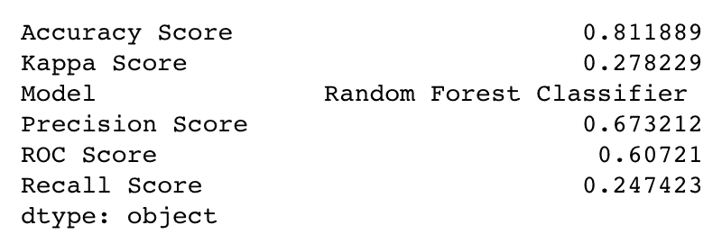

1.  我们还可以评估其他分数，如下所示：

```py
# predict the model
y_pred_RF = model_RF.predict(X_test)

# evaluate other scores
evaluation_scores = pd.Series({'Model': " Random Forest Classifier ",
'ROC Score' : metrics.roc_auc_score(y_test, y_pred_RF),
'Precision Score': metrics.precision_score(y_test, y_pred_RF),
'Recall Score': metrics.recall_score(y_test, y_pred_RF),
'Accuracy Score': metrics.accuracy_score(y_test, y_pred_RF),
'Kappa Score':metrics.cohen_kappa_score(y_test, y_pred_RF)})

print(evaluation_scores)
```

上述代码产生了以下评估分数：


1.  我们还可以根据目标变量的类别评估一些统计信息，在这种情况下是`0`或`1`：

```py
from sklearn.metrics import classification_report
print(classification_report(y_test, y_pred_RF))
```

`sklearn.metrics`中的`classification_report`根据目标变量的每个类别给出以下分数：

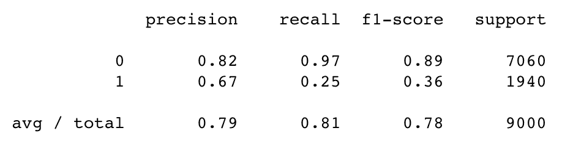

1.  我们可以通过特征重要性绘制前 10 个变量，以查看哪些变量对模型很重要：

```py
feature_importances = pd.Series(classifier.feature_importances_, index=X_train.columns)
feature_importances.nlargest(10).plot(kind='barh') #top 10 features
```

以下截图显示了前 10 个变量及其相对重要性：

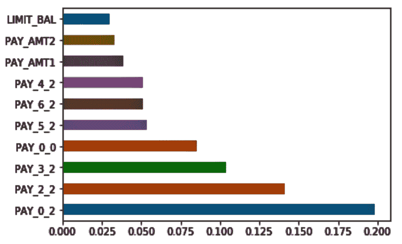

我们可以更改超参数以查看模型如何表现更好。我们还可以对超参数值的组合进行网格搜索以微调我们的模型。

# 它是如何工作的...

在*步骤 1*中，我们将目标和特征变量分开。在*步骤 2*中，在我们的特征集中，我们将数值变量和非数值变量分开。在*步骤 3*和*步骤 4*中，我们将非数值变量转换为虚拟编码变量，并将它们添加回 DataFrame。在*步骤 5*中，我们将数据集分为训练集和测试集，在*步骤 6*中，我们从`sklearn.preprocessing`导入`StandardScaler()`并将相同的缩放应用于我们的特征。

执行**步骤 6**中的命令后，我们注意到列名已更改为顺序号。因此，在**步骤 7**中，我们将列名和索引值重新分配给缩放后的 DataFrame。在**步骤 8**中，我们从`sklearn.ensemble`中导入`RandomForestClassifier()`并构建了我们第一个随机森林分类器模型。之后，在**步骤 9**和**步骤 10**中，我们使用我们的模型计算训练模型的准确度并绘制 ROC 曲线。我们还用 AUC 值标注了 ROC 曲线。

在**步骤 11**中，我们评估了其他分数，包括 kappa 值、精确度、召回率和准确度。

在**步骤 12**中，我们也根据目标变量的每个类别（在这种情况下是`0`或`1`）使用`sklearn.metrics`中的`classification_report`对这些分数进行了评估。在那里，`classification_report()`为我们提供了每个类别的精确度、召回率和 f1 分数等指标，以及每个指标的均值。

`classification_report()`报告平均值，包括平均总真实阳性、假阴性、假阳性，平均每个标签的无权均值，以及平均每个标签的支持加权均值。它还报告多标签分类的样本平均值。

最后，在**步骤 13**中，我们研究了前 10 个特征的相对变量重要性。这有助于在特征选择中构建具有正确特征的模型。

有各种特征选择方法可用，例如平均变量重要性、Boruta、递归特征选择以及使用 RF 进行变量选择。

# 还有更多...

隔离森林是另一种基于决策树的算法，用于异常值和异常检测。该算法基于异常数据点稀少的假设。

该算法的工作方式与随机森林略有不同。它创建了一组决策树，然后计算在树中隔离一个观察所需的路径长度。其想法是孤立观察值或异常值更容易分离，因为区分它们与正常情况所需的条件较少。因此，异常值将比正常观察值有更短的路径，并且因此将更靠近树的根部。当创建了多个决策树时，分数会被平均，这让我们对哪些观察值真正是异常值有一个很好的了解。因此，隔离森林被用于异常值和异常检测。

此外，隔离森林不利用任何距离或密度度量来检测异常。与基于距离和密度的方法相比，这显著降低了计算成本。

在 scikit-learn 中，`sklearn.ensemble.IsolationForest`提供了隔离森林算法的实现。

# 参见

+   隔离森林算法的 scikit-learn 实现可以在这里找到：[`bit.ly/2DCjGGF`](https://bit.ly/2DCjGGF)

# 使用 H2O 实现预测信用卡违约的随机森林

H2O 是一个开源的分布式机器学习平台，允许您在大型数据集上构建机器学习模型。H2O 支持监督和非监督算法，并且非常快速、可扩展且易于实现。H2O 的 REST API 允许我们从外部程序（如 R 和 Python）访问其所有功能。在编写本书时，H2O 的最新版本是 H2O v3。

H2O 将闪电般的机器学习带给企业的原因如下所述：

"H2O 的核心代码是用 Java 编写的。在 H2O 中，使用分布式键/值存储来访问和引用数据、模型、对象等，跨越所有节点和机器。算法是在 H2O 的分布式 Map/Reduce 框架上实现的，并利用 Java fork/join 框架进行多线程处理。数据并行读取并分布在整个集群中，以压缩的列格式存储在内存中。H2O 的数据解析器具有内置的智能来猜测传入数据集的模式，并支持从多种格式的多个来源进行数据摄取"

- 来自 h2o.ai

H2O 为我们提供了分布式随机森林，这是一种用于分类和回归任务的有力工具。它生成多个树，而不是单个树。在分布式随机森林中，我们使用分类和回归模型的平均预测来得出最终结果。

# 准备工作

Java 对于 H2O 运行是绝对必要的。请确保您已安装 Java，并在 Jupyter 中使用以下命令：

```py
! apt-get install default-jre
! java -version
```

现在，您需要安装 H2O。要从 Jupyter 安装，请使用以下命令：

```py
! pip install h2o
```

导入所需的库：

```py
import h2o
import seaborn as sns
import numpy as np
import pandas as pd
import seaborn
import matplotlib.pyplot as plt
%matplotlib inline

from h2o.estimators.random_forest import H2ORandomForestEstimator
from sklearn import metrics
```

要使用 H2O，我们需要初始化一个实例并将其连接。我们可以这样做：

```py
h2o.init()
```

默认情况下，前面的命令会尝试连接到一个实例。如果它无法这样做，它将尝试启动一个实例然后连接到它。一旦连接到实例，我们将看到该实例的详细信息，如下所示：

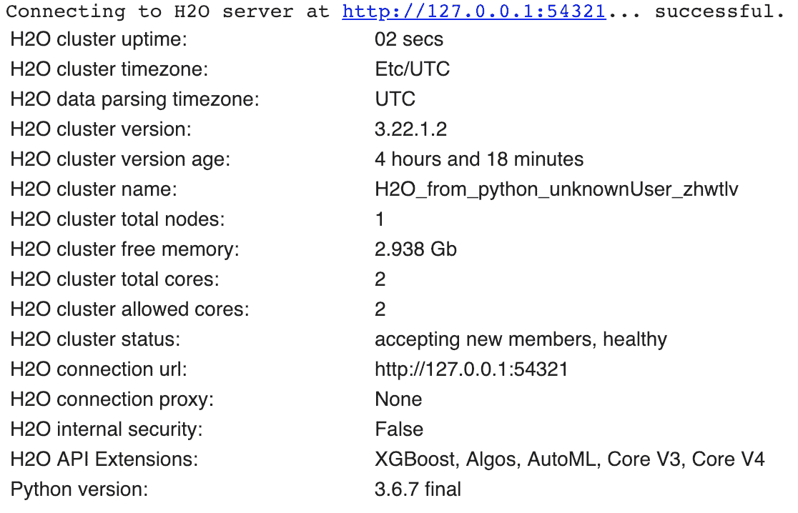

我们将数据读入一个 `pandas` DataFrame：

```py
df_creditcarddata = pd.read_csv("UCI_Credit_Card.csv")
```

我们使用 `h2o.H2OFrame()` 将我们的 `pandas` DataFrame 转换为 H2O DataFrame。我们将 `df_creditcarddata` H2O DataFrame 命名：

```py
hf_creditcarddata = h2o.H2OFrame(df_creditcarddata)
```

检查 H2O DataFrame 中的数据是否已正确加载，如下所示：

```py
hf_creditcarddata.head()
```

我们可以使用 `describe()` 方法查看摘要统计信息：

```py
hf_creditcarddata.describe()
```

我们删除 ID 列，因为这对于我们的模型构建练习不是必需的：

```py
hf_creditcarddata = hf_creditcarddata.drop(["ID"], axis = 1) 
```

我们现在将进入探索数据和构建模型的过程。

# 如何做到这一点...

在上一节中，我们对数据进行了各种探索。我们可以探索数据的方式没有限制。在本节中，我们将探讨一些更多技术：

1.  我们检查每个特征变量与目标变量的相关性：

```py
df_creditcarddata.drop(['default.payment.next.month'], \
     axis = 1).corrwith(df_creditcarddata['default.payment.next.month']).\
     plot.bar(figsize=(20,10), \
     title = 'Correlation with Response variable', \
     fontsize = 15, rot = 45, grid = True)
```

下面的图显示了每个特征与目标变量的相关性：

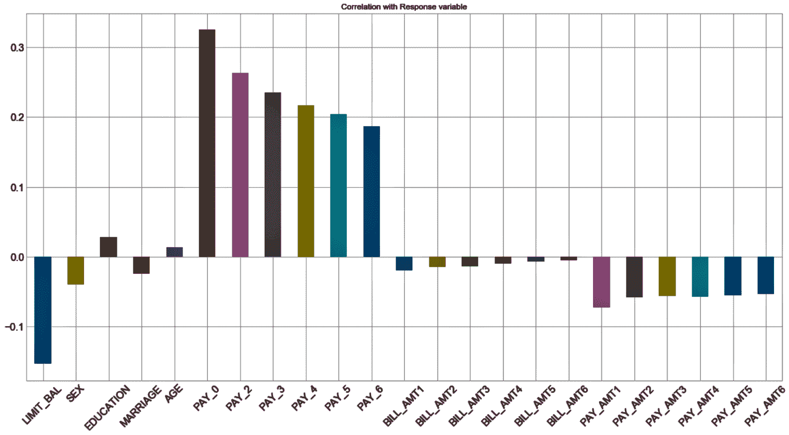

1.  我们检查 H2O DataFrame 中的数据类型。注意，对于`pandas` DataFrame，我们使用了`dtypes`。对于 H2O DataFrame，我们使用`types`：

```py
hf_creditcarddata.types
```

1.  我们注意到它们都是整型数据类型。我们将它们转换为因子类型，这是分类性质的：

```py
hf_creditcarddata['SEX'] = hf_creditcarddata['SEX'].asfactor()
hf_creditcarddata['EDUCATION'] = hf_creditcarddata['EDUCATION'].asfactor()
hf_creditcarddata['MARRIAGE'] = hf_creditcarddata['MARRIAGE'].asfactor()
hf_creditcarddata['PAY_0'] = hf_creditcarddata['PAY_0'].asfactor()
hf_creditcarddata['PAY_2'] = hf_creditcarddata['PAY_2'].asfactor()
hf_creditcarddata['PAY_3'] = hf_creditcarddata['PAY_3'].asfactor()
hf_creditcarddata['PAY_4'] = hf_creditcarddata['PAY_4'].asfactor()
hf_creditcarddata['PAY_5'] = hf_creditcarddata['PAY_5'].asfactor()
hf_creditcarddata['PAY_6'] = hf_creditcarddata['PAY_6'].asfactor()
```

我们可以使用`hf_creditcarddata.types`来检查数据类型，以查看数据类型转换是否已发生。

1.  我们将二进制目标变量编码为因子类型变量：

```py
hf_creditcarddata['default.payment.next.month'] = \
             hf_creditcarddata['default.payment.next.month'].asfactor() 
hf_creditcarddata['default.payment.next.month'].levels() 
```

1.  我们选择特征和`target`变量：

```py
predictors = ['LIMIT_BAL','SEX','EDUCATION','MARRIAGE','AGE','PAY_0','PAY_2','PAY_3','PAY_4','PAY_5','PAY_6','BILL_AMT1','BILL_AMT2','BILL_AMT3','BILL_AMT4','BILL_AMT5','BILL_AMT6','PAY_AMT1','PAY_AMT2','PAY_AMT3','PAY_AMT4','PAY_AMT5','PAY_AMT6']

target = 'default.payment.next.month'
```

1.  现在，我们将 H2O DataFrame 拆分为训练集和测试集。我们使用 70%的数据来训练模型，剩余的 30%用于验证：

```py
splits = hf_creditcarddata.split_frame(ratios=[0.7], seed=123) 
train = splits[0]
test = splits[1] 
```

1.  我们使用默认设置构建了随机森林模型。您可以使用以下命令检查测试数据上的模型性能：

```py
from h2o.estimators.random_forest import H2ORandomForestEstimator

RF_D = H2ORandomForestEstimator(model_id = 'RF_D',seed = 123)
RF_D.train(x = predictors, y = target, training_frame = train)

print(RF_D.model_performance(test))
```

这给我们以下性能指标：

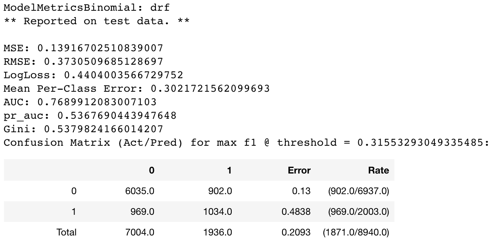

# 它是如何工作的...

在**准备就绪**部分，我们安装了 JRE 和 H2O。我们使用`h2o.init()`初始化并连接到一个 H2O 实例。然后我们使用`pandas`读取我们的数据并将其转换为 H2O DataFrame。我们在 H2O DataFrame 上使用了`head()`和`describe()`方法，就像我们在`pandas` DataFrame 上使用它们一样。然后我们从 H2O DataFrame 中删除了`ID`列。

在**准备就绪**部分进行这些数据探索之后，我们继续下一步。在**步骤 1**中，我们检查了每个特征与`target`变量的相关性。在**步骤 2**中，我们使用了`h2o` DataFrame 并检查了数据类型。

注意，对于`pandas` DataFrame，我们使用了`dtypes`，而对于`h2o` DataFrame，我们使用了`types`。

在**步骤 3**中，我们使用了`asfactor()`函数将数值变量转换为分类类型。我们对那些本应为分类类型但显示为数值的变量执行了此操作。

在前面的例子中，我们在`pandas` DataFrame 上使用了`astype()`方法。对于 H2O DataFrame，我们使用了`asfactor()`方法。

在**步骤 4**中，我们在`target`变量上使用了`asfactor()`将其转换为分类变量。

在**步骤 5**中，我们将特征和`target`变量分开。在**步骤 6**中，我们使用`split_frame()`在 H2O DataFrame 上拆分了 H2O DataFrame，将数据集分为训练集和测试集。我们使用`ratios`参数，并将其设置为`ratios=[0.7]`，以便`split_frame()`将 70%的数据分配给训练集，30%的数据分配给测试集。

在**步骤 7**中，我们从`h2o.estimators.random_forest`导入了`H2ORandomForestEstimator`。我们传递了`model_id`，然后引用它来调用`train()`函数并传递预测变量和`target`变量。然后我们通过传递测试子集到`model_performance()`来查看性能指标。

# 还有更多...

在我们前面的例子中，我们有 AUC 为`0.76`和 log 损失为`0.44`：

1.  我们可以通过将`nfolds`作为参数传递给`H2ORandomForestEstimator()`来应用交叉验证：

```py
RF_cv = H2ORandomForestEstimator(model_id = 'RF_cv', 
                                 seed = 12345, 
                                 ntrees = 500, 
                                 sample_rate = 0.9, 
                                 col_sample_rate_per_tree = 0.9, 
                                 nfolds = 10)

RF_cv.train(x = predictors, y = target, training_frame = train)
print(RF_cv.model_performance(test))
```

我们注意到 AUC 略有提高至`0.77`，而 log 损失降至`0.43`：

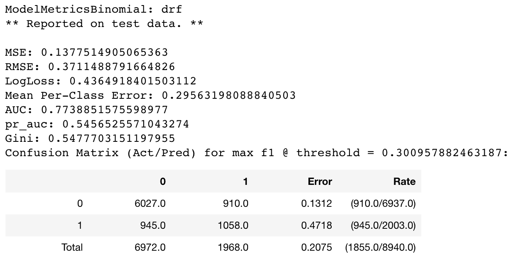

1.  我们还可以应用网格搜索来从给定选项中提取最佳模型。我们设置选项如下：

```py
search_criteria = {'strategy': "RandomDiscrete"}

hyper_params = {'sample_rate': [0.5, 0.6, 0.7],\
                'col_sample_rate_per_tree': [0.7, 0.8, 0.9],\
                'max_depth': [3, 5, 7]}
```

1.  我们使用前面的搜索参数构建模型：

```py
from h2o.grid.grid_search import H2OGridSearch

RF_Grid = H2OGridSearch(
                    H2ORandomForestEstimator(
                        model_id = 'RF_Grid', 
                        ntrees = 200, 
                        nfolds = 10,
                        stopping_metric = 'AUC', 
                        stopping_rounds = 25), 
                    search_criteria = search_criteria, # full grid search
                    hyper_params = hyper_params)
RF_Grid.train(x = predictors, y = target, training_frame = train)
```

1.  我们现在按 AUC 降序对所有模型进行排序，然后选择第一个具有最高 AUC 的模型：

```py
RF_Grid_sorted = RF_Grid.get_grid(sort_by='auc',decreasing=True)
print(RF_Grid_sorted)

best_RF_model = RF_Grid_sorted.model_ids[0]
best_RF_from_RF_Grid = h2o.get_model(best_RF_model)
```

1.  我们应用最佳模型来测试我们的数据：

```py
best_RF_from_RF_Grid.model_performance(test)
```

1.  我们可以绘制到目前为止我们达到的最佳模型的变量重要性：

```py
best_RF_from_RF_G
rid.varimp_plot()
```

这给出了以下图表：

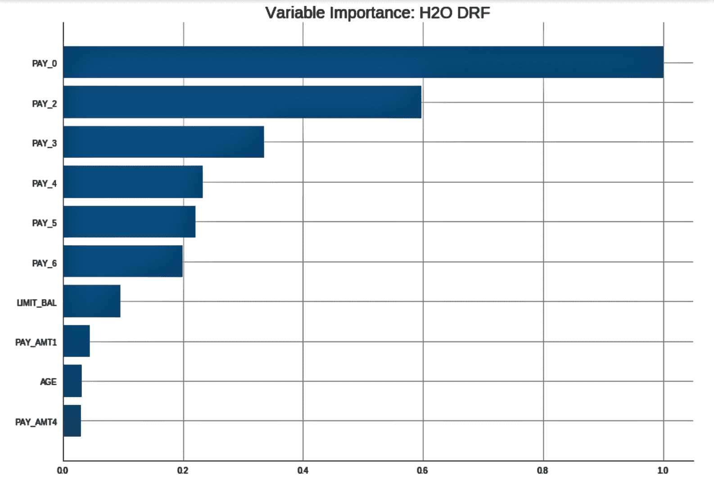

# 参见

你可能想了解一下极随机树，它们的实现方式略有不同，但有时可能比随机森林表现得更好。

在集成方法中，每个模型在数据集的子集和用于训练的特征向量子集方面以不同的方式学习。这些子集是随机选取的。极随机树在计算分裂和选择特征子集的方式上具有很高的随机性因素。与随机森林不同，在随机森林中分裂阈值是随机选择的，而在极随机树中，使用判别阈值作为分裂规则。因此，集成整体的方差降低，整体性能可能更好。

在以下链接中可以找到 scikit-learn 对极随机树的实现：[`bit.ly/2zWsNNS`](https://bit.ly/2zWsNNS)[. H2O 也支持极随机树。](https://bit.ly/2zWsNNS)
