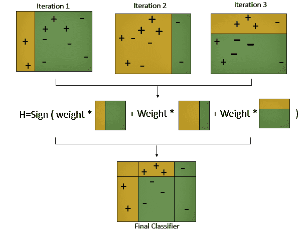
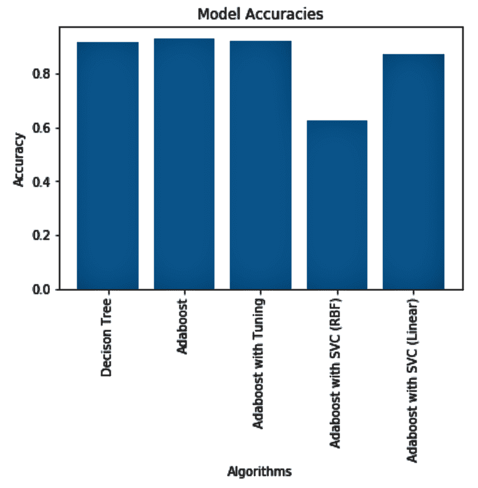
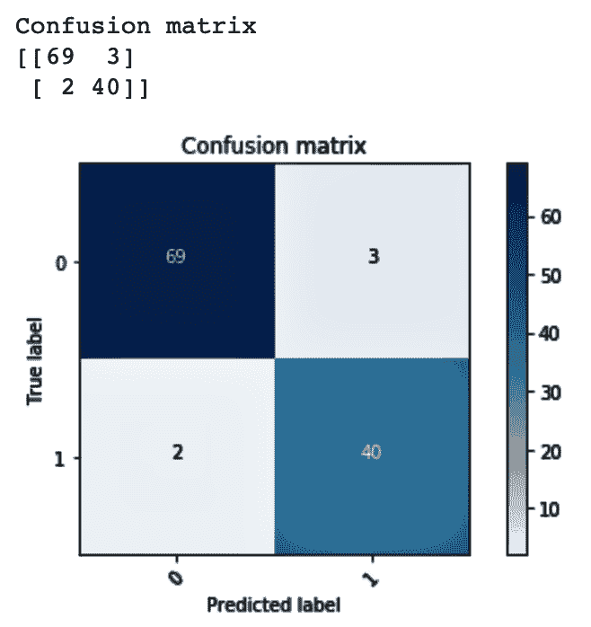
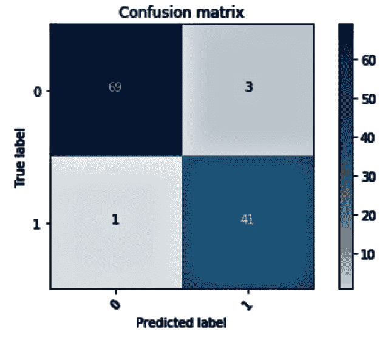
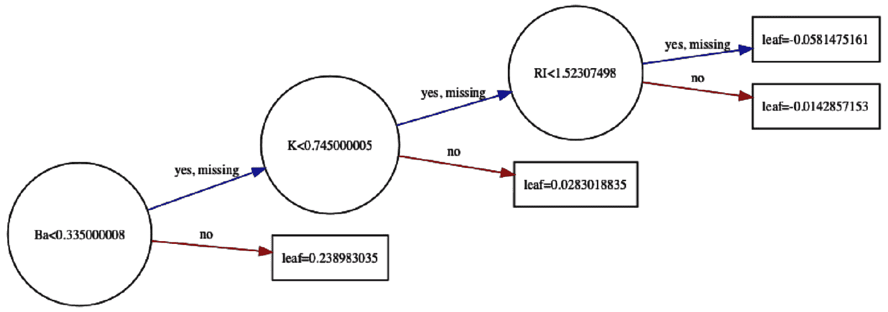
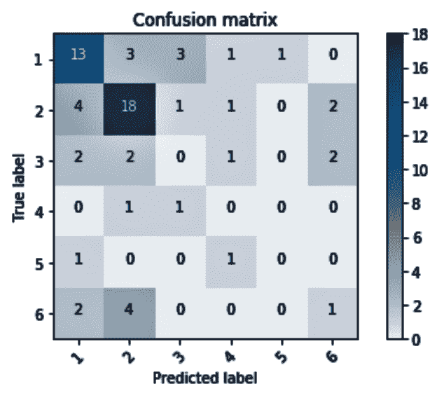
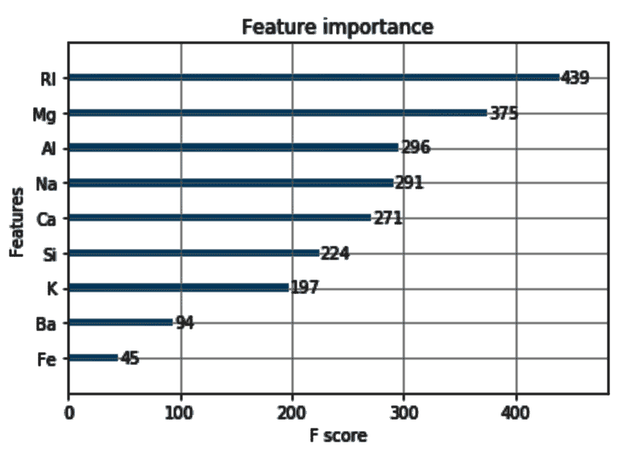

# 使用提升算法提升模型性能

在本章中，我们将涵盖以下食谱：

+   提升算法简介

+   使用 scikit-learn 实现 AdaBoost 进行疾病风险预测

+   使用 scikit-learn 实现梯度提升进行疾病风险预测

+   使用 XGBoost 和 scikit-learn 实现极端梯度提升进行玻璃识别

# 提升算法简介

提升算法是一种集成技术，通过将一组弱学习器组合起来形成一个强学习器，从而帮助提高模型性能和准确性。提升背后的理念是预测器应该从先前预测器所犯的错误中学习。

提升算法有两个关键特性：

+   首先，它们经历多次迭代

+   第二，每次迭代都专注于先前迭代错误分类的实例

当一个输入被假设错误分类时，其权重将在下一次迭代中改变，以便下一个假设可以正确分类它。将更多的权重给予在训练数据上提供更好性能的那些。通过多次迭代，这个过程将弱学习器转换为一组强学习器，从而提高模型性能。

在袋装法中，没有自助样本依赖于任何其他自助样本，因此它们都并行运行。提升算法以顺序方式进行，不涉及自助采样。袋装法和提升法都通过将不同模型中的多个估计组合成一个单一估计来减少单个估计的方差。然而，需要注意的是，如果单个模型过拟合，提升算法并不能显著帮助。如果模型过拟合，袋装法可能是一个更好的选择。另一方面，提升算法试图减少偏差，而袋装法很少能改善偏差。

在本章中，我们将介绍不同的提升算法，例如**自适应提升**（**AdaBoost**）、梯度提升和**极端梯度提升**（**XGBoost**）。

# 使用 scikit-learn 实现 AdaBoost 进行疾病风险预测

AdaBoost 是用于二元分类的最早提升算法之一。它由 Freund 和 Schapire 于 1996 年提出。此后，基于 AdaBoost 的许多其他提升算法已被开发出来。

另一种自适应提升的变体被称为**AdaBoost-abstain**。AdaBoost-abstain 允许每个基线分类器在其相关特征缺失时放弃投票。

AdaBoost 专注于将一组弱学习器组合成一个强学习器。AdaBoost 分类器的过程如下：

1.  初始时，将一个短决策树分类器拟合到数据上。决策树可以只有一个分割，这被称为**决策树桩**。评估整体误差。这是第一次迭代。

1.  在第二次迭代中，正确分类的数据将被赋予较低的权重，而错误分类的类别将被赋予较高的权重。

1.  在第三次迭代中，将再次对数据进行拟合，并在下一次迭代中更改权重。

1.  一旦这些迭代完成，每个分类器在每个迭代中都会根据错误率自动计算权重，以得出一个强分类器。

以下截图显示了 AdaBoost 的工作原理：



该算法背后的概念是将权重分配给训练示例，并选择具有最低加权错误的分类器。最后，它通过这些弱学习者的线性组合构建一个强分类器。

AdaBoost 的一般公式如下：


在这里，**F(x)** 代表一个强分类器，**** 代表权重，而 **f(x)** 代表一个弱分类器。

AdaBoost 分类器接受各种参数。以下解释了重要的参数：

+   `base_estimator`：用于训练模型的算法。如果未提供此参数的值，则基本估计器为 `DecisionTreeClassifier (max_depth=1)`。

+   `n_estimators`：迭代训练的模型数量。

+   `learning_rate`：每个模型对权重的贡献。默认情况下，`learning_rate` 的值为 `1`。较低的 `learning_rate` 值会使模型训练得更慢，但可能会得到更好的性能分数。

# 准备工作

首先，导入 `os` 和 `pandas` 包，并根据您的需求设置工作目录：

```py
# import required packages
import os
import pandas as pd
import numpy as np

from sklearn.ensemble import AdaBoostClassifier
from sklearn.model_selection import GridSearchCV
from sklearn.model_selection import train_test_split
from sklearn.tree import DecisionTreeClassifier

from sklearn.metrics import roc_auc_score, roc_curve, auc
from sklearn.model_selection import train_test_split

# Set working directory as per your need
os.chdir(".../.../Chapter 8")
os.getcwd()
```

从 GitHub 下载 `breastcancer.csv` 数据集并将其复制到您的当前工作目录。读取数据集：

```py
df_breastcancer = pd.read_csv("breastcancer.csv")
```

使用 `head()` 函数查看前几行：

```py
df_breastcancer.head(5)
```

注意，`diagnosis` 变量具有 M 和 B 等值，分别代表恶性和良性。我们将对 `diagnosis` 变量进行标签编码，以便将 M 和 B 值转换为数值。

我们使用 `head()` 来查看变化：

```py
# import LabelEncoder from sklearn.preprocessing
from sklearn.preprocessing import LabelEncoder

lb = LabelEncoder()
df_breastcancer['diagnosis'] =lb.fit_transform(df_breastcancer['diagnosis']) 
df_breastcancer.head(5)
```

然后，我们检查数据集是否有任何空值：

```py
df_breastcancer.isnull().sum()
```

我们使用 `shape()` 检查数据集的形状：

```py
df_breastcancer.shape
```

现在，我们将我们的目标集和特征集分开。我们还把数据集分成训练集和测试集：

```py
# Create feature & response variables
# Drop the response var and id column as it'll not make any sense to the analysis
X = df_breastcancer.iloc[:,2:31]

# Target
Y = df_breastcancer.iloc[:,0]

# Create train & test sets
X_train, X_test, Y_train, Y_test = train_test_split(X, Y, test_size=0.30, random_state=0, stratify= Y)
```

现在，我们将继续使用 `AdaBoost` 算法构建我们的模型。

重要的是要注意，准确率和 AUC 分数可能因随机分割和其他随机因素而不同。

# 如何做到这一点...

现在我们将探讨如何使用 AdaBoost 训练我们的模型：

1.  在我们构建第一个 `AdaBoost` 模型之前，让我们使用 `DecisionTreeClassifier` 训练我们的模型：

```py
dtree = DecisionTreeClassifier(max_depth=3, random_state=0)
dtree.fit(X_train, Y_train)
```

1.  我们可以通过以下代码看到我们的准确率和 **曲线下面积**（**AUC**）：

```py
# Mean accuracy
print('The mean accuracy is: ',(dtree.score(X_test,Y_test))*100,'%')

#AUC score
y_pred_dtree = dtree.predict_proba(X_test)
fpr_dtree, tpr_dtree, thresholds = roc_curve(Y_test, y_pred_dtree[:,1])
auc_dtree = auc(fpr_dtree, tpr_dtree)
print ('AUC Value: ', auc_dtree)
```

我们得到了准确率分数和 AUC 值分别为 91.81% 和 0.91。请注意，由于随机性，这些值可能因用户而异。

1.  现在，我们将使用 scikit-learn 库构建我们的 AdaBoost 模型。我们将使用`AdaBoostClassifier`构建我们的`AdaBoost`模型。`AdaBoost`默认使用`dtree`作为基础分类器：

```py
AdaBoost = AdaBoostClassifier(n_estimators=100, base_estimator=dtree, learning_rate=0.1, random_state=0)
AdaBoost.fit(X_train, Y_train)
```

1.  我们检查了模型在测试数据上的准确率和 AUC 值：

```py
# Mean accuracy
print('The mean accuracy is: ',(AdaBoost.score(X_test,Y_test))*100,'%')

#AUC score
y_pred_adaboost = AdaBoost.predict_proba(X_test)
fpr_ab, tpr_ab, thresholds = roc_curve(Y_test, y_pred_adaboost[:,1])
auc_adaboost = auc(fpr_ab, tpr_ab)
print ('AUC Value: ', auc_adaboost)
```

我们注意到我们得到了 92.82%的准确率分数和 0.97 的 AUC 值。这两个指标都高于我们在*步骤 1*中构建的决策树模型。

1.  然后，我们必须微调我们的超参数。我们将`n_estimators`设置为`100`，将`learning_rate`设置为`0.4`：

```py
# Tuning the hyperparams
AdaBoost_with_tuning = AdaBoostClassifier(n_estimators=100, base_estimator=dtree, learning_rate=0.4, random_state=0)
AdaBoost_with_tuning.fit(X_train, Y_train)
```

1.  现在，我们将检查我们的新模型在测试数据上的准确率和 AUC 值：

```py
# Mean accuracy
print('The mean accuracy is: ',(AdaBoost_with_tuning.score(X_test,Y_test))*100,'%')

#AUC score
y_pred_adaboost_tune = AdaBoost.predict_proba(X_test)
fpr_ab_tune, tpr_ab_tune, thresholds = roc_curve(Y_test, y_pred_adaboost_tune[:,1])
auc_adaboost_tune = auc(fpr_ab_tune, tpr_ab_tune)
print ('AUC Value: ', auc_adaboost_tune)
```

我们注意到准确率下降到 92.39%，但我们得到了改进的 AUC 值，为 0.98。

# 它是如何工作的...

在*步骤 1*中，我们使用`DecisionTreeClassifier`构建了我们的模型。在*步骤 2*中，我们注意到我们的平均准确率和 AUC 分数分别为 91.81%和 0.91。我们希望通过使用`AdaBoost`算法来提高这一点。

注意，`AdaBoost`算法默认使用决策树作为基础分类器。在*步骤 3*中，我们使用默认的基础学习器`AdaBoost`训练了我们的模型。我们将`n_estimators`设置为`100`，将`learning_rate`设置为`0.1`。我们在*步骤 4*中检查了我们的平均准确率和 AUC 值。我们注意到平均准确率和 AUC 值分别提高了 93.57%和 0.977。

在*步骤 5*中，我们微调了`AdaBoost`算法的一些超参数，该算法使用决策树作为基础分类器。我们将`n_estimators`设置为`100`，将`learning_rate`设置为`0.4`。*步骤 6*给出了我们在*步骤 5*中构建的模型的准确率和 AUC 值。我们看到准确率下降到 93.56%，而 AUC 值保持在 0.981 左右。

# 更多内容...

在这里，我们将展示如何使用 AdaBoost 训练一个模型，其中基础学习器为**支持向量机**（**SVM**）：

默认情况下，AdaBoost 使用决策树作为基础学习器。我们也可以使用不同的基础学习器。在以下示例中，我们使用 SVM 作为我们的基础学习器，并使用`AdaBoost`算法。我们使用`SVC`并使用`rbf`作为核：

```py
from sklearn.svm import SVC

Adaboost_with_svc_rbf = AdaBoostClassifier(n_estimators=100, base_estimator=SVC(probability=True, kernel='rbf'), learning_rate=1, random_state=0)
Adaboost_with_svc_rbf.fit(X_train, Y_train)
```

我们可以使用**支持向量分类器**（**SVC**）作为基础学习器来检查我们的 AdaBoost 模型的准确率和 AUC 值：

```py
# Mean accuracy
print('The mean accuracy is: ',(Adaboost_with_svc_rbf.score(X_test,Y_test))*100,'%') 

#AUC score
y_pred_svc_rbf = Adaboost_with_svc_rbf.predict_proba(X_test)
fpr_svc_rbf, tpr_svc_rbf, thresholds = roc_curve(Y_test, y_pred_svc_rbf[:,1])
auc_svc_rbf = auc(fpr_svc_rbf, tpr_svc_rbf)
print ('AUC Value: ', auc_svc_rbf)
```

我们注意到准确率和 AUC 值分别下降到 62.57 和 0.92。

现在，我们将使用 SVC 重新构建我们的 AdaBoost 模型。这次，我们将使用线性核：

```py
Adaboost_with_svc_linear =AdaBoostClassifier(n_estimators=100, base_estimator=SVC(probability=True, kernel='linear'), learning_rate=1, random_state=0)
Adaboost_with_svc_linear.fit(X_train, Y_train)
```

现在，我们得到了 90.64%的平均准确率和 0.96 的合理 AUC 值。

我们现在将使用以下代码绘制一个图表来比较每个模型的 AUC 值：

```py
import matplotlib.pyplot as plt
% matplotlib inline
plt.figure(figsize=(8,8))

plt.plot(fpr_dtree, tpr_dtree,label="Model1: Dtree, auc="+str(auc_dtree))
plt.plot(fpr_ab, tpr_ab,label="Model2: Adaboost, auc="+str(auc_adaboost))
plt.plot(fpr_ab_tune,tpr_ab_tune,label="Model3: Adaboost with Tuning, auc="+str(auc_adaboost_tune))
plt.plot(fpr_svc_rbf, tpr_svc_rbf, label="Model4: Adaboost with SVC (RBF Kernel), auc="+str(auc_svc_rbf))
plt.plot(fpr_svc_lin, tpr_svc_lin, label="Model5: Adaboost with SVC (Linear Kernel), auc="+str(auc_svc_linear))

plt.legend(loc=5)
plt.show()
```

这给出了以下图表：


我们也可以使用以下代码绘制所有模型的准确率：

```py
import matplotlib.pyplot as plt
% matplotlib inline
plt.figure(figsize=(8,8))

label = ['Decison Tree', 'Adaboost', 'Adaboost with Tuning', 'Adaboost with SVC (RBF)', 'Adaboost with SVC (Linear)']

values = [dtree.score(X_test,Y_test),
        AdaBoost.score(X_test,Y_test),
        AdaBoost_with_tuning.score(X_test,Y_test),
        Adaboost_with_svc_rbf.score(X_test,Y_test),
        Adaboost_with_svc_linear.score(X_test,Y_test)]

def plot_bar_accuracy():
    # this is for plotting purpose
    index = np.arange(len(label))
    plt.bar(index, values)
    plt.xlabel('Algorithms', fontsize=10)
    plt.ylabel('Accuracy', fontsize=10)
    plt.xticks(index, label, fontsize=10, rotation=90)
    plt.title('Model Accuracies')
    plt.show()

plot_bar_accuracy()
```

这给出了以下输出：



# 参见

我们也可以使用网格搜索与 AdaBoost：

```py
#grid search using svm
Adaboost_with_svc = AdaBoostClassifier(n_estimators=100, base_estimator=SVC(probability=True, kernel='linear'), learning_rate=1, algorithm= 'SAMME')

Ada_Grid = {'n_estimators': [10,30,40,100],
           'learning_rate': [0.1, 0.2, 0.3]}

estimator = Adaboost_with_svc
Adaboost_with_grid_search = GridSearchCV(estimator,Ada_Grid).fit(X_train, Y_train)
print(Adaboost_with_grid_search.best_params_)
print(Adaboost_with_grid_search.best_score_)
```

在前面的代码中，我们进行了网格搜索，将`n_estimators`设置为`10`、`30`、`40`和`100`，将`learning_rate`设置为`0.1`、`0.2`和`0.3`。

# 使用 scikit-learn 实现梯度提升机进行疾病风险预测

梯度提升是一种机器学习技术，它基于提升原理，其中弱学习器迭代地将注意力转向在先前迭代中难以预测的错误观测值，并创建一个弱学习者的集成，通常是决策树。

梯度提升以顺序方式训练模型，并涉及以下步骤：

1.  将模型拟合到数据中

1.  将模型拟合到残差中

1.  创建一个新的模型

虽然 AdaBoost 模型通过使用分配给数据点的权重来识别错误，但梯度提升通过在损失函数中计算梯度来完成同样的工作。损失函数是衡量模型能够拟合其训练数据的程度的一个指标，通常取决于所解决的问题的类型。如果我们谈论回归问题，可能使用均方误差，而在分类问题中，可以使用对数损失。梯度下降过程用于在逐个添加树时最小化损失。模型中现有的树保持不变。

有一些超参数可以调整：

+   +   `N_estimators`：这表示模型中的树的数量。通常，它越高，模型学习数据的能力越好。

    +   `max_depth`：这表示我们的树有多深。它用于控制过拟合。

    +   `min_samples_split`：这是分割内部节点所需的最小样本数。过高的值可能会阻止模型学习关系。

    +   `learning_rate`：这控制估计值的变化幅度。通常，较低值与较高的树的数量更受青睐。

    +   `loss`：这指的是在每次分割中最小化的损失函数。算法中默认参数使用`deviance`，另一个是`exponential`。

    +   `max_features`：这表示在寻找最佳分割时需要考虑的特征数量。

    +   `criterion`：这个函数衡量分割的质量，并支持`friedman_mse`和`mae`来评估模型的性能。

    +   `subsample`：这表示用于拟合单个基学习者的样本的分数。选择小于 1.0 的子样本会导致方差减少和偏差增加。

    +   `min_impurity_split`：这表示一个阈值，用于提前停止树的生长。

# 准备工作

我们将使用与训练我们的 AdaBoost 模型相同的数据集。在这个例子中，我们将看到如何使用梯度提升机来训练我们的模型。我们还将查看一些可以调整以改进模型性能的超参数。

首先，我们必须导入所有必需的库：

```py
import os
import pandas as pd
import numpy as np

from sklearn.model_selection import train_test_split

from sklearn.ensemble import GradientBoostingClassifier 
from sklearn.metrics import classification_report, confusion_matrix, accuracy_score, roc_auc_score
from sklearn.preprocessing import MinMaxScaler

import matplotlib.pyplot as plt
import itertools
```

然后，我们读取我们的数据并将目标变量编码为 1 和 0：

```py
# Read the Dataset
df_breastcancer = pd.read_csv("breastcancer.csv")

from sklearn.preprocessing import LabelEncoder
lb = LabelEncoder()
df_breastcancer['diagnosis'] = lb.fit_transform(df_breastcancer['diagnosis']) 
df_breastcancer.head(5)
```

然后，将我们的目标变量和特征变量分开。我们将数据分为训练集和测试集：

```py
# create feature & response variables
# drop the response var and id column as it'll not make any sense to the analysis
X = df_breastcancer.iloc[:,2:31]

# Target variable
Y = df_breastcancer.iloc[:,0]

# Create train & test sets
X_train, X_test, Y_train, Y_test = train_test_split(X, Y, test_size=0.20, random_state=0, stratify= Y)
```

这与我们在`AdaBoost`示例的*准备就绪*部分中使用的代码相同。

# 如何操作...

现在，我们将探讨如何使用梯度提升机来训练我们的模型：

1.  在上一节*准备就绪*中，我们导入了`GradientBoostingClassifier`从`sklearn.ensemble`。我们使用`GradieBoostingClassfier`训练我们的模型：

```py
GBM_model = GradientBoostingClassifier() 
GBM_model.fit(X_train, Y_train)
```

1.  在这里，我们必须将我们的测试数据传递给`predict()`函数，使用我们在*步骤 1*中构建的模型进行预测：

```py
Y_pred_gbm = GBM_model.predict(X_test)
```

1.  现在，我们使用`classification_report`查看以下指标：

```py
print(classification_report(Y_test, Y_pred_gbm))
```

`classification_report`提供了以下输出：


1.  我们将使用`confusion_matrix()`生成混淆矩阵。然后，我们将`confusion_matrix`的输出传递给我们的预定义函数，即`plot_confusion_matrix()`，以绘制矩阵：



1.  我们可以使用`accuracy_score()`和`roc_auc_score()`来检查测试准确率和 AUC 值。

注意，`accuracy_score`和`roc_auc_score`已从`sklearn.metrics`导入：


# 它是如何工作的...

在*步骤 1*中，我们训练了一个梯度提升分类器模型。在*步骤 2*中，我们使用`predict()`方法对我们的测试数据进行预测。

在*步骤 3*中，我们使用了`classification_report()`来查看每个类别的各种指标，如`precision`、`recall`和`f1-score`，以及每个指标的均值。`classification_report()`报告了总真实正例、假负例、假正例、未加权的每个标签的平均值和支持加权的每个标签的平均值。它还报告了多标签分类的样本平均值。

精度指的是分类器不将负例标记为正例的能力，而召回率指的是分类器找到所有正例的能力。f[1]分数是精度和召回率的加权调和平均值。最佳的`f[1]分数`是 1.0，最差的是 0.0。支持是每个类别的观测数。

在*步骤 4*中，我们使用`confusion_matrix()`生成混淆矩阵，以查看真实正例、真实负例、假正例和假负例。

在*步骤 5*中，我们使用`accuracy_score()`和`roc_auc_score()`函数查看了测试数据的准确率和 AUC 值。

在下一节中，我们将使用网格搜索调整超参数，以找到最佳模型。

# 更多内容...

现在，我们将探讨如何微调梯度提升机的超参数：

1.  首先，我们从`sklearn.model_selection`导入`GridSearchCV`：

```py
from sklearn.model_selection import GridSearchCV
```

1.  我们将网格参数设置为一个变量：

```py
parameters = {
    "n_estimators":[100,150,200],
    "loss":["deviance"],
    "learning_rate": [0.01, 0.05, 0.1, 0.2, 0.3, 0.4, 0.5, 0.6, 0.7, 0.8, 0.9, 1],
    "min_samples_split":np.linspace(0.1, 0.5, 4),
    "min_samples_leaf": np.linspace(0.1, 0.5, 4),
    "max_depth":[3, 5, 8],
    "max_features":["log2","sqrt"],
    "criterion": ["friedman_mse", "mae"],
    "subsample":[0.3, 0.6, 1.0]
    }
```

1.  我们使用`GridSeacrhCV`，它允许我们将估计量与网格搜索相结合以调整超参数。`GridSeacrhCV`方法从网格值中选择最佳参数，并将其与估计量一起使用：

```py
grid = GridSearchCV(GradientBoostingClassifier(), parameters, cv=3, n_jobs=-1) 
grid.fit(X_train, Y_train)
```

1.  然后，我们可以查看最佳参数：

```py
grid.best_estimator_
```

看看下面的截图：


1.  我们将测试数据传递给`predict`方法以获取预测结果：

```py
grid_predictions = grid.predict(X_test)
```

1.  再次，我们可以看到`classification_report`提供的指标：

```py
print(classification_report(Y_test, grid_predictions))
```

这给我们以下输出。我们注意到平均`precision`和`f1-score`比之前的案例有所提高：


1.  现在，我们将查看混淆矩阵并绘制它，就像我们之前做的那样：

```py
cnf_matrix = confusion_matrix(Y_test, grid_predictions)
plot_confusion_matrix(cnf_matrix,classes=[0,1])

```

从前面的代码中，我们得到以下图表：



1.  现在，我们再次查看准确率和 AUC 值：

```py
print("Accuracy score = {:0.2f}".format(accuracy_score(Y_test, grid_predictions)))
print("Area under ROC curve = {:0.2f}".format(roc_auc_score(Y_test, grid_predictions)))
```

我们注意到准确率保持不变，但 AUC 从 0.96 提高到 0.97：


# 使用 scikit-learn 和 XGBoost 实现玻璃识别的极端梯度提升方法

XGBoost 代表极端梯度提升。它是梯度提升机的变体，旨在提高性能和速度。Python 中的 XGBoost 库实现了梯度提升决策树算法。梯度提升的名字来源于它在添加新模型时使用梯度下降算法来最小化损失。XGBoost 可以处理回归和分类任务。

由于在困难的机器学习问题中性能和执行速度出色，XGBoost 成为了 Kaggle 竞赛中参赛者的首选算法。

在 XGBoost 中使用的一些重要参数如下：

+   `n_estimators`/`ntrees`：这指定了要构建的树的数量。默认值是 50。

+   `max_depth`：这指定了最大树深度。默认值是 6。更高的值会使模型更加复杂，可能会导致过拟合。将此值设置为 0 表示没有限制。

+   `min_rows`：这指定了叶子的最小观测数。默认值是 1。

+   `learn_rate`：这指定了用于缩小特征权重的学习率。在每次提升步骤之后缩小特征权重可以使提升过程更加保守，并防止过拟合。范围是 0.0 到 1.0。默认值是 0.3。

+   `sample_rate`：这指定了训练实例（*x*轴）的行采样比率。例如，将此值设置为 0.5 表示 XGBoost 随机收集一半的数据实例来生长树。默认值是 1，范围是 0.0 到 1.0。更高的值可能会提高训练准确率。

+   `col_sample_rate`：这指定了每个级别的每个分割的列采样率（*y 轴*）。默认值是 1.0，范围是从 0 到 1.0。更高的值可能会提高训练准确率。

# 准备中...

您需要安装`XGBoost`库才能继续此食谱。您可以使用以下`pip`命令安装`XGBoost`库：

```py
!pip install xgboost
```

导入所需的库：

```py
# Import required libraries
import os
import pandas as pd
import numpy as np

from numpy import sort

from xgboost import XGBClassifier
from xgboost import plot_tree
from xgboost import plot_importance

from sklearn.feature_selection import SelectFromModel
from sklearn.model_selection import train_test_split, KFold, cross_val_score, StratifiedKFold

import matplotlib.pyplot as plt
from sklearn.metrics import accuracy_score, confusion_matrix

import itertools
```

设置您的当前工作文件夹并读取您的数据：

```py
os.chdir("/.../Chapter 7")
os.getcwd()

df_glassdata = pd.read_csv('glassdata.csv')
df_glassdata.shape
```

此数据来自 UCI ML 存储库。列名已根据以下链接提供的数据描述进行更改：[`bit.ly/2EZX6IC`](https://bit.ly/2EZX6IC)。

我们来看看数据：

```py
df_glassdata.head()
```

我们将数据分为目标和特征集，并验证它。请注意，我们忽略了 ID 列：

```py
# split data into X and Y
X = df_glassdata.iloc[:,1:10]
Y = df_glassdata.iloc[:,10]

print(X.shape)
print(Y.shape)
```

我们确认没有缺失值：

```py
df_glassdata.isnull().sum()
```

我们将数据集分为训练集和测试集：

```py
# Create train & test sets
X_train, X_test, Y_train, Y_test = train_test_split(X, Y, test_size=0.30, random_state=0)
```

# 如何做到这一点...

现在，我们将继续构建我们的第一个 XGBoost 模型：

1.  首先，我们将训练数据拟合到 XGBoost 分类器：

```py
xg_model = XGBClassifier()
xg_model.fit(X_train, Y_train)
```

1.  我们可以可视化训练模型中的单个 XGBoost 决策树。可视化决策树可以提供梯度提升过程的洞察：

```py
plot_tree(xg_model, num_trees=0, rankdir='LR')
fig = pyplot.gcf()
fig.set_size_inches(30, 30)
```

这给我们以下输出：


当`num_trees=0`时，我们得到第一个提升树。我们可以通过将索引值设置为`num_trees`参数来查看其他提升树。

1.  在以下示例中，我们将`num_trees`设置为`5`：

```py
plot_tree(xg_model, num_trees=5, rankdir='LR')
fig = pyplot.gcf()
fig.set_size_inches(30, 30)
```

以下截图显示了第 6 个提升树：



您需要在您的系统上安装`graphviz`库来绘制提升树。

1.  我们现在将在测试数据上使用`predict()`来获取预测值。我们可以使用`accuracy_score()`看到我们的测试准确率：

```py
test_predictions = xg_model.predict(X_test)
test_accuracy = accuracy_score(Y_test, test_predictions)

print("Test Accuracy: %.2f%%" % (test_accuracy * 100.0))
```

通过执行此代码，我们可以看到测试准确率为 69.23%。

1.  我们可以通过以下代码查看我们的混淆矩阵：

```py
confusion_matrix(Y_test, predictions)
```

1.  然后，我们可以使用预定义的函数`plot_confusion_matrix()`，该函数来自[`scikit-learn.org`](https://scikit-learn.org)：

```py
def plot_confusion_matrix(cm, classes,
                          normalize=False,
                          title='Confusion matrix',
                          cmap=plt.cm.Blues):
    plt.imshow(cm, interpolation='nearest', cmap=cmap)
    plt.title(title)
    plt.colorbar()
    tick_marks = np.arange(len(classes))
    plt.xticks(tick_marks, classes, rotation=45)
    plt.yticks(tick_marks, classes)

    fmt = '.2f' if normalize else 'd'
    thresh = cm.max() / 2.
    for i, j in itertools.product(range(cm.shape[0]), range(cm.shape[1])):
        plt.text(j, i, format(cm[i, j], fmt),
                 horizontalalignment="center",
                 color="white" if cm[i, j] > thresh else "black")

    plt.ylabel('True label')
    plt.xlabel('Predicted label')
    plt.tight_layout()
```

1.  然后，我们查看目标变量的`unique`值以设置目标变量每个级别的名称：

```py
Y.unique()
```

在以下代码块中，我们可以看到`target_names`的值为`1`、`2`、`3`、`5`、`6`和`7`。我们相应地为目标变量的每个级别设置名称：

```py
# Set names to each level of our target variable
target_names = [ '1', '2', '3', '5', '6', '7']

# Pass Actual & Predicted values to confusion_matrix()
cm = confusion_matrix(Y_test, predictions)

plt.figure()
plot_confusion_matrix(cm, classes=target_names)
plt.show()
```

我们现在可以可视化混淆矩阵，如下面的截图所示：



# 它是如何工作的...

在*步骤 1*中，我们将`XGBoostClassfier`拟合到我们的训练数据。在*步骤 2*和*步骤 3*中，我们可视化了单个提升树。为此，我们使用了`plot_tree()`函数。我们将我们的`XGBoost`模型传递给`plot_tree()`，并通过设置`num_trees`参数来设置树的索引。`rankdir='LR'`参数从左到右绘制树。将`rankdir`设置为 UT 将绘制垂直树。

在 *步骤 4* 中，我们将测试子集传递给 `predict()` 以获取测试准确率。*步骤 5* 给出了混淆矩阵。在 *步骤 6* 中，我们从 [scikit-learn.org](https://scikit-learn.org/stable/) 中获取了一个预定义的函数，`plot_confusion_matrix()`。我们使用此函数来绘制我们的混淆矩阵。在 *步骤 7* 中，我们查看目标变量的唯一值，以便我们可以为混淆矩阵图中的每个类别设置名称。然后我们绘制了混淆矩阵以评估我们的模型。

# 更多...

在本节中，我们将探讨如何检查特征重要性并根据该重要性进行特征选择。我们还将探讨如何使用交叉验证评估我们的 XGBoost 模型的性能。

我们可以使用 `model.feature_importances_` 检查特征重要性：

```py
print(xg_model.feature_importances_)
```

我们还可以使用 `plot_importance()` 可视化特征重要性：

注意，我们已经从 `xgboost` 库中导入了 `plot_importance`。

```py
plot_importance(xg_model)
```

执行前面的代码后，我们可以看到以下图表，它显示了按重要性降序排列的特征重要性：



可以使用 `SelectFromModel` 进行特征选择：

`SelectFromModel` 类是从 `sklearn.feature_selection` 导入的。

在以下示例中，`SelectFromModel` 使用预训练的 `XGBoost` 模型，并从我们的数据集中提供具有选定特征的子集。它根据阈值值决定选定的特征。

重要性大于或等于阈值值的特征将被保留，而其他任何特征都将被丢弃：

```py
# The threshold value to use for feature selection. 
feature_importance = sort(xg_model.feature_importances_)

# select features using threshold
for each_threshold in feature_importance:
    selection = SelectFromModel(xg_model, threshold=each_threshold, prefit=True)

    # Reduce X_train only to the selected feature
    selected_feature_X_train = selection.transform(X_train)

    # Train the model
    selection_model = XGBClassifier()
    selection_model.fit(selected_feature_X_train, Y_train)

    # Reduce X_test only to the selected feature
    selected_feature_X_test = selection.transform(X_test)

    # Predict using the test value of the selected feature
    predictions = selection_model.predict(selected_feature_X_test)

    accuracy = accuracy_score(Y_test, predictions)
    print("Threshold=%.5f, Number of Features=%d, Model Accuracy: %.2f%%" % (each_threshold, selected_feature_X_train.shape[1],accuracy*100))
```

从前面的代码中，我们可以看到以下输出：


我们注意到模型的性能随着选定特征数量的增加而波动。根据前面的输出，我们决定选择五个特征，这些特征给我们带来了 72% 的准确率。此外，如果我们使用奥卡姆剃刀原则，我们可能可以选择一个具有四个特征且略微降低的 71% 准确率的更简单模型。

我们还可以使用交叉验证来评估我们的模型。要执行 k 折交叉验证，我们必须从 `sklearn.model_selection` 中导入 `KFold` 类。

首先，我们创建 `KFold` 对象并说明我们希望拥有的拆分数量：

```py
kfold = KFold(n_splits=40, random_state=0)
xg_model_with_kfold = XGBClassifier()

cv_results = cross_val_score(xg_model_with_kfold, X_train, Y_train, cv=kfold, verbose=True)
print("Mean Accuracy: %.2f%% Standard Deviation %.2f%%" % (cv_results.mean()*100, cv_results.std()*100))
```

使用 `cross_val_score()`，我们评估我们的模型，它给出了平均和标准差分类准确率。我们注意到我们得到了 77.92% 的平均准确率和 22.33% 的标准差。

在我们的情况下，我们有一个具有六个类别的目标变量。

如果对于多类分类任务有多个类别，在执行交叉验证时，您可以使用分层折：

```py
Stratfold = StratifiedKFold(n_splits=40, random_state=0)
xg_model_with_stratfold = XGBClassifier()

sf_results = cross_val_score(xg_model_with_stratfold, X_train, Y_train, cv=Stratfold, verbose=True)
print("Mean Accuracy: %.2f%% Standard Deviation %.2f%%" % (sf_results.mean()*100, sf_results.std()*100))
```

使用 `StratifiedKFold()`，我们得到了改进的平均准确率 81.18% 和降低的标准差 21.37%。

注意，`n_splits` 不能大于每个类别中的成员数量。

# 参见

+   LightGBM 是由微软开发的开源软件，用于梯度提升框架。它使用基于树的算法，与其他 **梯度提升机** (**GBMs**) 不同：[`bit.ly/2QW53jH`](https://bit.ly/2QW53jH)
