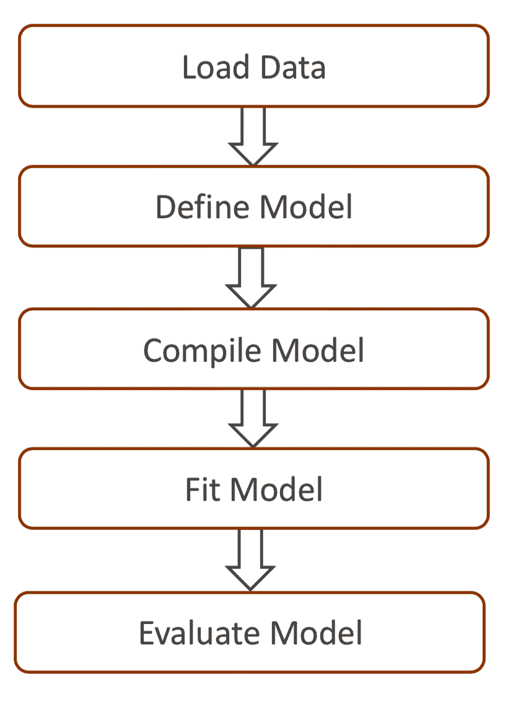
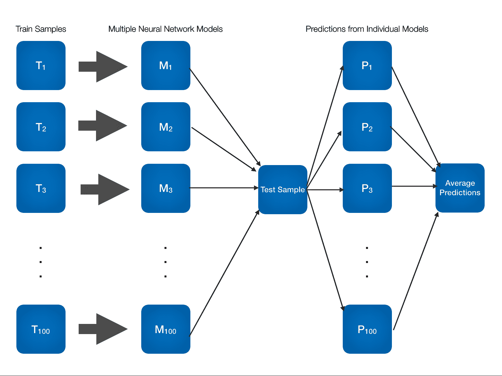
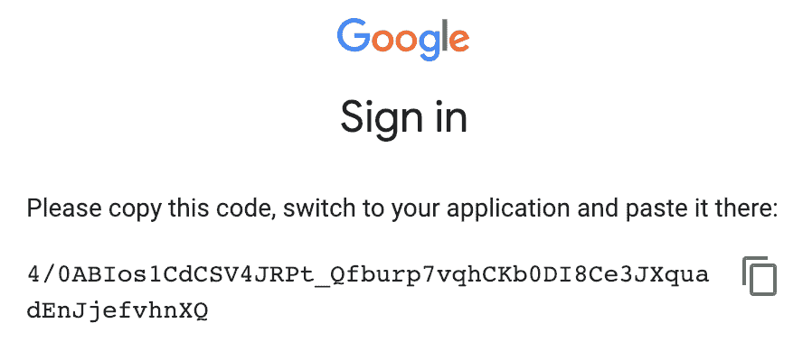
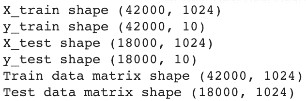
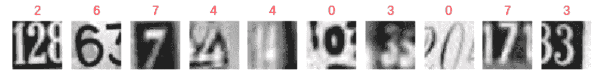
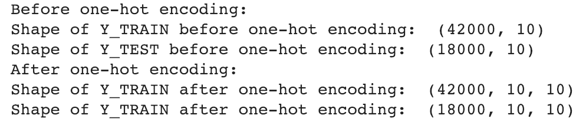
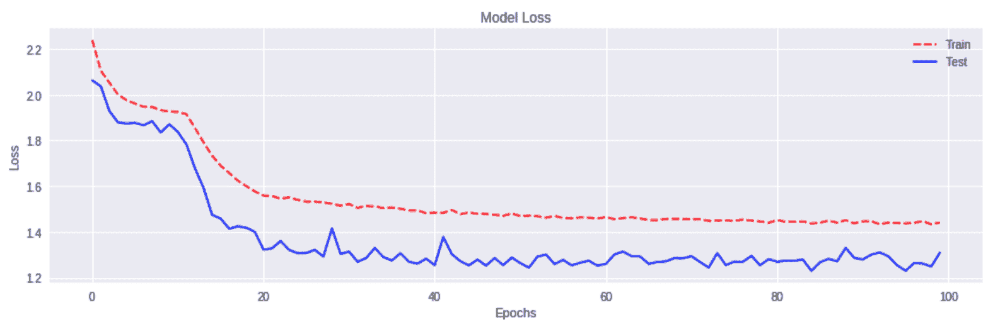
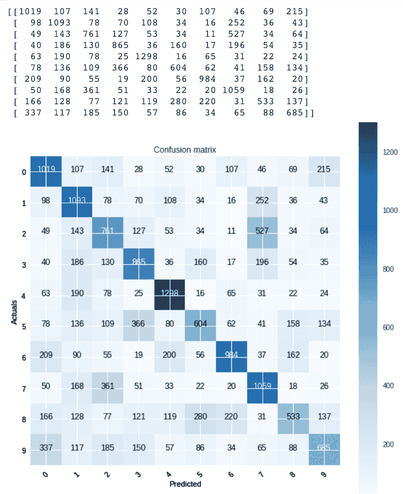

# 使用 Keras 的同质集成

在本章中，我们将涵盖以下主题：

+   用于能量预测的同质模型集成

+   用于手写数字分类的同质模型集成

# 简介

在集成模型的情况下，每个基础分类器必须在自身内部具有一定的多样性。这种多样性可以通过以下方式之一获得：

+   通过使用各种重采样方法或训练数据的随机化来使用不同的训练数据子集

+   通过为不同的基础学习器使用不同的学习超参数

+   通过使用不同的学习算法

在集成模型的情况下，如果基础学习器使用了不同的算法，则该集成被称为**异质集成方法**。如果所有基础学习器在不同的训练集分布上使用了相同的算法，则该集成被称为**同质集成**。

# 用于能量预测的同质模型集成

在以下示例中，我们将使用 Keras API。Keras 是一个开源的高级框架，用于构建深度神经网络。它建立在 TensorFlow 或 Theano 之上，并在幕后使用它们进行计算。Keras 可以在 CPU 和 GPU 上运行。Keras 的默认设置旨在在大多数情况下提供良好的结果。

Keras 的重点是模型的概念。Keras 支持两种类型的模型。主要类型的模型是一系列层，称为**顺序**。Keras 中的另一种模型是非顺序模型，称为**模型**。

要构建一个顺序模型，执行以下步骤：

1.  使用`Sequential()`实例化一个顺序模型

1.  使用`Dense`类逐个添加层

1.  使用以下方式编译模型：

    +   一个强制性的损失函数

    +   一个强制性的优化器

    +   可选评估参数

1.  使用数据拟合模型

1.  评估模型

这里是前面步骤的流程图：



在下面的代码块中，我们可以看到一个简短的代码示例：

```py
# Instantiate a sequential model
seqmodel = Sequential()

# Add layers using the Dense class
seqmodel.add(Dense8, activation='relu')

# Compile the model
seqmodel.compile(loss='binary_crossentropy, optimizer='adam', metric=['accuracy'])

# Fit the model
seqmodel.fit(X_train, Y_train, batch_size=10)
```

# 准备工作

我们将首先安装 Keras。为了安装 Keras，您需要在您的系统中安装 Theano 或 TensorFlow。在这个例子中，我们将选择 TensorFlow 作为 Keras 的后端。

TensorFlow 有两种变体：CPU 版本和 GPU 版本。

要安装当前仅 CPU 版本，请使用以下命令：

```py
pip install tensorflow
```

如果您必须安装 GPU 包，请使用以下命令：

```py
pip install tensorflow-gpu
```

安装 TensorFlow 后，您需要使用以下命令安装 Keras：

```py
sudo pip install keras
```

为了升级您已安装的 Keras 库，请使用以下命令：

```py
sudo pip install --upgrade keras
```

安装完库后，让我们导入所需的库：

```py
import os
import pandas as pd
import numpy as np
from sklearn.model_selection import train_test_split

from sklearn.metrics import mean_squared_error

from keras.models import Sequential
from keras.layers import Dense
```

我们根据我们的要求设置我们的工作目录：

```py
os.chdir("..../Chapter 9")
os.getcwd()
```

我们读取我们的`energydata.csv`数据集：

```py
df_energydata = pd.read_csv("energydata.csv")
```

我们检查我们的数据集中是否有任何空值：

```py
df_energydata.isnull().sum() 
```

# 如何做到这一点...

我们现在将构建我们的`test`子集并训练我们的神经网络模型：

1.  将`test`子集分离出来，以便应用模型进行预测：

```py
df_traindata, df_testdata = train_test_split(df_energydata, test_size=0.3)
```

1.  检查`train`和`test`子集的形状：

```py
print(df_traindata.shape)
print(df_testdata.shape)
```

1.  将`test`子集拆分为目标和特征变量：

```py
X_test = df_testdata.iloc[:,3:27] 
Y_test = df_testdata.iloc[:,28] 
```

1.  通过检查`X_test`和`Y_test`的形状来验证前面的拆分：

```py
print(X_test.shape)
print(Y_test.shape)
```

1.  让我们使用 Keras 创建多个神经网络模型。我们使用`For...Loop`来构建多个模型：

```py
ensemble = 20
frac = 0.7

predictions_total = np.zeros(5921, dtype=float)

for i in range(ensemble):
    print("number of iteration:", i)
    print("predictions_total", predictions_total)

    # Sample randomly the train data
    Traindata = df_traindata.sample(frac=frac)
    X_train = Traindata.iloc[:,3:27] 
    Y_train = Traindata.iloc[:,28] 

    ############################################################

    model = Sequential()
    # Adding the input layer and the first hidden layer
    model.add(Dense(units=16, kernel_initializer = 'normal', activation = 'relu', input_dim = 24))

    # Adding the second hidden layer
    model.add(Dense(units = 24, kernel_initializer = 'normal', activation = 'relu'))

    # Adding the third hidden layer
    model.add(Dense(units = 32, kernel_initializer = 'normal', activation = 'relu'))

    # Adding the output layer
    model.add(Dense(units = 1, kernel_initializer = 'normal', activation = 'relu'))

    # Compiling the ANN
    adam = optimizers.Adam(lr=0.001, beta_1=0.9, beta_2=0.9, epsilon=None, decay=0.0)
    model.compile(loss='mse', optimizer=adam, metrics=['mean_squared_error'])
    # Fitting the ANN to the Training set

    model.fit(X_train, Y_train, batch_size = 16, epochs = 25)

    ############################################################

    # We use predict() to predict our values
    model_predictions = model.predict(X_test)

    model_predictions = model_predictions.flatten()
    print("TEST MSE for individual model: ", mean_squared_error(Y_test, model_predictions))
    print("")
    print(model_predictions)
    print("")

predictions_total = np.add(predictions_total, model_predictions)
```

1.  将预测值的总和除以迭代次数，得到平均预测值。我们使用平均预测值来计算集成模型的**均方误差**（**MSE**）：

```py
predictions_total = predictions_total/ensemble
print("MSE after ensemble: ", mean_squared_error(np.array(Y_test), predictions_total))
```

# 它是如何工作的...

下面是集成同质模型工作流程的图示表示：



在前面的图中，我们假设我们有 100 个训练样本。我们在我们的 100 个训练样本上训练了 100 个模型，并将它们应用于我们的测试样本。我们得到了 100 组预测结果，通过平均是否目标变量是数值变量或是否在计算分类问题的概率来集成。在类别预测的情况下，我们会选择最大投票。

在*步骤 1*中，我们分离了我们的训练和测试样本。这是我们在这个菜谱中构建的所有模型用于预测的相同测试样本。在*步骤 2*中，我们检查了`train`和`test`子集的形状。在*步骤 3*中，我们将测试子集拆分为目标和预测变量，然后在*步骤 4*中再次检查形状，以确保我们得到了正确的拆分。

在*步骤 5*中，我们使用 Keras 库构建我们的神经网络模型。我们初始化了两个变量，`ensemble`和`frac`。我们使用`ensemble`变量运行一个循环，进行一定次数的迭代（在我们的例子中，我们将其设置为`200`）。然后我们使用`frac`变量来分配从训练子集中提取的 bootstrap 样本的数据比例。在我们的例子中，我们将`frac`设置为`0.8`。

在*步骤 5*中，在`for...loop`循环迭代中，我们构建了多个神经网络模型，并将这些模型应用于我们的测试子集以获取预测结果。我们通过使用`add()`方法传递一个层列表来创建顺序模型。在第一层中，我们使用`input_dim`参数指定输入维度。因为我们有 24 个输入维度，所以将`input_dim`设置为`24`。我们还通过设置`Activation`参数提到了在每个层中要使用的`Activation`函数。

您也可以通过`Activation`层设置`Activation`函数，如下所示：

```py
# Example code to set activation function through the activation layer

from keras.layers import Activation, Dense 

model.add(Dense(64)) 
model.add(Activation('tanh'))
```

在这一步中，在我们构建模型之前，我们使用`compile`方法配置学习过程。`compile`方法接受必选的`loss function`、必选的`optimizer`和可选的`metrics`作为参数。

`optimizer`参数可以取**随机梯度下降**（**SGD**）、`RMSprop`、`Adagrad`、`Adadelta`、`Adam`、`Adamax`或`Nadam`等值。

`loss function` 可以取值如 `mean_squared_error`、`mean_absolute_error`、`mean_absolute_percentage_error`、`mean_squared_logarithmic_error`、`squared_hinge`、`categorical_hinge` 或 `binary_crossentropy`。更多详情请参阅 [`keras.io/losses/`](https://keras.io/losses/)。

我们还使用 `np.add()` 方法将预测数组添加到名为 `predictions_total` 的数组变量中。

一旦我们在 *步骤 5* 中的 `for` 循环中完成了所有迭代，我们将预测的总和除以迭代次数，这个迭代次数存储在 `ensemble` 变量中，并设置为 `200`，以获得平均预测。我们使用平均预测来计算集成结果的均方误差（MSE）。

# 还有更多...

如果你具有高计算需求，你可以使用 Google Colaboratory。Colaboratory 是一个免费的 Jupyter 笔记本环境，无需设置，完全在云端运行。它是一个免费的云服务，支持免费的 GPU。你可以使用 Google Colab 来构建你的深度学习应用程序，使用 TensorFlow、Keras、PyTorch 和 OpenCV。

一旦你使用 [`colab.research.google.com/`](https://colab.research.google.com/) 创建了账户，你可以使用你的凭据登录。

一旦你登录，你可以直接点击“文件”菜单来创建你的 Python 笔记本：


一旦你点击了“文件”标签，你会看到“新建 Python 3 笔记本”；一个支持 Python 3 的新笔记本将被创建。

你可以点击左上角的 Untitled0.ipynb 来重命名文件：


前往“编辑”然后“笔记本设置”。一个窗口会弹出，显示你可以有不同的设置：


选择**图形处理单元**（**GPU**）作为硬件加速器，如前面的截图所示，以便使用免费的 GPU。

关于 Google Colab 的一个很酷的事情是它可以在你自己的 Google Drive 上工作。你可以选择在你的 Google Drive 中创建自己的文件夹，或者使用默认的 Colab 笔记本文件夹。为了使用默认的 Google Colab 笔记本文件夹，请按照以下截图中的步骤操作：


要开始读取你的数据集，你可以将它们存储在 Google Drive 的文件夹中。

在你登录 Google Colab 并创建了一个新的笔记本之后，你必须在笔记本中执行以下代码来挂载驱动器：

```py
from google.colab import drive

# This can be your folder path as per your drive
drive.mount('/content/drive')
```

当运行前面的代码时，它会要求输入授权码，如下所示：


点击前面的 URL 获取授权码：



将授权码粘贴到文本框中。每次授权时都会得到不同的授权码。授权后，驱动器将被挂载。

一旦挂载驱动器，您可以使用`pandas`读取`.csv`文件，就像我们在本章前面所展示的那样。其余的代码，如*如何做*部分所示，将按原样运行。如果您使用 GPU，您会注意到您的计算性能速度有显著提高。

为了在 Google Colab 中安装额外的库，您需要运行带有!符号的`pip install`命令。例如，您可以在 Google Colab 实例中运行`!pip install utils`来安装 utils。

# 参见

Keras 库中有各种激活函数可供使用：

+   Softmax 激活函数

+   指数线性单元

+   缩放指数线性单元

+   Softplus 激活函数

+   矩形线性单元

+   双曲正切激活函数

+   Sigmoid 激活函数

+   线性激活函数

+   指数激活函数

关于前面提到的激活函数的更多信息，请访问[`keras.io/activations/`](https://keras.io/activations/).

# 手写数字分类的同质模型集成

在本例中，我们将使用一个名为 The **Street View House Numbers** (**SVHN**)的数据集，该数据集来自[`ufldl.stanford.edu/housenumbers/`](http://ufldl.stanford.edu/housenumbers/)。该数据集也以`.hd5f`格式提供在 GitHub 上。

此数据集是一个真实世界的数据集，并从 Google 街景图像中的门牌号码获得。

我们使用 Google Colab 来训练我们的模型。在第一阶段，我们使用 Keras 构建单个模型。在第二阶段，我们集成多个同质模型并将结果集成。

# 准备工作

该数据集包含 60,000 个门牌号码图像。每个图像标记为 1 到 10 之间。数字 1 标记为 1，数字 9 标记为 9，数字 0 标记为 10。图像是围绕单个字符的 32 x 32 图像。在某些情况下，我们可以看到图像在视觉上不清晰。

我们导入所需的库：

```py
import os
import matplotlib.pyplot as plt
import numpy as np
from numpy import array

from sklearn.metrics import accuracy_score

from keras.models import Sequential, load_model
from keras.layers.core import Dense, Dropout, Activation

```

我们挂载 Google Drive：

```py
from google.colab import drive
drive.mount('/content/drive')
```

现在，我们导入一个名为`h5py`的库来读取 HDF5 格式文件和我们的数据文件，该文件称为`SVHN_single_grey.h5`：

```py
import h5py

# Open the file as readonly
h5f = h5py.File('/content/drive/My Drive/DLCP/SVHN_single_grey.h5', 'r')
```

我们加载训练和测试子集，并关闭文件：

```py
# Load the training and test set
x_train = h5f['X_train'][:]
y_train = h5f['y_train'][:]
x_test = h5f['X_test'][:]
y_test = h5f['y_test'][:]

# Close this file
h5f.close()
```

我们重塑我们的训练和测试子集。我们还更改数据类型为浮点数：

```py
x_train = x_train.reshape(x_train.shape[0], 1024)
x_test = x_test.reshape(x_test.shape[0], 1024)
```

我们现在通过除以 255.0 来归一化我们的数据。这也将值的类型转换为浮点数：

```py
# normalize inputs from 0-255 to 0-1
x_train = x_train / 255.0
x_test = x_test / 255.0
```

我们检查训练和测试子集的形状：

```py
print("X_train shape", x_train.shape)
print("y_train shape", y_train.shape)
print("X_test shape", x_test.shape)
print("y_test shape", y_test.shape)
```

我们看到`train`和`test`特征以及我们的目标子集的形状如下：



我们可视化了一些图像。我们还在图像上方打印标签：

```py
# Visualizing the 1st 10 images in our dataset
# along with the labels
%matplotlib inline
import matplotlib.pyplot as plt
plt.figure(figsize=(10, 1))
for i in range(10):
 plt.subplot(1, 10, i+1)
 plt.imshow(x_train[i].reshape(32,32), cmap="gray")
 plt.title(y_train[i], color='r')
 plt.axis("off")
plt.show()
```

如下所示显示前 10 张图像：



现在我们对目标变量进行独热编码。同时，我们将`y_test`标签存储在另一个变量中，称为`y_test_actuals`，以备后用：

```py
# Let us store the original y_test to another variable y_test_actuals
y_test_actuals = y_test

# one-hot encoding using keras' numpy-related utilities
n_classes = 10

print("Before one-hot encoding:")
print("Shape of Y_TRAIN before one-hot encoding: ", y_train.shape)
print("Shape of Y_TEST before one-hot encoding: ", y_test.shape)

y_train = np_utils.to_categorical(y_train, n_classes)
y_test = np_utils.to_categorical(y_test, n_classes)

print("After one-hot encoding:")
print("Shape of Y_TRAIN after one-hot encoding: ", y_train.shape)
print("Shape of Y_TRAIN after one-hot encoding: ", y_test.shape)
```

独热编码前后的形状如下：



# 如何做...

现在，我们将使用 Keras 库构建一个单一模型：

1.  使用序列模型构建一个线性的层堆叠：

```py
# building a linear stack of layers with the sequential model
model = Sequential()
model.add(Dense(512, input_shape=(1024,)))
model.add(Activation('relu')) 

model.add(Dense(512))
model.add(Activation('relu'))

model.add(Dense(10))
model.add(Activation('softmax'))
```

1.  编译模型：

```py
# compiling the sequential model
model.compile(loss='categorical_crossentropy', metrics=['accuracy'], optimizer='adam')
```

1.  将模型拟合到`train`数据，并使用`test`数据进行验证：

```py
# training the model and saving metrics in history
svhn_model = model.fit(x_train, y_train,
          batch_size=128, epochs=100,
          verbose=2,
          validation_data=(x_test, y_test))
```

1.  在每个 epoch 绘制模型的准确率：

```py
# plotting the metrics
fig = plt.figure(figsize=(12,4))

#plt.subplot(2,1,1)
plt.plot(svhn_model.history['acc'])
plt.plot(svhn_model.history['val_acc'])
plt.title('Model Accuracy')
plt.ylabel('Accuracy')
plt.xlabel('Epochs')
plt.legend(['Train', 'Test'], loc='uppper left')

plt.tight_layout()
```

我们可以看到以下模型准确率图：


1.  在每个 epoch 绘制损失：

```py
# plotting the metrics
fig = plt.figure(figsize=(12,4))

plt.plot(svhn_model.history['loss'])
plt.plot(svhn_model.history['val_loss'])
plt.title('Model Loss')
plt.ylabel('Loss')
plt.xlabel('Epochs')
plt.legend(['Train', 'Test'], loc='upper right')

plt.tight_layout()
```

我们可以看到以下模型损失图：



1.  重用 scikit-learn 网站上的代码来绘制混淆矩阵：

```py
# code from http://scikit-learn.org
def plot_confusion_matrix(cm, classes,
normalize=False,
title='Confusion matrix',
cmap=plt.cm.Blues):
"""
This function prints and plots the confusion matrix.
"""
plt.imshow(cm, cmap=cmap)
plt.title(title)
plt.colorbar()
tick_marks = np.arange(len(classes))
plt.xticks(tick_marks, classes, rotation=45)
plt.yticks(tick_marks, classes)

thresh = cm.max() / 2.
for i, j in itertools.product(range(cm.shape[0]), range(cm.shape[1])):
plt.text(j, i, cm[i, j],
horizontalalignment="center",
color="white" if cm[i, j] > thresh else "black")

plt.ylabel('Actuals')
plt.xlabel('Predicted')
```

1.  以数值和图形两种方式绘制混淆矩阵：

```py
target_names = [ '0', '1', '2', '3', '4', '5', '6', '7', '8', '9']

# Formulating the Confusion Matrix
import itertools
from sklearn.metrics import confusion_matrix

cm = confusion_matrix(y_test_actuals, predicted_classes)
print(cm)

plt.figure(figsize=(10,10))
plot_confusion_matrix(cm, classes=target_names, normalize=False)
plt.show()
```

混淆矩阵如下所示：



1.  现在，我们将查看如何集成多个同质模型的成果。定义一个函数来将模型拟合到训练数据：

```py
# fit model on dataset
def train_models(x_train, y_train):
  # building a linear stack of layers with the sequential model
  model = Sequential()
  model.add(Dense(512, input_shape=(1024,)))
  model.add(Activation('relu')) 
  model.add(Dropout(0.2))

  model.add(Dense(512))
  model.add(Activation('relu'))
  model.add(Dropout(0.2))

  model.add(Dense(10))
  model.add(Activation('softmax'))

  # compiling the sequential model
  model.compile(loss='categorical_crossentropy', optimizer='adam', metrics=['accuracy'])

  # training the model and saving metrics in history
  svhn_model = model.fit(x_train, y_train, batch_size=32, epochs=25)

  return model
```

1.  编写一个函数来集成所有模型的预测：

```py
# make an ensemble prediction for multi-class classification
def ensemble_predictions(models, x_test):
  # make predictions
  y_predicted = [model.predict(x_test) for model in models]
  y_predicted = np.array(y_predicted)

  # sum predictions from all ensemble models
  predicted_total = np.sum(y_predicted, axis=0)

  # argmax across classes
  result = np.argmax(predicted_total, axis=1)

  return result
```

`numpy.argmax`返回数组在特定轴上的最大元素的索引。

1.  编写一个函数来评估模型并获取每个模型的准确率分数：

```py
# evaluate a specific number of members in an ensemble
def evaluate_models(models, no_of_models, x_test, y_test):
 # select a subset of members
 subset = models[:no_of_models]

 # make prediction
 y_predicted_ensemble = ensemble_predictions(subset, x_test)

 # calculate accuracy
 return accuracy_score(y_test_actuals, y_predicted_ensemble)
```

1.  拟合所有模型：

```py
# fit all models
no_of_models = 50

models = [train_models(x_train, y_train) for _ in range(no_of_models)]

# evaluate different numbers of ensembles
all_scores = list()
for i in range(1, no_of_models+1):
  score = evaluate_models(models, i, x_test, y_test)
  print("Accuracy Score of model ", i, " ", score)
  all_scores.append(score)
```

1.  将准确率分数与每个 epoch 对应：

```py
# plot score vs number of ensemble members
x_axis = [i for i in range(1, no_of_models+1)]
plt.plot(x_axis, all_scores)
plt.show()
```

# 它是如何工作的...

在*第 1 步*到*第 7 步*中，我们构建了一个单一的神经网络模型，以了解如何使用标记的图像数据集来训练我们的模型并预测未见过的图像的实际标签。

在*第 1 步*中，我们使用 Keras 的序列模型构建了一个线性的层堆叠。我们定义了三个层：一个输入层、一个隐藏层和一个输出层。由于我们有 32 x 32 的图像，我们将`input_shape=1024`提供给输入层。我们在第一层和第二层使用了 relu 激活函数。因为这是一个多类分类问题，所以我们为输出层使用了 softmax 激活函数。

在*第 2 步*中，我们使用`loss='categorical_crossentropy'`和`optimizer='adam'`编译了模型。在*第 3 步*中，我们将模型拟合到我们的训练数据，并在测试数据上验证它。

在*第 4 步*和*第 5 步*中，我们绘制了每个 epoch 的模型准确率和损失指标。

在*第 6 步*和*第 7 步*中，我们重用了 scikit-learn 网站上的`plot_confusion_matrix()`函数来绘制我们的混淆矩阵，既以数值形式又以可视形式。

从*第 8 步*开始，我们集成了多个模型。我们编写了三个自定义函数：

+   `train_models()`: 使用序列层训练和编译我们的模型。

+   `ensemble_predictions()`: 对预测进行集成，并找到所有观察值跨类中的最大值。

+   `evaluate_models()`: 计算每个模型的准确率分数。

在*第 11 步*中，我们拟合了所有模型。我们将`no_of_models`变量设置为`50`。我们通过调用`train_models()`函数在循环中训练我们的模型。然后，我们将`x_train`和`y_train`传递给每个迭代中构建的每个模型的`train_models()`函数。我们还调用了`evaluate_models()`，它返回了每个构建的模型的准确率分数。然后，我们将所有准确率分数附加在一起。

在*第 12 步*中，我们绘制了所有模型的准确率分数。
