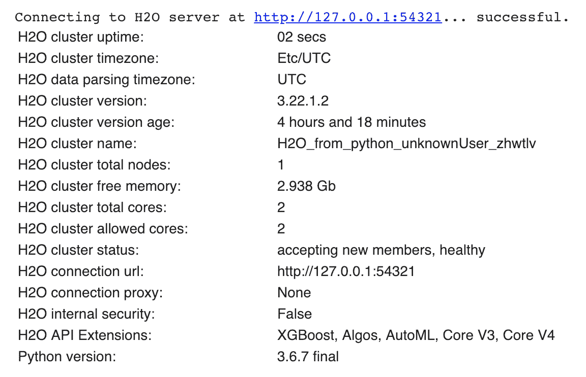
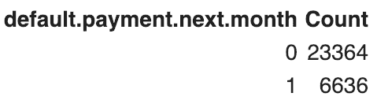
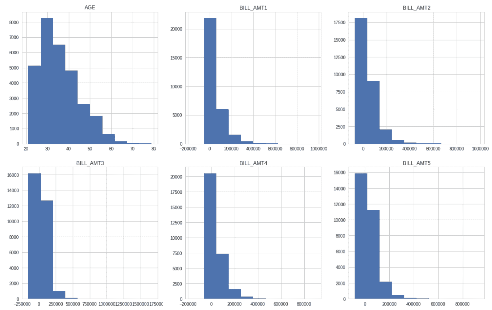
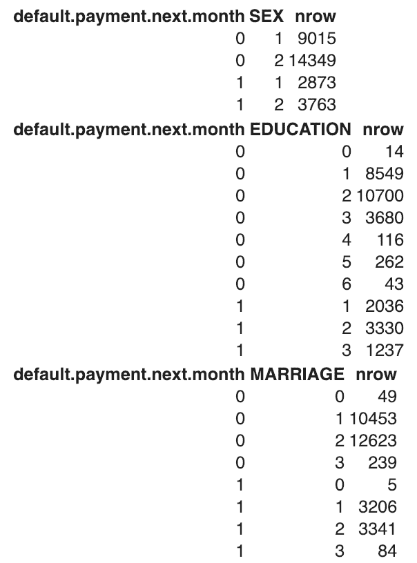
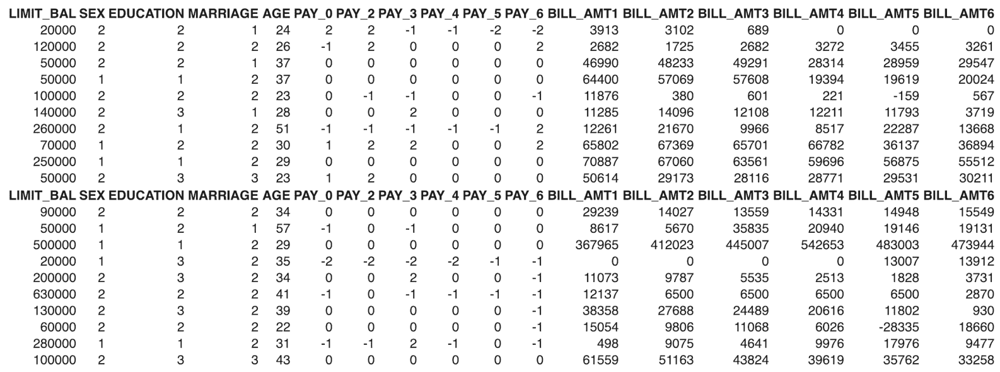
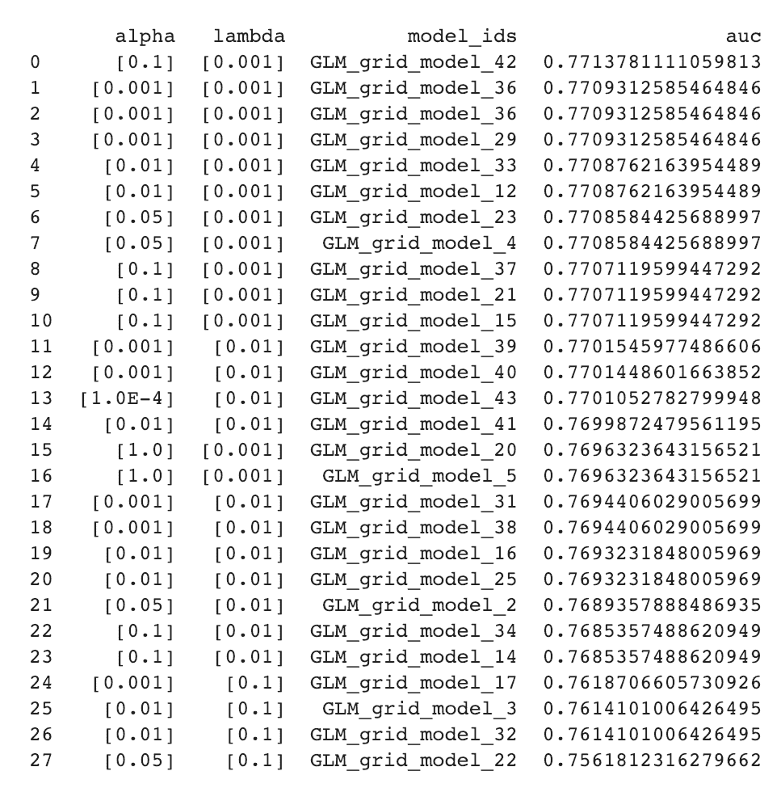
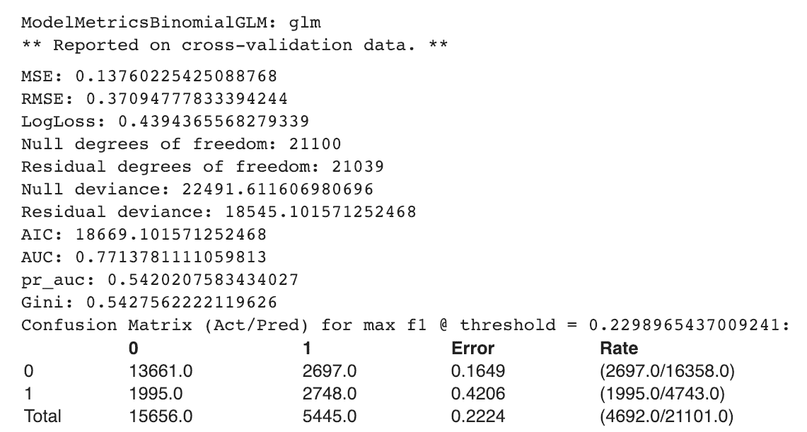

# 第十章：使用 H2O 的异构集成分类器

在本章中，我们将介绍以下食谱：

+   使用异构集成分类器预测信用卡违约者

# 简介

在本章中，我们将展示如何使用 H2O 构建异构集成分类器，H2O 是一个开源的、分布式的、内存中的机器学习平台。H2O 中提供了大量的监督和无监督算法。

在监督算法中，H2O 为我们提供了神经网络、随机森林（RF）、广义线性模型、梯度提升机、朴素贝叶斯分类器和 XGBoost。

H2O 还为我们提供了一个旨在通过堆叠过程找到一组预测算法最佳组合的堆叠集成方法。H2O 的堆叠集成支持回归和分类。

# 使用异构集成分类器预测信用卡违约者

我们将以台湾的信用卡支付违约者数据为例。这是我们之前在第三章，“重采样方法”中使用的相同数据集，用于构建逻辑回归模型。在本食谱中，我们将使用不同的算法构建多个模型，并最终构建一个堆叠集成模型。

此数据集包含有关台湾信用卡客户的信息。这包括有关支付违约者、客户的人口统计因素、他们的信用数据和他们的支付历史信息。数据集可在 GitHub 上找到。它也可以从其主要来源 UCI ML 存储库获得：[`bit.ly/2EZX6IC`](https://bit.ly/2EZX6IC)。

在我们的例子中，我们将使用以下来自 H2O 的监督算法来构建我们的模型：

+   广义线性模型

+   分布式随机森林

+   梯度提升机

+   堆叠集成

我们将了解如何在 Python 中使用这些算法，并学习如何为每个算法设置一些超参数。

# 准备工作

我们将使用 Google Colab 来构建我们的模型。在第十章，“使用 H2O 的异构集成分类器”，我们在“更多内容”部分解释了如何使用 Google Colaboratory。

我们将首先按照以下步骤在 Google Colab 中安装 H2O：

```py
! pip install h2o
```

执行前面的命令将显示一些指令，最后一行将显示以下消息（H2O 的版本号将根据最新版本而有所不同）：

```py
Successfully installed colorama-0.4.1 h2o-3.22.1.2
```

我们将按照以下方式导入所有必需的库：

```py
import pandas as pd
import numpy as np

from sklearn.model_selection import train_test_split
from sklearn.metrics import confusion_matrix, roc_curve, auc
from sklearn import tree

import h2o
from h2o.estimators.glm import H2OGeneralizedLinearEstimator
from h2o.estimators.random_forest import H2ORandomForestEstimator
from h2o.estimators.gbm import H2OGradientBoostingEstimator
from h2o.grid.grid_search import H2OGridSearch
from h2o.estimators.stackedensemble import H2OStackedEnsembleEstimator

import seaborn as sns
import matplotlib.pyplot as plt
%matplotlib inline
```

然后，我们将初始化 H2O：

```py
# Initialize H2o
h2o.init()
```

在成功初始化后，我们将看到以下截图所示的信息。这些信息可能因环境而异：



我们将从 Google Drive 读取我们的数据集。为了做到这一点，我们首先需要挂载驱动器：

```py
from google.colab import drive
drive.mount('/content/drive')
```

它将指导你访问一个 URL 以获取授权代码。你需要点击该 URL，复制授权代码，并将其粘贴。在成功挂载后，你可以从 Google Drive 的相应文件夹中读取你的文件：

```py
# Reading dataset from Google drive
df_creditcarddata = h2o.import_file("/content/drive/My Drive/Colab Notebooks/UCI_Credit_Card.csv")
```

注意，使用 `h2o.import_file`，我们创建 `h2o.frame.H2OFrame`。这与 `pandas` DataFrame 类似。然而，在 `pandas` DataFrame 的情况下，数据存储在内存中，而在这个案例中，数据位于 H2O 集群上。

你可以在 H2O DataFrame 上运行与在 pandas 上类似的方法。例如，为了查看 DataFrame 中的前 10 个观测值，你可以使用以下命令：

```py
df_creditcarddata.head()
```

为了检查 DataFrame 的维度，我们使用以下命令：

```py
df_creditcarddata.shape
```

为了查看所有列名，我们运行以下语法：

```py
df_creditcarddata.columns
```

在 `pandas` DataFrame 中，我们使用 `dtypes` 来查看每列的数据类型。在 H2o DataFrame 中，我们会使用以下：

```py
df_creditcarddata.types
```

这给出了以下输出。请注意，分类变量以 `'enum'` 的形式出现：


我们在数据集中有目标变量 `default.payment.next.month`。这告诉我们哪些客户已经违约或未违约。我们想看到违约者和非违约者的分布：

```py
df_creditcarddata['default.payment.next.month'].table()
```

这给出了 `default.payment.next.month` 变量中每个类别的计数：



我们不需要 `ID` 列进行预测建模，所以我们将其从 DataFrame 中删除：

```py
df_creditcarddata = df_creditcarddata.drop(["ID"], axis = 1) 
```

我们可以使用 `hist()` 方法查看数值变量的分布：

```py
import pylab as pl
df_creditcarddata[['AGE','BILL_AMT1','BILL_AMT2','BILL_AMT3','BILL_AMT4','BILL_AMT5','BILL_AMT6', 'LIMIT_BAL']].as_data_frame().hist(figsize=(20,20))
pl.show()
```

下面的屏幕截图显示了绘制的变量。这可以帮助我们分析每个变量：



为了扩展我们的分析，我们可以通过性别、教育和婚姻状况查看违约者和非违约者的分布：

```py
# Defaulters by Gender
columns = ["default.payment.next.month","SEX"]
default_by_gender = df_creditcarddata.group_by(by=columns).count(na ="all")
print(default_by_gender.get_frame())

# Defaulters by education
columns = ["default.payment.next.month","EDUCATION"]
default_by_education = df_creditcarddata.group_by(by=columns).count(na ="all")
print(default_by_education.get_frame())

# Defaulters by MARRIAGE
columns = ["default.payment.next.month","MARRIAGE"]
default_by_marriage = df_creditcarddata.group_by(by=columns).count(na ="all")
print(default_by_marriage.get_frame())
```

在下面的屏幕截图中，我们可以看到不同类别的违约者分布：



现在，我们将分类变量转换为因子：

```py
# Convert the categorical variables into factors

df_creditcarddata['SEX'] = df_creditcarddata['SEX'].asfactor()
df_creditcarddata['EDUCATION'] = df_creditcarddata['EDUCATION'].asfactor()
df_creditcarddata['MARRIAGE'] = df_creditcarddata['MARRIAGE'].asfactor()
df_creditcarddata['PAY_0'] = df_creditcarddata['PAY_0'].asfactor()
df_creditcarddata['PAY_2'] = df_creditcarddata['PAY_2'].asfactor()
df_creditcarddata['PAY_3'] = df_creditcarddata['PAY_3'].asfactor()
df_creditcarddata['PAY_4'] = df_creditcarddata['PAY_4'].asfactor()
df_creditcarddata['PAY_5'] = df_creditcarddata['PAY_5'].asfactor()
df_creditcarddata['PAY_6'] = df_creditcarddata['PAY_6'].asfactor()
```

我们还将二元目标变量 `default.payment.next.month` 编码为因子变量。转换后，我们使用 `levels()` 方法检查目标变量的类别：

```py
# Also, encode the binary response variable as a factor
df_creditcarddata['default.payment.next.month'] = df_creditcarddata['default.payment.next.month'].asfactor() 
df_creditcarddata['default.payment.next.month'].levels()
```

然后，我们将定义我们的预测变量和目标变量：

```py
# Define predictors manually
predictors = ['LIMIT_BAL','SEX','EDUCATION','MARRIAGE','AGE','PAY_0','PAY_2','PAY_3',\
 'PAY_4','PAY_5','PAY_6','BILL_AMT1','BILL_AMT2','BILL_AMT3','BILL_AMT4',\
 'BILL_AMT5','BILL_AMT6','PAY_AMT1','PAY_AMT2','PAY_AMT3','PAY_AMT4','PAY_AMT5','PAY_AMT6']

target = 'default.payment.next.month'
```

然后，我们使用 `split_frame()` 方法分割我们的 DataFrame：

```py
splits = df_creditcarddata.split_frame(ratios=[0.7], seed=1) 
```

以下代码给出了两个分割输出：

```py
splits
```

在下面的屏幕截图中，我们可以看到以下两个分割：



我们将分割分为训练和测试子集：

```py
train = splits[0]
test = splits[1] 
```

# 如何做到这一点...

让我们继续使用本章前面提到的算法来训练我们的模型。我们将首先训练我们的 **广义线性模型**（**GLM**）模型。我们将构建三个 GLM 模型：

+   带有默认参数值的 GLM 模型

+   带有 Lambda 搜索（正则化）的 GLM 模型

+   带有网格搜索的 GLM 模型

现在我们将在下一节开始训练我们的模型。

1.  让我们训练我们的第一个模型：

```py
GLM_default_settings = H2OGeneralizedLinearEstimator(family='binomial', \
                                            model_id='GLM_default',nfolds = 10, \
                                            fold_assignment = "Modulo", \
                                            keep_cross_validation_predictions = True)
```

`H2OGeneralizedLinearEstimator`拟合一个广义线性模型。它接受一个响应变量和一组预测变量。

`H2OGeneralizedLinearEstimator`可以处理回归和分类任务。在回归问题的情况下，它返回一个`H2ORegressionModel`子类，而对于分类，它返回一个`H2OBinomialModel`子类。

1.  我们在“准备就绪”部分创建了预测变量和目标变量。将预测变量和目标变量传递给模型：

```py
GLM_default_settings.train(x = predictors, y = target, training_frame = train)
```

1.  使用`lambda_search`参数训练 GLM 模型：

```py
GLM_regularized = H2OGeneralizedLinearEstimator(family='binomial', model_id='GLM', \
                                                lambda_search=True, nfolds = 10, \
                                                fold_assignment = "Modulo", \
                                                keep_cross_validation_predictions = True)

GLM_regularized.train(x = predictors, y = target, training_frame = train)
```

`lambda_search`帮助 GLM 找到最优的正则化参数λ。`lambda_search`参数接受一个布尔值。当设置为`True`时，GLM 将首先拟合一个具有最高λ值的模型，这被称为**最大正则化**。然后它将逐步降低λ值，直到达到最小λ值。得到的最佳模型基于最佳的λ值。

1.  使用 GLM 和网格搜索训练模型：

```py
hyper_parameters = { 'alpha': [0.001, 0.01, 0.05, 0.1, 1.0],
                     'lambda': [0.001, 0.01, 0.1, 1] }
search_criteria = { 'strategy': "RandomDiscrete", 'seed': 1,
                    'stopping_metric': "AUTO",
                    'stopping_rounds': 5 }

GLM_grid_search = H2OGridSearch(H2OGeneralizedLinearEstimator(family='binomial', \
                  nfolds = 10, fold_assignment = "Modulo", \
                  keep_cross_validation_predictions = True),\
                  hyper_parameters, grid_id="GLM_grid", search_criteria=search_criteria)

GLM_grid_search.train(x= predictors,y= target, training_frame=train)
```

1.  使用`get_grid()`方法按`auc`值排序网格结果：

```py
# Get the grid results, sorted by validation AUC
GLM_grid_sorted = GLM_grid_search.get_grid(sort_by='auc', decreasing=True)
GLM_grid_sorted
```

在以下屏幕截图中，我们可以看到每个模型的`auc`分数，它由不同的`alpha`和`lambda`参数组合而成：



1.  我们可以看到我们的训练数据和交叉验证数据上的模型指标：

```py
# Extract the best model from random grid search
Best_GLM_model_from_Grid = GLM_grid_sorted.model_ids[0]

# model performance
Best_GLM_model_from_Grid = h2o.get_model(Best_GLM_model_from_Grid)
print(Best_GLM_model_from_Grid)
```

从前面的代码块中，您可以评估模型指标，包括`MSE`、`RMSE`、`Null`和`Residual Deviance`、`AUC`、`Gini`以及`Confusion Matrix`。在稍后的阶段，我们将使用网格搜索中的最佳模型进行我们的堆叠集成。

让我们看一下以下图像并评估模型指标：



1.  使用随机森林训练模型。使用默认设置的随机森林代码如下：

```py
# Build a RF model with default settings
RF_default_settings = H2ORandomForestEstimator(model_id = 'RF_D',\
                                nfolds = 10, fold_assignment = "Modulo", \
                                keep_cross_validation_predictions = True)

# Use train() to build the model
RF_default_settings.train(x = predictors, y = target, training_frame = train)
```

1.  要获取模型的摘要输出，请使用以下代码：

```py
RF_default_settings.summary()
```

1.  使用网格搜索训练随机森林模型。将超参数设置如下所示：

```py
hyper_params = {'sample_rate':[0.7, 0.9],
                'col_sample_rate_per_tree': [0.8, 0.9],
                'max_depth': [3, 5, 9],
                'ntrees': [200, 300, 400]
               }
```

1.  使用`H2OGridSearch()`上的超参数使用`gridsearch`训练`RF`模型：

```py
RF_grid_search = H2OGridSearch(H2ORandomForestEstimator(nfolds = 10, \
                             fold_assignment = "Modulo", \
                             keep_cross_validation_predictions = True, \
                             stopping_metric = 'AUC',stopping_rounds = 5), \
                             hyper_params = hyper_params, \
                             grid_id= 'RF_gridsearch')

# Use train() to start the grid search
RF_grid_search.train(x = predictors, y = target, training_frame = train)
```

1.  按 AUC 分数排序结果以查看哪个模型表现最佳：

```py
# Sort the grid models
RF_grid_sorted = RF_grid_search.get_grid(sort_by='auc', decreasing=True)
print(RF_grid_sorted)
```

1.  从网格搜索结果中提取最佳模型：

```py
Best_RF_model_from_Grid = RF_grid_sorted.model_ids[0]

# Model performance
Best_RF_model_from_Grid = h2o.get_model(Best_RF_model_from_Grid) 
print(Best_RF_model_from_Grid)
```

在以下屏幕截图中，我们可以看到网格模型在训练数据和交叉验证数据上的模型指标：


1.  使用 GBM 训练模型。以下是使用默认设置训练 GBM 的方法：

```py
GBM_default_settings = H2OGradientBoostingEstimator(model_id = 'GBM_default', \
                       nfolds = 10, \
                       fold_assignment = "Modulo", \
                       keep_cross_validation_predictions = True)

# Use train() to build the model
GBM_default_settings.train(x = predictors, y = target, training_frame = train)
```

1.  在 GBM 上使用网格搜索。要执行网格搜索，请设置以下超参数：

```py
hyper_params = {'learn_rate': [0.001,0.01, 0.1],
                'sample_rate': [0.8, 0.9],
                'col_sample_rate': [0.2, 0.5, 1],
                'max_depth': [3, 5, 9]}
```

1.  使用`H2OGridSearch()`上的超参数使用网格搜索训练 GBM 模型：

```py
GBM_grid_search = H2OGridSearch(H2OGradientBoostingEstimator(nfolds = 10, \
                        fold_assignment = "Modulo", \
                        keep_cross_validation_predictions = True,\
                        stopping_metric = 'AUC', stopping_rounds = 5),
                        hyper_params = hyper_params, grid_id= 'GBM_Grid')

# Use train() to start the grid search
GBM_grid_search.train(x = predictors, y = target, training_frame = train)
```

1.  与早期模型一样，我们可以按 AUC 排序查看结果：

```py
# Sort and show the grid search results
GBM_grid_sorted = GBM_grid_search.get_grid(sort_by='auc', decreasing=True)
print(GBM_grid_sorted)
```

1.  从网格搜索中提取最佳模型：

```py
Best_GBM_model_from_Grid = GBM_grid_sorted.model_ids[0]

Best_GBM_model_from_Grid = h2o.get_model(Best_GBM_model_from_Grid) 
print(Best_GBM_model_from_Grid)
```

我们可以使用`H2OStackedEnsembleEstimator`构建一个堆叠集成 ML 模型，该模型可以使用我们使用 H2O 算法构建的模型来提高预测性能。`H2OStackedEnsembleEstimator`帮助我们找到一组预测算法的最佳组合。

1.  创建一个列表，包含我们使用网格搜索构建的早期模型的最佳模型：

```py
# list the best models from each grid
all_models = [Best_GLM_model_from_Grid, Best_RF_model_from_Grid, Best_GBM_model_from_Grid]
```

1.  使用`H2OStackedEnsembleEstimator`设置堆叠集成模型：

```py
# Set up Stacked Ensemble
ensemble = H2OStackedEnsembleEstimator(model_id = "ensemble", base_models = all_models, metalearner_algorithm = "deeplearning")

# uses GLM as the default metalearner
ensemble.train(y = target, training_frame = train)
```

1.  在测试数据上评估集成性能：

```py
# Eval ensemble performance on the test data
Ens_model = ensemble.model_performance(test)
Ens_AUC = Ens_model.auc()
```

1.  在`test`数据上比较基学习器的性能。以下代码测试了我们构建的所有 GLM 模型的表现：

```py
# Checking the model performance for all GLM models built
model_perf_GLM_default = GLM_default_settings.model_performance(test)
model_perf_GLM_regularized = GLM_regularized.model_performance(test)
model_perf_Best_GLM_model_from_Grid = Best_GLM_model_from_Grid.model_performance(test)
```

以下代码测试了我们构建的所有随机森林模型的表现：

```py
# Checking the model performance for all RF models built
model_perf_RF_default_settings = RF_default_settings.model_performance(test)
model_perf_Best_RF_model_from_Grid = Best_RF_model_from_Grid.model_performance(test)
```

以下代码测试了我们构建的所有 GBM 模型的表现：

```py
# Checking the model performance for all GBM models built
model_perf_GBM_default_settings = GBM_default_settings.model_performance(test)
model_perf_Best_GBM_model_from_Grid = Best_GBM_model_from_Grid.model_performance(test)
```

1.  要从基学习器中获得最佳的 AUC，请执行以下命令：

```py
# Best AUC from the base learner models
best_auc = max(model_perf_GLM_default.auc(), model_perf_GLM_regularized.auc(), \
 model_perf_Best_GLM_model_from_Grid.auc(), \
 model_perf_RF_default_settings.auc(), \
 model_perf_Best_RF_model_from_Grid.auc(), \
 model_perf_GBM_default_settings.auc(), \
 model_perf_Best_GBM_model_from_Grid.auc())

print("Best AUC out of all the models performed: ", format(best_auc))
```

1.  以下命令显示了堆叠集成模型的 AUC：

```py
# Eval ensemble performance on the test data
Ensemble_model = ensemble.model_performance(test)
Ensemble_model = Ensemble_model.auc()
```

# 它是如何工作的...

我们使用 Google Colab 来训练我们的模型。在我们在 Google Colab 中安装 H2O 之后，我们初始化了 H2O 实例。我们还导入了所需的库。

为了使用 H2O 库，我们从`h2o.estimators`中导入了`H2OGeneralizedLinearEstimator`、`H2ORandomForestEstimator`和`H2OGradientBoostingEstimator`。我们还导入了`H2OStackedEnsembleEstimator`，以使用堆叠集成训练我们的模型。

我们挂载了 Google Drive 并使用`h2o.import_file()`读取我们的数据集。这创建了一个 H2O DataFrame，它与`pandas` DataFrame 非常相似。然而，数据不是存储在内存中，而是在远程 H2O 集群中的一个位置。

然后，我们对 H2O DataFrame 进行了基本操作以分析我们的数据。我们查看维度、前几行以及每列的数据类型。`shape`属性返回一个包含行数和列数的元组。`head()`方法返回前 10 个观测值。`types`属性返回每列的数据类型。

注意，H2O DataFrame 中的分类变量被标记为`enum`。

我们的目标变量是`default.payment.next.month`。使用`table()`方法，我们看到了目标变量两个类的分布。在这种情况下，`table()`方法返回了类`1`和`0`的计数。

我们不需要`ID`列，因此使用带有`axis=1`参数的`drop()`方法将其删除。使用`axis=1`，它删除了列。否则，`axis=0`的默认值将删除索引中的标签。

我们分析了数值变量的分布。你可以探索数据到任何程度。我们还通过性别、教育、婚姻等各种类别看到了目标变量两个类的分布。

然后，我们使用`asfactor()`方法将分类变量转换为因子类型。这也适用于目标变量。

我们创建了一个预测变量列表和目标变量列表。我们使用`split_frame()`方法将我们的 DataFrame 拆分为训练集和测试集。

我们将比率传递给`split_frame()`方法。在我们的例子中，我们将数据集拆分为 70%和 30%。然而，请注意，这并没有给出精确的 70%-30%拆分。H2O 使用概率拆分方法而不是使用精确比率来拆分数据集。这是为了使在大数据上的拆分更加高效。

在我们将数据集拆分为训练集和测试集之后，我们开始训练我们的模型。我们使用了 GLM、随机森林、**梯度提升机**（**GBM**）和堆叠集成来训练堆叠模型。

在*如何做...*部分，在*步骤 1*和*步骤 2*中，我们展示了使用默认设置训练 GLM 模型的代码。我们使用交叉验证来训练我们的模型。

在*步骤 3*中，我们使用`lambda_search`训练了一个 GLM 模型，这有助于找到最佳的正则化参数。

在*步骤 4*中，我们使用网格搜索参数来训练我们的 GLM 模型。我们设置了超参数并将它们提供给`H2OGridSearch()`方法。这有助于我们在模型之间搜索最佳参数。在`H2OGridSearch()`方法中，我们使用了`RandomDiscrete`搜索标准策略。

默认的搜索标准策略是笛卡尔，它涵盖了超参数组合的全部空间。随机离散策略执行所有提供的超参数组合的随机搜索。

在*步骤 5*中，通过`get_grid()`方法，我们查看使用提供的参数的不同组合构建的每个模型的 AUC 分数。在*步骤 6*中，我们从随机网格搜索中提取了`最佳`模型。我们还可以在最佳模型上使用`print()`方法来查看模型在训练数据和交叉验证数据上的性能指标。

在*步骤 7*中，我们使用默认设置训练了一个随机森林模型，并在步骤 8 中查看结果的模型摘要。在*步骤 9*和*步骤 10*中，我们展示了使用网格搜索训练随机森林模型的代码。我们为各种可接受的超参数设置了多个值，例如`sample_rate`、`col_sample_rate_per_tree`、`max_depth`和`ntrees`。`sample_rate`指的是不重复的行采样。它的值在`0`和`1`之间，表示数据的采样百分比。`col_sample_rate_per_tree`是每个树的不重复列采样。`max_depth`用于指定每个树应构建的最大深度。更深的树可能在训练数据上表现更好，但将花费更多计算时间，并且可能过拟合，无法泛化到未见过的数据。`ntrees`参数用于基于树的算法，用于指定在模型上构建的树的数量。

在*步骤 11*和*步骤 12*中，我们打印了由网格搜索生成的每个模型的 AUC 分数，并从中提取了最佳模型。

我们还训练了 GBM 模型来拟合我们的数据。在第 13 步中，我们使用默认设置构建了 GBM。在第 14 步中，我们为网格搜索设置了超参数空间。我们在第 15 步中使用了它，在那里我们训练了我们的 GBM。在 GBM 中，我们为超参数设置了值，例如`learn_rate`、`sample_rate`、`col_sample_rate`、`max_depth`和`ntrees`。`learn_rate`参数用于指定 GBM 算法训练模型的速度。较低的`learn_rate`参数值更好，可以帮助避免过拟合，但可能会在计算时间上付出代价。

在 H2O 中，`learn_rate`在 GBM 和 XGBoost 中可用。

第 16 步显示了网格搜索产生的每个模型的 AUC 分数。我们在第 17 步中提取了最佳的网格搜索 GBM。

在第 18 步到第 20 步中，我们使用 H2O 的`H2OStackedEnsembleEstimator`训练了我们的堆叠集成模型。我们在测试数据上评估了所得模型的性能。

在第 21 步中，我们评估了我们构建的所有 GLM 模型在测试数据上的表现。我们用 RF 和 GBM 训练的所有模型也做了同样的事情。在第 22 步中，我们得到了 AUC 分数最高的模型。在第 23 步中，我们评估了堆叠集成模型在测试数据上的 AUC 分数，以便比较堆叠集成模型与单个基础学习器的性能。

# 还有更多...

注意，我们使用了交叉验证来训练所有模型。我们使用`nfolds`选项来设置用于交叉验证的折数。在我们的例子中，我们使用了`nfolds=5`，但我们也可以将其设置为更高的数字。

每个构建的模型中折数需要相同。

指定了`nfolds`的值后，我们还可以为`fold_assignment`参数提供一个值。`fold_assignment`可以取`auto`、`random`、`modulo`和`stratified`等值。如果我们将其设置为`Auto`，算法将自动选择一个选项；目前，它选择`Random`。将`fold_assignment`设置为`Random`将启用将数据随机分割成`nfolds`个集合。当`fold_assignment`设置为`Modulo`时，它使用确定性方法将数据均匀分割成`nfolds`，这些`nfolds`不依赖于`seed`参数。

当我们使用交叉验证方法构建模型时，确保您为所有模型指定一个`seed`值或使用`fold_assignment="Modulo"`。

在网格搜索中，我们使用了两个参数：`stopping_metric`和`stopping_rounds`。这些参数适用于 GBM 和随机森林算法，但不适用于 GLM。`stopping_metric`指定了在指定提前停止时考虑的指标，这可以通过将`stopping_rounds`设置为一个大于零的值来实现。

在我们的示例中，我们将`stopping_metric`设置为 AUC，将`stopping_rounds`设置为五。这意味着如果 AUC 在指定的轮次（在我们的例子中是五轮）内没有改善，算法将测量 AUC 并在进一步训练之前停止。

如果指定了`stopping_metric`，则必须设置`stopping_rounds`。当也设置了`stopping_tolerance`时，如果模型的`stopping_metric`没有通过`stopping_tolerance`值改善，模型将在达到`stopping_rounds`中提到的轮数后停止训练。

# 参见

H2O 文档可在[`docs.h2o.ai/`](http://docs.h2o.ai/)找到。
