# 第十一章：使用 NLP 进行文本分类的异构集成

在本章中，我们将涵盖以下主题：

+   使用异构算法集成的垃圾邮件过滤

+   使用集成模型进行电影评论的情感分析

# 简介

文本分类是语言处理和文本挖掘广泛研究的一个领域。使用文本分类机制，我们可以根据其内容将文档分类到预定义的类别中。

在本章中，我们将探讨如何对发送到我们手机上的短文本消息进行分类。虽然我们收到的某些消息很重要，但其他消息可能对我们的隐私构成严重威胁。我们希望能够正确地分类文本消息，以避免垃圾邮件并避免错过重要消息。

# 使用异构算法集成的垃圾邮件过滤

我们将使用来自 UCI ML 存储库的 SMS 垃圾邮件收集数据集来创建垃圾邮件分类器。使用垃圾邮件分类器，我们可以估计这些消息的极性。我们可以使用各种分类器将消息分类为垃圾邮件或非垃圾邮件。

在这个例子中，我们选择如朴素贝叶斯、随机森林和支持向量机之类的算法来训练我们的模型。

我们使用各种数据清洗和准备机制来准备我们的数据。为了预处理我们的数据，我们将执行以下序列：

1.  将所有文本转换为小写

1.  删除标点符号

1.  删除停用词

1.  执行词干提取

1.  数据分词

我们还使用**词频-逆文档频率**（**TF-IDF**）处理我们的数据，这告诉我们单词在消息或文档中出现的频率。TF 的计算如下：

`TF = 单词在文档中出现的次数 / 文档中单词的总数`

TF-IDF 根据单词在文档或文档集合中出现的频率对单词的重要性进行数值评分。简单来说，TF-IDF 分数越高，术语越罕见。分数越低，则越常见。TD-IDF 的数学表示如下：

`tfidf(w,d,D)= tf(t,d) × idf(t,D)`

其中 w 代表单词，d 代表文档，D 代表文档集合。

在这个例子中，我们将使用 SMS 垃圾邮件收集数据集，该数据集包含用于手机垃圾邮件研究收集的有标签消息。此数据集可在 UCI ML 存储库中找到，并在 GitHub 存储库中提供。

# 准备工作

我们首先导入所需的库：

```py
import os
import numpy as np
import pandas as pd
import itertools
import warnings
import string
import matplotlib.pyplot as plt
from nltk.corpus import stopwords
from nltk.stem import WordNetLemmatizer
from sklearn.feature_extraction.text import CountVectorizer
from sklearn.feature_extraction.text import TfidfVectorizer
from sklearn.model_selection import train_test_split
from sklearn.naive_bayes import MultinomialNB
from sklearn.metrics import confusion_matrix
from sklearn.model_selection import GridSearchCV
from sklearn.ensemble import RandomForestClassifier
from sklearn.metrics import classification_report
from sklearn.metrics import roc_auc_score as auc
from sklearn.metrics import roc_curve
from sklearn.metrics import accuracy_score
from scipy.stats import mode
```

注意，在这个例子中，我们导入如`nltk`之类的库来准备我们的数据。我们还从`sklearn.feature_extraction`导入`CountVectorizer`和`TfidfVectorizer`模块。这些模块用于机器学习算法中的特征提取。

我们重用来自 scikit-learn 网站的`plot_confusion_matrix`来绘制混淆矩阵。这是我们之前章节中使用的相同函数：

```py
def plot_confusion_matrix(cm, classes,
                          normalize=False,
                          title='Confusion matrix',
                          cmap=plt.cm.Blues):

    plt.imshow(cm, interpolation='nearest', cmap=cmap)
    plt.title(title)
    plt.colorbar()
    tick_marks = np.arange(len(classes))
    plt.xticks(tick_marks, classes, rotation=45)
    plt.yticks(tick_marks, classes)

    fmt = '.2f' if normalize else 'd'
    thresh = cm.max() / 2.
    for i, j in itertools.product(range(cm.shape[0]), range(cm.shape[1])):
        plt.text(j, i, format(cm[i, j], fmt),
                 horizontalalignment="center",
                 color="white" if cm[i, j] > thresh else "black")

    plt.ylabel('True label')
    plt.xlabel('Predicted label')
    plt.tight_layout()
```

我们设置工作目录并读取数据集：

```py
os.chdir("/.../Chapter 11/CS - SMS Classification")
os.getcwd()

df_sms = pd.read_csv("sms_labeled_data.csv", encoding = 'utf8')
```

注意，我们使用`encoding='utf8'`。这是为了指导`read_csv()`方法使用 UTF 编码来读取文件。Python 附带了许多编解码器。完整的列表可在[`docs.python.org/3/library/codecs.html#standard-encodings`](https://docs.python.org/3/library/codecs.html#standard-encodings)找到。

在读取数据后，我们检查它是否已正确加载：

```py
df_sms.head()
```

我们还使用`dataframe.shape`检查数据集中的观测值和特征数量：

```py
df_sms.shape
```

我们查看垃圾邮件和正常邮件的数量：

```py
# Gives the count for ham messages
print(df_sms["type"].value_counts()[0])
no_of_ham_messages = df_sms["type"].value_counts()[0]

# Gives the count for spam messages
print(df_sms["type"].value_counts()[1])
no_of_spam_messages = df_sms["type"].value_counts()[1]
```

我们还可以可视化垃圾邮件和正常邮件的比例：

```py
sms_count = pd.value_counts(df_sms["type"], sort= True)
ax = sms_count.plot(kind='bar', figsize=(10,10), color= ["green", "orange"], fontsize=13)

ax.set_alpha(0.8)
ax.set_title("Percentage Share of Spam and Ham Messages")
ax.set_ylabel("Count of Spam & Ham messages");
ax.set_yticks([0, 500, 1000, 1500, 2000, 2500, 3000, 3500, 4000, 4500, 5000, 5500])

totals = []
for i in ax.patches:
totals.append(i.get_height())

total = sum(totals)

# set individual bar lables using above list
for i in ax.patches:
string = str(round((i.get_height()/total)*100, 2))+'%'
# get_x pulls left or right; get_height pushes up or down
ax.text(i.get_x()+0.16, i.get_height(), string, fontsize=13, color='black')
```

使用前面的代码，我们看到以下图表：

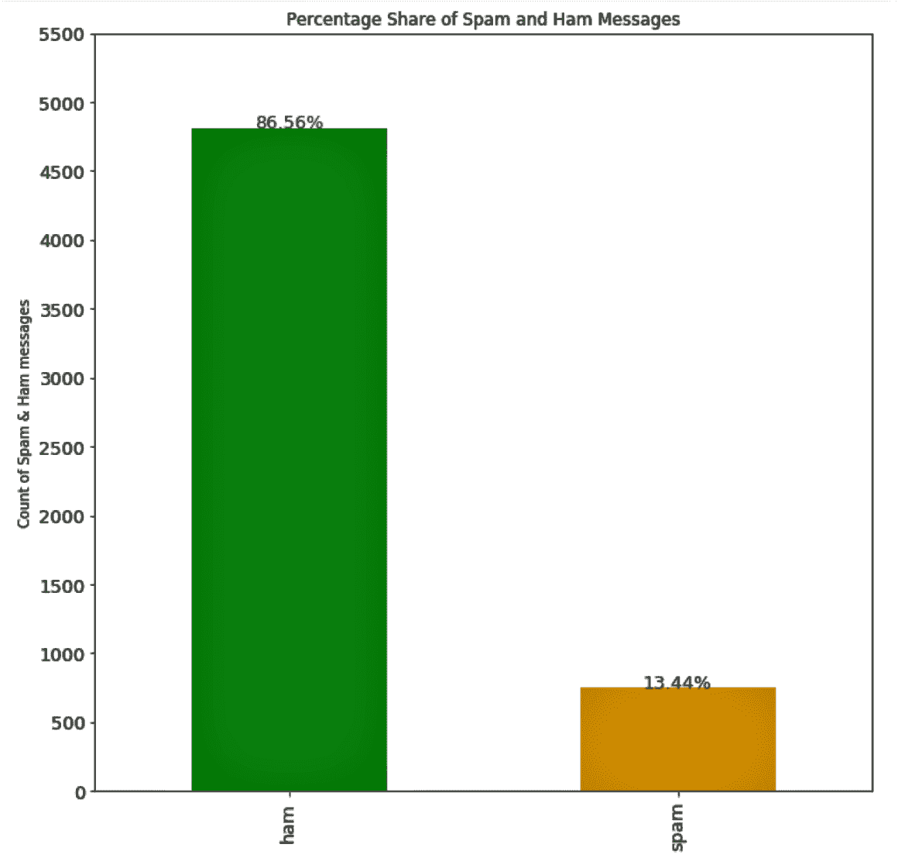

我们还定义了一个函数来删除标点符号，将文本转换为小写，并删除停用词：

```py
lemmatizer = WordNetLemmatizer()

# Defining a function to remove punctuations, convert text to lowercase and remove stop words
def process_text(text):
    no_punctuations = [char for char in text if char not in string.punctuation]
    no_punctuations = ''.join(no_punctuations)

    clean_words = [word.lower() for word in nopunc.split() if word.lower() not in stopwords.words('english')]
    clean_words = [lemmatizer.lemmatize(lem) for lem in clean_words]
    clean_words = " ".join(clean_words)

    return clean_words
```

我们将定义的`process_text()`函数应用于数据集中的文本变量：

```py
df_sms['text'] = df_sms['text'].apply(text_processing)
```

我们将特征和目标变量分开，并将数据分为`train`和`test`子集：

```py
X = df_sms.loc[:,'text']
Y = df_sms.loc[:,'type']
Y = Y.astype('int')

X_train, X_test, Y_train, Y_test = train_test_split(X, Y, test_size=.3, random_state=1)
```

我们使用`CountVectorizer`模块将文本转换为向量：

```py
count_vectorizer = CountVectorizer(stop_words='english')

count_train = count_vectorizer.fit_transform(X_train)
count_test = count_vectorizer.transform(X_test)
```

我们还使用`TfidfVectorizer`模块将文本转换为 TF-IDF 向量：

```py
tfidf = TfidfVectorizer(stop_words='english')

tfidf_train = tfidf.fit_transform(X_train)
tfidf_test = tfidf.transform(X_test)
```

现在让我们继续训练我们的模型。我们在计数数据和 TF-IDF 数据上使用以下算法，并查看单个模型的表现：

+   朴素贝叶斯

+   支持向量机

+   随机森林

我们还结合模型预测以查看集成结果。

# 如何做到这一点...

让我们从训练我们的模型开始，看看它们在本节中的表现：

1.  使用朴素贝叶斯算法训练模型。将此算法应用于计数数据和 TF-IDF 数据。

下面的代码用于在计数数据上训练朴素贝叶斯：

```py
from sklearn.naive_bayes import MultinomialNB
nb = MultinomialNB()

nb.fit(count_train, Y_train)
nb_pred_train = nb.predict(count_train)
nb_pred_test = nb.predict(count_test)
nb_pred_train_proba = nb.predict_proba(count_train)
nb_pred_test_proba = nb.predict_proba(count_test)

print('The accuracy for the training data is {}'.format(nb.score(count_train, Y_train)))
print('The accuracy for the testing data is {}'.format(nb.score(count_test, Y_test)))
```

查看前面模型的`train`和`test`准确率：

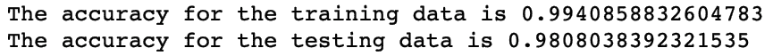

1.  使用`classification_report()`方法打印分类报告。将`Y_test`和`nb_pred_test`传递给`classification_report()`方法：

```py
print(classification_report(Y_test, nb_pred_test))
```

这给出了以下输出，显示了目标变量中每个类的`precision`、`recall`、`f1-score`和`support`：

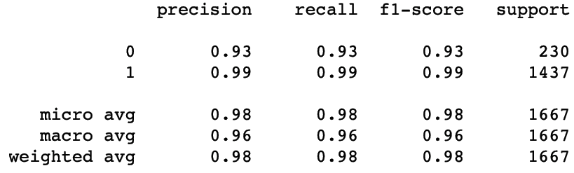

1.  将`Y_test`和`nb_pred_test`传递给`plot_confusion_matrix()`函数以绘制混淆矩阵，如下所示：

```py
target_names = ['Spam','Ham']

# Pass actual & predicted values to the confusion matrix()
cm = confusion_matrix(Y_test, nb_pred_test)
plt.figure()
plot_confusion_matrix(cm, classes=target_names)
plt.show()
```

下面的图表显示了真正的负例、假正例、假负例和真正例的值：

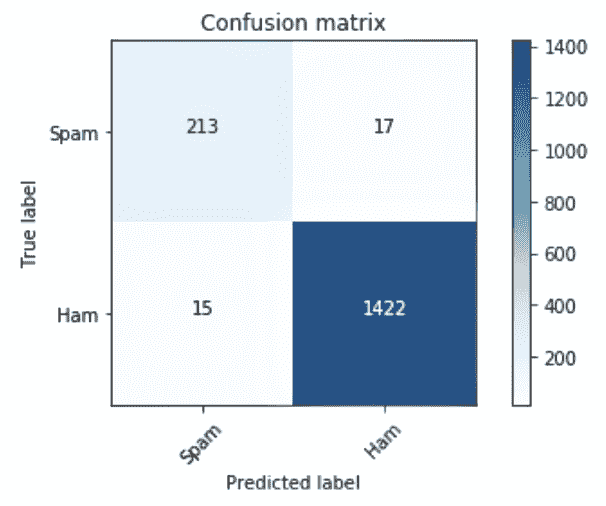

注意，在之前的*准备*部分中，我们使用了`TfidfVectorizer`模块将文本转换为 TF-IDF 向量。

1.  将朴素贝叶斯模型拟合到 TF-IDF 训练数据：

```py
nb.fit(tfidf_train, Y_train)
nb_pred_train_tfidf = nb.predict(tfidf_train)
nb_pred_test_tfidf = nb.predict(tfidf_test)

nb_tfidf_pred_train_proba = nb.predict_proba(tfidf_train)
nb_tfidf_pred_test_proba = nb.predict_proba(tfidf_test)

print('The accuracy for the training data is {}'.format(nb.score(count_train, Y_train)))
print('The accuracy for the testing data is {}'.format(nb.score(count_test, Y_test)))
```

1.  检查 TF-IDF 测试数据的性能统计信息：

```py
print(classification_report(Y_test, nb_pred_test_tfidf))

target_names = ['Spam','Ham']

# Pass actual & predicted values to the confusion matrix()
cm = confusion_matrix(Y_test, nb_pred_test_tfidf)
plt.figure()

plot_confusion_matrix(cm, classes=target_names)
plt.show()
```

在下面的屏幕截图，我们可以看到前面代码块的结果：

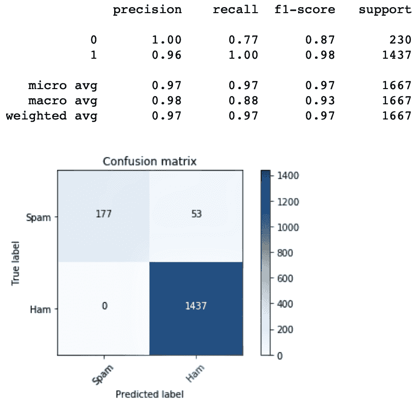

1.  使用支持向量机分类器对计数数据进行模型拟合。使用`GridSearchCV`在估计器的指定参数值范围内进行搜索：

```py
from sklearn.svm import SVC

svc = SVC(kernel='rbf',probability=True)
svc_params = {'C':[0.001, 0.01, 0.1, 1, 10]}

svc_gcv_rbf_count = GridSearchCV(svc, svc_params, cv=5)
svc_gcv_rbf_count.fit(count_train, Y_train)

# We use the grid model to predict the class 
svc_rbf_train_predicted_values = svc_gcv_rbf_count.predict(count_train)
svc_rbf_test_predicted_values = svc_gcv_rbf_count.predict(count_test)

# We use the grid model to predict the class probabilities
svc_gcv_train_proba_rbf = svc_gcv_rbf_count.predict_proba(count_train)
svc_gcv_test_proba_rbf = svc_gcv_rbf_count.predict_proba(count_test)

print('The best parameters {}'.format(svc_gcv_rbf_count.best_params_))
print('The best score {}'.format(svc_gcv_rbf_count.best_score_))
```

网格搜索为我们提供了最佳模型。我们可以看到最佳模型的参数值和得分：

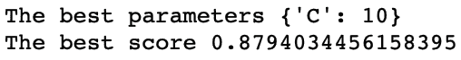

1.  使用以下代码查看计数数据的`test`准确率：

```py
print(classification_report(Y_test, svc_rbf_test_predicted_values))

target_names = ['Spam','Ham']

# Pass actual & predicted values to the confusion matrix()
cm = confusion_matrix(Y_test, svc_rbf_test_predicted_values)
plt.figure()
plot_confusion_matrix(cm,classes=target_names)
plt.show()
```

这是`classification_report()`和混淆矩阵的输出：

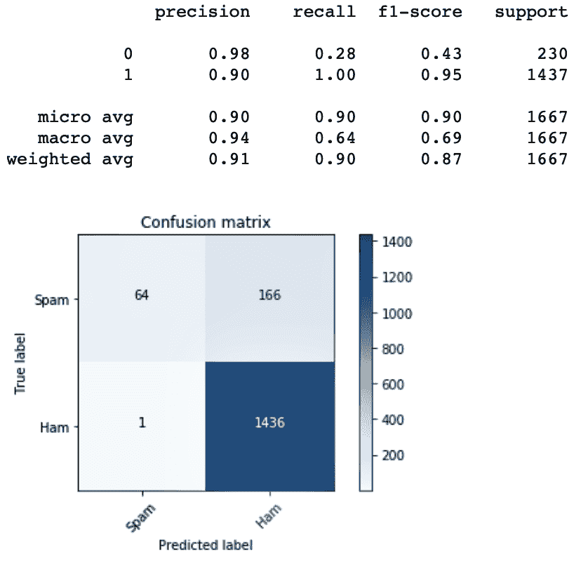

1.  使用 TF-IDF 数据使用 SVM：

```py
svc = SVC(kernel='rbf',probability=True)
svc_params = {'C':[0.001, 0.01, 0.1, 1, 10]}

svc_gcv = GridSearchCV(svc,svc_params,cv=5)
svc_gcv.fit(tfidf_train, Y_train)

# We use the grid model to predict the class 
svc_tfidf_rbf_train_predicted_values = svc_gcv.predict(tfidf_train)
svc_tfidf_rbd_test_predicted_values = svc_gcv.predict(tfidf_test)

# We use the grid model to predict the class probabilities
svc_gcv_tfidf_train_proba_rbf = svc_gcv.predict_proba(tfidf_train)
svc_gcv_tfidf_test_proba_rbf = svc_gcv.predict_proba(tfidf_test)

print('The best parameters {}'.format(svc_gcv.best_params_))
print('The best score {}'.format(svc_gcv.best_score_))
```

以下输出显示了使用 SVM 和 RBF 核在 TF-IDF 数据上训练的模型的最佳得分：

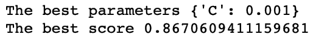

1.  打印前一个模型的分类报告和混淆矩阵：

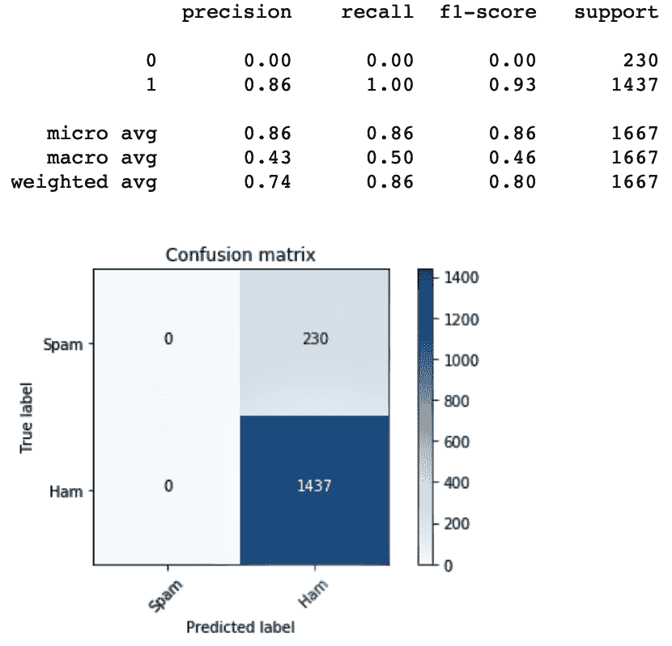

1.  使用网格搜索交叉验证在计数数据上拟合随机森林模型，就像我们对 SVM 所做的那样：

```py
# Set the parameters for grid search
rf_params = {"criterion":["gini","entropy"],"min_samples_split":[2,3],"max_depth":[None,2,3],"min_samples_leaf":[1,5],"max_leaf_nodes":[None],"oob_score":[True]}

# Create an instance of the Random Forest Classifier()
rf = RandomForestClassifier()

# Use gridsearchCV(), pass the values you have set for grid search
rf_gcv = GridSearchCV(rf, rf_params, cv=5)

# Fit the model onto the train data
rf_gcv.fit(count_train, Y_train)

# We use the grid model to predict the class 
rf_train_predicted_values = rf_gcv.predict(count_train)
rf_test_predicted_values = rf_gcv.predict(count_test)

# We use the grid model to predict the class probabilities
rf_gcv_pred_train_proba = rf_gcv.predict_proba(count_train)
rf_gcv_pred_test_proba = rf_gcv.predict_proba(count_test)

print('The best parameters {}'.format(rf_gcv.best_params_))
print('The best score {}'.format(rf_gcv.best_score_))
```

网格搜索随机森林的网格参数返回最佳参数和最佳得分，如下截图所示：

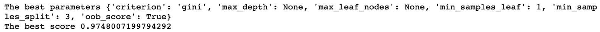

1.  使用分类报告和混淆矩阵，查看我们在测试数据上使用计数数据的随机森林模型的性能指标：

```py
print(classification_report(Y_test, rf_test_predicted_values))

target_names = ['Spam','Ham']

# Pass actual & predicted values to the confusion matrix()
cm = confusion_matrix(Y_test, rf_test_predicted_values)
plt.figure()
plot_confusion_matrix(cm,classes=target_names)
plt.show() 
```

报告如下所示：

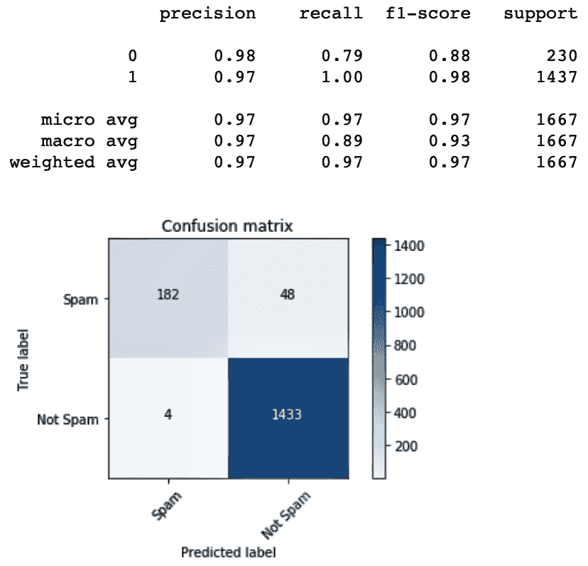

1.  在 TF-IDF 数据上使用网格搜索在随机森林上构建模型：

```py
# Set the parameters for grid search
rf_params = {"criterion":["gini","entropy"],"min_samples_split":[2,3],"max_depth":[None,2,3],"min_samples_leaf":[1,5],"max_leaf_nodes":[None],"oob_score":[True]}

# Create an instance of the Random Forest Classifier()
rf = RandomForestClassifier()

# Use gridsearchCV(), pass the values you have set for grid search
rf_gcv = GridSearchCV(rf, rf_params, cv=5)

rf_gcv.fit(tfidf_train, Y_train)

rf_tfidf_train_predicted_values = rf_gcv.predict(tfidf_train)
rf_tfidf_test_predicted_values = rf_gcv.predict(tfidf_test)

rf_gcv_tfidf_pred_train_proba = rf_gcv.predict_proba(tfidf_train)
rf_gcv_tfidf_pred_test_proba = rf_gcv.predict_proba(tfidf_test)

print('The best parameters {}'.format(rf_gcv.best_params_))
print('The best score {}'.format(rf_gcv.best_score_))

print(classification_report(Y_test, rf_tfidf_test_predicted_values))

target_names = ['Spam','Ham']
# Pass actual & predicted values to the confusion matrix()
cm = confusion_matrix(Y_test, rf_tfidf_test_predicted_values)
plt.figure()
plot_confusion_matrix(cm, classes=target_names)
plt.show()
```

1.  将`predict_proba()`方法的输出取出来，收集每个模型的预测概率以绘制 ROC 曲线。完整的代码在代码包中提供。

这里是绘制基于朴素贝叶斯模型在计数数据上的 ROC 曲线的代码示例：

```py
fpr, tpr, thresholds = roc_curve(Y_test, nb_pred_test_proba[:,1])
roc_auc = auc(Y_test,nb_pred_test_proba[:,1])

plt.title('ROC Naive Bayes (Count)')
plt.plot(fpr, tpr, 'b',label='AUC = %0.3f'% roc_auc)
plt.legend(loc='lower right')
plt.plot([0,1],[0,1],'r--')
plt.xlim([-0.1,1.0])
plt.ylim([-0.1,1.01])
plt.ylabel('True Positive Rate')
plt.xlabel('False Positive Rate')
```

在代码包中提供了完整的代码后，我们可以查看所有模型的 ROC 图并进行比较：

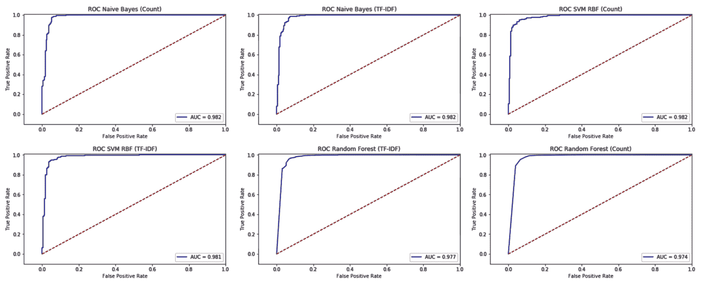

1.  将所有模型的概率平均值并绘制 ROC 曲线：

```py
plt.subplot(4,3,7)

### Test Count Data
d = (nb_pred_test_proba + svc_gcv_test_proba_rbf + rf_gcv_pred_test_proba)/4

fpr, tpr, thresholds = roc_curve(Y_test,d[:,1])
roc_auc = auc(Y_test,d[:,1])

plt.title('ROC Ensemble (Count)')
plt.plot(fpr, tpr, 'b',label='AUC = %0.3f'% roc_auc)
plt.legend(loc='lower right')
plt.plot([0,1],[0,1],'r--')
plt.xlim([-0.1,1.0])
plt.ylim([-0.1,1.01])
plt.ylabel('True Positive Rate')
plt.xlabel('False Positive Rate')

plt.subplot(4,3,8)

### Test TF-IDF Data
d = (nb_tfidf_pred_test_proba + svc_gcv_tfidf_test_proba_rbf + rf_gcv_tfidf_pred_test_proba)/4

fpr, tpr, thresholds = roc_curve(Y_test,d[:,1])
roc_auc = auc(Y_test,d[:,1])

plt.title('ROC Ensemble (TF-IDF)')
plt.plot(fpr, tpr, 'b',label='AUC = %0.3f'% roc_auc)
plt.legend(loc='lower right')
plt.plot([0,1],[0,1],'r--')
plt.xlim([-0.1,1.0])
plt.ylim([-0.1,1.01])
plt.ylabel('True Positive Rate')
plt.xlabel('False Positive Rate')
#plt.show()

plt.tight_layout(pad=1,rect=(0, 0, 3.5, 4))
plt.show()
```

我们可以在以下屏幕截图中看到 ROC 和 AUC 得分的平均值：

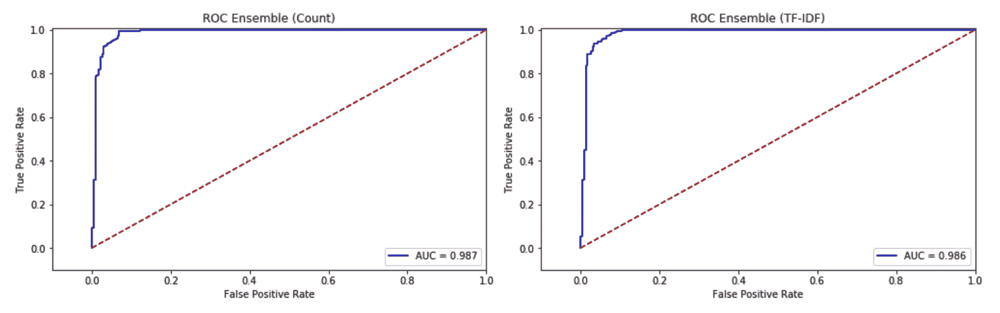

1.  检查集成结果的准确性。创建一个包含预测结果的数组，如下所示：

```py
predicted_array = np.array([nb_pred_test_tfidf, svc_tfidf_rbd_test_predicted_values, rf_tfidf_test_predicted_values])

print("Each array is the prediction of the respective models")
print(predicted_array)
```

1.  计算各个观测值的预测值的众数，以执行最大投票以获得最终的预测结果：

```py
# Using mode on the array, we get the max vote for each observation
predicted_array = mode(predicted_array)

# Check the array
print(predicted_array)

print("The accuracy for test")
accuracy_score(Y_test, predicted_array[0][0])
```

1.  分别绘制在计数数据和 TF-IDF 数据上训练的模型的测试准确率：

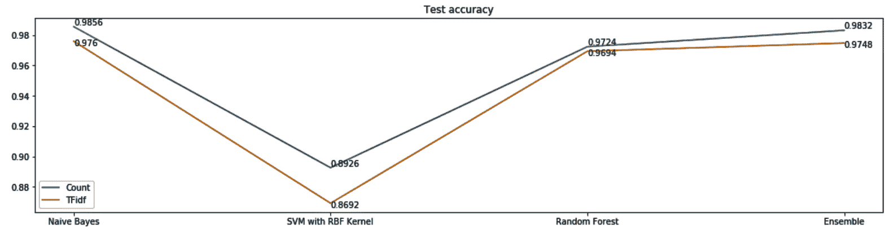

# 它是如何工作的...

在*准备就绪*部分，我们导入了所有必需的库并定义了绘制混淆矩阵的函数。我们使用 UTF8 编码读取我们的数据集。我们检查了数据集中垃圾邮件和正常邮件的比例，并使用`CountVectorizer`和`TfidfVectorizer`模块将文本转换为向量以及 TF-IDF 向量。

之后，我们使用各种算法构建了多个模型。我们还对计数数据和 TF-IDF 数据都应用了每个算法。

模型需要按照以下顺序构建：

1.  计数数据上的朴素贝叶斯

1.  TF-IDF 数据上的朴素贝叶斯

1.  计数数据上的 RBF 核 SVM

1.  基于 RBF 核的 SVM 在 TF-IDF 数据上

1.  计数数据的随机森林

1.  TF-IDF 数据的随机森林

基于朴素贝叶斯分类器在机器学习中的文本分类被广泛使用。朴素贝叶斯算法基于特征属于一个类的条件概率。在**步骤 1**中，我们使用朴素贝叶斯算法在计数数据上构建了我们的第一个模型。在**步骤 2**中，我们使用`classification_report()`检查性能指标，以查看`precision`、`recall`、`f1-score`和`support`。在**步骤 3**中，我们调用`plot_confusion_matrix()`绘制混淆矩阵。

然后，在**步骤 4**中，我们在 TF-IDF 数据上构建了朴素贝叶斯模型，并在**步骤 5**中评估了其性能。在**步骤 6**和**步骤 7**中，我们使用支持向量机在计数数据上训练模型，使用`classification_report`的输出评估其性能，并绘制了混淆矩阵。我们使用 RBF 核训练了 SVM 模型。我们还展示了使用`GridSearchCV`寻找最佳参数的示例。在**步骤 8**和**步骤 9**中，我们重复了**步骤 6**和**步骤 7**中的操作，但这次我们在 TF-IDF 数据上训练了 SVM。

在**步骤 10**中，我们使用网格搜索在计数数据上训练了一个随机森林模型。我们将`criterion`超参数设置为**gini**和**entropy**。我们还为参数设置了多个值，例如`min_samples_split`、`max_depth`和`min_samples_leaf`。在**步骤 11**中，我们评估了模型的表现。

然后，在**步骤 12**中，我们在 TF-IDF 数据上训练了另一个随机森林模型。使用`predict_proba()`函数，我们在测试数据上得到了类别概率。我们在**步骤 13**中使用相同的方法绘制了带有 AUC 分数的 ROC 曲线，标注在每个模型的图表上。这有助于我们比较模型的表现。

在**步骤 14**中，我们平均了从计数和 TF-IDF 数据模型中得到的概率，然后绘制了集成结果的 ROC 曲线。从**步骤 15**到**步骤 17**，我们绘制了基于计数数据和 TF-IDF 数据构建的每个模型的测试准确率。

# 使用集成模型对电影评论进行情感分析

情感分析是**自然语言处理**（**NLP**）中另一个广泛研究的研究领域。它是一个流行的任务，用于分析评论以确定评论者提供的评论的情感。在这个例子中，我们将专注于分析来自**互联网电影数据库**（**IMDb**）的电影评论数据，并根据其是正面还是负面进行分类。

我们有存储在`.txt`文件中的电影评论，这些文件被分成了两个文件夹：负面和正面。有 1,000 条正面评论和 1,000 条负面评论。这些文件可以从 GitHub 获取。

我们将这个案例研究分成了两部分：

+   第一部分是准备数据集。我们将读取提供的 `.txt` 格式的评论文件，将它们附加起来，根据它们被放入哪个文件夹来标记为正面或负面，并创建一个包含标签和文本的 `.csv` 文件。

+   在第二部分，我们将在计数数据和 TF-IDF 数据上构建多个基础学习器。我们将评估基础学习器的性能，然后评估预测的集成。

# 准备就绪

我们首先导入所需的库：

```py
import os
import glob
import pandas as pd
```

我们将工作文件夹设置如下：

```py
os.chdir("/.../Chapter 11/CS - IMDB Classification")
os.getcwd()
```

我们设置路径变量并遍历文件夹中的 `.txt` 文件。

注意，我们有一个子文件夹 `/txt_sentoken/pos`，其中包含正面评论的 TXT 文件。同样，我们还有一个子文件夹 `/txt_sentoken/neg`，其中包含负面评论的 TXT 文件。

正面评论的 TXT 文件被读取，评论被附加到一个数组中。我们使用这个数组创建一个 DataFrame，`df_pos`。

```py
path="/.../Chapter 11/CS - IMDB Classification/txt_sentoken/pos/*.txt"

files = glob.glob(path)
text_pos = []

for p in files:
 file_read = open(p, "r")
 to_append_pos = file_read.read()
 text_pos.append(to_append_pos)
 file_read.close()

df_pos = pd.DataFrame({'text':text_pos,'label':'positive'})
df_pos.head()
```

使用 `head()` 方法，我们查看正面评论。

我们还遍历负文件夹中的 TXT 文件来读取负面评论，并将它们附加到一个数组中。我们使用这个数组创建一个 DataFrame，`df_neg`：

```py
path="/Users/Dippies/CODE PACKT - EML/Chapter 11/CS - IMDB Classification/txt_sentoken/neg/*.txt"

files = glob.glob(path)
text_neg = []

for n in files:
    file_read = open(n, "r")
    to_append_neg = file_read.read()
    text_neg.append(to_append_neg)
    file_read.close()

df_neg = pd.DataFrame({'text':text_neg,'label':'negative'})
df_neg.head()
```

最后，我们使用 `concat()` 方法将正面和负面的 DataFrame 合并成一个单一的 DataFrame：

```py
df_moviereviews=pd.concat([df_pos, df_neg])
```

我们可以使用 `head()` 和 `tail()` 方法查看准备好的 DataFrame：

```py
print(df_moviereviews.head())
print(df_moviereviews.tail())
```

之前的代码给出了以下输出：

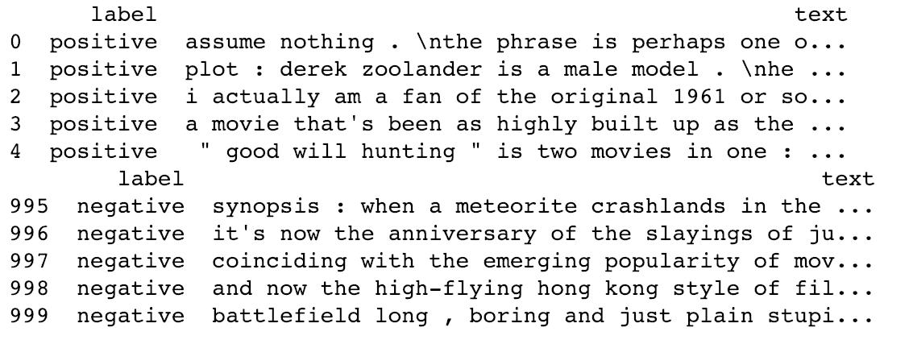

从前面的图像中，我们注意到正面和负面评论是顺序添加的。DataFrame 的前半部分包含正面评论，而后半部分包含负面评论。

让我们打乱数据，使其不保持顺序：

```py
from sklearn.utils import shuffle

df_moviereviews=shuffle(df_moviereviews)
df_moviereviews.head(10)
```

现在，我们可以看到 DataFrame 中的数据已经被打乱了：

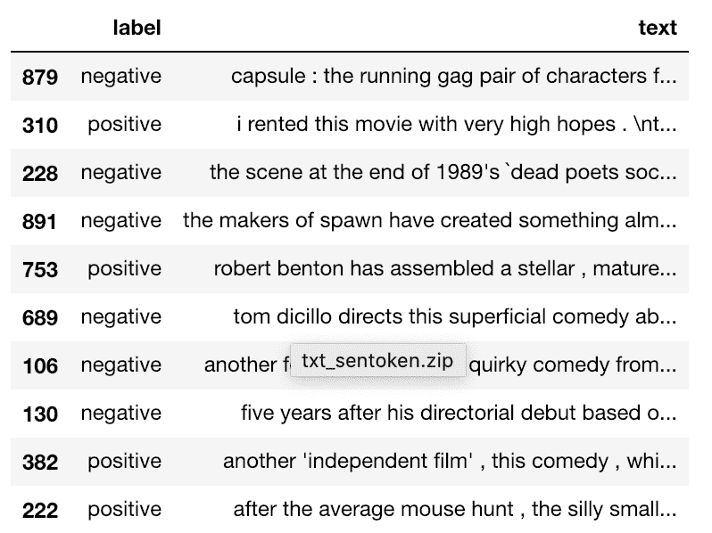

我们验证合并后的 DataFrame 的维度，看看它是否包含 2,000 个观测值，这将是我们将 1,000 个负面评论和 1,000 个正面评论合并的结果：

```py
df_moviereviews.shape
```

从之前的代码中，我们注意到我们有 2,000 个观测值和 2 列。

我们还可以将结果 DataFrame 写入另一个 `.csv` 文件，以避免像之前步骤那样从 TXT 文件重新创建 CSV 文件：

```py
df_moviereviews.to_csv("/.../Chapter 11/CS - IMDB Classification/Data_IMDB.csv") 
```

接下来，我们将定义之前使用过的 `plot_confusion_matrix()` 方法。

现在，我们可以看到我们数据中正面和负面评论的占比。在我们的案例中，比例正好是 50:50：

```py
df_moviereviews["label"].value_counts().plot(kind='pie')
plt.tight_layout(pad=1,rect=(0, 0, 0.7, 1))

plt.text(x=-0.9,y=0.1, \
         s=(np.round(((df_moviereviews["label"].\
                       value_counts()[0])/(df_moviereviews["label"].value_counts()[0] + \
                       df_moviereviews["label"].value_counts()[1])),2)))

plt.text(x=0.4,y=-0.3, \
         s=(np.round(((df_moviereviews["label"].\
                       value_counts()[1])/(df_moviereviews["label"].value_counts()[0] + \
                       df_moviereviews["label"].value_counts()[1])),2)))

plt.title("% Share of the Positive and Negative reviews in the dataset")
```

之前代码的输出可以在以下屏幕截图中看到：

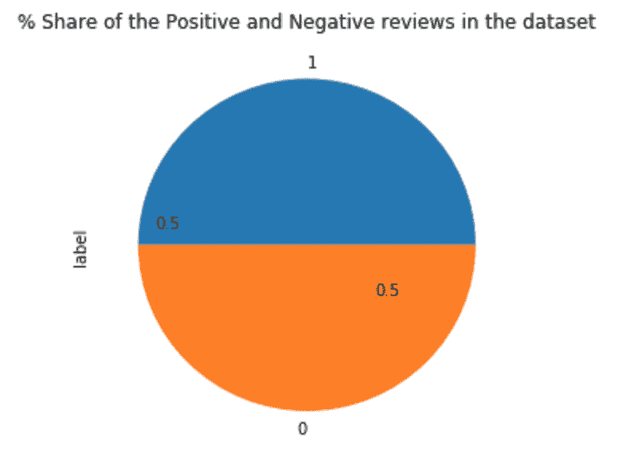

现在，我们将“正面”标签替换为“1”，“负面”标签替换为“0”：

```py
df_moviereviews.loc[df_moviereviews["label"]=='positive',"label",]=1
df_moviereviews.loc[df_moviereviews["label"]=='negative',"label",]=0
```

我们使用各种数据清理和准备机制来准备我们的数据。我们将遵循与之前配方中相同的顺序来预处理我们的数据：

1.  将所有文本转换为小写

1.  删除标点符号

1.  删除停用词

1.  执行词干提取

1.  分词数据

接下来，我们将定义一个函数来执行前面的清理步骤：

```py
lemmatizer = WordNetLemmatizer()
def process_text(text):
    nopunc = [char for char in text if char not in string.punctuation]
    nopunc = ''.join(nopunc)

    clean_words = [word.lower() for word in nopunc.split() if word.lower() not in stopwords.words('english')]
    clean_words = [lemmatizer.lemmatize(lem) for lem in clean_words]
    clean_words = " ".join(clean_words)

    return clean_words
```

我们调用前面的函数来处理我们的文本数据：

```py
df_moviereviews['text'] = df_moviereviews['text'].apply(process_text)
```

我们现在将构建我们的基础学习器并评估集成结果。

# 如何操作...

我们首先导入我们需要的剩余库：

1.  导入所需的库：

```py
import os
import numpy as np
import pandas as pd
import itertools
import warnings
import string
import matplotlib.pyplot as plt
from nltk.corpus import stopwords
from nltk.stem import WordNetLemmatizer
from sklearn.feature_extraction.text import CountVectorizer
from sklearn.feature_extraction.text import TfidfVectorizer
from sklearn.model_selection import train_test_split
from sklearn.naive_bayes import MultinomialNB
from sklearn.metrics import confusion_matrix
from sklearn.model_selection import GridSearchCV
from sklearn.ensemble import RandomForestClassifier
from sklearn.metrics import classification_report
from sklearn.metrics import roc_auc_score as auc
from sklearn.metrics import roc_curve
from sklearn.metrics import accuracy_score
from scipy.stats import mode
```

1.  分离目标变量和预测变量：

```py
X = df_moviereviews.loc[:,'text']
Y = df_moviereviews.loc[:,'label']
Y = Y.astype('int')
```

1.  执行数据的训练集-测试集划分：

```py
X_train,X_test,y_train,y_test = train_test_split(X, Y, test_size=.3, random_state=1)
```

1.  使用`CountVectorizer()`将文本转换为向量：

```py
count_vectorizer = CountVectorizer()
count_train = count_vectorizer.fit_transform(X_train)
count_test = count_vectorizer.transform(X_test)
```

1.  使用`TfidfVectorizer()`将文本转换为 TF-IDF 向量：

```py
tfidf = TfidfVectorizer()
tfidf_train = tfidf.fit_transform(X_train)
tfidf_test = tfidf.transform(X_test)
```

我们继续在计数数据和 TF-IDF 数据上训练基础学习器。我们使用随机森林模型、朴素贝叶斯模型和支持向量分类器模型训练基础学习器。

1.  使用网格搜索在计数数据上训练随机森林模型：

```py
# Set the parameters for grid search
rf_params = {"criterion":["gini","entropy"],\
             "min_samples_split":[2,3],\
             "max_depth":[None,2,3],\
             "min_samples_leaf":[1,5],\
             "max_leaf_nodes":[None],\
             "oob_score":[True]}

# Create an instance of the RandomForestClassifier()
rf = RandomForestClassifier()
warnings.filterwarnings("ignore")

# Use gridsearchCV(), pass the values you have set for grid search
rf_count = GridSearchCV(rf, rf_params, cv=5)

rf_count.fit(count_train, Y_train)

# Predict class predictions & class probabilities with test data
rf_count_predicted_values = rf_count.predict(count_test)
rf_count_probabilities = rf_count.predict_proba(count_test)

rf_count_train_accuracy = rf_count.score(count_train, Y_train)
rf_count_test_accuracy = rf_count.score(count_test, Y_test)

print('The accuracy for the training data is {}'.\
      format(rf_count_train_accuracy))

print('The accuracy for the testing data is {}'.\
      format(rf_count_test_accuracy))
```

1.  评估`precision`、`recall`、`f1-score`、`support`和`accuracy`：

```py
print(classification_report(Y_test, rf_count_predicted_values))

# Pass actual & predicted values to the confusion_matrix()
cm = confusion_matrix(Y_test, rf_count_predicted_values)
plt.figure()
plot_confusion_matrix(cm, classes=target_names,normalize=False)
plt.show()
```

在以下屏幕截图中，我们可以看到前面代码的输出：

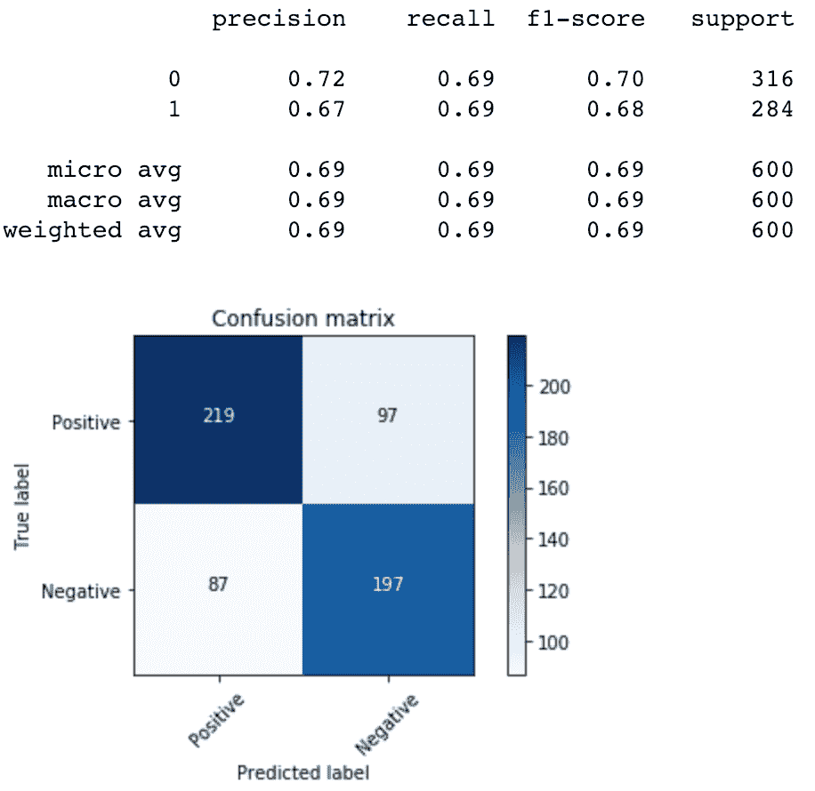

1.  使用网格搜索在 TF-IDF 数据上训练随机森林模型：

```py
# Set the parameters for grid search
rf_params = {"criterion":["gini","entropy"],"min_samples_split":[2,3],"max_depth":[None,2,3],"min_samples_leaf":[1,5],"max_leaf_nodes":[None],"oob_score":[True]}

# Create an instance of the RandomForestClassifier()
rf = RandomForestClassifier()
warnings.filterwarnings("ignore")

# Use gridsearchCV(), pass the values you have set for grid search
rf_tfidf = GridSearchCV(rf, rf_params, cv=5)

rf_tfidf.fit(tfidf_train, Y_train)
```

1.  评估模型的性能：

```py
rf_tfidf_predicted_values = rf_tfidf.predict(tfidf_test)
rf_tfidf_probabilities = rf_tfidf.predict_proba(tfidf_test)

rf_train_accuracy = rf_tfidf.score(tfidf_train, Y_train)
rf_test_accuracy = rf_tfidf.score(tfidf_test, Y_test)

print('The accuracy for the training data is {}'.format(rf_train_accuracy))
print('The accuracy for the testing data is {}'.format(rf_test_accuracy))

print(classification_report(Y_test, rf_tfidf_predicted_values))

# Pass actual & predicted values to the confusion_matrix()
cm = confusion_matrix(Y_test, rf_tfidf_predicted_values)
plt.figure()
plot_confusion_matrix(cm, classes=target_names,normalize=False)
plt.show()
```

1.  在计数数据上训练朴素贝叶斯模型，并检查测试数据的准确率：

```py
nb_count = MultinomialNB()
nb_count.fit(count_train, Y_train)

nb_count_predicted_values = nb_count.predict(count_test)
nb_count_probabilities = nb_count.predict_proba(count_test)

nb_train_accuracy = nb_count.score(count_train, Y_train)
nb_test_accuracy = nb_count.score(count_test, Y_test)

print('The accuracy for the training data is {}'.format(nb_train_accuracy))
print('The accuracy for the testing data is {}'.format(nb_test_accuracy))
```

1.  使用`classification_report()`和混淆矩阵评估其他模型的性能参数：

```py
print(classification_report(Y_test, nb_predicted_values))

# Pass actual & predicted values to the confusion matrix()
cm = confusion_matrix(Y_test, nb_predicted_values)
plt.figure()
plot_confusion_matrix(cm, classes=target_names,normalize=False)
plt.show()
```

1.  在 TF-IDF 数据上训练朴素贝叶斯模型，并按我们之前对早期模型所做的方式评估其性能：

```py
nb_tfidf = MultinomialNB()
nb_tfidf.fit(count_train, Y_train)

nb_tfidf_predicted_values = nb_tfidf.predict(tfidf_test)
nb_tfidf_probabilities = nb_tfidf.predict_proba(tfidf_test)

nb_train_accuracy = nb_tfidf.score(tfidf_train, Y_train)
nb_test_accuracy = nb_tfidf.score(tfidf_test, Y_test)

print('The accuracy for the training data is {}'.format(nb_train_accuracy))
print('The accuracy for the testing data is {}'.format(nb_test_accuracy))

print(classification_report(Y_test, nb_predicted_values))

#Pass actual & predicted values to the confusion matrix()
cm = confusion_matrix(Y_test, nb_predicted_values)
plt.figure()
plot_confusion_matrix(cm, classes=target_names,normalize=False)
plt.show()
```

1.  在计数数据上使用具有线性核的支持向量分类器算法训练模型。我们还对 SVC 的`C`参数进行了网格搜索：

```py
svc_count = SVC(kernel='linear',probability=True)
svc_params = {'C':[0.001, 0.01, 0.1, 1, 10]}

svc_gcv_count = GridSearchCV(svc_count, svc_params, cv=5)
svc_gcv_count.fit(count_train, Y_train)

svc_count_predicted_values = svc_gcv_count.predict(count_test)
svc_count_probabilities = svc_gcv_count.predict_proba(count_test)

svc_count_train_accuracy = svc_gcv_count.score(count_train, Y_train)
svc_count_test_accuracy = svc_gcv_count.score(count_test, Y_test)

print('The accuracy for the training data is {}'.format(svc_gcv_count.score(count_train, Y_train)))
print('The accuracy for the testing data is {}'.format(svc_gcv_count.score(count_test, Y_test)))

print(classification_report(Y_test, svc_count_predicted_values))
# Pass actual & predicted values to the confusion_matrix()
cm = confusion_matrix(Y_test, svc_count_predicted_values)
plt.figure()
plot_confusion_matrix(cm, classes=target_names,normalize=False)
plt.show()
```

1.  在 TF-IDF 数据上使用具有线性核的支持向量分类器算法训练模型。我们还对 SVC 的`C`参数进行了网格搜索：

```py
svc_tfidf = SVC(kernel='linear',probability=True)
svc_params = {'C':[0.001, 0.01, 0.1, 1, 10]}

svc_gcv_tfidf = GridSearchCV(svc_tfidf, svc_params, cv=5)
svc_gcv_tfidf.fit(tfidf_train, Y_train)

svc_tfidf_predicted_values = svc_gcv_tfidf.predict(tfidf_test)
svc_tfidf_probabilities = svc_gcv_tfidf.predict_proba(tfidf_test)

svc_tfidf_train_accuracy = svc_gcv_count.score(tfidf_train, Y_train)
svc_tfidf_test_accuracy = svc_gcv_count.score(tfidf_test, Y_test)

print('The accuracy for the training data is {}'.format(svc_gcv_tfidf.score(count_train, Y_train)))
print('The accuracy for the testing data is {}'.format(svc_gcv_tfidf.score(count_test, Y_test)))

print(classification_report(Y_test, svc_tfidf_predicted_values))
# Pass actual & predicted values to the confusion_matrix()
cm = confusion_matrix(Y_test, svc_tfidf_predicted_values)
plt.figure()
plot_confusion_matrix(cm, classes=target_names)
plt.show()
```

1.  绘制每个模型的 ROC 曲线。以下是一个绘图代码示例（完整代码包含在本书的代码包中）：

```py
fpr, tpr, thresholds = roc_curve(Y_test, rf_count_probabilities[:,1])
roc_auc = auc(Y_test, rf_count_probabilities[:,1])

plt.title('ROC Random Forest Count Data')
plt.plot(fpr, tpr, 'b',label='AUC = %0.3f'% roc_auc)
plt.legend(loc='lower right')
plt.plot([0,1],[0,1],'r--')
plt.xlim([-0.1,1.0])
plt.ylim([-0.1,1.01])
plt.ylabel('True Positive Rate')
plt.xlabel('False Positive Rate')
```

在以下屏幕截图中，我们可以比较我们已训练的所有模型的 ROC 曲线：

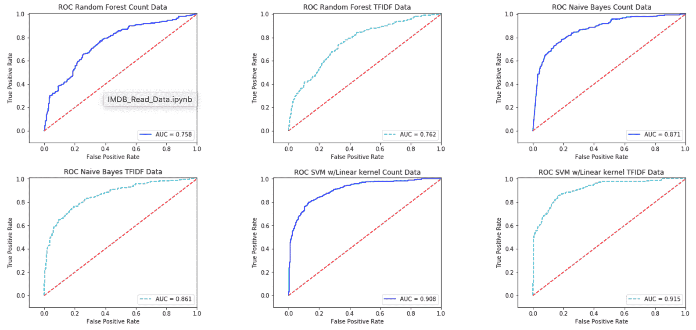

1.  在计数和 TF-IDF 数据上绘制集成结果的 ROC 曲线：

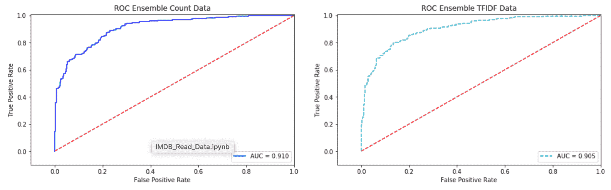

1.  使用最大投票计算集成模型的准确率：

```py
predicted_values_count = np.array([rf_count_predicted_values, \
                                   nb_count_predicted_values, \
                                   svc_count_predicted_values])

predicted_values_tfidf = np.array([rf_tfidf_predicted_values, \
                                   nb_tfidf_predicted_values, \
                                   svc_tfidf_predicted_values])

predicted_values_count = mode(predicted_values_count)
predicted_values_tfidf = mode(predicted_values_tfidf)
```

1.  绘制在计数数据和 TF-IDF 数据上训练的每个模型的测试准确率：

```py
count = np.array([rf_count_test_accuracy,\
                  nb_count_test_accuracy,\
                  svc_count_test_accuracy,\
                  accuracy_score(Y_test, predicted_values_count[0][0])])

tfidf = np.array([rf_tfidf_test_accuracy,\
                  nb_tfidf_test_accuracy,\
                  svc_tfidf_test_accuracy,\
                  accuracy_score(Y_test, predicted_values_tfidf[0][0])])

label_list = ["Random Forest", "Naive_Bayes", "SVM_Linear", "Ensemble"] 
plt.plot(count)
plt.plot(tfidf)
plt.xticks([0,1,2,3],label_list)

for i in range(4):
    plt.text(x=i,y=(count[i]+0.001), s=np.round(count[i],4))

for i in range(4):
    plt.text(x=i,y=tfidf[i]-0.003, s=np.round(tfidf[i],4))

plt.legend(["Count","TFIDF"])
plt.title("Test accuracy")

plt.tight_layout(pad=1,rect=(0, 0, 2.5, 2))
plt.show()
```

以下图表显示了所有模型和集成结果在计数数据和 TF-IDF 数据上的准确率比较：

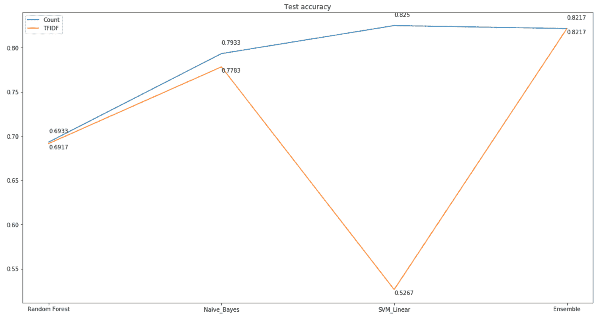

# 它是如何工作的...

我们首先导入所需的库。在本章中，我们使用了一个名为`glob`的模块。`glob`模块用于定义匹配指定模式到路径、目录和文件名的技术。我们使用 glob 模块来查找指定路径中的所有文件。之后，我们使用`open()`方法以读取模式打开每个文件。我们读取每个文件，并将其追加到形成包含所有评论的评论数据集。我们还创建了一个标签列，用于标记每个评论为正面或负面标签。

然而，在我们添加了所有正面和负面评论之后，我们注意到它们是按顺序添加的，这意味着前半部分包含了所有正面评论，而后半部分包含了负面评论。我们使用`shuffle()`方法对这些数据进行随机排序。

我们通过将其转换为小写、删除标点符号和停用词、执行词干提取和分词来清理数据，以创建特征向量。

在**如何做...**部分，我们首先在**第 1 步**中导入了库。在**第 2 步**中，我们将目标变量和特征变量分别分离到**X**和**Y**。

我们在**第 3 步**中将数据分为训练集和测试集。我们使用`test_size=.3`将数据分为训练集和测试集。

在**第 4 步**和**第 5 步**中，我们使用了`CountVectorizer()`和`TfidfVectorizer()`将文本转换为向量，并将文本转换为 TF-IDF 向量。注意，使用`CountVectorizer()`，我们生成了`count_train`和`count_test`数据集。使用`TfidfVectorizer()`，我们生成了`tfidf_train`和`tfidf_test`数据集。

在**第 6 步**中，我们设置了网格搜索的超参数来训练一个随机森林模型。我们在计数数据上训练了我们的随机森林模型，并检查了我们的训练和测试准确率。

我们对构建的所有模型在测试数据上使用了`predict()`和`predict_proba()`方法来预测类别以及类别概率。

在**第 7 步**中，我们生成了混淆矩阵来评估我们在前一步构建的随机森林模型的表现。在**第 8 步**和**第 9 步**中，我们在 TF-IDF 数据上对另一个随机森林模型进行了重复训练，并评估了其性能。从**第 10 步**到**第 12 步**，我们在计数数据和 TF-IDF 数据上训练了朴素贝叶斯模型。

在**第 13 步**和**第 14 步**中，我们分别使用线性核在计数数据和 TF-IDF 数据上训练了支持向量机分类算法。在**第 15 步**中，我们为构建的每个基本学习器绘制了 ROC 曲线和 AUC 分数。在**第 16 步**中，我们还绘制了集成模型的 RUC 曲线，以比较与基本学习器的性能。最后，在**第 17 步**中，我们绘制了每个模型在计数和 TF-IDF 数据上的测试准确率。

# 还有更多...

在当今世界，文本信息的可用性和流动是无限的。这意味着我们需要各种技术来处理这些文本问题，以提取有意义的信息。例如，**词性标注（POS）**是自然语言处理（NLP）空间中的基本任务之一。**词性标注**用于将文本中的单词标注为它们各自的词性。这些标签可以用于更复杂的任务，如句法和语义解析、**机器翻译（MT**）和问答。

有八个主要词性：

+   名词

+   代词

+   形容词

+   动词

+   副词

+   介词

+   连词

+   呼语：

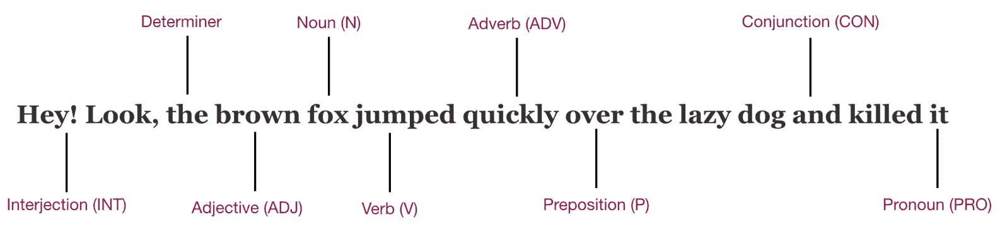

NLTK 库有在分词后应用于文本的获取词性标注的功能。让我们导入所需的库：

```py
import os
import pandas as pd
import nltk
from nltk.tag import pos_tag
from nltk.corpus import stopwords
```

我们使用之前创建的 DataFrame `df_moviereviews`。我们将文本转换为小写：

```py
df_moviereviews['text'] =df_moviereviews['text'].apply(lambda x: " ".join(x.lower() for x in x.split()))
df_moviereviews['text'].head()
```

我们通过去除停用词、标点符号、词形还原和分词来预处理文本：

```py
from nltk.stem.wordnet import WordNetLemmatizer
import string
stop = set(stopwords.words('english'))
exclude = set(string.punctuation) 
lemma = WordNetLemmatizer()
def clean(doc):
    stop_free = " ".join([i for i in doc.lower().split() if i not in stop])
    stop_free = ''.join(ch for ch in stop_free if ch not in exclude)
    normalized = " ".join(lemma.lemmatize(word) for word in stop_free.split())
    return normalized

tokenized_sent = [clean(doc).split() for doc in df_moviereviews["text"]]
```

我们来看一下第一篇电影评论的前 10 个标记词列表：

```py
tokenized_sent[0][0:10]
```

这生成了以下输出：

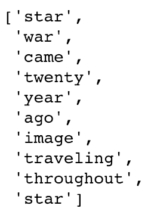

我们进行词性标注：

```py
postag=[nltk.pos_tag(token) for token in tokenized_sent]
```

我们打印出第一篇电影评论的前 10 个词性标注：

```py
postag[0][0:10]
```

我们看到词性标注的单词：

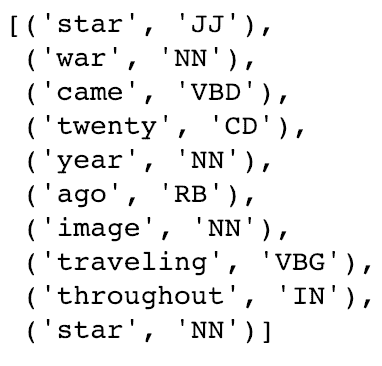

**分块处理**是另一个可以增加词性标注结构性的过程。分块处理用于实体检测；它将多个标记词标记为有意义的实体。有多种分块器可供选择；`NLTK` 提供了 `ne_chunk`，它可以识别人名（姓名）、地点和组织。其他常用的分块器包括 `OpenNLP`、`Yamcha` 和 `Lingpipe`。还可以使用分块器的组合，并对结果应用最大投票法来提高分类性能。
