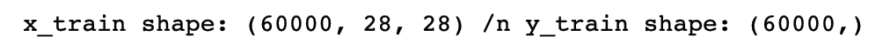
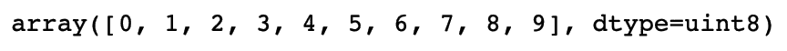
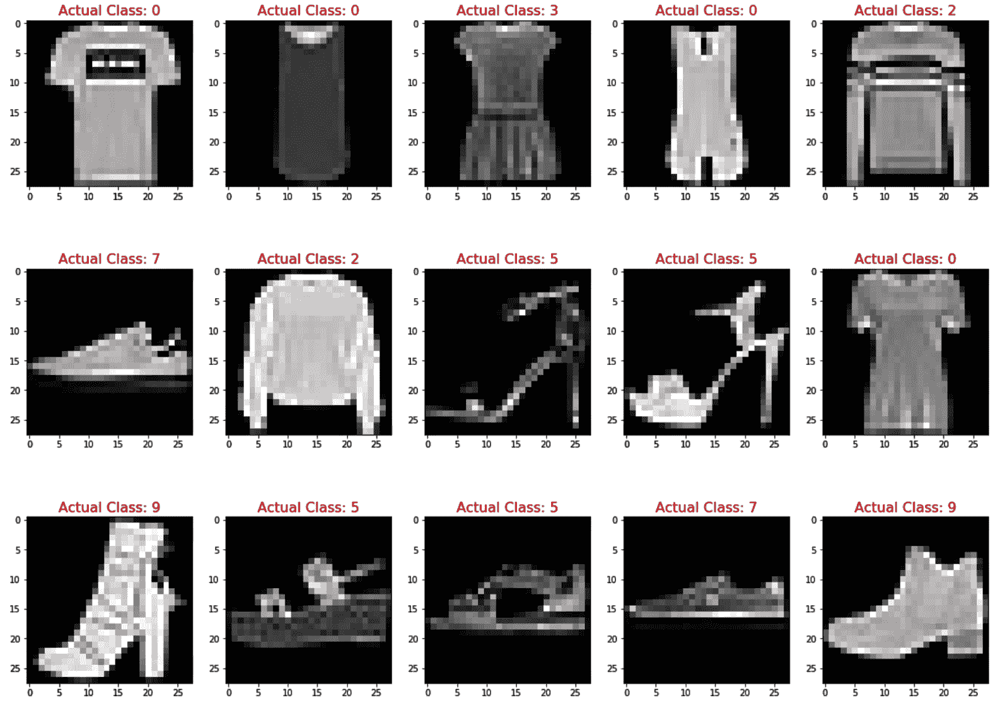
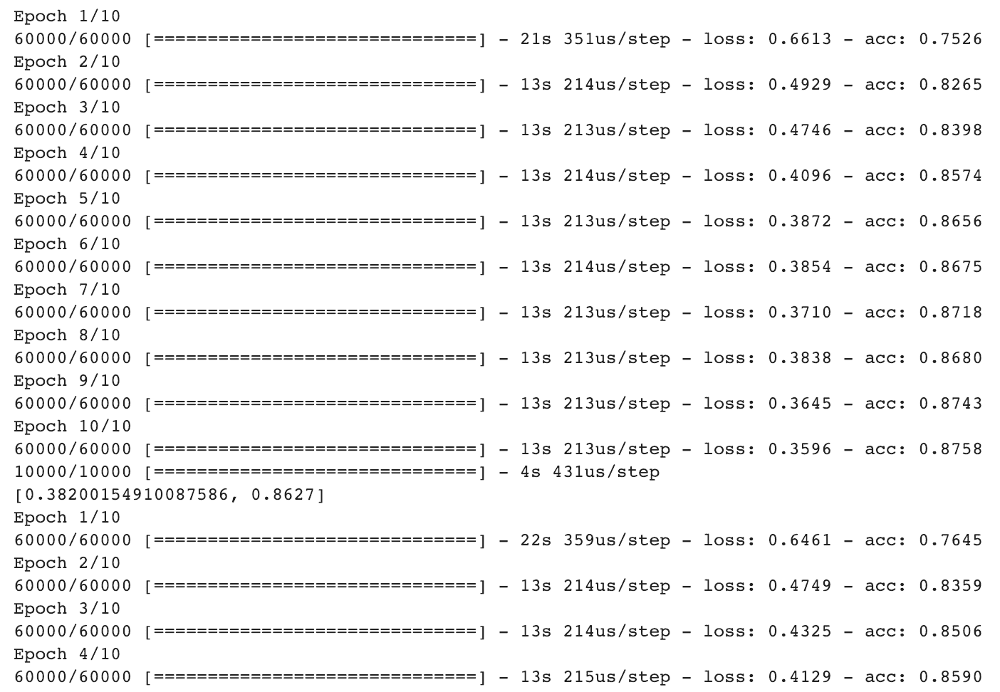
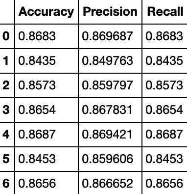
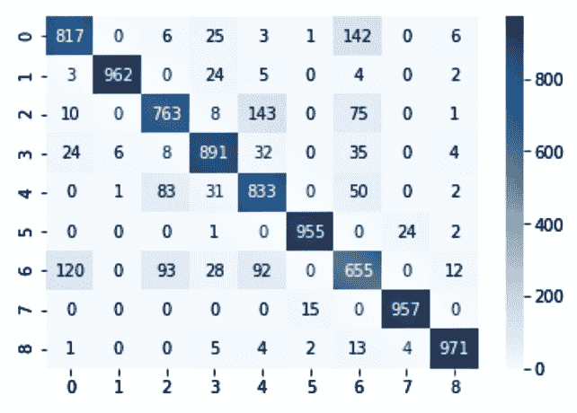
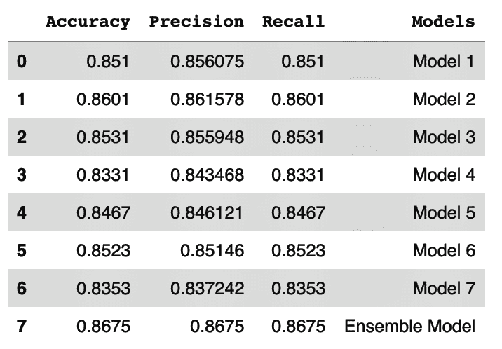
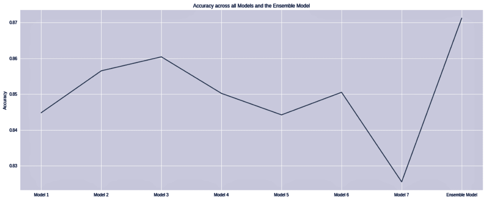
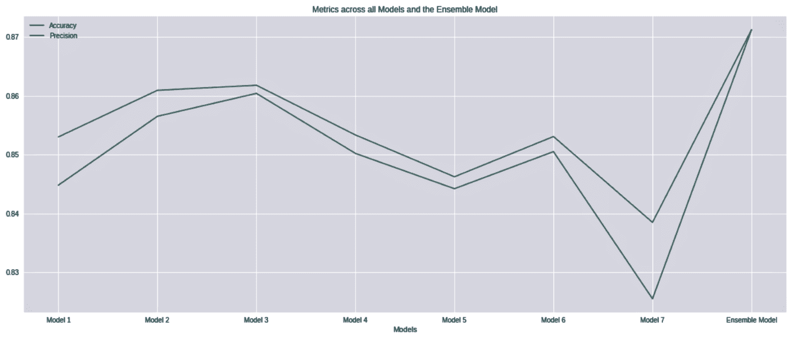

# 使用 Keras 进行多类分类的同质集成

在本章中，我们将介绍以下配方：

+   一个用于分类时尚产品的同质模型集成

# 引言

在分类问题中，许多研究已经进行了，以找出如何获得更好的分类准确率。当有大量类别需要预测时，这个问题往往更加复杂。在多类分类的情况下，假设目标变量中的每个类别都是相互独立的。多类分类技术涉及训练一个或多个模型来分类目标变量，该变量可以超过两个类别。

# 一个用于分类时尚产品的同质模型集成

在这个例子中，我们将使用 Fashion-MNIST 数据集。这个数据集包含来自十个类别的 60,000 个时尚产品图像。目标变量可以被分类为十个类别：

+   T 恤/上衣

+   裤子

+   开衫

+   服装

+   外套

+   凉鞋

+   衬衫

+   运动鞋

+   袋

+   靴子

每个图像都是一个 28 x 28 的灰度图像。我们将通过读取数据，在几次迭代中构建几个同质模型，以查看集成是否可以提供更高的准确率。

# 准备工作

我们将使用 Google Colab 来训练我们的模型。Google Colab 自带 TensorFlow，所以我们不需要在我们的系统中单独安装它。

我们按照以下方式导入所需的库：

```py
import numpy as np
import pandas as pd
import seaborn as sns
import matplotlib.pyplot as plt

import tensorflow as tf
from tensorflow import keras
from sklearn.utils import resample
from sklearn.metrics import accuracy_score
from sklearn.metrics import confusion_matrix
from sklearn.metrics import classification_report
from scipy import stats
```

我们从`tf.keras`附带的数据集中加载数据：

```py
# Load the fashion-mnist pre-shuffled train data and test data
(x_train, y_train), (x_test, y_test) = tf.keras.datasets.fashion_mnist.load_data()
```

我们检查训练集和测试集的维度：

```py
# Print training set shape 
print("x_train shape:", x_train.shape, "y_train shape:", y_train.shape)
```

这给我们以下输出：



我们记录目标变量中的唯一值：

```py
np.unique(y_train)
```

我们可以看到有 10 个类别被标记为 0 到 9：



我们可以快速查看前几个观察结果如下：

```py
fig=plt.figure(figsize=(16,8))

# number of columns for images in plot
columns=5 

# number of rows for images in plot
rows=3

for i in range (1,columns*rows+1):
      fig.add_subplot(rows,columns,i)
      plt.title("Actual Class: {}".\
              format((y_train[i])),color='r',fontsize=16)
      plt.imshow(x_train[i])
plt.show()
```

使用前面的代码，我们绘制了前 15 个图像及其相关标签：



# 如何做...

我们现在将进入训练模型阶段：

1.  在下面的代码块中，我们将使用`tf.keras`在几个迭代中创建多个同质模型：

```py
accuracy = pd.DataFrame( columns=["Accuracy","Precision","Recall"])
predictions = np.zeros(shape=(10000,7))
row_index = 0
for i in range(7):
        # bootstrap sampling 
        boot_train = resample(x_train,y_train,replace=True, n_samples=40000, random_state=None)
        model = tf.keras.Sequential([
            tf.keras.layers.Flatten(input_shape=(28, 28)),
            tf.keras.layers.Dense(256, activation=tf.nn.relu),
            tf.keras.layers.Dense(128, activation=tf.nn.relu),
            tf.keras.layers.Dense(128, activation=tf.nn.relu),
            tf.keras.layers.Dense(128, activation=tf.nn.relu),
            tf.keras.layers.Dense(128, activation=tf.nn.relu),
            tf.keras.layers.Dense(128, activation=tf.nn.relu),
            tf.keras.layers.Dense(128, activation=tf.nn.relu),
            tf.keras.layers.Dense(128, activation=tf.nn.relu),
            tf.keras.layers.Dense(128, activation=tf.nn.relu),
            tf.keras.layers.Dense(128, activation=tf.nn.relu),
            tf.keras.layers.Dense(10, activation=tf.nn.softmax)])

        # compile the model
        model.compile(loss='sparse_categorical_crossentropy', optimizer='adam', metrics=['accuracy'])

        # Train the model
        model.fit(x_train,y_train,epochs=10,batch_size=64)

        # Evaluate accuracy
        score = model.evaluate(x_test, y_test, batch_size=64)
        accuracy.loc[row_index,"Accuracy"]=score[1]

        # Make predictions
        model_pred= model.predict(x_test)
        pred_classes =model_pred.argmax(axis=-1)
        accuracy.loc[row_index, 'Precision'] = precision_score(y_test, pred_classes, average='weighted')
        accuracy.loc[row_index, 'Recall'] = recall_score(y_test, pred_classes,average='weighted')

        # Save predictions to predictions array
        predictions[:,i] = pred_classes

        print(score)
        row_index+=1

        print("Iteration " + str(i+1)+ " Accuracy : " + "{0}".format(score[1]))
```

我们在每个迭代中提到七个迭代和十个时期。在下面的屏幕截图中，我们可以看到随着模型训练的进展：



1.  在*步骤 1*的代码中，我们收集了每个迭代在测试数据上的准确率、精确率和召回率：

```py
accuracy
```

在下面的屏幕截图中，我们可以看到前三个指标在每个迭代中的变化：



1.  我们将创建一个包含每个迭代中所有模型返回的预测的 DataFrame：

```py
# Create dataframe using prediction of each iteration
df_iteration = pd.DataFrame([predictions[:,0],\
                           predictions[:,1],\
                           predictions[:,2],\
                           predictions[:,3],\
                           predictions[:,4],\
                           predictions[:,5],\
                           predictions[:,6]])
```

1.  我们将类型转换为整数：

```py
df_iteration = df_iteration.astype('int64')
```

1.  我们执行最大投票来识别每个观察值预测的最可能类别。我们简单地使用`mode`来找出对于每个观察值预测次数最多的类别：

```py
# find the mode for result
mode = stats.mode(df_iteration)
```

1.  我们计算测试数据的准确率：

```py
# calculate the accuracy for test dataset
print(accuracy_score( y_test, mode[0].T))
```

1.  我们使用所需的标签生成混淆矩阵：

```py
# confusion matrix
cm = confusion_matrix(y_test, mode[0].T, labels=[0, 1, 2, 3, 4, 5, 6, 7, 8])
```

1.  我们绘制了混淆矩阵：

```py
ax= plt.subplot()

# annot=True to annotate cells
sns.heatmap(cm, annot=True, ax = ax, fmt='g', cmap='Blues')
```

混淆矩阵的图表如下所示：



1.  我们创建了一个包含所有迭代编号的 DataFrame：

```py
accuracy["Models"]=["Model 1",\
                   "Model 2",\
                   "Model 3",\
                   "Model 4",\
                   "Model 5",\
                   "Model 6",\
                   "Model 7"]
```

1.  然后，我们将准确率、精确率和召回率合并到一个单独的表中：

```py
accuracy=accuracy.append(pd.DataFrame([[\
                                        accuracy_score(y_test,\
                                        mode[0].T),0,0,\
                                        "Ensemble Model"]], \
                                        columns=["Accuracy",\
                                        "Precision","Recall",\
                                        "Models"]))

accuracy.index=range(accuracy.shape[0])

accuracy.set_value(7, 'Precision', precision_score(y_test, mode[0].T, average='micro'))
accuracy.set_value(7, 'Recall', recall_score(y_test, mode[0].T, average='micro'))
```

在下面的屏幕截图中，我们可以看到包含每个模型和集成模型指标的结构的截图：



1.  我们绘制了每个迭代的准确率和最大投票的准确率：

```py
plt.figure(figsize=(20,8))
plt.plot(accuracy.Models,accuracy.Accuracy)
plt.title("Accuracy across all Iterations and Ensemble")
plt.ylabel("Accuracy")
plt.show()
```

这给我们以下图表。我们注意到与单个模型相比，最大投票方法返回的准确率是最高的：



1.  我们还绘制了每个模型和集成模型的精确率和召回率：

```py
plt.figure(figsize=(20,8))
plt.plot(accuracy.Models,accuracy.Accuracy,accuracy.Models,accuracy.Precision)
plt.title("Metrics across all Iterations and models")
plt.legend(["Accuracy","Precision"])
plt.show()
```

这在下面的屏幕截图中显示：



从前面的屏幕截图中，我们注意到集成模型的精确率和召回率有所提高。

# 它是如何工作的...

在*准备就绪*部分，我们导入了所需的库。请注意，我们已经导入了`TensorFlow`库。我们可以通过导入`tf.keras.datasets`模块直接访问数据集。此模块包含各种内置数据集，包括以下内容：

+   `boston_housing`：波士顿房价回归数据集

+   `cifar10`：CIFAR10 小型图像分类数据集

+   `fashion_mnist`：Fashion-MNIST 数据集

+   `imdb`：IMDB 情感分类数据集

+   `mnist`：MNIST 手写数字数据集

+   `reuters`：路透社主题分类数据集

我们使用了此模块中的`fashion_mnist`数据集。我们加载了预洗牌的培训和测试数据，并检查了培训和测试子集的形状。

在*准备就绪*部分，我们注意到训练子集的形状是（60000，28，28），这意味着我们有 60000 个大小为 28 X 28 像素的图像。

我们使用`unique()`方法检查目标变量的不同级别。我们看到从 0 到 9 共有 10 个类别。

我们还快速浏览了一些图像。我们定义了我们所需的列数和行数。运行迭代后，我们使用`matplotlib.pyplot.imshow()`以灰度形式绘制了图像。我们还使用`matplotlib.pyplot.title()`打印了每个图像的实际类别标签。

在*如何做...*部分的*步骤 1*中，我们使用`tf.keras`模块创建了多个同质模型。在每个迭代中，我们使用`resample()`方法创建自助样本。我们将`replace=True`传递给`resample()`方法，以确保我们有带替换的样本。

在此步骤中，我们还定义了模型架构。我们使用`tf.keras.layers`向模型中添加层。在每个层中，我们定义了单元数。

“模型架构”指的是整个神经网络结构，它包括称为层的单元组。这些层以链状结构排列。每一层是其前一层的函数。确定模型架构是神经网络的关键。

在我们的例子中，我们进行了一些迭代。我们设置了迭代次数。在每次迭代中，我们编译模型并将其拟合到我们的训练数据上。我们在测试数据上进行了预测，并在 DataFrame 中捕获以下指标：

+   准确度

+   精确度

+   召回率

我们将`Rectified Linear Units (RELU)`作为隐藏层的激活函数。ReLU 表示为`f(x) = max{0, x}`。在神经网络中，ReLU 被推荐为默认的激活函数。

注意，在模型架构的最后一层，我们使用了 softmax 作为激活函数。softmax 函数可以看作是 sigmoid 函数的推广。虽然 sigmoid 函数用于表示二元变量的概率分布，但 softmax 函数用于表示具有两个以上类别的目标变量的概率分布。当 softmax 函数用于多类分类时，它为每个类别返回一个介于 0 和 1 之间的概率值。所有概率值的总和将等于 1。

在**步骤 2**中，我们检查了我们在**步骤 1**中创建的准确度 DataFrame 的结构。我们注意到我们有三个列用于准确度、精确度和召回率，以及每个迭代的指标都被捕获。在**步骤 3**中，我们将 DataFrame 中的数据类型转换为整数。

在**步骤 4**中，我们使用`stats.mode()`对每个观测值进行了最大投票。由于我们进行了七次迭代，因此每个观测值都有七个预测。`stats.mode()`返回了出现次数最多的预测。

在**步骤 5**中，我们检查了使用最大投票预测的模型的准确度。在**步骤 6**和**步骤 7**中，我们生成了混淆矩阵来可视化正确的预测。图表中的对角线元素是正确的预测，而离对角线元素是误分类。我们发现正确的分类数量比误分类的数量要多。

在**步骤 8**和**步骤 9**中，我们继续创建一个结构来保存性能指标（准确度、精确度和召回率），以及每个迭代和集成标签。我们使用这个结构来绘制性能指标的图表。

在**步骤 10**中，我们绘制了每个迭代和最大投票预测的准确度。同样，在**步骤 11**中，我们绘制了每个迭代和最大投票预测的精确度和召回率。

从我们在**步骤 10**和**步骤 11**中生成的图表中，我们注意到最大投票预测的准确度、精确度和召回率都有所提高。

# 参见

`tf.keras` 模块为我们提供了 TensorFlow 特定的功能，例如即时执行、数据管道和估计器。您可以查看`tf.keras`模块为我们提供的各种选项。

在我们的示例中，我们使用了`tf.keras.optimizer`模块提供的内置优化器类。在我们的示例中，我们使用了**Adam** **优化器**，但您还可以使用其他优化器，例如 Adadelta、Adagrad、Adamax、RMSprop 或 SGD。

在当今时代，Adam 优化器是最佳优化器之一。它是**随机梯度下降**（**SGD**）的扩展。SGD 考虑所有权重更新使用单个学习率，并且在模型训练过程中学习率保持不变。Adam 算法考虑自适应学习率方法来计算每个参数的单独学习率。

`tf.keras.losses` 模块为我们提供了各种选项，以便我们可以选择我们的损失函数。我们使用了`sparse_categorical_crossentropy`。根据您的任务，您可能需要选择其他选项，例如`binary_crossentropy`、`categorical_crossentropy`、`mean_squared_error`等等。

在多类分类的情况下，如果目标变量是独热编码的，请使用`categorical_crossentropy`。如果目标变量中的类别表示为整数，请使用`sparse_categorical_crossentropy`。

您可以在[`www.tensorflow.org/api_docs/python/tf/keras`](https://www.tensorflow.org/api_docs/python/tf/keras)上获取有关可用于`tf.keras`的其他超参数的更详细信息。
