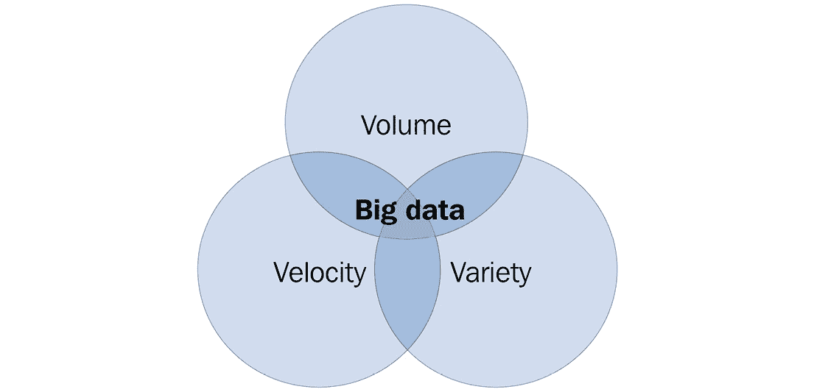
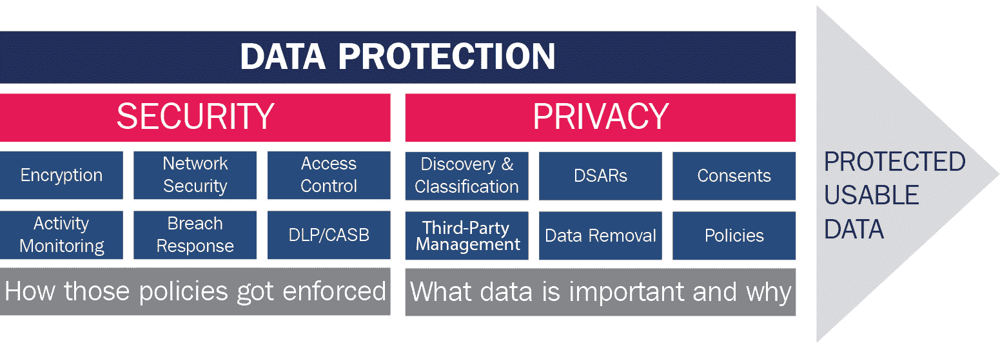

# 大数据和传统 AI 的挑战

在本章中，我们将详细解释为什么**联邦学习**（**FL**）将成为 2020 年代的关键技术。您将了解大数据是什么，以及从数据隐私、模型偏差和漂移的角度看，它是如何成为问题的。对这些问题及其解决方案的深入理解将激励您开始一段充满挑战的旅程，以获取相关的知识和技能，并使用以下章节来规划 FL 的掌握。阅读本章后，您将明显地看到**人工智能**（**AI**）和**机器学习**（**ML**）正在发生巨大的范式转变，这是由于公众和商业对当前对大数据导向系统的依赖表示担忧而发生的。无需多言，让我们出发吧！

本章将涵盖以下主题：

+   理解大数据的本质

+   数据隐私作为瓶颈

+   训练数据和模型偏差的影响

+   模型漂移和性能下降

+   FL 作为数据问题的主要解决方案

# 理解大数据的本质

在 Algorithmia 对 403 位商业领袖进行的*2021 年机器学习企业趋势*调查中，76%的企业将 AI 和 ML 置于其他 IT 计划之上。COVID-19 全球大流行迫使一些公司加快 AI 和 ML 的发展，正如他们的**首席信息官**（**CIO**）所述，83%的调查机构在 AI 和 ML 方面的预算**同比增长**（**YoY**），其中四分之一的增长超过 50%。客户体验改善和流程自动化，无论是通过增加收入还是降低成本，都是这一变化的主要驱动力。其他研究，包括 KPMG 的最新报告*在 AI 世界中繁荣发展*，本质上讲述的是同样的故事。

以**深度学习**（**DL**）为代表的 AI 和 ML 发展的持续热潮，得益于过去十年**大数据**的出现。有了 Apache 的**开源软件**工具 Hadoop 和 Spark，以及**亚马逊网络服务**（**AWS**）、**谷歌云平台**（**GCP**）和**微软 Azure**等云计算服务，私营和公共部门的企业都可以通过处理以前无法想象的大量数据来解决问题。公司和机构不再需要在开发数据分析和模型设计时过于谨慎，以确保相关数据以适当的格式存储。相反，他们可以将可用的原始数据简单地级联到他们的数据湖中，期待他们的数据科学家通过检查它们之间的相关性来发现后续有价值的变量。

大数据似乎是一系列问题的终极解决方案，但正如我们将在以下章节中看到的，它存在一些固有的问题。为了清楚地了解大数据可能存在的问题，让我们首先明确什么是大数据。

## 大数据的定义

大数据代表大量信息。这些信息现在正以指数级增长。如今，人类每天产生两千万亿字节的数据，这使得大数据变得如此庞大，以至于使用现有的传统数据管理工具来非常有效地处理大数据变得相当困难。以下列出的三个 V 通常用来定义大数据的特征：

+   **数量**：来自各种来源的数据，如商业交易、物联网（IoT）设备、社交媒体、工业设备、视频等，都为数据的巨大数量做出了贡献。

+   **速度**：数据速度也是大数据的一个基本特征。通常，数据需要实时或接近实时。

+   **种类**：数据以所有格式出现，如数值数据、文本文档、图像、视频、电子邮件、音频、金融交易等。

以下截图描述了三个 V 在大数据中的交集：

图 1.1 – 大数据的三个 V

在 1880 年，美国人口普查局从人口普查中收集了大量数据，并估计处理这些数据需要 8 年时间。第二年，一个名叫赫尔曼·霍勒里希的人发明了霍勒里希制表机，这减少了处理数据所需的工作。第一个数据中心建于 1965 年，用于存储指纹数据和税务信息。

## 大数据现在

数据湖这一概念的出现，在引领我们今天处理数据时看到的巨大规模方面发挥了关键作用。数据湖为公司存储在运营过程中观察到的任意类型的数据提供了完全的自由，消除了否则会阻止公司收集一些最终变得必要的数据的限制。虽然这种自由允许数据湖保持公司生成数据的最大潜力，但它也可能导致一个关键问题——对收集到的数据的理解上的自满。以非结构化方式存储不同类型数据的便利性实际上可能导致“先存储，后整理”的心态。与处理非结构化数据的真正困难实际上源于其处理过程；因此，延迟处理的心态有可能导致数据湖变得非常繁琐，难以筛选和处理，这是由于数据收集的无限制增长。

原始数据的价值仅在于从中可以提取的模型和洞察力。中心数据湖方法导致了一些情况，其中从数据中提取的洞察力受到缺乏结构的限制，从而引发从存储效率低下到由于提取困难导致的实际智能效率低下等一系列问题。另一方面，先于数据湖的方法则因无法访问潜在的大量数据而受到简单限制。FL 允许避免这两类问题，这是 FL 作为推动大数据进入集体智能时代载体的关键驱动支持。

这一主张得到了 FL 将大数据流程从收集→提取智能转变为提取智能→收集的事实支持。对于人类来说，智能可以被视为大量经验的浓缩形式。以类似的方式，在数据源处提取智能——通过在源位置对数据进行训练——简洁地总结了数据，以最大化其实际应用的易用性格式。FL 的后期收集步骤导致在最大数据访问和数据存储效率下创建所需的全球智能。即使是对生成数据源的局部使用，也可以通过大量减少进入剩余数据湖的数据格式数量，从智能和数据联合存储中大大受益。

## 大数据的 AAA 心态

尽管已经提出了许多定义，强调不同的方面，牛津大学教授维克托·迈尔-舍恩伯格和《经济学人》高级编辑肯尼思·库克耶在 2013 年的国际畅销书《大数据：一场将改变我们生活、工作和思考方式的革命？》中，巧妙地阐明了大数据的本质。大数据并非关于服务器中数据的规模；*大数据是关于三个相互关联的心态转变，这些转变相互强化*。他们的论点归结为我们可以总结并称之为大数据的*AAA 心态，它包括观察的丰富性、对混乱的接受和因果关系的模棱两可*。让我们逐一看看它们。

### 观察的丰富性

从列和行或文件大小来看，大数据不必“大”。大数据有多个观察值，通常称为*n*，接近或等于感兴趣人群的大小。在传统统计学中，收集整个人群的数据——例如，纽约对健身感兴趣的人——是不可能的或不可行的，研究人员必须从人群中随机选择样本——例如，1000 名对健身感兴趣的纽约人。随机抽样往往很难进行，而且对特定子组的狭窄关注也是难以证明的：在健身房周围调查的人会错过在公园跑步和在家的瑜伽练习者，为什么是健身房会员而不是跑步者和瑜伽爱好者？然而，由于**信息和通信技术**（**ICT**）系统的发展和复杂化，今天的研究人员可以通过多个来源访问大约所有人的数据——例如，关于健身的谷歌搜索记录。这种*丰富性*或*n = all*的范式是有利的，因为数据所表达的内容可以解释为关于人群的真实陈述，而旧方法只能以显著水平的信心*推断*这种真理，通常以*p 值*表示，通常假设小于 0.05。小数据提供统计数据；大数据证明状态。

### 对杂乱程度的接受

大数据往往比较杂乱。如果我们用谷歌搜索数据作为某人兴趣的代理——例如——我们可能会错误地将他们设备上家人或朋友进行的某些搜索归因于他们，这样估计的兴趣程度将不准确，程度取决于这种非自有设备搜索的比例。在某些设备上，大量的搜索可能由多个用户进行，例如办公室的共用电脑或属于尚未拥有手机的孩子的智能手机。否则，人们可能会搜索在与其他人交谈中出现的词语，而不是自言自语，这并不一定反映他们自己的兴趣。在采用传统方法的研究中，研究人员必须确保这些设备不包括在他们的样本数据中，因为这种“杂乱”会显著影响推理的质量，因为观察的数量会很少。但在大数据研究中并非如此。随着观察数量的增加，其影响会相应减小，直到达到*n = all*。在大多数设备上，谷歌搜索通常由所有者自主进行，其他上下文中的搜索影响不大。

### 因果关系的矛盾

大数据通常用于研究相关性而不是因果关系——换句话说，它通常只能告诉我们*是什么*，而不能告诉我们*为什么*。对于许多实际问题，仅仅相关性就能提供答案。Mayer-Schönberger 和 Cukier 在《大数据：一场将改变我们生活、工作和思考方式的革命》一书中给出了几个例子，其中之一是 2011 年建立的 Fair Isaac Corporation 的*Medication Adherence Score*。在人们的行为模式被*数据化*的时代，收集对感兴趣变量的所有观察结果（*n = all*）是可能的，并且在这些变量之间发现的关联足够强大，足以指导我们的决策。我们不需要知道人们的*一致性*或*从众性*的心理分数，这些分数*导致*他们遵守医疗处方；通过观察他们在生活中的其他方面的行为，我们可以预测他们是否会遵守处方。

通过拥抱丰饶、接受和矛盾的三重心态，企业和政府已经在从定价服务到推荐产品、优化运输路线和识别犯罪嫌疑人的任务中产生了智能。然而，这种心态在近年来受到了挑战，以下章节将展示这一点。首先，让我们简要了解一下通常被视为理所当然的观察结果的丰饶性目前正面临压力。

# 数据隐私作为瓶颈

FL 经常被认为是最受欢迎的隐私保护人工智能技术之一，因为生成高质量智能不需要收集或与第三方实体共享隐私数据。因此，在本节中，我们讨论 FL 试图解决以创造高质量智能的数据隐私瓶颈问题。

什么是数据隐私？2021 年 5 月，HCA Healthcare 宣布公司与谷歌达成协议，共享其患者记录和实时医疗数据。各种媒体迅速作出反应，警告公众关于这笔交易，因为谷歌因其在*Project Nightingale*中的行为而被提及，据称这家科技巨头利用了数百万美国患者的敏感数据。根据皮尤研究中心 2019 年的一项民意调查，超过 80%的公众认为公司收集数据的潜在风险超过了好处，因此如此规模的数据共享项目自然被视为对人们*数据隐私*的威胁。

数据隐私，也称为*信息隐私*，是个人控制其个人信息使用方式的权利，这要求第三方在法律允许的范围内妥善处理、处理、存储和使用此类信息。它常与*数据安全*混淆，数据安全确保数据准确、可靠，并且仅对授权用户可访问。在谷歌账户的情况下，数据隐私规定了公司如何使用账户持有者的信息，而数据安全则要求他们部署诸如密码保护和**两步验证**等措施。在解释这两个概念时，数据隐私经理使用了一个关于安全和隐私的比喻：安全是一个前提，而隐私则像一扇*窗户*和一扇*窗帘*：数据安全是数据隐私的前提。结合起来，它们构成了*数据保护*，如下面的图表所示：

图 1.2 – 数据安全与数据隐私对比

从前面的图表中我们可以看出，虽然数据安全限制了谁可以访问数据，但数据隐私限制了数据中可以包含什么。理解这种区别非常重要，因为数据隐私可以放大数据安全失败的影响。让我们看看这是如何发生的。

## 处理私人数据的风险

数据保护失败代价高昂。根据 IBM 的*数据泄露成本报告 2021 年*，2021 年全球数据泄露的平均成本为**美元**（**USD**）4240 万美元，比前一年的 3860 万美元高得多，并且是报告 17 年历史中的最高金额；COVID-19 疫情爆发后远程工作人数的增加被认为是这一激增的主要原因。平均总成本最高的五个行业是医疗保健、金融、制药、技术和能源。该年度近一半的数据泄露包括了客户的**个人可识别信息**（**PII**），平均每条记录的成本为 180 美元。一旦客户的 PII 遭到泄露，就会随之而来系统响应期间的系统停机、客户流失、需要获取新客户、声誉损失和商誉下降等负面影响；因此，成本高昂。

IBM 的研究还发现，未能遵守数据保护法规是放大数据泄露成本的主要因素之一（[`www.ibm.com/downloads/cas/ojdvqgry`](https://www.ibm.com/downloads/cas/ojdvqgry)）。

## 增加的数据保护法规

随着技术的进步，保护客户数据的需求变得更加重要。消费者在每次交易中都要求并期望得到隐私保护；许多简单的活动都可能危及个人数据，无论是网上银行还是使用手机应用。

全世界各国政府最初对制定法律和法规以保护个人数据免受身份盗窃、网络犯罪和数据隐私侵犯的反应都比较缓慢。然而，现在情况正在改变，因为全球数据保护法律开始成形。

规章法规增加的几个驱动因素包括大量数据的增长，我们需要更多的数据安全和隐私保护来防止用户遭受诸如身份盗窃等恶意活动。

让我们以下面的子部分来看看一些旨在保护数据隐私的措施。

### 通用数据保护条例（GDPR）

欧洲联盟的**通用数据保护条例**（**GDPR**）被认为是现代数据经济中的第一项数据保护法规，并被许多国家效仿以制定自己的法规。GDPR 于 2012 年提出，2016 年由欧盟理事会和议会通过，并于 2018 年 5 月生效。它取代了 1995 年通过的《数据保护指令》。

GDPR 之所以具有划时代意义，在于其强调对个人身份信息（PII）的保护，包括人们的姓名、位置、种族或民族起源、政治或性取向、宗教信仰、协会会员资格以及基因/生物特征/健康信息。欧盟内外组织和个人在处理欧盟居民的个人信息时都必须遵守该法规。GDPR 有七个原则，其中六个是从数据保护指令继承而来的；新的原则是*问责制*，要求数据使用者保持关于个人数据使用目的和程序的文档。

GDPR 向公众展示了其违规的后果。根据违规的严重程度，GDPR 的罚款可以从全球年营业额的 2%或 1000 万欧元（以较高者为准），或者全球年营业额的 4%或 2000 万欧元（以较高者为准）。2018 年 5 月，成千上万的欧洲人通过法国组织 La Quadrature du Net（也称为英文中的*Squaring the Net*）对亚马逊公司提起诉讼，指控该公司未经客户同意使用其广告定位系统。经过 3 年的调查，卢森堡的**国家数据保护委员会**（**CNDP**）成为全球新闻头条：它对亚马逊开出 7.46 亿欧元的罚款。同样，WhatsApp 在 2021 年 9 月因 GDPR 违规被爱尔兰数据保护委员会罚款；再次，调查历时 3 年，罚款金额为 2.25 亿欧元。

目前，在美国，大多数州已经实施了隐私保护措施，或者很快将实施。此外，一些州已经加强了现有法规，例如加利福尼亚州、科罗拉多州和弗吉尼亚州。让我们逐一了解这些变化。

### 加利福尼亚消费者隐私法案（CCPA）

加利福尼亚州随后效仿。**加利福尼亚消费者隐私法**（**CCPA**）于 2020 年 1 月 1 日起生效。正如其名所示，该法规的目的是像 GDPR 一样保护消费者的个人身份信息（PII）。与 GDPR 相比，CCPA 的适用范围显著缩小。CCPA 仅适用于每年从超过 50,000 个点（该州的居民、家庭或设备）收集数据、年营收超过 2500 万美元或通过出售此类信息获得其一半年度收入的营利性组织。然而，CCPA 违规的成本可能比 GDPR 违规的成本高得多，因为前者对其罚款没有上限（每条无意违规罚款 2500 美元；每条故意违规罚款 7500 美元）。

### 科罗拉多隐私法（CPA）

根据**科罗拉多隐私法**（**CPA**），从 2024 年 7 月 1 日起，数据收集者和控制者必须遵循用户为生成定向广告和销售所选的通用退出规则。这项规则保护科罗拉多州的居民免受定向销售和广告的侵扰，以及某些类型的用户画像。

### 弗吉尼亚消费者数据保护法（CDPA）

弗吉尼亚州的**消费者数据保护法**（**CDPA**）将于 2023 年 1 月 1 日带来多项变更，以增强安全和隐私。这些变更将适用于在弗吉尼亚州或与弗吉尼亚州居民进行业务往来的组织。数据收集者需要获得批准才能利用其私人数据。这些变更还试图确定 AI 供应商的隐私和安全是否充分，这可能需要删除这些数据。

这些只是美国数据法规将如何形成的几个简单例子。这对世界其他地区意味着什么呢？有些人估计，到 2024 年，全球 75%的人口将受到一种或多种隐私法规的保护。

另一个主要数据保护法规的例子是巴西的**通用个人数据保护法**（**LGPD**），该法自 2020 年 9 月起生效。它取代了该国与数据隐私相关的数十项法律。LGPD 模仿了 GDPR，其内容几乎相同。在亚洲，日本是第一个引入数据保护法规的国家：2003 年通过的**个人信息保护法**（**APPI**）于 2015 年进行了修订。2022 年 4 月，APPI 的最新版本生效，以应对对数据隐私的现代担忧。

佛罗里达州（FL）已被认定为一种关键技术，它能够与不同领域的隐私法规和监管合规性良好地协同工作。

## 从隐私设计到数据简约主义

组织已经适应了这些规定。TrustArc 的*2021 年全球隐私基准调查*发现，拥有专门隐私办公室的企业数量正在增加：调查中有 83%的受访者拥有隐私办公室，而 2020 年的比例仅为 67%。85%的企业已经实施了战略性和可报告的隐私管理计划，但其中 73%的人认为他们可以做得更多来保护隐私。他们的热情并不令人惊讶，因为 34%的受访者声称他们在过去 3 年内遭遇过数据泄露，其代价高昂的后果在本章中已提及。隐私办公室将由**数据保护官**（**DPO**）领导，负责公司的**数据保护影响评估**（**DPIA**），以确保遵守如 GDPR 等要求问责制和个人数据处理文件化的法规。DPO 还负责监督并确保其组织按照法律处理个人数据，而高层管理和董事会应提供必要的支持和资源，以便 DPO 完成其任务。

面对 GDPR，当前数据保护的趋势正在转向*数据最小化*。在此背景下，数据最小化并不一定鼓励最小化数据的大小；它更直接地涉及最小化数据中的 PII 因素，以便个人不能通过其数据点被识别。因此，数据最小化影响了 AI 行业在创建高性能 AI 应用方面的能力，因为 ML 过程中数据种类的短缺仅仅产生了性能不令人满意的 ML 模型偏差。

本章开头介绍的大数据丰富心态因此受到了公众对数据隐私的关注所约束。违反数据保护法规而被罚款的风险，加上拥有数据坟墓的浪费成本，呼吁实践数据最小化而不是数据丰富。

正因如此，联邦学习（FL）正成为许多 AI 解决方案提供商的*必备*解决方案，例如医疗行业，它们正在努力应对公众对隐私的关注和数据隐私问题，这基本上成为了一个问题，当第三方实体需要收集私人数据以改善 ML 模型及其应用的质量时。如前所述，FL 是一个有希望的隐私保护 AI 框架，因为数据的学习可以在任何地方进行；即使数据对 AI 服务提供商不可用，我们只需以一致的方式收集和汇总训练好的 ML 模型即可。

现在，让我们考虑大数据 Triple-A 思维模式面临的另一个挑战：接受杂乱无章的数据。

# 训练数据和模型偏差的影响

大数据量的纯粹数量消除了“垃圾输入，垃圾输出”的险恶现实。或者，是这样吗？事实上，只有当足够的数据可以从各种来源和分布中完全学习，而不造成学习结果的任何偏差时，数据的杂乱无章才能被接受。实际上，在集中位置对大数据进行训练确实需要大量的时间和巨大的计算资源及存储空间。此外，我们可能还需要找到方法来衡量和减少模型偏差，而无需直接收集和访问敏感和私人数据，这可能会与之前讨论的一些隐私法规相冲突。联邦学习（FL）也有分布式和协作学习的方面，这对于消除数据偏差和模型偏差以吸收数据的杂乱无章变得至关重要。通过协作和分布式学习，我们可以显著提高整个学习过程的数据可访问性和效率，这个过程通常既昂贵又耗时。这给了我们突破大数据训练过去所有限制的机遇，以下章节将进行讨论。

## 大数据昂贵的训练

根据报告：https://www.flexera.com/blog/cloud/cloud-computing-trends-2022-state-of-the-cloud-report，37%的企业每年花费超过 1200 万美元，80%的企业每年花费超过 120 万美元用于公共云。云上的训练成本并不便宜，并且可以假设随着对人工智能和机器学习的需求增加，这种成本将会显著增加。有时，由于以下问题，大数据无法完全用于机器学习训练：

+   **大数据存储**：大数据存储是一种计算和存储架构，用于收集和管理大量数据集，以供人工智能应用或实时分析使用。全球企业公司仅为了云存储和数据中心成本就支付了超过 1000 亿美元（https://a16z.com/2021/05/27/cost-of-cloud-paradox-market-cap-cloud-lifecycle-scale-growth-repatriation-optimization/）。虽然其中一些数据集对于它们提供的应用至关重要，但它们真正想要的通常是能够从数据中提取的**商业智能**，而不仅仅是数据本身。

+   **显著的训练时间**：构建和训练一个可以交付为真实产品的机器学习模型基本上需要大量的时间，这不仅包括训练过程，还包括机器学习管道的准备。因此，在许多情况下，智能的真正价值在机器学习模型交付时就已经丧失了。

+   **巨大的计算量**：机器学习模型的训练通常消耗大量的计算资源。例如，使用机械手操作如魔方等部件的机器学习任务有时可能需要超过 1000 台计算机。仅运行一些专门的图形芯片几个月，就可能需要十几台机器。

+   **通信延迟**：为了形成大数据，特别是在云中，需要将大量数据传输到服务器，这本身就会造成通信延迟。在大多数用例中，FL 需要从本地设备或学习环境传输到服务器（称为聚合器）的数据要少得多，该服务器用于综合从这些设备收集的本地 ML 模型。

+   **可扩展性**：在传统的集中式系统中，由于大数据的复杂性和其昂贵的基础设施（如云服务器环境中的大量存储和计算资源），可扩展性成为一个问题。在 FL 服务器中，仅进行聚合以综合训练多个本地模型以更新全局模型。因此，当 ML 训练以分布式方式在边缘设备上进行时，系统和学习可扩展性显著提高，而不仅仅是单个集中式学习服务器。

FL 有效地利用了可用于 ML 模型轻量级训练的分布式计算资源。无论是实际物理设备上的训练还是云系统虚拟实例上的训练，将模型训练过程并行化到分布式环境中通常可以加速学习本身的速度。

此外，一旦收集了训练好的模型，FL 系统可以快速地将它们综合起来，生成一个更新的 ML 模型，称为全局模型，该模型在边缘侧吸收了足够的经验，因此实现近乎实时的智能传递成为可能。

## 模型偏差和训练数据

当 ML 算法由于 ML 过程中的错误假设而产生系统性的偏见结果时，就会发生 ML 偏差。ML 偏差有时也被称为算法偏差或 AI 偏差。

2018 年图灵奖得主，因其在深度学习发展方面的杰出贡献而获奖的 Yann LeCun 说：“*当数据有偏差时，ML 系统是有偏差的*” ([`twitter.com/ylecun/status/1274782757907030016`](https://twitter.com/ylecun/status/1274782757907030016))。这来自于 Nvidia 团队编译的`Flickr-Faces-HQ`数据集。基于人脸上采样系统，许多人被分类为白色，因为网络是在主要包含白人图片的`Flickr-Faces-HQ`数据上预训练的。对于这种误分类人群的问题，模型的架构并不是导致这种输出的关键问题。因此，结论是，一个种族偏差的数据集生成了一个中立的模型来产生偏差的结果。

关于 AI 和机器学习偏差的富有成效的对话是由谷歌前 AI 伦理负责人引领的。2018 年发表的*性别阴影*论文揭示了主要面部识别模型中的种族和性别偏差，国会的立法者寻求禁止美国联邦政府使用这项技术。包括亚马逊、IBM 和微软在内的科技公司也同意暂停或终止向警方销售面部识别模型。他们鼓励采取干预主义的数据收集方法，建议科学家和工程师明确模型开发的目标，制定严格的数据收集政策，并对收集到的数据进行彻底评估，以避免偏差——详细信息可在*FATE/CV*网站上找到（https://sites.google.com/view/fatecv-tutorial/home）。

FL 可能是克服数据孤岛问题的最有前途的机器学习技术之一。很多时候，数据甚至无法访问或用于训练，导致数据和模型存在重大偏差。自然地，FL 通过解决数据隐私和孤岛问题，这些问题成为避免数据偏差的瓶颈，因此 FL 对于克服偏差非常有用。在这种情况下，FL 正在成为大数据服务和应用的突破性实现，这在[`arxiv.org/pdf/2110.04160.pdf`](https://arxiv.org/pdf/2110.04160.pdf)中得到了彻底的研究。

此外，还有一些技术试图在 FL 本身中减轻模型偏差，例如*重新加权*和*偏见消除器*，这些都在[`arxiv.org/pdf/2012.02447.pdf`](https://arxiv.org/pdf/2012.02447.pdf)中详细说明。

# 模型漂移和性能退化

*模型漂移*通常是指由于数据以及**输入和输出**变量之间关系的变化而导致机器学习模型性能下降，也称为*模型退化*。模型漂移可以通过持续学习来应对，以适应数据集或环境中的最新变化，几乎在实时进行。FL 的一个重要方面是通过在本地分布式环境中学习发生时即时更新机器学习模型，以实现一个连续学习框架。这样，FL 可以解决企业 AI 应用中常见的智能在交付生产时变得无用的状况。

我们现在将讨论模型如何退化或停止工作，以及一些当前**模型运维**（**ModelOps**）的努力，以持续提高模型性能并实现可持续的 AI 运营。

## 模型如何停止工作

任何具有固定参数或*权重*的 AI 和 ML 模型，这些参数或权重是从训练数据中生成的，并调整到测试数据，当在模型接收的数据类似于训练和测试数据的环境中部署时，可以表现相当好。如果一个自动驾驶模型在晴朗的白天记录的数据上得到了良好的训练，那么该模型可以在晴天安全地驾驶车辆，因为它正在做它被训练去做的事情。然而，在一个雨天晚上，如果车辆是自动驾驶的，那么没有人应该坐在或靠近车辆：模型被喂以完全陌生的、黑暗和模糊的图像；其决策将完全不可靠。在这种情况下，模型的决策将偏离轨道，因此得名**模型漂移**。再次强调，如果模型在类似于训练和测试环境的环境中部署，并且环境在一段时间内没有显著变化，那么模型漂移不太可能发生。但在许多商业情况下，这个假设并不总是成立，模型漂移成为一个严重的问题。

模型漂移有两种类型：**数据漂移**和**概念漂移**。数据漂移发生在部署的模型输入数据与模型训练数据显著不同时。换句话说，*数据分布*的变化是数据漂移的原因。上述日间自动驾驶模型在夜间表现不佳就是一个数据漂移的例子。另一个例子是，在加利福尼亚州训练的冰淇淋销售预测模型在新西兰部署；南半球的季节性与北半球相反，因此预计的冰淇淋销量在*夏季*会低，在*冬季*会高，这与实际销量相反。

相反，**概念漂移**是由于变量之间相关性变化的结果。在统计学的术语中，这意味着*数据生成过程*已经改变。这正是**Google Flu Trends (GFT**)所遭遇的，正如《潜行者经济学家》一书的作者在以下《金融时报》文章中所述：https://www.ft.com/content/21a6e7d8-b479-11e3-a09a-00144feabdc0#axzz30qfdzLCB。

在此时期之前，搜索查询与流感传播之间存在有意义的关联，因为主要是那些怀疑自己感染了流感的人会在浏览器中输入这些词语，因此模型运作成功。但在 2013 年，这种情况可能不再成立，因为其他类别的人，例如那些对潜在的大流行病持预防态度的人或只是好奇的人，也在搜索这些词语，他们可能是由谷歌的推荐引导去搜索的。这种概念漂移可能导致 GFT 高估了与疾病控制与预防中心（**Centers for Disease Control and Prevention**，**CDC**）提供的医疗报告相比的传播情况。

不论是通过数据还是通过概念，模型漂移会导致模型性能下降，这是由于我们关注相关性所致。在数据科学领域的术语中，“**ground truth**”并不像物理学和化学等硬科学中的普遍真理那样，即因果关系。它仅仅是对给定数据中变量在特定环境中如何相互关联的真实陈述，并且不能保证当环境发生变化或不同时，相关性仍然存在。也就是说，我们估计的“**ground truth**”可能随时间和地点而变化，就像“**ground**”在历史上和地理上被地震事件重塑一样。

## 持续监控——放弃因果关系的代价

在 Redis Labs（https://venturebeat.com/business/redis-survey-finds-ai-is-stressing-it-infrastructure-to-breaking-point/）委托的一项调查中，大约一半的受访者将模型可靠性（48%）、模型性能（44%）、随时间变化的准确性（57%）和运行模型的延迟（51%）列为部署模型时面临的主要挑战。鉴于模型漂移的风险和担忧，AI 和机器学习模型的相关方在部署后需要完成两项额外的工作。首先，必须持续监控模型性能以检测模型漂移。数据漂移和概念漂移可能逐渐或突然发生。一旦检测到模型漂移，就需要使用新的训练数据重新训练模型，当发生概念漂移时，甚至可能需要使用新的模型架构来升级模型。

为了解决这些需求，一个新的机器学习原则，称为**持续交付机器学习（Continuous Delivery for Machine Learning**，简称**CD4ML**）已被提出。在 CD4ML 的框架中，模型首先使用训练数据进行编码和训练。然后，使用单独的数据集对模型进行测试，并根据某些指标进行评估，通常情况下，从多个候选模型中选择最佳模型。接下来，选定的模型通过进一步的测试进行生产化，以确保模型在部署后表现良好，一旦通过测试，它就会被部署。在这里，监控过程开始。当观察到模型漂移时，模型将使用新数据重新训练或根据漂移的严重程度给予新的架构。如果你熟悉软件工程，你可能会注意到 CD4ML 是机器学习领域对**持续集成/持续交付（Continuous Integration/Continuous Delivery，简称**CI/CD**）**的采用。在类似的方式中，源自**开发-运维（Development-Operations，简称**DevOps**）**软件工程框架的 AI 和机器学习操作框架**ModelOps**正在获得越来越多的关注。ModelOps 连接了**机器学习操作（Machine Learning Operations，简称**MLOps**：数据工程与数据科学的集成**）和应用程序工程；它可以被视为 CD4ML 的推动者。

大数据“AAA 思维模式”的第三个因素让我们能够专注于相关性，并在过去十年中帮助快速构建 AI 和 ML 模型。发现相关性比发现因果关系要容易得多。对于许多多年来一直在告诉我们从人们的谷歌搜索模式中需要知道什么的人工智能和机器学习模型，我们必须检查它们今天是否仍然有效。明天也是如此。

正因如此，联邦学习（FL）是持续学习的重要方法之一。在创建和运营 FL 系统时，还重要的是要开发具有 ModelOps 功能的系统，因为 FL 的关键作用是以协作方式不断从各种学习环境中改进模型。甚至可以使用 FL 实现一个**众包学习**框架，以便平台上的用户可以将所需的 ML 模型带到本地进行适应和训练，并将更新的模型返回给 FL 服务器，由聚合器处理。通过一个高级模型聚合框架来过滤掉可能降低当前模型性能的有毒 ML 模型，FL 可以持续整合其他学习成果，从而实现一个可持续的持续学习操作，这对于具有 ModelOps 功能的平台至关重要。

# FL 作为数据问题的主要解决方案

到目前为止，在本章中，我们确认了大数据存在需要解决的问题。必须保护数据隐私，不仅是为了保护个人，也是为了保护可能面临数据泄露和随之而来的罚款的数据用户。一组大数据中的偏差可以通过代理对推断产生重大影响，即使省略了关于性别和种族的因素，而且专注于相关性而不是因果关系使得预测模型容易受到模型漂移的影响。

在这里，让我们从架构、流程、问题和好处等方面讨论传统大数据 ML 系统和 FL 系统之间的区别。以下图表展示了传统大数据 ML 系统和 FL 系统之间的视觉比较：

![Figure 1.3 – 传统大数据 ML 系统和 FL 系统比较]

![img/B18369_01_03.jpg]

图 1.3 – 传统大数据 ML 系统和 FL 系统比较

在传统的数据系统中，数据被收集以创建大型数据存储。这些大型数据存储用于使用机器学习解决特定问题。由于训练数据量庞大，产生的模型显示出强大的泛化能力，并最终被部署。

然而，持续的数据收集需要大量的通信带宽。在注重隐私的应用中，数据的传输可能完全被禁止，这使得模型创建成为不可能。在大数据存储上训练大型 ML 模型计算成本高昂，传统的集中式训练效率受限于单机性能。缓慢的训练过程导致增量模型更新之间的延迟时间过长，导致无法灵活地适应新的数据趋势。

另一方面，在联邦学习系统中，机器学习训练直接在数据所在地进行。生成的训练模型被收集到中央服务器上。使用聚合算法从收集到的模型中生成一个聚合模型。聚合模型被发送回数据所在地进行进一步训练。

联邦学习方法通常需要在分布式系统设置中设置和维护训练性能，这会产生额外的开销。然而，即使架构和设置稍微复杂一些，也有其卓越的益处。训练在数据所在地进行，因此数据永远不会被传输，从而维护数据隐私。训练可以在多个节点上异步进行，这导致高效且易于扩展的分布式学习。仅在服务器和节点之间传输模型权重，因此联邦学习在通信方面是高效的。高级聚合算法甚至可以在受限场景中保持训练性能，并在标准机器学习场景中提高效率。

大多数人工智能项目似乎都无法交付，或者根本无法达到预期效果。要交付一个真正的人工智能应用和产品，之前讨论的所有问题都需要认真考虑。显然，联邦学习（FL）与其他关键技术的结合，用于处理机器学习（ML）管道和引擎处理的数据，正逐渐成为解决数据相关问题的连续和协作的关键解决方案。

我们如何利用人工智能和机器学习的力量，优化整个社会的技术系统——即，在数据最小化和道德的基础上，带来更加快乐、舒适、便捷和安全的世界，并持续进行改进？我们认为关键在于一个**集体智慧**或**以智能为中心**的平台，这在*第十章*“未来趋势和发展”中也有讨论。在本书的后续章节中，我们介绍了联邦学习系统的概念、设计和实现，作为一种有前景的技术，用于通过人工智能和机器学习模型的网络来协调集体智慧，以满足之前讨论的需求。

# 摘要

本章概述了联邦学习如何通过首先理解大数据的定义及其本质，包括大量的观察、接受混乱和因果关系的矛盾性，来潜在地解决许多大数据问题。

我们从许多地区了解了隐私法规的多种形式，以及数据泄露和隐私侵犯的风险，这些最终导致利润损失，以及创建真正人工智能应用的瓶颈。联邦学习，按照设计，不会收集任何原始数据，可以保护数据隐私并遵守这些法规。

此外，使用 FL 框架，我们可以减少影响 ML 模型性能的固有偏见，并通过持续学习框架最小化模型漂移。因此，需要一个基于 FL 的分布式和协作学习框架，以实现更经济高效的方法。

这本导论章节以联邦学习（FL）作为解决上述大数据问题的主要解决方案的潜力结束，这一解决方案基于集体智能的范式转变思想，这种思想有可能取代当前主流的数据中心平台。

在下一章中，我们将看到联邦学习（FL）在数据科学领域中的位置以及它如何开启机器学习（ML）的新时代。

# 进一步阅读

要了解更多关于本章所涉及的主题，请参阅以下参考文献：

+   *Algorithmia*. (*2021 年*). *2021 年机器学习企业趋势*. *西雅图：Algorithmia*.

+   *Mayer-Schönberger, V.* 和 *Cukier, K.* (*2013 年*). *大数据：一场将改变我们生活、工作和思考方式的革命*. *波士顿/纽约：Eamon Dolan/Houghton Mifflin Harcourt*.

+   *《经济学人》*. (*2010 年 2 月 27 日*). *数据无处不在*. *《经济学人》*.

+   *数据隐私经理*. (*2021 年 10 月 1 日*). *数据隐私与数据安全[定义和比较]*. *《数据隐私经理》*.

+   *IBM*. (*2021 年*). *2021 年数据泄露成本报告*. *纽约：IBM*.

+   *Burgess, M.* (*2020 年 3 月 24 日*). *什么是 GDPR？英国 GDPR 合规的总结指南*. *《Wired》*.

+   *TrustArc*. (*2021 年*). *2021 年全球隐私基准调查*. *沃尔纳特克里克：TrustArc*.

+   *Auxier, B.*，*Rainie, L.*，*Anderson, M.*，*Perrin, A.*，*Kumar, M.* 和 *Turner, E.* (*2019 年 11 月 15 日*). *美国人和隐私：担忧、困惑，感觉无法控制他们的个人信息*. *皮尤研究中心*.

+   *Hes, R.* 和 *Borking, J.* (*1995 年*). *隐私增强技术：通往匿名之路*. *荷兰海牙：安大略省信息和隐私专员*.

+   *Goldsteen, A.*，*Ezov, G.*，*Shmelkin, R.*，*Moffie, M.* 和 *Farkash, A.* (*2021 年*). *机器学习模型中 GDPR 合规的数据最小化*. *《AI 和伦理》*，1-15 页。

+   *Knight, W.* (*2019 年 11 月 19 日*). *苹果卡没有“看到”性别——这就是问题所在*. *《Wired》*.

+   *Gebru, T.* 和 *Denton, E.* (*2020 年*). *CVPR 2020 计算机视觉公平性、责任、透明度和伦理教程*. 在线可用：[`sites.google.com/view/fatecv-tutorial/home`](https://sites.google.com/view/fatecv-tutorial/home).

+   *Ukanwa, K.* (*2021 年 5 月 3 日*). *算法偏见不仅不公平，而且对商业有害*. *《波士顿环球报》*.

+   *O’Neil, C.* (*2016 年*). *数学破坏武器：大数据如何加剧不平等并威胁民主*. *纽约：Crown*.

+   *Blackman, R.* (*2020 年 10 月 15 日*). *构建道德 AI 的实用指南*. *《哈佛商业评论》*.

+   *Ginsberg, J.*，*Mohebbi, M.*，*Patel, R.*，*Brammer, L.*，*Smolinski, M. S.* 和 *Brilliant, L.* (*2009*). *利用搜索引擎查询数据检测流感大流行*。*自然，第 457 卷，第 1012-1014 页*。

+   *Anderson, C.* (*2008 年 6 月 23 日*). *理论的终结：数据洪流使科学方法过时*。*Wired*。

+   *Butler, D.* (*2013*). *当谷歌误判流感时*。*自然，第 494 卷，第 155-156 页*。

+   *Harford, T.* (*2014 年 3 月 28 日*). *大数据：我们是否犯了大错误？*。*金融时报*。

+   *Dral, E.* 和 *Samuylova, E.* (*2020 年 11 月 12 日*). *机器学习监控，第五部分：为什么你应该关注数据漂移和概念漂移*。*Evidently AI 博客*。

+   *Forrester Consulting*。(*2021*). *将 ML 模型部署到内存数据库：实现快速性能*。从[`redis.com/wp-content/uploads/2021/06/forrester-ai-opportunity-snapshot.pdf`](https://redis.com/wp-content/uploads/2021/06/forrester-ai-opportunity-snapshot.pdf)检索。

+   *Sato, D.*，*Wider, A.* 和 *Windheuser, C.* (*2019 年 9 月 19 日*). *机器学习的持续交付：自动化机器学习应用的端到端生命周期*。从*martinFowler.com*检索，[`martinfowler.com/articles/cd4ml.html`](https://martinfowler.com/articles/cd4ml.html)。

+   *Verma, D. C.* (*2021*). *联邦 AI 应用于现实世界商业场景*。*纽约：CRC 出版社*。

+   *Bostrom, R. P.* 和 *Heinen, J. S.* (*1977*). *MIS 问题与失败：社会技术视角。第一部分：原因*。*MIS 季刊，第 1 卷第 3 期，第 17 页*。

+   *Weld, D. S.*，*Lin, C. H.* 和 *Bragg, J.* (*2015*). *人工智能与集体智慧*。*集体智慧手册，第 89-114 页*。

+   *Abay, A.*，*Zhou, Y.*，*Baracaldo, N.*，*Rajamoni, S.*，*Chuba, E.* 和 *Ludwig, H.* *缓解联邦学习中的偏差*。可在 https://arxiv.org/pdf/2012.02447.pdf 获取。

+   *《大数据：一场将改变我们生活、工作和思考方式的革命》* ([`www.amazon.com/Big-Data-Revolution-Transform-Think/dp/0544227751`](https://www.amazon.com/Big-Data-Revolution-Transform-Think/dp/0544227751)。
