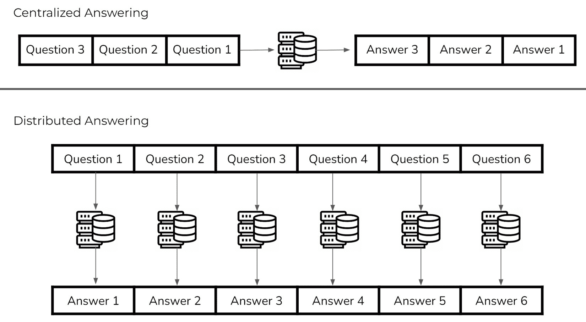
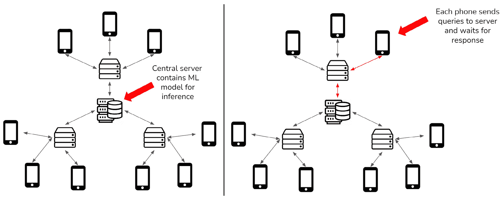
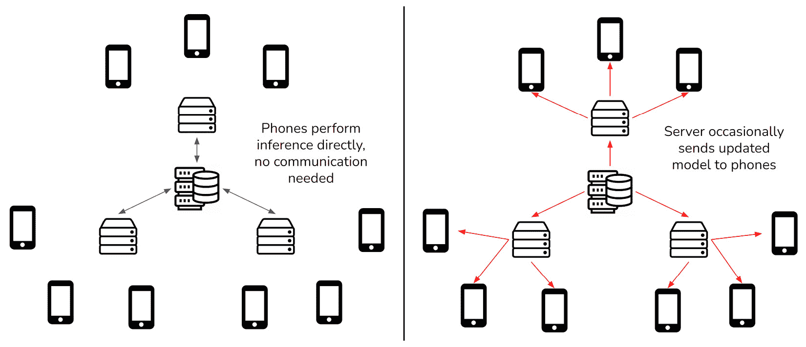
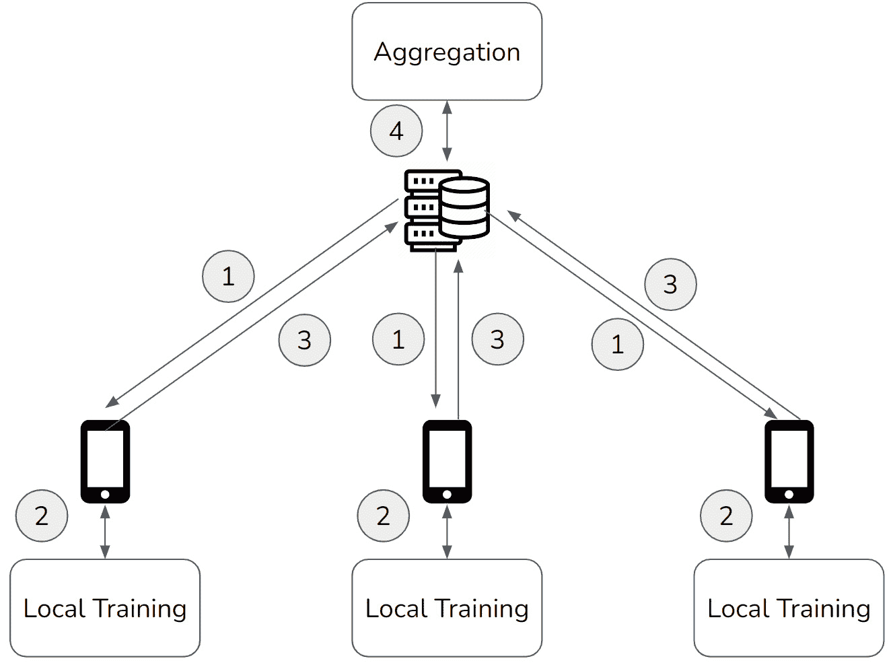

# 什么是联邦学习？

在*第一章*《大数据和传统人工智能的挑战》中，我们探讨了大数据和**机器学习（ML**）的潮流如何为新的实用 ML 应用方法奠定了基础。本章将**联邦学习（FL**）视为满足这种新 ML 方法需求的答案。简而言之，FL 是一种 ML 方法，允许模型在数据源之间并行训练，而不需要传输任何数据。

本章的目标是建立 FL 方法的论据，解释必要的概念构建块，以确保你可以达到对 FL 的技术方面和实际应用的类似理解。

阅读本章后，你应该对 FL 过程有一个高级别的理解，并且能够可视化这种方法在现实世界问题领域中的位置。

在本章中，我们将涵盖以下主题：

+   理解当前机器学习（ML）的状态

+   分布式学习特性——走向可扩展人工智能

+   理解联邦学习（FL）

+   FL 系统考虑因素

# 理解当前机器学习（ML）的状态

为了理解从应用 FL 中获得的利益为何可能超过这种方法增加的复杂性，有必要了解 ML 当前的实践及其相关的限制。本节的目标是为你提供这个背景。

## 什么是模型？

术语“模型”在众多不同学科中都有应用；然而，我们感兴趣的广义定义可以缩小到某些所需系统内动态的工作表示。简单来说，我们通过 B 模型更好地理解现象 A，A 是现象 B 的某种现象，这是通过 B 提供的增加的交互性来实现的。考虑一个物体从真空中某个点掉落的现象。使用运动方程，我们可以精确计算出物体落地所需的时间——这就是上述现象的模型。

这种方法的强大之处在于，可以在不与所讨论的现象进行明确交互的情况下观察创建的模型的结果。例如，下落物体的模型使我们能够在某个高度上确定 10 公斤物体和 50 公斤物体下落时间的差异，而无需在真实真空中从该高度物理地释放真实物体。显然，对自然现象的建模在能够声称真正理解这些现象方面发挥着关键作用。消除对现象进行全面观察的需要，使得在决策过程中实现真正的泛化成为可能。

在计算机科学领域，模型的概念被大大缩小了。在这种情况下，模型是算法，它允许根据对所讨论现象的某些初始描述输出该现象的一些关键值。回到落体例子，计算机科学模型可能包括根据物体的质量和下落的高度计算值，如击中地面的时间和最大速度。这些计算机科学模型由于计算机在从无数起始现象配置中计算输出的超人类能力而独具特色，为我们提供了更深入的理解和更广泛的概括。

那么，我们如何创建这样的模型呢？第一个也是最简单的方法是构建基于规则的系统或**白盒**模型。白盒模型（也称为玻璃盒或透明盒）是通过明确写出感兴趣系统的底层函数来构建的。这只有在系统信息可预先获得的情况下才可能。自然地，在这种情况下，底层函数相对简单。一个这样的例子是分类随机选择的整数是奇数还是偶数的问题；我们可以很容易地编写一个算法通过*检查整数除以二的余数*来完成这个任务。如果你想看看加满油箱需要花多少钱，给定油箱的空余量和每加仑的价格，你只需将这些值相乘即可。尽管这些例子很简单，但它们说明了简单的模型可以在各个领域有大量的实际应用。

不幸的是，底层函数的白盒建模很快就会变得过于复杂而无法直接执行。一般来说，系统通常过于复杂，我们无法构建白盒模型。例如，假设你想预测你财产的未来价值。你有很多关于财产的指标，比如面积、它的年龄、位置，以及利率等等。你相信财产价值和所有这些指标之间可能存在线性关系，即所有这些指标的加权总和将给出财产价值。现在，如果你实际上基于这个假设尝试构建白盒模型，你必须直接确定每个指标的参数（权重），这意味着你必须知道房地产定价系统的底层函数。通常情况下，这不是事实。因此，我们需要另一种方法：**黑盒**建模。

## ML – 自动化模型创建过程

黑盒系统的概念最早在二战期间的电气电路领域发展起来。正是著名的控制论学家诺伯特·维纳开始将黑盒视为一个抽象概念，并在 20 世纪 60 年代由马里奥·奥古斯特·邦格建立了通用理论。如前所述，估计未来房地产价值的函数是一个很好的黑盒例子。正如你所期望的，这个函数足够复杂，我们尝试编写一个白盒模型来表示它是不可行的。这就是机器学习发挥作用的地方，它允许我们创建一个作为黑盒的模型。

参考文献

你可能知道，黑盒建模因其缺乏可解释性而受到批评，这是本书范围之外的一个重要概念；我们推荐 Serg Masís 所著的 Packt 出版的《Python 可解释机器学习》作为该主题的参考。

机器学习是一种人工智能，用于自动生成用于决策和预测的模型参数。*图 2.1* 以非常简单的方式说明了这一点：那些已知值和未知值之间存在线性关系的案例允许应用一个流行的算法，称为**普通最小二乘法**（**OLS**）。OLS 通过找到产生最接近预测的一组参数来计算线性关系的未知参数，这些参数是在一些已知示例（输入特征值集和真实输出值对）上进行的：

![图 2.1 – 机器学习确定模型参数]

![图片 B18369_02_01.jpg]

![图 2.1 – 机器学习确定模型参数]

上述图表显示了一个简单的二维线性回归问题，包含一个特征/输入变量和一个输出变量。在这个简单的二维案例中，我们可能相对容易直接提出代表最佳拟合关系的参数，无论是通过隐含知识还是通过测试不同的值。然而，很明显，随着特征变量的数量增加，这种方法很快就会变得难以处理。

最小二乘法（OLS）允许我们从相反的方向解决这个问题：我们不是产生线性关系并在数据上评估它们，而是可以直接使用数据来计算最佳拟合关系的参数。回顾房地产问题，假设我们已经收集了大量房地产估值数据点，包括相关的指标值和销售价格。我们可以应用 OLS 来取这些点，并找出每个指标与任何房地产销售价格之间的关系（仍然假设真实关系是线性的）。据此，我们可以输入我们房地产的指标值，并得到预测的销售价格。

这种方法的力量在于将这种关系计算从对问题的任何隐含知识中抽象出来。最小二乘法（OLS）算法并不关心数据代表什么——它只是找到给定数据的最佳直线。这类方法正是机器学习所包含的，它赋予了在没有内部关系知识的情况下，仅凭足够的数据创建现象模型的能力。

简而言之，机器学习（ML）让我们能够编写算法，这些算法可以从数据中学习创建模型，而我们这样做的原因是为了近似复杂系统。重要的是要记住，由于外部因素的影响，复杂系统的底层函数可能会随时间而改变，这使得从旧数据中创建的模型很快就会过时。例如，前面的线性回归模型可能无法用于估计遥远未来或遥远地区的财产价值。在只包含几十个参数的模型中，并没有考虑到这种宏观尺度上的变化，我们需要为相邻数据点的不同组别使用不同的模型——除非我们采用更复杂的机器学习方法，如**深度学习**。

## 深度学习

那么，深度学习是如何在普通用法中与机器学习（ML）同义的？深度学习涉及应用**深度神经网络**（DNN），这是一种受大脑中神经元之间信号传递启发的超参数化模型。深度学习的基础是在 20 世纪 60 年代初由 Frank Rosenblatt 建立的，他被誉为**深度学习之父**。他的工作在 20 世纪 70 年代和 80 年代得到了包括 Geoffrey Hinton、Yann LeCun 和 Yoshua Bengio 在内的计算机科学家的进一步发展，而“深度学习”这一术语是由加州大学欧文分校的杰出教授 Rina Dechter 普及的。与简单的机器学习算法（如线性回归）相比，深度学习可以执行更复杂的任务。虽然具体内容超出了本书的范围，但深度学习能够解决的关键问题是复杂非线性关系的建模，由于它提供的建模能力增强，推动了机器学习作为整体在众多领域的最前沿。

这种能力已经通过针对不同模型大小案例的具体通用逼近定理在数学上得到证明。对于那些对深度学习或机器学习（ML）总体上都是新手的人来说，Sebastian Raschka 和 Vahid Mirjalili 合著的《Python 机器学习》第三版是一个很好的参考资料，可以了解更多关于这个主题的内容。

在过去十年中，随着大数据的背景，科技巨头们构建了越来越强大的模型，正如在*第一章*“大数据与传统人工智能的挑战”中讨论的那样。如果我们看看当今最先进的深度学习模型，它们可能拥有多达万亿个参数；预期地，这赋予了它们在建模复杂函数方面无与伦比的灵活性。深度学习模型之所以能够通过所谓的**双重下降**现象任意扩展以增加性能，而不同于之前使用的其他机器学习模型类型，是因为这种现象。这指的是某个参数化/训练阈值能够克服标准的偏差-方差权衡（其中增加复杂性会导致对训练数据的微调，减少偏差但增加方差），并继续提高性能。

关键的启示是，深度学习模型的性能可以被认为是仅受限于可用的计算能力和数据，这两个因素在过去十年中由于计算技术的进步以及设备数量和收集数据的软件数量的不断增加而迅速增长。深度学习已经与机器学习交织在一起，深度学习在当前的机器学习和大数据状态下发挥着重要作用。

本节重点在于确立当前机器学习技术所执行建模的重要性。从某种意义上说，这可以被认为是*什么*——FL（联邦学习）究竟试图做什么。接下来，我们将关注*哪里*，即众多机器学习应用所期望的设置。

# 分布式学习特性——向可扩展人工智能迈进

在本节中，我们介绍了分布式计算环境，并讨论了该环境与机器学习方法的交汇，以完全确立 FL（联邦学习）必要性的支持。本节的目标是让用户理解分布式计算环境带来的优势和局限性，以便理解 FL 如何解决其中的一些局限性。

## 分布式计算

在过去几年中，从分布式计算的角度来看，新方法的开发和对现有服务器基础设施的转换呈现出大幅但可预测的增长。进一步概括，分布式方法本身越来越多地从研究实现转向在生产环境中的广泛应用；这一现象的一个显著例子是亚马逊的 AWS、谷歌的**Google Cloud Platform**（GCP）和微软的 Azure 等云计算平台的运用。结果是，按需资源的灵活性使得在许多其他情况下，可能会受到本地服务器和计算能力的瓶颈限制的应用中，实现了成本节约和效率提升。

虽然不能完全将云计算与分布式计算的概念相提并论，但由此产生的关键好处在本质上相似。从高层次来看，分布式计算涉及将某些计算任务的必要工作分散到多个计算代理中，以便每个代理都能近乎自主地行动。以下图显示了在回答问题的高层次上下文中，集中式和分布式方法之间的差异：

图 2.2 – 集中式与分布式问答

在这个玩具示例中，集中式方法涉及按顺序处理输入问题，而分布式方法能够同时处理每个问题。应该清楚的是，并行方法是在计算资源使用和增加回答速度之间进行权衡。那么，这个权衡对于现实世界的应用是否有益，自然就成为了一个问题。

### 现实世界案例 – 电子商务

为了理解分布式计算方法的实际好处，让我们通过传统计算和分布式计算的角度分析一个业务问题。考虑一个试图使用本地服务器托管其网站的电子商务业务。传统的方法是在业务方面进行足够分析，以确定未来某个时间点的预期流量量，并投资购买一台或几台足够处理该计算出的流量的服务器机器。

几个案例立即揭示了这种方法的缺陷。考虑一种情况，即网站的使用量远远超过了最初的预测。固定数量的服务器意味着所有升级都必须是硬件升级，导致必须购买且不再使用的旧硬件。进一步来说，现在增加的使用量是否保持不变也没有保证。使用量的进一步增加将导致更多的扩展成本，而使用量的减少将导致资源浪费（当小型机器就足够时，仍需维护大型服务器）。一个关键点是，由于使用单机方法来管理托管，额外服务器的集成并不简单。此外，我们必须考虑处理大量并发请求的硬件限制。每个机器处理并发请求的能力有限——大量的流量几乎肯定会最终成为瓶颈，无论每个服务器的可用功率如何。

相比之下，考虑基于分布式计算的解决方案。根据初步的商业预测，购买了一些较小的服务器机器，并且每台机器都设置好了以处理一些固定的流量量。如果出现超出预期的流量情况，不需要对现有机器进行修改；相反，可以购买更多类似尺寸的服务器，并配置它们来处理指定的新流量量。如果流量减少，相应数量的服务器可以被关闭或转移到处理其他任务。这意味着相同的硬件可以用于可变流量的处理。

这种能力能够快速扩展以处理任何时刻必要的计算任务，这正是分布式计算方法允许计算代理无缝开始和停止工作在所述任务上的原因。此外，与使用较少的大型机器相比，并行使用许多较小的机器意味着可以同时处理的请求数量显著更高。很明显，在这种情况下，分布式计算方法本身具有节省成本和灵活性的优势，这是更传统的方法无法比拟的。

### 分布式计算的好处

通常，分布式计算方法为任何计算任务提供了三个主要好处——可扩展性、吞吐量和弹性。在前面的网页托管案例中，可扩展性指的是根据进入的流量量调整部署的服务器数量，而吞吐量指的是通过较小服务器的固有并行性来减少请求处理延迟的能力。在这个例子中，弹性可能指的是其他部署的服务器能够承担停止工作的服务器的负载，从而使得托管能够相对不受影响地继续进行。

分布式计算通常在处理大量数据时得到应用，尤其是在使用单一机器进行数据分析在计算上不可行或不太理想的情况下。在这些情况下，可扩展性允许根据所需的运行时间和任何给定时间的数据量等因素部署可变数量的代理，而每个代理能够自主地并行处理数据子集的能力，使得处理吞吐量对于单一高性能机器来说是不可能的。结果发现，这种不依赖于尖端硬件的做法进一步降低了成本，因为硬件价格与性能比通常不是线性的。

虽然开发用于在分布式计算环境中运行的并行化软件并非易事，但希望这清楚地表明，许多实际计算任务都极大地受益于这种方法实现的可扩展性和吞吐量。

## 分布式机器学习

当考虑那些在实用应用中已被证明有价值且可能直接受益于增加可扩展性和吞吐量的计算任务类型时，很明显，快速增长的机器学习领域几乎处于顶端。事实上，我们可以将机器学习任务视为上述分析大量数据任务的具体例子，强调正在处理的数据和分析所执行的性质。廉价计算能力（例如，智能设备）的联合增长以及数据分析建模的既定益处，导致了一些公司拥有大量数据存储，并希望从这些数据中提取有意义的见解和预测。

第二部分正是机器学习旨在解决的问题，已经在各个领域完成了大量工作。然而，与其他计算任务一样，在大量数据上执行机器学习往往会导致时间-计算能力权衡，需要更强大的机器在合理的时间内完成这些任务。随着机器学习算法在计算和内存方面变得更加密集，例如最近具有数十亿参数的最新深度学习模型，硬件瓶颈使得增加计算能力变得不可行。因此，当前的机器学习任务必须应用分布式计算方法，以保持前沿地位，同时在使用时间内产生结果。

## 边缘推理

尽管前面描述的深度学习的普及，以及在第*第一章*中讨论的从大数据到集体智能的范式转变——“大数据与传统人工智能的挑战”，为分布式机器学习提供了足够的动力，但其物理基础却源于最近边缘计算的快速发展。这里的*边缘*指的是部署解决方案的附近区域；因此，边缘计算指的是在数据源附近或其处处理数据。将计算的概念扩展到机器学习导致**边缘人工智能**（Edge AI）的想法，其中模型直接集成到边缘设备中。一些流行的例子包括亚马逊 Alexa，其中边缘人工智能负责语音识别，以及自动驾驶汽车，它们收集真实世界的数据，并通过边缘人工智能逐步改进。

最普遍的例子是智能手机——一些潜在用途包括向用户推荐内容、带有语音助手的搜索和自动完成、自动将图片排序到相册和图库搜索等。为了利用这种潜力，智能手机制造商已经开始将专注于机器学习的处理器组件集成到他们与最新手机集成的芯片中，例如三星的*神经处理单元*和谷歌 Tensor 芯片上的*张量处理单元*。谷歌还通过他们的*Android ML Kit SDK*为 Android 应用程序开发了专注于机器学习的 API。从这一点来看，机器学习应用正转向边缘计算范式。

假设智能手机需要使用深度学习模型来进行单词推荐。这样，当你用手机输入文字时，它会为你提供下一个单词的建议，目的是节省你的时间。在集中式计算过程的方案中，中央服务器是唯一可以访问这个文本预测模型的组件，而没有任何一部手机本地存储了这个模型。中央服务器处理来自手机的所有请求，以返回单词推荐。当你输入时，你的手机必须将已输入的内容以及一些关于你的个人信息发送到中央服务器。服务器接收到这些信息，使用深度学习模型进行预测，然后将结果发送回手机。以下图反映了这个场景：

图 2.3 – 集中式推理场景

当你观察这个场景时，会出现一些明显的问题。首先，即使只有半秒到一秒的延迟，推荐的速度也会比你自己输入所有内容慢，使得系统变得无用。此外，如果没有互联网连接，推荐根本无法工作。这个方案的另一个限制是需要中央服务器处理所有这些请求。想象一下世界上有多少部智能手机正在使用，你就会意识到由于这个解决方案的极端规模，其可行性存在不足。

现在，让我们从边缘计算的角度来看同一个问题。如果智能手机本身包含深度学习模型会怎样？中央服务器只负责管理最新的训练模型，并与每部手机通信这个模型。现在，无论何时你开始输入，你的手机都可以使用接收到的模型在本地进行推荐。以下图反映了这个场景：

图 2.4 – 边缘推理场景

这样既消除了延迟问题，又避免了在中央位置处理传入的推理请求的需要。此外，手机不再需要与服务器保持连接以进行推荐。每部手机负责满足其用户的请求。这是边缘计算的核心优势：*我们将计算负载从中央服务器转移到了边缘设备/服务器*。

## 边缘训练

集中式与分布式计算之间的区别可以扩展到模型训练的概念。让我们继续以智能手机为例，但思考一下我们如何训练预测模型。首先，在集中式机器学习过程中，用于训练推荐模型的所有数据都必须从用户的设备中收集并存储在中央服务器上。然后，收集到的数据用于训练一个模型，最终发送到所有手机。这意味着中央服务器仍然需要能够处理大量涌入的用户数据，并以高效的方式存储它，以便能够训练模型。

这种设计导致了集中式计算方法中存在的问题：随着连接到服务器的手机数量的增加，服务器处理传入数据的能力需要扩展，以维持训练过程。此外，由于数据需要在这种方法中集中传输和存储，因此始终存在传输被拦截或存储数据受到攻击的可能性。在许多情况下，需要或强烈希望保护数据机密性和隐私；例如，金融和医疗行业中的应用。*因此，集中式模型训练限制了用例，需要一种直接在边缘设备上处理数据的工作方式*。这正是 FL 的动机所在。

# 理解 FL

本节重点在于提供对 FL（联邦学习）如何作为解决上一节所述问题设置的一种解决方案的高级技术理解。本节的目标是让您了解 FL 作为解决方案的适用性，并为后续章节提供概念基础。

## 定义 FL

**联邦学习是一种从边缘训练的本地模型中综合全局模型的方法**。FL 首次由 Google 在 2016 年为他们的 Gboard 应用开发，该应用结合了 Android 用户打字历史的上下文来建议更正并提出后续单词的候选词。确实，这正是我们在**边缘推理**和**边缘训练**部分讨论的精确单词推荐问题。Google 提出的解决方案是一种去中心化的训练方法，其中迭代过程会在边缘计算模型训练更新，并将这些更新聚合起来以生成应用于模型的全球更新。这种聚合模型更新的核心概念对于从边缘训练产生单个、高性能的模型至关重要。

让我们进一步分解这个概念。期望的模型分布在边缘，并在边缘收集的本地数据上训练。当然，我们可以预期，在一个特定数据源上训练的模型不会代表整个数据集。因此，我们将使用有限数据训练的这种模型称为**本地模型**。这种方法的直接好处是，它使得在集中式情况下由于隐私和效率问题而无法收集的数据上的机器学习成为可能。

聚合，FL 的关键理论步骤，允许我们期望的单一**全局模型**从某些迭代产生的本地模型集合中创建出来。最著名的聚合算法，因其简单性和出人意料的性能而受到欢迎，被称为**联邦平均**（**FedAvg**）。FedAvg 通过计算模型间的参数算术平均值来在本地模型集上执行，生成一个聚合模型。重要的是要理解，仅进行一次聚合不足以产生一个好的全局聚合模型；相反，是通过在本地训练先前的全局模型并将产生的本地模型聚合到一个新的全局模型中，这个过程允许实现全局训练的进展。

## FL 流程

为了从迭代过程的角度更好地理解 FL，我们将它分解为单个迭代或**轮**的核心组成步骤。

一轮的步骤可以描述如下：

1.  将聚合全局模型参数发送到每个用户的设备。

1.  用户设备上接收到的 ML 模型使用本地数据进行训练。

1.  在一定量的训练之后，本地模型参数被发送到中心服务器。

1.  中心服务器通过应用聚合函数来聚合本地模型，生成一个新的聚合全局模型。

这些步骤在**图 2.5**中有所描述：

图 2.5 – FL 步骤

从**步骤 1 到 4**的流程构成了一个 FL 的单轮。下一轮开始于用户服务器/设备接收到新创建的聚合模型并开始在本地数据上训练。

让我们回顾一下谷歌为 Gboard 提供的单词推荐功能。在某个时间点，每部手机都会存储足够多的用户打字数据。边缘训练过程可以从这些数据中创建一个本地模型，并将参数发送到中央服务器。在收到一定数量的手机发送的参数后，服务器将它们汇总以创建一个全局模型，并将其发送到手机。这样，连接到服务器的每部手机都会接收到一个反映所有手机本地数据的模型，而无需从它们那里传输数据。反过来，当收集到另一批足够的数据时，每部手机都会重新训练模型，将模型发送到服务器，并接收一个新的全局模型。这个周期会根据 FL 系统的配置反复进行，从而实现全局模型的持续监控和更新。

注意，用户数据从未离开边缘，只有模型参数；也不需要将所有数据放入中央服务器以生成全局模型，这允许数据最小化。此外，可以使用 FL 方法减轻模型偏差，如第*第三章*中讨论的，*联邦学习系统的运作*。这就是为什么 FL 可以被视为解决在*第一章*中引入的大数据三个问题的解决方案，即*大数据和传统 AI 的挑战*。

### 迁移学习

FL 与机器学习中的一个概念**迁移学习**（**TL**）密切相关。迁移学习允许我们使用研究人员使用大量计算能力和资源在非常通用的数据集上训练的大型深度学习模型。这些模型可以应用于更具体的问题。

例如，我们可以取一个训练用于在图像中定位和命名特定对象的物体检测模型，并在包含我们感兴趣且未包含在原始数据中的特定对象的有限数据集上重新训练它。如果你要从原始数据中取出，添加我们感兴趣的那些对象的资料，然后从头开始训练一个模型，将需要大量的计算时间和能力。有了迁移学习，你可以通过利用现有大型通用模型的一个关键事实来加快这个过程。大型深度神经网络的中层通常非常擅长提取特征，这些特征被后续层用于特定的机器学习任务。我们可以通过保留这些层中的参数来维持其提取特征的学习能力。

换句话说，现有预训练模型某些层的参数可以保留并用于检测新对象——我们不需要重新发明轮子。这种技术被称为**参数冻结**。在 FL 中，模型训练通常在计算能力有限的本地设备/服务器上进行。一个使用 Gboard 场景的例子是在预训练的词嵌入层上执行参数冻结，以便训练可以专注于特定任务的信息，利用嵌入的先前训练来大大减少可训练参数的数量。

将这个概念进一步扩展，联邦学习（FL）和迁移学习（TL）的交集被称为**联邦迁移学习**（**FTL**）。FTL 允许在本地数据集结构不同的场景下应用 FL 方法，通过在模型的一个共享子集上执行 FL，该子集可以后来扩展用于特定任务。例如，一个情感分析模型和一个文本摘要模型可以共享一个句子编码组件，该组件可以使用 FL 进行训练，并用于这两个任务。TL（以及由此扩展的 FTL）是允许在 FL 中实现训练效率和增量改进的关键概念。

### 个性化

当边缘设备处理的数据不是**独立同分布**（**IID**）时，每个设备都可以定制全局模型。这是一个被称为**个性化**的概念，可以被视为使用本地数据对全局模型进行微调，或者是在数据中战略性地使用偏差。

例如，考虑一个在两个具有不同本地人口统计数据的地区运营的购物中心连锁店（即，该连锁店处理非 IID 数据）。如果该连锁店使用 FL 为两个地点寻求租户推荐，那么每个地点都可以通过个性化的模型比单一的全局模型更好地得到服务，从而有助于吸引当地客户。由于个性化模型是通过本地数据微调或*偏差*的，我们可以预期它在通用数据上的性能不会像全局模型那样好。另一方面，我们也可以预期个性化模型在为模型个性化设计的本地数据上的性能会优于全局模型。在用户特定性能和泛化性之间存在权衡，而 FL 系统的强大之处在于其灵活性，可以根据需求平衡它们。

### 水平和垂直 FL

FL 有两种类型：**水平**或**同质**FL 和 **垂直**或**异质**FL。水平 FL，也称为**基于样本的 FL**，适用于所有与聚合服务器连接的本地数据集具有相同的特征但包含不同的样本的情况。前面讨论的 Gboard 应用就是一个很好的水平 FL 的例子，即**跨设备 FL**，也就是说，本地训练发生在边缘设备上。所有安卓手机的数据库格式相同，但内容独特，反映了用户的打字历史。另一方面，垂直 FL，或**基于特征的 FL**，是一种更先进的技术，允许持有相同样本的不同特征的各方合作生成一个全局模型。

例如，一家银行和一家电子商务公司可能都存储了一个城市的居民数据，但他们的特征会有所不同：前者了解公民的信用和支出模式，后者了解他们的购物行为。他们都可以通过共享有价值的见解而无需共享客户数据来受益。首先，银行和电子商务公司可以使用**私有集合交集**（**PSI**）技术来识别他们的共同用户，同时使用**Rivest-Shamir-Adleman**（**RSA**）加密来保护数据隐私。接下来，每个当事人使用包含独特特征的本地数据训练一个初步模型。然后，这些模型被聚合起来构建一个全局模型。通常，垂直 FL 涉及多个数据孤岛，在这种情况下，它也被称为**跨孤岛 FL**。在中国，**联邦人工智能生态系统**（**FATE**）因其涉及 WeBank 的垂直 FL 的开创性演示而闻名。如果您对 FL 的进一步概念细节感兴趣，Cloudera Fast Forward Labs 有一个非常说明性和文笔优美的报告，网址为 https://federated.fastforwardlabs.com/。

本节中包含的 FL 信息应该足以理解以下章节，这些章节将进一步深入探讨此处介绍的一些关键概念。本章的最后部分旨在涵盖一些关注 FL 实际应用的辅助概念。

# FL 系统考虑因素

本节主要关注 FL 的多方计算方面，包括理论安全措施和完全去中心化方法。本节的目标是让您意识到一些在实际 FL 应用中应考虑的更实际的考虑因素。

## FL 系统的安全性

尽管这项技术尚处于起步阶段，但 FL 在一些领域的实验性使用已经出现。具体来说，金融行业的反洗钱（AML）和医疗行业的药物发现与诊断已经看到了有希望的结果，正如 Consilient 和 Owkin 等公司在该领域的概念验证已经成功实施。在 AML 用例中，银行可以相互合作，以高效地识别欺诈交易，而无需共享他们的账户数据；医院可以在保持其患者数据的同时，提高检测健康问题的机器学习模型。

这些解决方案利用了相对简单的横向跨领域 FL 的力量，如*理解 FL*部分所述，其应用正在扩展到其他领域。例如，Edgify 是一家位于英国的公司，与英特尔和惠普合作，致力于自动化零售店的收银员。在德国慕尼黑，另一家英国公司 Fetch.ai 正在利用其基于 FL 的技术开发智能城市基础设施。很明显，FL 的实际应用正在迅速增长。

尽管 FL 可以通过其隐私设计（模型参数不暴露隐私）和数据最小化（数据不在中央服务器收集）的方法绕过对数据隐私的担忧，正如在*第一章*“大数据和传统 AI 的挑战”中讨论的那样，但其实施可能存在潜在的障碍；其中一个例子是 FL 项目参与者之间的*不信任*。考虑一种情况，*银行 A*和*银行 B*同意使用 FL 来开发一个协作式反洗钱（AML）解决方案。他们决定采用共同的模型架构，以便每个银行都可以使用自己的数据训练本地模型，并将结果汇总以创建一个全局模型供双方使用。

FL 的简单实现可能允许一个银行使用其本地模型和聚合模型从另一个银行重建本地模型。据此，该银行可能能够从用于训练另一个银行模型的训练数据中提取关键信息。因此，可能会出现关于哪个方应该托管服务器以聚合本地模型的争议。一个可能的解决方案是由第三方托管服务器并负责模型聚合。然而，*银行 A*如何知道第三方没有与*银行 B*勾结，反之亦然？进一步来说，将 FL 系统集成到以安全为重点的领域会导致对每个系统组件的安全性和稳定性的新担忧。与不同 FL 系统方法相关的已知安全问题可能会给对抗性攻击带来额外的潜在弱点，这种弱点超过了该方法的益处。

有几种安全措施可以在不强迫参与者相互信任的情况下允许 FL 协作。使用一种名为**差分隐私**（**DP**）的统计方法，每个参与者可以向他们的本地模型参数添加随机噪声，以防止从传输的参数中获取训练数据分布或特定元素的信息。通过从具有零均值和相对较低方差（例如高斯、拉普拉斯）的对称分布中采样随机噪声，预期在聚合时添加到本地模型中的随机差异将被抵消。因此，预期全局模型将与没有 DP 生成的模型非常相似。

然而，这种方法存在一个关键的局限性；为了使添加的随机噪声收敛到零，必须足够多的参与者加入联盟。对于仅涉及少数银行或医院的工程项目来说，这种情况可能并不适用，在这种情况下使用差分隐私（DP）会损害全局模型的完整性。可能需要采取一些额外的措施，例如，每个参与者发送他们本地模型的多个副本以增加模型数量，从而使噪声得到抵消。在某些完全去中心化的联邦学习（FL）系统中，另一种可能性是**安全多方计算**（**MPC**）。基于 MPC 的聚合允许代理之间相互通信并计算聚合模型，而不涉及可信的第三方服务器，从而保持模型参数的隐私性。

参与者如何确保系统免受外部攻击？**同态加密**（**HE**）在加密过程中保留了加法和乘法对数据的影响，允许以加密形式将本地模型聚合到全局模型中。这阻止了模型参数暴露给没有解密密钥的外部人员。然而，HE 在保护参与者之间通信方面的有效性伴随着极高的计算成本：使用 HE 算法处理数据的操作可能比其他方式慢数百万亿倍！

为了缓解这一挑战，可以使用部分同态加密（HE），它仅与加密中的加法或乘法操作之一兼容；因此，它在计算上比完全同态加密轻得多。使用这种方案，联盟中的每个参与者都可以加密并发送他们的本地模型到聚合器，然后聚合器将所有本地模型相加，并将聚合模型发送回参与者，参与者随后解密模型并将参数除以参与者的数量以接收全局模型。

HE 和 DP 都是 FL 在实际应用中的关键技术。对 FL 在现实场景中实施感兴趣的人可以从 IBM 研究学者 Dinesh C. Verma 所著的《*Federated AI for Real-World Business Scenarios*》一书中学到很多。

## 去中心化 FL 和区块链

到目前为止讨论的 FL 架构是基于客户端-服务器网络，即边缘设备与中央聚合服务器交换模型。然而，由于之前讨论的 FL 联盟参与者之间的信任问题；然而，建立一个以聚合器作为单独和中央实体的系统可能会出现问题。聚合器的主持人可能难以保持公正和无偏见地对待自己的数据。此外，拥有一个中央服务器不可避免地会导致 FL 系统中的单点故障，这导致系统弹性低。此外，如果聚合器设置在云服务器上，实施这样的 FL 系统将需要一个熟练的 DevOps 工程师，这可能很难找到且成本高昂。

考虑到这些担忧，本书的主要作者 Kiyoshi Nakayama 共同撰写了一篇关于首次使用区块链技术进行完全去中心化 FL 实验的文章([`www.kiyoshi-nakayama.com/publications/BAFFLE.pdf`](http://www.kiyoshi-nakayama.com/publications/BAFFLE.pdf))。利用**智能合约**来协调模型更新和聚合，构建了一个私有以太坊网络以无服务器方式执行 FL。实验结果表明，基于对等网络的去中心化 FL 可以比基于聚合器的集中式 FL 更加高效和可扩展。在惠普和德国研究机构最近进行的一项实验中，确认了去中心化架构的优越性，他们给使用区块链技术的去中心化 FL 起了一个独特的名字：**swarm learning**。

虽然 FL 领域的研发正在转向去中心化模式，但本书的其余部分假设使用聚合服务器进行集中式架构。这种设计有两个原因。首先，区块链技术仍然是一个新兴技术，AI 和 ML 研究人员并不一定熟悉。引入对等通信方案可能会使主题过于复杂。其次，FL 本身的逻辑独立于网络架构，集中式模型没有问题，可以说明 FL 的工作原理。

# 摘要

在本章中，我们讨论了由于所有级别的可访问计算能力的增长而带来的两个关键发展。首先，我们探讨了模型的重要性以及它是如何使 ML 在实用应用中显著增长，计算能力的增加允许产生比手动创建的白色盒系统更强的模型，这些模型可以持续产生。我们称之为 FL 的*what* – ML 是我们试图使用 FL 执行的内容。

然后，我们退后一步，看看边缘设备是如何达到在合理时间内执行复杂计算的阶段，这对于现实世界的应用来说是有意义的，比如我们手机上的文本推荐模型。我们称之为 FL 的*哪里*——我们想要执行机器学习的环境。

从“什么”和“哪里”，我们得到这两个发展的交集——直接在边缘设备上使用机器学习模型。记住，对于边缘机器学习案例，标准的中心训练方法由于需要集中收集所有数据而严重受限，这阻止了需要高效通信或数据隐私的应用。我们展示了*FL*如何直接解决这个问题，通过在数据存储的同一位置进行所有训练以产生*本地模型*。*聚合*算法将这些本地模型组合成一个*全局模型*。通过在本地训练和聚合之间迭代切换，FL 允许创建一个模型，该模型实际上已经在所有数据存储中进行过训练，而无需集中收集数据。

我们通过跳出有效聚合背后的理论，审视系统与架构设计方面的考虑，如模型隐私和完全去中心化等方面，来结束本章。阅读完本章后，应该清楚，当前机器学习（ML）、边缘计算以及实际联邦学习（FL）应用的初步增长表明，FL 在不久的将来有望实现显著增长。

在下一章中，我们将从系统层面考察联邦学习的实现。

# 进一步阅读

想了解更多本章涉及的主题，请参阅以下参考文献：

+   Ruiz, N. W. (2020, 12 月 22 日). *未来是联邦化的*. Medium.

+   Contessa, G. (2010). *科学模型与虚构对象*. Synthese, 172(2): 215–229.

+   Frigg, R. 和 Hartmann, S. (2020). *科学中的模型*. 在 Zalta, E. N. (编). 斯坦福哲学百科全书.

+   Bunge, M. (1963). *通用黑盒理论. 科学哲学*, 30(4): 346-358.

+   Moore, S. K.，Schneider, D. 和 Strickland, E. (2021, 9 月 28 日). *深度学习是如何工作的：驱动今天人工智能的神经网络内部*. IEEE Spectrum.

+   Raschka, S. 和 Mirjalili, V. (2019). *Python 机器学习：使用 Python、scikit-learn 和 TensorFlow 2 进行机器学习和深度学习（第 3 版）*. 伯明翰：Packt Publishing.

+   McMahan, B., Moore, E., Ramage, D., Hampson, S. 和 Arcas, B. A. (2016). *从去中心化数据中高效学习深度网络*. JMLR WandCP, 54.

+   黄，X.，丁，Y.，江，Z. L. 和 Qi，S. (2020). *DP-FL：一种用于不平衡数据的创新差分隐私联邦学习框架*. World Wide Web, 23: 2529–254.

+   杨，Q.，刘，Y.，陈，T.，和童，Y. (2019). *联邦机器学习：概念与应用*. ACM 智能系统与技术交易（TIST），10(2)，1-19.

+   Verma, D. C. (2021). *联邦人工智能：现实世界商业场景应用*. 佛罗里达：CRC 出版社.

+   Ramanan, P., and Nakayama, K. (2020). *Baffle: Blockchain Based Aggregator Free Federated Learning*. 2020 IEEE International Conference on Blockchain, 72-81.

+   Warnat-Herresthal, S.，Schultze, H.，Shastry, K. L.，Manamohan, S.，Mukherjee, S.，Garg, V.，和 Schultze, J. L. (2021). *群智学习：用于去中心化和机密临床机器学习*. 自然，594(7862)，265-270.
