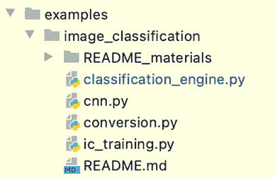

# 第五章：联邦学习客户端实现

根据系统架构、顺序和流程，如第*3 章*“联邦学习系统的工作原理”中所述，**联邦学习**（**FL**）系统的客户端模块可以基于系统架构、顺序和流程实现。FL 客户端功能可以将进行本地训练和测试的分布式**机器学习**（**ML**）应用程序与聚合器通过客户端库中嵌入的通信模块连接起来。

在使用 FL 客户端库的本地 ML 引擎示例中，将讨论最小引擎包示例，使用虚拟 ML 模型来理解与本章设计的 FL 客户端库集成的过程。通过遵循集成示例代码，您将了解如何实际启用与 FL 客户端相关的整个流程，如第*3 章*“联邦学习系统的工作原理”中所述，同时将在第*6 章*“运行联邦学习系统并分析结果”中讨论最小示例将发生什么。

在本章中，将讨论在本地 ML 引擎中使用的 FL 客户端功能的设计和实现原理概述。通过阅读本章，您将能够编写 FL 客户端模块和库以及分布式本地 ML 引擎的代码，例如使用**卷积神经网络**（**CNNs**）进行图像分类。

在本章中，我们将涵盖以下主题：

+   FL 客户端组件概述

+   实现 FL 客户端主要功能

+   设计 FL 客户端库

+   本地 ML 引擎集成到 FL 系统中

+   将图像分类集成到 FL 系统中的示例

# 技术要求

本章中介绍的所有代码文件都可以在 GitHub 上找到（[`github.com/tie-set/simple-fl`](https://github.com/tie-set/simple-fl)）。

重要提示

您可以使用代码文件用于个人或教育目的。请注意，我们不会支持商业部署，并且不对使用代码造成的任何错误、问题或损害负责。

# FL 客户端组件概述

在第*3 章*“联邦学习系统的工作原理”中介绍了 FL 客户端作为代理的架构。在此，我们将介绍实现 FL 客户端基本功能的代码。在此处，软件架构的客户端被简化，仅可以使用此示例中的`client.py`文件，以及来自`lib/util`文件夹的支持函数，如图*5.1*所示：

![图 5.1 – 作为代理的 FL 客户端的 Python 软件组件

![img/B18369_05_01.jpg]

图 5.1 – 作为代理的 FL 客户端的 Python 软件组件

以下部分简要描述了 FL 系统代理的 Python 文件。

## 分布式代理端代码

对于代理端，`fl_main/agent`目录中有一个主要文件`client.py`，它处理大多数 FL 客户端功能。

### FL 客户端代码（client.py）

`agent`文件夹中的`client.py`文件包含参与 FL 周期、与聚合器进行 ML 模型交换的框架以及*推送*和*轮询*机制以与聚合器通信的功能。客户端的功能还可以作为本地 ML 应用程序与 FL 系统本身的接口，为 ML 引擎提供 FL 客户端库。这是将本地训练的 ML 模型连接到 FL 服务器和聚合器的主要代码。您需要自己准备一个本地 ML 应用程序，我们将帮助您了解如何使用 FL 客户端库将您的 ML 引擎集成到 FL 系统中，这是本章的另一个主要主题。

### lib/util 代码

将对支持 Python 代码（`communication_handler.py`、`data_struc.py`、`helpers.py`、`messengers.py`和`states.py`）作为内部库的解释包含在*附录，探索内部库*中。

## 代理配置

以下是我们使用的代码中保存为`config_agent.json`的客户端配置参数示例：

```py
{
    "aggr_ip": "localhost",
    "reg_socket": "8765",
    "model_path": "./data/agents",
    "local_model_file_name": "lms.binaryfile",
    "global_model_file_name": "gms.binaryfile",
    "state_file_name": "state",
    "init_weights_flag": 1,
    "polling": 1
}
```

聚合器的 IP（`aggr_ip`）和端口号（`reg_socket`）用于连接到 FL 服务器，在那里进行本地模型的聚合。此外，模型路径参数`model_path`指定了本地模型（命名为`local_model_file_name`）和全局模型（命名为`global_model_file_name`）的位置。本地和全局模型存储为二进制文件（本例中为`lms.binaryfile`和`gms.binaryfile`）。状态文件（命名为`state_file_name`）记录客户端的本地状态，定义了等待全局模型、训练模型、发送训练好的模型等。`init_weights_flag`在系统操作员希望使用某些权重初始化全局模型时使用。如果标志为`1`，代理将发送预配置的模型；否则，模型将在聚合器端填充为零。轮询标志（`polling`）涉及是否在代理和聚合器之间使用轮询方法进行通信。

现在我们已经讨论了 FL 客户端模块，让我们来看看实际的实现和一些代码，以实现 FL 客户端的功能。

# 实现 FL 客户端主要功能

在本节中，我们将解释如何实现基本的联邦学习客户端代码，该代码在 `agent` 目录下的 `client.py` 文件中有描述。请参阅*第三章*，*联邦学习系统的工作原理*，以了解联邦学习客户端架构、序列和流程。通过学习这段客户端代码，您将了解如何实现智能体的注册过程、模型交换同步以及*推送*/*轮询*机制，以及智能体和聚合器之间的通信协议，以及一些将在其他机器学习应用中作为**应用程序编程接口**（**API**）调用的函数。

让我们先看看实现联邦学习客户端功能需要导入哪些库。

## 为智能体导入库

在这个 `client.py` 文件示例中，智能体导入了通用库，例如 `asyncio` 和 `time`（关于这些库的详细解释超出了本书的范围）：

```py
import asyncio, time, logging, sys, os
from typing import Dict, Any
from threading import Thread
from fl_main.lib.util.communication_handler import \
     init_client_server, send, receive
from fl_main.lib.util.helpers import read_config, \
     init_loop, save_model_file, load_model_file, \
     read_state, write_state, generate_id, \
     set_config_file, get_ip, compatible_data_dict_read, \
     generate_model_id, create_data_dict_from_models, \
     create_meta_data_dict
from fl_main.lib.util.states import ClientState, \
     AggMsgType, ParticipateConfirmationMSGLocation, \
     GMDistributionMsgLocation, IDPrefix
from fl_main.lib.util.messengers import \
     generate_lmodel_update_message, \
     generate_agent_participation_message, \
     generate_polling_message
```

至于从 `fl_main.lib.util` 导入的 `communication_handler`、`helpers`、`states` 和 `messengers` 库，它们旨在启用联邦学习的一般功能，请参阅*附录，探索内部库*。

在导入必要的库之后，您将定义 `Client` 类。

## 定义客户端类

让我们定义实现联邦学习客户端核心功能的 `Client` 类，包括智能体自身的参与机制、模型交换框架以及智能体和聚合器之间的通信接口，以及为在智能体端本地机器学习引擎中使用提供的库：

```py
class Client:
    """
    Client class instance with FL client-side functions
    and libraries used in the agent's ML engine
    """
```

然后，您将在 `__init__` 函数下初始化 `Client` 类，如下一节所述。

## 初始化客户端

以下 `__init__` 构造函数中的代码是客户端初始化过程的示例：

```py
def __init__(self):
    self.agent_name = 'default_agent'
    self.id = generate_id()
    self.agent_ip = get_ip()
    self.simulation_flag = False
    if len(sys.argv) > 1:
        self.simulation_flag = bool(int(sys.argv[1]))
    config_file = set_config_file("agent")
    self.config = read_config(config_file)
    self.aggr_ip = self.config['aggr_ip']
    self.reg_socket = self.config['reg_socket']
    self.msend_socket = 0
    self.exch_socket = 0
    if self.simulation_flag:
        self.exch_socket = int(sys.argv[2])
        self.agent_name = sys.argv[3]
    self.model_path = f'{self.config["model_path"]}
                                        /{self.agent_name}'
    if not os.path.exists(self.model_path):
        os.makedirs(self.model_path)
    self.lmfile = self.config['local_model_file_name']
    self.gmfile = self.config['global_model_file_name']
    self.statefile = self.config['state_file_name']
    self.round = 0
    self.init_weights_flag = \
                     bool(self.config['init_weights_flag'])
    self.is_polling = bool(self.config['polling'])
```

首先，客户端为自己生成一个唯一的 ID 作为标识符，该标识符将在许多场景中用于执行联邦学习。

第二，客户端通过使用 `get_ip()` 函数获取自己的 IP 地址。

此外，本实现练习支持模拟运行，其中我们可以在一台机器上运行数据库、服务器和多个智能体的所有联邦学习系统组件。如果需要进行模拟，则 `simulation_flag` 参数需要设置为 `True`（有关如何设置模拟模式的说明，请参阅 GitHub 上的 `README` 文件）。

然后，`self.cofig` 读取并存储 `config_agent.json` 的信息。

然后，客户端配置聚合器的信息以连接到其服务器，其中 `self.aggr_ip` 从智能体配置文件中读取聚合器机器或实例的 IP 地址。

之后，将设置 `reg_socket` 端口，其中 `reg_socket` 用于智能体的注册，以及存储为 `self.aggr_ip` 的聚合器 IP 地址。在这个示例中，`reg_socket` 的值也可以从智能体配置文件中读取。

用于在模型交换例程中发送本地机器学习模型的 `msend_socket`，将在代理通过向联邦学习服务器发送消息并接收响应后参与联邦学习过程时进行配置。

当通信不是在 *轮询* 模式下时，`exch_socket` 用于接收来自聚合器的全局模型，同时与存储为 `self.agent_ip` 的代理 IP 地址一起使用。

在本例中，`exch_socket` 可以根据模拟模式从命令行参数读取或由聚合器决定。

在本例中，当聚合器被设置为能够向连接的代理推送消息时，这在轮询模式下是不成立的，`exch_socket` 可以由聚合器动态配置。

`self.model_path` 存储本地和全局模型的路径，可以根据模拟模式从代理配置文件或命令行参数中读取。如果没有目录来保存这些模型文件，它将确保创建该目录。

`self.lmfile`, `self.gmfile`, 和 `self.statefile` 分别是本地模型、全局模型和客户端状态的文件名，它们从代理的配置文件中读取。特别是，在 `self.statefile` 中，保存了 `ClientState` 的值。`ClientState` 是客户端自身的枚举值，其中有一个等待全局模型的状态（`waiting_gm`），一个用于本地训练的状态（`training`），一个用于发送本地模型的状态（`sending`），以及一个拥有更新后的全局模型的状态（`gm_ready`）。

联邦学习过程的轮次信息，定义为 `self.round`，初始化为 `0`，并在模型聚合过程中随着联邦学习轮次的进行而更新，通常聚合器会通知轮次的变化。

`self.init_weights_flag` 是当系统操作员想要使用某些参数初始化全局模型时使用的标志，如代理配置中所述。

`self.is_polling` 标志涉及是否在代理和聚合器之间的通信中使用轮询方法。轮询标志必须与聚合器端设置的标志相同。

这里讨论的关于 `__init__` 构造函数的代码可以在 GitHub 上的 `fl_main/agent` 文件夹中的 `client.py` 文件中找到 ([`github.com/tie-set/simple-fl`](https://github.com/tie-set/simple-fl))。

既然我们已经讨论了如何初始化客户端模块，在下一节中，我们将探讨参与机制是如何与一些示例代码一起工作的。

## 代理参与联邦学习周期

这个参与或注册过程是代理能够与其他代理一起参与联邦学习过程所必需的。因此，代理需要被添加到可以发送本地训练的机器学习模型到聚合器的授权代理列表中。

异步的 `participate` 函数向聚合器发送第一条消息以加入 FL 循环，并将接收状态和通信信息，例如来自聚合器的套接字编号。

代理通过 `config_agent.json` 文件知道加入 FL 平台的 IP 地址和端口号。当加入 FL 平台时，代理发送包含以下信息的参与消息：

+   `agent_name`：代理自身的唯一名称。

+   `id`：代理自身的唯一标识符。

+   `model_id`：要发送给聚合器的模型的唯一标识符。

+   `models`：按模型名称键控的模型字典。如果 `init_flag` 为 `False`，则模型权重不需要训练，因为它仅由聚合器用于记住模型的形状。

+   `init_weights_flag`：一个布尔标志，表示发送的模型权重是否应作为基础模型使用。如果为 `True` 且没有准备好的全局模型，聚合器将此组本地模型作为第一个全局模型，并发送给所有代理。

+   `simulation_flag`：如果是模拟运行，则为 `True`；否则为 `False`。

+   `exch_socket`：等待从聚合器接收全局模型的端口号。

+   `gene_time`：模型生成的时间。

+   `performance_dict`：以字典格式存储与模型相关的性能数据。

+   `agent_ip`：代理自身的 IP 地址。

定义了所有上述参与消息后，代理准备好与聚合器交换模型，实现参与过程的代码如下：

```py
async def participate(self):
    data_dict, performance_dict = \
       load_model_file(self.model_path, self.lmfile)
    _, gene_time, models, model_id = \
       compatible_data_dict_read(data_dict)
    msg = generate_agent_participation_message(
         self.agent_name, self.id, model_id, models,
         self.init_weights_flag, self.simulation_flag,
         self.exch_socket, gene_time, performance_dict,
         self.agent_ip)
    resp = await send(msg, self.aggr_ip, self.reg_socket)
    self.round = resp[ \
       int(ParticipateConfirmaMSGLocation.round)]
    self.exch_socket = resp[ \
       int(ParticipateConfirmationMSGLocation.exch_socket)]
    self.msend_socket = resp[ \
       int(ParticipateConfirmationMSGLocation.recv_socket)]
    self.id = resp[ \
       int(ParticipateConfirmationMSGLocation.agent_id)]
    self.save_model_from_message(resp, \
        ParticipateConfirmationMSGLocation)
```

代理读取本地模型以告知聚合器 ML 模型的结构，初始模型不一定需要训练。`data_dict` 和 `performance_dict` 分别存储模型及其性能数据。

然后，使用 `generate_agent_participation_message` 函数包装包含如 ML `models` 和其 `model_id` 等信息的消息 `msg`。

在发送消息时，在这个例子中，使用聚合器的 IP 地址 (`aggr_ip`) 和注册端口号 (`reg_socket`) 构建 WebSocket 以连接到聚合器。

通过从 `communication_handler` 导入的异步 `send` 函数向聚合器发送消息后，代理从聚合器接收响应消息 `resp`。响应将包括轮次信息、接收全局模型 `exch_socket` 的端口号、将本地模型发送到聚合器 `msend_socket` 的端口号以及更新的代理 ID。

最后，通过调用 `save_model_from_message` 函数将响应消息中的全局模型保存在本地。

代理的参与机制已经解释。在下一节中，我们将学习模型交换同步的框架。

## 模型交换同步

模型交换同步，如下面的代码所示，是为了检查代理的状态并根据状态调用适当的函数：

```py
Async def model_exchange_routine(self):
    while True:
        await asyncio.sleep(5)
        state = read_state(self.model_path, self.statefile)
        if state == ClientState.sending:
            await self.send_models()
        elif state == ClientState.waiting_gm:
            if self.is_polling == True:
               await self.process_polling()
            else: pass
        elif state == ClientState.training: pass
        elif state == ClientState.gm_ready: pass
        else: pass
```

基本上，当客户端存活时，这个过程始终在运行，而`while`循环则定期用来检查客户端的`状态`，并在必要时进行下一步操作。

在`while`循环中，等待几秒钟后，它首先通过`read_state`函数检查客户端状态。`read_state`函数中的参数是用来定位存储在本地环境中的`状态`文件。

正如所述，`ClientState`具有客户端状态的枚举值，定义了发送本地模型的状态（`发送`）、等待全局模型的状态（`等待 _sgm`）、本地训练的状态（`训练`）和接收更新后的全局模型的状态（`gm_ready`）。

如果客户端处于`发送`状态（`state == ClientState.sending`），这意味着它已准备好将本地训练的模型发送到聚合器。因此，代理调用`send_models`函数将本地训练的机器学习模型发送到聚合器。

当状态是`等待全局模型`（`state == ClientState.waiting_gm`）时，如果开启轮询模式，则通过`process_polling`从代理向聚合器进行轮询；如果轮询模式关闭，则什么都不做。

如果客户端处于`训练`状态（`state == ClientState.training`），这意味着客户端现在正在训练本地模型，只需等待几秒钟，如果需要的话打印训练状态。也可以根据需要添加任何程序。

如果客户端处于`gm_ready`状态（`state == ClientState.gm_ready`），这意味着客户端已收到全局模型。此状态将由本地机器学习应用程序处理，它除了显示全局模型的就绪状态外，不做任何事情。

在下一节中，我们将讨论如何实现联邦学习周期中的*推送*和*轮询*机制。

## 推送和轮询实现

一旦代理初始化并确认参与联邦学习过程，它就开始等待从聚合器发送的全局模型。从聚合器接收全局模型有两种方式：推送方法和轮询方法。尽管为了简化，这里没有在联邦学习客户端代码中实现**安全套接字层**（**SSL**）或**传输层安全性**（**TSL**）框架，但建议支持它们以确保持续的通信安全。

让我们来看看每个通信框架的机制。

### 从聚合器到代理的推送方法

使用推送方法，聚合器将在全局模型生成后立即将包含全局模型的消息推送到所有连接的代理。

以下代码展示了从聚合器接受和保存全局模型的*推送*机制：

```py
async def wait_models(self, websocket, path):
    gm_msg = await receive(websocket)
    self.save_model_from_message( \
        gm_msg, GMDistributionMsgLocation)
```

`wait_models`异步函数接受`websocket`作为参数。当聚合器向代理发送消息时，它通过`await recieve(websocket)`接收`gm_msg`消息，并通过调用在*设计 FL 客户端库*部分定义的`save_model_from_message`函数，将全局模型本地保存。

### 代理到聚合器的轮询方法

使用`polling`方法，代理将持续询问（轮询）聚合器，以查看全局模型是否已经形成。一旦创建并准备好发送给连接的代理，轮询的消息将返回给代理，并在响应中包含更新的全局模型。

以下关于`process_polling`异步函数的代码说明了`polling`方法：

```py
async def process_polling(self):
    msg = generate_polling_message(self.round, self.id)
    resp = await send(msg, self.aggr_ip, self.msend_socket)
    if resp[int(PollingMSGLocation.msg_type)] \
                                      == AggMsgType.update:
        self.save_model_from_message(resp, \
            GMDistributionMsgLocation)
    else: pass
```

它首先使用`generate_polling_message`函数生成要发送给聚合器的轮询消息。在收到聚合器发送的响应消息`resp`后，如果消息类型是`AggMsgType.update`，意味着响应消息包含更新的全局模型，它将调用`save_model_from_message`函数。否则，它不执行任何操作。

上述函数是 FL 客户端的基本但核心功能，这些函数需要作为库被用户端的 ML 应用程序高效地使用。

现在 FL 客户端设计，包括初始化、参与和模型交换，已经解释过了，我们将学习如何设计 FL 客户端库。

# 设计 FL 客户端库

在本节中，我们将解释如何封装基本函数作为库提供给用户。在本例中，将它们作为库封装的最简单方法将被讨论。这需要根据你的需求和自己的 FL 客户端框架设计进行扩展。通过将 FL 客户端模块作为库封装，开发者将能够轻松地将 FL 客户端的功能集成到本地 ML 引擎中。

让我们从如何定义一个库来启动和注册 FL 客户端开始。

## 启动 FL 客户端核心线程

为了使本地 ML 应用开发者能够集成 FL 客户端相关的函数，有时需要将它们封装为线程函数。

以下注册 FL 系统中代理的代码简单地将一个`participate`函数放入`asyncio.get_event_loop`函数的`run_until_complete`函数中：

```py
def register_client(self):
    asyncio.get_event_loop().run_until_complete( \
        self.participate())
```

此外，`start_wait_model_server`函数被封装，如下面的代码块所示，其中`Thread`函数负责持续运行。这样，你将能够在并行运行本地 ML 模块的同时，在 FL 系统处于*推送*通信模式时，在`wait_models`线程中接收全局模型：

```py
def start_wait_model_server(self):
    th = Thread(target = init_client_server, \
        args=[self.wait_models, self.agent_ip, \
        self.exch_socket])
    th.start()
```

同样，`start_model_exhange_server` 函数可以是一个线程，用于运行模型交换例程以同步本地和全局模型，同时本地机器学习模块并行运行。您只需调用以下 `start_model_exchange_server` 函数作为库来启用此功能：

```py
def start_model_exchange_server(self):
    self.agent_running = True
    th = Thread(target = init_loop, \
        args=[self.model_exchange_routine()])
    th.start()
```

最后，当它们在 `Client` 类外部被调用时，同时执行所有这三个函数可能是有帮助的。因此，我们引入了以下关于 `start_fl_client` 的代码，该代码聚合了注册代理、等待全局模型和模型交换例程以启动 FL 客户端核心功能的功能：

```py
def start_fl_client(self):
    self.register_client()
    if self.is_polling == False:
        self.start_wait_model_server()
    self.start_model_exchange_server()
```

FL 客户端的初始化现在被封装到 `start_fl_client` 中。接下来，我们将定义保存的机器学习模型库。

## 保存全局模型

虽然 `load` 和 `save` 模型函数由 `lib/util` 中的辅助函数提供，这些将在后面的 *附录*，*探索内部库* 中解释，但为机器学习开发者提供一个从聚合器发送的消息中保存全局模型的接口是有帮助的。

以下 `save_model_from_message` 函数是一个从代理中提取并保存全局模型，并更改客户端状态为 `gm_ready` 的函数。此函数将消息（`msg`）和消息位置（`MSG_LOC`）信息作为参数：

```py
def save_model_from_message(self, msg, MSG_LOC):
    data_dict = create_data_dict_from_models( \
        msg[int(MSG_LOC.model_id)],
        msg[int(MSG_LOC.global_models)],
        msg[int(MSG_LOC.aggregator_id)])
    self.round = msg[int(MSG_LOC.round)]
    save_model_file(data_dict, self.model_path, \
        self.gmfile)
    self.tran_state(ClientState.gm_ready)
```

使用 `create_data_dict_from_models` 库从消息中提取全局模型、模型 ID 和聚合器 ID，并将它们放入字典中。根据接收到的消息，也更新了轮次信息。

然后，使用 `save_model_file` 库将接收到的全局模型保存到本地文件中，其中指定了数据字典、模型路径和全局模型文件名以保存模型。

接收到全局模型后，它通过调用 `tran_state` 函数将客户端状态更改为 `gm_ready`，该状态表示全局模型已准备好由本地机器学习使用，`tran_state` 函数将在下一节中解释。

定义了保存全局模型的函数后，我们就可以继续下一节，了解如何操作客户端状态。

## 操作客户端状态

为了操作客户端状态以便它可以逻辑地处理本地和全局模型，我们准备了 `read_state` 和 `tran_state` 函数，这些函数可以从代码内部和外部访问。

以下 `read_state` 函数读取存储在 `statefile` 中、由 `model_path` 指定位置的值。使用 `ClientState` 的枚举值来更改客户端状态：

```py
def read_state(self) -> ClientState:
    return read_state(self.model_path, self.statefile)
```

以下 `tran_state` 函数更改代理的状态。在这个代码示例中，状态仅在本地 `state` 文件中维护：

```py
def tran_state(self, state: ClientState):
    write_state(self.model_path, self.statefile, state)
```

接下来，让我们定义可以将本地模型发送到聚合器的函数。

## 将本地模型发送到聚合器

以下异步的 `send_models` 函数是关于将本地保存的模型发送到聚合器的：

```py
async def send_models(self):
    data_dict, performance_dict = \
        load_model_file(self.model_path, self.lmfile)
    , _, models, model_id = \
        compatible_data_dict_read(data_dict)
    msg = generate_lmodel_update_message( \
        self.id, model_id, models, performance_dict)
    await send(msg, self.aggr_ip, self.msend_socket)
    self.tran_state(ClientState.waiting_gm)
```

它首先使用`load_model_file`辅助函数提取`data_dict`和`performance_dict`，然后根据`compatible_data_dict_read`函数从`data_dict`中提取模型及其 ID。然后，使用`generate_lmodel_update_message`库包装消息，并通过`communication_handler`的`send`函数发送到聚合器。之后，通过`tran_state`函数将客户端状态更改为`waiting_gm`。再次强调，可以添加 SSL/TSL 框架来确保通信安全，但在此处未实现，以保持联邦学习客户端编码的简单性。

当你想将初始*基础模型*发送到模型架构的聚合器以进行注册目的时，会调用以下`send_initial_model`函数。它接受初始模型、样本数量和性能值作为输入，并调用将在本节后面解释的`setup_sending_model`：

```py
def send_initial_model(self, initial_models, \
                             num_samples=1, perf_val=0.0):
    self.setup_sending_models( \
        initial_models, num_samples, perf_val)
```

当你在联邦学习周期内想要向聚合器发送训练好的本地模型时，会调用以下`send_trained_model`函数。它接受训练好的模型、样本数量和性能值作为输入，并且只有在客户端状态不是`gm_ready`时才调用`setup_sending_model`：

```py
def send_trained_model(self, models, \
                             num_samples, perf_value):
    state = self.read_state()
    if state == ClientState.gm_ready:
        pass
    else:
        self.setup_sending_models( \
            models, num_samples, perf_value)
```

以下`setup_sending_models`函数被设计为内部库，用于设置将本地训练的模型发送到聚合器的过程。它接受模型的参数作为`np.array`，样本数量作为整数，以及性能数据作为浮点值：

```py
def setup_sending_models(self, models, \
                               num_samples, perf_val):
    model_id = generate_model_id( \
                   IDPrefix.agent, self.id, time.time())
    data_dict = create_data_dict_from_models( \
                    model_id, models, self.id)
    meta_data_dict = create_meta_data_dict( \
                         perf_val, num_samples)
    save_model_file(data_dict, self.model_path, \
        self.lmfile, meta_data_dict)
    self.tran_state(ClientState.sending)
```

基本上，这个函数使用`generate_model_id`辅助函数创建一个唯一的模型 ID，使用`create_data_dict_from_models`辅助函数创建的`data_dict`来存储本地机器学习模型数据，以及使用`create_meta_data_dict`辅助函数创建的`meta_data_dict`来存储性能数据。然后，所有与模型和性能相关的上述数据都使用`save_model_file`函数保存在由`self.model_path`指定的位置。接着，它将客户端状态更改为`sending`，以便`mode_exchange_routine`函数可以注意客户端状态的改变，并开始向聚合器发送训练好的本地模型。

既然我们已经了解了将机器学习模型发送到聚合器的库，那么让我们来了解一个在代理端等待全局模型的重要函数。

## 等待聚合器提供的全局模型

以下`wait_for_global_model`函数对于持续进行联邦学习周期非常重要：

```py
def wait_for_global_model(self):
    while (self.read_state() != ClientState.gm_ready):
        time.sleep(5)
    data_dict, _ = load_model_file( \
                       self.model_path, self.gmfile)
    global_models = data_dict['models']
    self.tran_state(ClientState.training)
    return global_models
```

原则上，该函数会等待客户端状态变为`gm_ready`。当代理端接收到全局模型时，客户端状态会变为`gm_ready`。一旦客户端状态变为`gm_ready`，它将继续从`data_dict`中加载全局模型，使用`load_model_file`函数提取，将客户端状态更改为`training`，并将全局模型返回到本地机器学习模块。

我们已经讨论了如何设计 FL 客户端函数的库。在下一节中，我们将讨论如何将这些库集成到本地机器学习过程中。

# 本地机器学习引擎集成到 FL 系统中

将 FL 客户端库成功集成到本地机器学习引擎中，对于后续在分布式环境中进行联邦学习至关重要。

如*图 5.2*所示，GitHub 仓库[`github.com/tie-set/simple-fl`](https://github.com/tie-set/simple-fl)中`examples/minimal`目录下的`minimal_MLEngine.py`文件提供了一个将 FL 客户端库集成到最小化 ML 引擎包的示例：


图 5.2 – 最小化机器学习引擎包

在下一节中，我们将解释需要将哪些库导入到本地机器学习引擎中。

## 导入本地机器学习引擎的库

以下代码显示了导入过程，其中首先导入了通用库，如`numpy`、`time`和`Dict`。这个过程的关键部分是，从`fl_main.agent`文件夹中的`client.py`文件导入`Client`。这样，开发者不需要了解 FL 系统内部太多的代码，只需调用作为库定义的重要功能，正如在*设计 FL 客户端库的方向*一节中讨论的那样。

本书将不会介绍`pip`安装打包的内容，但可以使用私有或公共 PyPI 服务器托管客户端代码：

```py
import numpy as np
import time, logging, sys
from typing import Dict
from fl_main.agent.client import Client
```

在导入必要的库之后，让我们看看为本地训练和测试定义的函数。

## 定义机器学习模型、训练和测试函数

您首先定义要集成到 FL 系统中的模型、训练和测试函数。在本代码示例中，我们将使用虚拟模型和训练/测试函数，使用户能够理解最小化 FL 流程，而无需被特定的机器学习复杂性所困扰。

被称为`init_models`的以下函数返回模型的模板（以字典格式），以告知 ML 模型结构。模型不一定需要训练。在这种情况下，模型由`model1`和`model2`定义了两个层，每个层分配了一些随机的 NumPy 数组，如下所示：

```py
def init_models() -> Dict[str,np.array]:
    models = dict()
    models['model1'] = np.array([[1, 2, 3], [4, 5, 6]])
    models['model2'] = np.array([[1, 2], [3, 4]])
    return models
```

在初始化模型后，您将设计以下`training`函数，它可以作为每个 ML 应用的占位符函数：

```py
def training(models: Dict[str,np.array],
           init_flag: bool = False) -> Dict[str,np.array]:
    # return templates of models to tell the structure
    # This model is not necessarily actually trained
    if init_flag:
        return init_models()
    # ML Training. In this example, no actual training.
    models = dict()
    models['model1'] = np.array([[1, 2, 3], [4, 5, 6]])
    models['model2'] = np.array([[1, 2], [3, 4]])
    return models
```

此函数的逻辑顺序应该是接收模型作为输入，训练它们，并返回训练后的本地模型。作为输入参数，它接受具有`Dict[str,np.array]`格式的模型和`init_flag`布尔值，指示是否是初始化步骤。

当您想要调用并返回预定义的`init_models`时，`init_flag`为`True`，如果是实际的训练步骤，则为`False`。

最终，此函数返回分解为 NumPy 数组的训练模型，在这个例子中是一个 `Dict[str,np.array]` 字典。

在这个虚拟例子中，我们只是提供了虚拟模型，跳过了实际的训练过程。

然后，以下 `compute_performance` 函数被设计用来计算给定一组模型和测试数据集的模型性能：

```py
def compute_performance(models: Dict[str,np.array], \
                                      testdata) -> float:
    # replace with actual performance computation logic
    accuracy = 0.5
    return
```

再次强调，在这个例子中，只提供了一个虚拟准确度值 `0.5`，以保持事情简单。

然后，你可能想要定义以下 `judge_termination` 函数来决定结束训练过程并退出联邦学习过程的准则：

```py
def judge_termination(training_count: int = 0,
              global_arrival_count: int = 0) -> bool:
    # Depending on termination criteria, change the return bool value
    # Call a performance tracker to check if the current models satisfy the required performance
    return True
```

如何设计这个终止条件取决于你。这个函数接受诸如完成训练过程的数量（`training_count`）、接收全局模型的次数（`global_arrival_count`）等参数，返回一个布尔值，其中标志为 `True` 表示继续联邦学习过程，`False` 表示停止。在这里，它只提供了一个 `True` 布尔值，意味着除非代理被强制在函数外部停止，否则联邦学习过程不会停止。

如果需要准备测试数据，你可以定义一个如 `prep_test_data` 的函数：

```py
def prep_test_data():
    testdata = 0
    return
```

在这个例子中，它被设置为 `0`。

现在测试和训练所需的函数已经定义，我们将客户端库集成到本地机器学习（ML）引擎中，以运行与联邦服务器端组件（如聚合器和数据库）一起工作的联邦学习代理。

## 将客户端库集成到您的本地 ML 引擎中

现在，一切准备就绪，可以开始你的第一个联邦学习（FL）过程，尽管模型、训练和测试函数都使用虚拟变量设置。

首要任务是创建一个 `Client` 实例，如下所示，以便你可以调用其库：

```py
# Step1: Create Client instance
cl = Client()
```

第二，你使用训练函数创建 `initial_models`，如下所示：

```py
# Step2: Create template models (to tell the shapes)
initial_models = training(dict(), init_flag=True)
```

之后，通过调用 `cl.send_initial_model` 并将 `initial_models` 作为参数，它将初始模型发送到联邦聚合器：

```py
# Step3: Send initial models
cl.send_initial_model(initial_model)
```

然后，让我们通过调用 `cl.start_fl_client()` 来启动客户端的联邦学习过程。正如在 *启动联邦客户端核心线程* 部分中解释的那样，此函数可以同时启动三个过程：注册代理、等待全局模型以及模型交换例程：

```py
# Step4: Start the FL client
cl.start_fl_client()
```

然后，我们通过有效地集成几个联邦客户端库，设计客户端的本地训练/测试和发送/接收模型的联邦学习周期：

```py
# Step5: Run the local FL loop
training_count, gm_arrival_count = 0, 0
while judge_termination(training_count, gm_arrival_count):
    global_models = cl.wait_for_global_model()
    gm_arrival_count += 1
    global_model_performance_data = \
       compute_performance(global_models, prep_test_data())
    models = training(global_models)
    training_count += 1
    perf_value = compute_performance( \
                     models, prep_test_data())
    cl.send_trained_model(models, 1, perf_value)
```

我们使用 `while` 循环和 `judge_termination` 函数来检查系统是否需要退出循环。是否使用 `training_count` 和 `gm_arrival_count` 来判断联邦学习周期的终止取决于你。

然后，代理通过 `cl.wait_for_global_model()` 继续等待全局模型。当从聚合器接收到全局模型后，它提取 `global_models`，增加 `gm_arrival_count`，并在 `wait_for_global_model` 函数中将客户端状态设置为 `training` 状态。

接下来，使用 `compute_performance` 函数计算 `global_model_performance_data`，输入为 `global_models` 和 `prep_test_data`。

当在 `training` 状态下执行 `training(global_models)` 时，客户端可能会从聚合器接收新的全局模型。这种情况发生在客户端的本地训练速度过慢，聚合器决定利用其他本地模型来创建一组新的全局模型。如果新的全局模型已经到达代理，客户端的状态将变为 `gm_ready`，并且当前正在训练的 ML 模型将被丢弃。

在本地训练阶段完成，并生成 `models` 后，代理通过 `compute_performance` 函数增加 `training_count` 并计算当前 ML 模型的性能数据 `perf_value`。

然后，代理尝试通过 `cl.send_trained_model` 将训练好的本地模型上传到聚合器，并将训练好的模型和之前计算的性能值作为参数。

在 `send_trained_model` 函数中，客户端状态被设置为 `sending`。一旦客户端的 `model_exchange_routine` 观察到状态转换为 `sending` 状态，它将训练好的本地模型（以二进制文件的形式存储）发送给聚合器。发送模型后，它回到 `send_models` 函数中的 `waiting_gm` 状态。

在发送本地模型后，聚合器将其存储在缓冲区中，并等待下一轮全局模型聚合，直到有足够的本地模型由代理上传。

在下一节中，我们将简要介绍如何将图像分类机器学习集成到我们讨论过的联邦学习系统中。

# 将图像分类集成到联邦系统中的示例

我们通过一个最小示例学习了如何启动一个联邦学习过程。在本节中，我们将给出使用 CNN 进行图像分类（**IC**）的联邦学习的一个简要示例。

首先，包含图像分类示例代码的包位于 GitHub 仓库 [`github.com/tie-set/simple-fl`](https://github.com/tie-set/simple-fl) 中的 `examples/image_classification/` 文件夹，如图 5.3 所示：



图 5.3 – 图像分类包

负责将 IC 算法集成到 FL 系统中的主要代码位于 `classification_engine.py` 文件中。

当导入库时，我们使用一些额外的文件，包括与 IC 算法相关的 CNN 模型、转换函数和数据管理器。详细信息请参阅 GitHub 代码 [`github.com/tie-set/simple-fl`](https://github.com/tie-set/simple-fl)。

接下来，让我们导入一些标准的 ML 库以及我们讨论过的 FL 代码中的客户端库：

```py
import logging
import numpy as np
import torch
import torch.nn as nn
import torch.optim as optim
from typing import Dict
from .cnn import Net
from .conversion import Converter
from .ic_training import DataManger, execute_ic_training
from fl_main.agent.client import Client
```

在这种情况下，我们定义 `TrainingMetaData`，它只提供了将要发送给聚合器并在执行 `FedAvg` 算法时使用的数据量。聚合算法在 *第四章* *使用 Python 的联邦学习服务器实现* 以及在 *第七章* *模型聚合* 中进行了讨论：

```py
class TrainingMetaData:
    # The number of training data used for each round
    # This will be used for the weighted averaging
    # Set to a natural number > 0
    num_training_data = 8000
```

`init_models` 函数的内容现在被替换为一个转换为 NumPy 数组的 CNN。它以字典格式返回 CNN 的模板以告知结构：

```py
def init_models() -> Dict[str,np.array]:
    net = Net()
    return Converter.cvtr().convert_nn_to_dict_nparray(net)
```

训练函数 `training` 现在填充了使用 CIFAR-10 数据集的实际训练算法。它以模型和 `init_flag` 作为参数，并将训练后的模型作为 `Dict[str,np.array]` 返回。`init_flag` 是一个 `bool` 值，如果是初始步骤则为 `True`，如果是实际训练步骤则为 `False`。在准备训练数据时，由于批量大小，我们使用一定的阈值进行训练。在这种情况下，阈值是 `4`。

然后，我们使用 `net = Converter.cvtr().convert_dict_nparray_to_nn(models)` 创建一个基于 CNN 的聚类全局模型。

我们定义损失函数和优化器如下：

```py
criterion = nn.CrossEntropyLoss()
optimizer = optim.SGD(net.parameters(), lr=0.001, momentum=0.9)
```

然后，实际的训练将通过 `trained_net = execute_ic_training(DataManger.dm(), net, criterion, optimizer)` 进行，其中 IC 训练的实际代码可以在 `ic_training.py` 文件中找到。

训练完成后，将返回转换后的模型。

算法总结如下：

```py
def training(models: Dict[str,np.array], \
             init_flag: bool=False) -> Dict[str,np.array]:
    if init_flag:
        DataManger.dm( \
            int(TrainingMetaData.num_training_data / 4))
        return init_models()
    net = \
        Converter.cvtr().convert_dict_nparray_to_nn(models)
    criterion = nn.CrossEntropyLoss()
    optimizer = optim.SGD(net.parameters(), \
                          lr=0.001, momentum=0.9)
    trained_net = execute_ic_training(DataManger.dm(), \
                              net, criterion, optimizer)
    models = Converter.cvtr(). \
                 convert_nn_to_dict_nparray(trained_net)
    return models
```

下面的 `compute_performance` 函数填充了一个用于计算准确率的算法，这个算法足够简单——只需将正确结果的数量除以总标签的数量。给定一组模型和测试数据集，它使用 `models` 和 `testdata` 作为参数计算模型的性能：

```py
def compute_performance(models: Dict[str,np.array], \
                       testdata, is_local: bool) -> float:
    # Convert np arrays to a CNN
    net = \
       Converter.cvtr().convert_dict_nparray_to_nn(models)
    correct, total = 0, 0
    with torch.no_grad():
        for data in DataManger.dm().testloader:
            images, labels = data
            _, predicted = torch.max(net(images).data, 1)
            total += labels.size(0)
            correct += (predicted == labels).sum().item()
    acc = float(correct) / total
    return acc
```

`judge_termination` 和 `prep_test_data` 函数与最小示例中的函数相同。

## 客户端库集成到 IC 示例中

现在，一切准备就绪，可以开始 IC 算法了，整合前面函数的所有代码与之前 *将客户端库集成到您的本地 ML 引擎* 部分中使用的代码相同。请查看 `classification_engine.py` 文件，确保代码相同，除了显示我们实际发送的数据样本数量的部分。这样，通过仅重写前面的函数，您就可以轻松地将自己的本地 ML 应用程序连接到我们在这里讨论的 FL 系统。请参阅 *第六章* *运行联邦学习系统并分析结果* 中的 *运行图像分类及其分析* 部分，以检查本节讨论的代码的运行结果。

# 摘要

在本章中，我们讨论了联邦学习（FL）的客户端实现。在参与 FL 过程中有三个基本但重要的功能：通过推送或轮询机制接收来自聚合器的全局模型，以及在本地训练过程结束后向聚合器发送本地模型。为了有效地实现与 FL 聚合器合作的客户端机器学习引擎，理解客户端状态非常重要。客户端状态包括等待全局模型的状态、表示本地训练正在进行的状态、显示准备发送本地模型的状态，以及拥有更新后的全局模型的状态。

我们还讨论了 FL 客户端库的设计理念，其中核心功能需要有效地打包，以提供对机器学习开发人员和工程师友好的接口。

最后但同样重要的是，我们学习了如何实际使用 FL 客户端库将本地机器学习引擎集成到 FL 系统中，其中我们使用了最小示例和 IC 示例来理解集成过程本身。

在下一章中，我们将实际运行本章和前几章中介绍过的代码，以便我们可以深入了解模型的情况，这些模型通过最小示例以及 IC 示例进行聚合。
