# 9

# 联邦学习应用的关键用例案例研究

**联邦学习**（**FL**）迄今为止在各种情境下遇到了各种人工智能应用，并在这些领域通过试错探索了整合。最受欢迎的领域之一是医疗和保健领域，其中保护隐私的人工智能概念自然符合医疗保健人工智能的当前需求和挑战。FL 还应用于金融服务行业、边缘计算设备和**物联网**（**IoT**），通过这些应用，FL 在许多应用中显示出显著的益处，这将解决许多重要的社会问题。

在本章中，我们将讨论 FL 在不同领域的一些主要用例。我们希望到本章结束时，您将熟悉 FL 在不同行业中的应用。我们将从探索 FL 在医疗和金融行业中的应用开始，然后过渡到边缘计算和物联网领域。最后，我们将通过讨论 FL 与大数据分布式学习的交汇来结束本章。

本章将涵盖以下主题：

+   将 FL 应用于医疗保健行业

+   将 FL 应用于金融行业

+   FL 与边缘计算相遇

+   向智能互联网迈进

+   将 FL 应用于大数据分布式学习

# 将 FL 应用于医疗保健行业

在过去几年中，联邦学习（FL）在医疗保健领域的应用引起了相当多的关注。医疗保健的进步可以对我们生活产生巨大的影响。然而，一些挑战使得这些进步可能比其他领域更困难。让我们首先讨论一些存在的常见挑战，以及它们如何阻碍医疗保健领域人工智能的进一步发展。

## 医疗保健的挑战

其中一个主要挑战是数据可访问性。*数据可访问性*不是一个仅限于医疗保健的问题。它是整个人工智能行业的一个巨大问题，并且随着时间的推移，它将变得更加困难。它是医疗保健领域人工智能发展的核心问题，我们将在下面简要讨论为什么这是一个问题。我们还将继续回顾这个主要障碍，从许多不同的角度和应用中解决问题和解决方案。这种策略将使您了解问题的许多不同方面、复杂性和驱动因素。

数据可访问性问题有许多组成部分：

+   **隐私法规**：数据可访问性问题的主要瓶颈集中在为保护个人数据而实施的隐私法规上；这些法规绝对必要，并且应该得到实施。我们不会绕过这些法规，而是将讨论如何与它们并行工作，保持这些宝贵的法规不变，同时利用这些数据可以提供的智能。你可以将其视为两全其美的情景。在*第一章*的“数据隐私作为瓶颈”部分以及“大数据挑战”和“传统人工智能”中讨论了几个重要的隐私法规。

+   **数据不足/需要真实数据**：在提供积极社会影响方面，很少有领域像医疗保健那样具有如此大的潜力。然而，医疗保健行业在利用人工智能提供的所有许多好处方面远远落后。其中一个原因是，为了使 AI 和机器学习模型有效地学习，它们需要大量的数据。我们将在本章中进一步讨论对大量数据的需要。这是 AI 的限制因素。在医疗保健中，有许多法规阻止这些模型以任何方式利用数据，这是合理的。

+   **来自许多地方的数据类型**：正如我们接下来将要讨论的，来自许多不同地方有许多不同的数据类型。数据可以以文本、视频、图像或语音的形式存在，存储在许多不同的地方。除了能够从许多不同的位置访问数据这一主要挑战之外，这些机构还以各种格式存储数据。

正如之前提到的，FL 在医疗保健领域的应用是最早的工作之一。在这个广阔的领域内，FL 有几种方式可以帮助解决问题。让我们看看 FL 在以下一些领域有巨大潜力改变医疗保健系统的例子。这些领域包括医学影像、药物发现和**电子健康记录**（EHRs）。

让我们先来仔细看看 FL 在医学影像中的应用。

## 医学影像

在医学影像领域，正如在“基于深度学习和联邦学习的脑肿瘤诊断方法综合分析”中讨论的那样，人们对 FL 充满了乐观情绪，该分析列在本章的“进一步阅读”部分。这些高期望部分是由于需要解决的一些挑战以及 FL 克服这些障碍的能力。其中一项挑战是需要大量的数据。

随着医学影像行业继续发展更好的设备、程序和设施，每天都会产生大量的医学影像数据。这种数据的指数级增长为医疗保健提供者开发更好的机器学习模型和提高医疗保健质量提供了巨大的机会。

另一个对 FL 对医学影像产生积极影响的乐观原因已经证明的成功是**机器学习**（**ML**）——更具体地说，是**深度学习**（**DL**）。

让我们简要地看看 DL，以更好地理解为什么在处理大量数据时它如此重要。DL 是 AI 范畴下的 ML 的一个子空间。DL 与 ML 的不同之处在于它使用了几层被称为神经网络的层。关于 DL 和神经网络已有几本书被撰写，因此我们不会在本书中详细解释这些内容。对于 DL 和神经网络的更深入覆盖，Packt 的《Advanced Deep Learning with Python》是一本很好的读物。在我们的一般讨论中，我们将提供一个非常基本的解释。

下面的图，*图 9**.1*，展示了使用医学影像帮助分类脑肿瘤类型的神经网络的简单示例：

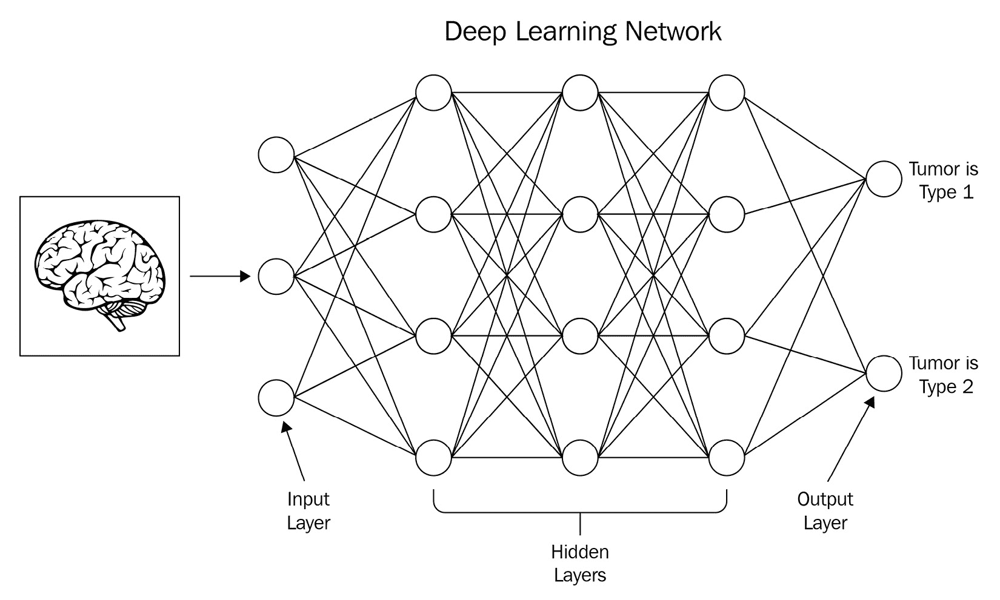

图 9.1 – 使用神经网络的肿瘤分类

在图例的左侧，我们有一个显示具有两种类型肿瘤之一的大脑图像。图像被分解成代表图像像素的数字。这些数字被添加到神经网络中。隐藏层为这些数字使用不同的权重，并通过激活函数产生不同的输出。最后，我们可以看到两个输出层。在这种情况下，有两种可能的输出。一个是**肿瘤为 1 型**，另一个是**肿瘤为 2 型**。

### 单个位置数据有限

如您所见，DL 模型需要大量的数据来训练。通常，单个数据存储库只有少量数据，这限制了任何模型很好地泛化的能力。

### 解决数据可访问性挑战的可能的解决方案

一种解决方案是利用隐私保护 FL，这样可以在保持敏感数据隐私的同时，利用多个中心可用的所有数据。

FL 使得可以在不共享敏感数据的情况下，在不同数据中心部署训练的大型 ML 模型。

在 FL 中，我们不是将数据移动到训练模型，而是将模型移动到数据，并且只带回从数据中收集到的智能，称为**数据智能**（**IfD**），将在本章的*IfD 的潜力*部分中进一步讨论。

### 示例用例 – 医院中的 ML

让我们通过一个例子来看看 FL 如何应用于医学影像数据。这个例子实际上是在一个专注于脑肿瘤的国际挑战赛中进行的。这里的目的是使用 MRI 扫描来分割肿瘤。

在这个例子中，我们将使用三家医院。我们将它们标记为医院 A、医院 B 和医院 C。每家医院都有本地存储的匿名私人医学影像数据。每家医院都从一个学习模型开始，您可以在下面的图中看到：

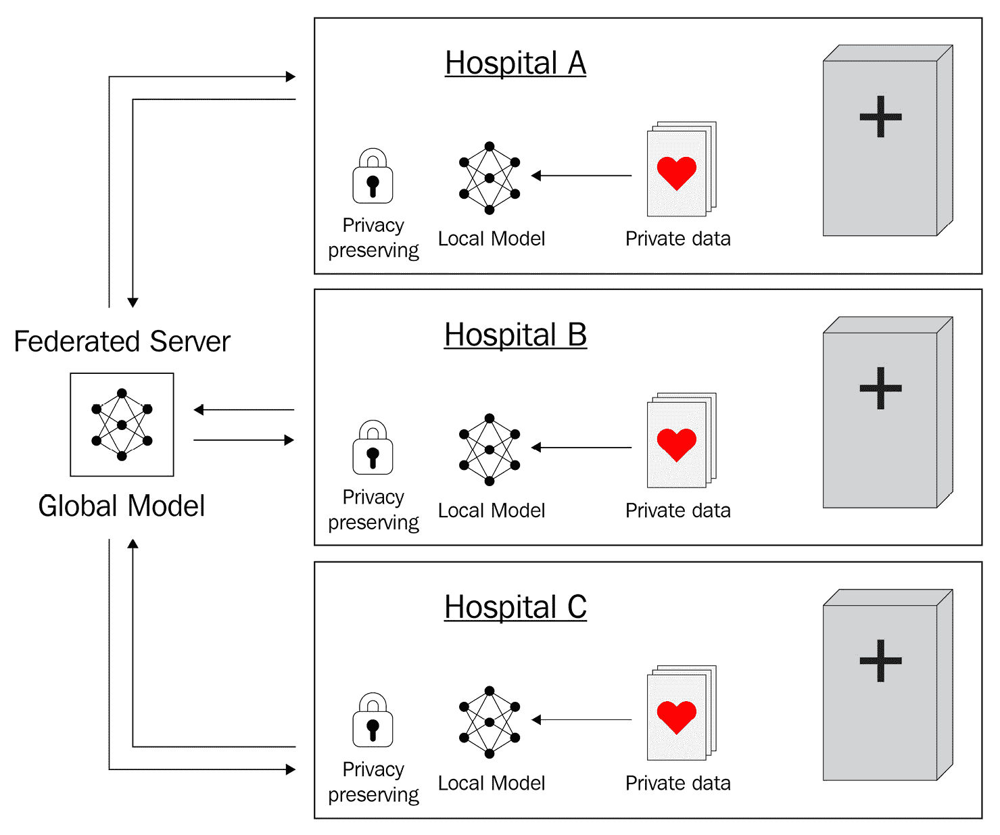

图 9.2 – 医院共享用于联邦学习的机器学习模型

每个医院都在本地运行模型；这创造了所谓的本地模型。重要的是要注意，在这个阶段，每个医院的本地模型都将不同。它们中的每一个都只在其医院的数据上进行了训练。

训练这三个本地模型的智能以模型参数的形式发送到一个集中服务器。服务器收集本地模型并将它们结合起来创建一个全局模型。这个全局模型，是三个本地模型智能的结合，随后被发送回每个医院，并仅在该医院的数据上再次进行本地训练。

再次强调，只有这些模型的智能被发送回服务器进行聚合。这个过程会重复进行，直到模型已经学到了它能学到的所有东西（称为收敛）。

利用联邦学习（FL），您可以在数据位于不同位置的情况下训练出表现如同所有数据都来自单一位置的模型。正如您所看到的，这种隐私保护方法的实施具有颠覆医学领域的力量。

现在我们来看看联邦学习（FL）如何改善药物发现领域。

## 药物发现

数据已成为我们现代世界的一种新型货币。对于制药公司来说，特别是，利用这些数据提供*个性化医疗*已成为一个主要焦点。在未来几年，能够利用更多数据的公司将更具竞争力。这将是任何组织未来成功的关键策略之一。

### 精准医疗

个性化医疗，也称为*精准医疗*，严重依赖于大量*真实世界数据*来实现这一点。此外，还需要机器学习算法来处理和分析这些数据，以便提取有意义的见解。正如我们将讨论的，目前获取大量真实数据非常困难，甚至可能是不可能的。

在*图 9.3*中，我们展示了精准医疗将立即产生影响的一些领域：

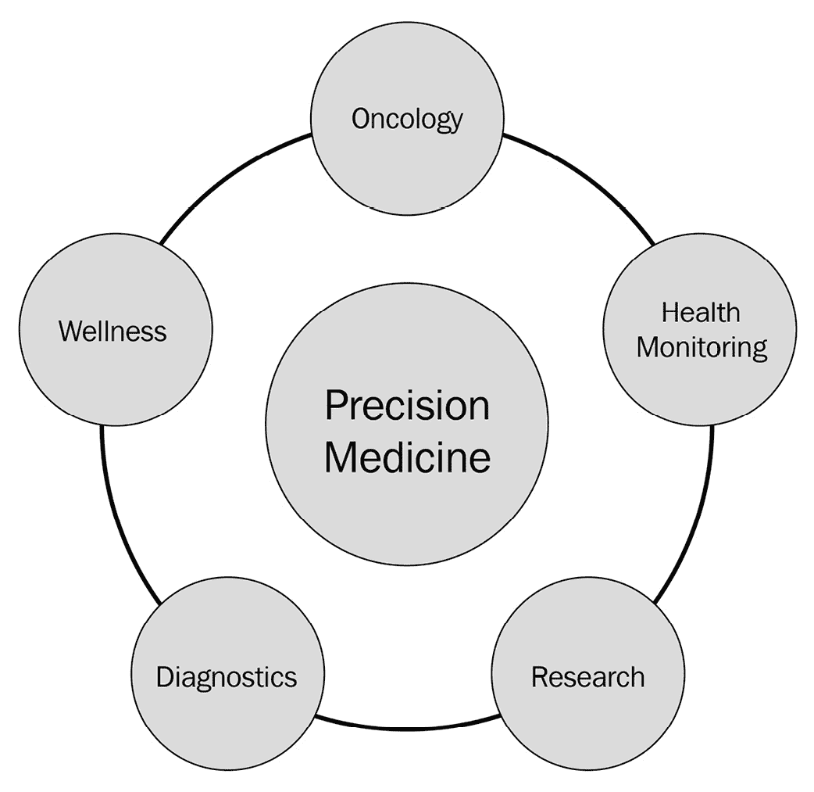

图 9.3 – 精准医疗影响许多领域

如您从*图 9.3*中看到的，精准医疗覆盖了广泛的不同领域和学科，如肿瘤学、健康、诊断、研究和健康监测。

目前，许多在医疗系统中部署的 AI 解决方案由于仅用代表患者群体一小部分的小数据集创建而失败。研究人员和开发者可以使用来自许多来源的数据来验证和改进模型，而无需拥有这些数据。

为了访问这些数据以便进行处理和分析，需要一种新的方法。这就是联邦学习（FL）发挥作用的地方。正如我们在整本书中讨论的，FL 提供所需的智能访问，而不是数据本身。

精准医疗是一种模型，它提出，而不是使用**一刀切**的方法，应该根据个人定制医疗保健，以在药物有效性和癌症治疗效果等方面取得更好的结果。为此，精准医疗严重依赖于大量真实世界数据。克服获取大量真实世界数据是实现大规模精准医疗的第一个障碍。

让我们看看当前的方法，看看 FL 如何提供所需的答案。

**图 9.4** 显示了当前常见的机器学习系统实现方法。在这里，数据被传输到中央服务器，所有数据都集中在一起，然后算法在汇总数据上训练。这被称为**将数据带到模型**的方法：

![图片 B18369_09_04.jpg]

![图片 B18369_09_04.jpg]

**图 9.4** – 精准医疗现状

很容易想象以这种方式将许多医院的数据移动到集中地点的巨大成本。以这种方式处理数据也损害了数据安全，并使得合规性难以实现，如果不是不可能的话。

如**图 9**.5 所示，联邦学习（FL）的方法相当不同。它不是将数据**带到模型中**，而是**将模型移动到数据中**。这意味着机器学习模型在本地数据上训练，并且只将智能发送到 FL 服务器进行聚合，从而使各种本地模型能够从全局模型的更新中受益：

![图片 B18369_09_05.jpg]

![图片 B18369_09_05.jpg]

**图 9.5 – 联邦学习中的精准医疗**

联邦学习方法允许高效地转移模型和数据，同时符合法规要求。

### IfD 的潜力

利用 FL 获取真实世界数据具有巨大的潜力，可以改善所有临床研究阶段。访问这类数据使我们能够利用收集到的智能和 IfD，可以显著加速药物发现的过程和步骤。在讨论 FL 的工作原理时，需要记住的一个重要想法是训练数据永远不会离开设备。

**图 9**.6 描述了通过训练过程从训练数据中提取机器学习模型的过程：

![图片 B18369_09_06.jpg]

![图片 B18369_09_06.jpg]

**图 9.6 – IfD 图**

如您在**图 9**.6 中所见，数据在本地用于训练机器学习模型。在 FL 中，模型位于设备本身上，在那里进行训练，并且只发送模型权重进行聚合——因此只有数据中的智能，而不是数据本身。

能够收集来自多个来源的 IfD（集成数据框架），以及包括视频、文本、语音和其他感官数据在内的广泛数据类型，可以帮助提高注册流程，无论是速度还是找到合适的匹配以进行药物和治疗的研究和开发。

这对于罕见疾病和癌症尤为重要。当以这种方式进行识别时，受试者可以被告知试验机会。

联邦访问数据和收集 IfD 可以打开全球大量数据的访问。这允许聚合数据存储库挖掘足够多的符合协议标准的患者。潜在地，这可以使试验的所有参与者都能接受实际药物而不是安慰剂。

最终，没有稳健的 AI，就无法实现大规模的精准医疗，而稳健的 AI 只能通过大量真实世界数据进行训练。使用 FL 可以允许改进结果测量。在未来几年中，联邦方法有可能以新的方式推动新医疗治疗方法发现的进步和创新，这些方式以前是不可能的。

在以下图中，*图 9.7*，我们展示了 FL 如何收集个体化数据（IfD）的通用视图：

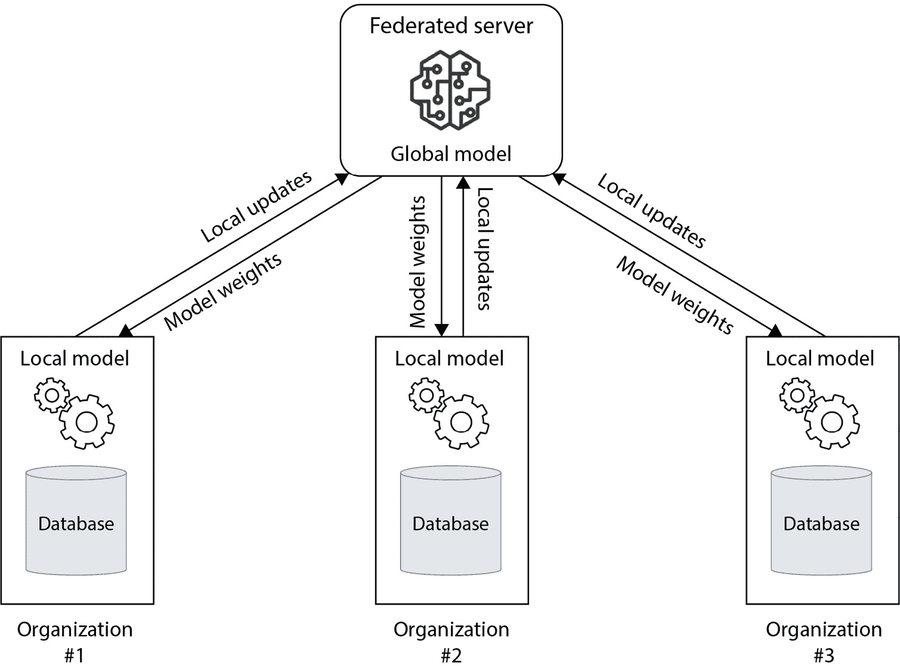

图 9.7 – FL 收集 IfD 的通用视图

正如这里*图 9.7*所示，所有数据都保持在每个组织内部隔离，并且不会传输到联邦服务器。

让我们继续前进，讨论一个与电子健康记录（EHRs）相关的联邦学习（FL）应用。

## EHRs

电子健康记录（EHR）是一组系统性和数字化存储的健康信息。这些记录旨在在适当的时候与**医疗保健提供者**（HCPs）共享。根据*HealthIT.gov*的统计数据，截至 2017 年，美国 86%的门诊医生已经采用了 EHRs。

*图 9.8*展示了从各种来源收集的 EHRs，例如医院和保险公司。在此图中，我们使用术语**电子病历**（EMRs）和**个人健康记录**（PHRs）：

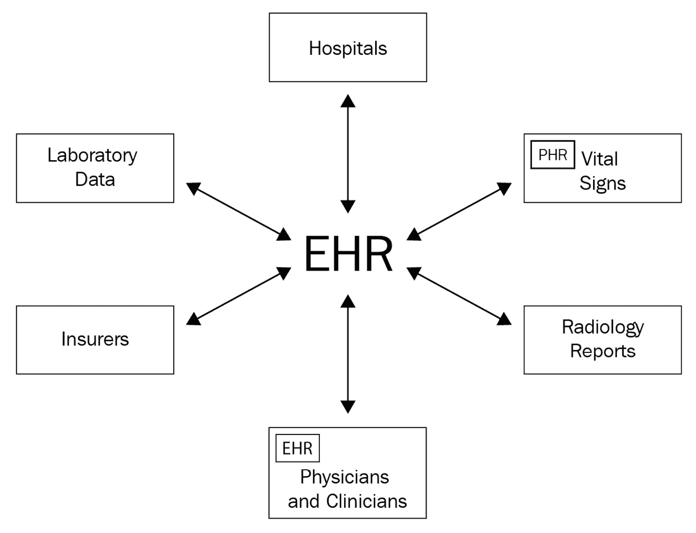

图 9.8 – EHRs

这种采用 EHRs 为医疗保健组织之间的有益合作奠定了基础。正如我们在整本书中讨论的那样，能够访问更多真实世界数据使得基于这些数据训练的 AI 模型更加稳健和有效。

虽然已经建立了这个基础，但在多个机构之间共享 EHR 数据方面，传统的机器学习（ML）方法仍然面临许多挑战。这些问题包括隐私问题和法规以及数据标准化。其中一个主要问题是将数据存储在**中央数据存储库**（CDRs）中，如图 9.9 所示，其中存储了各种形式的地方数据以训练创建 ML 模型。

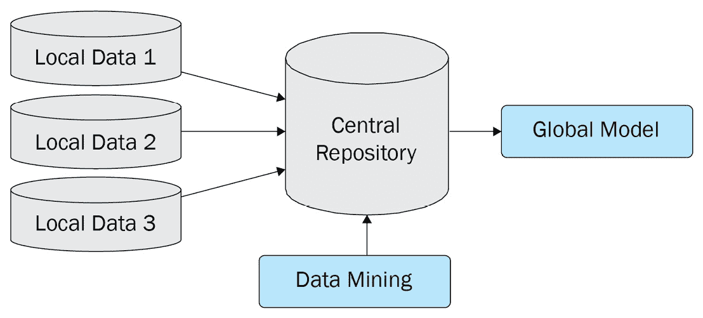

图 9.9 – 集中式数据挖掘方法

由于数据隔离问题，这种 CDR 方法并不理想，这一问题将在下一节中讨论。

### 数据隔离问题

使用 CDR（临床数据记录）进行数据存储带来了许多问题。例如，包括*数据泄露*、*严格的法规*以及设置和维护的高成本。

数据存储方法对数据本身的质量和可用性的影响同样重要。在单一中心数据上训练的 ML 模型与从多个地点收集的数据相比，通常无法很好地泛化。

FL 允许跨多个组织进行模型训练协作，从而在不违反数据隐私法规的情况下产生卓越的模型性能。

让我们看看一个 FL 应用在 EHRs 中的例子。

### 电子健康记录中的表示学习

研究人员已经将联邦学习（FL）应用于电子健康记录（EHRs）中的表示学习，如“进一步阅读”列表中提到的*两阶段联邦表型与患者表示学习*。他们使用 FL 结合**自然语言处理**（**NLP**）对患者数据进行表型和表示学习。在第一阶段，基于几家医院的某些医疗记录创建患者数据的表示，而无需共享原始数据本身。所学习到的表示并不局限于任何特定的医疗任务。在第二阶段，使用从学习到的表示中提取的相关特征，以联邦方式训练特定表型工作的 ML 模型。

FL 已被展示为在医疗保健领域 AI 发展的进步中，作为当前方法的有效替代，无论是在药物发现、医学影像还是电子健康记录（EHRs）的分析中。

让我们继续探讨金融行业，这是联邦学习（FL）的另一个有前景的应用案例。

# 将 FL 应用于金融行业

仅在美国，金融服务公司每年在合规性上就花费数十亿美元以对抗洗钱，然而，当前系统如此无效，以至于不到 1%的洗钱活动被阻止。事实上，据估计，公司花费的金额大约是他们从这种犯罪活动中能够追回金额的 100 倍。只有一小部分交易被**反洗钱**（**AML**）系统捕获，而其中更小比例的警报最终按照 1970 年**银行保密法**（**BSA**）的要求报告在**可疑活动报告**（**SARs**）中。

保守估计，来自银行网络的情报价值远远高于任何一家银行的情报。这是因为你可以看到钱从哪里来，也看到钱流向了哪里。

## 反洗钱（AML）

当前的 AML 系统需要重大改进，需要克服几个挑战。许多隐私法规被实施以保护个人财务数据。这些法规从机构到机构、从地区到地区各不相同。

一种解决方案是金融机构之间的合作。这种合作将允许这些机构以互利的方式共享从自身数据中收集到的情报。而不是在合作者之间移动数据，机器学习（ML）模型本身将在每个机构本地部署。这将仅允许共享 IfD（集成数据），并使能够利用收集到的情报的每个合作者受益。正如我们讨论的那样，联邦学习（FL）具有这种能力。

在 FL 中，模型本身从一家机构移动到另一家机构。在这个过程中，模型通过从更多数据中学习调整参数，变得更加智能。这与 FL 的这两种替代方案不同：

+   一种选择是将来自合作金融机构的数据收集到一个中央存储库中。然而，由于客户隐私法规，这种方法不可行。

+   另一种方法是根据需要共享某种标识符。然而，由于隐私法律和法规的限制，这并不可能，只能作为调查过程的一部分使用。

要能够使用 FL，我们需要确保数据的隐私和安全保持完整。为此，我们必须确保模型在没有隐私违规的情况下在金融机构中接受训练。最后，我们需要确保所有与模型参数更新相关的通信，发送到联邦服务器的是安全可靠的。

FL 可以提高全球反洗钱（BSA）和反洗钱（AML）制度的有效性、效率和公平性。在下一节中，我们将探讨在反洗钱各学科中实施交易监控时使用 FL。

## 对现有 AML 方法的解决方案。

在反洗钱各学科中开发 FL 方法包括客户入职这一基本主题，并可能有助于使用非传统信息来验证潜在客户的身份。

需要一种新的方法，可以利用复杂的技术来提高风险检测系统的意识和效率。

这种方法应该能够实现以下功能：

+   使企业和监管机构能够在不共享敏感或受保护数据的情况下相互学习。

+   增强企业准确识别真实风险并减少无根据的风险报告的能力。

+   提高企业在决定是否服务于特定市场时的风险-收益计算。

反洗钱框架在防止任何通过恐怖主义、洗钱、欺诈或人口贩卖等非法目的使用全球金融系统造成伤害的国家利益中发挥着至关重要的作用。

尽管在洗钱风险检测系统上投入了巨大的资金和关注，但系统已经破裂。企业投入大量资源以满足反洗钱（AML）要求，但很少得到关于其风险报告质量的反馈。

两个关键因素驱使企业退出特定市场运营：

+   第一个是钱服务行业内部风险评级活动的成本

+   第二个关键因素是与非法金融活动相关的金融机构的监管风险和声誉影响

因此，全球范围内，代理银行关系下降了 25%。自 2009 年以来，新兴市场中有 25% 的银行报告了代理银行损失。

在 *图 9**.10* 中，交易报告被描绘出来，每个机构的危险模式数据库反映了其非法活动的经验：

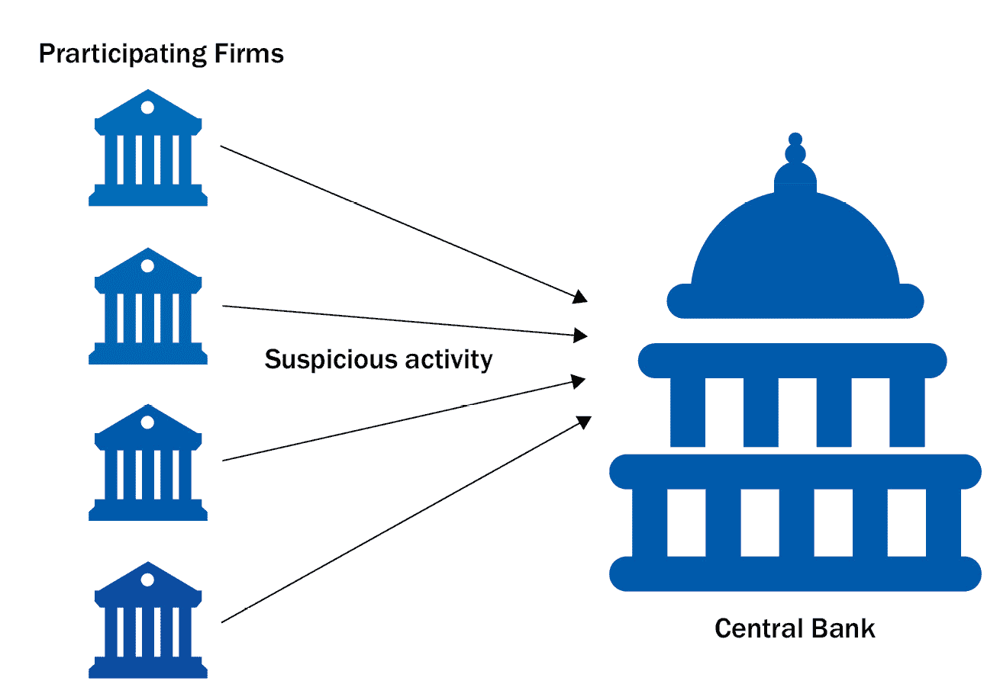

图 9.10 – 机构报告的疑似非法活动

机构不一定知道其竞争对手正在捕捉到的模式或政府知道哪些标记的交易是可疑的还是真实的。公司很少得到关于他们提交的报告准确性的及时反馈。结果是，公司缺乏改善其风险检测能力最关键的信息：关于确认问题的及时信息。

那么，想象一下在这种场景下更有效、更高效、更公平的交易监控。银行充当类似公用事业的中心。结合强大的计算机和智能算法可以对不同机构的进行数据评估。学习到风险模式的机器学习模型随后会在参与公司之间移动，以捕捉模式并从每个机构的风险中学习。所有这些都可以在不共享敏感或受保护数据的情况下完成。这如图 *图 9**.11* 所示：

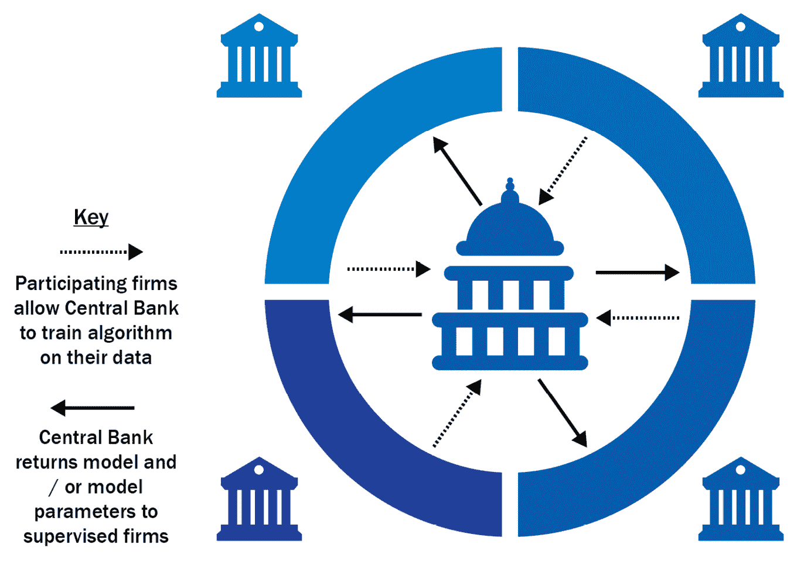

图 9.11 – 银行生态系统中的数据和情报流动

在 FL 方法中，银行创建了一个分类算法，该算法在每个参与公司的数据上训练。银行开发了一个关键模型和模型参数，这些参数反映了所有参与公司以及政府拥有的数据的见解。银行将关键模型和模型参数分发给参与公司，同时数据留在每个机构。这些分布式模型通过从本地数据中学习并随后将它们发送回银行来采用这些公司的风险模式。

## FL 在 AML 领域的演示

TieSet, Inc. 的研究人员在 STADLE 上对 AML 领域应用 FL 进行了实验，使用 PaySim 移动货币模拟器生成的某些合成交易数据 ([`www.kaggle.com/ealaxi/paysim1`](https://www.kaggle.com/ealaxi/paysim1))。他们使用了带有逻辑回归的监督学习，其中模型特征包括时间、金额以及原始账户和目标账户的新旧余额。数据集有 636,2620 笔交易（8,213 笔欺诈交易和 635,4407 笔有效交易），这些交易被分成 10 个单独的本地代理。

*图 9**.12* 是将联邦学习（FL）应用于反洗钱（AML）的结果，图中展示了每轮训练中的精确度得分和 F1 得分。在图中，粗线代表聚合模型的性能，细线代表仅使用本地数据进行单独训练的个体代理的结果：

![图 9.12 – 将 FL 应用于 AML 的结果（粗线：聚合模型，细线：个体代理单独训练）]

![img/B18369_09_12.jpg]

图 9.12 – 将 FL 应用于 AML 的结果（粗线：聚合模型，细线：个体代理单独训练）

正如*图 9**.12*所示，聚合模型的表现相当稳定，在精确度和 F1 得分方面始终保持在 90%以上。FL 可以将欺诈交易从总欺诈交易额 1,241,770,000 美元减少到 65,780,000 美元，这意味着只有 5.3%的欺诈交易丢失。

让我们通过查看 FL 为风险检测提供的益处列表来结束本节。

## FL 对风险检测系统的益处

将 FL 应用于风险检测系统在金融领域有以下几个好处：

+   FL 可以创建一个更大的风险检测算法数据集进行训练

+   提高非法活动检测的准确性

+   为组织提供了一种协作方式

+   企业可以进入新市场

在您的金融机构内识别洗钱策略的能力受限于您所能访问的数据。数据共享限制使得合作变得困难，甚至不可能。FL 为金融行业带来的解决方案和优势众多。额外的优势包括更好的运营效率和人力资本更好的分配。由于能够从客户数据中提取智能，FL 的应用在金融空间中几乎无限制。

在下一节中，我们将讨论 FL 在几个新兴技术中的应用时，我们将稍微转换一下话题。

# FL 与边缘计算相结合

本章的这一部分是不同领域的混合，其中一些是新兴技术。这些领域都非常相互关联，正如我们将要讨论的。许多这些技术相互依赖以克服它们自己的挑战和限制。将这些技术与 FL 结合是一种特别有力的技术组合，这将是未来几年进步和创新的关键。

在接下来的十年里，我们将看到边缘计算能力、物联网（IoT）和 5G 连接性的扩展带来的几个变化。我们将看到数据量和传输速度的指数级增长。我们将继续看到更多隐私法规的实施，以保护私人用户数据，以及自动化和分析领域的爆炸式增长。

## 在 5G 之上的物联网边缘计算

要实现智能设备的全部潜力，这些设备必须能够连接到一个大大改进的网络，比如 5G。事实上，到 2023 年底，预计全球将有 13 亿 5G 服务用户。与边缘计算一样，5G 网络对于物联网连接至关重要。结合这些技术将有助于为智能设备铺平道路。

*图 9**.13* 展示了各种事物，在物联网框架内，边缘计算能力连接到云和数据中心：

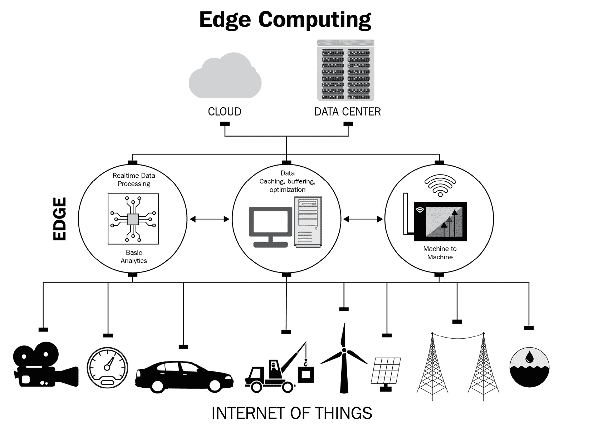

图 9.13 – 边缘计算与互联网

然而，许多这些物联网设备缺乏足够的安全功能。除了像**通用数据保护条例**（**GDPR**）这样的法律和法规之外，我们还可以期待实施额外的政策来保护用户数据。本质上，随着时间的推移，对提取 IfD 解决方案的需求将继续增加。

让我们看看 FL 应用于边缘计算的一个示例。

## 边缘 FL 示例——目标检测

边缘计算是一种使用分布式计算将计算和数据存储尽可能靠近数据源的架构。理想情况下，这应该会降低延迟并节省带宽。以下是如何利用 FL 与不同类型的边缘设备相结合的示例。

### 技术设置

在这个示例中，使用了三个设备来演示使用边缘设备进行目标检测的 FL。一个是运行在 Nvidia 的 Jetson 上的 EIS200 边缘微服务器，操作系统为 Ubuntu。第二个设备是树莓派，使用 Raspberry Pi OS，第三个设备是一个简单的常规 PC，操作系统也是 Ubuntu。这些机器分别使用独特的数据集训练了一个目标检测模型。

### 如何做

EIS200 在鱼、肉和番茄的图片上进行了训练，标签为*鱼*、*肉*和*蔬菜*。树莓派在鱼、肉和茄子的图片上进行了训练。显然，在这里，番茄被茄子所取代。然而，标签保持不变——鱼、肉和蔬菜。同样，常规 PC 在鱼、肉和葱的图片上进行了训练，标签仍然是鱼、肉和蔬菜。

如您所预期的那样，每个环境都含有不同蔬菜的偏见数据——比如番茄、茄子、和葱——但所有这些蔬菜都有一个相同的标签，即蔬菜。

### 它是如何工作的

首先，模型是用 EIS200 的番茄图片进行训练的。正如您所预期的那样，只有番茄被正确地标记为蔬菜，而茄子和葱被错误地标记。

同样，树莓派仅用茄子图片训练的模型正确地识别了茄子。其中两根葱中的一根被标记为蔬菜，但另一根被识别为鱼。正如预期的那样，常规 PC 的模型只识别葱为蔬菜。

三个代理中没有一个能够正确标记所有三种蔬菜，正如我们所预期的。接下来，它们连接到一个名为 STADLE 的 FL 平台，由 TieSet 公司开发：

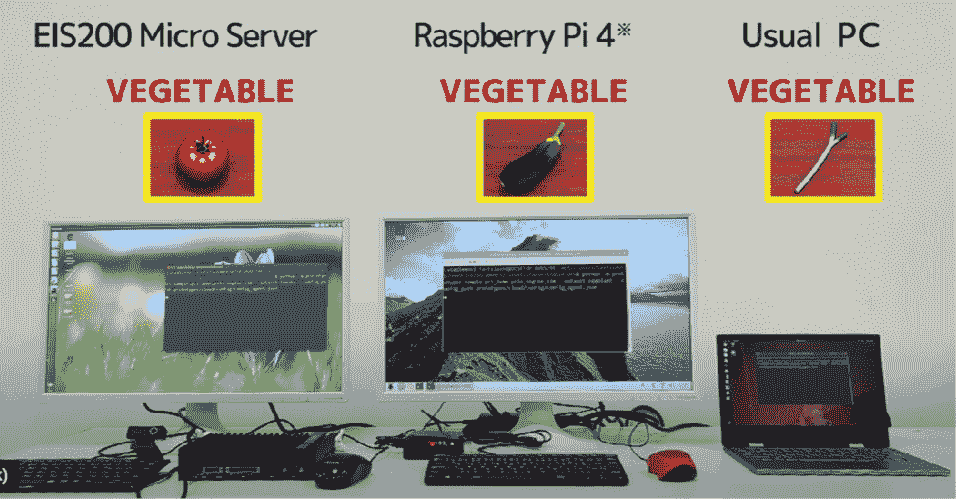

图 9.14 – 使用 FL 检测番茄、茄子和大葱的演示，其中每个机器上的数据集分布不同

STADLE 聚合器在 AWS 中以实例运行。在这里，每个环境都有一个独特的、只包含一种蔬菜的数据集。与 STADLE 平台连接后，每个代理使用本地数据进行训练。经过几个训练周期后，模型权重从代理发送到聚合器。然后，这些权重被聚合并发送回代理以继续训练。这种聚合周期的重复产生了无偏重的量。

### 检查结果

FL 模型能够正确检测和标记所有三种蔬菜，如图*9**.15*所示。这是 FL 在消除偏差方面的一个简单示例：

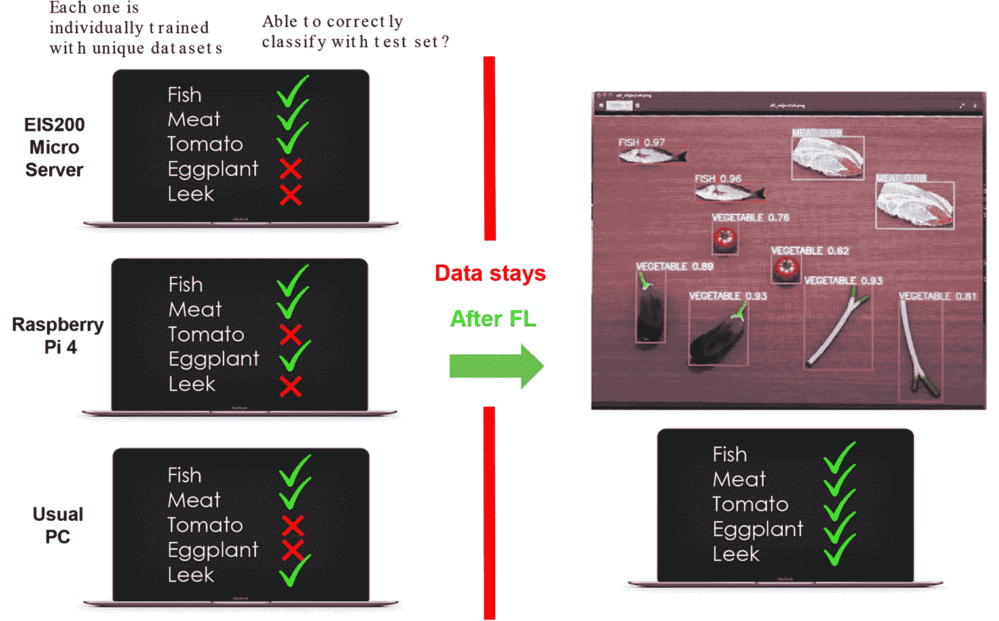

图 9.15 – 使用三个边缘设备进行演示的结果

如前所述，所有模型训练都是在边缘设备的本地存储中进行的。模型在本地数据上训练，然后只将参数权重发送到联邦服务器进行聚合。联邦服务器平均化模型。如果您还记得前面的章节，这被称为 FedAvg。联邦服务器然后将改进和更新的模型发送回边缘设备。因此，再次强调，只收集 IfD，而不是数据本身。

现在，让我们在下一节中看看汽车领域的另一个边缘示例。

## 使用 FL 实现自动驾驶

在 AI 行业中，特别是汽车领域，边缘计算与 ML 获得了显著的兴趣。例如，自动驾驶需要低延迟和实时响应才能正确运行。因此，FL 成为分布式数据处理和训练方面汽车领域的最佳解决方案之一。

将计算和存储卸载到边缘物联网设备使得管理自动驾驶应用的云系统变得更小、更便宜。这是从中心云基于 ML 范式转向 FL 范式最强大的好处。

现代汽车已经配备了具有复杂计算能力的边缘设备。**高级驾驶辅助系统**（**ADASs**）是自动驾驶汽车的基本功能，计算在车上进行。它们也需要大量的计算能力。

即使预测发生在自动驾驶车辆中，模型也是使用在本地服务器或云中的常规、昂贵的训练系统进行训练和准备的。

如果数据量变得更大，训练过程将变得更加计算密集和缓慢，并且还需要大量的存储空间。

为了避免这些问题，需要使用联邦学习，因为更新的机器学习模型在车辆和服务器之间传递，服务器存储着车辆的驾驶模式和来自车载摄像头的实时图像流。联邦学习再次可以根据用户同意并遵守隐私和区域法规来工作。

*图 9**.16* 介绍了用于提高 ADAS 安全驾驶性能的分布式联邦学习，这是 TieSet, Inc. 与其技术合作伙伴进行的真实用例：

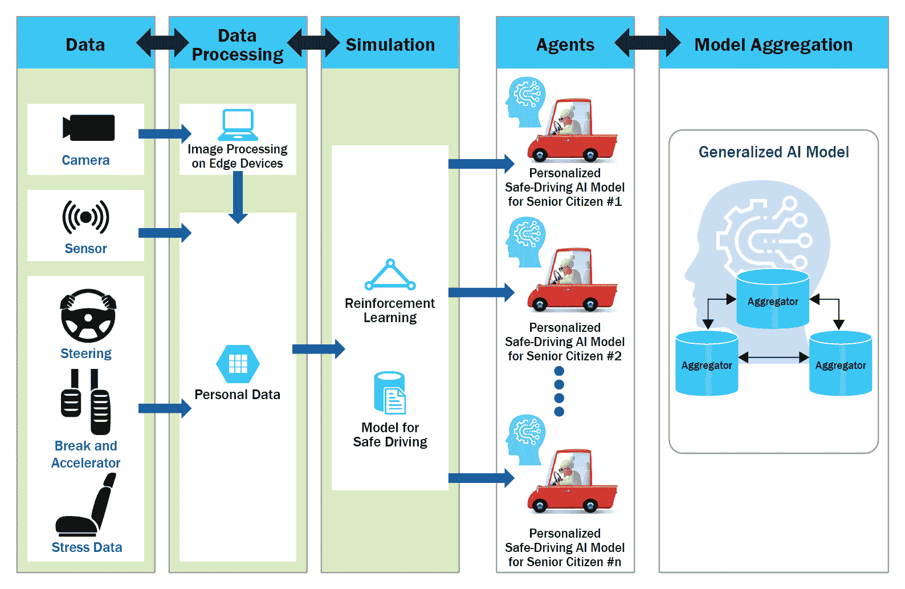

图 9.16 – 使用多个聚合器提高 ADAS 安全驾驶性能的分布式联邦学习

TieSet, Inc. 的 STADLE 系统集成了 ADAS，旨在提供舒适性和个人安全措施，尤其是针对老年人，为汽车产品提供了优化的转向控制辅助。通过先进的计算机视觉和**强化学习**（**RL**）技术，他们实现了一种设计，能够提供及时的危险情况意识，并智能地学习最佳的个性化驾驶策略。

虽然个性化是设计的主要焦点，但个人数据的使用带来了实质性的隐私问题。由 STADLE 平台提供的 FL 框架为克服这一障碍提供了现实解决方案。该架构以协作形式呈现，通过人工智能智能交换在边缘用户之间进行分布式机器学习训练，避免了数据传输并确保了数据隐私。此外，聚合模型可以应对超出驾驶员个人经验的多种风险和不可预测的情况。

在使用真实汽车进行概念验证的过程中，他们成功展示了所设计的 RL 模型能够有效地生成针对使用 STADLE 聚合框架的驾驶员的定制化转向策略。

在下一节中，我们将讨论联邦学习如何应用于机器人领域。

## 将联邦学习应用于机器人技术

在机器人系统和应用中，机器学习已经成为完成必要任务的一个不可或缺和基本的部分。计算机视觉已经发展到使机器人系统在许多任务上表现出色，例如图像分割、目标检测和分类，以及自然语言处理和信号处理任务。机器学习可以处理许多机器人任务，包括感知、路径规划、传感器融合以及在制造环境中抓取检测到的物体。

然而，机器人在机器学习领域也面临着许多挑战。首先是训练时间。即使数据量足够训练机器学习模型来解决上述问题，训练一个真实的机器人系统也需要数周或数月。同样，如果数据不足，它可能会显著限制机器学习模型的表现。通常，数据隐私和可访问性成为收集足够数据来训练机器人机器学习模型的问题。

正因如此，联邦学习框架被认为是机器人领域的一个关键解决方案。TieSet, Inc. 的研究人员开发了一个系统和方法，允许机器人操作器和工具与其他机器人共享其操作技能（包括伸手、抓取放置、握持和抓取）以及各种类型和形状的物体，并使用其他机器人的技能来改进和扩展自己的技能。

该系统涵盖了创建机器人通用操作模型的方法，该模型通过从各种机器人代理中众包技能并保持数据隐私来持续改进。他们提出了一种新的架构，其中多个由人工智能驱动的机器人代理通过提交其模型到一个聚合器来协同训练全局操作模型。这种通信使得每个代理能够通过接收一个最优更新的全局模型来利用其他代理的训练结果。

*图 9.17* 展示了机器人联邦众包全局操作框架的工作架构：

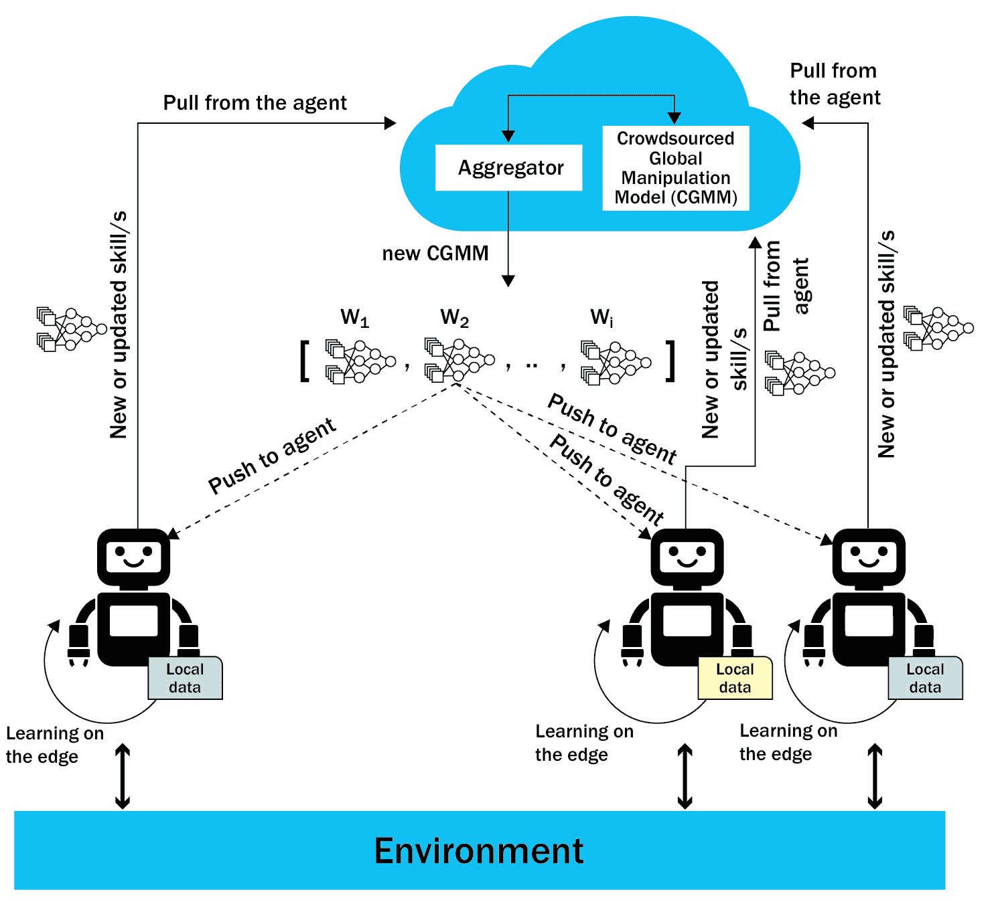

图 9.17 – 机器人联邦众包全局操作框架的架构

基于前图的架构，在模拟设置中，他们为抓取盒子、球、鸭子和泰迪熊等个别任务准备了五个机器人臂。使用 TieSet, Inc. 的 STADLE 平台，该平台可以进行异步联邦学习，这些臂的机器学习模型被持续聚合。最终，联邦机器人机器学习模型可以以更高的性能（80% 的成功率）抓取所有这些物体，如图 *图 9.18* 所示：

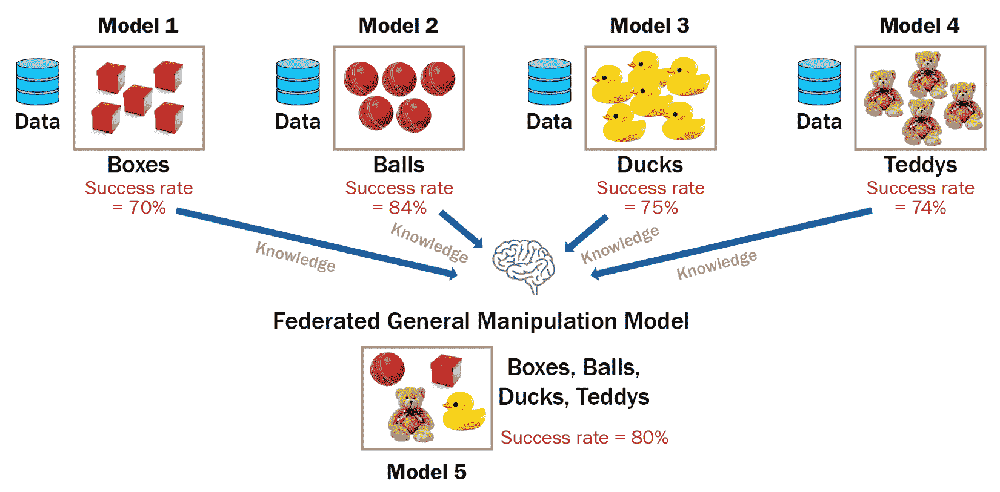

图 9.18 – 机械臂可以通过不同任务进行交叉训练以提高精度和效率

基于 STADLE 的联邦学习可以显著减少训练机器人和机器学习用于生产线的时间，使用计算机视觉。联邦性能远优于单独训练机器人，学习时间也比单独训练机器人快得多。

在下一节中，我们将讨论大规模人工智能，即使有大量设备和连接的环境，学习也应该持续进行，物联网应演变为智能互联网。

# 向智能互联网迈进

在本节中，我们将讨论为什么在物联网和 5G 等可扩展技术的最新发展中，FL 非常重要。与上一节一样，AI 需要在大规模学习中保持学习的领域包括自动驾驶、零售系统、能源管理、机器人和制造，所有这些在边缘侧产生大量数据，其中大部分数据需要完全学习以生成性能良好的机器学习模型。

随着这一趋势的发展，让我们来看看智能互联网的世界，在这个世界里，学习可以在边缘侧发生，以应对动态环境和连接到互联网的众多设备。

## 介绍 IoFT

物联网涉及智能和连接的系统。它们之所以智能，是因为信息被共享，智能被提取并用于某些目的——例如，设备的预测或控制。它们通常连接到云端，并能够从许多端点收集数据。

*图 9.19*显示了随着时间的推移，数据越来越多：

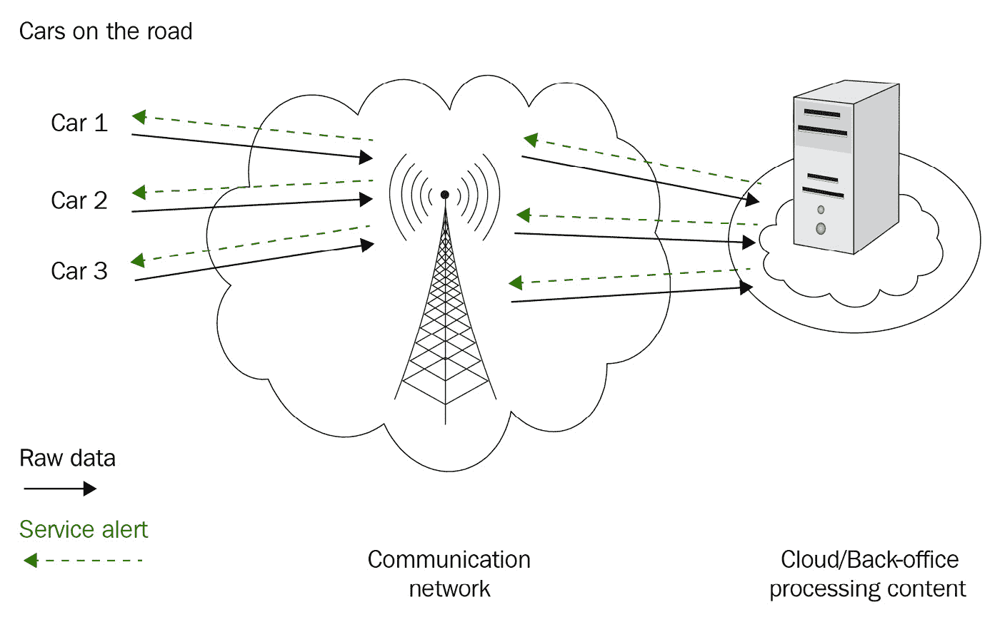

图 9.19 – 当前物联网系统

如*图 9.19*所示，在当前的物联网流程中，必须上传和存储大量数据在云端。

模型针对特定目的进行训练，例如预测性维护和文本预测。最后，训练好的模型被发送回边缘设备。

如您所见，当前方法存在几个问题：

+   需要大量的存储空间

+   由于数据量，延迟受到影响

+   由于数据移动导致的隐私问题

为了克服这些问题，FL 扮演着重要的角色。

**联邦物联网**（**IoFT**）是一个最初由密歇根大学的研究者提出的想法，其论文《联邦物联网》（**IoFT**）列在本章的*进一步阅读*部分。IoFT 是一个扩展框架，将物联网与 FL 的概念相结合。随着边缘侧的计算能力显著提高，AI 芯片正迅速进入市场。即使是智能手机，现在的计算能力也非常强大，小型但功能强大的计算机通常连接到大多数边缘设备。

因此，由于边缘设备的计算能力提高，机器学习模型训练过程被降低到边缘，物联网将数据发送到服务器的功能可以用来将机器学习模型传输到云端。这也是一种非常有效的方法，可以保护边缘设备上的隐私数据，例如手机。

让我们看看*图 9.20*中展示的 IoFT 的一个例子。

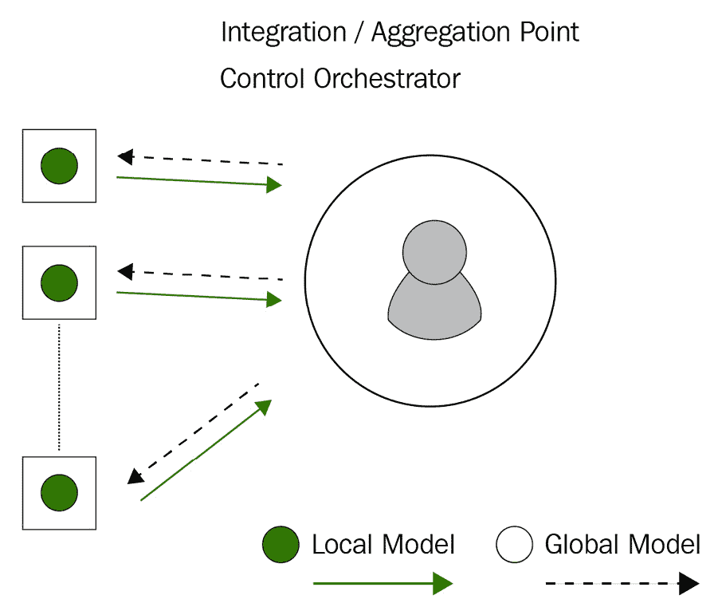

图 9.20 – IoFT 的一个例子

IoFT 的潜在应用包括分布式制造、交通交叉口控制和能源控制等。

## 理解 FL 在 Web 3.0 中的作用

FL 可以集成到 Web 3.0 技术中，以加速智能互联网的采用。由机器学习模型表示的智能可能是特定个人或行业的财产。同时，如果它是可以促进全球人们该机器学习模型学习过程的公共资产，那么它也可以被认为是公共资产。无论是私人知识产权还是公共资产，通过利用 Web 3.0 技术，智能可以以去中心化的方式管理和进化。因此，越来越多的人将获得由人们共同训练的智能带来的好处，这将导致我们整个社会在各个领域和各种应用中的真正创新。

# 将 FL 应用于大数据的分布式学习

在本节中，我们将讨论如何在大数据的背景下将联邦学习（FL）应用于分布式学习。

对于大数据，FL 可能不太涉及与隐私相关的问题，因为用于智能目的的数据已经拥有。因此，它可能更适合大数据的高效学习和显著提高训练时间，以及降低使用大型服务器、计算和存储的成本。

在大数据上进行分布式学习有几种方法，例如构建适用于不同类型服务器的特定端到端机器学习堆栈，如参数服务器，或者在 Hadoop 和 Spark 等大数据平台之上利用某些机器学习方案。还有一些其他平台，如 GraphLab 和 Pregel。您可以使用任何库和方法，例如具有低级机器学习实用工具的随机近端下降法和坐标下降法。

这些框架可以在计算上支持机器学习模型的并行训练，但无法将数据源分配到不同的机器上以分布式方式本地训练，尤其是在训练环境分散在互联网上时。通过 FL，您只需通过同步模型联邦即可简单地聚合不同分布式机器的学习结果，但您确实需要开发一个精心设计的平台来协调分布式学习的持续运行，包括适当的模型存储库和版本控制方法。

大数据上执行分布式学习的示例在*图 9.21*中描述。

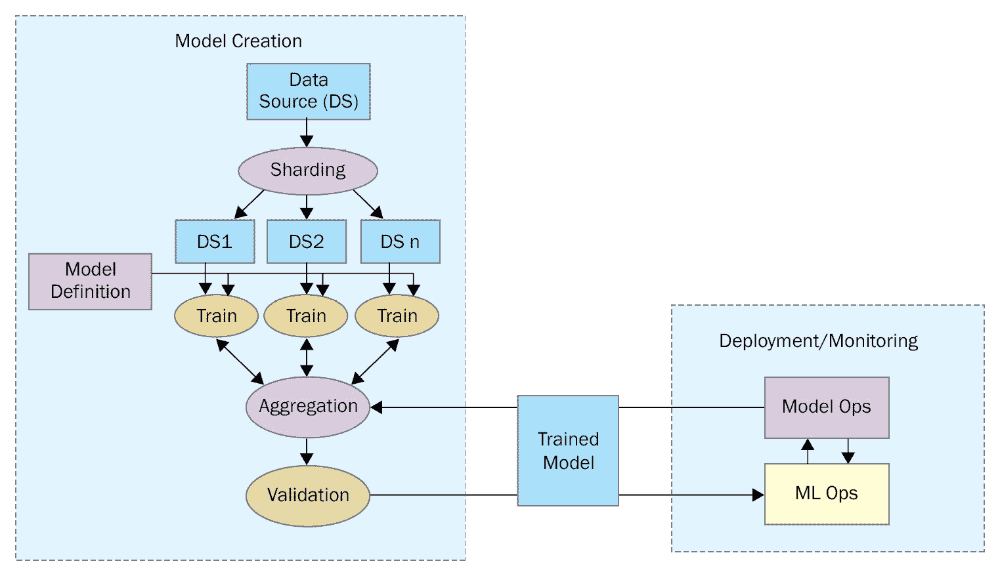

图 9.21 – 大数据中分布式学习的集成

在*图 9**.21 的例子中，数据源，通常是很大的，被分割成多个数据源，以便分散到不同的机器或实例中进行训练。在联邦学习（FL）框架内，来自分布式环境的训练模型都被汇总。训练和汇总后的模型随后进入**机器学习操作**（**ML Ops**）的过程，以进行性能验证和持续监控，以及**模型操作**（**Model Ops**）。

在前一个场景之上，可以进一步的做法是结合其他数据源的洞察。在这种情况下，联邦学习（FL）可以优雅地结合其他数据源的洞察，并很好地协调分布式环境中直接创建的其他形式智能的集成。这样，你还可以创建集中式机器学习（ML）和分布式机器学习（ML）的混合模型。

# 摘要

在本章中，我们讨论了不同行业在人工智能进步方面面临的各种挑战。大多数挑战都与数据可访问性有关。数据隐私法规、缺乏真实数据和数据传输成本都是我们期望联邦学习（FL）继续帮助解决的独特且具有挑战性的问题。

在本章中，你了解了联邦学习（FL）在医疗保健、金融、边缘和物联网（IoT）领域等越来越多地发挥重要作用的用例。联邦学习（FL）提供的隐私遵守对于医疗保健和金融行业尤为重要，同时联邦学习（FL）可以为许多边缘人工智能和物联网场景在可扩展性和学习效率方面增加显著价值。你还学习了如何将联邦学习（FL）应用于大数据的分布式学习，以减少训练时间和成本。

在下一章和最后一章中，我们将通过讨论联邦学习（FL）在未来十年预期将发挥关键作用的非常激动人心的未来趋势和发展来结束本书。

# 参考文献

本章节中使用了以下参考文献：

+   *金融服务公司花费 1809 亿美元用于金融犯罪合规*：[`www.prnewswire.com/news-releases/financial-services-firms-spend-180-9-billion-on-financial-crime-compliance-according-to-lexisnexis-risk-solutions-global-study-301036194.html`](https://www.prnewswire.com/news-releases/financial-services-firms-spend-180-9-billion-on-financial-crime-compliance-according-to-lexisnexis-risk-solutions-global-study-301036194.html)

+   *降低风险和代理银行业务关系的终结*：[`s3-eu-west-1.amazonaws.com/cjp-rbi-accuity/wp-content/uploads/2018/04/18170221/0037_Accuity_Derisking-and-the-demise-of-correspondent-banking-relationships-%E2%80%93-A-research-report-by-Accuity-Report.pdf`](https://s3-eu-west-1.amazonaws.com/cjp-rbi-accuity/wp-content/uploads/2018/04/18170221/0037_Accuity_Derisking-and-the-demise-of-correspondent-banking-relationships-%E2%80%93-A-research-report-by-Accuity-Report.pdf)

# 进一步阅读

要了解更多关于本章所涉及的主题，请参阅以下参考文献：

+   *Naeem A., Anees T., Naqvi RA., Loh WK. 对基于深度和联邦学习的脑肿瘤诊断方法的综合分析. J Pers Med. 2022 年 2 月 13 日；12(2):275. doi: 10.3390/jpm12020275 PMID: 35207763; *PMCID: PMC8880689.*

+   *Ng, Dianwen, 等人. 联邦学习：一个协作努力，以实现为具有小型标记数据集的各个站点提供更好的医学成像模型。定量影像医学与外科 11.2 (2021)：*852*：[`www.ncbi.nlm.nih.gov/pmc/articles/PMC7779924/`](https://www.ncbi.nlm.nih.gov/pmc/articles/PMC7779924/)

+   *Rieke, Nicola, 等人. 联邦学习在数字健康领域的未来。NPJ 数字医学 3.1 (2020)：*1-7*：[`www.nature.com/articles/s41746-020-00323-1.pdf`](https://www.nature.com/articles/s41746-020-00323-1.pdf)

+   *Dang, Trung Kien, 等人. 联邦学习在电子健康记录中的应用. ACM 智能系统与技术交易（TIST）(**2022**)：[`dl.acm.org/doi/pdf/10.1145/3514500`](https://dl.acm.org/doi/pdf/10.1145/3514500)

+   *Liu, Dianbo, Dmitriy Dligach, 和 Timothy Miller. 两阶段联邦表型学习和患者表示学习。会议论文。计算语言学协会。会议。2019 年卷。NIH 公共访问，*2019*：[`arxiv.org/pdf/1908.05596`](https://arxiv.org/pdf/1908.05596)

+   *Kontar, Raed, 等人. 联邦事物互联网（IoFT）. IEEE Access 9 (2021): *156071-156113*: [`ieeexplore.ieee.org/stamp/stamp.jsp?tp=&arnumber=9611259`](https://ieeexplore.ieee.org/stamp/stamp.jsp?tp=&arnumber=9611259)

+   *深度联邦学习在自动驾驶中的应用*：[`arxiv.org/pdf/2110.05754.pdf`](https://arxiv.org/pdf/2110.05754.pdf)

+   *联邦学习在大数据中的应用：关于机会、应用和未来方向的调查*：[`arxiv.org/abs/2110.04160`](https://arxiv.org/abs/2110.04160)
