# 第二章：特征理解 – 我的数据集中有什么？

最后！我们可以开始深入研究一些真实的数据，一些真实的代码，以及一些真实的结果。具体来说，我们将更深入地探讨以下想法：

+   结构化数据与非结构化数据对比

+   定量数据与定性数据

+   数据的四个层次

+   探索性数据分析与数据可视化

+   描述性统计

这些每个主题都将使我们更好地了解我们得到的数据，数据集中有什么，数据集中没有什么，以及一些基本的概念，告诉我们如何从这里开始进行下一步。 

如果你熟悉《数据科学原理》，那么其中很多内容都与那本书的**第二章，数据类型**相呼应。但话虽如此，在本章中，我们将从机器学习的角度，而不是整体的角度，具体地查看我们的数据。

# 数据的结构，或者缺乏结构

当你得到一个新的数据集时，首先重要的是要识别你的数据是有组织的还是非组织的**：**

+   **结构化（有组织）数据**：可以分解为观察和特征的数据。它们通常使用表格方法（其中行是观察，列是特征）进行组织。

+   **非结构化（无组织）数据**：以自由流动的实体存在的数据，不遵循标准组织层次结构，如表格化。通常，非结构化数据在我们看来像是一个数据**块**，或者是一个单一的特征（列）。

以下是一些突出显示结构化和非结构化数据之间差异的例子：

+   以原始文本形式存在的数据，包括服务器日志和推文，都是非结构化的。

+   由科学仪器精确测量的气象数据，由于其存在于表格化的行/列结构中，会被认为是高度结构化的。

# 非结构化数据的一个例子 – 服务器日志

作为非结构化数据的一个例子，我们从公共来源抽取了一些样本服务器日志，并将它们包含在一个文本文档中。我们可以一瞥这种非结构化数据的样子，以便我们将来能够识别它：

```py
# Import our data manipulation tool, Pandas
import pandas as pd
# Create a pandas DataFrame from some unstructured Server Logs
logs = pd.read_table('../data/server_logs.txt', header=None, names=['Info'])

# header=None, specifies that the first line of data is the first data point, not a column name
# names=['Info] is me setting the column name in our DataFrame for easier access
```

我们在 pandas 中创建了一个名为`logs`的 DataFrame 来存储我们的服务器日志。为了查看，让我们调用`.head()`方法来查看前几行：

```py
# Look at the first 5 rows
logs.head()

```

这将向我们展示我们的日志 DataFrame 中的前 5 行表格如下：

| **信息** |  |
| --- | --- |
| 0 | 64.242.88.10 - - [07/Mar/2004:16:05:49 -0800] ... |
| 1 | 64.242.88.10 - - [07/Mar/2004:16:06:51 -0800] ... |
| 2 | 64.242.88.10 - - [07/Mar/2004:16:10:02 -0800] ... |
| 3 | 64.242.88.10 - - [07/Mar/2004:16:11:58 -0800] ... |
| 4 | 64.242.88.10 - - [07/Mar/2004:16:20:55 -0800] ... |

我们可以看到在我们的日志中，每一行代表一条单独的日志，并且只有一个列，即日志本身的文本。这并不是一个特征或其他东西，只是直接从服务器获取的原始日志。这是一个非结构化数据的绝佳例子。通常，以文本形式存在的数据通常是未结构化的。

重要的是要认识到，大多数非结构化数据可以通过一些操作转换为结构化数据，但这是我们在下一章将要解决的问题。

我们将在本书中处理的大部分数据将是结构化的。这意味着将有一种行和列的感觉。鉴于这一点，我们可以开始查看表格数据单元格中的值类型。

# 定性与定性数据

为了完成我们对各种类型数据的诊断，我们将从最高层次的分离开始。当我们处理结构化、表格数据时（我们通常是这样做的），我们通常问自己的第一个问题是值是数值的还是分类的。

**定量数据**是本质上是数值的数据。它们应该测量某物的数量。

**定性数据**是本质上是分类的数据。它们应该描述某物的质量。

基本示例：

+   以华氏度或摄氏度测量的天气是定量的

+   以多云或晴朗测量的天气是定性的

+   访问白宫的人的名字将是定性的

+   在献血活动中捐赠的血液量是定量的

前两个例子表明，我们可以使用定性和定量两方面的数据来描述类似的系统。事实上，在大多数数据集中，我们将同时处理定性和定量数据。

有时，数据可以被认为是定量的或定性的。例如，你给餐厅评的等级（一星到五星级）可以被认为是定量的或定性的。虽然它们是数字，但这些数字本身也可能代表类别。例如，如果餐厅评分应用要求你使用定量的星级系统来评分，那么餐厅的平均排名可能是一个小数，比如 4.71 星，这使得数据成为定量的。同时，如果应用要求你表达你对餐厅的“讨厌”、“一般”、“喜欢”、“热爱”或“非常热爱”，那么这些现在就是类别。由于这些定量和定性数据之间的模糊性，我们采用了一种更深入的方法，称为数据四层次法。在我们这样做之前，让我们介绍本章的第一个数据集，并真正巩固一些定性和定量数据的例子。

# 按职业分类的薪资范围

让我们先做一些导入语句：

```py
# import packages we need for exploratory data analysis (EDA)
# to store tabular data
import pandas as pd
# to do some math
import numpy as np 
# a popular data visualization tool
import matplotlib.pyplot as plt 
# another popular data visualization tool
import seaborn as sns
# allows the notebook to render graphics
%matplotlib inline 
# a popular data visualization theme
plt.style.use('fivethirtyeight')
```

然后，让我们导入我们的第一个数据集，该数据集将探讨旧金山不同职位的薪资。这个数据集是公开的，因此你被鼓励尽可能多地玩弄它： 

```py
# load in the data set
# https://data.sfgov.org/City-Management-and-Ethics/Salary-Ranges-by-Job-Classification/7h4w-reyq
salary_ranges = pd.read_csv('../data/Salary_Ranges_by_Job_Classification.csv')

# view the first few rows and the headers
salary_ranges.head()
```

让我们看一下以下表格，以更好地理解：

|  | **SetID** | **Job Code** | **Eff Date** | **Sal End Date** | **Salary SetID** | **Sal Plan** | **Grade** | **Step** | **Biweekly High Rate** | **Biweekly Low Rate** | **Union Code** | **Extended Step** | **Pay Type** |
| --- | --- | --- | --- | --- | --- | --- | --- | --- | --- | --- | --- | --- | --- |
| 0 | COMMN | 0109 | 2009 年 07 月 01 日 12:00:00 AM | 2010 年 06 月 30 日 12:00:00 AM | COMMN | SFM | 00000 | 1 | $0.00 | $0.00 | 330 | 0 | C |
| 1 | COMMN | 0110 | 2009 年 07 月 01 日 12:00:00 AM | 2010 年 06 月 30 日 12:00:00 AM | COMMN | SFM | 00000 | 1 | $15.00 | $15.00 | 323 | 0 | D |
| 2 | COMMN | 0111 | 2009 年 07 月 01 日 12:00:00 AM | 2010 年 06 月 30 日 12:00:00 AM | COMMN | SFM | 00000 | 1 | $25.00 | $25.00 | 323 | 0 | D |
| 3 | COMMN | 0112 | 2009 年 07 月 01 日 12:00:00 AM | 2010 年 06 月 30 日 12:00:00 AM | COMMN | SFM | 00000 | 1 | $50.00 | $50.00 | 323 | 0 | D |
| 4 | COMMN | 0114 | 2009 年 07 月 01 日 12:00:00 AM | 2010 年 06 月 30 日 12:00:00 AM | COMMN | SFM | 00000 | 1 | $100.00 | $100.00 | 323 | 0 | M |

我们可以看到，我们有一系列列，其中一些已经很明显是定量或定性列。让我们使用`.info()`命令来了解数据中有多少行数据：

```py
# get a sense of how many rows of data there are, if there are any missing values, and what data type each column has
salary_ranges.info()

<class 'pandas.core.frame.DataFrame'>
RangeIndex: 1356 entries, 0 to 1355
Data columns (total 13 columns):
SetID                 1356 non-null object
Job Code              1356 non-null object
Eff Date              1356 non-null object
Sal End Date          1356 non-null object
Salary SetID          1356 non-null object
Sal Plan              1356 non-null object
Grade                 1356 non-null object
Step                  1356 non-null int64
Biweekly High Rate    1356 non-null object
Biweekly Low Rate     1356 non-null object
Union Code            1356 non-null int64
Extended Step         1356 non-null int64
Pay Type              1356 non-null object
dtypes: int64(3), object(10)
memory usage: 137.8+ KB
```

因此，我们有`1356`条记录（行）和`13`列。`.info()`命令还告诉我们每列中`非空`项的数量。这很重要，因为缺失数据是特征工程中最常见的问题之一。有时，我们处理的是不完整的数据集。在 pandas 中，我们有多种方法来找出我们是否在处理缺失数据，以及多种处理它们的方法。快速且常见的一种方法是运行：

```py
# another method to check for missing values
salary_ranges.isnull().sum()

SetID                 0
Job Code              0
Eff Date              0
Sal End Date          0
Salary SetID          0
Sal Plan              0
Grade                 0
Step                  0
Biweekly High Rate    0
Biweekly Low Rate     0
Union Code            0
Extended Step         0
Pay Type              0
dtype: int64
```

因此，我们看到在这个数据集中我们没有遗漏任何数据片段，谢天谢地（目前如此）。接下来，让我们运行`describe`方法来查看我们定量列的一些描述性统计信息（我们本应该有的）。请注意，`describe`方法默认描述定量列，但如果没有定量列，则会描述定性列：

```py
# show descriptive stats:
salary_ranges.describe()
```

让我们看一下以下表格，以更好地理解这一点：

|  | **Step** | **Union Code** | **Extended Step** |
| --- | --- | --- | --- |
| **计数** | 1356.000000 | 1356.000000 | 1356.000000 |
| **平均值** | 1.294985 | 392.676991 | 0.150442 |
| **标准差** | 1.045816 | 338.100562 | 1.006734 |
| **最小值** | 1.000000 | 1.000000 | 0.000000 |
| **25%** | 1.000000 | 21.000000 | 0.000000 |
| **50%** | 1.000000 | 351.000000 | 0.000000 |
| **75%** | 1.000000 | 790.000000 | 0.000000 |
| **最大值** | 5.000000 | 990.000000 | 11.000000 |

根据 pandas，我们只有三个定量列：`Step`、`Union Code`和`Extended Step`。现在我们先忽略`Step`和`Extended Step`，同时注意`Union Code`实际上并不是定量列。虽然它是一个数字，但它并不真正代表某种数量的东西，它只是通过唯一的编码来描述联合。因此，我们需要做一些工作来理解我们更感兴趣的特性。最值得注意的是，比如说我们希望提取一个单一的定量列，即`Biweekly High Rate`，以及一个单一的定性列，即`Grade`（工作类型）：

```py
salary_ranges = salary_ranges[['Biweekly High Rate', 'Grade']]
salary_ranges.head()
```

以下是在前面的代码运行后的结果：

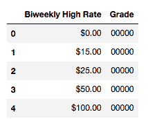

为了清理这些列，让我们从工资率中移除那些美元符号（`$`），并确保列是正确的类型。当我们处理定量列时，我们通常希望它们是整数或浮点数（浮点数更受欢迎），而定性列通常是字符串或 Unicode 对象：

```py
# Rate has dollar signs in a few of them, we need to clean that up..
salary_ranges['Biweekly High Rate'].describe()

count         1356
unique         593
top       $3460.00
freq            12
Name: Biweekly High Rate, dtype: object
```

为了清理这个列，让我们使用 pandas 中的映射功能来高效地将函数映射到整个数据序列：

```py
# need to clean our Biweekly High columns to remove the dollar sign in order to visualize
salary_ranges['Biweekly High Rate'] = salary_ranges['Biweekly High Rate'].map(lambda value: value.replace('$',''))

# Check to see the '$' has been removed
salary_ranges.head()
```

下表让我们更好地理解这里的情况：

|  | **Biweekly High Rate** | **Grade** |
| --- | --- | --- |
| **0** | 0.00 | 00000 |
| **1** | 15.00 | 00000 |
| **2** | 25.00 | 00000 |
| **3** | 50.00 | 00000 |
| **4** | 100.00 | 00000 |

为了完成我们对`Biweekly High Rate`列的转换，我们将整个列转换为`float`：

```py
# Convert the Biweeky columns to float
salary_ranges['Biweekly High Rate'] = salary_ranges['Biweekly High Rate'].astype(float)
```

当我们在铸造时，也让`Grade`列作为一个字符串进行铸造：

```py
# Convert the Grade columns to str
salary_ranges['Grade'] = salary_ranges['Grade'].astype(str)

# check to see if converting the data types worked
salary_ranges.info()

<class 'pandas.core.frame.DataFrame'>
RangeIndex: 1356 entries, 0 to 1355
Data columns (total 2 columns):
Biweekly High Rate    1356 non-null float64
Grade                 1356 non-null object
dtypes: float64(1), object(1)
memory usage: 21.3+ KB
```

我们看到我们现在总共有：

+   1,356 行（就像我们开始时一样）

+   两个列（我们选择的）：

    +   **双周高率**：一个指特定部门平均每周工资的定量列：

        +   这个列是定量的，因为值是数值性的，描述了个人每周赚取的金额

        +   它是浮点类型，我们将其转换为

    +   **Grade**：工资所参考的部门：

        +   这个列肯定是定性的，因为代码指的是一个部门，而不是任何类型的数量

        +   它是对象类型，这是 pandas 在它是字符串时会规定的类型

为了进一步区分定量和定性数据，让我们深入了解数据的四个级别。

# 数据的四个级别

我们已经知道我们可以将数据识别为定性或定量。但是，从这里我们可以更进一步。数据的四个级别是：

+   名义级别

+   序数级别

+   间隔级别

+   比率级别

每个级别都伴随着不同级别的控制和数学可能性。知道数据处于哪个级别至关重要，因为它将决定你可以执行的可视化和操作类型。

# 名义级别

数据的第一级，名义级别，结构最弱。它由纯粹通过名称描述的数据组成。基本例子包括血型（A，O，AB）、动物物种或人名。这些类型的数据都是定性的。

一些其他例子包括：

+   在`SF Job Salary`数据集中，`Grade`列将是名义的

+   给定一家公司的访客日志，访客的姓名和姓氏将是名义的

+   实验室动物物种将是名义的

# 允许的数学运算

在每个水平上，我们将简要描述允许的数学类型，更重要的是，不允许的数学类型。在这个水平上，我们不能执行任何定量数学运算，如加法或除法。这些都没有意义。由于缺乏加法和除法，我们显然不能在名义水平上找到平均值。没有平均名称或平均职业部门。

我们可以使用 pandas 的 `value_counts` 方法进行基本的计数：

```py
# Basic Value Counts of the Grade column
salary_ranges['Grade'].value_counts().head()

00000    61
07450    12
06870     9
07170     9
07420     9
Name: Grade, dtype: int64
```

最常见的 `Grade` 是 `00000`，这意味着这是我们**众数**或最常出现的类别。由于我们在名义水平上能够计数，因此像条形图这样的图表对我们是可用的：

```py
# Bar Chart of the Grade column salary_ranges['Grade'].value_counts().sort_values(ascending=False).head(20).plot(kind='bar')
```

以下为前述代码的结果：

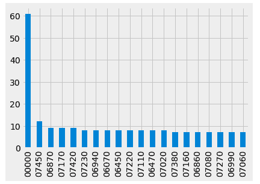

在名义水平上，我们也可以使用饼图：

```py
# Bar Chart of the Grade column as a pie chart (top 5 values only)
salary_ranges['Grade'].value_counts().sort_values(ascending=False).head(5).plot(kind='pie')
```

以下为前述代码的输出：

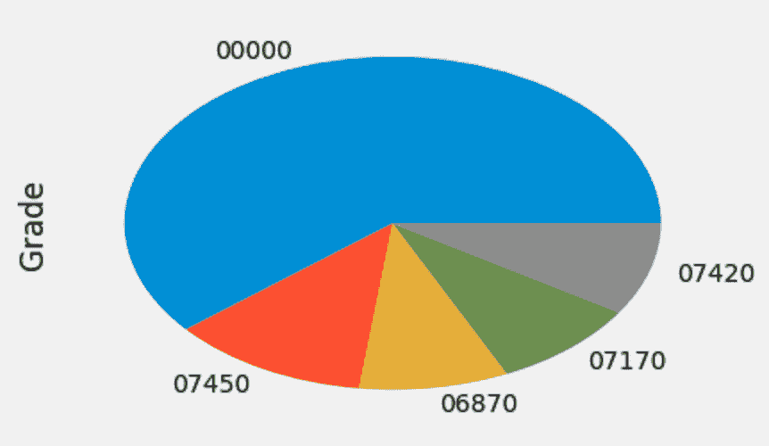

# 序数水平

名义水平为我们提供了许多进一步探索的能力。提升一个水平，我们现在处于序数尺度。序数尺度继承了名义水平的所有属性，但具有重要的附加属性：

+   序数水平的数据可以**自然排序**

+   这意味着列中的某些数据值可以被认为是比其他数据值更好或更大的

与名义水平一样，序数水平的数据本质上仍然是分类的，即使使用数字来表示类别。

# 允许的数学运算

与名义水平相比，我们在序数水平上有一些新的能力。在序数水平上，我们可能仍然像在名义水平上那样进行基本的计数，但我们可以引入比较和排序。因此，我们可能在这个层面上使用新的图表。我们可能使用条形图和饼图，就像在名义水平上那样，但由于我们现在有了排序和比较，我们可以计算中位数和百分位数。有了中位数和百分位数，茎叶图以及箱线图都是可能的。

序数水平数据的例子包括：

+   使用李克特量表（例如，在 1 到 10 的量表上对某物进行评分）

+   考试的等级水平（F，D，C，B，A）

为了提供一个序数尺度数据的现实世界例子，让我们引入一个新的数据集。这个数据集包含关于人们享受旧金山国际机场（SFO）的关键见解。这个数据集也公开在旧金山的开放数据库上([`data.sfgov.org/Transportation/2013-SFO-Customer-Survey/mjr8-p6m5`](https://data.sfgov.org/Transportation/2013-SFO-Customer-Survey/mjr8-p6m5))：

```py
# load in the data set
customer = pd.read_csv('../data/2013_SFO_Customer_survey.csv')
```

这个 CSV 有很多列：

```py
customer.shape

(3535, 95)
```

`95`列，确切地说。有关此数据集可用的列的更多信息，请查看网站上的数据字典（[`data.sfgov.org/api/views/mjr8-p6m5/files/FHnAUtMCD0C8CyLD3jqZ1-Xd1aap8L086KLWQ9SKZ_8?download=true&filename=AIR_DataDictionary_2013-SFO-Customer-Survey.pdf`](https://data.sfgov.org/api/views/mjr8-p6m5/files/FHnAUtMCD0C8CyLD3jqZ1-Xd1aap8L086KLWQ9SKZ_8?download=true&filename=AIR_DataDictionary_2013-SFO-Customer-Survey.pdf))

现在，让我们专注于一个单独的列，`Q7A_ART`。根据公开可用的数据字典描述，`Q7A_ART`是关于艺术品和展览的。可能的选项是 0，1，2，3，4，5，6，每个数字都有其含义：

+   **1**：不可接受

+   **2**：低于平均水平

+   **3**：平均

+   **4**：良好

+   **5**：杰出

+   **6**：从未使用或访问过

+   **0**：空白

我们可以表示如下：

```py
art_ratings = customer['Q7A_ART']
art_ratings.describe()

count    3535.000000
mean        4.300707
std         1.341445
min         0.000000
25%         3.000000
50%         4.000000
75%         5.000000
max         6.000000
Name: Q7A_ART, dtype: float64
```

Pandas 正在考虑将列数值化，因为它充满了数字，然而，我们必须记住，尽管单元格的值是数字，但这些数字代表一个类别，因此这些数据属于定性方面，更具体地说，是序数。如果我们移除`0`和`6`类别，我们将剩下五个序数类别，基本上类似于餐厅评分的星级：

```py
# only consider ratings 1-5
art_ratings = art_ratings[(art_ratings >=1) & (art_ratings <=5)]
```

我们然后将值转换为字符串：

```py
# cast the values as strings
art_ratings = art_ratings.astype(str)

art_ratings.describe()

count     2656
unique       5
top          4
freq      1066
Name: Q7A_ART, dtype: object
```

现在我们已经将序数数据格式化正确，让我们看看一些可视化：

```py
# Can use pie charts, just like in nominal level
art_ratings.value_counts().plot(kind='pie')
```

以下是对前面代码的结果：

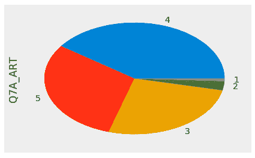

我们也可以将其可视化如下：

```py
# Can use bar charts, just like in nominal level
art_ratings.value_counts().plot(kind='bar')
```

以下是对前面代码的输出：

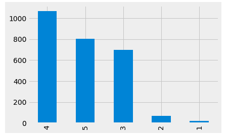

然而，现在我们也可以引入箱线图，因为我们处于序数级别：

```py
# Boxplots are available at the ordinal level
art_ratings.value_counts().plot(kind='box')
```

以下是对前面代码的输出：

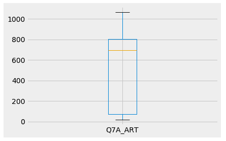

这个箱线图对于工资数据的`Grade`列是不可能的，因为找到中位数是不可能的。

# 序数水平

我们现在开始用煤气做饭了。在名义和序数水平上，我们处理的是定性数据。有些数据并没有描述真正的数量。在区间水平上，我们摆脱了这个概念，进入了定量数据。在区间数据水平上，我们处理的是数值数据，这些数据不仅像在序数水平上那样有顺序，而且值之间还有有意义的差异。这意味着在区间水平上，我们不仅可以排序和比较值，还可以**加**和**减**值。

示例：

数据在区间水平的经典例子是温度。如果德克萨斯州是 90 度，阿拉斯加是 40 度，那么我们可以在两个地点之间计算出 90-40=50 度的温差。这可能看起来是一个非常简单的例子，但回想一下前两个水平，我们以前从未对我们的数据有如此程度的控制。

非示例：

数据不在区间水平上的一个经典非例子是李克特量表。我们已经确定了李克特量表在序数水平上的能力，即其可排序性，但重要的是要注意，减法并没有真正的、一致的意义。如果我们从李克特量表上减去 5-3，得到的 2 实际上并不代表数字 2，也不代表类别 2。因此，李克特量表中的减法是困难的。

# 允许进行数学运算

记住，在区间水平上，我们有加法和减法可以操作。这是一个真正的变革。有了将值相加的能力，我们可以引入两个熟悉的概念，即**算术平均数**（简称为均值）和**标准差**。在区间水平上，这两个概念都对我们可用。为了看到这个的一个很好的例子，让我们引入一个新的数据集，一个关于气候变化的数据集：

```py
# load in the data set
climate = pd.read_csv('../data/GlobalLandTemperaturesByCity.csv')
climate.head()
```

让我们查看以下表格以获得更好的理解：

| **dt** | **平均温度** | **平均温度不确定性** | **城市** | **国家** | **纬度** | **经度** |  |
| --- | --- | --- | --- | --- | --- | --- | --- |
| **0** | 1743-11-01 | 6.068 | 1.737 | 奥胡斯 | 丹麦 | 57.05N | 10.33E |
| **1** | 1743-12-01 | NaN | NaN | 奥胡斯 | 丹麦 | 57.05N | 10.33E |
| **2** | 1744-01-01 | NaN | NaN | 奥胡斯 | 丹麦 | 57.05N | 10.33E |
| **3** | 1744-02-01 | NaN | NaN | 奥胡斯 | 丹麦 | 57.05N | 10.33E |
| **4** | 1744-03-01 | NaN | NaN | 奥胡斯 | 丹麦 | 57.05N | 10.33E |

这个数据集有 860 万行，其中每一行按月份量化了从 18 世纪以来世界各地城市的平均温度。注意，仅通过查看前五行，我们已经有了一些缺失值。现在让我们先移除它们，以便更好地观察：

```py
# remove missing values
climate.dropna(axis=0, inplace=True)

climate.head() . # check to see that missing values are gone
```

下表能让我们更好地理解这一点：

| **dt** | **平均温度** | **平均温度不确定性** | **城市** | **国家** | **纬度** | **经度** |  |
| --- | --- | --- | --- | --- | --- | --- | --- |
| **0** | 1743-11-01 | 6.068 | 1.737 | 奥胡斯 | 丹麦 | 57.05N | 10.33E |
| 5 | 1744-04-01 | 5.788 | 3.624 | 奥胡斯 | 丹麦 | 57.05N | 10.33E |
| 6 | 1744-05-01 | 10.644 | 1.283 | 奥胡斯 | 丹麦 | 57.05N | 10.33E |
| 7 | 1744-06-01 | 14.051 | 1.347 | 奥胡斯 | 丹麦 | 57.05N | 10.33E |
| 8 | 1744-07-01 | 16.082 | 1.396 | 奥胡斯 | 丹麦 | 57.05N | 10.33E |

让我们看看以下代码行是否有任何缺失值：

```py
climate.isnull().sum()

dt                               0
AverageTemperature               0
AverageTemperatureUncertainty    0
City                             0
Country                          0
Latitude                         0
Longitude                        0
year                             0
dtype: int64

# All good
```

有关的问题列被称为 `平均温度`。数据在区间水平上的一个特点是，由于我们拥有太多的值，因此我们不能在这里使用柱状图/饼图：

```py
# show us the number of unique items
climate['AverageTemperature'].nunique()

 111994
```

111,994 个值绘制出来是荒谬的，而且也是荒谬的，因为我们知道数据是定量的。在这个水平上，最常用的图表可能是**直方图**。这种图表是柱状图的亲戚，它将数量分成桶，并显示这些桶的频率。

让我们看看全球平均温度的直方图，以从非常全面的角度查看温度分布：

```py
climate['AverageTemperature'].hist()
```

下面的代码输出如下：

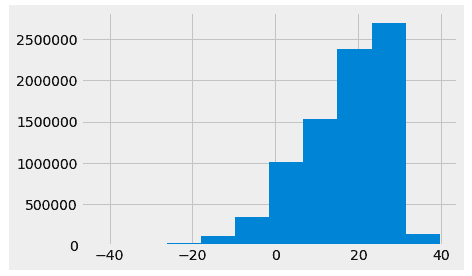

在这里，我们可以看到平均值为 20°C。让我们来确认这一点：

```py
climate['AverageTemperature'].describe()

 count 8.235082e+06 mean 1.672743e+01 std 1.035344e+01 min -4.270400e+01 25% 1.029900e+01 50% 1.883100e+01 75% 2.521000e+01 max 3.965100e+01 Name: AverageTemperature, dtype: float64
```

我们很接近。平均值似乎在 17°左右。让我们让这个更有趣一些，并添加新的列称为`year`和`century`，并且仅将数据子集为美国记录的温度：

```py
# Convert the dt column to datetime and extract the year
 climate['dt'] = pd.to_datetime(climate['dt'])
 climate['year'] = climate['dt'].map(lambda value: value.year)

 climate_sub_us['century'] = climate_sub_us['year'].map(lambda x: x/100+1)
 # 1983 would become 20
 # 1750 would become 18

 # A subset the data to just the US
 climate_sub_us = climate.loc[climate['Country'] == 'United States']
```

使用新的`century`列，让我们绘制四个温度直方图，每个世纪一个：

```py
climate_sub_us['AverageTemperature'].hist(by=climate_sub_us['century'],
 sharex=True, sharey=True,
 figsize=(10, 10),
 bins=20)
```

下面的代码输出如下：

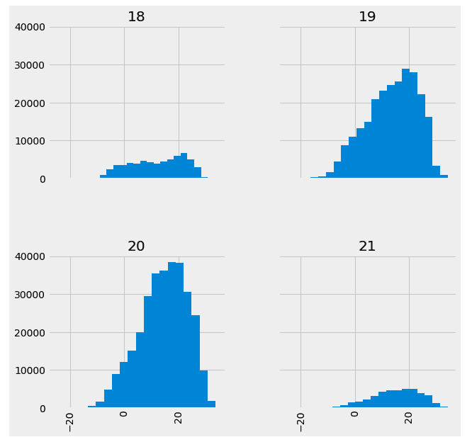

在这里，我们有我们的四个直方图，显示平均温度略有上升。让我们来确认这一点：

```py
climate_sub_us.groupby('century')['AverageTemperature'].mean().plot(kind='line')
```

下面的代码输出如下：

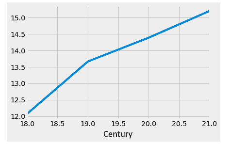

很有趣！由于在这个层面上差异是显著的，我们可以回答自 18 世纪以来，美国平均温度上升了多少的问题。首先，让我们将几个世纪的温度变化存储为其自己的 pandas Series 对象：

```py
century_changes = climate_sub_us.groupby('century')['AverageTemperature'].mean()

century_changes

century 18 12.073243 19 13.662870 20 14.386622 21 15.197692 Name: AverageTemperature, dtype: float64
```

现在，让我们使用 Series 的索引来从 21 世纪的值中减去 18 世纪的值，以得到温度差异：

```py
# 21st century average temp in US minus 18th century average temp in US
 century_changes[21] - century_changes[18]

 # average difference in monthly recorded temperature in the US since the 18th century
 3.12444911546
```

# 在间隔级别绘制两个列

在具有间隔级别或更高级别的两个数据列的情况下，有一个很大的优势，那就是它使我们能够使用散点图，我们可以将两个数据列绘制在我们的轴上，并将数据点可视化为图上的实际点。我们的“气候变化”数据集的`year`和`averageTemperature`列都处于间隔级别，因为它们都有意义差异，所以让我们尝试绘制所有记录的美国月度温度的散点图，其中*x*轴将是年份，*y*轴将是温度。我们希望注意到温度的趋势性上升，正如之前的线图所暗示的：

```py
x = climate_sub_us['year']
 y = climate_sub_us['AverageTemperature']
 fig, ax = plt.subplots(figsize=(10,5))
 ax.scatter(x, y)
 plt.show()
```

下面的代码输出如下：

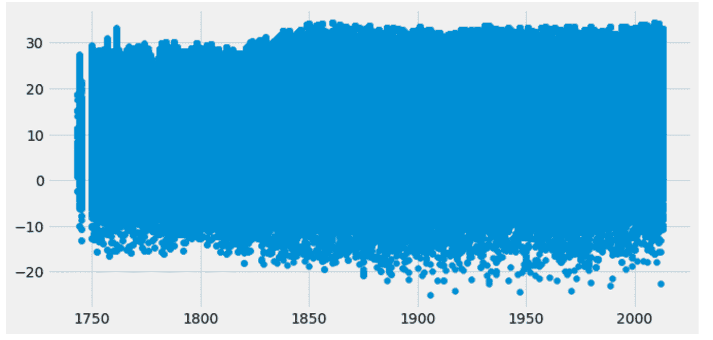

哎呀，这看起来不太美观。似乎有很多噪声，这是可以预料的。每年都有多个城镇报告多个平均温度，因此我们每年看到许多垂直点是有道理的。

让我们使用年份列的`groupby`来消除大部分噪声：

```py
# Let's use a groupby to reduce the amount of noise in the US
 climate_sub_us.groupby('year').mean()['AverageTemperature'].plot() 
```

下面的代码输出如下：

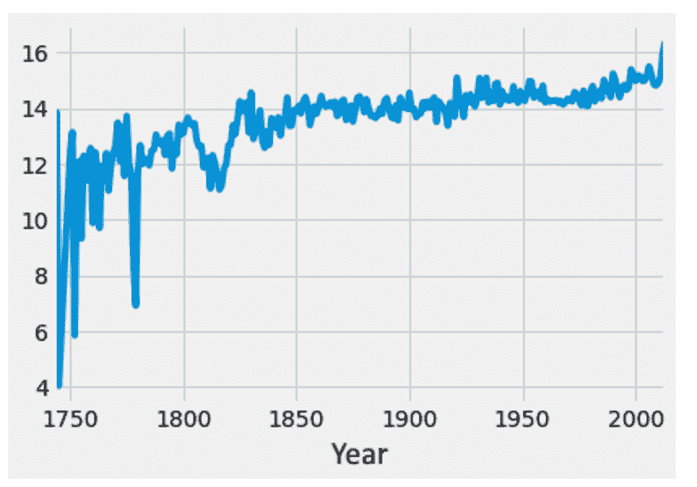

好多了！我们确实可以看到年份的变化，但让我们通过在年份上取滚动平均值来稍微平滑一下：

```py
# A moving average to smooth it all out:
 climate_sub_us.groupby('year').mean()['AverageTemperature'].rolling(10).mean().plot()

```

下面的代码输出如下：

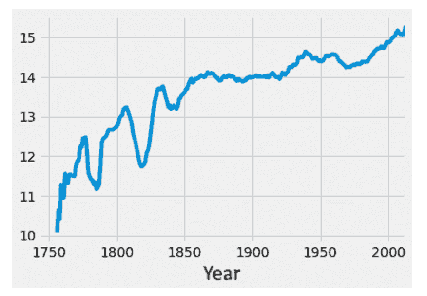

因此，我们绘制间隔级别两个数据列的能力再次证实了之前的线图所暗示的；似乎美国平均温度确实有普遍上升的趋势。

数据的区间级别为我们提供了对数据的新理解层面，但我们还没有完成。

# 比率级别

最后，我们上升到最高级别，即比率级别。在这个层面上，我们可以说我们拥有最高程度的控制和可用数学。在比率级别，就像区间级别一样，我们仍在处理定量数据。我们从区间级别继承了加法和减法，但现在我们有一个关于*真正零*的概念，这使我们能够乘除数值。

# 允许的数学运算

在比率级别，我们可以一起乘除数值。这看起来可能不是什么大事，但它确实允许我们对这个层面的数据进行独特的观察，而在较低级别则无法做到。让我们通过一些例子来具体了解这意味着什么。

示例：

当处理财务数据时，我们几乎总是需要处理一些货币价值。货币处于比率层面，因为我们有一个“没有钱”的概念。因此，我们可能会做出如下陈述：

+   $100 是$50 的两倍，因为 100/50 = 2

+   10 毫克的青霉素是 20 毫克青霉素的一半，因为 10/20 = 0.5

正是因为存在零，比率在这个层面上才有意义。

非示例：

我们通常认为温度处于区间级别而不是比率级别，因为说 100 度是 50 度的两倍没有意义。这并不完全合理。温度是非常主观的，这并不是客观正确的。

可以认为摄氏度和华氏度有一个起点主要是因为我们可以将它们转换为开尔文，而开尔文确实有一个真正的零。实际上，因为摄氏度和华氏度允许负值，而开尔文不允许；所以摄氏度和华氏度都没有真正的*真正零*，而开尔文有。

回到旧金山的薪酬数据，我们现在看到薪酬周薪率处于比率级别，在那里我们可以开始做出新的观察。让我们从查看最高薪酬开始：

```py
# Which Grade has the highest Biweekly high rate
# What is the average rate across all of the Grades
fig = plt.figure(figsize=(15,5))
ax = fig.gca()

salary_ranges.groupby('Grade')[['Biweekly High Rate']].mean().sort_values(
 'Biweekly High Rate', ascending=False).head(20).plot.bar(stacked=False, ax=ax, color='darkorange')
ax.set_title('Top 20 Grade by Mean Biweekly High Rate')
```

以下是在前面的代码中的输出：

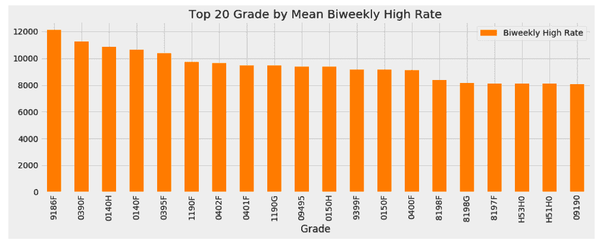

如果我们查看以下在旧金山公共记录中找到的最高薪酬：

[`sfdhr.org/sites/default/files/documents/Classification%20and%20Compensation/Archives/Compensation-Manual-FY09-10.pdf`](http://sfdhr.org/sites/default/files/documents/Classification%20and%20Compensation/Archives/Compensation-Manual-FY09-10.pdf)

我们看到它是**总经理**，**公共交通部门**。让我们采用类似的策略来查看最低薪酬的工作：

```py
# Which Grade has the lowest Biweekly high rate
 fig = plt.figure(figsize=(15,5))
 ax = fig.gca()

 salary_ranges.groupby('Grade')[['Biweekly High Rate']].mean().sort_values(
 'Biweekly High Rate', ascending=False).tail(20).plot.bar(stacked=False, ax=ax, color='darkorange')
 ax.set_title('Bottom 20 Grade by Mean Biweekly High Rate')
```

以下是在前面的代码中的输出：

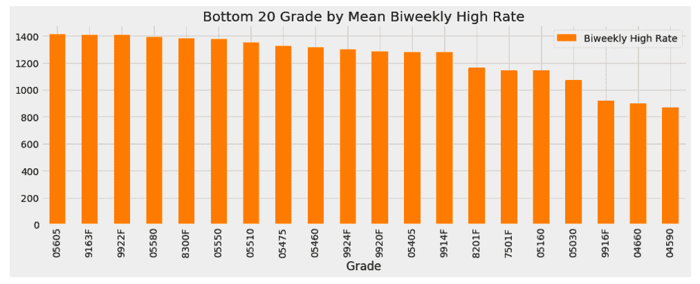

再次，查看最低薪酬的工作，我们看到它是一个**营地助理**。

因为货币处于比率级别，我们也可以找到最高薪酬员工与最低薪酬员工的比率：

```py
sorted_df = salary_ranges.groupby('Grade')[['Biweekly High Rate']].mean().sort_values(
 'Biweekly High Rate', ascending=False)
 sorted_df.iloc[0][0] / sorted_df.iloc[-1][0]

 13.931919540229886
```

最高薪的员工是最低城市员工的 14 倍。感谢比率水平！

# 数据水平的总结

理解数据的各种水平是进行特征工程所必需的。当涉及到构建新特征或修复旧特征时，我们必须有识别如何处理每一列的方法。

这里是一个快速表格，总结了每个水平上可能和不可能的事情：

| **测量水平** | **属性** | **例子** | **描述性统计** | **图表** |
| --- | --- | --- | --- | --- |
| 名义 | 离散 无序 | 二元响应（真或假）人的名字 油漆的颜色 | 频率/百分比 模式 | 条形图 饼图 |
| 有序 | 有序类别 比较对比 | 李克特量表 考试成绩 | 频率 模式 中位数 百分位数 | 条形图 饼图 茎叶图 |

| 间隔 | 有序值之间的差异具有意义 | 摄氏度或华氏度某些李克特量表（必须是具体的） | 频率 模式 中位数 平均值 标准差 | 条形图 饼图

茎叶图 箱线图 直方图

| 比率 | 连续的 0 允许比率陈述（例如，$100 是 $50 的两倍） | 货币 重量 | 平均值 标准差 | 直方图 箱线图 |
| --- | --- | --- | --- | --- |

下表显示了每个水平允许的统计类型：

| **统计量** | **名义** | **有序** | **间隔** | **比率** |
| --- | --- | --- | --- | --- |
| 模式 | √ | √ | √ | 有时 |
| 中位数 | X | √ | √ | √ |
| 范围、最小值 最大值 | X | √ | √ | √ |
| 平均值 | X | X | √ | √ |
| 标准差 | X | X | √ | √ |

最后，以下是一个表格，显示了每个水平上可能和不可能的图表：

| **图表** | **名义** | **有序** | **间隔** | **比率** |
| --- | --- | --- | --- | --- |
| 条形图/饼图 | √ | √ | 有时 | X |
| 茎叶图 | X | √ | √ | √ |
| 箱线图 | X | √ | √ | √ |
| 直方图 | X | X | 有时 | √ |

面对新的数据集时，以下是一个基本的流程：

1.  数据是有序的还是无序的？我们的数据是否以具有明确行和列的表格格式存在，或者是否以无结构的文本混乱存在？

1.  每一列是定量还是定性？单元格中的值是代表数量的数字，还是不表示数量的字符串？

1.  每一列数据处于什么水平？这些值是名义水平、有序水平、间隔水平还是比率水平？

1.  我可以利用哪些图表来可视化我的数据——条形图、饼图、箱线图、直方图等等？

这里是这个流程的视觉表示：

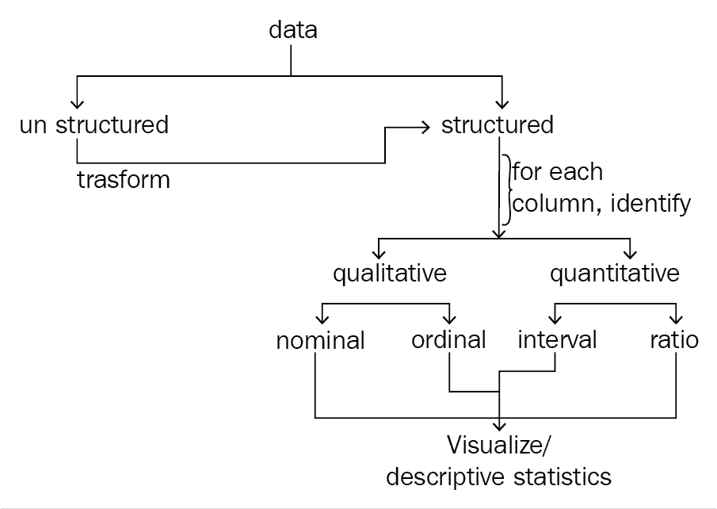

# 摘要

理解我们正在处理的特征是特征工程的第一步。如果我们不能理解给定的数据，我们就永远无法希望修复、创建和利用特征，以便创建表现良好的机器学习管道。在本章中，我们能够识别并从我们的数据集中提取数据水平，并使用这些信息创建有用的和有意义的视觉图表，为我们的数据带来新的洞察。

在下一章中，我们将利用这些新发现的数据层级知识来开始改进我们的特性，并且我们将开始使用机器学习来有效地衡量我们特性工程流程的影响。
