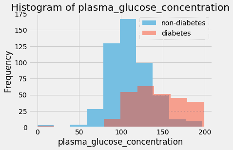
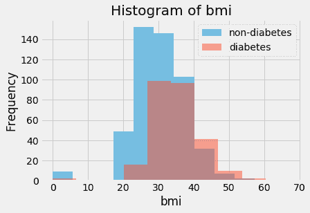
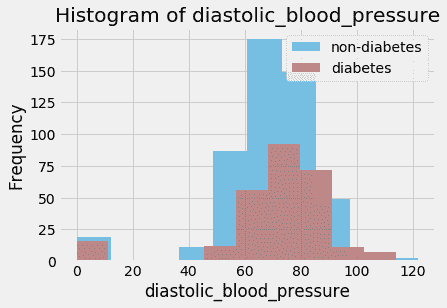
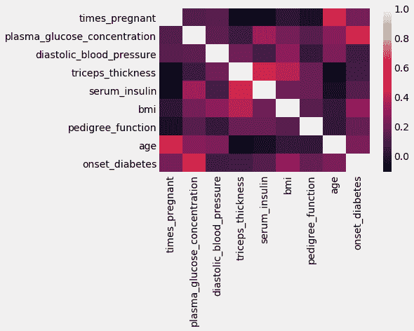
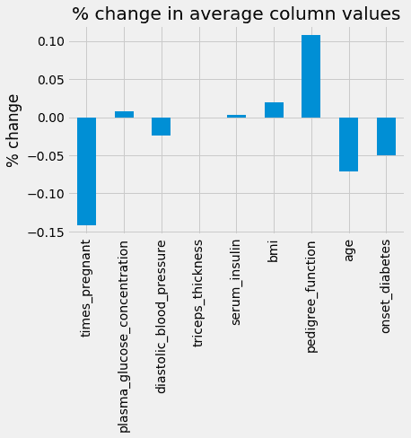
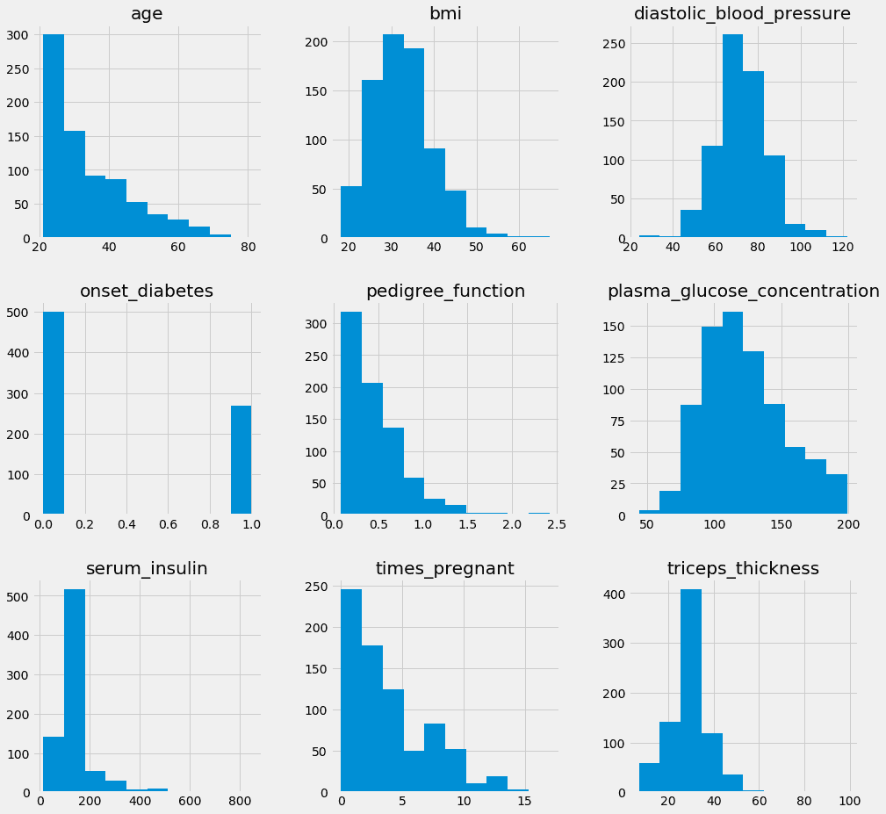
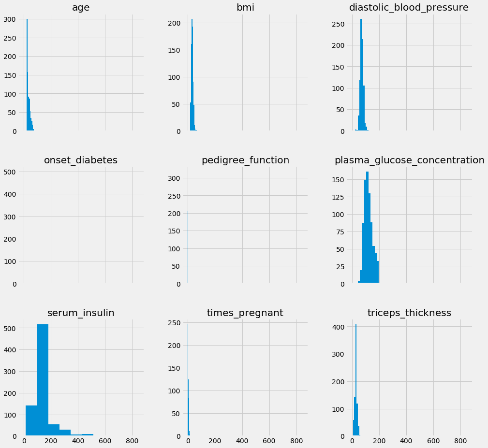
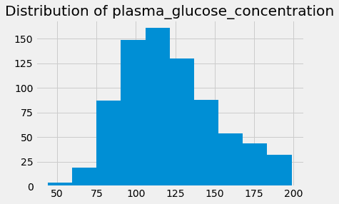
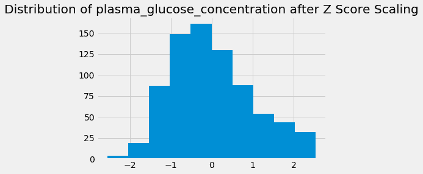
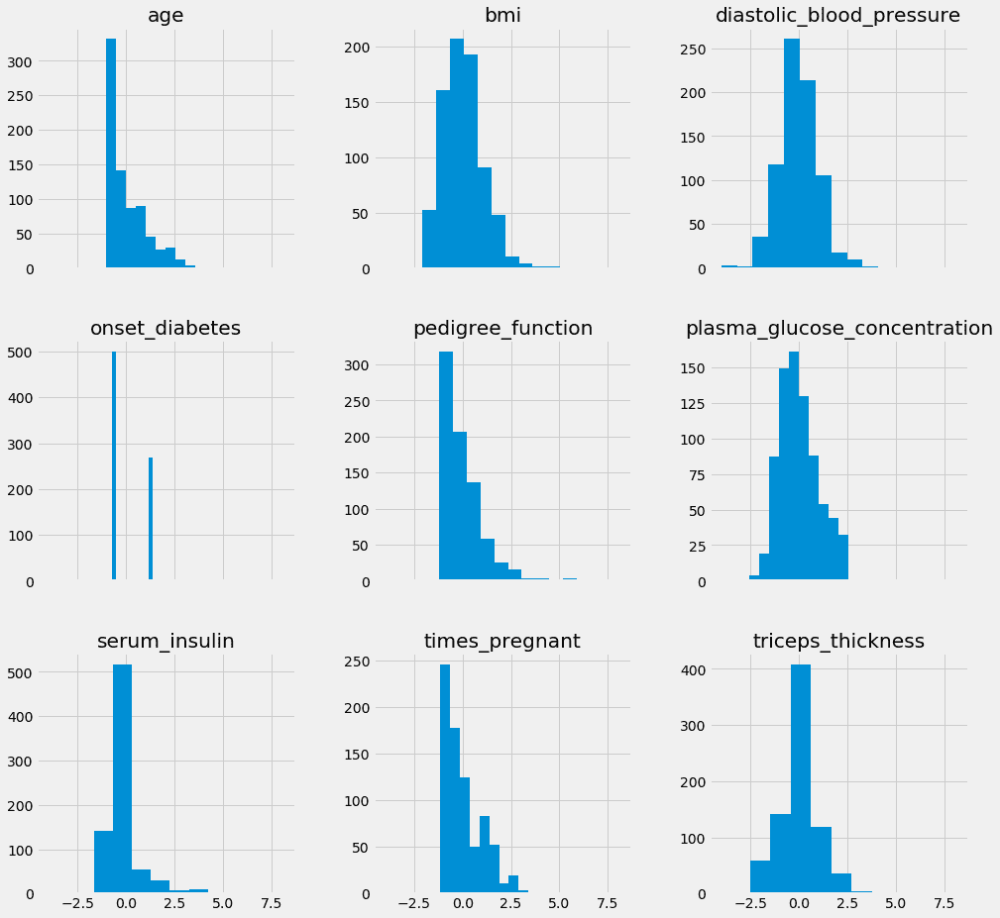

# 特征改进 - 清洗数据集

在前两章中，我们已从谈论特征工程的基本理解及其如何用于增强我们的机器学习流程，过渡到实际操作数据集，评估和理解在野外可能遇到的不同类型的数据。

在本章中，我们将运用所学知识，更进一步，开始改变我们使用的数据集。具体来说，我们将开始对数据集进行*清洗*和*增强*。通过清洗，我们通常指的是改变已经给定的列和行。通过增强，我们通常指的是从数据集中移除列和添加列的过程。正如往常一样，我们所有这些过程中的目标是提升我们的机器学习流程。

在接下来的章节中，我们将进行以下操作：

+   识别数据中的缺失值

+   移除有害数据

+   填充（补充）这些缺失值

+   正则化/标准化数据

+   构建全新的特征

+   手动和自动选择（移除）特征

+   使用数学矩阵计算将数据集转换为不同的维度

这些方法将帮助我们更好地了解数据中哪些特征是重要的。在本章中，我们将深入探讨前四种方法，并将其他三种方法留待未来章节讨论。

# 识别数据中的缺失值

我们识别缺失值的第一种方法是为了更好地理解如何处理现实世界的数据。通常，数据可能由于各种原因而存在缺失值，例如在调查数据中，一些观察结果可能没有被记录。对我们来说，分析数据并了解缺失值是什么，以便我们决定如何处理机器学习中的缺失值是很重要的。首先，让我们深入研究一个在本章期间我们将感兴趣的数据集，即`皮马印第安糖尿病预测`数据集。

# 皮马印第安糖尿病预测数据集

该数据集可在以下 UCI 机器学习仓库中找到：

[`archive.ics.uci.edu/ml/datasets/pima+indians+diabetes`](https://archive.ics.uci.edu/ml/datasets/pima+indians+diabetes).

从主网站上，我们可以了解一些关于这个公开数据集的信息。我们共有九列和 768 个实例（行）。这个数据集主要用于预测 21 岁以上的皮马印第安女性在五年内是否会患上糖尿病，前提是提供她们的医疗详细信息。

该数据集旨在对应一个二元（双分类）机器学习问题。即，回答问题：*这个人五年内会患上糖尿病吗？* 列名如下（按顺序）：

1.  怀孕次数

1.  口服葡萄糖耐量测试 2 小时后的血浆葡萄糖浓度

1.  舒张压（毫米汞柱）

1.  三角肌皮肤褶皱厚度（毫米）

1.  2 小时血清胰岛素测量（微 U/ml）

1.  体重指数（千克/（米）²）

1.  糖尿病家系函数

1.  年龄（年）

1.  类变量（零或一）

数据集的目标是能够预测`class`变量的最后一列，该变量预测患者是否患有糖尿病，使用其他八个特征作为机器学习函数的输入。

我们将使用这个数据集有两个非常重要的原因：

+   我们将不得不处理缺失值

+   我们将使用的所有特征都将是有量的

目前来说，第一个点作为一个原因更有意义，因为本章的目的是处理缺失值。如果我们只选择处理定量数据，这种情况将仅限于本章。我们没有足够的工具来处理分类列中的缺失值。在下一章，当我们讨论特征构建时，我们将处理这个流程。

# 探索性数据分析（EDA）

为了识别我们的缺失值，我们将从我们的数据集的 EDA 开始。我们将使用一些有用的 Python 包，如 pandas 和 numpy，来存储我们的数据并进行一些简单的计算，以及一些流行的可视化工具来查看我们的数据分布情况。让我们开始并深入一些代码。首先，我们将进行一些导入：

```py
# import packages we need for exploratory data analysis (EDA)
import pandas as pd # to store tabular data
import numpy as np # to do some math
import matplotlib.pyplot as plt # a popular data visualization tool
import seaborn as sns  # another popular data visualization tool
%matplotlib inline 
plt.style.use('fivethirtyeight') # a popular data visualization theme
```

我们将通过 CSV 导入我们的表格数据，如下所示：

```py
# load in our dataset using pandas
pima = pd.read_csv('../data/pima.data')

pima.head()

```

`head`方法允许我们查看数据集的前几行。输出如下：

|  | **6** | **148** | **72** | **35** | **0** | **33.6** | **0.627** | **50** | **1** |
| --- | --- | --- | --- | --- | --- | --- | --- | --- | --- |
| **0** | 1 | 85 | 66 | 29 | 0 | 26.6 | 0.351 | 31 | 0 |
| **1** | 8 | 183 | 64 | 0 | 0 | 23.3 | 0.627 | 32 | 1 |
| **2** | 1 | 89 | 66 | 23 | 94 | 28.1 | 0.167 | 21 | 0 |
| **3** | 0 | 137 | 40 | 35 | 168 | 43.1 | 2.288 | 33 | 1 |
| **4** | 5 | 116 | 74 | 0 | 0 | 25.6 | 0.201 | 30 | 0 |

这里有些不对劲，没有列名。CSV 文件中可能没有将列名嵌入到文件中。没关系，我们可以使用数据源的网站来填写这些信息，如下面的代码所示：

```py
pima_column_names = ['times_pregnant', 'plasma_glucose_concentration', 'diastolic_blood_pressure', 'triceps_thickness', 'serum_insulin', 'bmi', 'pedigree_function', 'age', 'onset_diabetes']

pima = pd.read_csv('../data/pima.data', names=pima_column_names)

pima.head()

```

现在，再次使用`head`方法，我们可以看到带有适当标题的列。前面代码的输出如下：

|  | **怀孕次数** | **血浆葡萄糖浓度** | **舒张压** | **三头肌厚度** | **血清胰岛素** | **BMI** | **家系函数** | **年龄** | **糖尿病发病时间** |
| --- | --- | --- | --- | --- | --- | --- | --- | --- | --- |
| **0** | 6 | 148 | 72 | 35 | 0 | 33.6 | 0.627 | 50 | 1 |
| **1** | 1 | 85 | 66 | 29 | 0 | 26.6 | 0.351 | 31 | 0 |
| **2** | 8 | 183 | 64 | 0 | 0 | 23.3 | 0.672 | 32 | 1 |
| **3** | 1 | 89 | 66 | 23 | 94 | 28.1 | 0.167 | 21 | 0 |
| **4** | 0 | 137 | 40 | 35 | 168 | 43.1 | 2.288 | 33 | 1 |

更好的是，现在我们可以使用列名来进行一些基本的统计、选择和可视化。让我们首先获取我们的空值准确率如下：

```py
pima['onset_diabetes'].value_counts(normalize=True) 
# get null accuracy, 65% did not develop diabetes

0    0.651042
1    0.348958
Name: onset_diabetes, dtype: float64
```

如果我们的最终目标是利用数据中的模式来预测糖尿病的发病，让我们尝试可视化那些患病和未患病的人之间的差异。我们的希望是直方图会揭示某种模式，或者在预测类别的值之间有明显的差异：

```py
# get a histogram of the plasma_glucose_concentration column for
# both classes

col = 'plasma_glucose_concentration'
plt.hist(pima[pima['onset_diabetes']==0][col], 10, alpha=0.5, label='non-diabetes')
plt.hist(pima[pima['onset_diabetes']==1][col], 10, alpha=0.5, label='diabetes')
plt.legend(loc='upper right')
plt.xlabel(col)
plt.ylabel('Frequency')
plt.title('Histogram of {}'.format(col))
plt.show()
```

上述代码的输出如下：



这个直方图似乎在向我们展示两个预测类别之间`血浆葡萄糖浓度`的很大差异。让我们以相同的直方图风格展示多个列，如下所示：

```py
for col in ['bmi', 'diastolic_blood_pressure', 'plasma_glucose_concentration']:
    plt.hist(pima[pima['onset_diabetes']==0][col], 10, alpha=0.5, label='non-diabetes')
    plt.hist(pima[pima['onset_diabetes']==1][col], 10, alpha=0.5, label='diabetes')
    plt.legend(loc='upper right')
    plt.xlabel(col)
    plt.ylabel('Frequency')
    plt.title('Histogram of {}'.format(col))
    plt.show()
```

上述代码的输出将给我们以下三个直方图。第一个直方图展示了两个类别变量（非糖尿病和糖尿病）的**BMI**分布：



下一个出现的直方图将再次向我们展示两个类别变量之间在某个特征上的对比性不同的分布。这次我们正在查看**舒张压**：



最后一个图表将展示两个类别变量之间的**血浆葡萄糖浓度**差异：


只需通过查看几个直方图，我们就可以明显地看到一些主要差异。例如，对于最终会患上糖尿病的人来说，`血浆葡萄糖浓度`似乎有一个很大的跳跃。为了巩固这一点，也许我们可以通过可视化线性相关矩阵来尝试量化这些变量之间的关系。我们将使用在章节开头导入的可视化工具 seaborn 来创建以下的相关矩阵：

```py
# look at the heatmap of the correlation matrix of our dataset
sns.heatmap(pima.corr())
# plasma_glucose_concentration definitely seems to be an interesting feature here
```

下面是我们数据集的相关矩阵。这显示了`Pima`数据集中不同列之间的相关性。输出如下：



这个相关矩阵显示了`血浆葡萄糖浓度`和`发病糖尿病`之间强烈的关联。让我们进一步查看`发病糖尿病`列的数值相关性，以下代码：

```py
pima.corr()['onset_diabetes'] # numerical correlation matrix
# plasma_glucose_concentration definitely seems to be an interesting feature here

times_pregnant                  0.221898
plasma_glucose_concentration    0.466581 diastolic_blood_pressure        0.065068
triceps_thickness               0.074752
serum_insulin                   0.130548
bmi                             0.292695
pedigree_function               0.173844
age                             0.238356
onset_diabetes                  1.000000
Name: onset_diabetes, dtype: float64
```

我们将在第四章中探索相关性的力量，*特征构建*，但现在我们正在使用**探索性数据分析**（**EDA**）来暗示`血浆葡萄糖浓度`这一列将是我们预测糖尿病发病的重要因素。

接下来，让我们关注更重要的任务，通过调用 pandas DataFrame 的内置`isnull()`方法来查看我们的数据集中是否有缺失值：

```py
pima.isnull().sum()
>>>>
times_pregnant                  0
plasma_glucose_concentration    0
diastolic_blood_pressure        0
triceps_thickness               0
serum_insulin                   0
bmi                             0
pedigree_function               0
age                             0
onset_diabetes                  0
dtype: int64
```

太好了！我们没有缺失值。让我们继续进行更多的 EDA，首先使用`shape`方法查看我们正在处理的行数和列数：

```py
pima.shape . # (# rows, # cols)
(768, 9)
```

确认我们有`9`列（包括我们的响应变量）和`768`个数据观测值（行）。现在，让我们看一下患糖尿病的患者的百分比，使用以下代码：

```py
pima['onset_diabetes'].value_counts(normalize=True) 
# get null accuracy, 65% did not develop diabetes

0    0.651042
1    0.348958
Name: onset_diabetes, dtype: float64
```

这表明 65%的患者没有患上糖尿病，而大约 35%的患者患上了。我们可以使用 pandas DataFrame 的一个内置方法`describe`来查看一些基本描述性统计信息：

```py
pima.describe()  # get some basic descriptive statistics

```

我们得到以下输出：

|  | **times_pregnant** | **plasma_glucose _concentration** | **diastolic_ blood_pressure** | **triceps _thickness** | **serum _insulin** | **bmi** | **pedigree _function** | **age** | **onset _diabetes** |
| --- | --- | --- | --- | --- | --- | --- | --- | --- | --- |
| **count** | 768.000000 | 768.000000 | 768.000000 | 768.000000 | 768.000000 | 768.000000 | 768.000000 | 768.000000 | 768.000000 |
| **mean** | 3.845052 | 120.894531 | 69.105469 | 20.536458 | 79.799479 | 31.992578 | 0.471876 | 33.240885 | 0.348958 |
| **std** | 3.369578 | 31.972618 | 19.355807 | 15.952218 | 115.244002 | 7.884160 | 0.331329 | 11.760232 | 0.476951 |
| **min** | 0.000000 | 0.000000 | 0.000000 | 0.000000 | 0.000000 | 0.000000 | 0.078000 | 21.000000 | 0.000000 |
| **25%** | 1.000000 | 99.000000 | 62.000000 | 0.000000 | 0.000000 | 27.300000 | 0.243750 | 24.000000 | 0.000000 |
| **50%** | 3.000000 | 117.000000 | 72.000000 | 23.000000 | 30.500000 | 32.000000 | 0.372500 | 29.000000 | 0.000000 |
| **75%** | 6.000000 | 140.250000 | 80.000000 | 32.000000 | 127.250000 | 36.600000 | 0.626250 | 41.000000 | 1.000000 |
| **max** | 17.000000 | 199.000000 | 122.000000 | 99.000000 | 846.000000 | 67.100000 | 2.420000 | 81.000000 | 1.000000 |

这很快地显示了一些基本统计信息，如平均值、标准差和一些不同的百分位数测量值。但请注意，`BMI`列的最小值是`0`。这在医学上是不可能的；这肯定有原因。也许数字零被编码为缺失值，而不是 None 值或缺失单元格。经过仔细检查，我们发现以下列的最小值出现了 0：

+   `times_pregnant`

+   `plasma_glucose_concentration`

+   `diastolic_blood_pressure`

+   `triceps_thickness`

+   `serum_insulin`

+   `bmi`

+   `onset_diabetes`

因为 0 是`onset_diabetes`的一个类别，而 0 实际上对于`times_pregnant`来说是一个有效的数字，所以我们可能得出结论，数字 0 用于编码以下变量的缺失值：

+   `plasma_glucose_concentration`

+   `diastolic_blood_pressure`

+   `triceps_thickness`

+   `serum_insulin`

+   `bmi`

因此，我们实际上确实有缺失值！显然，我们偶然发现零作为缺失值并不是运气，我们事先就知道。作为一名数据科学家，你必须始终保持警惕，并确保尽可能多地了解数据集，以便找到以其他符号编码的缺失值。务必阅读任何与公开数据集一起提供的所有文档，以防它们提到任何缺失值。

如果没有可用的文档，一些常用的值被用来代替缺失值：

+   **0**（用于数值变量）

+   **unknown**或**Unknown**（用于分类变量）

+   **?**（用于分类变量）

因此，我们有五个存在缺失值的列，现在我们可以深入讨论如何处理它们。

# 处理数据集中的缺失值

在处理数据时，数据科学家最常见的问题之一是缺失数据的问题。最常见的是指由于某种原因数据未采集的空单元格（行/列交叉点）。这可能会成为许多问题的原因；值得注意的是，当将学习算法应用于带有缺失值的数据时，大多数（不是所有）算法无法处理缺失值。

因此，数据科学家和机器学习工程师有很多技巧和建议来处理这个问题。尽管有许多方法变体，但我们处理缺失数据的主要两种方式是：

+   删除包含缺失值的行

+   填充（补全）缺失值

每种方法都会将我们的数据集**清理**到学习算法可以处理的程度，但每种方法都会有其优缺点。

首先，在我们走得太远之前，让我们去掉所有的零，并在 Python 中将它们全部替换为值`None`。这样，我们的`fillna`和`dropna`方法将正常工作。我们可以手动逐列将所有零替换为`None`，如下所示：

```py
# Our number of missing values is (incorrectly) 0
pima['serum_insulin'].isnull().sum()

0

pima['serum_insulin'] = pima['serum_insulin'].map(lambda x:x if x != 0 else None)
# manually replace all 0's with a None value

pima['serum_insulin'].isnull().sum()
# check the number of missing values again

374
```

我们可以为每个带有错误标记缺失值的列重复此过程，或者我们可以使用`for`循环和内置的`replace`方法来加快速度，如下面的代码所示：

```py
# A little faster now for all columns

columns = ['serum_insulin', 'bmi', 'plasma_glucose_concentration', 'diastolic_blood_pressure', 'triceps_thickness']

for col in columns:
    pima[col].replace([0], [None], inplace=True)
```

因此，现在如果我们尝试使用`isnull`方法来计算缺失值的数量，我们应该开始看到缺失值被计数如下：

```py
pima.isnull().sum()  # this makes more sense now!

times_pregnant                    0
plasma_glucose_concentration      5
diastolic_blood_pressure         35
triceps_thickness               227
serum_insulin                   374
bmi                              11
pedigree_function                 0
age                               0
onset_diabetes                    0
dtype: int64

pima.head()
```

现在，查看数据集的前几行，我们得到以下输出：

|  | **times_pregnant** | **plasma_glucose_concentration** | **diastolic_blood_pressure** | **triceps_thickness** | **serum_insulin** | **bmi** | **pedigree_function** | **age** | **onset_diabetes** |
| --- | --- | --- | --- | --- | --- | --- | --- | --- | --- |
| **0** | 6 | 148 | 72 | 35 | NaN | 33.6 | 0.627 | 50 | 1 |
| **1** | 1 | 85 | 66 | 29 | NaN | 26.6 | 0.351 | 31 | 0 |
| **2** | 8 | 183 | 64 | None | NaN | 23.3 | 0.672 | 32 | 1 |
| **3** | 1 | 89 | 66 | 23 | NaN | 28.1 | 0.167 | 21 | 0 |
| **4** | 0 | 137 | 40 | 35 | NaN | 43.1 | 2.288 | 33 | 1 |

好的，这开始变得更有意义。我们现在可以看到有五个列存在缺失值，数据缺失的程度令人震惊。一些列，如`plasma_glucose_concentration`，只缺失了五个值，但看看`serum_insulin`列；该列几乎缺失了其一半的值。

现在我们已经将数据集中的缺失值正确地注入，而不是使用数据集最初带的`0`占位符，我们的探索性数据分析将更加准确：

```py
pima.describe()  # grab some descriptive statistics
```

上述代码产生以下输出：

|  | **times_pregnant** | **serum_insulin** | **pedigree_function** | **age** | **onset_diabetes** |
| --- | --- | --- | --- | --- | --- |
| **计数** | 768.000000 | 394.000000 | 768.000000 | 768.000000 | 768.000000 |
| **均值** | 3.845052 | 155.548223 | 0.471876 | 33.240885 | 0.348958 |
| **标准差** | 3.369578 | 118.775855 | 0.331329 | 11.760232 | 0.476951 |
| **最小值** | 0.000000 | 14.000000 | 0.078000 | 21.000000 | 0.000000 |
| **25%** | 1.000000 | 76.250000 | 0.243750 | 24.000000 | 0.000000 |
| **50%** | 3.000000 | 125.000000 | 0.372500 | 29.000000 | 0.000000 |
| **75%** | 6.000000 | 190.000000 | 0.626250 | 41.000000 | 1.000000 |
| **最大值** | 17.000000 | 846.000000 | 2.420000 | 81.000000 | 1.000000 |

注意到`describe`方法不包括缺失值的列，虽然这不是理想的情况，但这并不意味着我们不能通过计算特定列的均值和标准差来获得它们，如下所示：

```py
pima['plasma_glucose_concentration'].mean(), pima['plasma_glucose_concentration'].std()

(121.68676277850589, 30.53564107280403)
```

让我们继续讨论处理缺失数据的两种方法。

# 移除有害数据行

处理缺失数据最常见且最简单的方法可能是简单地删除任何缺失值的观测值。这样做，我们将只剩下所有数据都已填满的**完整**数据点。我们可以通过在 pandas 中调用`dropna`方法来获得一个新的 DataFrame，如下所示：

```py
# drop the rows with missing values
pima_dropped = pima.dropna()
```

现在，当然，这里明显的问题是我们丢失了一些行。为了检查具体丢失了多少行，请使用以下代码：

```py
num_rows_lost = round(100*(pima.shape[0] - pima_dropped.shape[0])/float(pima.shape[0]))

print "retained {}% of rows".format(num_rows_lost)
# lost over half of the rows!

retained 49.0% of rows
```

哇！我们从原始数据集中丢失了大约 51%的行，如果我们从机器学习的角度来看，尽管现在我们有干净的数据，所有数据都已填满，但我们通过忽略超过一半的数据观测值，实际上并没有学到尽可能多的东西。这就像一位医生试图了解心脏病发作的原因，却忽略了超过一半前来检查的患者。

让我们对数据集进行更多的探索性数据分析（EDA），并比较删除缺失值行前后的数据统计信息：

```py
# some EDA of the dataset before it was dropped and after

# split of trues and falses before rows dropped
pima['onset_diabetes'].value_counts(normalize=True)

0    0.651042
1    0.348958
Name: onset_diabetes, dtype: float64
```

现在，让我们使用以下代码查看删除行后的相同拆分：

```py
pima_dropped['onset_diabetes'].value_counts(normalize=True)  

0    0.668367
1    0.331633
Name: onset_diabetes, dtype: float64

# the split of trues and falses stay relatively the same
```

看起来，在数据集的剧烈变化过程中，二进制响应保持相对稳定。让我们通过比较变换前后列的平均值来查看我们数据的*形状*，如下使用`pima.mean`函数：

```py
# the mean values of each column (excluding missing values)
pima.mean()

times_pregnant                    3.845052
plasma_glucose_concentration    121.686763
diastolic_blood_pressure         72.405184
triceps_thickness                29.153420
serum_insulin                   155.548223
bmi                              32.457464
pedigree_function                 0.471876
age                              33.240885
onset_diabetes                    0.348958
dtype: float64
```

现在让我们使用`pima_dropped.mean()`函数查看删除行后的相同平均值：

```py
# the mean values of each column (with missing values rows dropped)
pima_dropped.mean()

times_pregnant                    3.301020
plasma_glucose_concentration    122.627551
diastolic_blood_pressure         70.663265
triceps_thickness                29.145408
serum_insulin                   156.056122
bmi                              33.086224
pedigree_function                 0.523046
age                              30.864796
onset_diabetes                    0.331633
dtype: float64
```

为了更好地查看这些数字的变化，让我们创建一个新的图表来可视化每个列平均百分比的变化。首先，让我们创建一个表格，显示每个列平均值的百分比变化，如下所示：

```py
# % change in means
(pima_dropped.mean() - pima.mean()) / pima.mean()

times_pregnant                 -0.141489
plasma_glucose_concentration    0.007731
diastolic_blood_pressure       -0.024058
triceps_thickness              -0.000275
serum_insulin                   0.003265
bmi                             0.019372
pedigree_function               0.108439
age                            -0.071481
onset_diabetes                 -0.049650
dtype: float64
```

现在让我们使用以下代码将这些变化可视化成条形图：

```py
# % change in means as a bar chart
ax = ((pima_dropped.mean() - pima.mean()) / pima.mean()).plot(kind='bar', title='% change in average column values')
ax.set_ylabel('% change')
```

前面的代码产生以下输出：



我们可以看到，在删除缺失值后，`times_pregnant`变量的平均值下降了 14%，这是一个很大的变化！`pedigree_function`也上升了 11%，另一个大跳跃。我们可以看到删除行（观测值）如何严重影响数据的形状，我们应该尽量保留尽可能多的数据。在继续到处理缺失值的下一个方法之前，让我们引入一些实际的机器学习。

以下代码块（我们将在稍后逐行分析）将成为本书中一个非常熟悉的代码块。它描述并实现了一个机器学习模型在多种参数上的单次拟合，目的是在给定的特征下获得最佳模型：

```py
# now lets do some machine learning

# note we are using the dataset with the dropped rows

from sklearn.neighbors import KNeighborsClassifier
from sklearn.model_selection import GridSearchCV

X_dropped = pima_dropped.drop('onset_diabetes', axis=1)
# create our feature matrix by removing the response variable
print "learning from {} rows".format(X_dropped.shape[0])
y_dropped = pima_dropped['onset_diabetes']

# our grid search variables and instances

# KNN parameters to try
knn_params = {'n_neighbors':[1, 2, 3, 4, 5, 6, 7]}

knn = KNeighborsClassifier() . # instantiate a KNN model

grid = GridSearchCV(knn, knn_params)
grid.fit(X_dropped, y_dropped)

print grid.best_score_, grid.best_params_
# but we are learning from way fewer rows..
```

好的，让我们逐行分析。首先，我们有两条新的导入语句：

```py
from sklearn.neighbors import KNeighborsClassifier
from sklearn.model_selection import GridSearchCV
```

我们将利用 scikit-learn 的**K-Nearest Neighbors**（KNN）分类模型，以及一个网格搜索模块，该模块将自动找到最适合我们的数据并具有最佳交叉验证准确率的 KNN 模型的最佳参数组合（使用暴力搜索）。接下来，让我们取我们的删除数据集（已删除缺失值行）并为我们预测模型创建一个`X`和`y`变量。让我们从我们的`X`（我们的特征矩阵）开始：

```py
X_dropped = pima_dropped.drop('onset_diabetes', axis=1) 
# create our feature matrix by removing the response variable
print "learning from {} rows".format(X_dropped.shape[0])

learning from 392 rows
```

哎呀，这个方法的问题已经很明显了。我们的机器学习算法将要拟合和学习的观测数据比我们开始时使用的要少得多。现在让我们创建我们的`y`（响应序列）：

```py
y_dropped = pima_dropped['onset_diabetes']
```

现在我们有了`X`和`y`变量，我们可以引入我们需要成功运行**网格搜索**的变量和实例。我们将尝试的`params`数量设置为七个，以使本章的内容简单。对于我们尝试的每一种数据清理和特征工程方法（删除行，填充数据），我们将尝试将最佳 KNN 拟合到具有一到七个邻居复杂度的某个地方。我们可以这样设置这个模型：

```py
# our grid search variables and instances

# KNN parameters to try

knn_params = {'n_neighbors':[1, 2, 3, 4, 5, 6, 7]}
```

接下来，我们将实例化一个网格搜索模块，如下面的代码所示，并将其拟合到我们的特征矩阵和响应变量。一旦这样做，我们将打印出最佳准确率以及用于学习的最佳参数：

```py
grid = GridSearchCV(knn, knn_params)
grid.fit(X_dropped, y_dropped)

print grid.best_score_, grid.best_params_
# but we are learning from way fewer rows..

0.744897959184 {'n_neighbors': 7}
```

因此，似乎使用七个邻居作为其参数，我们的 KNN 模型能够达到 74.4%的准确率（比我们大约 65%的零准确率要好），但请记住，它只从原始数据的 49%中学习，那么谁知道它在剩余的数据上会表现如何。

这本书中我们第一次真正探讨使用机器学习。我们假设读者对机器学习和诸如交叉验证之类的统计过程有基本的了解。

很明显，虽然删除*脏*行可能并不完全等同于特征工程，但它仍然是一种我们可以利用的数据清洗技术，有助于净化我们的机器学习管道输入。让我们尝试一个稍微复杂一些的方法。

# 在数据中填充缺失值

填充是处理缺失值的更复杂的方法。通过*填充*，我们指的是用从现有知识/数据中确定的数值填充缺失数据值的行为。我们有几种方法可以填充这些缺失值，其中最常见的是用该列其余部分的平均值填充缺失值，如下面的代码所示：

```py
pima.isnull().sum()  # let's fill in the plasma column

times_pregnant                    0
plasma_glucose_concentration      5 diastolic_blood_pressure         35
triceps_thickness               227
serum_insulin                   374
bmi                              11
pedigree_function                 0
age                               0
onset_diabetes                    0
dtype: int64
```

让我们看看`plasma_glucose_concentration`缺失的五行：

```py
empty_plasma_index = pima[pima['plasma_glucose_concentration'].isnull()].index
pima.loc[empty_plasma_index]['plasma_glucose_concentration']

75     None
182    None
342    None
349    None
502    None
Name: plasma_glucose_concentration, dtype: object
```

现在，让我们使用内置的`fillna`方法将所有`None`值替换为`plasma_glucose_concentration`列其余部分的平均值：

```py
pima['plasma_glucose_concentration'].fillna(pima['plasma_glucose_concentration'].mean(), inplace=True)
# fill the column's missing values with the mean of the rest of the column

pima.isnull().sum()  # the column should now have 0 missing values

times_pregnant                    0
plasma_glucose_concentration      0 diastolic_blood_pressure         35
triceps_thickness               227
serum_insulin                   374
bmi                              11
pedigree_function                 0
age                               0
onset_diabetes                    0
dtype: int64
```

如果我们检查该列，我们应该看到`None`值已被替换为之前为此列获得的平均值`121.68`：

```py
pima.loc[empty_plasma_index]['plasma_glucose_concentration']

75     121.686763
182    121.686763
342    121.686763
349    121.686763
502    121.686763
Name: plasma_glucose_concentration, dtype: float64
```

太好了！但这可能有点麻烦。让我们使用 scikit-learn 预处理类中的一个模块（文档可以在[`scikit-learn.org/stable/modules/classes.html#module-sklearn.preprocessing`](http://scikit-learn.org/stable/modules/classes.html#module-sklearn.preprocessing)找到）称为`Imputer`（恰如其名）。我们可以如下导入它：

```py
from sklearn.preprocessing import Imputer
```

与大多数 scikit-learn 模块一样，我们有一些新的参数可以调整，但我将重点介绍其中一个，称为`strategy`。我们可以通过设置此参数来定义如何将值填充到我们的数据集中。对于定量值，我们可以使用内置的均值和中值策略来填充值。要使用`Imputer`，我们必须首先实例化对象，如下面的代码所示：

```py
imputer = Imputer(strategy='mean')
```

然后，我们可以调用`fit_transform`方法来创建一个新的对象，如下面的代码所示：

```py
pima_imputed = imputer.fit_transform(pima)
```

我们确实有一个小问题需要处理。`Imputer`的输出不是一个 pandas DataFrame，而是输出类型为**NumPy**数组：

```py
type(pima_imputed)  # comes out as an array

numpy.ndarray
```

这很容易处理，因为我们只需将数组转换为 DataFrame，如下面的代码所示：

```py
pima_imputed = pd.DataFrame(pima_imputed, columns=pima_column_names)
# turn our numpy array back into a pandas DataFrame object
```

让我们看看我们的新 DataFrame：

```py
pima_imputed.head()  # notice for example the triceps_thickness missing values were replaced with 29.15342
```

上述代码产生以下输出：

|  | **怀孕次数** | **血浆葡萄糖浓度** | **舒张压** | **三头肌厚度** | **血清胰岛素** | **BMI** | **谱系功能** | **年龄** | **糖尿病发病时间** |
| --- | --- | --- | --- | --- | --- | --- | --- | --- | --- |
| 0 | 6.0 | 148.0 | 72.0 | 35.00000 | 155.548223 | 33.6 | 0.627 | 50.0 | 1.0 |
| 1 | 1.0 | 85.0 | 66.0 | 29.00000 | 155.548223 | 26.6 | 0.351 | 31.0 | 0.0 |
| 2 | 8.0 | 183.0 | 64.0 | 29.15342 | 155.548223 | 23.3 | 0.672 | 32.0 | 1.0 |
| 3 | 1.0 | 89.0 | 66.0 | 23.00000 | 94.000000 | 28.1 | 0.167 | 21.0 | 0.0 |
| 4 | 0.0 | 137.0 | 40.0 | 35.00000 | 168.000000 | 43.1 | 2.288 | 33.0 | 1.0 |

让我们检查一下 `plasma_glucose_concentration` 列，以确保其值仍然用我们之前手动计算的相同平均值填充：

```py
pima_imputed.loc[empty_plasma_index]['plasma_glucose_concentration'] 
# same values as we obtained with fillna

75     121.686763
182    121.686763
342    121.686763
349    121.686763
502    121.686763
Name: plasma_glucose_concentration, dtype: float64
```

作为最后的检查，我们的填充 DataFrame 应该没有缺失值，如下面的代码所示：

```py
pima_imputed.isnull().sum()  # no missing values

times_pregnant                  0
plasma_glucose_concentration    0
diastolic_blood_pressure        0
triceps_thickness               0
serum_insulin                   0
bmi                             0
pedigree_function               0
age                             0
onset_diabetes                  0
dtype: int64
```

太棒了！`Imputer` 在将数据值填充到缺失槽位这项繁琐的任务上帮了大忙。让我们尝试填充几种类型的值，并观察其对我们的 KNN 分类模型的影响。我们先尝试一种更简单的填充方法。让我们用零来重新填充空值：

```py
pima_zero = pima.fillna(0) # impute values with 0

X_zero = pima_zero.drop('onset_diabetes', axis=1)
print "learning from {} rows".format(X_zero.shape[0])
y_zero = pima_zero['onset_diabetes']

knn_params = {'n_neighbors':[1, 2, 3, 4, 5, 6, 7]}
grid = GridSearchCV(knn, knn_params)
grid.fit(X_zero, y_zero)

print grid.best_score_, grid.best_params_ 
# if the values stayed at 0, our accuracy goes down

learning from 768 rows
0.73046875 {'n_neighbors': 6}
```

如果我们保留值为 `0`，我们的准确率将低于删除缺失值行的情况。我们的目标是获得一个可以从所有 `768` 行中学习的机器学习管道，但性能优于只从 `392` 行中学习的模型。这意味着要打败的准确率是 0.745，或 74.5%。

# 在机器学习管道中填充值

如果我们希望将 `Imputer` 转移到生产就绪的机器学习管道中，我们需要简要地讨论管道的话题。

# 机器学习中的管道

当我们谈论机器学习中的 *管道* 时，我们通常指的是数据不仅通过原始的学习算法，而且还要通过各种预处理步骤，甚至在最终输出被解释之前通过多个学习算法。由于在单个机器学习管道中通常会有多个步骤、转换和预测，scikit-learn 有一个内置模块用于构建这些管道。

管道特别重要，因为在使用 `Imputer` 类填充值时，不使用管道实际上是 *不恰当* 的。这是因为学习算法的目标是从训练集中泛化模式，以便将这些模式应用到测试集。如果我们先对整个数据集进行填充值，然后再划分集合并应用学习算法，那么我们就是在作弊，我们的模型实际上并没有学习任何模式。为了可视化这个概念，让我们取一个单独的训练测试划分，这可能是交叉验证训练阶段中的许多潜在划分之一。

让我们复制 `Pima` 数据集的单个列，以便更剧烈地强调我们的观点，并且从 scikit-learn 中导入一个单独的划分模块：

```py
from sklearn.model_selection import train_test_split

X = pima[['serum_insulin']].copy()
y = pima['onset_diabetes'].copy()

X.isnull().sum()

serum_insulin    374
dtype: int64
```

现在，让我们进行一次划分。但在这样做之前，我们将使用以下代码在整份数据集中填充 `X` 的平均值：

```py
# the improper way.. imputing values BEFORE splitting

entire_data_set_mean = X.mean()    # take the entire datasets mean
X = X.fillna(entire_data_set_mean) # and use it to fill in the missing spots
print entire_data_set_mean

serum_insulin    155.548223
dtype: float64

# Take the split using a random state so that we can examine the same split.
X_train, X_test, y_train, y_test = train_test_split(X, y, random_state=99)
```

现在，让我们将 KNN 模型拟合到训练集和测试集：

```py
knn = KNeighborsClassifier()

knn.fit(X_train, y_train)

knn.score(X_test, y_test)

0.65625  # the accuracy of the improper split
```

注意，我们在这里没有实现任何网格搜索，只是进行了一个简单的拟合。我们看到我们的模型声称有 66%的准确率（并不出色，但这不是重点）。这里要注意的重要事情是，`X`的训练集和测试集都是使用整个`X`矩阵的平均值进行填充的。这直接违反了机器学习流程的一个核心原则。我们不能假设在预测测试集的响应值时知道整个数据集的平均值。简单来说，我们的 KNN 模型正在使用从测试集中获得的信息来拟合训练集。这是一个大红旗。

想了解更多关于管道及其为什么需要使用它们的信息，请查看*数据科学原理*（由 Packt Publishing 出版）[`www.packtpub.com/big-data-and-business-intelligence/principles-data-science`](https://www.packtpub.com/big-data-and-business-intelligence/principles-data-science)

现在，让我们正确地来做这件事，首先计算训练集的平均值，然后使用训练集的平均值来填充测试集的值。再次强调，这个流程测试了模型使用训练数据的平均值来预测未见过的测试案例的能力：

```py
# the proper way.. imputing values AFTER splitting
from sklearn.model_selection import train_test_split

X = pima[['serum_insulin']].copy()
y = pima['onset_diabetes'].copy()

# using the same random state to obtain the same split
X_train, X_test, y_train, y_test = train_test_split(X, y, random_state=99)

X.isnull().sum()

serum_insulin    374
dtype: int64
```

现在，我们不会计算整个`X`矩阵的平均值，而只会正确地只对训练集进行计算，并使用这个值来填充**训练集和测试集**中的缺失单元格：

```py
training_mean = X_train.mean()
X_train = X_train.fillna(training_mean)
X_test = X_test.fillna(training_mean)

print training_mean 

serum_insulin    158.546053
dtype: float64

# not the entire dataset's mean, it's much higher!!
```

最后，让我们在*相同*的数据集上对 KNN 模型进行评分，但这次是正确填充的，如下面的代码所示：

```py
knn = KNeighborsClassifier()

knn.fit(X_train, y_train)

print knn.score(X_test, y_test)

0.4895

# lower accuracy, but much more honest in the mode's ability to generalize a pattern to outside data
```

当然，这是一个更低的准确率，但至少它是对模型从训练集特征中学习并应用到未见过的和保留的测试数据上的能力的更真实反映。Scikit-learn 的管道通过为我们的机器学习流程的步骤提供结构和顺序，使整个流程变得更加容易。让我们看看如何使用 scikit-learn 的`Pipeline`和`Imputer`的代码块：

```py
from sklearn.pipeline import Pipeline

knn_params = {'classify__n_neighbors':[1, 2, 3, 4, 5, 6, 7]}
# must redefine params to fit the pipeline

knn = KNeighborsClassifier() . # instantiate a KNN model

mean_impute = Pipeline([('imputer', Imputer(strategy='mean')), ('classify', knn)])

X = pima.drop('onset_diabetes', axis=1)
y = pima['onset_diabetes']

grid = GridSearchCV(mean_impute, knn_params)
grid.fit(X, y)

print grid.best_score_, grid.best_params_

0.731770833333 {'classify__n_neighbors': 6}
mean_impute = Pipeline([('imputer', Imputer(strategy='mean')), ('classify', knn)])
```

有几点需要注意。首先，我们的`Pipeline`有两个步骤：

+   `Imputer`的`strategy=mean`

+   类型为 KNN 的分类器

其次，我们必须重新定义我们的`param`字典，因为我们必须指定`n_neighbors`参数属于管道的哪个步骤：

```py
knn_params = {'classify__n_neighbors':[1, 2, 3, 4, 5, 6, 7]}
```

除了这个之外，其他一切都是正常和恰当的。`Pipeline`类将为我们处理大部分流程。它将正确地处理从多个训练集中提取值，并使用这些值来填充测试集中的缺失值，正确地测试 KNN 在数据中泛化模式的能力，并最终输出表现最佳的模型，准确率为 73%，略低于我们想要超越的 0.745 的目标。现在我们已经掌握了这种语法，让我们再次尝试整个流程，但稍作修改，如下面的代码所示：

```py
knn_params = {'classify__n_neighbors':[1, 2, 3, 4, 5, 6, 7]}

knn = KNeighborsClassifier() . # instantiate a KNN model

median_impute = Pipeline([('imputer', Imputer(strategy='median')), ('classify', knn)])
X = pima.drop('onset_diabetes', axis=1)
y = pima['onset_diabetes']

grid = GridSearchCV(median_impute, knn_params)
grid.fit(X, y)

print grid.best_score_, grid.best_params_

0.735677083333 {'classify__n_neighbors': 6}
```

这里，唯一的区别是，我们的管道将尝试不同的填充**中位数**的策略，其中缺失的值将用剩余值的中位数来填充。重要的是要重申，我们的准确率可能低于在删除的行上模型的拟合度，但它们是在比有缺失值的数据库大两倍的数据集上进行的！而且，它们仍然比将它们都设为 0 要好，因为数据最初是以这种方式呈现给我们的。

让我们花一分钟回顾一下我们使用适当管道所得到的分数：

| **管道描述** | **从** | **交叉验证准确率** |
| --- | --- | --- |
| **删除缺失值行** | **392** | **.74489** |
| 使用列的平均值填充值 | 768 | .7304 |
| 使用列的平均值填充值 | 768 | .7318 |
| 使用列的中位数填充值 | 768 | .7357 |

如果仅从准确率来看，似乎删除缺失值行是最佳程序。也许仅使用 scikit-learn 中的`Pipeline`和`Imputer`功能还不够。我们仍然希望尽可能看到所有 768 行的性能相当（如果不是更好）。为了实现这一点，让我们尝试引入一个全新的特征工程技巧，即标准化和归一化。

# 标准化和归一化

到目前为止，我们已经处理了识别数据类型以及数据缺失的方式，以及最后填充缺失数据的方式。现在，让我们谈谈如何操纵我们的数据（以及我们的特征）以进一步增强我们的机器管道。到目前为止，我们已经尝试了四种不同的数据集操纵方式，我们使用 KNN 模型实现的最佳交叉验证准确率是.745。如果我们回顾一下之前所做的某些 EDA，我们会注意到我们的特征：

```py
impute = Imputer(strategy='mean')
# we will want to fill in missing values to see all 9 columns

pima_imputed_mean = pd.DataFrame(impute.fit_transform(pima), columns=pima_column_names)
```

现在，让我们使用标准直方图来查看所有九列的分布情况，如下所示，指定图的大小：

```py
pima_imputed_mean.hist(figsize=(15, 15))
```

之前的代码产生以下输出：



很好，但有没有什么不对劲的地方？每个列都有截然不同的平均值、最小值、最大值和标准差。这也通过以下代码的`describe`方法明显：

```py
pima_imputed_mean.describe()
```

输出如下：

|  | **怀孕次数** | **血浆葡萄糖** |

**浓度** | **舒张压** | **三头肌厚度** | **血清胰岛素** | **BMI** | **谱系功能** | **年龄** | **糖尿病发病时间** |

| **计数** | 768.000000 | 768.000000 | 768.000000 | 768.000000 | 768.000000 | 768.000000 | 768.000000 | 768.000000 | 768.000000 |
| --- | --- | --- | --- | --- | --- | --- | --- | --- | --- |
| **平均值** | 3.845052 | 121.686763 | 72.405184 | 29.153420 | 155.548223 | 32.457464 | 0.471876 | 33.240885 | 0.348958 |
| **标准差** | 3.369578 | 30.435949 | 12.096346 | 8.790942 | 85.021108 | 6.875151 | 0.331329 | 11.760232 | 0.476951 |
| **最小值** | 0.000000 | 44.000000 | 24.000000 | 7.000000 | 14.000000 | 18.200000 | 0.078000 | 21.000000 | 0.000000 |
| **25%** | 1.000000 | 99.750000 | 64.000000 | 25.000000 | 121.500000 | 27.500000 | 0.243750 | 24.000000 | 0.000000 |
| **50%** | 3.000000 | 117.000000 | 72.202592 | 29.153420 | 155.548223 | 32.400000 | 0.372500 | 29.000000 | 0.000000 |
| **75%** | 6.000000 | 140.250000 | 80.000000 | 32.000000 | 155.548223 | 36.600000 | 0.626250 | 41.000000 | 1.000000 |
| **max** | 17.000000 | 199.000000 | 122.000000 | 99.000000 | 846.000000 | 67.100000 | 2.420000 | 81.000000 | 1.000000 |

但这为什么重要呢？嗯，一些机器学习模型依赖于受数据 *scale* 影响很大的学习方法，这意味着如果我们有一个像 `diastolic_blood_pressure` 这样的列，其值在 24 和 122 之间，而年龄列在 21 和 81 之间，那么我们的学习算法将无法最优地学习。为了真正看到尺度上的差异，让我们在直方图方法中调用两个可选参数，`sharex` 和 `sharey`，这样我们就可以看到每个图表都与其他图表在同一尺度上，使用以下代码：

```py
pima_imputed_mean.hist(figsize=(15, 15), sharex=True)
# with the same x axis (the y axis is not as important here)
```

上述代码产生以下输出：



很明显，我们的数据都存在于截然不同的尺度上。数据工程师在我们的机器学习管道中处理这种问题的方法有多种，这些方法属于一个被称为 **标准化** 的操作家族。标准化操作旨在将列和行对齐并转换为一致的一组规则。例如，一种常见的标准化形式是将所有定量列转换为一致且静态的值域（例如所有值必须在 0 和 1 之间）。我们还可以施加数学规则，例如，*所有列必须具有相同的均值和标准差*，这样它们就可以在直方图上看起来很漂亮（不同于我们最近计算的 pima 直方图）。标准化技术旨在通过确保所有行和列在机器学习眼中都受到平等对待，来 *平衡数据场*。

我们将关注三种数据归一化的方法：

+   Z-score 标准化

+   Min-max 缩放

+   行标准化

前两种专门处理原地更改特征，而第三种选项实际上操作数据的行，但与前两种一样相关。

# Z-score 标准化

标准化技术中最常见的是 **z-score 标准化**，它利用了一个非常简单的统计概念——z-score。z-score 标准化的输出是重新缩放的特征，其均值为零，标准差为 1。通过这样做，通过将我们的特征重新缩放到具有均匀的均值和方差（标准差的平方），我们允许像 KNN 这样的模型最优地学习，并且不会偏向于更大尺度的特征。公式很简单：对于每一列，我们用以下值替换单元格：

*z = (x - μ) / σ*

其中：

+   *z* 是我们的新值（z-score）

+   *x* 是单元格的前一个值

+   *μ* 是列的平均值

+   *σ* 是列的标准差

让我们通过缩放数据集中的`plasma_glucose_concentration`列来举一个例子：

```py
print pima['plasma_glucose_concentration'].head()

0    148.0
1     85.0
2    183.0
3     89.0
4    137.0
Name: plasma_glucose_concentration, dtype: float64
```

现在让我们手动计算列中每个值的 z 分数，使用以下代码：

```py
# get the mean of the column
mu = pima['plasma_glucose_concentration'].mean()

# get the standard deviation of the column
sigma = pima['plasma_glucose_concentration'].std()

# calculate z scores for every value in the column.
print ((pima['plasma_glucose_concentration'] - mu) / sigma).head()

0    0.864545
1   -1.205376
2    2.014501
3   -1.073952
4    0.503130
Name: plasma_glucose_concentration, dtype: float64
```

我们可以看到列中的每个值都将被替换，并且注意现在其中一些是负数。这是因为生成的值代表从平均值到的一个*距离*。所以，如果一个值最初低于列的平均值，生成的 z 分数将是负数。当然，在 scikit-learn 中，我们有一些内置对象可以帮助我们，如下面的代码所示：

```py
# built in z-score normalizer
from sklearn.preprocessing import StandardScaler
```

让我们试试看，如下所示：

```py
# mean and std before z score standardizing
pima['plasma_glucose_concentration'].mean(), pima['plasma_glucose_concentration'].std()

(121.68676277850591, 30.435948867207657)

ax = pima['plasma_glucose_concentration'].hist()
ax.set_title('Distribution of plasma_glucose_concentration')
```

前面的代码生成了以下输出：



在这里，我们可以看到在进行任何操作之前列的分布。现在，让我们应用 z 分数缩放，如下面的代码所示：

```py
scaler = StandardScaler()

glucose_z_score_standardized = scaler.fit_transform(pima[['plasma_glucose_concentration']])
# note we use the double bracket notation [[ ]] because the transformer requires a dataframe

# mean of 0 (floating point error) and standard deviation of 1
glucose_z_score_standardized.mean(), glucose_z_score_standardized.std()

(-3.5619655373390441e-16, 1.0)
```

我们可以看到，在我们将我们的缩放器应用于列之后，平均值降至零，我们的标准差变为 1。此外，如果我们看一下我们最近缩放的数据值的分布：

```py
ax = pd.Series(glucose_z_score_standardized.reshape(-1,)).hist()
ax.set_title('Distribution of plasma_glucose_concentration after Z Score Scaling')
```

输出如下：



我们会注意到，我们的*x*轴现在受到更多的约束，而我们的*y*轴没有变化。此外，数据的形状完全未变。让我们看一下我们对 DataFrame 的每个列应用 z 分数变换后的直方图。当我们这样做时，`StandardScaler`将为每个列分别计算平均值和标准差：

```py
scale = StandardScaler() # instantiate a z-scaler object

pima_imputed_mean_scaled = pd.DataFrame(scale.fit_transform(pima_imputed_mean), columns=pima_column_names)
pima_imputed_mean_scaled.hist(figsize=(15, 15), sharex=True)
# now all share the same "space"
```

前面的代码生成了以下输出：



注意，现在我们的*x*轴在整个数据集中都受到了更多的约束。现在，让我们将一个`StandardScaler`插入到我们之前的机器学习管道中：

```py
knn_params = {'imputer__strategy':['mean', 'median'], 'classify__n_neighbors':[1, 2, 3, 4, 5, 6, 7]}

mean_impute_standardize = Pipeline([('imputer', Imputer()), ('standardize', StandardScaler()), ('classify', knn)])
X = pima.drop('onset_diabetes', axis=1)
y = pima['onset_diabetes']

grid = GridSearchCV(mean_impute_standardize, knn_params)
grid.fit(X, y)

print grid.best_score_, grid.best_params_

0.7421875 {'imputer__strategy': 'median', 'classify__n_neighbors': 7}
```

注意这里的一些事情。我们向网格搜索中添加了一组新的参数，即填充缺失值的策略。现在，我正在寻找策略和与 z 分数缩放结合的 KNN 邻居数量的最佳组合，我们的结果是.742，到目前为止这是我们离目标.745 最近的分数，并且这个管道正在从所有 768 行中学习。现在让我们看看另一种列归一化方法。

# 最小-最大缩放方法

**最小-最大缩放**与 z 分数归一化相似，因为它将使用公式替换列中的每个值。在这种情况下，公式是：

*m = (x -x[min]) / (x[max] -x[min])**

其中：

+   *m* 是我们的新值

+   *x* 是原始单元格值

+   *x[min]* 是列的最小值

+   *x[max]* 是列的最大值

使用这个公式，我们会看到每个列的值现在将在零和一之间。让我们用一个内置的 scikit-learn 模块来看一个例子：

```py
# import the sklearn module
from sklearn.preprocessing import MinMaxScaler

#instantiate the class
min_max = MinMaxScaler()

# apply the Min Max Scaling
pima_min_maxed = pd.DataFrame(min_max.fit_transform(pima_imputed), columns=pima_column_names)

# spit out some descriptive statistics
pima_min_maxed.describe()
```

这是我们的`describe`方法的输出：

|  | **怀孕次数** | **血浆葡萄糖**

_ 浓度** | **舒张压**

_ 压力** | **三头肌厚度** | **血清胰岛素** | **BMI** | **谱系功能** | **年龄** | **糖尿病发病时间** |

| **count** | 768.000000 | 768.000000 | 768.000000 | 768.000000 | 768.000000 | 768.000000 | 768.000000 | 768.000000 | 768.000000 |
| --- | --- | --- | --- | --- | --- | --- | --- | --- | --- |
| **mean** | 0.226180 | 0.501205 | 0.493930 | 0.240798 | 0.170130 | 0.291564 | 0.168179 | 0.204015 | 0.348958 |
| **std** | 0.198210 | 0.196361 | 0.123432 | 0.095554 | 0.102189 | 0.140596 | 0.141473 | 0.196004 | 0.476951 |
| **min** | 0.000000 | 0.000000 | 0.000000 | 0.000000 | 0.000000 | 0.000000 | 0.000000 | 0.000000 | 0.000000 |
| **25%** | 0.058824 | 0.359677 | 0.408163 | 0.195652 | 0.129207 | 0.190184 | 0.070773 | 0.050000 | 0.000000 |
| **50%** | 0.176471 | 0.470968 | 0.491863 | 0.240798 | 0.170130 | 0.290389 | 0.125747 | 0.133333 | 0.000000 |
| **75%** | 0.352941 | 0.620968 | 0.571429 | 0.271739 | 0.170130 | 0.376278 | 0.234095 | 0.333333 | 1.000000 |
| **max** | 1.000000 | 1.000000 | 1.000000 | 1.000000 | 1.000000 | 1.000000 | 1.000000 | 1.000000 | 1.000000 |

注意到`min`都是零，而`max`值都是一。进一步注意到，标准差现在都非常小，这是这种缩放类型的一个副作用。这可能会损害某些模型，因为它减少了异常值的重要性。让我们将我们的新归一化技术插入到我们的管道中：

```py
knn_params = {'imputer__strategy': ['mean', 'median'], 'classify__n_neighbors':[1, 2, 3, 4, 5, 6, 7]}

mean_impute_standardize = Pipeline([('imputer', Imputer()), ('standardize', MinMaxScaler()), ('classify', knn)])
X = pima.drop('onset_diabetes', axis=1)
y = pima['onset_diabetes']

grid = GridSearchCV(mean_impute_standardize, knn_params)
grid.fit(X, y)

print grid.best_score_, grid.best_params_

0.74609375 {'imputer__strategy': 'mean', 'classify__n_neighbors': 4}
```

哇，这是我们迄今为止在处理缺失数据并使用数据集中的所有 768 个原始行时获得的最准确度！看起来最小-最大缩放对我们的 KNN 帮助很大！太棒了；让我们尝试第三种归一化类型，这次我们将从归一化列转向归一化行。

# 行归一化方法

我们最终的归一化方法按行而不是按列进行。不是对每一列计算统计数据，如平均值、最小值、最大值等，行归一化技术将确保每一行数据都有一个 *单位范数*，这意味着每一行将具有相同的向量长度。想象一下，如果每一行数据都属于一个 n 维空间；每个都会有一个向量范数，或长度。另一种说法是，如果我们把每一行都看作空间中的一个向量：

*x = (x[1], x[2], ..., x[n])* 

在 Pima 案例中，1, 2, ..., n 将对应于 8 个特征（不包括响应），规范将按以下方式计算：

*||x|| = √(x[1]^(2 + x[2]^(2 + ... + x[n]²)*)

这被称为**L-2 范数**。存在其他类型的范数，但在此文本中我们将不涉及。相反，我们关注的是确保每一行都具有相同的范数。这在处理文本数据或聚类算法时特别有用。

在做任何事情之前，让我们看看我们的均值填充矩阵的平均范数，使用以下代码：

```py
np.sqrt((pima_imputed**2).sum(axis=1)).mean() 
# average vector length of imputed matrix

223.36222025823744
```

现在，让我们引入我们的行归一化器，如下面的代码所示：

```py
from sklearn.preprocessing import Normalizer # our row normalizer

normalize = Normalizer()

pima_normalized = pd.DataFrame(normalize.fit_transform(pima_imputed), columns=pima_column_names)

np.sqrt((pima_normalized**2).sum(axis=1)).mean()
# average vector length of row normalized imputed matrix

1.0
```

归一化后，我们看到每一行现在都有一个范数为 1。让我们看看这种方法在我们的管道中的表现：

```py
knn_params = {'imputer__strategy': ['mean', 'median'], 'classify__n_neighbors':[1, 2, 3, 4, 5, 6, 7]}

mean_impute_normalize = Pipeline([('imputer', Imputer()), ('normalize', Normalizer()), ('classify', knn)])
X = pima.drop('onset_diabetes', axis=1)
y = pima['onset_diabetes']

grid = GridSearchCV(mean_impute_normalize, knn_params)
grid.fit(X, y)

print grid.best_score_, grid.best_params_

0.682291666667 {'imputer__strategy': 'mean', 'classify__n_neighbors': 6}
```

哎呀，不是很好，但值得一试。既然我们已经看到了三种不同的数据归一化方法，让我们把它们全部放在一起，看看我们在这个数据集上的表现如何。

有许多学习算法会受到数据规模的影响。以下是一些受数据规模影响的一些流行学习算法列表：

+   KNN——由于其依赖于欧几里得距离

+   K-Means 聚类——与 KNN 相同的推理

+   逻辑回归、SVM、神经网络——如果你正在使用梯度下降来学习权重

+   主成分分析——特征向量将偏向于较大的列

# 综合起来

在处理我们数据集的各种问题之后，从识别隐藏为零的缺失值，填充缺失值，以及在不同规模上归一化数据，现在是时候将所有分数汇总到一个单独的表中，看看哪种特征工程组合表现最好：

| **管道描述** | **# rows model learned from** | **交叉验证准确度** |
| --- | --- | --- |
| 删除缺失值行 | 392 | .7449 |
| 使用 0 填充值 | 768 | .7304 |
| 使用列均值填充值 | 768 | .7318 |
| 使用列中位数填充值 | 768 | .7357 |
| 使用中位数填充的 Z 分数归一化 | 768 | .7422 |
| **使用均值填充的最小-最大归一化** | **768** | **.7461** |
| 使用均值填充的行归一化 | 768 | .6823 |

看起来，通过在我们的数据集上应用均值填充和最小-最大归一化，我们终于能够获得更高的准确度，并且仍然使用了所有`768`可用的行。太棒了！

# 摘要

特征改进是关于识别我们数据中的问题和改进区域，并找出哪些清理方法将是最有效的。我们主要的收获应该是用数据科学家的眼光看待数据。而不是立即删除有问题的行/列，我们应该考虑最佳修复这些问题的方法。很多时候，我们的机器学习性能最终会感谢我们。

本章包含了几种处理我们定量列问题的方法。下一章将处理分类列的填充，以及如何从现有特征中引入全新的特征。我们将使用混合数值和分类列的 scikit-learn 管道，真正扩展我们可以处理的数据类型。
