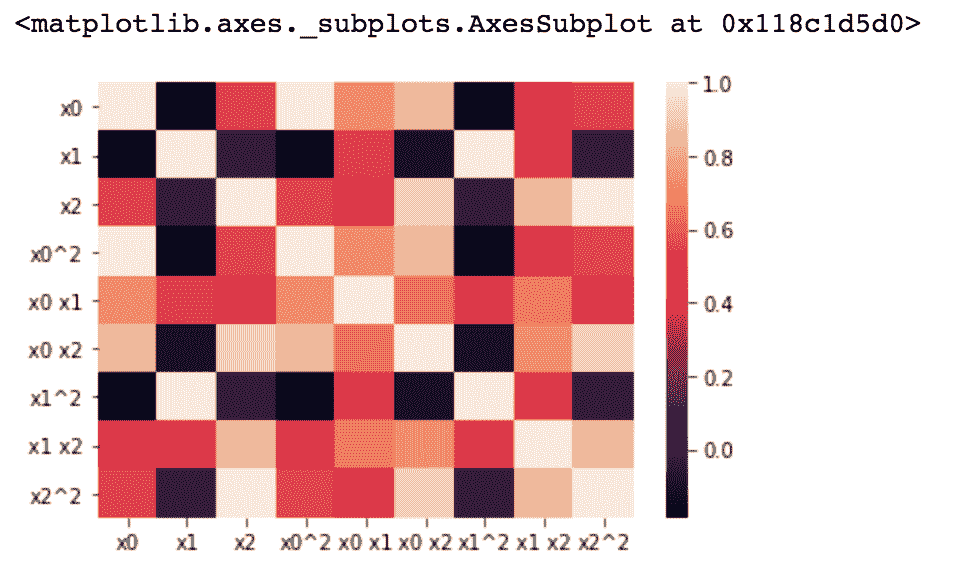
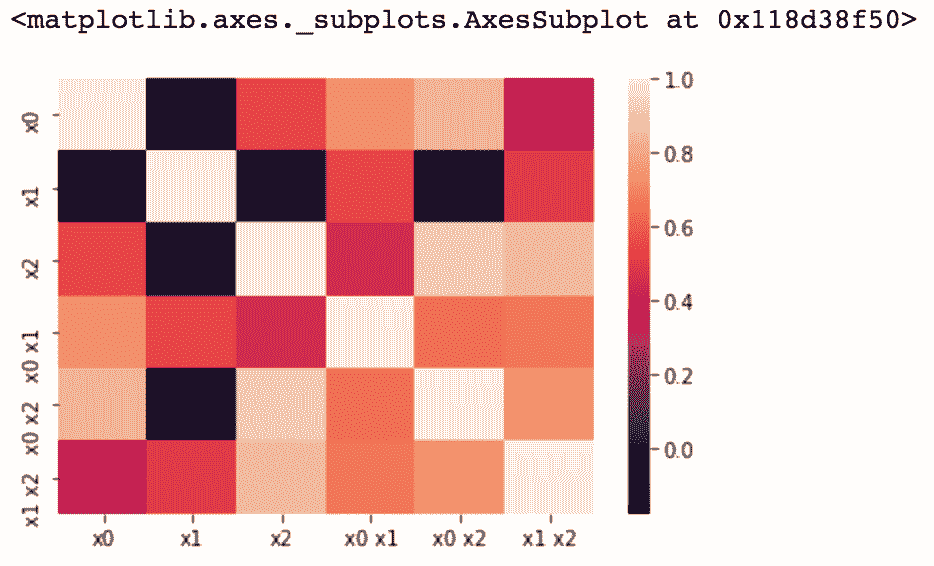

# 第四章：特征构建

在上一章中，我们使用 `Pima Indian Diabetes Prediction` 数据集来更好地了解我们数据集中哪些给定的特征最有价值。使用我们可用的特征，我们识别了列中的缺失值，并采用了删除缺失值、填充以及归一化/标准化数据的技术，以提高我们机器学习模型的准确性。

需要注意的是，到目前为止，我们只处理了定量特征。现在，我们将转向处理除了具有缺失值的定量数据之外，还要处理分类数据。我们的主要焦点将是使用给定的特征来构建模型可以从中学习的新特征。

我们可以利用各种方法来构建我们的特征，最基本的方法是从 Python 中的 pandas 库开始，通过乘数来缩放现有特征。我们将深入研究一些更数学密集的方法，并使用通过 scikit-learn 库提供的各种包；我们还将创建自己的自定义类。随着我们进入代码，我们将详细介绍这些类。

我们将在我们的讨论中涵盖以下主题：

+   检查我们的数据集

+   填充分类特征

+   编码分类变量

+   扩展数值特征

+   文本特定特征构建

# 检查我们的数据集

为了演示目的，在本章中，我们将使用我们创建的数据集，这样我们就可以展示各种数据级别和类型。让我们设置我们的 DataFrame 并深入了解我们的数据。

我们将使用 pandas 创建我们将要工作的 DataFrame，因为这是 pandas 中的主要数据结构。pandas DataFrame 的优势在于，我们有几个属性和方法可用于对数据进行操作。这使我们能够逻辑地操作数据，以全面了解我们正在处理的内容，以及如何最好地构建我们的机器学习模型：

1.  首先，让我们导入 `pandas`：

```py
# import pandas as pd
```

1.  现在，我们可以设置我们的 `DataFrame X`。为此，我们将利用 pandas 中的 `DataFrame` 方法，该方法创建一个表格数据结构（具有行和列的表格）。此方法可以接受几种类型的数据（例如 NumPy 数组或字典）。在这里，我们将传递一个字典，其键为列标题，值为列表，每个列表代表一列：

```py
X = pd.DataFrame({'city':['tokyo', None, 'london', 'seattle', 'san francisco', 'tokyo'], 
                  'boolean':['yes', 'no', None, 'no', 'no', 'yes'], 
                  'ordinal_column':['somewhat like', 'like', 'somewhat like', 'like', 'somewhat like', 'dislike'], 
                  'quantitative_column':[1, 11, -.5, 10, None, 20]})
```

1.  这将给我们一个具有四列和六行的 DataFrame。让我们打印我们的 DataFrame `X` 并查看数据：

```py
print X
```

我们得到以下输出：

|  | **布尔值** | **城市** | **有序列** | **定量列** |
| --- | --- | --- | --- | --- |
| **0** | 是 | 东京 | 有点像 | 1.0 |
| **1** | 否 | 无 | 喜欢的 | 11.0 |
| **2** | 无 | 伦敦 | 有点像 | -0.5 |
| **3** | 否 | 西雅图 | 喜欢的 | 10.0 |
| **4** | 否 | 旧金山 | 有点像 | NaN |
| **5** | 是 | 东京 | 不喜欢的 | 20.0 |

让我们看一下我们的列，并确定我们的数据级别和类型：

+   `布尔`：这个列由二元分类数据（是/否）表示，处于名称级别

+   `城市`：这个列由分类数据表示，也处于名称级别

+   `序号列`：正如你可能从列名猜到的，这个列由序数数据表示，处于序数级别

+   `定量列`：这个列由整数在比例级别表示

# 填充分类特征

现在我们已经了解了我们正在处理的数据，让我们看看我们的缺失值：

+   为了做到这一点，我们可以使用 pandas 为我们提供的`isnull`方法。此方法返回一个与值大小相同的`boolean`对象，指示值是否为空。

+   然后，我们将`sum`这些值以查看哪些列有缺失数据：

```py
X.isnull().sum()
>>>>
boolean                1
city                   1
ordinal_column         0
quantitative_column    1
dtype: int64
```

在这里，我们可以看到我们有三列数据缺失。我们的行动方案将是填充这些缺失值。

如果你还记得，我们在上一章中实现了 scikit-learn 的`Imputer`类来填充数值数据。`Imputer`确实有一个分类选项，`most_frequent`，然而它只适用于已经被编码为整数的分类数据。

我们可能并不总是想以这种方式转换我们的分类数据，因为它可能会改变我们解释分类信息的方式，因此我们将构建自己的转换器。在这里，我们所说的转换器是指一种方法，通过这种方法，列将填充缺失值。

事实上，在本章中，我们将构建几个自定义转换器，因为它们对于对我们的数据进行转换非常有用，并为我们提供了在 pandas 或 scikit-learn 中不可轻易获得的选择。

让我们从我们的分类列`城市`开始。正如我们用均值填充缺失行来填充数值数据，我们也有一个类似的方法用于分类数据。为了填充分类数据的值，用最常见的类别填充缺失行。

要这样做，我们需要找出`城市`列中最常见的类别：

注意，我们需要指定我们正在处理的列来应用一个名为`value_counts`的方法。这将返回一个按降序排列的对象，因此第一个元素是最频繁出现的元素。

我们将只获取对象中的第一个元素：

```py
# Let's find out what our most common category is in our city column
X['city'].value_counts().index[0]

>>>>
'tokyo'
```

我们可以看到`东京`似乎是最常见的城市。现在我们知道要使用哪个值来填充我们的缺失行，让我们填充这些空位。有一个`fillna`函数允许我们指定我们想要如何填充缺失值：

```py
# fill empty slots with most common category
X['city'].fillna(X['city'].value_counts().index[0])

```

`城市`列现在看起来是这样的：

```py
0            tokyo
1            tokyo
2           london
3          seattle
4    san francisco
5            tokyo
Name: city, dtype: object
```

太好了，现在我们的`城市`列不再有缺失值。然而，我们的其他分类列`布尔`仍然有。与其重复同样的方法，让我们构建一个能够处理所有分类数据填充的自定义填充器。

# 自定义填充器

在我们深入代码之前，让我们快速回顾一下管道：

+   管道允许我们按顺序应用一系列转换和一个最终估计器

+   管道的中间步骤必须是 **转换器**，这意味着它们必须实现 `fit` 和 `transform` 方法

+   最终估计器只需要实现 `fit`

管道的目的是组装几个可以一起交叉验证的步骤，同时设置不同的参数。一旦我们为需要填充的每一列构建了自定义的转换器，我们将它们全部通过管道传递，以便我们的数据可以一次性进行转换。让我们从构建自定义类别填充器开始。

# 自定义类别填充器

首先，我们将利用 scikit-learn 的 `TransformerMixin` 基类来创建我们自己的自定义类别填充器。这个转换器（以及本章中的所有其他自定义转换器）将作为一个具有 `fit` 和 `transform` 方法的管道元素工作。

以下代码块将在本章中变得非常熟悉，因此我们将逐行详细讲解：

```py
from sklearn.base import TransformerMixin

class CustomCategoryImputer(TransformerMixin):
    def __init__(self, cols=None):
        self.cols = cols

    def transform(self, df):
        X = df.copy()
        for col in self.cols:
            X[col].fillna(X[col].value_counts().index[0], inplace=True)
        return X

    def fit(self, *_):
        return self
```

这个代码块中发生了很多事情，所以让我们逐行分解：

1.  首先，我们有一个新的 `import` 语句：

```py
from sklearn.base import TransformerMixin
```

1.  我们将从 scikit-learn 继承 `TransformerMixin` 类，它包括一个 `.fit_transform` 方法，该方法调用我们将创建的 `.fit` 和 `.transform` 方法。这允许我们在转换器中保持与 scikit-learn 相似的结构。让我们初始化我们的自定义类：

```py
class CustomCategoryImputer(TransformerMixin):
    def __init__(self, cols=None):
        self.cols = cols
```

1.  我们已经实例化了我们的自定义类，并有了我们的 `__init__` 方法，该方法初始化我们的属性。在我们的情况下，我们只需要初始化一个实例属性 `self.cols`（它将是我们指定的参数中的列）。现在，我们可以构建我们的 `fit` 和 `transform` 方法：

```py
def transform(self, df):
        X = df.copy()
        for col in self.cols:
            X[col].fillna(X[col].value_counts().index[0], inplace=True)
        return X
```

1.  在这里，我们有我们的 `transform` 方法。它接受一个 DataFrame，第一步是复制并重命名 DataFrame 为 `X`。然后，我们将遍历我们在 `cols` 参数中指定的列来填充缺失的槽位。`fillna` 部分可能感觉熟悉，因为我们已经在第一个例子中使用了这个函数。我们正在使用相同的函数，并设置它，以便我们的自定义类别填充器可以一次跨多个列工作。在填充了缺失值之后，我们返回填充后的 DataFrame。接下来是我们的 `fit` 方法：

```py
def fit(self, *_):
        return self
```

我们已经设置了我们的 `fit` 方法简单地 `return self`，这是 scikit-learn 中 `.fit` 方法的标准。

1.  现在我们有一个自定义方法，允许我们填充我们的类别数据！让我们通过我们的两个类别列 `city` 和 `boolean` 来看看它的实际效果：

```py
# Implement our custom categorical imputer on our categorical columns.

cci = CustomCategoryImputer(cols=['city', 'boolean'])

```

1.  我们已经初始化了我们的自定义类别填充器，现在我们需要将这个填充器 `fit_transform` 到我们的数据集中：

```py
cci.fit_transform(X)
```

我们的数据集现在看起来像这样：

|  | **boolean** | **city** | **ordinal_column** | **quantitative_column** |
| --- | --- | --- | --- | --- |
| **0** | yes | tokyo | somewhat like | 1.0 |
| **1** | no | tokyo | like | 11.0 |
| **2** | no | london | somewhat like | -0.5 |
| **3** | no | seattle | like | 10.0 |
| **4** | no | san francisco | somewhat like | NaN |
| **5** | yes | tokyo | dislike | 20.0 |

太好了！我们的`city`和`boolean`列不再有缺失值。然而，我们的定量列仍然有 null 值。由于默认的填充器不能选择列，让我们再做一个自定义的。

# 自定义定量填充器

我们将使用与我们的自定义分类填充器相同的结构。这里的主要区别是我们将利用 scikit-learn 的`Imputer`类来实际上在我们的列上执行转换：

```py
# Lets make an imputer that can apply a strategy to select columns by name

from sklearn.preprocessing import Imputer
class CustomQuantitativeImputer(TransformerMixin):
    def __init__(self, cols=None, strategy='mean'):
        self.cols = cols
        self.strategy = strategy

    def transform(self, df):
        X = df.copy()
        impute = Imputer(strategy=self.strategy)
        for col in self.cols:
            X[col] = impute.fit_transform(X[[col]])
        return X

    def fit(self, *_):
        return self
```

对于我们的`CustomQuantitativeImputer`，我们增加了一个`strategy`参数，这将允许我们指定我们想要如何为我们的定量数据填充缺失值。在这里，我们选择了`mean`来替换缺失值，并且仍然使用`transform`和`fit`方法。

再次，为了填充我们的数据，我们将调用`fit_transform`方法，这次指定了列和用于填充的`strategy`：

```py
cqi = CustomQuantitativeImputer(cols=['quantitative_column'], strategy='mean')

cqi.fit_transform(X)
```

或者，而不是分别调用和`fit_transform`我们的`CustomCategoryImputer`和`CustomQuantitativeImputer`，我们也可以将它们设置在一个 pipeline 中，这样我们就可以一次性转换我们的 dataset。让我们看看如何：

1.  从我们的`import`语句开始：

```py
# import Pipeline from sklearn
from sklearn.pipeline import Pipeline
```

1.  现在，我们可以传递我们的自定义填充器：

```py
imputer = Pipeline([('quant', cqi), ('category', cci)]) imputer.fit_transform(X)
```

让我们看看我们的 dataset 在 pipeline 转换后看起来像什么：

|  | **boolean** | **city** | **ordinal_column** | **quantitative_column** |
| --- | --- | --- | --- | --- |
| **0** | yes | tokyo | somewhat like | 1.0 |
| **1** | no | tokyo | like | 11.0 |
| **2** | no | london | somewhat like | -0.5 |
| **3** | no | seattle | like | 10.0 |
| **4** | no | san francisco | somewhat like | 8.3 |
| **5** | yes | tokyo | dislike | 20.0 |

现在我们有一个没有缺失值的 dataset 可以工作了！

# 编码分类变量

回顾一下，到目前为止，我们已经成功填充了我们的 dataset——包括我们的分类和定量列。在这个时候，你可能想知道，*我们如何利用分类数据与机器学习算法结合使用？*

简而言之，我们需要将这个分类数据转换为数值数据。到目前为止，我们已经确保使用最常见的类别来填充缺失值。现在这件事已经完成，我们需要更进一步。

任何机器学习算法，无论是线性回归还是使用欧几里得距离的 KNN，都需要数值输入特征来学习。我们可以依赖几种方法将我们的分类数据转换为数值数据。

# 名义级别的编码

让我们从名义级别的数据开始。我们主要的方法是将我们的分类数据转换为虚拟变量。我们有两种方法来做这件事：

+   利用 pandas 自动找到分类变量并将它们转换为虚拟变量

+   使用虚拟变量创建我们自己的自定义转换器以在 pipeline 中工作

在我们深入探讨这些选项之前，让我们先了解一下虚拟变量究竟是什么。

虚拟变量取值为零或一，以表示类别的缺失或存在。它们是代理变量，或数值替代变量，用于定性数据。

考虑一个简单的回归分析来确定工资。比如说，我们被给出了性别，这是一个定性变量，以及教育年限，这是一个定量变量。为了看看性别是否对工资有影响，我们会在女性时将虚拟编码为女性 = 1，在男性时将女性编码为 0。

在使用虚拟变量时，重要的是要意识到并避免虚拟变量陷阱。虚拟变量陷阱是指你拥有独立的变量是多线性的，或者高度相关的。简单来说，这些变量可以从彼此预测。所以，在我们的性别例子中，虚拟变量陷阱就是如果我们同时包含女性作为（0|1）和男性作为（0|1），实际上创建了一个重复的分类。可以推断出 0 个女性值表示男性。

为了避免虚拟变量陷阱，只需省略常数项或其中一个虚拟类别。省略的虚拟变量可以成为与其他变量比较的基础类别。

让我们回到我们的数据集，并采用一些方法将我们的分类数据编码为虚拟变量。pandas 有一个方便的`get_dummies`方法，实际上它会找到所有的分类变量，并为我们进行虚拟编码：

```py
pd.get_dummies(X, 
               columns = ['city', 'boolean'],  # which columns to dummify
               prefix_sep='__')  # the separator between the prefix (column name) and cell value

```

我们必须确保指定我们想要应用到的列，因为它也会对序数列进行虚拟编码，这不会很有意义。我们将在稍后更深入地探讨为什么对序数数据进行虚拟编码没有意义。

我们的数据，加上我们的虚拟编码列，现在看起来是这样的：

|  | **ordinal_column** | **quantitative_column** | **city__london** | **city_san francisco** | **city_seattle** | **city_tokyo** | **boolean_no** | **boolean_yes** |
| --- | --- | --- | --- | --- | --- | --- | --- | --- |
| **0** | somewhat like | 1.0 | 0 | 0 | 0 | 1 | 0 | 1 |
| **1** | like | 11.0 | 0 | 0 | 0 | 0 | 1 | 0 |
| **2** | somewhat like | -0.5 | 1 | 0 | 0 | 0 | 0 | 0 |
| **3** | like | 10.0 | 0 | 0 | 1 | 0 | 1 | 0 |
| **4** | somewhat like | NaN | 0 | 1 | 0 | 0 | 1 | 0 |
| **5** | dislike | 20.0 | 0 | 0 | 0 | 1 | 0 | 1 |

我们对数据进行虚拟编码的另一种选择是创建自己的自定义虚拟化器。创建这个虚拟化器允许我们设置一个管道，一次将整个数据集转换。

再次强调，我们将使用与之前两个自定义填充器相同的结构。在这里，我们的`transform`方法将使用方便的 pandas `get_dummies`方法为指定的列创建虚拟变量。在这个自定义虚拟化器中，我们唯一的参数是`cols`：

```py
# create our custom dummifier
class CustomDummifier(TransformerMixin):
    def __init__(self, cols=None):
        self.cols = cols

    def transform(self, X):
        return pd.get_dummies(X, columns=self.cols)

    def fit(self, *_):
        return self

```

我们的定制虚拟化器模仿 scikit-learn 的`OneHotEncoding`，但具有在完整 DataFrame 上工作的附加优势。

# 对序数级别的编码

现在，让我们看看我们的有序列。这里仍然有一些有用的信息，然而，我们需要将字符串转换为数值数据。在有序级别，由于数据具有特定的顺序，因此使用虚拟变量是没有意义的。为了保持顺序，我们将使用标签编码器。

通过标签编码器，我们指的是在我们的有序数据中，每个标签都将与一个数值相关联。在我们的例子中，这意味着有序列值（`dislike`、`somewhat like`和`like`）将被表示为`0`、`1`和`2`。

以最简单的方式，代码如下所示：

```py
# set up a list with our ordinal data corresponding the list index
ordering = ['dislike', 'somewhat like', 'like']  # 0 for dislike, 1 for somewhat like, and 2 for like
# before we map our ordering to our ordinal column, let's take a look at the column

print X['ordinal_column']
>>>>
0 somewhat like 
1 like 
2 somewhat like 
3 like 
4 somewhat like 
5 dislike 
Name: ordinal_column, dtype: object
```

在这里，我们设置了一个列表来排序我们的标签。这是关键，因为我们将利用列表的索引来将标签转换为数值数据。

在这里，我们将在我们的列上实现一个名为`map`的函数，它允许我们指定我们想要在列上实现的函数。我们使用一个称为`lambda`的结构来指定这个函数，它本质上允许我们创建一个匿名函数，或者一个没有绑定到名称的函数：

```py
lambda x: ordering.index(x)
```

这段特定的代码创建了一个函数，该函数将我们的列表`ordering`的索引应用于每个元素。现在，我们将此映射到我们的有序列：

```py
# now map our ordering to our ordinal column:
print X['ordinal_column'].map(lambda x: ordering.index(x))
>>>>
0    1
1    2
2    1
3    2
4    1
5    0
Name: ordinal_column, dtype: int64
```

我们的有序列现在被表示为标记数据。

注意，scikit-learn 有一个`LabelEncoder`，但我们没有使用这种方法，因为它不包括排序类别的能力（`0`表示不喜欢，`1`表示有点喜欢，`2`表示喜欢），正如我们之前所做的那样。相反，默认是排序方法，这不是我们在这里想要使用的。

再次，让我们创建一个自定义标签编码器，使其适合我们的管道：

```py
class CustomEncoder(TransformerMixin):
    def __init__(self, col, ordering=None):
        self.ordering = ordering
        self.col = col

    def transform(self, df):
        X = df.copy()
        X[self.col] = X[self.col].map(lambda x: self.ordering.index(x))
        return X

    def fit(self, *_):
        return self
```

我们在本章中维护了其他自定义转换器的结构。在这里，我们使用了前面详细说明的`map`和`lambda`函数来转换指定的列。注意关键参数`ordering`，它将确定标签将编码成哪些数值。

让我们称我们的自定义编码器为：

```py
ce = CustomEncoder(col='ordinal_column', ordering = ['dislike', 'somewhat like', 'like'])

ce.fit_transform(X)
```

经过这些转换后，我们的数据集看起来如下所示：

|  | **布尔值** | **城市** | **有序列** | **数量列** |
| --- | --- | --- | --- | --- |
| **0** | yes | tokyo | 1 | 1.0 |
| **1** | no | None | 2 | 11.0 |
| **2** | None | london | 1 | -0.5 |
| **3** | no | seattle | 2 | 10.0 |
| **4** | no | san francisco | 1 | NaN |
| **5** | yes | tokyo | 0 | 20.0 |

我们的有序列现在被标记。

到目前为止，我们已经相应地转换了以下列：

+   `布尔值`、`城市`: 虚拟编码

+   `有序列`: 标签编码

# 将连续特征分桶到类别中

有时，当你有连续数值数据时，将连续变量转换为分类变量可能是有意义的。例如，假设你有年龄，但使用年龄范围可能更有用。

pandas 有一个有用的函数`cut`，可以为你对数据进行分箱。通过分箱，我们指的是它将为你的数据创建范围。

让我们看看这个函数如何在我们的`quantitative_column`上工作：

```py
# name of category is the bin by default
pd.cut(X['quantitative_column'], bins=3)
```

`cut`函数对我们定量列的输出看起来是这样的：

```py
0     (-0.52, 6.333]
1    (6.333, 13.167]
2     (-0.52, 6.333]
3    (6.333, 13.167]
4                NaN
5     (13.167, 20.0]
Name: quantitative_column, dtype: category
Categories (3, interval[float64]): [(-0.52, 6.333] < (6.333, 13.167] < (13.167, 20.0]]
```

当我们指定`bins`为整数（`bins = 3`）时，它定义了`X`范围内的等宽`bins`的数量。然而，在这种情况下，`X`的范围在每边扩展了 0.1%，以包括`X`的最小值或最大值。

我们也可以将`labels`设置为`False`，这将只返回`bins`的整数指标：

```py
# using no labels
pd.cut(X['quantitative_column'], bins=3, labels=False)
```

这里是我们`quantitative_column`的整数指标看起来是这样的：

```py
0    0.0
1    1.0
2    0.0
3    1.0
4    NaN
5    2.0
Name: quantitative_column, dtype: float64
```

使用`cut`函数查看我们的选项，我们还可以为我们的管道构建自己的`CustomCutter`。再次，我们将模仿我们的转换器的结构。我们的`transform`方法将使用`cut`函数，因此我们需要将`bins`和`labels`作为参数设置：

```py
class CustomCutter(TransformerMixin):
    def __init__(self, col, bins, labels=False):
        self.labels = labels
        self.bins = bins
        self.col = col

    def transform(self, df):
        X = df.copy()
        X[self.col] = pd.cut(X[self.col], bins=self.bins, labels=self.labels)
        return X

    def fit(self, *_):
        return self
```

注意，我们已经将默认的`labels`参数设置为`False`。初始化我们的`CustomCutter`，指定要转换的列和要使用的`bins`数量：

```py
cc = CustomCutter(col='quantitative_column', bins=3)

cc.fit_transform(X)
```

使用我们的`CustomCutter`转换`quantitative_column`，我们的数据现在看起来是这样的：

|  | **boolean** | **city** | **ordinal_column** | **quantitative_column** |
| --- | --- | --- | --- | --- |
| **0** | yes | tokyo | somewhat like | 1.0 |
| **1** | no | None | like | 11.0 |
| **2** | None | london | somewhat like | -0.5 |
| **3** | no | seattle | like | 10.0 |
| **4** | no | san francisco | somewhat like | NaN |
| **5** | yes | tokyo | dislike | 20.0 |

注意，我们的`quantitative_column`现在是序数，因此不需要对数据进行空编码。

# 创建我们的管道

为了回顾，到目前为止，我们已经以以下方式转换了数据集中的列：

+   `boolean, city`: 空编码

+   `ordinal_column`: 标签编码

+   `quantitative_column`: 序数级别数据

由于我们现在已经为所有列设置了转换，让我们将所有内容组合到一个管道中。

从导入我们的`Pipeline`类开始，来自 scikit-learn：

```py
from sklearn.pipeline import Pipeline

```

我们将汇集我们创建的每个自定义转换器。以下是我们在管道中遵循的顺序：

1.  首先，我们将使用`imputer`来填充缺失值

1.  接下来，我们将对分类列进行空编码

1.  然后，我们将对`ordinal_column`进行编码

1.  最后，我们将对`quantitative_column`进行分桶

让我们按照以下方式设置我们的管道：

```py
pipe = Pipeline([("imputer", imputer), ('dummify', cd), ('encode', ce), ('cut', cc)])
# will use our initial imputer
# will dummify variables first
# then encode the ordinal column
# then bucket (bin) the quantitative column
```

为了查看我们使用管道对数据进行完整转换的样子，让我们看看零转换的数据：

```py
# take a look at our data before fitting our pipeline
print X 
```

这是我们数据在开始时，在执行任何转换之前的样子：

|  | **boolean** | **city** | **ordinal_column** | **quantitative_column** |
| --- | --- | --- | --- | --- |
| **0** | yes | tokyo | somewhat like | 1.0 |
| **1** | no | None | like | 11.0 |
| **2** | None | london | somewhat like | -0.5 |
| **3** | no | seattle | like | 10.0 |
| **4** | no | san francisco | somewhat like | NaN |
| **5** | yes | tokyo | dislike | 20.0 |

我们现在可以`fit`我们的管道：

```py
# now fit our pipeline
pipe.fit(X)

>>>>
Pipeline(memory=None,
     steps=[('imputer', Pipeline(memory=None,
     steps=[('quant', <__main__.CustomQuantitativeImputer object at 0x128bf00d0>), ('category', <__main__.CustomCategoryImputer object at 0x13666bf50>)])), ('dummify', <__main__.CustomDummifier object at 0x128bf0ed0>), ('encode', <__main__.CustomEncoder object at 0x127e145d0>), ('cut', <__main__.CustomCutter object at 0x13666bc90>)])
```

我们已经创建了管道对象，让我们转换我们的 DataFrame：

```py
pipe.transform(X)
```

在所有适当的列变换之后，我们的最终数据集看起来是这样的：

|  | **ordinal_column** | **quantitative_column** | **boolean_no** | **boolean_yes** | **city_london** | **city_san francisco** | **city_seattle** | **city_tokyo** |
| --- | --- | --- | --- | --- | --- | --- | --- | --- |
| **0** | 1 | 0 | 0 | 1 | 0 | 0 | 0 | 1 |
| **1** | 2 | 1 | 1 | 0 | 0 | 0 | 0 | 1 |
| **2** | 1 | 0 | 1 | 0 | 1 | 0 | 0 | 0 |
| **3** | 2 | 1 | 1 | 0 | 0 | 0 | 1 | 0 |
| **4** | 1 | 1 | 1 | 0 | 0 | 1 | 0 | 0 |
| **5** | 0 | 2 | 0 | 1 | 0 | 0 | 0 | 1 |

# 扩展数值特征

数值特征可以通过各种方法进行扩展，从而创建出更丰富的特征。之前，我们看到了如何将连续数值数据转换为有序数据。现在，我们将进一步扩展我们的数值特征。

在我们深入探讨这些方法之前，我们将引入一个新的数据集进行操作。

# 从单个胸挂加速度计数据集进行活动识别

这个数据集收集了十五名参与者进行七种活动的可穿戴加速度计上的数据。加速度计的采样频率为 52 Hz，加速度计数据未经校准。

数据集按参与者分隔，包含以下内容：

+   顺序号

+   x 加速度

+   y 加速度

+   z 加速度

+   标签

标签用数字编码，代表一个活动，如下所示：

+   在电脑上工作

+   站立、行走和上/下楼梯

+   站立

+   行走

+   上/下楼梯

+   与人边走边谈

+   站立时说话

更多关于这个数据集的信息可以在 UCI *机器学习仓库*上找到：

[`archive.ics.uci.edu/ml/datasets/Activity+Recognition+from+Single+Chest-Mounted+Accelerometer`](https://archive.ics.uci.edu/ml/datasets/Activity+Recognition+from+Single+Chest-Mounted+Accelerometer)

让我们来看看我们的数据。首先，我们需要加载我们的 CSV 文件并设置列标题：

```py
df = pd.read_csv('../data/activity_recognizer/1.csv', header=None)
df.columns = ['index', 'x', 'y', 'z', 'activity']
```

现在，让我们使用`.head`方法检查前几行，默认为前五行，除非我们指定要显示的行数：

```py
df.head()
```

这表明：

|  | **index** | **x** | **y** | **z** | **activity** |
| --- | --- | --- | --- | --- | --- |
| **0** | 0.0 | 1502 | 2215 | 2153 | 1 |
| **1** | 1.0 | 1667 | 2072 | 2047 | 1 |
| **2** | 2.0 | 1611 | 1957 | 1906 | 1 |
| **3** | 3.0 | 1601 | 1939 | 1831 | 1 |
| **4** | 4.0 | 1643 | 1965 | 1879 | 1 |

这个数据集旨在训练模型，根据智能手机等设备上的加速度计的`x`、`y`和`z`位置来识别用户的当前身体活动。根据网站信息，`activity`列的选项如下：

+   **1**: 在电脑上工作

+   **2**: 站立并上/下楼梯

+   **3**: 站立

+   **4**: 走路

+   **5**: 上/下楼梯

+   **6**: 与人边走边谈

+   **7**: 站立时说话

`activity`列将是我们将尝试预测的目标变量，使用其他列。让我们确定我们的机器学习模型中要击败的零准确率。为此，我们将调用`value_counts`方法，并将`normalize`选项设置为`True`，以给出最常见的活动作为百分比：

```py
df['activity'].value_counts(normalize=True)

7    0.515369
1    0.207242
4    0.165291
3    0.068793
5    0.019637
6    0.017951
2    0.005711
0    0.000006
Name: activity, dtype: float64
```

要击败的零准确率是 51.53%，这意味着如果我们猜测七个（站立时说话），那么我们正确的时间会超过一半。现在，让我们来进行一些机器学习！让我们逐行进行，设置我们的模型。

首先，我们有我们的`import`语句：

```py
from sklearn.neighbors import KNeighborsClassifier
from sklearn.model_selection import GridSearchCV
```

你可能对上一章中的这些导入语句很熟悉。再一次，我们将利用 scikit-learn 的**K-Nearest Neighbors**（**KNN**）分类模型。我们还将使用网格搜索模块，该模块自动找到最适合我们数据的 KNN 模型的最佳参数组合。接下来，我们为我们的预测模型创建一个特征矩阵（`X`）和一个响应变量（`y`）：

```py
X = df[['x', 'y', 'z']]
# create our feature matrix by removing the response variable
y = df['activity']
```

一旦我们的`X`和`y`设置好，我们就可以引入我们成功运行网格搜索所需的变量和实例：

```py
# our grid search variables and instances

# KNN parameters to try
knn_params = {'n_neighbors':[3, 4, 5, 6]}
```

接下来，我们将实例化一个 KNN 模型和一个网格搜索模块，并将其拟合到我们的特征矩阵和响应变量：

```py
knn = KNeighborsClassifier()
grid = GridSearchCV(knn, knn_params)
grid.fit(X, y)
```

现在，我们可以`print`出最佳的准确率和用于学习的参数：

```py
print grid.best_score_, grid.best_params_

0.720752487677 {'n_neighbors': 5}
```

使用五个邻居作为其参数，我们的 KNN 模型能够达到 72.07%的准确率，比我们大约 51.53%的零准确率要好得多！也许我们可以利用另一种方法将我们的准确率进一步提高。

# 多项式特征

处理数值数据并创建更多特征的关键方法是通过 scikit-learn 的`PolynomialFeatures`类。在其最简单的形式中，这个构造函数将创建新的列，这些列是现有列的乘积，以捕捉特征交互。

更具体地说，这个类将生成一个新的特征矩阵，包含所有小于或等于指定度的特征的多项式组合。这意味着，如果你的输入样本是二维的，如下所示：[a, b]，那么二次多项式特征如下：[1, a, b, a², ab, b²]。

# 参数

在实例化多项式特征时，有三个参数需要考虑：

+   degree

+   `interaction_only`

+   `include_bias`

度数对应于多项式特征的度数，默认设置为二。

`interaction_only`是一个布尔值，当为 true 时，只产生交互特征，这意味着是不同度数特征的乘积。`interaction_only`的默认值是 false。

`include_bias`也是一个布尔值，当为 true（默认）时，包括一个`bias`列，即所有多项式幂为零的特征，添加一列全为 1。

让我们先导入类并使用我们的参数实例化，来设置一个多项式特征实例。首先，让我们看看当将 `interaction_only` 设置为 `False` 时我们得到哪些特征：

```py
from sklearn.preprocessing import PolynomialFeatures

poly = PolynomialFeatures(degree=2, include_bias=False, interaction_only=False)
```

现在，我们可以将这些多项式特征 `fit_transform` 到我们的数据集中，并查看扩展数据集的 `shape`：

```py
X_poly = poly.fit_transform(X)
X_poly.shape

(162501, 9)
```

我们的数据集现在扩展到了 `162501` 行和 `9` 列。

让我们把数据放入一个 DataFrame 中，设置列标题为 `feature_names`，并查看前几行：

```py
pd.DataFrame(X_poly, columns=poly.get_feature_names()).head()
```

这显示给我们：

|  | **x0** | **x1** | **x2** | **x0²** | **x0 x1** | **x0 x2** | **x1²** | **x1 x2** | **x2²** |
| --- | --- | --- | --- | --- | --- | --- | --- | --- | --- |
| **0** | 1502.0 | 2215.0 | 2153.0 | 2256004.0 | 3326930.0 | 3233806.0 | 4906225.0 | 4768895.0 | 4635409.0 |
| **1** | 1667.0 | 2072.0 | 2047.0 | 2778889.0 | 3454024.0 | 3412349.0 | 4293184.0 | 4241384.0 | 4190209.0 |
| **2** | 1611.0 | 1957.0 | 1906.0 | 2595321.0 | 3152727.0 | 3070566.0 | 3829849.0 | 3730042.0 | 3632836.0 |
| **3** | 1601.0 | 1939.0 | 1831.0 | 2563201.0 | 3104339.0 | 2931431.0 | 3759721.0 | 3550309.0 | 3352561.0 |
| **4** | 1643.0 | 1965.0 | 1879.0 | 2699449.0 | 3228495.0 | 3087197.0 | 3861225.0 | 3692235.0 | 3530641.0 |

# 探索性数据分析

现在我们可以进行一些探索性数据分析。由于多项式特征的目的是在原始数据中获得更好的特征交互感，最佳的可视化方式是通过相关性 `heatmap`。

我们需要导入一个数据可视化工具，以便我们可以创建 `heatmap`：

```py
%matplotlib inline
import seaborn as sns
```

Matplotlib 和 Seaborn 是流行的数据可视化工具。我们现在可以如下可视化我们的相关性 `heatmap`：

```py
sns.heatmap(pd.DataFrame(X_poly, columns=poly.get_feature_names()).corr())
```

`.corr` 是一个我们可以调用我们的 DataFrame 的函数，它给我们一个特征的相关矩阵。让我们看一下我们的特征交互：



热图上的颜色基于纯数值；颜色越深，特征的相关性越大。

到目前为止，我们已经查看了我们设置 `interaction_only` 参数为 `False` 时的多项式特征。让我们将其设置为 `True` 并看看没有重复变量时我们的特征看起来如何。

我们将按照之前的方式设置这个多项式特征实例。注意唯一的区别是 `interaction_only` 现在是 `True`：

```py
poly = PolynomialFeatures(degree=2, include_bias=False, interaction_only=True) X_poly = poly.fit_transform(X) print X_poly.shape
 (162501, 6)
```

我们现在有 `162501` 行和 `6` 列。让我们看一下：

```py
pd.DataFrame(X_poly, columns=poly.get_feature_names()).head()
```

DataFrame 现在看起来如下：

|  | **x0** | **x1** | **x2** | **x0 x1** | **x0 x2** | **x1 x2** |
| --- | --- | --- | --- | --- | --- | --- |
| **0** | 1502.0 | 2215.0 | 2153.0 | 3326930.0 | 3233806.0 | 4768895.0 |
| **1** | 1667.0 | 2072.0 | 2047.0 | 3454024.0 | 3412349.0 | 4241384.0 |
| **2** | 1611.0 | 1957.0 | 1906.0 | 3152727.0 | 3070566.0 | 3730042.0 |
| **3** | 1601.0 | 1939.0 | 1831.0 | 3104339.0 | 2931431.0 | 3550309.0 |
| **4** | 1643.0 | 1965.0 | 1879.0 | 3228495.0 | 3087197.0 | 3692235.0 |

由于这次`interaction_only`被设置为`True`，因此`x0²`、`x1²`和`x2²`消失了，因为它们是重复变量。现在让我们看看我们的相关矩阵现在是什么样子：

```py
sns.heatmap(pd.DataFrame(X_poly,
columns=poly.get_feature_names()).corr())
```

我们得到了以下结果：



我们能够看到特征是如何相互作用的。我们还可以使用新的多项式特征对 KNN 模型进行网格搜索，这些特征也可以在管道中进行网格搜索：

1.  让我们先设置管道参数：

```py
pipe_params = {'poly_features__degree':[1, 2, 3], 'poly_features__interaction_only':[True, False], 'classify__n_neighbors':[3, 4, 5, 6]}
```

1.  现在，实例化我们的`Pipeline`：

```py
pipe = Pipeline([('poly_features', poly), ('classify', knn)])
```

1.  从这里，我们可以设置我们的网格搜索并打印出最佳得分和参数以供学习：

```py
grid = GridSearchCV(pipe, pipe_params)
grid.fit(X, y)

print grid.best_score_, grid.best_params_

0.721189408065 {'poly_features__degree': 2, 'poly_features__interaction_only': True, 'classify__n_neighbors': 5}
```

我们现在的准确率是 72.12%，这比我们使用多项式特征扩展特征时的准确率有所提高！

# 文本特定特征构建

到目前为止，我们一直在处理分类数据和数值数据。虽然我们的分类数据以字符串的形式出现，但文本一直是单一类别的一部分。现在我们将更深入地研究更长的文本数据。这种文本数据的形式比单一类别的文本数据要复杂得多，因为我们现在有一系列类别，或称为标记。

在我们进一步深入处理文本数据之前，让我们确保我们清楚当我们提到文本数据时我们指的是什么。考虑一个像 Yelp 这样的服务，用户会撰写关于餐厅和企业的评论来分享他们的体验。这些评论，都是以文本格式编写的，包含大量对机器学习有用的信息，例如，在预测最佳餐厅访问方面。

在当今世界，我们的大部分沟通都是通过书面文字进行的，无论是在消息服务、社交媒体还是电子邮件中。因此，通过建模可以从这些信息中获得很多。例如，我们可以从 Twitter 数据中执行情感分析。

这种类型的工作可以被称为**自然语言处理**（**NLP**）。这是一个主要关注计算机与人类之间交互的领域，特别是计算机可以被编程来处理自然语言。

现在，正如我们之前提到的，需要注意的是，所有机器学习模型都需要数值输入，因此当我们处理文本并将此类数据转换为数值特征时，我们必须富有创意并战略性地思考。有几种方法可以实现这一点，让我们开始吧。

# 词袋表示

scikit-learn 有一个方便的模块叫做`feature_extraction`，它允许我们，正如其名所示，从机器学习算法支持的格式中提取文本等数据的特征。这个模块为我们提供了在处理文本时可以利用的方法。

展望未来，我们可能会将我们的文本数据称为语料库，具体来说，是指文本内容或文档的集合。

将语料库转换为数值表示的一种最常见方法，称为向量化，是通过一种称为**词袋模型**的方法实现的。词袋模型背后的基本思想是，文档由单词出现来描述，而完全忽略单词在文档中的位置。在其最简单形式中，文本被表示为一个**袋**，不考虑语法或单词顺序，并作为一个集合维护，给予多重性以重要性。词袋模型表示通过以下三个步骤实现：

+   分词

+   计数

+   正则化

让我们从分词开始。这个过程使用空白和标点符号将单词分开，将它们转换为标记。每个可能的标记都被赋予一个整数 ID。

接下来是计数。这一步只是简单地计算文档中标记的出现次数。

最后是正则化，这意味着当标记在大多数文档中出现时，它们的权重会随着重要性的降低而降低。

让我们考虑更多用于向量化的方法。

# CountVectorizer

`CountVectorizer`是将文本数据转换为它们的向量表示的最常用方法。在某种程度上，它与虚拟变量相似，因为`CountVectorizer`将文本列转换为矩阵，其中列是标记，单元格值是每个文档中每个标记的出现次数。得到的矩阵被称为**文档-词矩阵**，因为每一行将代表一个**文档**（在这种情况下，是一条推文），每一列代表一个**术语**（一个单词）。

让我们查看一个新的数据集，看看`CountVectorizer`是如何工作的。Twitter 情感分析数据集包含 1,578,627 条分类推文，每行标记为正情感为 1，负情感为 0。

关于此数据集的更多信息可以在[`thinknook.com/twitter-sentiment-analysis-training-corpus-dataset-2012-09-22/`](http://thinknook.com/twitter-sentiment-analysis-training-corpus-dataset-2012-09-22/)找到。

让我们使用 pandas 的`read_csv`方法加载数据。请注意，我们指定了一个可选的`encoding`参数，以确保我们正确处理推文中的所有特殊字符：

```py
tweets = pd.read_csv('../data/twitter_sentiment.csv', encoding='latin1')
```

这使我们能够以特定格式加载数据，并适当地映射文本字符。

看看数据的前几行：

```py
tweets.head()
```

我们得到以下数据：

|  | **项目 ID** | **情感** | **情感文本** |
| --- | --- | --- | --- |
| **0** | 1 | 0 | 我为我的 APL 朋友感到难过... |
| **1** | 2 | 0 | 我错过了新月天体... |
| **2** | 3 | 1 | omg 它已经 7:30 :O |
| **3** | 4 | 0 | .. Omgaga. Im sooo im gunna CRy. I'... |
| **4** | 5 | 0 | 我觉得我的 bf 在欺骗我!!! ... |

我们只关心`情感`和`情感文本`列，所以现在我们将删除`项目 ID`列：

```py
del tweets['ItemID']
```

我们的数据看起来如下：

|  | **情感** | **情感文本** |
| --- | --- | --- |
| **0** | 0 | 我为我的 APL 朋友感到难过... |
| **1** | 0 | 我错过了新月天体... |
| **2** | 1 | omg its already 7:30 :O |
| **3** | 0 | .. Omgaga. Im sooo im gunna CRy. I'... |
| **4** | 0 | i think mi bf is cheating on me!!! ... |

现在，我们可以导入`CountVectorizer`，更好地理解我们正在处理文本：

```py
from sklearn.feature_extraction.text import CountVectorizer
```

让我们设置我们的`X`和`y`：

```py
X = tweets['SentimentText']
y = tweets['Sentiment']
```

`CountVectorizer`类与迄今为止我们一直在使用的自定义转换器非常相似，并且有一个`fit_transform`函数来处理数据：

```py
vect = CountVectorizer()
_ = vect.fit_transform(X)
print _.shape

(99989, 105849)
```

在我们的`CountVectorizer`转换我们的数据后，我们有 99,989 行和 105,849 列。

`CountVectorizer`有许多不同的参数可以改变构建的特征数量。让我们简要回顾一下这些参数，以更好地了解这些特征是如何创建的。

# CountVectorizer 参数

我们将要讨论的一些参数包括：

+   `stop_words`

+   `min_df`

+   `max_df`

+   `ngram_range`

+   `analyzer`

`stop_words`是`CountVectorizer`中常用的一个参数。你可以向该参数传递字符串`english`，并使用内置的英语停用词列表。你也可以指定一个单词列表。这些单词将被从标记中删除，并且不会出现在你的数据中的特征中。

这里有一个例子：

```py
vect = CountVectorizer(stop_words='english')  # removes a set of english stop words (if, a, the, etc)
_ = vect.fit_transform(X)
print _.shape

(99989, 105545)
```

你可以看到，当没有使用停用词时，特征列从 105,849 减少到 105,545，当设置了英语停用词时。使用停用词的目的是从特征中去除噪声，并移除那些在模型中不会带来太多意义的常用词。

另一个参数称为`min_df`。该参数用于通过忽略低于给定阈值或截止值的文档频率较低的术语来筛选特征数量。

这里是带有`min_df`的我们的`CountVectorizer`实现：

```py
vect = CountVectorizer(min_df=.05)  # only includes words that occur in at least 5% of the corpus documents
# used to skim the number of features
_ = vect.fit_transform(X)
print _.shape

(99989, 31)
```

这是一个用于显著减少创建的特征数量的方法。

同样还有一个参数称为`max_df`：

```py
vect = CountVectorizer(max_df=.8)  # only includes words that occur at most 80% of the documents
# used to "Deduce" stop words
_ = vect.fit_transform(X)
print _.shape

(99989, 105849)
```

这类似于试图了解文档中存在哪些停用词。

接下来，让我们看看`ngram_range`参数。该参数接受一个元组，其中 n 值的范围的下限和上限表示要提取的不同 n-gram 的数量。N-gram 代表短语，所以一个值代表一个标记，然而两个值则代表两个标记一起。正如你可以想象的那样，这将显著扩大我们的特征集：

```py
vect = CountVectorizer(ngram_range=(1, 5))  # also includes phrases up to 5 words
_ = vect.fit_transform(X)
print _.shape  # explodes the number of features

(99989, 3219557)
```

看看，我们现在有 3,219,557 个特征。由于单词集（短语）有时可以传达更多的意义，使用 n-gram 范围对于建模是有用的。

你还可以在`CountVectorizer`中将分析器作为一个参数设置。分析器确定特征应该由单词或字符 n-gram 组成。默认情况下是单词：

```py
vect = CountVectorizer(analyzer='word')  # default analyzer, decides to split into words
_ = vect.fit_transform(X)
print _.shape

(99989, 105849)
```

由于默认情况下是单词，我们的特征列数量与原始数据变化不大。

我们甚至可以创建自己的自定义分析器。从概念上讲，单词是由词根或词干构建的，我们可以构建一个考虑这一点的自定义分析器。

词干提取是一种常见的自然语言处理方法，它允许我们将词汇表简化，或者通过将单词转换为它们的词根来缩小它。有一个名为 NLTK 的自然语言工具包，它有几个包允许我们对文本数据进行操作。其中一个包就是 `stemmer`。

让我们看看它是如何工作的：

1.  首先，导入我们的 `stemmer` 并初始化它：

```py
from nltk.stem.snowball import SnowballStemmer
stemmer = SnowballStemmer('english')
```

1.  现在，让我们看看一些词是如何进行词根提取的：

```py
stemmer.stem('interesting')
u'interest'
```

1.  因此，单词 `interesting` 可以被缩减到其词根。现在我们可以使用这个来创建一个函数，允许我们将单词标记为其词根：

```py
# define a function that accepts text and returns a list of lemmas
def word_tokenize(text, how='lemma'):
    words = text.split(' ')  # tokenize into words
    return [stemmer.stem(word) for word in words]
```

1.  让我们看看我们的函数输出的是什么：

```py
word_tokenize("hello you are very interesting")

[u'hello', u'you', u'are', u'veri', u'interest']
```

1.  我们现在可以将这个标记函数放入我们的分析器参数中：

```py
vect = CountVectorizer(analyzer=word_tokenize)
_ = vect.fit_transform(X)
print _.shape  # fewer features as stemming makes words smaller

(99989, 154397)
```

这给我们带来了更少的功能，这在直观上是有意义的，因为我们的词汇量随着词干提取而减少。

`CountVectorizer` 是一个非常有用的工具，可以帮助我们扩展特征并将文本转换为数值特征。还有一个常见的向量化器我们将要探讨。

# Tf-idf 向量化器

`Tf-idfVectorizer` 可以分解为两个组件。首先，是 *tf* 部分，它代表 **词频**，而 *idf* 部分则意味着 **逆文档频率**。这是一种在信息检索和聚类中应用的词—权重方法。

一个权重被赋予以评估一个词在语料库中的文档中的重要性。让我们更深入地看看每个部分：

+   **tf：词频**：衡量一个词在文档中出现的频率。由于文档的长度可能不同，一个词在较长的文档中可能出现的次数比在较短的文档中多得多。因此，词频通常被除以文档长度，或者文档中的总词数，作为归一化的方式。

+   **idf：逆文档频率**：衡量一个词的重要性。在计算词频时，所有词都被视为同等重要。然而，某些词，如 *is*、*of* 和 *that*，可能出现很多次，但重要性很小。因此，我们需要减少频繁词的权重，同时增加罕见词的权重。

为了再次强调，`TfidfVectorizer` 与 `CountVectorizer` 相同，即它从标记中构建特征，但它更进一步，将计数归一化到语料库中出现的频率。让我们看看这个动作的一个例子。

首先，我们的导入：

```py
from sklearn.feature_extraction.text import TfidfVectorizer
```

为了引用之前的代码，一个普通的 `CountVectorizer` 将输出一个文档-词矩阵：

```py
vect = CountVectorizer()
_ = vect.fit_transform(X)
print _.shape, _[0,:].mean()

(99989, 105849) 6.61319426731e-05
```

我们的 `TfidfVectorizer` 可以设置如下：

```py
vect = TfidfVectorizer()
_ = vect.fit_transform(X)
print _.shape, _[0,:].mean() # same number of rows and columns, different cell values

(99989, 105849) 2.18630609758e-05
```

我们可以看到，这两个向量化器输出相同数量的行和列，但在每个单元格中产生不同的值。这是因为 `TfidfVectorizer` 和 `CountVectorizer` 都用于将文本数据转换为定量数据，但它们填充单元格值的方式不同。

# 在机器学习管道中使用文本

当然，我们的向量器的最终目标是将它们用于使文本数据可被我们的机器学习管道摄取。因为`CountVectorizer`和`TfidfVectorizer`就像我们在本书中使用的任何其他转换器一样，我们将不得不利用 scikit-learn 管道来确保我们的机器学习管道的准确性和诚实性。在我们的例子中，我们将处理大量的列（数以万计），因此我将使用在这种情况下已知更有效的分类器，即朴素贝叶斯模型：

```py
from sklearn.naive_bayes import MultinomialNB # for faster predictions with large number of features...
```

在我们开始构建管道之前，让我们获取响应列的空准确率，该列要么为零（消极），要么为一（积极）：

```py
# get the null accuracy
 y.value_counts(normalize=True)

 1 0.564632 0 0.435368 Name: Sentiment, dtype: float64
```

使准确率超过 56.5%。现在，让我们创建一个包含两个步骤的管道：

+   使用`CountVectorizer`对推文进行特征提取

+   `MultiNomialNB`朴素贝叶斯模型用于区分积极和消极情绪

首先，让我们设置我们的管道参数如下，然后按照以下方式实例化我们的网格搜索：

```py
# set our pipeline parameters
 pipe_params = {'vect__ngram_range':[(1, 1), (1, 2)], 'vect__max_features':[1000, 10000], 'vect__stop_words':[None, 'english']}

 # instantiate our pipeline
 pipe = Pipeline([('vect', CountVectorizer()), ('classify', MultinomialNB())])

 # instantiate our gridsearch object
 grid = GridSearchCV(pipe, pipe_params)
 # fit the gridsearch object
 grid.fit(X, y)

 # get our results
 print grid.best_score_, grid.best_params_

 0.755753132845 {'vect__ngram_range': (1, 2), 'vect__stop_words': None, 'vect__max_features': 10000}
```

我们得到了 75.6%，这很棒！现在，让我们加快速度，并引入`TfidfVectorizer`。而不是使用 tf-idf 重建管道而不是`CountVectorizer`，让我们尝试使用一些不同的东西。scikit-learn 有一个`FeatureUnion`模块，它促进了特征的横向堆叠（并排）。这允许我们在同一个管道中使用多种类型的文本特征提取器。

例如，我们可以在我们的推文中运行一个`featurizer`，它同时运行一个`TfidfVectorizer`和一个`CountVectorizer`，并将它们水平连接（保持行数不变但增加列数）：

```py
from sklearn.pipeline import FeatureUnion
# build a separate featurizer object
featurizer = FeatureUnion([('tfidf_vect', TfidfVectorizer()), ('count_vect', CountVectorizer())])
```

一旦我们构建了`featurizer`，我们就可以用它来查看它如何影响我们数据的形状：

```py
_ = featurizer.fit_transform(X)
 print _.shape # same number of rows , but twice as many columns as either CV or TFIDF

 (99989, 211698)
```

我们可以看到，将两个特征提取器合并会导致具有相同行数的数据集，但将`CountVectorizer`或`TfidfVectorizer`的数量翻倍。这是因为结果数据集实际上是两个数据集并排放置。这样，我们的机器学习模型可以同时从这两组数据中学习。让我们稍微改变一下`featurizer`对象的`params`，看看它会产生什么差异：

```py
featurizer.set_params(tfidf_vect__max_features=100, count_vect__ngram_range=(1, 2),
 count_vect__max_features=300)
 # the TfidfVectorizer will only keep 100 words while the CountVectorizer will keep 300 of 1 and 2 word phrases 
 _ = featurizer.fit_transform(X)
 print _.shape # same number of rows , but twice as many columns as either CV or TFIDF
 (99989, 400)
```

让我们构建一个更全面的管道，它结合了两个向量器的特征合并：

```py
pipe_params = {'featurizer__count_vect__ngram_range':[(1, 1), (1, 2)], 'featurizer__count_vect__max_features':[1000, 10000], 'featurizer__count_vect__stop_words':[None, 'english'],
 'featurizer__tfidf_vect__ngram_range':[(1, 1), (1, 2)], 'featurizer__tfidf_vect__max_features':[1000, 10000], 'featurizer__tfidf_vect__stop_words':[None, 'english']}
 pipe = Pipeline([('featurizer', featurizer), ('classify', MultinomialNB())])
 grid = GridSearchCV(pipe, pipe_params)
 grid.fit(X, y)
 print grid.best_score_, grid.best_params_
 0.758433427677 {'featurizer__tfidf_vect__max_features': 10000, 'featurizer__tfidf_vect__stop_words': 'english', 'featurizer__count_vect__stop_words': None, 'featurizer__count_vect__ngram_range': (1, 2), 'featurizer__count_vect__max_features': 10000, 'featurizer__tfidf_vect__ngram_range': (1, 1)}
```

很好，甚至比单独使用`CountVectorizer`还要好！还有一点值得注意的是，`CountVectorizer`的最佳`ngram_range`是`(1, 2)`，而`TfidfVectorizer`是`(1, 1)`，这意味着单独的单词出现并不像两个单词短语的出现那样重要。

到目前为止，应该很明显，我们可以通过以下方式使我们的管道变得更加复杂：

+   +   对每个向量器进行数十个参数的网格搜索

+   +   在我们的管道中添加更多步骤，例如多项式特征构造

但这对本文来说会很繁琐，而且在大多数商业笔记本电脑上运行可能需要数小时。请随意扩展这个管道，并超越我们的分数！

呼，这可真不少。文本处理可能会很困难。在讽刺、拼写错误和词汇量方面，数据科学家和机器学习工程师的工作量很大。本指南将使您，作为读者，能够对自己的大型文本数据集进行实验，并获得自己的结果！

# 摘要

到目前为止，我们已经介绍了在分类和数值数据中填充缺失值的方法，对分类变量进行编码，以及创建自定义转换器以适应管道。我们还深入探讨了针对数值数据和基于文本数据的特征构造方法。

在下一章中，我们将查看我们构建的特征，并考虑选择适当的方法来选择用于我们的机器学习模型的正确特征。
