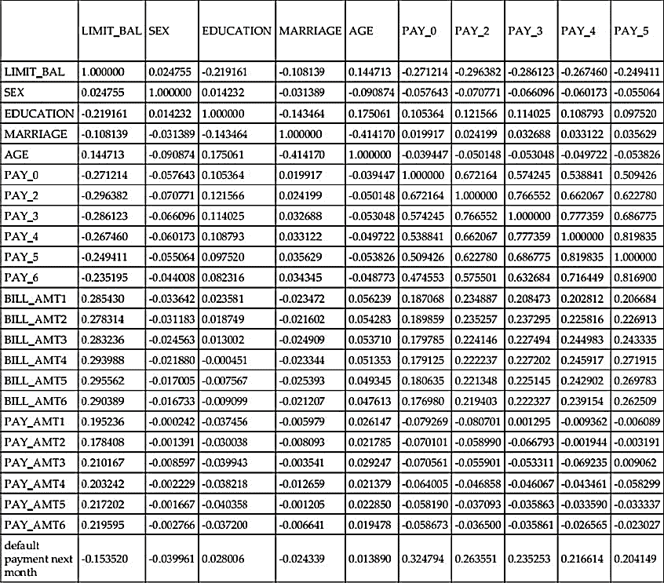
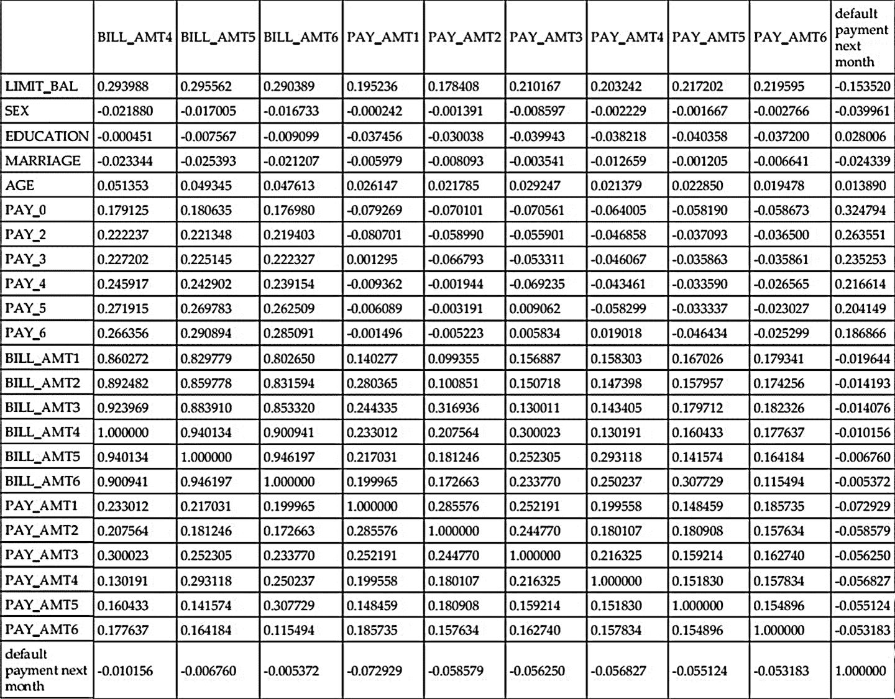
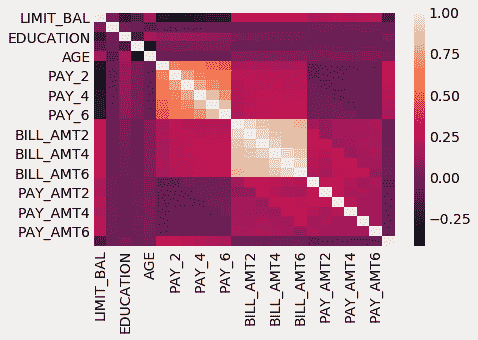

# 特征选择

我们已经完成了文本的一半，并且我们已经处理了大约一打数据集，看到了许多我们作为数据科学家和机器学习工程师在工作和生活中可能利用的特征选择方法，以确保我们能够从预测建模中获得最大收益。到目前为止，在处理数据时，我们已经使用了包括以下方法在内的方法：

+   通过识别数据级别来理解特征

+   特征改进和缺失值填充

+   特征标准化和归一化

上述每种方法都在我们的数据处理流程中占有一席之地，而且往往两种或更多方法会相互配合使用。

文本的剩余部分将专注于其他特征工程方法，这些方法在本质上比本书前半部分更为数学化和复杂。随着先前工作流程的增长，我们将尽力避免让读者了解我们调用的每一个统计测试的内部机制，而是传达一个更广泛的测试目标图景。作为作者和讲师，我们始终欢迎您就本工作的任何内部机制提出问题。

在我们讨论特征的过程中，我们经常遇到一个问题，那就是**噪声**。我们常常不得不处理那些可能不是高度预测响应的特征，有时甚至可能阻碍我们的模型在预测响应方面的性能。我们使用标准化和归一化等工具来尝试减轻这种损害，但最终，噪声必须得到处理。

在本章中，我们将讨论一种称为**特征选择**的特征工程子集，这是从原始特征集中选择哪些特征在模型预测流程中是**最佳**的过程。更正式地说，给定 *n* 个特征，我们寻找一个包含 *k* 个特征（其中 *k < n*）的子集，以改善我们的机器学习流程。这通常归结为以下陈述：

*特征选择旨在去除数据中的噪声并消除它*。

特征选择的定义涉及两个必须解决的问题：

+   我们可能找到的 *k* 个特征子集的方法

+   在机器学习背景下**更好**的定义

本章的大部分内容致力于探讨我们如何找到这样的特征子集以及这些方法运作的基础。本章将特征选择方法分为两大类：**基于统计**和**基于模型**的特征选择。这种划分可能无法完全捕捉特征选择这一科学和艺术领域的复杂性，但它有助于在我们的机器学习流程中产生真实且可操作的结果。

在我们深入探讨许多这些方法之前，让我们首先讨论如何更好地理解和定义**更好**的概念，因为它将界定本章的其余部分，以及界定本文本的其余部分。

我们在本章中将涵盖以下主题：

+   在特征工程中实现更好的性能

+   创建一个基线机器学习管道

+   特征选择类型

+   选择正确的特征选择方法

# 在特征工程中实现更好的性能

在整本书中，我们在实施各种特征工程方法时，都依赖于对**更好**的基本定义。我们的隐含目标是实现更好的预测性能，这种性能仅通过简单的指标来衡量，例如分类任务的准确率和回归任务的 RMSE（主要是准确率）。我们还可以测量和跟踪其他指标来衡量预测性能。例如，我们将使用以下指标进行分类：

+   真阳性率和假阳性率

+   灵敏度（也称为真阳性率）和特异性

+   假阴性率和假阳性率

对于回归，将应用以下指标：

+   均方误差

+   R²

这些列表将继续，虽然我们不会放弃通过如前所述的指标量化性能的想法，但我们也可以测量其他**元指标**，或者不直接与模型预测性能相关的指标，而是所谓的**元指标**试图衡量预测周围的性能，包括以下想法：

+   模型需要拟合/训练到数据的时间

+   调整模型以预测新数据实例所需的时间

+   如果数据必须持久化（存储以供以后使用），则数据的大小

这些想法将丰富我们对**更好**的机器学习的定义，因为它们有助于涵盖我们机器学习管道（除了模型预测性能之外）的更广阔的图景。为了帮助我们跟踪这些指标，让我们创建一个足够通用的函数来评估多个模型，但同时又足够具体，可以为我们每个模型提供指标。我们将我们的函数命名为`get_best_model_and_accuracy`，它将执行许多工作，例如：

+   它将搜索所有给定的参数以优化机器学习管道

+   它将输出一些指标，帮助我们评估输入管道的质量

让我们定义这样一个函数，以下代码将提供帮助：

```py
# import out grid search module
from sklearn.model_selection import GridSearchCV

def get_best_model_and_accuracy(model, params, X, y):
    grid = GridSearchCV(model, # the model to grid search
                        params, # the parameter set to try 
                        error_score=0.) # if a parameter set raises an error, continue and set the performance as a big, fat 0
    grid.fit(X, y) # fit the model and parameters
    # our classical metric for performance
    print "Best Accuracy: {}".format(grid.best_score_)
    # the best parameters that caused the best accuracy
    print "Best Parameters: {}".format(grid.best_params_)
    # the average time it took a model to fit to the data (in seconds)
    print "Average Time to Fit (s): {}".format(round(grid.cv_results_['mean_fit_time'].mean(), 3))
    # the average time it took a model to predict out of sample data (in seconds)
    # this metric gives us insight into how this model will perform in real-time analysis
    print "Average Time to Score (s): {}".format(round(grid.cv_results_['mean_score_time'].mean(), 3))
```

这个函数的整体目标是作为一个基准，我们将用它来评估本章中的每个特征选择方法，以给我们一个评估标准化的感觉。这实际上与我们之前所做的是一样的，但现在我们将我们的工作正式化为一个函数，并且还使用除了准确率之外的指标来评估我们的特征选择模块和机器学习管道。

# 一个案例研究——信用卡违约数据集

通过从数据中智能提取最重要的信号并忽略噪声，特征选择算法实现了两个主要成果：

+   **改进模型性能**：通过移除冗余数据，我们不太可能基于噪声和不相关数据做出决策，这也使得我们的模型能够专注于重要特征，从而提高模型管道的预测性能

+   **减少训练和预测时间**：通过将管道拟合到更少的数据，这通常会导致模型拟合和预测时间的改进，从而使我们的管道整体运行更快

为了获得对噪声数据如何以及为何会阻碍我们的现实理解，让我们介绍我们的最新数据集，一个信用卡违约数据集。我们将使用 23 个特征和一个响应变量。该响应变量将是一个布尔值，意味着它将是 True 或 False。我们使用 23 个特征的原因是我们想看看哪些特征可以帮助我们在机器学习管道中，哪些会阻碍我们。我们可以使用以下代码导入数据集：

```py
import pandas as pd
import numpy as np

# we will set a random seed to ensure that whenever we use random numbers 
# which is a good amount, we will achieve the same random numbers
np.random.seed(123)
```

首先，让我们引入两个常用的模块，`numpy` 和 `pandas`，并设置一个随机种子以确保结果的一致性。现在，让我们引入最新的数据集，使用以下代码：

```py
# archive.ics.uci.edu/ml/datasets/default+of+credit+card+clients
# import the newest csv
credit_card_default = pd.read_csv('../data/credit_card_default.csv')
```

让我们继续进行一些必要的探索性数据分析。首先，让我们检查我们正在处理的数据集有多大，使用以下代码：

```py
# 30,000 rows and 24 columns
credit_card_default.shape 
```

因此，我们拥有 `30,000 行`（观测值）和 `24 列`（1 个响应变量和 23 个特征）。我们在此不会深入描述列的含义，但我们鼓励读者查看数据来源（[`archive.ics.uci.edu/ml/datasets/default+of+credit+card+clients#`](http://archive.ics.uci.edu/ml/datasets/default+of+credit+card+clients#)）。目前，我们将依靠传统的统计方法来获取更多信息：

```py
# Some descriptive statistics
# We invoke the .T to transpose the matrix for better viewing
credit_card_default.describe().T
```

输出如下：

|  | **count** | **mean** | **std** | **min** | **25%** | **50%** | **75%** | **max** |
| --- | --- | --- | --- | --- | --- | --- | --- | --- |
| **LIMIT_BAL** | 30000.0 | 167484.322667 | 129747.661567 | 10000.0 | 50000.00 | 140000.0 | 240000.00 | 1000000.0 |
| **性别** | 30000.0 | 1.603733 | 0.489129 | 1.0 | 1.00 | 2.0 | 2.00 | 2.0 |
| **教育程度** | 30000.0 | 1.853133 | 0.790349 | 0.0 | 1.00 | 2.0 | 2.00 | 6.0 |
| **婚姻状况** | 30000.0 | 1.551867 | 0.521970 | 0.0 | 1.00 | 2.0 | 2.00 | 3.0 |
| **年龄** | 30000.0 | 35.485500 | 9.217904 | 21.0 | 28.00 | 34.0 | 41.00 | 79.0 |
| **PAY_0** | 30000.0 | -0.016700 | 1.123802 | -2.0 | -1.00 | 0.0 | 0.00 | 8.0 |
| **PAY_2** | 30000.0 | -0.133767 | 1.197186 | -2.0 | -1.00 | 0.0 | 0.00 | 8.0 |
| **PAY_3** | 30000.0 | -0.166200 | 1.196868 | -2.0 | -1.00 | 0.0 | 0.00 | 8.0 |
| **PAY_4** | 30000.0 | -0.220667 | 1.169139 | -2.0 | -1.00 | 0.0 | 0.00 | 8.0 |
| **PAY_5** | 30000.0 | -0.266200 | 1.133187 | -2.0 | -1.00 | 0.0 | 0.00 | 8.0 |
| **PAY_6** | 30000.0 | -0.291100 | 1.149988 | -2.0 | -1.00 | 0.0 | 0.00 | 8.0 |
| **BILL_AMT1** | 30000.0 | 51223.330900 | 73635.860576 | -165580.0 | 3558.75 | 22381.5 | 67091.00 | 964511.0 |
| **BILL_AMT2** | 30000.0 | 49179.075167 | 71173.768783 | -69777.0 | 2984.75 | 21200.0 | 64006.25 | 983931.0 |
| **BILL_AMT3** | 30000.0 | 47013.154800 | 69349.387427 | -157264.0 | 2666.25 | 20088.5 | 60164.75 | 1664089.0 |
| **BILL_AMT4** | 30000.0 | 43262.948967 | 64332.856134 | -170000.0 | 2326.75 | 19052.0 | 54506.00 | 891586.0 |
| **BILL_AMT5** | 30000.0 | 40311.400967 | 60797.155770 | -81334.0 | 1763.00 | 18104.5 | 50190.50 | 927171.0 |
| **BILL_AMT6** | 30000.0 | 38871.760400 | 59554.107537 | -339603.0 | 1256.00 | 17071.0 | 49198.25 | 961664.0 |
| **PAY_AMT1** | 30000.0 | 5663.580500 | 16563.280354 | 0.0 | 1000.00 | 2100.0 | 5006.00 | 873552.0 |
| **PAY_AMT2** | 30000.0 | 5921.163500 | 23040.870402 | 0.0 | 833.00 | 2009.0 | 5000.00 | 1684259.0 |
| **PAY_AMT3** | 30000.0 | 5225.681500 | 17606.961470 | 0.0 | 390.00 | 1800.0 | 4505.00 | 891586.0 |
| **PAY_AMT4** | 30000.0 | 4826.076867 | 15666.159744 | 0.0 | 296.00 | 1500.0 | 4013.25 | 621000.0 |
| **PAY_AMT5** | 30000.0 | 4799.387633 | 15278.305679 | 0.0 | 252.50 | 1500.0 | 4031.50 | 426529.0 |
| **PAY_AMT6** | 30000.0 | 5215.502567 | 17777.465775 | 0.0 | 117.75 | 1500.0 | 4000.00 | 528666.0 |
| **default payment next month** | 30000.0 | 0.221200 | 0.415062 | 0.0 | 0.00 | 0.0 | 0.00 | 1.0 |

下个月的**默认付款**是我们的响应列，其余的都是特征/潜在的预测因子。很明显，我们的特征存在于截然不同的尺度上，这将是我们处理数据和选择模型的一个因素。在前面章节中，我们大量处理了不同尺度的数据和特征，使用了如`StandardScaler`和归一化等解决方案来缓解这些问题；然而，在本章中，我们将主要选择忽略这些问题，以便专注于更相关的问题。

在本书的最后一章中，我们将关注几个案例研究，这些研究将几乎将本书中的所有技术结合在一起，对数据集进行长期分析。

正如我们在前面的章节中看到的，我们知道在处理机器学习时，空值是一个大问题，所以让我们快速检查一下，确保我们没有要处理的空值：

```py
# check for missing values, none in this dataset
credit_card_default.isnull().sum()
LIMIT_BAL                     0
SEX                           0
EDUCATION                     0
MARRIAGE                      0
AGE                           0
PAY_0                         0
PAY_2                         0
PAY_3                         0
PAY_4                         0
PAY_5                         0
PAY_6                         0
BILL_AMT1                     0
BILL_AMT2                     0
BILL_AMT3                     0
BILL_AMT4                     0
BILL_AMT5                     0
BILL_AMT6                     0
PAY_AMT1                      0
PAY_AMT2                      0
PAY_AMT3                      0
PAY_AMT4                      0
PAY_AMT5                      0
PAY_AMT6                      0
default payment next month    0
dtype: int64
```

呼！这里没有缺失值。同样，我们将在未来的案例研究中再次处理缺失值，但现在我们还有更重要的事情要做。让我们继续设置一些变量，用于我们的机器学习流程，使用以下代码：

```py
# Create our feature matrix
X = credit_card_default.drop('default payment next month', axis=1)

# create our response variable
y = credit_card_default['default payment next month']
```

如同往常，我们创建了我们的`X`和`y`变量。我们的`X`矩阵将有 30,000 行和 23 列，而`y`始终是一个 30,000 长的 pandas Series。因为我们将会进行分类，所以我们通常需要确定一个空值准确率，以确保我们的机器学习模型的表现优于基线。我们可以使用以下代码来获取空值准确率：

```py
# get our null accuracy rate
y.value_counts(normalize=True)

0    0.7788
1    0.2212
```

因此，在这个案例中需要超越的准确率是**77.88**%，这是没有违约（0 表示没有违约）的人的百分比。

# 创建基线机器学习流程

在前面的章节中，我们向读者提供了一个单一的机器学习模型在整个章节中使用。在本章中，我们将做一些工作来找到最适合我们需求的机器学习模型，然后通过特征选择来增强该模型。我们将首先导入四个不同的机器学习模型：

+   逻辑回归

+   K-最近邻

+   决策树

+   随机森林

导入学习模型的代码如下所示：

```py
# Import four machine learning models
from sklearn.linear_model import LogisticRegression
from sklearn.neighbors import KNeighborsClassifier
from sklearn.tree import DecisionTreeClassifier
from sklearn.ensemble import RandomForestClassifier
```

一旦我们完成这些模块的导入，我们将通过我们的`get_best_model_`和`_accuracy`函数运行它们，以获得每个模块处理原始数据的基线。为此，我们首先需要建立一些变量。我们将使用以下代码来完成这项工作：

```py
# Set up some parameters for our grid search
# We will start with four different machine learning model parameters

# Logistic Regression
lr_params = {'C':[1e-1, 1e0, 1e1, 1e2], 'penalty':['l1', 'l2']}

# KNN
knn_params = {'n_neighbors': [1, 3, 5, 7]}

# Decision Tree
tree_params = {'max_depth':[None, 1, 3, 5, 7]}

# Random Forest
forest_params = {'n_estimators': [10, 50, 100], 'max_depth': [None, 1, 3, 5, 7]}
```

如果你以上列出的任何模型感到不舒服，我们建议阅读相关文档，或者参考 Packt 出版的《数据科学原理》一书，[`www.packtpub.com/big-data-and-business-intelligence/principles-data-science`](https://www.packtpub.com/big-data-and-business-intelligence/principles-data-science)，以获得算法的更详细解释。

因为我们将把每个模型通过我们的函数发送，该函数调用网格搜索模块，我们只需要创建没有设置自定义参数的空白状态模型，如下所示：

```py
# instantiate the four machine learning models
lr = LogisticRegression()
knn = KNeighborsClassifier()
d_tree = DecisionTreeClassifier()
forest = RandomForestClassifier()
```

现在，我们将运行每个四个机器学习模型通过我们的评估函数，看看它们在我们的数据集上的表现如何（或不好）。回想一下，我们目前要超越的数字是.7788，这是基线零准确率。我们将使用以下代码来运行这些模型：

```py
get_best_model_and_accuracy(lr, lr_params, X, y)

Best Accuracy: 0.809566666667
Best Parameters: {'penalty': 'l1', 'C': 0.1}
Average Time to Fit (s): 0.602
Average Time to Score (s): 0.002
```

我们可以看到，逻辑回归已经使用原始数据超越了零准确率，平均而言，只需要 6/10 秒来拟合训练集，并且只需要 20 毫秒来评分。如果我们知道在**scikit-learn**中，逻辑回归必须创建一个大的矩阵存储在内存中，但为了预测，它只需要将标量相乘和相加，这是有道理的。

现在，让我们使用以下代码对 KNN 模型做同样的事情：

```py
get_best_model_and_accuracy(knn, knn_params, X, y)

Best Accuracy: 0.760233333333
Best Parameters: {'n_neighbors': 7}
Average Time to Fit (s): 0.035
Average Time to Score (s): 0.88
```

我们的 KNN 模型，正如预期的那样，在拟合时间上表现更好。这是因为，为了拟合数据，KNN 只需要以某种方式存储数据，以便在预测时可以轻松检索，这会在时间上造成损失。还值得一提的是一个显而易见的事实，即准确率甚至没有超过零准确率！你可能想知道为什么，如果你说“嘿，等等，KNN 不是利用欧几里得距离来做出预测吗，这可能会被非标准化数据所影响，而其他三个机器学习模型都没有这个问题”，那么你完全正确。

KNN 是一种基于距离的模型，它使用空间中相似度的度量，假设所有特征都在相同的尺度上，但我们已经知道我们的数据并不是这样的。因此，对于 KNN，我们将不得不构建一个更复杂的管道来更准确地评估其基线性能，以下代码展示了如何实现：

```py
# bring in some familiar modules for dealing with this sort of thing
from sklearn.pipeline import Pipeline
from sklearn.preprocessing import StandardScaler

# construct pipeline parameters based on the parameters
# for KNN on its own
knn_pipe_params = {'classifier__{}'.format(k): v for k, v in knn_params.iteritems()}

# KNN requires a standard scalar due to using Euclidean distance # as the main equation for predicting observations
knn_pipe = Pipeline([('scale', StandardScaler()), ('classifier', knn)])

# quick to fit, very slow to predict
get_best_model_and_accuracy(knn_pipe, knn_pipe_params, X, y)

print knn_pipe_params  # {'classifier__n_neighbors': [1, 3, 5, 7]} 

Best Accuracy: 0.8008 
Best Parameters: {'classifier__n_neighbors': 7} 
Average Time to Fit (s): 0.035 
Average Time to Score (s): 6.723
```

首先要注意的是，我们修改后的代码管道，现在包括了一个`StandardScalar`（它通过 z 分数标准化我们的特征），至少在 null accuracy 上有所提升，但同时也严重影响了我们的预测时间，因为我们增加了一个预处理步骤。到目前为止，逻辑回归在最佳准确率和更好的整体管道时间上处于领先地位。让我们继续前进，看看我们的两个基于树的模型，先从两个模型中较简单的一个开始，即决策树，以下代码将提供帮助：

```py
get_best_model_and_accuracy(d_tree, tree_params, X, y)

Best Accuracy: 0.820266666667
Best Parameters: {'max_depth': 3}
Average Time to Fit (s): 0.158
Average Time to Score (s): 0.002
```

太棒了！我们已经在新准确率上取得了领先，而且决策树在拟合和预测方面都很快。事实上，它在拟合时间上击败了逻辑回归，在预测时间上击败了 KNN。让我们通过以下代码评估随机森林来完成我们的测试：

```py
get_best_model_and_accuracy(forest, forest_params, X, y)

Best Accuracy: 0.819566666667
Best Parameters: {'n_estimators': 50, 'max_depth': 7}
Average Time to Fit (s): 1.107
Average Time to Score (s): 0.044
```

比逻辑回归或 KNN 都要好，但不如决策树。让我们汇总这些结果，看看我们应该在优化时使用哪种模型：

| **模型名称** | **准确率 (%)** | **拟合时间 (s)** | **预测时间 (s)** |
| --- | --- | --- | --- |
| 逻辑回归 | .8096 | .602 | **.002** |
| KNN（缩放） | .8008 | **.035** | 6.72 |
| 决策树 | **.8203** | .158 | **.002** |
| 随机森林 | .8196 | 1.107 | .044 |

决策树在准确率上排名第一，与逻辑回归在预测时间上并列第一，而经过缩放的 KNN 在拟合我们的数据方面速度最快。总的来说，决策树似乎是我们继续前进的最佳模型，因为它在我们的两个最重要的指标上排名第一：

+   我们肯定希望获得最佳准确率，以确保样本外预测的准确性

+   考虑到模型将被用于实时生产使用，预测时间是有用的

我们采取的方法是在选择任何特征之前选择一个模型。这不是必须的工作方式，但我们发现，在时间紧迫的情况下，这种方式通常可以节省最多的时间。就你的目的而言，我们建议你同时实验多种模型，不要将自己限制在单一模型上。

知道我们将使用决策树来完成本章的剩余部分，我们还知道两件事：

+   新的基线准确率是.8203，这是树在拟合整个数据集时获得的准确率

+   我们不再需要使用`StandardScaler`，因为决策树在模型性能方面不受其影响

# 特征选择类型

回想一下，我们进行特征选择的目标是通过提高预测能力和减少时间成本来提升我们的机器学习能力。为了实现这一点，我们引入了两种广泛的特征选择类别：基于统计和基于模型。基于统计的特征选择将严重依赖于与我们的机器学习模型分开的统计测试，以便在我们的管道训练阶段选择特征。基于模型的选择依赖于一个预处理步骤，该步骤涉及训练一个二级机器学习模型，并使用该模型的预测能力来选择特征。

这两种类型的特征选择都试图通过从原始特征中仅选择具有最高预测能力的最佳特征来减少我们的数据集大小。我们可能可以智能地选择哪种特征选择方法最适合我们，但现实中，在这个领域工作的一个非常有效的方法是逐一研究每种方法的示例，并衡量结果管道的性能。

首先，让我们看看依赖于统计测试从数据集中选择可行特征的特性选择模块的子类。

# 基于统计的特征选择

统计为我们提供了相对快速和简单的方法来解释定量和定性数据。我们在前面的章节中使用了一些统计度量来获取关于我们数据的新知识和视角，特别是我们认识到均值和标准差作为度量，使我们能够计算 z 分数并缩放我们的数据。在本章中，我们将依靠两个新概念来帮助我们进行特征选择：

+   皮尔逊相关性

+   假设检验

这两种方法都被称为特征选择的**单变量**方法，这意味着当问题是要一次选择一个**单个**特征以创建更好的机器学习管道数据集时，它们既快又方便。

# 使用皮尔逊相关性选择特征

我们在这本书中已经讨论过相关性，但不是在特征选择的背景下。我们已经知道，我们可以通过调用以下方法在 pandas 中调用相关性计算：

```py
credit_card_default.corr()
```

前面代码的输出结果是以下内容：



作为前一个表的延续，我们有：



皮尔逊相关系数（这是 pandas 的默认值）衡量列之间的**线性**关系。系数的值在-1 和+1 之间变化，其中 0 表示它们之间没有相关性。接近-1 或+1 的相关性表示非常强的线性关系。

值得注意的是，皮尔逊的相关性通常要求每个列都是正态分布的（我们并没有假设这一点）。我们也可以在很大程度上忽略这一要求，因为我们的数据集很大（超过 500 是阈值）。

`pandas .corr()` 方法为每一列与其他每一列计算皮尔逊相关系数。这个 24 列乘以 24 行的矩阵非常混乱，在过去，我们使用 `热图` 来尝试使信息更易于理解：

```py
# using seaborn to generate heatmaps
import seaborn as sns
import matplotlib.style as style
# Use a clean stylizatino for our charts and graphs
style.use('fivethirtyeight')

sns.heatmap(credit_card_default.corr())
```

生成的 `热图` 将如下所示：



注意，`热图` 函数自动选择了与我们最相关的特征来显示。话虽如此，我们目前关注的是特征与响应变量的相关性。我们将假设一个特征与响应的相关性越强，它就越有用。任何相关性不那么强的特征对我们来说就不那么有用。

相关系数也用于确定特征交互和冗余。减少机器学习中过拟合的关键方法之一是发现并去除这些冗余。我们将在基于模型的选择方法中解决这个问题。

让我们使用以下代码来隔离特征与响应变量之间的相关性：

```py
# just correlations between every feature and the response
credit_card_default.corr()['default payment next month'] 

LIMIT_BAL                    -0.153520
SEX                          -0.039961
EDUCATION                     0.028006
MARRIAGE                     -0.024339
AGE                           0.013890
PAY_0                         0.324794
PAY_2                         0.263551
PAY_3                         0.235253
PAY_4                         0.216614
PAY_5                         0.204149
PAY_6                         0.186866
BILL_AMT1                    -0.019644
BILL_AMT2                    -0.014193
BILL_AMT3                    -0.014076
BILL_AMT4                    -0.010156
BILL_AMT5                    -0.006760
BILL_AMT6                    -0.005372
PAY_AMT1                     -0.072929
PAY_AMT2                     -0.058579
PAY_AMT3                     -0.056250
PAY_AMT4                     -0.056827
PAY_AMT5                     -0.055124
PAY_AMT6                     -0.053183
default payment next month    1.000000
```

我们可以忽略最后一行，因为它表示响应变量与自身完全相关的响应变量。我们正在寻找相关系数值接近 -1 或 +1 的特征。这些是我们可能认为有用的特征。让我们使用 pandas 过滤器来隔离至少有 .2 相关性（正或负）的特征。

我们可以通过首先定义一个 pandas *掩码* 来实现这一点，它将作为我们的过滤器，使用以下代码：

```py
# filter only correlations stronger than .2 in either direction (positive or negative)

credit_card_default.corr()['default payment next month'].abs() > .2

LIMIT_BAL                     False
SEX                           False
EDUCATION                     False
MARRIAGE                      False
AGE                           False
PAY_0                          True
PAY_2                          True
PAY_3                          True
PAY_4                          True
PAY_5                          True
PAY_6                         False
BILL_AMT1                     False
BILL_AMT2                     False
BILL_AMT3                     False
BILL_AMT4                     False
BILL_AMT5                     False
BILL_AMT6                     False
PAY_AMT1                      False
PAY_AMT2                      False
PAY_AMT3                      False
PAY_AMT4                      False
PAY_AMT5                      False
PAY_AMT6                      False
default payment next month     True
```

在前面的 pandas Series 中，每个 `False` 都代表一个相关值在 -0.2 到 0.2（包括）之间的特征，而 `True` 值对应于相关值在 0.2 或更小于 -0.2 的特征。让我们将这个掩码插入到我们的 pandas 过滤器中，使用以下代码：

```py
# store the features
highly_correlated_features = credit_card_default.columns[credit_card_default.corr()['default payment next month'].abs() > .2]

highly_correlated_features

Index([u'PAY_0', u'PAY_2', u'PAY_3', u'PAY_4', u'PAY_5',
       u'default payment next month'],
      dtype='object')
```

变量 `highly_correlated_features` 应该包含与响应变量高度相关的特征；然而，我们必须去掉响应列的名称，因为将其包含在我们的机器学习管道中将是作弊：

```py
# drop the response variable
highly_correlated_features = highly_correlated_features.drop('default payment next month')

highly_correlated_features

Index([u'PAY_0', u'PAY_2', u'PAY_3', u'PAY_4', u'PAY_5'], dtype='object')
```

因此，现在我们从原始数据集中提取了五个特征，这些特征旨在预测响应变量，让我们在以下代码的帮助下尝试一下：

```py
# only include the five highly correlated features
X_subsetted = X[highly_correlated_features]

get_best_model_and_accuracy(d_tree, tree_params, X_subsetted, y) 

# barely worse, but about 20x faster to fit the model
Best Accuracy: 0.819666666667 
Best Parameters: {'max_depth': 3} 
Average Time to Fit (s): 0.01 
Average Time to Score (s): 0.002
```

我们的准确率肯定比要打败的准确率 .8203 差，但也要注意，拟合时间大约增加了 20 倍。我们的模型能够用只有五个特征来学习，几乎与整个数据集一样好。此外，它能够在更短的时间内学习到同样多的知识。

让我们把我们的 scikit-learn 管道重新引入，并将我们的相关性选择方法作为预处理阶段的一部分。为此，我们必须创建一个自定义转换器，它将调用我们刚刚经历的逻辑，作为一个管道就绪的类。

我们将把我们的类命名为 `CustomCorrelationChooser`，它必须实现拟合和转换逻辑，如下所示：

+   拟合逻辑将选择特征矩阵中高于指定阈值的列

+   转换逻辑将子集任何未来的数据集，只包括被认为重要的列

```py
from sklearn.base import TransformerMixin, BaseEstimator

class CustomCorrelationChooser(TransformerMixin, BaseEstimator):
    def __init__(self, response, cols_to_keep=[], threshold=None):
        # store the response series
        self.response = response
        # store the threshold that we wish to keep
        self.threshold = threshold
        # initialize a variable that will eventually
        # hold the names of the features that we wish to keep
        self.cols_to_keep = cols_to_keep

    def transform(self, X):
        # the transform method simply selects the appropiate
        # columns from the original dataset
        return X[self.cols_to_keep]

    def fit(self, X, *_):
        # create a new dataframe that holds both features and response
        df = pd.concat([X, self.response], axis=1)
        # store names of columns that meet correlation threshold
        self.cols_to_keep = df.columns[df.corr()[df.columns[-1]].abs() > self.threshold]
        # only keep columns in X, for example, will remove response variable
        self.cols_to_keep = [c for c in self.cols_to_keep if c in X.columns]
        return self
```

让我们用以下代码来试用我们新的相关特征选择器：

```py
# instantiate our new feature selector
ccc = CustomCorrelationChooser(threshold=.2, response=y)
ccc.fit(X)

ccc.cols_to_keep

['PAY_0', 'PAY_2', 'PAY_3', 'PAY_4', 'PAY_5']
```

我们的这个类别选择了我们之前找到的相同的五列。让我们通过在`X`矩阵上调用它来测试转换功能，以下代码如下：

```py
ccc.transform(X).head()
```

上述代码产生以下表格作为输出：

|  | **PAY_0** | **PAY_2** | **PAY_3** | **PAY_4** | **PAY_5** |
| --- | --- | --- | --- | --- | --- |
| **0** | 2 | 2 | -1 | -1 | -2 |
| **1** | -1 | 2 | 0 | 0 | 0 |
| **2** | 0 | 0 | 0 | 0 | 0 |
| **3** | 0 | 0 | 0 | 0 | 0 |
| **4** | -1 | 0 | -1 | 0 | 0 |

我们看到`transform`方法已经消除了其他列，只保留了满足我们`.2`相关阈值的特征。现在，让我们在以下代码的帮助下将所有这些整合到我们的管道中：

```py
# instantiate our feature selector with the response variable set
ccc = CustomCorrelationChooser(response=y)

# make our new pipeline, including the selector
ccc_pipe = Pipeline([('correlation_select', ccc), 
 ('classifier', d_tree)])

# make a copy of the decisino tree pipeline parameters
ccc_pipe_params = deepcopy(tree_pipe_params)

# update that dictionary with feature selector specific parameters
ccc_pipe_params.update({
 'correlation_select__threshold':[0, .1, .2, .3]})

print ccc_pipe_params  #{'correlation_select__threshold': [0, 0.1, 0.2, 0.3], 'classifier__max_depth': [None, 1, 3, 5, 7, 9, 11, 13, 15, 17, 19, 21]}

# better than original (by a little, and a bit faster on 
# average overall
get_best_model_and_accuracy(ccc_pipe, ccc_pipe_params, X, y) 

Best Accuracy: 0.8206
Best Parameters: {'correlation_select__threshold': 0.1, 'classifier__max_depth': 5}
Average Time to Fit (s): 0.105
Average Time to Score (s): 0.003
```

哇！我们在特征选择的第一尝试中已经超过了我们的目标（尽管只是略微）。我们的管道显示，如果我们以`0.1`为阈值，我们就已经消除了足够的噪声以改善准确性，并且还减少了拟合时间（从没有选择器的 0.158 秒）。让我们看看我们的选择器决定保留哪些列：

```py
# check the threshold of .1
ccc = CustomCorrelationChooser(threshold=0.1, response=y)
ccc.fit(X)

# check which columns were kept
ccc.cols_to_keep
['LIMIT_BAL', 'PAY_0', 'PAY_2', 'PAY_3', 'PAY_4', 'PAY_5', 'PAY_6']
```

看起来我们的选择器决定保留我们找到的五列，以及另外两列，即`LIMIT_BAL`和`PAY_6`列。太棒了！这是 scikit-learn 中自动化管道网格搜索的美丽之处。它允许我们的模型做它们最擅长的事情，并直觉到我们自己无法做到的事情。

# 使用假设检验进行特征选择

假设检验是统计学中的一种方法，它允许对单个特征进行更复杂的统计检验。通过假设检验进行特征选择将尝试从数据集中选择最佳特征，正如我们在自定义相关选择器中所做的那样，但这些测试更多地依赖于形式化的统计方法，并通过所谓的**p 值**进行解释。

假设检验是一种统计检验，用于确定在给定数据样本的情况下，我们是否可以应用对整个总体适用的某个条件。假设检验的结果告诉我们是否应该相信假设，或者拒绝它以选择另一个假设。基于来自总体的样本数据，假设检验确定是否拒绝零假设。我们通常使用**p 值**（一个非负的小数，其上界为 1，基于我们的显著性水平）来得出这个结论。

在特征选择的情况下，我们希望检验的假设是这样的：*“这个特征与响应变量无关。”* 我们希望对每个特征进行这种假设检验，并决定这些特征在预测响应变量时是否具有某种重要性。从某种意义上说，这就是我们处理相关逻辑的方式。我们基本上说，如果一个列与响应变量的相关性太弱，那么我们就说该特征无关的假设是正确的。如果相关系数足够强，那么我们就可以拒绝该特征无关的假设，转而支持一个替代假设，即该特征确实与响应变量有关。

要开始使用这个工具处理我们的数据，我们需要引入两个新的模块：`SelectKBest` 和 `f_classif`，使用以下代码：

```py
# SelectKBest selects features according to the k highest scores of a given scoring function
from sklearn.feature_selection import SelectKBest

# This models a statistical test known as ANOVA
from sklearn.feature_selection import f_classif

# f_classif allows for negative values, not all do
# chi2 is a very common classification criteria but only allows for positive values
# regression has its own statistical tests
```

`SelectKBest` 实际上只是一个包装器，它保留了一定数量的特征，这些特征是根据某些标准排序最高的。在这种情况下，我们将使用完成假设检验的 p 值作为排序标准。

# 解释 p 值

p 值是介于 0 和 1 之间的十进制数，表示在假设检验下，给定的数据偶然发生的概率。简单来说，p 值越低，我们拒绝零假设的机会就越大。对于我们的目的来说，p 值越小，特征与我们的响应变量相关的可能性就越大，我们应该保留它。

对于更深入的统计检验处理，请参阅 Packt 出版的《数据科学原理》[*Principles of Data Science*](https://www.packtpub.com/big-data-and-business-intelligence/principles-data-science)，[`www.packtpub.com/big-data-and-business-intelligence/principles-data-science`](https://www.packtpub.com/big-data-and-business-intelligence/principles-data-science)。

从这个例子中我们可以得出一个重要的结论：`f_classif` 函数将对每个特征单独执行 ANOVA 测试（一种假设检验类型），并为该特征分配一个 p 值。`SelectKBest` 将根据那个 p 值（越低越好）对特征进行排序，并仅保留最好的 k 个（由人工输入）特征。让我们在 Python 中尝试一下。

# p 值排序

让我们先实例化一个 `SelectKBest` 模块。我们将手动输入一个 `k` 值，`5`，这意味着我们希望只保留根据结果 p 值得出的前五个最佳特征：

```py
# keep only the best five features according to p-values of ANOVA test
k_best = SelectKBest(f_classif, k=5)
```

然后，我们可以拟合并转换我们的 `X` 矩阵，选择我们想要的特征，就像我们之前使用自定义选择器所做的那样。

```py
# matrix after selecting the top 5 features
k_best.fit_transform(X, y)

# 30,000 rows x 5 columns
array([[ 2,  2, -1, -1, -2],
       [-1,  2,  0,  0,  0],
       [ 0,  0,  0,  0,  0],
       ..., 
       [ 4,  3,  2, -1,  0],
       [ 1, -1,  0,  0,  0],
       [ 0,  0,  0,  0,  0]])
```

如果我们想直接检查 `p-values` 并查看哪些列被选中，我们可以深入了解选择 `k_best` 变量：

```py
# get the p values of columns
k_best.pvalues_

# make a dataframe of features and p-values
# sort that dataframe by p-value
p_values = pd.DataFrame({'column': X.columns, 'p_value': k_best.pvalues_}).sort_values('p_value')

# show the top 5 features
p_values.head()
```

上述代码将生成以下表格作为输出：

|  | **列** | **p 值** |
| --- | --- | --- |
| **5** | PAY_0 | 0.000000e+00 |
| **6** | PAY_2 | 0.000000e+00 |
| **7** | PAY_3 | 0.000000e+00 |
| **8** | PAY_4 | 1.899297e-315 |
| **9** | PAY_5 | 1.126608e-279 |

我们可以看到，我们的选择器再次选择了 `PAY_X` 列作为最重要的列。如果我们看一下我们的 `p-value` 列，我们会注意到我们的值非常小，接近于零。p-value 的一个常见阈值是 `0.05`，这意味着小于 0.05 的值可能被认为是显著的，根据我们的测试，这些列非常显著。我们还可以直接使用 pandas 过滤方法看到哪些列达到了 0.05 的阈值：

```py
# features with a low p value
p_values[p_values['p_value'] < .05]
```

上述代码生成了以下表格作为输出：

|  | **列** | **p_value** |
| --- | --- | --- |
| **5** | PAY_0 | 0.000000e+00 |
| **6** | PAY_2 | 0.000000e+00 |
| **7** | PAY_3 | 0.000000e+00 |
| **8** | PAY_4 | 1.899297e-315 |
| **9** | PAY_5 | 1.126608e-279 |
| **10** | PAY_6 | 7.296740e-234 |
| **0** | LIMIT_BAL | 1.302244e-157 |
| **17** | PAY_AMT1 | 1.146488e-36 |
| **18** | PAY_AMT2 | 3.166657e-24 |
| **20** | PAY_AMT4 | 6.830942e-23 |
| **19** | PAY_AMT3 | 1.841770e-22 |
| **21** | PAY_AMT5 | 1.241345e-21 |
| **22** | PAY_AMT6 | 3.033589e-20 |
| **1** | SEX | 4.395249e-12 |
| **2** | EDUCATION | 1.225038e-06 |
| **3** | MARRIAGE | 2.485364e-05 |
| **11** | BILL_AMT1 | 6.673295e-04 |
| **12** | BILL_AMT2 | 1.395736e-02 |
| **13** | BILL_AMT3 | 1.476998e-02 |
| **4** | AGE | 1.613685e-02 |

大多数列的 `p-value` 都很低，但并非所有。让我们使用以下代码查看具有更高 `p_value` 的列：

```py
# features with a high p value
p_values[p_values['p_value'] >= .05]
```

上述代码生成了以下表格作为输出：

|  | **列** | **p_value** |
| --- | --- | --- |
| **14** | BILL_AMT4 | 0.078556 |
| **15** | BILL_AMT5 | 0.241634 |
| **16** | BILL_AMT6 | 0.352123 |

这三个列的 `p-value` 非常高。让我们使用我们的 `SelectKBest` 在管道中查看我们是否可以通过网格搜索进入更好的机器学习管道，以下代码将有所帮助：

```py
k_best = SelectKBest(f_classif)

# Make a new pipeline with SelectKBest
select_k_pipe = Pipeline([('k_best', k_best), 
 ('classifier', d_tree)])

select_k_best_pipe_params = deepcopy(tree_pipe_params)
# the 'all' literally does nothing to subset
select_k_best_pipe_params.update({'k_best__k':range(1,23) + ['all']})

print select_k_best_pipe_params # {'k_best__k': [1, 2, 3, 4, 5, 6, 7, 8, 9, 10, 11, 12, 13, 14, 15, 16, 17, 18, 19, 20, 21, 22, 'all'], 'classifier__max_depth': [None, 1, 3, 5, 7, 9, 11, 13, 15, 17, 19, 21]}

# comparable to our results with correlationchooser
get_best_model_and_accuracy(select_k_pipe, select_k_best_pipe_params, X, y)

Best Accuracy: 0.8206
Best Parameters: {'k_best__k': 7, 'classifier__max_depth': 5}
Average Time to Fit (s): 0.102
Average Time to Score (s): 0.002
```

我们的 `SelectKBest` 模块似乎达到了与我们的自定义转换器相同的准确度，但达到这个准确度要快一些！让我们看看我们的测试选择了哪些列，以下代码将有所帮助：

```py
k_best = SelectKBest(f_classif, k=7)

# lowest 7 p values match what our custom correlationchooser chose before
# ['LIMIT_BAL', 'PAY_0', 'PAY_2', 'PAY_3', 'PAY_4', 'PAY_5', 'PAY_6']

p_values.head(7)
```

上述代码生成了以下表格作为输出：

|  | **列** | **p_value** |
| --- | --- | --- |
| **5** | PAY_0 | 0.000000e+00 |
| **6** | PAY_0 | 0.000000e+00 |
| **7** | PAY_0 | 0.000000e+00 |
| **8** | PAY_0 | 1.899297e-315 |
| **9** | PAY_0 | 1.126608e-279 |
| **10** | PAY_0 | 7.296740e-234 |
| **0** | LIMIT_BAL | 1.302244e-157 |

它们似乎是我们其他统计方法选择的相同列。我们的统计方法可能限制为不断为我们选择这七个列。

除了 ANOVA 之外，还有其他测试可用，例如 Chi² 以及其他回归任务，它们都包含在 scikit-learn 的文档中。有关通过单变量测试进行特征选择的更多信息，请查看 scikit-learn 的以下文档：

[`scikit-learn.org/stable/modules/feature_selection.html#univariate-feature-selection`](http://scikit-learn.org/stable/modules/feature_selection.html#univariate-feature-selection)

在我们转向基于模型的特征选择之前，进行一次快速的合理性检查是有帮助的，以确保我们走在正确的道路上。到目前为止，我们已经看到了两种用于特征选择的统计方法，它们为我们提供了相同的七个列以实现最佳精度。但如果我们排除这七个列以外的所有列呢？我们应该预期精度会大大降低，整体流程也会变得更差，对吧？让我们确保这一点。以下代码帮助我们实现合理性检查：

```py
# sanity check
# If we only the worst columns
the_worst_of_X = X[X.columns.drop(['LIMIT_BAL', 'PAY_0', 'PAY_2', 'PAY_3', 'PAY_4', 'PAY_5', 'PAY_6'])]

# goes to show, that selecting the wrong features will 
# hurt us in predictive performance
get_best_model_and_accuracy(d_tree, tree_params, the_worst_of_X, y)

Best Accuracy: 0.783966666667
Best Parameters: {'max_depth': 5}
Average Time to Fit (s): 0.21
Average Time to Score (s): 0.002
```

好吧，通过选择除了这七个列以外的列，我们不仅看到了更差的精度（几乎和零精度一样差），而且平均拟合时间也更慢。有了这一点，我相信我们可以继续到我们的下一个特征选择技术子集，即基于模型的方法。

# 基于模型的特征选择

我们上一节讨论了使用统计方法和测试来从原始数据集中选择特征，以提高我们的机器学习流程，无论是在预测性能上还是在时间复杂度上。在这个过程中，我们亲自见证了使用特征选择的效果。

# 自然语言处理简要回顾

如果从本章一开始就谈论特征选择听起来很熟悉，几乎就像我们在开始相关系数和统计测试之前就已经在做这件事一样，那么，你并没有错。在第四章，*特征构建*中，当我们处理特征构建时，我们介绍了`CountVectorizer`的概念，它是 scikit-learn 中的一个模块，用于从文本列中构建特征并在机器学习流程中使用它们。

`CountVectorizer`有许多参数可以调整以寻找最佳流程。具体来说，有几个内置的特征选择参数：

+   `max_features`：这个整数设置了一个硬限制，即特征提取器可以记住的最大特征数量。被记住的特征是基于一个排名系统决定的，其中令牌的排名是该令牌在语料库中的计数。

+   `min_df`：这个浮点数通过规定一个规则来限制特征的数量，即一个令牌只有在语料库中以高于`min_df`的比率出现时才可以在数据集中出现。

+   `max_df`：与`min_df`类似，这个浮点数通过仅允许在语料库中以低于`max_df`设置的值严格出现的令牌来限制特征的数量。

+   `stop_words`：通过将其与静态令牌列表进行匹配来限制允许的令牌类型。如果发现存在于`stop_words`集合中的令牌，无论其是否以`min_df`和`max_df`允许的数量出现，都将忽略该词。

在上一章中，我们简要介绍了一个旨在仅基于推文中单词预测推文情感的数据集。让我们花些时间来刷新我们对如何使用这些参数的记忆。让我们通过以下代码开始引入我们的`tweet`数据集：

```py
# bring in the tweet dataset
tweets = pd.read_csv('../data/twitter_sentiment.csv', 
 encoding='latin1')
```

为了刷新我们的记忆，让我们查看前五个`tweets`，以下代码将提供帮助：

```py
tweets.head()
```

上述代码生成了以下表格作为输出：

|  | **ItemID** | **Sentiment** | **SentimentText** |
| --- | --- | --- | --- |
| 0 | 1 | 0 | 我的好朋友 APL 真是太伤心了... |
| 1 | 2 | 0 | 我错过了新月观测... |
| 2 | 3 | 1 | omg 它已经 7:30 了 :O |
| 3 | 4 | 0 | .. Omgaga. Im sooo im gunna CRy. I'... |
| 4 | 5 | 0 | 我想我的男朋友在骗我！！！ ... |

让我们创建一个特征和一个响应变量。回想一下，因为我们正在处理文本，所以我们的特征变量将仅仅是文本列，而不是通常的二维矩阵：

```py
tweets_X, tweets_y = tweets['SentimentText'], tweets['Sentiment']
```

让我们设置一个管道，并使用本章中我们一直在使用的相同函数来评估它，以下代码将提供帮助：

```py
from sklearn.feature_extraction.text import CountVectorizer
# import a naive bayes to help predict and fit a bit faster 
from sklearn.naive_bayes import MultinomialNB

featurizer = CountVectorizer()

text_pipe = Pipeline([('featurizer', featurizer), 
                 ('classify', MultinomialNB())])

text_pipe_params = {'featurizer__ngram_range':[(1, 2)], 
               'featurizer__max_features': [5000, 10000],
               'featurizer__min_df': [0., .1, .2, .3], 
               'featurizer__max_df': [.7, .8, .9, 1.]}

get_best_model_and_accuracy(text_pipe, text_pipe_params, 
                            tweets_X, tweets_y)

Best Accuracy: 0.755753132845
Best Parameters: {'featurizer__min_df': 0.0, 'featurizer__ngram_range': (1, 2), 'featurizer__max_df': 0.7, 'featurizer__max_features': 10000}
Average Time to Fit (s): 5.808
Average Time to Score (s): 0.957
```

一个不错的分数（记住，基线准确度为.564），但我们通过在上一个章节中使用`FeatureUnion`模块结合`TfidfVectorizer`和`CountVectorizer`的特征来击败了这个分数。

为了尝试本章中我们看到的技术，让我们继续在一个带有`CountVectorizer`的管道中应用`SelectKBest`。让我们看看我们是否可以不依赖于内置的`CountVectorizer`特征选择参数，而是依赖统计测试：

```py
# Let's try a more basic pipeline, but one that relies on SelectKBest as well
featurizer = CountVectorizer(ngram_range=(1, 2))

select_k_text_pipe = Pipeline([('featurizer', featurizer), 
                      ('select_k', SelectKBest()),
                      ('classify', MultinomialNB())])

select_k_text_pipe_params = {'select_k__k': [1000, 5000]}

get_best_model_and_accuracy(select_k_text_pipe, 
                            select_k_text_pipe_params, 
                            tweets_X, tweets_y)

Best Accuracy: 0.755703127344
Best Parameters: {'select_k__k': 10000}
Average Time to Fit (s): 6.927
Average Time to Score (s): 1.448
```

看起来`SelectKBest`在文本标记上表现不佳，没有`FeatureUnion`，我们无法与上一章的准确度分数竞争。无论如何，对于这两个管道，值得注意的是，拟合和预测所需的时间都非常差。这是因为统计单变量方法对于非常大量的特征（如从文本向量化中获得的特征）来说并不理想。

# 使用机器学习来选择特征

当你处理文本时，使用`CountVectorizer`内置的特征选择工具是很好的；然而，我们通常处理的是已经嵌入行/列结构中的数据。我们已经看到了使用纯统计方法进行特征选择的强大之处，现在让我们看看我们如何调用机器学习的强大功能，希望做到更多。在本节中，我们将使用基于树和线性模型作为特征选择的主要机器学习模型。它们都有特征排名的概念，这在子集特征集时非常有用。

在我们继续之前，我们认为再次提到这些方法是有价值的，尽管它们在选择方法上有所不同，但它们都在尝试找到最佳特征子集以改进我们的机器学习流程。我们将深入探讨的第一种方法将涉及算法（如决策树和随机森林模型）在拟合训练数据时生成的内部重要性指标。

# 基于树的模型特征选择指标

当拟合决策树时，树从根节点开始，并在每个节点贪婪地选择最优分割，以优化**节点纯度**的某个指标。默认情况下，scikit-learn 在每一步优化**基尼**指标。在创建分割的过程中，模型会跟踪每个分割对整体优化目标的帮助程度。因此，基于树的模型在根据此类指标选择分割时，具有**特征重要性**的概念。

为了进一步说明这一点，让我们使用以下代码将决策树拟合到我们的数据中，并输出特征重要性：

```py
# create a brand new decision tree classifier
tree = DecisionTreeClassifier()

tree.fit(X, y)
```

当我们的树拟合到数据后，我们可以调用`feature_importances_ 属性`来捕获特征相对于树拟合的重要性：

```py
# note that we have some other features in play besides what our last two selectors decided for us

importances = pd.DataFrame({'importance': tree.feature_importances_, 'feature':X.columns}).sort_values('importance', ascending=False)

importances.head()
```

上述代码产生以下表格作为输出：

|  | **特征** | **重要性** |
| --- | --- | --- |
| 5 | PAY_0 | 0.161829 |
| 4 | AGE | 0.074121 |
| 11 | BILL_AMT1 | 0.064363 |
| 0 | LIMIT_BAL | 0.058788 |
| 19 | PAY_AMT3 | 0.054911 |

这个表格告诉我们，在拟合过程中最重要的特征是列`PAY_0`，这与我们在本章前面提到的统计模型所告诉我们的相匹配。更值得注意的是第二、第三和第五个最重要的特征，因为在使用我们的统计测试之前，它们并没有真正出现。这是一个很好的迹象，表明这种特征选择方法可能为我们带来一些新的结果。

记得，之前我们依赖于一个内置的 scikit-learn 包装器，称为 SelectKBest，根据排名函数（如 ANOVA p 值）来捕获前*k*个特征。我们将介绍另一种类似风格的包装器，称为`SelectFromModel`，它就像`SelectKBest`一样，将捕获前 k 个最重要的特征。然而，它将通过监听机器学习模型内部的特征重要性指标来完成，而不是统计测试的 p 值。我们将使用以下代码来定义`SelectFromModel`：

```py
# similar to SelectKBest, but not with statistical tests
from sklearn.feature_selection import SelectFromModel
```

`SelectFromModel`和`SelectKBest`在用法上的最大区别是，`SelectFromModel`不接收一个整数 k，它代表要保留的特征数，而是`SelectFromModel`使用一个阈值进行选择，这个阈值充当被选中重要性的硬性下限。通过这种方式，本章中的基于模型的筛选器能够从保留人类输入的特征数转向依赖相对重要性，只包含管道需要的特征数。让我们如下实例化我们的类：

```py
# instantiate a class that choses features based
# on feature importances according to the fitting phase
# of a separate decision tree classifier
select_from_model = SelectFromModel(DecisionTreeClassifier(), 
 threshold=.05)
```

让我们将`SelectFromModel`类拟合到我们的数据中，并调用 transform 方法来观察我们的数据在以下代码的帮助下被子集化：

```py
selected_X = select_from_model.fit_transform(X, y)
selected_X.shape

(30000, 9)
```

现在我们已经了解了模块的基本机制，让我们在管道中使用它来为我们选择特征。回想一下，我们要打败的准确率是.8206，这是我们通过相关选择器和 ANOVA 测试得到的（因为它们都返回了相同的特征）：

```py
# to speed things up a bit in the future
tree_pipe_params = {'classifier__max_depth': [1, 3, 5, 7]}

from sklearn.pipeline import Pipeline

# create a SelectFromModel that is tuned by a DecisionTreeClassifier
select = SelectFromModel(DecisionTreeClassifier())

select_from_pipe = Pipeline([('select', select),
                             ('classifier', d_tree)])

select_from_pipe_params = deepcopy(tree_pipe_params)

select_from_pipe_params.update({
 'select__threshold': [.01, .05, .1, .2, .25, .3, .4, .5, .6, "mean", "median", "2.*mean"],
 'select__estimator__max_depth': [None, 1, 3, 5, 7]
 })

print select_from_pipe_params  # {'select__threshold': [0.01, 0.05, 0.1, 'mean', 'median', '2.*mean'], 'select__estimator__max_depth': [None, 1, 3, 5, 7], 'classifier__max_depth': [1, 3, 5, 7]}

get_best_model_and_accuracy(select_from_pipe, 
 select_from_pipe_params, 
 X, y)

# not better than original
Best Accuracy: 0.820266666667
Best Parameters: {'select__threshold': 0.01, 'select__estimator__max_depth': None, 'classifier__max_depth': 3} 
Average Time to Fit (s): 0.192 
Average Time to Score (s): 0.002
```

首先要注意的是，作为阈值参数的一部分，我们可以包含一些保留词，而不是表示最小重要性的浮点数。例如，`mean`的阈值仅选择重要性高于平均值的特征。同样，将`median`作为阈值仅选择比中值更重要特征的值。我们还可以包含这些保留词的倍数，因此`2.*mean`将仅包含比两倍平均重要性值更重要特征的值。

让我们看看我们的基于决策树的选择器为我们选择了哪些特征。我们可以通过调用`SelectFromModel`中的`get_support()`方法来实现。它将返回一个布尔数组，每个原始特征列一个，并告诉我们它决定保留哪些特征，如下所示：

```py
# set the optimal params to the pipeline
select_from_pipe.set_params(**{'select__threshold': 0.01, 
 'select__estimator__max_depth': None, 
 'classifier__max_depth': 3})

# fit our pipeline to our data
select_from_pipe.steps[0][1].fit(X, y)

# list the columns that the SVC selected by calling the get_support() method from SelectFromModel
X.columns[select_from_pipe.steps[0][1].get_support()]

[u'LIMIT_BAL', u'SEX', u'EDUCATION', u'MARRIAGE', u'AGE', u'PAY_0', u'PAY_2', u'PAY_3', u'PAY_6', u'BILL_AMT1', u'BILL_AMT2', u'BILL_AMT3', u'BILL_AMT4', u'BILL_AMT5', u'BILL_AMT6', u'PAY_AMT1', u'PAY_AMT2', u'PAY_AMT3', u'PAY_AMT4', u'PAY_AMT5', u'PAY_AMT6']
```

哇！所以树决定保留除了两个特征之外的所有特征，并且仍然和没有选择任何特征时的树一样做得好：

关于决策树及其如何使用基尼指数或熵进行拟合的更多信息，请查阅 scikit-learn 文档或其他更深入探讨此主题的文本。

我们可以继续尝试其他基于树的模型，例如 RandomForest、ExtraTreesClassifier 等，但也许我们可以通过利用非基于树的模型来做得更好。

# 线性模型和正则化

`SelectFromModel` 选择器能够处理任何在拟合后暴露 `feature_importances_` 或 **`coef_` 属性**的机器学习模型。基于树的模型暴露前者，而线性模型暴露后者。拟合后，如线性回归、逻辑回归、支持向量机等线性模型都将系数放在表示该特征斜率或该特征变化时对响应影响程度的特征之前。`SelectFromModel` 可以将此等同于特征重要性，并根据在拟合过程中分配给特征的系数来选择特征。

然而，在我们可以使用这些模型之前，我们必须引入一个称为 **正则化** 的概念，这将帮助我们选择真正最重要的特征。

# 正则化简介

在线性模型中，**正则化**是一种对学习模型施加额外约束的方法，其目标是防止过拟合并提高数据的泛化能力。这是通过向正在优化的 *损失函数* 中添加额外项来实现的，这意味着在拟合过程中，正则化的线性模型可能会严重减少，甚至破坏特征。有两种广泛使用的正则化方法，称为 L1 和 L2 正则化。这两种正则化技术都依赖于 L-p 范数，它对于一个向量定义为：


+   **L1 正则化**，也称为 **lasso** 正则化，使用 L1 范数，根据上述公式，可以简化为向量元素的绝对值之和，以限制系数，使其可能完全消失并变为 0。如果特征的系数降至 0，那么该特征在预测新数据观测值时将没有任何发言权，并且肯定不会被 `SelectFromModel` 选择器选中。

+   **L2 正则化**，也称为 **ridge** 正则化，将 L2 范数作为惩罚（向量元素平方和）施加，这样系数就不能降至 0，但可以变得非常非常小。

正则化也有助于解决多重共线性问题，即在数据集中存在多个线性相关的特征。Lasso 惩罚（L1）将迫使依赖特征的系数变为 0，确保它们不会被选择模块选中，从而帮助对抗过拟合。

# 线性模型系数作为另一个特征重要性指标

我们可以使用 L1 和 L2 正则化来找到特征选择的最佳系数，就像我们在基于树的模型中做的那样。让我们使用逻辑回归模型作为我们的基于模型的选择器，并在 L1 和 L2 范数之间进行网格搜索：

```py
# a new selector that uses the coefficients from a regularized logistic regression as feature importances
logistic_selector = SelectFromModel(LogisticRegression())

# make a new pipeline that uses coefficients from LogistisRegression as a feature ranker
regularization_pipe = Pipeline([('select', logistic_selector), 
 ('classifier', tree)])

regularization_pipe_params = deepcopy(tree_pipe_params)

# try l1 regularization and l2 regularization
regularization_pipe_params.update({
 'select__threshold': [.01, .05, .1, "mean", "median", "2.*mean"],
 'select__estimator__penalty': ['l1', 'l2'],
 })

print regularization_pipe_params  # {'select__threshold': [0.01, 0.05, 0.1, 'mean', 'median', '2.*mean'], 'classifier__max_depth': [1, 3, 5, 7], 'select__estimator__penalty': ['l1', 'l2']}

get_best_model_and_accuracy(regularization_pipe, 
 regularization_pipe_params, 
 X, y)

# better than original, in fact the best so far, and much faster on the scoring side
Best Accuracy: 0.821166666667 Best Parameters: {'select__threshold': 0.01, 'classifier__max_depth': 5, 'select__estimator__penalty': 'l1'} 
Average Time to Fit (s): 0.51 
Average Time to Score (s): 0.001
```

最后！我们的准确率超过了我们的统计测试选择器。让我们看看我们的基于模型的选择器通过再次调用 `SelectFromModel` 的 `get_support()` 方法决定保留哪些特征：

```py
# set the optimal params to the pipeline
regularization_pipe.set_params(**{'select__threshold': 0.01, 
 'classifier__max_depth': 5, 
 'select__estimator__penalty': 'l1'})

# fit our pipeline to our data
regularization_pipe.steps[0][1].fit(X, y)

# list the columns that the Logisti Regression selected by calling the get_support() method from SelectFromModel
X.columns[regularization_pipe.steps[0][1].get_support()]

[u'SEX', u'EDUCATION', u'MARRIAGE', u'PAY_0', u'PAY_2', u'PAY_3', u'PAY_4', u'PAY_5']
```

太神奇了！我们基于逻辑回归的选取器保留了大部分`PAY_X`列，同时还能推断出人的性别、教育和婚姻状况将在预测中起到作用。让我们继续我们的冒险之旅，使用一个额外的模型和我们的`SelectFromModel`选取器模块，一个支持向量机分类器。

如果你不太熟悉支持向量机，它们是尝试在空间中绘制线性边界以分离二元标签的分类模型。这些线性边界被称为支持向量。目前，逻辑回归和支持向量分类器之间最重要的区别是，SVC 通常更适合优化系数以最大化二元分类任务的准确率，而逻辑回归在建模二元分类任务的概率属性方面更出色。让我们像对决策树和逻辑回归所做的那样，从 scikit-learn 实现一个线性 SVC 模型，看看它的表现如何，以下代码如下：

```py
# SVC is a linear model that uses linear supports to 
# seperate classes in euclidean space
# This model can only work for binary classification tasks
from sklearn.svm import LinearSVC

# Using a support vector classifier to get coefficients
svc_selector = SelectFromModel(LinearSVC())

svc_pipe = Pipeline([('select', svc_selector), 
 ('classifier', tree)])

svc_pipe_params = deepcopy(tree_pipe_params)

svc_pipe_params.update({
 'select__threshold': [.01, .05, .1, "mean", "median", "2.*mean"],
 'select__estimator__penalty': ['l1', 'l2'],
 'select__estimator__loss': ['squared_hinge', 'hinge'],
 'select__estimator__dual': [True, False]
 })

print svc_pipe_params  # 'select__estimator__loss': ['squared_hinge', 'hinge'], 'select__threshold': [0.01, 0.05, 0.1, 'mean', 'median', '2.*mean'], 'select__estimator__penalty': ['l1', 'l2'], 'classifier__max_depth': [1, 3, 5, 7], 'select__estimator__dual': [True, False]}

get_best_model_and_accuracy(svc_pipe, 
 svc_pipe_params, 
 X, y) 

# better than original, in fact the best so far, and much faster on the scoring side
Best Accuracy: 0.821233333333
Best Parameters: {'select__estimator__loss': 'squared_hinge', 'select__threshold': 0.01, 'select__estimator__penalty': 'l1', 'classifier__max_depth': 5, 'select__estimator__dual': False}
Average Time to Fit (s): 0.989
Average Time to Score (s): 0.001
```

太棒了！我们迄今为止得到的最佳准确率。我们可以看到拟合时间有所下降，但如果我们对此可以接受，将迄今为止的最佳准确率与出色的快速预测时间相结合，我们就拥有了出色的机器学习管道；一个利用支持向量分类中正则化力量的管道，将显著特征输入到决策树分类器中。让我们看看我们的选取器选择了哪些特征，以给我们迄今为止的最佳准确率：

```py
# set the optimal params to the pipeline
svc_pipe.set_params(**{'select__estimator__loss': 'squared_hinge', 
 'select__threshold': 0.01, 
 'select__estimator__penalty': 'l1', 
 'classifier__max_depth': 5, 
 'select__estimator__dual': False})

# fit our pipeline to our data
svc_pipe.steps[0][1].fit(X, y)

# list the columns that the SVC selected by calling the get_support() method from SelectFromModel
X.columns[svc_pipe.steps[0][1].get_support()]

[u'SEX', u'EDUCATION', u'MARRIAGE', u'PAY_0', u'PAY_2', u'PAY_3', u'PAY_5']
```

这些特征与我们的逻辑回归得到的特征之间的唯一区别是`PAY_4`列。但我们可以看到，即使删除单个列也能影响我们整个管道的性能。

# 选择正确的特征选择方法

到目前为止，你可能会觉得本章中的信息有点令人不知所措。我们介绍了几种执行特征选择的方法，一些基于纯统计，一些基于二级机器学习模型的输出。自然地，你会想知道如何决定哪种特征选择方法最适合你的数据。理论上，如果你能够尝试多种选项，就像我们在本章中所做的那样，那将是理想的，但我们理解这可能并不切实际。以下是一些你可以遵循的经验法则，当你试图确定哪个特征选择模块更有可能提供更好的结果时：

+   如果你的特征大多是分类的，你应该首先尝试实现一个带有 Chi²排名器的`SelectKBest`或基于树的模型选取器。

+   如果你的特征大多是定量（就像我们的一样），使用基于模型的线性模型作为选取器，并依赖于相关性，往往会产生更好的结果，正如本章所展示的。

+   如果您正在解决一个二元分类问题，使用支持向量分类（SVC）模型以及`SelectFromModel`选择器可能会非常合适，因为 SVC 试图找到优化二元分类任务的系数。

+   一点点的探索性数据分析（EDA）在手动特征选择中可以发挥很大的作用。在数据来源领域拥有领域知识的重要性不容小觑。

话虽如此，这些（内容）仅作为指导方针。作为一名数据科学家，最终决定保留哪些特征以优化您选择的指标的是您自己。本文中提供的方法旨在帮助您发现被噪声和多重共线性隐藏的特征的潜在力量。

# 摘要

在本章中，我们学习了关于选择特征子集的方法，以提高我们的机器学习管道在预测能力和时间复杂度方面的性能。

我们选择的数据集特征数量相对较少。然而，如果从大量特征（超过一百个）中选择，那么本章中的方法可能会变得过于繁琐。在本章中，当我们尝试优化一个`CountVectorizer`管道时，对每个特征进行单变量测试所需的时间不仅天文数字般的长；而且，仅仅因为巧合，我们特征中的多重共线性风险会更大。

在下一章中，我们将介绍我们可以应用于数据矩阵的纯数学变换，以减轻处理大量特征或少量难以解释的特征的麻烦。我们将开始处理一些不同于之前所见的数据集，例如图像数据、主题建模数据等。
