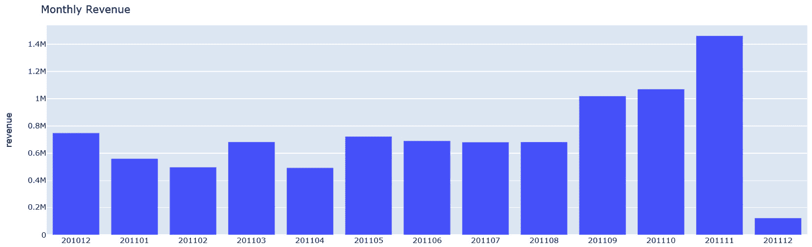

# 第一章：机器学习生命周期概述

**机器学习**（**ML**）是计算机科学的一个子领域，涉及研究和探索可以使用统计分析学习数据结构的计算机算法。用于学习的数据集称为训练数据。训练的输出称为模型，然后可以用来对新数据集进行预测，该数据集模型之前未曾见过。机器学习有两个广泛的类别：**监督学习**和**无监督学习**。在监督学习中，训练数据集被标记（数据集将有一个目标列）。算法旨在根据数据集中的其他列（特征）来学习如何预测目标列。预测房价、股市变化和客户流失是一些监督学习的例子。另一方面，在无监督学习中，数据未标记（数据集将没有目标列）。在这种情况下，算法旨在识别数据集中的共同模式。为未标记数据集生成标签的一种方法是使用无监督学习算法。异常检测是无监督学习的一个用例。

机器学习第一个数学模型的想法是在 1943 年由沃尔特·皮茨和沃伦·麦卡洛克提出的（[《机器学习的历史：这一切是如何开始的？》](https://labelyourdata.com/articles/history-of-machine-learning-how-did-it-all-start)）。后来，在 1950 年代，阿瑟·塞缪尔开发了一个玩冠军级电脑跳棋的程序。从那时起，我们在机器学习领域已经取得了长足的进步。如果你还没有阅读这篇文章，我强烈推荐你阅读。

现在，当我们试图向系统和设备教授实时决策时，机器学习工程师和数据科学家职位是市场上最热门的工作。预计到 2027 年，全球机器学习市场规模将从 2019 年的 83 亿美元增长到 1179 亿美元。如下所示，这是一组独特的技能集，与多个领域重叠：


图 1.1 – 机器学习/数据科学技能集

在 2007 年和 2008 年，DevOps 运动彻底改变了软件开发和运营的方式。它缩短了软件的生产时间：


](img/B18024_01_01.jpg)

图 1.2 – DevOps

同样地，要将模型从实验阶段过渡到实际应用，我们需要一套标准化的流程，使这一过程无缝进行。嗯，对此的答案是**机器学习运维**（**MLOps**）。许多行业专家已经发现了一套可以缩短 ML 模型生产时间的模式。2021 年是 MLOps 的一年——有很多新成立的初创公司正在试图满足那些在 ML 道路上落后的公司的 ML 需求。我们可以假设随着时间的推移，这将会不断扩大并变得更好，就像任何其他过程一样。随着我们的成长，将会出现许多发现和工作方式，最佳实践，以及更多将逐步发展。在这本书中，我们将讨论一个用于标准化 ML 及其最佳实践的常用工具：特征存储。

在我们讨论特征存储是什么以及如何使用它之前，我们需要了解机器学习生命周期及其常见疏忽。我想将本章奉献给学习机器学习生命周期的不同阶段。作为本章的一部分，我们将进行一个 ML 模型构建练习。我们不会深入探讨 ML 模型本身，如其算法或如何进行特征工程；相反，我们将关注 ML 模型通常会经历的阶段，以及模型构建与模型运维中涉及的困难。我们还将讨论耗时且重复的阶段。本章的目标是理解整体机器学习生命周期和模型运维中存在的问题。这将为本章后续章节奠定基础，我们将讨论特征管理、特征存储在 ML 中的作用，以及特征存储如何解决本章中我们将讨论的一些问题。

在本章中，我们将涵盖以下主题：

+   实践中的机器学习生命周期

+   理想世界与真实世界

+   机器学习中最耗时的阶段

不再拖延，让我们动手实践一个 ML 模型。

# 技术要求

要跟随本书中的代码示例，您需要熟悉 Python 和任何笔记本环境，这可以是本地设置，如 Jupyter，或在线笔记本环境，如 Google Colab 或 Kaggle。我们将使用 Python3 解释器和 PIP3 来管理虚拟环境。您可以从以下 GitHub 链接下载本章的代码示例：[`github.com/PacktPublishing/Feature-Store-for-Machine-Learning/tree/main/Chapter01`](https://github.com/PacktPublishing/Feature-Store-for-Machine-Learning/tree/main/Chapter01)。

# 实践中的机器学习生命周期

正如 HBO 的《新闻室》中杰夫·丹尼尔斯的角色所说，解决任何问题的第一步是认识到问题的存在。让我们遵循这一知识，看看它对我们是否适用。

在本节中，我们将选择一个问题陈述并逐步执行机器学习生命周期。一旦完成，我们将回顾并识别任何问题。以下图表显示了机器学习的不同阶段：


图 1.3 – 机器学习生命周期

让我们看一下我们的问题陈述。

## 问题陈述（计划和创建）

对于这个练习，让我们假设你拥有一家零售业务，并希望提高客户体验。首先，你想要找到你的客户细分和客户**终身价值（LTV）**。如果你在这个领域工作过，你可能知道不同的方法来解决这个问题。我将遵循 Barış Karaman 的中等博客系列*了解你的指标 – 学习如何使用 Python 跟踪什么和如何跟踪*（https://towardsdatascience.com/data-driven-growth-with-python-part-1-know-your-metrics-812781e66a5b）。你可以阅读这篇文章以获取更多详细信息。欢迎你自己尝试。数据集在此处可用：[`www.kaggle.com/vijayuv/onlineretail`](https://www.kaggle.com/vijayuv/onlineretail)。

## 数据（准备和清理）

首先，让我们安装`pandas`包：

```py
!pip install pandas
```

让我们将数据集提供给我们的笔记本环境。为此，请将数据集下载到您的本地系统，然后根据您的设置执行以下步骤之一：

+   将`.csv`文件作为输入传递给`pd.read_csv`方法。

+   **Google Colab**：通过点击左侧导航菜单中的文件夹图标和上传图标来上传数据集。

让我们预览一下数据集：

```py
import pandas as pd
```

```py
retail_data = pd.read_csv('/content/OnlineRetail.csv', 
```

```py
                          encoding= 'unicode_escape')
```

```py
retail_data.sample(5)
```

上述代码块的结果如下：


图 1.4 – 数据集预览

如您所见，数据集包括客户交易数据。除了未标记的索引列外，数据集由八个列组成：

+   `InvoiceNo`：唯一的订单 ID；数据类型为`整数`

+   `StockCode`：产品的唯一 ID；数据类型为`字符串`

+   `Description`：产品的描述；数据类型为`字符串`

+   `Quantity`：已订购产品的单位数量

+   `InvoiceDate`：发票生成日期

+   `UnitPrice`：每单位产品的成本

+   `CustomerID`：订购产品的客户的唯一 ID

+   `Country`：产品订购的国家

一旦你有了数据集，在跳入特征工程和模型构建之前，数据科学家通常会进行一些探索性分析。这里的想法是检查你拥有的数据集是否足够解决该问题，识别缺失的差距，检查数据集中是否存在任何相关性，等等。

对于练习，我们将计算月收入并查看其季节性。以下代码块从`InvoiceDate`列提取年份和月份（`yyyymm`）信息，通过乘以`UnitPrice`和`Quantity`列来计算每笔交易的`revenue`属性，并根据提取的年月（`yyyymm`）列汇总收入。

让我们从上一条代码语句继续：

```py
##Convert 'InvoiceDate' to of type datetime
```

```py
retail_data['InvoiceDate'] = pd.to_datetime(
```

```py
    retail_data['InvoiceDate'], errors = 'coerce')
```

```py
##Extract year and month information from 'InvoiceDate'
```

```py
retail_data['yyyymm']=retail_data['InvoiceDate'].dt.strftime('%Y%m')
```

```py
##Calculate revenue generated per order
```

```py
retail_data['revenue'] = retail_data['UnitPrice'] * retail_data['Quantity']
```

```py
## Calculate monthly revenue by aggregating the revenue on year month column  
```

```py
revenue_df = retail_data.groupby(['yyyymm'])['revenue'].sum().reset_index()
```

```py
revenue_df.head()
```

上述代码将输出以下数据框：


图 1.5 – 收入数据框

让我们可视化`revenue`数据框。我将使用一个名为`plotly`的库。以下命令将在您的笔记本环境中安装`plotly`：

```py
!pip install plotly
```

让我们绘制一个条形图，从`revenue`数据框中，将`yyyymm`列放在*x*轴上，将`revenue`放在*y*轴上：

```py
import plotly.express as px
```

```py
##Sort rows on year-month column
```

```py
revenue_df.sort_values( by=['yyyymm'], inplace=True)
```

```py
## plot a bar graph with year-month on x-axis and revenue on y-axis, update x-axis is of type category.
```

```py
fig = px.bar(revenue_df, x="yyyymm", y="revenue", 
```

```py
             title="Monthly Revenue") 
```

```py
fig.update_xaxes(type='category')
```

```py
fig.show()
```

上述代码按`yyyymm`列对收入数据框进行排序，并绘制了`revenue`与年月（`yyyymm`）列的条形图，如下面的截图所示。如您所见，九月、十月和十一月是高收入月份。本应验证我们的假设与几年的数据，但不幸的是，我们没有这些数据。在我们继续到模型开发之前，让我们看一下另一个指标——每月活跃客户——并看看它是否与每月收入相关：



图 1.6 – 每月收入

在同一笔记本中继续，以下命令将通过在年月（`yyyymm`）列上聚合唯一的`CustomerID`计数来计算每月活跃客户：

```py
active_customer_df = retail_data.groupby(['yyyymm'])['CustomerID'].nunique().reset_index()
```

```py
active_customer_df.columns = ['yyyymm', 
```

```py
                              'No of Active customers']
```

```py
active_customer_df.head()
```

上述代码将产生以下输出：


图 1.7 – 每月活跃客户数据框

让我们以前面的方式绘制前面的数据框：

```py
## Plot bar graph from revenue data frame with yyyymm column on x-axis and No. of active customers on the y-axis.
```

```py
fig = px.bar(active_customer_df, x="yyyymm", 
```

```py
             y="No of Active customers", 
```

```py
             title="Monthly Active customers") 
```

```py
fig.update_xaxes(type='category')
```

```py
fig.show()
```

上述命令绘制了`No of Active customers`与年月（`yyyymm`）列的条形图。如下面的截图所示，`每月活跃客户`与前面截图所示的每月收入呈正相关：


图 1.8 – 每月活跃客户

在下一节中，我们将构建一个客户 LTV 模型。

## 模型

现在我们已经完成了数据探索，让我们构建 LTV 模型。**客户终身价值**（**CLTV**）定义为与客户在公司生命周期中相关的**净盈利**。简单来说，CLV/LTV 是对每个客户对业务价值的预测（参考：[`www.toolbox.com/marketing/customer-experience/articles/what-is-customer-lifetime-value-clv/`](https://www.toolbox.com/marketing/customer-experience/articles/what-is-customer-lifetime-value-clv/))。预测终身价值有不同的方法。一种可能是预测客户的值，这是一个回归问题，另一种可能是预测客户群体，这是一个分类问题。在这个练习中，我们将使用后者方法。

对于这个练习，我们将把客户分为以下几组：

+   **低 LTV**：不太活跃或收入较低的客户

+   **中 LTV**：相当活跃且收入适中的客户

+   **高 LTV**：高收入客户 – 我们不希望失去的细分市场

我们将使用 3 个月的数据来计算客户的**最近度**（**R**）、**频率**（**F**）和**货币**（**M**）指标，以生成特征。一旦我们有了这些特征，我们将使用 6 个月的数据来计算每个客户的收入并生成 LTV 聚类标签（低 LTV、中 LTV 和高 LTV）。生成的标签和特征将被用于训练一个 XGBoost 模型，该模型可以用来预测新客户的群体。

### 特征工程

让我们在同一个笔记本中继续我们的工作，计算客户的 R、F 和 M 值，并根据从个人 R、F 和 M 分数计算出的值对客户进行分组：

+   **最近度（R）**：最近度指标表示客户上次购买以来过去了多少天。

+   **频率（F）**：正如术语所暗示的，F 代表客户进行了多少次购买。

+   **货币（M）**：特定客户带来的收入。

由于客户的消费和购买模式根据人口统计地理位置的不同而有所不同，因此在这个练习中，我们只考虑属于英国的数据。让我们读取`OnlineRetails.csv`文件，并过滤掉不属于英国的数据：

```py
import pandas as pd
```

```py
from datetime import datetime, timedelta, date
```

```py
from sklearn.cluster import KMeans
```

```py
##Read the data and filter out data that belongs to country other than UK
```

```py
retail_data = pd.read_csv('/content/OnlineRetail.csv', 
```

```py
                           encoding= 'unicode_escape')
```

```py
retail_data['InvoiceDate'] = pd.to_datetime(
```

```py
    retail_data['InvoiceDate'], errors = 'coerce')
```

```py
uk_data = retail_data.query("Country=='United Kingdom'").reset_index(drop=True)
```

在下面的代码块中，我们将创建两个不同的 DataFrame。第一个（`uk_data_3m`）将用于`InvoiceDate`在`2011-03-01`和`2011-06-01`之间的数据。这个 DataFrame 将用于生成 RFM 特征。第二个 DataFrame（`uk_data_6m`）将用于`InvoiceDate`在`2011-06-01`和`2011-12-01`之间的数据。这个 DataFrame 将用于生成模型训练的目标列。在这个练习中，目标列是 LTV 组/聚类。由于我们正在计算客户 LTV 组，较大的时间间隔将给出更好的分组。因此，我们将使用 6 个月的数据来生成 LTV 组标签：

```py
## Create 3months and 6 months data frames
```

```py
t1 = pd.Timestamp("2011-06-01 00:00:00.054000")
```

```py
t2 = pd.Timestamp("2011-03-01 00:00:00.054000")
```

```py
t3 = pd.Timestamp("2011-12-01 00:00:00.054000")
```

```py
uk_data_3m = uk_data[(uk_data.InvoiceDate < t1) & (uk_data.InvoiceDate >= t2)].reset_index(drop=True)
```

```py
uk_data_6m = uk_data[(uk_data.InvoiceDate >= t1) & (uk_data.InvoiceDate < t3)].reset_index(drop=True)
```

现在我们有两个不同的 DataFrame，让我们使用 `uk_data_3m` DataFrame 来计算 RFM 值。以下代码块通过将 `UnitPrice` 与 `Quantity` 相乘来计算 `revenue` 列。为了计算 RFM 值，代码块对 `CustomerID` 执行了三次聚合：

+   要在 DataFrame 中计算 `max_date`，必须计算每个客户的 `R = max_date – x.max()`，其中 `x.max()` 计算特定 `CustomerID` 的最新 `InvoiceDate`。

+   要计算特定 `CustomerID` 的发票数量 `count`。

+   要计算特定 `CustomerID` 的 `revenue` 的 `sum` 值。

以下代码片段执行此逻辑：

```py
## Calculate RFM values.
```

```py
uk_data_3m['revenue'] = uk_data_3m['UnitPrice'] * uk_data_3m['Quantity']
```

```py
# Calculating the max invoice date in data (Adding additional day to avoid 0 recency value)
```

```py
max_date = uk_data_3m['InvoiceDate'].max() + timedelta(days=1)
```

```py
rfm_data = uk_data_3m.groupby(['CustomerID']).agg({
```

```py
        'InvoiceDate': lambda x: (max_date - x.max()).days,
```

```py
        'InvoiceNo': 'count',
```

```py
        'revenue': 'sum'})
```

```py
rfm_data.rename(columns={'InvoiceDate': 'Recency',
```

```py
                         'InvoiceNo': 'Frequency',
```

```py
                         'revenue': 'MonetaryValue'}, 
```

```py
                         inplace=True)
```

在这里，我们已经计算了客户的 R、F 和 M 值。接下来，我们需要将客户分为 R、F 和 M 组。这种分组定义了客户在 R、F 和 M 指标方面相对于其他客户的位置。为了计算 R、F 和 M 组，我们将根据他们的 R、F 和 M 值将客户分为大小相等的组。这些值在之前的代码块中已经计算。为了实现这一点，我们将使用名为 `pd.qcut` ([`pandas.pydata.org/pandas-docs/stable/reference/api/pandas.qcut.html`](https://pandas.pydata.org/pandas-docs/stable/reference/api/pandas.qcut.html)) 的方法在 DataFrame 上进行操作。或者，你可以使用任何 *聚类* 方法将客户分为不同的组。我们将把 R、F 和 M 组的值加起来，生成一个范围从 0 到 9 的单个值，称为 `RFMScore`。

在这个练习中，客户将被分为四个组。可以使用 *肘部方法* ([`towardsdatascience.com/clustering-metrics-better-than-the-elbow-method-6926e1f723a6`](https://towardsdatascience.com/clustering-metrics-better-than-the-elbow-method-6926e1f723a6)) 来计算任何数据集的最佳组数。前面的链接还包含了关于你可以使用的其他计算最佳组数的替代方法的信息，所以请随意尝试。我将把它留给你作为练习。

以下代码块计算 `RFMScore`:

```py
## Calculate RFM groups of customers 
```

```py
r_grp = pd.qcut(rfm_data['Recency'], q=4, 
```

```py
                labels=range(3,-1,-1))
```

```py
f_grp = pd.qcut(rfm_data['Frequency'], q=4, 
```

```py
                labels=range(0,4))
```

```py
m_grp = pd.qcut(rfm_data['MonetaryValue'], q=4, 
```

```py
                labels=range(0,4))
```

```py
rfm_data = rfm_data.assign(R=r_grp.values).assign(F=f_grp.values).assign(M=m_grp.values)
```

```py
rfm_data['R'] = rfm_data['R'].astype(int)
```

```py
rfm_data['F'] = rfm_data['F'].astype(int)
```

```py
rfm_data['M'] = rfm_data['M'].astype(int)
```

```py
rfm_data['RFMScore'] = rfm_data['R'] + rfm_data['F'] + rfm_data['M']
```

```py
rfm_data.groupby('RFMScore')['Recency','Frequency','MonetaryValue'].mean()
```

前面的代码将生成以下输出：


图 1.9 – RFM 分数摘要

这份总结数据让我们对 `RFMScore` 如何与 `Recency`、`Frequency` 和 `MonetaryValue` 指标直接成比例有一个大致的了解。例如，`RFMScore=0` 的组具有最高的平均最近度（该组的最后购买日是过去最远的），最低的平均频率和最低的平均货币价值。另一方面，`RFMScore=9` 的组具有最低的平均最近度，最高的平均频率和最高的平均货币价值。

通过这样，我们了解到 `RFMScore` 与客户为业务带来的价值呈正相关。所以，让我们按照以下方式对客户进行细分：

+   0-3 => 低值

+   4-6 => 中值

+   7-9 => 高值

以下代码将客户标记为低、中或高价值：

```py
# segment customers.
```

```py
rfm_data['Segment'] = 'Low-Value'
```

```py
rfm_data.loc[rfm_data['RFMScore']>4,'Segment'] = 'Mid-Value' 
```

```py
rfm_data.loc[rfm_data['RFMScore']>6,'Segment'] = 'High-Value' 
```

```py
rfm_data = rfm_data.reset_index()
```

### 客户终身价值

现在我们已经准备好了包含 3 个月数据的 DataFrame 中的客户 RFM 特征，让我们使用 6 个月的数据（`uk_data_6m`）来计算客户的收入，就像我们之前做的那样，并将 RFM 特征与新创建的收入 DataFrame 合并：

```py
# Calculate revenue using the six month dataframe.
```

```py
uk_data_6m['revenue'] = uk_data_6m['UnitPrice'] * uk_data_6m['Quantity']
```

```py
revenue_6m = uk_data_6m.groupby(['CustomerID']).agg({
```

```py
        'revenue': 'sum'})
```

```py
revenue_6m.rename(columns={'revenue': 'Revenue_6m'}, 
```

```py
                  inplace=True)
```

```py
revenue_6m = revenue_6m.reset_index()
```

```py
revenue_6m = revenue_6m.dropna()
```

```py
# Merge the 6m revenue data frame with RFM data.
```

```py
merged_data = pd.merge(rfm_data, revenue_6m, how="left")
```

```py
merged_data.fillna(0)
```

随意绘制 `revenue_6m` 与 `RFMScore` 的关系图。您将看到两者之间存在正相关关系。

在下面的代码块中，我们使用 `revenue_6m` 列，这是客户的 *终身价值*，并使用 K-means 聚类创建三个组，分别称为 *低 LTV*、*中 LTV* 和 *高 LTV*。同样，您可以使用之前提到的 *肘部方法* 来验证最佳簇数量：

```py
# Create LTV cluster groups
```

```py
merged_data = merged_data[merged_data['Revenue_6m']<merged_data['Revenue_6m'].quantile(0.99)]
```

```py
kmeans = KMeans(n_clusters=3)
```

```py
kmeans.fit(merged_data[['Revenue_6m']])
```

```py
merged_data['LTVCluster'] = kmeans.predict(merged_data[['Revenue_6m']])
```

```py
merged_data.groupby('LTVCluster')['Revenue_6m'].describe()
```

前面的代码块生成以下输出：


图 1.10 – LTV 簇摘要

如您所见，标签为 1 的簇包含了一组终身价值非常高的客户，因为该组的平均收入为 14,123.309，而这样的客户只有 21 位。标签为 0 的簇包含了一组终身价值较低的客户，因为该组的平均收入仅为 828.67，而这样的客户有 1,170 位。这种分组让我们知道哪些客户应该始终保持满意。

### 特征集和模型

让我们使用到目前为止计算出的特征来构建 XGBoost 模型，以便模型可以根据输入特征预测客户的 LTV 组。以下是将作为模型输入使用的最终特征集：

```py
feature_data = pd.get_dummies(merged_data)
```

```py
feature_data.head(5)
```

前面的代码块生成以下 DataFrame。这包括将用于训练模型的特征集：


图 1.11 – 模型训练特征集

现在，让我们使用这个特征集来训练 `Xgboost` 模型。预测标签（`y`）是 `LTVCluster` 列；除了 `Revenue_6m` 和 `CustomerID` 列之外的数据集是 `X` 值。由于 `LTVCluster` 列（`y`）是使用 `Revenue_6m` 计算的，所以 `Revenue_6m` 将从特征集中删除。对于新客户，我们可以在不需要至少 6 个月的数据的情况下计算其他特征，并预测他们的 `LTVCluster(y)`。

以下代码将训练 `Xgboost` 模型：

```py
from sklearn.metrics import classification_report, confusion_matrix
```

```py
import xgboost as xgb
```

```py
from sklearn.model_selection import KFold, cross_val_score, train_test_split
```

```py
#Splitting data into train and test data set.
```

```py
X = feature_data.drop(['CustomerID', 'LTVCluster',
```

```py
                       'Revenue_6m'], axis=1)
```

```py
y = feature_data['LTVCluster']
```

```py
X_train, X_test, y_train, y_test = train_test_split(X, y, test_size=0.1)
```

```py
xgb_classifier = xgb.XGBClassifier(max_depth=5, objective='multi:softprob')
```

```py
xgb_model = xgb_classifier.fit(X_train, y_train)
```

```py
y_pred = xgb_model.predict(X_test)
```

```py
print(classification_report(y_test, y_pred))
```

前面的代码块将输出以下分类结果：


图 1.12 – 分类报告

现在，让我们假设我们对模型很满意，并希望将其提升到下一个层次——那就是生产环境。

## 包含、发布和监控

到目前为止，我们已经花费了大量时间研究数据分析、探索、清洗和模型构建，因为这是数据科学家应该关注的事情。但是一旦所有这些工作都完成了，模型是否可以不进行任何额外的工作就部署？答案是不了。我们离部署还远着呢。在我们能够部署模型之前，我们必须做以下事情：

+   我们必须创建一个执行数据清洗和特征工程的数据管道。

+   我们需要一个方法在预测期间获取特征。如果是一个在线/交易模型，应该有一种方法以低延迟获取特征。由于客户的 R、F 和 M 值经常变化，比如说，我们想在网站上针对中值和高值细分市场运行两个不同的活动。将需要近实时地对客户进行评分。

+   找到一种方法使用历史数据重现模型。

+   执行模型打包和版本控制。

+   找到一种方法进行模型的 A/B 测试。

+   找到一种方法监控模型和数据漂移。

由于我们没有准备好这些，让我们停下来回顾一下我们已经做了什么，看看是否有更好的方法，以及是否有任何常见的疏忽。

在下一节中，我们将探讨*我们认为我们构建了什么（理想世界）与实际构建了什么（现实世界）*。

# 理想世界与现实世界

现在我们已经花费了大量时间构建了这个美丽的数据产品，可以帮助业务根据客户带来的价值来区别对待客户，让我们看看我们对它的期望与它能做什么之间的差异。

## 可复用性和共享

可复用性是 IT 行业中的常见问题之一。我们面前有关于产品的这些优秀数据，包括我们在探索过程中构建的图表和为我们的模型生成的特征。这些可以被其他数据科学家、分析师和数据工程师复用。就目前的状态而言，它们可以被复用吗？答案是可能。数据科学家可以共享笔记本本身，可以创建演示文稿等等。但是，没有人能够发现他们是否在寻找，比如说，客户细分或 RFM 特征，这些在其他模型中可能非常有用。所以，如果另一个数据科学家或 ML 工程师正在构建需要相同特征的模型，他们唯一的选择就是重新发明轮子。新模型可能基于数据科学家如何生成它，使用相同的、更准确或更不准确的 RFM 特征。然而，可能存在第二种模型的发展本可以通过更好的发现和复用工作来加速的情况。此外，正如俗话所说，*三个臭皮匠，顶个诸葛亮*。合作将使数据科学家和业务双方都受益。

## 笔记本中的所有内容

数据科学是一项独特的技能，与软件工程不同。尽管一些数据科学家可能拥有软件工程师的背景，但这个角色的需求本身可能会使他们远离软件工程技能。随着数据科学家在数据探索和模型构建阶段投入更多时间，**集成开发环境**（**IDEs**）可能不足以应对他们处理的大量数据。如果我们必须在个人 Mac 或 PC 上进行数据探索、特征工程和模型构建，数据处理阶段可能会持续数天。此外，他们还需要有灵活性，能够使用不同的编程语言，如 Python、Scala、R、SQL 等，在分析过程中动态添加命令。这就是为什么有那么多笔记本平台提供商，包括 Jupyter、Databricks 和 SageMaker 的原因之一。

由于数据产品/模型开发与传统的软件开发不同，在没有额外工作的前提下，将实验代码部署到生产环境总是不可能的。大多数数据科学家从笔记本开始他们的工作，并以我们之前章节中的方式构建一切。一些标准实践和工具，如特征存储，不仅可以帮助他们将模型构建过程分解成多个生产就绪的笔记本，还可以帮助他们避免重新处理数据、调试问题和代码重用。

现在我们已经了解了机器学习开发的现实情况，让我们简要地回顾一下机器学习中最耗时的阶段。

# 机器学习最耗时的阶段

在本章的第一节中，我们介绍了机器学习生命周期的不同阶段。让我们更详细地看看其中的一些阶段，并考虑它们的复杂程度以及我们应该在每个阶段上花费多少时间。

## 确定数据集

一旦我们有了问题陈述，下一步就是确定我们需要的数据集来解决问题。在我们所遵循的例子中，我们知道数据集在哪里，并且它是已知的。然而，在现实世界中，事情并不那么简单。由于每个组织都有自己的数据仓库方式，找到所需的数据可能既简单也可能需要很长时间。大多数组织运行数据目录服务，如 Amundsen、Atlan 和 Azure Data Catalog，以便他们的数据集易于发现。但同样，工具的好坏取决于它们的使用方式或使用它们的人。因此，我想说的是，找到你想要的数据总是很容易的。除此之外，考虑到数据访问控制，即使你确定了解决问题所需的数据集，除非你之前已经使用过它，否则你很可能无法访问它。确定访问权限将是另一个主要的障碍。

## 数据探索和特征工程

数据探索：一旦你确定了数据集，下一个最大的任务是“再次确定数据集”！你读对了——对于数据科学家来说，下一个最大的任务是确保他们选择的数据集是解决问题的关键。这会涉及到数据清洗，补充缺失数据，转换数据，绘制不同的图表，找到相关性，发现数据偏斜等等。最好的部分是，如果数据科学家发现某些事情不对劲，他们会回到上一步，也就是寻找更多的数据集，再次尝试，然后返回。

特征工程同样不容易；领域知识成为构建特征集以训练模型的关键。如果你是一位过去几年一直在从事定价和促销模型工作的数据科学家，你就会知道哪些数据集和特征会比过去几年一直在从事客户价值模型工作的数据科学家得到更好的模型。让我们尝试一个练习，看看特征工程是否容易，以及领域知识是否起关键作用。看看下面的截图，看看你是否能识别出这些动物：


图 1.13 – 持有狗和猫的人

我相信你知道这些动物是什么，但让我们退一步看看我们是如何正确识别这些动物的。当我们看图时，我们的潜意识进行了特征工程。它可能会选择一些特征，比如“它有两只耳朵”，两只“眼睛”，一个“鼻子”，一个“头”，和一个“尾巴”。然而，它选择了更复杂的特点，比如“它的脸型”，“它的眼睛形状”，“它的鼻子形状”，以及“它的毛发的颜色和质感”。如果它选择了第一组特征，这两种动物就会变成相同的，这是一个糟糕的特征工程和糟糕模型的例子。由于它选择了后者，我们将其识别为不同的动物。再次，这是一个好的特征工程和好的模型的例子。

但我们还需要回答的另一个问题是，我们是在什么时候发展出动物识别的专业知识的？嗯，可能是因为我们的幼儿园老师。我们都记得从老师、父母、兄弟姐妹那里学到的第一百种动物的一些版本。我们一开始并没有全部正确，但最终我们做到了。随着时间的推移，我们获得了专业知识。

现在，如果我们不是看到猫和狗的图片，而是看到两条蛇的图片，我们的任务是识别哪条是有毒的，哪条是无毒的。虽然我们都能识别出它们是蛇，但几乎没有人能识别出哪条是有毒的，哪条是无毒的。除非这个人以前是蛇笛手。

因此，在特征工程中，领域专业知识变得至关重要。就像数据探索阶段一样，如果我们对特征不满意，我们就回到了起点，这涉及到寻找更多数据和更好的特征。

## 模型到生产与监控

一旦我们确定了上述阶段，除非有合适的基础设施准备就绪并等待，否则将模型投入生产将非常耗时。为了使模型在生产中运行，它需要一个处理平台来运行数据清洗和特征工程代码。它还需要一个编排框架以计划或基于事件的方式运行特征工程管道。在某些情况下，我们还需要一种安全地以低延迟存储和检索特征的方法。如果模型是事务性的，模型必须打包以便消费者可以安全访问，可能作为一个 REST 端点。此外，部署的模型应该具有可扩展性，以服务即将到来的流量。

模型和数据监控也是至关重要的方面。由于模型性能直接影响业务，你必须知道哪些指标会决定模型需要提前重新训练。除了模型监控之外，数据集也需要监控偏差。例如，在电子商务业务中，流量模式和购买模式可能会根据季节性、趋势和其他因素频繁变化。及早识别这些变化将对业务产生积极影响。因此，数据和特征监控是模型投入生产的关键。

# 摘要

在本章中，我们讨论了机器学习生命周期中的不同阶段。我们选择了一个问题陈述，进行了数据探索，绘制了一些图表，进行了特征工程和客户细分，并构建了客户终身价值模型。我们审视了疏忽之处，并讨论了机器学习中最耗时的阶段。我希望你们能和我站在同一页面上，为本书的其余部分打下良好的基础。

在下一章中，我们将设定需要特征存储的背景，以及它如何可以改进机器学习过程。我们还将讨论将特征引入生产的需求以及一些传统的实现方式。

第一章：机器学习生命周期的概述

第一章：机器学习生命周期的概述
