# 第三章：特征存储基础、术语和用法

在上一章中，我们讨论了将特征引入生产的需求以及实现这一目标的不同方式，同时审视了这些方法中常见的常见问题以及特征存储如何解决这些问题。我们对特征存储有了很多期望，现在是时候了解它们是如何工作的了。正如上一章所述，特征存储与传统数据库不同——它是一个用于管理机器学习特征的数据存储服务，一个可以用于存储和检索历史特征的混合系统，用于模型训练。它还可以以低延迟提供最新特征进行实时预测，以及以亚秒级延迟进行批量预测。

在本章中，我们将讨论特征存储是什么，它是如何工作的，以及特征存储领域使用的术语范围。对于本章，我们将使用最广泛使用的开源特征存储之一，称为**Feast**。本章的目标是让你了解 Feast 特征存储术语和 API 的基本用法，并简要了解其内部工作原理。

在本章中，我们将讨论以下主题：

+   Feast 简介和安装

+   Feast 术语和定义

+   Feast 初始化

+   Feast 使用

+   Feast 幕后

# 技术要求

要跟随本章中的代码示例，你只需要熟悉 Python 和任何笔记本环境，这可以是本地设置，如 Jupyter，或者在线笔记本环境，如 Google Colab 或 Kaggle。你可以从以下 GitHub 链接下载本章的代码示例：[`github.com/PacktPublishing/Feature-Store-for-Machine-Learning/tree/main/Chapter03`](https://github.com/PacktPublishing/Feature-Store-for-Machine-Learning/tree/main/Chapter03)。

# Feast 简介和安装

**Feast**是一个开源的特征管理系统，用于提供和管理机器学习特征。它是*Google*和*Gojek*之间的合作成果，随后被*Linux Foundation AI and Data*采用。Feast 最初是为**Google Cloud Platform (GCP)**构建的，后来扩展到可以在其他云平台如**Amazon Web Services (AWS)**和**Microsoft Azure**上运行。如今，你还可以在**本地**基础设施上运行 Feast。云无关性是 Feast 相较于其他特征存储提供的最大优势。

然而，Feast 是一个自管理的基础设施。根据您的组织结构，您需要一个团队来创建和管理 Feast 的基础设施。在此需要注意的是，Feast 从 **面向服务的架构（SOA**）转变为基于 **软件开发工具包（SDK）/命令行界面（CLI**）。这使得小型团队能够快速安装、运行和实验 Feast，而无需花费大量时间在初始设置上，结果却发现 Feast 并不适合。然而，对于生产环境，工程团队可能需要管理多个基础设施来运行其项目集。如果您不喜欢自管理基础设施，Feast 有其他替代方案。这包括 *Tecton*，它是 Feast 当前的主要贡献者之一，*SageMaker Feature Store*，这是一个 AWS 管理的功能存储，*Databricks Feature Store* 以及更多。

现在我们简要了解了 Feast 是什么，让我们看看安装过程。与其他需要您在云上运行服务或注册云提供商的其他功能存储不同，Feast 可以在笔记本环境中安装，无需设置任何额外的服务。

以下命令将在您的笔记本环境中安装 Feast 的最新版本：

```py
!pip install feast
```

是的，如果您想尝试它，安装和运行 Feast 您只需做这么多。然而，要与团队、开发者、预发布环境和生产环境协作，设置将涉及一些额外的步骤。我们将在下一组章节中介绍。现在，查看 API、术语和项目结构已经足够了。

在下一节中，我们将探讨 Feast 术语、初始化和一些 API。

# Feast 术语和定义

在软件应用的新发现中，常常会诞生新的术语，或者在新的软件背景下重新定义一些现有的术语。例如，**有向无环图（DAG**）在一般情况下意味着一种图类型；而在 Airflow 的背景下（假设您已经熟悉它），它意味着定义一组任务及其依赖关系。同样，Feast 和更广泛的功能存储背景下有一系列常用的术语。让我们在本节中学习它们是什么。

**实体**：*实体是一组语义相关的特征集合*。实体是特征可以映射到的域对象。在打车服务中，*客户*和*司机*可以是实体，然后特征可以与相应的实体分组。

以下代码块是实体定义的示例：

```py
driver = Entity(name='driver', value_type=ValueType.STRING,
```

```py
                join_key='driver_id')
```

实体是功能视图的一部分，在功能摄取和检索过程中充当主键。在模型训练和预测期间，可以在主键上执行**时间点**连接和特征查找。

**特征**：*特征是一个可测量的单个属性*。*它通常是观察特定实体的属性，但不必与实体相关联*。例如，客户在网站上平均花费的时间可以是一个特征。一个非关联的特征可以是今天网站上新增客户的数量。以下代码块是一个特征定义的示例：

```py
trips_today = Feature(name="trips_today", 
```

```py
                      dtype=ValueType.INT64)
```

特征代表底层特征数据的列。如您在前面的示例中看到的，它有 `name` 和 `dtype` 属性。

**数据源**：数据源代表底层数据。Feast 支持一系列数据源，包括 **FileSource**（本地、S3、GCS）、**BigQuery** 和 **Redshift**。

以下截图是一个数据源的示例：

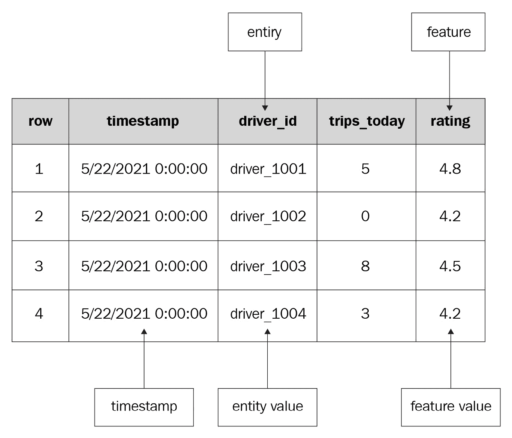

图 3.1 – 数据源

如您在前面的图中看到的，数据集有一个 `driver_id` 实体，`trips_today` 和 `rating` 特征，以及一个 `timestamp` 列。您在 *图 3.1* 中看到的表格数据结构是一个 *特征视图*。

**特征视图**：特征视图类似于数据库表，它表示特征数据在其源处的结构。特征视图由实体、一个或多个特征和数据源组成。特征视图通常围绕一个类似于数据库对象的领域对象进行建模。在某些情况下，特征视图可以是无实体的。

以下代码块是一个 `FeatureView` 定义的示例：

```py
driver_stats_fv = FeatureView(
```

```py
    name="driver_activity",
```

```py
    entities=["driver"],
```

```py
    ttl=timedelta(hours=2),
```

```py
    features=[
```

```py
        Feature(name="trips_today", dtype=ValueType.INT64),
```

```py
        Feature(name="rating", dtype=ValueType.FLOAT),
```

```py
    ],
```

```py
    batch_source=BigQuerySource(
```

```py
        table_ref="feast-oss.demo_data.driver_activity"
```

```py
    )
```

```py
)
```

如您在前面的代码块中看到的，`FeatureView` 有一个 `driver` 实体，`trips_today` 和 `rating` 特征，以及 `BigQuerySource` 作为数据源。根据特征存储库的不同，特征视图有其他同义词。例如，在 SageMaker Feature Store 中，它被称为 **Feature Group**，在 Databricks Feature Store 中，它被称为 **Feature Table**，在 Feast 的旧版本中，它被称为 **Feature Set** 和 **Feature Table**。

`timestamp` 列存储特定事件发生的信息（即，特定事件在系统中产生的时间）。此外，特征存储库提供灵活性，可以添加额外的列，如 *创建时间*、*摄取 API 调用时间* 等。这使得数据科学家和数据工程师能够在过去任何时间重现系统的状态。为了在过去重现状态，系统执行 **时刻点连接**。在 Feast 中，此功能作为 API 原生提供。在其他系统中，用户可能需要编写代码来实现它。

让我们看看一个实际中时刻点连接的例子。以下数据集的模式与 *图 3.1* 中定义的 `FeatureView` 匹配。

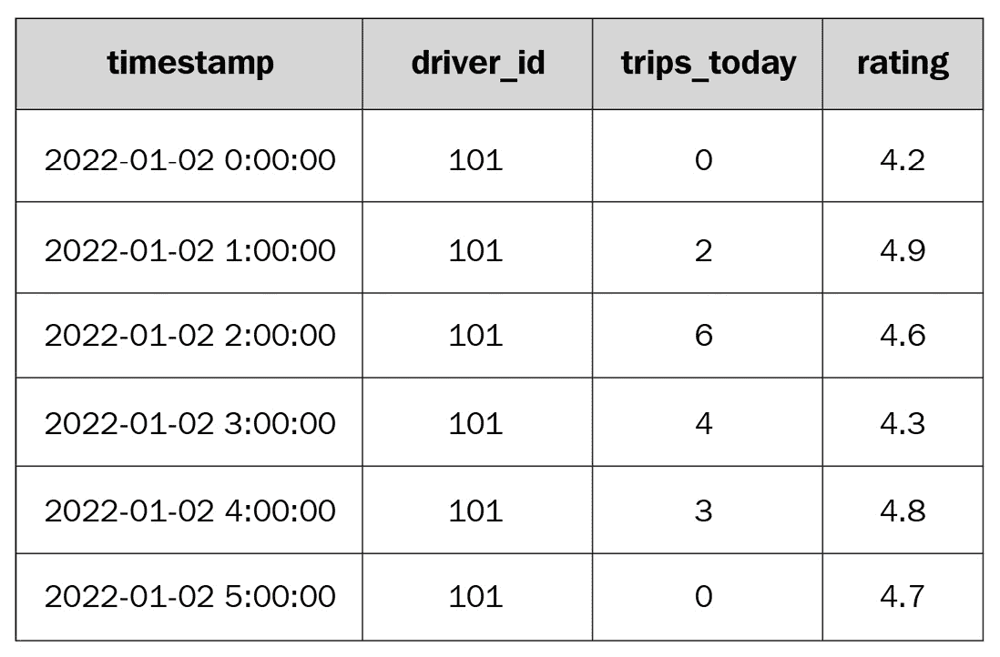

图 3.2 – 时刻点连接数据集

在后面的部分中，您将看到，要获取历史数据，您需要一个类似于以下内容的实体 DataFrame：

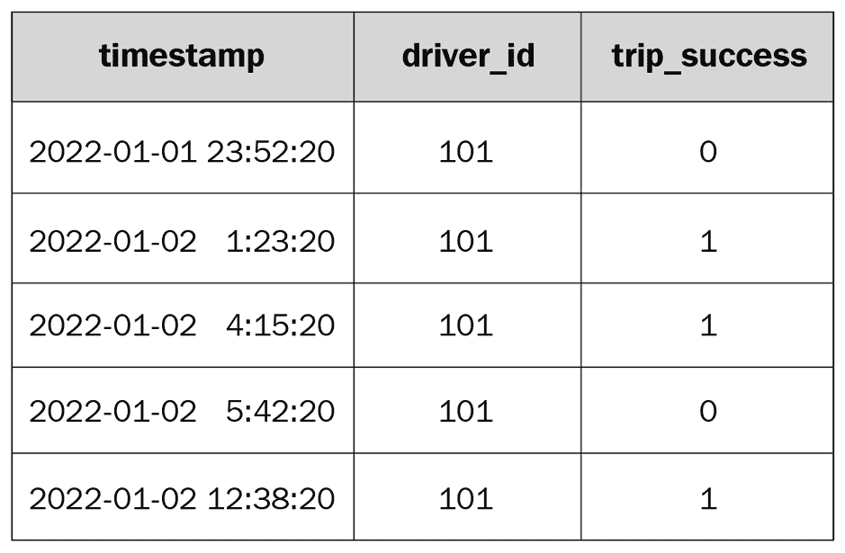

图 3.3 – 时刻点连接实体 DataFrame

当用户调用 `store.get_historical_features()` 时，带有 *图 3.3* 中的实体 DataFrame 和特征列表，Feast 执行 `2022-01-01 23:52:20` 的操作。**时刻点连接** 寻找具有最新时间戳的驾驶员特征。

以下截图显示了 **时刻点连接** 的实际操作：

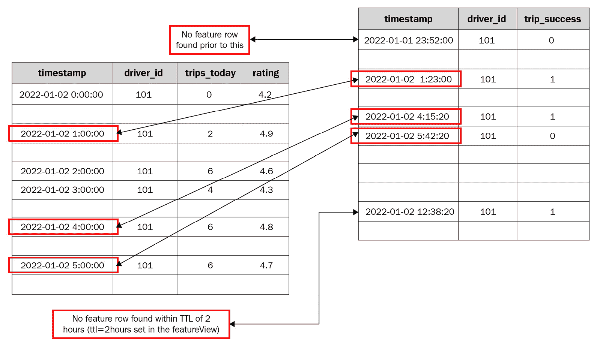

图 3.4 – 时刻点连接

`FeatureView` 的有效期为 2 小时。这表示特征从事件发生时起（`event_timestamp + 2 hours` 窗口）只存活 2 小时。时刻点连接的逻辑是 `timestamp_in_data >= timestamp_in_entity_dataframe` 和 `timestamp_in_entity_dataframe <= timestamp_in_data + ttl (2 hours)`。如 *图 3.4* 所示，第一行在数据中没有匹配的窗口，而实体 DataFrame 的第二、三、四行分别对应于 `2022-01-02 1:00:00`、`2022-01-01 4:00:00` 和 `2022-01-01 5:00:00` 发生的事件的匹配窗口。按照相同的逻辑，实体 DataFrame 的最后一行在数据中没有匹配的窗口。

时刻点连接的输出 DataFrame 如下：

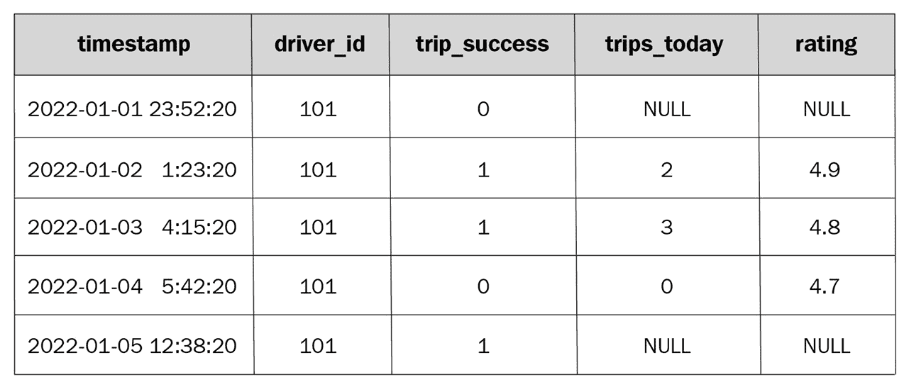

图 3.5 – 时刻点连接输出

如 *图 3.5* 所见，对于没有匹配窗口的行，特征值是 `NULL`，而对于有匹配窗口的行，特征是可用的。

在下一节中，我们将学习如何初始化一个 Feast 项目，了解其内容以及基本 API 使用。

# Feast 初始化

让我们打开一个新的笔记本，安装 `feast` 和 `Pygments` 库的特定版本，以便在查看文件时获得更美观的格式。以下代码安装所需的库：

```py
!pip install feast==0.18.1
```

```py
!pip install Pygments
```

让我们初始化 Feast 项目并查看文件夹结构和文件。以下代码块初始化了一个名为 `demo` 的 Feast 项目：

```py
!feast init demo
```

前面的代码将输出以下行：

```py
Feast is an open source project that collects anonymized error reporting and usage statistics. To opt out or learn more see https://docs.feast.dev/reference/usage
```

```py
Creating a new Feast repository in /content/demo.
```

让我们忽略第一行的警告信息。在第二行，你可以看到 Feast 仓库的初始化位置。如果你使用 Google Colab，你会看到类似的路径，`/content/<repo_name>`；如果不是，仓库将创建在当前工作目录中。

要了解 `feast init` 命令在后台执行了什么，我们需要查看该命令创建的文件夹。你可以使用 Google Colab 的左侧导航栏查看文件或使用 CLI：

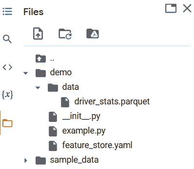

图 3.6 – 文件夹结构

*图 3.6* 是 Google Colab 的快照。正如你所见，`feast init`命令为初学者创建了一个示例项目仓库。`data`文件夹中有一个`driver_stats.parquet`文件，以及一个`example.py`和一个`feature_store.yaml`文件。让我们查看这些文件，看看它们里面有什么。最容易理解的文件是`data`文件夹中的`driver_stats.parquet`文件。正如文件夹所说，它包含演示项目的示例数据。

以下代码块加载了`driver_stats.parquet`中的数据集，并显示其前十行：

```py
import pandas as pd
```

```py
df = pd.read_parquet("demo/data/driver_stats.parquet")
```

```py
df.head(10)
```

前一个代码块产生了以下输出：

![图 3.7 – 示例数据集

![图片 B18024_03_007.jpg]

图 3.7 – 示例数据集

`driver_stats.parquet`文件是一个示例特征数据集，正如你在*图 3.7* 中所见。它包含驾驶员特征，如`conv_rate`和`avg_daily_trips`。它还有额外的列，如`event_timestamp`和`created`。这些是用于执行点时间连接的特殊列，如前所述。

让我们来看看下一个`feature_store.yaml`文件。以下命令会打印文件内容：

```py
!pygmentize demo/feature_store.yaml
```

前一个命令输出了以下内容：

```py
project: demo
```

```py
registry: data/registry.db
```

```py
provider: local
```

```py
online_store:
```

```py
    path: data/online_store.db
```

`feature_store.yaml`文件包含以下变量：

+   `project`：这是项目名称。它使用`feast init`命令的输入作为项目名称。我们运行了`feast init demo`，因此项目名称是`demo`。

+   `registry`：这个变量存储了项目的特征注册表路径。注册表存储了项目的所有元数据，包括`FeatureView`、`Entity`、`DataSources`等。正如你所见，`registry.db`文件在`data`文件夹中尚未存在。它在运行`apply`命令时创建；我们将在*Feast 使用*部分查看它。

+   `provider`：这个变量定义了特征存储将要运行的位置。值设置为`local`，表示基础设施将在本地系统上运行。其他可能的值包括`aws`、`gcp`等。对于`aws`和`gcp`提供者，需要安装额外的依赖项，并且需要向`feast init`命令传递额外的参数。

+   `online_store`：正如`online_store`参数的名称所暗示的，它用于以低延迟存储和提供特征。默认情况下，它使用 SQLite，但 Feast 为在线存储提供了各种选项，从*DynamoDB*到*自定义存储*。以下页面列出了在线存储的支持选项：[`docs.feast.dev/roadmap`](https://docs.feast.dev/roadmap)。

+   `offline_store`：你不会在`feature_store.yaml`文件中看到这个变量。然而，这是另一个重要的参数，用于从提供的选项中设置*历史存储*。同样，Feast 在这里提供了很多灵活性：你可以从*文件存储*到*Snowflake*中选择任何东西。上一个项目符号中的链接包含了关于支持离线存储的信息。

除了之前提到的之外，每个变量可能还包括基于所选选项的一些额外设置。例如，如果选择 Snowflake 作为离线存储，则需要额外的输入，如模式名称、表名称、Snowflake URL 等。

让我们看看 `example.py` 文件包含什么。以下命令打印了文件的内容：

```py
!pygmentize -f terminal16m demo/example.py
```

前述命令的输出非常长，所以我们不会一次性查看所有内容，而是将其分解成几个部分。以下代码块包含了文件的第一个部分：

```py
# This is an example feature definition file
```

```py
from google.protobuf.duration_pb2 import Duration
```

```py
from feast import Entity, Feature, FeatureView, FileSource, ValueType
```

```py
""" Read data from parquet files. Parquet is convenient for local development mode. For production, you can use your favorite DWH, such as BigQuery. See Feast documentation for more info."""
```

```py
Driver_hourly_stats = FileSource(
```

```py
    path="/content/demo/data/driver_stats.parquet",
```

```py
    event_timestamp_column="event_timestamp",
```

```py
    created_timestamp_column="created",
```

```py
)
```

在前面的代码块中，有一些来自已安装库的导入，但导入之后的部分对我们特别感兴趣。代码定义了一个类型为 `FileSource` 的数据源，并提供了 *图 3.7* 中样本数据的路径。如前所述，`event_timestamp_column` 和 `created_timestamp_column` 列是特殊列，分别指示特定事件（数据中的行）发生的时间和行被摄入数据源的时间。

以下代码块包含了文件的第二个部分：

```py
# Define an entity for the driver. You can think of entity as a primary key used to fetch features.
```

```py
Driver = Entity(name="driver_id", 
```

```py
                value_type=ValueType.INT64, 
```

```py
                description="driver id",)
```

在前面的代码块中，定义了一个 `driver_id` 实体及其值类型和描述。

以下代码块包含了文件的最后一部分：

```py
""" Our parquet files contain sample data that includes a driver_id column, timestamps and three feature column. Here we define a Feature View that will allow us to serve this data to our model online."""
```

```py
Driver_hourly_stats_view = FeatureView(
```

```py
    name="driver_hourly_stats",
```

```py
    entities=["driver_id"],
```

```py
    ttl=Duration(seconds=86400 * 1),
```

```py
    features=[
```

```py
        Feature(name="conv_rate", dtype=ValueType.FLOAT),
```

```py
        Feature(name="acc_rate", dtype=ValueType.FLOAT),
```

```py
        Feature(name="avg_daily_trips", 
```

```py
                dtype=ValueType.INT64),
```

```py
    ],
```

```py
    online=True,
```

```py
    batch_source=driver_hourly_stats,
```

```py
    tags={},
```

```py
)
```

前面的代码块包含一个 `FeatureView`。定义包含三个特征，`conv_rate`、`acc_rate` 和 `avg_daily_trips`，并使用文件第二部分中定义的 `driver_id` 实体和文件第一部分中定义的 `driver_hourly_stats` 批次源。除此之外，还有额外的变量：`ttl`、`online` 和 `tags`。`ttl` 定义了特征存活的时间长度。例如，如果你将 `ttl` 设置为 60 秒，它将从事件时间开始只出现在检索中 60 秒。之后，它被视为已过期的特征。`online` 变量指示是否为 `FeatureView` 启用了在线存储。`Tags` 用于存储有关 `FeatureView` 的额外信息，如团队、所有者等，这些信息可能在特征发现中可用。

简而言之，`example.py` 文件包含了 `demo` 项目的实体、特征视图和数据源。这只是一个用于演示的起始模板。我们可以添加额外的实体、特征视图和数据源。

现在我们已经了解了基础知识以及基本项目结构，让我们熟悉一下 Feast API。

# Feast 使用

在本节中，让我们继续在之前初始化 `demo` 项目的同一个笔记本中，注册特征视图和实体，并使用 Feast API 检索特征。

## 注册特征定义

以下代码块注册了在 `example.py` 文件中定义的所有实体和特征视图：

```py
%cd demo
```

```py
!feast apply
```

上述代码产生以下输出：

```py
/content/demo
```

```py
Created entity driver_id
```

```py
Created feature view driver_hourly_stats
```

```py
Created sqlite table demo_driver_hourly_stats
```

输出信息很简单，除了最后一行，它说在`FeatureView`中设置了`online=True`。`apply`命令创建了`registry.db`和`online_store.db`文件，这些文件已在`feature_store.yaml`中设置。

现在实体和特征视图已经注册，我们可以连接到特征存储并浏览现有的定义。

## 浏览特征存储

以下代码连接到特征存储并列出所有实体：

```py
from feast import FeatureStore
```

```py
store = FeatureStore(repo_path=".")
```

```py
for entity in store.list_entities():
```

```py
    print(entity.to_dict())
```

上述代码块在当前目录中查找`feature_store.yaml`文件，并使用`store.list_entities()` API 获取所有实体。同样，可以使用`store.list_feature_views()` API 获取所有可用的特征视图。我将把这留给你作为练习。

让我们在特征存储中添加一个新的实体和特征视图。

## 添加实体和特征视图

要添加一个新的实体和特征视图，我们需要一个特征数据集。目前，让我们使用`numpy`库生成一个合成数据集，并将其作为需要定义实体和特征视图的新特征。

以下代码生成合成特征数据：

```py
import pandas as pd
```

```py
import numpy as np
```

```py
from pytz import timezone, utc
```

```py
from datetime import datetime, timedelta
```

```py
import random
```

```py
days = [datetime.utcnow().replace(hour=0, minute=0, second=0, microsecond=0).replace(tzinfo=utc) \
```

```py
        - timedelta(day) for day in range(10)][::-1]
```

```py
customers = [1001, 1002, 1003, 1004, 1005]
```

```py
customer_features = pd.DataFrame(
```

```py
    {
```

```py
        "datetime": [day for day in days for customer in customers], # Datetime is required
```

```py
        "customer_id": [customer for day in days for customer in customers], # Customer is the entity
```

```py
        "daily_transactions": [np.random.rand() * 10 for _ in range(len(days) * len(customers))], # Feature 1
```

```py
        "total_transactions": [np.random.randint(100) for _ in range(len(days) * len(customers))], # Feature 2
```

```py
    }
```

```py
)
```

```py
customer_features.to_parquet("/content/demo/data/customer_features.parquet")
```

```py
customer_features.head(5)
```

上述代码生成一个包含四个列的数据集，并将数据集写入`/content/demo/data/`。如果你在本地系统上运行此代码，请相应地设置`customer_features.to_parquet` API 调用的路径，该路径在上述代码块中被突出显示。

上述代码生成了*图 3.8*中所示的数据集：

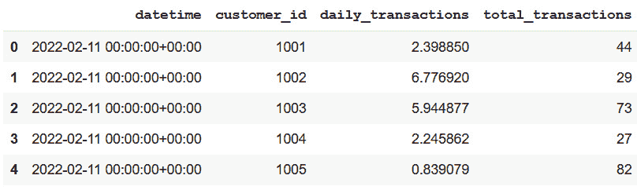

图 3.8 – 合成客户数据

*图 3.4*中数据集的`Entity`和`FeatureView`的定义可以添加到现有的`example.py`文件中，或者你可以创建一个新的 Python 文件并添加以下代码块中的行。

以下代码块定义了*图 3.8*中数据集所需的`Entity`、`DataSource`和`FeatureView`：

```py
from google.protobuf.duration_pb2 import Duration
```

```py
from feast import Entity, Feature, FeatureView, FileSource, ValueType
```

```py
#Customer data source
```

```py
customer_features = FileSource(
```

```py
    path="/content/demo/data/customer_features.parquet",
```

```py
    event_timestamp_column="datetime"
```

```py
)
```

```py
#Customer Entity
```

```py
customer = Entity(name="customer_id", 
```

```py
                  value_type=ValueType.INT64, 
```

```py
                  description="customer id",)
```

```py
# Customer Feature view
```

```py
customer_features_view = FeatureView(
```

```py
    name="customer_features",
```

```py
    entities=["customer_id"],
```

```py
    ttl=Duration(seconds=86400 * 1),
```

```py
    features=[
```

```py
        Feature(name="daily_transactions",
```

```py
                dtype=ValueType.FLOAT),
```

```py
        Feature(name="total_transactions", 
```

```py
                dtype=ValueType.INT64),
```

```py
    ],
```

```py
    online=True,
```

```py
    batch_source=customer_features,
```

```py
    tags={},
```

```py
)
```

就像我们遇到的`example.py`文件一样，这个文件包含了`customer_features`数据源、`customer`实体和`customer_features_view`的定义。上传新创建的文件或更新的`example.py`文件到项目根目录（与现有`example.py`文件相同的目录）。

重要提示

不要删除`example.py`或替换其内容，但向文件中追加新实体或上传新文件。运行`feast apply`后，你应该有两个实体`driver_id`和`customer_id`，以及两个特征视图`driver_hourly_stats`和`customer_features`。

将文件上传/复制到根目录后，运行以下命令以应用新定义：

```py
!feast apply
```

上述代码块生成了以下输出：

```py
Created entity customer_id
```

```py
Created feature view customer_features
```

```py
Created sqlite table demo_customer_features
```

与上一个`apply`命令的输出类似，输出很简单。如果你再次浏览特征存储，你会看到更新的定义。我们将把这留给你作为练习。

## 生成训练数据

在上一节运行 `apply` 命令后，特征存储包含两个实体：`driver_id` 和 `customer_id`，以及两个特征视图：`driver_hourly_stats` 和 `customer_features`。我们可以通过查询历史存储中的任一或两个特征视图来生成训练数据，使用相应的实体。在本例中，我们将查询 `driver_hourly_stats` 特征视图。请随意尝试使用 `get_historical_features` API 在 `customer_features` 上。

要生成训练数据，需要一个实体 DataFrame。实体 DataFrame 必须有以下两个列：

+   `entity_id`：这是在特征存储中定义的实体的 id。例如，要获取司机特征，你需要 `driver_id` 列以及需要的历史特征的值列表。

+   `event_timestamp`：每个 `driver_id` 的点时间戳，用于点时间戳连接。

以下代码块产生一个实体 DataFrame 以获取司机特征：

```py
from datetime import datetime, timedelta
```

```py
import pandas as pd
```

```py
from feast import FeatureStore
```

```py
# The entity DataFrame is the DataFrame we want to enrich with feature values
```

```py
entity_df = pd.DataFrame.from_dict(
```

```py
    {
```

```py
        "driver_id": [1001, 1002, 1003],
```

```py
        "event_timestamp": [
```

```py
            datetime.now() – timedelta(minutes=11),
```

```py
            datetime.now() – timedelta(minutes=36),
```

```py
            datetime.now() – timedelta(minutes=73),
```

```py
        ],
```

```py
    }
```

```py
)
```

```py
entity_df.head()
```

上一代码块产生以下实体 DataFrame：

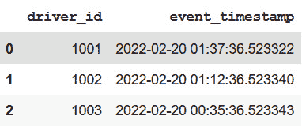

图 3.9 – 实体 DataFrame

一旦你有了实体 DataFrame，从历史存储中获取数据就很简单了。所需做的只是连接到特征存储，并使用在上一代码块中创建的实体 DataFrame 和所需特征的列表调用 `store.get_historical_features()` API。

以下代码块连接到特征存储并获取实体的历史特征：

```py
store = FeatureStore(repo_path=".")
```

```py
training_df = store.get_historical_features(
```

```py
    entity_df=entity_df,
```

```py
    features=[
```

```py
        "driver_hourly_stats:conv_rate",
```

```py
        "driver_hourly_stats:acc_rate",
```

```py
        "driver_hourly_stats:avg_daily_trips",
```

```py
    ],
```

```py
).to_df()
```

```py
training_df.head()
```

你可能会注意到 API 的一个输入是一个特征列表。列表中元素的格式是 `<FeatureViewName>:<FeatureName>`。例如，要获取 `conv_rate` 特征，它是 `driver_hourly_stats` 特征视图的一部分，列表中的元素将是 `driver_hourly_stats:conv_rate`。

以下代码块产生以下输出：

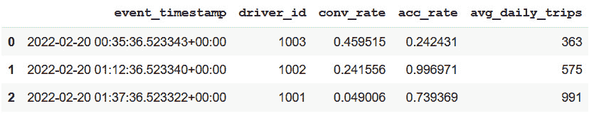

图 3.10 – 获取历史特征输出

## 将特征加载到在线商店

历史数据源用于生成训练数据集，这也可以用于批量模型的预测。然而，我们已经知道对于在线模型，需要低延迟的特征服务。为了启用这一点，需要从历史数据源获取最新特征并将特征加载到在线商店。这可以通过 Feast 的单个命令完成。

以下命令将最新特征加载到在线商店：

```py
!feast materialize-incremental {datetime.now().isoformat()}
```

命令接受一个时间戳作为输入之一，获取输入时间戳时的最新特征，并将特征加载到在线商店。在本例中，它是一个 SQLite 数据库。

上一行代码输出以下信息：

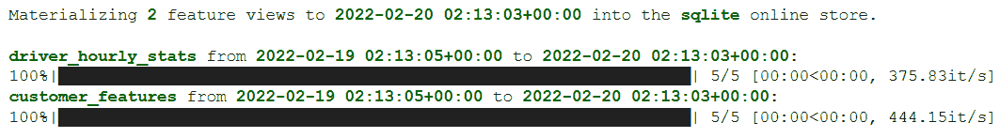

图 3.11 – Feast 实现输出

现在特征已在线存储中可用，它们可以在模型预测期间以低延迟进行检索。可以使用`store.get_online_features()`查询在线存储，并传递与查询历史数据时传递的列表格式相同的特征列表。

重要提示

`feast materialize-incremental`命令将所有现有的特征视图同步到在线存储（在这种情况下，SQLite）。在*图 3.11*的输出中，你可以看到两个特征视图：`driver_hourly_stats`和`customer_features`。你可以查询其中的任何一个。在这个例子中，我们正在查询`driver_hourly_stats`。

以下代码块检索具有`id`值为`1001`和`1004`的司机的`conv_rate`和`avg_daily_trips`：

```py
store = FeatureStore(repo_path=".")
```

```py
feature_vector = store.get_online_features(
```

```py
    features=[
```

```py
        "driver_hourly_stats:conv_rate",
```

```py
        "driver_hourly_stats:avg_daily_trips",
```

```py
    ],
```

```py
    entity_rows=[
```

```py
        {"driver_id": 1004},
```

```py
        {"driver_id": 1005},
```

```py
    ],
```

```py
).to_dict()
```

```py
feature_vector
```

前面的代码块产生以下输出。如果特定实体行的值不存在，它将返回`NULL`值：

```py
{'avg_daily_trips': [34, 256],
```

```py
 'conv_rate': [0.9326972365379333, 0.07134518772363663],
```

```py
 'driver_id': [1004, 1005]}
```

现在我们已经了解了 Feast 的基本知识，是时候简要了解幕后发生的事情以使其工作。在下一节中，我们将查看 Feast 组件并为在项目中集成 Feast 做好准备。

# Feast 幕后

以下图表显示了构成 Feast 架构的不同组件：

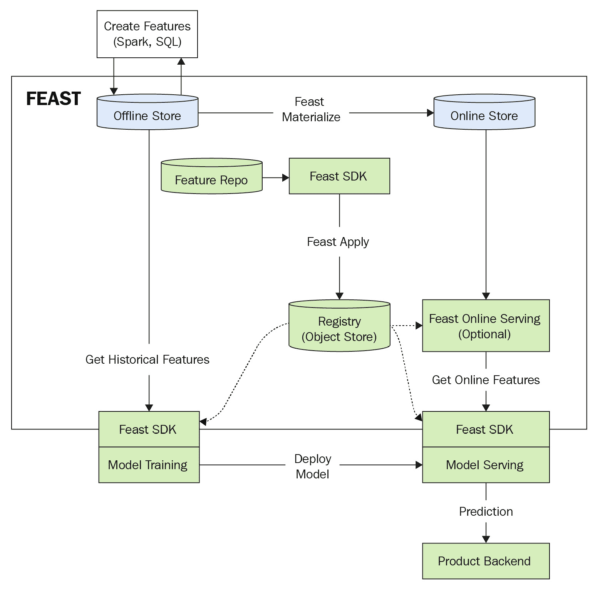

图 3.12 – Feast 架构（v0.18）

如前图所示，Feast 中涉及许多组件。让我们逐一分析：

+   `data`文件夹是可选的；定义特征存储配置的`feature_store.yml`文件和定义特征定义的`example.py`文件构成了一个特征仓库。

+   使用`feast apply`（从离线存储加载特征到在线存储），以及提供一套优秀的 API 供用户浏览 Feast 和查询在线和离线存储。我们在使用部分使用了 Feast SDK 的一些 API。

+   **Feast 注册表**：Feast 注册表使用对象存储来持久化特征定义，这些定义可以通过 Feast SDK 进行浏览。

+   **在线存储**：在线存储是一个低延迟数据库，用于为模型预测提供最新特征。用户可以使用 Feast SDK 加载最新特征或查询在线存储。也可以使用流源将特征加载到在线存储中。

+   **离线存储**：离线存储用于存储和检索历史数据。它还用于模型训练和批量评分。在 Feast 中，离线存储中的数据由用户管理。

## Feast 中的数据流

以下步骤给出了 Feast 中的数据流示例：

1.  数据工程师构建 ETL/数据管道以生成特征并将它们加载到 Feast 支持的离线存储中。

1.  创建特征定义，定义 Feast 存储配置，并运行`feast apply`命令。

    重要提示

    特征存储配置涉及定义基础设施细节，因此也可能涉及基础设施的创建。

1.  使用 Feast SDK，数据科学家/数据工程师连接到 Feast 仓库，并为模型生成训练数据。模型被训练，如果它不符合接受标准，可以通过添加额外的数据管道生成新特征。

1.  步骤 *1-3* 将会再次执行。

    重要提示

    在 *步骤 2* 中，只需添加新的实体和特征定义。

1.  使用 `feast materialize` 命令将特征从离线存储加载到在线存储。此命令可以安排在计划中运行，以使用如 **Airflow** 这样的编排工具加载最新特征。

1.  训练好的模型与 Feast SDK 代码一起打包，以便在预测期间获取模型评分所需的特征。打包的模型被部署到生产环境中。

1.  在预测期间，模型使用 Feast SDK 获取所需的特征，运行预测，并返回结果。

1.  可以监控离线存储以确定是否是重新训练模型的时候了。

让我们接下来总结本章所学的内容，并继续在我们的实际项目中使用 Feast。

# 摘要

在本章中，我们讨论了特征存储世界中使用的术语，特别是与 *Feast* 相关的术语。然而，请注意，许多现有的特征存储使用类似的术语，所以如果你熟悉其中一个，理解其他的就很容易了。我们还讨论了 Feast 中的 *时间点连接* 如何工作，以及 Feast 的基本知识，如安装、初始化、项目结构和 API 使用。最后，我们探讨了 Feast 的组件以及模型在 Feast 中的操作化工作原理。

在下一章中，我们将使用我们在 *第一章* 中构建的模型，即 *机器学习生命周期概述*，学习它如何改变数据科学家和工程师的工作方式，并看看它如何为特征共享、监控以及我们 ML 模型的简单生产化打开新的大门。

# 进一步阅读

+   *Feast 简介*: [`docs.feast.dev/`](https://docs.feast.dev/)

+   *Feast 概述*: [`github.com/feast-dev/feast/blob/v0.18.1/examples/quickstart/quickstart.ipynb`](https://github.com/feast-dev/feast/blob/v0.18.1/examples/quickstart/quickstart.ipynb)
