# 第四章：将特征存储添加到机器学习模型

在上一章中，我们讨论了在本地系统中安装 **Feast**，Feast 中的常见术语，项目结构的样子，以及使用示例的 API 使用方法，并对 Feast 架构进行了简要概述。

到目前为止，本书一直在讨论特征管理的问题以及特征存储如何使数据科学家和数据工程师受益。现在是时候让我们亲自动手，将 Feast 添加到机器学习管道中。

在本章中，我们将回顾在 *第一章*，《机器学习生命周期概述》中构建的 **客户终身价值**（**LTV/CLTV**）机器学习模型。我们将使用 AWS 云服务而不是本地系统来运行本章的示例。正如在 *第三章*，《特征存储基础、术语和用法》中提到的，AWS 的安装与本地系统不同，因此我们需要创建一些资源。我将使用一些免费层服务和一些特色服务（前两个月使用免费，但有限制）。此外，我们在 *第三章*，《特征存储基础、术语和用法》中查看的术语和 API 使用示例，在我们尝试将 Feast 包含到机器学习管道中时将非常有用。

本章的目标是了解将特征存储添加到项目中的所需条件以及它与我们在 *第一章*，《机器学习生命周期概述》中进行的传统机器学习模型构建有何不同。我们将学习 Feast 的安装，如何为 LTV 模型构建特征工程管道，如何定义特征定义，我们还将查看 Feast 中的特征摄取。

我们将按以下顺序讨论以下主题：

+   在 AWS 中创建 Feast 资源

+   Feast 初始化针对 AWS

+   使用 Feast 探索机器学习生命周期

# 技术要求

要跟随本章中的代码示例，您只需要熟悉 Python 和任何笔记本环境，这可以是本地设置，如 Jupyter，或者在线笔记本环境，如 Google Collab、Kaggle 或 SageMaker。您还需要一个 AWS 账户，并有权访问 Redshift、S3、Glue、DynamoDB、IAM 控制台等资源。您可以在试用期间创建新账户并免费使用所有服务。您可以在以下 GitHub 链接找到本书的代码示例：

https://github.com/PacktPublishing/Feature-Store-for-Machine-Learning/tree/main/Chapter04

以下 GitHub 链接指向特征存储库：

[`github.com/PacktPublishing/Feature-Store-for-Machine-Learning/tree/main/customer_segmentation`](https://github.com/PacktPublishing/Feature-Store-for-Machine-Learning/tree/main/customer_segmentation)

# 在 AWS 中创建 Feast 资源

如前一章所述，Feast 致力于为初学者提供快速设置，以便他们尝试使用它；然而，为了团队协作和在生产中运行模型，它需要一个更好的设置。在本节中，我们将在 AWS 云中设置一个 Feast 环境，并在模型开发中使用它。在前一章中，我们还讨论了 Feast 在选择在线和离线存储时提供了多种选择。对于这个练习，我们将使用 Amazon S3 和 Redshift 作为离线/历史存储，并使用 DynamoDB 作为在线存储。因此，在我们开始使用项目中的特征存储功能之前，我们需要在 AWS 上准备一些资源。让我们依次创建这些资源。

## Amazon S3 用于存储数据

如 AWS 文档中所述，**Amazon Simple Storage Service** (**Amazon S3**) 是一种提供行业领先的可扩展性、数据可用性、安全性和性能的对象存储服务。Feast 提供了使用 S3 存储和检索所有数据和元数据的功能。您还可以使用版本控制系统，如 GitHub 或 GitLab，在部署期间协作编辑元数据并将其同步到 S3。要在 AWS 中创建 S3 存储桶，请登录您的 AWS 账户，使用搜索框导航到 S3 服务，或访问 [`s3.console.aws.amazon.com/s3/home?region=us-east-1`](https://s3.console.aws.amazon.com/s3/home?region=us-east-1)。将显示一个网页，如图 *图 4.1* 所示。

![图 4.1 – AWS S3 主页

![图片 B18024_04_01.jpg]

图 4.1 – AWS S3 主页

如果您已经有了存储桶，您将在页面上看到它们。我正在使用一个新账户，因此我还没有看到任何存储桶。要创建一个新的存储桶，请点击 `feast-demo-mar-2022`。需要注意的是，S3 存储桶名称在账户间是唯一的。如果存储桶创建失败并出现错误，**存在同名存储桶**，请尝试在末尾添加一些随机字符。

![图 4.2 – 创建 S3 存储桶

![图片 B18024_04_02.jpg]

图 4.2 – 创建 S3 存储桶

存储桶创建成功后，您将看到一个类似于 *图 4.3* 的屏幕。

![图 4.3 – 创建 S3 存储桶之后

![图片 B18024_04_03.jpg]

图 4.3 – 创建 S3 存储桶之后

## AWS Redshift 用于离线存储

如 AWS 文档中所述，*Amazon Redshift 使用 SQL 分析数据仓库、操作数据库和数据湖中的结构化和半结构化数据，利用 AWS 设计的硬件和机器学习，在任何规模下提供最佳的价格性能*。如前所述，我们将使用 Redshift 集群来查询历史数据。由于我们还没有集群，我们需要创建一个。在创建集群之前，让我们创建一个 **身份和访问管理** (**IAM**) 角色。这是一个 Redshift 将代表我们查询 S3 中历史数据的角色。

让我们从创建一个 IAM 角色开始：

1.  要创建 IAM 角色，请使用搜索导航到 AWS IAM 控制台或访问 URL https://us-east-1.console.aws.amazon.com/iamv2/home?region=us-east-1#/roles。将显示一个类似于 *图 4.4* 的网页。

![图 4.4 – IAM 主页

![图 B18024_04_04.jpg]

图 4.4 – IAM 主页

1.  要创建新角色，请点击右上角的 **创建角色** 按钮。将显示以下页面。

![图 4.5 – IAM 创建角色

![图 B18024_04_05.jpg]

图 4.5 – IAM 创建角色

1.  在页面上的可用选项中，选择 **自定义信任策略**，复制以下代码块，并用文本框中的 JSON 中的策略替换它：

    ```py
    {
        "Version": "2012-10-17",
        "Statement": [
            {
                "Effect": "Allow",
                "Principal": {
                    "Service": "redshift.amazonaws.com"
                },
                "Action": "sts:AssumeRole"
            }
        ]
    }
    ```

1.  将页面滚动到最底部并点击 **下一步**。在下一页，您将看到一个可以附加到角色的 IAM 策略列表，如图 *图 4.6* 所示。

![图 4.6 – 角色的 IAM 权限

![图 B18024_04_06.jpg]

图 4.6 – 角色的 IAM 权限

1.  我们需要 **S3** 访问权限，因为数据将以 Parquet 文件的形式存储在 S3 中，以及 **AWS Glue** 访问权限。存储在 S3 中的数据将通过 AWS Glue 数据目录/Lake Formation 作为外部模式加载到 Redshift 中。请跟随这里，您将了解将数据作为外部模式加载的含义。对于 S3 访问，搜索 **AmazonS3FullAccess** 并选择相应的复选框，然后搜索 **AWSGlueConsoleFullAccess** 并选择相应的复选框。将页面滚动到最底部并点击 **下一步**。

    重要提示

    我们在这里为所有资源提供对 S3 和 Glue 的完全访问权限，但建议限制对特定资源的访问。我将将其留作练习，因为这不属于本章的范围。

在点击 **下一步** 后，将显示以下页面。

![图 4.7 – IAM 审查

![图 B18024_04_07.jpg]

图 4.7 – IAM 审查

1.  在此页面上，为角色提供一个名称。我已将角色命名为 `feast-demo-mar-2022-spectrum-role`。审查角色的详细信息并点击 **创建角色**。在成功创建后，您将在 IAM 控制台页面上找到该角色。

1.  现在我们已经准备好了 IAM 角色，下一步是创建一个 **Redshift** 集群并将创建的 IAM 角色分配给它。要创建 Redshift 集群，请使用搜索栏导航到 Redshift 主页或访问链接 https://us-east-1.console.aws.amazon.com/redshiftv2/home?region=us-east-1#clusters。将显示以下页面。

![图 4.8 – Redshift 主页

![图 B18024_04_08.jpg]

图 4.8 – Redshift 主页

1.  在 *图 4.8* 中的页面上，点击 **创建集群**。将显示以下页面。

![图 4.9 – 创建 Redshift 集群

![图 B18024_04_09.jpg]

图 4.9 – 创建 Redshift 集群

1.  从显示在 *图 4.9* 中的网页，我选择了用于演示的 **免费试用**，但可以根据数据集大小和负载进行配置。选择 **免费试用** 后，滚动到页面底部并选择一个密码。以下图显示了向下滚动后的窗口下半部分。

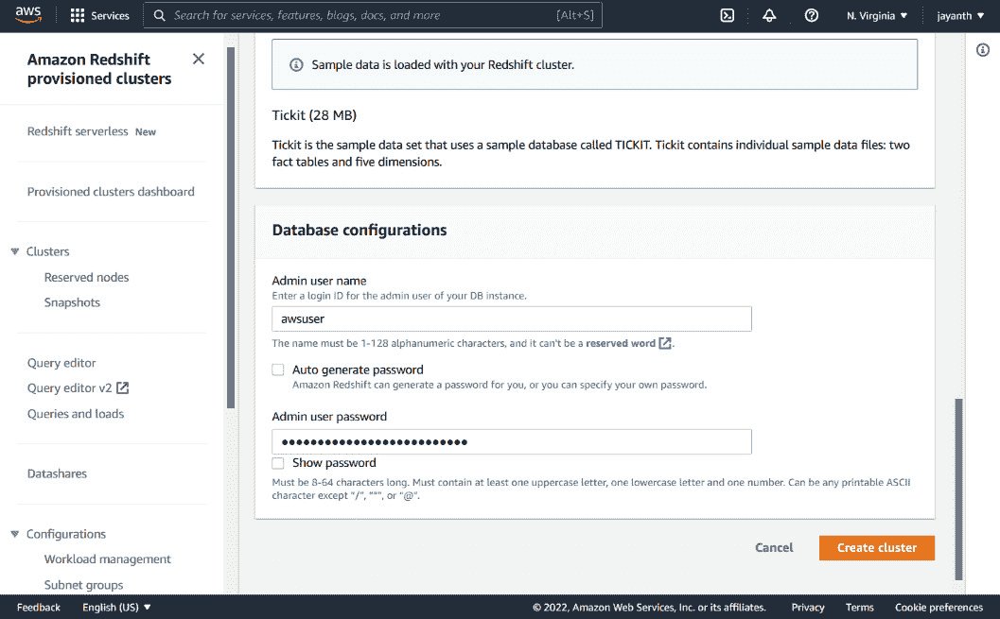

图 4.10 – 创建集群下半部分

1.  选择密码后，点击底部的 **创建集群**。集群创建需要几分钟。一旦集群创建完成，你应该在 AWS Redshift 控制台中看到新创建的集群。最后一件待办事项是将我们之前创建的 IAM 角色与 Redshift 集群关联起来。现在让我们来做这件事。导航到新创建的集群。你会看到一个类似于 *图 4.11* 中的网页。

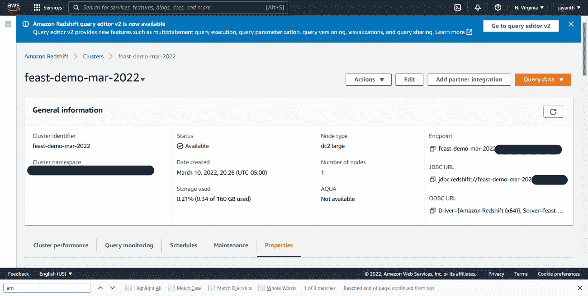

图 4.11 – Redshift 集群页面

1.  在集群主页上，选择 **属性** 选项卡并滚动到 **关联 IAM 角色**。你将看到 *图 4.12* 中显示的选项。

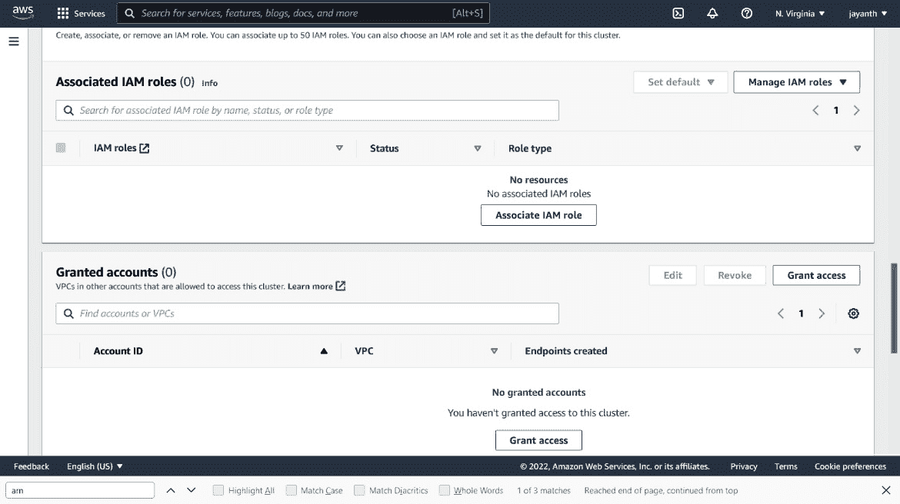

图 4.12 – Redshift 属性选项卡

1.  从网页上，点击 `feast-demo-mar-2022-spectrum-role`，因此我将关联该角色。点击按钮后，集群将更新为新角色。这又可能需要几分钟。一旦集群准备就绪，我们现在就完成了所需的必要基础设施。当功能准备就绪以进行摄取时，我们将添加外部数据目录。

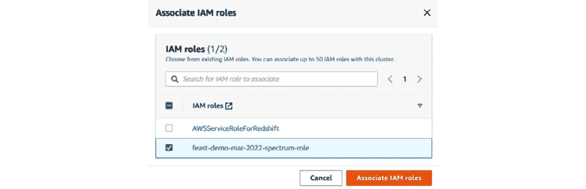

图 4.13 – Redshift 关联 IAM 角色

我们需要一个 IAM 用户来访问这些资源并对它们进行操作。让我们接下来创建它。

## 创建 IAM 用户以访问资源

有不同的方式为用户提供对资源的访问权限。如果你是组织的一部分，那么 IAM 角色可以与 Auth0 和活动目录集成。由于这超出了本节范围，我将创建一个 IAM 用户，并将为用户分配必要的权限以访问之前创建的资源：

1.  让我们从 AWS 控制台创建 IAM 用户。可以通过搜索或访问 https://console.aws.amazon.com/iamv2/home#/users 访问 IAM 控制台。IAM 控制台的外观如 *图 4.14* 所示。

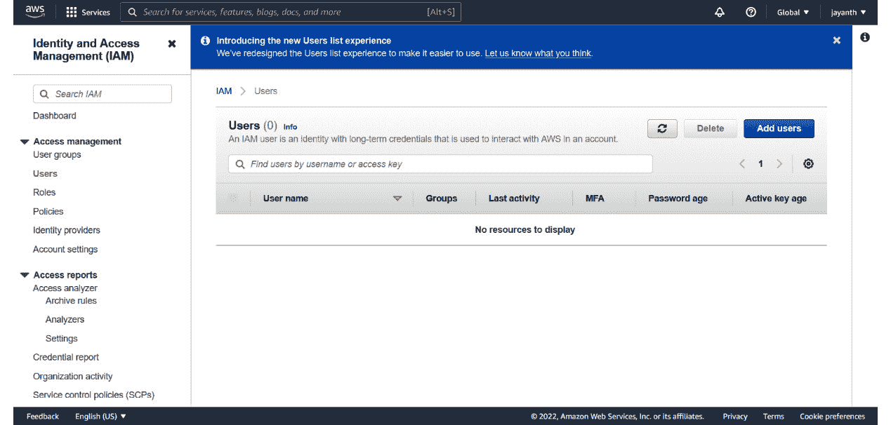

图 4.14 – IAM 用户页面

1.  在 IAM 用户页面上，点击右上角的 **添加用户** 按钮。将显示以下网页。

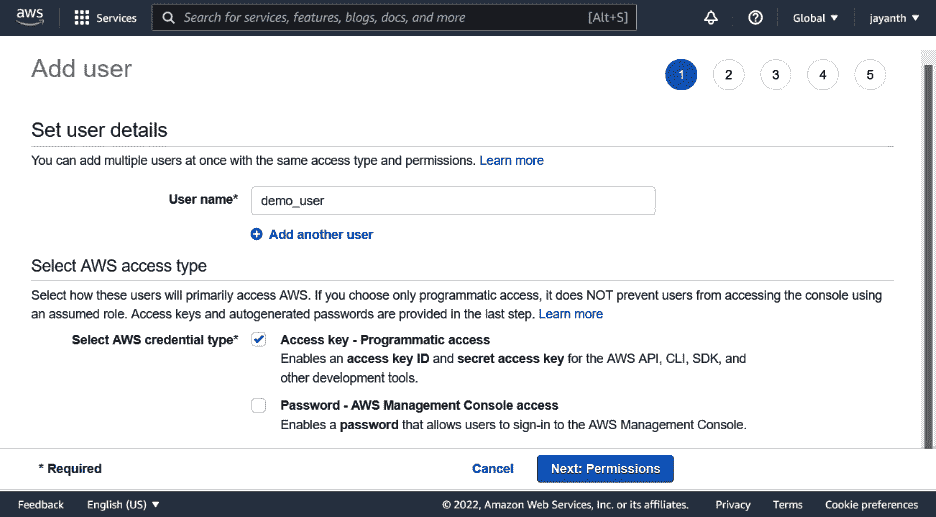

图 4.15 – IAM 添加用户

1.  在网页上，提供一个用户名并选择 **访问密钥 - 程序化访问**，然后点击底部的 **下一步：权限**。将显示以下网页。

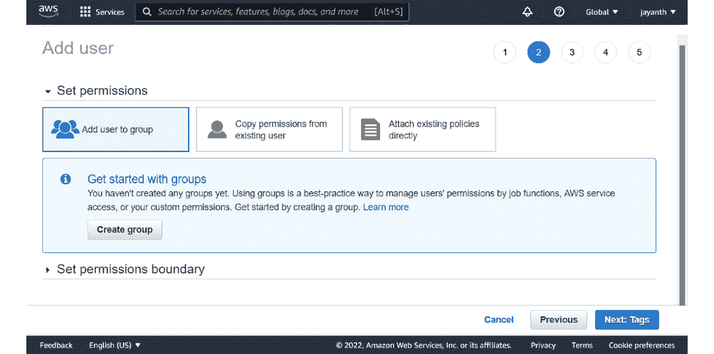

图 4.16 – IAM 权限

1.  在显示的网页上，点击**直接附加现有策略**，然后从可用策略列表中搜索并附加以下策略：**AmazonRedshiftFullAccess**、**AmazonS3FullAccess**和**AmazonDynamoDBFullAccess**。

    重要提示

    我们在这里提供了完整的访问权限，而不限制用户访问特定的资源。根据资源限制访问并仅提供所需的权限总是一个好的做法。

1.  点击**下一步：标签**，您可以自由添加标签，然后再次点击**下一步：审查**。审查页面看起来如下：

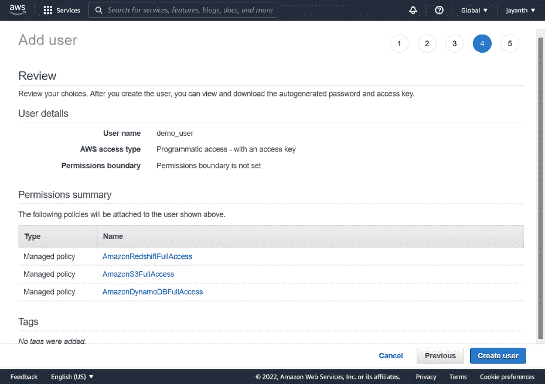

图 4.17 – IAM 用户审查

1.  从审查页面，点击**创建用户**按钮。*图 4.18*中的网页将会显示。

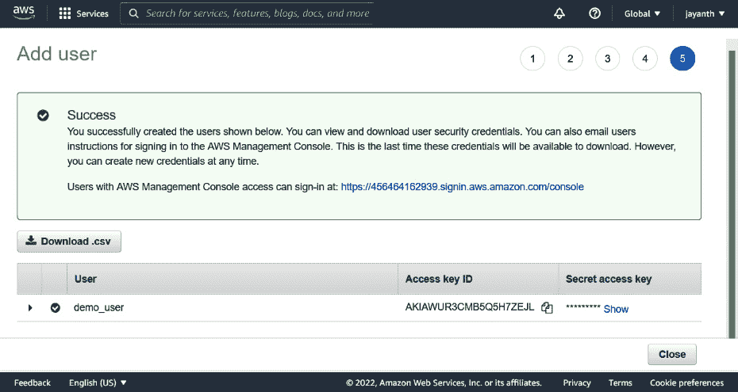

图 4.18 – IAM 用户凭据

1.  在网页上点击**Download.csv**按钮，并将文件保存在安全的位置。它包含我们刚刚创建的用户**访问密钥 ID**和**秘密访问密钥**。如果您不从这个页面下载并保存它，秘密将会丢失。然而，您可以从 IAM 用户页面进入用户并管理秘密（删除现有的凭据并创建新的凭据）。

现在基础设施已经就绪，让我们初始化 Feast 项目。

# Feast AWS 初始化

我们现在有运行 Feast 所需的基础设施。然而，在我们开始使用它之前，我们需要初始化一个 Feast 项目。要初始化 Feast 项目，我们需要像在*第三章*中那样安装 Feast 库，即*特征存储基础、术语和用法*。但是，这次，我们还需要安装 AWS 依赖项。以下是笔记本的链接：[`github.com/PacktPublishing/Feature-Store-for-Machine-Learning/blob/main/Chapter04/ch4_Feast_aws_initialization.ipynb.`](https://github.com/PacktPublishing/Feature-Store-for-Machine-Learning/blob/main/Chapter04/ch4_Feast_aws_initialization.ipynb )

以下命令安装 Feast 并带有所需的 AWS 依赖项：

```py
!pip install feast[aws]
```

依赖项安装完成后，我们需要初始化 Feast 项目。与上一章中我们进行的初始化不同，这里的 Feast 初始化需要额外的输入，例如 Redshift ARN、数据库名称、S3 路径等。让我们看看初始化在这里是如何不同的。在我们初始化项目之前，我们需要以下详细信息：

+   **AWS 区域**：您的基础设施运行的区域。我已在**us-east-1**创建了所有资源。如果您在另一个区域创建了它们，请使用该区域。

+   **Redshift 集群 ID**：之前创建的 Redshift 集群的标识符。它可以在主页上找到。

+   `dev`。

+   `awsuser`。如果您在集群创建时提供了不同的用户名，请在这里使用。

+   `s3://feast-demo-mar-2022/staging`。同时也在存储桶中创建 staging 文件夹。

+   `arn:aws:iam::<account_number>:role/feast-demo-mar-2022-spectrum-role`。

一旦你有了提到的参数值，新的项目可以通过以下两种方式之一初始化。一种是使用以下命令：

```py
 feast init -t aws customer_segmentation
```

前面的命令初始化 Feast 项目。在初始化过程中，命令将要求你提供提到的参数。

第二种方法是编辑 `feature_store.yaml` 文件：

```py
project: customer_segmentation
```

```py
registry: data/registry.db
```

```py
provider: aws
```

```py
online_store:
```

```py
  type: dynamodb
```

```py
  region: us-east-1
```

```py
offline_store:
```

```py
  type: redshift
```

```py
  cluster_id: feast-demo-mar-2022
```

```py
  region: us-east-1
```

```py
  database: dev
```

```py
  user: awsuser
```

```py
  s3_staging_location: s3://feast-demo-mar-2022/staging
```

```py
  iam_role: arn:aws:iam::<account_number>:role/feast-demo-mar-2022-spectrum-role
```

无论你选择哪种方法来初始化项目，确保你提供了适当的参数值。我已经突出显示了可能需要替换的参数，以便 Feast 功能能够无问题地工作。如果你使用第一种方法，`init` 命令将提供选择是否加载示例数据的选项。选择 `no` 以不上传示例数据。

现在我们已经为项目初始化了特征存储库，让我们应用我们的初始特征集，它基本上是空的。以下代码块移除了如果你使用 `feast init` 初始化项目时创建的不需要的文件：

```py
%cd customer_segmentation
!rm -rf driver_repo.py test.py
```

如果你没有运行前面的命令，它将在 `driver_repo.py` 文件中创建实体和特征视图的特征定义。

以下代码块创建了项目中定义的特征和实体定义。在这个项目中，目前还没有：

```py
!feast apply
```

当运行前面的命令时，它将显示消息 **No changes to registry**，这是正确的，因为我们还没有任何特征定义。

`customer_segmentation` 文件夹的结构应该看起来像 *图 4.19*。

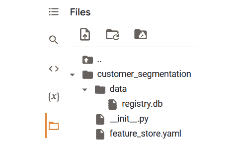

图 4.19 – 项目文件夹结构

特征存储库现在已准备好使用。这可以提交到 *GitHub* 或 *GitLab* 以进行版本控制和协作。

重要提示

还要注意，所有前面的步骤都可以使用基础设施即代码框架（如 Terraform、AWS CDK、Cloud Formation 等）自动化。根据组织遵循的团队结构，数据工程师或平台/基础设施团队将负责创建所需资源并共享数据科学家或工程师可以使用的存储库详细信息。

在下一节中，让我们看看机器学习生命周期如何随着特征存储而变化。

# 使用 Feast 探索机器学习生命周期

在本节中，让我们讨论一下当你使用特征存储时，机器学习模型开发看起来是什么样子。我们在 *第一章* 中回顾了机器学习生命周期，*机器学习生命周期概述*。这使得理解它如何随着特征存储而变化变得容易，并使我们能够跳过一些将变得冗余的步骤。

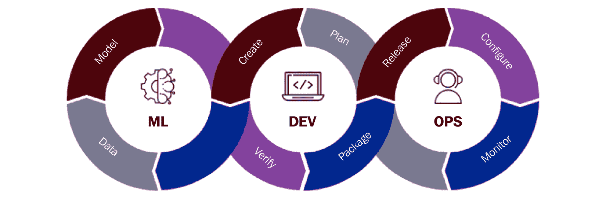

图 4.20 – 机器学习生命周期

## 问题陈述（计划和创建）

问题陈述与*第一章*，*机器学习生命周期概述*中的一致。假设你拥有一家零售业务，并希望提高客户体验。首先，你想要找到你的客户细分和客户终身价值。

## 数据（准备和清理）

与*第一章*，*机器学习生命周期概述*不同，在探索数据并确定访问权限等之前，这里的模型构建起点是特征存储。以下是笔记本的链接：

[`github.com/PacktPublishing/Feature-Store-for-Machine-Learning/blob/main/Chapter04/ch4_browse_feast_for_features.ipynb`](https://github.com/PacktPublishing/Feature-Store-for-Machine-Learning/blob/main/Chapter04/ch4_browse_feast_for_features.ipynb)

[让我们从特征存储开始：](https://github.com/PacktPublishing/Feature-Store-for-Machine-Learning/blob/main/Chapter04/ch4_browse_feast_for_features.ipynb)

1.  因此，让我们打开一个笔记本并使用 AWS 依赖项安装 Feast：

    ```py
    !pip install feast[aws]
    ```

1.  如果在上一节中创建的特征仓库已推送到源代码控制，如 GitHub 或 GitLab，请克隆该仓库。以下代码克隆了仓库：

    ```py
    !git clone <repo_url>
    ```

1.  现在我们有了特征仓库，让我们连接到 Feast/特征存储并检查可用性：

    ```py
    # change directory
    %cd customer_segmentation
    """import feast and load feature store object with the path to the directory which contains feature_story.yaml."""
    from feast import FeatureStore
    store = FeatureStore(repo_path=".")
    ```

上述代码块连接到 Feast 特征仓库。`repo_path="."`参数表示`feature_store.yaml`位于当前工作目录。

1.  让我们检查特征存储是否包含任何可用于模型的**实体**或**特征视图**，而不是探索数据并重新生成已存在的特征：

    ```py
    #Get list of entities and feature views
    print(f"List of entities: {store.list_entities()}")
    print(f"List of FeatureViews: {store.list_feature_views()}")
    ```

上述代码块列出了我们连接到的当前特征仓库中存在的**实体**和**特征视图**。代码块输出如下两个空列表：

```py
List of entities: []
List of FeatureViews: []
```

重要提示

你可能会想，*其他团队创建的特征怎么办？我如何获取访问权限并检查可用性？* 有方法可以管理这些。我们稍后会提到。

由于实体和特征视图为空，没有可用的内容。下一步是进行数据探索和特征工程。

我们将跳过数据探索阶段，因为我们已经在*第一章*，*机器学习生命周期概述*中完成了它。因此，生成特征的步骤也将相同。因此，我将不会详细说明特征工程。相反，我将使用相同的代码，并简要说明代码的功能。有关特征生成详细描述，请参阅*第一章*，*机器学习生命周期概述*。

## 模型（特征工程）

在本节中，我们将生成模型所需的特征。就像我们在*第一章*，“机器学习生命周期概述”中所做的那样，我们将使用 3 个月的数据来生成 RFM 特征，并使用 6 个月的数据来生成数据集的标签。我们将按照与*第一章*，“机器学习生命周期概述”中相同的顺序进行操作。以下是特征工程笔记本的链接：

[`github.com/PacktPublishing/Feature-Store-for-Machine-Learning/blob/main/Chapter04/ch4_feature_engineering.ipynb`](https://github.com/PacktPublishing/Feature-Store-for-Machine-Learning/blob/main/Chapter04/ch4_feature_engineering.ipynb)。

让我们从特征工程开始：

1.  以下代码块读取数据集并过滤掉不属于`United Kingdom`的数据：

    ```py
    %pip install feast[aws]==0.19.3 s3fs
    import pandas as pd
    from datetime import datetime, timedelta, date
    from sklearn.cluster import Kmeans
    ##Read the data and filter out data that belongs to country other than UK
    retail_data = pd.read_csv('/content/OnlineRetail.csv', encoding= 'unicode_escape')
    retail_data['InvoiceDate'] = pd.to_datetime(retail_data['InvoiceDate'], errors = 'coerce')
    uk_data = retail_data.query("Country=='United Kingdom'").reset_index(drop=True)
    ```

1.  一旦我们有了过滤后的数据，下一步是创建两个 DataFrame，一个用于 3 个月，一个用于 6 个月。

以下代码块创建了两个不同的 DataFrame，一个用于`2011-03-01 00:00:00.054000`和`2011-06-01 00:00:00.054000`之间的数据，第二个用于`2011-06-01 00:00:00.054000`和`2011-12-01 00:00:00.054000`之间的数据：

```py
## Create 3months and 6 months DataFrames
t1 = pd.Timestamp("2011-06-01 00:00:00.054000")
t2 = pd.Timestamp("2011-03-01 00:00:00.054000")
t3 = pd.Timestamp("2011-12-01 00:00:00.054000")
uk_data_3m = uk_data[(uk_data.InvoiceDate < t1) & (uk_data.InvoiceDate >= t2)].reset_index(drop=True)
uk_data_6m = uk_data[(uk_data.InvoiceDate >= t1) & (uk_data.InvoiceDate < t3)].reset_index(drop=True)
```

1.  下一步是从 3 个月 DataFrame 中生成 RFM 特征。以下代码块为所有客户生成 RFM 值：

    ```py
    ## Calculate RFM values.
    Uk_data_3m['revenue'] = uk_data_3m['UnitPrice'] * uk_data_3m['Quantity']
    max_date = uk_data_3m['InvoiceDate'].max() + timedelta(days=1)
    rfm_data = uk_data_3m.groupby(['CustomerID']).agg({
      'InvoiceDate': lambda x: (max_date – x.max()).days,
      'InvoiceNo': 'count',
      'revenue': 'sum'})
    rfm_data.rename(columns={'InvoiceDate': 'Recency',
                             'InvoiceNo': 'Frequency',
                             'revenue': 'MonetaryValue'},
                    inplace=True)
    ```

现在我们已经为所有客户生成了 RFM 值，下一步是为每个客户生成一个 R 组、一个 F 组和三个 M 组，范围从 0 到 3。一旦我们有了客户的 RFM 组，它们将被用来通过累加客户各个组的单个值来计算 RFM 分数。

1.  以下代码块为客户生成 RFM 组并计算 RFM 分数：

    ```py
    ## Calculate RFM groups of customers 
    r_grp = pd.qcut(rfm_data['Recency'],
                    q=4, labels=range(3,-1,-1))
    f_grp = pd.qcut(rfm_data['Frequency'],
                    q=4, labels=range(0,4))
    m_grp = pd.qcut(rfm_data['MonetaryValue'], 
                    q=4, labels=range(0,4))
    rfm_data = rfm_data.assign(R=r_grp.values).assign(F=f_grp.values).assign(M=m_grp.values)
    rfm_data['R'] = rfm_data['R'].astype(int)
    rfm_data['F'] = rfm_data['F'].astype(int)
    rfm_data['M'] = rfm_data['M'].astype(int)
    rfm_data['RFMScore'] = rfm_data['R'] + rfm_data['F'] + rfm_data['M']
    ```

1.  RFM 分数计算完成后，是时候将客户分为低价值、中价值和高价值客户了。

以下代码块将这些客户分组到这些组中：

```py
# segment customers.
Rfm_data['Segment'] = 'Low-Value'
rfm_data.loc[rfm_data['RFMScore']>4,'Segment'] = 'Mid-Value' 
rfm_data.loc[rfm_data['RFMScore']>6,'Segment'] = 'High-Value' 
rfm_data = rfm_data.reset_index()
```

1.  现在我们有了 RFM 特征，让我们先把这些放一边，并使用之前步骤中创建的 6 个月 DataFrame 来计算收入。

以下代码块计算 6 个月数据集中每个客户的收入：

```py
# Calculate revenue using the six month dataframe.
Uk_data_6m['revenue'] = uk_data_6m['UnitPrice'] * uk_data_6m['Quantity']
revenue_6m = uk_data_6m.groupby(['CustomerID']).agg({
        'revenue': 'sum'})
revenue_6m.rename(columns={'revenue': 'Revenue_6m'}, 
                  inplace=True)
revenue_6m = revenue_6m.reset_index()
```

1.  下一步是将 6 个月数据集与收入合并到 RFM 特征 DataFrame 中。以下代码块在`CustomerId`列中合并了两个 DataFrame：

    ```py
    # Merge the 6m revenue DataFrame with RFM data.
    Merged_data = pd.merge(rfm_data, revenue_6m, how="left")
    merged_data.fillna(0)
    ```

1.  由于我们将问题视为一个分类问题，让我们生成客户 LTV 标签以使用**k-means**聚类算法。在这里，我们将使用 6 个月的收入来生成标签。客户将被分为三个组，即**LowLTV**、**MidLTV**和**HighLTV**。

以下代码块为客户生成 LTV 组：

```py
# Create LTV cluster groups
merged_data = merged_data[merged_data['Revenue_6m']<merged_data['Revenue_6m'].quantile(0.99)]
kmeans = Kmeans(n_clusters=3)
kmeans.fit(merged_data[['Revenue_6m']])
merged_data['LTVCluster'] = kmeans.predict(merged_data[['Revenue_6m']])
```

1.  现在我们有了最终的数据库，让我们看看我们生成的特征集是什么样的。以下代码块将分类值转换为整数值：

    ```py
    Feature_data = pd.get_dummies(merged_data)
    feature_data['CustomerID'] = feature_data['CustomerID'].astype(str)
    feature_data.columns = ['customerid', 'recency', 'frequency', 'monetaryvalue', 'r', 'f', 'm', 'rfmscore', 'revenue6m', 'ltvcluster', 'segmenthighvalue', 'segmentlowvalue', 'segmentmidvalue']
    feature_data.head(5)
    ```

上述代码块生成了以下特征集：

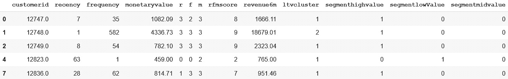

图 4.21 – 模型的最终特征集

在*第一章*，*机器学习生命周期概述*中，接下来执行的操作是模型训练和评分。这就是我们将与之分道扬镳的地方。我假设这将是我们最终的特征集。然而，在模型开发过程中，特征集会随着时间的推移而演变。我们将在后面的章节中讨论如何处理这些变化。

现在我们有了特征集，下一步就是在 Feast 中创建实体和功能视图。

### 创建实体和功能视图

在上一章*第三章*，*特征存储基础、术语和用法*中，我们定义了**实体**和**功能视图**。实体被定义为语义相关的特征集合。实体是特征可以映射到的域对象。功能视图被定义为类似于数据库表的视图。它表示特征数据在其源处的结构。功能视图由实体、一个或多个特征和一个数据源组成。功能视图通常围绕类似于数据库对象的域对象进行建模。由于创建和应用特征定义是一项一次性活动，因此最好将其保存在单独的笔记本或 Python 文件中。以下是笔记本的链接：

[`github.com/PacktPublishing/Feature-Store-for-Machine-Learning/blob/main/Chapter04/ch4_create_apply_feature_definitions.ipynb`](https://github.com/PacktPublishing/Feature-Store-for-Machine-Learning/blob/main/Chapter04/ch4_create_apply_feature_definitions.ipynb)

让我们打开一个笔记本，安装库，并像之前提到的那样克隆功能仓库：

```py
!pip install feast[aws]==0.19.3
```

```py
!git clone <feature_repo>
```

现在我们已经克隆了功能仓库，让我们创建实体和功能视图。根据实体和功能视图的定义，任务是识别*图 4.21*中的功能集中的实体、特征和功能视图。让我们从实体开始。在*图 4.21*中可以找到的唯一域对象是`customerid`：

1.  让我们先定义客户实体。以下代码块定义了 Feast 中的客户实体：

    ```py
    # Customer ID entity definition.
    from feast import Entity, ValueType
    customer = Entity(
        name='customer',
        value_type=ValueType.STRING,
        join_key='customeriD',
        description="Id of the customer"
    )
    ```

上述实体定义有几个必需的属性，例如`name`、`value_type`和`join_key`，其他属性是可选的。如果用户想提供更多信息，还可以添加其他属性。最重要的属性是`join_key`。此属性的值应与特征 DataFrame 中的列名匹配。

我们已经确定了特征集中的实体。接下来的任务是定义特征视图。在我们定义特征视图之前，需要注意的一点是，要像没有生成特征集的消费者一样定义特征视图。我的意思是不要将特征视图命名为 `customer_segmentation_features` 或 `LTV_features` 并将它们全部推送到一个表中。始终尝试将它们分成其他数据科学家浏览时有意义的逻辑组。

1.  考虑到这一点，让我们查看特征集并决定可以形成多少个逻辑组以及哪些特征属于哪个组。从 *图 4.21* 可以看到，它可以分为一组或两组。我看到的两组是客户的 RFM 特征和收入特征。由于 RFM 也包含收入细节，我更愿意将它们分为一组而不是两组，因为没有明显的子组。我将称之为 `customer_rfm_features`。

以下代码块定义了特征视图：

```py
from feast import ValueType, FeatureView, Feature, RedshiftSource
from datetime import timedelta 
# Redshift batch source
rfm_features_source = RedshiftSource(
    query="SELECT * FROM spectrum.customer_rfm_features",
    event_timestamp_column="event_timestamp",
    created_timestamp_column="created_timestamp",
)
# FeatureView definition for RFM features.
rfm_features_features = FeatureView(
    name="customer_rfm_features",
    entities=["customer"],
    ttl=timedelta(days=3650),
    features=[
        Feature(name="recency", dtype=ValueType.INT32),
        Feature(name="frequency", dtype=ValueType.INT32),
        Feature(name="monetaryvalue", 
        dtype=ValueType.DOUBLE),
        Feature(name="r", dtype=ValueType.INT32),
        Feature(name="f", dtype=ValueType.INT32),
        Feature(name="m", dtype=ValueType.INT32),
        Feature(name="rfmscore", dtype=ValueType.INT32),
        Feature(name="revenue6m", dtype=ValueType.DOUBLE),
        Feature(name="ltvcluster", dtype=ValueType.INT32),
        Feature(name="segmenthighvalue", 
        dtype=ValueType.INT32),
        Feature(name="segmentlowvalue", 
        dtype=ValueType.INT32),
        Feature(name="segmentmidvalue", 
        dtype=ValueType.INT32),
    ],
    batch_source=rfm_features_source,
)
```

上述代码块有两个定义。第一个是批源定义。根据所使用的离线存储，批源的定义不同。在上一章的例子中，我们使用了 `FileSource`。由于我们使用 Redshift 查询离线存储，因此定义了 `RedshiftSource`。对象输入是查询，这是一个简单的 `SELECT` 语句。源可以配置为具有复杂的 SQL 查询，包括连接、聚合等。然而，输出应与 `FeatureView` 中定义的列名匹配。源的其他输入是 `created_timestamp_column` 和 `event_timestamp_column`。这些列在 *图 4.21* 中缺失。这些列代表它们的标题所表示的内容，即事件发生的时间和事件创建的时间。在我们摄取数据之前，需要将这些列添加到数据中。

`FeatureView` 表示源数据的数据表结构。正如我们在上一章所看到的，它包含 `entities`、`features` 和 `batch_source`。在 *图 4.21* 中，实体是 `customer`，这是之前定义的。其余的列是特征和批源，即 `RedshiftSource` 对象。特征名称应与列名匹配，`dtype` 应与列的值类型匹配。

1.  现在我们已经有了特征集的特征定义，我们必须注册新的定义才能使用它们。为了注册定义，让我们将实体和特征定义复制到一个 Python 文件中，并将此文件添加到我们的特征仓库文件夹中。我将把这个文件命名为 `rfm_features.py`。将文件添加到仓库后，文件夹结构如下所示。

![图 4.22 – 包含特征定义文件的工程]

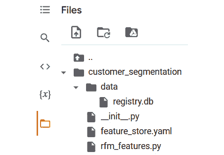

图 4.22 – 包含特征定义文件的工程

在使用 `apply` 命令注册定义之前，让我们将外部模式映射到 Redshift 上。

### 创建外部目录

如果您记得正确，在创建 Redshift 资源期间，我提到将使用 Glue/Lake Formation 将 Amazon S3 中的数据添加为外部映射。这意味着数据不会直接被摄入 Redshift；相反，数据集将位于 S3 中。数据集的结构将在 Lake Formation 目录中定义，您稍后将看到。然后，数据库将作为外部模式映射到 Redshift 上。因此，摄入将直接将数据推入 S3，查询将使用 Redshift 集群执行。

现在我们已经了解了摄入和查询的工作原理，让我们在 Lake Formation 中创建我们的功能集的数据库和目录：

1.  要创建数据库，请通过搜索或使用此网址访问 AWS Lake Formation 页面：https://console.aws.amazon.com/lakeformation/home?region=us-east-1#databases。

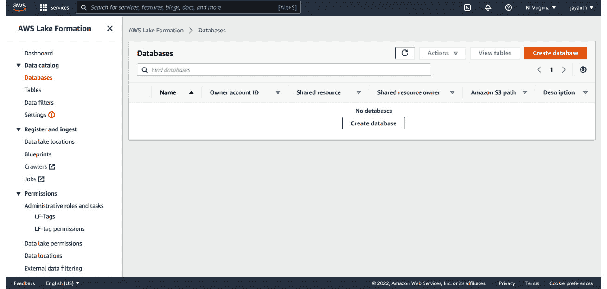

图 4.23 – AWS Lake Formation 中的数据库

*图 4.23* 显示了 AWS Lake Formation 中的数据库列表。

1.  在网页上，点击 **创建数据库**。将出现以下网页。如果在过渡过程中看到任何弹出窗口，要求您开始使用 Lake Formation，可以取消或接受。

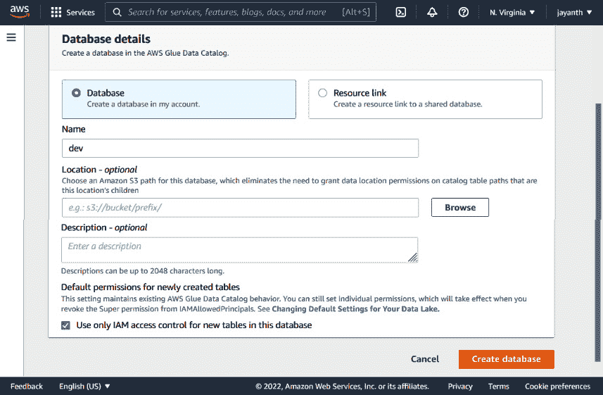

图 4.24 – 湖区形成创建数据库

1.  在上面显示的网页中，给数据库起一个名字。我将其命名为 `dev`。保留所有其他默认设置并点击 **创建数据库**。数据库将被创建，并将重定向到数据库详情页面。由于数据库是表的集合，您可以将此数据库视为项目中所有功能视图的集合。一旦您有了数据库，下一步就是创建表。如您所意识到的那样，我们在这里创建的表对应于功能视图。在当前练习中只有一个功能视图。因此，需要创建相应的表。

    注意

    每当您添加一个新的功能视图时，都需要在 Lake Formation 的数据库中添加相应的表。

1.  要在数据库中创建表，请从 *图 4.23* 页面点击 **表** 或访问此网址：[`console.aws.amazon.com/lakeformation/home?region=us-east-1#tables.`](https://console.aws.amazon.com/lakeformation/home?region=us-east-1#tables )

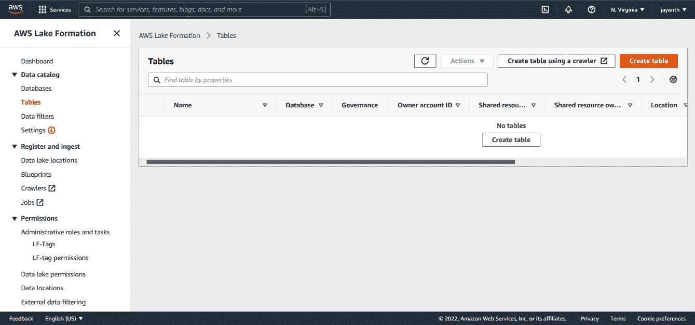

图 4.25 – 湖区形成表

1.  从 *图 4.25* 的网页中，点击右上角的 **创建表** 按钮。将显示以下网页：

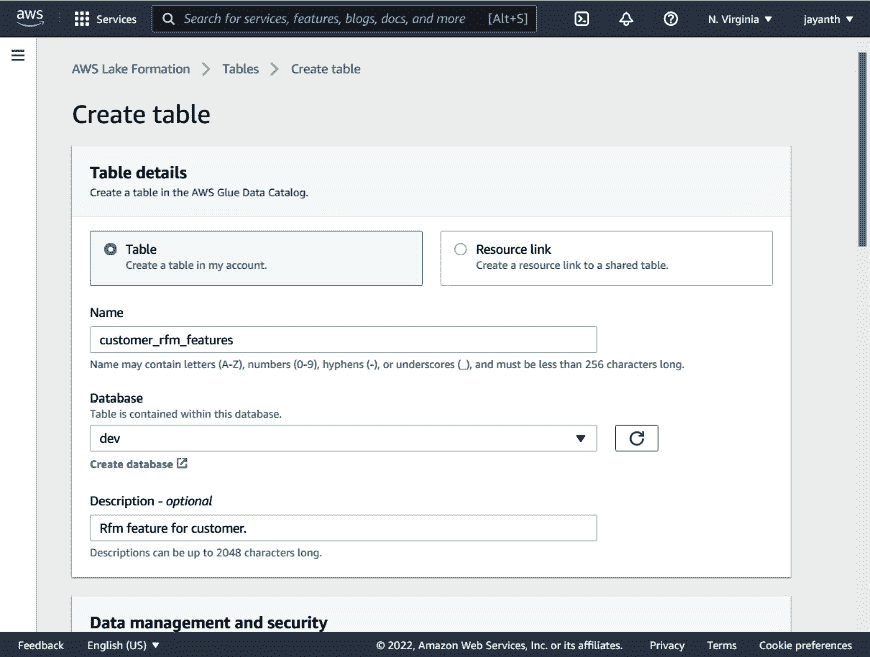

图 4.26 – 湖区形成创建表 1

1.  对于 `customer_rfm_features`，我已经选择了之前创建的数据库（`dev`）。描述是可选的。一旦填写了这些详细信息，向下滚动。在 **创建表** 页面的下一部分将看到以下选项。

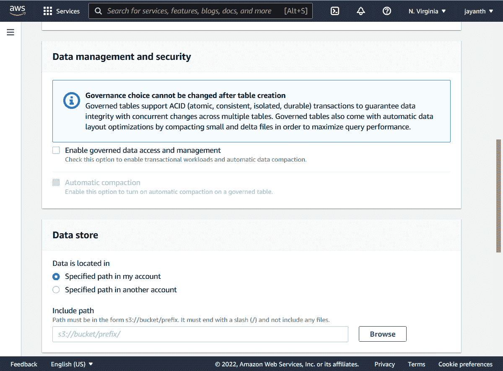

图 4.27 – 湖的形成 创建表 2

1.  数据存储是这里的一个重要属性。它代表 S3 中数据的位置。到目前为止，我们还没有将任何数据推送到 S3。我们很快就会这么做。让我们定义这个表的数据将推送到哪里。我将使用我们之前创建的 S3 存储桶，因此位置将是 `s3://feast-demo-mar-2022/customer-rfm-features/`。

    重要提示

    在 S3 路径中创建 `customer-rfm-features` 文件夹。

1.  选择 S3 路径后，向下滚动到页面最后部分 – 将显示以下选项。

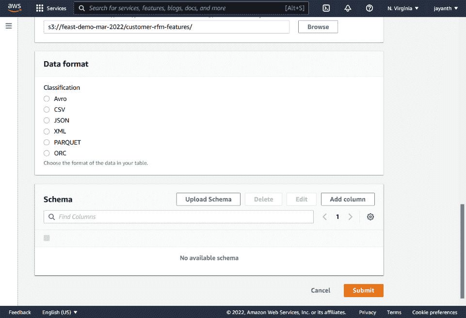

图 4.28 – 湖的形成 创建表 3

*图 4.28* 展示了创建表的最后部分。**数据格式** 部分要求输入数据的文件格式。在这个练习中，我们将选择 **PARQUET**。您可以自由尝试其他格式。无论选择哪种格式，所有导入的数据文件都应该具有相同的格式，否则可能无法按预期工作。

1.  最后一个部分是数据集的 **模式** 定义。您可以选择点击 **添加列** 按钮并逐个添加列，或者点击 **上传模式** 按钮一次性上传一个定义所有列的 JSON 文件。让我们使用 **添加列** 按钮并按顺序添加所有列。一旦添加了所有列以及数据类型，列应该看起来像以下这样：

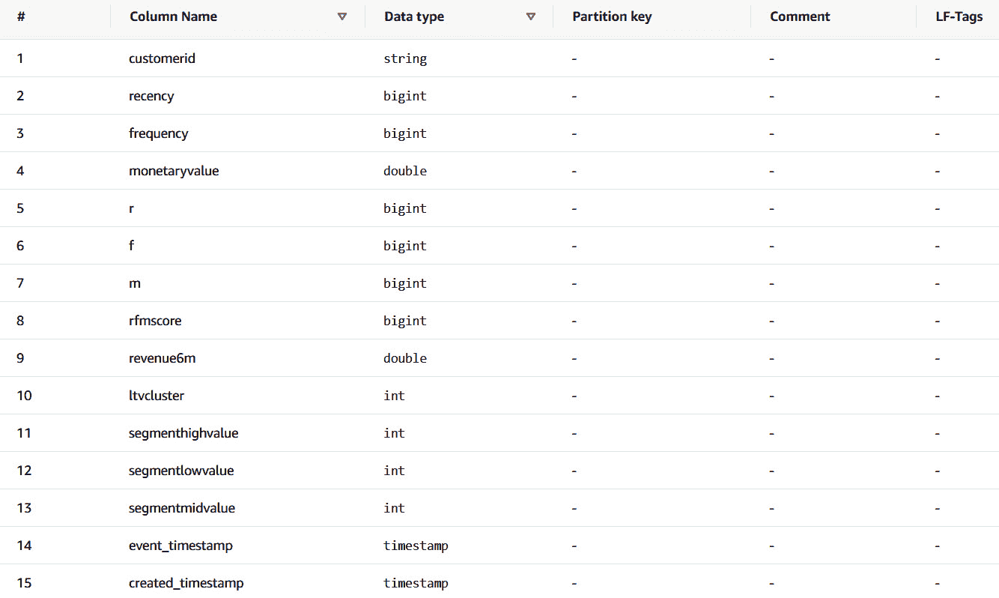

图 4.29 – 创建表中的列列表

如 *图 4.29* 所示，所有列都已添加，包括实体 `customerid` 和两个时间戳列：`event_timestamp` 和 `created_timestamp`。一旦添加了列，点击底部的 **提交** 按钮。

1.  现在，唯一待办的事情是将此表映射到已创建的 Redshift 集群。让我们接下来这么做。要创建外部模式的映射，请访问 Redshift 集群页面并选择之前创建的集群。将显示一个类似于 *图 4.30* 的网页。

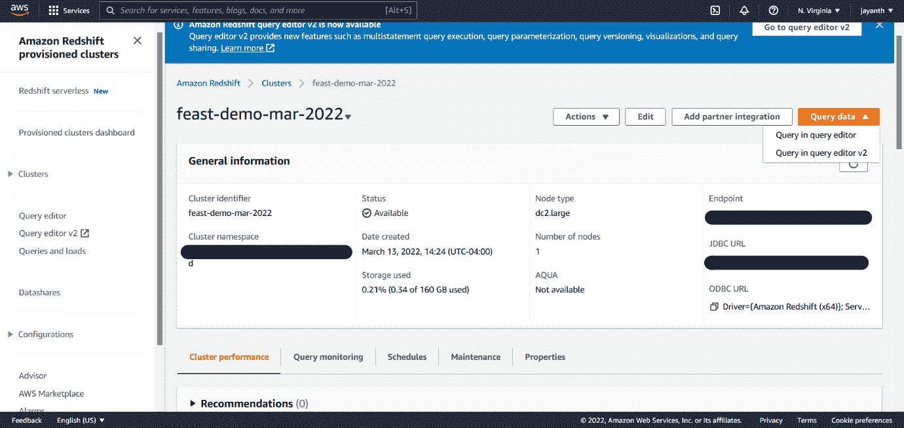

图 4.30 – Redshift 集群详情页

1.  在 *图 4.30* 显示的网页上，点击页面右上角的 **查询数据**。在下拉菜单中的选项中，选择 **查询编辑器 v2**。它将打开一个查询编辑器，如图下所示：

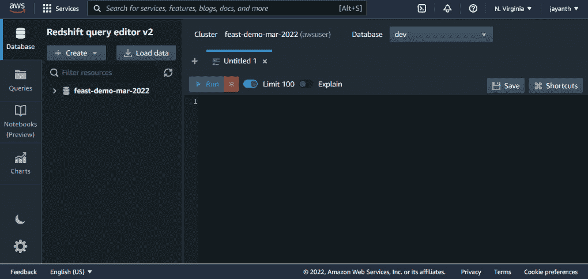

图 4.31 – Redshift 查询编辑器 v2

1.  从左侧面板选择集群，如果默认未选择，也选择数据库。在*图 4.31*中显示的查询编辑器中运行以下查询，将外部数据库映射到名为`spectrum`的模式：

    ```py
    create external schema spectrum 
    from data catalog database dev 
    iam_role '<redshift_role_arn>' 
    create external database if not exists;
    ```

1.  在前面的代码块中，将`<redshift_role_arn>`替换为与 Redshift 创建并关联的角色**ARN**。该 ARN 可以在 IAM 控制台的“角色详情”页面找到，类似于*图 4.32*中的那个。

![图 4.32 – IAM 角色详情页面]

![图片 B18024_04_32.jpg]

图 4.32 – IAM 角色详情页面

查询成功执行后，你应该能够在刷新页面后看到*图 4.33*中显示的数据库下的`spectrum`模式输出。

![图 4.33 – Redshift spectrum 模式]

![图片 B18024_04_33.jpg]

图 4.33 – Redshift spectrum 模式

1.  你也可以通过执行以下 SQL `SELECT`查询来验证映射：

    ```py
    SELECT * from spectrum.customer_rfm_features limit 5
    ```

前面的 SQL 查询将返回一个空表作为结果，因为数据尚未摄取。

我们现在已经完成了外部表的映射。我们现在剩下的是应用特征集并摄取数据。让我们接下来做这件事。

重要提示

在机器学习管道中添加特征存储可能看起来工作量很大，然而，这并不正确。由于我们这是第一次做，所以感觉是这样。此外，从资源创建到映射外部表的所有步骤都可以使用基础设施即代码来自动化。这里有一个自动化基础设施创建的示例链接（[`github.com/feast-dev/feast-aws-credit-scoring-tutorial`](https://github.com/feast-dev/feast-aws-credit-scoring-tutorial)）。除此之外，如果你使用像 Tecton、SageMaker 或 Databricks 这样的托管特征存储，基础设施将由它们管理，你所要做的就是创建特征、摄取它们并使用它们，无需担心基础设施。我们将在*第七章*，“费曼替代方案和机器学习最佳实践”中比较 Feast 与其他特征存储。

### 应用定义和摄取数据

到目前为止，我们已经执行了数据清洗、特征工程、定义实体和特征定义，并且还创建了映射到 Redshift 的外部表。现在，让我们应用特征定义并摄取数据。继续在*创建实体和特征视图*部分中我们创建的同一个笔记本中（[`github.com/PacktPublishing/Feature-Store-for-Machine-Learning/blob/main/Chapter04/ch4_create_apply_feature_definitions.ipynb`](https://github.com/PacktPublishing/Feature-Store-for-Machine-Learning/blob/main/Chapter04/ch4_create_apply_feature_definitions.ipynb)）。

要应用特征集，我们需要之前创建的 IAM 用户凭据。回想一下，在创建 IAM 用户期间，凭据文件可供下载。该文件包含 `AWS_ACCESS_KEY_ID` 和 `AWS_SECRET_ACCESS_KEY`。一旦您手头有了这些信息，请将以下代码块中的 `<aws_key_id>` 和 `<aws_secret>` 替换为：

```py
import os
```

```py
os.environ["AWS_ACCESS_KEY_ID"] = "<aws_key_id>"
```

```py
os.environ["AWS_SECRET_ACCESS_KEY"] = "<aws_secret>"
```

```py
os.environ["AWS_DEFAULT_REGION"] = "us-east-1"
```

重要提示

在笔记本中直接设置凭据不是一个好主意。根据用户可用的工具，使用密钥管理器存储密钥是一个好的实践。

设置环境变量后，您只需运行以下代码块来应用定义的特征集：

```py
%cd customer_segmentation/
```

```py
!feast apply
```

前面的代码块注册了新的特征定义，并为定义中的所有特征视图创建了 AWS DynamoDB 表。前面代码块的输出显示在 *图 4.34* 中。

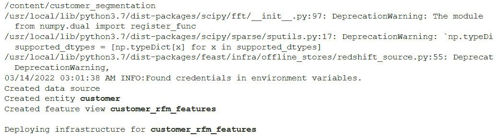

图 4.34 – Feast 应用输出

要验证是否为特征视图创建了 DynamoDB 表，请导航到 DynamoDB 控制台，使用搜索或访问 https://console.aws.amazon.com/dynamodbv2/home?region=us-east-1#tables。您应该看到如 *图 4.35* 所示的 `customer_rfm_features` 表。

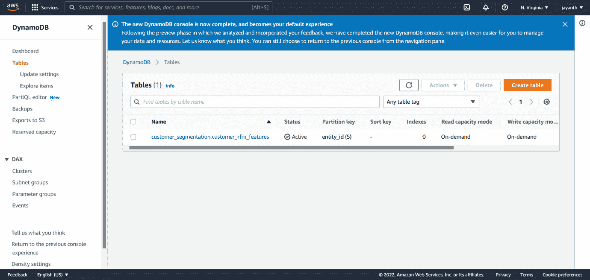

图 4.35 – DynamoDB 表

现在已经应用了特征定义，为了导入特征数据，让我们选取在 *模型（特征工程）* 部分创建的特征工程笔记本（[`github.com/PacktPublishing/Feature-Store-for-Machine-Learning/blob/main/Chapter04/ch4_feature_engineering.ipynb`](https://github.com/PacktPublishing/Feature-Store-for-Machine-Learning/blob/main/Chapter04/ch4_feature_engineering.ipynb)）并继续在该笔记本中（特征工程的最后一个命令生成了 *图 4.21*）。为了导入数据，我们唯一要做的就是将特征 DataFrame 写入到 *图 4.28* 中映射的 S3 位置。我已经将数据存储位置映射为 `s3://feast-demo-mar-2022/customer-rfm-features/`。让我们将 DataFrame 写入到该位置，格式为 Parquet。

以下代码块从 S3 位置导入数据：

```py
import os
```

```py
from datetime import datetime
```

```py
os.environ["AWS_ACCESS_KEY_ID"] = "<aws_key_id>"
```

```py
os.environ["AWS_SECRET_ACCESS_KEY"] = "<aws_secret>"
```

```py
os.environ["AWS_DEFAULT_REGION"] = "us-east-1"
```

```py
file_name = f"rfm_features-{datetime.now()}.parquet" 
```

```py
feature_data["event_timestamp"] = datetime.now()
```

```py
feature_data["created_timestamp"] = datetime.now()
```

```py
s3_url = f's3://feast-demo-mar-2022/customer-rfm-features/{file_name}'
```

```py
feature_data.to_parquet(s3_url)
```

前面的代码块设置了 IAM 用户的 AWS 凭据，添加了缺失的列 `event_timestamp` 和 `created_timestamp`，并将 Parquet 文件写入到 S3 位置。为了验证文件已成功写入，请导航到 S3 位置并验证文件是否存在。为了确保文件格式正确，让我们导航到 *图 4.32* 中的 Redshift 查询编辑器并运行以下查询：

```py
SELECT * from spectrum.customer_rfm_features limit 5
```

前面的命令应该成功执行，输出结果如 *图 4.36* 所示。

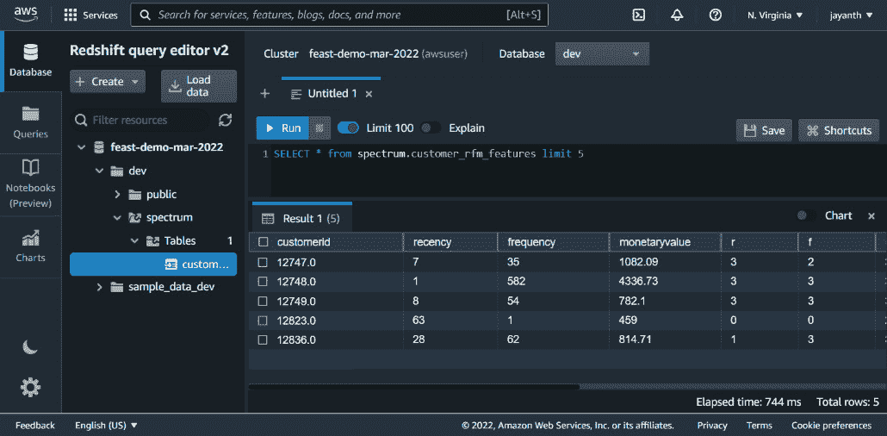

图 4.36 – 数据导入后的红移查询

在我们进入 ML 的下一阶段之前，让我们运行几个 API，看看我们的特征存储库是什么样子，并验证对历史存储的查询是否正常。对于以下代码，让我们使用我们创建和应用特征定义的笔记本（[`github.com/PacktPublishing/Feature-Store-for-Machine-Learning/blob/main/Chapter04/ch4_create_apply_feature_definitions.ipynb`](https://github.com/PacktPublishing/Feature-Store-for-Machine-Learning/blob/main/Chapter04/ch4_create_apply_feature_definitions.ipynb))。

以下代码连接到特征存储并列出可用的实体和特征视图：

```py
"""import feast and load feature store object with the path to the directory which contains feature_story.yaml."""
```

```py
from feast import FeatureStore
```

```py
store = FeatureStore(repo_path=".")
```

```py
#Get list of entities and feature views
```

```py
print("-----------------------Entity---------------------")
```

```py
for entity in store.list_entities():
```

```py
  print(f"entity: {entity}")
```

```py
print("--------------------Feature Views-----------------")
```

```py
for feature_view in store.list_feature_views():
```

```py
  print(f"List of FeatureViews: {feature_view}")
```

上一段代码块打印了 `customer` 实体和 `customer_rfm_features` 特征视图。让我们查询离线存储中的几个实体，看看它是否按预期工作。

要查询离线数据，我们需要实体 ID 和时间戳列。实体 ID 列是客户 ID 的列表，时间戳列用于在数据集上执行点时间连接查询。以下代码为查询创建了一个实体 DataFrame：

```py
import pandas as pd
```

```py
from datetime import datetime, timedelta
```

```py
entity_df = pd.DataFrame.from_dict(
```

```py
    {
```

```py
        "customerid": ["12747.0", "12748.0", "12749.0"],
```

```py
        "event_timestamp": [datetime.now()]*3
```

```py
    }
```

```py
)
```

```py
entity_df.head()
```

上一段代码块生成了一个类似于 *图 4.37* 中的实体 DataFrame。


图 4.37 – 实体 DataFrame

使用示例实体 DataFrame，让我们查询历史数据。以下代码从历史存储中获取特征子集：

```py
job = store.get_historical_features(
```

```py
    entity_df=entity_df,
```

```py
    features=[
```

```py
              "customer_rfm_features:recency", 
```

```py
              "customer_rfm_features:frequency", 
```

```py
              "customer_rfm_features:monetaryvalue", 
```

```py
              "customer_rfm_features:r", 
```

```py
              "customer_rfm_features:f", 
```

```py
              "customer_rfm_features:m"]
```

```py
    )
```

```py
df = job.to_df()
```

```py
df.head()
```

以下代码块可能需要几分钟才能运行，但最终输出以下结果：

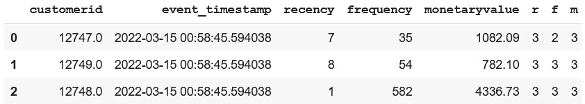

图 4.38 – 历史检索作业输出

现在，我们可以说我们的特征工程流程已经准备好了。接下来需要进行的步骤是训练模型、执行验证，如果对模型的性能满意，则将流程部署到生产环境中。我们将在下一章中探讨训练、验证、部署和模型评分。接下来，让我们简要总结一下我们学到了什么。

# 摘要

在本章中，我们以将 Feast 特征存储添加到我们的 ML 模型开发为目标。我们通过在 AWS 上创建所需资源、添加 IAM 用户以访问这些资源来实现这一点。在创建资源后，我们再次从问题陈述到特征工程和特征摄取的 ML 生命周期步骤进行了操作。我们还验证了创建的特征定义和摄取的数据可以通过 API 进行查询。

现在，我们已经为 ML 生命周期的下一步——模型训练、验证、部署和评分——做好了准备，在下一章中，我们将学习从一开始就添加特征存储是如何使模型在开发完成后立即准备好生产的。

# 参考文献

+   Feast 文档：[`docs.feast.dev/`](https://docs.feast.dev/)

+   在 AWS 上使用 Feast 进行信用评分：[`github.com/feast-dev/feast-aws-credit-scoring-tutorial`](https://github.com/feast-dev/feast-aws-credit-scoring-tutorial)
