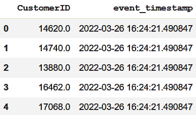
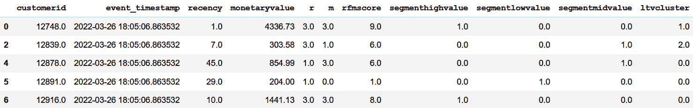
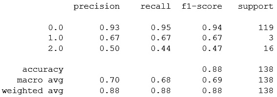
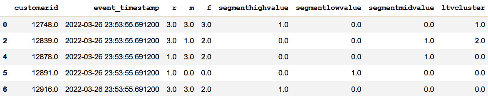
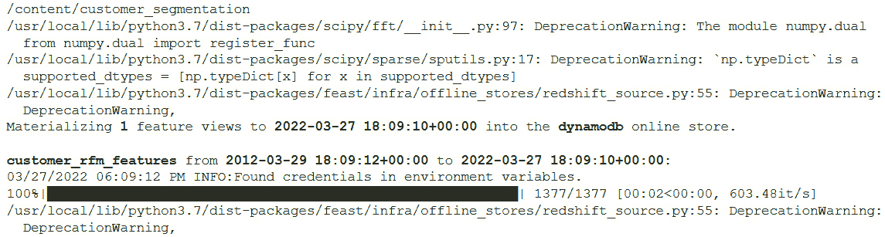
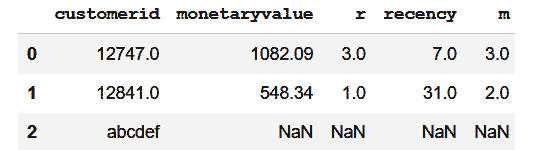
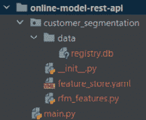
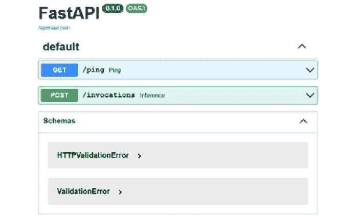
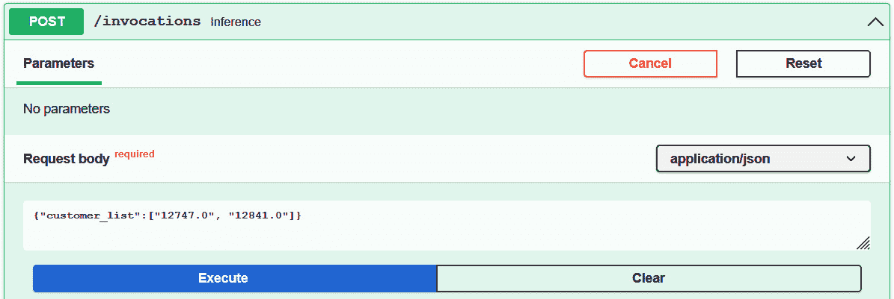
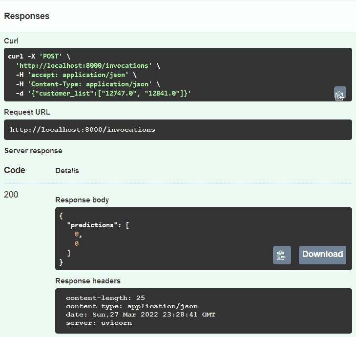

# 第五章：模型训练和推理

在上一章中，我们讨论了在 AWS 云中的**Feast 部署**，并将 S3 设置为离线存储，将 DynamoDB 设置为在线存储模型。我们还回顾了使用*第一章*，*机器学习生命周期概述*中构建的**客户终身价值**（**LTV**/**CLTV**）模型所经历的几个 ML 生命周期阶段。在模型开发处理过程中，我们进行了数据清洗和特征工程，并生成了特征集，为这些特征定义创建了并应用于 Feast。最后，我们成功地将特征导入 Feast，并且也能够查询导入的数据。

在本章中，我们将继续 ML 生命周期的其余部分，这将涉及使用特征存储进行模型训练、打包、批量推理和在线模型推理。本章的目标是继续使用上一章创建的特征存储基础设施，并完成 ML 生命周期的其余部分。在这个过程中，我们将有机会了解如何在 ML 开发中使用特征存储来提高模型的上市时间，解耦 ML 生命周期的不同阶段，并有助于协作。我们还将回顾*第一章*，*机器学习生命周期概述*，并在执行这些步骤时比较不同阶段。本章将帮助您了解如何使用特征存储进行模型训练，然后进行模型推理。我们还将学习在线存储库所服务的用例以及离线存储库所服务的用例。

我们将按以下顺序讨论以下主题：

+   使用特征存储进行模型训练

+   模型打包

+   使用 Feast 进行批量模型推理

+   使用 Feast 进行在线模型推理

+   处理开发过程中功能集的变化

# 前提条件

为了运行示例并更好地理解本章内容，需要使用在*第四章*，*将特征存储添加到机器学习模型*中创建的资源。在本章中，我们将使用上一章创建的资源，并使用本章创建的特征存储库。以下 GitHub 链接指向我创建的特征存储库：[`github.com/PacktPublishing/Feature-Store-for-Machine-Learning/tree/main/customer_segmentation`](https://github.com/PacktPublishing/Feature-Store-for-Machine-Learning/tree/main/customer_segmentation)。

# 技术要求

要跟随章节中的代码示例，你需要熟悉 Python 和任何笔记本环境，这可能是一个本地的设置，如 Jupyter，或者是一个在线笔记本环境，如 Google Colab、Kaggle 或 SageMaker。你还需要一个 AWS 账户，可以完全访问 Redshift、S3、Glue、DynamoDB、IAM 控制台等资源。你可以在试用期间创建一个新账户并免费使用所有服务。在最后一部分，你需要一个 IDE 环境来开发在线模型的 REST 端点。你可以在以下 GitHub 链接中找到本书的代码示例：[`github.com/PacktPublishing/Feature-Store-for-Machine-Learning/tree/main/Chapter05`](https://github.com/PacktPublishing/Feature-Store-for-Machine-Learning/tree/main/Chapter05)。

# 使用特征存储进行模型训练

在*第一章*，*机器学习生命周期概述*中，在特征工程之后，我们直接在同一笔记本中开始了模型训练。而相比之下，在*第四章*，*将特征存储添加到机器学习模型*中，生成的特征被摄入到特征存储中。这是特征存储在机器学习生命周期中帮助实现的标准化的一个方面。通过将特征摄入到特征存储中，创建了一个可发现、可共享、可重用和版本化的数据集/特征集。

现在假设有两个数据科学家，拉姆和迪，他们正在同一个模型上工作。他们都可以使用这个特征集，而无需做任何额外的工作。不仅如此，如果背景数据每天都会更新，那么所有需要做的就是在数据科学家到来时每天运行一次特征工程笔记本，最新的特征就会可供使用。更好的做法是使用如**Airflow**、**AWS Step Functions**或甚至**GitHub**工作流等编排框架来安排特征工程笔记本。一旦完成，拉姆和迪在来工作时都可以使用最新的特征进行实验。

正如我们一直在讨论的，数据工程师和科学家从特征存储中获得的最大优势之一是协作。让我们尝试看看我们的两位数据科学家 Dee 和 Ram 在模型构建中如何协作/竞争。每天 Dee 和 Ram 来上班时，假设计划中的特征工程已经成功运行，他们就开始进行模型训练。这里需要注意的另一件重要事情是，对于模型训练，数据源是特征存储。数据科学家不需要进入原始数据源来生成特征，除非他们对现有特征的模型不满意。在这种情况下，数据科学家将再次进行数据探索，生成额外的特征集，并将它们导入特征存储。导入的特征再次可供每个人使用。这将一直持续到团队/数据科学家对模型的性能满意为止。

在我们将 Dee 和 Ram 两位数据科学家的工作流程分开之前，让我们回顾一下他们模型训练笔记本中的共同步骤。让我们打开一个新的 Python 笔记本，命名为 `model-training.ipynb`，并生成训练数据。离线存储将用于生成训练数据集，因为它存储历史数据，并使用时间戳对数据进行版本控制。在 Feast 中，数据存储的接口是通过 API 实现的，正如我们在 *第三章* *特征存储基础、术语和用法* 和 *第四章* *将特征存储添加到机器学习模型* 中所看到的。因此，为了生成训练数据集，我们将使用 `get_historical_features`。`get_historical_features` API 的一个输入是实体 ID。通常，在企业中，实体 ID 可以从原始数据源中获取。典型的原始数据源包括数据库、数据仓库、对象存储等。获取实体的查询可能像 `select unique {entity_id} from {table};` 这样简单。让我们在这里做类似的事情。我们的原始数据源是 CSV 文件。让我们使用它来获取实体 ID。在我们继续之前，让我们安装所需的包：

1.  以下代码块安装了模型训练所需的包：

    ```py
    !pip install feast[aws]==0.19.3 pandas xgboost
    ```

1.  安装完所需的包后，如果您还没有克隆特征仓库，请克隆它，因为我们需要连接到特征存储来生成训练数据集。以下代码克隆了仓库：

    ```py
    !git clone <repo_url>
    ```

1.  现在我们有了特征仓库，让我们连接到 Feast/特征存储，确保一切按预期工作，然后再继续：

    ```py
    # change directory
    %cd customer_segmentation
    """import feast and load feature store object with the path to the directory which contains feature_story.yaml."""
    from feast import FeatureStore
    store = FeatureStore(repo_path=".")
    for entity in store.list_entities():
      print(f"entity: {entity}")
    ```

前面的代码块连接到 Feast 功能仓库。`repo_path="."` 参数表示 `feature_store.yaml` 文件位于当前工作目录中。它还列出了 `customer_segmentation` 功能仓库中可用的实体。

现在我们能够连接到特征仓库，让我们创建训练模型所需的实体 ID 列表。为了获取实体 ID 列表，在这种情况下，`CustomerId`，让我们使用原始数据集并从中过滤出实体 ID。

重要提示

我们使用与*第四章*中使用的相同原始数据集，*将特征存储添加到机器学习模型中*。以下是数据集的 URL：[`www.kaggle.com/datasets/vijayuv/onlineretail`](https://www.kaggle.com/datasets/vijayuv/onlineretail)。

1.  以下代码块加载了原始数据：

    ```py
    import pandas as pd
    ##Read the OnlineRetail.csv
    retail_data = pd.read_csv('/content/OnlineRetail.csv',
                              encoding= 'unicode_escape')
    retail_data['InvoiceDate'] = pd.to_datetime(
      retail_data['InvoiceDate'], errors = 'coerce')
    ```

    重要提示

    您可能会质疑为什么在这里需要原始数据。Feast 允许对实体进行查询。因此，我们需要需要特征的实体 ID。

1.  让我们过滤掉感兴趣的顾客 ID，类似于在特征创建过程中所做的过滤。以下代码块选择不属于英国的数据库集，以及存在于三个月数据集中的顾客 ID（选择三个月数据集中的顾客的原因是，在生成 RFM 特征后，我们在特征工程笔记本中的数据集上执行了左连接）。

以下代码块执行了所描述的过滤操作：

```py
## filter data for United Kingdom
uk_data = retail_data.query("Country=='United Kingdom'").reset_index(drop=True)
t1 = pd.Timestamp("2011-06-01 00:00:00.054000")
t2 = pd.Timestamp("2011-03-01 00:00:00.054000")
uk_data_3m = uk_data[(uk_data.InvoiceDate < t1) & (uk_data.InvoiceDate >= t2)].reset_index(drop=True)
```

从`uk_data_3m`中，我们需要获取唯一的`CustomerId`。实体数据中还需要额外的列是时间戳，以执行点时间连接。现在，我将使用所有实体 ID 的最新时间戳。

1.  以下代码块创建了查询历史商店所需的实体 DataFrame：

    ```py
    from datetime import datetime
    entity_df = pd.DataFrame(data = {
        "customerid": [str(item) for item in uk_data_3m.CustomerID.unique().tolist()],
        "event_timestamp": datetime.now()
    })
    entity_df.head()
    ```

前一个代码块生成了以下输出：



图 5.1 – 用于生成训练数据集的实体 DataFrame

如*图 5.1*所示，实体 DataFrame 包含两列：

+   **CustomerID**：需要获取特征的客户列表。

+   `event_timestamp`。

现在 Dee 和 Ram 的模型训练笔记本中的共同步骤已完成，让我们分割他们的工作流程，看看他们如何协作。

## Dee 的模型训练实验

从上一步骤继续（您可以随意复制代码块并在不同的笔记本中运行它们，并将其命名为`dee-model-training.ipynb`），现在是时候选择训练模型所需的特征集了：

1.  为了选择特征，Dee 将运行以下命令来查看现有特征视图中可用的特征：

    ```py
    feature_view = store.get_feature_view("customer_rfm_features")
    print(feature_view.to_proto())
    ```

前一个命令输出了特征视图。以下块显示了输出的一部分，包括特征和实体，它们是特征视图的一部分：

```py
  name: "customer_rfm_features"
  entities: "customer"
  features {
    name: "recency"
    value_type: INT32
  }
  features {
    name: "frequency"
    value_type: INT32
  }
  features {
    name: "monetaryvalue"
    value_type: DOUBLE
  }
  …

meta {
  created_timestamp {
    seconds: 1647301293
    nanos: 70471000
  }
  last_updated_timestamp {
    seconds: 1647301293
    nanos: 70471000
  }
}
```

从特征集中，假设 Dee 想要排除与频率相关的特征，看看这会对模型的性能产生什么影响。因此，她选择了所有其他特征进行查询，并排除了*频率*和*F*，其中*F*表示频率组。

1.  以下代码块查询历史/离线存储，使用*图 5.1*中显示的实体 DataFrame 获取所需特征：

    ```py
    import os
    from datetime import datetime
    os.environ["AWS_ACCESS_KEY_ID"] = "<aws_key_id>"
    os.environ["AWS_SECRET_ACCESS_KEY"] = "<aws_secret>"
    os.environ["AWS_DEFAULT_REGION"] = "us-east-1"
    job = store.get_historical_features(
        entity_df=entity_df,
        features=[
                  "customer_rfm_features:recency", 
                  "customer_rfm_features:monetaryvalue", 
                  "customer_rfm_features:r", 
                  "customer_rfm_features:m",
                  "customer_rfm_features:rfmscore",
                  "customer_rfm_features:segmenthighvalue",
                  "customer_rfm_features:segmentlowvalue"
                  "customer_rfm_features:segmentmidvalue",
                  "customer_rfm_features:ltvcluster"
                  ]
        )
    feature_data = job.to_df()
    feature_data = feature_data.dropna()
    feature_data.head()
    ```

前面的代码块输出以下 DataFrame：



图 5.2 – Dee 模型的训练数据集

重要提示

在前面的代码块中，将`<aws_key_id>`和`<aws_secret>`替换为在*第四章*，*将特征存储添加到机器学习模型*中创建的用户凭据。

1.  现在，Dee 已经生成了训练数据集，下一步是模型训练。让我们使用与*第一章*，*机器学习生命周期概述*中使用的相同参数构建 XGBoost 模型。以下代码块将数据集分为培训和测试：

    ```py
    from sklearn.metrics import classification_report,confusion_matrix
    import xgboost as xgb
    from sklearn.model_selection import KFold, cross_val_score, train_test_split
    #Drop prediction column along with event time and customerId columns from X
    X = feature_data.drop(['ltvcluster', 'customerid', 
                           'event_timestamp'], axis=1)
    y = feature_data['ltvcluster']
    X_train, X_test, y_train, y_test = \ 
    train_test_split(X, y, test_size=0.1)
    ```

1.  以下代码块使用前一个示例中创建的培训和测试数据集，训练一个`XGBClassifier`模型：

    ```py
    xgb_classifier = xgb.XGBClassifier(max_depth=5, objective='multi:softprob')
    #model training
    xgb_model = xgb_classifier.fit(X_train, y_train)
    #Model scoring
    acc = xgb_model.score(X_test,y_test)
    print(f"Model accuracy: {acc}")
    ```

前面的代码块打印出模型的准确率：

```py
Model accuracy: 0.8840579710144928
```

1.  以下代码块在测试数据集上运行`predict`函数并打印出分类报告：

    ```py
    #Run prediction on the test dataset
    y_pred = xgb_model.predict(X_test)
    print(classification_report(y_test, y_pred))
    ```

前面的代码块产生以下输出：



图 5.3 – Dee 模型的分类报告

不仅于此，Dee 还可以尝试不同的特征集和算法。目前，我们假设 Dee 对她自己的模型感到满意。让我们继续看看 Ram 会做什么。

## Ram 的模型训练实验

再次强调，我们将从*图 5.1*之后的步骤继续在笔记本中操作（您可以自由复制代码块，在另一个笔记本中运行它们，并将其命名为`ram-model-training.ipynb`）。现在是选择训练模型所需特征集的时候了。为了选择特征，Ram 将遵循与 Dee 类似的步骤。让我们假设 Ram 有不同的想法——他不是删除一个特定的类别，而是删除具有实际值的特征，只使用 R、F 和 M 分类特征以及分类特征段。根据 Ram 的说法，这些分类变量是实际值的一些转换：

1.  以下代码块产生 Ram 训练模型所需的特征集：

    ```py
    import os
    from datetime import datetime
    os.environ["AWS_ACCESS_KEY_ID"] = "<aws_key_id>"
    os.environ["AWS_SECRET_ACCESS_KEY"] = "<aws_secret>"
    os.environ["AWS_DEFAULT_REGION"] = "us-east-1"
    job = store.get_historical_features(
        entity_df=entity_df,
        features=[
                 "customer_rfm_features:r", 
                 "customer_rfm_features:m",
                 "customer_rfm_features:f",
                 "customer_rfm_features:segmenthighvalue",
                 "customer_rfm_features:segmentlowvalue",
                 "customer_rfm_features:segmentmidvalue",
                 "customer_rfm_features:ltvcluster"
                 ]
        )
    feature_data = job.to_df()
    feature_data = feature_data.dropna()
    feature_data.head()
    ```

    重要提示

    在前面的代码块中，将`<aws_key_id>`和`<aws_secret>`替换为在*第四章*，*将特征存储添加到机器学习模型*中创建的用户凭据。

前面的代码块产生以下输出：



图 5.4 – Ram 模型的训练数据集

1.  下一步与 Dee 执行的操作类似，即训练模型并查看其分类报告。让我们来做这件事。

以下代码块在*图 5.4*中的特征集上训练模型：

```py
from sklearn.metrics import classification_report,confusion_matrix
from sklearn.linear_model import LogisticRegression
from sklearn.model_selection import KFold, cross_val_score, train_test_split
X = feature_data.drop(['ltvcluster', 'customerid',
                       'event_timestamp'], axis=1)
y = feature_data['ltvcluster']
X_train, X_test, y_train, y_test = \ 
train_test_split(X, y, test_size=0.1)
model =  (random_state=0).fit(X_train, y_train)
acc = model.score(X_test,y_test)
print(f"Model accuracy: {acc}")
```

上述代码块在训练后打印了模型在测试集上的准确率。代码与 Dee 所使用的类似，但使用的是 `LogisticRegression` 而不是 `XGBClassifier`。代码块生成了以下输出：

```py
Model accuracy: 0.8623188405797102
```

1.  让我们打印测试数据集上的分类报告，以便我们可以比较 Ram 和 Dee 的模型。以下代码块生成了该模型的分类报告：

    ```py
    y_pred = model.predict(X_test)
    print(classification_report(y_test, y_pred))
    ```

上述代码块生成了以下输出：

![图 5.5 – Ram 模型的分类报告]

![图片 B18024_05_005.jpg]

图 5.5 – Ram 模型的分类报告

现在，Ram 和 Dee 可以通过查看他们各自运行的实验来比较彼此的工作。不仅这些两个实验，他们还可以运行多个实验，在所有比较之后得出最佳模型。不仅如此，他们还可以通过编写代码尝试所有特征集的组合来自动化实验，在运行这些实验的同时查看和探索更多数据或专注于其他方面的工作。

我在这里建议的另一件事是使用实验跟踪工具/软件之一。市场上有很多这样的工具。其中一些提供了您使用的笔记本基础设施。例如，**Databricks** 提供 **MLflow**，**SageMaker** 有自己的，还有第三方实验跟踪工具，如 **Neptune**、**ClearML** 等。更多实验跟踪和比较的工具可以在以下博客中找到：[`neptune.ai/blog/best-ml-experiment-tracking-tools`](https://neptune.ai/blog/best-ml-experiment-tracking-tools)。

假设 Dee 和 Ram 在所有实验之后得出结论，认为 `XGBClassifier` 表现得更好，并决定使用该模型。接下来，让我们看看下一节中的模型打包。

# 模型打包

在上一节中，我们构建了两个模型版本。在本节中，我们将打包其中一个模型并保存它以供模型评分和部署。正如上一节所述，我们将打包 `XGBClassifier` 模型。再次强调，对于打包，有不同解决方案和工具可用。为了避免设置另一个工具，我将使用 `joblib` 库来打包模型：

1.  在生成 `XGBClassifier` 模型的同一笔记本中，以下代码块安装了 `joblib` 库：

    ```py
    #install job lib library for model packaging
    !pip install joblib
    ```

1.  安装 `joblib` 库后，下一步是使用它来打包模型对象。以下代码块打包了模型并将其写入文件系统上的特定位置：

    ```py
    import joblib
    joblib.dump(xgb_model, '/content/customer_segment-v0.0')
    ```

上述代码块在 `/content` 文件夹中创建了一个文件。为了验证这一点，运行一个 `ls` 命令并检查文件是否存在。让我们也验证模型是否可以被加载，并且我们是否可以在其上运行 `predict` 函数。

1.  以下代码块从 `/content/customer_segment-v0.0` 位置加载模型并在样本数据集上运行预测：

    ```py
    loaded_model = joblib.load('/content/customer_segment-v0.0')
    prediction = loaded_model.predict(X_test.head())
    prediction.tolist()
    ```

前面的代码块应该没有错误地运行，并打印以下预测输出：

```py
[0.0, 0.0, 0.0, 2.0, 0.0]
```

1.  现在我们有了打包好的模型，下一步是将它注册到模型仓库中。同样，有许多工具可供使用来管理模型，例如 MLflow、SageMaker 以及其他工具。我强烈建议使用其中之一，因为它们可以处理许多用于共享、部署、标准版本控制等方面的用例。为了简化，我将在这里使用 S3 存储桶作为模型注册处，并将训练好的模型上传到那里。

下面的代码将打包好的模型上传到 S3 存储桶：

```py
import boto3
s3_client = boto3.client('s3')
s3_client.upload_file(
  '/content/customer_segment-v0.0', 
  "feast-demo-mar-2022", 
  "model-repo/customer_segment-v0.0")
```

前面的代码块将文件 `S3 bucket, feast-demo-mar-2022` 上传到以下前缀：`model-repo/customer_segment-v0.0`。请通过访问 AWS 控制台来验证这一点，以确保模型已上传到指定的位置。

到目前为止，我们已经完成了模型训练和实验，并在模型仓库（S3 存储桶）中注册了一个候选模型。让我们在下一节创建一个用于批量模型用例的模型预测笔记本。

# 使用 Feast 进行批量模型推理

在本节中，让我们看看如何运行批量模型的预测。为了对批量模型进行预测，我们需要两样东西：一个是模型，另一个是用于预测的客户及其特征集列表。在上一节中，我们在模型注册处（即 S3）创建并注册了一个模型。同时，所需的特征在特征存储中也是可用的。我们需要的只是需要运行预测的客户列表。客户列表可以从我们之前在模型训练期间使用的原始数据集中生成。然而，为了这个练习的目的，我们将取一小部分客户并对其运行预测。

让我们创建一个模型预测笔记本并加载在模型仓库中注册的模型：

1.  下面的代码块安装了预测笔记本所需的依赖项：

    ```py
    !pip install feast[aws]==0.19.3 pandas xgboost joblib
    ```

1.  在安装了依赖项之后，其他所需的步骤是如果尚未完成，则获取特征仓库。这是所有使用 Feast 的笔记本中常见的需求之一。然而，在其他特征存储中，这个过程可能并不相同。其中一个原因是 Feast 是以 SDK/CLI 为导向的。其他特征存储，如 SageMaker 和 Databricks，可能只需要凭证来访问它。我们将在下一章中查看一个示例。

1.  假设你已经克隆了上一章中创建的 Feast 仓库（该仓库也用于模型创建），下一步是从模型注册处的 S3 获取模型。

下面的代码块从 S3 位置（即模型上传到的位置）下载模型：

```py
import boto3
import os
#aws Credentials
os.environ["AWS_ACCESS_KEY_ID"] = "<aws_key_id>"
os.environ["AWS_SECRET_ACCESS_KEY"] = "<aws_secret>"
os.environ["AWS_DEFAULT_REGION"] = "us-east-1"
#Download model from s3
model_name = "customer_segment-v0.0"
s3 = boto3.client('s3')
s3.download_file("feast-demo-mar-2022", 
                 f"model-repo/{model_name}", 
                 model_name)
```

在执行前面的代码块之后，你应该在当前工作目录中看到一个名为 `customer_segment-v0.0` 的文件。你可以使用 `ls` 命令或通过文件夹浏览器来验证它。

重要提示

将前一个代码块中的 `<aws_key_id>` 和 `<aws_secret>` 替换为在 *第四章* 中创建的用户凭据，*添加特征存储到机器学习模型*。

1.  下一步是获取需要评分的客户列表。如前所述，这可以从原始数据源中获取，但为了练习的目的，我将硬编码一个客户样本列表。为了模拟从原始数据源获取客户，我将调用一个返回客户列表的函数。

下面的代码块显示了从原始数据源获取客户的模拟函数：

```py
def fetch_customers_from_raw_data():
  ## todo: code to fetch customers from raw data
  return ["12747.0", "12841.0", "12849.0", 
          "12854.0", "12863.0"]
customer_to_be_scored=fetch_customers_from_raw_data()
```

1.  现在我们有了要评分的客户列表，下一步是获取这些客户的特征。有几种不同的方法可以做到这一点。一种方法是使用在线存储，另一种方法是使用离线存储。对于批处理模型，由于延迟不是必需的，最经济的方法是使用离线存储；只是离线存储需要查询最新的特征。这可以通过使用 `event_timestamp` 列来完成。让我们使用离线存储并查询给定客户列表所需的特征。为此，我们需要实体 DataFrame。让我们接下来创建它。

1.  下面的代码块创建所需的实体 DataFrame 以获取最新的特征：

    ```py
    import pandas as pd
    from datetime import datetime
    entity_df = pd.DataFrame(data={
        "customerid": customer_to_be_scored,
        "event_timestamp": datetime.now()
    })
    entity_df.head()
    ```

前面的代码块输出以下实体 DataFrame：

![Figure 5.6 – 预测用实体 DataFrame

![img/B18024_05_006.jpg]

图 5.6 – 预测用实体 DataFrame

要获取任何客户的最新特征，您需要将 `event_timestamp` 设置为 `datetime.now()`。让我们使用 *图 5.4* 中的实体 DataFrame 来查询离线存储。

1.  下面的代码块获取给定实体 DataFrame 的特征：

    ```py
    %cd customer_segmentation
    from feast import FeatureStore
    store = FeatureStore(repo_path=".")
    job = store.get_historical_features(
        entity_df=entity_df,
        features=[
                  "customer_rfm_features:recency", 
                  "customer_rfm_features:monetaryvalue", 
                  "customer_rfm_features:r", 
                  "customer_rfm_features:m",
                  "customer_rfm_features:rfmscore",
                  "customer_rfm_features:segmenthighvalue",
                  "customer_rfm_features:segmentlowvalue",
                  "customer_rfm_features:segmentmidvalue"
              ]
        )
    pred_feature_data = job.to_df()
    pred_feature_data = pred_feature_data.dropna()
    pred_feature_data.head()
    ```

前面的代码块产生以下输出：

![Figure 5.7 – 预测用特征

![img/B18024_05_007.jpg]

图 5.7 – 预测用特征

1.  现在我们有了用于预测的特征，下一步是加载下载的模型，并使用 *图 5.5* 中的特征为客户运行预测。下面的代码块正是这样做的：

    ```py
    import joblib
    ## Drop unwanted columns
    features = pred_feature_data.drop(
        ['customerid', 'event_timestamp'], axis=1)
    loaded_model = joblib.load('/content/customer_segment-v0.0')
    prediction = loaded_model.predict(features)
    ```

1.  运行预测的最后一步是将预测结果存储在数据库或对象存储中，以便以后使用。在这个练习中，我将把预测结果写入 S3 桶。您可以将结果沉入其他数据存储。

1.  下面的代码块将预测结果以及特征保存到 S3 位置：

    ```py
    file_name = f"customer_ltv_pred_results_{datetime.now()}.parquet"
    pred_feature_data["predicted_ltvcluster"] = prediction.tolist()
    s3_url = f's3://feast-demo-mar-2022/prediction_results/{file_name}'
    pred_feature_data.to_parquet(s3_url)
    ```

通过最后一个代码块，我们完成了批量模型的实现。你心中的疑问可能是 *特征存储的引入是如何改变到目前为止的机器学习生命周期的？*。它的早期采用解耦了特征工程、模型训练和模型评分的步骤。它们中的任何一个都可以独立运行，而无需干扰管道的其他部分。这是一个巨大的好处。另一部分是部署。我们在第一步中创建的笔记本是具体的，执行特定的任务，如特征工程、模型训练和模型评分。

现在，为了将模型投入生产，我们只需要使用编排框架安排特征工程笔记本和模型评分笔记本，模型就会以全规模运行。我们将在下一章中探讨模型的投入生产。

在下一节中，我们将看看在线模型使用案例需要做些什么。

# 使用 Feast 进行在线模型推理

在上一节中，我们讨论了如何在批量模型推理中使用 Feast。现在，是时候看看在线模型的使用案例了。在线模型推理的一个要求是它应该以低延迟返回结果，并且可以从任何地方调用。其中一种常见的范式是将模型作为 REST API 端点公开。在 *模型打包* 部分，我们使用 `joblib` 库记录了模型。该模型需要用 RESTful 框架包装，以便作为 REST 端点部署。不仅如此，当推理端点被调用时，特征也需要实时获取。与 *第一章* 中讨论的，在 *机器学习生命周期概述* 中，我们没有实时服务特征的架构不同，这里，我们已经有了 Feast 的支持。然而，我们需要运行命令，使用 Feast 库将离线特征同步到在线商店。让我们先做这个。稍后，我们将探讨打包。

## 同步最新特征从离线到在线商店

要将特征从离线存储加载到在线商店，我们需要 Feast 库：

1.  让我们打开一个笔记本并安装所需的依赖项：

    ```py
    !pip install feast[aws]==0.19.3
    ```

1.  在安装所需的依赖项后，克隆特征存储仓库。如前所述，这是所有笔记本的要求。假设您已经将仓库克隆到当前工作目录中，以下命令将从离线存储加载最新特征到在线商店：

    ```py
    %cd customer_segmentation/
    from datetime import datetime
    import os
    #aws Credentials
    os.environ["AWS_ACCESS_KEY_ID"] = "<aws_key_id>"
    os.environ["AWS_SECRET_ACCESS_KEY"] = "<aws_secret>"
    os.environ["AWS_DEFAULT_REGION"] = "us-east-1"
    # Command to sync offline features into online.
    !feast materialize-incremental {datetime.now().isoformat()}
    ```

前面的命令会输出如下截图所示的进度：



图 5.8 – 同步离线数据到在线商店

1.  在将离线数据加载到在线商店后，让我们在在线商店上运行一个查询，并确保它按预期工作。要查询在线商店，初始化特征商店对象并调用 `get_online_features` API，如下面的代码块所示：

    ```py
    import pandas as pd
    from feast import FeatureStore
    store = FeatureStore(repo_path=".")
    feature_vector = store.get_online_features(
        features=[
            "customer_rfm_features:recency", 
            "customer_rfm_features:monetaryvalue", 
            "customer_rfm_features:r", 
            "customer_rfm_features:m",
        ],
        entity_rows=[
            {"customer": "12747.0"},
            {"customer": "12841.0"},
    {"customer": "abcdef"},
        ],
    ).to_dict()
    df = pd.DataFrame(feature_vector)
    df.head()
    ```

上述代码块以低延迟从在线商店（**DynamoDB**）获取数据。当你运行上述代码块时，你会注意到它响应的速度有多快，与历史存储查询相比。代码块的输出如下所示：



图 5.9 – 查询在线商店

在 *图 5.7* 的最后一行包含 `NaN` 值。这是 Feast 如果给定的任何实体 ID 都不存在于在线商店中时的响应示例。在这个例子中，具有 ID `abcdef` 的客户不存在于特征商店中，因此它为相应的行返回 `NaN` 值。

现在在线商店已经准备好最新的特征，让我们看看如何将模型打包成 RESTful API。

## 使用 Feast 代码将在线模型打包成 REST 端点

这一部分更多地关于软件工程，而不是数据工程或数据科学技能。Python 有许多 REST API 框架可供选择，例如 `POST` 方法端点，它将接受客户 ID 列表作为输入并返回预测列表：

1.  下面的代码块显示了将要实现的 API 协议：

    ```py
    POST /invocations
    {
       "customer_list": ["id1", "id2", …]
    }
    Response: status 200
    {
    "predictions": [0, 1, …]
    }
    ```

1.  现在我们有了 API 协议，下一步是选择我们将要使用的 REST 框架。在现有的 REST 框架中选择一个框架与其他框架相比有不同的权衡。由于这超出了本书的范围，我将使用 `fastapi` ([`fastapi.tiangolo.com/`](https://fastapi.tiangolo.com/))，因为它是一个异步框架。如果你熟悉其他框架，如 `flask` 或 `django`，请随意使用。无论你使用哪个框架，预测结果都将相同。无论你选择哪个框架，请记住，在部署之前，我们将对 REST API 进行 Docker 化。

要构建 API，我将使用 PyCharm IDE。如果你有其他喜欢的 IDE，请随意使用。此外，为了开发 API 和运行 API，我们需要以下库：`feast[aws]`、`uvicorn[standard]`、`fastapi`、`joblib` 和 `xgboost`。你可以使用 `pip install` 命令安装这些库。我将由你来决定，因为安装步骤取决于你使用的 IDE、平台以及个人偏好。然而，我将使用 `virtualenv` 来管理我的 Python 环境。

我的项目文件夹结构如下所示。如果你还没有注意到，特征仓库也被复制到了同一个文件夹中，因为我们需要初始化特征商店对象以及特征在线商店：



图 5.10 – IDE 中的在线模型文件夹结构

1.  在 `main.py` 文件中，让我们定义我们将要实现的 API。复制以下代码并将其粘贴到 `main.py` 文件中：

    ```py
    from fastapi import FastAPI
    app = FastAPI()
    @app.get("/ping")
    def ping():
        return {"ping": "ok"}
    @app.post("/invocations")
    def inference(customers: dict):
        return customers
    ```

如前一个代码块所示，有两个 API：`ping` 和 `inference`：

+   `ping`：`ping` API 是一个健康检查端点，在部署应用程序时将需要它。ping URL 将由基础设施，如 ECS 或 Kubernetes，用于检查应用程序是否健康。

+   `inference`：另一方面，`inference` API 将包含从特征存储中获取给定客户的特征、对模型进行评分并返回结果的逻辑。

1.  一旦你复制了前面的代码并将其粘贴到 `main.py` 文件中并保存，请转到终端并运行以下命令：

    ```py
    cd <project_folder>
    uvicorn main:app --reload
    ```

1.  前面的命令将在本地服务器上运行 FastAPI 服务器并打印类似于以下代码块的输出：

    ```py
    $ uvicorn main:app --reload
    INFO:     Will watch for changes in these directories: ['<folder path>']
    INFO:     Uvicorn running on http://127.0.0.1:8000 (Press CTRL+C to quit)
    INFO:     Started reloader process [24664] using watchgod
    WARNING:  The --reload flag should not be used in production on Windows.
    INFO:     Started server process [908]
    INFO:     Waiting for application startup.
    INFO:     Application startup complete.
    ```

    重要提示

    确保在运行命令之前已在终端中激活了虚拟环境。

1.  应用程序运行后，访问 URL [`127.0.0.1:8000/docs`](http://127.0.0.1:8000/docs)。你应该会看到一个 Swagger UI，如下面的截图所示：




图 5.11 – API 的 Swagger UI

我们将在 *图 5.9* 中使用 Swagger UI 来稍后调用 API。现在，请随意玩耍，探索可用的功能，并调用 API。

1.  现在我们已经设置了 API 结构，接下来让我们实现 `inference` API。如前所述，`inference` API 将从特征存储中读取特征并运行预测。

1.  我们还需要从模型仓库中加载模型。在我们的案例中，仓库是 S3。因此，我们需要代码从 S3 位置下载模型并将其加载到内存中。以下代码块从 S3 下载模型并将其加载到内存中。请注意，这是在应用程序初始加载期间的一次性活动。因此，让我们在 `main.py` 文件中的函数外部添加以下代码：

    ```py
    import boto3
    Import joblib
    model_name = "customer_segment-v0.0"
    s3 = boto3.client('s3')
    ## download file from s3
    s3.download_file(
        "feast-demo-mar-2022",
        f"model-repo/{model_name}",
        model_name)
    ## Load the model into memory.
    loaded_model = joblib.load('customer_segment-v0.0')
    ```

1.  现在模型已加载到内存中，下一步是初始化特征存储对象。初始化也可以在方法外部进行，因为它是一次性活动：

    ```py
    #initialize the feature store object.
    store = FeatureStore(repo_path=os.path.join(os.getcwd(), "customer_segmentation"))
    ```

1.  由于 `customer_segmentation` 功能仓库与 `main.py` 文件处于同一级别，如图 5.8 所示，我已经适当地设置了 `repo_path`。从在线商店获取特征、运行预测和返回结果的剩余逻辑将放入 `inference` 方法定义中。以下代码块包含相同的内容。复制该方法并将其替换到 `main.py` 文件中：

    ```py
    @app.post("/invocations")
    def inference(customers: dict):
        ##Step1: list of features required for scoring the model
        required_features = [
            "customer_rfm_features:recency",
            "customer_rfm_features:monetaryvalue",
            "customer_rfm_features:r",
            "customer_rfm_features:m",
            "customer_rfm_features:rfmscore",
            "customer_rfm_features:segmenthighvalue",
            "customer_rfm_features:segmentlowvalue",
            "customer_rfm_features:segmentmidvalue"
        ]
        ##step 2: get entity rows from the input
        entity_rows = [{"customer": cust_id} for cust_id in customers["customer_list"]]
        ##Step 3: query online store
        feature_vector = store.get_online_features(
            features=required_features,
            entity_rows=entity_rows,
        ).to_dict()
        ##Step 4: convert features to dataframe and reorder the feature columns in the same order that model expects.
        features_in_order = ['recency', 'monetaryvalue', 
                             'r', 'm', 'rfmscore', 
                             'segmenthighvalue', 
                             'segmentlowvalue', 
                             'segmentmidvalue']
        df = pd.DataFrame(feature_vector)
        features = df.drop(['customerid'], axis=1)
        features = features.dropna()
        features = features[features_in_order]
        ##Step 5: run prediction and return the list
        prediction = loaded_model.predict(features)
        return {"predictions": prediction.tolist()}
    ```

1.  现在预测逻辑已完成，让我们运行应用程序并尝试运行预测。要运行应用程序，命令与之前使用的一样：

    ```py
    <aws_key_id> and <aws_secret> in the preceding code block with the user credentials created in *Chapter 4*, *Adding Feature Store to ML Models*.
    ```

1.  一旦应用程序成功加载，请访问 Swagger UI 网址 ([`localhost:8000/docs`](http://localhost:8000/docs))。在 Swagger UI 中，展开 `invocations` API 并点击 **尝试**。你应该会看到一个类似于 *图 5.12* 的屏幕。



图 5.12 – Swagger UI 调用 API

1.  在请求体中，提供如图 *图 5.12* 所示的输入（以下代码块中的那个）：

    ```py
    {"customer_list":["12747.0", "12841.0"]}
    ```

1.  使用这个输入，通过点击 **执行** 提交请求。API 应该在毫秒内响应，当你在屏幕上向下滚动时，输出将可见。以下图显示了示例输出：



图：5.13 – 在线模型响应

这样就完成了为在线模型构建 REST API 的步骤，并附有从 Feast 获取特征的代码。现在我们既有在线模型也有批量模型，在下一章中，我们将探讨如何将这些模型投入生产，以及如何通过早期采用特征存储和 MLOps，将开发到生产的过渡变得简单。

我们还没有探讨的是如何更改/更新或添加额外的特征。在我们继续之前，让我们简要地看看这个问题。

# 在开发过程中处理特征集的变化

模型开发是一个不断演变的过程。模型也是如此——它们会随着时间的推移而演变。今天，我们可能只使用几个特征来构建特定的模型，但随着我们不断发现和尝试新的特征，如果新特征的性能优于当前模型，我们可能会在模型训练和评分中包含这些新特征。因此，特征集可能会随时间而变化。这意味着在特征存储中，我们在 *第四章* 中执行的一些步骤，即 *将特征存储添加到机器学习模型中*，可能需要重新审视。让我们看看这些步骤是什么。

重要提示

这里的假设是在模型开发过程中特征定义发生变化，而不是在生产之后。我们将在后面的章节中探讨模型投入生产后如何处理特征集的变化。

## 第 1 步 – 更改特征定义

如果在模型开发过程中特征或实体发生变化，第一步是更新特征存储库中的特征定义。如果你记得正确，当特征最终确定时，我们首先做的事情是创建特征定义。在特征存储库中，文件 `rfm_features.py` 包含了定义。在做出更改后，运行 `feast apply` 命令以更新资源中的特征定义。如果你创建或删除了新的实体或视图，相应的在线存储资源（DynamoDB 表）将被创建或删除。你可以在控制台中验证这一点。如果只有一些小的更改，例如更改数据类型或特征名称，这些更改将被保存在特征存储库注册表中。

## 第 2 步 – 在 Glue/Lake Formation 控制台中添加/更新模式

第二步是定义我们在 Glue/Lake Formation 数据库中创建的新表。如果旧表不再需要，您可以删除它们以避免以后产生混淆。在模式变更的情况下（如果特征名称或数据类型发生变化），您需要更新现有模式以反映这些更改。如果模式没有随着更改而更新，那么在查询历史存储或尝试从离线存储加载最新特征到在线存储时将出现错误。在此处还需要注意的另一件事是，在定义模式时，我们为特征视图设置了 S3 位置。现在这个位置包含旧数据，它仅适用于旧模式，因此您需要定义一个新的路径，以便符合新模式的数据将被写入。

另一种方法是定义一个新的表，包含新的模式定义和新的 S3 路径，以及更新特征存储库中的 Redshift 源定义以新的表名。如果您这样做，您可以查询旧定义和新定义中的数据。然而，请记住，您可能需要管理两个版本的特征集，一个具有旧模式，另一个具有新模式。此外，将有两个 DynamoDB 表。

## 第 3 步 – 更新笔记本中的更改

最后一步很简单，就是更新所有受影响的笔记本。在特征工程笔记本中，更新将写入新位置的数据，而在模型训练和评分笔记本中，则分别是在训练和评分期间更新特征名称或获取额外的特征。

这些是每次特征定义更新时都需要执行的三个步骤。有了这些，让我们总结一下本章学到的内容，在下一章中，我们将探讨如何将本章构建的在线和批量模型投入生产，以及生产之外面临的挑战。

# 摘要

在本章中，我们的目标是探讨模型训练和评分如何随着特征存储的变化而变化。为了通过 ML 生命周期的训练和评分阶段，我们使用了上一章中创建的资源。在模型训练阶段，我们探讨了数据工程师和数据科学家如何协作并共同努力构建更好的模型。在模型预测中，我们讨论了批量模型评分，以及使用离线存储作为运行批量模型的成本效益方式。我们还为在线模型构建了一个 REST 包装器，并添加了 Feast 代码，以便在运行时获取预测所需的特征。在本章结束时，我们探讨了在开发过程中如果特征有更新时所需的更改。

在下一章中，我们将继续使用本章构建的批量模型和在线模型，将它们投入生产，并探讨模型投入生产后面临的挑战。

# 进一步阅读

您可以在以下参考资料中找到更多关于 Feast 的信息：

+   Feast: [`docs.feast.dev/`](https://docs.feast.dev/)

+   Feast AWS 信用评分教程: [`github.com/feast-dev/feast-aws-credit-scoring-tutorial`](https://github.com/feast-dev/feast-aws-credit-scoring-tutorial)
