# 第七章：模型到生产及之后

在上一章中，我们讨论了使用 **Feast** 进行在线和批量模型的模型训练和预测。对于练习，我们使用了在 *第四章* *添加特征存储到机器学习模型* 练习期间部署到 AWS 云的 Feast 基础设施。在这些练习中，我们探讨了 Feast 如何将特征工程与模型训练和模型预测解耦。我们还学习了如何在批量预测和在线预测期间使用离线和在线存储。

在本章中，我们将重用 *第四章* *添加特征存储到机器学习模型* 和 *第五章* *模型训练和推理* 中构建的特征工程管道和模型，以投入生产机器学习（ML）管道。本章的目标是重用我们在前几章中构建的一切，例如 AWS 上的 Feast 基础设施、特征工程、模型训练和模型评分笔记本，以投入生产 ML 模型。随着我们进行练习，这将给我们一个机会来了解 Feast 的早期采用不仅解耦了 ML 管道阶段，还加速了 ML 模型的生产准备。一旦我们将批量和在线 ML 管道投入生产，我们将探讨 Feast 的采用如何为 ML 生命周期的其他方面开辟机会，例如特征监控、自动模型重新训练，以及它如何加速未来 ML 模型的开发。本章将帮助您了解如何投入生产使用 Feast 的批量和在线模型，以及如何使用 Feast 进行特征漂移监控和模型重新训练。

我们将按以下顺序讨论以下主题：

+   设置 Airflow 进行编排

+   将批量模型管道投入生产

+   将在线模型管道投入生产

+   超越模型生产

# 技术要求

为了跟随章节中的代码示例，需要使用在 *第四章* *添加特征存储到机器学习模型* 和 *第五章* *模型训练和推理* 中创建的资源。您需要熟悉 Docker 和任何笔记本环境，这可能是一个本地设置，例如 Jupyter，或者一个在线笔记本环境，例如 Google Colab、Kaggle 或 SageMaker。您还需要一个 AWS 账户，可以完全访问一些资源，例如 Redshift、S3、Glue、DynamoDB 和 IAM 控制台。您可以在试用期间创建一个新账户并免费使用所有服务。您可以在以下 GitHub 链接中找到本书的代码示例和特征存储库：

+   [`github.com/PacktPublishing/Feature-Store-for-Machine-Learning/tree/main/Chapter06`](https://github.com/PacktPublishing/Feature-Store-for-Machine-Learning/tree/main/Chapter06)

+   [`github.com/PacktPublishing/Feature-Store-for-Machine-Learning/tree/main/customer_segmentation`](https://github.com/PacktPublishing/Feature-Store-for-Machine-Learning/tree/main/customer_segmentation)

# 设置 Airflow 以进行编排

为了将在线和批量模型投入生产，我们需要一个工作流程编排工具，它可以按计划为我们运行 ML 管道。有多个工具可供选择，例如 Apache Airflow、AWS Step Functions 和 SageMaker Pipelines。如果您更喜欢，也可以将其作为 GitHub 工作流程运行。根据您熟悉或组织提供的工具，编排可能会有所不同。对于这个练习，我们将使用 Amazon **Managed Workflows for Apache Airflow**（**MWAA**）。正如其名所示，这是 AWS 提供的由 Apache Airflow 管理的服务。让我们在 AWS 中创建一个 Amazon MWAA 环境。

重要提示

Amazon MWAA 没有免费试用。您可以通过此网址查看使用价格：[`aws.amazon.com/managed-workflows-for-apache-airflow/pricing/`](https://aws.amazon.com/managed-workflows-for-apache-airflow/pricing/). 或者，您可以选择在本地或 EC2 实例上运行 Airflow（EC2 提供免费层资源）。您可以在以下位置找到运行 Airflow 本地或 EC2 的设置说明：

Airflow 本地设置：[`towardsdatascience.com/getting-started-with-airflow-locally-and-remotely-d068df7fcb4`](https://towardsdatascience.com/getting-started-with-airflow-locally-and-remotely-d068df7fcb4)

Airflow 在 EC2 上：[`christo-lagali.medium.com/getting-airflow-up-and-running-on-an-ec2-instance-ae4f3a69441`](https://christo-lagali.medium.com/getting-airflow-up-and-running-on-an-ec2-instance-ae4f3a69441)

## S3 存储桶用于 Airflow 元数据

在我们创建环境之前，我们需要一个 S3 存储桶来存储 Airflow 依赖项，`airflow-for-ml-mar-2022`。在 S3 存储桶中，创建一个名为 `dags` 的文件夹。我们将使用此文件夹来存储所有 Airflow DAG。

Amazon MWAA 提供了多种不同的方式来配置要安装到 Airflow 环境中的附加插件和 Python 依赖项。由于我们需要安装一些 Python 依赖项来运行我们的项目，我们需要告诉 Airflow 安装这些必需的依赖项。一种方法是通过使用 `requirements.txt` 文件。以下代码块显示了文件的内容：

```py
papermill==2.3.4
```

```py
boto3==1.21.41
```

```py
ipython==8.2.0
```

```py
ipykernel==6.13.0
```

```py
apache-airflow-providers-papermill==2.2.3
```

将前面代码块的内容保存到 `requirements.txt` 文件中。我们将使用 `papermill` ([`papermill.readthedocs.io/en/latest/`](https://papermill.readthedocs.io/en/latest/)) 来运行 Python 笔记本。您还可以使用 Airflow 中可用的 `bash` 或 `python` 操作提取代码并运行 Python 脚本。

重要提示

如果您在本地运行 Airflow，请确保库版本与 Airflow 版本兼容。撰写本文时，Amazon MWAA 的 Airflow 版本是 2.2.2。

一旦创建了`requirement.txt`文件，将其上传到我们创建的 S3 存储桶中。我们将在创建环境时下一节使用它。

## Amazon MWAA 环境用于编排

现在我们已经拥有了创建 Amazon MWAA 环境所需的资源，让我们按照以下步骤创建环境：

1.  要创建一个新环境，登录到您的 AWS 账户，并使用 AWS 控制台中的搜索栏导航到 Amazon MWAA 控制台。或者，访问[`us-east-1.console.aws.amazon.com/mwaa/home?region=us-east-1#environments`](https://us-east-1.console.aws.amazon.com/mwaa/home?region=us-east-1#environments)。以下网页将显示：

![图 6.1 – Amazon MWAA 环境控制台

![图片 B18024_06_001.jpg]

图 6.1 – Amazon MWAA 环境控制台

1.  在*图 6.1*显示的页面上，点击**创建环境**按钮，随后将显示以下页面：

![图 6.2 – Amazon MWAA 环境详情

![图片 B18024_06_002.jpg]

图 6.2 – Amazon MWAA 环境详情

1.  在*图 6.2*显示的页面上为 Amazon MWAA 环境提供一个名称。向下滚动到**Amazon S3 中的 DAG 代码**部分；你应该在屏幕上看到以下参数：

![图 6.3 – Amazon MWAA – S3 中的 DAG 代码部分

![图片 B18024_06_003.jpg]

图 6.3 – Amazon MWAA – S3 中的 DAG 代码部分

1.  在*图 6.3*显示的屏幕上，在文本框中输入 S3 存储桶或使用我们上传的`requirements.txt`文件，或输入文件的路径。由于我们不需要任何插件来运行项目，我们可以将可选的**插件文件**字段留空。点击**下一步**按钮：

![图 6.4 – Amazon MWAA 高级设置

![图片 B18024_06_004.jpg]

图 6.4 – Amazon MWAA 高级设置

1.  下一个显示的页面如图 6.4 所示。对于**虚拟专用云(VPC**)，从下拉列表中选择可用的默认 VPC。这里有一个注意事项，所选 VPC 应至少有两个私有子网。如果没有私有子网，当你尝试选择**子网 1**和**子网 2**时，你会注意到所有选项都变灰了。如果你遇到这种情况，点击**创建 MWAA VPC**。它将带你进入 CloudFormation 控制台；一旦你填写了所有参数的表格，继续操作并点击**创建堆栈**。它将创建一个 Amazon MWAA 可以使用的 VPC。一旦 VPC 创建完成，返回此窗口并选择新的 VPC 和子网，然后继续。

1.  在选择 VPC 后，对于**Web 服务器访问**，选择**公共网络**；将其他所有选项保留为默认设置，并将滚动条拉至最底部。在**权限**部分，你会注意到它将创建一个新的角色用于 Amazon MWAA。记下角色名称。我们稍后需要向此角色添加权限。之后，点击**下一步**。

1.  在下一页，查看所有提供的输入，滚动到最底部，然后点击**创建环境**。创建环境可能需要几分钟。

1.  环境创建完成后，你应该能够在 Amazon MWAA 环境页面上看到处于**可用**状态的环境。选择我们刚刚创建的环境，然后点击**打开 Airflow UI**链接。将显示一个 Airflow 主页，类似于以下图所示：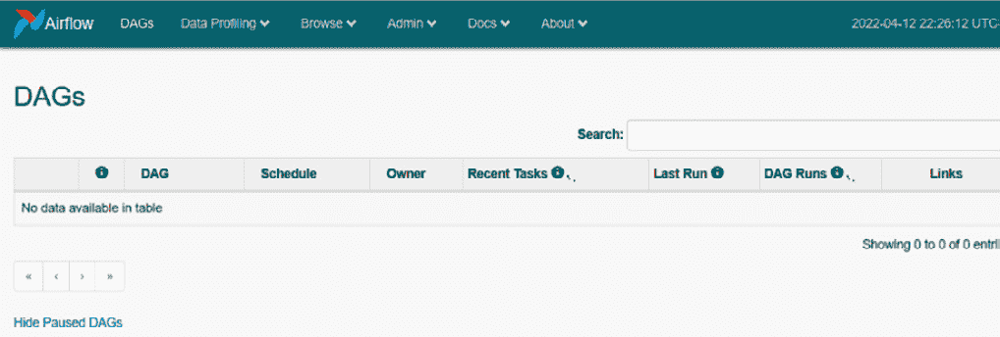

图 6.5 – Airflow UI

1.  为了测试一切是否运行正常，让我们快速创建一个简单的 DAG 并查看其工作方式。以下代码块创建了一个简单的 DAG，包含一个虚拟操作符和一个 Python 操作符：

    ```py
    from datetime import datetime
    from airflow import DAG
    from airflow.operators.dummy_operator import DummyOperator
    from airflow.operators.python_operator import PythonOperator
    def print_hello():
        return 'Hello world from first Airflow DAG!'
    dag = DAG('hello_world', 
              description='Hello World DAG',
              schedule_interval='@daily',
              start_date=datetime(2017, 3, 20), 
              catchup=False)
    start = DummyOperator(task_id="start", dag=dag)
    hello_operator = PythonOperator(
        task_id='hello_task', 
        python_callable=print_hello, 
        dag=dag)
    start >> hello_operator
    ```

1.  在前面的代码中定义的 DAG 相当简单；它有两个任务 – `start` 和 `hello_operator`。`start` 任务是一个 `DummyOperator`，什么都不做，用于使 DAG 在 UI 上看起来更美观。`hello_operator` 任务只是调用一个返回消息的函数。在最后一行，我们定义了操作符之间的依赖关系。

1.  复制前面的代码块，将其保存为`example_dag.py`，并将其上传到我们之前创建的 S3 中的`dags`文件夹。（我的 S3 位置是`s3://airflow-for-ml-mar-2022/dags`。）上传后，它应该在几秒钟内出现在 Airflow UI 中。以下图显示了带有 DAG 的 Airflow UI：

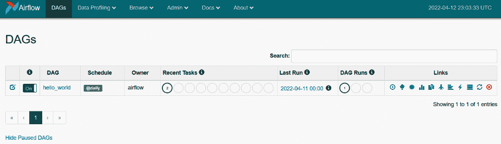

图 6.6 – 带示例 DAG 的 Airflow UI

1.  默认情况下，DAG 是禁用的；因此，当你访问页面时，你可能看不到像*图 6.6*中显示的确切页面。通过点击最左侧列中的切换按钮启用 DAG。一旦启用，DAG 将首次运行并更新运行结果。你还可以使用**链接**列中的图标触发 DAG。在 UI 的 DAG 列中点击**hello_world**超链接。你将看到 DAG 的不同选项卡详情页面。请随意尝试并查看详情页面上的不同选项。

1.  以下图显示了 DAG 的图形视图：

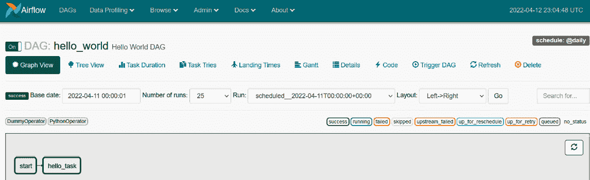

图 6.7 – DAG 的图形视图

1.  现在我们已经验证了 Airflow 设置正确，让我们为 Airflow 运行 ML 管道添加所需的权限。

1.  如果你还记得，在环境创建的最后一步（*图 6.4*之后的段落），我们记录了 Airflow 环境运行 DAG 时使用的角色名称。现在，我们需要向该角色添加权限。为此，使用搜索功能导航到 AWS IAM 角色控制台页面或访问 https://us-east-1.console.aws.amazon.com/iamv2/home?region=us-east-1#/roles。在控制台中，你应该看到与 Airflow 环境关联的 IAM 角色。选择 IAM 角色；你应该会看到以下页面：

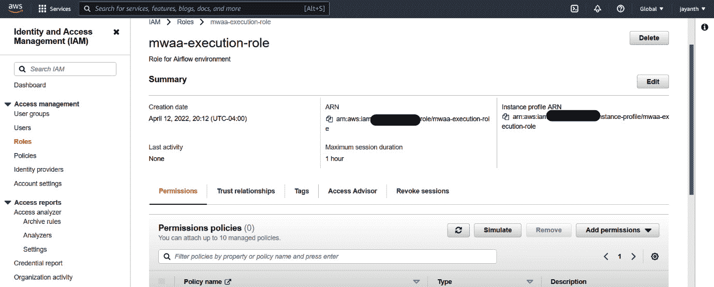

图 6.8 – 亚马逊 MWAA IAM 角色

重要提示

如果你没有做笔记，你可以在 AWS 控制台的“环境详情”页面上找到角色名称。

1.  在*图 6.8*中，点击**添加权限**；从下拉菜单中选择**添加策略**，你将被带到以下页面：

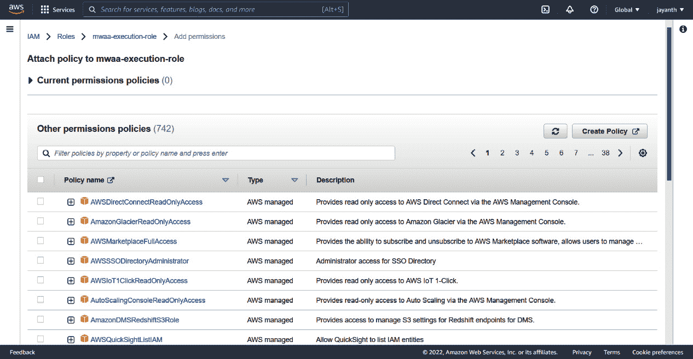

图 6.9 – IAM – 添加策略

1.  在网页上，搜索并选择以下策略 – **AmazonS3FullAccess**、**AWSGlueConsoleFullAccess**、**AmazonRedshiftFullAccess**和**AmazonDynamoDBFullAccess**。一旦选择了策略，向下滚动并点击**添加策略**以保存带有新策略的角色。

    重要提示

    没有任何限制地分配任何资源的完全访问权限从来都不是一个好主意。当你运行企业应用时，建议根据资源限制访问，例如只读访问特定的 S3 桶和 DynamoDB 表。

    如果你是在本地运行 Airflow，你可以在笔记本中使用 IAM 用户凭证。

现在我们已经准备好了编排系统，让我们看看如何使用它来将机器学习流水线投入生产。

# 批量模型流水线的投入生产

在*第四章*，“将特征存储添加到机器学习模型”中，为了模型训练，我们使用了特征工程笔记本中摄取的特征。我们还创建了一个模型评分笔记本，它从 Feast 中获取一组客户的特征，并使用训练好的模型对其进行预测。为了实验的目的，让我们假设原始数据的新鲜度延迟为一天。这意味着特征需要每天重新生成一次，模型需要每天对客户进行评分，并将结果存储在 S3 桶中以供消费。为了实现这一点，多亏了我们早期的组织和阶段解耦，我们只需要每天连续运行特征工程和模型评分笔记本/Python 脚本。现在我们也有了一个执行这个任务的工具，让我们继续在 Airflow 环境中安排这个工作流程。

下图显示了我们将如何运营化批量模型：

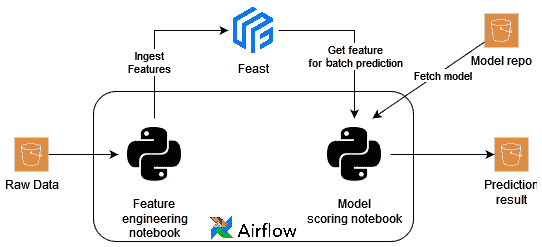

图 6.10 – 批量模型的运营化

正如你在图中所见，为了使工作流程投入运行，我们将使用 Airflow 来编排特征工程和模型评分笔记本。在我们的案例中，特征工程的原始数据源是存储 `online-retail.csv` 的 S3 存储桶。由于我们已设计好评分笔记本从模型仓库（在我们的案例中是一个 S3 存储桶）加载生产模型并将预测结果存储在 S3 存储桶中，我们将重用相同的笔记本。你可能在这里注意到的一点是我们不是每次运行都使用模型训练笔记本；原因很明显 – 我们希望针对经过验证、测试并且也在测试数据上满足我们性能标准的模型版本进行预测。

在安排此工作流程之前，我对特征工程笔记本和模型预测笔记本进行了少量修改。最终的笔记本可以在以下 GitHub URL 中找到：[`github.com/PacktPublishing/Feature-Store-for-Machine-Learning/blob/main/Chapter06/notebooks/(ch6_feature_engineering.ipynb,ch6_model_prediction.ipynb)`](https://github.com/PacktPublishing/Feature-Store-for-Machine-Learning/blob/main/Chapter06/notebooks/(ch6_feature_engineering.ipynb,ch6_model_prediction.ipynb))。要安排工作流程，请从 GitHub 下载最终的笔记本并将它们上传到我们之前创建的 S3 存储桶，因为 Airflow 环境在运行期间需要访问这些笔记本。我将将其上传到以下位置：`s3://airflow-for-ml-mar-2022/notebooks/`。

重要提示

AWS 密钥访问密钥和 S3 路径 – 我在两个笔记本中都注释掉了 AWS 凭据，因为我们正在向 Amazon MWAA IAM 角色添加权限。如果你在本地 Airflow 中运行它，请取消注释并添加密钥。同时，在必要时更新 S3 URL，因为 S3 URL 指向我在练习期间创建的私有存储桶。

功能仓库 – 如我们之前所见，我们必须克隆功能仓库，以便 Feast 库可以读取元数据。你可以遵循相同的 `git clone` 方法（前提是已安装 `git`）或者设置 GitHub 工作流程将仓库推送到 S3 并在笔记本中下载相同的文件。我已经在笔记本中留下了两个代码块并附有注释。你可以使用任何方便的方法。

S3 方法 – 要使用 S3 下载方法，在你的本地系统中克隆仓库，然后在 Linux 终端中运行以下命令将其上传到特定的 S3 位置：

**export AWS_ACCESS_KEY_ID=<aws_key>**

**export AWS_SECRET_ACCESS_KEY=<aws_secret>**

**AWS_DEFAULT_REGION=us-east-1**

**aws s3 cp customer_segmentation s3://<s3_bucket>/customer_segmentation --recursive**

上传成功后，你应该能够在 S3 存储桶中看到文件夹内容。

现在笔记本已经准备好了，让我们编写批量模型管道的 Airflow DAG。DAG 将按以下顺序包含以下任务 – `start`（虚拟操作符）、`feature_engineering`（Papermill 操作符）、`model_prediction`（Papermill 操作符）和 `end`（虚拟操作符）。

以下代码块包含 Airflow DAG 的第一部分：

```py
from datetime import datetime
```

```py
from airflow import DAG
```

```py
from airflow.operators.dummy_operator import DummyOperator
```

```py
from airflow.providers.papermill.operators.papermill import PapermillOperator
```

```py
import uuid
```

```py
dag = DAG('customer_segmentation_batch_model', 
```

```py
          description='Batch model pipeline', 
```

```py
          schedule_interval='@daily', 
```

```py
          start_date=datetime(2017, 3, 20), catchup=False)
```

在前面的代码块中，我们定义了导入和 DAG 参数，如 `name`、`schedule_interval` 和 `start_date`。`schedule_interval='@daily'` 调度表示 DAG 应该每天运行。

以下代码块定义了 DAG 的其余部分（第二部分），其中包含所有任务及其之间的依赖关系：

```py
start = DummyOperator(task_id="start", dag=dag)
```

```py
run_id = str(uuid.uuid1())
```

```py
feature_eng = PapermillOperator(
```

```py
    task_id="feature_engineering",
```

```py
    input_nb="s3://airflow-for-ml-mar-2022/notebooks/ch6_feature_engineering.ipynb",
```

```py
    output_nb=f"s3://airflow-for-ml-mar-2022/notebooks/runs/ch6_feature_engineering_{ run_id }.ipynb",
```

```py
    dag=dag,
```

```py
    trigger_rule="all_success"
```

```py
)
```

```py
model_prediction = PapermillOperator(
```

```py
    task_id="model_prediction",
```

```py
    input_nb="s3://airflow-for-ml-mar-2022/notebooks/ch6_model_prediction.ipynb",
```

```py
    output_nb=f"s3://airflow-for-ml-mar-2022/notebooks/runs/ch6_model_prediction_{run_id}.ipynb",
```

```py
    dag=dag,
```

```py
    trigger_rule="all_success"
```

```py
)
```

```py
end = DummyOperator(task_id="end", dag=dag, 
```

```py
                    trigger_rule="all_success")
```

```py
start >> feature_eng >> model_prediction >> end
```

如您在代码块中看到的，这里有四个步骤将依次执行。`feature_engineering` 和 `model_prediction` 步骤使用 `PapermillOperator` 运行。这需要输入 S3 笔记本路径。我还设置了一个输出路径到另一个 S3 位置，这样我们就可以检查每次运行的输出笔记本。最后一行定义了任务之间的依赖关系。将前两个代码块（第一部分和第二部分）保存为 Python 文件，并将其命名为 `batch-model-pipeline-dag.py`。保存文件后，导航到 S3 控制台，将文件上传到我们在 *图 6.3* 中指向的 Airflow 环境的 `dags` 文件夹。上传的文件将由 Airflow 调度器处理。当您导航到 Airflow UI 时，您应该在屏幕上看到名为 **customer_segmentation_batch_model** 的新 DAG。

以下图显示了包含 DAG 的 Airflow UI：

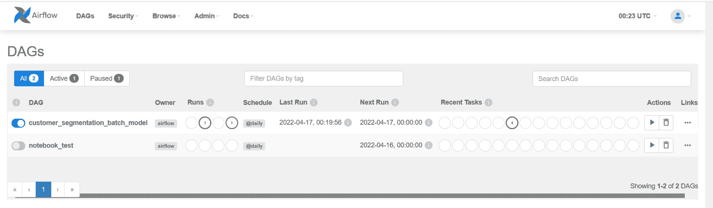

图 6.11 – Airflow 上的批量模型 DAG

由于我们在创建 Airflow 环境时没有默认启用 DAG 选项（这可以在 Amazon MWAA 中的 Airflow 配置变量中设置），当 DAG 首次出现在 UI 上时，它将处于禁用状态。点击最左侧列的切换按钮来启用它。一旦启用，DAG 将首次运行。点击 **customer_segmentation_batch_model** 超链接导航到详情页面，并随意查看 DAG 的不同可视化和属性。如果您导航到 **Graph** 选项卡，DAG 将如以下截图所示显示：

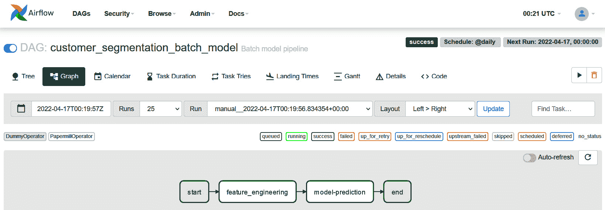

图 6.12 – 批量模型 DAG 图形视图

在 *图 6.12* 中，您可以查看 DAG 的图形视图。如果上次运行有任何失败，它们将以红色轮廓显示。您还可以查看每个任务的执行日志或失败记录。由于所有任务都是绿色的，这意味着一切顺利。您还可以在 *图 6.11* 中查看最近几次运行的成果。Airflow 还为您提供所有运行的记录。

现在任务运行已完成，我们可以去检查输出笔记本、新特征集的 S3 桶或新预测集的 S3 桶。所有这三个在成功运行后都应可用。在这里，我们将验证预测结果文件夹，但也请随意验证其他文件夹。

重要提示

如果有任何失败，请验证失败任务的日志（在图形视图中点击失败任务以查看可用信息）。检查 Amazon MWAA 的权限、输入/输出的 S3 路径，以及是否在 Amazon MWAA 环境中安装了所有要求。

下面的截图显示了 S3 桶中的新预测结果：

![Figure 6.13 – The prediction results in an S3 bucket]

![img/B18024_06_013.jpg]

图 6.13 – S3 桶中的预测结果

此外，您还可以使用 Airflow 做各种花哨的事情，例如发送失败时的电子邮件通知、日常运行的 Slack 通知，以及与 PagerDuty 的集成。请随意探索选项。以下是 Airflow 支持的服务提供者列表：[`airflow.apache.org/docs/apache-airflow-providers/packages-ref.html`](https://airflow.apache.org/docs/apache-airflow-providers/packages-ref.html)。

现在我们批处理模型已在生产环境中运行，让我们看看如何使用 Feast 将在线模型进行生产化。

# 生产化在线模型管道

在上一章中，对于在线模型，我们构建了 REST 端点以提供客户细分的需求预测。尽管在线模型以 REST 端点托管，但它需要以下功能的支持基础设施：

+   为了实时提供特征（我们为此有 Feast）

+   为了保持特征更新（我们将使用带有 Airflow 编排的特征工程笔记本来完成此操作）

在本章中，我们将继续上一章的内容，并使用在*第四章*“将特征存储添加到机器学习模型”中构建的特征工程笔记本，结合一个笔记本将离线数据同步到 Feast 的在线存储。

下图展示了在线模型管道的运营化：

![Figure 6.14 – The operationalization of the online model]

![img/B18024_06_014.jpg]

图 6.14 – 在线模型的运营化

如[*图 6.14*]所示，我们将使用 Airflow 进行特征工程的编排；数据新鲜度仍然是每天一次，并且可以安排更短的时间。如果需要，Feast 还可以支持流数据。以下 URL 有一个可用的示例：[`docs.Feast.dev/reference/data-sources/push`](https://docs.Feast.dev/reference/data-sources/push)。在*第五章*“模型训练和推理”中开发的 REST 端点将被 Docker 化并作为 SageMaker 端点部署。

重要提示

一旦容器化，Docker 镜像就可以用于部署到任何容器化环境中，例如 Elastic Container Service，Elastic BeanStalk 和 Kubernetes。我们使用 SageMaker，因为它设置起来更快，并且还具有开箱即用的优势，如数据捕获和 IAM 认证。

## 特征工程作业的编排

由于我们已经有两个笔记本（特征工程和同步离线到在线存储）并且我们对 Airflow 很熟悉，让我们首先安排特征工程工作流程。同样，在笔记本中，我进行了一些小的修改。请在使用之前验证这些修改。您可以在以下位置找到笔记本（`ch6_feature_engineering.ipynb` 和 `ch6_sync_offline_online.ipynb`）：https://github.com/PacktPublishing/Feature-Store-for-Machin`github.com/PacktPublishing/Feature-Store-for-Machine-Learning/tree/main/Chapter06/notebooks)e-Learning/tree/main/Chapter06/notebooks。就像我们对批量模型所做的那样，下载笔记本并将它们上传到特定的 S3 位置。我将会上传到之前相同的位置：`s3://airflow-for-ml-mar-2022/notebooks/`。现在笔记本已经准备好了，让我们编写在线模型管道的 Airflow DAG。DAG 将按照以下顺序执行步骤 – `start`（虚拟操作符）, `feature_engineering`（Papermill 操作符）, `sync_offline_to_online`（Papermill 操作符）, 和 `end`（虚拟操作符）。

下面的代码块包含 Airflow DAG 的第一部分：

```py
from datetime import datetime
```

```py
from airflow import DAG
```

```py
from airflow.operators.dummy_operator import DummyOperator
```

```py
from airflow.providers.papermill.operators.papermill import PapermillOperator
```

```py
dag = DAG('customer_segmentation_online_model', 
```

```py
          description='Online model pipeline', 
```

```py
          schedule_interval='@daily', 
```

```py
          start_date=datetime(2017, 3, 20), catchup=False)
```

就像批量模型管道 DAG 的情况一样，这包含 DAG 参数。

下面的代码块定义了 DAG 的其余部分（第二部分），其中包含所有任务及其之间的依赖关系：

```py
start = DummyOperator(task_id="start")
```

```py
run_time = datetime.now()
```

```py
feature_eng = PapermillOperator(
```

```py
    task_id="feature_engineering",
```

```py
    input_nb="s3://airflow-for-ml-mar-2022/notebooks/ch6_feature_engineering.ipynb",
```

```py
    output_nb=f"s3://airflow-for-ml-mar-2022/notebooks/runs/ch6_feature_engineering_{run_time}.ipynb",
```

```py
    trigger_rule="all_success",
```

```py
    dag=dag
```

```py
)
```

```py
sync_offline_to_online = PapermillOperator(
```

```py
    task_id="sync_offline_to_online",
```

```py
    input_nb="s3://airflow-for-ml-mar-2022/notebooks/ch6_sync_offline_online.ipynb",
```

```py
    output_nb=f"s3://airflow-for-ml-mar-2022/notebooks/runs/ch6_sync_offline_online_{run_time}.ipynb",
```

```py
    trigger_rule="all_success",
```

```py
    dag=dag
```

```py
)
```

```py
end = DummyOperator(task_id="end", trigger_rule="all_success")
```

```py
start >> feature_eng >> sync_offline_to_online >> end
```

Airflow DAG 的结构与我们之前看到的批量模型 DAG 类似；唯一的区别是第三个任务，`sync_offline_to_online`。这个笔记本将离线数据中的最新特征同步到在线数据中。将前两个代码块（第一部分和第二部分）保存为 Python 文件，并将其命名为 `online-model-pipeline-dag.py`。保存文件后，导航到 S3 控制台，将文件上传到我们在 *图 6.3* 中指向的 Airflow 环境的 `dags` 文件夹。与批量模型一样，上传的文件将由 Airflow 调度器处理，当你导航到 Airflow UI 时，你应该在屏幕上看到名为 **customer_segmentation_online_model** 的新 DAG。

下面的截图显示了带有 DAG 的 Airflow UI：

![图 6.15 – 带有在线和批量模型的 Airflow UI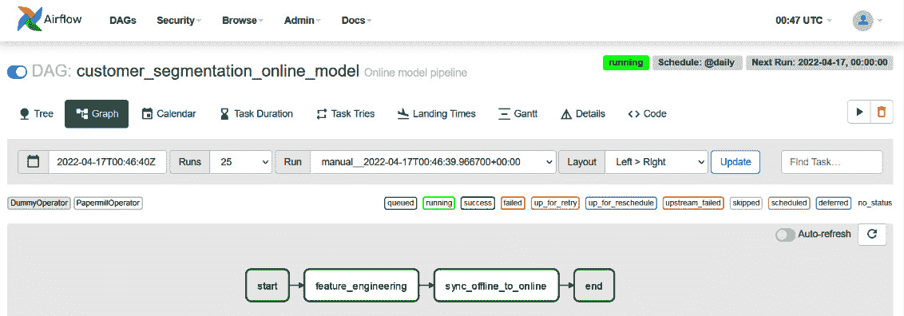

Figure 6.16 – 在线模型管道图形视图

如您在*图 6.16*中看到的，在成功运行的情况下，图形将显示为绿色。正如在批量模型管道执行期间所讨论的，您可以验证输出笔记本、DynamoDB 表或 S3 存储桶，以确保一切正常工作，并在出现故障的情况下检查日志。

现在在线模型管道的第一部分已经准备好了，让我们将上一章中开发的 REST 端点 Docker 化，并将它们作为 SageMaker 端点部署。

## 将模型部署为 SageMaker 端点

要将模型部署到 SageMaker，我们首先需要将我们在*第五章*“模型训练和推理”中构建的 REST API Docker 化。在我们这样做之前，让我们创建一个**弹性容器注册库**（**ECR**），在那里我们可以保存模型的 Docker 镜像，并在 SageMaker 端点配置中使用它。

### Docker 镜像的 ECR

要创建 ECR 资源，从搜索栏导航到 ECR 控制台或使用以下 URL：[`us-east-1.console.aws.amazon.com/ecr/repositories?region=us-east-1`](https://us-east-1.console.aws.amazon.com/ecr/repositories?region=us-east-1)。将显示以下页面：

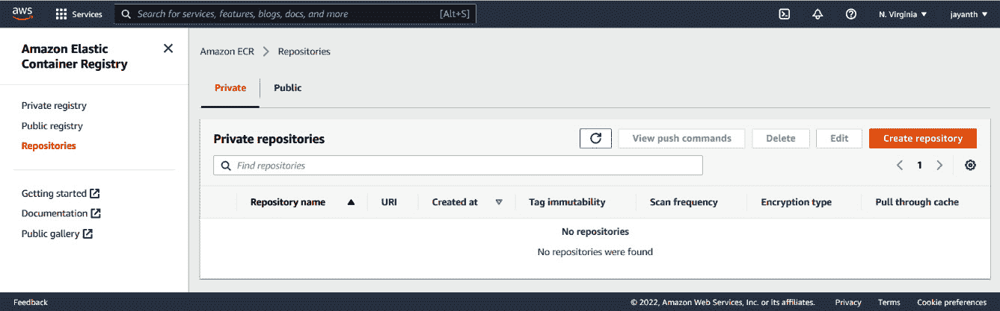

Figure 6.17 – ECR 主页

在*图 6.17*显示的页面上，您可以选择**私有**或**公共**存储库选项卡。然后，点击**创建存储库**按钮：

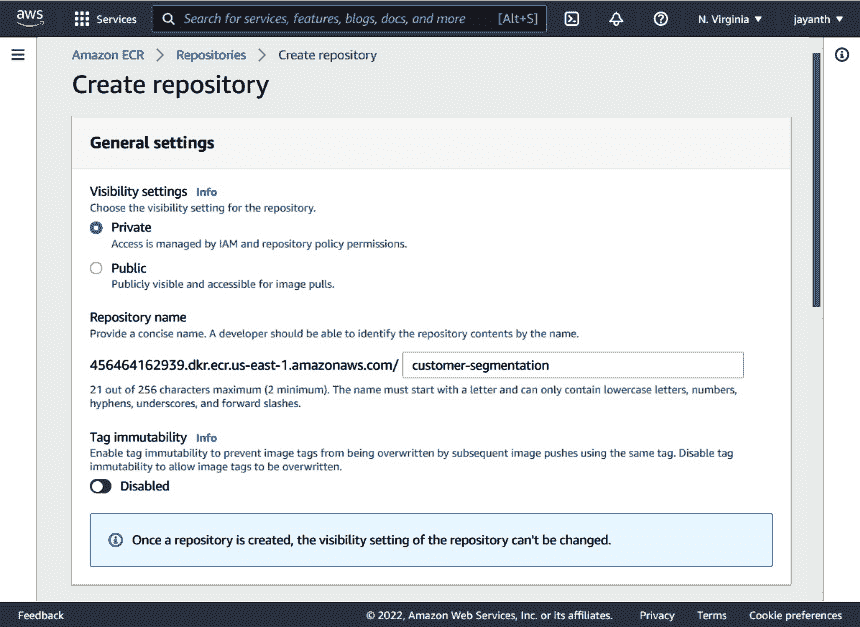

Figure 6.18 – ECR – 创建存储库

我在这里选择了**私有**；根据您选择的是**私有**还是**公共**，选项将会有所不同，但无论如何，操作都很简单。填写所需的字段，滚动到页面底部，然后点击**创建存储库**。一旦创建存储库，进入存储库详细信息页面，您应该会看到一个类似于*图 6.19*所示的页面。

重要提示

私有存储库通过 IAM 进行保护，而公共存储库则可以被互联网上的任何人访问。公共存储库主要用于与组织外的人共享/开源您的工作：

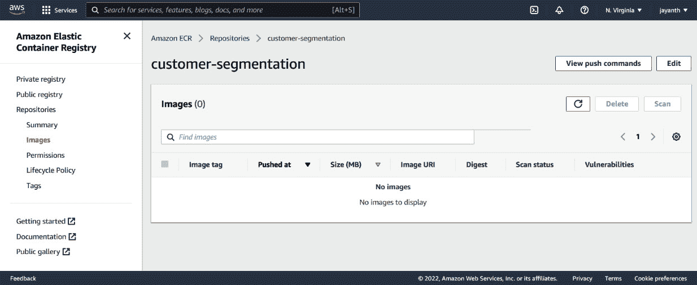

Figure 6.19 – ECR 存储库详细信息

在前面的页面上，点击**查看推送命令**，您应该会看到一个类似于*图 6.20*所示的弹出窗口：

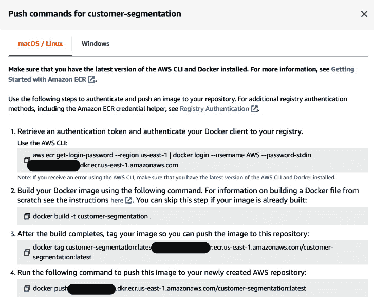

图 6.20 – ECR 推送命令

根据你用于构建 Docker 镜像的操作系统，保存必要的命令。我们将使用这些命令来构建 Docker 镜像。

### 构建 Docker 镜像

如前所述，在本节中我们将使用上一章中构建的 REST 端点。如果你记得正确，我们添加了两个 REST 端点，`ping` 和 `invocations`。这些端点并非随机，尽管它们可以在任何容器环境中托管。要在 SageMaker 端点中托管 Docker 镜像，要求它应该有 `ping`（这是 `GET` 方法）和 `invocations`（这是 `POST` 方法）路由。我已经在相同的文件夹结构中添加了一些文件，这些文件将有助于构建 Docker 镜像。REST 代码和文件夹结构可在以下 URL 获取：[`github.com/PacktPublishing/Feature-Store-for-Machine-Learning/tree/main/online-model-rest-api`](https://github.com/PacktPublishing/Feature-Store-for-Machine-Learning/tree/main/online-model-rest-api)。

重要提示

额外的文件是 `Dockerfile`、`requirements.txt` 和 `serve`。

连续地，将 REST 代码克隆到本地系统，将特征仓库复制到项目的 `root` 目录，导出凭据，然后运行 *图 6.20* 中的命令。

重要提示

你可以使用在 *第四章* 中创建的相同用户凭据，*将特征存储添加到机器学习模型*。然而，我们遗漏了向用户添加 ECR 权限。请导航到 IAM 控制台，并将 **AmazonEC2ContainerRegistryFullAccess** 添加到用户。否则，你将遇到访问错误。

以下是一些示例命令：

```py
cd online-model-rest-api/
export AWS_ACCESS_KEY_ID=<AWS_KEY>
export AWS_SECRET_ACCESS_KEY=<AWS_SECRET>
export AWS_DEFAULT_REGION=us-east-1
aws ecr get-login-password --region us-east-1 | docker login --username AWS --password-stdin <account_number>.dkr.ecr.us-east-1.amazonaws.com
docker build -t customer-segmentation .
docker tag customer-segmentation:latest <account_number>.dkr.ecr.us-east-1.amazonaws.com/customer-segmentation:latest
docker push <account_number>.dkr.ecr.us-east-1.amazonaws.com/customer-segmentation:latest
```

使用环境变量中设置的凭据登录到 ECR，构建 Docker 镜像，并将 Docker 镜像标记和推送到注册表。一旦镜像被推送，如果你导航回 *图 6.19* 中的屏幕，你应该会看到新的镜像，如下面的截图所示：

![图 6.21 – 推送到 ECR 的镜像

![img/B18024_06_021.jpg]

图 6.21 – 推送到 ECR 的镜像

现在，镜像已经准备好了，通过点击 *图 6.21* 中 **复制 URI** 旁边的图标来复制镜像的 **统一资源标识符 (URI**)。接下来，让我们将 Docker 镜像作为 SageMaker 端点进行部署。

### 创建 SageMaker 端点

Amazon SageMaker 致力于为机器学习提供托管基础设施。在本节中，我们只将使用 SageMaker 推理组件。SageMaker 端点用于将模型作为 REST 端点进行实时预测。它支持 Docker 镜像模型，并且开箱即支持一些变体。我们将使用上一节中推送到 ECR 的 Docker 镜像。SageMaker 端点是使用三个构建块构建的 - 模型、端点配置和端点。让我们使用这些构建块并创建一个端点。

#### SageMaker 模型

模型用于定义模型参数，如名称、模型的存储位置和 IAM 角色。要定义模型，使用搜索栏导航到 SageMaker 控制台，并在**推理**部分查找`模型`。或者，访问[`us-east-1.console.aws.amazon.com/sagemaker/home?region=us-east-1#/models`](https://us-east-1.console.aws.amazon.com/sagemaker/home?region=us-east-1#/models)。以下屏幕将显示：

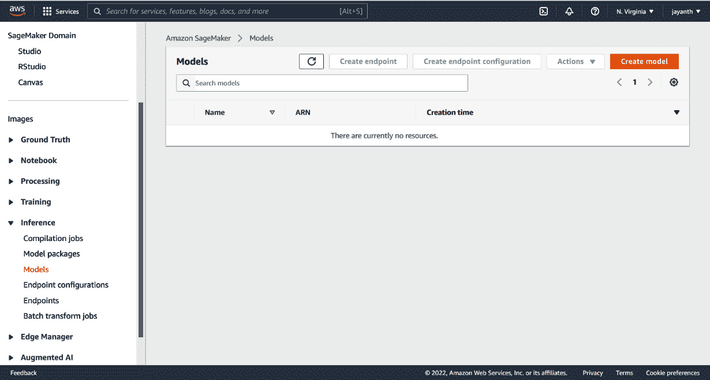

图 6.22 – SageMaker 模型控制台

在显示的页面上，点击**创建模型**以跳转到下一屏幕。以下页面将显示：

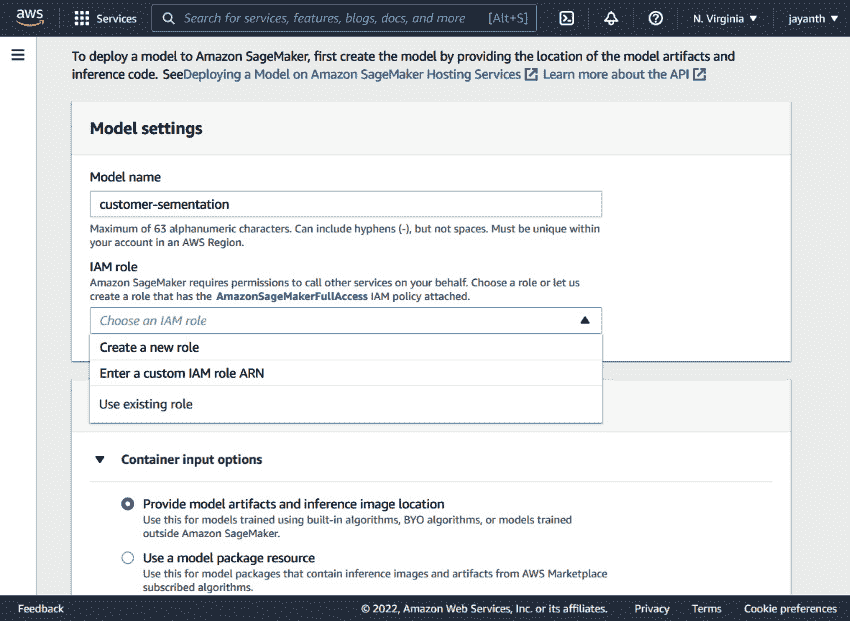

图 6.23 – SageMaker – 创建模型

如*图 6.23*所示，输入模型名称，对于 IAM 角色，从下拉菜单中选择**创建新角色**。将出现一个新的弹出窗口，如下面的屏幕截图所示：


图 6.24 – SageMaker 模型 – 创建 IAM 角色

在弹出窗口中，为了本次练习的目的，保留所有默认设置，然后点击**创建角色**。AWS 将创建一个 IAM 角色，在同一屏幕上，你应该在对话框中看到一个带有 IAM 角色链接的消息。以下图显示了显示的消息：

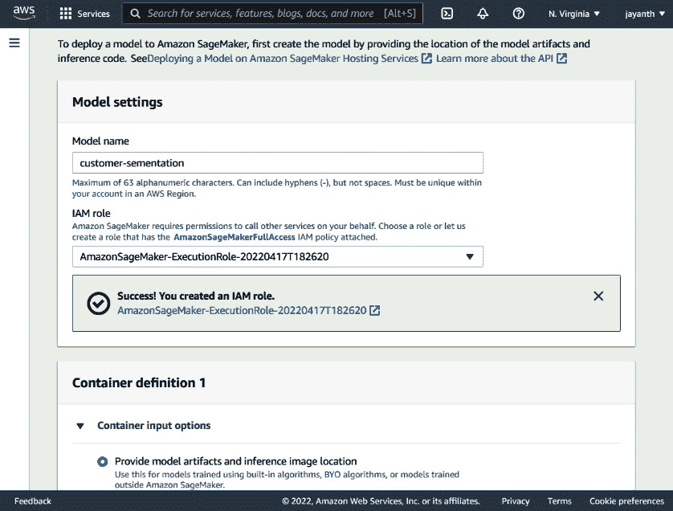

图 6.25 – SageMaker 模型 – 新的执行角色已创建

现在，如果你记得正确的话，我们正在使用 DynamoDB 作为在线存储；因为我们是从 DynamoDB 表中按需读取数据，所以 IAM 角色需要访问它们。因此，使用页面显示的链接在新标签页中导航到我们刚刚创建的 IAM 角色，添加**AmazonDynamoDBFullAccess**，然后返回此标签页。向下滚动到**容器定义 1**部分，你应该会看到以下参数：

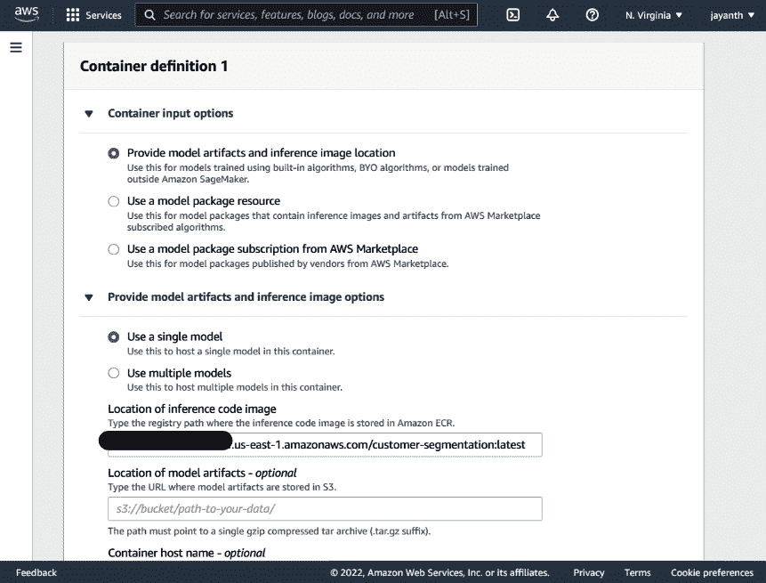

图 6.26 – SageMaker 模型 – 容器定义 1 部分

对于**推理代码图像位置**参数，粘贴从*图 6.21*中复制的图像 URI，然后保留其他设置不变，再次滚动到**网络**部分：

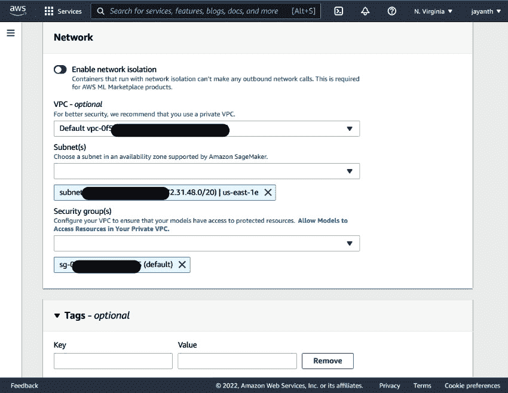

图 6.27 – Sagemaker 模型 – 网络部分

在这里，选择**VPC**为**默认 vpc**，从列表中选择一个或两个子网，并选择默认的安全组。向下滚动到页面底部，然后点击**创建模型**。

重要提示

在生产部署中，选择默认安全组从来不是一个好主意，因为入站规则不是限制性的。

现在模型已经准备好了，接下来让我们创建端点配置。

#### 端点配置

要设置端点配置，请使用搜索栏导航到 SageMaker 控制台，并在 **推理** 部分查找 `Endpoint Configurations`。或者，访问 [`us-east-1.console.aws.amazon.com/sagemaker/home?region=us-east-1#/endpointConfig`](https://us-east-1.console.aws.amazon.com/sagemaker/home?region=us-east-1#/endpointConfig)。将显示以下页面：

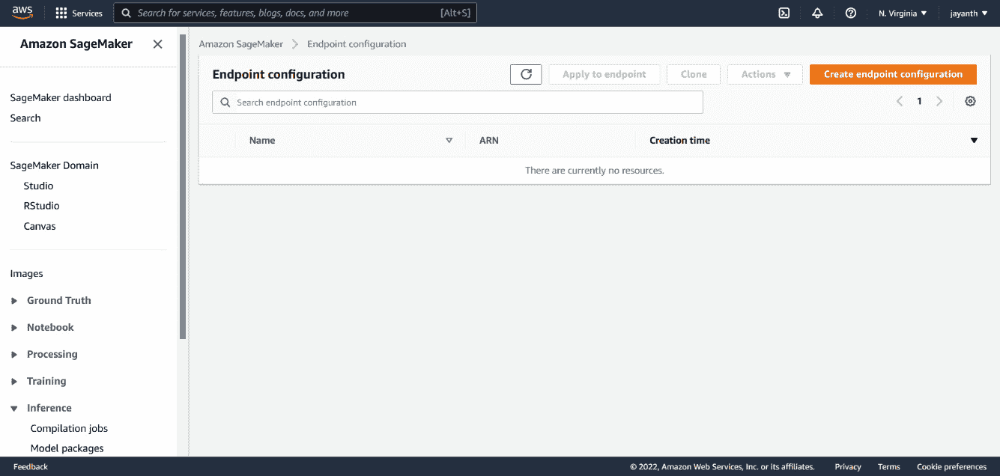

图 6.28 – Sagemaker 端点配置控制台

在显示的网页上，点击 **创建端点配置**。您将被导航到以下页面：

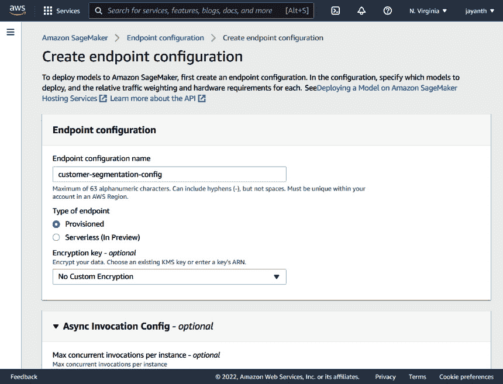

图 6.29 – SageMaker – 创建端点配置

在此屏幕上，填写 `customer-segmentation-config`。滚动到 **数据捕获** 部分。这用于定义需要捕获多少百分比的实时推理数据，在哪里（S3 位置），以及如何存储（JSON 或 CSV）。您可以选择启用或禁用此功能。我在这个练习中将其禁用了。如果您启用它，它将要求您提供更多信息。**数据捕获** 之后的部分是 **生产变体**。这用于设置多个模型变体，以及模型的 A/B 测试。目前，因为我们只有一个变体，所以让我们在这里添加它。要添加一个变体，请在该部分点击 **添加模型** 链接；以下弹出窗口将出现：

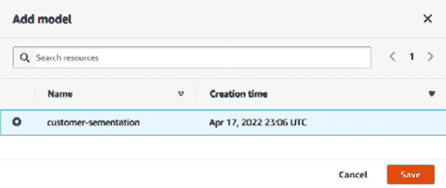

图 6.30 – SageMaker – 将模型添加到端点配置

在弹出窗口中，选择我们之前创建的模型，滚动到页面底部，然后点击 **创建端点配置**。

#### SageMaker 端点创建

最后一步是使用端点配置创建端点。要创建 SageMaker 端点，请使用搜索栏导航到 SageMaker 控制台，并在 **推理** 部分查找 `Endpoints`。或者，访问 https://us-east-1.console.aws.amazon.com/sagemaker/home?region=us-east-1#/endpoints。将显示以下页面：

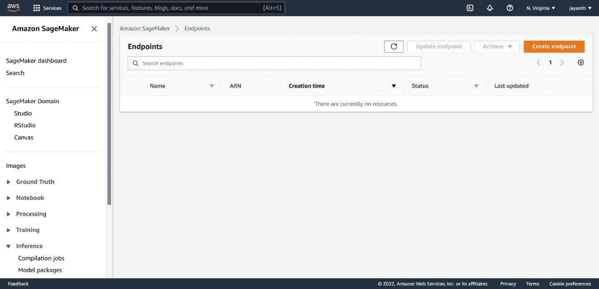

图 6.31 – SageMaker 端点控制台

在 *图 6.31* 所示的页面上，点击 **创建端点** 以导航到以下页面：

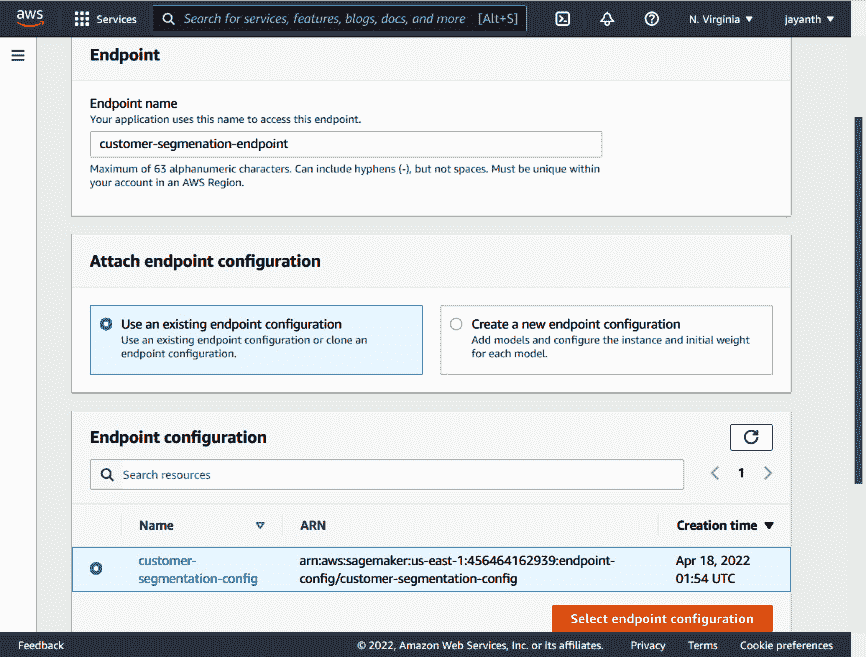

图 6.31 – SageMaker – 创建端点

在*图 6.31*显示的网页上，提供一个端点名称。我已给出名称`customer-segmentation-endpoint`。向下滚动到**端点配置**部分，选择我们之前创建的端点配置，然后点击**选择端点配置**按钮。一旦选择，点击**创建端点**。创建端点需要几分钟。当端点状态变为**可用**时，您的模型即可用于实时流量服务。

#### 测试 SageMaker 端点

我们接下来需要了解的是如何消费模型。有不同方式——您可以使用 SageMaker 库、Amazon SDK 客户端（Python、TypeScript 或其他可用的语言），或 SageMaker 端点 URL。所有这些方法默认使用 AWS IAM 身份验证。如果您有特殊要求并希望在不进行身份验证或使用自定义身份验证的情况下公开模型，可以使用 API 网关和 Lambda 授权器来实现。为了本练习的目的，我们将使用`boto3`客户端来调用 API。无论我们如何调用端点，结果都应该是相同的。

以下代码块使用`boto3`客户端调用端点：

```py
import json
```

```py
import boto3
```

```py
import os
```

```py
os.environ["AWS_ACCESS_KEY_ID"] = "<aws_key>"
```

```py
os.environ["AWS_SECRET_ACCESS_KEY"] = "<aws_secret>"
```

```py
os.environ["AWS_DEFAULT_REGION"] = "us-east-1"
```

```py
payload = json.dumps({"customer_list":["12747.0", "12841.0"]})
```

```py
runtime = boto3.client("runtime.sagemaker")
```

```py
response = runtime.invoke_endpoint(
```

```py
    EndpointName= "customer-segmentation-endpoint", 
```

```py
    ContentType="application/json", Body=payload
```

```py
)
```

```py
response = response["Body"].read()
```

```py
result = json.loads(response.decode("utf-8"))
```

```py
print(results)
```

在前面的代码块中，我们正在调用我们创建的端点，为具有`12747.0`和`12841.0` ID 的两个客户运行预测。端点将在毫秒内对给定的客户 ID 做出预测。现在，端点可以与模型消费者共享。

现在模型已投入生产，让我们看看模型转移到生产后的一些后续方面。

# 超越模型生产

在本节中，我们将讨论机器学习的生产后方面以及我们如何从采用特征存储中受益。

## 特征漂移监控和模型重新训练

模型投入生产后，接下来经常出现的问题是模型在生产中的表现如何。可能使用不同的指标来衡量模型的表现——例如，对于推荐模型，表现可能通过转化率来衡量，即推荐的产品被购买频率。同样，预测客户的下一步行动可能通过错误率来衡量，等等。没有通用的方法来做这件事。但如果模型的表现不佳，则需要重新训练或用新的模型替换。

定义何时应该重新训练模型的其他方面之一是当特征开始偏离其训练时的值。例如，假设在初始模型训练期间客户的平均频率值为 10，但现在平均频率值为 25。同样，最低货币值最初为 100.00 美元，现在为 500.00 美元。这被称为**数据漂移**。

数据漂移监控衡量的是数据统计分布的变化；在特征监控的情况下，它是比较从时间`t1`到时间`t2`的特征统计分布的变化。以下 URL 的文章讨论了数据漂移监控的不同指标：[`towardsdatascience.com/automating-data-drift-thresholding-in-machine-learning-systems-524e6259f59f`](https://towardsdatascience.com/automating-data-drift-thresholding-in-machine-learning-systems-524e6259f59f)。

使用特征存储，可以轻松地从两个不同时间点检索训练数据集，即用于模型训练的数据集和用于模型训练的所有特征的最新特征值。现在，我们只需要按计划运行数据漂移监控来生成漂移报告。Feast 带来的标准化是，由于数据是使用标准 API 存储和检索的，因此可以在特征存储中的所有数据集上按计划运行通用的特征漂移监控。特征漂移报告可以用作模型重新训练的指标之一。如果特征漂移影响了模型的性能，可以使用最新的数据集重新训练，并与当前的生产模型部署和 A/B 测试。

## 模型可复现性和预测问题

如果您还记得第一章中的概述，即“机器学习生命周期概述”，模型可复现性是机器学习的一个常见问题。我们需要一种方法来一致地复现模型（或用于模型的训练数据）。如果没有特征存储，如果用于生成特征的底层原始数据发生变化，就无法复现相同的训练数据集。然而，使用特征存储，正如我们之前讨论的，特征与时间戳版本化（特征 DataFrame 中的一列是事件时间戳）。因此，我们可以查询历史数据来生成用于模型训练的相同特征集。如果用于训练模型的算法不是随机的，模型也可以复现。让我们试试看。

由于我们已经在第五章的“使用特征存储进行模型训练”部分中做了类似的事情，即“模型训练和推理”，我们将重用相同的代码来运行这个实验。复制并运行所有代码，直到你创建实体 DataFrame，然后将`event_timestamp`列替换为较旧的时间戳（模型训练的时间戳），如下所示。在这种情况下，模型是在`2022-03-26 16:24:21`训练的，如第五章的“模型训练和推理”中的*图 5.1*所示：

```py
## replace timestamp to older time stamp.
```

```py
entity_df["event_timestamp"] = pd.to_datetime("2022-03-26 16:24:21")
```

一旦替换完时间戳，请继续从*第五章*的“Dee 的模型训练实验”部分运行代码，*模型训练和推理*。你应该能够生成与 Dee 模型训练中使用的相同的数据集（在这种情况下，*第五章*](B18024_05_ePub.xhtml#_idTextAnchor078)中的*图 5.2*所示的数据集）。因此，如果模型使用非随机算法，则也可以使用特征集重现模型。

特征存储的另一个优点是调试预测问题。让我们考虑一个场景，你有一个面向网站的模型，该模型正在将交易分类为欺诈或非欺诈。在高峰时段，它将几笔交易标记为欺诈，但这些交易实际上是合法的。客户打电话给客服部门投诉，现在轮到数据科学家 Subbu 来找出问题所在。如果项目中没有特征存储，为了重现问题，Subbu 必须进入原始数据，尝试生成特征，并查看行为是否仍然相同。如果不相同，Subbu 必须进入应用程序日志，进行处理，查找事件之前的行为，并从用户交互的角度尝试重现，同时捕获所有这些试验的特征，希望至少能重现一次问题。

另一方面，使用项目中使用的特征存储，Subbu 将找出事件发生的大概时间，模型中使用的实体和特征是什么，以及事件发生时生产中运行的模型版本。有了这些信息，Subbu 将连接到特征存储并获取在问题发生的大概时间范围内所有实体使用的所有特征。比如说，事件发生在今天中午 12:00 到 12:15 之间，特征是流式的，新鲜度间隔大约是 30 秒。这意味着，对于给定的实体，从任何给定时间开始，特征在接下来的 30 秒内可能会发生变化。

为了重现问题，Subbu 将创建一个实体 DataFrame，其中一个列中重复 30 次相同的实体 ID，对于事件时间列，从中午 12:00 到 12:15 的 30 秒间隔的时间戳。有了这个实体 DataFrame，Subbu 将使用 Feast API 查询历史存储并运行生成的特征的预测。如果问题重现，Subbu 就有导致问题的特征集。如果没有重现，使用实体 DataFrame，间隔将减少到小于 30 秒，可能到 10 秒，以确定特征是否比 30 秒更快地发生变化。Subbu 可以继续这样做，直到她找到重现问题的特征集。

## 为下一个模型赢得先机

现在，模型已经投入生产，数据科学家 Subbu 接手下一个问题陈述。假设下一个机器学习模型需要预测客户的**下一次购买日**（**NPD**）。这里的用例可能是基于 NPD，我们想要为客户运行一次营销活动。如果客户的购买日较远，我们想要提供特别优惠，以便我们可以鼓励他们尽早购买。现在，在查看原始数据集之前，Subbu 可以根据搜索和可发现性方面如何集成到特征存储中查找可用的特征。由于 Feast 从面向服务的架构迁移到 SDK/CLI 导向，需要目录工具、所有特征存储库的 GitHub 仓库、数据网格门户等。然而，在 SageMaker 或 Databricks 等特征存储的情况下，用户可以通过 API 或从 UI 浏览可用的特征定义来连接到特征存储端点（使用 SageMaker 运行时通过 boto3 或 Databricks 工作区）。我之前没有使用过 Tecton 特征存储，但 Tecton 也为其特征存储提供了一个 UI，可以用来浏览可用的特征。正如你所见，这是 Feast 在 0.9.X 和 0.20.X（0.20 是撰写时的版本）不同版本之间的一大缺点。

假设现在 Subbu 有办法定位所有特征存储库。现在，她可以连接并浏览它们，以找出在 NPD 模型中可能有用的项目和特征定义。到目前为止，我们只有一个包含我们迄今为止一直在使用的客户 RFM 特征的存储库，这些特征在模型中可能很有用。要使用这些特征，Subbu 只需要获取 AWS 资源的读取权限，最新的 RFM 特征将每天可用于实验，如果模型转移到生产环境也可以使用。

为了看到特征存储在后续模型开发中的好处，我们应该尝试构建 NPD。我将通过最初的几个步骤来帮助你开始模型。因为我们遵循了一个博客来开发第一个模型，我们将继续遵循同一博客系列中的另一部分，该部分可以在[`towardsdatascience.com/predicting-next-purchase-day-15fae5548027`](https://towardsdatascience.com/predicting-next-purchase-day-15fae5548027)找到。请阅读该博客，因为它讨论了方法以及作者为什么认为特定的特征将是有用的。在这里，我们将跳过特征工程部分。

我们将使用博客作者使用的功能集，包括以下内容：

+   RFM 特征和聚类

+   最后三次购买之间的天数

+   购买差异的平均值和标准差

第一个特征集已经存在于特征存储库中；我们不需要为此做任何额外的工作。但对于其他两个，我们需要从原始数据中进行特征工程。在[`github.com/PacktPublishing/Feature-Store-for-Machine-Learning/blob/main/Chapter06/notebooks/ch6_next_purchase_day_feature_engineering.ipynb`](https://github.com/PacktPublishing/Feature-Store-for-Machine-Learning/blob/main/Chapter06/notebooks/ch6_next_purchase_day_feature_engineering.ipynb)的笔记本中有生成前述第二和第三要点中所需特征的必要特征工程。我将把这些特征的导入到特征存储库以及使用前一个模型中的特征（RFM）结合这些特征来训练新模型作为一个练习。随着你开发和生产化这个模型，你将看到特征存储库的好处以及它如何可以加速模型构建。

接下来，让我们讨论当模型处于生产状态时如何更改特征定义。

## 生产后的特征定义变更

到目前为止，我们已经讨论了在开发阶段对特征集的导入、查询以及对其变更。然而，我们还没有谈到当模型处于生产状态时对特征定义的变更。通常，人们认为一旦模型进入生产状态，更改特征定义是困难的。原因在于，可能存在多个模型正在使用特征定义，对它们的任何变更都可能会对模型产生级联效应。这也是为什么一些特征存储库尚未支持特征定义更新功能的原因之一。我们需要一种有效处理变更的方法。

这仍然是一个灰色地带；没有正确或错误的方法来做这件事。我们可以采用在其他软件工程过程中使用的任何机制。一个简单的例子可以是特征视图的版本控制，类似于我们处理 REST API 或 Python 库的方式。每当需要对生产特征集进行变更时，假设它被其他人使用，就会创建并使用一个新的特征视图版本（让我们称它为`customer-segmentation-v2`）。然而，在所有模型迁移之前，还需要管理之前的版本。如果由于任何原因，有模型需要旧版本且无法迁移到新版本的特征表/视图，可能需要对其进行管理或转交给需要它的团队。需要对特征和特征工程工作的所有权进行一些讨论。

这就是数据作为产品概念非常有意义的地方。这里缺失的部分是生产者和消费者定义合同和通知变更的框架。数据生产者需要一种发布他们的数据产品的方式；在这里，数据产品是特征视图。产品的消费者可以订阅数据产品并使用它。在特征集变更期间，生产者可以定义数据产品的新版本，并使旧版本过时，以便消费者能够得知变更内容。这只是我对解决方案的看法，但我相信世界上有更聪明的人可能已经在实施另一种解决方案。

有了这些，让我们总结本章所学的内容，并继续下一章。

# 摘要

在本章中，我们的目标是利用前几章所构建的一切，并将机器学习模型用于批量处理和在线用例的生产化。为此，我们创建了一个 Amazon MWAA 环境，并使用它来编排批量模型管道。对于在线模型，我们使用 Airflow 来编排特征工程管道和 SageMaker 推理组件，以部署一个作为 SageMaker 端点的 Docker 在线模型。我们探讨了特征存储如何促进机器学习的后期生产方面，例如特征漂移监控、模型可复现性、调试预测问题，以及当模型在生产中时如何更改特征集。我们还探讨了数据科学家如何通过使用特征存储来在新模型上取得领先。到目前为止，我们在所有练习中都使用了 Feast；在下一章中，我们将探讨市场上可用的几个特征存储，以及它们与 Feast 的不同之处，并附带一些示例。
