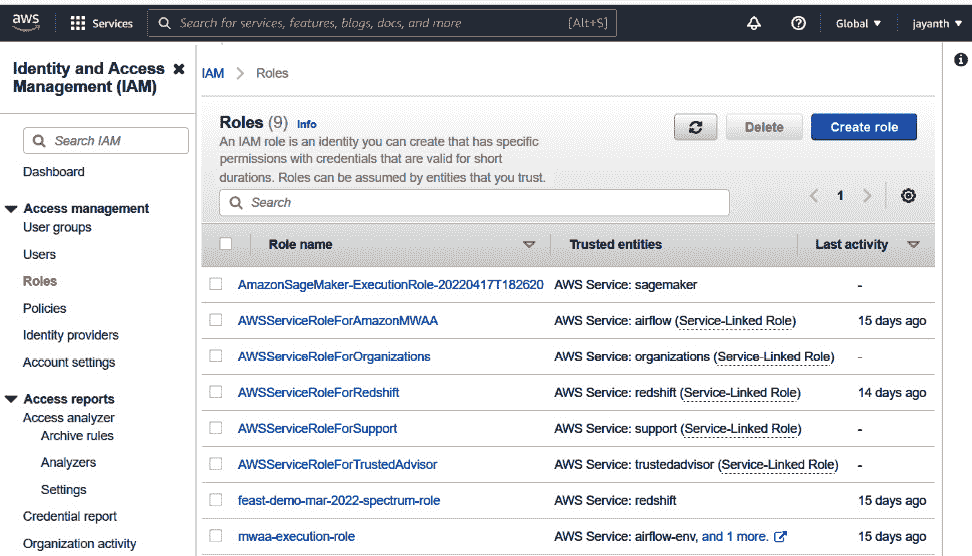
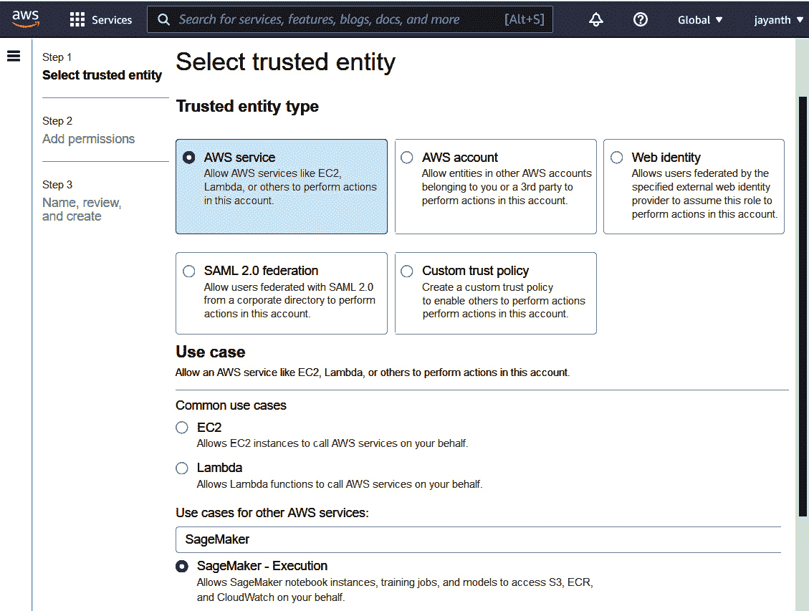
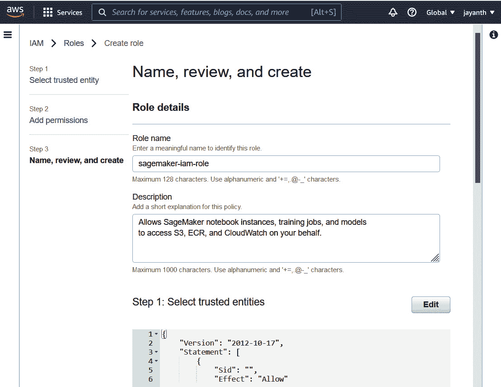
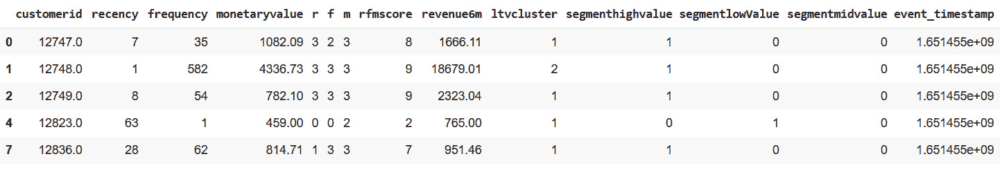
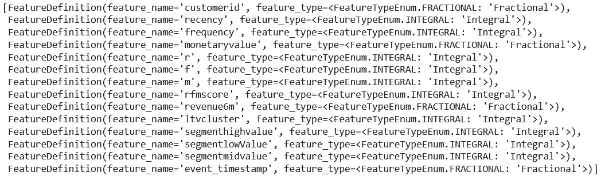
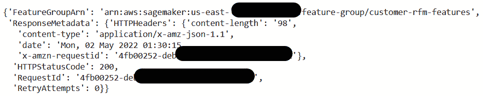

# 第八章：Feast 替代方案和机器学习最佳实践

在上一章中，我们讨论了如何使用 Amazon Managed Workflows 和 Apache Airflow 进行编排，以及如何使用 **Feast** 将在线和批量模型投入生产。到目前为止，在这本书中，我们一直在讨论一个特征存储库——Feast。然而，目前市场上有很多特征存储库。在本章中，我们将查看其中的一些，并讨论它们与 Feast 的不同之处，以及使用它们相对于 Feast 的优缺点。

在本章中，我们将尝试使用另一个特征存储库，具体是 Amazon SageMaker。我们将使用在构建客户**终身价值（LTV）**模型时生成的相同特征集，并将其导入 SageMaker 特征存储库，并运行几个查询。选择 AWS 而不是 Tecton、Hopworks 和 H2O.ai 等其他特征存储库的原因是易于访问试用版。然而，选择适合您的特征存储库取决于您已经拥有的工具和基础设施，以及更多内容，我们将在本章中讨论。

本章的目的是向您展示市场上可用的内容以及它与自行管理的特征存储库（如 Feast）的不同之处。我们还将讨论这些特征存储库之间的相似性和差异性。本章还想讨论的另一个方面是机器学习开发中的最佳实践。无论我们使用什么工具/软件进行机器学习开发，都有一些事情我们可以普遍采用来提高机器学习工程。

在本章中，我们将讨论以下主题：

+   市场上可用的特征存储库

+   使用 SageMaker 特征存储库进行特征管理

+   机器学习最佳实践

# 技术要求

为了运行示例并更好地理解本章内容，前几章中涵盖的主题将很有用，但不是必需的。要跟随本章中的代码示例，您需要熟悉笔记本环境，这可以是本地设置，如 Jupyter，或在线笔记本环境，如 Google Colab、Kaggle 或 SageMaker。您还需要一个具有对 SageMaker 和 AWS Glue 控制台完全访问权限的 AWS 账户。您可以在试用期间创建新账户并免费使用所有服务。您可以使用以下 GitHub 链接找到本书的代码示例：

[`github.com/PacktPublishing/Feature-Store-for-Machine-Learning/tree/main/Chapter07`](https://github.com/PacktPublishing/Feature-Store-for-Machine-Learning/tree/main/Chapter07)

# 市场上可用的特征存储库

在本节中，我们将简要讨论市场上可用的特征存储库，以及它们与 Feast 的比较，以及这些特征存储库之间的相似之处和不同之处。

## Tecton 特征存储库

*Tecton 是由 Uber 机器学习平台 Michelangelo 的创建者构建的企业级特征存储*（https://eng.uber.com/michelangelo-machine-learning-platform/）。Tecton 也是 Feast 的主要贡献者之一。因此，当你查看 Tecton 的文档([`docs.tecton.ai/index.html`](https://docs.tecton.ai/index.html))时，你会在 API 和术语中看到很多相似之处。然而，Tecton 中有许多功能在 Feast 中不存在。此外，Tecton 是一个托管特征存储，这意味着你不需要构建和管理基础设施；它将为你管理。

与大多数特征存储一样，Tecton 使用在线和离线存储分别用于低延迟和历史存储。然而，与 Feast 相比，在线和离线存储的选项较少，并且目前仅支持 AWS。如果你更喜欢 Azure 或 GCP，你现在没有其他选择，只能等待。我相信最终将支持多个云提供商和数据存储。Tecton 使用**软件即服务**（**SaaS**）部署模型，并将部署分为数据平面和控制平面。你可以在以下链接中找到他们的部署模型：[`docs.tecton.ai/setting-up-tecton/07a-deployment_saas.html`](https://docs.tecton.ai/setting-up-tecton/07a-deployment_saas.html)。最好的部分是数据永远不会离开客户的 AWS 账户，只有控制面板运行所需的元数据由 Tecton 拥有的 AWS 账户访问；此外，UI 将托管在他们账户中。然而，如果你想通过 REST/gRPC API 端点公开在线数据，该服务将托管在 Tecton 的 AWS 账户中。在线特征请求和响应将通过他们的账户路由。

一旦 Tecton 部署到你的 AWS 账户，你可以使用 Python SDK 与之交互。CLI 命令与 Feast 命令类似；然而，有一些选项，例如可以管理特征定义的版本，以及降级到定义的先前版本。以及你可以使用特征存储执行的常见工作流程，如摄取、低延迟查询和执行点时间连接，使用 Tecton，你可以将转换定义为特征存储的一部分。这是 Tecton 我最喜欢的功能之一。以下是特征存储中特征视图和转换页面的链接：[`docs.tecton.ai/overviews/framework/feature_views/feature_views.html`](https://docs.tecton.ai/overviews/framework/feature_views/feature_views.html)。这意味着你可以为数据仓库（Snowflake）、数据库、Kinesis 或 Kafka 定义原始数据源配置，并定义 PySpark、Spark SQL 或 pandas 转换以生成特征。Tecton 在定义的日程上编排这些作业，生成特征，并将它们摄取到在线和离线存储中。这有助于跟踪数据血缘。

以下是一个示例代码片段，说明如何定义特征视图和转换：

```py
# Feature View type
```

```py
@batch_feature_view(
```

```py
    # Pipeline attributes
```

```py
    inputs=...
```

```py
    mode=...
```

```py
    # Entities
```

```py
    entities=...
```

```py
    # Materialization and serving configuration
```

```py
    online=...
```

```py
    offline=...
```

```py
    batch_schedule=...
```

```py
    feature_start_time=...
```

```py
    ttl=...
```

```py
    backfill_config=...
```

```py
    # Metadata
```

```py
    owner=...
```

```py
    description=...
```

```py
    tags=...
```

```py
)
```

```py
# Feature View name
```

```py
def my_feature_view(input_data):
```

```py
    intermediate_data = my_transformation(input_data)
```

```py
    output_data = my_transformation_two(intermediate_data)
```

```py
    return output_data
```

你可能会认出在前一个代码块中看到的一些参数。在这里，注释说明这是一个批量转换，你可以定义诸如使用哪些实体、什么时间表以及是否应将数据摄入在线和离线存储等参数。在方法定义中，输入数据将根据注释定义中分配给`input`参数的内容注入（你可以假设它来自原始数据源的 DataFrame）。在 DataFrame 上，你添加你的转换并返回输出 DataFrame，这将作为特征。这些特征将按照定义的时间表摄入在线和离线存储。一旦定义了前面的转换，你必须运行`tecton apply`，这与`feast apply`命令类似，以注册此转换。其他功能与其他特征存储提供的功能类似；因此，我将跳过它们，并让你探索它们的文档。

值得注意的是，在撰写本文时，Tecton 的部署是单租户的，这意味着如果存在无法共享数据的团队，你可能需要多个部署。需要创建一组角色，以便 Tecton 可以使用跨账户角色安装和创建所需资源，这涉及到您的一次性初始设置。

## Databricks 特征存储

Databricks 特征存储是用户可用的另一个选项。如果你已经将 Databricks 用作你的笔记本环境以及数据处理作业，这很有意义。它包含 Databricks 工作区，所以你不能只有特征存储。然而，你可以获得一个工作区，除了特征存储之外不使用任何其他东西。它可以托管在 AWS、GCP 或 Azure 上。因此，如果你在任何一个主要云服务提供商上，这可以是一个选择。

这些概念与其他特征存储类似，例如特征表、行的时间戳版本、进行点时间连接的能力以及在线和离线存储。它使用 delta lake 作为其离线存储，并使用基于您所在云提供商的关键值存储之一。Databricks 特征存储的最好之处在于它与 Databricks 的所有其他方面和组件集成良好，例如 Spark DataFrame 的摄取、检索、与 MLflow 模型存储库的即插即用集成、访问控制和跟踪用于生成特定特征表的笔记本的谱系。它还有一个友好的用户界面，您可以浏览和搜索特征。最好的下一部分是，如果您已经拥有 Databricks 工作区，则无需设置。以下是笔记本的链接，其中包含特征创建、摄取、检索、训练和模型评分的示例：[`docs.databricks.com/_static/notebooks/machine-learning/feature-store-taxi-example.html`](https://docs.databricks.com/_static/notebooks/machine-learning/feature-store-taxi-example.html)。

然而，有一些事情需要记住。Databricks 特征存储没有项目概念；因此，特征表是最高级别的抽象，访问控制是在特征表级别。此外，Databricks 的在线模型托管仍在公共预览中（尽管毫无疑问它最终将成为一项标准服务）。这意味着如果您使用 Databricks 特征存储来托管在 Databricks 之外的在线模型，它可能需要通过直接客户端连接到在线商店。例如，如果您使用 DynamoDB 作为在线商店（Databricks 根据云提供商提供多种选择）并在 Amazon `boto3`客户端中托管预测期间的特征模型。此外，跨工作区共享特征可能需要额外的配置，无论是访问令牌还是使用中央工作区作为特征存储。以下是 Databricks 特征存储文档的链接，其中包含更多详细信息：[`docs.databricks.com/applications/machine-learning/feature-store/index.html`](https://docs.databricks.com/applications/machine-learning/feature-store/index.html)。

## Google 的 Vertex AI 特征存储

Google 的 Vertex AI 是 Google 为机器学习和人工智能提供的**平台即服务**（**PaaS**）产品。Vertex AI 旨在提供一个端到端的机器学习平台，提供一系列用于机器学习开发、训练、编排、模型部署、监控等工具。我们最感兴趣的工具是 Vertex AI 特征存储。如果您已经使用 GCP 来提供服务，它应该是一个自动的选择。

概念和术语与 Feast 非常相似。Vertex AI 中的最高抽象级别称为 *特征存储*，类似于 Feast 中的 *项目*，一个 *特征存储* 可以有 *实体*，而 *特征* 应属于 *实体*。它支持在线和批量服务，就像所有其他特征存储一样。然而，与 Feast 和 Tecton 不同，没有可用的在线和历史存储选项。由于它是一个托管基础设施，用户无需担心安装和选择在线和离线存储——可能只是价格问题。以下是其价格的链接：[`cloud.google.com/vertex-ai/pricing#featurestore`](https://cloud.google.com/vertex-ai/pricing#featurestore)。它使用 **IAM**（代表 **身份和访问管理**）进行身份验证和授权，并且您还可以获得一个用于搜索和浏览特征的 UI。

Vertex AI 的最佳部分是其与其他 GCP 组件以及 Vertex AI 服务本身的集成，用于特征生成、管道管理和数据血缘跟踪。我最喜欢的功能之一是漂移监控。您可以在特征表上设置特征监控配置，这样它就可以为您生成数据分布报告，而无需进行任何额外的工作。

再次提醒，有几件事情需要记住。对于在线服务，你需要进行容量规划并设置处理您流量的所需节点数量。在线服务的自动扩展选项目前仍处于公开预览阶段（尽管它很快就会成为标准服务），但容量规划应该是一个需要解决的主要问题。一些负载测试模拟可以帮助你轻松解决这个问题。此外，对于特征存储，您拥有的在线服务节点数量、数据保留长度以及每个实体的特征数量都有配额和限制。其中一些可以在请求后增加，而其他则不行。以下是特征存储配额和限制的链接：[`cloud.google.com/vertex-ai/docs/quotas#featurestore`](https://cloud.google.com/vertex-ai/docs/quotas#featurestore)。

## Hopsworks 特征存储

Hopsworks 是一个在 AGPL-V3 许可下运行的另一个开源特征存储，可以在本地、AWS 或 Azure 上运行。它还提供了一个支持 GCP 以及任何 Kubernetes 环境的企业版特征存储。与其他机器学习平台服务类似，它也提供多个组件，例如模型管理和计算环境管理。

这些概念与其他特征存储类似；然而，术语不同。它没有实体的概念，*Hopsworks*中的*featuregroups*与*Feast*中的*featureviews*类似。就像其他特征存储一样，Hopsworks 支持在线和离线服务。它使用 Apache Hive 与 Apache Hudi 作为离线存储，MySQL Cluster 作为在线存储。再次强调，没有在线或离线存储的选项。然而，Hopsworks 开发了不同的存储连接器，可以用来创建按需的外部特征组，例如我们在*Feast*中定义的*RedShiftSource*，见*第四章*，*将特征存储添加到机器学习模型中*。但是，外部特征组有一些限制，意味着没有时间旅行、在线服务等。

Hopsworks 特征存储中有许多有趣且功能强大的特性。以下是一些最好的特性：

+   **项目级多租户**：每个项目都有一个所有者，并且可以与其他团队成员以及跨团队共享资源。

+   **特征组版本控制**：Hopsworks 支持特征组版本控制，这是市场上任何其他特征存储所不支持的功能。

+   **特征组的统计信息**：它为特征组提供了一些开箱即用的统计信息，例如特征相关性计算、特征的频率直方图和唯一性。以下是一个示例特征组：

    ```py
    store_fg_meta = fs.create_feature_group(
        name="store_fg",
        version=1,
        primary_key=["store"],
        description="Store related features",
        statistics_config={"enabled": True, 
                             "histograms": True, 
                             "correlations": True})
    ```

+   **特征验证**：这是另一个开箱即用的有趣特性。这是一组预定义的验证规则，存在于特征组中，例如特征的最低和最高值、特征的唯一性计数、特征的熵以及特征的长度最大值。它有足够的规则类型，您不会遇到需要自定义验证规则的场景。以下是一些示例规则：

    ```py
    #the minimum value of the feature needs to be between 0 and 10
    rules=[Rule(name="HAS_MIN", level="WARNING", 
                 min=0, max=10)] 
    #Exactly 10% of all instances of the feature need to be contained in the legal_values list
    rules=[Rule(name="IS_CONTAINED_IN", level="ERROR", 
                 legal_values=["a", "b"], min=0.1, 
                 max=0.1)] 
    ```

+   **转换函数**：与 Tecton 的转换函数类似，在 Hopsworks 中，您可以在训练数据集上定义或使用内置的转换（Hopsworks 有一个训练数据的概念，您可以从不同的特征组中选择特征，并在其上创建训练数据集定义——一个类似于数据库视图的概念）。

然而，有一些事情需要记住。如果您选择开源版本，您可能不会拥有所有这些特性，并且基础设施将需要自行管理。相反，对于企业版本，您将需要与 Hopsworks 工程师合作，创建在云服务提供商上安装 Hopsworks 所需的一些资源和角色。以下是所有文档的链接：https://docs.hopsworks.ai/feature-store-api/2.5.8/。即使您不使用这些特性，我也建议您查看一下；这可能会给您一些关于您可能想要构建或拥有的特征存储中的特性的想法。

## SageMaker 特征存储

SageMaker 是 AWS 提供的一个端到端机器学习平台。就像 Vertex AI 一样，它有一个笔记本环境，AutoML，处理作业和模型管理，特征存储等。如果你是一个专注于 AWS 的公司，这必须是自然的选择，而不是其他选择。

这些概念与其他特征存储的概念相近，尽管一些术语不同。例如，SageMaker Feature Store 也没有实体的概念，Feast 中的*featureviews*与 SageMaker 中的*featuregroups*类似。它具有所有基本功能，如在线和离线存储以及服务。然而，你没有选择。它使用 S3 作为离线存储，其中一个键值存储作为在线存储（AWS 在其文档中没有说明在线存储用于什么）。AWS 使用 IAM 进行身份验证和授权。要访问特征存储库，目前需要完全访问 SageMaker 和 AWS Glue 控制台。如果你将 SageMaker 与 Feast 进行比较，两者都使用/支持 S3 作为离线存储，键值存储作为在线存储，以及 Glue 目录来管理模式。除了 SageMaker 是一个托管特征存储之外，另一个区别是 Feast 使用 Redshift 查询离线数据，而 SageMaker 使用 Amazon Athena（无服务器）查询。如果你是服务器无服务技术的粉丝，你可以将此功能添加到 Feast 中。

我最喜欢的 SageMaker Feature Store 的特点之一是无需管理基础设施。除了创建一个 IAM 角色以访问特征存储库之外，你不需要管理任何东西。任何给定负载的所有资源都由 AWS 管理。你只需要关注开发和摄取特征。SageMaker Feature Store 还支持在 EMR 或 Glue 作业（无服务器）上使用 Spark 进行摄取。除了特征外，它还添加了元数据，如`write_time`和`api_invocation_time`，这些可以在查询中使用。最好的部分是你可以使用 Amazon Athena SQL 查询查询离线数据。

虽然有一些需要注意的事项。当前的实现还没有细粒度的访问管理。目前，你需要完全访问 SageMaker 才能使用特征存储，尽管我相信这只是 AWS 开始提供细粒度访问的时间问题。点时间连接不是现成的；然而，这些可以通过 SQL 查询或 Spark 实现。

到目前为止，我们已经查看了一些市场上的可用选项；你可以通过此链接找到其他可用的特征存储：[`www.featurestore.org/`](https://www.featurestore.org/)。然而，为你的项目或团队选择正确的特征存储可能很棘手。在挑选特征存储时，以下是一些需要注意的事项：

+   你的主要云提供商有很大影响。如果你专注于 GCP，使用 SageMaker Feature Store 就没有意义，反之亦然。如果你是多云，那么你将有更多选择。

+   数据处理框架也是决定使用哪个特征存储的另一个关键因素。例如，如果你使用 SageMaker 作为你的机器学习平台，在其他人之前尝试 SageMaker Feature Store 更有意义。

+   与你生态系统中的其他组件的集成也很关键——例如，回答诸如它与你的处理平台、编排框架、模型管理服务、数据验证框架以及你的机器学习开发过程如何良好集成等问题，真的有助于选择正确的特征存储。

+   所需的功能和你的团队结构有很大影响。如果你是一个只想专注于机器学习的中小团队，那么托管特征存储的提供方案是有意义的，而如果你有一个平台团队来管理基础设施，你可能需要考虑开源提供方案，并评估构建与购买选项。如果你有平台团队，他们可能会寻找额外的功能，如多租户、细粒度访问控制和 SaaS/PaaS。

总结来说，除了它提供的功能外，许多因素都会影响特征存储的选择，因为它必须与更广泛的生态系统良好集成。

接下来，让我们看看一个托管特征存储是如何工作的。

# 使用 SageMaker Feature Store 进行特征管理

在本节中，我们将探讨如果我们使用托管特征存储而不是 Feast 在*第四章*，“将特征存储添加到机器学习模型”中，我们可能需要采取哪些行动。

重要提示

所有托管特征存储都有一个类似的流程；有些可能是基于 API 的，有些则通过 CLI 工作。但无论哪种方式，使用特征存储所需的工作量将与我们在本节中讨论的内容相似。我之所以选择 SageMaker，是因为熟悉它并且易于访问，利用 AWS 中的免费试用作为特色产品。

## 使用 SageMaker 的资源

在*第四章*“将特征存储添加到机器学习模型”中，在我们开始使用特征存储之前，我们在 AWS 上创建了一系列资源，例如一个 S3 存储桶、一个 Redshift 集群、一个 IAM 角色和一个 Glue 目录表。相反，对于像 SageMaker 这样的托管特征存储，你所需要的只是一个具有完全访问 SageMaker 的 IAM 角色，你就准备好了。现在让我们试试看。

我们需要一些 IAM 用户凭证和一个 SageMaker Feature Store 可以承担的 IAM 角色。创建 IAM 用户与之前我们所做的是类似的。遵循相同的步骤创建一个 IAM 用户，并分配**AmazonS3FullAccess**和**AmazonSageMakerFullAccess**权限。IAM 角色的创建与之前我们所做的是一样的；然而，我们需要允许 SageMaker 服务承担该角色。

重要提示

如前所述多次，赋予完全访问权限从来不是一个好主意；权限应该始终基于资源进行限制。

让我们创建一个 IAM 角色：

1.  登录您的 AWS 账户，并使用搜索栏导航到 IAM 角色页面；或者，访问以下 URL：https://us-east-1.console.aws.amazon.com/iamv2/home#/roles。将显示以下页面：



图 7.1 – IAM 角色主页

1.  在显示的网页上，点击**创建角色**以导航到以下屏幕：



图 7.2 – IAM 角色创建页面

1.  在*图 7.2*显示的屏幕上，在**其他 AWS 服务的用例**下拉菜单中，选择**SageMaker**，然后点击**SageMaker - 执行**单选按钮。向下滚动并点击**下一步**，在**添加权限**页面保持默认设置，然后点击**下一步**。接下来将显示以下页面：



图 7.3 – 名称、审查和创建页面

1.  在显示的网页上，填写`sagemaker-iam-role`。滚动到页面底部并点击`arn:aws:iam::<account_number>:role/sagemaker-iam-role`。

这就是我们访问 SageMaker Feature Store 所需的所有内容。接下来，让我们创建特征定义。

## 生成特征

要定义特征组，因为我们正在尝试比较它与 Feast 的不同之处，我们将使用相同的特征集。您可以从 S3 存储桶下载之前导入的特征，或者从 GitHub 链接下载：[`github.com/PacktPublishing/Feature-Store-for-Machine-Learning/blob/main/Chapter07/rfm_features.parquet`](https://github.com/PacktPublishing/Feature-Store-for-Machine-Learning/blob/main/Chapter07/rfm_features.parquet)。下载 Parquet 文件后，将其复制到可以从笔记本访问的位置。下一步是创建一个新的笔记本，我将其命名为`ch7-sagemaker-feature-store.ipynb`：

1.  让我们先安装所需的库：

    ```py
    !pip install sagemaker pandas
    ```

1.  安装库后，让我们生成特征。在这里，我们将从位置读取复制的文件并对数据集进行一些小的修改：

    ```py
    import pandas as pd
    import time
    df = pd.read_parquet(path="/content/rfm_features.parquet")
    df = df.drop(columns=["created_timestamp"])
    df["event_timestamp"] = float(round(time.time()))
    df["customerid"] = df['customerid'].astype(float)
    df.head()
    ```

上述代码块读取文件并删除了`created_timestamp`列，因为它对于 SageMaker 不是必需的。我们还将`event_timestamp`列更新为最新时间，并将其类型更改为`float`而不是`datetime`。这样做的原因是，SageMaker 在编写时仅支持`int`、`float`和`string`特征，而`datetime`文件可以是`float`或`string`对象，格式为`datetime` ISO 格式。

代码块生成了以下输出：



图 7.4 – 近期、频率和货币价值（RFM）特征

现在我们有了 RFM 特征，下一步是定义特征组。如果你正确地回忆起 *第四章*，*将特征存储添加到机器学习模型中*，在生成特征后，我们创建了特征定义并将它们应用到特征存储中。

## 定义特征组

要定义特征组，因为它是一项一次性活动，应该在一个单独的笔记本中完成，而不是通过特征工程。对于这个练习，让我们继续在同一个笔记本中定义特征组：

1.  下面的代码块定义了一些导入并创建 SageMaker 会话：

    ```py
    import sagemaker
    import sys
    import boto3
    from sagemaker.session import Session
    from sagemaker import get_execution_role
    import os
    os.environ["AWS_ACCESS_KEY_ID"] = "<aws_key_id>"
    os.environ["AWS_SECRET_ACCESS_KEY"] ="<aws_secret_id>"
    os.environ["AWS_DEFAULT_REGION"] = "us-east-1"
    prefix = 'sagemaker-featurestore-introduction'
    role = "arn:aws:iam::<account_number>:role/sagemaker-iam-role"
    sagemaker_session = sagemaker.Session()
    region = sagemaker_session.boto_region_name
    s3_bucket_name = "feast-demo-mar-2022"
    ```

在代码块中，将 `<aws_key_id>` 和 `<aws_secret_id>` 替换为之前创建的 IAM 用户的密钥和密钥。同时，使用你的 IAM 角色 ARN 分配 `role`。

1.  下面的代码块创建特征组对象并从输入 DataFrame 中加载特征定义：

    ```py
    from sagemaker.feature_store.feature_group import \
      FeatureGroup
    customers_feature_group = FeatureGroup(
        name="customer-rfm-features", 
        sagemaker_session=sagemaker_session
    )
    customers_feature_group.load_feature_definitions(df)
    ```

前面的代码块产生以下输出：

![图 7.5 – 加载特征定义的调用]



图 7.5 – 加载特征定义的调用

正如你在 *图 7.5* 中看到的那样，`load_feature_definitions` 调用读取输入 DataFrame 并自动加载特征定义。

1.  下一步是创建特征组。下面的代码块在 SageMaker 中创建特征组：

    ```py
    customers_feature_group.create(
        s3_uri=f"s3://{s3_bucket_name}/{prefix}",
        record_identifier_name="customerid",
        event_time_feature_name="event_timestamp",
        role_arn=role,
        enable_online_store=True
    )
    ```

前面的代码块通过传递以下参数调用 create API：

+   `s3_uri`：特征数据将被存储的位置

+   `record_identifier_name`：`id` 列的名称（与 Feast 中的实体列相同）

+   `event_time_feature_name`：将用于时间旅行的时戳列

+   `role_arn`：SageMaker Feature Store 可以承担的角色

+   `enable_online_store`：是否为此特征组启用在线服务

代码块在成功创建特征组时产生以下输出：




图 7.6 – 特征组创建

那就结束了 – 我们的特征组已经准备好使用。接下来让我们导入特征。

## 特征导入

在 SageMaker Feature Store 中进行特征导入很简单。它是一个简单的 API 调用，如下面的代码块所示：

```py
ingestion_manager = customers_feature_group.ingest(df))
```

```py
ingestion_manager.wait()
```

```py
ingestion_manager.failed_rows
```

前面的代码块将导入特征，如果有任何失败的行数，将打印出来。

在这里需要记住的一件事是，就像 Feast 一样，你不需要做任何额外的事情来将最新功能从离线商店转换为在线商店。如果启用了在线商店，数据将被导入到在线和离线商店，最新数据将立即可在在线商店中查询。

接下来让我们查询在线商店。

## 从在线商店获取记录

与 Feast 一样，从在线商店查询很简单。你所需要的是记录 ID 和特征组名称。下面的代码块从在线商店获取记录：

```py
customer_id = 12747.0
```

```py
sg_runtime_client = sagemaker_session.boto_session.client(
```

```py
    'sagemaker-featurestore-runtime', 
```

```py
    region_name=region)
```

```py
record = sg_runtime_client.get_record(
```

```py
    FeatureGroupName="customer-rfm-features", 
```

```py
    RecordIdentifierValueAsString=str(customer_id))
```

```py
print(record)
```

上一段代码块从在线商店获取了具有`12747.0` ID 的客户的全部特征。查询应在毫秒内返回结果。输出将类似于以下代码块：

```py
{'ResponseMetadata': {'RequestId': '55342bbc-c69b-49ca-bbd8-xxxx', 'HTTPStatusCode': 200, 'HTTPHeaders': {'x-amzn-requestid': '55342bbc-c69b-49ca-bbd8-xxx, 'content-type': 'application/json', 'content-length': '729', 'date': 'Mon, 02 May 2022 01:36:27 GMT'}, 'RetryAttempts': 0}, 
```

```py
'Record': [{'FeatureName': 'customerid', 'ValueAsString': '12747.0'}, {'FeatureName': 'recency', 'ValueAsString': '7'}, {'FeatureName': 'frequency', 'ValueAsString': '35'}, {'FeatureName': 'monetaryvalue', 'ValueAsString': '1082.09'}, {'FeatureName': 'r', 'ValueAsString': '3'}, {'FeatureName': 'f', 'ValueAsString': '2'}, {'FeatureName': 'm', 'ValueAsString': '3'}, {'FeatureName': 'rfmscore', 'ValueAsString': '8'}, {'FeatureName': 'revenue6m', 'ValueAsString': '1666.1100000000001'}, {'FeatureName': 'ltvcluster', 'ValueAsString': '1'}, {'FeatureName': 'segmenthighvalue', 'ValueAsString': '1'}, {'FeatureName': 'segmentlowValue', 'ValueAsString': '0'}, {'FeatureName': 'segmentmidvalue', 'ValueAsString': '0'}, {'FeatureName': 'event_timestamp', 'ValueAsString': '1651455004.0'}]}
```

如您所见，输出包含所有特征及其对应值。

现在我们已经了解了如何查询在线商店，接下来让我们看看如何生成训练数据集和查询历史数据。

## 使用 Amazon Athena 查询历史数据

如前所述，SageMaker Feature Store 提供了使用 Amazon Athena 在历史存储上运行 SQL 查询的能力。

以下代码块生成了所有客户及其特征的最新快照：

```py
get_latest_snapshot_query = customers_feature_group.athena_query()
```

```py
query = f"""SELECT *
```

```py
FROM
```

```py
    (SELECT *,
```

```py
         row_number()
```

```py
        OVER (PARTITION BY customerid
```

```py
    ORDER BY  event_timestamp desc, Api_Invocation_Time DESC, write_time DESC) AS row_num
```

```py
    FROM "{get_latest_snapshot_query.table_name}")
```

```py
WHERE row_num = 1 and 
```

```py
NOT is_deleted;"""
```

```py
get_latest_snapshot_query.run(query_string=query, output_location=f"s3://{s3_bucket_name}/output")
```

```py
get_latest_snapshot_query.get_query_execution()
```

该代码块使用嵌套 SQL 查询，其中内部查询从`event_time`、`Api_Invocation_Time`和`write_time`列按降序获取所有客户及其特征。外部查询从内部查询的结果中选择每个客户的第一个出现。查询成功执行后，代码块输出查询结果的存储位置以及附加详情。

结果可以像以下代码块所示那样加载为 DataFrame：

```py
latest_df = get_latest_snapshot_query.as_dataframe()
```

```py
latest_df.head()
```

上一段代码块输出了以下内容：

![图 7.7 – Athena 查询结果

![img/B18024_07_007.jpg]

图 7.7 – Athena 查询结果

随意尝试在特征存储上运行其他 Athena 查询。以下是 Amazon Athena 查询的文档：[`docs.aws.amazon.com/athena/latest/ug/what-is.html`](https://docs.aws.amazon.com/athena/latest/ug/what-is.html)。

## 清理 SageMaker 特征组

在我们继续前进之前，让我们清理 SageMaker 资源以节省成本。清理很简单；它只是另一个 API 调用以删除特征组。以下代码块执行此操作：

```py
customers_feature_group.delete()
```

就这些了。在成功执行后，它将删除特征组，但会留下 S3 和 Glue 目录中的数据，如果需要，仍然可以使用 Amazon Athena（使用`boto3`客户端）进行查询。为了确保一切都被清理干净，请在同一笔记本中运行以下代码块。它应该返回一个空的特征组列表：

```py
sagemaker_client = sagemaker_session.boto_session.client(
```

```py
    "sagemaker", region_name=region
```

```py
) 
```

```py
sagemaker_client.list_feature_groups()
```

现在我们已经了解了 SageMaker 特征组，接下来让我们看看机器学习的最佳实践。

# 机器学习最佳实践

到目前为止，本书中我们讨论了特征存储，如何使用它们进行机器学习开发和生产，以及选择特征存储时可供选择的各种选项。尽管特征存储是机器学习的主要组件/方面之一，但本书中我们并未过多关注机器学习的其他方面。在本节中，让我们简要地讨论一下机器学习的其他方面和最佳实践。

## 源数据验证

不论我们用于构建机器学习模型的科技、算法和基础设施如何，如果数据中存在错误和异常，模型的表现将受到严重影响。数据应该被视为任何机器学习系统中的第一公民。因此，在数据进入机器学习流程之前检测错误和异常非常重要。

要对原始数据源进行验证，我们需要一个组件来创建和编排针对数据的验证规则。数据的使用者应该能够在 SQL 查询、Python 脚本或 Spark SQL 中编写任何自定义规则。任何规则失败都应通知数据消费者，他们反过来应该能够决定是否停止管道执行、重新训练模型或采取不采取行动。

一些常见的规则包括按计划对数据集进行描述性分析，这可以提供数据漂移的见解。更高级的统计，如**库尔巴克-莱布勒**（**KL**）散度和**人口稳定性指数**（**PSI**），也是很好的。拥有简单的数据验证规则，如数据新鲜度、唯一值、字符串字段长度、模式和值范围阈值，可以非常有帮助。模式验证是数据验证的另一个重要方面。任何验证的变化都可能影响所有消费者和流程。我们在源头拥有的数据验证越好，我们的模型和流程就越健康、性能越好。

## 分解机器学习流程和编排

一种不良的做法是将所有内容都在单个笔记本中开发，从数据验证和特征工程到模型预测。这不是一个可扩展或可重用的方法。大部分时间都花在清理不必要的代码和将模型投入生产上。因此，将机器学习流程分解成多个更小的步骤是一个好主意，例如数据验证、清理、转换、特征工程、模型训练和模型预测。转换步骤越小，代码的可读性、可重用性和调试错误就越容易。这也是为什么 Tecton 中的特征视图和转换，以及 Hopsworks 中的存储连接器和转换函数是优秀功能的原因之一。许多**提取、转换和加载**（**ETL**）框架也提供了类似的功能。

除了分解机器学习流程外，编排也是机器学习平台的重要部分。每个云提供商都有自己的编排工具，同时也有很多开源的提供。开发无需太多工作即可编排的流程步骤是关键。如今，有很多编排工具，只要步骤小且有意义，就应能够与任何现有框架轻松编排。

## 跟踪数据血缘和版本控制

如果您还记得*第六章*，*模型到生产及之后*，我们讨论了预测问题的调试。在那个例子中，我们讨论了生成导致预测异常的相同特征集；然而，很多时候仅仅找出系统出了什么问题以及是否由代码或数据集引起是不够的。因此，能够追踪该特征集的数据来源直到数据源，对于调试问题非常有帮助。

对于管道的每一次运行，保存每个步骤的输入和输出以及时间戳版本是关键。有了这个，我们可以追踪预测中的异常直到其源头，即数据。例如，除了拥有生成网站客户不良推荐的特性外，更好的是能够追踪这些特性直到它们在事件发生时的交互以及在此事件发生时在机器学习管道中生成的不同转换。

以下是一些有助于更好地跟踪血缘信息的管道信息：

+   在步骤中使用到的所有库的版本

+   在管道中运行的代码版本，包括管道本身的版本

+   管道每个步骤产生的输入参数和工件，例如原始数据、数据集和模型

接下来，让我们看看特征库。

## 特征库

拥有一个特征库对于机器学习开发非常有好处。尽管在更新特征表模式方面存在一些灰色区域，但特征存储的好处，如可重用性、可浏览的特征、在线服务的准备就绪、时间旅行和点时间连接，在模型开发中非常有用。正如我们在上一章中观察到的，在客户终身价值模型开发期间开发的特征在下一购买日模型中很有用。同样，随着特征库规模的扩大，越来越多的特征可供使用，数据科学家和工程师的工作重复性减少，从而加速了模型的开发。

以下截图展示了开发机器学习模型的成本与特征存储中精心策划的特征数量之间的关系：

![图 7.8 – 模型的平均成本与特征存储中精心策划的特征数量之间的关系

![img/B18024_07_008.jpg]

图 7.8 – 模型的平均成本与特征存储中精心策划的特征数量之间的关系

如*图 7.8*所示，随着特征仓库的增长，开发和生产模型的成本会降低。按照重用和添加新特征（如果不可用）的原则，特征仓库中所有可用的特征要么是生产就绪的，要么正在为生产模型提供服务。我们只需为每个新模型添加增量特征。这意味着在基础设施上增加的唯一成本就是运行这些额外的特征工程转换和新特征表，其余的假设在如果我们使用托管特征存储的情况下会自动扩展以适应生产负载。因此，新模型开发和生产的成本应该随着时间的推移而降低，并在特征仓库饱和后趋于平稳。

## 实验跟踪、模型版本控制和模型仓库。

实验跟踪和模型仓库是机器学习开发的其他重要方面。在开发模型时，我们会运行不同的实验——可能是不同的算法，不同的实现，如 TensorFlow 与 PyTorch，超参数调整，为模型选择不同的特征集，不同的训练数据集，以及训练数据集上的不同转换。跟踪这些实验并不容易，因为其中一些实验可能持续数天或数周。因此，使用与许多笔记本环境一起提供的实验跟踪软件非常重要。

每次运行都应该记录以下内容：

+   模型训练笔记本或脚本的版本。

+   一些关于数据集的参数，可用于重现相同的训练和评估数据集。如果你使用特征存储，那么可能是时间戳和实体；如果没有，你也可以将训练数据集保存到文件中并记录数据集的位置。

+   训练算法中使用的所有参数。

+   每次运行的性能指标。

+   对结果的任何可视化也可能非常有用。

每次运行的记录指标可用于比较不同运行中模型的性能指标。这些指标在决定哪个模型的运行性能更好并应转移到新阶段，如部署阶段和 A/B 测试阶段时至关重要。此外，每次运行也有助于你浏览实验的历史记录，如果你或团队中的其他人需要回顾并重现某些特定的运行。

同样，模型仓库可以帮助跟踪所有不同版本的模型。模型注册/仓库存储了加载和运行模型所需的信息——例如，MLflow 模型仓库存储有关 conda 环境、模型的`pickle`文件以及模型的其他任何附加*依赖项*的信息。如果您有一个模型的中央仓库，这对于消费者浏览和搜索以及模型的生命周期管理（如将模型移动到不同的阶段——开发、预发布、生产以及存档）非常有用。模型仓库还可以用于扫描代码中的任何漏洞以及模型中使用的任何包。因此，模型仓库在机器学习开发中发挥着关键作用。

## 特征和模型监控

正如我们在上一章中讨论的，特征监控是另一个重要的方面。特征仓库的一个重要对应物是对变化和异常的监控。特征监控规则将与数据监控的规则相似。一些有用的特征规则包括特征新鲜度、最小和最大规则、监控异常值、最新特征的描述性统计以及如 KL 散度和 PSI 等指标。Hopsworks 的监控规则应该是您可能拥有的特征规则列表的一个良好起点。以下是文档链接：[`docs.hopsworks.ai/feature-store-api/2.5.8/generated/feature_validation/`](https://docs.hopsworks.ai/feature-store-api/2.5.8/generated/feature_validation/)。

模型监控是另一个重要的方面。在将模型部署到生产环境中后，其性能往往会随着时间的推移而下降。这是因为用户行为发生变化；因此，数据特征也会随之变化。跟踪模型在生产中的表现非常重要。这些性能报告应该按计划生成，如果不是实时生成，还必须采取适当的行动，例如使用新数据重新训练模型或启动全新的迭代。

## 其他事项

在机器学习开发过程中需要注意的其他事项包括跟踪运行时环境、库升级和降级。最好是主动采取行动。例如，如果您使用与特定环境严格绑定的工具，如 Python 或 Spark 版本，一旦特定的运行时被弃用并从生产支持中移除，作业可能会开始失败，生产系统可能会受到影响。另一个例子是 Databricks 的运行时与特定的 Python 和 Spark 版本绑定。如果您在已弃用的版本上运行作业，一旦它停止支持，如果新版本中有破坏性更改，作业可能会开始失败。因此，最好是主动升级。

在此基础上，让我们总结一下本章所学的内容，然后再查看下一章中的端到端用例。

# 摘要

在本章中，我们审视了市场上一些可用的特征存储。我们讨论了其中的五个，分别是 Tecton、Databricks、Vertex AI、Hopsworks 和 SageMaker Feature Store。我们还深入探讨了 SageMaker Feature Store，以了解使用托管特征存储而非 Feast 的感觉，以及它在资源创建、特征摄取和查询方面的差异。在最后一节，我们简要讨论了机器学习开发的一些最佳实践。

在下一章中，我们将通过一个端到端的用例来介绍一个托管机器学习平台。
