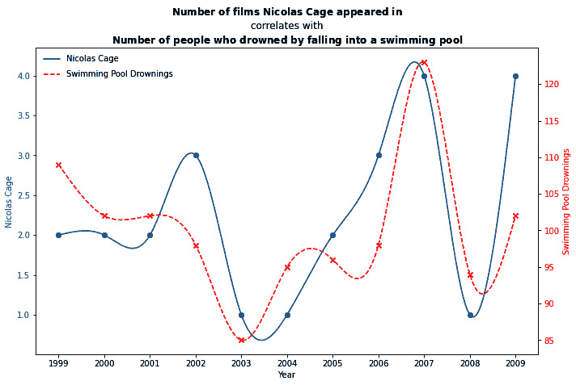
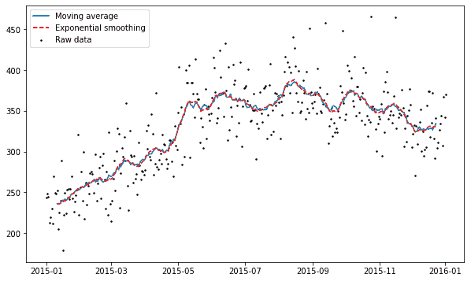
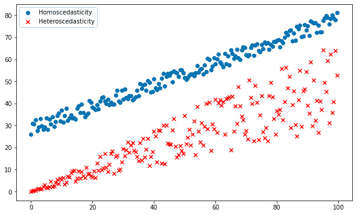
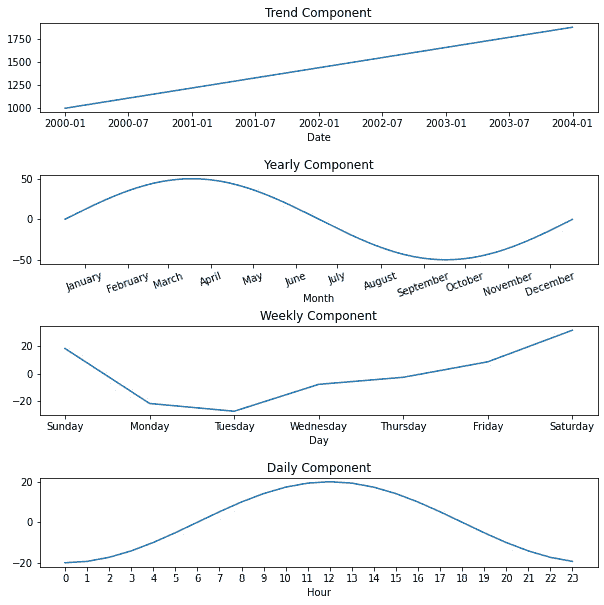
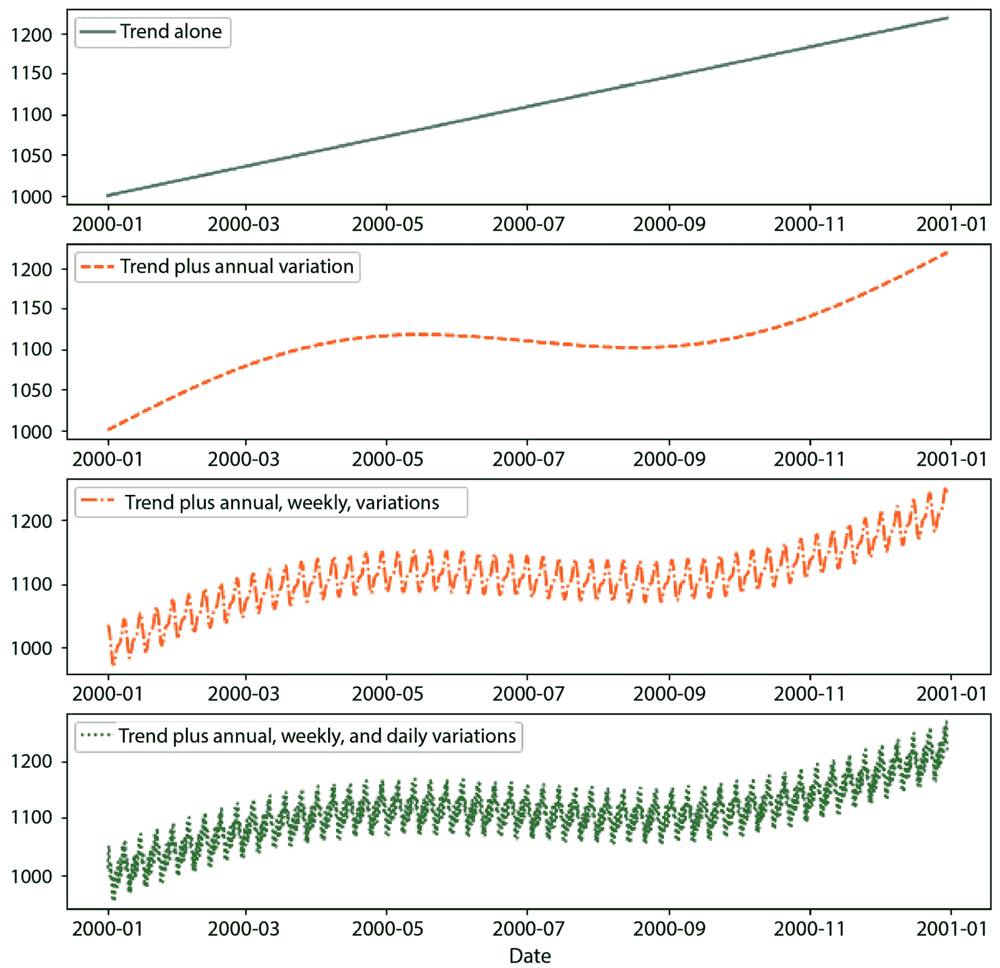

# 时间序列预测的历史与发展

**Prophet** 是一个强大的工具，用于创建、可视化和优化您的预测！使用 Prophet，您将能够理解哪些因素将推动您的未来结果，这将使您能够做出更有信心的决策。您将通过一个直观但非常灵活的编程界面来完成这些任务和目标，这个界面旨在为初学者和专家 alike。

您不需要对时间序列预测技术背后的数学或统计知识有深入的了解，就可以利用 Prophet 的强大功能。尽管如果您具备这些知识，Prophet 还包括丰富的功能集，让您能够将您的经验发挥到极致。您将在一个结构化的范式下工作，其中每个问题都遵循相同的模式，这样您可以花更少的时间去优化您的预测，更多的时间去发现关键见解，从而增强您的决策。

本章介绍了时间序列预测背后的基本思想，并讨论了一些关键模型迭代，这些迭代最终导致了 Prophet 的开发。在本章中，您将了解时间序列数据是什么，以及为什么它必须与非时间序列数据不同处理，然后您将发现其中最强大的创新，其中 Prophet 是最新的之一。具体来说，我们将涵盖以下主题：

+   理解时间序列预测

+   移动平均和指数平滑

+   ARIMA

+   ARCH/GARCH

+   神经网络

+   Prophet

+   近期发展

# 理解时间序列预测

**时间序列**是一组按时间顺序收集的数据。例如，想想任何图表，其中*x*轴是时间的某种度量——从大爆炸以来宇宙中的星星数量，到每次核反应中每纳秒释放的能量。这两者背后的数据都是时间序列。您手机上天气应用中显示的接下来 7 天的预期温度？这也是一个时间序列的图。

在这本书中，我们主要关注人类尺度上的事件，如年、月、日和小时，但所有这些都是时间序列数据。预测未来值就是预测的行为。

预测天气显然对人类来说自古以来就很重要，尤其是在农业出现之后。事实上，2300 多年前，希腊哲学家亚里士多德撰写了一篇名为《气象学》的论文，其中讨论了早期的天气预报。实际上，“预测”这个词是在 19 世纪 50 年代由一位英国气象学家罗伯特·菲茨罗伊创造的，他在查尔斯·达尔文的开拓性航行中作为“贝格尔号”的船长而闻名。

然而，时间序列数据并不仅限于天气。医学领域在 1901 年由荷兰医生威廉·埃因托芬发明了第一台实用的**心电图**（**ECG**）后，采用了时间序列分析技术。心电图产生了我们现在在医疗剧中看到的患者床边的熟悉的心跳模式。

今天，最被讨论的预测领域之一是经济学。有整个电视频道致力于分析股市的趋势。政府使用经济预测来咨询中央银行政策，政治家使用经济预测来发展他们的平台，而商业领袖使用经济预测来指导他们的决策。

在这本书中，我们将预测各种主题，如大气中的二氧化碳水平、芝加哥公共自行车共享项目的骑行者数量、黄石公园狼群的增长、太阳黑子周期、当地降雨量，甚至某些热门账户的 Instagram 点赞数。

## 依赖数据的难题

那么，为什么时间序列预测需要独特的方法呢？从统计学的角度来看，你可能会看到时间序列的散点图，其中有一个相对清晰的趋势，并尝试使用标准回归——将直线拟合到数据的技术来拟合一条线。问题是这违反了线性回归所要求的独立性假设。

为了用例子说明时间序列的依赖性，让我们假设一个赌徒正在掷一个公平的骰子。我告诉你他们刚刚掷出了一个 2，然后问你下一个值会是什么。这些数据是独立的；之前的掷骰子对未来的掷骰子没有影响，所以知道之前的掷骰子是 2 并不提供关于下一个掷骰子的任何信息。

然而，在另一种情况下，比如我从一个未公开的地球上的地点给你打电话，让你猜测我所在地点的温度。你最好的猜测是猜测当天的平均全球温度。现在，想象一下我告诉你昨天我所在地点的温度是 90°F。这为你提供了大量的信息，因为你直觉上知道昨天的温度和今天的温度以某种方式相关联；它们不是独立的。

在时间序列数据中，你不能随机打乱数据的顺序而不破坏趋势，在合理的误差范围内。数据的顺序很重要；它不是独立的。当数据像这样依赖时，回归模型可以通过随机机会显示出统计显著性，即使没有真正的相关性，也比你所选择的置信水平所暗示的更频繁。

因为高值往往跟随高值，低值往往跟随低值，所以时间序列数据集更有可能显示出比其他情况下更多的高值或低值集群，而这反过来又可能导致出现比其他情况下更多的相关性。

Tyler Vigen 的网站 *Spurious Correlations* 专门指出看似重要但实际上荒谬的时间序列关联的例子。以下是一个例子：

图 1.1 – 一个虚假的时间序列关联（https://www.tylervigen.com/spurious-correlations）

显然，每年在游泳池中溺水的人数与尼古拉斯·凯奇出演的电影数量完全无关。它们之间没有任何影响。然而，通过将时间序列数据视为独立数据的谬误，Vigen 已经表明，纯粹是随机机会，这两组数据确实存在显著的关联。当忽略时间序列数据中的依赖性时，这种随机机会更有可能发生。

现在您已经了解了时间序列数据究竟是什么，以及它与其他数据集的区别，让我们来看看模型发展历程中的几个里程碑，从最早的模型到 Prophet。

# 移动平均和指数平滑

可能最简单的预测形式是 **移动平均**（**MA**）。通常，移动平均被用作 **平滑技术**，以在变化很大的数据中找到一条更直的线。每个数据点都调整到周围 *n* 个数据点的平均值，其中 *n* 被称为窗口大小。例如，窗口大小为 10 时，我们会调整一个数据点，使其成为之前 5 个值和之后 5 个值的平均值。在预测环境中，未来值被计算为 *n* 个先前值的平均值，因此，窗口大小为 10 时，这意味着 10 个先前值的平均值。

使用移动平均的平衡行为是，您希望有一个大的窗口大小来平滑噪声并捕捉实际趋势，但随着窗口大小的增大，您的预测将显著滞后趋势，因为您需要回溯得更远来计算平均值。指数平滑背后的思想是对随时间平均的值应用指数递减的权重，给近期值更多的权重，给较远期值更少的权重。这允许预测对变化更加敏感，同时仍然忽略大量噪声。

如您在以下模拟数据的图中所示，移动平均线的行为比指数平滑线更粗糙，但两条线仍然同时调整趋势变化：

图 1.2 – 移动平均与指数平滑

指数平滑法起源于 20 世纪 50 年代，其最初形式为**简单指数平滑法**，不允许趋势或季节性。查尔斯·霍尔特在 1957 年将技术提升到允许趋势，他称之为**双指数平滑法**；与彼得·温特斯合作，霍尔特在 1960 年增加了季节性支持，这通常被称为**霍尔特-温特斯指数平滑法**。

这些预测方法的缺点是它们对新趋势的调整可能较慢，因此预测值落后于现实——它们在较长的预测时间框架中表现不佳，并且有许多超参数需要调整，这可能是一个困难且非常耗时的过程。

# ARIMA

在 1970 年，数学家乔治·博克斯和 Gwilym Jenkins 发表了《时间序列：预测与控制》，其中描述了现在所知的**博克斯-詹金斯模型**。这种方法通过开发**ARIMA**将 MA 的概念进一步发展。作为一个术语，ARIMA 通常与博克斯-詹金斯互换使用，尽管技术上，博克斯-詹金斯指的是 ARIMA 模型的参数优化方法。

ARIMA 是一个缩写，代表三个概念：**自回归**（**AR**）、**积分**（**I**）和**移动平均**（**MA**）。我们已经理解了 MA 部分。AR 意味着模型使用数据点与一定数量的滞后数据点之间的依赖关系。也就是说，模型基于先前值预测未来的值。这与预测因为整个星期到目前为止都很暖和，所以明天将会很暖和相似。

**积分**部分意味着不是使用任何原始数据点，而是使用该数据点与先前数据点之间的差值。本质上，这意味着我们将一系列值转换为一系列值的变化。直观地，这表明明天的温度将与今天大致相同，因为整个星期温度变化不大。

ARIMA 模型的 AR、I 和 MA 各个组成部分在模型中都被明确指定为一个参数。传统上，*p*用于表示要使用的滞后观测值的数量，也称为**滞后阶数**。原始观测值差分的次数或差分的程度称为*d*，而*q*代表 MA 窗口的大小。因此，ARIMA 模型的标准表示为*ARIMA(p, d, q)*，其中*p*、*d*和*q*都是非负整数。

ARIMA 模型的一个问题是它们不支持季节性，或具有重复周期的数据，例如白天温度上升而夜晚下降，或夏季上升而冬季下降。**季节性 ARIMA**（**SARIMA**）是为了克服这一缺点而开发的。与 ARIMA 表示法类似，SARIMA 模型的表示法为*SARIMA(p, d, q)(P, D, Q)m*，其中*P*是季节性自回归阶数，*D*是季节性差分阶数，*Q*是季节性移动平均阶数，而*m*是单个季节周期的时间步数。

你还可能遇到 ARIMA 模型的其它变体，包括**向量 ARIMA**（**VARIMA**），用于具有多个时间序列作为向量的情况；**分数 ARIMA**（**FARIMA**）或**自回归分数积分移动平均**。

**PD：作为 P 关键字的风格**（**ARFIMA**），两者都包括分数差分度，允许在时间上相隔较远的观测值具有非可忽略的依赖性；以及**SARIMAX**，这是一个**季节性 ARIMA**模型，其中*X*代表添加到模型中的外生或额外变量，例如将降雨预报添加到温度模型中。

ARIMA 通常表现出非常好的结果，但其缺点是复杂性。调整和优化 ARIMA 模型通常计算成本高昂，成功的结果可能取决于预测者的技能和经验。这不是一个可扩展的过程，更适合熟练从业者进行临时分析。

# ARCH/GARCH

当数据集的方差随时间变化时，ARIMA 模型在建模时会遇到问题。特别是在经济学和金融学中，这是常见的。在金融时间序列中，大回报往往伴随着大回报，而小回报往往伴随着小回报。前者称为**高波动性**，后者称为**低波动性**。

**自回归条件异方差**（**ARCH**）模型是为了解决这个问题而开发的。**异方差性**是一种说法，意味着数据的变化或分布在整个过程中不是恒定的，其对立术语是**同方差性**。差异在此可视化：

图 1.3 – 斯凯迪斯提

罗伯特·恩格尔于 1982 年首次介绍了 ARCH 模型，通过将**条件方差**描述为先前值的函数。例如，白天用电量的不确定性远大于夜间用电量。因此，在电力使用模型中，我们可能会假设白天的小时数具有特定的方差，而夜间使用则具有较低的方差。

1986 年，蒂姆·博勒尔塞夫和斯蒂芬·泰勒在他们的**广义 ARCH**（**GARCH**）模型中引入了移动平均成分。在电力示例中，使用量方差是时间的函数，但波动性的波动可能并不一定发生在特定的时间，波动本身是随机的。这就是 GARCH 发挥作用的时候。

尽管 ARCH 和 GARCH 模型都无法处理趋势或季节性，但在实践中，通常首先构建 ARIMA 模型以提取时间序列的季节变化和趋势，然后使用 ARCH 模型来模拟预期的方差。

# 神经网络

时间序列预测中相对较新的发展是使用**循环神经网络**（**RNNs**）。这得益于 Sepp Hochreiter 和 Jürgen Schmidhuber 在 1997 年开发的**长短期记忆**（**LSTM**）单元。本质上，LSTM 单元允许神经网络处理一系列数据，如语音或视频，而不是单个数据点，如图像。

标准的循环神经网络（RNN）被称为“循环”是因为它内部有循环结构，这赋予了它记忆能力，也就是说，它能够访问之前的信息。一个基本的神经网络可以通过学习从之前的图像中识别行人的样子来训练识别街道上的行人图像，但它不能通过观察视频之前帧中行人的接近来训练识别视频中行人即将过马路。它没有关于导致行人走上马路的图像序列的知识。短期记忆是网络需要暂时提供上下文的部分，但这种记忆很快就会退化。

早期的 RNN 存在一个记忆问题：它的记忆时间非常短。在句子“*飞机在空中飞……*”中，一个简单的 RNN 可能能够猜测下一个词将是“天空”，但在“*我去年夏天去了法国度假。这就是为什么我在春天学习说……*”中，RNN 猜测下一个词是“法语”就不再那么容易了；它理解语言应该接下来，但它忘记了短语是以提到法国开始的。然而，LSTM 具有这种必要的上下文。它为网络的短期记忆提供了更长的寿命。在时间序列数据的情况下，其中模式可以在长时间尺度上重复，LSTM 可以表现得非常好。

与这里讨论的其他预测方法相比，使用 LSTM 进行时间序列预测仍然处于初级阶段；然而，它显示出希望。与其他预测技术相比的一个强大优势是神经网络能够捕捉非线性关系，但与任何深度学习问题一样，LSTM 预测需要大量的数据和计算能力，以及较长的处理时间。

此外，还有许多关于模型架构和要使用的超参数的决定需要做出，这需要一个非常经验丰富的预测者。在大多数实际问题上，必须考虑预算和截止日期，ARIMA 模型通常是更好的选择。

# Prophet

Prophet 是由 Facebook（现更名为**Meta**）内部开发的，由 Sean J. Taylor 和 Ben Letham 开发，旨在克服其他预测方法中经常遇到的两个问题：更自动化的预测工具往往过于不灵活，无法适应额外的假设，而更稳健的预测工具则需要具有专业数据科学技能的经验分析师。Facebook 对高质量商业预测的需求超过了他们的分析师能够提供的。2017 年，Facebook 将 Prophet 作为开源软件发布给公众。

Prophet 被设计用来最优地处理商业预测任务，这些任务通常具有以下任何属性：

+   以每小时、每日或每周的级别捕获的时间序列数据，理想情况下至少有一年的历史数据

+   每日、每周和/或每年出现的强烈季节性效应

+   假日和其他特殊的一次性事件，这些事件不一定遵循季节性模式，但发生不规则

+   缺失数据和异常值

+   重大趋势变化，例如在推出新功能或产品时可能发生

+   趋势逐渐接近上限或下限

默认情况下，Prophet 通常会产生非常高质量的预测，但它也非常可定制，对于没有时间序列数据专业知识的数据分析师来说，它也是易于接近的。正如您将在后面的章节中看到的，调整 Prophet 模型是非常直观的。

实际上，Prophet 是一个**加性回归模型**。这意味着模型仅仅是几个（可选）组件的总和，例如以下内容：

+   线性或逻辑增长趋势曲线

+   每年季节性曲线

+   每周季节性曲线

+   每日季节性曲线

+   假日和其他特殊事件

+   例如，额外的用户指定季节性曲线，如每小时或每季度

以一个具体的例子来说，假设我们正在模拟一家小型在线零售店在 4 年内的销售情况，从 2000 年 1 月 1 日到 2003 年底。我们观察到整体趋势随着时间的推移而不断上升，从每天**1,000**次销售增加到时间周期结束时的约**1,800**次。我们还看到春季的销售量比平均水平高出约**50**个单位，而秋季的销售量比平均水平低约**50**个单位。每周，销售量通常在**星期二**最低，整个星期逐渐增加，星期六达到峰值。最后，在一天中的各个时段，销售量在中午达到峰值，然后平稳下降到午夜最低。这就是那些个别曲线的样子（注意每个图表上的不同*x*轴刻度）：

图 1.4 – 模型组件

一个加性模型会将这四个曲线简单相加，以得到销售多年的最终模型。随着子组件的累加，最终曲线变得越来越复杂：

图 1.5 – 加性模型

此前的图表仅显示了前一年，以便更好地看到每周和每日的变化，但完整的曲线延伸了 4 年。

在底层，Prophet 是用**Stan**编写的，这是一种概率编程语言（有关 Stan 的更多信息，请访问[`mc-stan.org/`](https://mc-stan.org/)）。这有几个优点。它允许 Prophet 优化拟合过程，使其通常在不到一秒内完成。Stan 也与 Python 和 R 兼容，因此 Prophet 团队能够在两种语言实现之间共享相同的核心拟合过程。此外，通过使用贝叶斯统计，Stan 允许 Prophet 为未来预测创建不确定性区间，从而添加数据驱动的预测风险估计。

Prophet 能够以典型的结果与更复杂的预测技术相媲美，但只需付出一小部分努力。它适合每个人。初学者只需几行代码就能构建一个高度准确的模型，而不必 necessarily 理解一切工作的细节，而专家可以深入研究模型，添加更多功能，调整超参数以获得更好的性能。

# 最近的发展

Prophet 的公开发布激发了围绕预测包的大量开源活动。尽管 Prophet 仍然是使用最广泛的工具，但仍有一些竞争包需要关注。

## NeuralProphet

由于其易于学习、快速从数据中预测以及可定制性，Prophet 已经变得非常流行。然而，它确实有一些缺点；其中关键的一个是它是一个线性模型。正如本章前面所讨论的，当预测任务需要非线性模型时，通常会使用神经网络，尽管分析师必须非常了解时间序列和应用的机器学习，才能有效地应用这些模型。**NeuralProphet** ([`github.com/ourownstory/neural_prophet`](https://github.com/ourownstory/neural_prophet))旨在弥合这一差距，并允许只有时间序列专业知识的分析师构建一个非常强大的神经网络模型。

斯坦福大学的 Oskar Triebe 在开源社区的帮助下，已经构建和优化了 NeuralProphet 多年，但截至写作时，NeuralProphet 仍处于测试阶段。它用 PyTorch 替换了 Prophet 对 Stan 语言的依赖，从而实现了深度学习方法。NeuralProphet 使用**自回归网络**（**AR-Net**）来模拟时间序列自相关，并使用**前馈神经网络**来模拟滞后回归器。编程接口的设计与 Prophet 几乎相同，因此对于已经熟悉 Prophet 的人来说，学习如何在 NeuralProphet 中构建模型将会非常熟悉。

## Google 的“大规模稳健时间序列预测”

为了不甘落后，2017 年 4 月，在 Facebook 宣布 Prophet 开源两个月后，谷歌在其博客文章《我们追求大规模稳健的时间序列预测》(*Our quest for a robust time series forecasting at scale*)中描述了他们解决预测问题的方案([`www.unofficialgoogledatascience.com/2017/04/our-quest-for-robust-time-series.html`](https://www.unofficialgoogledatascience.com/2017/04/our-quest-for-robust-time-series.html))。与 Prophet 不同，谷歌的包不是开源的，因此公开可用的细节很少。Prophet 和谷歌方法之间的一个关键区别是，谷歌的预测包使用集成方法来预测增长趋势。在时间序列的背景下，这意味着谷歌拟合多个预测模型，去除任何异常值，并取每个单独模型的加权平均值，以得到最终的模型。截至写作时，谷歌尚未宣布任何计划将其预测包开源。

## LinkedIn 的 Silverkite/Greykite

与 Facebook 和谷歌相比，LinkedIn 是开源预测社区的新来者。2021 年 5 月，LinkedIn 宣布了他们的**Greykite**预测库，用于 Python ([`github.com/linkedin/greykite`](https://github.com/linkedin/greykite))，该库使用他们自己的**Silverkite**算法（Prophet 算法也是 Greykite 建模框架内的选项）。Greykite 的开发是为了为 LinkedIn 的预测提供一些关键好处：解决方案必须灵活、直观且快速。如果这听起来很熟悉，那是因为这正是 Facebook 在开发 Prophet 时追求的品质。

与 Prophet 使用贝叶斯方法来拟合模型不同，Silverkite 使用更传统的模型，如岭回归、弹性网络和提升树。Prophet 和 Silverkite 都可以建模线性增长，但只有 Silverkite 可以处理平方根和二次增长。然而，Prophet 可以建模逻辑增长，这是 Silverkite 无法做到的。从分析师的角度来看，Silverkite 最令人兴奋的方面可能是可以通过外部变量轻松地将领域专业知识添加到模型中。Silverkite 使用`sklearn`作为其 API，因此任何熟悉该库的用户在使用 Silverkite 时应该不会有任何困难。

## Uber 的 Orbit

当 LinkedIn 宣布 Greykite 库的同时，Uber 也宣布了他们自己的预测包，**面向对象的贝叶斯时间序列**(**Orbit**) ([`github.com/uber/orbit`](https://github.com/uber/orbit))。正如其名所示，Orbit 与 Prophet 一样是贝叶斯方法。然而，Orbit 被设计得比 Prophet 更具通用性，弥合了典型商业问题与更复杂的统计解决方案之间的差距。

尽管 Uber 的基准测试表明 Orbit 在所有类型的预测问题上都表现良好，但其核心用途是在营销组合模型中，这是一种量化几个营销输入对销售影响的技巧。Orbit 通过两种主要的贝叶斯结构时间序列实现：`sklearn`范式以帮助新用户入门。

# 摘要

通过对时间序列的简要概述，你了解到如果不用专门的技术分析，时间序列数据可能会出现问题。你跟随数学家和统计学家的发展，他们创造了新技术以实现更高的预测精度或更大的使用便捷性。你还了解到是什么激励了 Prophet 团队为这个传统做出自己的贡献，以及他们在方法上做出了哪些决策，你还了解到开源社区是如何对此做出反应并开始研究不同方法的。

在下一章中，你将学习如何在你的机器上运行 Prophet 并构建你的第一个模型。到这本书的结尾，你将理解每一个特性，无论大小，并将它们全部纳入你的工具箱，以增强你自己的预测能力。
