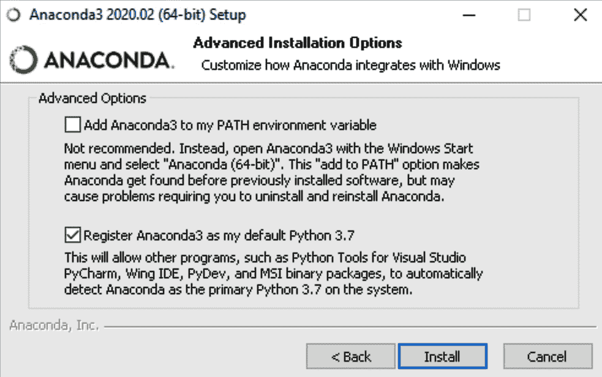
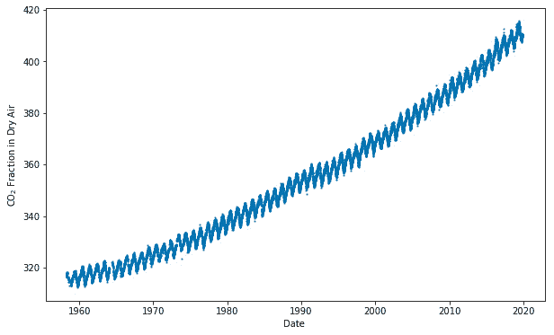
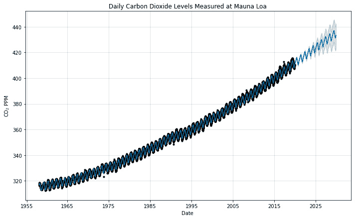
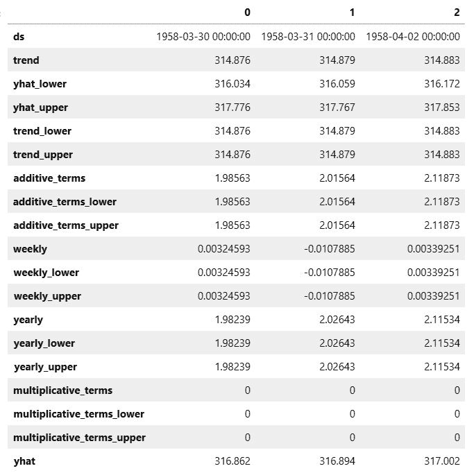
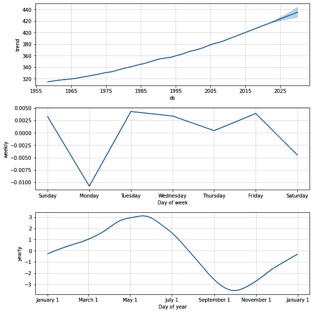

# 开始使用 Prophet

Prophet 是一个开源软件，这意味着其底层代码的整个内容对任何人都是免费可检查和修改的。这使得 Prophet 具有很大的力量，因为任何用户都可以添加功能或修复错误，但它也有其缺点。许多封闭源代码软件包，如 Microsoft Word 或 Tableau，都包含在其独立的安装文件中，具有整洁的图形用户界面，不仅可以帮助用户完成安装，而且一旦安装完毕，还可以与软件进行交互。

与之相反，Prophet 通过 **Python** 或 **R** 编程语言访问，并依赖于许多额外的开源库。这使得它具有很大的灵活性，因为用户可以调整功能或甚至添加全新的功能以适应他们特定的需求，但这也带来了潜在的可用性困难。这正是本书旨在简化的目标。

在本章中，我们将根据您使用的操作系统，向您展示整个安装过程，然后我们将通过模拟过去几十年大气二氧化碳水平来共同构建我们的第一个预测模型。

本章将全面涵盖以下内容：

+   安装 Prophet

+   在 Prophet 中构建简单模型

+   解读预测 DataFrame

+   理解组件图

# 技术要求

本章示例的数据文件和代码可以在 [`github.com/PacktPublishing/Forecasting-Time-Series-Data-with-Prophet-Second-Edition`](https://github.com/PacktPublishing/Forecasting-Time-Series-Data-with-Prophet-Second-Edition) 找到。在本章中，我们将介绍安装许多要求的过程。因此，为了开始本章，您只需要拥有一台能够运行 Anaconda 和 Python 3.7+的 Windows、macOS 或 Linux 机器。

# 安装 Prophet

在您的机器上安装 Prophet 是一个简单的过程。然而，在底层，Prophet 依赖于 **Stan** 编程语言，而安装其 Python 接口 **PyStan** 并不简单，因为它需要许多非标准编译器。

但别担心，因为有一个非常简单的方法来安装 Prophet 及其所有依赖项，无论您使用哪种操作系统，那就是通过 Anaconda。

**Anaconda** 是一个免费的 Python 发行版，它捆绑了数百个对数据科学有用的 Python 包，以及包管理系统 **conda**。这与从 [`www.python.org/`](https://www.python.org/) 的源代码安装 Python 语言形成对比，后者将包括默认的 Python 包管理器，称为 **pip**。

当 `pip` 安装一个新的包时，它将安装所有依赖项，而不会检查这些依赖的 Python 包是否会与其他包冲突。当其中一个包依赖于一个版本，而另一个包需要不同版本时，这可能会成为一个特别的问题。例如，你可能有一个 Google 的 TensorFlow 包的工作安装，该包需要 NumPy 包来处理大型多维数组，并使用 `pip` 安装一个指定不同 NumPy 版本作为依赖项的新包。

然后，不同的 NumPy 版本将覆盖其他版本，你可能会发现 TensorFlow 突然无法按预期工作，甚至完全无法工作。相比之下，`conda` 将分析当前环境，并自行确定如何为所有已安装的包安装兼容的依赖集，如果无法完成，将提供警告。

PyStan 以及许多其他 Python 工具，实际上都需要用 C 语言编写的编译器。这类依赖无法使用 `pip` 安装，但 Anaconda 已经包含了它们。因此，**强烈建议首先** **安装 Anaconda**。

如果你已经有一个你满意的 Python 环境，并且不想安装完整的 Anaconda 发行版，有一个更小的版本可供选择，称为 `conda`，Python 以及一小部分必需的包。虽然技术上可以在没有 Anaconda 的情况下安装 Prophet 及其所有依赖项，但这可能非常困难，而且过程会因使用的机器而大不相同，因此编写一个涵盖所有场景的单个指南几乎是不可能的。

本指南假设你将从一个 Anaconda 或 Miniconda 安装开始，使用 Python 3 或更高版本。如果你不确定是否想要 Anaconda 或 Miniconda，选择 Anaconda。请注意，由于包含了所有包，完整的 Anaconda 发行版将需要你的电脑上大约 3 GB 的空间，因此如果空间是个问题，你应该考虑 Miniconda。

重要提示

截至 Prophet 版本 0.6，Python 2 已不再受支持。在继续之前，请确保你的机器上已安装 Python 3.7+。强烈建议安装 Anaconda。

## macOS 上的安装

如果你还没有安装 Anaconda 或 Miniconda，那么这应该是你的第一步。安装 Anaconda 的说明可以在 Anaconda 文档中找到，网址为 [`docs.anaconda.com/anaconda/install/mac-os/`](https://docs.anaconda.com/anaconda/install/mac-os/)。如果你知道你想要 Miniconda 而不是 Anaconda，从这里开始：[`docs.conda.io/projects/continuumio-conda/en/latest/user-guide/install/macos.html`](https://docs.conda.io/projects/continuumio-conda/en/latest/user-guide/install/macos.html)。在两种情况下，都使用安装的默认设置。

安装 Anaconda 或 Miniconda 后，可以使用 `conda` 来安装 Prophet。只需在终端中运行以下两个命令，首先安装 PyStan 所需的编译器集合 `gcc`，然后安装 Prophet 本身，这将自动安装 PyStan：

```py
conda install gcc
conda install -c conda-forge prophet
```

之后，你应该可以开始使用了！你可以跳过到 *在 Prophet 中构建简单模型* 部分，我们将看到如何构建你的第一个模型。

## Windows 上的安装

与 macOS 类似，第一步是确保已安装 Anaconda 或 Miniconda。Anaconda 安装说明可在 [`docs.anaconda.com/anaconda/install/windows/`](https://docs.anaconda.com/anaconda/install/windows/) 找到，而 Miniconda 的说明则在此：[`docs.conda.io/projects/continuumio-conda/en/latest/user-guide/install/windows.html`](https://docs.conda.io/projects/continuumio-conda/en/latest/user-guide/install/windows.html)。

在 Windows 上，你必须勾选复选框以将 Anaconda 注册为默认的 Python 版本。这是正确安装 PyStan 所必需的。你可能看到的是除这里显示的版本之外的 Python 版本，例如 Python 3.8：



图 2.1 – 将 Anaconda 注册为默认 Python 版本

一旦安装了 Anaconda 或 Miniconda，你将能够访问 `gcc`，这是 PyStan 所需的编译器集合，然后通过在命令提示符中运行以下两个命令来安装 Prophet 本身，这将自动安装 PyStan：

```py
conda install gcc
conda install -c conda-forge prophet
```

第二个命令包含额外的语法，指示 `conda` 在 `conda-forge` 通道中查找 Prophet 文件。`conda-forge` 是一个社区项目，允许开发者将他们的软件作为 `conda` 包提供。Prophet 不包含在默认的 Anaconda 发行版中，但通过 `conda-forge` 通道，Facebook 团队直接通过 `conda` 提供了访问权限。

这样就应该成功安装了 Prophet！

## Linux 上的安装

在 Linux 上安装 Anaconda 与 macOS 或 Windows 相比只需额外几步，但它们不应造成任何问题。完整说明可在 Anaconda 的文档中找到，网址为 [`docs.anaconda.com/anaconda/install/linux/`](https://docs.anaconda.com/anaconda/install/linux/)。Miniconda 的说明可在 [`docs.conda.io/projects/continuumio-conda/en/latest/user-guide/install/linux.html`](https://docs.conda.io/projects/continuumio-conda/en/latest/user-guide/install/linux.html) 找到。

由于 Linux 由各种发行版提供，因此无法编写一个全面详尽的 Prophet 安装指南。然而，如果你已经在使用 Linux，那么你对它的复杂性应该也很熟悉。

只需确保你已经安装了 `gcc`、`g++` 和 `build-essential` 编译器，以及 `python-dev` 和 `python3-dev` Python 开发工具。如果你的 Linux 发行版是 Red Hat 系统，请安装 `gcc64` 和 `gcc64-c++`。之后，使用 `conda` 安装 Prophet：

```py
conda install -c conda-forge prophet
```

如果一切顺利，你现在应该已经准备好了！让我们通过构建你的第一个模型来测试它。

# 在 Prophet 中构建一个简单的模型

直接测量大气中**二氧化碳**（**CO2**）的最长记录始于 1958 年 3 月，由斯克里普斯海洋研究所的查尔斯·大卫·凯林（Charles David Keeling）开始。凯林位于加利福尼亚州的拉霍亚，但他获得了**国家海洋和大气管理局**（**NOAA**）的许可，在夏威夷岛上的火山马乌纳洛亚（Mauna Loa）北部斜坡上 2 英里高的设施中收集二氧化碳样本。在这个海拔高度，凯林的测量不会受到附近工厂等局部二氧化碳排放的影响。

1961 年，凯林（Keeling）发布了迄今为止收集的数据，确立了二氧化碳水平存在强烈季节性变化，并且它们正在稳步上升的趋势，这一趋势后来被称为**凯林曲线**。到 1974 年 5 月，NOAA 已经开始进行自己的平行测量，并且一直持续到现在。凯林曲线图如下：



图 2.2 – 凯林曲线，显示大气中二氧化碳的浓度

由于其季节性和上升趋势，这条曲线是尝试使用 Prophet 的良好候选。这个数据集包含 53 年间的超过 19,000 个每日观测值。二氧化碳的测量单位是**百万分之一**（**PPM**），表示每百万个空气分子中的二氧化碳分子数。

要开始我们的模型，我们需要导入必要的库，`pandas` 和 `matplotlib`，并从 `prophet` 包中导入 Prophet 类：

```py
import pandas as pd
import matplotlib.pyplot as plt
from prophet import Prophet
```

作为输入，Prophet 总是需要一个包含两列的 pandas DataFrame：

+   `ds`，日期戳，应该是 pandas 预期格式的 `datestamp` 或 `timestamp` 列

+   `y`，一个包含我们希望预测的测量的数值列

在这里，我们使用 pandas 导入数据，在这种情况下，一个 `.csv` 文件，并将其加载到一个 DataFrame 中。请注意，我们还把 `ds` 列转换成 pandas 的 `datetime` 格式，以确保 pandas 正确地将其识别为包含日期，而不是简单地将其作为字母数字字符串加载：

```py
df = pd.read_csv('co2-ppm-daily_csv.csv')
df['date'] = pd.to_datetime(df['date'])
df.columns = ['ds', 'y']
```

如果你熟悉 scikit-learn (`sklearn`) 包，你会在 Prophet 中感到非常自在，因为它被设计成以类似的方式运行。Prophet 遵循 sklearn 的范式，首先创建模型类的实例，然后再调用 `fit` 和 `predict` 方法：

```py
model = Prophet()
model.fit(df)
```

在那个单一的 `fit` 命令中，Prophet 分析了数据，并独立地识别了季节性和趋势，而无需我们指定任何额外的参数。尽管如此，它还没有做出任何未来的预测。为了做到这一点，我们首先需要创建一个包含未来日期的 DataFrame，然后调用 `predict` 方法。`make_future_dataframe` 方法要求我们指定我们打算预测的天数。在这种情况下，我们将选择 10 年，即 `365` 天乘以 `10`：

```py
future = model.make_future_dataframe(periods=365 * 10)
forecast = model.predict(future)
```

到目前为止，`forecast` DataFrame 包含了 Prophet 对未来 10 年 CO2 浓度的预测。我们稍后将探索这个 DataFrame，但首先，让我们使用 Prophet 的 `plot` 功能来绘制数据。`plot` 方法是基于 Matplotlib 构建的；它需要一个来自 `predict` 方法的 DataFrame 输出（在这个例子中是我们的 `forecast` DataFrame）。

我们使用可选的 `xlabel` 和 `ylabel` 参数来标记坐标轴，但对于可选的 `figsize` 参数则保持默认设置。注意，我还使用原始的 Matplotlib 语法添加了一个标题；因为 Prophet 图表是基于 Matplotlib 构建的，所以你可以在这里执行任何对 Matplotlib 图表的操作。另外，不要被带有美元符号的奇怪 `ylabel` 文本弄混淆；这只是为了告诉 Matplotlib 使用其自己的类似 TeX 的引擎来标记 CO2 下的下标：

```py
fig = model.plot(forecast, xlabel='Date',
                 ylabel=r'CO$_2$ PPM')
plt.title('Daily Carbon Dioxide Levels Measured at Mauna Loa')
plt.show()
```

图形如下所示：



图 2.3 – Prophet 预测

就这样！在这 12 行代码中，我们已经得到了我们的 10 年预测。

# 解释预测 DataFrame

现在，让我们通过显示前三个行（我已经将其转置，以便更好地在页面上查看列名）来查看那个 `forecast` DataFrame，并了解这些值是如何在前面的图表中使用的：

```py
forecast.head(3).T
```

执行该命令后，你应该会看到以下表格打印出来：



图 2.4 – 预测 DataFrame

以下是对 `forecast` DataFrame 中每一列的描述：

+   `'ds'`：该行中值相关的日期戳或时间戳

+   `'trend'`：趋势成分的值

+   `'yhat_lower'`：最终预测的不确定性区间的下限

+   `'yhat_upper'`：最终预测的不确定性区间的上限

+   `'trend_lower'`：趋势成分的不确定性区间的下限

+   `'trend_upper'`：趋势成分的不确定性区间的上限

+   `'additive_terms'`：所有加性季节性的总和值

+   `'additive_terms_lower'`：加性季节性的不确定性区间的下限

+   `'additive_terms_upper'`：加性季节性的不确定性区间的上限

+   `'weekly'`：每周季节性成分的值

+   `'weekly_lower'`：每周成分的不确定性区间的下限

+   `'weekly_upper'`：围绕每周组件的不确定性区间的上限

+   `'yearly'`：每年季节性组件的值

+   `'yearly_lower'`：围绕每年组件的不确定性区间的下限

+   `'yearly_upper'`：围绕每年组件的不确定性区间的上限

+   `'multiplicative_terms'`：所有乘法季节性的综合值

+   `'multiplicative_terms_lower'`：围绕乘法季节性的不确定性区间的下限

+   `'multiplicative_terms_upper'`：围绕乘法季节性的不确定性区间的上限

+   `'yhat'`：最终的预测值；由 `'trend'`、`'multiplicative_terms'` 和 `'additive_terms'` 组合而成

如果数据包含每日季节性，那么 `'daily'`、`'daily_upper'` 和 `'daily_lower'` 这几列也会被包含在内，遵循 `'weekly'` 和 `'yearly'` 列所建立的模式。后面的章节将包括关于加法/乘法季节性和不确定性区间的讨论和示例。

小贴士

*yhat* 发音为 *why hat*。它来自统计符号，其中 *ŷ* 变量代表 *y* 变量的预测值。一般来说，在真实参数上放置一个帽子或撇号表示它的估计值。

在 *图 2**.3 中，黑色点代表我们拟合的实际记录的 `y` 值（`df['y']` 列中的那些），而实线代表计算的 `yhat` 值（`forecast['yhat']` 列）。请注意，实线延伸到了黑色点的范围之外，我们预测到了未来。在预测区域中，围绕实线的较浅阴影表示不确定性区间，由 `forecast['yhat_lower']` 和 `forecast['yhat_upper']` 限制。

现在，让我们将这个预测分解成其组件。

# 理解组件图

在 *第一章* *时间序列预测的历史与发展* 中，Prophet 被介绍为一个加法回归模型。*图 1.4 和 1.5* 展示了趋势和不同季节性的单个组件曲线是如何相加以形成一个更复杂的曲线。Prophet 算法本质上做的是相反的操作；它将一个复杂的曲线分解为其组成部分。掌握 Prophet 预测的更大控制权的第一步是理解这些组件，以便可以单独操作它们。Prophet 提供了一个 `plot_components` 方法来可视化这些组件。

继续我们的 Mauna Loa 模型进展，绘制组件就像运行以下命令一样简单：

```py
fig2 = model.plot_components(forecast)
plt.show()
```

正如你在输出图中可以看到的，Prophet 已经将这个数据集隔离成三个组件：**趋势**、**每周季节性**和**每年季节性**：



图 2.5 – Mauna Loa 组件图

**趋势**持续增加，但随着时间的推移似乎有一个变陡的斜率——大气中二氧化碳浓度的加速。趋势线还显示了预测年份中很小的不确定性区间。从这条曲线中，我们了解到 1965 年大气中的二氧化碳浓度约为 320 PPM。到 2015 年增长到约 400 PPM，我们预计到 2030 年将达到约 430 PPM。然而，这些确切数字将因季节性效应的存在而根据一周中的某一天和一年中的某个时间而有所不同。

**每周季节性**表明，根据一周中的某一天，值将变化约 0.01 PPM——这是一个微不足道的数量，很可能是纯粹由于噪声和随机机会。确实，直觉告诉我们，二氧化碳水平（当测量距离人类活动足够远时，如莫纳罗亚山的高坡上）并不太关心一周中的哪一天，并且不受其影响。

我们将在*第五章*，“处理季节性”中学习如何指导 Prophet 不要拟合每周季节性，正如在这个案例中那样谨慎。在*第十一章*，“管理不确定性区间”中，我们将学习如何绘制季节性的不确定性，并确保可以忽略像这样的季节性。

现在，观察**年度季节性**可以发现，二氧化碳在整个冬季上升，大约在 5 月份达到峰值，而在夏季下降，10 月份达到低谷。根据一年中的时间，二氧化碳的测量值可能比仅根据趋势预测的值高 3 PPM 或低 3 PPM。如果你回顾原始数据中*图 2.2*所绘制的曲线，你会想起曲线有一个非常明显的周期性，这正是通过这种年度季节性捕捉到的。

就像那个模型那么简单，这通常就是你需要用 Prophet 做出非常准确的预测的所有！我们没有使用比默认参数更多的参数，却取得了非常好的结果。

# 摘要

希望你在本章开头安装 Prophet 时没有遇到任何问题。使用 Python 的 Anaconda 发行版大大减轻了安装 Stan 依赖项的潜在挑战。安装后，我们查看了在夏威夷莫纳罗亚山 2 英里以上的太平洋大气层中测量的二氧化碳水平。我们构建了第一个 Prophet 模型，并且仅用 12 行代码就能预测未来 10 年的二氧化碳水平。

之后，我们检查了`forecast`数据框，并看到了 Prophet 输出的丰富结果。最后，我们绘制了预测的组成部分——趋势、年度季节性和每周季节性——以更好地理解数据的行为。

Prophet 远不止这个简单的例子那么简单。在下一章中，我们将深入探讨 Prophet 模型背后的方程，以了解它是如何工作的。
