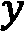

# Prophet 的工作原理

有时，Prophet 可能感觉像魔法，只需极少的用户指令就能创建复杂的预测！但如果你理解 Prophet 背后的方程，你会发现它根本不是魔法，而实际上是一个非常灵活的算法，用于从数据中提取多个同时存在的模式。

对于没有强大统计背景的人来说，所有这些数学可能感觉令人畏惧，但实际上相当容易接近，并且对数学的理解将有助于你开始预测更复杂的数据集。在本章中，我们将一起走过所有相关的方程。如果你开始感到迷茫，不要担心！随着你越来越多地使用 Prophet，一切都会变得清晰。

本章将介绍 Facebook（现在称为 Meta）选择开发自己的预测包而不是依赖现有的许多工具的原因。接下来，你将了解 Facebook 的预测哲学：分析师的知识与计算自动化的结合。最后，你将查看 Prophet 用于构建模型的方程，然后将其拆解以了解每个项在预测中的作用。

在本章中，我们将讨论以下内容：

+   Facebook 构建 Prophet 的动机

+   循环分析预测

+   Prophet 背后的数学

# 技术要求

本章中的数据文件和代码示例可在[`github.com/PacktPublishing/Forecasting-Time-Series-Data-with-Prophet-Second-Edition`](https://github.com/PacktPublishing/Forecasting-Time-Series-Data-with-Prophet-Second-Edition)找到。

请参阅本书的*前言*，了解运行代码示例所需的技术要求。

# Facebook 构建 Prophet 的动机

如在介绍 Prophet 的*第一章*《时间序列预测的历史与发展》中提到的，Facebook 注意到内部对商业预测的需求正在增加。其预测技术扩展性不佳，分析师们感到不堪重负。

Facebook 在文献中搜寻可扩展的预测方法。当时，Facebook 的预测主要使用 Rob Hyndman 的 `forecast` 包，需要具有预测和大量产品经验的 R 分析师。此外，随着 Python 在新员工中越来越受欢迎，Facebook 发现自己缺乏能够制作高质量预测的分析师。不幸的是，Facebook 考虑的完全自动化的预测工具过于脆弱，往往不够灵活，无法融入有价值的领域知识。

Facebook 需要使专家和非专家都能更容易地做出高质量的预测，这些预测能够跟上需求的变化。因此，Prophet 被设计成一种更直接的方法，以创建合理、准确的预测，这些预测可以通过非专家直观的方式进行定制。Facebook 使用它所说的“分析师在循环预测”来解决这个问题。

# 分析师在循环预测

在开发 Prophet 时，Facebook 付出了极大的努力，以确保所有参数的默认设置都能为各种业务案例提供出色的结果。然而，总是存在边缘情况、具有挑战性的数据集，或者仅仅是与预期不太匹配的预测。在这些预测不满意的情况下，分析师不会陷入完全自动化的结果。任何分析师，即使是初学者预测者，都可以通过调整各种易于理解的参数来改进预测。Facebook 将这个过程称为**分析师在循环预测**（见*图 3.1*）。

图 3.1 – 分析师在循环预测

分析师在循环预测是一个迭代的过程。分析师首先使用 Prophet 以默认参数构建模型。Prophet 已经针对速度进行了优化，所以（通常）只需几秒钟，它就能输出一个非常可接受的预测。然后 Prophet 可以评估预测并揭示潜在问题，在将其交还给分析师进行快速视觉检查之前。如果预测符合分析师的预期，他们的工作就完成了！但是，当 Prophet 揭示出较差的性能或分析师的视觉检查提供不满意的结果时，分析师可以直观地调整模型以提高性能并更好地使结果与预期一致。

这个周期可以根据需要重复进行。Prophet 的美妙之处在于，由于预测非常快，一个完整的周期通常可以在不到一分钟内完成。因此，具有广泛领域知识但统计知识有限的分析师能够创建高度定制的预测。分析师可能希望调整的参数包括以下内容：

+   **容量**：预测可以渐近接近的上限或下限。容量的一个例子可能是特定时间点的总市场规模。

+   **变化点**：这些是预测趋势突然改变方向的时间点。这些可能是由重大产品更新甚至引起显著关注的媒体报道引起的。

+   **节假日和季节性**：由于节假日和季节性的影响，任何预测的行为都会有所不同。例如，火鸡的销售在感恩节前一周达到顶峰，而沙滩球在仲夏时节销量最好。理解自己产品的分析师可以轻松地将这种情报输入到他们的模型中。

+   **平滑参数**：在视觉检查模型后，分析师可以直观地看出模型是否过度或欠拟合数据。平滑参数可以用来减少模型的噪声，或者指导模型未来可以预期多少季节性变化。

经常会有关于**统计预测**和**判断性预测**之间差异的讨论。统计预测是一个数学上拟合历史数据的模型，而判断性预测（有时也称为**管理预测**）是一个通过人类专家利用他们通过时间序列经验所学到的知识来产生预测的过程。判断性预测可以包含比统计预测更多的信息，并且可以更快速地响应变化条件，但它们扩展性不好，需要分析师做大量工作。统计预测更容易自动化，并且可以扩展以满足预测需求，但它在可以整合的领域知识量上有限。

Facebook 的分析师在环范式是这两种不同方法最佳品质的结合：强大自动化，但简单直观易于调整。然而，尽管这种简单性，Prophet 实际上在观察其内部工作时相当复杂。虽然创建准确的预测不需要理解 Prophet 模型背后的数学，但了解 Prophet 正在做什么将只会提高你的预测能力。如果你准备好了，现在让我们看看 Prophet 构建预测所使用的方程组。

# Prophet 背后的数学

在 *第一章*，*时间序列预测的历史与发展* 中，我们介绍了 Prophet 作为一个加性回归模型。该章节的 *图 1.4* 和 *1.5* 通过展示如何将代表模型组件的几个不同曲线简单相加以得到最终模型来说明这一点。从数学上讲，这可以用以下方程表示：

|  |  | (1) |
| --- | --- | --- |

模型在时间  的预测  由  给出。这个函数由四个部分组成，相加（或相乘；参见*第五章*，*处理季节性*，了解更多信息）：

+    是增长成分，或一般趋势，它是非周期的

+    是季节性成分——即所有周期性成分的总和

+    是假日成分，代表所有一次性特殊事件

+    是误差项

这四个组件（实际上，只有前三个组件——误差项只是为了解释模型无法容纳的噪声）的组合是 Prophet 构建预测所需的一切。然而，这个方程式的简单性掩盖了许多复杂性。要真正理解正在发生的事情，我们需要逐个分析这些组件。

## 线性增长

首先，我们将查看增长项。Prophet 引入了两种增长模式，线性和对数，分析师在设置模型时需要选择其中之一。（分析师如何选择？我们将在*第七章*，*控制* *增长模式*!)这个选择指示 Prophet 使用两个方程之一来表示这个项。我们将从查看线性版本开始：

|  |  | (2) |
| --- | --- | --- |

变量是增长率，线的斜率。熟悉回归的人会认出，一条线的基本方程是。我们看到方程*(2)*与这个基本方程有相似之处，如果你把括号里的所有东西收集起来并放在一起。但简单线和 Prophet 的**分段线性模型**之间的一个关键区别就在其名称中：它是分段的。斜率可以随函数变化：

图 3.2 – Prophet 模型中的垂直虚线是一个变化点，斜率在这里发生变化

这就是为什么，斜率，有所增加：。变量是一个调整率的向量（即在每个变化点发生的斜率变化），其中是在时间发生的斜率变化。向量标识了每个变化点的位置，并定义如下：

|  |  | (3) |
| --- | --- | --- |

简单来说，这意味着线的斜率是恒定的，但允许斜率进行调整。在任何时间上，斜率等于基本率加上到该点为止的所有斜率调整。

为了使线条连续，变化点之间的每个区间必须通过偏移参数进行调整，以便区间的端点相连。在方程*(2)*中，是偏移参数。就像斜率一样，这个偏移参数是一个基础偏移量加上直到时间的所有偏移量。从数学上讲，这是通过将加上一个变化点位置向量，，乘以一个偏移调整向量，来完成的。在这个线性模型中，被设置为：

|  |  | (4) |
| --- | --- | --- |

这就是 Prophet 的线性模型中对数的定义！现在让我们看看如何对对数模型进行修改。

## 对数增长

与一般直线的方程类似，对数曲线的一般方程由以下方程给出：

|  |  | (5) |
| --- | --- | --- |

与线性模型中的方程*(2)*一样，是增长率，而是一个偏移参数。方程*(5)*需要我们对方程*(2)*中做出的许多调整，以允许变化点。Prophet 还允许，即**承载能力**，随时间变化。这个值本质上是一个曲线趋近但永远不会完全达到的渐近线：

图 3.3 – Prophet 的对数模型，承载能力设置为 500

注意，的承载能力是时间的函数。这意味着渐近线不必是恒定的，而可以是任何任意曲线。在这里，我们演示了一个恒定承载能力切换到线性增加的承载能力：

图 3.4 – 承载能力可能不一定保持恒定

如果我们对方程*(5)*中的和进行与方程*(2)*中相同的调整，并允许成为时间的函数，那么我们得到以下方程：

|  |  | (6) |
| --- | --- | --- |

这就是 Prophet 的对数增长模型。在线性模型中，，但在对数模型中，必须采取更复杂的形式：

|  |  | (7) |
| --- | --- | --- |

虽然方程*(7)*比*(4)*更复杂，但它本质上执行相同的任务：确保在每个变化点，趋势曲线的每个区间的端点相连，并且线条是连续的。

增长项，，是完整 Prophet 模型中最复杂的部分。从这里开始会变得简单！现在，我们将继续了解，即季节性项。

## 季节性

时间序列数据通常表现出周期性，尤其是在商业数据中，其中经常存在年度周期、周周期和日周期。Prophet 可以在其季节性项中接受无限多个这样的周期性组件，如图*(1)*所示。

Prophet 使用傅里叶级数来模拟这个术语。傅里叶级数简单地说就是多个正弦曲线的总和。这个最终曲线的形状由每个组成曲线的振幅、相位和周期决定。傅里叶级数可以包含无限多个组件，因此可以拟合几乎任何任意的周期函数，如下所示：

图 3.5 – 四个正弦曲线的总和演示了傅里叶级数

在 Prophet 中，这个求和采用以下形式：

|  | ![img/B19630_03_F47.png] | (8) |
| --- | --- | --- |

这是![img/B19630_03_F48.png]个不同曲线的总和，被称为**傅里叶阶数**。在这个公式中，![img/B19630_03_F49.png]是时间序列的常规周期（例如，年度数据的 365.25，周数据的 7，或日数据的 1，当时间序列按天数缩放时）。Prophet 的拟合过程的一部分是计算![img/B19630_03_F50.png]和![img/B19630_03_F51.png]的值，这些仅仅是拟合参数。

保持![img/B19630_03_F52.png]相对较低实际上是在数据上应用一个低通滤波器，并禁止模型过度拟合数据的能力。然而，增加![img/B19630_03_F53.png]有时是可取的，因为它允许拟合变化更快的季节性模式。Prophet 的开发者已经考虑到这一点，并仔细选择了似乎表现相当好的默认值。我们将在*第五章*，*处理季节性*中更详细地探讨这一点。

## 假日

为了理解 Prophet 的完整预测模型，我们需要查看的最后一个组件是假日组件。这可能是最容易理解的组件。分析师向 Prophet（或加载默认列表）提供一组假日名称和日期，包括未来的日期，然后 Prophet 估计在之前日期的趋势和季节性预测中的偏差，并将相同的改变应用到未来日期。

这可以用回归者的矩阵来数学表示，![img/B19630_03_F54.png]：

|  | ![img/B19630_03_F55.png] | (9) |
| --- | --- | --- |

在这个方程中，![img/B19630_03_F56.png]是每个假日的过去和未来日期集合，![img/B19630_03_F57.png]。由于假日![img/B19630_03_F58.png]的预测变化被捕捉在![img/B19630_03_F59.png]参数中。这使得整个假日组件可以表示为![img/B19630_03_F60.png]矩阵和![img/B19630_03_F61.png]向量的乘积：

|  | ![img/B19630_03_F62.jpg] | (10) |
| --- | --- | --- |

有了这些，Prophet 拥有了构建预测所需的一切！它只需简单地将增长成分、季节性成分和假日成分相加，以提供最终的预测。

# 摘要

本章介绍了 Prophet 的发展历程，从想法的起源到理论公式的形成。然而，本章仅提供了描述 Prophet 工作原理的数学公式的摘要。对于完整细节，请参阅描述 Prophet 的原始论文：*Taylor, S. J. 和 Letham, B. 2017\. 规模化预测. PeerJ Preprints* *5:e3190v2* ([`doi.org/10.7287/peerj.preprints.3190v2`](https://doi.org/10.7287/peerj.preprints.3190v2))。

现在你已经了解了 Prophet 的工作原理，本书的剩余部分将用于展示所有可用的参数和附加功能，这些功能可以帮助你更好地控制你的预测。在下一章中，我们将探讨非每日数据，看看需要采取哪些预防措施和调整，从而为我们处理具有不同时间粒度的数据集做好准备。

# 第二部分：季节性、调整和高级功能

本节将介绍 Prophet 的高级功能。每个可调整的参数都将通过示例和讨论其修改原因和方式来探索。每一章都是在前一章的基础上构建的，以增加预测模型的复杂性和功能。到本节结束时，你将能够构建利用 Prophet 预测工具集全部功能的模型。

本节包括以下章节：

+   *第四章*, *处理非每日数据*

+   *第五章*, *处理季节性*

+   *第六章*, *假日效应预测*

+   *第七章*, *控制增长模式*

+   *第八章*, *影响趋势变化点*

+   *第九章*, *包含额外的回归因子*

+   *第十章*, *考虑异常值和特殊事件*

+   *第十一章*, *管理不确定性区间*
