# 4

# 处理非每日数据

当 Prophet 首次发布时，假设所有数据都是按日收集的，每天有一行数据。它现在已经发展到可以处理许多不同粒度的数据，但由于其历史惯例，当在 Prophet 中处理非每日数据时，有一些事情需要谨慎处理。

在本章中，你将查看月度数据（实际上，这适用于任何以大于一天的时间框架测量的数据），并了解如何更改预测频率以避免意外结果。你还将查看小时数据，并观察组件图中额外的组件。最后，你将学习如何处理沿时间轴有规律间隔的数据。

本章将涵盖以下内容：

+   使用月度数据

+   使用亚日数据

+   使用有规律间隔的数据

# 技术要求

本章示例的数据文件和代码可以在 [`github.com/PacktPublishing/Forecasting-Time-Series-Data-with-Prophet-Second-Edition`](https://github.com/PacktPublishing/Forecasting-Time-Series-Data-with-Prophet-Second-Edition) 找到。

请参阅本书的 *前言* 了解运行代码示例所需的技术要求。

# 使用月度数据

在 *第二章* 中，*使用 Prophet 入门*，我们使用 `Mauna Loa` 数据集构建了我们的第一个 Prophet 模型。数据是按天报告的，这是 Prophet 默认期望的，因此我们不需要更改 Prophet 的任何默认参数。然而，在这个下一个例子中，让我们看看一组新的数据，这些数据不是每天报告的，即 `Air Passengers` 数据集，看看 Prophet 如何处理这种数据粒度的差异。

这是一个经典的时间序列数据集，涵盖了 1949 年至 1960 年间的数据。它记录了该行业爆炸性增长期间每个月商业航空公司乘客的数量。与 Mauna Loa 数据集相比，`Air Passengers` 数据集每月只有一个观测值。如果我们尝试预测未来的日期会发生什么？

让我们创建一个模型并绘制预测图，看看会发生什么。我们像 Mauna Loa 示例那样开始，导入必要的库并将我们的数据加载到一个格式正确的 DataFrame 中：

```py
import pandas as pd
import matplotlib.pyplot as plt
from prophet import Prophet
df = pd.read_csv('AirPassengers.csv')
df['Month'] = pd.to_datetime(df['Month'])
df.columns = ['ds', 'y']
```

在构建我们的模型之前，让我们先查看前几行，以确保我们的 DataFrame 看起来符合预期：

```py
df.head()
```

你现在应该看到以下输出：

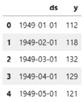

图 4.1 – 空中旅客 DataFrame

数据按月报告，每月有一个测量值。乘客数量按千计，这意味着第一行表示 1949 年 1 月 1 日开始的那个月有 112,000 名商业乘客乘坐飞机。

正如我们在上一章关于莫纳罗亚山的讨论中做的那样，我们接下来将实例化我们的模型并对其进行拟合。使用这个 `Air Passengers` 数据集，我们将 `seasonality_mode` 设置为 `'multiplicative'`，但你现在不必担心这一点——我们将在 *第五章*，*处理季节性* 中讨论它。接下来，我们将数据发送到 `fit` 方法，然后创建一个 `future` DataFrame。让我们预测 `5` 年。最后，我们将使用 `predict` 与 `future` 结合，然后绘制预测图以查看我们的结果：

```py
model = Prophet(seasonality_mode='multiplicative')
model.fit(df)
future = model.make_future_dataframe(periods=365 * 5)
forecast = model.predict(future)
fig = model.plot(forecast)
plt.show()
```

如您所见，我们使用 `5` 年的每日数据创建了 `future` DataFrame，只向 Prophet 提供了月度数据。Prophet 能够在每月的第一天适当地应用其季节性计算，因为它有良好的训练数据。然而，对于剩余的天数，它并不完全知道该怎么办，并且以非常混乱和不可预测的方式过度拟合其季节性曲线，如下面的图表所示：

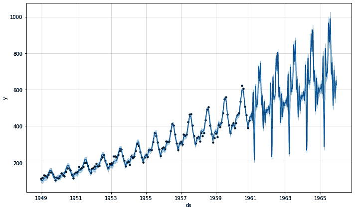

图 4.2 – 以日频率进行的未来预测

我们可以通过指示 Prophet 仅在月度上进行预测，以匹配其训练的月度数据来解决这个问题。我们需要在 `make_future_dataframe` 方法中指定一个频率，这是通过传递 `freq` 参数来完成的。我们还必须更新 `periods`，因为尽管我们仍然在预测 `5` 年后的未来，但我们每年只想有 `12` 个条目，每个月一个：

```py
model = Prophet(seasonality_mode='multiplicative')
model.fit(df)
future = model.make_future_dataframe(periods=12 * 5,
                                     freq='MS')
forecast = model.predict(future)
fig = model.plot(forecast)
plt.show()
```

`freq` 参数接受 pandas 识别为频率字符串的任何内容。在这种情况下，我们使用了 `'MS'`，意味着 *月起始日*。以下是该代码块的输出，显示了 Prophet 被指示仅在每月的第一天进行预测后的预测图：

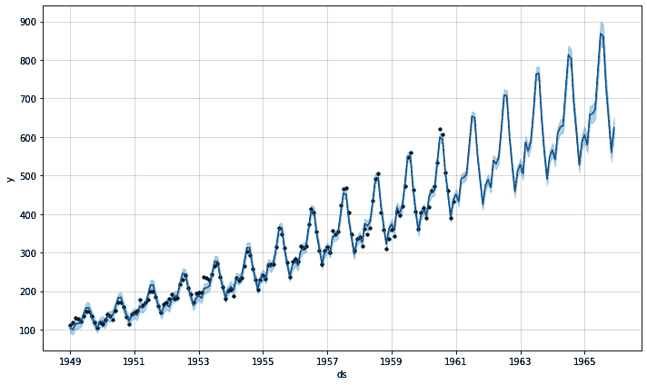

图 4.3 – 以月频率进行的未来预测

这好多了，这正是我们可能期望的预测图的样子。通过将 `freq` 参数传递给 `make_future_dataframe` 方法，我们避免了要求 Prophet 预测它没有训练知识的日期。默认情况下，频率设置为 `'D'`，即 *每日*，我们的周期是我们想要预测的天数。每次更改频率到其他设置时，请确保将您的周期设置为相同的比例。

现在，让我们看看使用子日数据时会发生什么变化。为了做到这一点，我将引入一个新的数据集：Divvy。

# 使用子日数据

在本节中，我们将使用来自伊利诺伊州芝加哥的 *Divvy 自行车共享计划* 的数据。这些数据包含了从 2014 年初到 2018 年底每小时骑行的自行车次数，并显示出一种普遍的增长趋势以及非常强烈的年度季节性。由于这是按小时的数据，并且夜间骑行次数非常少（有时每小时为零），数据确实显示了在低端的测量密度：

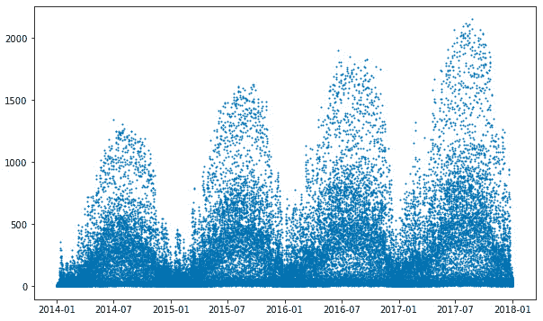

图 4.4 – 每小时 Divvy 骑行次数

使用之前提到的`Air Passengers`数据。作为分析师，你需要使用`freq`参数并在`make_future_dataframe`方法中调整周期，然后 Prophet 会完成剩余的工作。如果 Prophet 看到至少两天数据，并且数据之间的间隔小于一天，它将拟合日季节性。

让我们通过进行一个简单的预测来实际看看。在先前的示例中，我们已经导入了必要的库，所以让我们继续加载新数据并将其添加到我们的数据框中：

```py
data = pd.read_csv('divvy_hourly.csv')
df = pd.DataFrame({'ds': pd.to_datetime(data['date']),
                   'y': data['rides']})
```

接下来，我们继续按照前一个示例中的方法进行，在拟合模型之前实例化我们的模型（再次使用`seasonality_mode='multiplicative'`，并且现在我们暂时不考虑它）。当我们创建`future`数据框时，我们再次需要设置频率，但这次我们将使用`'h'`，表示每小时。

由于我们的频率是每小时，我们需要调整我们的周期以匹配，所以我们将我们想要的`365`天预测乘以每天`24`小时：

```py
model = Prophet(seasonality_mode='multiplicative')
model.fit(df)
future = model.make_future_dataframe(periods=365 * 24,
                                     freq='h')
```

最后，我们将预测我们的`future`数据框。随着预测完成，我们将使用第一个`plot`函数绘制它，然后使用第二个`plot`函数绘制成分：

```py
forecast = model.predict(future)
fig = model.plot(forecast)
plt.show()
fig2 = model.plot_components(forecast)
plt.show()
```

上述两个图表中的第一个是这里显示的预测：

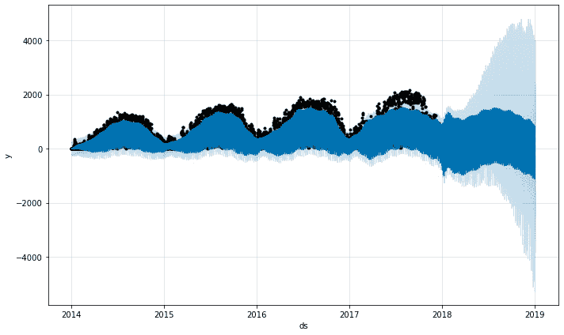

图 4.5 – Divvy 预测图

预测包括相当大的不确定性。要理解原因，我们需要查看如图*图 4.6*所示的成分图：

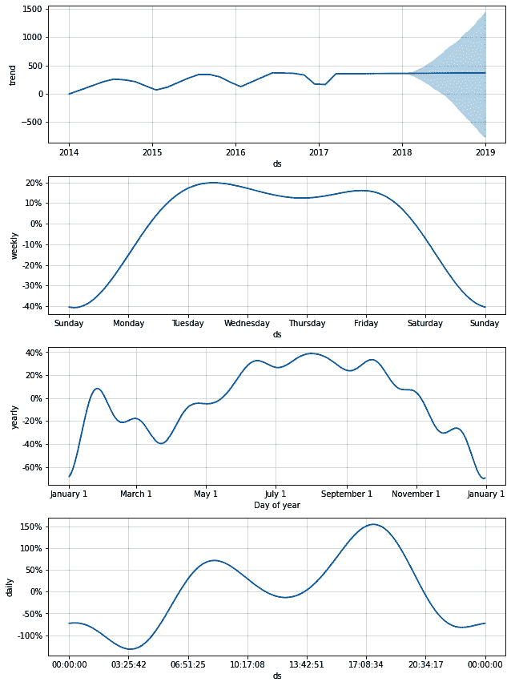

图 4.6 – Divvy 成分图

关于这一系列图表，有几个需要注意的地方。从最上面的图表开始，即**趋势**图，我们可以看到它仍然表现出年度周期性。为什么这没有在**年度**季节性图表中捕捉到？遗憾的是，这些数据包含一些非常复杂的季节性，Prophet 无法完全建模。

特别是，**日**季节性本身在一年中也是季节性的。这是季节性中的季节性。日季节性在白天上升，在夜间下降，但增加的量取决于一年中的时间，而 Prophet 并没有设计来捕捉这种季节性。这就是造成预测不确定性的原因。在后面的章节中，我们将学习一些控制这种季节性的技术。

接下来，我们来看一下包含几个直线段的`Mauna Loa`图。此外，该图从周日到周日，而`Mauna Loa`图则是从周日到周六。这两个变化都反映了每小时数据的连续性。

当我们只有每日数据，就像我们在 Mauna Loa 所做的那样，每周季节性只需要显示每一天的效果（尽管在底层，它仍然是一个连续模型）。但现在我们有了小时数据，看到连续效果很重要。我们展示了从周日的午夜 12:00:00 到周六晚上 11:59:59，总共 8 天少 1 秒。Mauna Loa 图本质上显示了每天单次时刻的每日效果，正好是 7 天，这就是两个图表之间的差异。

现在看看**年度**季节性。它相当**波动**。现在先注意这一点。当我们学习**傅里叶级数**时，我们将在*第五章* *处理季节性*中讨论它。

最后，是**每日**季节性图。这是一个新特性，仅在 Prophet 模型处理亚日数据时出现。但在这个数据集中，它却非常揭示。看起来 Divvy 网络中的骑行者在早上 8 点左右骑行很多，可能是上下班途中。下午 5 点后有一个更大的峰值，可能是骑行者回家。最后，午夜后有一个小峰，这一定是那些熬夜的人，他们晚上和朋友出去玩，现在回家睡觉。

我还想提到关于预测的另一件事：模型预测了一些负值，尽管 Divvy 在任何给定小时内都不可能有负数的骑行次数。Prophet 的开发者正在积极解决这个问题，并将在未来的更新中发布解决方案。

在前两节中，你了解到超级日数据和亚日数据并不构成难以克服的难题；我们只需调整未来预测的频率即可。但现在假设 Divvy 每天只收集从早上 8 点到下午 6 点的数据。本章最后要讨论的话题是如何处理具有规律间隔的数据。

# 使用具有规律间隔的数据

在你的职业生涯中，你可能会遇到具有规律间隔的报表数据集，尤其是在数据由有工作时间、个人时间和睡眠时间的人类收集时。可能根本无法以完美的周期性收集测量数据。

当我们在后面的章节中查看异常值时，你会看到 Prophet 在处理缺失值方面非常稳健。然而，当缺失数据以规律间隔出现时，Prophet 在这些间隔期间将没有任何训练数据来进行估计。在存在数据的时期，季节性会受到约束，但在间隔期间则不受约束，Prophet 的预测可能会显示出比实际数据显示更大的波动。让我们看看实际操作中的情况。

假设 Divvy 的数据每天只收集从早上 8 点到下午 6 点之间的数据。我们可以通过从我们的 DataFrame 中移除这些时间之外的数据来模拟这种情况：

```py
df = df[(df['ds'].dt.hour >= 8) & \
        (df['ds'].dt.hour < 18)]
```

现在比较以下新 DataFrame 的图与我们在*图 4*中看到的完整数据集：

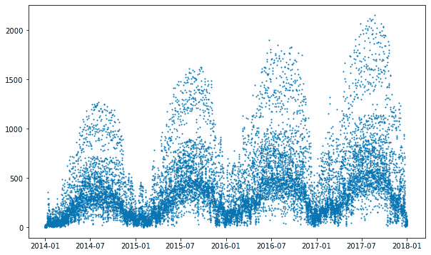

图 4.7 – 上午 8 点到下午 6 点每小时的 Divvy 骑行次数

这个图比*图 4.4*要稀疏得多，尤其是在低*y*轴值处。我们失去了所有夜间数据，因为骑行人数下降。现在每天只有 10 个数据点，每个小时从上午 8 点到下午 6 点有一个。现在，让我们像上一节那样构建一个预测模型，用一年每小时频率的`future` DataFrame，但不采取任何额外的预防措施：

```py
model = Prophet(seasonality_mode='multiplicative')
model.fit(df)
future = model.make_future_dataframe(periods=365 * 24,
                                     freq='h')
forecast = model.predict(future)
fig = model.plot(forecast)
plt.show()
```

绘制的预测显示未来期间的每日波动比历史训练数据要宽得多：

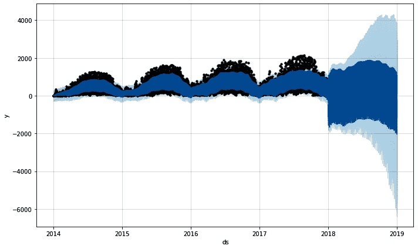

图 4.8 – 修复了常规间隔的 Divvy 预测

在这里，我们看到未来期间的无约束估计值导致预测的波动很大。这与我们在使用月度数据预测每日预测时观察到的`Air Passengers`数据中的相同效应。我们可以通过重新绘制并使用 Matplotlib 来约束`x`轴和`y`轴的极限，来放大 2018 年 8 月的 3 天，以更清楚地了解正在发生的情况：

```py
fig = model.plot(forecast)
plt.xlim(pd.to_datetime(['2018-08-01', '2018-08-04']))
plt.ylim(-2000, 4000)
plt.show()
```

与之前的预测图显示了 5 年的预测不同，这个图只显示了 3 天，因此你可以清楚地看到正在发生的情况：

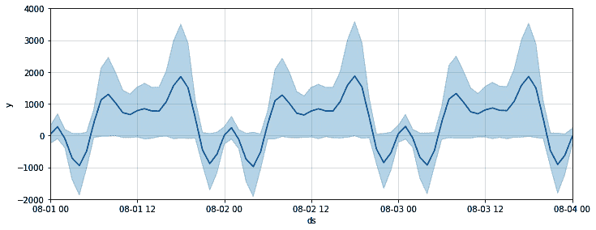

图 4.9 – 3 天内的 Divvy 预测

在上一节中，当我们查看*图 4.6*时，我们注意到每日季节性成分显示在上午 8 点之前骑行人数增加，并在上午 8 点达到局部峰值。中午时分有一个低谷，然后在下午 6 点后有一个大峰值。我们在*图 4.9*中也看到了相同的情况，只不过 Prophet 在上午 8 点之前和下午 6 点之后做出了疯狂的预测，在这些时间段内它没有训练数据。这个区域是不受约束的，只要中午存在数据，它几乎可以遵循任何模式。

解决这个问题的方法很简单，就是修改`future` DataFrame，排除那些我们训练数据中存在常规间隔的时间。我们甚至不需要实例化一个新的模型或重新拟合；我们只需重复使用我们之前的工作。所以，继续进行，我们创建一个新的`future2` DataFrame，移除早于上午 8 点或晚于下午 6 点的时间，然后预测我们的预测并绘制结果：

```py
future2 = future[(future['ds'].dt.hour >= 8) &
                 (future['ds'].dt.hour < 18)]
forecast2 = model.predict(future2)
fig = model.plot(forecast2)
plt.show()
```

现在我们看到了一个好的预测：

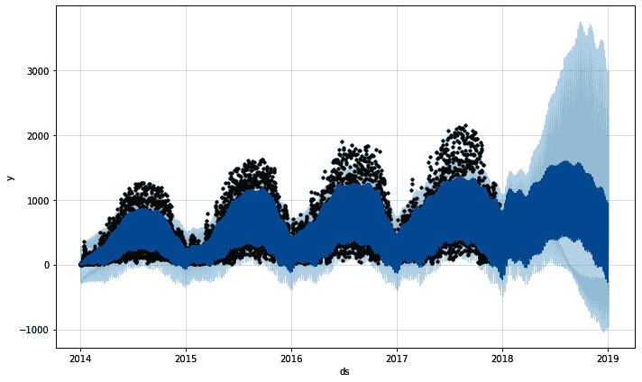

图 4.10 – 修复了常规间隔的 Divvy

预测的未来每日波动与我们的历史训练数据的幅度相同。与*图 4.8*进行对比，其中未来期间显示了更广泛的预测范围。让我们再次绘制 8 月份的相同 3 天，以将输出与*图 4.9*进行比较：

```py
fig = model.plot(forecast2, figsize=(10, 4))
plt.xlim(pd.to_datetime(['2018-08-01', '2018-08-04']))
plt.ylim(-2000, 4000)
plt.show()
```

我们看到与前文相同的时间段（上午 8 点到下午 6 点）的曲线，但这次 Prophet 只是用一条直线将它们连接起来。实际上，在我们的`forecast`数据框中，这些时间段并没有数据；Prophet 只是忽略了它们：

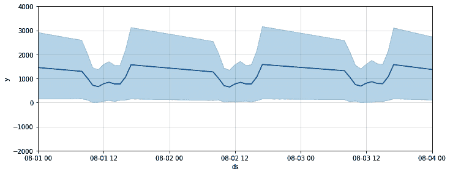

图 4.11 – 修复常规间隔后的 Divvy 3 天预测

Prophet 是一个连续时间模型，因此尽管`forecast`数据框忽略了这些排除的时间，但支撑模型的方程是连续定义的。我们可以通过使用`plot_seasonality`函数来观察这一点。这个函数包含在 Prophet 的`plot`包中，因此我们首先需要导入它。它需要两个必需的参数，即模型和一个标识要绘制的季节性的字符串，我们还传递了一个可选参数来更改图形大小：

```py
from prophet.plot import plot_seasonality
plot_seasonality(model, 'daily', figsize=(10, 3))
plt.show()
```

记住，我们没有创建一个新的模型来解决常规间隔问题；我们只是在第二次处理时从我们的`forecast`数据框中移除了那些空期。由于这两个例子中我们只使用了一个模型，当然组件是相同的。因此，我们绘制的日季节性与两个版本相同：

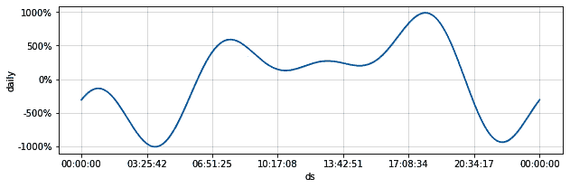

图 4.12 – Divvy 日季节性

如你所见，上午 8 点到下午 6 点的时间段与*图 4*.*9*和*图 4*.*11*都相匹配，尽管这两个图表在夜间显示了截然不同的结果。由于我们没有训练或未来数据来覆盖这个范围之外的时间，因此可以忽略日季节性图上的这些时间。它们仅仅是创建中午曲线的方程的数学上的附属品。

# 摘要

在本章中，你从你在*第二章*“使用 Prophet 入门”中构建的基本`Mauna Loa`模型中学到了经验教训，并了解了当你的数据周期不是每日时需要做出哪些改变。具体来说，你使用了`Air Passengers`数据集来模拟月度数据，并在创建`future`数据框时使用了`freq`参数来阻止 Prophet 做出每日预测。

然后，你使用了 Divvy 自行车共享计划的每小时数据来设置未来的频率为每小时，这样 Prophet 就会增加其预测时间尺度的粒度。最后，你在 Divvy 数据集中模拟了周期性缺失数据，并学习了一种不同的方法来匹配`future`数据框的日程安排与训练数据，以防止 Prophet 做出不受约束的预测。

现在你已经知道了如何处理这本书中会遇到的不同数据集，你准备好学习下一个主题了！在下一章中，你将学习所有关于季节性的知识。季节性是 Prophet 力量的核心，这是一个很大的主题，所以请做好准备！
