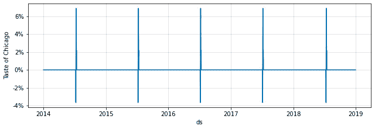

# 6

# 预测假期效应

由于 Prophet 是为了处理商业预测案例而设计的，因此包含假期效应是很重要的，这在商业活动中自然起着重要作用。就像共享单车通勤者在夏天比冬天骑得更多，或者在星期二比星期日骑得更多一样，合理地假设他们在感恩节等节日骑行的次数会少于预期。

幸运的是，Prophet 包括对在预测中包含假期效应的强大支持。此外，Prophet 用于包含假期效应的技术可以用来添加任何类似假期的活动，例如我们在本章中将要建模的食物节。

与你在上一章中学到的季节性效应类似，Prophet 包含默认的假期，你可以将其应用于你的模型，以及你可以自己创建的自定义假期。本章将涵盖这两种情况。此外，你还将学习如何使用你用于季节性的技术来控制假期效应的强度：正则化。

在本章中，你将学习如何进行以下操作：

+   添加默认国家假期

+   添加默认州或省假期

+   创建自定义假期

+   创建多日假期

+   正则化假期

# 技术要求

本章中示例的数据文件和代码可以在[`github.com/PacktPublishing/Forecasting-Time-Series-Data-with-Prophet-Second-Edition`](https://github.com/PacktPublishing/Forecasting-Time-Series-Data-with-Prophet-Second-Edition)找到。

# 添加默认国家假期

Prophet 使用 Python 的 `holidays` 包根据国家填充默认的假期列表，可选地还可以根据州或省。为了指定为哪个地区构建假期列表，Prophet 需要该国家的名称或 ISO 代码。所有可用的国家及其 ISO 代码的完整列表，以及可以包含的任何州或省，可以在包的 `README` 文件中查看：[`github.com/dr-prodigy/python-holidays#available-countries`](https://github.com/dr-prodigy/python-holidays#available-countries)。

要添加默认假期，Prophet 包含一个 `add_country_holidays` 方法，它只需提供该国家的 ISO 代码。让我们通过再次使用 Divvy 数据集的例子来演示，首先添加美国的假期，然后包括一些特定于伊利诺伊州的额外假期，因为 Divvy 位于芝加哥。

我们将像我们在本书中学习使用其他模型一样开始，通过导入必要的库，加载数据，并实例化我们的模型。正如你在*第五章*中学习的那样，*处理季节性*，我们将设置季节性模式为乘法，并将年度季节性设置为傅里叶阶数为 `4`：

```py
import pandas as pd
import matplotlib.pyplot as plt
from prophet import Prophet
df = pd.read_csv('divvy_daily.csv')
df = df[['date', 'rides']]
df['date'] = pd.to_datetime(df['date'])
df.columns = ['ds', 'y']
model = Prophet(seasonality_mode='multiplicative',
                yearly_seasonality=4)
```

下一条线就是填充模型所需的，列出美国的假日列表：

```py
model.add_country_holidays(country_name='US')
```

现在，为了完成模型，我们只需要像往常一样在训练 DataFrame 上调用 `fit`，创建我们的未来 DataFrame，然后对其调用 `predict`。我们将绘制预测和组成部分以查看我们的结果：

```py
model.fit(df)
future = model.make_future_dataframe(periods=365)
forecast = model.predict(future)
fig = model.plot(forecast)
plt.show()
```

输出的预测图看起来与 *图 5.7* 非常相似，来自 *第五章*，*处理季节性*：


图 6.1 – 包含美国假日的 Divvy 预测

然而，细心的读者可能会注意到年中和大年底附近有一些向下的峰值。为了辨别这些是什么，我们将查看以下 `components` 图：

```py
fig2 = model.plot_components(forecast)
plt.show()
```

在这些命令的输出中，趋势和每周和年度季节性再次包括在内，看起来几乎相同。然而，这里显示了一个新的图：假日，如这里所示（注意，前面的代码生成了一个完整的 `components` 图；下面的图是那个图像的裁剪）：


图 6.2 – Divvy 美国假日组成部分

这显示了 Divvy 与趋势偏离的峰值，每个峰值对应一个假日。除了每年最后一个季度发生的一个假日外，每个假日都显示出使用量的减少。让我们来调查一下。

我们可以使用此命令查看我们模型中包含的假日：

```py
model.train_holiday_names
```

这将输出一个包含索引和模型中包含的假日名称的 Python 对象：


图 6.3 – 美国假日

这些假日都包含在第二章 *入门 Prophet* 中提到的 `forecast` DataFrame 中。对于每个假日，都添加了三个新列，用于预测该假日的影响，以及不确定性的上下限，例如，`"New Year's Day"`，`"New Year's Day_lower"` 和 `"New Year's Day_upper"`。使用这些新列，我们可以通过打印 `forecast` DataFrame 中每个假日的第一个非零值来精确地看到每个假日对我们预测的影响。

为了做到这一点，让我们创建一个名为 `first_non_zero` 的快速函数。该函数接受一个 `forecast` DataFrame 和一个假日的名称；它返回该假日第一个不等于零的值。然后，我们将使用 Python 列推导式遍历每个假日名称并调用 `first_non_zero` 函数：

```py
def first_non_zero(fcst, holiday):
    return fcst[fcst[holiday] != 0][holiday].values[0]
pd.DataFrame({'holiday': model.train_holiday_names,
              'effect': [first_non_zero(forecast, holiday)
                         for holiday in \
                         model.train_holiday_names]})
```

因为 `forecast` DataFrame 的每一行都是一个日期，所以每个假日列中的大多数值都将为零，因为假日不会影响这些日期。在假日发生的日期，值将是正的，表示比预期更多的乘客，或者负的，表示乘客更少。

预测模型将每个节假日视为每年都有相同的影响，因此这个值将逐年保持不变。因为我们在这个情况下设置了`seasonality_mode='multiplicative'`，这些影响被计算为趋势的百分比偏差（只是为了说明：全局的`seasonality_mode`也会影响节假日）。下表显示了这些影响：


图 6.4 – 节假日影响值

现在，我们可以清楚地看到`哥伦布日`为 Divvy 的客流量增加了 5%。所有其他节假日都有负面影响，其中劳动节的影响最强，比趋势预测的客流量少了 69%。 

你刚刚学习到的这个过程是 Prophet 的基本节假日功能；它类似于在向 Prophet 提供没有额外参数时产生的默认季节性。它在许多情况下都工作得很好，并且通常是模型所需的所有内容。但是，正如分析师可以更精细地控制季节性影响一样，分析师可以使用几种技术来控制节假日，而不仅仅是默认设置。在下一节中，我们将介绍添加特定于州或省的节假日的流程。

# 添加默认州/省节假日

添加伊利诺伊州特有的节假日并不那么简单，因为`add_country_holidays`方法只接受一个国家参数，但不接受州或省。要添加州或省级别的节假日，我们需要使用一个新的 Prophet 函数，`make_holidays_df`。让我们在这里导入它：

```py
from prophet.make_holidays import make_holidays_df
```

这个函数接受一个年份列表作为输入，用于填充节假日，以及国家和州或省的参数。请注意，您必须在您的训练数据框中使用所有年份，以及您打算预测的所有年份。这就是为什么在下面的代码中，我们构建一个年份列表来包含训练数据框中的所有唯一年份。然后，因为我们的`make_future_dataframe`命令将为预测添加一年，我们需要扩展这个年份列表以包含一个额外的年份：

```py
year_list = df['ds'].dt.year.unique().tolist()
# Identify the final year, as an integer, and increase it by 1
year_list.append(year_list[-1] + 1)
holidays = make_holidays_df(year_list=year_list,
                            country='US',
                            state='IL')
```

在继续之前，让我们快速查看一下这个`holidays`数据框的格式，通过打印前五行：

```py
holidays.head()
```

如您从以下输出中可以看到，`holidays`数据框包含两列，`ds`和`holiday`，分别表示节假日的日期和名称：


图 6.5 – 伊利诺伊州节假日

要将这些节假日加载到我们的 Prophet 模型中，我们只需在实例化模型时传递`holidays`数据框，然后像以前一样继续：

```py
model = Prophet(seasonality_mode='multiplicative',
                yearly_seasonality=4,
                holidays=holidays)
model.fit(df)
future = model.make_future_dataframe(periods=365)
forecast = model.predict(future)
```

如果您继续调用`model.train_holiday_names`，您将看到四个特定于伊利诺伊州的额外节假日，这些节假日不是官方的美国节假日：林肯诞辰、卡西米尔·普拉斯基日、选举日和林肯诞辰（观察日）。

# 创建自定义节假日

美国的默认假日包括感恩节和圣诞节，因为它们是官方假日。然而，黑色星期五和圣诞夜可能会产生与预期趋势不同的客流量。因此，我们自然决定将它们包含在我们的预测中。

在这个例子中，我们将以与之前创建伊利诺伊州假日数据框相似的方式创建一个包含默认美国假日的数据框，然后将其添加到其中。要创建自定义假日，你只需创建一个包含两列的数据框：`holiday` 和 `ds`。像之前做的那样，它必须包括过去（至少，远至你的训练数据）和未来我们打算预测的假日所有发生情况。

在这个例子中，我们将首先创建一个包含默认美国假日的 `holidays` 数据框，并使用之前示例中的 `year_list`：

```py
holidays = make_holidays_df(year_list=year_list,
                            country='US')
```

我们将用我们自定义的假日来丰富这个默认假日的列表，因此现在我们将创建两个包含指定列（`holiday` 和 `ds`）的数据框，一个用于 `黑色星期五`，另一个用于 `平安夜`：

```py
black_friday = pd.DataFrame({'holiday': 'Black Friday',
                             'ds': pd.to_datetime(
                                 ['2014-11-28',
                                  '2015-11-27',
                                  '2016-11-25',
                                  '2017-11-24',
                                  '2018-11-23'])})
christmas_eve = pd.DataFrame({'holiday': 'Christmas Eve',
                              'ds': pd.to_datetime(
                                  ['2014-12-24',
                                   '2015-12-24',
                                   '2016-12-24',
                                   '2017-12-24',
                                   '2018-12-24'])})
```

当然，你可以创建一个只包含两个假日作为单独行的数据框，但为了清晰起见，我已经将它们分开。

最后，我们只需要将这些三个 `holiday` 数据框连接成一个：

```py
holidays = pd.concat([holidays, black_friday,
                      christmas_eve]).sort_values('ds')\
                      .reset_index(drop=True)
```

并非绝对必要对值进行排序或重置索引，就像之前代码中做的那样，但如果你想检查它，这样做会使数据框在视觉上更清晰。

在我们完成 `holidays` 数据框后，我们现在将其传递给 Prophet，就像之前处理伊利诺伊州假日时一样，并继续调用 `fit` 和 `predict`：

```py
model = Prophet(seasonality_mode='multiplicative',
                yearly_seasonality=4,
                holidays=holidays)
model.fit(df)
future = model.make_future_dataframe(periods=365)
forecast = model.predict(future)
```

现在，如果你检查 `forecast` 数据框或你的 `components` 图表，你确实会看到每年增加两个额外的假日，一个是黑色星期五，另一个是感恩节。

以这种方式创建假日允许对个别假日有更精细的控制。接下来，我们将看看你可以用来调整假日的其他一些参数。

# 创建多日假日

有时，一个假日或其他特殊事件会跨越几天。幸运的是，Prophet 通过 `window` 参数提供了处理这些场景的功能。我们之前构建的 `holidays` 数据框，用于填充之前的示例中的假日，可以包括可选的列 `'lower_window'` 和 `'upper_window'`。这些列指定了主假日之前或之后额外的天数，Prophet 将对其进行建模。

例如，在上一个例子中，我们将圣诞节和圣诞前夕建模为两个不同的节日。另一种方法就是只建模圣诞节，但包括一个`'lower_window'`参数为`1`，告诉 Prophet 将圣诞节前一天作为节日的一部分。当然，这假设圣诞前夕总是在圣诞节前一天。然而，如果圣诞前夕是一个浮动节日，并不总是立即在圣诞节之前，那么这个`window`方法就不会被使用。

每年七月，芝加哥举办一个为期 5 天的节日，称为*芝加哥美食节*。这是世界上最大的美食节，也是芝加哥任何类型最大的节日。每年有超过一百万的人参加，尝试来自近 100 个不同摊位的食物，或者每天参加受欢迎的音乐会。由于如此多的人群在城市中流动，如果它对 Divvy 的乘客量没有任何影响，那就令人惊讶了。在这个例子中，我们将芝加哥美食节建模为 5 天的节日，看看这对 Divvy 的预测有什么影响。

如前所述，我们首先创建包含默认美国假期的`holidays` DataFrame。接下来，我们创建一个`taste_of_chicago` DataFrame，将日期设置为历史数据和预测期间每年活动的第一天。然而，与前一个例子不同的是，我们还包含了`'lower_window'`和`'upper_window'`列，将下限设置为`0`（因此我们不包含活动第一天之前的日期），上限设置为`4`（这包括活动第一天之后的四天，总共五天）。然后，我们按照以下方式将 DataFrame 连接在一起：

```py
holidays = make_holidays_df(year_list=year_list,
                            country='US')
taste_of_chicago = \
pd.DataFrame({'holiday':'Taste of Chicago',
              'ds': pd.to_datetime(['2014-07-09',
                                    '2015-07-08',
                                    '2016-07-06',
                                    '2017-07-05',
                                    '2018-07-11']),
              'lower_window': 0,
              'upper_window': 4})
holidays = pd.concat([holidays, taste_of_chicago])\
                     .sort_values('ds')\
                     .reset_index(drop=True)
```

现在，让我们看一下 DataFrame 的前 10 行：

```py
holidays.head(10)
```

在输出中，我们可以看到额外的列，以及`Taste of Chicago`假期的包含：


图 6.6 – 带窗口的节日

小贴士

如果你对前面表格中的`NaN`值不熟悉，它代表*非数字*。在这种情况下，它只是一个占位符，没有任何影响。

现在，我们将继续拟合我们的模型：

```py
model = Prophet(seasonality_mode='multiplicative',
                yearly_seasonality=4,
                holidays=holidays)
model.fit(df)
future = model.make_future_dataframe(periods=365)
forecast = model.predict(future)
```

要查看`Taste of Chicago`对 Divvy 乘客量的影响，让我们看一下带有此`print`语句的`forecast` DataFrame：

```py
print(forecast[forecast['ds'].isin(['2018-07-11',
                                    '2018-07-12',
                                    '2018-07-13',
                                    '2018-07-14',
                                    '2018-07-15']
                                  )][['ds',
                                      'Taste of Chicago']])
```

输出是`forecast` DataFrame 的内容，但仅限于 2018 年活动的五天，以及日期和`Taste of Chicago`对乘客量的影响列：


图 6.7 – 芝加哥美食节对乘客量的影响

我们可以看到，活动的第一天比没有活动时预期的客流量少了 3.6%，第二天多了 1.9%，第三天多了 6.8%。最后两天都有大约 2%的客流量增加。这些数字的幅度可能不像您预期的那么大，尤其是 7 月 4 日导致客流量减少了 55%。而且，考虑到其中一个是负数，另一个是正数，这个结果可能不是一个有意义的信号，而是仅仅由于随机噪声。在*第十一章*，*管理不确定性区间*中，您将学习如何验证这个结果是否有意义。

然而，我们可以使用 Prophet 的`plot`包中的`plot_forecast_component`函数仅可视化这个假日影响。我们首先需要导入它：

```py
from prophet.plot import plot_forecast_component
```

该函数需要第一个参数是模型，第二个参数是`forecast` DataFrame，第三个参数是一个字符串，用于命名要绘制的组件；这里，我们将使用`'Taste of Chicago'`：

```py
fig3 = plot_forecast_component(model,
                               forecast,
                               'Taste of Chicago',
                               figsize=(10.5, 3.25))
plt.show()
```

在输出中，我们可以可视化*图 6.7*中显示的表格（这次，我们显示所有年份）：



图 6.8 – 芝加哥风味假日影响

活动的第一天显示客流量减少，接下来的四天客流量增加。现在我们已经了解了您可以将假日添加到预测中的各种方法，让我们再看看一个用于控制假日影响的工具：正则化。

# 正则化假日

将模型的灵活性约束以帮助它更好地泛化到新数据的过程被称为**正则化**。*第五章*，*处理季节性*，在 Prophet 中详细讨论了正则化季节性影响。在 Prophet 下，正则化假日和季节性影响的数学过程是相同的，因此我们可以使用季节性章节中的相同概念并将其应用于假日。

通常，如果您作为分析师发现您的假日对模型的影响比您预期的更大，也就是说，如果它们的绝对幅度高于您认为准确或必要来建模您的问题，那么您将想要考虑正则化。正则化将简单地压缩假日影响的幅度，并禁止它们产生比其他情况下更大的影响。Prophet 包含一个`holidays_prior_scale`参数来控制这一点。

这与我们在上一章中用于正则化季节性的`seasonality_prior_scale`参数背后的理论是相同的。正如季节性可以全局或局部正则化一样，假日也可以。让我们看看如何做到这一点。

## 全球假日正则化

Prophet 实际上有一个默认的先验概率分布，用于猜测节假日可能产生的影响，并使用这个分布来尝试找到最佳拟合数据的价值。然而，如果这个先验猜测范围与现实相差甚远，Prophet 将难以找到最佳值。你可以通过提供有关预期哪些值的信息来极大地帮助它，这样它就可以更新其先验分布以更好地指导猜测。修改节假日先验尺度就是向 Prophet 提供这种额外信息的方式。

对于`holidays_prior_scale`的值，不幸的是，它们并没有太多直观的意义。它们与 lasso 回归中的`正则化`参数类似，因为它们控制了收缩量。然而，你只需要记住，较小的值意味着更少的灵活性——节假日效应将通过更多的正则化而减弱。默认情况下，Prophet 将此值设置为 10。合理的值范围从 10 降至大约 0.001。

然而，每个数据集都是不同的，所以你会发现实验将非常有帮助，但就像季节性的先验尺度一样，你会发现大多数情况下，节假日先验尺度在 10 到 0.01 之间将工作得很好。为了看到这个变量的效果，让我们使用默认值 10 和一个更小的值 0.05 构建一个模型。

让我们也使用我们在绘制`芝加哥美食节`事件时了解到的`plot_forecast_component`函数，但这次，将`'节假日'`成分传递给它，以绘制所有综合的节假日效应。首先，我们使用默认的先验尺度值构建模型（在这里，我们明确将其设置为`10`以增强清晰度），然后仅绘制`节假日`成分以查看节假日效应：

```py
model = Prophet(seasonality_mode='multiplicative',
                yearly_seasonality=4,
                holidays_prior_scale=10)
model.add_country_holidays(country_name='US')
model.fit(df)
future = model.make_future_dataframe(periods=365)
forecast = model.predict(future)
fig = plot_forecast_component(model, forecast, 'holidays')
plt.show()
```

那段代码的输出将仅仅是`节假日`成分：


图 6.9 – 无正则化的节假日成分

在没有正则化的情况下，感恩节（*图 6.9* 中最长的条形，我们在本章前面发现其对所有节日的效应最强）将乘客量减少了大约 65%。

现在，让我们构建另一个模型，除了具有强正则化之外，其他方面都相同，并绘制`节假日`成分：

```py
model = Prophet(seasonality_mode='multiplicative',
                yearly_seasonality=4,
                holidays_prior_scale=0.05)
model.add_country_holidays(country_name='US')
model.fit(df)
future = model.make_future_dataframe(periods=365)
forecast = model.predict(future)
fig = plot_forecast_component(model, forecast, 'holidays')
plt.show()
```

再次，我们使用了`plot_forecast_component`函数来仅显示`节假日`成分：


图 6.10 – 强正则化的节假日成分

当进行规范化时，图表看起来与未规范化的假日图表相似，但有一些不同。首先，我们看到尺度变化很大。当规范化时，最强的假日效应是乘客量减少了 11.5%，而未规范化的模型中减少了 65%。要注意的第二件事是假日并没有按相同的比例减少：现在，圣诞节的效果最强，而不是感恩节。这不是错误，只是这么多变量相互作用时规范化的效果。

选择先验尺度的值可能更像是一门艺术而非科学。如果你认为假日的效应比你直觉所暗示的更强或更弱，你可以使用你的领域知识来调整这个值。如果有疑问，进行实验并看看什么效果最好。最严谨的方法是使用网格搜索和交叉验证，这个话题我们将在本书的结尾部分进行介绍。

使用我们之前使用的`holidays_prior_scale`参数调整所有假日是全球性的；每个假日都是按相同的方式规范化的。为了有更多的控制，Prophet 提供了通过自定义假日接口调整每个个别假日先验尺度的功能。在下一个例子中，我们将看到如何做到这一点。

## 个人假日规范化

当添加一个新的假日时，我们创建了一个包含两个必需列`ds`和`holiday`以及两个可选列`lower_window`和`upper_window`的数据框。我们还可以在这个数据框中包含一个最终的可选列，即`prior_scale`。如果任何假日在这个列中没有值（或者如果这个列在数据框中甚至不存在），那么假日将回退到我们在上一个例子中看到的全局`holidays_prior_scale`值。在下面的例子中，我们将添加这个列并单独修改一些假日的先验尺度。

正如我们之前所做的那样，我们将构建默认的假日列表并添加一些额外的假日。这次，我们将添加`Black Friday`和`圣诞节前夕`，先验尺度为`1`，以及`芝加哥美食节`5 天的活动，先验尺度为`0.1`。所有其他假日将保持默认的先验尺度`10`。首先，我们将使用之前创建的相同的`year_list`来创建我们的`holidays`数据框：

```py
holidays = make_holidays_df(year_list=year_list,
                            country='US')
```

这是 Prophet 为美国提供的默认假日列表；我们希望用我们额外的三个假日来丰富这个列表，所以现在我们将为每个假日创建一个数据框。请注意，我们为每个假日指定了`'prior_scale'`：

```py
black_friday = pd.DataFrame({'holiday': 'Black Friday',
                             'ds': pd.to_datetime(
                                 ['2014-11-28',
                                  '2015-11-27',
                                  '2016-11-25',
                                  '2017-11-24',
                                  '2018-11-23']),
                             'prior_scale': 1})
christmas_eve = pd.DataFrame({'holiday': 'Christmas Eve',
                              'ds': pd.to_datetime(
                                  ['2014-12-24',
                                   '2015-12-24',
                                   '2016-12-24',
                                   '2017-12-24',
                                   '2018-12-24']),
                              'prior_scale': 1})
taste_of_chicago = \
pd.DataFrame({'holiday': 'Taste of Chicago',
              'ds': pd.to_datetime(['2014-07-09',
                                    '2015-07-08',
                                    '2016-07-06',
                                    '2017-07-05',
                                    '2018-07-11']),
              'lower_window': 0,
              'upper_window': 4,
              'prior_scale': 0.1})
```

最后一步是将这四个数据框合并：

```py
holidays = pd.concat([holidays,
                      black_friday,
                      christmas_eve,
                      taste_of_chicago]
                    ).sort_values('ds')\
                     .reset_index(drop=True)
```

在`Black Friday`、`圣诞节前夕`和`芝加哥美食节`的数据框中，我们添加了额外的`prior_scale`列。让我们打印`holidays`数据框的前 16 行来确认这一点：

```py
holidays.head(16)
```

如下表所示，我们有 10 个默认假日，没有添加先验尺度或窗口。我们有`芝加哥美食节`活动，上限窗口为 4 天，先验尺度为`0.1`。`黑色星期五`和`平安夜`的先验尺度均为`1`。当 Prophet 构建模型时，如果缺失，它将应用默认的先验尺度。记住，`NaN`，代表*非数字*，在这种情况下意味着一个空单元格：


图 6.11 – 带有先验尺度的假日

在我们构建了`holidays` DataFrame 之后，我们只需继续实例化我们的模型，对其进行拟合，并预测以构建预测：

```py
model = Prophet(seasonality_mode='multiplicative',
                yearly_seasonality=4,
                holidays=holidays,
                holidays_prior_scale=10)
model.fit(df)
future = model.make_future_dataframe(periods=365)
forecast = model.predict(future)
```

现在已经创建了`forecast` DataFrame，你可以使用到目前为止所学的绘图工具进行实验，以探索结果。

选择适当的先验尺度，对于假日和季节性来说，有时可能很困难。Prophet 的默认值在大多数情况下都工作得非常好，但有时你可能需要更改它们，并且很难找到最佳值。在这些情况下，交叉验证是你的最佳方法。你将在*第十三章*中学习如何使用交叉验证以及适当的性能指标来优化你的 Prophet 模型，*评估性能指标*。

# 摘要

在本章中，你首先学习了如何添加一个国家的默认假日，然后通过添加任何州或省的假日进一步深入。之后，你学习了如何添加自定义假日，并将这种技术扩展到调整跨越多天的假日。最后，你学习了正则化的概念以及它是如何用于控制过拟合的，以及如何将其全局应用于模型中的所有假日或更细致地通过为每个单独的假日指定不同的正则化来实现。

假日往往会导致时间序列出现巨大的峰值，忽略它们的影响将导致 Prophet 在预测结果中表现非常糟糕。本章中的工具将允许你的模型适应这些外部事件，并提供一种预测未来影响的方法。

在下一章中，我们将探讨 Prophet 中可用的不同增长模式。到目前为止，我们所有的模型都采用了线性增长，但在你的预测工作中可能会遇到不止这一种模式！
