# 7

# 控制增长模式

到目前为止，在这本书中，我们构建的每一个预测都只遵循一种增长模式：**线性**。趋势有时会有一些小的弯曲，斜率要么增加要么减少，但本质上，趋势由线性段组成。然而，Prophet 有另外两种增长模式：**逻辑**和**平坦**。

使用非最佳增长模式对时间序列进行建模通常可以很好地拟合实际数据。但，正如你将在本章中看到的，即使拟合是现实的，未来的预测也可能变得非常不现实。有时，数据的形状会告诉我们选择哪种增长模式，有时你需要领域知识和一点常识。本章将帮助你做出适当的选择。此外，你将学习何时以及如何应用这些不同的增长模式。具体来说，本章将涵盖以下内容：

+   应用线性增长

+   理解逻辑函数

+   满足预测

+   应用平坦增长

+   创建自定义趋势

# 技术要求

本章中示例的数据文件和代码可以在[`github.com/PacktPublishing/Forecasting-Time-Series-Data-with-Prophet-Second-Edition`](https://github.com/PacktPublishing/Forecasting-Time-Series-Data-with-Prophet-Second-Edition)找到。

# 应用线性增长

我们在前几章中构建的所有模型都默认使用线性增长模式。这意味着趋势由一条直线或几条直线组成，这些直线在变化点处相连——我们将在*第八章*，*影响趋势变化点*中探讨这种情况。然而，现在，让我们再次加载我们的 Divvy 数据并专注于增长。

我们将再次导入`pandas`、`matplotlib`和`Prophet`，但这次，我们还将从 Prophet 的`plot`包中导入一个新函数，`add_changepoints_to_plot`，如下所示：

```py
import pandas as pd
import matplotlib.pyplot as plt
from prophet import Prophet
from prophet.plot import add_changepoints_to_plot
```

这个新功能将使我们能够轻松地将我们的趋势线直接绘制在我们的预测图中。

正如我们之前所做的那样，让我们打开 Divvy 数据并将其加载到我们的训练 DataFrame 中：

```py
df = pd.read_csv('divvy_daily.csv')
df = df[['date', 'rides']]
df['date'] = pd.to_datetime(df['date'])
df.columns = ['ds', 'y']
```

我们已经在*第五章*，*处理季节性*中了解到，这个数据集应该用乘法季节性来建模，并且通过将傅里叶阶数设置为`4`来稍微约束年度季节性。我们将在实例化我们的模型时设置这些值。我们还将明确设置`growth='linear'`。这是默认值，之前我们只是隐式地接受它，但为了清晰起见，我们在这里包括它：

```py
model = Prophet(growth='linear',
                seasonality_mode='multiplicative',
                yearly_seasonality=4)
```

正如我们在*第五章*，*处理季节性*中建模每日 Divvy 数据时所做的，接下来，我们将拟合模型，构建一个包含一年预测的`future` DataFrame，预测未来值，并绘制预测图。然而，这次我们将使用`add_changepoints_to_plot`函数。

函数要求我们指定要使用哪个绘图坐标轴，识别我们创建的模型，以及识别从`predict`方法输出的预测 DataFrame。对于坐标轴，我们使用 Matplotlib 的`gca`方法，即获取当前坐标轴，并在绘制预测时创建的图上调用它。你可以在以下代码中看到语法。我们在这里只使用绘图变化点函数来绘制趋势，所以我们现在将使用`cp_linestyle=''`移除变化点标记：

```py
model.fit(df)
future = model.make_future_dataframe(periods=365)
forecast = model.predict(future)
fig = model.plot(forecast)
add_changepoints_to_plot(fig.gca(), model, forecast,
                         cp_linestyle='')
plt.show()
```

作为输出，你现在应该看到与*图 5**.8*中类似的预测，但这次，趋势线将叠加在图上：

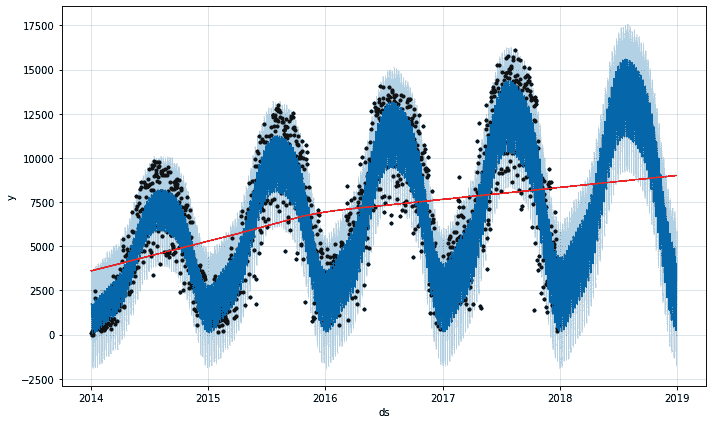

图 7.1 – 带趋势的 Divvy 预测

记住，Prophet 是一个加性回归模型。因此，趋势是我们预测的最基本构建块。我们通过添加季节性、假日和额外的回归因子来增加其细节和变化。前面图中（穿过每个正弦周期中点的实线）的趋势是去除季节性的 Divvy 图（在这个例子中我们从未添加过假日）。

如你所见，趋势是从**2014**年到晚**2015**年的直线段，然后是轻微的弯曲和另一个斜率较浅的直线段，从**2016**年开始。尽管有这个弯曲，它本质上还是线性的。

现在我们来看下一个增长模式，逻辑增长。要理解这种增长模式，你首先需要了解逻辑函数。

# 理解逻辑函数

**逻辑函数**生成一个 S 形曲线；方程具有以下形式：

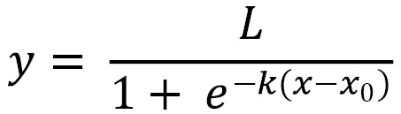

在这里，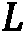是曲线的最大值，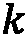是曲线的逻辑增长率或陡度，而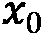是曲线中点的*x*值。

以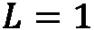，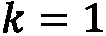，和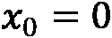为例，逻辑函数产生了**标准逻辑函数**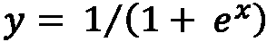，如下面的图中所示：


图 7.2 – 标准逻辑函数

如果你研究过逻辑回归或神经网络，你可能认出这实际上是**S 形函数**。任何从-∞到∞的输入值*x*，都会被压缩到 0 到 1 之间的输出值*y*。这个方程使得逻辑回归模型能够接受任何输入值并输出 0 到 1 之间的概率。

该方程由比利时数学家皮埃尔·弗朗索瓦·弗赫尔斯特（Pierre François Verhulst）在 1838 年至 1847 年间发表的三篇论文中开发。弗赫尔斯特正在努力模拟比利时的种群增长。

种群增长大致遵循一个初始的指数增长速率，然后是一个线性（也称为算术）增长速率，直到种群达到饱和点，此时增长速度减慢至零。这就是你在前面的图表中看到的形状，从曲线的中点开始向右移动。Verhulst 发明了“逻辑”这个词，与“算术”和“几何”类似，但源自“对数”。不要将这个词与“后勤”混淆，它指的是处理细节。它们有完全不同的起源。

预言者的逻辑增长模式遵循这条一般曲线。曲线的**饱和**水平是曲线渐近接近的上限和下限。

除了在统计学和机器学习中的应用，其中逻辑曲线用于逻辑回归和神经网络，逻辑函数也常用于模拟人口增长，无论是人类（如 Verhulst 的比利时）还是动物，正如我们在本章中所做的那样。它常用于医学中模拟肿瘤的生长、感染者的细菌或病毒载量，或在流行病期间人们的感染率。

在经济学和社会学中，该曲线用于描述新创新的采用率。语言学家用它来模拟语言变化。它甚至可以用来模拟谣言或新观点在整个群体中的传播。

让我们看看如何在 Prophet 中应用这一点。

# 满足预测

在 19 世纪初，美国向西扩张使许多定居者和他们的牲畜与本土狼群接触。这些狼开始捕食家畜，这导致定居者为了保护自己的动物而猎杀和杀死狼。灰狼仍然存在于这片土地上（当它在 1872 年建立时成为黄石国家公园），但在接下来的几十年里，它们在该地区以及下 48 个州几乎被猎杀至灭绝。

在 20 世纪 60 年代，公众开始理解生态系统和物种之间相互联系的概念，1975 年，决定将狼群恢复到黄石公园，1995 年最终有 31 只灰狼从加拿大迁移到公园，这为公园内自然种群增长提供了一个几乎完美的实验。

我们将在接下来的几个例子中查看这个种群。然而，我们将使用模拟数据，因为真实数据在历史记录中分布不均。由于狼倾向于避免与人类接触，它们的数量计数永远无法精确，因此缺乏准确的数据。此外，还有许多复合因素（例如天气）我们不会建模（而且通常是不可预测的）。

为了理解这些复合因素，考虑一下密歇根湖苏必利尔湖上的伊莎贝拉皇家岛上的例子，自 1959 年以来，该岛上的驼鹿和狼种群一直处于持续研究之中。这实际上是世界上任何捕食者-猎物种群系统的最长连续研究。如下面的图表所示，这至少不是一个可预测的系统：

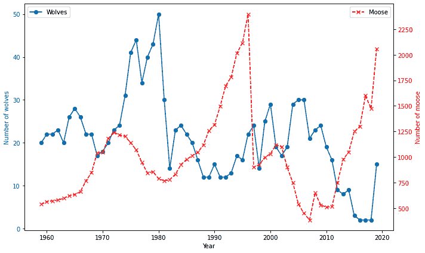

图 7.3 – 伊莎贝拉皇家岛上的狼和驼鹿的种群数量

在 20 世纪 60 年代和 70 年代，不断增长的驼鹿种群提供了食物，这允许狼群数量翻倍。但在 1980 年，人类意外引入了犬细小病毒，这种疾病导致狼群数量崩溃。随着其唯一捕食者的数量下降，驼鹿种群再次增加，但于 1996 年在创纪录的最严重冬季和不可预测的驼鹿蜱虫爆发双重压力下崩溃。

在 20 世纪 90 年代，狼群数量过低，无法进行健康繁殖，导致近亲繁殖水平极高，这抑制了它们的种群数量，直到 1990 年代末一只狼通过穿越来自加拿大的冬季冰层到达岛屿时，种群数量才有所回升。此后，尽管驼鹿数量下降，狼群数量在整个 21 世纪初仍然在增加。所有这些都说明，小型、孤立种群代表一个非常动态的系统，当它们不与自然外部事件隔离时，无法准确预测。

## 增加逻辑增长

为了在黄石公园合成一个相对现实的狼群种群，让我们假设 1995 年引入了 100 只狼。公园生态学家对该地区进行了调查，并确定这片土地可以支持总共 500 只狼的种群。

在线性增长示例中，我们导入了`pandas`、`matplotlib`、`Prophet`和`add_changepoints_to_plot`函数，因此为了继续，我们只需要导入`numpy`和`random`库来创建我们的数据集。务必设置随机种子，以确保每次运行代码时我们都得到相同的伪随机结果：

```py
import numpy as np
import random
random.seed(42)  # set random seed for repeatability
```

我们将通过首先创建一系列从 1995 年到 2004 年的月度日期来模拟狼群数量。在每一个日期，我们将从我们的逻辑方程中计算出输出。然后，我们将添加一些正弦变化来考虑年度季节性，最后，一些随机噪声。然后，我们只需要将我们的曲线放大：

```py
x = pd.to_datetime(pd.date_range('1995-01', '2004-02',
                                 freq='M')\
                   .strftime("%Y-%b").tolist())
y = [1 / (1 + np.e ** (-.03 * (val - 50))) for val in \
     range(len(x))]  # create logistic curve
# add sinusoidal variation
y = [y[idx] + y[idx] * .01 * np.sin((idx - 2) * (360 / 12)\
     * (np.pi / 180)) for idx in range(len(y))]
# add noise
y = [val + random.uniform(-.01, .01) for val in y]
y = [int(500 * val) for val in y]  # scale up
```

让我们绘制曲线以确保一切如预期进行：

```py
plt.figure(figsize=(10, 6))
plt.plot(x, y)
plt.show()
```

如果一切顺利，你应该会看到这个图表：

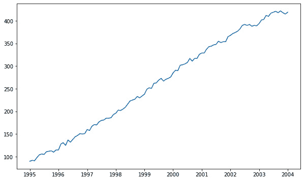

图 7.4 – 黄石公园模拟的狼群数量

让我们从拟合一个具有线性增长的 Prophet 模型开始分析这些数据。这个例子将演示在选择不适当增长模式时可能会出现什么问题。

### 使用线性增长建模

正如我们之前所做的那样，我们首先将我们的数据组织到一个 DataFrame 中，用于 Prophet：

```py
df = pd.DataFrame({'ds': pd.to_datetime(x), 'y': y})
```

除了线性增长外，让我们将年季节性的傅里叶阶数设置为`3`，并将季节性模式设置为`乘法`。然后，我们拟合我们的 DataFrame 并创建`future` DataFrame。我们以月度频率模拟了这些数据，所以我们将预测`10`年并将`freq='M'`。在预测未来之后，我们将绘制预测图，并使用`add_changepoints_to_plot`函数来叠加趋势：

```py
model = Prophet(growth='linear',
                yearly_seasonality=3,
                seasonality_mode='multiplicative')
model.fit(df)
future = model.make_future_dataframe(periods=12 * 10,
                                     freq='M')
forecast = model.predict(future)
fig = model.plot(forecast)
add_changepoints_to_plot(fig.gca(), model, forecast,
                         cp_linestyle='')
plt.show()
```

立刻，你应该看到在预测将自然饱和在某个水平的情况下使用线性趋势会出现什么问题。预测值将随着预测时间周期的延长而不断上升，趋向于无穷大：

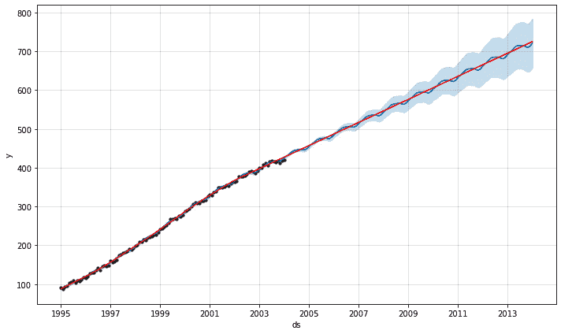

图 7.5 – 使用线性增长的狼群数量预测

显然，这是不现实的。狼能吃的食物是有限的；在某个点上，食物将不足，狼将开始饿死。现在让我们用逻辑增长来模拟这种情况，看看会发生什么。

### 使用逻辑增长建模

使用`cap`并在我们的`future` DataFrame 中模拟它。

通常，确定上限可能会带来一些困难。如果你的曲线已经接近饱和水平，你可以更好地看到它接近的值并选择它。然而，如果没有，那么一点领域知识将真正是你的最佳解决方案。在你可以建模逻辑增长率之前，你必须对饱和水平最终在哪里有一些想法。通常，这个上限是使用数据或对市场规模有特殊专业知识来设置的。在我们的例子中，我们将上限设置为`500`，因为这是生态学家估计的值：

```py
df['cap'] = 500
```

接下来，我们继续像上一个例子中那样做，但这次，在拟合和创建`future` DataFrame 之前，让我们将增长模式设置为`logistic`：

```py
model = Prophet(growth='logistic',
                yearly_seasonality=3,
                seasonality_mode='multiplicative')
model.fit(df)
future = model.make_future_dataframe(periods=12 * 10,
                                     freq='M')
```

我们还需要将上限添加到我们的`future` DataFrame 中：

```py
future['cap'] = 500
```

现在，当我们预测并绘制预测图时，你会看到一个非常不同形状的曲线：

```py
forecast = model.predict(future)
fig = model.plot(forecast)
add_changepoints_to_plot(fig.gca(), model, forecast,
                         cp_linestyle='')
plt.show()
```

默认情况下，Prophet 将上限（如果有，则还包括下限）显示为你的图表中的水平虚线：

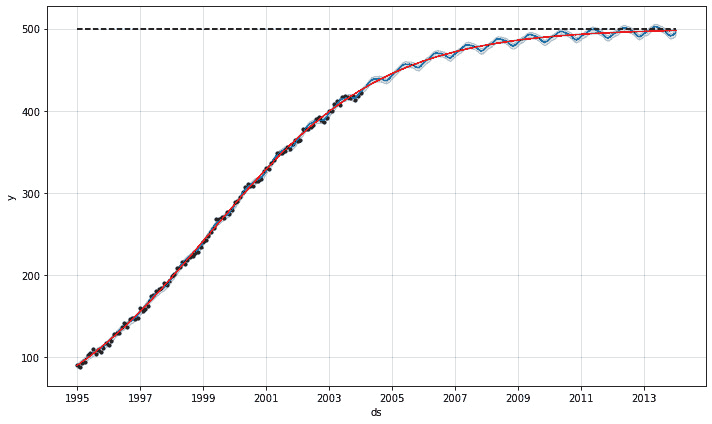

图 7.6 – 使用逻辑增长的狼群数量预测

在逻辑增长的情况下，狼群的数量被允许以大致相同的速率增长数年。当它接近饱和点，即自然资源能够支持的最大人口时，增长率会放缓。在此之后，增长率保持平稳，仅略有季节性变化，因为老狼在冬春季节死亡，而春季幼狼出生。

## 非常数上限

重要的是要注意，上限值不一定需要是恒定的。例如，如果你在预测销售额，你的饱和极限将是市场大小。但这个市场大小可能会随着各种因素导致更多消费者考虑购买你的产品而增长。让我们快速看一下如何建模这个例子。我们假设黄石公园的狼群数量受到公园大小的限制。现在，让我们创建一个假设情况，从 2007 年开始，公园大小逐渐增加，创造条件允许每月增加两只狼。

让我们创建一个函数来设置上限。对于 2007 年之前的日期，我们将保持公园的饱和极限为`500`。然而，对于所有从 2007 年开始的日期，我们将每月增加上限两只：

```py
def set_cap(row, df):
    if row.year < 2007:
        return 500
    else:
        pop_2007 = 500
        idx_2007 = df[df['ds'].dt.year == 2007].index[0]
        idx_date = df[df['ds'] == row].index[0]
        return pop_2007 + 2 * (idx_date - idx_2007)
```

现在，让我们为我们的训练 DataFrame，`df`，设置上限：

```py
df['cap'] = df['ds'].apply(set_cap, args=(df,))
```

上限应该在整个过程中保持为`500`，因为我们的训练数据在 2004 年结束。现在，让我们像以前一样创建我们的模型，但使用`set_cap`函数设置我们的`future` DataFrame：

```py
model = Prophet(growth='logistic',
                yearly_seasonality=3,
                seasonality_mode='multiplicative')
model.fit(df)
future = model.make_future_dataframe(periods=12 * 10,
                                     freq='M')
future['cap'] = future['ds'].apply(set_cap, args=(future,))
forecast = model.predict(future)
fig = model.plot(forecast)
add_changepoints_to_plot(fig.gca(), model, forecast,
                          cp_linestyle='')
plt.show()
```

现在，你可以看到狼群数量正在趋向于我们不断增加的上限：

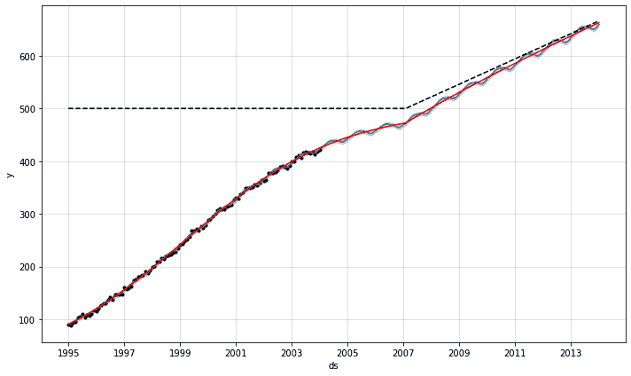

图 7.7 – 非恒定上限下的狼群数量预测

上限是针对 DataFrame 中的每一行设置的值；对于每个日期，你可以设置任何有意义的值。上限可能是恒定的，就像我们的第一个例子一样，它可能线性变化，就像我们在这里所做的那样，或者它可能遵循你选择的任何任意曲线。

现在，让我们看看相反的情况，一个假设的情况，狼群数量正在悲哀地下降，并接近灭绝。

## 下降的指数增长

在这个例子中，唯一的区别是我们必须除了`cap`值外，还要声明一个`floor`值。让我们构建另一个伪随机数据集，但具有负增长：

```py
x = pd.to_datetime(pd.date_range('1995-01','2035-02',
                                 freq='M')\
                   .strftime("%Y-%b").tolist())
y = [1 - 1 / (1 + np.e ** (-.03 * (val - 50))) for val in \
     range(len(x))]  # create logistic curve
# add sinusoidal variation
y = [y[idx] + y[idx] * .05 * np.sin((idx - 2) * (360 / 12)\
     * (np.pi / 180)) for idx in range(len(y))]
# add noise
y = [val + 5 * val * random.uniform(-.01, .01) for val \
     in y]
y = [int(500 * val) for val in y]  # scale up
plt.figure(figsize=(10, 6))
plt.plot(x, y)
plt.show()
```

增长曲线应该看起来像这样：

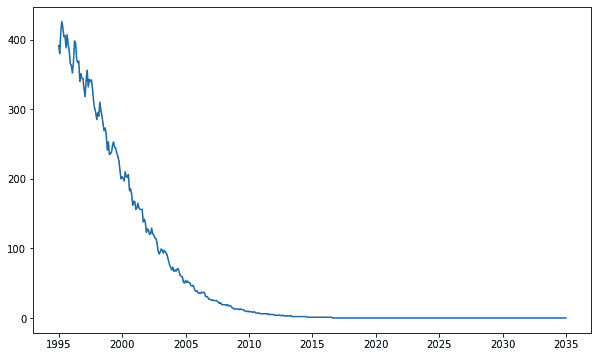

图 7.8 – 黄石公园模拟的狼群数量下降

在本例的预测中，我们将数据截断到`2006`年，并尝试预测狼群数量何时会降至零。在创建我们的 DataFrame 时，我们指定了与之前相同的`cap`值，以及一个`floor`值：

```py
df2 = pd.DataFrame({'ds': pd.to_datetime(x), 'y': y})
df2 = df2[df2['ds'].dt.year < 2006]
df2['cap'] = 500
df2['floor'] = 0
```

我们将一步完成模型。一切与之前的例子相同，只是这次我们在`future` DataFrame 中也设置了`floor`：

```py
model = Prophet(growth='logistic',
                yearly_seasonality=3,
                seasonality_mode='multiplicative')
model.fit(df2)
future = model.make_future_dataframe(periods=12 * 10,
                                     freq='M')
future['cap'] = 500
future['floor'] = 0
forecast = model.predict(future)
fig = model.plot(forecast)
add_changepoints_to_plot(fig.gca(), model, forecast,
                         cp_linestyle='')
plt.show()
```

毫不奇怪，Prophet 可以轻松处理这种情况：

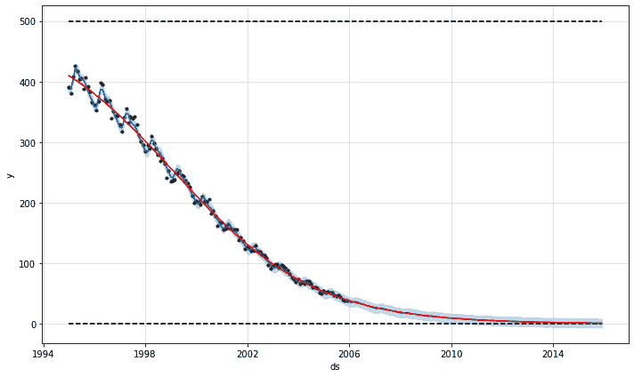

图 7.9 – 下降的指数增长下的狼群数量预测

Prophet 将预测精确的小数值，当然，狼的数量是整数，但这个图表显示，在 2010 年和 2014 年之间，狼群将灭绝。在现实场景中，最后几只剩余的狼是否是繁殖对的一部分也非常重要，但我们在这里忽略了这个因素。

注意，因为我们已经指定了上限和下限，Prophet 将它们都绘制为水平虚线。当逻辑增长下降时，即使没有相关的上限，就像这里的情况一样，你也必须在你的模型中包含它。你可以选择一个任意高的上限，这对你的模型没有影响，但请注意，它将被包含在你的图表中，可能会使 Prophet 的预测看起来非常低。

然而，你可以通过包括`plot_cap`参数来将其排除在图表之外，就像这里所做的那样：`fig = model.plot(forecast, plot_cap=False)`，这会修改上限和下限。Prophet 目前不支持从你的图表中排除其中一个。

Prophet 目前支持一种更多增长模式：**无增长（或平稳）**。然而，Prophet 团队在撰写本文时正在努力开发其他模式，这些模式可能很快就会可用，所以请密切关注文档。让我们看看这种最终的增长模式。

# 应用平稳增长

**平稳增长**是指趋势线在整个数据中完全恒定。数据值的不同仅由于季节性、假日、额外回归因子或噪声。要了解如何建模平稳增长，让我们继续使用我们的狼群数据，但这次，考虑远期未来，当人口已经完全稳定时。

让我们先创建一个新的数据集——本质上与我们的逻辑增长数据集相同，但时间跨度更长：

```py
x = pd.to_datetime(pd.date_range('1995-01','2096-02',
                                 freq='M')\
                   .strftime("%Y-%b").tolist())
# create logistic curve
y = [1 / (1 + np.e ** (-.03 * (val - 50))) for val in \
     range(len(x))]
 # add sinusoidal variation
y = [y[idx] + y[idx] * .01 * np.sin((idx - 2) * (360 / 12)\
     * (np.pi / 180)) for idx in range(len(y))]
# add noise
y = [val + 1 * val * random.uniform(-.01, .01) for val \
     in y]
y = [int(500 * val) for val in y]  # scale up
plt.figure(figsize=(10, 6))
plt.plot(x, y)
plt.show()
```

我们现在正在展望从狼群被重新引入公园的一个世纪之后：

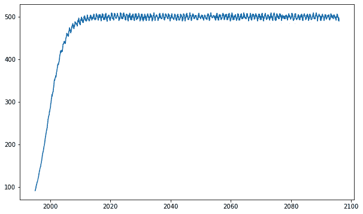

图 7.10 – 一个世纪内的模拟狼群人口

经过这么长时间，狼群已经达到饱和点并完全稳定。我们现在将创建我们的训练数据框，但然后只限制我们的数据到范围的最后十年，那里的整体趋势已经很好地饱和：

```py
df = pd.DataFrame({'ds': pd.to_datetime(x), 'y': y})
df = df[df['ds'].dt.year > 2085]
plt.figure(figsize=(10, 6))
plt.plot(df['ds'], df['y'])
plt.show()
```

绘制这些数据应显示没有整体增长，只是非常嘈杂的季节性：

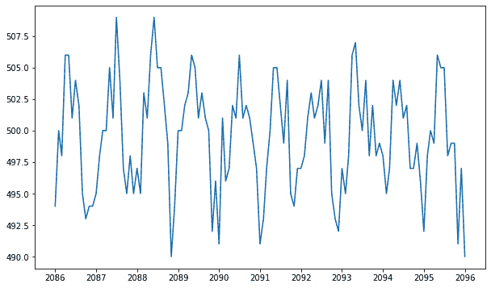

图 7.11 – 模拟的稳定狼群人口

让我们首先使用默认的线性增长来看看可能会出错：

```py
model = Prophet(growth='linear',
                yearly_seasonality=3,
                seasonality_mode='multiplicative')
model.fit(df)
future = model.make_future_dataframe(periods=12 * 10,
                                     freq='M')
forecast = model.predict(future)
fig = model.plot(forecast)
add_changepoints_to_plot(fig.gca(), model, forecast,
                         cp_linestyle='')
plt.show()
```

由于数据中的随机噪声，Prophet 会在看似存在趋势的短暂区域找到趋势，无论是正的还是负的。如果这些时期发生在训练数据的末尾，那么这条曲线将延续到整个预测的未来数据的输出：

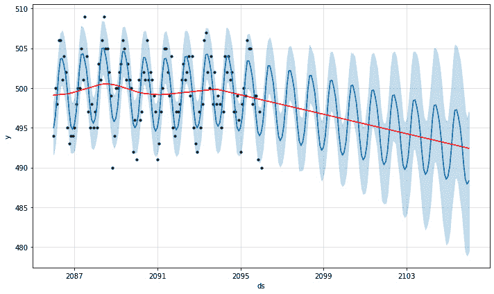

图 7.12 – 使用线性增长的稳定狼群人口预测

如您所见，Prophet 预测狼群数量正在减少，尽管它相当稳定。此外，不确定性区间正在扩大；Prophet 足够聪明，知道这并不完全正确。现在让我们用平稳增长来正确地建模。由于趋势将是恒定的，设置季节性模式是不相关的。它仍然会被计算为加法或乘法，但无论哪种情况，最终结果都将相同。我们在这里将忽略它。

在模型实例化期间设置`growth='flat'`即可创建具有平稳增长的模型：

```py
model = Prophet(growth='flat',
                yearly_seasonality=3)
model.fit(df)
future = model.make_future_dataframe(periods=12 * 10,
                                     freq='M')
forecast = model.predict(future)
fig = model.plot(forecast)
add_changepoints_to_plot(fig.gca(), model, forecast,
                         cp_linestyle='')
plt.show()
```

现在，Prophet 的趋势线是完全平坦的：

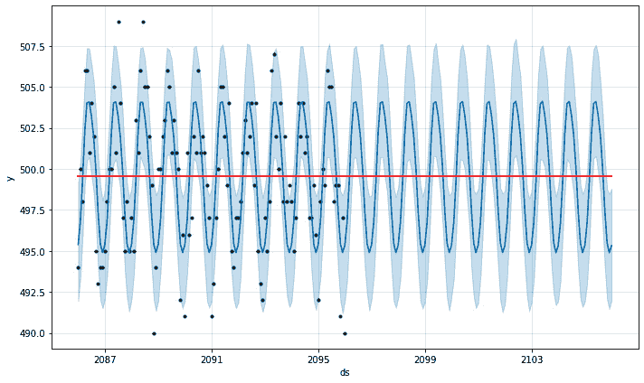

图 7.13 – 稳定的狼群人口预测，增长平稳

无论我们预测得多远，趋势都将保持稳定。在这个例子中，Prophet 模型的唯一变化来自年度季节性，因为我们没有添加假日，也没有包括每日或每周的季节性。

这三种增长模式——线性、逻辑和平坦——在行业中是最常用的，几乎可以覆盖大多数分析师将看到的几乎所有预测任务。然而，有时分析师需要自定义增长模式。尽管这不是最简单的任务，但 Prophet 确实具有接受任何你可以数学定义的增长模式的能力。

# 创建自定义趋势

开源软件的一个关键优势是任何用户都可以下载源代码，并根据他们的使用案例对软件进行自己的修改以更好地适应。尽管几乎所有常见的时间序列都可以用 Prophet（分段线性、分段逻辑和平坦）中实现的三个趋势模式进行适当建模，但可能存在需要不同于提供的趋势模型的情况；由于 Prophet 是开源的，因此相对容易创建你需要的任何内容。但有一个快速警告：这只是在概念上相对容易。从数学上讲，它可能相当复杂，你必须具备扎实的软件工程技能才能成功修改代码。

让我们看看一个可能的例子。考虑一家小型服装零售商，它为每个季节更新其收藏品：

```py
df = pd.read_csv('../data/clothing_retailer.csv')
df['ds'] = pd.to_datetime(df['ds'])
```

每日销售额高度依赖于当前可用的收藏品的热度，因此趋势大多是平稳的，但每三个月当新收藏品发布时，会看到戏剧性的阶梯式变化：

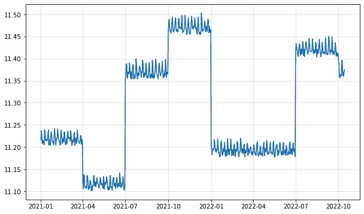

图 7.14 – 服装零售商的每日销售额（以千为单位）

我们有新季节两周的数据，我们想要预测本季节剩余的销售情况。Prophet 可用的趋势模型都无法很好地捕捉这一点。我们最好的选择是使用默认的增长模型，线性。不过，让我们看看当我们尝试这样做会发生什么：

```py
model = Prophet()
model.fit(df)
future = model.make_future_dataframe(76)
forecast = model.predict(future)
fig = model.plot(forecast)
add_changepoints_to_plot(fig.gca(), model, forecast)
plt.show()
```

结果预测有太多的戏剧性变化点：

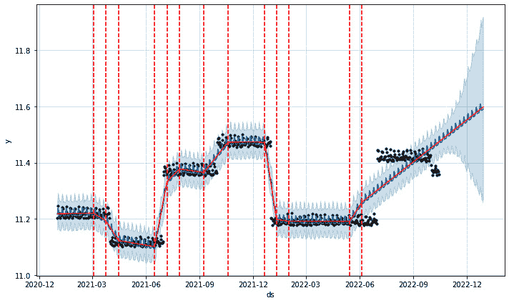

图 7.15 – 不合适的线性预测

预测期间的置信区间爆炸，因为模型预计有更多的潜在变化点；它还忽略了数据在前三个月已经平稳的事实，预测了一个荒谬的持续曲棍球棒增长速率。一个平稳增长模型会更好，但在 Prophet 中实现时，它无法处理变化点。

这里的过程变得复杂，并且非常依赖软件工程技能。我们需要创建一个自定义趋势模型。简而言之，必要的代码需要从 Prophet 的源代码中复制 Prophet 类，该类位于`forecaster.py`文件中，在[`github.com/facebook/prophet/blob/main/python/prophet/forecaster.py`](https://github.com/facebook/prophet/blob/main/python/prophet/forecaster.py)。然后进行一些修改。特别是，这个新类（在我们 GitHub 仓库的示例中，我们称之为`ProphetStepWise`）继承了基类`Prophet`的所有方法和属性，并在几个方面进行了修改：

1.  它修改了原始`Prophet`类的`fit`函数，以初始化新的步进增长模式。

1.  它创建了一个新的函数，`stepwise_growth_init`，类似于当前的`flat_growth_init`函数，它使用平稳增长初始化趋势。当前的`flat_growth_init`函数将偏移参数设置为历史值的平均值，但这个新的`stepwise_growth_init`函数考虑变化点的位置，并在每个变化点之间应用不同的偏移参数。

1.  它创建了一个新的函数，`stepwise_trend`，类似于现有的`flat_trend`函数，它评估新的步进趋势。

1.  它修改了现有的`sample_predictive_trend`函数，将`'flat'`增长模式重新定义为使用新的`stepwise_trend`函数。

1.  最后，它修改了现有的`predict_trend`函数，当设置`'flat'`增长时，使用`stepwise_trend`而不是现有的`flat_trend`函数。

所有这些步骤的完整代码太长且定制化，无法在此完全重现，但所有代码都位于我们之前链接的 GitHub 仓库中的`Chapter07`文件夹内。

一旦创建了新的`ProphetStepWise`类，我们就可以像使用标准的`Prophet`类一样使用它来做出预测。在这里，我们将增长声明为`'flat'`，并手动提供每个变化点的位置（变化点都与每个新服装季节的第一天相吻合——但现在不必担心这些细节；变化点将在下一章中讨论！）：

```py
model = ProphetStepWise(growth='flat',
                        changepoints= ['2021-04-01',
                                       '2021-07-01',
                                       '2021-10-01',
                                       '2022-01-01',
                                       '2022-04-01',
                                       '2022-07-01',
                                       '2022-10-01'])
model.fit(df)
future = model.make_future_dataframe(76)
forecast = model.predict(future)
fig = model.plot(forecast)
add_changepoints_to_plot(fig.gca(), model, forecast, threshold=0.00);
```

结果预测看起来更加合理！

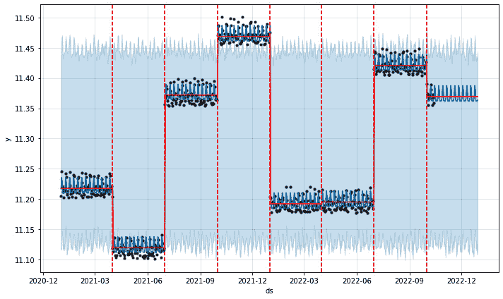

图 7.16 – 我们的新步进趋势

然而，你会注意到，尽管对整个季节的预测相当准确，但置信区间却非常宽泛。为了解决这个问题，你还需要修改`prophet.stan`文件。由于本书只使用 Python 代码，因此 Stan 模型中的这些更改不在此讨论范围之内。然而，对于那些感兴趣的人来说，官方 Prophet GitHub 仓库中有一个很好的逐步趋势模型示例，其中包含了正确实现的 Stan 更改，你可以通过以下链接查看：[`github.com/facebook/prophet/pull/1466/files`](https://github.com/facebook/prophet/pull/1466/files)。实际上，本节中的大部分代码都来自那个示例。

# 摘要

在本章中，你了解到本书前几章构建的模型都具备线性增长的特点。你学习了逻辑函数是如何被开发出来以模拟人口增长的，然后学习了如何在 Prophet 中通过模拟 1995 年狼群重新引入黄石公园后的增长来实施这一功能。

在 Prophet 中，逻辑增长可以模拟为增加到饱和极限，称为*上限*，或者减少到饱和极限，称为*下限*。最后，你学习了如何模拟平坦（或无增长）趋势，其中趋势在整个数据期间固定为一个值，但季节性仍然允许变化。在本章中，你使用了`add_changepoints_to_plot`函数来在你的预测图上叠加趋势线。

选择正确的发展模式很重要，尤其是在进行未来预测时。在本章中，我们查看了一些例子，其中错误的发展模式很好地拟合了实际数据，但未来的预测却变得非常不切实际。最后，我们看到了创建自定义趋势模型的例子。这个过程是本书中介绍的最先进的技术，但也是最强大的，因为它展示了如何利用 Prophet 的开源代码来完全定制该包以满足你的特定需求。在下一章中，你将了解所有关于变化点的内容以及如何使用它们来获得对趋势线更多的控制。
