# 8

# 影响**趋势变化点**

在开发 Prophet 的过程中，工程团队认识到现实世界的时间序列经常会在其轨迹上表现出突然的变化。作为一个基本的线性回归模型，Prophet 如果不能特别小心，将无法捕捉这些变化。然而，你可能会在之前的章节中注意到，当我们绘制示例中的预测成分时，趋势线并不总是完全直线。显然，Prophet 团队已经开发了一种方法，使 Prophet 能够捕捉线性模型中的这些弯曲。这些弯曲的位置被称为**变化点**。

Prophet 将自动识别这些变化点，并允许趋势适当地适应。然而，如果你发现 Prophet 在拟合这些变化率时欠拟合或过拟合，你可以使用几个工具来控制这种行为。在本章中，我们将探讨 Prophet 的自动变化点检测，以帮助你理解在默认设置下模型中发生了什么。然后，我们将探讨如果你需要更精细地控制变化点过程，你可以使用的两种进一步的技术。

具体来说，在本章中，你将学习以下内容：

+   自动趋势变化点检测

+   正则化变化点

+   指定自定义变化点位置

# 技术要求

本章示例的数据文件和代码可以在[`github.com/PacktPublishing/Forecasting-Time-Series-Data-with-Prophet-Second-Edition`](https://github.com/PacktPublishing/Forecasting-Time-Series-Data-with-Prophet-Second-Edition)找到。

# 自动趋势变化点检测

趋势变化点是你时间序列中趋势成分突然改变斜率的位置。这些变化点出现的原因很多，这取决于你的数据集。例如，Facebook（现在称为 Meta）开发了 Prophet 来预测其自身的业务问题；它可能会对每日活跃用户数量进行建模，并在新功能的发布上看到趋势的突然变化。

由于规模经济允许航班价格大幅降低，航空公司乘客数量可能会突然变化。大气中二氧化碳的趋势在过去数万年中相对平坦，但在工业革命期间突然发生了变化。

在前几章中，我们通过 Divvy 数据集的工作看到，大约两年后增长放缓。让我们更仔细地看看这个例子，以了解自动变化点检测。

## 默认变化点检测

Prophet 通过首先指定可能发生变化点的潜在日期数量来设置变化点。然后 Prophet 会计算这些点中每个点的变化幅度，试图在尽可能保持这些幅度最低的情况下拟合趋势曲线。你可以通过调整`changepoint_prior_scale`来调整 Prophet 的灵活性。你可能已经从之前的内容中认识到了这个参数——季节性和节假日都有自己的正则化先验尺度。

使用变化点，它有几乎相同的效果，我们将在本章后面探讨它。在 Prophet 的默认设置中，大多数这些潜在变化点的幅度几乎为零，因此对我们的趋势曲线的影响可以忽略不计。

要开始我们的代码，我们需要进行必要的导入并加载我们的 Divvy 数据。在这里，我们将使用每日的 Divvy 数据。我们还将导入`add_changepoints_to_plot`函数，这个函数在第七章 *控制增长模式* 中被介绍过；我们将在这里大量使用它：

```py
import pandas as pd
import matplotlib.pyplot as plt
from prophet import Prophet
from prophet.plot import add_changepoints_to_plot
df = pd.read_csv('divvy_daily.csv')
df = df[['date', 'rides']]
df['date'] = pd.to_datetime(df['date'])
df.columns = ['ds', 'y']
```

使用默认设置，Prophet 将在数据的第一个 80%中均匀放置 25 个潜在变化点，在确定它们的幅度之前。在这个 Divvy 数据中，这 25 个位置由图中垂直虚线表示：


图 8.1 – 带有潜在变化点位置的 Divvy 数据

现在，让我们拟合我们的 Prophet 模型。在这个步骤中，Prophet 将确定在每个潜在变化点应用哪些幅度。从前几章的例子中，我们已经学会了如何使用乘法季节性来建模这些数据，并稍微降低年季节性的傅里叶阶数。当你实例化我们的 Prophet 对象时，你可以在这里看到这一点。

拟合模型后，我们将不带`future` DataFrame 指定地调用`predict`，这将导致 Prophet 构建其模型并预测历史值，但不进行任何预测：

```py
model = Prophet(seasonality_mode='multiplicative',
                yearly_seasonality=4)
model.fit(df)
forecast = model.predict()
```

在这一点上，我们将绘制模型。我们使用`add_changepoints_to_plot`函数来查看显著变化点的位置。正如你在*第七章* *控制增长模式*中看到的，`add_changepoints_to_plot`函数需要三个必需的参数。第一个参数是要添加变化点的坐标轴。我们指定在第一次绘图调用中创建的`fig`，使用`gca()`方法，代表*获取当前坐标轴*。第二个参数是我们的模型，第三个参数是我们的预测。

在*第七章* *控制增长模式*中，我们使用了`cp_linestyle`参数来强制 Prophet 不绘制变化点，只绘制趋势；在这个例子中，我们不会使用这个参数：

```py
fig = model.plot(forecast)
add_changepoints_to_plot(fig.gca(), model, forecast)
plt.show()
```

现在，你应该可以看到 Prophet 确定这 25 个潜在变化点中有 5 个实际上是显著的。这些 5 个在这个图中用垂直的虚线表示：

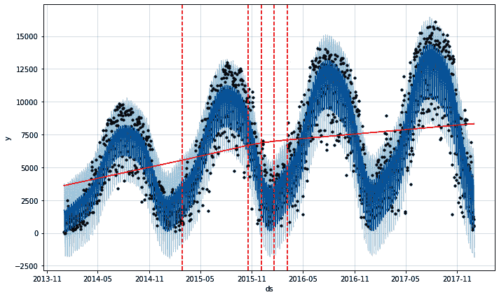

图 8.2 – 分配变化点图

从第一个变化点很难看出趋势实际上是在弯曲，但从接下来的四个来看，就非常明显了。在每个这些变化点，趋势的斜率被允许变得较浅。

每个 25 个潜在变化点的幅度都存储在`model.params`中，但这些值已经被归一化，因此它们的绝对值没有意义，但它们的相对幅度是有意义的。模型参数存储在一个字典中，其中`'delta'`是变化点幅度的键。让我们看一下：

```py
print(model.params['delta'])
```

在这个模型中，这些变化点幅度应该与*图 8.3*中显示的变化点幅度相似。因为这些数字是使用优化过程而不是确定性方程计算出来的，所以你可能会得到不同的确切值，但指数应该是大致相同的：

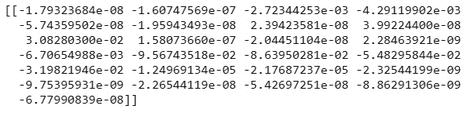

图 8.3 – 分配变化点幅度

这些幅度中的大多数都有一个指数为-08 或-09，这意味着在标准记数法中，你应该将小数点向左移动那么多位，8 位或 9 位，也就是说这些数字非常接近零。你可以通过绘制它们来可视化这些幅度。在这里，我正在叠加趋势线和所有变化点的显著变化点：

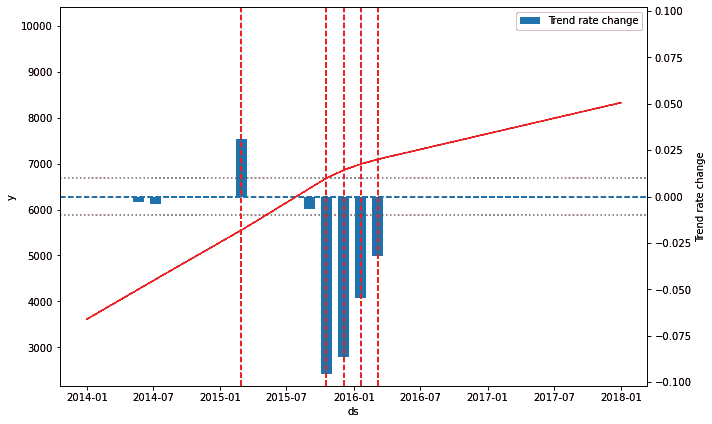

图 8.4 – 变化点幅度

让我稍微解释一下这个图。左侧的轴与*图 8.2*中的*y*轴相同。趋势线——从左下角穿过到右上角的实线——绘制在这个轴上。垂直的虚线是 Prophet 识别出的显著变化点。实心的垂直条是变化点幅度；这些绘制在右侧的轴上，**趋势** **变化率**。

再次，这些幅度中的大多数几乎为零，所以它们没有出现在图上。水平的虚线表示变化点幅度为零。从这里向上延伸的条表示具有正幅度的变化点，趋势向上弯曲，从这里向下延伸的条表示具有负幅度的变化点，趋势向下弯曲。

`add_changepoints_to_plot`函数只会绘制绝对幅度大于 0.01 的变化点。两条水平虚线位于幅度水平 0.01 和-0.01；Prophet 只绘制超出这些限制的幅度。你可以使用函数中的`threshold`参数更改此阈值；例如，`add_changepoints_to_plot(fig.gca(), model, forecast, threshold=0.1)`将阈值扩大到上限为`0.1`和下限为`-0.1`。这只会影响绘图可视化，不会影响你的实际变化点。

因此，*图 8.4*展示了 Prophet 成功地将几乎所有潜在变化点的影响降至不显著。总共有八个变化点的幅度足够大，可以在我们的图表中看到，但其中只有五个超过了 Prophet 的绘图阈值（尽管它们对趋势的小幅度影响仍然存在）。尽管可能难以看出，唯一正值的变化点，位于**2015-01**之后，确实使趋势在该点变得更加陡峭。在其他显著变化点的位置，趋势变得较为平缓。

上述示例展示了 Prophet 在完全自动设置下的变化点行为。在下一节中，我们将探讨你可以使用的杠杆来获得对变化点的一些控制。

# 正则化变化点

如前所述，Prophet 默认将在时间序列的前 80%中放置 25 个潜在变化点。要控制 Prophet 的自动变化点检测，你可以在模型实例化期间修改这两个值，使用`n_changepoints`和`changepoint_range`参数。例如，将潜在变化点的数量更改为`5`的操作如下：

```py
model = Prophet(seasonality_mode='multiplicative',
                yearly_seasonality=4,
                n_changepoints=5)
```

这导致在数据的前 80%中出现了五个均匀分布的潜在变化点，如图所示：

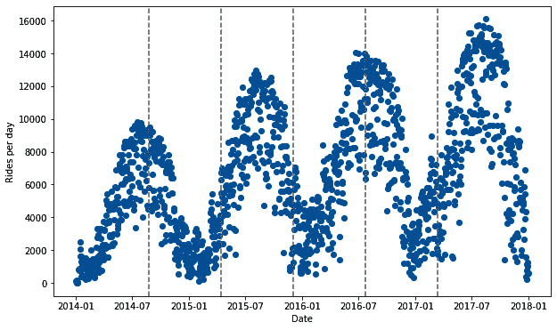

图 8.5 – 五个潜在变化点

或者，你也可以强制所有 25 个变化点不在数据的前 80%，而是在前 50%：

```py
model = Prophet(seasonality_mode='multiplicative',
                yearly_seasonality=4,
                changepoint_range=.5)
```

现在，我们看到潜在变化点仅位于数据范围的前半部分：

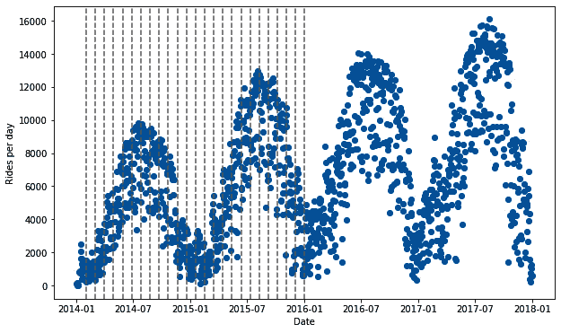

图 8.6 – 数据前 50%的变化点

当然，你可以在一个模型中使用这两个参数。在两种情况下，重要的是要记住，你并没有指示 Prophet 在这些位置放置变化点，只是*潜在*变化点。它仍然会尝试将尽可能多的它们强制为零，并且确实在这两种情况下都留下了与使用默认值构建的示例几乎相同的预测趋势。

此外，请记住 Prophet 从不会在将来放置变化点。这就是为什么默认情况下，Prophet 只会使用前 80% 的数据——以防止它选择一个错误的变化点，因为即将到来的数据点很少，无法纠正其错误。然而，Prophet 在创建不确定性区间时，会估计未来的变化点；因此，具有许多大型变化点的模型也会看到更大的预测不确定性。

通常，在序列的非常晚的时刻设置变化点有更高的过拟合可能性。为了了解原因，我构建了 Divvy 数据的两年预测，并强迫 Prophet 只选择一个变化点，放置在数据的最后两个月。在十一月，由于冬季使用量下降，每天的骑行次数迅速下降。Prophet 看到了这种下降，并决定这必须是一个负趋势变化，因此相应地调整了其未来的预测：

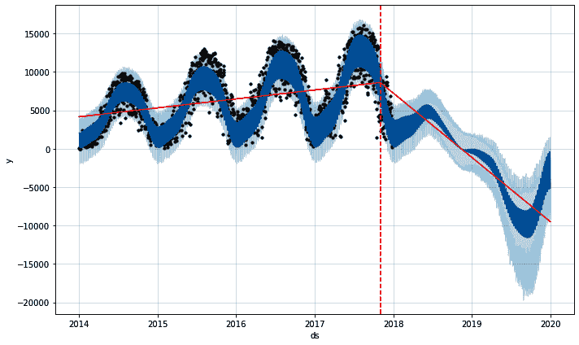

图 8.7 – Prophet 过度晚的变化点

我可能并不比 Prophet 更擅长预测未来，但我对 Prophet 在这种情况下未来的预测不太准确有很高的信心。

说了这么多，你通常不需要经常调整变化点的数量或变化点范围。默认值几乎总是非常合适。如果你发现 Prophet 要么过度拟合，要么欠拟合变化点，最好是通过对正则化进行控制。就像我们在 *第五章*，*处理季节性*，和 *第六章*，*预测节假日影响* 中所做的那样，我们使用 **先验尺度** 进行正则化。

如果你还记得 *第五章*，*处理季节性*，和 *第六章*，*预测节假日影响*，先验尺度用于控制 Prophet 的灵活性。一个过于灵活的模型有很大的可能性会过度拟合数据，即除了真实信号外，还建模了太多的噪声。一个不够灵活的模型有很大的可能性会欠拟合数据或无法捕捉到所有可用的信号。

默认情况下，`seasonality_prior_scale` 和 `holidays_prior_scale` 都被设置为 `10`。然而，`changepoint_prior_scale` 默认设置为 `0.05`。但就像季节性和节假日先验尺度一样，增加这个值会使趋势更加灵活，而减少它会使趋势不那么灵活。合理的值通常在 `0.001` 到 `0.5` 之间。

让我们拟合并绘制一个将 `changepoint_prior_scale` 增加到 `1` 的模型。这应该会使 Prophet 的趋势具有很大的灵活性：

```py
model = Prophet(seasonality_mode='multiplicative',
                yearly_seasonality=4,
                changepoint_prior_scale=1)
model.fit(df)
forecast = model.predict()
fig = model.plot(forecast)
add_changepoints_to_plot(fig.gca(), model, forecast)
plt.show()
```

在这里，我们可以看到 Prophet 的趋势现在过度拟合了：

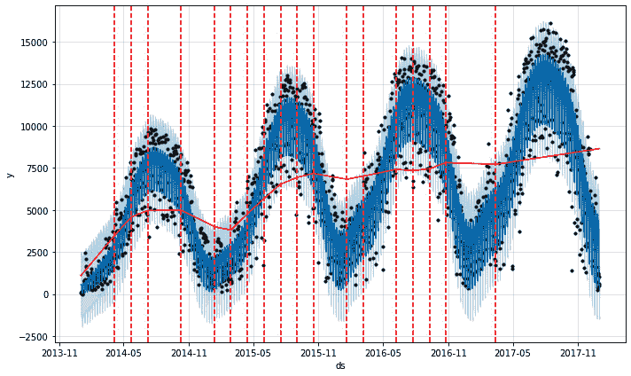

图 8.8 – Prophet 过度缺乏趋势正则化

当我们放宽正则化参数时，Prophet 开始过度拟合趋势线，并试图捕捉一些年度季节性。我们给了 Prophet 太多的趋势拟合灵活性。

另一方面，现在让我们看看当我们过于严格地进行正则化时会发生什么。在这个例子中，我们将`changepoint_prior_scale`从默认值降低到`0.007`：

```py
model = Prophet(seasonality_mode='multiplicative',
                yearly_seasonality=4,
                changepoint_prior_scale=.007)
model.fit(df)
forecast = model.predict()
fig = model.plot(forecast)
add_changepoints_to_plot(fig.gca(), model, forecast)
plt.show()
```

减少了`changepoint_prior_scale`后，以下图表显示 Prophet 的趋势不够灵活：

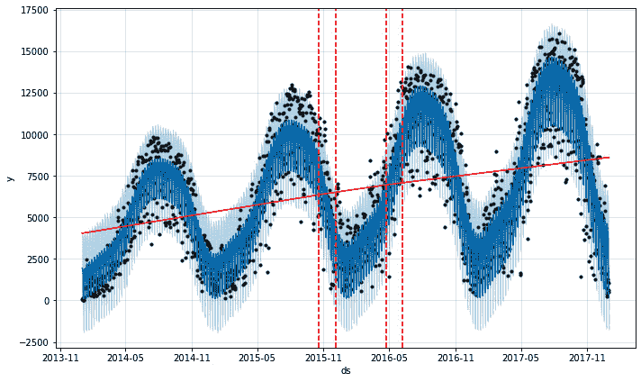

图 8.9 – 过度趋势正则化的 Prophet

将本章开头的*图 8.9*与*图 8.2*进行比较。尽管*图 8.9*中变化点的位置与*图 8.2*大致相同，但我们使用的正则化水平过度限制了变化点的幅度。*图 8.2*中明显的弯曲现在在*图 8.9*中变得如此微小，以至于难以辨认。

控制 Prophet 中的变化点还有另一种方法：通过指定您自己的自定义变化点位置。我们将查看一个新的数据集来探讨这个主题，足球运动员詹姆斯·罗德里格斯的 Instagram 账户`@jamesrodriguez10`。这些数据是在 2019 年 11 月 22 日收集的。

# 指定自定义变化点位置

詹姆斯·罗德里格斯是一位哥伦比亚足球运动员，他参加了 2014 年和 2018 年的世界杯。他在两次世界杯中都表现出色，但在 2014 年因进球数超过其他任何参赛球员而赢得了金靴奖。我选择他的账户，因为它展示了一些非常有趣的行为，这些行为在没有变化点的情况下将非常难以建模：

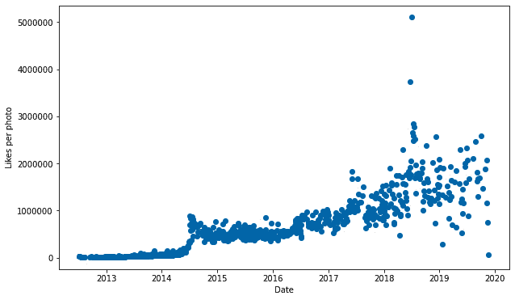

图 8.10 – 詹姆斯·罗德里格斯每日 Instagram 点赞数

他 Instagram 帖子获得的点赞数随着时间的推移逐渐增加，但有两个值得注意的峰值，分别在 2014 年和 2018 年夏季，那时他正在参加世界杯。很明显，2014 年的峰值导致了显著的趋势变化。他在世界杯期间帖子获得的点赞数大幅增加，之后有所下降，但没有回到之前的基线。在此期间，他获得了大量新粉丝，并且每篇帖子的点赞数持续增加。

类似地，在 2018 年，他的个人资料在世界杯期间夏季的点赞量大幅上升，但比赛结束后并不清楚是否存在显著的趋势变化。此外，你还可以看到 2017 年夏季的另一个峰值。在那一年 7 月 11 日，罗德里格斯宣布他已与拜仁慕尼黑队签约。我们也将这一事实纳入我们的模型中。

为了模拟这种行为，我们首先需要考虑世界杯的特殊事件以及新球队的公告。我们将通过为它们创建自定义假日来实现这一点。其次，我们需要考虑趋势变化；我们将通过设置自定义趋势变化点来完成这项工作。数据中似乎没有太多季节性，为了简化我们的模型，我们将指示 Prophet 不要拟合任何。

我们已经完成了必要的导入，因此我们首先需要将数据加载到我们的 Prophet DataFrame 中：

```py
df = pd.read_csv('instagram_jamesrodriguez10.csv')
df['Date'] = pd.to_datetime(df['Date'])
df.columns = ['ds', 'y']
```

接下来，我们需要为特殊事件创建一个 DataFrame。这与你在*第六章*，*预测假日效应*中学习到的相同程序。在这种情况下，我们需要添加三个事件：2014 年世界杯、2017 年为拜仁慕尼黑签约，以及 2018 年世界杯。每个事件必须在`'holiday'`列中有一个名称，在`'ds'`列中有一个日期。

两次世界杯都持续了 31 天，因此我们将指定第一个日期并将`'upper_window'`设置为`31`。我们将`'lower_window'`保持为`0`。对于最后一个事件，与一支新球队签约，我们将添加两周的窗口，以便慷慨地假设签约拜仁慕尼黑的影响将持续影响他的帖子几天：

```py
wc_2014 = pd.DataFrame({'holiday': 'World Cup 2014',
                       'ds':pd.to_datetime(['2014-06-12']),
                       'lower_window': 0,
                       'upper_window': 31})
wc_2018 = pd.DataFrame({'holiday': 'World Cup 2018',
                       'ds›:pd.to_datetime(['2018-06-14']),
                       'lower_window': 0,
                       'upper_window': 31})
signing = pd.DataFrame({'holiday': 'Bayern Munich',
                       'ds':pd.to_datetime(['2017-07-11']),
                       'lower_window': 0,
                       'upper_window': 14})
special_events = pd.concat([wc_2014, wc_2018, signing])
```

现在，我们需要指定我们的自定义变化点。我们可以简单地传递 Prophet 一个日期列表。任何 pandas 识别为有效日期时间格式的日期都可以使用：

```py
changepoints = ['2014-06-12',
                '2014-07-13',
                '2017-07-11',
                '2017-07-31',
                '2018-06-14',
                '2018-07-15']
```

对于这些特殊事件中的每一个，我们在事件开始时添加一个潜在变化点，在事件结束时添加一个。这个决定的理由是我们需要考虑到每张照片的点赞数将遵循某种趋势，这种趋势与账户的关注者数量成比例，直到趋势被特殊事件打破。

在特殊事件期间，关注者的数量将以更高的速度增加，因此每张照片的点赞数也将增加，需要一条新的趋势线。在活动结束后，新关注者的增加速度将显著放缓，因此我们需要在这个时候添加第三条趋势线——结果是三条不同的趋势斜率，由两个趋势变化点将它们连接起来。

在创建特殊事件并确定潜在变化点后，我们接下来实例化 Prophet 对象，同时传递这些特殊事件和变化点。在这个例子中，我们将季节性设置为乘法。这是计数数据，如*第五章*，*处理季节性*中讨论的那样，计数数据通常是乘法的。

然而，在这个案例中使用加性季节性是有道理的——有可能增加的点赞数来自因世界杯而访问罗德里格斯个人资料的未关注者，但他们并没有随后关注，这将是一个加性效应，而不是来自当前关注者的活动增加，这可能是由于 Instagram 的算法性信息流排序，这将是一个乘性效应。在任何情况下，以下程序都是相同的。

我们决定通过去除季节性来简化我们的模型，因此我们将`yearly_seasonality`和`weekly_seasonality`都设置为`False`。你可能想知道为什么我们没有季节性还要设置`seasonality_mode`——这是因为`seasonality_mode`也会影响节假日。 

最后，我们将变化点的先验尺度设置为`1`，因为我们想稍微放松一下正则化（你可以自由地尝试这个数字；我发现默认值对这份数据来说过于严格），并将我们的变化点列表传递给`changepoints`参数：

```py
model = Prophet(seasonality_mode='multiplicative',
                holidays=special_events,
                yearly_seasonality=False,
                weekly_seasonality=False,
                changepoint_prior_scale=1,
                changepoints=changepoints)
```

我们现在将继续像之前的例子一样，通过调用模型的`fit`和`predict`方法来继续。在这个例子中，我们不是在预测未来，但如果你想要预测，你需要添加任何你预期的未来特殊事件。最后，让我们绘制我们的预测和成分图来观察结果：

```py
model.fit(df)
forecast = model.predict()
fig = model.plot(forecast)
add_changepoints_to_plot(fig.gca(), model, forecast)
plt.show()
fig2 = model.plot_components(forecast)
plt.show()
```

首先，是我们的预测：

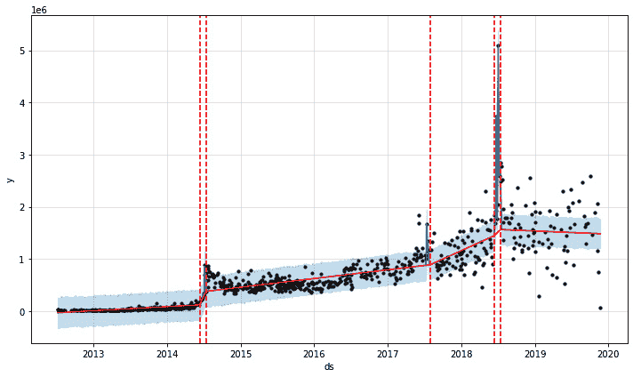

图 8.11 – 詹姆斯·罗德里格斯预测

尽管我们在模型中做了简化，但趋势与数据拟合得非常好。现在，让我们看看我们的成分图：

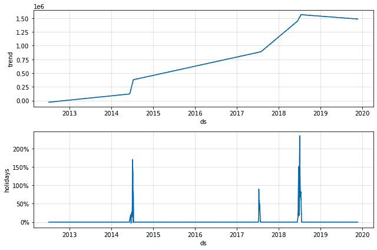

图 8.12 – 詹姆斯·罗德里格斯成分图

从**节假日**图中可以看出，两次世界杯都为詹姆斯·罗德里格斯账户的每篇帖子带来了大约 200%的点赞数增长。当他签约拜仁慕尼黑时，他看到了一个更加适度但仍然令人印象深刻的点赞数翻倍。趋势线反映了这些变化。

在每次世界杯期间，他在帖子上的点赞数迅速增加，而点赞数的增长速度放缓，但保持了比事件之前更高的基线。Prophet 确定在每个世界杯前后需要两个变化点，但发现新球队的公告只对趋势产生了显著的影响。

处理变化点位置还有另一种方法，这是一种混合技术，将自定义变化点与 Prophet 的默认行为相结合。使用这种方法，你会创建一个均匀分布的变化点网格，就像 Prophet 默认做的那样，并用你的自定义变化点来丰富它。让我们再举一个例子来看看如何做到这一点。

在 Prophet 的源代码中，有一个创建潜在变化点网格的类方法，称为 `set_changepoints`。如果在 `fit` 命令中没有指定变化点，这个方法会在自动调用。以下函数模仿了 `set_changepoints` 方法，使我们能够在 Prophet 类外部创建潜在变化点网格。我们还需要导入 `numpy` 库来在这个函数中使用：

```py
import numpy as np
def set_changepoints(df, n_changepoints=25,
                     changepoint_range=0.8):
    df = df.sort_values('ds').reset_index(drop=True)
    hist_size = int(np.floor(df.shape[0] * \
                             changepoint_range))
    if n_changepoints + 1 > hist_size:
        n_changepoints = hist_size - 1
        print(‹n_changepoints greater than number of '+
              'observations. Using {}.'\
              .format(n_changepoints))
    if n_changepoints > 0:
        cp_indexes = (np.linspace(0,
                                  hist_size - 1,
                                  n_changepoints + 1).
                      round().astype(np.int))
        changepoints = df.iloc[cp_indexes]['ds'].tail(-1)
    else:
        # set empty changepoints
        changepoints = pd.Series(pd.to_datetime([]),
                                 name=›ds›)
    return changepoints
```

这个函数需要三个参数。第一个是你的 Prophet DataFrame，包含 `'ds'` 和 `'y'` 列。第二个参数是要创建的变化点数量，默认值与 Prophet 使用的相同，为 `25`，第三个参数是变化点范围，同样默认为 Prophet 的 `0.8`。这将返回一个包含潜在变化点位置的 pandas 系列对象。你只需将你的自定义变化点追加到它上面即可。

使用这个函数，让我们在数据的第一个 80% 中创建五个等间距的变化点，然后使用前一个例子中的六个特殊事件变化点丰富自动变化点：

```py
changepoints = set_changepoints(df, 5, 0.8)
new_changepoints = pd.Series(pd.to_datetime(['2014-05-02',
                                            '2014-08-25',
                                            '‹2017-07-31',
                                            '2018-06-14',
                                            '2018-06-04',
                                            '2018-07-03']))
changepoints = changepoints = pd.concat([changepoints, 
new_changepoints])
changepoints = \
changepoints.sort_values().reset_index(drop=True)
```

现在，让我们重新创建我们之前的模型，但这次，发送我们新的变化点列表：

```py
model = Prophet(seasonality_mode='multiplicative',
                holidays=special_events,
                yearly_seasonality=False,
                weekly_seasonality=False,
                changepoint_prior_scale=1,
                changepoints=changepoints)
model.fit(df)
forecast = model.predict()
fig = model.plot(forecast)
add_changepoints_to_plot(fig.gca(), model, forecast)
plt.show()
```

现在，我们可以看到 Prophet 使用的变化点比以前多得多：

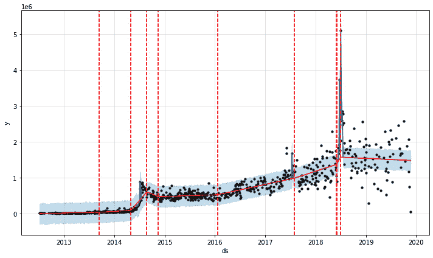

图 8.13 – 使用混合自动/手动潜在变化点的预测

我们还有一个非常灵活的趋势线；也许它过度拟合了。这是你需要，作为分析师，去确定的事情，但作为如何将你自己的自定义变化点与自动选择的潜在变化点网格结合的演示，这个例子就足够了。

# 摘要

在本章中，你学习了如何通过使用变化点来控制趋势线的拟合。首先，你使用了 Divvy 数据来查看 Prophet 如何自动选择潜在变化点位置，以及你如何通过修改默认的潜在变化点数量和变化点范围来控制这一点。

然后，你学习了一种更稳健的方式来通过正则化控制 Prophet 的变化点选择。就像季节性和节假日一样，变化点通过设置先验尺度进行正则化。接着，你研究了詹姆斯·罗德里格斯在 Instagram 上的数据，学习了如何在 2014 年和 2018 年世界杯期间及之后如何对他收到的每条帖子的点赞数进行建模。最后，你学习了如何将这两种技术结合起来，并用你自定义的变化点丰富自动选择的潜在变化点网格。

在下一章中，我们再次查看 Divvy 数据，但这次，我们将包括温度和天气条件等附加列，以便学习如何在 Prophet 预测中包含额外的回归因子。
